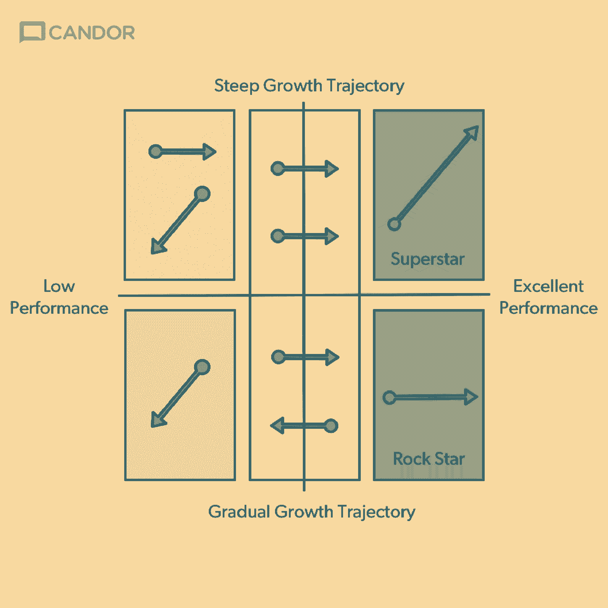
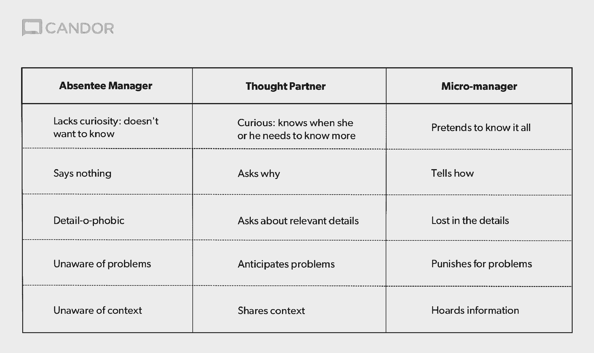

# 警告:这不是你爷爷的人才规划

> 原文：<https://review.firstround.com/warning-this-is-not-your-grandfathers-talent-planning>

谷歌。苹果。Dropbox。推特。如果有人曾在巅峰时期帮助大型公司打造非凡团队，那就是**[金斯科特](http://www.kimmalonescott.com/ "null")** *。在她职业生涯的某个时刻，她承认她认为自己是世界上最擅长创建惊人团队的人之一。直到苹果公司的一名高管向她展示了在她的职业生涯中，她是如何系统性地低估了团队中一些最重要的人物的价值。更糟糕的是，她没有按照自己的人性生活。*

这是一大杯水，即使对一个已经成为激进坦率的最伟大拥护者之一的人来说也是如此。斯科特是 **[Candor，Inc.](https://www.radicalcandor.com/ "null")** 的联合创始人，她的职业生涯围绕着创造一个没有废话的区域，在那里人们热爱他们的工作并一起工作。她从管理的各个角度都看到了这一点:作为创始人(Candor，Inc .和 Juice 软件)、顾问(Dropbox、Twitter、 [Shyp](http://www.shyp.com/ "null") 、 [Qualtrics](http://www.qualtrics.com/ "null") )、讲师(苹果大学)和运营负责人(谷歌)。那么，这位苹果高管说了什么？

受到她在第一轮 CEO 峰会上的讲话的启发，斯科特分享了她对管理的顿悟——以及真正建立一支一流团队所需的心态和框架，从解读高绩效员工的独特属性和激励开始。

# 如何区分你的星星

有很多术语来描述团队中的优秀表现者:10 倍工程师、销售奇才、成长忍者。“超级明星”和“摇滚明星”也被随意使用，但斯科特的任务是重新使用它们——不是作为人们的标签——而是了解人们在任何给定时间点的模式。“当我与苹果高管交谈时，她试图传达一个人在超级明星模式和摇滚明星模式之间的区别——这些术语已经被挪用，失去了意义。但谈到团队建设，她觉得理解他们不同的角色和需求非常重要。

她的意思是:

**巨星模式**:你团队里要改变一切的人；负责[的熊彼特变化](https://en.wikipedia.org/wiki/Creative_destruction "null")；团队成长的力量和源泉。

**摇滚明星模式**:你团队里不想要老板饭碗的人；非常擅长自己的工作，如果老板不搞砸的话，他会坚持做下去并钻研多年；团队优秀和稳定的力量和源泉。

超级明星模式和摇滚明星模式的区别引起了斯科特的共鸣。“当她告诉我这件事时，我开始想到几十个曾经为我工作过的人。斯科特说:“有一个人很特别，那就是德里克，他是我多年前领导的一家初创公司的第一个客户支持员工。“顾客喜欢德里克——他们只是崇拜他。他们会送他自制的油炸圈饼！忘了 NPS 评分吧。对一个成功的顾客的真正考验是:你会收到邮件吗？这家伙有很多烘焙食品。”

巨星模式的人想要一个他们可以改变的世界。那些摇滚明星模式的人寻求一个他们可以稳定的世界。你两样都需要。

随着公司的发展，斯科特自然而然地给德里克提供了一个担任领导职务的机会。“我问他是否愿意领导支持团队。德里克拒绝了。他对我说，‘不，我真正的抱负是成为一名百老汇演员。“我真正想要的是能够每天下午 5 点下班，这样我就可以去百老汇以外的地方拍摄电影，””斯科特说这就是我犯错误的地方。我放弃了德里克。就在那一刻，我彻底放弃了他。我出去雇用了我认为我应该雇用的人:这个超级雄心勃勃的家伙，他真的一点也不关心客户支持。他真正想做的是成为首席执行官。但这就是你建立高绩效团队的方式，对吗？你过度雇佣了。"

没过多久德里克就冲进了我的办公室。“他启动了[安·兰德](https://en.wikipedia.org/wiki/Ayn_Rand "null")和[源头](https://en.wikipedia.org/wiki/The_Fountainhead "null")，说你需要你的建筑师来改变世界，但你也需要人们来打开灯。为此，你需要优秀的电工。他接着说，你不想雇佣一个 C+级的架构师，你想雇佣一个 A+级的电工。“他的比喻对我来说有点道理，但德里克并不是团队的领导者，我雇的另一个人才是，所以我让他按自己的方式去做。很快，不可避免的事情发生了。德里克不干了，自制甜甜圈不再供应，NPS 下降，收入也跟着下降。

由于没有认识到 Derrick 对团队的贡献，Scott 没有建立一个高绩效的团队。“这个例子让我意识到，我们倾向于思考人才管理的方式是完全错误的。性能是一个关键因素，区分出色的性能和低下的性能非常重要。这很好，”斯科特说。“但通常当我们想到所谓的‘人才规划’时，我们会用‘潜力’这个词。”‘潜力’是*确切地说*用错了词。"

“潜力”的问题在于，当你把某人标记为低潜力时，你就立刻贬低了你的摇滚明星。“相反，用成长轨迹这个词。陡峭的增长轨迹和渐进的增长轨迹没有好坏之分。它只是代表了我们职业生涯的不同阶段，”斯科特说。“当你这样看待你的团队时，你会发现人们可能处于五种不同的模式。他们可以处于巨星模式。他们可以处于摇滚明星模式。或者以各种方式达到或退出这些模式。”

斯科特见过一些伟大的球队，也是其中的一员，他们并不都是超级巨星和摇滚明星。“如果你看这个图表，你的团队中的大多数人，当然，会做得很好，但不是很好的工作[用黄色矩形标出]，”斯科特说。“总会有一些令人困惑的人，他们本应该做得很好，但却没有做到(橙色矩形)。当然，还有一些你应该解雇的人，但你不是(红色矩形)。”

在你开始把你的团队写在这些桶里之前，让这个教训深入人心:不要使用永久记号笔。“对于管理者来说，这一点我怎么强调都不为过。没有永久的标记。斯科特说:“不要把人们的名字写在盒子里，然后把它们留在那里。“不要用这个作为个人的标签。用这个来理解一个人在某个时刻想要什么。记住，这些都是模式，不是个性标签。利用这一点来了解为你工作的人的梦想是什么，并帮助他们朝着他们的梦想前进一步，而不是你的梦想。他们的野心，*不是*你的野心”

这不是你爷爷的人才规划。简单又强大。应该一年做一次。

# 如何使用这个框架

Scott 建议领导者与他们的经理和团队合作，每年填写一次这个框架。“花时间帮助团队中的每一个人以他们想要的方式成长。我不知道有哪个领导人会不同意这一点，但我知道很多人说他们太忙了，抽不出时间。所以这非常快，”斯科特说。“基本上，你需要做的就是创建一个共享文档，让每个直接向你汇报的人把他们的名字放入最能描述他们感觉自己所处状态的框中。然后校准。然后列出一个简短的清单，列出你要为每个人做的事情，以帮助他们适当成长。”

你会对优秀业绩有不同的定义，陡峭的增长轨迹变成渐进的增长轨迹，或者这些定义如何应用到你的公司。“利用这个机会确保你们都在同一页上。一旦每个人都被校准，花几分钟时间——确保你团队中的每个人都这样做——写下你要为每个直接下属做的一些明确的行动。为你的每个直接下属的*做这件事，并确保他们为他们的每个直接下属的*做这件事。如果你做绩效评估，不要把这个练习和绩效评估混为一谈。”**

管理人员在每种模式下为员工采取的具体行动不仅为不同员工的发展扫清了道路，还在公司文化中留下了重要的印记。方法如下:

**巨星模式。**对于那些处于超级明星模式的人——那些将推动你的团队成长的人——你想给他们提供的是新的挑战。你想让他们不断学习。你最不想做的事就是压扁它们。

“在我加入谷歌后不久，拉里·佩奇给我讲了一个故事，当时他有一份暑期工作，他的老板给了他一个项目，这个项目本该占用他整个夏天的时间。“当然，拉里知道如何在 12 小时或更短时间内完成这项工作，”斯科特说。“他的老板说，‘哦，不，不，不。’他想打断拉里的翅膀。我们要用我们一贯的方式去做。你得花一整个夏天在上面。这对拉里来说是巨大挫折的来源。"

当佩奇向斯科特讲述这个故事时，她可以看出这一刻对他的影响有多大。

“拉里告诉我，他不希望谷歌的任何人有那种经历。斯科特说:“不要剪掉超级明星的翅膀，我认为这也是谷歌如此适合工作的部分原因。”“他们在确保帮助员工成长和定义晋升途径方面做得非常好。他们在教练身上投资很多。对于那些可能没有谷歌那么多预算的小公司来说，仍然有可能找到能教你的超级明星新东西并且领先他们几年的人。这将有助于你留住他们。”

最后，记下超级明星的一生。“确保你找到了接班人，因为你常常无法留住你的超级明星。他们离开你的时候会比找到你的时候更好。斯科特说:“当你得到它们的时候，充分利用它们，但不要以为它们会永远留在你身边，因为它们通常不会。“无论你做什么，不要混淆管理和增长。不要自动管理-跟踪处于超级陡峭增长轨迹上的人。通常，特别是对于工程师来说，他们最不想做的事情就是成为一名经理，但这并不意味着他们不在一个超级陡峭的增长轨道上。确保你将合适的挑战交给合适的人。”

Kim Scott

**摇滚明星模式**。摇滚明星模式的人想要的是牧场，不是跑道。你不是给他们一条起飞的路线，而是为他们的工作创造空间。他们需要的是做他们出色工作的自由，而不是晋升的道路，因为这可能会分散他们的注意力。斯科特说:“读一读[的《彼得原理](https://en.wikipedia.org/wiki/Peter_principle "null")》，这本书提醒你一些本该显而易见但往往不为人知的事情:不要提拔某人做他们不擅长的工作——如果他们擅长做某件事，不要提拔他们超出他们的能力水平。”。

此外，在生活中有些时候，人们不希望 T4 获得晋升。“不要在人们处于摇滚明星模式时提拔他们。这个建议经常遇到巨大的阻力。我知道这看起来像是在肚子上打了一拳，或者像是我告诉你要惩罚你的摇滚明星。我没有，”斯科特说。以诺贝尔奖得主诗人 T.S .艾略特为例。在他成为诗人谋生之前，他是伦敦劳埃德社的职员。他的老板说过一句著名的话，“我看不出有什么理由，到时候——请注意，到时候——埃利奥特可能不会成为分行经理助理。但是你知道吗？T.S .埃利奥特根本不在乎成为伦敦劳合社的助理经理。他想要的是——如果他的老板想留住他的话——多提前一个小时回家，这样他就有更多的时间写诗。德里克也是如此。他想要目前的工作，而不是一份“更大”的工作。"

这里经理的选择不仅仅是一个摇滚明星的角色。斯科特说:“不要创建一个如此痴迷于晋升和地位的组织，以至于摇滚明星留下来会感到羞辱。”“让他们成为内部专家。你的摇滚明星热爱他们的手艺，并且非常擅长。他们比公司里的任何人都强，他们能帮助把中间的人带过来。他们可以帮助将他人的良好表现转化为优秀表现。如果他们对教学感兴趣，那就让他们去教吧。”

最后，给他们尊重。“不要对你的摇滚明星做我对德里克做的事。我对德里克做的不仅仅是对他不好。不仅对我的团队和整个公司不利，”Scott 说。“但这对我也不好。我希望我能早点知道这一点，因为曾经有一段时间，我走上了一条更加渐进的成长轨迹。2008 年，我发现自己处于以下状况:矮、老、怀双胞胎。这是一次高危妊娠。就在我职业生涯的那个时刻，Twitter 的一名董事会成员拜访了我，问我是否愿意参加 Twitter 下一任首席执行官的竞选。

“现在，在这个提议的一年前，我可能会为了这个机会砍掉我的左臂，但现在我不确定我是否想要它。我征求了医生的意见。她说，好吧，问问你自己这个问题:工作和你孩子的心肺哪个更重要？很容易回答的问题，对吧？”斯科特说在你攻击我的医生是反女权主义者之前，让我提醒你:这是一次高风险的怀孕。有很多怀了双胞胎的女人，她们可以毫不迟疑地向前冲。但那不是我的情况。"

斯科特选择留在谷歌。“我对自己做出的决定感觉很好。这对我的家庭和我的生活来说显然是正确的，但即使如此，我仍然对这个决定对我的职业生涯产生的影响感到矛盾。直到我了解了超级明星模式和摇滚明星模式，我才明白这不仅对我有好处，对我在谷歌的团队也有好处。我的团队获得了更好的机会，我们的工作为谷歌做出了巨大贡献，”斯科特说。“往前跳，对我也有好处，因为当我躺在床上休息时，我意识到我更关心管理而不是每次点击成本。我没有成为 Twitter 的首席执行官，而是辅导了 Twitter 的首席执行官。这给了我时间去写《激进的坦白》,并最终共同创立了一家初创公司 Candor，Inc

底线是，这是可行的，但前提是你尊重你的摇滚明星——并敏锐地平衡你对团队发展和稳定的需求。早期和高增长的创业公司将会超过超级明星，但他们需要在成长过程中加入摇滚明星，这是有保证的。

我不止一次看到过球队摇滚明星不够的时候轮子掉大巴。平衡增长和稳定。

**中档栏目**。那么，你会为那些只是在做适当工作的人做些什么呢？“我要断言，没有 B 级球员这种东西。没有人有能力做一般的工作。“每个人都有能力做出色的工作，”斯科特说。“永远不要认为一个人平庸。首先，你向他们提供彻底的坦诚或良好的反馈——包括表扬和批评。给你的摇滚明星一个机会，教他们如何做出色的工作。用“延伸项目”挑战那些工作令人满意的人，这些项目给了他们腾飞或失败的机会。如果他们继续做适当的工作，你将不得不进行一些艰难的对话，为他们找到另一个他们最终能够超越的角色。”

**低性能，陡轨模式**。那些在左上象限的人应该做得很好，但是因为某些原因失败了。“我称之为“照镜子象限”。作为一名经理，这时别人的糟糕表现可能只是你的错。你可能让他们扮演了错误的角色。这是最常见的原因，”斯科特说。“你可能给了某人太多太快。创始人和首席执行官通常在职业生涯中成长得非常快，有时会错误地认为其他人也能像他们一样。他们可能做不到。”

在这种情况下，问自己以下问题:

你有足够明确的期望吗？

你需要给这些人明确的反馈吗？

他们需要一个新经理吗？

这些问题应该触及问题的核心。“有时候人们就是和老板合不来。他们是否有暂时的个人问题，你可以帮助他们解决？斯科特说:“也许这只是不适合。“有时候，人们就是不太适合一家公司。”

**低绩效，渐进成长轨迹模式。**会有人过得不好，没有好转。“这些人呢？斯科特说:“忽视他们的低绩效对这些人来说是不好的。“他们有能力在某个地方做一些伟大的事情，如果你不把这些人带走，这对他们和你团队中其他工作出色的人都非常不公平。去做就是了。”

# 高绩效员工的最佳经理类型

对于团队中表现最好的人，经理们犯的最大错误之一就是不要挡他们的路。“他们知道自己雇佣了有才华的人，但不想对他们进行微观管理。斯科特说:“所以他们只能靠边站，让高绩效员工做自己的事情。“这就像认定建立美好婚姻的最佳方式是嫁给对的人，然后避免和他共度哪怕一秒钟。这就像我现在打电话给我的丈夫说，'我今晚不回家吃饭了，以后也不回来了。'你在抚养这些孩子方面做得很好，我不想对你进行微观管理。那不会让他——或者我们的家庭——很高兴。"

也不要这样对待为你工作的人。他们想为你工作，因为他们想和你一起工作*。“把你的优秀员工放在第一位。从字面上来说，在脑海中——在你的思想中。你想成为的是**的思想伙伴**。这不仅仅是一个抽象的头衔，比如“思想领袖”这意味着带着好奇心去研究他们的工作，并以平等的态度去讨论它。他们知道何时需要知道更多。你考虑得很周到。“你是合伙人，”斯科特说。从报道的角度来看，你可能仍然是他们的经理，但是，对于这些高绩效员工来说，你帮助管理他们的好奇心，而不是他们的工作。"*

如果你不是一个思想伙伴，当你管理高绩效员工时，你可能很容易陷入另外两种困境:缺席经理或微观经理。“你显然不想做一个缺席的管理者，但你也不想做一个微观的管理者。缺席经理缺乏好奇心。斯科特说:“他们真的不想知道，而微观管理者当然假装什么都知道。

参考这个简单的框架，确保你作为高层管理人员处于正确的位置:

# 这一切的开始

建立一个优秀的团队从一些非常简单的事情开始，不是一个大公司的流程，而是你已经知道如何去做的事情:在基本的人类水平上了解人们。作为一名领导者，这是你工作中最重要的部分之一，也是最愉快的部分。了解你团队中的每个人想要什么样的成长轨迹，以及他们工作的动力是什么，这是具体的第一步。

“人们往往低估了花时间去了解激励他们的人的因素以及了解他们的长期梦想的重要性。斯科特说:“他们没有真正理解团队中的每一个人，而是就下一次晋升进行了令人不满意的谈话，因此他们无法提出职业行动计划，为自己的工作提供背景和意义。

“有三个不同的职业对话——生活故事、梦想和职业行动计划——是一个更好的行动方案。斯科特说:“这将有助于你判断谁处于超级明星模式、摇滚明星模式，以及最重要的是，谁在改变模式。”。“总的来说，这三次对话，每个人都直接向您汇报，将帮助您平衡增长和稳定，以便您的团队可以扩展。这会让你的工作有意义，有助于建立你职业生涯中最好的关系，并让顾客不再光顾烘焙食品。”

*摄影由* *[迈克尔乔治](http://home.michaelgeorgephoto.com/ "null")* *。*