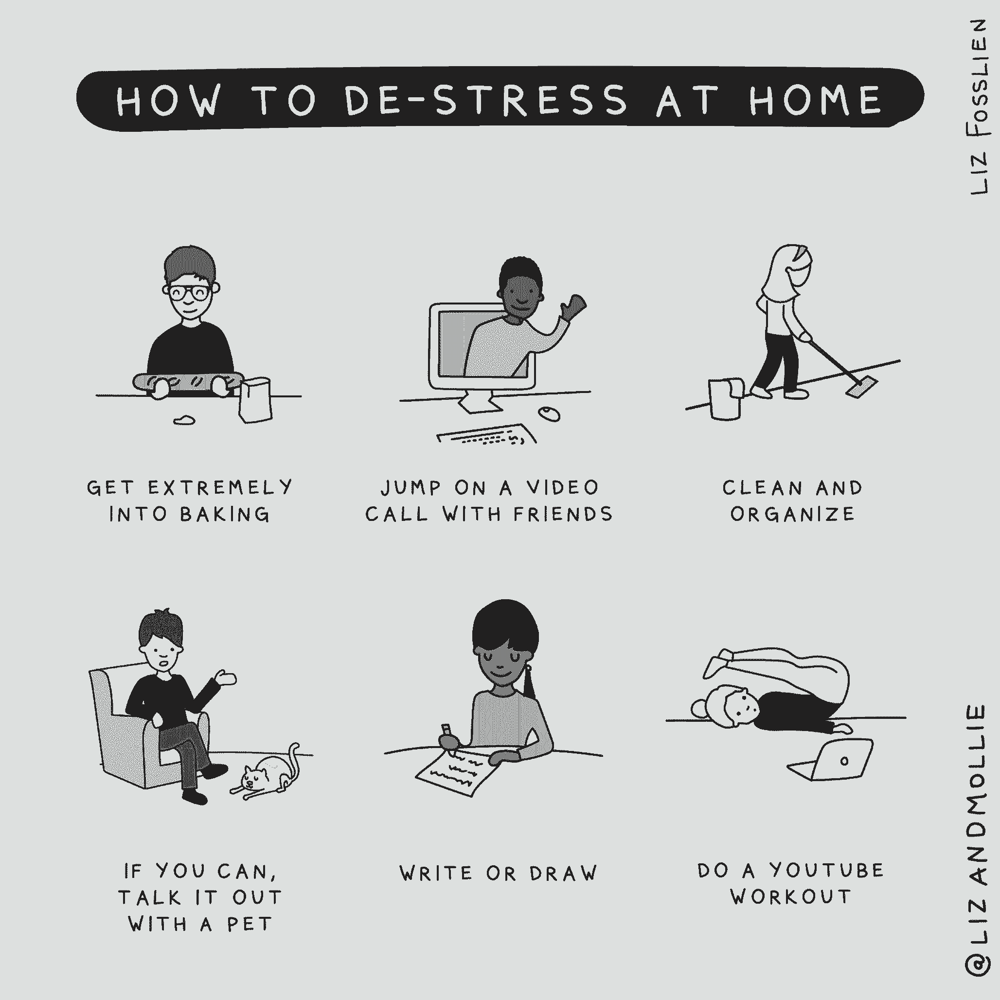

# 经受危机的情感风暴——个人贡献者和管理者的战术指南

> 原文：<https://review.firstround.com/weathering-the-emotional-storms-of-a-crisis-a-tactical-guide-for-individual-contributors-and-managers>

## 介绍

当你第一次登上 lizandmollie.com 时，迎接你的是一幅可爱的插图:一只大象、狮子、树懒和猫头鹰围坐在会议桌旁。一只动物很无聊，另一只在大叫，另一只看起来很害怕和焦虑——这一切都是为了描述你在团队会议中可能遇到的各种情绪。这幅画的下方有一行醒目的标语:“工作的未来是感性的。”仅从 2020 年的前几个月来看，这种情绪似乎是彻头彻尾的预言。

“我们从未在如此短的时间内经历过如此多的不确定性。担心你自己、你的朋友和你的家人的身体健康的健康成分增加了另一个情绪压力层，” **[利兹·福斯莱恩](https://www.fosslien.com/ "null")** 说，她是这个网站背后的同名二人组的一员。

“我们都在实时发现，在工作时间，我们根本无法封锁自己的情绪。在我们加入 Zoom call 之前，没有一个整洁盒子可以把它们藏起来。如果你的整个职业生涯都在试图在办公室门口控制自己的情绪，或者保持冷静的“专业”外表，这可能会感觉像一个未知的领域。令人难以置信的压倒性和可怕。但是也有好的一面:**在工作中变得如此脆弱是前所未有的。你有压力、焦虑、孤立和恐惧——但其他人也一样。**”

Fosslien 有丰富的经验和行为科学来支持她。她和她的合著者莫丽·韦斯特·达菲在过去五年的大部分时间里都在研究团队，会见专家，研究工作中情绪背后的科学，最终完成了他们的优秀著作《[没有痛苦的感觉:在工作中拥抱情绪的秘密力量》福斯伦还在](https://www.amazon.com/No-Hard-Feelings-Emotions-Succeed/dp/0525533834/ "null")**[Humu](https://humu.com/ "null")** 担任内容负责人，这是一家鼓励人们养成更好工作习惯的公司。她还在各种渠道分享她的作品和插图，这就是为什么你可能已经看到她令人愉快的画作在互联网上流传。(正如她最近在 Twitter 上指出的，演员约瑟夫·戈登-莱维特[分享了她更受欢迎的插图之一](https://twitter.com/fosslien/status/1232875810144411650?s=20 "null")。)

Liz Fosslien, bestselling author and Head of Content at Humu

在去年夏天的回顾中，我们有幸分享了这项工作的一个窗口。Fosslien 提出了利用你的情绪如何能够促进你的职业发展的案例，他整理了一份指南，为处理我们在工作场所遇到的七种“致命”情绪提供了有益的指导，包括焦虑、嫉妒、冲突和缺乏归属感。(如果你还没有读过她的评论文章，或者拿起一本她和莫丽的书，我们强烈建议把这两本书都加入你的阅读书库。)

鉴于她帮助我们解决情绪问题的诀窍似乎比以往任何时候都更有意义，我们决定(实际上)再次与 Fosslien 坐下来，收集她的建议，以度过我们都面临的情绪风暴。像往常一样，她的建议就像一碗温暖的鸡汤，令人难以置信的安慰，正是我们所需要的。

在这次独家采访中，Fosslien 根据她的书的研究和她在 Humu crafting helied behavioral "[nudges](https://humu.com/how-nudges-work/ "null")"的日常工作，提供了一个情感自我护理指南，帮助你度过我们快速变化的环境。无论你是一个希望带领团队走出不确定性的初创公司创始人，还是一个渴望指导你的团队的经理，或者只是一个希望保持头脑清醒的人，这些合理的建议将有助于铺平前进的道路。

# 个人贡献者如何拥抱情感:

《没有痛苦的感觉》涵盖了广泛的话题，从[如何在远程团队中创造归属感](https://sloanreview.mit.edu/article/how-to-create-belonging-for-remote-workers/ "null")并降低冲突，到[如何评估你的情绪风格](https://www.lizandmollie.com/emotional-expression "null")并给出令人满意的反馈。“我们喜欢说这是一个在工作中不压抑你的情绪而不让它们失控的指南，”Fosslien 说。“连接所有这些话题的主线是，不要因为感觉到事情而责备自己，而是倾听你情绪背后的需求。”

但这并不意味着这些指导方针会无缝地转化为我们都曾陷入的情感混乱。“最近我和一个朋友开玩笑说，这基本上是认知行为疗法的[挑战信念技术](https://cpt.musc.edu/resource_info/challenging_beliefs.pdf "null")不起作用的唯一场景。她说:“你应该写下让你感觉糟糕的信念，然后通过写下支持或反对的证据来‘挑战’它们。”“它在很大程度上是为了帮助你明白，你正在纠结于不太可能出现的最糟糕的情况——当我们正在经历一个看起来非常接近最糟糕的情况:全球疫情和前所未有的经济衰退时，这并没有什么帮助。所以我发现我的很多正常的心理学工具都没有用，”

那么现在什么是有用的呢？下面，Fosslien 分享了一些应对这一时刻的策略:

# 试着缓和这种紧迫性——不要强加判断。

“就我个人而言，呆在家里的头几天是一片模糊。我和我的搭档试图说服我们的父母呆在家里，然后协调给他们买足够维持一段时间的食品杂货。最重要的是，我去参加工作会议，同时适应在家工作，并试图找出我的项目中有多少需要改变方向。现在，几个星期过去了，我发现一切都被夸大了。我更容易被电子邮件激怒。Fosslien 说:“我以一种我通常不会的方式解读一条松散的信息。

“如果你发现自己的反应——或许反应过度——类似，后退一步，提醒自己:’**这可能与特定的人或工作环境无关。这是因为我对未来感到焦虑和恐惧。回应之前先打个拍子。给这种情绪贴上标签，明确它的来源。她说:“不要评判你的感受，但不要让它影响你们的关系。”**

试着说出你的感受，在争吵发生前化解它们，无论是和你的同事、共同创始人还是你的另一半。“最近，我和我的伴侣进行了一次谈话，我说:‘我们都处于极度情绪化、高度紧张的状态。我们还将一起生活在一个狭小的空间里。我们每个人都要随时待命。因此，我认为值得注意的是，这是一个异常紧张的时期，我们需要给彼此一个假定的好处，用爱和意图来对待每一次谈话。"

这似乎是一个直截了当的建议，但是 Fosslien 发现这是值得强调的。"**现在你生活的很多方面都有很多紧急的事情**。你需要弄清楚在家教育孩子的后勤工作，并检查你所爱的人。也许你的搭档被解雇了。甚至获得食物也是一种紧张的经历。她说:“把同样的精力带到工作中很容易。“你的公司可能正在改变优先考虑的事情，甚至可能会改变重点。你使用的每一个数码工具都会收到信息和通知。但重要的是要记住，虽然一切看起来都很忙碌和紧急，但你不需要立即回复每一封电子邮件。如果你觉得自己情绪失控或陷入高度紧张状态，那就睡一觉，在早上稍微平静一点的时候回复不太重要的邮件。或者如果可以的话，花时间做 10 次跳跃运动或者绕着街区走一圈。”

不要让你生活中某一部分的紧迫感渗透到其他每一个领域。现在并不是所有事情都很紧急。有些邮件可以等。

# 给自己空间，但不要把结构扔出窗外。

Fosslien 观察到，我们中的许多人都感觉失去了平衡，无法集中注意力，这就是为什么大多数“生产力黑客”都失败了。“我在 Twitter 上经常看到这样的话:'*你不是在家工作；危机期间，你在家里，试图工作*。收件箱零似乎是一个愚蠢的目标。我发现我的动力时好时坏。“有几个下午，我觉得自己无法集中注意力或做任何事情，”她说。但是现在已经是晚上 8 点了，我觉得我已经准备好处理我一直在拖延的那个项目了。我精力充沛，最后工作了几个小时。认清潮起潮落，给自己重新调整的空间。放弃在传统的朝九晚五的时间段里你将会——或者必须——一直高效的想法。"

虽然给自己留一个广阔的空间很重要，但佛斯林发现，在你能做到的地方增加一些结构是有帮助的。“当你放松了工作和生活的界限，例行公事就会被抛到九霄云外。我经常在下午 3 点发现自己穿着睡衣，意识到自己还在用笔记本电脑，还没吃饭。这不是完成事情或保持理智的秘诀。**你不能用空杯子倒酒**

这里有两个简单的建议来平衡你需要的空间和你可能渴望的日常生活:

**写下三件事**。“我们在 Humu 使用这个程序，它现在真的很适用。每天早上，写下你今天最想完成的三件事。如果晚上放松一下对你来说更好，问问自己:明天我想完成哪三件事？这些目标可以作为你的路标，”她说。“我给自己的框架是:如果我今天做好了这三件事，那么我就不会觉得自己有点迷糊，或者停下来午休烤点东西。我可以为我需要的空间腾出空间，同时仍然感觉自己完成了一些事情。”

提醒自己投入运动。“我惊讶地发现，我是多么努力地想从椅子上站起来，”佛斯林说。“人们很容易忘记锻炼或整天活动身体，但这非常重要，不仅对你的健康，对你的工作表现也是如此。她说:“一项研究发现，在考试前有短暂休息的丹麦学生比那些没有休息时间的同龄人得分高得多。以下是如何安排的:“我的合著者莫丽对[的暂停应用](https://apps.apple.com/us/app/time-out-break-reminders/id402592703?mt=12 "null")深信不疑，她会安排提醒来周期性地休息以改变姿势、散步或做些伸展运动。研究还表明，如果你承诺做某事，你就更有可能做到。在 Humu，我的一位同事发起了一个锻炼承诺主题，我们每人回复一个当天要做的锻炼，然后在日历上安排时间去做。

# 战斗隔离

如果你感到孤独，你并不孤单。"[我们所有人现在都沉浸在悲痛之中，即使只是失去了正常的生活。“在这种时候感到孤独是很正常的，”她说。“分享你的经历，投资人际关系可以让你感觉更好。只要知道其他人也有类似的情绪，就会感到很欣慰。”](https://hbr.org/2020/03/that-discomfort-youre-feeling-is-grief "null")

但这不仅仅是在你的日程表上塞满电话。Fosslien 说:“你现在可以主持一个虚拟的快乐时光，但每个人离开时可能仍然会感到孤立无援。“谈论你的感受，询问人们的感受，并真诚地相互问候，而不只是以一种肤浅或敷衍的方式，这很重要。”

这是一个如此重要的时刻，让我们感到我们在这里是为了彼此。如果我们能找到创造性的方式来给予支持——而不仅仅是回复电子邮件或视频通话——我们将开始冲破笼罩在我们周围的孤立迷雾。

为了战胜孤独和寂寞的感觉，学习以下有意义的签到技巧:

**提供向上选项。**“我们都听到这样的建议，我们应该互相‘检查’。但是我们没有听到的是，对于不同的人来说，这看起来确实不同。一天开始的时候，我给我的一个朋友发了一条短信，说，“嘿，我很乐意登记入住。“你想在三点钟谈，看看我们是应该只发短信、打电话，还是视频聊天？”“选择一个平台是一个微妙但重要的区别，”Fosslien 说，“因为毫无疑问，到下午的时候，我已经在屏幕上呆了一整天，并与我前面的朋友进行了更多的虚拟聊天。所以我们决定电话聊天。"

保持你正常的社交活动。“在 Humu，我们已经创建了一种选择加入的方式来保持我们与队友一起吃午餐的常规。“如果你输入自己的名字，你就会被随机分配到公司的另外三个人那里，一起吃一个小时的午餐，只是为了叙叙旧和聊天，”福斯林说。“如果你过去常常在回家的路上给妈妈打电话，或者每周日和朋友一起去练瑜伽，那就试着在日历上为这些日常活动留出空间，虚拟地去做。”

**寻找其他照顾对方的方式。**“人们真的在寻找其他方式向对方展示自己。“工作中有人在 Slack 上发帖说没有卫生纸了，我的几个住在附近的同事主动提出把他们的一些放在门阶上，”福斯林说。“你怎么能出现在你生命中的人面前？也许你可以通过叫外卖来支持你最喜欢的当地餐馆。从附近的书店订购一本书，然后寄给朋友。尝试引入一些活动，而不是仅仅从你的工作环境中接听这些私人电话。当你绕着街区走的时候，带上你的耳机去外面接电话。当你们尝试同样的食谱时，彼此面对面交流。”

# 用这个框架缓解压力和焦虑。

这些情绪可能看起来很相似，而且都纠缠在一起，但福斯林建议将它们分开。“压力是短期的。杂货店会有你需要的东西吗？当你的孩子在家里跑来跑去的时候，你怎么能完成今天的工作项目呢？焦虑更长远。这是对未来的担忧，例如，你是否会有工作或生病。她说:“每个人现在都感受到了这两种情绪。

“在书中，我们建议用一个框架来理清它们。**花 15 分钟列出你担心的所有事情。然后给每个人贴上“内在”或“外在”的标签，看看你的压力和焦虑的来源是什么。超越在你的控制之外。内在是你可以采取行动的问题。你无法控制宏观经济状况。但你可以重新审视你的预算，为你什么时候去购物和买什么制定一个计划，或者学习一些对你的工作或求职有帮助的新东西。”**

把你能控制的和你不能控制的分开。这是减轻你肩上负担的一个小方法。

# 驾驭包围裁员的情绪。

不幸的是，我们中有太多的人认识朋友、家人或同事，即使他们已经受到裁员的影响。虽然高管们可以从[如何规划](https://a16z.com/2020/03/31/planning-and-managing-layoffs/ "null")和[如何度过裁员](https://firstround.com/review/how-to-lead-and-rally-a-company-through-a-layoff/ "null")中获得资源，但等式另一边的情感风暴更具破坏性。以下是 Fosslien 在人际层面上解决这一难题的建议:

**如果你的朋友失业了**，确保你不要进入“修复”模式。“许多没有受到裁员影响的人最终会感到无助甚至内疚，因为他们很幸运仍然有工作，”福斯林说。“有时他们以无益的方式引导或表达这一点。我想立即帮助人们开始思考下一步，并提供简历帮助，但这往往太快了。你无法让他们觉得这是一次积极的经历。还不如听听，让他们为失去而悲伤。伸出手来表示你的关心，但是要准备好让他们还不想和你说话。此时此刻，最重要的是感同身受。她说:“考虑给他们发一封电子邮件或短信，明确告知他们不必回复。

这同样适用于受到影响的**员工**。“永远不要把它当成你自己。是的，看到一个朋友和同事被裁，很难受。但是他们的情况更糟。当他们准备好了，尽你所能帮助他们站稳脚跟。她说:“向他们开放你的社交网络，浏览简历，成为一个支持系统。“更有策略的是，你还可以让他们知道你有多喜欢和他们一起工作，并添加具体的例子。你不能改变已经发生的事情，但是你可以帮助他们记住所有让他们与众不同的事情，让他们觉得自己做了有价值的工作。在保持联系时，无论如何都要避免“可能发生的事情”。像‘如果我们当初能留住你，这个项目会变得如此神奇’这样的话只会让他们感觉更糟。”

**最后，如果你个人受到裁员的影响**，Fosslien 的主要建议是给自己专门的时间去悲伤，带着悲伤的情绪坐下来。“你需要时间来处理，否则它会以不健康的方式出现。考虑设定一个“截止日期”或时间，当你开始制定下一步的计划时。她说:“不幸的是，鉴于目前的经济环境，你可能需要让自己的悲痛期比平时短一些，但重要的是，如果可能的话，不要跳过这一步。”

“一旦你准备好重新露面，不要害怕寻求帮助或者接受别人的邀请把你介绍给别人。虽然羞耻、恐惧和骄傲可能会阻碍你，但提醒自己没什么好羞耻的，开始把自己放出去吧。利用这个机会，当你考虑新的角色和公司时，认真思考你喜欢和不喜欢的工作。”

*第一轮注意:如果你被解雇了，看看我们在这里策划的这些* *[资源](https://www.notion.so/firstround/Hiring-Resources-for-Candidates-10f59de692e845a3a331d77880380ad3 "null")* *。一些第一轮支持的创业公司仍在招聘，我们的人才团队已经准备好帮助你获得他们的支持。如果你在一家仍在积极招聘的公司工作，并希望与新的候选人取得联系，我们也在这里为你收集了一些有用的资源。*

# 用同理心领导:给管理者的战术提示

[经理的工作总是充满挑战](https://books.firstround.com/management/ "null")，但是变化、不确定性和物理距离的加入使得工作变得更加困难。“现在对领导人来说，这是一个微妙的平衡动作。你需要为你所有的员工着想，同时给他们空间。Fosslien 说:“你担心的是保持文化和凝聚力，同时仍然试图在关键项目上向前推进。”

“简单的事实是，在危机期间，人们会更关心自己的亲人，而不是工作。作为经理，确保你没有给他们增加不必要的压力。她说:“记住，你如何带领人们度过这场危机，将会产生持久的影响。“这将决定你能够吸引和留住的人才水平。几年后，**我预计很多应聘者会在面试过程中问:“你或你的组织是如何应对 COVID 危机的？**’”

另一个挑战是，许多经理——尤其是那些没有任何远程管理经验的经理——很快意识到他们是多么依赖物理邻近的工具。“我们很少有机会互相称赞、分享最新进展、了解个人生活或跳进会议室快速讨论问题。她说:“这些非正式的互动很关键，而且更难远程操控。”

底线？付出比你认为需要的更多的努力去接触、联系和关心你的团队。

下面，Fosslien 分享了她对经理人目前可能面临的四个常见挑战的建议:

# 1.平衡团队合作，同时给每个人空间:

“人们在情感上和家里发生的事情上确实处于不同的位置。也许他们独自生活。也许他们正在支持一个刚刚失业的伴侣。有些人家里有年幼的孩子，需要很多关注，而其他人则帮助他们从大学回家的孩子重新适应。有些人正在照顾年迈的父母，或者因为父母离家太远而无法照顾他们，这是一种压力。因此，尽管虚拟快乐时光或游戏之夜是保持团队联系的一种令人惊叹的方式，但一切都应该是自愿的，”福斯林说。

给人们一个退出的机会。“现在比任何时候都更需要一种尺寸，它绝对不适合这里的所有人。一些人渴望互动，另一些人没有或不能适应他们忙碌的日子。**如果人们没有出现，假定他们是无辜的——并确保他们知道他们有这个权利**。你不想在他们的压力源列表中增加社会压力或对他们被如何看待的担忧。在你的团队会议上明确提出这一点，让他们知道任何人选择退出都完全没问题，如果他们有困难，他们可以随时与你一对一地交谈。”

**增加一些官方休假**。尽一切努力平稳地切换到远程工作，为您的团队创造更多空间。在 Humu，我们推出了周五半天制，让每个人都有时间去想出新的生活规律，看看家人，或者花几个小时无所事事来减压。“很明显，没有人能在那段时间安排会议，”Fosslien 说。

从长远来看，给人们放一天假没什么大不了的——我们都在努力寻找晕船的感觉。

**向宠物问好**。正如大多数人所承认的，这不是在家工作的标准条件，所以大多数团队会议会比平时有更多的中断。Fosslien 说:“Humu 的领导团队已经非常清楚地表明，我们都知道在幕后工作和生活的混乱融合。“如果你的孩子或宠物突然出现在屏幕上，或者你身后有骚动，都没关系。做你需要做的事情，不要觉得你必须匆匆结束电话。你不允许道歉！我们都会打声招呼，然后告诉你错过了什么。”

**非结构化时间抽查**。另一个趣闻是检查以确保你的直接下属的日程表不会太满。“非会议区至关重要。Fosslien 说:“我们在日常工作中有很多休息时间，从喝咖啡、吃午饭到通勤，甚至是上厕所。“在你的[一对一会议](https://firstround.com/review/managers-take-your-1-1s-to-the-next-level-with-these-6-must-reads/ "null")期间检查一下，看看他们一周的日程安排如何。如果他们的盘子看起来太满了，看看你能移动或取消什么，给他们更多的空间。通过主动在自己的日程表上安排大量时间来树立良好的行为榜样，并鼓励你的直接下属也这样做。”或者考虑安排 25 或 50 分钟的会议，而不是通常的 30 分钟或 1 小时，以确保每个人(包括你)在虚拟电话之间都有时间快速休息。

# 2.与您的团队沟通:

“一方面，像往常一样向前推进让人感觉五音不全。但另一方面，作为领导者，你的工作仍然是通过规划和沟通前进的道路来提供稳定。在你做的每一件事里，你都想确保你在减少焦虑，而不是增加焦虑。“这需要大量的情感工作，”福斯林说。

以下是一些在会议和内部沟通中与团队保持正确语气的战术技巧:

**用你的情商快速签到。**

在会议的前五分钟，只需要问人们过得怎么样。“感觉出来了。他们要么想谈，要么不想谈，这也很好，但不要以扼杀这些对话的方式直接进入正题，”福斯林说。“研究表明，害怕或极度焦虑的人不会有工作效率。花时间解决他们的担忧，即使你没有所有的答案，也可以帮助他们感觉更好，并能够集中注意力。”

打开天窗说亮话。

尽可能公开你的财务状况和战略方向是很重要的，尤其是如果你在一家可能已经有很多变化和不确定性的初创公司。福斯伦以 Humu 首席执行官(前谷歌人力运营高级副总裁)[拉兹洛·博克](https://en.wikipedia.org/wiki/Laszlo_Bock "null")为例:“他最近告诉我们的团队——我在这里大致转述一下——‘我们知道这是一个充满挑战的时代。在接下来的一两年里，经济将会和我们几个月前想象的大不相同。不用说，与我们最初的计划相比，今年将会是非常不同的一年。以下是我们如何应对市场并计划向前发展。她说:“如果你有任何问题，我可以在这里和你谈谈。”。

“这个回答有两点让我印象深刻:**他承认了自己的情绪，并没有对此直言不讳**。但随后他展示了未来几个月可能的情况。显然这是可以改变的，但是分享你所知道的和你当前的前进道路会给人们带来稳定，缓解他们的焦虑，”她说。这里还有另一个重要的好处。“除非你的人知道你要去哪里，否则他们无法帮你到达那里。这对经理们尤其有帮助，他们可以通过透明的指导来帮助团队明确工作重点。”

这是一个你不需要拥有所有答案的时代。但作为领导，你也不能三缄其口。保持深思熟虑，尽可能多地分享——但不要粉饰太平。

**过度沟通。**

“你需要大幅提高与直属团队沟通的频率，改变沟通的方式，如果你是创始人，还需要改变与整个公司沟通的方式。从过度沟通的一面开始，然后几个星期后，你就可以弄清楚你真正需要什么样的沟通工具，什么感觉是正确的。有时会感觉奇怪和重复。但这只是一部分。Fosslien 说:“过度沟通总比不沟通好。”

在日历上安排更多(快速)的团队会议。发送太多更新电子邮件。当你走向新常态时，你可以随时后退，但是危机时刻需要过度沟通。

“在 Humu，我们现在有一个 15 分钟的每日站立活动，全公司都参加。我们的领导团队也定期更新，广泛分享会议成果。她说，比如，‘今天我们和销售团队见了面，这是那次会议的成果。’。

“我们还增加了几个新的空闲频道。有一个人分享在家工作的小贴士。我们有一个分享新闻和资源的 COVID 频道，老实说，我并没有看太多，因为我的 Twitter feed 感觉已经足够强大了。我们还有一个#Unfun 频道，人们可以在这里公开分享他们的家人正在发生的事情，以及他们在情感上正在经历的事情，如果他们愿意，我们都可以知道发生了什么，并试图提供帮助。”

# 3.调整团队的工作方向:

许多创业公司都在争先恐后地调整战略，支持客户或彻底转向，以应对各自市场的机遇或严峻挑战。经理们站在改变这些船的前线。

胡穆也在同一条船上，佛斯莱恩说。“我们试图尽可能做出响应。对我们的客户来说，这是前所未有的时刻。我们与受危机严重影响的行业中的一些合作伙伴合作。我们的人类科学家已经整理了许多关于应对不确定性和如何度过危机的指南。她说:“我们还提供了一种新的解决方案，引导人们养成习惯，让他们能够更好地在家工作，与团队保持联系，并投资于自身的恢复能力。”。

在这场危机中，也出现了大量的“帮助者”。许多创业公司都在关注自己能为社区和客户做些什么。“我们在 Humu 的使命是让每个人在任何地方都能更好地工作——现在有很多人都在焦虑和向远程工作的转变中挣扎。我们的团队决定，如果我们能帮助任何人，我们应该这样做。因此，这促使我们向任何想要的人提供修改版的轻推——简短的、有科学依据的指导时刻，”福斯林说。

“通常，我们会收集一系列数据，为公司里的每个人提供量身定制的建议。但是为了尽可能快地提供帮助，[我们创建了更普遍有用的电子邮件提示](https://humu.com/remote-nudges/ "null")。我们只需要你的名字和工作邮箱，然后每周有几次你会收到一些有科学依据的建议，告诉你如何应对不确定性，如何更好地远程工作。例如，我们发出的第一封邮件鼓励人们创建一个虚拟的饮水机。在 Humu，我们有一个 Google Hangout，任何人都可以随时进来聊天，或者只是开着摄像头，让一些周围的同事在后台。”

An example of the "nudges" Liz Fosslien's team sends out at Humu

这项工作推出新的倡议，并继续在暴风雨天气飞行时制造飞机，可以带来一系列的情绪。“提供不同的东西需要努力。Humu 一直是一个企业产品，所以我们必须快速找出如何为人们提供有用的东西，而不依赖于我们通常拥有的信息水平或入职选项。但反应令人惊讶，以一种符合我们使命的方式做些事情很重要，”Fosslien 说。

作为一名经理，标出你的团队在经历这些波折时的感受是很重要的。“设定期望水平。明确地说，‘嘿，我们正在尝试新的东西。我们可能会遇到障碍，或者在前进的道路上经历紧张的时刻。没关系。她说:“让我们互相信任，多沟通，一起创造对他人最有价值的东西。”。

内部实验是消除这种压力的关键。“一起清除路障。Fosslien 说:“如果你的工作中有什么具体的压力，或者你正在应对新的挑战，那就安排时间和几个同事一起解决。”“在 Humu，我的同事 Robbie 建议成立一个‘think group’，这是他在英国[行为洞察小组](https://www.bi.team/ "null")工作时学到的，该小组是一个利用行为科学改善公共政策的组织。”

它是这样运作的:“这是一个头脑风暴练习，主持人在一个电子表格中提出一个问题，然后电话中的每个人花 10 分钟默默无闻地添加问题的可能解决方案。之后，每个参与者进去投票选出前 10 名。会议结束后，一些团队成员会仔细查看最佳选择，确定几个方向的优先级，然后制定前进计划。

# 4.花时间照顾自己:

最后，管理者需要将注意力转向内部。“现在你肩上的压力很大。“你可能会觉得有必要为你的团队保持坚忍，就像你不得不闭上嘴巴，压抑自己的很多感受，”福斯林说。"你想在每个人身边，这通常意味着你忽略了自己。"一个很有帮助的策略是和处境相似的朋友聊天。“我们进行了半个小时的同步，只是为了讨论如何应对共同的挑战，这感觉真的很好。”

从情感上保护自己是你能从情感上保护你的报告的最好办法。想想你的行为会如何影响别人的一天。

“作为一名经理，我所说的保护自己的情绪是指:如果你过度焦虑，你会开始在晚上疯狂地发送电子邮件，疯狂地试图赶上或取得突然变得如此重要的事情的进展。这时你就真正给你的报告施加了压力，因为他们会觉得有义务立即做出回应，然后他们的压力就会波及整个公司，”福斯林说。“因此，管理好自己的焦虑和情绪对于带领团队度过这段时期至关重要。”

作为一种直觉检查，以确保你正在做的工作和发出的信号是正确的，她建议在你点击发送之前**情绪化地校对你的信息**。“每个人都处于高度紧张的状态，在这里[错误的标点、错别字和表情符号选择](https://hbr.org/2020/03/10-digital-miscommunications-and-how-to-avoid-them "null")可能会被过度分析和误解，导致它比平常螺旋上升得多，”她说。

Fosslien 以一个有用的提醒结束了这篇文章。“这场危机明确了对我来说真正重要的东西，那就是健康和安全，以及尽我所能支持他人的需要。我内心的口头禅变成了，“我会在工作中尽最大努力，但如果我不是每时每刻都处于 100%的状态也没关系。我信任我的团队，并投资于我自己的恢复能力。“我们会一起度过难关，”她说。

“我也总是回报以感激。所以很多家庭都在挣扎。不是每个人都能在家工作。不是每个人都还有工作。重要的工人被迫每天到外面的世界去，把他们自己置于危险之中。感谢他们，练习社交距离，如果可以的话捐赠——互相照顾是提升我们精神的一剂良方。”