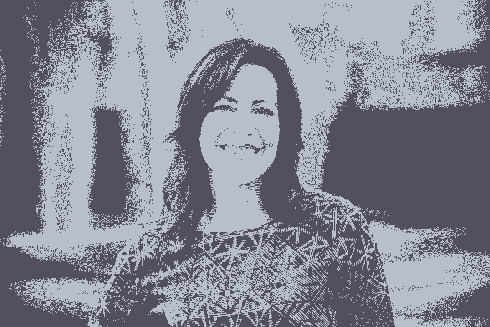

# 我从 Airbnb、Dropbox 和 Thumbtack 的品牌发展中学到了什么

> 原文：<https://review.firstround.com/what-i-learned-from-developing-branding-for-airbnb-dropbox-and-thumbtack>

关于 YouTube 为什么会成为硅谷历史上发展最快的创业公司之一，有很多理论。朱莉·潘素 说原因很简单:“我们出卖了情感。”

当她在 2005 年 12 月成为该公司的第一任营销和沟通主管时，她立即与公司的联合创始人一起决定他们是关于什么——和谁——的。与当时的其他视频分享网站(现在很容易忘记有数百个)不同，YouTube 建立在 Flash 中(其他产品都需要人们下载软件)，它没有策划长篇专业内容，也没有采取许多顾问建议的名人驱动的方法。他们甚至不太关心视频质量。

相反，他们加倍努力确保 YouTube 是一个“每个人都可以参与的舞台”——具体来说，就是那些只是希望获得人类体验、欢笑、分享自己的才华、学习一些东西的人。“我的团队通过推广人们喜欢的视频来展示不说——无论是水獭牵手的视频，还是一名年轻女子在卧室唱歌的视频，一名男子分享他的二战故事的视频，还是有人教观众如何修理水槽的视频。我们最关心的是他们的感受。”

当然，名人和品牌会紧随其后，谷歌 16.5 亿美元的收购也会紧随其后。但正是普通用户定义了 YouTube 的战略，并向世界介绍了一种新的病毒式传播。

自 2009 年离开公司以来，潘素已经成为硅谷最受欢迎的品牌专家之一，帮助 Dropbox、Airbnb 和 Thumbtack 等公司在发布前进行定位。她的第一步？确定他们的目标用户——高期望客户。在这次独家采访中，她解释了他们是谁，如何找到他们，以及为什么每个创业公司都需要抛弃陈词滥调，开始与真正关心他们的人交谈。

# 精确定位

“定位是一家公司长期进行的大赌注，”潘素说。“这是建立你的业务、产品和品牌的策略。明确的行动计划将转化为积极的收入、满意的客户和良好的工作环境。”你的定位不是你的信息或产品路线图，而是你在这个过程中所做的每一个决定的基础。

在你拥抱你要去的地方之前，你需要明白你要带谁一起去。“第一步是确定你做得很好的一件事是原创的、合理的。然后，你必须调整你的业务、产品、运营和营销，以确保你打造的正是客户需要的东西——即使在它进入他们的生活之前，他们并没有意识到自己需要它。”

为了开始她的定位工作，潘素向创始人提出了五个关键问题:

谁是最需要/想要你的服务或产品的客户？

为什么你的产品或服务对他们很重要？

他们对你的产品或服务感觉如何？

它对他们真正的好处是什么？

你的产品会超出他们的预期吗？

这里的游戏名称是精确。“如果你在从事共享或自动驾驶汽车的工作，问问自己:如果有一天我不必驾驶自己的汽车，那么，如果我能在一天中抽出一些时间，我现在能完成什么？”潘素说。“或者对于那家存储初创公司:如果我一生的工作都在云中，那将如何改变我的工作日？”想想那些会从你的产品中获益最多的客户，这样你就可以直接与他们交谈——并打赌他们的情感。"

然而，潘素经常看到的是相反的方式:早期阶段的创始人渴望在下一轮融资中表现出色，或者赚足够的钱再撑一个月，他们追逐每一个可能的用户。他们推出自己的产品时异口同声地说:“我们将改变你的生活！”或者“革命 X！”——试图成为每个人的东西。毕竟，目标是增加用户，DAU 就是 DAU，对吗？

不对。

“创始人被告知，他们需要培养日活跃用户、月活跃用户。他们需要确保他们有适当的活动水平。他们需要确保他们有合适的保留级别。他们需要有适当的收购水平。“太多了，”潘素说。“他们认为吸引每一个顾客是解决这些问题的一种方式。”

但是潘素向创始人们提出了另一个问题——一个简单的问题——来强调这种想法的愚蠢:**你能在产品方面做到这一切吗？**

“他们总是会说，‘嗯，当然不是，’”她说。“资源是有限的。他们不得不对他们能建造的东西进行排名。嗯，A 轮和 B 轮阶段的公司也没有资源去瞄准每一个客户。要有选择地与哪些客户交谈，哪些不与他们交谈。”"

此外，早期的“看什么棒”方法可能会对你的内部流程和员工士气造成危险的消耗。当一家公司缺乏重心时，它的日常运营就会受到影响。“会议时间越来越长，决定越来越晚。潘素说:“没有一个清晰的战略，人们会感到沮丧。

“所有这些都意味着你有充分的理由去做这项工作，去找出你短期和长期的精确目标客户。即使这意味着要花几个月的时间来确定这件事。在大约 5-10 年的时间里，你会花几个月的时间在这个客户身上来建立和发展公司？”

# 进入高期望客户

成功定位的第一步也是最关键的一步是定义你的理想用户——潘素创造了“**高期望客户**”

“高期望客户，或者说 HXC，是你的目标人群中最有眼光的人。潘素说:“这个人会认可——并享受——你的产品或服务带来的最大利益。”。这种洞察力是关键，因为这个客户也是可以帮助创业公司传播信息的人。

HXC 需要成为一个别人渴望效仿的人，因为他们认为他们聪明、明智、有洞察力。

高期望值的顾客是好的消费者。他们是可以信赖的了解市场并做出正确决策的人。“他们查东西。他们研究东西。潘素说:“他们对新型产品或服务有想法，可以帮助他们省钱、节省时间、变得更健康或让他们的团队更有效率。”。"如果你的产品超出了他们的预期，它也能满足其他人的需求."

考虑一下一些知名公司的客户是谁:

**Airbnb:** 这个 HXC 致力于成为一个好的全球公民，她不想简单地参观新的地方，而是属于*。“客人们想要‘像当地人一样生活’，体验巴黎，就像他们生活在巴黎一样，”潘素说。“住在独特的空间并感受到受欢迎的想法让他们充满活力，但他们也很在意成本。”*

*像 Airbnb 这样的初创公司建立了一个双边市场——客人和主人，骑手和司机，买家和卖家等。——可能会争论两倍的人，但他们识别 HXC 的过程实际上看起来没有什么不同。“该公司确实需要表明立场。虽然 Airbnb 会一直说主人是他们的事——这是真的——但公司的立场是面向客人的。这是一种归属感，”潘素说。*

*但是这里没有竞争。主持人与该职位相关。“他们也想打开家门，了解不同的文化，增加收入，变得更加自立。潘素说:“他们知道 Airbnb 的客人是谁，想要欢迎他们。“此外，许多房东也是 Airbnb 的客人，这是典型的市场，顶级卖家也可能是顶级买家。在这些情况下，信息传递可能会根据你与市场的哪一方对话而改变，但你的定位应该不会改变。”*

*“世界上的骑手、加入者、参加者、观众、顾客、客人和买家比司机、组织者、创造者、职业者、主持人和卖家都多，”潘素说。“如果你带来了世界上最多的观众，你就会带来最好的视频创作者。Airbnb 也是如此——如果你把世界上所有的客人都带来，主人就会有动力展示他们独特的空间，并参与到这个新的共享经济中来。”*

*Dropbox: “这可能会让人感到惊讶，因为人们过去认为他们只是一家文件共享和同步技术公司。但 Dropbox 的高期望客户实际上是一个希望简化自己生活的人，”潘素说。“他们信任他人，有组织性，精通技术，并在寻找方法找回他们一天中的一些时间。他们希望知道他们受到保护，当涉及到他们一生的工作时，有人会支持他们，这些工作主要在他们的计算机中，包括家庭照片、视频、工作文件、学校文件。”*

*那不是每个 Dropbox 用户；很多人只是用他们的免费账户到处分享文件。但这就是我们的想法:你的 HXC 不应该是一个包罗万象的角色。“高期望值的客户将从产品的最大属性中受益，并传播信息。潘素说:“然后其他人会说，‘如果它对我精通技术的朋友丽莎有用，或者对建造了世贸中心并是 Dropbox 早期超级用户的铁狮门建筑公司有用，那么它可能对我也有用。’”*

***Lululemon:** 当然，科技之外的公司也受益于定义明确的 hxc。Lululemon 的创始人 Chip Wilson 在 2015 年《纽约时报》的一篇文章的[中描述了他的公司的两个“缪斯”:32 岁的单身职业女性 Ocean 激发了他最初的目标市场，后来她 35 岁的男性同行 Duke 紧随其后，是一个“运动机会主义者”](http://www.nytimes.com/2015/02/08/magazine/lululemons-guru-is-moving-on.html "null")*

*这些不仅仅是人口统计草图——威尔逊了解他的缪斯，他的 hxc，直到他们的日常事务。例如，Ocean 拥有一套公寓，喜欢旅行。她每天大约有一个半小时的时间锻炼。关于她，威尔逊告诉《泰晤士报》，“如果你 20 岁或者你即将大学毕业，你会迫不及待地想成为那个女人。如果你已经 42 岁了，有几个孩子，你会希望时光倒流。”*

*

Julie Supan* 

# *为什么你的 HXC 不一定是你的早期采用者*

*假设你的早期采用者也是你的 hxc 是很有诱惑力的，但事实并非总是如此——对一家年轻的公司来说，未能做出这种区分可能是一个挑战。*

*以机场汽车共享初创公司 FlightCar 为例，它为外出的有车旅行者和进来的游客牵线搭桥。该公司最早的采用者是其每月汽车共享客户——那些经常旅行的车主，他们被这样一种观念所吸引，即他们可以获得有保证的每月付款，否则这些汽车就会闲置，产生停车费。“我们早期的广告到处都是美元符号，”潘素说，他去年开始帮助 FlightCar 转变战略并重建产品。*

*虽然这些早期客户确实迅速推动了供应量和销量，但他们并没有投资于公司的根本使命。“我们围绕一个没有体现共享经济的目标构建了整个模型——商业模型、运营模型、营销模型。潘素说:“这些用户不重视自己的角色，也不认为自己是帮助人们变得更加自立的汽车共享社区的一员。“当谈到帮助 FlightCar 增长时，他们也不关心这个。当出现问题时，他们是第一个写愤怒的 Yelp 评论的人。随着公司开始发展业务模式和提高运营效率，他们没有兴趣帮助公司改进政策或接受变化。因为几乎没有商誉，该公司在从美国的一个机场扩张到 17 个地点的过程中没有得到好处。”*

*与此同时，另一个客户群从一开始就在有机增长，他们称之为标准客户，一种非常不同的用户类型。通过口口相传，他们*被*投入到共享经济的自力更生中，并欣然接受他们作为一个新概念的测试者的角色。他们很兴奋能在外出时节省停车费，还能把车租给一个来他们镇上的游客，赚点外快。这些是高期望值的顾客。*

*“他们是本可以帮助创造适当增长的人，是可以推广品牌、多年来传播信息并鼓励他人追随和参与的客户。但这种模式不是为他们打造的，”潘素说。“它已经随着付费客户的发展而演变为北极星，该公司努力工作了近一年时间，重新关注并从头开始重建 FlightCar 体验。最终，该团队决定将其新设计的技术平台出售给梅赛德斯-奔驰北美研发中心，成为其全球移动服务创新实验室的一部分。”*

# *找到你的 HXC*

*毫不夸张地说，正确识别目标客户可以成就或摧毁一个年轻的公司。创始人需要花时间系统地定义他们的 HXC:*

*做你的研究。现在不是猜测或凭直觉行事的时候。“需要大量的客户研究来深入了解人们喜欢什么，什么让他们感到沮丧，他们认为你最大的挑战和真正的好处是什么，以及他们的长期愿望是什么，”潘素说。*

*她建议创业公司通过瞄准所有的客户来收集数据——快乐的、不快乐的、最近的、早期的、活跃的、不活跃的——跨越地理位置，通过不少于五个渠道，包括:*

*普通人群或决策者调查*

*单一问题和开放式调查*

*嵌入销售或营销电话的单个问题*

*电话采访*

*客户服务渠道*

*产品拦截调查*

*应用商店评论*

*“你甚至可能不得不创建新的渠道，开发新的功能，以便在人们使用你的产品或服务时获取数据，”她说。*

*在这个阶段同样重要的是*不*做什么。“不要向客户询问有关功能或用户界面的问题。像 Usertesting.com 这样的工具对这种研究不起作用。潘素说:“那些同意测试产品并获得报酬的人往往更有礼貌，对你的产品没有那么热情。“如果你能预测一个问题的答案，就不要问它。你不应该缩短你的调查或面试，但是也要注意别人的时间。我建议让客户知道，你正在做一项调查，以更好地了解他们对产品的感受，他们的想法将直接融入公司的战略。”*

***校准数据。**不要操之过急——这可能会占用你团队几周的时间。查看通过各种渠道收集的见解，开始识别数据中的共同主题。提出这些问题来揭示这些趋势:*

*你看到了哪些意料之中和意料之外的事情？*

*这些结果给你指明了什么方向？*

*这与您当前的战略、路线图和团队有什么关系？*

***定义你的客户。**有了汇总的数据，是时候开始勾画高期望客户的轮廓了。在这里，你将确定定义目标受众的具体个性特征。*

*如果你的调查设计得很好，你可以经常看看回答者自己的话作为开端。“我最喜欢的一个问题是'**,你如何定义最能从该产品中受益的人？“潘素说。“大家回答的时候，一般都是描述自己。这是问“你是谁？”的好方法提问的同时让人觉得是在描述别人。"***

***再次校准。**在结束之前，潘素建议先回答一些最后的问题，以确保你找到了一个你真正能与之相处的 HXC:*

*谁看得起这个人？*

*这个人是人们觉得他们能与之相关或渴望成为的人吗？*

*你能设身处地为他们着想，从他们的角度看你的产品吗？*

*什么会让他们对你的产品失望，你要怎么做才能确保这种情况不会发生？*

# *考虑客户的心态*

*一旦你定义了你的 HXC，你就快成功了。不过，为了从这个定义中获得最大收益，你需要把它放在客户过去的经历中——他们的消费生态系统以及他们给你的产品带来的偏见。换句话说，你需要考虑他们是带着成长的心态还是固定的心态来找你。*

*如果你的目标客户有增长的心态，那很好。“在这种情况下，用户非常开放。他们以前从未尝试过，他们甚至无法想象它会存在。以人们第一次在 Airbnb 上发现最独特的空间为例:“哇，我可以在风车里过夜了？”这是没有背景的，所以他们感到兴奋和惊讶，”潘素说。*

*其他时候，用户会带着固定的心态来找你，你的产品激发和鼓励他们重新想象什么是可能的，然后交付，这很重要。“以图钉为例，它是面向本地服务专业人士的领先在线市场。许多客户来到现场时会想，“承包商不会回电话的。他们很难接近。潘素说:“我要打 11 个电话才能找到合适的电话。”。Thumbtack 很早就进行了广泛的客户调查，因此意识到了这种心态。该团队用“你可以做到”的方法来定位公司，使用“客户使用图钉快速轻松地完成数百万个项目”这样的语句。"*

*在做了早期研究后，Thumbtack 建立并定位了自己的服务，一旦客户请求专业人士帮助他们完成项目，他们就会惊叹不已。潘素说:“当客户不用打电话和跑腿就能迅速从一个可靠的、有声望的专业人士那里得到报价时，他们就已经进入了一种成长的心态，并感到公司对他们的支持和重视。”。“这个客户很有可能会回来。”*

*“你可以更成功，以一种有抱负的方式向客户表达善意，而不是像‘这以前坏了，但现在我们修好了’这样的负面信息，”潘素说。“我们的目标只是引导客户走向开放的精神，这样他们就能以积极的方式从变革中受益。”*

*要打造任何变革性的东西，你需要一个愿意给你好处的客户。*

# *让团队参与进来*

*如果这听起来像是一种私人关系，从很多方面来说确实如此。毕竟，你将会和这个“人”一起度过大量的时间。简单来说，你需要喜欢他们。你也需要你的团队来认同这种关系。*

*潘素说:“Airbnb 的首席执行官布莱恩·切斯基说过，‘你必须成为你为之设计的人。’”“整个团队需要一致认为这个人值得他们付出时间。在许多方面，他们也需要立志成为 HXC。”*

*这是无可避免的:创业是一件苦差事。如果你没有建造你想建造的东西，坚持到底几乎是不可能的。“我见过一些公司为了一个他们不感兴趣的客户重组了整个公司。潘素说:“有时，我会和一些不喜欢或无法与高期望客户建立关系的公司交谈。“那真的很难。这会影响文化。这会影响招聘。这影响了团队成员的能量——他们的注意力和承诺。”*

*另一方面，抓住高期望客户对一家初创公司来说可能会改变游戏规则。“如果你的团队认同并参与了目标客户的定义，你会看到他们的实际反应——新发现的活力。你会看到更多的紧迫感和更明确的重点，”潘素说。*

*一个清晰的 HXC 甚至可以帮助你集中招聘。“从很多方面来说，如果你看看在 Lululemon 工作的每个人，他们都在引导海洋，”潘素说。“当你走出电梯去 Airbnb 面试时，你真的会受到集体拥抱和欢迎。他们用爱、关心他人、成为全球公民来定义他们的客户，你一踏进办公室就需要感受到这一点。”*

*然而，仅仅因为有共同的感受而雇佣员工是不够的。你需要慎重考虑推出你的 HXC，让这个人成为办公室里的常客。“制作一份可以与整个团队分享的演示文稿或备忘单，在新员工入职时提供一份指南，或者制作一份记分卡，记录产品在超出客户预期方面的表现。在全体会议中提及 HXC。考虑召集一个焦点小组或“用户委员会”,反映一批 HXC 客户，并由他们来运行策略和新功能。”*

# *积极着手进行*

*当然，一旦你确定了你的高期望客户并让团队加入进来，你的工作还没有完成。你需要将客户融入你公司的 DNA 你的战略、产品路线图、运营和营销。“可能需要 6-8 周的时间来做好这件事，并讨论如何改变事情，以超出 HXC 的期望，”潘素说。“在我所在的几乎每家公司，我们都能够以更敏锐的视角审视产品路线图，冻结一些功能，并在大多数情况下建立新的功能，以更好地反映我们的新定位和 HXC。”*

*说到营销，好消息是，你在前端投入的工作将很快集中你的战略和信息。摆脱了“追求每一个人”的思维模式，你可以将你的销售和营销资金投入到获取和保留一个客户目标上——他们会处理剩下的事情。“与广告或促销相比，一个顾客与另一个顾客分享他们对产品的热情和喜爱更加客观。它让公司可以花更少的钱来实现持续增长，”潘素说。*

*也不要害怕使用你的 HXC 自己的话。您投资了客户数据收集—现在挖掘最能引起共鸣的语言的结果。“顾客会听到他们自己的话，然后说，‘哇。这个产品是给我的。"*

*密切关注非语言信息，包括你产品的外观和可用性。“例如，如果 Dropbox 要说‘它只是工作’，他们的产品需要在任何地方、任何平台上工作，以超越 HXC 的期望，”潘素说。“他们的设计愿景还必须符合目标客户对产品的感受。品牌价值观之一是“我们支持你”这个产品几乎没有任何用户界面。它在右手边的角落里。你几乎从来没有和它互动过。它简单而低调，但你知道它已经涵盖了你。"*

*然而，定位你的信息并不意味着一心一意地坚持你尝试的第一件事。潘素说:“你确实需要找到一些方法，对客户如何接受这一立场进行对比测试。”。“看看每一个接触点。你不会在一天之内彻底改变它，但最终你会希望在某个时候，当你准备好在地上打下一根木桩的时候，它会完全对齐。”*

*高期望的顾客是病毒式传播最真实的形式。*

# *重新登记*

*在一天结束时，你的 HXC 代表着人们——真实的人，生活在这个世界上——你需要定期重温你的目标，以确保你仍然击中目标。潘素敦促初创企业领导人保持对公司或市场变化的敏锐关注，并在直觉告诉他们的时候加入进来。“也许每隔两三年，你就会看到一定的增长。在未来的某个时候，你需要再次问自己，“世界是如何演变的，我的客户现在期望什么？“它们是怎么长起来的？”"*

*“我看着 Twitter，虽然我不会说他们的定位错了，但我认为他们跳过了检查的步骤，”潘素说。“早些时候，Twitter 就向那些渴望找到新方式接触粉丝的名人和其他熟悉媒体的人发出了呼吁。从公共关系的角度来看，这是一个成功的策略，那些名人超级用户肯定收获了丰厚的品牌回报。但该公司的缓慢增长表明，虽然普通人喜欢看一眼名人，但这并不意味着他们自己会积极使用该产品。*

*“没有人能渴望成为推特上的贾斯汀比伯。潘素说:“从 12 岁开始，他就在 YouTube 上传自己唱歌的自制视频，现在他已经取得了很大进步。“但我看着 Twitter 产品说，‘如果它对他有用，那肯定不适合我。’他把标准定得如此之高，以至于你实际上感觉被排除在外了。这个 HXC 不是人们觉得可以效仿或想象的那种人。"*

*说起来容易，做起来难，但是不断调查和吸引你的客户是非常值得努力的。“雇佣一些有创造力和分析能力的人，他们可以管理正在进行的多渠道研究，并与产品团队密切合作，”潘素说。“并确保你不断根据 HXC 校准这些见解。这些年来，我很少看到一家公司完全改变他们的 HXC，但与他们和你周围的世界一起发展是很重要的。”*

*第一次的目标是达成共识，第二次、第十次或第一百次你查看 HXC 时也是如此。“你总是朝着这样一种状态努力，在这种状态下，市场、公司和你的客户对你是什么以及你为什么重要有着广泛的共识，”潘素说。随着公司的发展，HXC 是一块宝贵的试金石，可以确保你朝着正确的方向发展，并验证——或否定——你的行动计划。*

*“识别 HXC 最大的好处是，从员工到客户，每个人都能安心。你的用户会理解这个产品，并且知道这是为他们准备的。您将削减获得客户的成本，并享受清晰路线图的好处。潘素说:“消除偏见后，你的团队会更有创造力。”。“不断检查你的 HXC，并根据它们校准你的洞察力。不断了解他们。如果你做了工作，他们会引导你对你的公司是什么和不是什么达成共识。”*

**摄影由* *[邦妮雷伊米尔斯](http://www.bonnieraemillsphoto.com/ "null")* 负责。*