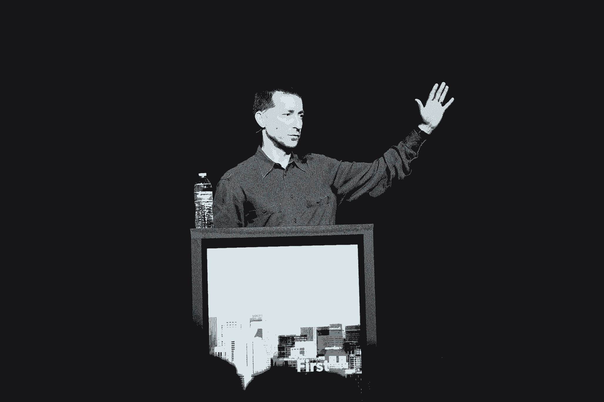

# 我从兴奋和恐惧中学到了什么

> 原文：<https://review.firstround.com/what-i-learned-scaling-engineering-teams-through-euphoria-and-horror>

"我曾在兴奋和恐惧的不同阶段参与工程团队."

这就是蒂姆·霍维斯**，最接近创业公司的绿色拇指。作为 **Loudcloud** 的联合创始人，他在短短 18 个月内帮助团队扩大到 650 人。当 2001 年泡沫破灭时，它的迅速崛起戛然而止，但他没有被吓倒。他将公司转型为 **[Opsware](http://en.wikipedia.org/wiki/Opsware "null")** ，在这里，增长感觉更像是一次“漫长、缓慢、痛苦的攀登”,而不是火箭发射，但最终在 2007 年被惠普以 16 亿美元成功收购。在他的上一个创业公司 **RockMelt** 被**雅虎**收购后，他继续将那里的移动工程团队从 150 人扩大到 350 人。**

简单地说，他什么都见过。他在繁荣和萧条时期制造产品，雇佣了数百名工程师，组建了整个团队。他从零开始创建工程组织，继承了庞大的团队(以及他们的好习惯和坏习惯)。通过所有这些经历——以及一些失误——他学会了如何让事情走上正轨。

在 First Round 最近的 CTO 峰会上，霍维斯分享了其中最具影响力的经验。这些包括他的**规模的五个维度**——如果工程领导者想在 50、100 或 500 人中像第一天一样有效，他们需要确定的五个方面。

# 人:成为你团队的专家(尤其是它的弱点)

随着团队的成长，了解团队的心理以及如何有效地部署人力资源变得越来越重要。领导一个 10 人的组织和领导一个 100 人的组织是非常不同的，霍维斯已经确定了你需要注意的人员需求的三个关键转变

**先知与预言家:**许多技术组织都有一个工程师，他从一开始就在那里。“他是个神谕，对吗？他留着胡子，留着长发，坐在他的房间里。“人们进来向他寻求建议，”霍维斯说。

毫无疑问，那些明智的高级团队成员是无价的，但是随着新人的加入，一个工程师将不再有用。“不是每个人都会去找先知的。你也需要更像先知的人。”更大的组织从福音派风格中受益更多，这种风格的人愿意出去分享和强加新的想法，而不是坐以待毙，等待人们来找他们。

**消防员与消防队长:**从最早的时候起，初创工程组织就非常擅长灭火——他们必须这样做。在压力下反应最好最快的人会因此得到奖励。然而，如果你想摆脱追赶或被动模式，你需要开始转变你的价值观。“我不是说消防员在放火，”霍维斯笑着说，“但随着一个组织的成熟，你会明白需要一名消防队长。”随着规模的扩大，找到并提升那些寻找并消除火灾原因的人，而不仅仅是扑灭他们。

**丹尼斯·罗德曼对癌症:**“我想是菲尔杰克逊说过，‘球队里只能有一个丹尼斯·罗德曼。’“他很古怪，很怪异，是朝鲜独裁者的朋友。他全身心地投入到比赛中，但他在做自己的事情——他没有让球队失望，尽管他自己并不遵守规则。相比之下，一个工程师——任何一个工程师，不管他有多好——态度不好，向别人抱怨，通常会拖垮团队。这是一种可以迅速扩散的癌症，你必须切除它。你想要的是工程师，他们的行为更像癌细胞，拥有良好的习惯和技能，似乎可以传染和复制。他们积极地教别人，他们的技术传播开来，你的组织实际上因此而变得更好，尤其是在大规模的情况下。当你看到有这种影响力的人时，奖励他们，给他们一个平台去做更多的事情。

在您的组织中，所有这些角色都有很大的空间；你永远都需要工程师在紧要关头挺身而出，发布产品，每个公司都需要有智慧的长者。在你认为有必要重新评估你的需求之前，愿意重新评估你的需求，调整你的层次结构。

# 招聘:不要忽视你最大的投资

霍维斯讲述了在 Opsware 的一个特殊时刻，当时他意识到他在过去三年里雇佣的几乎所有工程师都辞职或被解雇了。

“Opsware 的核心工程团队也经历了 Loudcloud 的严峻考验，就好像他们去了三次越南，”他说。"他们是出色的工程师，非常忠诚——但他们很固执，排斥新员工。"霍维斯认识到，如果不能专注于招聘的每一个阶段，包括培训和整合，可能会在那些不成功的人身上浪费很多时间。

一个强大的团队就是从这种态度开始的。根据霍维斯的经验，最需要关注的过程——招聘——是公司经常自动驾驶的一个环节。“从上门获取简历或推荐，到电话筛选和面试，再到整合员工，你需要明白的第一件事(如果你还不明白的话)是，在这个过程中，总会有一些东西被打破。他说:“我真的从未见过一次招聘过程顺利进行超过一周的情况。

所以，如果你已经艰难地学会了这一课，不要担心——管理它。随着你的公司成长，你说的比你做的更少引起共鸣。让招聘成为团队会议或全体会议的讨论点，并亲自展示——无论你在管理链的哪个位置——你对它的重视。

作为一名工程领导者，你不仅需要为自己，也要为团队中的每个人优先考虑招聘事宜。做到这一点的最好方法是以身作则，一遍又一遍地不断提出来。

你必须允许人们花时间去面试、做手机屏幕等等。这非常重要。

人们找工作时不会知道如何招聘。为了成功，你必须非常有意识地设置它们。“你应该像对待其他技能一样对待它，并真正为它培训人才，”霍维斯说。他很快发现，如果让面试官自己决定，他们往往会被同样的问题所吸引。“我开始旁听面试，只是为了观察，每个人都在问 Java 技能。”现在，他建议领导者通过结构化的面试小组来避免裁员。一个人关注 Java，另一个人关注算法，第三个人关注公司文化，等等。“在招聘过程中给每个人一份工作，”他说。

从好的方面来说，你对招聘越关注，就越能揭示你的组织。“在你的招聘漏斗中有大量的好数据。我认为，当事情出错时，人们往往忽视数据，依赖直觉。但是如果你有数据，你真的可以在正确的地方采取行动，”霍维斯说。

然而，也许比辞职更可怕的是被一个“咩”的雇用所困。你可能不止一次看到过这样的场景:你的面试小组正围坐在一张桌子旁，讨论一位候选人。没有人热切地支持他，但也没有人强烈反对与他合作。这是一个“嗯”雇用。

霍维斯指出，大公司已经尝试通过官方项目来解决这个问题。“在雅虎，有一个叫做招聘委员会的机构，它不直接面试候选人，而是在面试过程中审查他们的档案。根据一份简历和他们从面试官那里得到的反馈，他们可以说，“不，我没感觉。”。我不喜欢这个人。亚马逊也有一个类似的角色，他们称之为“酒吧老板”他们基本上是作为组织的一个基本检查。当然，作为一名试图建立团队的招聘经理，霍维斯已经不止一次对这个系统感到失望了——但他一直明白它的价值。

【meh】雇佣对一个组织来说就是死亡。你最终会变得平庸无奇。

当然，所有这些都假设你正在处理一个传统的面试过程。通过招聘实现增长呢？

根据霍维斯的说法，这可能是建立一个工程组织的好方法；你得到了已经知道如何一起工作的团队，准备好了。但有一些警告:首先，在这些情况下，你可以——也应该——仍然有一个面试过程。“运用你在常规面试过程中使用的同样严谨的态度。我认为，领导者经常以这种方式招聘员工，因为他们喜欢公司，也喜欢创始人。在评估你要带进来的每一个人时，也要努力做到同样的严谨。”

在收购的情况下，对于新团队和新加入的团队来说，仔细的整合是加倍重要的。

“你真的必须知道，当人们登陆时，你将如何处置他们，”霍维斯说。“你需要理解他们带来的心理因素。他们是因为在那里而兴奋，还是觉得自己的初创公司没有成功？”

在这些情况下，薪酬也可能是棘手的:通常，新雇佣的团队将获得丰厚的薪酬，这可能会与通过正常渠道雇佣的团队产生不公平。然后在下一轮加薪中，当你试图让事情变得平衡时，不平衡(和挫败感)就会逆转。

霍维斯将是第一个承认这些问题没有简单的解决办法的人。请记住，招聘并不会随着新工程师的上任而结束，留意整合过程中的小插曲——如果你很早就发现了不满，你可以在事情变得严重之前进行干预，最好是对正在发生的事情保持透明和诚实。

Tim Howes speaking at First Round's recent CTO Summit.

# 组织:及早培养秩序，绕过混乱

从先知到消防队长，再到你自己的丹尼斯·罗德曼，你的人越多，持续地组织他们就越重要。例如，当谈到扩展组织时，霍维斯更喜欢垂直团队。

“我在雅虎的 18 个月里，我们从大约 150 人增长到 350 人。他说:“我们能够做到这一点并继续发布产品和保持理智的唯一原因是，我们有许多小团队，他们发布的产品大多是独立的。为每个团队配备启动产品所需的一切，从工程设计到质量保证到产品管理到市场营销。通过这样做，你可以击败许多笨拙的大公司。

这并不是说垂直是唯一的出路。横向组织在其他情况下被证明是有效的。然而，无论你的结构如何，重要的是正式确定管理层的角色。创造一个技术领导的角色，并深思熟虑地填补这个职位。

50 多岁的人，如果你不把角色正规化，每个人都认为他们是技术领导。这就变得很糟糕了。

也要警惕让你的顶级程序员成为经理的诱惑。根据霍维斯的经验，这通常并不合适。“它们是不同的技能。他说:“要意识到的是，管理是关于人的，而不是关于代码的。如果有人来找你，想要进入管理层，尽一切办法和他们一起努力。但是不要推。

“人们通常会不舒服地转向管理层，因为他们认为这是获得成功的途径。但这通常是错误的做法。”

最后，随着公司的成长，不要停止快速发布。“有一个很大的趋势，事情会慢下来，慢慢停止，”霍维斯说。“但是，无论你是在移动、网络领域，无论你在做什么，你能做的最有价值的事情就是优先考虑快速发货。”

在快速发布的世界中成功的秘密是永远不要忽视你在这个过程中积累的技术债务。“你需要能够明确地偿还，你需要考虑这些权衡，”霍维斯说。“您可以快速上市，也可以针对性能进行优化。”如果你真的建立了一个“快速发布”的文化，确保你也正式授权回去从头开始清理。

# 交流:平静地重复你自己(令人作呕)

从很多方面来说，交流的变化是最容易发现的。你不能错过从创始人的客厅搬到真正的办公室，或者从一层搬到两层。在某一点上，你会达到一个同事之间都不认识的规模。“关于沟通，要意识到的一点是，它能建立信任，”霍维斯说。随着你的成长，忽略了这一点，你可能会发现自己面临着严重的信任赤字。

10 人时，团队交流是互动的。你可以花更少的时间来构思你的信息，因为你是在以一种动态的方式传递信息。“交流发生在对话中，它的带宽更高。他说:“一次谈话就够了。但是，当人数增加到 50 或 100 人时，情况会发生巨大变化。

交流不再是互动的；是一对多。“其结果是，你需要花更多的时间来构思你的信息。你需要非常清楚，因为你从别人那里得不到任何回报。”清晰往往需要重复的帮助。“你会对自己说，‘天哪，你怎么不明白我上周在全明星赛上说的话呢？’"

你会惊讶地发现，你要重复多少次才能让你的交流持续下去。

但是扩大交流不仅仅是你向团队的派遣。随着增长速度的加快，你也需要在员工之间培养定期、健康的互动。霍维斯建议从正式和非正式的联系机会两方面来考虑这个问题。"**通过架构评审、代码评审和演示日等方式正式沟通。所有这些都有助于组织了解每个人在做什么。**”

但是也要注意非正式的交流。一旦你的组织超过一打，整个团队就不再一起吃午饭了。因此，安排棕色袋子会议或啤酒聚会，跳出框框思考创造性的方法来激发有意义的互动。“在雅虎，我们的一位经理创造了一种叫做‘三点四点’的东西，”霍维斯说。“这是三个人的三次会谈，两个是技术性的，一个是非技术性的，每周五下午四点。感觉很棒。它真的让人们聚在一起，思考如何相互交流。”

# 质量:不要听天由命

如果你在扩大你的工程团队，那是因为要么你的产品在变大，要么你在增加新产品。无论哪种方式，你都将面对许多不同的团队在做许多不同的事情，密切关注质量将变得更加具有挑战性。

“当我来到雅虎，我看到的第一件事就是我们已经掌握了快速运输的艺术，”霍维斯说。“我们的产品看起来真的很棒。但它们仍然比我们想要的要不可思议得多。”因此，他立即投入工作，建立了一种质量文化，他向每一位工程领导者推荐了三条关键规则:

**注意:**有时候，最有效的建议就是这么简单。“做一个仪表板。每次产品评论都以“你的质量如何？”霍维斯说:“给那天或那周有质量问题的人发一封电子邮件。当他开始关注并一丝不苟地记录事故率等细节，并明确表示他正在这样做时，公司的其他部门迅速采取了保护措施。

**制作一份发布清单:**当然，管理一个不断增长的工程师团队有很多好处——比如，他们带来了不断增长的知识库。霍维斯建议将这些知识整理成一个清单，每个产品团队在发布任何产品之前都必须检查一组方框。“你的二进制大小是多少？你的内存使用情况如何？你能在不崩溃的情况下维持猴子测试多长时间？启动时间多长，冷暖？你在安全方面做了什么？你用的是什么外部网址？我们的清单上有 200 个项目，”霍维斯说。“然后我们开始自动化工具来帮助每个团队完成这个列表，所以这不是一个艰巨的过程。”标准化这个列表将对您的发布质量产生重大影响，并使每个团队的经验教训对组织的其他部分可用。

**实现评审和自动化测试:**代码评审、功能测试、单元测试——它们最终都服务于相同的目的。“他们强迫你很好地组织你的代码。我认为这是单元测试和功能测试的主要目的，”霍维斯说。“对于保持工程师诚实和关注代码质量来说，没有什么比知道他们的代码将被他们的同事审查更好的了。”

尽管如此，当谈到细节时，他有一句忠告:“不要陷入宗教的泥潭。”这是什么意思？基本上，试图找到一种真正适合你的团队的编码风格，或者继续研究工具，直到有一个一致的最爱，这是很有诱惑力的。“根据我的经验，每个群体中超过一半的人讨厌你可能使用的任何工具或者你采用的任何编码惯例，”霍维斯说。“更重要的是选择一个，然后继续前进。”

在 20 年的时间里，在 6 家公司，通过与数百名工程师的合作，霍维斯发现这五个领域产生了最大的变化——往往是成功与失败的区别。但是这个建议并不意味着代表一个公式或灵丹妙药。他说，最好的工程领导者总是会犯错误，并且总是会采取额外的措施从中吸取教训。

“没有真正的万能解决方案。东西总会坏掉的。真正的关键是始终保持自我意识，这样你就能识别那些坏的东西并解决它们。规模化是一个不断创新的过程。”