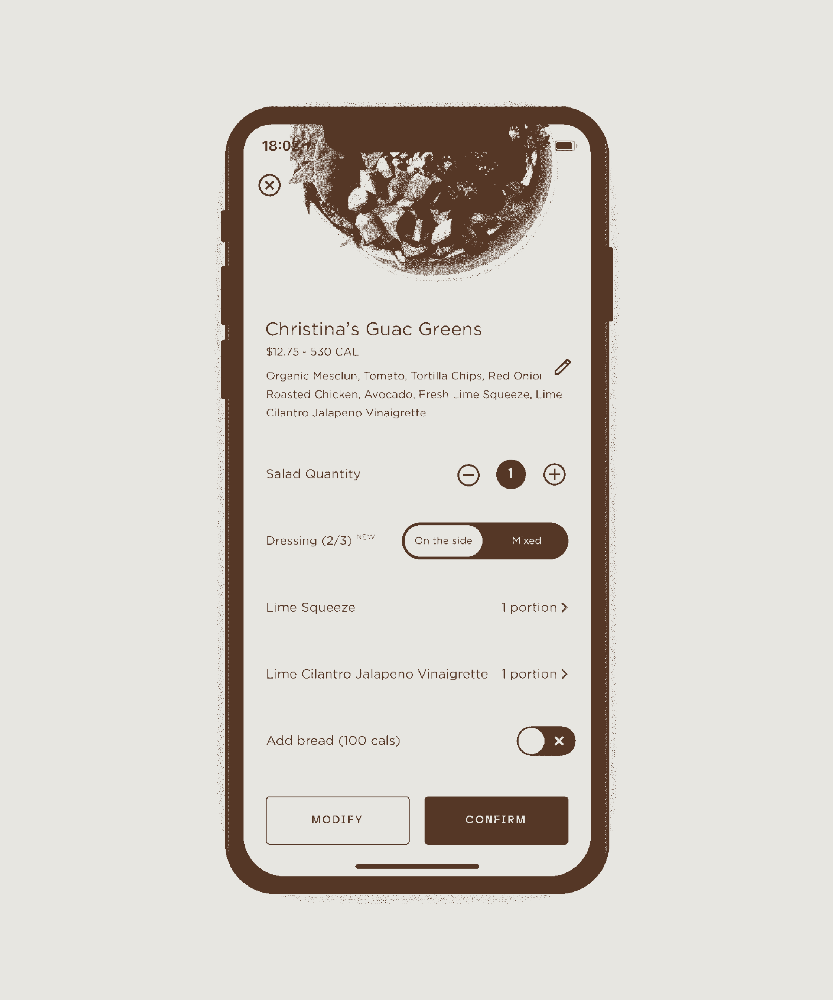
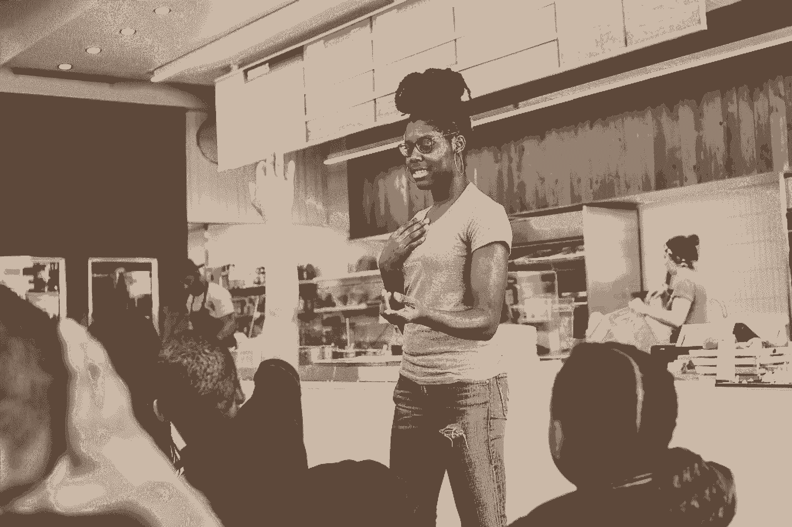

# Sweetgreen 能教会初创公司如何扩大亲密度

> 原文：<https://review.firstround.com/what-sweetgreen-can-teach-startups-about-scaling-intimacy>

2016 年情人节周末，一场冬季风暴摧毁了新英格兰的大部分桃子作物——这一事态发展让 Sweetgreen 的供应链团队忙得不可开交。

在夏季菜单规划的高峰期，该小组预测了这家连锁餐厅广受欢迎的桃子和山羊奶酪碗的供应，结果出现短缺。虽然其他快餐公司可能会选择从遥远的地方运送不太新鲜的桃子，但 Sweetgreen 的地面团队采取了不同的路线。

他们把桃子换成了当地种植的(完好无损的)蓝莓和草莓，推出了一个被称为“爱国者碗”的全新菜单，以此向该地区致敬。它很快成为 Sweetgreen 东北餐厅最受欢迎的订单之一，现在是联合创始人兼首席品牌官 **[纳撒尼尔·鲁](https://www.linkedin.com/in/nathanielru/ "null")** 称之为**大规模亲密**的概念的典型例子。

“当我们开始时，你有两种选择:要么是又快又便宜又不健康的食物，要么是又慢又贵又新鲜的食物。我们想创造一个地方，让你不必为了味道或方便而牺牲价格。他说:“对我们来说，**大规模的亲密关系是为了证明我们可以大规模地提供健康、真正的食物，同时仍然让我们感觉像是你的*****sweet green，而不仅仅是*****sweet green**。“有很多关于初创公司或餐馆的警示故事，它们大规模增长，转变为行动缓慢的企业实体，质量急剧下降，产品变得更加乏味，客户不再是中心，员工感到参与和灵感减少。我们决心避免这种情况。”**

**11 年前，从乔治城大学毕业几个月后，Ru 和他的两位联合创始人 Jonathan Neman 和 Nicolas Jammet 就开始了将这一理念付诸实践的旅程，在华盛顿特区开了一家 500 平方英尺的餐厅。舒适，装饰有当地艺术，这第一个位置成为锚入社区的褶皱，提供了一个稳定的基础，进一步扩大沿东海岸。通过维持灵活的供应链和为客户打造季节性的精心策划的体验，Sweetgreen 在扩大规模的过程中充分利用了其卑微起步的精髓，利用这种熟悉而又新鲜的感觉来推动令人印象深刻的增长。**

**该公司目前拥有 3500 多名员工，在 8 个州拥有近 100 个餐厅，并计划在明年将餐厅数量增加一倍。但是 Sweetgreen 的发展也不仅仅局限于物理足迹。从推出企业办公交付和使用区块链跟踪成分，到解锁独角兽地位和筹集超过 3 亿美元的资金，该公司似乎与科技创业公司分享了更多的 DNA 链，而不是与他们的快速休闲竞争对手。**

**在这次独家采访中，Ru 利用他攀登 Sweetgreen 的经验，为初创公司提供了一个更清晰的窗口，让他们了解快速增长的公司如何与客户、合作伙伴和员工保持亲密关系。他解构了真正接近新市场和合作的基本战略，同时深入探讨了 Sweetgreen 用来将意图注入其供应链、移动应用程序和团队建设工作的策略。希望建立一家能够承受成长的痛苦并与客户保持联系的公司的创始人将受益于 Ru 关于建立一个沉浸在社区中的品牌的大师班。**

# **从剧本中吸取经验，提升亲密度**

**随着越来越多的厨师聚集在厨房里，新的地点也在增加，标准的操作程序和效率被引入以保持一致性。很快，文化被冲淡了，产品失去了味道，随着千篇一律的方法取而代之，创造的火花暗淡了。**

**这种描述可以很容易地应用于一家规模不断扩大的科技初创公司，也可以很容易地应用于一家快速增长的连锁餐厅(正如我们之前提到的，在[厨师和产品经理的技能组合](https://firstround.com/review/why-soldiers-and-chefs-make-the-best-product-managers/ "null")中有相当多的重叠)。正如茹很快指出的那样，这两个行业的公司都面临着规模和亲密度之间的内在矛盾。**

**“刚开始时，关注亲密关系要容易得多。“一旦你达到了一定的规模，就很难进行逆向工程或恢复它，”茹说。“这就是为什么从一开始就培养接受变化和灵活性的心态非常重要。专注于销售和增长很容易，但失去早期的讲故事和情感是一种不会持久的交易方式。”**

**对于 Sweetgreen 来说，扩大亲密关系围绕着扩大健康食品的获取途径，而不损害公司最初的核心、固有的本地精神——这是一盏指路明灯，需要与食品行业同行不同的思维模式。“尤其是在我们这个领域，许多食品公司热衷于建造更多的餐厅。但我们试图更深入地思考以客户为中心的指标，重点关注 NPS、渠道频率、社会情绪和整体忠诚度，”Ru 说。“我们相信，我们可以通过减少对传统餐饮公司的思考，更多地考虑客户订阅业务，来增加这一价值。”**

**为了进一步揭示扩大亲密度背后的思想，Ru 详细介绍了形成 Sweetgreen 方法精神的四个核心原则，并分享了他和他的联合创始人一路走来学到的错误。**

****1)减速加速。****

**“像许多创业公司一样，我们从几个核心价值观开始，但它很快就从那里膨胀起来。我认为在某一点上，我们有多达 20 个价值观，我们甚至不能记住所有的价值观。这无疑反映了我们早年试图做得太多。久而久之，我们学会了说不和放慢脚步的力量，”茹说。**

**虽然在各个方面尽可能快地成长很诱人，但决定你是谁的却是那些你说不的决定。**

**“在开了我们的第一家餐馆后，我们立即想到我们可以在头三年内在洛杉矶、纽约和迈阿密开遍全国。初创公司和餐馆都面临着快速拓展新市场的巨大压力。但最终我们意识到，通过对扩张说不，我们可以专注于建立品牌和变得更强，而不仅仅是更大。“我们决定头六年留在华盛顿，老实说，这是我们做过的最好的事情之一。它让我们建立了一个网络效应，并在我们把蓝图带到新市场之前真正从错误中吸取教训。无论是连接到当地的农贸市场，建立一个完全本地的供应链，确定房地产范围，还是从事社会影响项目，我们首先在华盛顿孵化每一个策略，以便我们能够将深思熟虑和真实的增长放在中心位置。”**

****2)研究社区。****

**为了进一步体现“慢慢来”的理念，Sweetgreen 团队在进入一个新市场之前会从容不迫，因为他们知道完全相同的发布剧本不会在每个地方都有效。**

**“释放亲密感和与客户产生共鸣的能力取决于做足了解他们的工作。你必须以不同的方式与每个社区建立联系。至少在我们进入一个新市场的一年前，我们会向社区介绍自己，并花时间了解其独特的文化，这样我们才能以更有意义的方式展示自己，”Ru 说。**

**“我们首先是学生，在每个新市场推出之前分析每个社区。例如，我们现在已经在休斯顿呆了一年多，会见了最大的农贸市场，梳理了房地产选项，与当地艺术家和建筑师合作，了解了居住在该地区的人们喜欢做什么和吃什么，并查看了从交通模式到人口统计的一切历史数据，”他说。“我们还创建了自己的思维模式，覆盖在不同的邮政编码上，以衡量我们在某些地区的表现。所以在休斯顿，我们的勤奋让我们采用了新的策略，比如推出更丰盛的餐盘，供应啤酒和葡萄酒，增加更多座位以迎合驾驶文化。”**

****拥抱模块化。****

**在茹看来，斯威特格林最早的失误是低估了世界变化的速度。“当我们第一次开始在华盛顿特区以外扩张时，我们基本上是一遍又一遍地建设同一个版本的 Sweetgreen 餐厅，纯粹专注于增加更多的位置，而不是专注于顾客的期望，”他说。“随着时间的推移，我们发现了模块化的力量，设计我们的餐厅以拥抱变化。就像时装零售商根据季节改变商品一样，我们的位置可以灵活地改变菜单、氛围和装饰，展示当地艺术家和不同的播放列表。”**

**Sweetgreen 立志成为“真正食物的星巴克”,这种灵活性迟早会派上用场。“如果我们想走向国际，这给了我们成长的空间。“想象一下 Sweetgreen 在日本会是什么样子，”Ru 说。“我们有意在品牌中保留空间，让 Sweetgreen 适应许多不同的环境。”**

**Sweetgreen 还探索了模块化的另一个维度:解决最近交付应用和在线订购的爆炸式增长。“我们必须想办法随时随地提供 Sweetgreen。我们建立了自己的应用程序，但我们也推出了[前哨](https://www.forbes.com/sites/aliciakelso/2018/09/18/sweetgreens-new-delivery-channel-may-challenge-b2b-catering/ "null")，这是一个基于货架的免费办公室 Sweetgreen 递送服务。这不是我们传统的店面，也不是典型的送货方式，”Ru 说。“你必须尝试跨越实体和数字的不同形式，重新思考你如何为客户服务。”**

**你必须为模块化设计产品和体验，因为一切都变化得如此之快。不要只关注今天的功能——展望未来，开始思考如何以意想不到的方式出现。**

**在合作中茁壮成长。**

**为了深入社区特定的微观世界，以新的方式接触客户，并为品牌注入新的味道，Sweetgreen 从一开始就利用了意想不到的合作。从 2015 年的肯德里克·拉马尔(Kendrick Lamar)的“甜菜不会破坏我的心情”活动，到最近的[将沙拉直接送到 WeWork 地点的合作关系](https://www.forbes.com/sites/jennawang/2018/12/03/wework-and-sweetgreen-team-up-to-offer-free-salad-delivery-to-offices/#2602112a2031 "null")，该公司已经涉足了令人难以置信的多元化领域。**

**但茹个人最喜欢的是最近与米其林星级厨师[丹·巴伯](https://en.wikipedia.org/wiki/Dan_Barber "null")的合作。**

**“现在每个人都说‘从农场到餐桌’，但我们想尝试‘从种子到餐馆’”，他说。“丹有一家种子公司，培育新的蔬菜品种，以最大限度地增加蔬菜的味道，所以我们买了 10 万颗他发明的全新南瓜种子，在全国 6 个农场种植。它们都有完全不同的形状和大小。它从未大规模生产过，显然也没有顾客听说过 Koginut 南瓜，但我们在每个地方都把它放在秋季菜单上。这不是大多数快餐公司会做的事情，但对我们来说，这是为了向我们的客户展示食物的不同方面，并确保我们的品牌贯穿始终，”Ru 说。**

**当考虑合作关系时，Ru 建议早期阶段的团队选择感觉上自然的合作，而不是强迫的扩展。“对我们来说，最成功的关系总是头脑风暴和执行天衣无缝的关系，”他说。**

**即使在大规模的情况下，你仍然可以找到大胆、大胆的想法，寻找合作机会，展现你品牌的另一面。**

**

Sweetgreen co-founder Nathaniel Ru** 

**为了给这四大战略支柱增添更多色彩，在接下来的章节中，Ru 继续揭示了规模化亲密关系如何融入 Sweetgreen 的供应链、技术平台、品牌建设工作和内部公司文化的战术思路。**

# **本地物流从底层开始扩大供应**

**尽管几十年来，集中采购和配送一直是快餐的运营基石，但 Sweetgreen 从一开始就颠覆了传统。通过直接接触农民本身(包括更具创新性的供应商，如 Barber's [种子育种公司](https://www.forbes.com/sites/maggiemcgrath/2018/02/27/what-dan-barber-is-cooking-up-next-a-seed-company-that-puts-flavor-first/#7fefc41d37e3 "null")和 Bowery[Bowery](https://boweryfarming.com/ "null")的[室内农场](https://www.fastcompany.com/90239250/bowerys-automated-indoor-farm-is-growing-fast "null")), Ru 和他的联合创始人致力于灌输亲密关系，避免在每个环节都出现典型的企业供应链思维。**

**“我们想告诉人们，快餐对你有好处，而且在不同的地方味道也不一样。我们费城的羽衣甘蓝和帕洛阿尔托的羽衣甘蓝味道不同，我们的目标是让它在快餐业完全正常化，”Ru 说。**

**虽然大多数创业公司并不努力解决种植新品种南瓜或区分不同羽衣甘蓝品种的物流问题，但早期面向消费者的公司往往严重依赖运营和供应商——并准备从 Sweetgreen 如何建立这一切中学到一些东西。**

**如今，该公司拥有七条独立的供应链，涉及全国 150 多名当地农民，因此可以根据地区和季节设计菜单。“我们的供应链极其复杂，但它也是我们的护城河，”Ru 说。**

**如果你愿意做建立不同供应链或颠覆传统运营模式的前期工作，你可以彻底改造你所在的行业。**

**“有些食材是在国内采购的，比如菰米或橄榄油，但大部分都是在当地采购的。我们每年还会更换五次菜单，每次都需要 3000 多个小时的研究。他说:“每个供应链中还有最后一公里协调和价值链协调，包括管理关系、检查质量和帮助农民提高购买力。”。“最大的挑战是理解预测，并确保我们为农民设定正确的预期和正确的产量。同时在七个不同的领域做所有这些事情要困难得多，但是对我们来说，这绝对是值得的。我们的食物味道更好，我们可以更透明地了解它来自哪里，我们能够支持当地的食品经济，所有这些加在一起，形成了对快餐的新看法。”**

**Sweetgreen 依靠以下两种策略来推动这一过程:**

**深入建立持久的供应商关系。在 Sweetgreen 进军一个新市场之前，首要任务是确保该市场能够得到当地供应链的支持。“我们总是说，我们先遇到农民，再遇到地主，”茹说。“我们在华盛顿的第二家餐厅实际上位于最大的农贸市场的停车场，这使我们能够与每一个供应商建立联系。这意味着去他们的农场，看看他们在做什么，并想出我们如何开始合作，然后进一步扩大规模，”他说。“我们今天仍然使用这种战术。**不要仅仅将你的合作伙伴或供应商视为你运营中的投入或齿轮；从长远来看，把每一件事都当成建立真正关系的机会，这种关系可以超越你最初开始的地方。**我们与华盛顿地区的山羊奶酪供应商 Firefly Farms 合作，那时我们都还很小。11 年后，我们仍与他们合作，他们的业务与我们一起成长。”**

****跟区块链敞开心扉。**出于改善食品安全的愿望(并避免 Chipotle 等竞争对手的不良影响)，Sweetgreen 已经开始使用区块链跟踪从种子到商店的配料。“我们确切地知道我们的食物从哪里来，什么时候被采摘，如何到达我们这里，”茹说。“我们[与 Ripe.io](https://www.forbes.com/sites/jennysplitter/2018/09/11/ripe-io-and-its-blockchain-of-food-secures-2-4-million-in-funding/#e27351644355 "null") 合作，标记成分，在地下放置传感器，并通过查看土壤、微气候和时间戳的变量来绘制食物的整个旅程。它最大限度地提高了透明度和可追溯性，因为位于区块链的公共账本将允许任何客户看到正在发生的事情。但它也使我们能够真正挖掘和量化味道，”他说。“我们一直在对波士顿的传家宝圣女果和芝加哥的山羊奶酪进行口味分析项目，以验证我们的论点，即本地可持续生长的成分比杂货店中来源不明的成分更好。例如，通过使用区块链和进行顾客口味测试，我们可以精确地指出，番茄收获后五天多就会出现最佳风味。”**

**对于希望改变行业现状的初创公司来说，透明度是一个令人难以置信的强大工具。尽可能开放你的运营实践，去神秘化，与你的客户建立联系。**

# **弥合碗和应用程序之间的差距:亲密关系是科技的一个组成部分**

**虽然 Sweetgreen 以蜿蜒的午餐线和实体领域快速移动的装配站而闻名，但该公司也一直在稳步扩大其数字业务。**

**去年近 50%的订单来自其移动应用，该应用拥有超过 100 万用户。鉴于 Sweetgreen 只能计算 90 个物理位置，这些数字非常突出。**

**“我们首先是食品公司，其次是科技公司。“对我们来说，食物的美味和可口总是很重要的，但我们也想确保我们在顾客所在的地方与他们见面，所以除了厨师长和一线厨师，我们还有开发人员和产品设计师，”Ru 说。“我们希望拥有与客户的关系，并为每个接触点带来刻意的真实性，这也是我们今年准备推出自己的交付产品的原因。”**

**科技需要增强人类的体验，而不是取代它。**

**Ru 分享了该公司如何构建其订单提前应用程序和内部操作系统的幕后故事，以寻求提供具有 Sweetgreen 标志性亲切感的数字产品:**

****(手机)用眼睛点餐，Spotify 吃沙拉。****

**Sweetgreen 是同类产品中最早发布应用程序的先行者之一。**

**“自那以后，食品订购和交付应用程序出现了爆炸式增长，但当我们在 2011 年首次设计我们的移动应用程序时，没有任何东西可以代表你在餐馆中的体验。这是一个单选按钮和下拉菜单的混合体，但我们希望创建一个像在我们的餐厅点菜一样好的应用程序，”Ru 说。“我们花了两年时间开发它，当它在 2013 年推出时，移动订购仅占业务的 5%。但是现在仅仅五年后，它几乎是我们总量的一半。我们将进一步拓展这一领域，探索新的功能，如文本、语音甚至未来的松弛订购。”**

**以下是 Ru 在设计过程中让团队关注的两个目标:**

****内容转发。“**我们有一句‘用眼睛点餐’的口头禅在我们的餐厅，你走在第一线，根据你看到的选择你想放进碗里的东西。Ru 说:“我们希望这种体验能够在我们的应用程序中体现出来，所以我们在每一碗食物和每一种配料的内容描述和摄影方面投入了大量资金，以创造真正丰富的、围绕食物讲故事的体验。**

****个性化**。“在标准菜单选项的下拉列表或网格中导航非常繁琐，我们希望减少在线订餐的认知负荷。我们整合了从饮食限制到订单历史的一切，尽可能创造最个性化的体验。Ru 说:“它可以调整调料的重量，指定你是否想要混合沙拉，或者使用‘保存到收藏夹’按钮，这样你就可以快速重新订购你的定制产品。”“最终，这将演变为利用这些数据，根据你的偏好为你提供完全个性化的精选菜单，更类似于 Spotify，而不是沙拉连锁店。”**

****

****更新至 Sweetgreen 操作系统。****

**Sweetgreen 团队很早就认识到了后台功能的重要性。“许多人关注我们的网站或移动应用的外观，但我们在重新设计厨房空间方面投入了大量时间。因为在线订购的速度超过了前端装配线，我们不得不做出一些操作上的改变，”Ru 说。“如今，每家 Sweetgreen 餐厅都有二级生产线来处理在线订单。我们在纽约的一些工厂实际上有四条装配线来满足移动需求。”**

**对于 Sweetgreen 来说，考虑幕后厨房操作的配置也是为了让商店团队更容易从头开始制作真正的食物，因为从调料到烤鳟鱼，每样东西都是每家餐厅每天新鲜制作的。**

**“在餐饮业，没有多少技术工具可以让工作变得更容易，”Ru 说。“这就是我们开发 Sweetgreen OS 的原因，我们喜欢将它视为优步或 Lyft 司机获得的即时路线指引。它吸收了销售预测、天气和历史表现的信息，以帮助团队了解制作多少食物、何时制作以及接下来的步骤。”**

**只关注面向外部的平台很有诱惑力，但不要忽视后台运营。不要害怕花时间定制您的团队更有效工作所需的工具。**

# **沙拉背后的故事:提供激情，打造社区驱动的品牌**

**当 Ru 和他的联合创始人最初创办 Sweetgreen 时，他们感到沮丧的是，营销最好的食品公司却是最不健康的选择:可口可乐、麦当劳和红牛。**

**“我们的主题是，‘我们如何使用类似的营销策略来讲述真实、健康的食品故事，并让它成为更大的话题？’”茹说简单地告诉人们吃蔬菜是行不通的。我们必须将它与生活方式和文化联系起来，同时让它感觉不同和新鲜。他说:“与耐克(Nike)和 [Supreme](https://www.supremenewyork.com/ "null") drops 或新网飞 originals 类似，我们看到了通过五个季节性菜单推出健康食品的宣传空间，这就是我们与著名厨师如[常伟](https://ny.eater.com/2014/6/2/6214917/sweetgreen-teams-up-with-momofuku-for-salad-dressing "null")合作的原因。**

**除了推出菜单，Sweetgreen 还寻求其他方式将食物、音乐、艺术和社会影响融入其品牌。“例如，当我们在华盛顿举办大型 Sweetlife 音乐节时，你可以一边吃藜麦，一边看 Kendrick Lamar，”Ru 说。“但即便如此，这也是规模如何导致亲密关系丧失的一个很好的例子。后来我们缩减了规模，现在专注于规模较小的地方街区派对，或者让音乐家在斯通谷仓的蓝山举办的活动中演奏。**

**对 Sweetgreen 来说，这种对联系的探索让团队找到了在与餐厅无关的社区中做出贡献的方法。**我们的口号是留给人们比我们发现时更好的东西。**将这种想法应用到我们对待客户或队友的方式上很容易，但作为社区的学生，我们需要将其扩展到我们更广阔的环境中，”Ru 说。**

**随着我们变得越来越大，我们需要变得更小。在一个不成功的社区里没有成功的企业。**

**该团队在社会影响项目上投入了大量资金，包括与一家城市农场合作翻新一辆旧巴士，为芝加哥南区的“食品沙漠”提供服务，以及将洛杉矶当地的一家街角酒类商店改造成一个真正的食品目的地，配备销售点系统，并可进入 Sweetgreen 的当地供应链。**

**“在每一个有 Sweetgreen 的城市，团队都会寻找一个合作伙伴，激励他们集思广益，解决实际问题。他们捐赠持续的资源来支持这个合作伙伴，包括开放日的收益。Ru 说:“它可以表现得很小，比如在最近的一个周末为华盛顿地区受政府关闭影响的联邦工作人员提供免费碗。“但我们也关注规模。例如， [Sweetgreen in Schools](https://www.vanityfair.com/style/2015/12/hip-salad-chain-sweetgreen-finds-a-way-to-make-salad-cool "null") 于 2010 年在华盛顿特区作为一个为期一周的食品和健康课程开始，我们已经将它发展成为一系列健康研讨会，涉及超过 5000 名学生。”**

**

A Sweetgreen in Schools workshop.** 

# **打造一种可扩展的互联文化**

**随着公司的发展和新地点的开设，管理不断扩大的团队、保持招聘标准、激励大型团队和减少人员流动都变成了紧迫的挑战。因此，Sweetgreen 方法的最后一个要素是为员工体验带来亲密感，这是有道理的。主要目标？为了防止独特的公司文化和以客户为中心的关注随着公司从三个大学朋友发展到超过 3500 名员工而萎缩。**

**“作为领导者，我们专注于两件事:通过为员工提供良好的环境来留住他们，以及建立一个能够接受不断变化并为此感到兴奋的团队。我们餐厅的钟点工和我们的“主教练”或总经理都站在顾客体验的第一线。他们每天都提供优质服务，”Ru 说。“而现实是**在餐馆工作真的很难。我和我的联合创始人确保每次菜单变化时都进行门店换班**，这样我们就能直接了解他们当前面临的挑战。他说:“创造创新产品和推出新潮举措同样重要，为同事服务也同样重要，甚至更重要。**

**下面是 Ru 和他的联合创始人用来培育 Sweetgreen 文化种子的四个策略:**

****开始一天的意图。**在每一家餐厅，每天早上总经理们都会主持一场名为“[甜言蜜语](https://www.youtube.com/watch?v=xPekcRPwN1U "null")的会议这种仪式是一次集体讨论，一次鼓舞士气的讲话——也是一个关键的团队建设工具。“它可以是一个表彰优秀人才的论坛，也可以是一个分享企业或其他餐厅最佳实践的论坛。“这是每天 15 分钟的灵感、想法和认可，也是我参观我们餐厅时最喜欢的部分，”Ru 说。无论你是否有多个物理位置，每个创业公司都有子团队，他们需要一点灵感来启动他们的早晨，并感觉与更大的图景联系在一起。每天，站着说话、发短信或召开会议都是强化这一点的好机会。"**

****沙拉用的鲨鱼缸。**每年，Sweetgreen 都会为每位主教练和公司团队成员举办一次场外聚会。但是有一次务虚会比其他会议更引人注目——它证明了最好的想法可以来自任何地方。“我们创建了一个模拟‘鲨鱼池’，团队成员可以在这里展示他们的下一个伟大想法。这几乎就像美食世界版的黑客马拉松，”Ru 说。“两年前的获胜者想出了这个名为‘甜蜜餐盘’的主意，试图解决在晚餐时吸引更多顾客的问题。他们提出了一个更热情的提议，但最好的部分是，它的灵感来自餐馆工人下班后开始为自己制作的秘密菜单。他说:“两年前推出的‘暖碗’现在几乎占到了全公司菜单组合的 30%。”"**如果你是一家早期创业公司，任何人都可以提出一个想法并将其付诸实践。诀窍是当你的团队发展到数百人甚至数千人时，鼓励那些种子。**想办法从全公司寻找灵感，尤其是你的一线员工——他们几乎总是最好的。”**

**用新工具轻推。为了留住员工，斯威特格林[转向了另一种技术解决方案](https://www.nytimes.com/2018/12/31/technology/human-resources-artificial-intelligence-humu.html "null") : [Lazslo Bock](https://www.linkedin.com/in/laszlobock/ "null") 的新创业公司 [Humu](https://humu.com/ "null") 。通过从谷歌获得分析、经济研究和人力运营方面的专业知识，Humu 为 Ru 和他的联合创始人提供了另一种工具，以帮助改善在 Sweetgreen 工作的团队体验。“在来自 Humu 的评估之后，我们发现，虽然员工们非常开心，但职业发展是我们需要努力的地方。Ru 说:“该软件会发送‘提示’，提醒主教练在这一领域需要解决的更具体的话题，这些话题可以通过甜言蜜语或与餐厅团队成员进行一对一的交谈来解决。**

****作为创始人保持束缚。对于许多创始人来说，与成长中的企业保持联系本身就是一份全职工作。“一开始，一切都是自力更生——我们一直等到开了三家店才雇佣任何公司员工。“因为有一段时间只有我们三个人，我们每个人可能都做过公司的每一项工作，”茹说。“但随着公司的发展，你的角色越来越专注于某个领域，保持好奇心是很重要的。他说:“伟大的创始人，不管处于什么样的公司阶段，也不管是什么样的专业技能，都非常精通业务的各个方面。“如今，我负责营销、创意和设计，但我对从供应链到 CX 团队的一切都保持着好奇心。我还每个季度关注一个不同的市场，进行实地考察，努力理解其中的细微差别。所有这些都让我更容易将这些点联系起来，并帮助解决我自己角色中的问题，无论是全国性的活动还是产品设计障碍。”****

**在作为创始人的早期，你身兼数职，但随着时间的推移，你的角色缩小到了某个特定的职能上。不要失去好奇心——精通业务的各个方面会让你成为一名更强大的职能领导。**

# **把这些都扔在一起**

**传统观点认为，快速的超增长和扩张必然会牺牲亲密和熟悉。迟早，“一种做事方式”会发展起来，客户和员工会感觉联系更少，随着公司努力摆脱规模带来的可预测性的一致、缓慢移动的陷阱，想法会变得陈旧。**

**为了避免这种命运，专注于变得更强大和说不，而不仅仅是变得更大和成长得更快。在进入新市场之前，通过研究社区来定制你的方法，并尝试如何服务客户，从而避免模板化的感觉。利用合作在意想不到的地方出现。不要害怕投资于非传统的运营模式或定制的内部工具，这将使你的团队更强大，更广阔。腾出时间给有所作为的社会影响项目，从更广阔的视角看待你的品牌目标。从员工那里获得新的想法并付诸实施，引入新的论坛和工具以保持团队在发展中的联系。**

**“实现大规模亲密关系没有蓝图，但我在这一过程中学到的最大教训是，要让它成为现实，就要与你的内部和外部客户建立有意义的联系和关系。“创始人很容易低头专注于建立企业，而我们常常忘记这是我们一直需要努力的肌肉，”Ru 说。**

**“就个人而言，这是最微小的感动，比如一张手写的感谢卡。作为经理，这可能意味着花时间激励和欣赏你的团队。对于新的社区来说，在投入工作并提出解决方案之前，先退后一步花时间做功课。从行业的角度来看，这是关于改变叙事和寻找非正统的渠道来接触新的观众，”他说。“‘离开比你发现的更好的人’，是推动亲密关系大规模发展的动力。我们将留给我们的客户、我们的社区、我们的员工和我们的供应商比我们发现他们时更好的东西——我们将为世界提供健康的食物，并在此过程中享受乐趣。”**

***Sweetgreen 在学校的照片由**[Allison Zaucha](http://www.allisonzaucha.com/ "null")**拍摄。所有其他照片由 Sweetgreen 提供。***