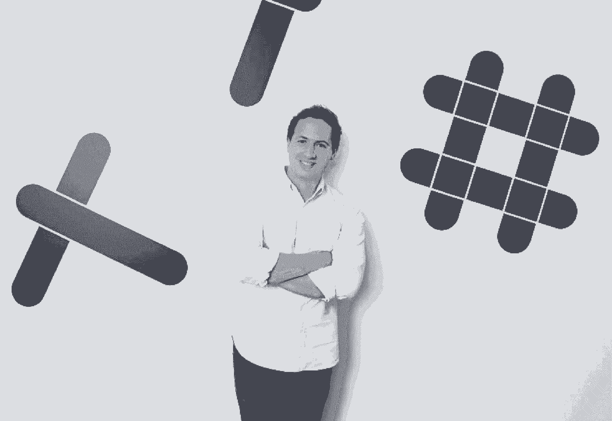

# 构建智能推送通知的必备知识

> 原文：<https://review.firstround.com/what-you-must-know-to-build-savvy-push-notifications>

根据第一轮的创业公司状况调查，智能手机已经出现了近十年，但创始人仍然宣称移动技术是最不被重视的技术。此外，在移动领域，推送通知的潜力占据着至高无上的地位。企业家 [Ariel Seidman](https://www.linkedin.com/in/aseidman "null") [抓住了这一点](http://arielseidman.com/post/62564939335/fixing-mobile-push-notifications "null"):“很难过分夸大移动推送通知的力量。人类历史上第一次，你可以拍拍近 20 亿人的肩膀。”这就是为什么 **[Slack](https://slack.com/ "null")** 的 **[Noah Weiss](https://www.linkedin.com/in/noahw "null")** 是一个通过更智能的 pings 使世界更加紧密的真正信徒。

在 Slack 之前，Weiss 曾在 Foursquare 工作，当时 four square 在 2014 年大胆地将原生广告服务分成了两个应用。在此期间，月活跃用户增加了五倍多。韦斯也是谷歌结构化数据相关搜索项目的首席产品经理。最近，韦斯加入了 Slack [以扩建其纽约办事处，并领导其新的搜索、学习和情报小组](https://medium.com/@noah_weiss/starting-up-slack-s-search-learning-intelligence-group-in-the-new-nyc-office-af6523090789#.sqly156er "null")，其任务是开发功能，使公司越使用 Slack 就越有效率。

在这次采访中，韦斯描绘了推送通知的动态演变——揭示了智能手表和充满应用程序的主屏幕时代的关键范式转变。在这里，他还分享了初创公司寻求建立推送通知策略的技巧，以及投入、指标和指导方针。任何想要掌控这种高风险、高回报渠道的初创公司都将受益于韦斯的智慧。

一个伟大的推送通知是三件事:及时、个人、可操作。

# 推送通知的发展

在分享策略之前，Weiss 总结了推送通知的演变，因为它与**使 pings 强大的三个品质有关:及时、个性化和可操作性。他认为他们的历史和发展是你制定未来战略时需要考虑的基本背景。这里有一个简短的四阶段历史:**

**邮件作为推送通知的前置。**早期 web 时代的推送通知是电子邮件。“电子邮件和推送之间有很多相似之处，”韦斯说，“过去，你可以通过提供你的电子邮件地址来允许与网站进行公开交流。电子邮件成为把一个人带回网站的主要、可靠的方式；不是通过门户或书签。最后，电子邮件中有一个退订选项。通知的对等物是调整推送设置，或者更常见的是卸载应用程序。”

**迁移到移动设备。随着用户越来越多地使用手机，电子邮件开始变得不稳定。“可能很难回忆起智能手机出现之前的时代，但人们过去不习惯生活在自己的收件箱里。韦斯说:“他们一天从电脑上查看几次电子邮件。“即使是电子邮件营销策略非常成功的公司，在移动领域也碰壁了。还记得 Groupon 提供的激光脱毛优惠吗？为什么你收到的时候会收到？你什么时候对脱毛感兴趣或表示会在手机上做出这种购买决定？当绑定到用户、位置和时间时，推送通知变得更加有效。虽然如果做得不好，他们会感到不愉快，但他们有可能做到及时、个性化和可操作。”**

**与短信竞争，而不是电子邮件。**在手机上，推送通知更像是短信，而不是电子邮件。“推是关于与这一时刻相关的东西。你可以发一封几天内都不会被阅读的邮件；韦斯说:“对于时事通讯或文摘来说，这没问题。然而，推送通知的实时性或所需的注意力是完全不同的。有了 pings，你就能有效地与 SMS 和其他非常个人化的通信方式竞争。如果其余的通知来自某人的配偶、最好的朋友或母亲，你必须有多私人？它必须处于同一水平。”

**穿越所有的应用程序。**当人们第一次采用智能手机时，他们的应用程序可以放在主屏幕上的 4x4 网格中。现在，美国普通人的手机上大约有 55 个应用程序。“你会发现，人们实际上不可能经常使用所有这些应用程序。韦斯说:“如今很难形成一种节奏，让应用成为日常习惯。“对开发者来说，现实是你可能不会出现在某人的主屏幕上，用户可能也不会习惯一天使用多次。这就是通知变得越来越重要的地方。对于大多数应用程序来说，推送通知可以完美地传递紧急信息:优步即将抵达，你的航班登机口已经更改，或者你被提到了 Slack。如果用户被 50+的应用程序淹没，你不能指望他们记得在正确的时间和地点使用你。你需要主动吸引他们。”

Noah Weiss

# 围绕这些原则建立你的通知策略

一个深入的通知策略可以权衡和编织几个因素，如附近的 wifi，个性化，社交因素和实时捕捉位置，以支持其推送通知。但是对于刚刚开始使用推送通知技术的创业公司来说，有一些基本的东西需要考虑。从基础到更高级的技巧，Weiss 概述了他在开发推送通知系统时学到的重要经验。

**提升留存** ***外*****app。**

从用户保持的角度来看，当你的应用超过功能门槛后，回报会递减。你只能在一个应用中加入这么多功能，并期望新用户在最初的几个会话中发现它们。“移动领域最大的挑战是留住新用户。有一些行之有效的策略可以让他们进门:高效的应用安装营销、社交渠道、SEM 和 SEO。然而，真正困难的是让新用户养成习惯，”韦斯说。“总有一天，你的应用程序的改进不会显著影响你的应用程序外表面区域(即推送通知)的投资。那是因为一旦有人关闭了你的应用程序，在应用程序的第四个标签页上是否有他们错过的神奇体验就无关紧要了。如果他们再也不打开它，他们将永远不知道自己错过了什么。”

在你寻求为你的应用程序建立最佳用户体验的过程中，不要忘记，这种体验只有在用户首先打开应用程序的情况下才会发生——并且不断返回。“当我看到一个应用程序投入了难以置信的时间和精力，却没有任何重新吸引我的策略时，我总是感到惊讶和痛苦，”韦斯说。“当然，大多数年轻的开发人员不会考虑通知。不要犯那个错误。这是当今移动产品开发中最大的一个疏忽。”

获客推动 app。用户保留建立了一个企业。

**不要误以为下载有权限。**

请求授权发送通知不仅是好的形式，而且在技术上也是必要的。“如果你使用的是 iOS，发送通知是用户必须授权的权限。不像在 Android 上，下载应用程序并没有给你这种权力。“你必须提示用户，”韦斯说。“这是关键时刻。如果用户拒绝许可，应用程序没有办法把他们拉回来，这大大降低了他们成为活跃用户的可能性。即使他们接受，也不是有约束力的合同。”

如果用户厌倦了你的推送通知，最好的情况是他们选择在应用程序中保持活跃的通知，但更有可能的是他们会导航到他们的手机设置来关闭所有通知或简单地卸载应用程序。这实际上是不可逆的。要点:提供用户的第一次通知体验，否则他们会永远关闭这个渠道。"

因此，第一步是在开始时提示用户同意通知——如果他们说不同意，其余的建议就无关紧要了。它包括用户教育，在用户认为有价值的行动后放置提示，或者做预先提示，以获得绿灯，在以后的日期请求许可，以提高转化率。然后就是保持信任，保持沟通的畅通。这两个步骤都有大量的文献记载，所以韦斯推荐这个教学大纲:

[向用户询问移动权限的正确方式](https://library.launchkit.io/the-right-way-to-ask-users-for-ios-permissions-96fa4eb54f2c#.3u7waqk3w "null")作者[布伦登·穆里根](https://twitter.com/mulligan "null")

[为什么 60%的用户选择退出推送通知，该怎么办](http://andrewchen.co/why-people-are-turning-off-push/ "null")陈楚翔

[让你的用户评论你的应用的正确方法](https://medium.com/circa/the-right-way-to-ask-users-to-review-your-app-9a32fd604fca#.iz4jrwiin "null")作者[马特·加利根](https://twitter.com/mg "null")

鉴于获得通知许可的风险很高，这些文章的主旨是默认规避风险。“如果你够聪明，你实际上在通知方面会非常谨慎。韦斯说:“在所有实验中建立安全网，因为任何不成功都可能持续很长时间。“例如，如果我要启动一个所有用户都会收到的每周 ping，我会在开始时进行 5%或 10%的实验，以限制人们选择退出通知的任何潜在负面影响。”

**明确衡量通知的三个指标...**

为了评估你的通知策略，确定三个指标: **1)用户退出通知许可的比率，2)卸载率和 3)每 100 ping 的动作**。

“要评估一个好的通知，你必须平衡积极参与和设置退出的负面影响。韦斯说:“这是一个微妙的平衡，因为你可能会将短期的参与度提升与用户卸载后无法再次参与的长期负面影响进行比较。”“首先，将您的评估与卸载和通知禁用率挂钩。如果你是一款消费者应用，卸载率低于 2%，你就处于安全区。因此，如果你的周流失率是 1%，而你的流失率从 2%增加到 1.02%，这并不是毁灭性的。不过，要注意任何剧烈的波动，因为周复一周的复合效应可能会变得有害。

要获得通知策略的回报，请不要局限于开放率，而是要衡量所采取的具体行动。“我推荐的一种方法是监视一个时间窗口，在 ping 后查找可以追溯到原始通知的操作数量。韦斯说:“例如，如果通知鼓励用户对他们最近访问过的地方进行评级，那么就要分析在 2-6 个小时的窗口内，每 100 次 pings 中用户做出了多少评级。”总是会有归属问题，但是如果您在发送通知后定义一个固定的评估时间窗口，您可以更有把握地接受结果

**...但是校准它们来比较在 iOS 和 Android 上的性能。**

对于那些想要跟踪打开率作为衡量标准的人，Weiss 有一些关于不同操作系统上的通知性质的观察。“追踪 pings 的打开率和追踪电子邮件一样容易，但要知道 iOS 的打开率比 Android 低得多，多得多；维斯说:“对于 iOS 上的相同 pings，它们的打开率可能会高出五倍。“用户倾向于在 Android 上处理通知，因为有一个收件箱，只有当你手动打开每个 ping 时才会清空，而在 iOS 上，一旦你从锁屏中打开一个通知，其他的通知都会清空。”

与其他功能一样，操作系统在通知方面也有不同的功能。“例如，Android 上的通知可以显示内嵌照片，这可以免费提高 15-20%的参与度。由于大多数开发人员最经常在 iOS 中工作，他们不会考虑发送带有照片的 Android 推送通知，”韦斯说。“还有内嵌的操作按钮，因此用户可以从通知中采取措施。这些人的参与率也更高。基本上 Android 的一切都更适合通知开发，我是作为一名 iPhone 用户这么说的。”

用个性化的花絮填充你的通知，让它们听起来像是来自一个亲密的朋友。

**抵消新鲜感。**

至少在六周内运行通知实验，但是 12 周是一个很好的最佳时机。韦斯已经认识到，进行更长时间的测试是必要的，以消除任何负面影响。“一般用户会在大约一个月的时间里忽略不需要的 pings，而不采取任何行动，例如更改设置或卸载应用程序。韦斯说:“烦恼超过了被迅速解雇的轻松程度，这是一个门槛。

通知具有强烈的新奇偏见，这延迟了对用户的真实影响。有一次，韦斯发起了一项实验，测试向用户发送表情符号。“我们将文本长度削减了一半，并添加了相关的表情符号。在实验的前几周，我们的指标飞速上升。用户数和 ping 打开数大幅上升。WAUs[每周活跃用户数]上升。维斯说:“宣布未来就在眼前，那就是表情符号，这很有诱惑力。”。“嗯，我们随着时间的推移对它进行了监测，增长速度放缓，然后持平。最终，影响是中性的。这还不错，但如果我们根据最初的结果来分配资源，那就糟了。最好在几个月内测试，而不是几周内通知。”

尝试如何做，何时何地做。

推送通知背后的“为什么”和“谁”通常更简单——目标是增加所有用户的参与度。然而，在 pings 应该被释放的方式上有不同的想法。在他的职业生涯中，韦斯已经帮助启动了 100 多个通知实验——测试从一天中的时间到基于到家的触发的一切。[和运输软件一样，没有“正确”的方式](http://firstround.com/review/the-right-way-to-ship-software/ "null")，但在这里他分享了一些不可协商的内容:

**只对最紧急的 pings 求助于振动**。“使用 push，您可以控制手机振动或静音的默认设置。根据我所有的用户研究，我知道这是最高风险的决定之一。韦斯说:“如果一个通知让用户感到不安，而她并不觉得这很紧急，那么该应用被立即卸载的可能性就会飙升。“如果事情很紧急——比如你即将错过飞机，或者同事发来紧急、直接的信息——蜂音器可能是一个非常强大且受欢迎的工具。否则，这是危险的，会适得其反，所以不要把它用在喜欢或朋友喜欢的事情上。平均而言，人们每天会查看手机 70 到 100 次，所以他们很可能在接下来的 15 分钟内看到你的信息。

**匹配用户的生物节律**。“ping 的时机很重要，但并没有一条规则规定绝对的最佳窗口。但是花点时间想想如何反映你的用户每天的进展。韦斯说:“不要在用户睡着的时候发送通知，因为你会吵醒他们，否则他们早上会发现你的上面有一长串信息。也要考虑内容的性质。早上发送新闻效果很好，在上下班途中发送内容也是如此。通过监控他们的参与度来优化你的节奏。"

在你的文案中使用多种个性化风格。“这非常重要。插入用户的名字不算，比如“诺亚，这是你周二的每日交易！”韦斯说:“在 ping 文本中展示你对用户的了解，否则他们会激活自己的天然过滤器，抵御营销风暴。Twitter 为用户提供了一个很好的实践来赶上他们的时间表。该服务提示你查看伊夫林、马科斯和莉迪亚最后一天的推文。这些都是你追随的人，被叫出名字。Spotify 对你经常听的艺术家的新歌也是如此。"

把你的 ping 想象成一个优步。“如果你要求在曼哈顿下东区找一个特定的街区，你的优步让你在曼哈顿的任何一个街区下车，你会高兴吗？韦斯说:“嗯，这似乎很明显，但可能初创公司会忘记将他们的用户路由到应用程序*的屏幕上，而这正是 ping 所承诺的*。“如果通知能让人们到达他们期望的地方，他们就会点击通知。如果没有，他们下次会忽略它。许多电子商务应用程序把顾客带到通用的主屏幕，而不是特定的项目或页面，从而搞砸了这一点。”

魔术师把自己的牌拿到一副牌的上面。具有智能通知功能的应用程序将会有这种花招，在适当的时候将它们的服务提升到人们的手机前面。

# 通知的未来

智能手机和智能手表的屏幕将会不断变化，但无论大小如何，主屏幕的面积总是有限的。考虑到手机上保存的应用数量不断膨胀，这种限制是一种制约。以下是他对移动操作系统发展的看法，以及对通知未来的思考:

**使锁屏成为新的主屏幕**。事实是，除了手机主屏幕，人们唯一能看到的地方就是锁屏。“你的主屏幕上有你想要的应用程序，不超过 20 个。韦斯说:“你的锁屏会列出你手机上数百个应用程序的最新通知。“我认为锁定屏幕最终会取代主屏幕。将会有一个家庭体验，将会有一系列的应用程序向你伸出援手。最终，排名不仅仅是近期和频率的问题。操作系统通知将会从感觉像 Twitter 的实时、嘈杂的信息流演变成感觉像脸书的排名反馈。”

你永远可以导航到一个应用程序，但通知将是你坚定不移的向导。

[捆绑和解绑应用程序是一种自然现象](http://ben-evans.com/benedictevans/2014/8/1/app-unbundling-search-and-discovery "null")，韦斯看到了锁屏将再次重新捆绑它们的趋势转变。“在过去的三年里，应用生态系统中出现了一个渐进的、巨大的拆分。韦斯说:“对于单一用途的应用，应用变得更加专业化。“但随着用户积累了大量应用，在正确的时间找到正确的服务变得越来越困难。通知是应用程序向人们发出信号，告诉他们有及时有用的东西可以提供。将会出现一种新的导航模式，当用户考虑使用应用程序时，应用程序可以控制——希望是智能地控制。”

**丰富语境意识**。如果用户越来越多地通过发送到锁屏的一连串 pings 与应用程序进行交互，那将是因为他们天生相信他们正在被发送最及时、最相关的警报。这只有在具有强大的上下文意识的情况下才会发生。“手机上的传感器可以让你在手机服务中建立一定程度的环境感知，这是你在桌面或电子邮件上永远做不到的。如何将这种意识转化为切实可行的及时相关通知？”韦斯问道。“这是一个激动人心的新领域。想象一下，一种服务可以区分某人是否在特定的商店停留，无论是咖啡馆、机场还是健身房。对上下文的独特理解为发送相关 pings 创造了大量新机会。”

最好的应用程序将是那些你不必记得使用的程序。他们会提醒你。很快这将成为唯一的应用类型。

“我最喜欢的一个来自 Foursquare 的推送通知是关于一个城市中新的热门场馆。韦斯说:“它可以根据你的手机所在的位置，交叉列出你实际去过的地方。“它通常会每周向你发送一次通知，内容是‘嘿，这里有三个你所在城市最热门、最流行、但你还没去过的地方。’这是一个神奇的时刻，当你意识到你只是把手机放在口袋里走来走去，也许你整个星期都没有使用这个应用程序。你一点工作都不用做。它不仅会把你拉回应用程序，还会让你感到愉悦。"

在移动设备上利用传感器的综合方法可能具有挑战性，但有一些基本的方法可以开始。“虽然大多数开发人员不容易建立这种类型的位置理解，但建立一个基于背景位置理解一个人何时在家或工作的模型是相当琐碎的。这是触发相关 pings 的两个非常丰富的环境，”Weiss 说。

# 将这一切结合在一起

虽然通知对于提高保留率和参与度很有帮助，但不要一开始就把它们视为增长的黑客工具。它们有潜力成为与用户互动的最直观和最亲密的方式。为了建立这种值得信赖的关系，它们必须是及时的、个性化的和可操作的。通知策略必须征得用户的同意，并通过每 100 次 pings 的退出、卸载和操作来衡量。通过用户输入主动定制通知和通过上下文感知被动定制通知越多越好。

“我们仍处于移动领域的早期。韦斯说:“设备继续向更大的屏幕、更长的电池寿命或可穿戴的方向转变。“然而，无论硬件如何发展，通知将是你的移动设备最亲密的功能。就像亲密的朋友或家人一样，智能通知会记住你的偏好和历史。他们会为你指引正确的方向，让你与所爱的人保持联系，提醒你在最好的时候什么是重要的。这大概是技术的最大威力了。”

照片由 Slack 提供。