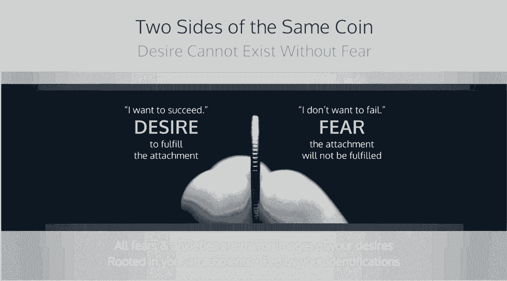
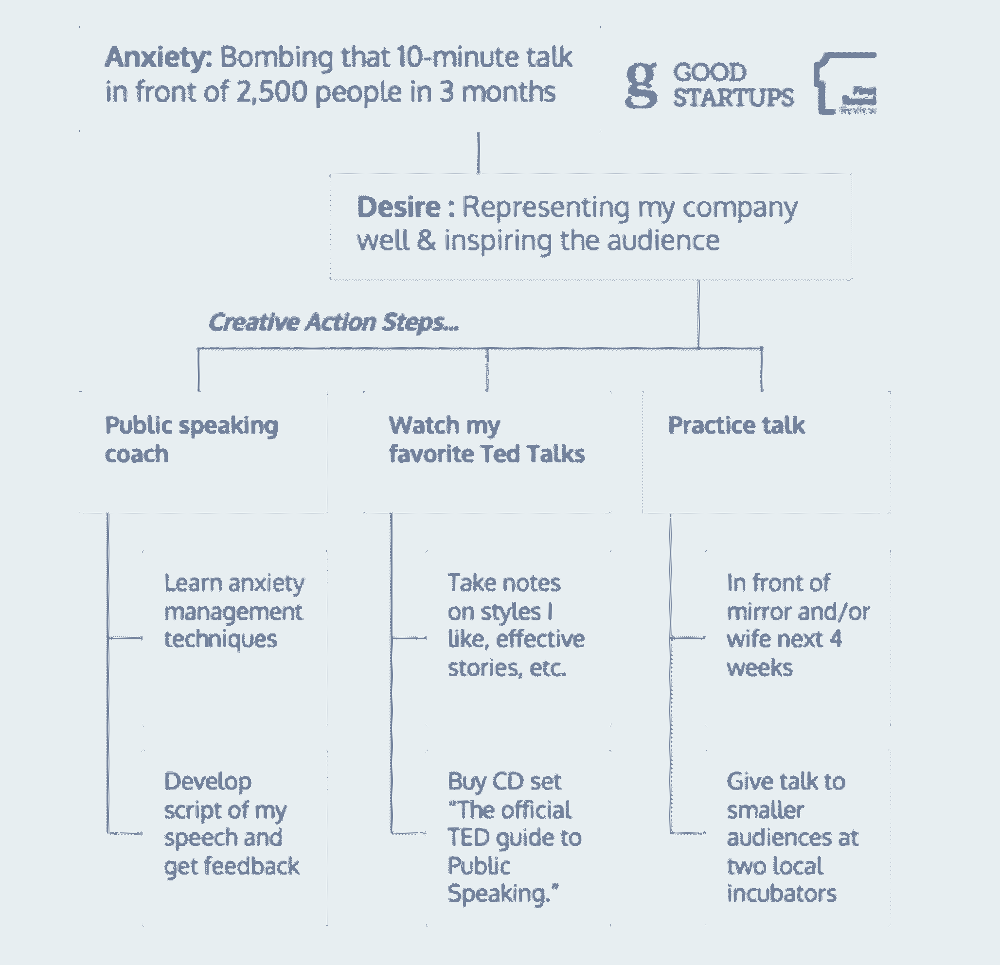

# 当恐惧成为竞争优势时——让恐惧为你服务的 4 个步骤

> 原文：<https://review.firstround.com/when-fear-is-a-competitive-advantage-4-steps-to-make-it-work-for-you>

企业家在心理上是独特的。在一个高达 90%的创业公司失败的世界里，最持久的远见卓识者将会坚持到底，与 10%战胜困难的人一起体验自由和成功的想法会激励他们。它们很有弹性。他们适应性很强。他们是极端的冒险者。最成功的企业家倾向于奔向不确定性和威胁，而不是逃避。为什么？原因是，至少根据心理学家的说法，成功的企业家往往对恐惧有一种心态，而我们其他人根本不会分享这种心态，至少程度不同:*如果以正确的方式利用，理解我们的恐惧和焦虑可以引导我们* *[突破](http://www.goodstartups.com/breakthrough "null")* *自我发现、创新和创造力*。对于杰出的企业家来说，注意到恐惧是一种竞争优势；这是一种我们带着好奇心、激情和对指数增长的渴望投入的情感。

**好消息是，这些围绕恐惧的关键心态是可以学习的。**

连续创业者和高管教练贾斯汀·米兰诺经历了成功和失败——但正是失败改变了他的生活。“我正在创建一家公司，以解决我们今天面临的最大的环境挑战之一:食物浪费，”他说。然后，他最大的恐惧变成了现实。公司失败了，在随后的自我反省中，他以更真实的眼光看待自己的动机。“我意识到，我潜意识里想做一些宏大的事情，因为我没有充分重视和爱自己。我试图证明我的自我价值。”他并不害怕他的生意失败，他害怕的是失败的感觉。这两者之间有很大的区别，但它们通常是紧密相关的。

至少，这是米兰在令人满意的对称之后学到的。似乎是他最大的失败导致了他最大的成功:共同创立了 [Good Startups](http://www.goodstartups.com "null") ，这是一家面向初创公司的高管教练公司，专注于前沿的领导心理学、神经科学和情商。他开始凭直觉理解的是，他最终的共同创始人丹尼尔·科达洛博士，[耶鲁情商中心](http://ei.yale.edu/ "null")的福利主任，已经跨文化研究了近十年。2015 年，他们联手利用他们的科学专业知识和实地创业经验来帮助创始人和他们的团队[识别和管理他们的恐惧和焦虑](http://www.goodstartups.com/breakthrough/ "null")，更重要的是，理解阻碍他们自我控制和可持续高绩效的深层心理。

有很多企业家在不知不觉中试图通过他们的公司来证明他们的自我价值。

在这次独家采访中，米兰诺和科达洛分解了将你的恐惧和焦虑转化为竞争优势的 4 个步骤。您将了解到:

恐惧和焦虑的重要区别

如何发现你焦虑的来源

可靠地将你的恐惧转化为创造力背后的神经科学

此刻驾驭恐惧的有效工具

当你练习和掌握这些工具时，结果是更好的决策，扩展的表现和能量，更鼓舞人心的领导，和自我掌握的门道。这是有科学依据的。

“我们这个时代最优秀的企业家都会经历恐惧，”米兰诺说。"正是他们与恐惧的关系使他们与众不同。"

# 第一步:理解你和恐惧的关系

第一件事:为了将你的关系转变为恐惧和焦虑，你需要定义你在处理什么。“恐惧是一种原始的情绪，它会立即发生，以确保我们的生存和安全，就像躲开行驶中的汽车一样，”科达洛说。“焦虑时，我们基于想象预测未来的威胁，或者试图避免过去的痛苦经历，这也是基于心理预测。恐惧通常持续几秒钟，而焦虑通常是慢性的，可以持续几天甚至几个月。”

米兰诺引用了马克·吐温最喜欢的一句话来证明行动中的焦虑:

我是一个老人，知道很多麻烦，但大多数都没有发生。

作为企业家，我们每天都面临着不确定性和风险，当事情未知时，焦虑是很自然的。一些常见的焦虑想法包括:“如果我们没钱了会怎么样？”“如果这次产品发布会失败，我会被董事会解雇吗？”根据 Milano 的经验，即使他的客户在最高水平上蒸蒸日上，也会经历慢性焦虑的想法，比如“下一个大的胜利将来自哪里”，或者“我如何继续证明这个巨大的估值是合理的？”

关键是，99%的时候，当人们说他们正在经历恐惧时，他们实际上正在经历对可能永远不会发生的事件的焦虑。当这种焦虑整天在我们的潜意识中像一张破唱片一样播放时，我们就在我们的边缘大脑中徘徊，特别是杏仁核，它负责我们对威胁的反应。当我们透过威胁的镜头看世界时，我们经历了狭隘的视野和有限的可能性。

当我们只看到有限的可能性时，“这极大地削弱了我们的决策能力，而作为一名企业家，这是我们最重要的领导资产之一，”科达洛说。“不管我们愿不愿意承认，我们做的每一个决定都要先经过一个情绪过滤器，恐惧是最强大的情绪过滤器之一。这样想:你的决定与快乐幸福的地方和悲伤绝望的地方有什么不同吗？大多数情况下，答案是肯定的，因此，认识到情商是创业领导者的一项基本技能非常重要。

# 第二步:揭示我们焦虑的来源

一旦你认识到你正在经历的很可能是焦虑，问题就变成了你如何释放焦虑的束缚，这样你就可以用扩展的意识和创造力来运作？

Milano 提出，揭开你焦虑根源的第一步是注意你对某些结果和身份的依恋。“焦虑是对更多恐惧的恐惧。它是由依恋推动的。它植根于控制我们周围事物的需要，以保持我们的现实已知和安全。”Milano 建议，患有焦虑症的创始人可以自己解决这些问题:

你对什么样的期望、想法或结果感兴趣？特定投资者？特定的客户？某种类型的产品起作用？六个月内出现现金正增长？

是什么身份在驱动依恋？你有没有给投资者、媒体和你的团队树立一个自己是下一个改变游戏规则的企业家的形象？

**考虑这个例子:**一位创始人告诉她的投资者，公司将在六个月后实现现金正增长。然后不可避免的障碍出现了，很明显目标是无法实现的。人们很容易陷入焦虑和假设的泥沼:董事会会让我走吗？团队会开始质疑我的领导能力吗？

另一方面，一个练习过发现他们的依恋的领导者，能够以一种更有成效的方式看待事物。“健康的做法是承认对某个结果的依恋，放松对它的控制，用你的创造力设计一条基于现实的新道路，”Milano 说。“你会发现什么是真实的，并面对实际发生的事情。然后，你可以从正直和清醒的角度对你的团队说，“看起来不会超过六个月。看起来更像是 12 个月。现在我们知道了这一点，下面是我们正在做的事情。"

对身份的依恋可能很难放弃，但考虑这一点很重要。许多创始人，不管是通过他们自己的战略还是媒体的关注，都承担了“下一件大事”的重任。突然之间，他们不仅仅是在生产产品和经营公司，他们还实现了公众的期望。“现在，如果你的产品发布不太成功，就会开始威胁到你的身份。不仅你的产品坏了，而且你是一个骗子，一个普通的人类恐惧。

这是企业家最大的恐惧之一:我去了那里，在下一个大项目上卖掉了所有的朋友和投资者，但没有成功。我是个骗子。

“这说明了谦逊的力量，”米兰诺说。**最鼓舞人心的领导者知道这与他们无关**。他们承认挑战，尊重竞争，并为起伏做好准备。重要的是，他们将这一点传达给他们的团队和投资者。“他们说，‘这与我无关。这是我们所有人共同努力实现这个美好的使命。我们在前进的道路上会遇到一些坎坷，重要的是我们要作为一个团队和董事会一起克服这些困难。

科达洛补充道，“重要的是要知道拥有某些身份是可以的，这是完全自然的，也是人类的一部分。要知道，所有这些身份都伴随着潜在的期望，这些期望会很快累积起来。作为一名领导者，从对公司和社会最有利的角度做出决策，比维护个人身份更令人愉快。”

一旦米兰诺和科达洛帮助他们的客户识别他们无意识的依恋和身份，他们就会更深入地研究恐惧的三个主要来源，他们称之为“恐惧的三种文化”

**稀缺文化:**没有足够资源(如时间、金钱等)的信仰体系。).

**厌恶文化:**认为“我有错误的经历”或“我不应该有这种感觉”的信仰体系(例如羞耻、内疚等。)

**无价值文化:**“我不够，我就是这样”的信仰体系

大多数企业家都很熟悉稀缺文化，他们经常在财务上捉襟见肘，或者每天工作 16 个小时来实现下一件大事。关于时间稀缺，科达洛说，“有趣的是，就金融资源而言，硅谷是这个星球上最丰富的地方之一，但当谈到时间时，它却是这个星球上最贫穷的地方之一。”

米兰诺和科达洛提出，稀缺文化是一个神话，深深植根于无意识的社会规划中，可以通过意识和新习惯来转变。根据科达洛的观点，这种做法很重要，因为“当稀缺占主导地位时，自私、过度竞争和创造性停滞也会随之出现。当富足占主导地位时，慷慨、合作和快速转变也同样存在。”

当与客户合作时，米兰诺和科达洛带领人们深入到他们个人的稀缺规划中，为他们的生活写下新的、更有力量的故事。

**拒绝厌恶的文化**

科达洛指出，目标永远不应该是消除恐惧，而是承认和接受恐惧。他在他指导的所有企业家身上看到了同样的模式:首先是一个伟大的想法，然后是将其变为现实的动力。“这非常令人兴奋，也非常有趣。这是非常渴望和创造力驱动的。”然后他们实际上开始建立一家公司，事情阻碍了他们——焦虑开始了。“现在有些事情阻碍了我的视野；有些事情与我对世界的愿景相抵触。恐惧是这个过程中很自然的一部分。”

采用这种心态，恐惧看起来不再像威胁；这只是一揽子计划的一部分。

根据米兰诺和科达洛的经验，以下思维方式的转变会对创始人产生深远的影响。当一个产品失败时，当新应用在应用商店获得两星时，当资金没有到位时，成功的创始人不会陷入思考，“这是错误的体验。这不应该是这样的。”相反，他们接受这些障碍作为他们经历的一部分——这是他们唯一能够也应该拥有的。他们把这种经历作为成长的机会，成为更好、更强、更鼓舞人心的领导者。

“当你的产品不起作用时，你需要反馈，以便真正创造出人们想要的产品，”Milano 说。

“每当你经历恐惧和焦虑时，总有信息和数据想要被发现。”

焦虑让你知道什么时候你需要进入状态。米兰诺指出，问题在于，当你只是整天焦虑不安时，每天都是如此。如果这些情绪变成慢性的，就不会对你有好处。哪里有慢性焦虑，哪里就几乎总是有回避或厌恶。

那个两星评价的 app？客户不喜欢它——它需要改变。“与恐惧有着健康关系的人可以说，‘这就是正在发生的事情。我要接受这个事实，拥抱它，接受信息。“现在我能创造性地做些什么来解决这个问题呢？””米兰诺说。另一方面，与恐惧有着不健康关系的领导者通常会失去纠正错误的机会。停留在事情“应该”如何发展，他们错过了有价值的信号，是时候转向了。

此外，避免恐惧只会延长恐惧。“所有的情绪都在这里为我们提供关于我们周围世界的信息。这就是为什么我们进化到能感觉到它们。情绪是数据；它们帮助我们生存了数万代。科达洛说:“如果我们没有倾听一种情绪，如果我们没有完全接收到这种数据，它就会不断出现。”。**当你让自己*****完全感受和接受一种情绪时，它消散得非常快，往往在短短 30 到 90 秒内。***

*从这个角度来看，接受恐惧不仅仅是一个好主意——它还是一个重要的竞争优势。那个坏掉的产品或低评级的应用程序不会自我修复。但是你可以通过倾听你的恐惧并让它消失来有效地将你所有的问题减半。科达洛问道:“作为一名企业家，你是想把你遇到的每一个问题都加倍，还是只想处理那些真正需要解决的事情？”*

***为你的团队做个榜样:**创业是过山车。让我们接受这一点，尽我们所能解决问题。不会有恐慌。*

*培养一种不可动摇的自我价值感*

*恐惧的最终文化是无价值的文化。“这不仅仅是企业家精神，而是人类的流行病，”米兰诺说。这个信念体系是“我仅仅做我自己是不够的，我需要取得非凡的成就来获得满足感。”这是多年前对米兰打击最大的文化。*

*通常，当米兰诺问他的客户，他们是否希望通过建立自己的公司向自己、家人或社会证明什么时，答案是快速、被动的“不”。大多数人直到犯了重大错误或“失败”后，才意识到无价值文化的强大我当然没有意识到。"*

*米兰诺提出，确定你是否围绕自己的价值感做了一些工作的最快方法之一是问自己这样一个问题:“如果我的公司彻底失败，我彻底失败了，我还会无条件地爱和接受自己吗？”当科达洛和米兰在他们的虚拟集体教练会议上问这个问题时，你经常可以看到人们甚至通过视频会议技术停止呼吸。“这是一次强大而震撼的经历，”米兰诺说。*

*科达洛说，我们生活在一种“将企业家奉为现代神”的创业文化中。“我们崇拜那些完成不可能的任务、创造出很少有人梦想过的东西的人，就像埃隆·马斯克在电动汽车和清洁能源领域所做的那样。当然，这些都是非凡的人，但是当我们把所有的自我价值都寄托在变得和他们一模一样上时，我们就是在自找麻烦。”*

*“当我们面临失去梦想和理想时，一种自然的反应是自我价值感低落，”Milano 说。对他来说，这是他食物垃圾创业失败的最大礼物。*

*“通过那次经历，我被迫沉浸在失败和低自我价值感中，并学到了至关重要的一课:任何成功和成就都无法填补自我价值的缺口，”他说。“任何昂贵的房子、闪亮的汽车或浮华的新闻标题都不会带来真正的满足感。我现在正在体验为他人服务和创造的纯粹快乐，而不需要我的公司来证明我的自我价值。在我看来，这是企业家可以培养的最重要的技能之一。”*

*通过那次经历**，**米兰诺现在[带领他的客户](http://www.goodstartups.com/executive-coaching/ "null")进入他们独特的个人经历，这是他们无价值文化的来源。“也许你的父母没有告诉你你足够优秀，而你正在努力证明你是有价值的，”他说。其他时候，破坏性的障碍本质上是专业性的——被解雇担任首席执行官的痛苦经历是一个主要的例子，现在你想证明你可以成为首席执行官。"*

*根据科达洛作为一名心理学家的经验，学会进行这种自我调查对创始人来说是一种变革。“我见过的最有影响力的事情之一就是对他们是谁以及他们为什么会这样做产生了好奇心，”他说。“正是这种态度让人们尽可能在社会中发挥最大的影响力。”*

# *第三步:从恐惧走向渴望*

*一旦你做了勇敢的工作来化解你独特的焦虑来源，你就可以自由地将你的焦虑转化为更有用的东西，比如创造力和创新。科达洛通过尖端的神经科学向我们展示了如何做到这一点。*

*“如果你从这篇文章中想起一件事，请记住:**每一种恐惧都反映了一种欲望**，”科达洛说。"它们是同一枚硬币的两面。"*

*害怕公开演讲？这是因为你渴望分享一个有说服力的、清晰的信息。担心你得不到资助？这是你筹集资金和建立成功企业的强烈愿望。害怕失败？在那下面是你想要对人类产生积极影响的愿望。*

**

***这不仅仅是一种预感；它实际上深深植根于神经科学。**我们大多数人至少对杏仁核有模糊的认识，杏仁核是大脑中位于太阳穴后面感知威胁的部分，是大脑中“战斗或逃跑”的部分。当杏仁核感知到威胁时，它的工作之一是停止向大脑皮层发送信息，在那里我们进行更高级的思考和理性决策。*

*大多数人不知道的是，杏仁核的隔壁是伏隔核，它负责欲望和所有让我们渴望感觉良好的事情。“科学家试图找到伏隔核止于何处，杏仁核始于何处，却找不到。大脑的这些部分本质上是相互关联的。科达洛说:“当杏仁核激活时，伏隔核也在激活。*

*企业家通常被巨大的欲望所驱动——解决大问题和改变世界。那么，很自然的，他们也比普通人经历更多的恐惧。“但是当你意识到你大脑中发生的事情时，你可以可靠地从你基于恐惧的边缘脑(杏仁核所在的地方)转移到新皮层，新皮层管理更高级的功能，如判断、决策和创造力。”*

*与恐惧保持健康的关系是通往你大脑中优化判断、决策和创造力的那部分的大门。*

*米兰诺和科达洛开发了一个由五个问题组成的练习，帮助他们的客户理解他们的焦虑此刻告诉他们什么，并转向有意识地追求他们的创作欲望。为什么这个过程很重要？很简单，它让你的大脑从基于恐惧的兽性反应中解脱出来，让你迅速进入创造性解决问题的模式。*

*恐惧或焦虑是什么？*

*你感觉它在你身体的什么地方？*

*被镜像的欲望是什么？焦虑之下的欲望是什么？*

*一旦你发现了欲望，你会选择采取行动吗？*

*如果有，有哪些创造性的行动步骤？*

*让我们通过引入一个真实的例子来测试这个系统，这个例子是全人类最害怕的概念之一(它甚至胜过死亡)——公开演讲。几个月后，你将在 2500 名思想领袖和有影响力的人士面前，就你公司的愿景发表高调演讲。任何人都会感到某种程度的焦虑，尤其是对我们这些不以公众人物为生的人来说。*

***有什么恐惧或焦虑？**这应该很简单，但这是意识开始的地方。失败。轰炸谈话。成为众多观众嘲笑和鄙视的对象，甚至更糟，沉默的对象。错过了一个激励你所在领域的主要影响者的绝佳机会。*

***你觉得它在你身体的什么地方？**米兰诺和科达洛建议花时间走出我们的大脑，进入我们的身体。“当谈到焦虑时，生活在你的脑海中只会导致沉思，甚至更多地陷入我们的恐惧故事中，”米兰诺说。花点时间去注意恐惧和焦虑的感觉存在于你的脚、腿、躯干、手臂和脸上的什么地方。科达洛说，对他来说，焦虑的感觉就像“我的心跳加速，手心冒汗，胸口和喉咙有点发紧。当我感觉到这一点时，我知道焦虑数据正在到来。”米兰诺最常注意到他肚子里的恐惧和焦虑，而且“通过简单地定位我身体里的焦虑感，并深呼吸，我进入了一个存在的地方。”*

***被镜像的欲望是什么？**“这是你将硬币抛向另一边的大好机会，”科达洛说。事实证明，你的焦虑故事并不植根于可能会出错的地方，而是你想做对的事情。对于这个演讲，你想成为灵感的源泉，成为公司的杰出代表。你想传达一个清晰的信息，让别人听到。你想激活志同道合的人，邀请他们加入你的使命。“当你从恐惧中走出来，进入你的欲望时，你感觉到你的感觉发生了变化吗？”米兰诺问道。“这是一个游戏规则的改变者，因为你刚刚打开了你的大脑，进行更高层次的思考。”*

*做出选择。恐惧感觉就像我们被逼到一个角落，好像我们无法逃脱，但事实证明，我们只是在否认自己的一项关键自由:选择应对这一挑战并根据我们的愿望采取行动。[米兰诺和科达洛教导](http://www.goodstartups.com/free-webinar/ "null")通过问自己“我选择变得有创造力并使这个愿望成为现实吗？”，我们打开了完全释放恐惧的可能性。科达洛说:“当我们经历失去控制的幻觉时，恐惧就会出现，而欲望恰恰相反——它是处于控制中的幻觉。”。“做出这样的选择能让头脑平静，让我们清晰而坚定地前进。最终，我们要找到欲望和恐惧的平衡点，释放对两者的依恋。这是在硬币的边缘行走，而不是卡在一边。”*

***发挥创造力。**“既然你已经开始释放恐惧和焦虑的束缚，”Milano 说，“是时候利用你大脑皮层的力量，开始想出创新的解决方案来实现你真正想要的东西了。”你想成为公司的灵感源泉和杰出代表吗？通过观看 TED 演讲来学习讲故事的动力，或者雇佣一个作家来帮助你构思完美的信息。你想传递一个清晰的信息并让别人听到？参加一些公共演讲课程，练习在你的团队(和陌生人)面前演讲，这是重中之重。你想激活志同道合的人，邀请他们加入你的任务？让你的团队努力获取所有主要与会者的信息，并制定一个网络战略，让你在上台之前就为成功做好准备。“清单还在继续，这才是重点。你已经向各种可能性敞开了心扉，将自己从“要么战斗要么逃跑”的僵化模式中解放出来。”*

**

# *第四步:练习化解恐惧*

*所以你已经经历了理解恐惧的过程，根除了你的恐惧文化，并将你的恐惧转化为欲望。但是，当有人问了一个尖锐且出乎意料的问题时，比如说，在你讲话的中途，我们如何处理可能出现的瞬间自发的恐惧情绪呢？在 Milano 的经历中，有几种常见的身体体验是你恐惧反应的确凿证据:腹部的感觉，手心出汗，心率加快，呼吸加快，甚至说话加速。*

*变得善于识别这些身体上的表现，你也可以发展出克服恐惧的技巧。无论你是站在讲台上，还是打开一封不太可能包含好消息的投资者电子邮件，一些简单的行动就能让你摆脱麻痹，进入状态。米兰诺和科达洛提供了三个例子。*

***呼吸**:你就要上台演讲了，你觉得你可能会换气过度，忘记你想说的一切。该是**喘息**的时候了。舒服一点，闭上眼睛。感觉自己用鼻子吸入冷空气，用嘴呼出热气。重复这个动作几次，然后睁开眼睛，注意你周围的空间。*

***移动**:你成功登上舞台，正准备开始，这时你感到一种瘫痪。你的膝盖都冻僵了，脸上还带着那种呆若木鸡的表情。是时候**动**了。当你的身体在恐惧中冻结时，通过轻轻的扭动、摇晃或弹跳，你可以停止恐惧。如果你感觉到“战斗或逃跑”反应的肾上腺素激增，把你的脚牢牢地踩在地上，体验扎根的感觉，就像红杉树一样。这些简单的身体动作是米兰诺的朋友凯特琳·汉德瑞克博士开发的恐惧“模式中断器”，他是身体智能专家。*

***匹配:**匹配经验，也就是。“弗里茨·波尔斯有一句名言，他说‘恐惧是没有呼吸的兴奋’当你感到恐惧时，你通常会感到兴奋，”米兰诺说。所以，投入到这种兴奋中去，用你的话来匹配它。例如，当你演讲时，首先告诉你的听众，“我很高兴来到这里。”*

*研究表明，当你说出“我很兴奋”来配合你的体验时，你的神经系统就会放松。*

*正如创始人需要[认识到恐惧](http://www.goodstartups.com/transform-your-fear/ "null")才能克服恐惧一样，他们也需要认识到创造力，这样他们才能张开双臂欢迎它。在这里，身体也提供了最可靠的指标:“你感到宽敞、平衡的呼吸。你的内脏放松，你的肾上腺和心脏放松。你开始享受乐趣，看到更多的可能性，产生信任感，这个世界看起来很友好。米兰诺说:“你可以从平衡的角度做出清晰的决定。*

*如果你每天都感到焦虑——例如，如果你每天都在想“我不知所措了”——很可能你没有让自己充分感受到焦虑，也没有理解为什么会有焦虑。这时候，花时间做好准备是创始人武器库中最有力的工具。停下来。走过“恐惧熔炉”建立冥想练习。“正念就是意识到正在发生的事情，这样你就不会受其支配。”*

*冥想的目标并不像许多人认为的那样，是更加平静和安宁(尽管这些肯定是你可以从常规练习中期待的积极的副作用)；而是通过不同的视角来看待一个人的经历。*

*我们从事正念练习的一个主要原因是磨砺我们的注意力肌肉，以便当这些恐惧和焦虑的感觉出现时，我们可以在更早的阶段抓住它们，并简单地让它们消失。*

*然后，反过来，你可以选择你将如何回应，优先考虑将最有利于你的独特产品提供给世界的行动。*

*当然，恐惧和焦虑最终会在没有正念帮助的情况下显露出来，但如果不加以控制，它们会让创始人陷入完全精疲力竭的状态。科达洛说:“在一天结束的时候，当凌晨四点，你一整天都没有去厕所或吃东西，这时你会发现你需要做些事情来改善你的健康状况。”这种消极的焦虑管理不仅仅是个人的负担；它也会耗尽你公司最重要的资源。“每天都像柔道大师一样生活，通过你的情绪能量来工作，比不得不休息一个月来恢复，回来时精力充沛，然后从头再来要容易得多。我们大多数人都负担不起，也不应该这么做。”*

*情商的现实是，它需要被开发。和任何新技能一样，它[需要练习](http://www.goodstartups.com/breakthrough/ "null")；新肌肉必须弯曲。但是当你这样做的时候，你会发现你和你的工作以及你的同事之间的关系发生了有意义的变化。这就是恐惧的竞争优势，理解它，并学会如何将其能量转化为巨大的创造潜力。*

*“你可以改变你的神经可塑性。米兰诺说:“你可以从一个极度亢奋、忧心忡忡、含咖啡因、疯狂的企业家——因为我就是——变成一个更加平衡的人。”。“当你开始应用这些实践和工具，并重新连接你的大脑时，你将开始对这个世界有不同的体验。这样做的最大收获之一就是这个世界看起来不再不友好。它和你一样有潜力。”*