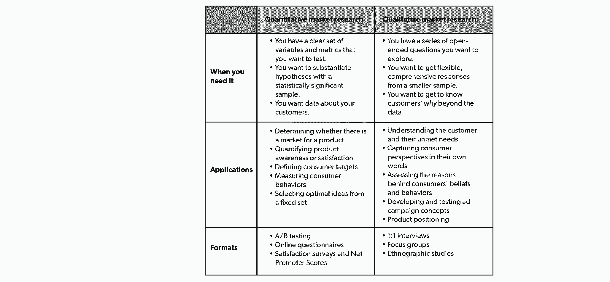
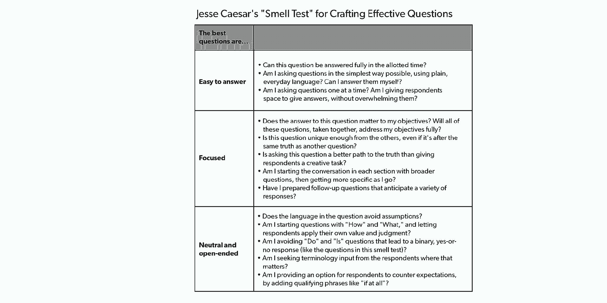

# 为什么定性市场研究属于你的创业工具包——以及如何有效运用它

> 原文：<https://review.firstround.com/why-qualitative-market-research-belongs-in-your-startup-toolkit-and-how-to-wield-it-effectively>

如果你怀疑定性市场研究的价值，杰西·恺撒 会明白。“我一开始是一名创意人员。他说:“我把市场研究人员视为煞风景的人，他们进来对我所有的漂亮作品指手画脚，让它变得平淡无味，适合大众口味。”。"显然，作为一名市场研究员，我现在的想法有点不同."

Caesar 的职业生涯让他对产品及其在客户生活中扮演的角色有着敏锐的洞察力。在更大的机构工作时，他为像[百事可乐](https://www.pepsico.com/ "null")这样的客户进行研究，在那里他沉浸在年轻运动员的世界中，研究他们如何将佳得乐融入他们的训练方案。现在，作为一名独立顾问，他已经与亚马逊[和创新市场](http://amazon.com/ "null")[这样的大品牌合作——他已经准备好给这种研究策略重新命名。](https://creativemarket.com/ "null")

“Qual 不是用来淡化想法的。这是为了激励他们，审查他们，优化他们，”凯撒说。“根据我与初创公司合作的经验，我认为 qual 被误解了，因此使用得不够频繁。创始人可能会崇拜数据，但他们会从将 qual 作为一种生成资源中获益匪浅。**良好的定性市场研究能激发洞察力，为创意之火添油加醋。**

在这次独家采访中，凯撒全面概述了定性市场研究以及 qual 独特地揭示的各种问题。他概述了创业公司如何选择合适的方法来适应他们的产品并建立他们的研究以取得成功的实用建议。

# 定性研究:它是什么，它不是什么，什么时候它能有所帮助

对于那些探索市场研究领域的人来说，qual 看起来就像一个难以理解的黑匣子，容易被误解。在这里，Caesar 指出了 qual 和它的近亲 quant 之间的主要区别，并揭穿了 qual 的神话——证明了 qual 如何有助于为初创公司最复杂的问题提供有效的解决方案。

**是什么:Quant 与 qual**

这种混乱看法的一个原因是，市场研究是一枚有两面的硬币:定量和定性。“两者都是产品和市场的宝贵视角，但它们是做根本不同事情的工具。他说:“创始人通常不确定何时使用哪种方法。

凯撒在这里澄清事实，从量化开始:“定量市场研究工作从具有统计意义的样本中得出可预测的见解。想想在线问卷调查、满意度调查或 [A/B 测试](https://firstround.com/review/the-tenets-of-a-b-testing-from-duolingos-master-growth-hacker/ "null")。他说:“当你有一系列明确的问题要问，有一些变量要测试时，这是非常理想的。“这是一个很有用的工具，可以用来回答一些问题，比如:*客户愿意出多少钱？* **如果你想在选项 A、B 和 C 中做出选择，那就选 quant 吧。凯撒说:“如果你需要数字验证，并且你正在使用清晰界定的指标，不要浪费时间和金钱在定性研究上。”。**

但特别是在早期创业领域，这些指标和选项并不总是那么清晰或容易获得。“不是所有的问题都是可以量化的，”凯撒说。“对于那些更模糊的问题，比如*,我的产品在哪里适合用户的生活？你需要冒险进入定性研究的领域。”*

如果你想知道你的目标在做什么或者做了多少，那就去做量化研究吧。但是，如果你想知道他们为什么这么做，或者为什么他们相信他们所相信的，定性研究可以让你获得那种深度的视角。

根据 Caesar 的经验，创业公司并不经常进行这种长途跋涉。创始团队倾向于挖掘硬数字，画出易于展示的趋势线。

“我看到了对定量研究的偏好。凯撒说:“技术创始人尤其渴望可预测的、有统计学意义的数据来为决策提供信息。“但数据只能帮你到目前为止。你可以对你的新定位进行 A/B 测试，但这不会让你明白*为什么*用户更喜欢 A 而不是 B。**有了 qual，你在统计确定性方面放弃的东西，你就有机会对你的类别、你正在解决的问题或你的产品如何引起共鸣有更细致的理解**

简而言之，qual 抓痒不一样。“公司大谈特谈他们有多关心他们的客户和他们的问题，但这通常是抽象的。Qual 是一种将客户焦点浮到表面的方法。他说:“这是一个工具，让你可以在野外遇到你的用户，而不仅仅是将他们视为一个假设的用户或一个聚合的角色。”。

“Qual 是关于填空。这是探索性的。是关于情绪的。因为它看起来黏糊糊的，很难扩展，所以更容易被忽略，”凯撒说。“但创业公司这样做是自担风险的。**当我们把真实的人记在心里时，我们会制造更好的产品，解决更大的问题，而你无法不感到不安**

说到市场调研，quant 只能告诉你这么多。没有洞察力的数据是无用的。

在这里，Caesar 总结了 quat 和 qual 之间的差异，以明确创始人在市场研究道路上走到这个岔口时应该走的道路:

**不是什么:质量神话，被终结**

由于 qual 处理的是不明确的度量领域，它也容易被误解。在这里，凯撒推翻了最普遍的误解，阻止创始人利用 qual。

神话 1:定性研究扼杀了你的直觉。企业家天生就有一种反其道而行之、创造全新事物的冲动。“如果有一个关于早期执行的想法对创始人来说很有意义，那就太好了，”凯撒说。“我认为有一种感觉，如果这是一个真正强大的方向或一个特别有远见的创始人，那么定性的市场研究就没有必要了。但是 qual 并不是要减少这种激情。这是关于确认和找到最好的表达方式。这关系到你下一步的规划。”

**神话 2:定性研究意味着询问随机人群的意见。**“Qual 非常专注于寻找研究参与者，”Caesar 说。“一个合格的研究员制作了一个筛选程序，基本上是一个面试前的调查，并使用它来缩小最能代表你的目标的最佳参与者的范围。这绝不是随机的。”这就是为什么凯撒告诫创业公司不要进行客户拦截访谈。“如果你能让街上的人停下来和你聊天，他们很少会是你的目标客户。不过，如果你必须这么做，试着把自己定位在一个相关的位置——比如说，如果你是一个农产品品牌，就去一家杂货店——或者只接近那些从事相关行为的人。

**神话 3:人们不知道或者不诚实地知道他们真正想要的是什么。**“Qual 研究人员直接或间接地处理棘手的问题，不止一次地从不同的角度提出问题，以获取真相。那都是设计好的。凯撒说:“一个强有力的主持人有很大的回旋余地，可以与参与者角力，并在他们闻到狗屎味道时叫他们出来。”

**它如何帮助:qual 可以填补的知识空白**

无论一家初创公司是处于发展的萌芽阶段，还是在完善一个成熟的产品，以下是 qual 特别适合探索的一些问题:

这个市场需要什么？“用户的摩擦点是什么？你的竞技领域缺什么？你的产品如何满足这种需求？”凯撒说。Qual 对于[测试你的 beta](https://firstround.com/review/the-beta-program-behind-this-startups-winning-launch/ "null") 也很有用。”他说:“即使你只有一个原型，你的应用程序的一些线框或白皮书概念，从真正的消费者那里获得真正的反馈也有助于在发布后取得持续的成功或失败。”

我应该如何谈论我的产品？“你在对用户做什么样的承诺？你如何与他们沟通？”凯撒说。“在定性研究中，你可以测试目标对不同的[定位陈述](https://firstround.com/review/Positioning-Your-Startup-is-Vital-Heres-How-to-Do-It-Right/ "null")的反应。研究可以为您的广告、包装、网站信息、宣传材料等提供信息，并帮助您的产品在上市前取得成功。”Qual 也是一个可靠的防灾难工具。“[最近与](https://www.nytimes.com/2017/04/05/business/kendall-jenner-pepsi-ad.html "null")[知名品牌](https://www.businessoffashion.com/articles/news-analysis/gucci-pulls-sweater-slammed-for-resembling-blackface-imagery "null")的争议向我们表明，如果你不花时间去真正了解你的市场或你可能错过的视角，这种疏忽会变得极其昂贵，”他说。

**目标客户如何理解我的品牌？**“我们在人们的生活中处于什么位置？产品的优缺点是什么？如果你想让自己的成长更上一层楼，这可能会特别有用，”他说。“我的一个客户正面临增长停滞。之前的用户调查已经指出了一些问题，但通过定性研究，我们能够更深入地了解这些问题的来源，并制定策略帮助客户在拥挤的领域脱颖而出，重新点燃用户增长。所以 qual 不仅仅是对蓝天头脑风暴、[寻找产品/市场契合度](https://firstround.com/review/how-superhuman-built-an-engine-to-find-product-market-fit/ "null")等有用。—即使作为一家成熟的公司，你也可以继续获益。”

# 定性研究的多种风格(不，不仅仅是焦点小组)

随着对 qual 作为解决方案的优势有了更好的理解，下一步是建立一个研究。“你前进的方法取决于你的研究问题和你的产品，”凯撒说。“每一个都为你的问题提供了不同的视角；有时候，你必须结合使用它们。”

在这里，Caesar 解释了每一个研究工具，以及它们旨在阐明用户的观察结果。

**焦点小组**

“当人们想到定性研究时，他们通常会用刻板、沉闷的场景描绘焦点小组，”凯撒说。"但在现实中，你可以从群体动力学中挖掘一些最丰富的见解."

在 Caesar 的经验中，典型的焦点小组持续大约两个小时，大约八个人在一个房间里，一个主持人引导对话。**“如果你想从多个人那里获得与上下文无关的关于某个特定任务或概念的反馈，并且你想从一个受控的环境中观察结果，就选择这种形式，”**他说。

如果您希望多个主题进行互动，焦点小组可能是理想的选择。凯撒说:“这种群体环境可以揭示重要的摩擦，或者导致战略洞察力的思想建设。”“我主持了一些小组，我把房间分成两个小组，让他们开发自己理想的产品，并把它卖给对手。这有助于客户确定自己产品的重要标准，以及描述产品的恰当语言。”

初创公司有时担心焦点小组会鼓励[群体思维](https://en.wikipedia.org/wiki/Groupthink "null")——群体中的参与者会遵从“群体思维”而不是分享自己的观点。“一个熟练的主持人知道先发制人，”凯撒说。“在我们分组讨论之前，我会让受访者在一张纸上单独记录他们的想法或反应。一旦我们进入小组环境，我会向参与者明确表示，答案没有对错之分，只要他们表达了自己的真实想法，他们就可以随意表达不同意见。”

**面对面 1:1 面试**

凯撒说:“当你有很多刺激要分享，无论是书面概念还是数字演示，并且你想捕捉细微的反应时，这是最好的选择。“或者，如果你需要与专家或忙碌的专业人士交谈，他们的时间表很难确定。”

如果你的问题涉及敏感话题，这也是最好的开始方法。“我们是在谈论健康、财富还是性？他说:“在私人场合，与赢得他们信任的人面对面，他们更有可能敞开心扉。”

由于个性化的关注，1:1 需要更多的时间和金钱来执行。“确保没有更有效的方法来实现你的目标，”凯撒说。“失约会对你的学习造成更大的干扰，所以一定要预约比你认为可能需要的更多的一对一面试。用浮托物来掩护你的基地。”

**人种学研究**

“如果你想观察你的目标在他们的自然环境中与产品互动，人种学是理想的选择，通常是在消费者的家里，他们的工作场所或学校，或者在他们所在地区的商店购物，”Caesar 说。

“在用户环境中的对话通常会产生最惊人的发现，”他说。“你可以学会肢体语言和语调，并在一个他们感到舒适的地方与他们见面，周围都是有助于阐明你的发现的‘人工制品’。如果你有时间和金钱在现场进行面试，那么你就能最接近你的目标。”

当你在别人的空间时，要格外小心。“既然你要去别人的地盘，就要尊重别人。如果你要拍摄，要提前获得许可，并谨记家规。”还要注意避免过多的观察者让参与者不知所措。“我喜欢将比例限制在四个观察者对一个参与者，或者如果我和摄像师在一起，就只有两个参与者，”他说。

作为 qual 如何发现意想不到的见解的一个例子，Caesar 讲述了他为一家保险公司进行的人种学研究，该研究旨在更好地了解以及如何根据心理数据的算法更有效地与潜在消费者群体建立联系。在顾客家中呆了一段时间后，他惊讶地发现，这一细分市场中的相当一部分顾客都是狂热的收藏家。

“我说的不仅仅是架子上的几个小雕像。它更像是完全被一种奇异的痴迷所占据的房子，”凯撒说。“一个女人养了两只哈巴狗，在她房子外面还有小哈巴狗雕像，书架上摆满了哈巴狗毛绒玩具娃娃、哈巴狗照片、哈巴狗书籍和哈巴狗过去的骨灰盒。当我使用她的浴室时，我抬起头，凝视着我的是一幅殖民地时代的水彩画，一只哈巴狗骑着马穿过一个哈巴狗聚居的城镇，名为“帕格里维尔”关于如此多的客户是收藏家的这一意外发现，促使这家家庭保险公司推出了一种新的收藏品保险产品。这只是人种学工作如何帮助你发现一个你在调查中根本不知道要问的变量的又一个例子。"

确定，qual 是市场调查的一种形式。但其核心是讲故事:你正在以最亲密的方式学习用户和你的产品之间的故事。

如果资源紧张，斗志昂扬的初创公司可以将人种学的发现转化为更有利于预算的形式。“假设你只能负担得起远程视频聊天采访。你可以要求你的研究参与者拍摄一段他们在家中执行任务的视频。有时，像这样的补充元素就足够了，”凯撒说。

**电话或视频直播面试**

虽然电话和视频聊天采访远离了被采访对象，但这是一种与众多用户对话的低成本方式。凯撒说:“如果你的受访者地理位置分散，当你试图安排忙碌的人，当你要采访的受访者数量有限时，这是你最有用的工具。“如果你是一对一地与人交流，效果最好。现场、远程的集体面试可能会很吵，也很难进行，所以我不会推荐它们。”

你可以做一些事情来弥补物理距离或视觉线索的缺乏。“如果你想分享反应的刺激，或者阅读面部暗示，使用一个好的基于网络的工具，”凯撒说。“这应该包括提前对你的主持人和参与者进行技术检查、屏幕共享、记录、存档和虚拟‘密室’，这样你和主持人就可以在采访期间和之间进行交流。”

当凯撒接受一个国际健康品牌的采访任务时，这些采访特别有效。他表示:“他们希望与不同地点、不同级别的分销商讨论一些定位概念。”。“我能够在屏幕上向他们展示不同的概念，并告诉他们每一个概念如何影响产品的成功。”

**在线异步讨论板**

“使用这种方法，你可以在网上发布关于你的产品的问题，人们可以在一天的不同时间进行回复。凯撒说:“这最适合于目标地理分布非常广泛的研究。

“即使你被调离了，你仍然有机会跟进回复，要求澄清，”他说。“但你不会看到任何顿悟，也不会看到作业正在进行。为了拉近距离，你可以尝试让受访者上传他们完成任务时的视频，或者拍照并分享。”

Jesse Caesar

# 提升定性市场研究以取得成功

一旦你加入了 qual 并选择了一种格式，你就可以开始加速研究项目了。根据凯撒的经验，初创公司经常会陷入同样的陷阱，从缺乏专注到对研究结果产生偏见。

为了从你的研究中获得最大收益，请遵循凯撒的有效质量研究清单。

**盯住目标。**

在你深入研究之前，先从基本掌握你要解决的问题开始。“如果你没有问题或疑问，就不要做研究。凯撒说:“质量不是寻找钉子的锤子。”。“你会惊讶地发现，很多公司提议为了研究而研究，却没有考虑*，特别是*，这将帮助他们解决什么问题。**从研究的范围到你提出的问题，你的目标直接影响到研究的方方面面。提前花时间确定你想从中获得什么**。

例如，一个强有力的目标可能是这样的:*我们的目标是调查什么样的设计和文案元素能够吸引注意力并刺激购买，从而优化包装设计并推动货架上的偏好。*

“一个好的客观陈述包括一个‘为了’的陈述。你应该确切地知道这项研究将给企业带来什么，”凯撒说。“这将使随后的工作，包括最终报告中的影响和建议，保持相关性和负责任。”

**为执行做计划——但对你的资源要现实一点。**

Caesar 将初创公司可以探索进行研究的三个选项进行了分解:

**内部研究:**“如果你真的处于初创阶段，不想放弃你的风险投资，这尤其有用。它也给了你最大的能动性——你可以设定自己的时间表，完全按照你想要的方式来设计，”凯撒说。但是自己承担这项工作也有缺点。“我喜欢开玩笑说，我可以自己修理管道，但肯定会漏水。除了在产品制造过程中为这项工作挤出时间的挑战之外，初创公司可能还要努力寻找参与者，或者在研究过程中抛开自己的偏见。”

更大的研究机构:“一个机构会给你更多的头脑，让你一起研究一个问题，还可能给你带来更多的资源，”他说。“然而，你也可能是众多客户中的一员(更重要的是，你还是大池塘里的一条小鱼)，所以有一个风险，那就是该机构将会更多地远离研究，或者降低研究的优先级。他们也倾向于有一个标准的剧本，所以你更有可能得到现成的东西。期待一种更具事务性的方法，在初始项目范围之外进行最少的咨询。”

**独立研究员:**“与独立研究员一起工作的最大好处是个性化的关注。他说:“顾问或自由职业者会花时间了解你的问题，并用量身定制的方法来解决它们。“也就是说，承包商很少有人致力于解决你的问题。在整个过程中，你会有一个一致的联系点，但不会像大公司那样需要头脑风暴和协作。”

在投资高质量的定性研究之前，考虑你拥有的资源。**“大部分大机构不会和你合作，除非是低于 30，000 美元。凯撒说:“一个自由职业者或一项真正有限的研究可能会花费你 12，000 到 15，000 美元。一家早期创业公司仍然可以找到办法在预算紧张的情况下工作。“与其雇佣供应商，不如联系你销售团队中关系最好的人，列出一份目标清单。他说:“想办法缩小你的研究规模，让它变得负担得起，但不要在准确性或质量上妥协。”**

把你的期望留在门口。

“我遇到的一个陷阱是，人们带着对他们想要看到的结果的先入为主的想法进入市场调查。凯撒说:“确认偏见让你看不到你要观察的人类行为中的细微差别。“你可以带着一个假设进去，但你必须接受它不成立。”

虽然所有的数据都容易被误解，但定性研究需要格外小心。“像 qual 这样细致入微、以观察为导向的东西，更重要的是不要通过自己的议程来解读结果，”他说。

你需要以绝对开放的心态进入定性市场研究。如果你专注于某个结果，你会有选择地阅读对你有利的结果。研究的意义在于被它所折服——并被激励去做得更好。

事实上，当定性研究的见解颠覆预期时，它才是最有价值的。“我为一个客户做了一些早期广告测试，起初，他们担心一种创造性的方法会疏远消费者。我们测试了它，只是为了看看，让他们惊讶的是，根本没有任何阻力。虽然他们的恐惧是合理的，但当我们真正查看床底时，怪物并不存在，”凯撒说。**如果他们没有按照预期进行测试，他们可能会向市场推出一些不够响亮的产品**

# 用这六条原则增强你的执行力

一旦你决定了一种方法并建立了你的研究，依靠这些原则来最大化你的研究的影响并定制你的讨论指南。

**1。小心地提出问题。**

当问题经过深思熟虑和熟练运用时，它们是研究人员最有力的工具。

他提醒公司不要向受访者提出过多的问题。“这种诱惑是可以理解的。你正以前所未有的方式了解人们的内心，那么为什么*不*尽你所能去问呢？”凯撒说。“这完全是一种乐趣和游戏，直到你意识到，在两个小时的长时间会议后，你只得到一些漫无目的问题的肤浅答案。”

当你进行市场调查时，你只有有限的时间和受访者呆在一起。不管你有十五分钟还是三个小时，明智地使用它们。精心设计简洁有力的问题，确保你不会空手而归。

凯撒说:“你应该问的问题没有固定的数量。“但是你应该非常有条理地制作它们。在广度和深度之间取得平衡。”

**2。换位思考是版主的秘密武器。**

“在 quant 中，你会调整调查的长度以避免疲劳，这样人们就不会只是点击来完成调查或者一起离开。同样的事情发生在 qual。凯撒说:“如果人们不参与这个过程，他们就会开始变得封闭。”。

首先，创造一个吸引人的氛围，让受试者感到被授权坦诚。凯撒说:“在开始一节课之前，我要求参与者做两件事:自私一点，不要想太多。“告诉他们，他们将要花时间做的事情将对公司如何为他们制造产品产生真正的影响。他们分享有机地浮现在脑海中的任何想法。”

只有在建立了讨论规范之后，你才应该轻松地进入调查。“从让他们谈论自己开始，”他说。“有时他们会谈论自己的孩子，或者他们在网飞疯狂观看的节目。在你进入议程之前，让他们讲述自己的故事。”

如果人们在焦点小组中游离或不安，他们会保持沉默，不会给你商品。另一方面，当他们看到你是一个热情、真实的人时，他们会敞开心扉，开始说出真相。

带着同理心组织焦点小组需要一双灵巧的手。“一个好的主持人不仅能让受访者感到舒适和被倾听，还能确保没有一个人的强烈意见左右了整个团队，”凯撒说。然而，这并不意味着主持人是讨论的主角。“如果你的主持人和房间里的回答者说的一样多，那么，你最终会得到比你的用户更多的关于主持人的数据，”他说。

**3。总是愿意暂停议程。**

“qual 最强大的一点是它的流动性和开放性。不要被动地浏览一系列问题。凯撒说:“如果你觉得一系列问题没有让你有所收获，那就重新校准、调整。”“你不能在静态调查中做到这一点。”

当然，你应该准备好讨论指南，但如果你开始听到一些有趣或奇怪的事情，就跟着它。探索这条道路。不要害怕脱离剧本——这就是神奇之处。

“有一次，在两个小时的会议中，我给一系列问题分配了 20 分钟。受访者提出了一些意想不到的事情，我们最终花了 45 分钟。在接下来的面试中，我不得不在这里或那里删减一些问题，以使面试成功。但它最终成为一个有价值的话题，”凯撒说。

**4。三角测量真相。**

凯撒从他的导师安迪·格林菲尔德那里学到了这种方法。对真相进行三角测量意味着保持你试图解决的同一组问题，并引入不同的格式和练习来尝试回答它们。没有一种“完美”的提问方式，因为人们思考和表达的方式不同。他说:“让你的道路多样化，以确保你最终能找到真相。”

如果你的第一种方法不起作用，换一种媒介。“给你的受访者一个任务，让他们画一幅画，然后谈论一下。你会经常发现它会激发一些新的东西，”他说。

在更高的层次上，三角测量可能涉及到多种方法的混合，以获得更完整的见解集。“我合作过的一家农业创业公司想了解是什么促使他们的顾客被某种农产品所吸引，”凯撒说。“在焦点小组中，我们就不同品牌属性和优势的层次结构，对客户关心的问题提出了很多见解。但是当我们在人种学研究中真正去杂货店购物时，我们发现了更多关于决策过程的信息。通过在不同的环境中观察这些受访者，我们看到了这些见解在生产过程中的实际应用。”

**5。寻找模式。**

“记住 qual 不会给你硬性的、快速的数字。“Qual 以模式的形式给你方向性的见解，”凯撒说。为了让你的团队对 qual 揭示的模式保持警惕，在你进行研究时进行反思——不要等到事后。“Qual 不是研究一次，然后在几周之后提交一份报告。这是一个持续的过程。凯撒说:“当我在促进研究时，我喜欢在每次面试后**留出时间与我的团队快速核对，并谈论我们所听到的内容**。

“所有研究完成后，退一步。你可能会注意到，人们一直在暗示同一个问题，或同一类型的问题。也许他们对某些东西有相似的反应，”他说。"把这些点连接起来，寻找中间的星座."

其中一个模式最终发展成了一个标志性目的地的餐厅。“拉斯维加斯的[大都会](https://www.cosmopolitanlasvegas.com/ "null")有一个空的展厅，基本上是一张空白的画布，他们想在拉斯维加斯大道上创造一种引人注目的、不同的体验，”凯撒说。“我采访了拉斯维加斯的常客，我们讨论了他们旅行的动机，他们觉得缺少什么，以及他们可能感兴趣和新奇的东西。一直以来，我们听说拉斯维加斯的经历让人感觉陈腐和千篇一律，没有足够的机会去感受特别和新奇。由于这些采访，他们提出了[玫瑰的概念。兔子。撒谎。](https://www.cosmopolitanlasvegas.com/restaurants/rose-rabbit-lie "null")，融合了俱乐部的刺激与休息室的亲密。”

**6。从一开始就保持一致——并在研究结束后保持一致。**

“启动会议绝对至关重要。在你开始接触供应商之前，确保每个受调查影响的人都清楚问题、摩擦点和议程。让人们投入进来，并让他们参与整个研究过程，”凯撒说。至少，从营销(如果研究是面向沟通的)和产品(如果它影响开发)的决策者那里获得一致。

市场调查就是收集不同的观点，对吗？但是人们经常忘记的是，成功的市场调查是从内部开始的。

毕竟，一旦焦点小组解散，画板收起，你就剩下最后一个任务:与你的团队分享知识宝库。

“最终，除非你将你的研究结果社会化，否则这项研究没有多大意义。凯撒说:“如果你从第一天就让每个人都参与进来，他们应该会很兴奋地从这些发现中吸取经验，并朝着新的方向和解决方案努力。“这是定性市场研究真正证明其价值的时刻——想象力被点燃、火花开始飞舞的时刻。”

*摄影由* *[迈克尔乔治](https://www.michaelgeorgephoto.com/ "null")* *。*