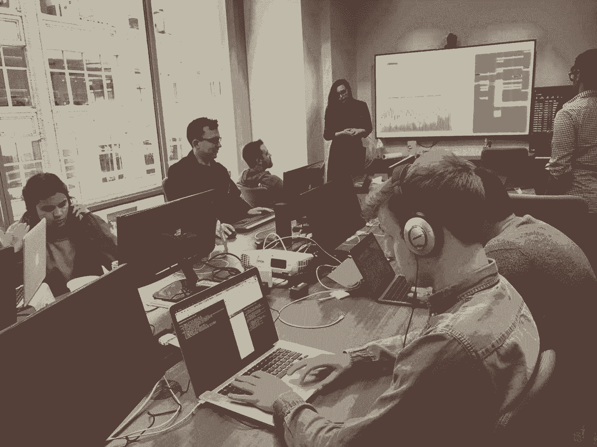

# 为什么厨师和士兵是最好的产品经理

> 原文：<https://review.firstround.com/why-soldiers-and-chefs-make-the-best-product-managers>

五年前，[三叶草健康](http://www.cloverhealth.com "null")首席运营官[威尔森·基南](https://www.linkedin.com/in/wkeenan/ "null")得到了他的第一份产品管理工作。在那之前，他是一名流水线厨师。这不是他唯一的工作经历，但这让雇佣他的人[吉姆·帕特森](https://www.linkedin.com/in/jimp79/ "null")——时任 Yammer 首席产品官，现任大麻科技初创公司 [Eaze](http://www.eaze.com "null") 首席执行官。事实上，这符合帕特森认同的更广泛的招聘理念:厨师和士兵能成为优秀的产品经理。

“无论是军用厨房还是专业厨房，都是对偷懒和优柔寡断零容忍的环境——你必须时刻准备着，在高压下快速工作，”他说。“当威尔逊告诉我他在那个职位上工作了一年时，我想，‘他一定很棒。’否则你会立刻被踢出这个行业。"

快速做出好的决定并不是军事或厨房经验灌输给 PMs 的唯一素质。帕特森每次招聘产品时都会找一份完整的清单:

能够在没有权威的情况下领导。

总是在给予信任的同时接受指责。

不完全信息下的强决策。

重视紧张的准备工作。

有条不紊地从错误和危机中恢复。

在极端压力下最佳运行。

尽管极少数人可能曾经当过厨师或士兵，但这份名单可以作为招聘产品经理的标准，这些经理拥有成功胜任这一职位的原始技能。在这次独家采访中，曾在空军服役的帕特森分享了他在寻找什么，以及他如何考虑建立独特有效的产品团队。他还解释了 Eaze 的“作战室”战略，即利用类似的军事风格心态，持续实现目标。

# 伟大的项目经理赢得尊重和一致性的权威

产品是一项艰苦的工作，没有人真正为你工作。工程团队不向你汇报。他们不一定非要按你说的做，但无论如何你都要做他们的领导。

如果你是一名餐馆或商业厨房的厨师，你通常是许多人中的一员，不断地将工作交给另一个人，以实现高度协调的结果。在军队中，有严格的等级制度，但是在同龄人中也有很多团队合作。在这种情况下，赢得周围人忠诚的天生领导者会茁壮成长。

帕特森说:“有魅力和谈吐得体很重要，但光有这一点还不够。”“学习成为一名优秀的领导者是可能的，因为这真的关乎信誉和尊重。”

这也是为什么有技术能力的产品经理往往更有优势。他们一开始就很可信，因为工程师们觉得他们说的是同一种语言，理解挑战的范围，并据此进行操作。这些项目经理不一定是以前的工程师，他们只需要努力使用正确的术语，并从工程的角度了解项目需要什么。

“你必须清楚地表明，你尊重工程师作为一门手艺所做的事情——它不仅仅是达到目的的手段或实现公司目标的途径——它是以一种需要相当多的创造力和技能的方式从无到有地创造东西，”他说。“不要做一个湿面领袖。如果你推湿面条，它哪儿也去不了。你必须拉它。不要强迫或试图让游戏工程师做事。用愿景吸引他们，让他们看到他们可以创造什么、机会以及他们可以产生的影响。”

对任何一个项目经理来说，最重要的是工程师的信任。你需要能够规划一条路线，这条路线可能没有 100%的共识——许多人可能不理解——但他们会跟随你，因为他们信任你。建立这种信任的最好方法是日复一日，不张扬地建立一个可靠决策的一致记录。

# 伟大的经前综合症让吃力不讨好成为一种习惯

帕特森说:“当你在基础训练中，一个人搞砸了，整个团队最终都要做俯卧撑。”“这是他们如何加强你们是一个失败和成功都在一起的团队。你知道当你搞砸了，不仅仅是你。这会影响到其他所有人。”

最好的产品经理知道他们有吃力不讨好的工作，他们不会介意。这本身就是一种技能。他们从不出卖任何人。他们知道一旦他们指责工程，他们就完了。他说，工程师们的微妙破坏应该是每个项目经理最害怕的，这种事情一直在发生。

帕特森说:“不管这句话被说了多少次，我仍然看到产品经理们自我感觉良好，对工程师不屑一顾，把他们当成轮子上的齿轮。”。“它们不会持续很久。在很多情况下，当我负责产品时，工程师会过来对我说，'我不能和某某人一起工作。'我会让那个首相走，因为那是没有回头路的。"

鉴于他所有的经验，他说这种品质现在帮助他从其他人中分离出最好的经前综合症。

“我能看出谁是‘中层’人员。他们总是在推销自己。他们想确保我知道他们正在做的所有事情，以及他们有多努力，”他说。“顶级项目经理明白，如果你的团队不好，你也不好。如果你的团队是好的，你就是好的。作为一个项目经理，你能做的最糟糕的事情就是责备你的团队成员。如果你这么做，你就死定了，因为在那之后他们不会支持你。”

当事情进展顺利时，你希望有一个不碍事并对其他人指指点点的首相。不是每个人都能做到这一点。

如果你渴望得到认可，这份工作不适合你。

根除这种心态最好的方法就是注意代词。在面试中，项目经理候选人会说很多“我”和“我”吗？还是说“我们”、“我的团队”和“我们”“人没办法。我会开始数他们说每件事的次数。我参加过一些面试，在这些面试中，有人会说 50 次‘我’——‘我做了这个，我做了那个。’他们来自一家大公司。他们不可能独自完成所有这些。"

尤其是在初创公司，你希望你的产品经理是仆人式领导。他们有服务于工程师、设计师、项目经理同事的历史吗？这是如何体现的？

“这是小事。当他们为团队点披萨的时候，谁得到第一片？他们会等到别人得到他们的吗？”帕特森说。“他们不仅准时出席会议，还会提前到场吗？这是对他人时间的尊重。”有些问题在面试时可能很难发现，但是一旦你让他们参与进来，就很容易观察和纠正，从而最大限度地获得成功。

# 伟大的项目经理在没有所有事实的情况下行动迅速

服兵役训练你在不完全信息的情况下快速做出决定。这是帕特森最喜欢的一句话的基础:“**大部分是对的，从不怀疑。**“这也是经前综合症需要的。

这也是为什么空军创造了**[OODA Loop](https://en.wikipedia.org/wiki/OODA_loop "null")**——代表**观察、定向、决定和行动**。关键是，每次循环结束，它都重新开始，整合上一个动作提示的新信息。多年来，它一直被用来训练飞行员在极端高压的情况下做出快速决策。

OODA 循环对产品经理来说也是一个有用的工具，帕特森认为，他们应该假设他们拥有的数据总是不完美的，而且永远不会完美。“很多人发现很难扣动扳机，直到他们觉得自己掌握了所有的信息，他们收集，收集，收集，从不行动，”他说。“和飞行员一样，经前综合症不能这样做。如果他们这样做了，他们将永远不会按时发货。”

相反，他们需要保持循环——获取所有可用的信息，解读其含义，做出坚定的决策，并部署这些决策。它既需要耐力——因为你必须日复一日地坚持——也需要在任何时候做出最明智的决定的精确性。

“我寻找那些更注重完善过程而不是完善结果的项目经理，”他说。“如果有一个不好的结果，我希望有人会回溯，以找出什么信息进入决策。根据手头的数据，这可能是最好的结果了。也许做出决定的过程可能会更好。”通过问这些问题，好的项目经理可以随着时间的推移推动持续改进。

# 卓越的 PMs 价值准备最重要

在评级很高的米其林星级餐厅，有一个概念叫做“**Mise en Place**”——大致意思是“各就各位”。它指的是在繁忙的厨房中，对所需的食材和工具进行严格的组织，让所有厨房工作人员在开始烹饪时尽可能快速、无缝地操作。根据 Patterson 的经验，最好的项目经理在执行产品之前会执行自己的“就位”流程。

他说:“想想看，厨房每天都要用数百种食材，将它们完美、一致地组合在一起，让热腾腾、美味可口的菜肴同时出炉，每次都是为几十张桌子准备的，这有多复杂。”“这种水平的性能要求在高速下近乎完美。食客实际看到的过程只是组装。所有真正的工作都是在早上开门之前开始的。”

在一家初创公司，项目经理是主厨，工程师是厨师，他们的才华和细心创造出最终的产品。在这种环境下，创建可靠的规格、在需要时提供资源以及为生产力扫清道路是至关重要的准备工作。最好的项目经理把他们的时间和精力集中在过程的这个阶段。

就像在厨房里一样，项目经理需要预测和理顺人与人之间的工作交接——例如，工程师和设计师。几乎没有出错的余地。如果一个人落后了，整个“厨房”都会受到影响。你对这些情况准备得越充分，就越容易摆脱困境。

你要为你的团队创造肌肉记忆。

如果你的组织和准备工作都很强大，人们会确切地知道去哪里找他们需要的东西，去找谁寻求答案，去哪里获取新数据，如何处理突然出现的问题。每次都一样，都管用。你如何促进工程师的肌肉记忆，就像你做饭时肌肉会记得去哪里找搅拌器或盐一样。

# 伟大的项目经理在压力下表现最好

在餐馆里，烹饪无论如何都不能停止。如果你偏离了轨道，或是倒车，或是厨师所说的杂草中的“T1”，你必须回到正轨，不要停下来或放慢速度。在军队中，你可能会发现自己处于这样一个位置:你的决策和执行对别人来说是生死攸关的。你不能破解或者说你不知道。作为一个项目经理，你有一个发货日期，你的产品甚至你的公司的命运取决于你无论如何坚持下去的能力。

在所有这些情况下，一个领导者需要几乎机器人般的思维定力，而这种思维定力在压力增大时最理想地被触发。

这是一种“被划入区域”的感觉，是一种以慢动作看待事物的能力——所以你可以开始把它们分开，解决问题。你可以让一群人坐在一个房间里，冷静地列出问题所在、可能的解决方案、你需要完成的任务，以及谁将负责这些任务。正是这种心态让你能够应对危机，并把它变成一份清单。

“对我来说，这肯定来自军事和基础训练，”帕特森说。“例如，他们给你施加压力，让你整理好床铺，擦亮靴子等等——让你在刚刚整理好的床上做跳跃运动，然后对你大喊大叫，因为你的床现在很乱——这听起来很傻，直到你意识到他们在心理上让你做好准备，在受到攻击时有条不紊。”

作为最初的项目经理和现在的首席执行官，这种经历让他在压力下异常冷静。“我能够超脱，因为情绪化或不安只会适得其反，”他说。“我会在事后告诉人们他们做得很好，但在此期间，一切都是为了完成任务。人们视你为领袖，并期待你的肯定。如果你融化了，那就完了。”

# 作战室产品管理

最近在 Eaze，Patterson 已经将上述所有品质结合到整个公司的新方法中。他们创建了一个作战室，将他们最大的会议室改造成一个任务控制中心。每个内部团队——产品、工程、运营、客户支持、营销等——的代表围坐在会议桌前。—解决任何问题所需的每个人。前面的大屏幕上是仪表板，显示每天的交货目标，绘制成上升曲线，以及他们目前的跟踪情况(以实时虚线呈现)。全天的目标是保持在这条线以上。如果你做到了，你“**就赢得了这一天**”

The 'War Room' at Eaze HQ.

“我们从增长和运营效率方面的长期目标以及我们想要达到的目标开始。帕特森说:“我们将这些目标归结为月度目标，比如这个月我们想完成 X，000 次送货。“然后，我们根据历史模式(比如周五和周六的需求高于周一和周二的需求)一天一天地建模，以创建一个分分秒秒的每日目标。”

“赢得胜利”小组每天从早上 9 点到凌晨 1 点在作战室工作，但成员是轮换的。每天都会有新的运营专家或工程师。但是，无论他们在自己的队伍中排在什么位置，作战室中的小组都有权在这一时刻做出决定。如果交付量开始低于目标，他们可以选择使用杠杆来提升这个指标——比如发送电子邮件或提供折扣来产生需求。如果一个 bug 出现了，他们可以立刻解决这个问题并减轻它的影响。

如果我们每天都赢，我们就赢了一周。如果我们赢了这几周，我们就赢了这个月。如果我们赢了几个月，我们就赢了一年。

“这是一种军事战略，让人们在一个房间里，以促进快速，有效的沟通和行动，”帕特森说。“它还让一系列人接触到这种技能，并让他们更直接地了解公司的运营情况和我们业务的运营情况。”

重要的是，那些在作战室的人可以号召和利用他们背后的整个团队来帮助他们解决问题。如果有什么事情会阻止我们赢得胜利，你可以大吵大闹，只要能帮上忙就成了当务之急。通过这种方式,“赢得胜利”战略将整个公司聚焦在一个共同的目标上。每个人的活动都以某种方式支持并聚集到这个焦点上。

在很大程度上，**作战室的概念诞生于帕特森认为使经前综合症变得伟大的属性。它将团队推向一个目标，而不是推动他们。设置它需要大量的思考、关心和准备，以便个人可以立即行动，并有肌肉记忆。它需要在有限的数据下做出良好的判断。它教会每个入座的人如何在接到通知的瞬间冷静而准确地做出反应。**

“在军队中，他们把前线的团队称为‘矛尖’，但他们身后的每个人都是必要的把手，给他们致命的支持和力量，”他说。“有趣的是，这个矛式创意让每个人都感觉与我们的客户和公司目标更加紧密地联系在一起。这引发了整个文化的转变，让我们同时变得更加深思熟虑、行动更加迅速。”

*艺术英雄图片/石头收藏/盖蒂图片。*