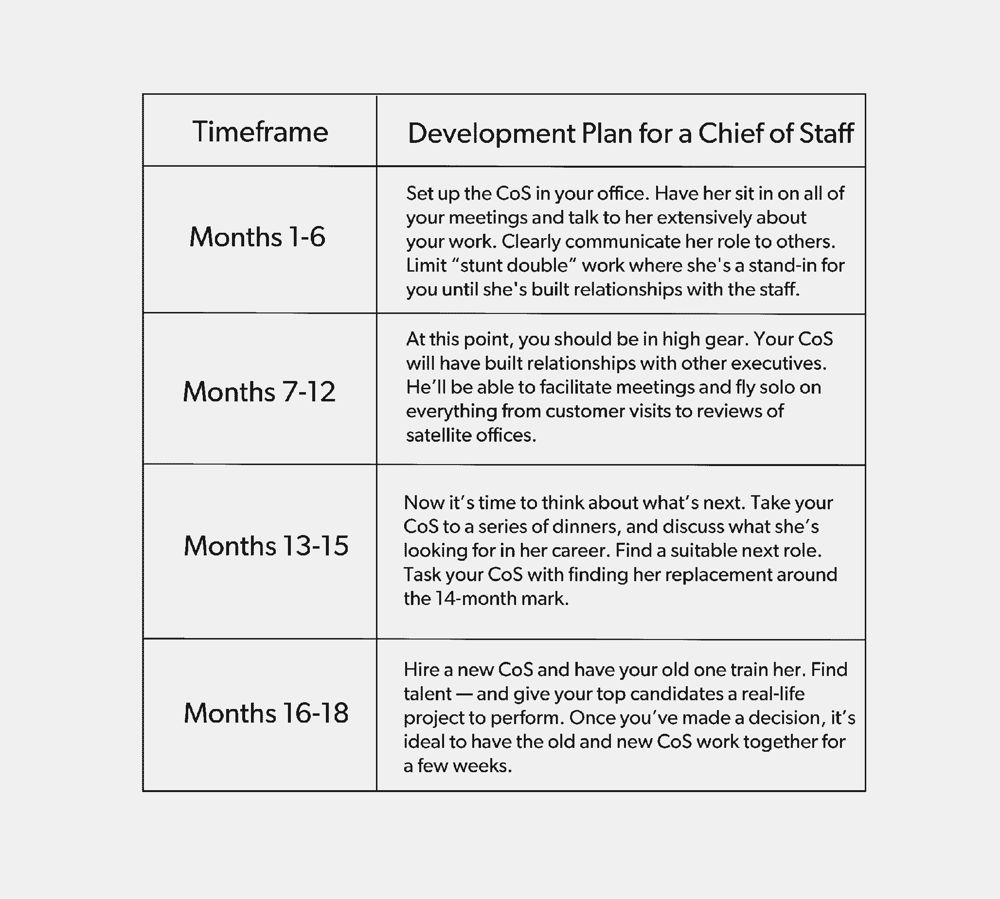

# 为什么行政办公室需要两个主管

> 原文：<https://review.firstround.com/why-you-need-two-chiefs-in-the-executive-office>

CEO**[标志器官](https://www.linkedin.com/in/markorgan "null")** 感到憔悴。他刚刚为一家 12 人的营销技术初创公司筹集了种子资金，并迅速建立了自己的销售部门。随着公司的发展，Organ 变得越来越疲惫。他已经连续忘记了他的第三次会议，并且错过了最后期限。他的同事告诉他，他似乎注意力不集中，没有注意到他们的需求。他们委婉地建议他找个助手。但那感觉不对。器官需要同时出现在几个地方。他真正需要的是成为超人。

然后他突然想到。他曾经见过 LinkedIn 的联合创始人[雷德·霍夫曼的](https://en.wikipedia.org/wiki/Reid_Hoffman "null")幕僚长[莎拉·因巴赫](https://www.linkedin.com/in/sarahimbach/ "null")的行动。她优雅敏捷地主持会议，问正确的问题，确保每个与会者都有机会发言。Organ 不仅仅需要有人帮他预定行程。他需要像因巴赫这样的人。可以代替他参加会议的人。给他带来其他部门的内部消息。接手他忙不过来的项目。兴奋之余，他开始寻找一份工作。在那之后的四年里，Organ 已经雇佣了三名幕僚长，他之前创立了 IPO 并被甲骨文收购的创业公司 **[Eloqua](https://www.oracle.com/marketingcloud/products/marketing-automation/index.html "null")** 并在 [Mobify](https://www.mobify.com/ "null") 董事会任职。校友已经过渡到了公司的管理层。Influitive 现在有 125 名员工，业务蒸蒸日上，Organ 也是如此。

在军事、政治和财富 500 强公司中司空见惯几十年后，参谋长的角色开始在创业界流行起来。在这里，Organ 分解了你可以为这个角色雇佣的三种类型的人，以及如何为这个关键的工作选择最佳人选。他列出了在这个过程中要避免的陷阱，并给出了如何最有效地管理你的幕僚长的循序渐进的方法。Organ 还详细说明了什么时候你需要一个 CoS(什么时候你不需要),并解释了当他们的服役期结束时如何帮助他们过渡。让我们开始吧。

# 界定工作范围

让我们从最基本的开始:到底什么是参谋长？这听起来像一个难以捉摸的头衔，这是因为，嗯，它有点像——你可以为这个角色雇用的人的类型以及这个人会做什么有很大的可变性。“参谋长的角色是一个非常个人化的角色。这是一个专为首席执行官设计的职位，兼具行政助理和首席运营官的元素。像 EA 一样，幕僚长只为 CEO 工作，除了实习生或行政助理之外，没有直接下属。像首席运营官一样，首席合规官负责战略和关键项目，与员工、客户和董事会成员一起工作。非常明确的一点是:虽然首席合规官做出许多重要决策并具有很强的领导能力，但这是一个服务角色。工作是让我成为超级英雄。Organ 说:这意味着我是最重要的人。“由于他们的工作，我可以做出更好更快的决策。我得到了更多我需要的洞察力。通过与团队发展更深层次的关系，我获得了更大的能力来推动高绩效。我能更好地让人们对他们的承诺负责。这个人每天都在我耳边低语，告诉我应该关注什么，给我关键的见解。他们帮助带领公司走出阴影。”

虽然可能会有所不同，但以下是您的首席合规官将承担的一些高级职责:

确保首席执行官致力于公司最重要的项目。

帮助首席执行官完成优先事项，达到适当的质量水平。

让首席执行官对承诺负责，同时帮助报告对结果负责。

让首席执行官平易近人，并对新的想法和建议持开放态度。

这种特殊雇佣的独特之处在于它的轮换状态。参谋长的典型任期是 18 个月。之后，他们可以转换到公司的另一个职位，通常是领导职位。一位前 Influitive CoS 现在是公司的市场拓展总监，而另一位校友在担任人才副总裁后成为欧洲副总裁。

你的幕僚长的背景可以跨越一系列的经验和资历水平，所以要知道这个角色可以有不同的待遇。Organ 给出了你可以雇佣的三个方面:

经理级别的招聘。此人将负责典型的行政任务，如日历管理和预订旅行，但他也会做出重要的判断，如首席执行官应该如何最好地利用她的时间，以及参加什么会议对她来说最有价值。

**职业生涯中期，主管级别的聘用。**这个人可能有 6-12 年的经验。他将负责管理市政厅、准备演讲稿以及为 CEO 参加领导会议做准备等任务。然而，他不太可能承担任何战略责任。

**一位经验丰富的副总裁级别的高管。**这个人已经是一名经验丰富的高管，希望有一天能成为首席执行官。她可能会见部门领导，讨论目标和指标，并为业务的各个部分制定策略。

以下是一位杰出的幕僚长所肩负的更广泛的职责:

确保首席执行官优先考虑正确的事情。“他们通过了解企业内部和外部的真实情况来做到这一点。我更像是一个外向型的 CEO——我喜欢完成交易、与客户沟通和举办活动。因此，我的幕僚长会花更多的时间来了解内部动态和我需要集中注意力的地方，尽管当我需要在总部呆更长时间时，他们也会进行客户参观和审查我们的卫星办公室，”Organ 说。“他们在内部事务中发挥了关键作用。早些时候，我们有一个管理团队不是很团结。我当时的首席执行官 David Axler 在帮助我建立一个有凝聚力的高层领导团队方面做得非常出色。他开始每天与公司的每个员工共进午餐和喝咖啡，以深入了解团队的表现。他组织了团队建设活动，在活动中，高层领导团队接受了如何更加开放、更加脆弱和更加直接的指导。然后，他坚持到底，看看已经启动的变化是否持续。像这样组建一个新的高级团队的影响是不可能被夸大的，我自己也不可能做到这一点。”

提升管理团队。“一个伟大的 CoS 提升了公司整个领导层的游戏水平。他们通过对团队成员的想法和建议提供有效的反馈来做到这一点。有时，当分析还没有完全考虑清楚时，他们会推后。在这种情况下，他们会尽力帮助他们做得更好。他们还会让我知道某人工作出色，这样我就可以具体有效地表扬他们，”Organ 说。“你需要一个能帮你调整内在的人。在培养和雇佣合适的人方面，你需要有人做你的眼睛、耳朵、手和脚。我需要一个人来确定要投资的摇滚明星，并尽早发现错误招聘，让他们更快地离开公司。优秀的首席合规官会不断监控组织的健康状况，并就如何改善提出具体建议。”

**加强和改善首席执行官的沟通。**“首席执行官每天大部分时间都在沟通，因此有效的沟通是这项工作的重要组成部分。演示需要全面清晰，尤其是对董事会、市政厅会议、关键客户和分析师的重要沟通。一点点努力就能提高很多效果。“当我雇佣幕僚长时，我会寻找会讲故事的人，”Organ 说。“我最近接到一个董事会电话，通常我会准备一份小资料发给董事会成员。但是这次我让我现在的幕僚长[布朗温·史密斯](https://www.linkedin.com/in/bronwyn-smith-11b61021 "null")来做。我预计要花两个小时来编辑她的作品。结果我在这甲板上什么都没做。难以置信。她说了所有我会说的话——以及我们一起工作时她听到的话。她的分析非常准确，为我节省了大量时间和麻烦，使我能够在重要会议上进行有效沟通。”

充当替身演员。“幕僚长在首席执行官的日程表中创造可及性和可用性。当需要首席执行官时，他必须是一个有效的替代者——无论是在关键的内部会议上还是在客户现场。通过分享你决策背后的逻辑，训练他们用你的方式思考。让他们坐在你的办公室里，大声思考。“他们应该随时知道什么对你来说是重要的，”Organ 说。“随着参谋长越来越适应这个角色，你会开始看到他们开始在这方面大放异彩。人们会开始要求他们主持会议，或者旁听重要的客户电话。我的三个幕僚长都经历过这种情况，看到他们成长不仅是一种很好的感觉，而且当我转身时，知道公司得到了很好的管理，这也是一种巨大的宽慰。”

做任何需要做的事。“做这份工作真的需要一种能做、愿意做的态度。有些人承受不了。不全是浮华和魅力。“虽然我绝不会让幕僚长去做我自己没有做过的工作，但你分配给他们的任务可以从高级到基本，”Organ 说。“一个令人难忘的例子是，当我决定从空气炮中射出毛绒独角兽，在创业节上发表演讲时，这是一个好主意。大卫租了加农炮，买了填充动物玩具，并把它们运到了蒙特利尔。这是一个巨大的成功，但必须有人来处理协调特技的细节。那个人是我的幕僚长。

Mark Organ shooting plush unicorns out of a cannon at a startup festival.

作为 CEO，我是台上的那个。我在跳踢踏舞。如果我的幕僚长做好了她的工作，我就可以再来一次。

# 当你需要一个参谋长的时候

很难知道你是否需要这个特殊的角色。你可能只需要一个行政助理，或者你可能需要一个完全不同的行政级别的雇员。

根据 Organ 的说法，这里有一些你需要一个幕僚长的迹象:

你的团队越来越大，越来越难管理。

你在种子或 a 轮融资后成长。

你希望你能繁殖自己，并能同时出现在任何地方。

你被折磨得筋疲力尽，因为你的盘子里有太多的东西。

你的员工向你施压，要求你做出你没有达到的决策或交付成果。

你想变得更有效率，但还没有准备好接受首席运营官或二把手。

以下是一些你不需要幕僚长的迹象:

你对价格非常敏感——这份工作可能会花费 75，000 美元到 200，000 美元以上。

你是产品上市前的合适人选。

你还没准备好扩大你的公司。

你的管理团队配置不允许有一个有效的幕僚长——例如，强烈的个性可能会阻止一个首席执行官完成她的工作。

不过，归根结底，这是一个判断问题。“这是一份高风险、高回报的工作。很可能你会知道什么时候你需要一个幕僚长。你会感到空虚，你希望有人能帮助你完成工作的某些方面。“不要把招聘不同高管需求混为一谈，”Organ 说。“我见过初创公司在真正需要首席运营官来增强首席执行官能力的时候聘用首席运营官。在小公司，高层领导团队成员是因为 CEO 而加入的，并希望向 CEO 汇报，而不是首席运营官或二把手。使用这些指南来仔细确定你的团队最需要什么样的角色。你投入的心思越多，做出正确判断的几率就越高。”

# 确定角色范围

如果你选择请一位幕僚长，那么是时候开始你的招聘程序了。首先确定你需要一个特别强势的参谋长。也许他们有你的弱点，或者他们在你公司目前重要的领域特别有天赋。“你要分析。有哪些关键的东西？我需要强有力的沟通吗？我可能需要一个在这方面有天赋的人，比如雷德·霍夫曼的前任 CoS [Ben Casnocha](https://linkedin.com/in/bencasnocha "null") ，他现在是一个著名的作家和演说家。我需要能管理一个部门的人吗？我需要一个在组织行为和凝聚团队方面非常强的人，一个执行教练类型的人吗？”风琴说。“当我雇用我的第二任办公室主任时，我意识到我需要一个情商非常高的人，他可以帮助我的领导们更好地团结起来。我们的新员工并不完全一致，分歧经常浮出水面。所以我雇了大卫。他在之前的工作中做过组织设计和管理有效性。他曾经处理过一个由一家欧洲公司和一家美国公司共同领导的项目。运营模式完全无效，双方本质上都非常讨厌对方，以至于无法共处一室。三个月内，他让每个人都投入进来，面带微笑，合作愉快，回到了关键的轨道上。我听到后说，“那是我的人。”"

Organ 提供了一些启动搜索的小技巧。首先，问自己这些问题:

作为首席执行官，我对自己的愿景是什么？我想去哪里？

我最需要什么帮助？

有哪些我不想做但我想委派的事情？

我准备好让别人进入我职业和个人生活的每一个角落了吗？

一旦你确定了你在这个职位上真正需要和想要的是什么，就把这个消息告诉候选人。将这份工作推销为获得实际管理经验的绝佳途径。“我们认为这是一次严格的 18 个月服役期。Organ 说:“通常到那时，他们已经是卓有成效的领导者了，所以在招聘新的首席执行官时，让他们管理其他事情对公司是有益的。“成为幕僚长是加速你职业发展的一种方式。如果你离开公司，世界都是你的——你可以成为创始人、首席执行官、首席运营官或副总裁。这是非常全面的训练。”

一开始，Organ 喜欢做一个初始的面试画面。过去，他还雇佣了一名顾问来筛选候选人。因为他在寻找一个果断且能激励他人的人，所以他围绕这一特点设计了面试。以下是 Organ 喜欢在开始时问的一些问题:

去年你做出的最困难的决定是什么？你是怎么做到的？

去年你做过的最糟糕的决定是什么？你是怎么恢复的？

告诉我你是如何激励那些不积极的人的。你是怎么做到的？

你怎么知道一个项目是经过深思熟虑的？你会问什么样的问题？

如果你有一个缺少一些关键元素的提议，你会如何处理？什么时候你会一头扎进去，帮助一个人做出更好的工作？什么时候你会把这件事往后推，说“你真的没有考虑清楚——等你再考虑清楚再回来”？

挖掘答案，但不要太看重面试。下一步是给他们分配一个项目。“这很有效。模拟工作，让他们去做。这在幕僚长的角色中尤为重要。在我第一次招聘 CoS 时，我们设计了一个任务:组织一次活动来决定 Influitive 的产品方向。获胜的候选人， [Fraser Stark](https://www.linkedin.com/in/fstark/ "null") ，与我们的一位经理一起组织了这次活动。从那以后，我们知道他很棒。他拒绝做正确的事情。他问了所有正确的问题。我团队中与他共事过的人说，这感觉真的很自然。“有了他，我们生产了更好的产品，”Organ 说。

“一个项目是评估一个人的更好方式，而不是问一堆固定的问题。我的另一个候选人，我认为相当高，并不真正喜欢这项任务。Organ 说:“他曾是政界的一名首席执行官，认为去一家初创公司会非常有趣。“我们很喜欢他，但他完成任务后说，‘这太不明确了。我真的不喜欢这样。我说，‘那你不适合这份工作，因为我们整天都在做这个。我们处理大量的不确定性，我们期待你们在混乱中创造秩序。这个作业帮助我们找到了答案。"

# 管理您的 CoS

一旦你被录用，是时候管理培训和建立日常关系了。你们两人的关系至关重要，所以要尽可能的亲密。“我与我的 CoS 有着密切的互动。首先，他们和我坐在同一个办公室，听我思考我们面临的挑战。他们偷听我的电话，参加我的一对一会议，除非我会见的人明确拒绝，这种情况不常发生。他们也可以阅读我的电子邮件，”Organ 说。“我们每天可能会懈怠 10 到 25 次。我毫不隐瞒，把一切都告诉了他们。他们必须了解我和我的想法。目标是让首席执行官能够预测我将如何做出决策。

Organ 提供了以下原则来创建您和您的参谋长之间的最佳关系和工作流程:

**为你的 18 个月写一份路线图。**“在前六个月，限制‘替身’工作是个好主意，他们基本上是代替你参加会议。首席合规官需要时间来发展知识和信誉，以便在内部和外部有效地代表首席执行官。Organ 说:“如果你过早地将他们抛入困境，他们可能无法达成领导所需的共识。“第 6-12 个月，你应该全力以赴。此时，他们已经与其他高管建立了所需的关系，并有足够的经验单飞。然后，在工作 12-15 个月后，一旦 18 个月的任期结束，是时候考虑下一次旅行了。开始讨论他们接下来想要什么。一旦你知道了这一点，确保他们在最后几个月发展与下一份工作相关的技能。最后，让他们在 14 个月左右找到替代者。

Organ's suggested timeline for how to manage your chief of staff.

**有意识地安排你的时间。**“每周一早上，我和我的幕僚长开半个小时的会，一起过一周。我们决定一起或单独参加哪些会议，什么时候旅行有意义，我们需要花时间和谁在一起，以及这些会议的目标。“一般来说，如果是事先有关系的外部会议，我需要亲自参加，”Organ 说。“我们还检查我们正在进行的各种项目，让次要项目步入正轨，并找出我们可以委派的项目。我们讨论团队成员的表现——谁应该得到直接认可，谁不开心。所有这些都为您和您的公司创造了更加顺畅的航行。”

以一种为他们的成功做准备的方式展示参谋长的角色。“当你把他们交给一位高素质的参谋长时，人们通常不会感到不快。有时候甚至是首选！Organ 说:“与心不在焉的首席执行官开会相比，会有更好的后续措施。“关键在于你如何呈现它。我们使用的语言是，首席合规官的工作是对首席执行官的工作进行优先排序。让每个人都知道，这个人是倾听你的意见、控制你的时间表和安排你工作优先顺序的人。你传达得越好，越多的人会对这个想法产生兴趣。"

你的参谋长就是你的大使。他是你的替身。他对你来说是第二好的。

敞开心扉，让你的上司能更好地帮助你。你必须完全信任这个人，所以雇佣一个你觉得和他在一起完全安全的人。你必须对自己有安全感和自信。然后超级开放脆弱。你一定想看到你的幕僚长成功。告诉他们你的想法。我花了很多时间和他们在一起。Organ 说:“有时我们只是谈论一些随意的东西，而其他时候则更有针对性。“在过去的一个月里，我至少花了三个小时与布朗温谈论所有不同的董事会成员。他们有什么问题？他们对我的恐惧是什么？她知道我对董事会成员最深的恐惧。她知道我兴奋什么。她知道每个人的个性。那是因为我经常和她说话。她是一个重要的知己。如果你想让你的幕僚长成功，就不要有所保留。”

不要被他们的成功所威胁。“布朗温打破了我所有高得离谱的期望。她已经和我在一起四个月了，但是表现得好像她已经在这里一年了。如果你是一位缺乏安全感的首席执行官，不确定自己在这个世界上的位置，那么拥有一位强有力、高效的幕僚长可能会让你紧张。你会说，‘伙计，她想要我的工作，’”Organ 说。“如果你发现自己处于这种情况，在毁掉自己之前，先检查一下自己。我的工作是尽可能让最优秀的人围绕在我身边。布朗温能够为我的董事会制作一副牌，这一点也不会威胁到我。那些是我的老板，她做了一副比我一个人做的更好的牌。这两天没有疯狂的做棋盘甲板，而是和人在一起。我在地板上走来走去。我接到了几个本不该接的额外客户电话，因为你知道吗？她创作了一些通常只有我才能做到的东西。”

**听从你的直觉。**“我还是我。我仍然会时不时地告诉布朗温，“恕我直言，我知道你想让我做 x。我不想做 x。我要去拜访一些客户。”。再见，”我有很好的直觉，我尊重它们。“这是首席执行官需要学习的一件重要的事情——何时倾听内心的声音，”Organ 说。同时，你的幕僚长也会有很大的发言权。这对你有好处。在某些问题上有不同意见是可以的，但在大多数情况下，你和你的同事应该是一台运转良好的机器。布朗温和我实际上是一个双头怪物。我信任并听取她的意见，但有时你不得不做出与他们的评估相反的决定，这没关系。"

**替身演员仍然不是真的。有时人们只是需要你——真正的你——本人。“前几天我得到了一些尖锐的反馈。一位同事说，‘马克，布朗温不是你的替代品。她工作出色，我们喜欢她，但有时我们需要你——实际上是你。我把这记在心里，现在我已经和不同的部门安排了每周一次的午餐。“布朗温实际上帮我想出了这个主意，”Organ 说。我总觉得有个幕僚长让我更容易接近。这有一定的道理，但我们正在学习如何回答:人们什么时候需要我，布朗温什么时候应该接受？这需要大量的试验和错误，但重要的是要钉。"**

Influitive's current and former chiefs of staff with CEO Mark Organ. From left to right: David Axler, Mark Organ, Fraser Stark and Bronwyn Smith.

# 过渡您的 CoS

最后，在 18 个月结束时，是时候开始交接你的幕僚长了。“虽然让一个对你的成功至关重要的人离开可能很难，但这是最好的选择。在这一点上他们会坐立不安。过一会儿就开始变得混乱了。对弗雷泽来说，他经常主持会议，人们开始不确定他的角色。他是我的代表，我的代理人还是弗雷泽？过了一段时间，弗雷泽甚至不知道自己是谁，”Organ 说。“大约 12-15 个月后，你的幕僚长可能会出现身份危机。如果他们不这样做，你可能就没有人会成为你公司未来的领导者。他们会越来越自信。在这种情况下，其他人对弗雷泽越来越有信心。人们向他寻求建议，不是因为他是一个伪我，而是因为他本身就很出色。”

虽然没有正式的过渡路线图，但 Organ 的参谋长们已经走上了管理岗位。“通常在 15 个月大的时候，我会带我的幕僚长去吃饭。在大约三次晚餐的过程中，我们会谈论他们的兴趣以及他们希望成为什么样的人。弗雷泽对人才感兴趣，所以我们确保他正在学习这方面的技能。“大卫和一般管理职责也是如此，”Organ 说。“最好的幕僚长之所以做这份工作，是因为他们被这种可能的快速职业发展所吸引。这是成长最快的机会，因为他们从首席执行官的有利位置学习——即使是高级副总裁也看不到。参谋长在财富 500 强企业、军队和政界的高层中所占比例过高。创业公司也会出现同样的情况:完成了幕僚长任期的人会不成比例地成为最成功的创始人和首席执行官。

当了 18 个月的舞台监督之后，是时候让你的幕僚长来领导了。轮到她上台了。

# 做你世界的主宰

幕僚长掌控首席执行官的时间表和优先事项。她会在你耳边低语来之不易的见解和指导，并努力帮助你带领公司走出阴影。在你的种子期或首轮融资之后，开始寻找 CoS。确定你的需求在高级 EA 和 VP 之间的范围内。通过给他们一个真正的任务来雇佣合适的人，但是首先要为你自己定义一个 CEO 的愿景——并且弄清楚你的公司现在最需要什么样的优势。敞开心扉，从电子邮件到内心深处的恐惧，与你的上司建立尽可能亲密的关系。一个好的幕僚长会是一个值得信赖的红颜知己和顾问，但永远要听从自己的直觉。让他们通过寻找替代者来结束他们的服役期。让他们在你的公司中扮演一个与你的需求和他们的愿望相一致的重要角色，然后为下一次招聘做好准备。

“在过去的四年里，我的注意力完全转移了。在我有幕僚长之前，我会说，‘我想和一些客户谈谈’，或者‘我想知道产品方面发生了什么？我要去那边溜达溜达，看看发生了什么事。现在，有了更多的目的和意图。“我有一个真正了解情况的人，他告诉我‘这是你现在应该做的，’”Organ 说。它给我带来了一种坚定的平静和安全感。我正在为我的顾客和员工提供更好的服务。我的工作是为他人提供良好的体验，现在我知道我正在这么做。作为一名领导者，这一直是我的意图，但作为一个执掌快速发展的公司的人，这并不总是现实。我的催化剂是我的幕僚长们。"

照片由 Influitive 提供。