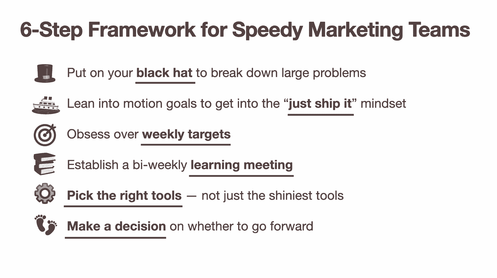
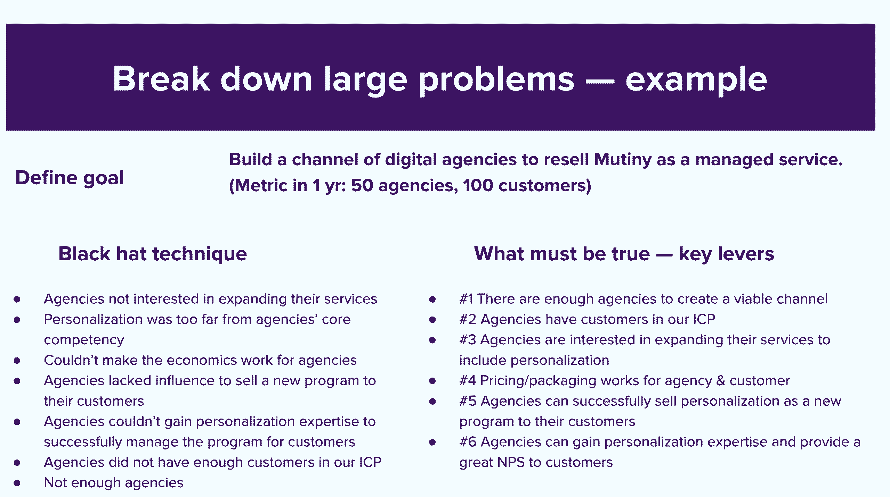

# 你的营销组织很慢。这里有一个框架来加快速度。第一轮评审

> 原文：<https://review.firstround.com/your-marketing-org-is-slow-heres-a-framework-to-move-faster>

许多营销人员(以及准备对营销更加认真的创始人)急于挑选 **[贾勒雷扎伊](https://www.linkedin.com/in/jalehr/ "null")** 的大脑，不难看出为什么——她有令人印象深刻的能力。B2B 个性化平台 **[哗变](https://www.mutinyhq.com/ "null")** 的首席执行官兼联合创始人曾在 [Gusto](https://gusto.com/ "null") 担任早期员工，后来担任营销和业务发展主管，在那里她领导了一个由 20 多名营销人员组成的团队。

更具体地说，营销领导经常问她关于最新的制胜策略或必须使用的渠道的问题。但是 Rezaei 学会了将谈话引向另一个方向，给出了一些她认为非常需要的建议。“当我开始做营销时，我也同样痴迷于渠道和策略。她说:“多年的经验(以及一路走来的许多错误)让我认识到，营销领导者需要少花时间纠结于战术，而是要小心翼翼地培养一种制胜文化。“人们对卓越的营销有很多不同的定义——结构化思维、以结果为导向、与销售团队合作良好、[一个伟大的品牌](https://firstround.com/review/this-brand-strategy-can-make-your-startup-look-bigger-than-it-is/ "null")等等。所有这些属性都很重要，但是**我认为速度是一个成功的营销团队最重要的特征，也是最容易被忽视的特征**。

作为 Gusto 的营销主管，Rezaei 开始重新定义她自己的营销团队的成功——推动她的报告采用同样的“快速行动，打破常规”口号，这通常是初创公司的战斗口号，但并不总是渗透到产品和工程以外的其他部门。“许多产品组织在速度优化方面做得很好——他们认识到他们不能花几个月的时间来构建一个产品，而不把它拿到市场上去测试。他们[建立 MVP](https://firstround.com/review/dont-serve-burnt-pizza-and-other-lessons-in-building-minimum-lovable-products/ "null")并与他们的用户一起验证假设。但是**的营销人员很难接受这种心态，他们更受活动驱动**，她说。

Jaleh Rezaei, Co-founder and CEO, Mutiny

当雷扎伊成为《兵变》的联合创始人兼首席执行官时，创造一个可以反复复制的剧本的机会变得更加突出。“我意识到，作为一个营销组织，没有太多关于快速行动的内容或框架，所以我开始整理这些内容，这样我就能以一种更有条理的方式教给我团队中的其他人，”她说。

换句话说，每个人*都在谈论*想要快速行动，但如何做到这一点以及围绕速度建立一种文化的实质内容却往往缺乏。这就是为什么几年前 Dave Girouard 关于速度是一种习惯的文章成为了评论经典。人们渴望将它付诸实践。Rezaei 为营销组织量身定制了同样的精神特质，她所制定的框架令人印象深刻。

在雷扎伊看来，速度不仅仅是快速执行——撰写博客文章和电子邮件营销活动——也是一种调转船头而不是被困在沙洲上的能力。要找到一个可能真正改变游戏规则的项目，你可能需要筛选 10 个其他想法。也许有些营销策略在纸上听起来很棒，但是当你开始执行时，你会发现许多假设都是错误的。她说:“你需要将团队的精力集中在培育最有希望的种子上，而放弃那些没有希望的种子。”“最终会对公司产生相当大影响的项目通常是大规模的，可能需要一两年的时间来构建，在此过程中会有大量的微迭代。你进行这些迭代的速度越快，你就能越快地调整到一个真正有影响力的项目。”

在市场营销中，在找到可行的方案之前，要经历大量的反复试验。如果使用 AdWords 来发展一家公司就像掏出信用卡一样简单，那么每个人都会这么做——很快就会将该渠道的投资回报率和规模降至零。

在这次独家采访中，Rezaei 向我们展示了缓慢和快速的营销组织之间的主要区别，概述了她为团队的划艇增加发动机而开发的六个策略，并回答了一些关于快速移动的真正含义的常见误解。无论你是一个负责寻找新线索的营销领导者，还是一个希望在营销部门点燃一把火的创始人，Rezaei 都为重新思考这个强大的组织能够实现什么提供了丰富的智慧。

# 要想走得更快，首先要了解是什么让你慢了下来

“一个常见的误解是，速度与草率、缺乏思考和低质量联系在一起。但是速度和像一只没头的鸡一样跑来跑去不是一回事。真正的速度是朝着影响和学习快速前进。Rezaei 说:“根据明确的指示，它正尽可能快地朝着最重要的事情前进。

如果速度是阴，那么阳就是轻重缓急。如果你不知道什么是重要的，你就不能快。

你可能认为通过实施计划和把事情做好，你已经走得很快了，但是浪费时间在不成功的计划上是创业营销团队最大的阻力，正如她亲眼所见。

“在 Gusto 的早期，我们[建立了一个新的内容营销计划](https://firstround.com/review/our-6-must-reads-on-content-marketing/ "null"),并下大赌注将内容集中在小企业如何创建强大的公司文化上。她说:“我们花了几个月的时间来建立博客和写文章，但我们并没有真正获得我们想要的吸引力。“我们开始与顾客交谈，我们听到的是一种强调，‘我只是经营一家小纸杯蛋糕店，我对人力资源一无所知——我想找到我的问题的答案，避免犯大错误，’”雷扎伊说。“很明显，我们在错误的内容策略上浪费了整整一年。从那时起，我们开始加入更多简短的、Q & A 风格的战术性人力资源主题，这些主题可能在 SEO 中排名靠前。对我来说，这是一次巨大的学习经历。”

作为你自己团队的机械师，仔细观察 Rezaei 的“检查引擎灯”信号，它指向一个迟钝的市场部:

**你没有发货。**“如果我们已经讨论了一个项目两周了，但还没有任何东西上线，这是一个不好的迹象。如果我们谈论推出一个活动项目，我们最好在两周内推出一个 MVP 活动——必须是现场直播。”

你的目标都是长期的。“如果您的计划的指标都说，‘在本季度末，我们将拥有这个’，这是一个危险信号。长期业务目标很重要，但需要辅以短期目标，比如“两周后，我们将有 10 个新的演示。”当我兴致勃勃地构建更大的程序时，我学到了这一点。我的影响目标离未来太远，使我无法一周又一周地以正确的速度推进项目，也无法更快地发现问题。"

**你的团队缺乏新知识。**“如果你问‘我们这周知道什么上周不知道的事情？’这个问题最好有新的答案。换句话说，如果已经过了两个月，你还在和同样的挑战做斗争，那你就没有正确地安排好营销工作的优先顺序。**快速团队总是在解决新问题**。这是我从 YC 学到的——你最好不要在两周一次的合伙人会议上抱怨同样的问题。"

你太依赖其他团队了。许多领导者接受实际上可以消除的限制，尤其是在涉及到跨职能依赖时。你有多经常听到这样的话，“嗯，工程部门花了一个月的时间为我们建立一个登陆页面”？在我职业生涯的早期，我接受了这些事实。有了经验之后，我明白了自己有责任表达、甚至要求市场营销取得成功所需要的东西。”

## 走出地下室，加快行动速度——尤其是当你还没有准备好的时候。

考虑这个听起来可能很熟悉的例子:“假设您想要[创建一个新的合作伙伴计划](https://firstround.com/review/What-to-Learn-from-This-Restaurant-Startup-That-Turned-Strong-Partnerships-into-a-Better-Product/ "null")。团队成员首先进行分析以提出营销计划，包括创建潜在合作伙伴列表、研究现有合作伙伴计划、循环融资以进行深入的 TAM 预测、设计资料。雷扎伊说:“我称之为进入地下室——你躲起来，突然三个月过去了，你还没有学到任何重要的东西。

“我猜，如果你问这个营销组织中的任何人，他们的团队是否进展缓慢，他们会说不。毕竟，看看他们创建的所有网页、面板和 Excel 模型！但是，如果六个月后这个项目没有获得正确的关注，会发生什么呢？”雷扎伊说。“团队将会经历一段更加艰难的时期，从项目中完全转移或撤资。现在，他们陷入了毫无进展的项目中——每个人都知道这一点，但很少有人愿意减少损失并终止项目。”

为了更深入，她向我们介绍了她注入更多紧迫感的六个要点——一些是关于重新思考你的营销价值观的哲学，以及其他加强这种行为以确保它坚持下去的具体策略。

# 借用这六个策略来加速你自己的营销团队

“当你处于一个有很多竞争对手的市场时，如果你行动迅速，你就能引领市场。**你的竞争对手处于这种永恒的反动模式，他们试图慢慢模仿你的战术，而你总是领先五步。Rezaei 说:“这一点的价值怎么强调都不为过。**

但是，由于主题像速度一样宽泛，要准确定位你拥有自己类别的具体因素可能会很棘手。为了做到这一点，Rezaei 精心制作了她自己的框架，你可以实施，将这一哲学付诸实践。

她说:“我采用这种方法来制定新的营销策略，我们认为这将为公司带来持续的大量收入。”。为了展示她框架中的每一点，Rezaei 延续了我们之前构建新合作伙伴计划的例子，而不是用粗线条来描绘。

## 1.戴上你的黑帽子来分解大问题。

“第一步是与核心团队进行 90 分钟的会谈，以确定计划和阻碍您前进的未知因素。她说:“一开始，90 分钟似乎是一段很长的时间，但如果你打算在接下来的两年里开发一个新程序，这是一个舍入误差。”“从定义一个大的、鼓舞人心的陈述开始。例如，“一年后，我们将有 5000 个合作伙伴向他们的客户销售我们的产品。”"

但就像赛马骑师在比赛开始时保存马匹的能量一样，你可能需要锻炼你的团队全速前进的本能。“在这个阶段，每个人都会立即问，‘我们如何让这一切发生？’但现在，你正走向坑洼。实际上，这种鼓舞人心的说法只是各种假设的组合——有些事情你是对的，有些事情你可能没有说到点子上，”她说。

为了揭示可能误导你的隐藏假设，雷扎伊使用了所谓的“黑帽”技术，该技术围绕着问一个非常棘手的问题:“**让我们假设一年后，我们没有实现我们的目标。哪里出了问题？**“如果这种方法似乎违反直觉，请从另一个角度考虑。“这个问题产生了一个微妙的转变，从非常乐观的心态到触发团队解决问题的神经元。它为他们指明了努力阐明我们尚不了解的事物的方向，”雷扎伊说。**“这里的目的是，你想要得到一个实现长期目标隐含的 5 到 10 个主要假设的列表。”**

继续以合作项目为例，Rezaei 列出了她的团队在一些“黑帽”提示后发现的一些潜在漏洞:

市场上没有足够的合作伙伴。

从经济角度来看，我们无法提出对这些合作伙伴有吸引力的定价和包装模式。

在我们的理想客户档案中，合作伙伴没有足够的客户。

合作伙伴对客户没有足够的影响力来成功推出新产品。

你不会在不知道会在哪里遇到急流的情况下开始一次漂流之旅，你也不应该在没有首先概述可能会让你偏离航向的颠簸的情况下开始一个新的计划。

“下一步是将消极的陈述转变为积极的陈述，并重新构建它们，以包含使计划得以运行的关键杠杆。这些是你的核心假设，你要实现长期目标，这些假设必须是真的。雷扎伊说，你不会说:‘市场上没有足够多的合作伙伴’，而是会说，‘市场足够大，有足够多符合我们理想状况的合作伙伴，我们可以去寻找。’。为了让这种说法更加清晰，她附加了一个指标:“如果我们认为我们可以获得 10%的渗透率，达到 5000 个合作伙伴的目标，那么市场上至少有 50000 个合作伙伴。”

## 2.向运动目标倾斜，进入“运输它”的心态。

到目前为止，你可能会点头附和，但 Rezaei 警告说，她剧本中的下一点是大多数营销人员容易感到不安的地方。“与其把所有时间都花在制定完美的计划上，你现在能做的最好的事情是尝试在一到两周内发货，”她说。"这可能是营销团队运作方式的最大转变."

原因如下:“我喜欢用这个比喻来思考正在执行新项目的团队:如果你曾经试图推一个非常大的盒子，当你第一次试图推它时，它真的很难。但是一旦它开始移动，它就会变得更容易推动。这不是错觉——静摩擦力比动摩擦力大得多。一旦开始实施，一切都会变得更容易。

为了启动动力摩擦，她设定了**运动目标**让每个人都动起来。“一个好的行动目标的例子可以是本周向一个合作伙伴出售该计划。你的第一反应可能是有点畏缩。你会想，'我们只是想出了这个程序，我们没有做任何分析，我们没有围绕它建立任何东西。我们怎么可能开始卖呢？我们需要先做研究。但实际上，如果你实现了在一周内把它卖给一个合伙人的目标，这并不重要；重要的是，它迫使你走出地下室，帮助你获得真实的数据，”她说。

“想一想，如果你想把程序卖给一个合作伙伴，你必须想好从哪个合作伙伴开始。所以你找到一份合伙人名单。你必须接触他们，所以你为接触创造你的推销。她说:“你必须与合作伙伴交流，所以你必须从高层次上概述你的价值主张。“但在这个阶段，你创造的东西没有一样是如此珍贵，以至于你要抓住它，坚持把它作为项目的支柱。你才研究了一个星期！然而，它让你移动和测试机制。我在哪里经历了最多的摩擦？我们需要弄清楚的最困难的事情是什么？”

应该花六天时间，而不是六个月时间，把一个营销概念带到你的目标受众面前。

那么，当兵变团队自己的合作伙伴计划处于起步阶段时，这是如何进行的呢？“在第一周，我们与潜在合作伙伴进行了 10 次对话，没有幻灯片，只有最初的 30 分钟对话。她说:“我们用社交网络来帮助进行战略性的自我介绍，因为如果我们不能通过私人关系进入某人的日程表，我们就有麻烦了——没有比人际关系更有效的推销活动了。”。

“我们概述了我们希望通过该计划做些什么，询问了他们所销售的公司的概况，并试图验证他们今天是否至少有三家公司可以就兵变进行接洽。不到一周，我们就确认了人们对该计划的浓厚兴趣，并开始发掘自然延伸的合作伙伴类型，而不是其他不太合适的合作伙伴。”

## 3.沉迷于每周目标。

“对我来说，最大的启发是在每一个单独的计划中切换到每周目标，不管它有多新。 **[季度目标很重要](https://firstround.com/review/How-to-Make-OKRs-Actually-Work-at-Your-Startup/ "null")** **，但也留下了很多空白，你无从得知自己是否在正轨上。你每周能做些什么来改变现状？”**雷扎伊说。 **"** 我会选择漏斗中最远的目标，每周都会受到影响，并为团队创造一致的执行节奏。如果你有锁定 12 名新合伙人的季度目标，你应该每周签一名新合伙人，而不是在最后一周签 12 名。”

如果你只按季度考虑目标，你的学习和迭代周期会显著变慢。一个有周目标的营销人员比那些只抬起头来按季度评估的人多 12 倍的打击。

Rezaei 将这些目标记录在仪表板中，并与直接营销团队分享。“当你还在验证假设和挖掘未知时，你不会想邀请太多的问题。但以我的经验来看，这种保护性可能真的有害——它只会让你在地下室呆得更久，”雷扎伊说。

以下是兵变营销团队发送给跨职能合作伙伴的仪表板示例。“确保它们非常简单，容易理解，这样任何人都可以获得最重要的信息，即使他们没有参加会议，”她说。

她在这里强调了另一个关键点。“跟踪‘实际’和‘目标’之间的差异是仪表板流程中非常重要的一部分。我的团队开玩笑地称这个增量为‘耻辱’，因为这是他们反思和迭代的动力。”

## 4.建立两周一次的学习会议。

“我从一位出色的成长型产品领导者那里借鉴了这个想法，它对营销非常有效。每两周主持一次会议，在会上你试图整理整个团队的学习成果。雷扎伊说:“你清楚地表达了人们两周前不知道的事情。

如果您不知道从哪里开始，Rezaei 列出了一个您可以使用的简单提示，继续我们的合作伙伴示例:

**假设。**“我们相信收入共享模式将为合作伙伴加入我们的计划创造有意义的经济激励。

**测试:**“我们创造了 50%的折扣，这是我们能提供的最大折扣，我们让五个合作伙伴来执行，但他们告诉我们，相对于他们从每个客户身上获得的收入，这笔钱只是象征性的。”

**学习:**“我们了解到收入份额实际上不会成为主要驱动因素，但我们也了解到合作伙伴非常有兴趣在我们的产品基础上构建他们自己的服务模式，因此他们可以获得更高的利润，并将折扣直接传递给他们的客户。”

她说:“学习不一定总是来自统计上显著的 A/B 测试——[定性的方向性学习](https://firstround.com/review/why-qualitative-market-research-belongs-in-your-startup-toolkit-and-how-to-wield-it-effectively/ "null")同样重要。”。

但是，如果你正在寻找一个更加数据驱动的例子，Rezaei 也有:“对于我们的合作伙伴计划，我们有关于获得一定数量的客户的 KPI。我们在签约合作伙伴方面做得很好，但我们没有向他们的客户销售。她说:“在我们设定的时间范围内，该团队将漏斗顶端合作伙伴的获取活动增加了两倍，以弥补客户转化率低的缺口。”。“我们了解到，合作伙伴认为他们需要时间来使用我们的产品，然后才会放心地向大量客户推荐。这种学习帮助我们的团队暂停他们的漏斗顶端目标，并将重点从合作伙伴收购转移到深入两到三个关键合作伙伴，以发现他们需要什么来成功地向更多客户推荐哗变。这改变了我们收购后的合作伙伴入职方式。”

## 5.选择正确的工具——不仅仅是最闪亮的工具。

“技术是快速的一个非常重要但被低估的方面——一旦你达到规模，它是速度的最大推动者，”Rezaei 说。

在你开始寻找闪亮的新玩具之前，雷扎伊警告不要操之过急。“在任何新项目的开始，我都让它保持低技术含量，因为否则只会助长沉没成本谬论——如果你花了一大笔钱专门为一个新项目买了一个工具，以后就很难放弃了。”

但是，随着该计划在整个组织中继续获得牵引力和支持，重要的是要考虑如何使用营销自动化工具来调整您的引擎——只要您优先考虑正确的功能。“在开始演示之前，确定您的计划目标和您需要加速的前五个工作流程。任何一种工具只有在简单快捷的情况下才有价值。当添加到您的营销堆栈中时，优先考虑易于使用并为您的团队消除重复工作流的技术，而不是老式的企业工具***在技术上可以启用工作流，如果您让一支军队来操作它们的话，”**Reza ei 说。*

## *6.决定是否继续前进*

*“如果在一个季度的迭代之后，你仍然没有达到目标，并且不能正确完成，诚实地考虑你是否应该放弃这个项目。你能解决你的问题吗，或者这是浪费时间？“拔掉插头需要勇气，”她说。*

*Rezaei 关于何时考虑程序寿命的建议？她说:“我们的目标是在第一季度末做出决定，我们正在建设的东西是否会扩大规模，而不是花六个月的时间修修补补——否则，作为一家公司，你必须忍受这种惰性。”。*

*Rezaei 认为，回顾过去，事情出错的根本原因通常是相同的。“当我需要终止一个项目时，**通常会归结为对客户的需求和能力有错误的假设。我们希望他们是一种方式，如果他们擅长 X，对我们来说真的很方便，但他们不是**。也许他们的时间比我们想象的要少，或者我们对他们来说没有我们想象的那么重要，”她说。“有时你可以通过研究来验证它——比如市场规模——但有时你必须在意识到自己正面临死胡同、不得不减少损失之前，开始走出去，努力让它发挥作用。没关系，这就是快速移动的意义所在。”*

# *自上而下的故障排除:对营销人员三个紧迫问题的回答*

*当 Rezaei 分发她的处方来加速你的营销时，她已经看到了她那相当多的探询的目光。在这里，她回答了三个她从营销专家那里听到的最常见的问题。*

## *1.你如何坦然面对错误？*

*“犯错永远不会让人感觉良好——但它们是速度的副产品，你必须接受它们。这并不意味着当它们发生时，你不会感到可怕和畏缩，但这完全是因为观点不同，”雷扎伊说。*

*如果什么都没出错，那说明你学得不够快。*

*在这方面，雷扎伊有自己来之不易的经验。“在 Gusto 的早期，我们改变了策略，从更广泛的冷冰冰的电子邮件营销活动转向非常个性化的方法。她说:“我们计划接触不同孵化器的公司，为他们提供定制优惠——例如，YC 公司都将获得 YC 折扣，并看到其他 YC 公司使用 Gusto 的例子。”。*

*“本着快速验证假设的精神，我们向 YC 社区发送了第一批 100 多封电子邮件，所有邮件都带有{在此处插入自定义广告}，而不是实际的个性化报价。我立刻收到了大约 30 条愤怒的回复。一个特别令人难忘的回复说，“哦，显然斯坦福 MBA 没有教你如何正确发送电子邮件。”她说:“我不得不单独向每个人道歉，我的团队感到羞愧。*

*"**但从长远来看，这并不重要**。我们从中吸取了教训，增加了对电子邮件发送的检查和平衡，最终，它成为我们最有效的电子邮件活动之一。当然，这一天完全是一场灾难，我不得不在周六花三个小时一对一地向所有这些 YC 创始人道歉，但这并不影响我们的底线。事实上，大多数愤怒回复的人喜欢我们处理错误的方式，并最终改变了看法。现在它只是一个有趣的故事。”*

*雷扎伊并不提倡粗心大意，而是要戴上你的顾客帽子。“从长远来看，我们对错误的真正含义有一个非常微观的看法。事实是，市场对你的品牌有一个明显放大的视角，所以你在社交媒体或博客上看到的那些错误对他们来说并不明显。她说:“品牌是某人与你的公司所有互动的总和:你的产品、你的客户支持、你发布的所有不同内容。“重要的是要问问我们自己，不犯任何错误和‘完美’是否值得以过于规避风险和无法快速行动和迭代为代价。”*

*一个营销团队可能犯的最大错误不是抛出一个丑陋的登陆页面或发送一封没有主题行的电子邮件——而是让五个人一起做一个一年前就应该关闭的项目。这些才是重要的错误。*

## *2.您如何协调各个孤岛之间的速度？*

*“市场营销已经转变到一个点，没有技术和工程，它几乎是无用的，”雷扎伊说。“但是营销、产品和工程彼此之间非常孤立，尽管这些紧密的合作关系对于快速发展至关重要。就团队结构而言，有几种不同的方法可以解决这个问题，比如在产品和工程部门建立一个专门负责营销的子团队。她说:“如果你能让工程师直接进入营销团队，那就更好了。*

*兴致勃勃之下，雷扎伊达成了妥协。“虽然这些资源不在营销团队中，但我让增长 EPD pod 的负责人参加了我的员工会议，我们创建了共享的 okr 和商定的项目列表，”她说。她说:“如果营销主管拥有收入和销售线索，他们就需要不受限制地接触设计、分析和工程技术。*

*“我很幸运，Gusto 的产品团队非常注重增长，因此获得他们的认可并不困难。如果你是新的营销副总裁，或者即使你已经在这家公司工作过，尽早进行对话。你要小心选择你的战斗，但是相信我，这是一场你想要选择的战斗。她说:“我发现一个有用的技巧是，用专门的增长工程师来交换营销人员。*

*如果我在一家初创公司面试一份 CMO 的工作，我绝不会在没有事先与我团队中的工程师或我拥有完全招聘权的专门团队协商的情况下加入一家公司。有一个奇怪的先例，营销和工程是分开的，我认为这是废话。*

## *3.你如何雇用速度？*

*在筛选营销职位的候选人时，速度不一定是从一堆简历中脱颖而出的东西。在她的职业生涯中，Rezaei 以速度第一的心态微调了她的招聘雷达。“我们总是进行基于案例的面试。我问了很多类似这样的问题，‘我们希望在 12 个月内达到 100 万博客订户。“我们该怎么做，”或者‘我们希望推出一种新的可扩展活动模式，帮助我们在年底前获得 5，000 名客户。我们如何做到这一点？"*

*她很快发现了营销经理发出的一些关键信号。“他们的想法有多激进？他们能很快落笔并构思吗？她说:“显然，他们必须研究一些东西，但他们没有太多的背景知识，但如果每个答案总是以‘我会和其他人谈谈’或‘我会就此进行研究’开头和结尾，这是一个早期迹象，表明这个人有走进地下室的倾向。”。*

*不要害怕用你的后续问题深入挖掘他们的技能。“如果他们说他们想推出一个新网站，我可能会问，‘你会怎么做？“你会用什么工具在一周内完成这项工作，”你还可以通过缩短他们想法的实施时间来证明他们有多积极——我会说，‘这是一个很好的建议，现在我希望你在一天之内完成。你明天怎么把这个拿出来？我倾听他们区分轻重缓急的能力，并找到一种 [80-20 的方式](https://www.forbes.com/sites/kevinkruse/2016/03/07/80-20-rule/#6e8f99723814 "null")来达到同样的效果。我还通过问一些问题来探究他们发现隐藏假设的能力，比如‘什么可能出错？“这个想法要实现，必须满足什么条件？”当他们列出他们的假设时，我问他们如何在几天内审查它们。"*

# *将所有这些整合在一起:创始人如何让他们的营销团队快速运转*

*对于创始人来说，尤其是那些没有强大营销背景的人，这个功能就像一个黑匣子。“我认为许多创始人看到营销时会想，‘哇，我对此一无所知，’”雷扎伊说。*

*“他们要么试图将其完全外包给 CMO 而不参与，要么试图对其进行微观管理，尤其是在他们的增长预期没有实现的情况下。她说:“我见过第一批营销人员和创始人之间的信任蒸发得太快，我认为这往往会导致营销初创企业领导人的任期很短。”“在这里，我给创始人的最大建议是**点燃营销之火并期待结果是可以的——但要确保你已经给了他们实现这些目标所需的支持**。如果你是 SaaS 的领导者，却不愿意让你的内部营销团队获得工程或分析支持，那么你可能就是问题所在。”*

*最后，Rezaei 为那些希望提升营销团队业绩的创始人提供了一些更具体的建议:*

***需求领先指标。**“创始人真的应该推动他们的营销领导超越长期目标。不要满足于“两年后我们才会在这里看到牵引力。”当谈到需求性别时，你会听到很多，但你需要促使你的领导层制定领先指标，他们可以在项目启动后几周内开始报告。确保你从一开始就有一致性——在面试过程中开始检查你的营销主管如何处理关键绩效指标。"*

***想想出口匝道。**“这不是一个有趣的对话，但你需要问你的营销主管，他们如何知道什么时候该放弃一个项目。我不是指你每周都要问的微观管理方式。但要提前就目标达成一致，这样就不会有什么意外了。”她的小费？“考虑毕业门，如果你看到 X 个结果，你会增加更多资源——这确保了预期在前面非常清晰。”*

*作为 CEO，你需要帮助营销团队获得他们需要的技术支持和预算。否则就像让他们不穿鞋跑马拉松。*