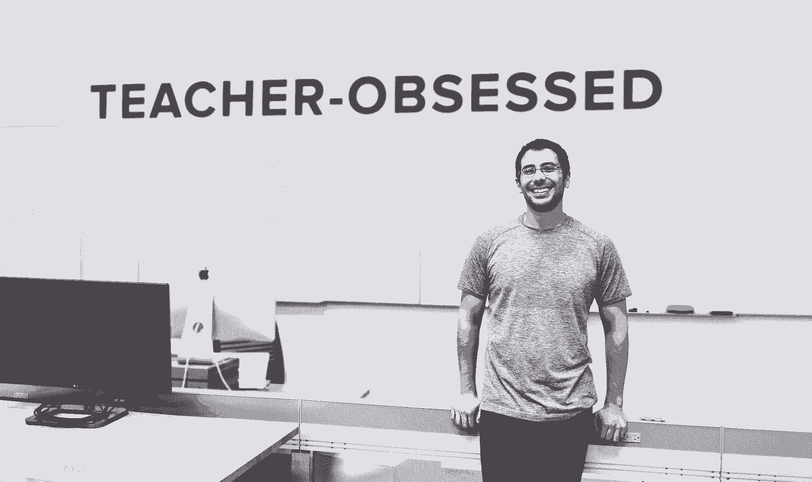
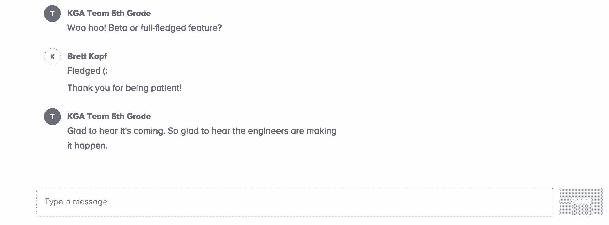

# 您的用户值得更好的服务——深入了解 Remind 的客户困扰

> 原文：<https://review.firstround.com/your-users-deserve-better-an-inside-look-at-reminds-customer-obsession>

四年前， **[提醒](https://www.remind.com/ "null")** 联合创始人 **[布雷特·科普夫](https://www.linkedin.com/in/brettkopf "null")** 在谷歌上搜索“使用 Twitter 的老师”。他编制了一份 500 人的名单，一次联系一位老师。几周之内，他就和其中一半人安排了 Skype 通话或咖啡约会。他的方法很简单。科普夫有两个问题要问，然后他闭上嘴听着。

这种独特的行为是 Remind 对其客户痴迷的种子，但它是从肥沃的土壤中发芽的。直到今天，科普夫还会求助于他的高中老师怀特菲尔德夫人，她曾帮助他解决学习障碍的问题，并像他的父母一样参与到他的教育中。Remind 开发了一个应用程序，让教师可以给学生发信息，并向家长更新信息。

科普夫不仅永远不会忘记他的老师，而且他还将这种个性化的支持回报给了数百万提醒顾客的怀特菲尔德太太。每周，这家初创公司都会收到数千张支持票——当学年开始时，这一数字会激增至 1 万张——团队会逐一回答每张票。这家初创公司在超过一半的美国公立学校开展业务，在教师、学生和家长之间发送了超过 20 亿条信息，它竭尽全力深化家长参与、赋予教师权力和支持学生。

在这次独家采访中，科普夫揭开了客户困扰所涉及的内容，以及 Remind 如何故意设计其流程，使其永远不会偏离客户的需求和体验。他是第一个承认大规模吸引顾客变得非常困难的人，并提供了帮助你坚持到底的建议。对于那些努力更贴近客户，但已经习惯了“以客户为中心”这类空洞口号的创业公司，请继续阅读。科普夫提供了经过测试的策略，将说明什么是真正的痴迷于你的客户，并帮助你更好地吸收，放大和适应他们的反馈。

要雇佣、建造、筹资或出售，你需要一个故事。这个故事是关于你的客户的。这是你的骨头——你的骨架。没有它，你会瘫倒在地板上。

# 意图和痴迷的区别

在科普夫收集他的 500 名教师的最初名单之前，有大约三年的开始和停止。“转折点是在我们从芝加哥搬到湾区的时候。科普夫说:“我们进入了一个孵化器，收到的建议以某种形式成为了初创公司的福音:不断与你的用户交谈，解决他们的问题，并打造一个简单的产品。””这种老生常谈的建议的问题在于，人们听到后会点头，然后继续快乐地生活。但是我们没有听到这样的总结，因为我们不知道我们在做什么。这对我们来说很新鲜，我们意识到大多数人颠倒了前两步:他们试图解决客户的问题，然后不断地与他们交谈——有时甚至一次。”

在那之后，科普夫想知道这家初创公司在没有计划直接与客户沟通的情况下，是如何持续这么长时间的。“这不是懒惰或傲慢——这是一个模糊。我知道我的客户有一个问题，我有一个愿景，希望将人们与学生联系起来。“但我不明白该解决哪个问题，”科普夫说。“你现在能看出问题了，对吗？这都是关于我在想什么，想出什么。底线是我没有和我的顾客充分交谈。我真的说不出他们是谁。我没有着迷。”

痴迷于你的客户意味着什么:

# 你知道做你客户的客户是什么感觉。

科普夫对老师的热爱根植于他学生时代的成长经历——本质上是他客户的客户。丰富你对客户了解的一个快速方法是更清楚地了解他们为谁服务。“我不是老师。我从未自称是。科普夫说:“我创办了一家公司，因为我从五岁开始就在学校里苦苦挣扎，有一些学习障碍。“当我与数百名教师交谈时，这给了我一个独特的过滤器。在我们谈话的某个时候，我像五岁的自己一样倾听，并从这个角度理解他们的挑战和需求。我更好地理解了帮助他们会如何帮助我这个学生。”

**如何？不要从远处内化它——去体验它。如果你在帮助医生，就去见见他们看的病人。对于 B2B SaaS 创业公司，你如何更好地了解他们的销售对象？抛开市场研究报告和外包的焦点小组，想办法跟踪你客户的客户。**

# 你知道你顾客的名字。

知道你的客户的名字意味着你可以与更多的“海报儿童”案例交谈，这些案例在你的营销宣传材料或推销中有所介绍。“就像时钟一样，在介绍 Remind 的前 60 秒内，我动情地讲述我们为什么而存在，为谁而存在。我说我们已经和数百名老师谈过了，并展示了照片。这是简。这是艾米。这是莎莉。她在阿拉巴马州的莫比尔，”科普夫说。“你需要能够说出正在努力应对你的公司正在解决的挑战的人的名字。应该是那种私人的。我发现，如果你知道他们的名字，你更有可能花时间去了解他们的问题。这是一个很好的代理，也是第一步。”

**如何？**你和你的团队是这次测试的最佳评判者。您在推销或会议中提到相同客户的频率如何？你关于他们的轶事有多过时？如果你是一家创业公司，你的卖点是一年多前的客户故事，现在是时候更新你的股票了——重新点燃那些关系。

在打造一个产品之前，我们会和所有感兴趣的用户进行交谈。正因为如此，它们已经融入了我们的 DNA。这就是为什么我们从不远离客户挑战。

# 你在顾客所在的地方会见他们。

**唯一可能比知道顾客的名字更重要的标准是，他们是否知道你的名字*****。“早些年，我会和老师们一起喝咖啡，通常是在他们家里。我参观了他们的教室。我会去见他们的家人。我飞到其他州去见老师。如果他们了解你，他们会为你的成功加油，如果出了问题，也会给你一个机会。他们会认为你是一个有过失误的好人，”科普夫说。“这叫公司人性化。这是一种多维关系。当服务水平协议变得不那么重要，而更多的是让客户感觉到您在以最基本的方式关心他们时。”***

***在顾客所在的地方与他们见面也意味着打造一款具有包容性的产品，因此可以服务于广泛的顾客。“超过 50%的美国公立学校积极使用 Remind，这些学校位于美国一些最富裕和资金不足的地区。事实上，我们有十分之一的[职称 1](https://en.wikipedia.org/wiki/Elementary_and_Secondary_Education_Act#Title_I "null") 教师积极使用提醒。与客户见面意味着支持从 iPhone 到 SMS 的所有平台。”***

*****如何？**开始时，[坐上货车](http://firstround.com/review/the-power-of-interviewing-customers-the-right-way-from-twitters-ex-vp-product/ "null")或飞机，与人见面。自己动手。它没有替代品或神奇的公式。随着公司的发展，你不可能同时出现在所有地方。这就是为什么反馈必须来自组织中的每个人。在结构上，Remind 在客户支持、产品和工程之间建立了许多联系。“反馈来自各个地方。你有一个每周做几个用户研究或可用性测试的研究员。除了我们的支持团队，我们在不同的州都有当地的工作人员，他们采访教师以获得反馈，”科普夫说。“他们参加教师会议，每隔几天就要走访多达五所学校。他们正在举办他们*不*出售 Remind 的活动。他们已经加入了——而不仅仅是融入了——社区。”***

***

Brett Kopf at Remind's office*** 

# ***你雇佣了你的顾客。***

***Remind 大约 10%的员工是前教师。“我们继续雇用教师，以确保这种用户的声音在我们所做的一切中不断得到加强，”科普夫说。“在做出产品决策时，让他们插话说，哦，我在这个区教了五年书，我们从来没有这样做过，或者这是我们必须做的，以便与家长沟通，这很有帮助。不像用户组，他们不会在最初的反馈后解散。他们是团队的一部分，即使在产品上市后，他们也会感受到自己的投入，并发挥自己的专长。”***

*****如何？正如科普夫总能从他的学生经历中汲取经验一样，Remind 受益于拥有教师的机构记忆。正如拥有熟悉法律*和*创业细节的内部法律顾问很有价值一样，考虑一下让现在或以前的客户加入进来。他们可以是全职雇员，也可以是短期常驻专家。*****

# ***如何扩大一家痴迷于客户的初创公司的规模***

***随着 Remind 发展到拥有 70 名员工，为 3500 万名教师、学生、家长和管理人员提供服务，它再也无法访问每所学校的每位教师，以获得帮助其成功推出的深度反馈。然而，它找到了收集反馈并将其纳入产品开发的方法。这意味着找到与客户频繁沟通的方式，同时保持在场和响应，并随时了解教育领域的情况。方法如下:***

# ***要经常。***

*****实时聊天。**每位 Remind 员工每周都会提供一小时的实时客户支持，无论其职位或任期如何。这种每周承诺让每个员工都站在第一线，并让接受客户意见成为一种习惯。在每次通话中，他们倾听、回答问题、收集反馈并评估功能的成功与否。“没有什么异常。从实习生到工程师再到联合创始人，每个人都有轮换。回答顾客的问题有明显的好处。但更重要的是，与客户直接、持续的沟通是建立共鸣、强化团队目标的最有效方式，”科普夫说。***

******

*****可用性测试。**每三周，Remind host 通过 Google Hangouts 与六位教师进行 90 分钟的聊天，团队在此期间讨论现有功能、即将推出的功能以及他们的愿望清单。这些可用性研究是定期进行的，不仅仅是产品经理和用户研究人员参加，所有员工都参加，包括 Kopf 和其他执行团队。***

*****CEO 聊天**。每周三，科普夫都会和一位老师聊上半个小时，有时还会通过谷歌视频聊天工具和整个教室聊天。这是 Remind 联合创始人的无价信息和灵感。Kopf 还亲自与早期使用 Remind 的教师保持联系，通过电子邮件向他们发送更新信息。***

# ***在场。***

***实地大使。 Remind 拥有数千名名为 Remind Connected Educators 的冠军，他们帮助公司与当地社区保持联系。Remind 作为其在当地的耳目，定期向他们征求反馈。“这些大使很早就使用了该产品。我们与他们分享新功能并收集反馈。科普夫说:“这些关系给 Remind 团队注入了新的活力，因为与每天使用你的产品的顾客一起工作会产生复合的激励效应。***

*****本地操作**。在其最大的市场中，Remind 有一名员工远程工作，进行例行的学校访问。这使公司能够及时了解当地教育政策的变化以及教育技术在课堂上的实施情况。***

***

Remind Co-founder Brett Kopf*** 

# ***有求必应。***

*****电子邮件请求。科普夫说:“我总是告诉我们的团队，我更希望我们的老师从 Remind 中认识珍、戴夫或本——而不仅仅是抽象意义上的 Remind。“每一次询问都是我们其中一个人加深与老师关系的机会。”在后端，Remind 使用按需服务台工具 [Zendesk](https://www.zendesk.com/ "null") 来记录每个请求。支持团队根据平台、功能和请求类型标记每个请求。有了这些分类，团队就可以根据每个请求的 Zendesk 票据数量来确定特性的优先级。功能建立后，提醒电子邮件或电话给每个提出具体要求的教师，让他们分享更新，让他们知道他们的声音被听到了。通过坚守承诺和亲自完成闭环，Remind 引发了积极的口碑营销，并将其客户转化为其销售力量和分销渠道。*****

*****私人电话**。当 Remind 在学校级别推出[时，直接接触以确保产品受到好评是至关重要的。支持团队仍然给数百名管理员和教师打电话，以确保发布顺利进行。](https://www.remind.com/schools "null")***

*****知识库**。要为数千万用户提供服务，关键是要有一个自助常见问题解答和知识库，客户可以在其中搜索常见答案。“知识库是主动客户的现成资源，但它不应该是一个孤岛。Kopf 说:“我们让用户通过实时聊天与我们联系变得非常容易。“我们甚至已经开始建立电话支持渠道。”***

# ***平易近人。***

*****翻译**。Remind 使用其[提醒翻译](http://blog.remind.com/remind-translate/ "null")功能帮助教师将信息翻译成多达 90 种不同的语言。这使得老师可以和各种背景的家长保持联系。***

*****多平台。**鉴于学区、家庭和学生的多样性，Remind 不会发展壮大，除非学生和家长可以不受平台限制地使用它。这意味着它支持短信，iPhone，Android，web 和电子邮件。通过[消息回执](https://help.remind.com/hc/en-us/articles/203179987-How-will-I-know-if-a-student-receives-my-messages- "null")，教师可以确认学生何时在任何平台收到消息。***

# ***要注意。***

***应用商店评论和社交媒体。 Remind 持续监控应用商店的评论，并将其分类为输入，以衡量哪些内容有效。像应用程序评论一样，Remind 依靠社交媒体来持续衡量教师的情绪。每两周，它在 Twitter 上举办 [EdChats](https://www.remind.com/join/edchat "null") ，为任何想参与的人创建一个论坛，不管他们是否提醒用户。到目前为止，已经有超过 50 个聊天和一些对话，如#whatisschool，已经成为 Twitter 上的趋势。***

***真正的客户痴迷不是当你不能停止谈论你的用户的时候。当你在你的组织中不停地听到他们的时候。***

***这些习惯和策略不仅加强了 Remind 与数百万教师的联系，还将之前由其创始人掌握的客户关系分散到了 Remind 的整个团队。痴迷的创始人和痴迷的创业公司的区别，往往就是领导一家公司和领导一个行业的区别。首先要知道意图和痴迷之间的区别，知道你客户的名字，在他们所在的地方与他们见面，并直接了解他们为谁服务。通过面对面的、数字化的和社会化的渠道，通过频繁的个人和团体拓展，创业公司可以获得大规模的客户痴迷。影响力化合物和初创公司将会惊讶于他们的客户和团队是如何找到新的、有影响力的方式来做出贡献的。***

***“我们有教师自愿与候选人交谈，以结束招聘或给我们的团队做讲座。员工每周都会在全体员工大会上分享客户故事。在会议中，他们会问‘这位老师着迷了吗？’科普夫说:“做产品决策时要抓住问题的核心。所有这些都深深打动了我。有时我告诉我的团队，如果我可以每天回复支持票，因为我喜欢为老师解决问题。这就是为什么客户至上是我们公司不可或缺的一面。这就是为什么我们一一回答每一个支持票。每个人都有一个怀特菲尔德太太。"***