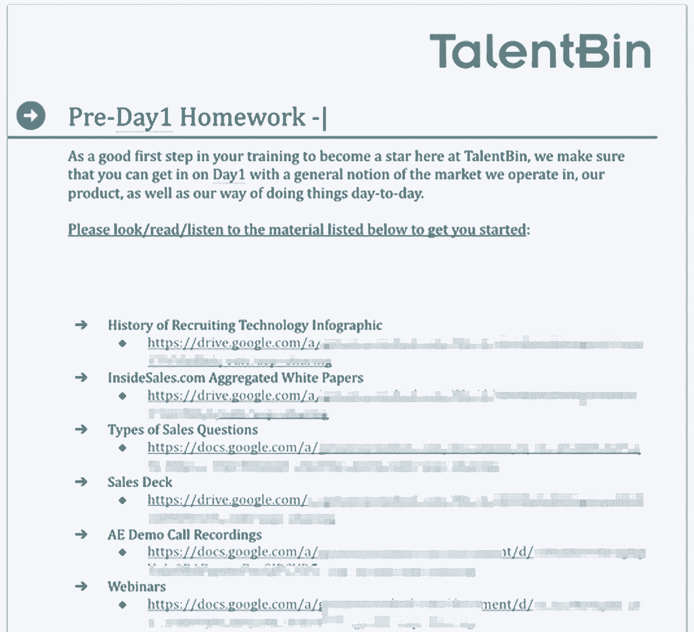
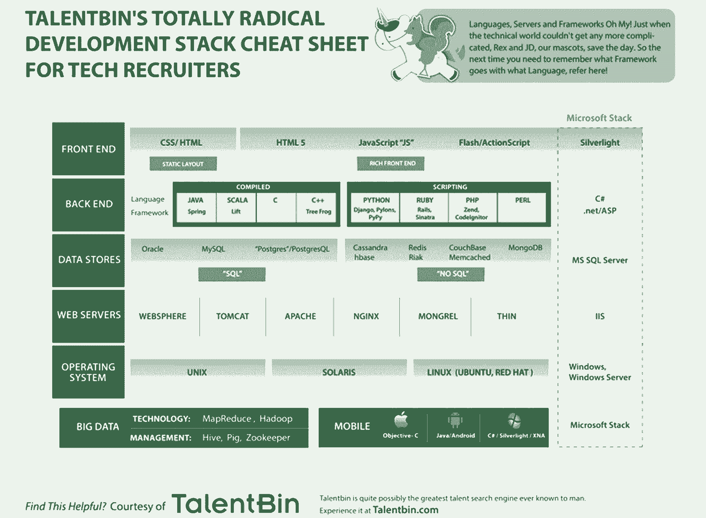

# 由于入职销售不佳，你损失了数十万美元

> 原文：<https://review.firstround.com/youre-losing-hundreds-of-thousands-of-dollars-because-of-poor-sales-onboarding>

*本文由* *[彼得·卡赞吉](https://www.linkedin.com/in/kazanjy/ "null")***[中庭](https://www.atriumhq.com/ "null")* *和 talent bin(2014 年被 Monster Worldwide 收购)联合创始人。节选自他的书* *[创始销售](https://www.foundingsales.com/ "null")* *中的* *[销售入职与培训章节](https://www.foundingsales.com/12-onboarding-training "null")* *，解决了创始人和首次销售人员需要了解的关于获取早期客户、建立和扩大成功销售团队的一切问题。**

*招聘软件公司 **[TalentBin](http://www.talentbin.com "null")** 的联合创始人[彼得·卡赞吉](https://twitter.com/kazanjy "null")说:“这么多公司在销售入职方面缺乏严谨性，这让我感到震惊。尤其是考虑到公司投入了多少时间来寻找合适的人。*

*一旦你扣动了扳机，雇佣了你喜欢的销售人员，你的全部注意力就需要放在让他们尽快跟上你的速度上。赌注不能再高了。*

*在早期，你最大的成本是错过销售甚至销售缓慢的机会成本。在一个你还没有雇佣的销售人员可能会让你每月损失 5 万到 20 万美元收入的环境中，时间是至关重要的，容不得半点差错。*

*当 Kazanjy 组建 TalentBin 最初的销售团队时，他感到震惊的是，错过或不满意的客户会剥夺公司巨大的未来价值，因为快乐的用户会重复出现、激增并推荐其他人。每一次销售成功所带来的收益都是巨大的、未知的。然后考虑一下 30%到 50%的销售代表精疲力竭的成本(信不信由你，这是平均水平)。他还意识到，对抗沉没成本的最佳武器是一个铁定的入职计划，该计划将让新销售人员沉浸在正确的心态中，以及他们必须利用的所有资源来达成和完成业务。*

*在他的书 *[创始销售](https://www.foundingsales.com/ "null")* 中，Kazanjy 回顾了他在 TalentBin 工作期间做出最大改变的入职策略。**在这里，他分享了他建议所有 B2B 初创公司采取的行动，不仅要建立最有才华的销售团队，还要尽可能建立准备最充分的销售团队。***

# *组织你自己的销售训练营*

*谈到入职，我有一个坚定的信念:销售代表拥有多少经验或技能并不重要，他们需要通过培训才能在你的公司工作。偷工减料开了一个糟糕的先例，会反过来害你。**每名新销售人员都应该接受一到两周的严格入职培训。根据你的产品的复杂程度，可能需要更多的时间。***

*最有效的入职培训是加速适应公司文化的新兵训练营；让销售代表沉浸在产品、业务和市场中；给他们上一堂工具和流程的速成课；训练他们需要一直使用的技能和词汇；让他们围绕着同一个未来愿景。*

*你雇佣权限后，你必须启用权限。为成功定位你的人力资本。*

*列出你想从培训中得到什么是一回事，实现它要难得多。我更喜欢为新员工提供大学式的入职培训，重点是传授高影响力销售对话所需的知识，并让他们重复足够多的时间，从而巩固记忆，增强信心。*

**挑选团队。**

*理想情况下，你应该在班级或团队中通过新兵训练营雇佣和管理销售代表。雇佣四个销售人员和雇佣一个销售人员的工作量差不多。你想要强制乘法。此外，班级立刻给了他们一种共同的身份和目标感——你可以通过给他们起“格兰芬多”或“三个朋友”这样的名字，并让他们与其他团队竞争来强调这一点。*

*在竞争和友情之间取得平衡是值得的。如果一名学员遗漏了什么，他们的队友将更有可能帮助他们并填补空白。当训练开始时，你会有天生的陪练。你想在班级里招聘，在班级里上船。*

**不要强调课程*。*

*随着公司和战略的发展，你的销售方式也需要改变。你培养人的方式不能也不应该是一成不变的，一路上要一直微调。事实上，当你开始的时候，我建议你把所有的东西都放到一个大的谷歌文档中，并且在你覆盖它们的时候用绿色突出显示部分。*

*当然，这可能会变成几个文档，也许是一个电子表格清单来跟踪每门课的进度，但即使这样还是很零碎。太多的公司在培训方面停滞不前，被必须投入的劳动和思考所吓倒。不要让这种情况发生在你身上，只要开始填充你认为你的销售代表应该具备的知识，并从那里开始。*

*重要的是要有一套完整的主题来涵盖，并尽可能详尽地在每堂课中使用它们，并在使用过程中添加和删除。*

*以下是我在入职培训课程的每一次 迭代中包含的一般内容，它们对建立成功的销售团队大有帮助。*

# *前期工作*

*入职培训在员工第一天上班前开始。当人们进入一个新的角色时，他们会对你的组织充满活力和热情。把它转化为学习。你可以在这个时候指定大量的阅读。他们需要知道什么才能立即投入运营？烤到作业里。*

*我通常会分发一些阅读材料、演示材料和销售电话录音。在 TalentBin，我们有一个按客户类型(企业、中端市场和中小型企业)组织的“精彩电话”和“糟糕电话”记录库。如果您有一个包含视频内容的客户支持门户，也可以分享它。如果你的组织偏爱某本书，就把它分配给他们。我是 *[目标](http://www.amazon.com/The-Goal-Process-Ongoing-Improvement/dp/0884270610 "null")* 的忠实粉丝，让销售人员进入目标导向的心态。发送一份这些材料的超链接列表，并明确表示你想让他们逐一浏览**。这很重要，不可选择。会有一个测试。不要说一些含糊不清的话，比如“复习这些材料”***

***

An example of pre-work TalentBin would provide to new hires.*** 

***你也不要送太多。确保你分享的所有准备工作材料都达到高质量和相关性的标准。如果新的销售代表怀疑他们被安排了繁忙的工作，或者他们在日常工作中实际上不会使用这些信息，这将损害你们的关系。争取在两周内连续工作 10 小时。清楚地表明他们的进步正在被跟踪——就像在工作中一样。这可以像让他们在完成时高亮显示谷歌文档的部分一样简单。***

***准备工作还有其他几个目的。通过尽早让他们参与进来，可以避免新员工临阵退缩，并降低他们接受现有雇主还价的可能性。***

***重要的是，不要忘记在你这边也做一些准备工作。当你的新员工吸收这些材料时，你需要确保他们从第一天起就具备完成工作所需的技术装备。订购一些高质量的礼品。***

***每个新员工的办公桌看起来都应该像是你在屏息等待他们的到来，并且你很高兴他们现在就在那里。***

# ***文化入职***

***文化不仅仅是一次对话。这是你如何展示你的公司执行的方式，什么是值得称赞的，什么是应该指责的。首先，积极明确地讨论你的销售组织重视什么，不重视什么。以下是我们在 TalentBin 论坛上提出的三个原则:***

***你不一定要成为一名工程师才能用工程思维来操作。***

***我们都是我们销售机构的产品经理。***

***智力诚实是最重要的。***

***这三个很重要，因为它们代表了我们更广泛的文化。该公司的销售团队由重视使用技术来最大限度地发挥其能力的工程师组成。这是我们希望销售团队体现和坚持的价值观，鼓励他们找出限制因素，提出解决方案，测试它们，清洗和重复。***

***我们希望人们表现得像产品经理一样，这样他们就会不断地思考改进我们工作流程的方法。我们实际上将销售流程的不同方面称为“功能”，并要求人们说出他们的想法，即哪些功能应该重复、删除或添加。***

***最后，公司本身诞生于最初的失败产品。我们必须转向产品与市场的匹配。但是如果我们没有在自我评估中非常诚实的话，那是永远不会发生的。**你必须愿意承认失败，然后才能改进，我们需要持续改进。*****

***这些是你想立即传达给新销售代表的文化试金石。它们应该被表述为基础的和坚定的。有了这些原则，将有助于你招聘，并且很容易发现哪些新员工真正受到了它们的启发。***

***用公司历史来框定你的文化。这是我们开始的地方，也是我们如何走到这一步的。这是我们现在所在的地方，也是我们将要去的地方。***

***对你公司的发展道路和你的销售团队的演变进行一次强有力的回顾对文化入职很重要，并提供了一个关键的机会来强调你希望人们如何工作的主题。***

# ***业务和市场入职***

***理想情况下，你的公司销售的解决方案既适合现有市场，又足够独特，能够脱颖而出。为了让销售代表积极展示一个新的、不太成熟的解决方案，他们需要成为销售目标市场的专家，了解推动该领域业务发展的因素，以及您的产品或服务的技术现状。这是他们能够与客户平等互动的唯一方式，而不仅仅是供应商。***

***在开始的时候，你可以在人们第一天的一系列幻灯片中展示这些信息。随着你的成长，你可能想要设计一个测试来确保更多的人保留这些信息，并记录课程和材料供员工参考。***

***以下是我们在 TalentBin 测试的知识桶和我们用来实现全面覆盖的问题:***

*****市场理解:*****

***您的解决方案在哪个领域运作？***

***随着时间的推移，这个领域发生了怎样的变化？***

***到目前为止，什么技术对该领域产生了重大影响？***

***已经存在的主要供应商有哪些？***

***它们与你的解决方案无关吗？***

***例如，如果您从事销售自动化或 CRM 业务，您想知道哪些供应商正在提供基于您的产品的活动管理解决方案。客户会询问您的产品如何与他们正在使用的其他工具配合使用。你必须了解他们才能给出细致入微的答案。在 TalentBin，新员工参加了一个速成班，学习关于人才获取、职位公告板、申请人跟踪系统、招聘机构等方面的历史。***

*****业务驱动理解:*****

***你客户的业务是如何运作的？***

***他们的成本和收入杠杆是什么？***

***用于衡量其业务驱动因素的指标是什么？***

***例如，如果你正在销售一个招聘解决方案，那么你需要知道什么对你的客户是重要的:内部候选人的数量，候选人的质量，每次招聘的成本，招聘的时间，等等。如果你的产品可以增加候选人的数量和质量，同时降低成本和时间，那么你就成功了。为了传授这方面的知识，TalentBin 开设了一个一小时的课程，授课老师是一位非常有才华的前招聘人员，名叫 Brad Snider，他已经转型为销售人员，非常了解这个行业。你可以在这里看到这堂课的一段[录像](https://drive.google.com/file/d/0ByAYCl_pIYjWVGFZSzJSYzRMQ00/edit "null")，这里是[源幻灯片](https://drive.google.com/file/d/0ByAYCl_pIYjWSTN6eWxXa3pia0E/view "null")。***

*****技术理解:**虽然理想的雇员会理解你正在使用的技术，但很多人不会。如果有人不真正理解 Java 和 Javascript 之间的区别，你不会想让他们谈论软件。如果您销售存储，您希望您的销售代表能够区分硬盘和闪存。***

***现实是，你不可能在一周内教会一个人复杂技术的来龙去脉。所以你需要关注他们会遇到的最重要的术语。你要和他们一起复习基本词汇，了解他们需要在哪些方面听起来有权威才能达成销售，并在销售对话中充当海绵，记录不断出现的问题和术语，以便他们可以立即学习。***

***

A cheat sheet of technical terms for sales reps.*** 

***一般来说，这是你在新兵训练营过程中应该尝试涵盖的三个方面。是的，你想给人们一些简短的测试来验证他们是否在每一节后都吸收了材料——特别是当你和他们远程交谈或者你同时和许多人交谈的时候。但是你不想要求完美的回忆。本质上，您希望他们知道足够多的信息来进行基本的销售对话，但假设他们会随着与越来越多的人交谈而不断积累知识。***

***如果你在人们真正理解问题之前就开始教他们你的解决方案，他们将很难以一种有说服力的、高影响力的方式来展示它。***

# ***产品和演示入门***

***你想给你的新员工一个关于你的产品的全面的教育，它是如何工作的，以及他们如何用一种清晰的、有说服力的和批判性的方式来描述它。这些是整体产品和展示培训的支柱:***

*****初始产品演示:**给员工一个产品所有细节的正式演示。查看产品的所有关键元素，并将它们与客户的使用案例联系起来。触及每个功能影响的业务驱动因素。例如，TalentBin 使用了其面向客户的演示的删节版。***

*****销售演示:**因为您已经分配了销售演示的录音作为准备工作，销售代表应该熟悉您的方法。你想把你的标准陈述分解成“章节”来解释你为什么以及如何说每一件事。确保新员工理解每一章背后的意图。这将使以后练习演讲技巧变得更加容易。***

*****面向客户的演示**:就实际销售演示的各个部分对销售代表进行培训。这应该是一次模拟演示，以您对客户使用的相同方式在课堂上现场演示。该演示还应该包含与您的解决方案所解决的业务难点相对应的部分。明确一点。像这样说，“本部分的重点是演示功能 A、B 和 C，它们旨在帮助用户解决 X、Y 和 Z 问题，解决棘手问题，M、N 和 o。”在课程进行过程中，为每个部分都这样做，可以打断提问。***

*****异议处理:**销售代表会从潜在客户那里听到大量的异议，所以你不可能提前查看所有的异议。相反，尝试将常见的异议或潜在客户困惑融入您的演示和演示培训课程中。与销售代表分享常见异议的详尽列表是有帮助的，但在新兵训练营期间查看所有异议是浪费时间。相反，让销售代表参考您的异议常见问题解答，以便他们日后参考。***

*****竞赛回顾:**等你把上面的东西都教完了再来处理这个。这样，销售代表就有了一个框架来了解您销售的产品和竞争对手提供的产品之间的差异。***

# ***工具和入职流程***

***现代销售代表应该非常精通软件和技术。他们的日常工作包括大量使用电子邮件、日历、像 Salesforce.com[这样的标准、像 ClearSlide](http://www.salesforce.com "null") 这样的演示工具等等。但是你不能假设你的员工会立即知道如何使用你提供的任何工具。如果他们不这样做，他们就没有机会。通过以下步骤增强他们的能力:***

****正确供应和配置。****

***太多的公司忽略了给新员工配备他们需要的一切。看似显而易见，但不应该想当然。为他们需要的每一件硬件和软件制作一份电子表格或清单是值得的，这样你就可以为每一次招聘复制这个过程。这包括桌子、笔记本电脑、显示器、笔记本电脑支架、键盘、鼠标、脚垫、耳机、笔等。***

***达到这种程度的特异性可能看起来很奇怪，但它会帮助你每次都达到目标，而且它比你想象的要重要得多。***

***作为一名新员工，发现自己还没有一把椅子会引发情绪连锁反应。***

***把一切都准备好，就像事先都想好了一样，这就设定了对卓越的期望。***

***对于可以提前定好的事情，就去做。它展示了一种有备无患的心态。在 TalentBin，这意味着每个销售代表打开他们的笔记本电脑，发现一个 Google Apps 身份、Salesforce 帐户、Yesware 和 ClearSlide 已经准备好，正在等待他们。同样，将所有新员工加入定期会议和适当的名单服务中，让他们感觉自己立即了解情况。***

***当您的员工已经在现场上课时，可以稍后再进行配置。请他们作为一个小组一起设置工作环境。如果你让他们以正确的方式设置电子邮件签名或一起创建新账户，他们更有可能这样做，并理解其背后的逻辑。***

***我还强烈建议为您认为有用的所有配置创建一个电子表格清单。和你新入职的同事一起抽出一两个小时，浏览一下清单。在 TalentBin，这是我们使用的列表:***

***设置你的书签，根据你的喜好设置谷歌浏览器。***

***创建正确的电子邮件签名，打开“撤销发送”、“发送并存档”、“自动前进”和其他收件箱零 Gmail 技巧的键盘快捷键。***

***添加浏览器和 Gmail 插件，用于销售线索生成、 [Rapportive](http://www.rapportive.com "null") 、Yesware、BCC to CRM 等。***

***为您的手机设置语音邮件。***

***安装 [Jing](http://www.techsmith.com/jing.html "null") 或 [Skitch](https://evernote.com/skitch/ "null") 进行筛选和投屏。***

***使用适当的安全机制在 iPhone 和 Android 上设置公司电子邮件。***

***在 iPhone 或 Android 上设置移动 CRM，如 [Salesforce1](http://www.salesforce.com/platform/solutions/connect-integrate/ "null")***

***在他们销售的产品中建立一个演示环境。***

***这只是一个例子，每个人都会不一样。重要的是不要依赖销售代表自己完成所有这些工作。因为他们不会。否则他们会做错的。一起做就好了。***

****对人们进行日常工具的全面培训。****

***你永远不要想当然地认为一个工具很容易使用，或者很多人已经很熟悉了，他们不需要某种形式的培训。从最基本到最复杂，你需要涵盖你的员工期望用来取得成功的所有工具。你会明白我的意思:***

*****浏览器**特别是当你雇佣刚从大学毕业的人时，办公室的基本知识实际上可能相当陌生。如果你雇佣了更多的高级职员，他们很有可能有很多你想改掉的坏习惯。***

***在 TalentBin，我们从浏览器开始——这可能看起来很基础——但以我的经验来看，并非如此。由于谷歌 Chrome 的速度和插件支持，我们确保每个人都在使用它，并按照“[做事](http://gettingthingsdone.com "null")”的心态进行培训:***

***关闭不再使用的标签页。***

***为可能产生新标签的新任务创建新窗口(避免混淆)。***

***任务完成时关闭窗口。***

***键盘快捷键的掌握。***

***这个想法是烘焙一切可以让销售代表更有效率，节省他们的时间，并减少分心。***

*****销售邮件*****

***电子邮件非常强大，但如果被滥用，也非常危险。在销售中，这是一种很好的方式，可以大规模地与客户建立多个接触点，提供宣传材料，同时处理许多对话。这也可能会耗费大量时间，而且，如果没有纪律，你的销售代表的收件箱将会变成一堆不重要的垃圾(“来 DreamForce！！！!")混在价值极高的客户沟通中(“你能把那份合同发给我吗？”).***

***说到电子邮件,“把事情做好”的理念甚至更加重要。如果电子邮件上没有下一步行动，它应该立即存档。对很多人来说，这可能是一个新概念。教它，审计它。如果你遇到一个销售代表，看到他们的收件箱里有一封已读的、不重要的邮件，问问他们。***

***此外，确保他们删除手机上的所有电子邮件推送通知和提醒，这样他们就不会像对待即时消息一样对待电子邮件。在其他工作中，销售代表应该完全关闭他们的电子邮件，离开他们的 CRM 或日历，专注于手头的任务。***

***同样，你需要向新员工展示写得好的电子邮件是什么样的:***

***如何写出清晰的主题，避免常见的错误，如“嗨”和“快速提问”***

***如何恰当使用 CC，回复全部，保证线程连续性？***

***如何撰写具有足够的空白空间和换行符的邮件以提高可读性，以及如何使用粗体、项目符号和标题来识别电子邮件的关键部分，以便人们关注邮件内容。***

***如何说出你正在处理的个人以及该线索中其他人的任何行动项目。***

***如何使用突出的词来提高可搜索性，以便您可以轻松地从 Gmail 存档中回忆起邮件。***

***如何校对——在面向客户的交流中，围绕严谨性和语法优势设定期望。***

***明确所有发送的电子邮件都记录在 CRM 中，以便以后可以对其质量和格式进行审计。***

***必须有强烈的动机让人们注意细节。***

***为了速度和质量，训练人们尽可能多地使用模板。常见的重复沟通会占用销售代表大量的时间。使用模板可以节省大量时间并减少错误。强化这一点的最佳方式是，作为公司或销售领导，你自己也要依靠模板。***

***每当您的公司发布新功能或产品时，提供一个相应的模板或告诉销售代表创建他们自己的模板，以保持它的首要地位。此外，如果代表 A 创建了一个很棒的模板，确保它存储在某个中心位置，比如你的 wiki 或 Yesware central 模板库，这样代表 B、C 和 D 也可以使用它。***

*****专业的日历制作*****

***在销售中，时间是宝贵的。每个销售代表的日程表都需要是一个精心打造的工具，以便他们管理自己和潜在客户。不要假设人们知道如何发送、拒绝或接受日历邀请。走一遍，确保他们知道如何通知会议地点，无论是在现场还是远程。指导他们在邀请函中加入议程项目、会议桥信息以及其他需要设定和满足期望的内容。结果是会议质量大大提高，取消会议的次数减少。***

***教日历卫生是你能做的最重要的事情，以确保你的员工管理好他们的时间。***

***在这种情况下，良好的卫生习惯意味着删除不相关的项目，为会议、适当的准备和跟进会议腾出时间，为管道管理和收件箱维护留出纯粹的跟进时间。***

***我是“日历画”的忠实粉丝，在这种画里，你可以预定并划分出你一天的全部时间，这样你就可以确保你把时间花在了正确的事情上。同样的策略将使您的销售代表专注于手头最重要的任务，如果他们知道在任何给定的时刻应该做什么，他们就不太可能分心或被打断。当你没有明确分配时间时，你的工作就有被收件箱支配的风险。***

*****销售专用工具*****

***在这种情况下，您可能会在需要涵盖的内容上有更多的变化，但在这一类别中有一些重要的共同点:***

*****CRM:** 这是任何高绩效销售组织的基础。它是活动、效率和报告的中心枢纽。每当我帮助一个销售团队时，他们的问题总是源于 CRM 的脆弱性。从一开始就要明确，如果信息不在你的 CRM 中，它就不算数。例如，如果您进行演示，从技术上讲，除非在 Salesforce 中，否则它不会发生。如果发送的电子邮件没有抄送给 Salesforce，也没关系。现在就设定期望，并始终如一地展示出来。***

*****数据模型:**即使是经验丰富的销售代表也可能会对 CRM 中的数据存储方式感到困惑。请确保了解客户的基本概念，如何创建各种对象以及与它们相关的字段，例如预计收入和机会阶段、客户中总机会的大小、客户的联系信息等。涵盖如何正确记录笔记、撤销任务以及表示已关闭、已赢得和已失去的机会。***

*****关键报告和任务视图:**如果你有对销售代表的执行至关重要的报告或仪表板，确保将它们加入书签，并向新员工详细描述。Salesforce 的控制台查看器就是一个例子，它允许人们查看和执行任务。报告可能包括管道检入或给定周内尚未完成的演示列表。***

*****支持销售的电子邮件:** TalentBin 使用了 [Act-On 营销自动化套件](https://www.act-on.com "null")，以及 Yesware，后者也被集成到每个销售代表的电子邮件中。这有助于团队跟踪电子邮件的打开和点击，并调用各种模板。所有销售代表都应该知道，严格的记录、模板和群发电子邮件是工作的一部分。这是您能够跟踪和深入了解交易的唯一方式。强调为什么所有这些数据都是有用和必要的——它显示了您的信息传递有多有效，人们如何参与您的宣传材料，以及您是否需要做出改变。***

*****强力拨号软件:**我建议设置强力拨号软件，让人们进入你的销售漏斗顶端，或者跟进漏斗中部的客户。在 TalentBin，我们使用 [InsideSales.com 的 PowerDialer](http://www.insidesales.com/products/communications/powerdialer "null") 帮助销售代表快速浏览潜在客户，拨打电话，留下预先录制的语音邮件，并自动发送后续电子邮件。在新兵训练营期间，你想要展示所有这些功能，这样人们就知道全部的功能，以及这个软件能使他们的工作变得多么容易。***

***执行你的理想周期和节奏。***

***虽然使用工具很重要，但知道在销售周期中何时以及如何使用工具更为重要。在培训期间，您需要涵盖您的销售组织的流程和节奏的细节。不同的产品需要不同的周期。以下是您应该为新代表回答的问题:***

***完成一笔交易通常需要多长时间？***

***是自下而上还是自上而下的销售方式？***

***谁负责销售周期的哪个部分？***

***一次销售通常需要多次演示，还是更像是一次“电话成交”的过程？***

***需要用试用还是试点？***

***销售代表应该在什么时候知道交易不会发生，以便节省时间？***

***最强的销售团队每周、每月和每季度都有稳定的工作节奏，这些事情在每个时间段都会定期发生，比如团队会议、管道会议、站立会议、全体会议和欢乐时光。不管这些是什么，和你的新员工一起回顾它们，并明确每个的目的。***

***在 TalentBin，我们的轮值日历包括:***

***周一召开销售团队会议，回顾上周的统计数据和收入进展，分享产品和客户的成功、团队的胜利和收获。***

***每天两次五分钟站立练习，检查当天的活动、胜利和收获。***

***每周一次的渠道会议，讨论交易、推动问责制并获得反馈。***

***每月一次的全体会议。***

***每周周五下班后的欢乐时光。***

***正如你所看到的，这么多时间被用于分发信息，并确保每个人都在同一页面上。这就是好的节奏带给你的。***

# ***操练、重复和跟随的力量***

***许多销售组织忽略的一件事是给销售代表足够的时间来练习他们的关键行动。具有讽刺意味的是，销售团队往往都是前运动员。***

***就像在体育运动中，就销售而言，实践比实际比赛更重要。最好的销售人员是那些将最佳实践牢记在心的人。***

****一次又一次地进行销售练习——以小组为单位。****

***在销售代表采取的所有行动中，他们最需要练习演示和陈述。这是他们在面对真正的客户之前应该做的事情——没有必要错过真正的机会。就像您开始并浏览有效演示的每个“章节”一样，现在您希望新代表也这样做。***

***在教室环境中这样做效果很好，每个人演示一章，然后停下来从老师和团队的其他成员那里获得反馈。这是一个缓慢的过程——这就是为什么你只做一次——但它真的能把材料钻出来。***

****设置陪练。****

***完成这些初步练习后，将全班分成两人一组。让每一组交换展示者和潜在顾客。有趣的是，“潜在客户”真的被迫像一个真实的人那样思考和反应。他们必须在销售中占据最终对手的头脑。以我的经验来看，这使他们成为更好的咨询销售专家。***

***陪练有助于让人们在练习拜访销售线索、演示拜访和谈判时，能够快速思考。为了获得最大效果，在完全“游戏情境”模式下进行练习，使用代表们日常使用的任何工具。他们不应该坐在一个房间里面面相觑。他们应该使用真正的电话和真正的演示软件。他们必须习惯这一点。***

***鼓励结对编程。***

***我并不热衷于通过电话销售来学习。这可以在销售时间之外通过前期工作期间的电话录音来完成。但是当一个完整的循环被执行时，有一些事情要说。这就是我推荐一种“结对编程”的原因，在这种编程中，一名新员工与一名经验丰富的人进行为期一天的结对。他们不只是坐在那里听，他们实际上参与了围绕电话进行的关键工作。***

***对于市场开发代表来说，这意味着在他们为潜在客户购物、审查和执行当天的任务、撕掉电话清单、发送跟进电子邮件或进行演示时，要和更有经验的人坐在一起。对于客户经理来说，结对编程可能意味着参与新机会演示，以及管道管理或维护。***

****观鸟、坡道和监测。****

***当新代表接触到实时机会时，您不能放松对入职的关注。这实际上是一个非常微妙的时刻，你有机会建立别人的信心，让他们自己感到舒服。我用了几种方法来实现这一点:***

*****被丢弃的蓝鸟*****

***当客户经理开始工作时，给他们分配“蓝鸟”机会——也就是很有可能成交的潜在客户。这些通常是具有很强资格特征的呼入销售线索。***

***作为销售主管，您仍然应该在这些电话中与新代表合作，以便在他们遇到意外情况时提供支持。虽然通常纯粹的支持可用性，加上强大的准备，使它没有必要。***

***确保你不会因为一个新员工没有达到 A+级别就匆忙打电话。只有当轮子掉下来的时候你才在那里。***

***另一个有用的策略是，销售代表在打电话时，在他们的办公桌上放一份打印好的销售演示文稿和演示文稿，这样他们就可以像拐杖一样依靠它们或逐字逐句地背诵它们，只需要一份副本，以确保他们抓住重点，防止失去平衡。***

***与蓝鸟机会相反的是一次性的——一个没有资格达成交易的潜在客户。也许他们没有足够的技术装备，或者适合你产品的内部用户。他们可能不会购买。我见过很多公司对新入职的销售代表进行这类客户的培训，所以压力没有那么大。在有限的基础上有意义，但它可能会回来咬你。***

***你不希望你的销售代表养成视来电为无关紧要的习惯。这会导致一些坏习惯。此外，您不应该低估新销售代表获得早期成功的积极影响。这是你应该尝试策划的经历。一次性演示是一种昂贵的练习形式——它们消耗了本可用于有效机会的演示时间。它也不是 100%尊重客户的时间。***

*****主动电话和环境电话回顾*****

***不要浪费一个有经验的销售代表的时间去旁听新员工的电话会议。在 TalentBin，我们使用 ClearSlide 的在线演示系统( [join.me](http//join.me "null") 、 [WebEx](http://www.webex.com "null") 和其他具有类似功能的系统)记录了所有销售电话。这样，在任何时候，我们都可以提取一段录音来听。为了更容易地提出有指导意义的电话，我们让我们的代表大声说出并标记他们特别棒或令人发指的电话，并与团队分享。Awesome 电话用于未来的入职准备工作。向全班播放了令人发指的电话，这样我们就可以讨论出了什么问题。***

***作为销售经理，你还应该花时间四处走动，或者坐在销售团队的不同成员旁边。边工作边听。当你在电话中听到有人遇险时，你的耳朵自然会竖起来。这样，你就不用花很多时间照顾别人，但你可以在便利贴上写一个有用的建议，或者在他们挂断电话后快速重组谈话。***

***对电话进行主动和环境审查将确保您尽早发现问题。不要担心在早期打击销售代表的士气，相反，向他们保证，他们越快接受和使用您的反馈，他们就能越快开始赢得自己的胜利。***

*****取下辅助轮*****

***随着新员工人数的增加，你可以减少高接触式监控和辅导的数量，开始依赖一套核心的关键绩效指标。这些指标包括演示的保持率、客户经理的成功/失败比率、漏斗顶端的活动水平等等。***

***虽然你的团队的定期会议应该很快发现你的方法需要调整的负面趋势或迹象，但管理层应该花额外的时间检查新代表的 KPI，并确保他们正确跟踪。仅仅检查数字也是不够的。你需要在标准的(最好是两周一次的)一对一会议中获得销售代表的反馈，了解他们的真实感受。***

***请记住，对于一个年轻的销售团队来说，在一个规模不断扩大的初创公司，最大的成本是错过或延迟销售的机会成本。严格、周到的入职培训将最大限度地降低这些成本，并形成一个积极的反馈循环，让新销售代表更快获得收入，并提高保留率。***

***我知道这听起来很多，但是考虑到这些人中的每一个人都很有价值，你的钱和时间都是值得的。***