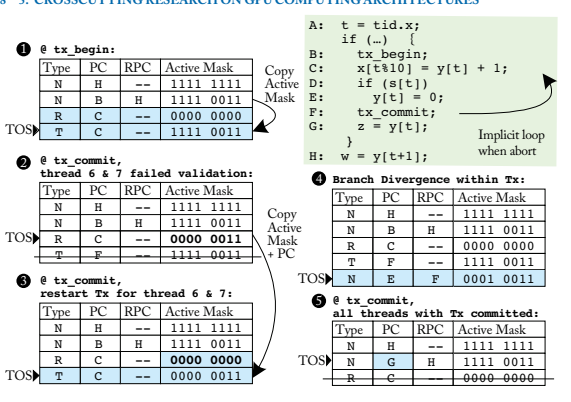

# 通用图形处理器架构

# 前言

本书旨在帮助那些希望理解图形处理器单元（GPU）架构，并获得有关如何改善其设计的研究介绍的读者。假设读者对计算机架构概念（如流水线和缓存）有一定了解，并对与 GPU 架构相关的研究和/或开发感兴趣。这类工作往往集中在不同设计之间的权衡，因此本书旨在提供关于这些权衡的见解，以便读者能够避免通过试错学习那些已经为经验丰富的设计师所熟知的知识。

为了帮助实现这一目标，本书将目前在专利、产品文档和研究论文等各种不同来源中发现的许多相关信息汇集到一个资源中。我们希望这能帮助刚开始自己研究的学生或从业者减少所需时间，迅速变得高效。

虽然本书涵盖了当前 GPU 设计的各个方面，但它也试图“综合”已发表的研究。这部分是出于必要，因为供应商对特定 GPU 产品的微架构几乎没有公开发表过任何内容。在描述“基线”GPGPU 架构时，本书依赖于已发表的产品描述（期刊论文、白皮书、手册）

以及在某些情况下的专利描述。专利中所找到的细节可能与实际产品的微架构有很大不同。在某些情况下，微基准研究为研究人员澄清了一些细节，但在其他情况下，我们的基线代表了基于公开信息的“最佳猜测”。尽管如此，我们相信这将是有帮助的，因为我们的重点是理解已经研究过或在未来研究中可能有趣的架构权衡。

本书的几个部分专注于总结近年来关于改善 GPU 架构的许多研究论文。由于这一主题在近年来显著增长，内容过于丰富，无法在本书中一一涵盖。因此，我们不得不在所覆盖的内容和被排除的内容之间做出艰难选择。

Tor M. Aamodt, Wilson Wai Lun Fung 和 Timothy G. Rogers 2018 年 4 月

# 致谢

我们要感谢我们的家人在写作本书期间给予的支持。此外，我们感谢我们的出版商迈克尔·摩根和编辑玛格丽特·马尔托诺西，在本书的创作过程中展现出的极大耐心。我们还感谢卡罗尔·简·吴、安德烈亚斯·莫肖沃斯、雅什·乌基达维、阿米尔·拉汉和阿姆鲁斯·桑杜帕特拉对本书早期草稿提供的详细反馈。最后，我们感谢马克·希尔分享他对撰写综合讲座策略的看法以及对本书的具体建议。

Tor M. Aamodt, Wilson Wai Lun Fung 和 Timothy G. Rogers 2018 年 4 月

# 第一章：引言

本书探讨图形处理单元（GPU）的硬件设计。GPU 最初被引入以实现实时渲染，专注于视频游戏。如今，GPU 几乎无处不在，从智能手机、笔记本电脑、数据中心，一直到超级计算机。实际上，对 Apple A8 应用处理器的分析表明，它为集成 GPU 分配的芯片面积超过了中央处理器（CPU）核心的面积[A8H]。对日益逼真的图形渲染的需求是 GPU 创新的初始驱动力[Montrym 和 Moreton, 2005]。虽然图形加速仍然是其主要用途，但 GPU 越来越多地支持非图形计算。目前一个受到关注的显著例子是 GPU 在机器学习系统的开发和部署中的日益应用[NVIDIA]。

因此，本书的重点在于改善非图形应用性能和能源效率的相关特性。

本章节简要概述了 GPU。我们在 1.1 节开始时考虑计算加速器的广泛类别的动机，以了解 GPU 与其他选项的比较。然后，在 1.2 节中，我们提供了当代 GPU 硬件的快速概述。最后，1.4 节提供了本书其余部分的路线图。

## 1.1 计算加速器的格局 

许多年来，后续一代计算系统在每美元性能上呈指数增长。其根本原因是晶体管尺寸缩小、硬件架构改善、编译器技术进步和算法优化的结合。根据一些估算，这些性能提升中有一半归因于晶体管尺寸的减少，从而使设备的运行速度更快[Hennessy 和 Patterson, 2011]。然而，自 2005 年左右起，晶体管的缩放未能遵循现在称为 Dennard 缩放的经典规则[ Dennard et al., 1974]。一个关键的后果是，随着设备变小，时钟频率的提升变得更加缓慢。提升性能需要寻找更高效的硬件架构。

通过利用硬件专业化，能够将能源效率提升多达 500×[Hameed et al., 2010]。Hameed 等人的研究表明，实现这种效率提升有几个关键方面。转向向量硬件，例如 GPU 中所找到的硬件，通过消除指令处理的开销，实现约 10×的效率提升。硬件专业化所带来的剩余效益很大程度上是通过最小化数据移动而获得的。

 

可以通过引入复杂操作实现，这些操作执行多个算术运算，同时避免访问大型内存阵列，如寄存器文件。

目前计算机架构师面临的一个关键挑战是寻找更好的方法来平衡使用专用硬件所获得的效率提升与支持广泛程序所需的灵活性之间的关系。在缺乏架构的情况下，只有能用于大量应用的算法才能高效运行。一个新兴的例子是针对深度神经网络的硬件专用设备，例如谷歌的张量处理单元[TPU][Jouppi et al., 2017]。尽管机器学习似乎会占用大量计算硬件资源，并且这些资源可能会迁移到专用硬件，但我们认为仍然需要高效支持以传统编程语言编写的软件表达的计算。

对于 GPU 计算的强烈兴趣，除了将 GPU 用于机器学习的原因外，还有一个原因是现代 GPU 支持图灵完备的编程模型。所谓图灵完备，意味着任何计算只要有足够的时间和内存就可以运行。与专用加速器相比，现代 GPU 具有灵活性。对于能够充分利用 GPU 硬件的软件，GPU 的效率可以比 CPU 高一个数量级[Lee et al., 2010]。这种灵活性和效率的结合是非常受欢迎的。因此，许多顶级超级计算机在峰值性能和能源效率方面现在都采用了 GPU[top]。随着产品的不断迭代，GPU 制造商不断改进 GPU 架构和编程模型，以提高灵活性，同时改善能源效率。

##  1.2 GPU 硬件基础

经常第一次接触 GPU 的人会问它们是否最终会完全取代 CPU。这似乎不太可能。在现有系统中，GPU 并不是独立的计算设备。相反，它们与 CPU 结合在一个单芯片上，或者通过将仅包含 GPU 的插卡插入包含 CPU 的系统中。CPU 负责启动 GPU 上的计算，并在 GPU 与其他设备之间传输数据。CPU 和 GPU 之间这种分工的原因之一是计算的开始和结束通常需要访问输入/输出(I/O)设备。虽然正在进行开发应用程序编程接口(API)的努力，以便直接在 GPU 上提供 I/O 服务，但到目前为止，这些接口都假设附近存在一个 CPU[Kim et al., 2014, Silberstein et al., 2013]。这些 API 通过提供方便的接口来隐藏管理 CPU 与 GPU 之间通信的复杂性，而不是完全消除对 CPU 的需求。

为什么不消除 CPU 呢？用于访问 I/O 设备和提供操作系统服务的软件似乎缺乏某些特性，例如大规模并行性，这使得它们适合在 GPU 上运行。因此，我们首先考虑 CPU 和 GPU 之间的交互。

图 1.1 显示了一个包含 CPU 和 GPU 的典型系统的抽象图。左侧是一个典型的离散 GPU 设置，包括连接 CPU 的总线。

和 GPU（例如，PCIe）用于 NVIDIA 的 Volta GPU 等架构，右侧是一个典型集成 CPU 和 GPU 的逻辑图，例如 AMD 的 Bristol Ridge APU 或移动 GPU。请注意，包括离散 GPU 的系统为 CPU（通常称为系统内存）和 GPU（通常称为设备内存）提供了独立的 DRAM 内存空间。这些内存所使用的 DRAM 技术通常是不同的（CPU 使用 DDR，GPU 使用 GDDR）。CPU DRAM 通常针对低延迟访问进行优化，而 GPU

DRAM 针对高吞吐量进行了优化。相反，集成 GPU 的系统有一个单一的 DRAM 内存空间，因此必须使用相同的内存技术。由于集成 CPU 和 GPU 通常出现在低功耗移动设备上，因此共享 DRAM

内存通常针对低功耗进行优化（例如，LPDDR）。

GPU 计算应用程序开始在 CPU 上运行。通常，应用程序的 CPU 部分将分配和初始化一些数据结构。在较旧的 NVIDIA 和 AMD 的离散 GPU 上，GPU 计算应用程序的 CPU 部分通常在 CPU 和 GPU 内存中分配数据结构的空间。对于这些 GPU，应用程序的 CPU 部分必须协调从 CPU 内存到 GPU 内存的数据移动。较新的离散 GPU（例如，NVIDIA 的 Pascal 架构）具有软件和硬件支持，能够自动将数据从 CPU 内存传输到 GPU 内存。这可以通过利用虚拟内存支持来实现[Gelado et al., 2010]，无论是在 CPU 还是 GPU 上。NVIDIA 称之为“统一内存”。在 CPU 和 GPU 集成在同一芯片并共享相同内存的系统中，无需程序员控制地将数据从 CPU 内存复制到 GPU 内存。然而，由于 CPU 和 GPU 使用缓存，

其中一些缓存可能是私有的，可能会出现缓存一致性问题，硬件开发者需要解决这个问题[ Power et al., 2013b ]。

在某个时刻，CPU 必须启动对 GPU 的计算。在当前系统中，这通常依赖于在 CPU 上运行的驱动程序。在启动 GPU 计算之前，GPU 计算应用程序会指定应该在 GPU 上运行哪个代码。这个代码通常被称为内核（更多细节见第二章）。同时，CPU

GPU 计算应用的部分还指定了应该运行多少线程，以及这些线程应该在哪里查找输入数据。要运行的内核、线程数量和数据位置通过在 CPU 上运行的驱动程序传达给 GPU 硬件。驱动程序将信息转换并放置在 GPU 可访问的内存中，位置是 GPU 配置为查找的地方。然后，驱动程序向 GPU 发出信号，告知它有新的计算需要运行。

现代 GPU 由许多核心组成，如图 1.2 所示。NVIDIA 称这些核心为流处理器，AMD 称之为计算单元。每个 GPU 核心执行与已启动在 GPU 上运行的内核对应的单指令多线程（SIMT）程序。每个 GPU 核心通常可以运行约千个线程。在单个核心上执行的线程可以通过快速存储器进行通信，并使用快速的屏障操作进行同步。每个核心通常还包含一级指令和数据缓存，这些缓存充当带宽过滤器，以减少发送到内存系统较低级别的流量。当数据未在一级缓存中找到时，核心上大量运行的线程用于隐藏访问内存的延迟。

为了维持高计算吞吐量，有必要平衡高计算吞吐量与高内存带宽。这反过来又需要内存系统中的并行性。

在 GPU 中，这种并行性是通过包含多个内存通道来提供的。通常，每个内存通道都与内存分区中的一部分最后一级缓存相关联。GPU 核心和内存分区通过片上互连网络（如交叉开关）连接。也可以有其他组织方式。例如，直接与 GPU 竞争的英特尔 Xeon Phi 在超算市场中将最后一级缓存与核心分配。

在高并行工作负载中，GPU 可以通过将其芯片面积中较大部分专用于算术逻辑单元，而相应减少对控制逻辑的面积，从而获得每单位面积相较于超标量乱序 CPU 的性能提升。为了深入理解 CPU 和 GPU 架构之间的权衡，Guz 等人[2009]开发了一个富有洞察力的分析模型，显示了性能如何随线程数量变化。为了简化模型，他们假设一个简单的缓存模型，其中线程不共享数据且离芯片内存带宽无限。图 1.3 复制了他们论文中的一幅图，展示了他们模型中发现的有趣权衡。当一个大型缓存在少数线程之间共享时（如多核 CPU 的情况），性能随着线程数量的增加而提升。

然而，如果线程数量增加到缓存无法容纳整个工作集的程度，性能将下降。随着线程数量的进一步增加，性能随着多线程隐藏长时间离芯片延迟的能力而提升。GPU 架构在该图的右侧表示。GPU 被设计为通过采用多线程来容忍频繁的缓存未命中。

图 1.3：基于分析模型的多核（MC）CPU 架构与多线程（MT）架构（如 GPU）之间的性能权衡分析显示，当线程数量不足以覆盖芯片外存取延迟时，可能会出现“性能谷” （基于 Guz et al. [2009]的图 1）。

随着 Dennard 缩放的结束[Horowitz et al., 2005]，提高能效已成为计算机架构研究的主要创新驱动力。一个关键观察是，访问大型内存结构的能耗可能与计算相当或更高。

例如，表 1.1 提供了 45 纳米工艺技术下各种操作的能量数据[Han et al., 2016]。在提出新型 GPU 架构设计时，考虑能耗至关重要。为此，最近的 GPGPU 架构模拟器如 GPGPU-Sim [Bakhoda et al., 2009]纳入了能量模型[Leng et al., 

2013 年]. 表 1.1：基于 Han et al. [2016]的 45 纳米工艺技术下各种操作的能耗

| 操作           | 能量 [pJ]     |
| --- | --- |
| 32 位整数加法    | 0.1           |
| --- | --- |
| 32 位浮点加法  | 0.9           |
| 32 位整数乘法   | 3.1           |
| 32 位浮点乘法 | 3.7           |
| 32 位 32KB SRAM  | 5             |
| 640               |               |
| 32 位 DRAM       |               |
| 相对成本     |
| 1               |
| --- |
| 9               |
| 31              |
| 37              |
| 50              |
| 6400            |

##  1.3 GPU 简史

本节简要描述了图形处理单元的发展历史。计算机图形学在 1960 年代出现，涌现了如伊万·萨瑟兰的 Sketchpad [Sutherland, 1963]等项目。

从最早的日子开始，计算机图形学就与离线渲染在电影动画中的应用息息相关，同时也推动了实时渲染技术在视频游戏中的发展。早期的视频卡始于 1981 年的 IBM 单色显示适配器（MDA），仅支持文本。后来，视频卡引入了 2D 加速，随后是 3D 加速。除了视频游戏，3D 加速器还针对计算机辅助设计。早期的 3D 图形处理器如 NVIDIA GeForce 256 相对功能固定。NVIDIA 在 2001 年推出的 GeForce 3 中引入了可编程性，采用了顶点着色器[Lindholm et al., 2001]和像素着色器。研究人员迅速学会如何通过将矩阵数据映射到纹理并应用着色器来实现线性代数[Krüger and Westermann, 2003]，随之而来的是将通用计算映射到 GPU 的学术工作，这样程序员无需了解图形编程[Buck et al., 2004]。

这些努力激励 GPU 制造商直接支持除图形以外的通用计算。第一个商业产品是 NVIDIA GeForce 8 系列。GeForce 8 系列引入了几个创新，包括从着色器写入任意内存地址的能力，以及用于限制芯片外带宽的临时内存，这在早期 GPU 中是缺失的。下一个创新是通过 NVIDIA 的 Fermi 架构启用读写数据的缓存。后续的改进包括 AMD 的 Fusion 架构，将 CPU 和 GPU 集成在同一芯片上，以及动态并行性。

从 GPU 本身启动线程。最近，NVIDIA 的 Volta 引入了专门针对机器学习加速的 Tensor Cores 等功能。

##  1.4 书籍大纲

本书的其余部分组织如下。

设计硬件时，考虑将支持的软件是很重要的。

因此，在第二章中，我们提供了编程模型、代码开发过程和编译流程的简要总结。

在第三章中，我们探讨支持数千个线程执行的单个 GPU 核心的架构。我们逐步构建对支持高吞吐量和灵活编程模型所涉及权衡的越来越详细的理解。本章最后总结了与 GPU 核心架构相关的最新研究，以帮助那些新入行的人迅速上手。

在第四章中，我们探讨内存系统，包括 GPU 核心内的一级缓存和内存分区的内部组织。理解 GPU 的内存系统很重要，因为在 GPU 上运行的计算通常受限于芯片外内存带宽。本章最后总结了与 GPU 内存系统架构相关的最新研究。

最后，第五章概述了不完全符合第三章或第四章的 GPU 计算架构的额外研究。

# 第二章：编程模型

本章的目标是提供关于如何为非图形计算编程 GPU 的足够背景，以便没有 GPU 先前经验的人能够跟随后续章节的讨论。我们在这里专注于基本材料，将更深入的内容留给其他参考文献（例如，[Kirk 和 Wen-Mei，2016]）。许多 GPU 计算基准套件可以用于架构研究。学习如何编程 GPU 对于有兴趣于 GPU 计算的计算机架构师是相关的，以便更好地理解硬件/软件接口，但如果你想探索对硬件/软件接口进行更改，这就变得至关重要。在后者的情况下，可能不存在现有基准，因此可能需要创建基准，或许通过修改现有 GPU 计算应用程序的源代码。例如，探索在 GPU 上引入事务性内存（TM）的研究需要这样做，因为当前的 GPU 不支持 TM（见第 5.3 节）。

现代 GPU 采用宽 SIMD 硬件来利用 GPU 中的数据级并行性。

应用程序。GPU 计算 API，如 CUDA 和 OpenCL，并未直接向程序员暴露此 SIMD 硬件，而是具有类似 MIMD 的编程模型，允许程序员在 GPU 上启动大量标量线程。这些标量线程可以遵循其独特的执行路径，并可能访问任意内存位置。

在运行时，GPU 硬件以锁步方式在 SIMD 硬件上执行称为 warps（或在 AMD 术语中称为 wavefronts）的标量线程组，以利用其规律性和空间局部性。这种执行模型称为单指令、多线程（SIMT）[Lindholm et al., 2008a, Nickolls and Reusch, 1993]。

本章其余部分扩展了这一讨论，组织如下。在第 2.1 节中，我们探讨了最近 GPU 编程模型使用的概念执行模型，并简要总结了过去十年发布的典型 GPU 的执行模型。在第 2.2 节中，我们探讨了 GPU 计算应用程序的编译过程，并简要回顾 GPU 指令集架构。

##  2.1 执行模型

GPU 计算应用程序在 CPU 上开始执行。对于离散 GPU，应用程序的 CPU 部分通常会分配内存以供 GPU 计算使用，然后将输入数据传输到 GPU 内存，最后在 GPU 上启动计算内核。对于集成 GPU，仅需要最后一步。计算内核是

 

由（通常）成千上万的线程组成。每个线程执行相同的程序，但可能根据计算结果遵循该程序中的不同控制流。下面我们将通过一个用 CUDA 编写的具体代码示例详细讨论这一流程。

在接下来的部分，我们将关注汇编级别的执行模型。我们的讨论不会涉及 GPU 编程模型的性能方面。然而，Seo 等人[2011]在 OpenCL（一个类似于 CUDA 的编程模型，可以编译到多种架构）背景下提出了一个有趣的观察，即为一个架构（例如 GPU）精心优化的代码可能在另一个架构（例如 CPU）上表现不佳。

图 2.1 提供了一个 CPU 实现的著名操作单精度标量值 A 乘以向量值 X 加上向量值 Y 的 C 代码，称为 SAXPY。SAXPY 是著名的基础线性代数软件（BLAS）库的一部分[Lawson 等，1979]，并且对于实现更高阶的矩阵运算（如高斯消元法[McCool 等，2012]）非常有用。由于其简单性和实用性，它通常被用作教授计算机架构时的示例[Hennessy 和 Patterson，2011]。图 2.2 提供了一个对应的 CUDA 版本的 SAXPY，它将执行分配到 CPU 和 GPU 之间。

图 2.2 中的示例展示了 CUDA 及相关编程模型（例如 OpenCL [Kaeli 等，2015]）提供的抽象。代码从函数 main()开始执行。为了使示例集中于 GPU 特定计算的细节。

我们省略了分配和初始化数组 x 和 y 的细节。接下来，调用函数 saxpy_serial。该函数的输入参数包括向量 x 和 y 中的元素数量 n，标量值 a，以及指向表示向量 x 和 y 的数组的指针。该函数对数组 x 和 y 的每个元素进行迭代。在每次迭代中，代码第 4 行使用循环变量 i 读取 x[i]和 y[i]的值，将 x[i]乘以 a，然后加上 y[i]，最后用结果更新 x[i]。为简化起见，我们省略了 CPU 如何使用函数调用结果的细节。

接下来，我们考虑 SAXPY 的 CUDA 版本。与传统的 C 或 C++程序类似，图 2.2 中的代码通过在 CPU 上运行函数 main()开始执行。我们不会逐行分析这段代码，而是首先突出与 GPU 执行相关的方面。

在 GPU 上执行的线程是由一个函数指定的计算内核的一部分。在图 2.2 所示的 SAXPY 的 CUDA 版本中，第 1 行的 CUDA 关键字 _global_ 指示内核函数 saxpy 将在 GPU 上运行。在图 2.2 的示例中，我们将图 2.1 中的“for”循环进行了并行化。具体来说，图 2.1 中原始仅限 CPU 的 C 代码第 4 行的每次“for”循环迭代被转换为在图 2.2 中运行第 3 到第 5 行代码的独立线程。

计算内核通常由数千个线程组成，每个线程开始时运行相同的函数。在我们的示例中，CPU 在第 17 行使用 CUDA 的内核配置语法启动 GPU 上的计算。内核配置语法看起来很像 C 中的函数调用，并附加了一些指定线程数量的额外信息 1 | void saxpy_serial(int n, float a, float *x, float *y)

1, 222 3   for (int i = 0; i < n; ++i)

y[i] = a*x[i] + y[i];

1.4 s  } 6 main() {

17 发送到发送的发送 o 19 10 float *x, *y; int n;

// 省略：为 x 和 y 分配 CPU 内存并初始化内容 ss

// 省略：在 CPU 上使用 y，释放指向 x 和 y 的内存

11 12      }

图 2.1：传统 CPU 代码（基于 Harris [2012]）。

global__ void saxpy(int n, float a, float *x, float *y)

1 2 int i = blockIdx.x*blockDim.x + threadIdx.x; 1. 3 4 if(i<n)

s y[i] = a*x[i] + y[i];

6   }

7 int main() {

SENT

float *h_x, *h_y; int n; 19

// 省略：为 h_x 和 h_y 分配 CPU 内存并初始化内容 10 float *d_x, *d_y; 111111111 int nblocks = (n + 255) / 256; 12.12 cudaMalloc( &d_x, n * sizeof(float) );

13 cudaMalloc( &d_y, n * sizeof(float) );

14 cudaMemcpy( d_x, h_x, n * sizeof(float), cudaMemcpyHostToDevice );

15 cudaMemcpy( d_y, h_y, n * sizeof(float), cudaMemcpyHostToDevice );

16 I

17

saxpy<<<nblocks, 256>>>(n, 2.0, d_x, d_y);

18.118

cudaMemcpy( h_x, d_x, n * sizeof(float), cudaMemcpyDeviceToHost );

19

// 省略：在 CPU 上使用 h_y，释放指向 h_x、h_y、d_x 和 d_y 的内存

20      }

图 2.2：CUDA 代码（基于 Harris [2012]）。

在三重尖括号之间 ( <<<< )。构成计算内核的线程被组织成一个层次结构，由线程块网格组成，其中包含 warp。在 CUDA 编程模型中，单个线程执行操作数为标量值的指令（例如，

32 位浮点数)。为了提高效率，典型的 GPU 硬件将线程组一起以锁步方式执行。这些组被 NVIDIA 称为 warp，AMD 称为 wavefront。NVIDIA 的 warp 包含 32 个线程，而 AMD 的 wavefront 包含 64 个线程。warp 被组合成一个更大的单位，称为合作线程数组 (CTA) 或线程块。

第 17 行指示计算内核应启动一个包含 nblocks 个线程块的单个网格，其中每个线程块包含 256 个线程。由 CPU 代码传递给内核配置语句的参数分配给 GPU 上运行线程的每个实例。

现在许多移动设备的系统单芯片将 CPU 和 GPU 集成在一个芯片上，这与今天笔记本电脑和台式电脑上的处理器相同。然而，传统上，GPU 拥有自己的 DRAM 内存，而这种情况在用于机器学习的数据中心中的 GPU 上依然存在。我们注意到，NVIDIA 推出了统一内存（Unified Memory），可以透明地从 CPU 内存更新 GPU 内存，以及从 GPU 内存更新 CPU 内存。

在启用统一内存的系统中，运行时和硬件负责代表程序员执行复制操作。鉴于对机器学习日益增长的兴趣，以及本书的目标是理解硬件，在我们的示例中，我们考虑程序员管理的分离 GPU 和 CPU 内存的一般情况。

在许多 NVIDIA CUDA 示例中使用的命名风格中，我们为在 CPU 内存中分配的指针变量使用前缀 h_，而为在 GPU 内存中分配的指针使用前缀 _。在第 13 行，CPU 调用 CUDA 库函数 cudaMalloc。

该函数调用 GPU 驱动程序，并请求它在 GPU 上为程序分配内存。对 cudaMalloc 的调用使 d_x 指向一块 GPU 内存区域，该区域包含足够的空间来保存 n 个 32 位浮点值。在第 15 行，CPU 调用 CUDA 库函数 cudaMemcpy。该函数调用 GPU 驱动程序，并请求它将指向 h_x 的 CPU 内存数组的内容复制到指向 d_x 的 GPU 内存数组中。

最后让我们关注 GPU 上线程的执行。在并行编程中，常用的策略是为每个线程分配一部分数据。为了促进这一策略，GPU 上的每个线程可以在线程块的网格中查找其自身的身份。CUDA 中实现这一点的机制使用网格、块和线程标识符。在 CUDA 中，网格和线程块具有 x、y 和 z 维度。在执行期间，每个线程在网格和线程块内都有一个固定的唯一组合的非负整数 x、y 和 z 坐标。每个线程块在网格内具有 x、y 和 z 坐标。类似地，每个线程在线程块内也有 x、y 和 z 坐标。这些坐标的范围由内核配置语法（第 17 行）设置。在我们的示例中，y 和 z 维度未指定，因此所有线程的 y 和 z 线程块坐标值为零。在第 3 行，threadIdx.x 的值标识线程在其线程块内的 x 坐标，blockIdx.x 表示线程块在其网格内的 x 坐标。blockDim.x 的值表示 x 维度内的最大线程数。在我们的示例中，blockDim.x 的值为 256，因为这是在第 17 行指定的值。表达式 blockIdx.x*blockDim.x + threadIdx.x 用于计算在访问数组 x 和 y 时使用的偏移量 i。正如我们将看到的，使用索引 i，我们为每个线程分配了 x 和 y 的唯一元素。

在很大程度上，编译器和硬件的结合使程序员可以忽略线程在波（warp）中执行的锁步特性。编译器和硬件使得每个波中的线程看起来像是独立执行的。在图 2.2 的第 4 行中，我们将索引 i 的值与数组 x 和 y 的大小 n 进行比较。对于 i 小于 n 的线程，执行第 5 行。图 2.2 的第 5 行执行了图 2.1 中原始循环的一次迭代。在网格中的所有线程完成后，计算内核在第 17 行将控制权返回给 CPU。在第 18 行，CPU 调用 GPU 驱动程序将指向 y 的数组从 GPU 内存复制回 CPU 内存。

有关 CUDA 编程模型的一些额外细节在 SAXPY 示例中未展示，但我们将在后文中讨论，具体如下。

CTA 中的线程可以通过每个计算核心的临时存储器高效地相互通信。NVIDIA 将这个临时存储器称为共享内存。每个流式多处理器（SM）包含一个共享内存。共享内存的空间在该 SM 上运行的所有 CTA 之间进行分配。AMD 的图形核心下一代（GCN）架构[AMD，

2012]包括 AMD 称之为局部数据存储（LDS）的类似临时存储器。这些临时存储器较小，每个 SM 范围从 16–64 KB，并且对程序员暴露为不同的内存空间。程序员使用源代码中的特殊关键字（例如，CUDA 中的“_shared__”）将内存分配到临时存储器中。临时存储器充当软件控制的缓存。尽管 GPU 还包含硬件管理的缓存，但通过这些缓存访问数据可能会导致频繁的缓存未命中。当程序员能够识别经常且可预测地重用的数据时，应用程序从使用临时存储器中获益。与 NVIDIA 的 GPU 不同，AMD 的 GCN GPU 还包括一个所有核心共享的全局数据存储（GDS）临时存储器。临时存储器在图形应用中用于在不同的图形着色器之间传递结果。例如，LDS 用于在 GCN 中在顶点着色器和像素着色器之间传递参数值[AMD，2012]。

CTA 中的线程可以使用硬件支持的屏障指令高效地同步。不同 CTA 中的线程可以相互通信，但必须通过一个对所有线程可访问的全局地址空间进行访问。访问这个全局地址空间在时间和能量方面通常比访问共享内存更昂贵。

NVIDIA 在 Kepler 代 GPU 中引入了 CUDA 动态并行性（CDP）[NVIDIA Corporation, a]。CDP 的动机是观察到数据密集型不规则应用程序可能导致 GPU 上运行的线程之间的负载不平衡，从而导致

GPU 硬件未被充分利用。在许多方面，动机与动态波形成（DWF） [Fung et al., 2007]和第 3.4 节中讨论的相关方法类似。

##  2.2 GPU 指令集架构

在本节中，我们简要讨论将计算内核从高级语言（如 CUDA 和 OpenCL）转换为 GPU 硬件执行的汇编级别，以及当前 GPU 指令集的形式。GPU 架构与 CPU 架构略有不同的一个有趣方面是，GPU 生态系统如何发展以支持指令集的演变。例如，x86 微处理器向后兼容于 1976 年发布的 Intel 8086。向后兼容意味着为先前一代架构编译的程序可以在下一代架构上运行，而无需任何更改。因此，理论上 40 年前为 Intel 8086 编译的软件可以在今天的任何 x86 处理器上运行。

##  2.2.1 Nvidia GPU 指令集架构

在有时数量庞大的供应商提供 GPU 硬件（每个都有自己的硬件设计）的情况下，通过 OpenGL 着色语言（OGSL）和微软的高级着色语言（HLSL）实现一定程度的指令集虚拟化，随着早期 GPU 可编程化而变得普遍。当 NVIDIA 在 2007 年初推出 CUDA 时，他们决定遵循类似的路径，并推出了自己的高层虚拟指令集架构，用于 GPU 计算，称为并行线程执行 ISA 或 PTX [NVI, 2017]。

完全记录了每次 CUDA 发布时的这一虚拟指令集架构，以至于本书的作者能够轻松开发出支持 PTX 的 GPGPU-Sim 模拟器 [Bakhoda et al., 2009]。PTX 在许多方面类似于标准的精简指令集计算机（RISC）指令集架构，如 ARM、MIPS、SPARC 或 ALPHA。它也与优化编译器中使用的中间表示相似。其中一个例子是使用无限的虚拟寄存器集。图 2.3 展示了图 2.2 中 SAXPY 程序的 PTX 版本。

在 GPU 上运行 PTX 代码之前，有必要将 PTX 编译为硬件支持的实际指令集架构。NVIDIA 称此级别为 SASS，意为“流式汇编器”[Cabral, 2016]。将 PTX 转换为 SASS 的过程可以通过 GPU 驱动程序或 NVIDIA CUDA Toolkit 提供的独立程序 ptxas 完成。NVIDIA 并未完全记录 SASS。这使得学术研究人员开发能够捕捉所有编译器优化效果的架构模拟器变得更加困难，但也使 NVIDIA 免受客户要求在硬件层面提供向后兼容性的压力，从而能够在一代到下一代之间彻底重新设计指令集架构。不可避免地，希望在低层次上理解性能的开发人员开始创建自己的工具以反汇编 SASS。首个此类努力由 Wladimir Jasper van der Laan 提出，名为“decuda”[van der Lann]，于 2007 年底针对 NVIDIA 的 GeForce 8 系列（G80）发布，距首个支持 CUDA 的硬件发布约一年。

6

| cvta.to.global.u64 %rd3, %rd2;

|add.s64 %rd7, %rd3, %rd5; | ld.global.f32 %f3, [%rd7];

|fma.rn.f32 %f4, %f2, %f1, %f3; | st.global.f32 [%rd7], %f4; 26 图 2.3：与图 2.2 中计算内核对应的 PTX 代码（使用 CUDA 8.0 编译）。

2 7

11 12 11 14 15 16 17 18 19 20 21 22 23 24 25 2 28 29 30 31 32 33 34 BB0_2:

35 ret; 36

}

37

 

decuda 项目对 SASS 指令集有了足够详细的理解，以至于可以开发一个汇编器。这有助于在 GPGPU-Sim 3.2.2 中开发对 SASS 的支持，直到 NVIDIA 的 GT200 架构 [Tor M. Aamodt et al.]。NVIDIA 最终推出了一种名为 cuobjdump 的工具，并开始部分记录 SASS。NVIDIA 的 SASS 文档 [NVIDIA Corporation, c] 目前（2018 年 4 月）仅提供汇编操作码名称的列表，但没有关于操作数格式或 SASS 指令语义的详细信息。最近，随着 GPU 在机器学习中应用的迅猛增长及对性能优化代码的需求，其他人也开发了类似于 decuda 的工具，针对后续架构，如 NVIDIA 的 Fermi [Yunqing] 和 NVIDIA 的 Maxwell 架构 [Gray]。

图 2.4 展示了为 NVIDIA 的 Fermi 架构编译的 SAXPY 内核的 SASS 代码[ NVI , 2009 ]，并通过 NVIDIA 的 cuobjdump（CUDA 工具包的一部分）提取。图 2.4 中的第一列是指令的地址。第二列是汇编代码，第三列是编码的指令。如上所述，NVIDIA 只部分记录了其硬件汇编。比较图 2.3 和图 2.4，可以注意到虚拟与硬件 ISA 层之间的相似性与差异。在高层次上，有一些重要的相似性，例如两者都是 RISC（都使用加载和存储来访问内存）并且都使用了预测[ Allen et al., 1983 ]。更细微的差异包括：(1) PTX

该版本具有本质上无限的可用寄存器集，因此每个定义通常使用一个新的寄存器，这类似于静态单赋值[Cytron et al., 1991]，而 SASS 使用的寄存器集有限；(2) 内核参数通过银行常量内存传递，该内存可以通过 SASS 中的非加载/存储指令访问，而参数则分配到它们自己的单独“参数”地址空间中 PTX。

图 2.5 展示了由相同版本 CUDA 生成的 SAXPY 的 SASS 代码。

但针对 NVIDIA 的 Pascal 架构，并通过 NVIDIA 的 cuobjdump 提取。比较图 2.5 与图 2.4，可以清楚地看到 NVIDIA 的 ISA 在指令编码方面发生了显著变化。图 2.5 包含一些没有反汇编指令的行（例如，第 3 行的地址为 0x000）。这些是 NVIDIA Kepler 架构中引入的特殊“控制指令”，旨在消除使用得分板进行显式依赖性检查的需要[NVIDIA Corporation, b]。Lai 和 Seznec [2013]探讨了 Kepler 架构控制指令的编码。如 Lai 和 Seznec [2013]所述，这些控制指令似乎类似于 Tera 计算机系统上的显式依赖前瞻[Alverson et al., 1990]。Gray 详细描述了他们能够推断出的 NVIDIA Maxwell 架构控制指令编码的广泛细节。根据 Gray 的说法，Maxwell 中每三条常规指令就有一条控制指令。这似乎在 NVIDIA 的 Pascal 架构中也是如此，如图 2.5 所示。根据 Gray 的说法，Maxwell 中的 64 位控制指令包含三组 21 位，编码以下三个指令的信息：停顿计数；释放提示标志；以及写、读和等待依赖性屏障。Gray 还描述了在常规指令中使用寄存器重用标志，这也可以在图 2.5 中看到（例如，用于第一个源的 Ro.reuse）。

| 地址                          | 反汇编                                                              | 编码指令               |
| --- | --- | --- |
| 2                             |                                                                      |                          |
| --- | --- | --- |
| /*0000*/                      | MOV R1, c[0x1][0x100];                                               | /* 0x2800400005de4 */    |
| 1.3                           |                                                                      |                          |
| . /*0008*/                    | SR R0, SR_CTAID.X;                                                   | /* 0x2c000094001c04 */   |
| s /*0010*/                    | SR R2, SR_TID.X;                                                     | /* 0x2c000084009c04 */   |
| IMAD R0, R0, c[0x0][0x8], R2; | /* 0x2004400020001ca3 */                                             |                          |
| 6   /*0018*/                  |                                                                      |                          |
| 7  /*0020*/                   | ISETP.GE.AND P0, PT, R0, c[0x0][0x20], PT;  /* 0x1b0e40008001dc23 */ |                          |
| s  /*0028*/                   | @P0 BRA.U 0x78;                                                      | /* 0x4000001200081e7 */  |
| 9 /*0030*/                    | @!P0 MOV32I R5, 0x4;                                                 | /* 0x1800000100161e2 */  |
| 10  /*0038*/                  | @!P0 IMAD R2.CC, R0, R5, c[0x0][0x28];                               | /* 0x200b8000a00a3 */    |
| 1   /*0040*/                  | @!P0 IMAD.HI.X R3, R0, R5, c[0x0][0x2c];                             | /* 0x208a8000b000e0e3 */ |
| 12  /*0048*/                  | @!P0 IMAD R4.CC, R0, R5, c[0x0][0x30];                               | /* 0x200b8000c00120a3 */ |
| 13  /*0050*/                  | @!P0 LD.E R2, [R2];                                                  | /* 0x8400000020a085 */   |
| 14  /*0058*/                  | @!P0 IMAD.HI.X R5, R0, R5, c[0x0][0x34];                             | /* 0x208a8000d00160e3 */ |
| 15 /*0060*/                   | @!P0 LD.E R0, [R4];                                                  | /* 0x84000000402085 */   |
| 16  /*0068*/                  | @!P0 FFMA R0, R2, c[0x0][0x24], R0;                                  | /* 0x30004000902000 */   |
| /*0070*/                      | @!P0 ST.E [R4], R0;                                                  | /* 0x94000000402085 */   |
| 17                            |                                                                      |                          |
| 18 /*0078*/                   | EXIT;                                                                | /* 0x800000001de7 */     |

图 2.4：与图 2.2 中的计算内核对应的低级 SASS 代码（使用 CUDA 8.0 为 NVIDIA Fermi 架构编译，sm_20）。

在第 7 行的整数短乘加指令 xmad 中，操作数的重新使用缓存表明，自 Maxwell 开始在 NVIDIA GPU 中增加了这一功能（请参见 3.6.1 节相关研究）。这一操作数重新使用缓存似乎使每次主寄存器文件访问能够多次读取寄存器值，从而降低能耗和/或提高性能。

## 2.2.2 AMD 图形核心下一代指令集架构

与 NVIDIA 相比，AMD 在推出其南方岛架构时发布了完整的硬件级 ISA 规范[ AMD , 2012 ]。南方岛是 AMD 图形核心下一代（GCN）架构的第一代。AMD 硬件 ISA 文档的可用性帮助学术研究人员开发在较低级别工作的模拟器[ Ubal et al., 2012 ]。AMD 的编译流程还包括一个虚拟指令集架构，称为 HSAIL，作为异构系统架构的一部分。

(HSA).

AMD 的 GCN 架构与 NVIDIA GPU（包括 NVIDIA 最近的 Volta 架构[ NVIDIA Corp., 2017 ]）之间的一个关键区别是分开的标量和矢量指令。图 2.6 和 2.7 再现了来自 AMD [ 2012 ]的高层 OpenCL（类似于 CUDA）代码及其等效的机器指令。

| Address     | Dissassembly                         | Encoded Instruction                         |                          |
| --- | --- | --- | --- |
| 1           |                                      |                                             |                          |
| --- | --- | --- | --- |
| 2           |                                      |                                             |                          |
| 3           | /* 0x001c7c00e22007f6 */             |                                             |                          |
| 4           | /*0008*/                             | MOV R1, c[0x0][0x20];                       | /* 0x4c98078000870001 */ |
| s | /*0010*/ | SR R0, SR CTAID.X;                   | /* 0xf0c80000257000 */                      |                          |
| /*0018*/    | SR_R2, SR_TID.X;                     | /* 0xf0c800002170002 */                     |                          |
| 6           |                                      |                                             |                          |
| 7           | /* 0x001fd840fec20ff1 */             |                                             |                          |
| s           | /*0028*/                             | XMAD.MRG R3, R0.reuse, c[0x0] [0x8].H1, RZ; | /* 0x4f107f8000270003 */ |
| /*0030*/    | XMAD R2, R0.reuse, c[0x0] [0x8], R2; | /* 0x4e00010000270002 */                    |                          |
| 9           | /*0038*/                             | XMAD.PSL.CBCC R0, R0.H1, R3.H1, R2;         | /* 0x5b3001180037000 */  |
| 10          | /* 0x081fc400ffa007ed */             |                                             |                          |
| 11          | /*0048*/                             | ISETP.GE.AND PO, PT, RO, c[0x0][0x140], PT; | /* 0x4b6d038005070007 */ |
| 12          | /*0050*/                             | /* 0xe3000000000f */                        |                          |
| 13          | @P0 退出;                            |                                             |                          |
| /*0058*/    | SHL R2, R0.reuse, 0x2;               | /* 0x384800000270002 */                     |                          |
| 14          | /* 0x081fc440fec007f5 */             |                                             |                          |
| 15          | /* 0x382900001e70000 */              |                                             |                          |
| 16          | /*0068*/                             | SHR R0, R0, 0x1e;                           |                          |
| 17          | /*0070*/                             | IADD R4.CC, R2.reuse, c[0x0][0x148];        | /* 0x4c10800005270204 */ |
| 18          | /*0078*/                             | IADD.X R5, R0.reuse, c[0x0][0x14c];         | /* 0x4c10080005370005 */ |
| 19          | /* 0x0001c800fe0007f6 */             |                                             |                          |
| 20          | /*0088*/                             | IADD R2.CC, R2, c[0x0][0x150];              | /* 0x4c10800005470202 */ |
| 21          | /*0090*/                             | IADD.X R3, R0, c[0x0][0x154];               | /* 0x4c10080005570003 */ |
| 2           | /*0098*/                             | LDG.E R0, [R4];                             | /* 0xeed420000070400 */  |
| 23          | /* 0x0007c408fc400172 */             |                                             |                          |
| 24          | /*00a8*/                             | LDG.E R6, [R2];                             | /* 0xeed420000070206 */  |
| 25          | /*00b0*/                             | FMA R0, R0, c[0x0][0x144], R6;              | /* 0x498003000517000 */  |
| 26          | /*00b8*/                             | STG.E [R2], R0;                             | /* 0xeedc20000070200 */  |
| 27          | /* 0x001f8000ffe007ff */             |                                             |                          |
| /*00c8*/    | 退出;                                | /* 0xe300000007000f */                      |                          |
| 28          | /*00d0*/                             | BRA 0xd0;                                   | /* 0xe2400ffff87000f */  |
| 29          | /*00d8*/                             | NOP;                                        | /* 0x50b00000070f00 */   |
| 30          | /* 0x001f8000fc0007e0 */             |                                             |                          |
| 31          | /*00e8*/                             | /* 0x50b00000070f00 */                      |                          |
| 32          | NOP;                                 |                                             |                          |
| /*00f0*/    | /* 0x50b00000070f00 */               |                                             |                          |
| 33          | NOP;                                 |                                             |                          |
| /*00f8*/    | /* 0x50b00000070f00 */               |                                             |                          |
| 34          | NOP;                                 |                                             |                          |

图 2.5: 低级 SASS 代码对应于图 2.2 中的计算内核（使用 CUDA 8.0 为 NVIDIA Pascal 架构编译，sm_60）。

Southern Islands 架构。在图 2.7 中，标量指令以 s_ 开头，向量指令以 v_ 开头。在 AMD GCN 架构中，每个计算单元（例如 SIMT 核心）包含一个标量单元和四个向量单元。向量指令在向量单元上执行，为波前中的每个线程计算不同的 32 位值。相比之下，标量指令在标量单元上执行，计算一个 32 位值，所有线程共享该值。在图 2.7 中，标量指令与控制流处理相关。特别是，exec 是一个特殊寄存器，用于对 SIMT 执行的单个向量通道进行预测执行。GPU 上控制流处理的掩码使用将在 3.1.1 节中详细描述。GN 架构中标量单元的另一个潜在好处是，在 SIMT 程序中的某些计算部分通常会计算相同的结果，而与线程 ID 无关（见 3.5 节）。

1, 2 3 4 s

图 2.6: OpenCL 代码（基于 AMD [2012] 的图 2.2）。

15  label1:

3 4 s 6 7 s 10 11 12 13 14 图 2.7: Southern Islands（图形核心下一代）微代码（基于 AMD 的图 2.2）。

[2012]）。

 

AMD 的 GCN 硬件指令集手册 [AMD, 2012] 提供了许多关于 AMD GPU 硬件的有趣见解。例如，为了启用长延迟操作的数据依赖解析，AMD 的 GCN 架构包括 s_waitcnt 指令。对于每个波前，有三个计数器：向量内存计数、局部/全局数据存储计数和寄存器导出计数。这些计数器指示给定类型的未完成操作数量。编译器或程序员插入 s_waitcnt 指令，使波前等待，直到未完成操作数量降至指定阈值以下。

# 第三章： SIMT 内核：指令级寄存器数据流

在本章及下一章中，我们将研究现代 GPU 的架构和微架构。我们将 GPU 架构的讨论分为两部分：(1) 考察本章中实现计算的 SIMT 核心，(2) 在下一章中查看内存系统。

在其传统的图形渲染角色中，GPU 访问的数据集，例如详细的纹理图，往往大得无法完全缓存于芯片内。为了实现高性能的可编程性，这是图形中所需的，既能减轻随着图形模式增加而带来的验证成本，又能使游戏开发者更容易区分他们的产品 [Lindholm et al., 2001]，因此必须采用能够维持大规模离芯带宽的架构。因此，今天的 GPU 可以同时执行数万线程。

虽然每个线程的芯片内存存储量较小，但缓存仍然可以有效减少大量的离芯内存访问。例如，在图形工作负载中，相邻像素操作之间存在显著的空间局部性，可以通过芯片内缓存捕获。

图 3.1 展示了本章讨论的 GPU 流水线的微架构。

此图展示了图 1.2 中单个 SIMT 核心的内部组织。该流水线可以分为 SIMT 前端和 SIMD 后端。流水线由三个调度“循环”共同作用于单个流水线：指令获取循环、指令发出循环和寄存器访问调度循环。指令获取循环包括标记为 Fetch、I-Cache、Decode 和 I-Buffer 的块。指令发出循环包括标记为 I-Buffer、Scoreboard、Issue 和 SIMT Stack 的块。寄存器访问调度循环包括标记为 Operand Collector、ALU 和 Memory 的块。在本章的其余部分，我们将通过考虑依赖于这些循环的架构关键方面，帮助您全面理解图中各个块。

由于涉及许多细节以全面理解这种组织，我们将讨论分为几个部分。我们按顺序排列这些部分，以便逐步开发核心微架构的越来越详细的视图。我们从整体 GPU 管道的高层次视图开始，然后补充细节。我们称这些逐渐准确的描述为“近似”，以承认即使在我们最详细的描述中也省略了一些细节。由于今天 GPU 的中心组织原则是多线程，因此我们将这些“近似”组织起来。

我们围绕上述三个调度循环进行讨论。我们发现通过考虑三个逐渐准确的“近似循环”来组织本章非常方便，这些循环逐步考虑到这些调度器循环的细节。

## 3.1 单循环近似

我们首先考虑一个具有单个调度器的 GPU。对硬件的这种简化观察与如果人们只阅读 CUDA 编程手册中找到的硬件描述时，期望硬件的行为并无太大差异。

为了提高效率，线程被组织成 NVIDIA 称为“warp”的组，

AMD 称之为“波前”。因此，调度的单位是一个 warp。在每个周期，硬件选择一个 warp 进行调度。在单循环近似中，warp 的程序计数器用于访问指令存储器，以找到要为 warp 执行的下一条指令。在获取一条指令后，该指令被解码，源操作数寄存器从寄存器文件中提取。与从寄存器文件中提取源操作数并行的是，确定 SIMT 执行掩码值。以下子部分描述了如何确定 SIMT 执行掩码值，并将其与现代 GPU 中也使用的预判进行对比。

在执行掩码和源寄存器可用后，执行以单指令、多数据的方式进行。每个线程在与提供的 SIMT 执行掩码设置相关联的通道上的功能单元上执行。与现代 CPU 设计一样，功能单元通常是异构的，这意味着给定的功能单元仅支持指令的子集。例如，NVIDIA GPU 包含一个特殊功能单元（SFU）、加载/存储单元、浮点功能单元、整数功能单元，以及从 Volta 开始的 Tensor Core。

所有功能单元名义上包含与一个 warp 中的线程数量相等的通道。

然而，几种 GPU 采用了一种不同的实现方式，其中单个 warp 或波前在多个时钟周期内执行。这是通过以更高的频率为功能单元时钟来实现的，这可以在增加能耗的情况下达到单位面积更高的性能。实现功能单元更高时钟频率的一种方法是对其执行进行流水线处理或增加其流水线深度。

## 3.1.1 Simt 执行掩码

现代 GPU 的一个关键特性是 SIMT 执行模型，从功能的角度来看（尽管不是性能），它为程序员提供了一个抽象，即个别线程完全独立执行。这个编程模型可能仅通过预测实现。然而，在当前的 GPU 中，它是通过传统预测与我们称之为 SIMT 的谓词掩码堆栈的组合来实现的。

堆栈。

SIMT 堆栈有助于有效处理当所有线程可以独立执行时出现的两个关键问题。第一个是嵌套控制流。在嵌套控制流中，一个分支依赖于另一个分支的控制。第二个问题是在所有线程避免控制流路径时完全跳过计算。对于复杂的控制流，这可以代表显著的节省。传统上，支持预测的 CPU 通过使用多个谓词寄存器处理嵌套控制流，并且文献中提出了跨通道谓词测试的支持。

GPU 使用的 SIMT 堆栈可以处理嵌套控制流和跳过计算。有几个实现已在专利和指令集手册中描述。在这些描述中，SIMT 堆栈至少部分由专门为此目的设计的特殊指令管理。相反，我们将描述一个在学术工作中介绍的稍微简化版本，假设硬件负责管理 SIMT 堆栈。

为了描述 SIMT 堆栈，我们使用一个示例。图 3.2 展示了包含两个嵌套在 do-while 循环中的分支的 CUDA C 代码，图 3.3 展示了相应的 PTX 汇编。图 3.4 复现了 Fung 等人[2007]中的图 5，展示了这段代码如何与假设每个 warp 有四个线程的 GPU 上的 SIMT 堆栈进行交互。

图 3.4 a 展示了与图 3.2 和 3.3 中的代码对应的控制流图（CFG）。正如 CFG 顶节点内的标签“ A/1111”所示，最初，warp 中的所有四个线程都在执行对应于图 3.2 中第 2 到 6 行和图 3.3 中第 1 到 6 行的基本块 A 中的代码。这四个线程遵循不同的

（发散）控制流在执行图 3.3 中第 6 行的分支后出现，该分支对应于图 3.2 中第 6 行的“if”语句。具体而言，如图 3.4 a 中的标签“8/1116”所示，前三个线程进入基本块 B。这三个线程分支到图 3.3 中的第 7 行（图 3.2 中的第 7 行）。如图 3.4 a 中的标签“ f/0001 ”所示，在执行分支后，第四个线程跳转到基本块 F，该基本块对应于图 3.3 中的第 14 行（图 3.2 中的第 14 行）。

同样，当在图 3.3 的第 9 行执行的三个线程到达分支时，第一个线程分歧到基本块 C，而第二个和第三个线程分歧到基本块 D。然后，所有三个线程到达基本块 E 并一起执行，如图 3.4a 中的标签“ E/1110 ”所示。在基本块 G，所有四个线程一起执行。

GPU 硬件如何使得同一 warp 中的线程能够在执行仅允许每个周期执行一条指令的 SIMD 数据路径时，沿着代码的不同路径执行？

t2 = t1 + i;

w

.

s s 7 s ,

 

17 图 3.2：示例 CUDA C 源代码，用于说明 SIMT 栈操作。

1 2 3

.

s

s

s

 

 12

 13

t3 = data1[t2];

t4 = 0; if( t3 != t4 ) {

t5 = data2[t2]; // B

if( t5 != t4 ) {

x += 1;       // C

} else {

y += 2;

/ D

-

} else {

/ F

z += 3;

}

/ G

i++;

} while( i < N );

| A:                        | mul.lo.u32                | tl, tid, N;   |
| --- | --- | --- |
| add.u32                   | t2, t1, i;                |               |
| --- | --- | --- |
| ld.global.u32   t3, [t2]; |                           |               |
| mov.u32                   | t4, 0;                    |               |
| setp.eq.u32               | p1, t3, t4;               |               |
| @p1  bra                  | F;                        |               |
| B:                        | ld.global.u32   t5, [t2]; |               |
| setp.eq.u32               | p2, t5, t4;               |               |
| @p2                       | bbb                       | D;            |
| ت                         | add.u32                   | x, x, 1;      |
| bbb                       | E;                        |               |
| D:                        | ad.u32                    | y, y, 2;      |
| bbbb                      |                           |               |
| E                         | G                         |               |
| F:                        | add.u32                   | z, z, 3;      |
| G:                        | add.u32                   | i, i, 1;      |
| setp.le.u32               | p3, i, N;                 |               |
| @p3                       | bbbb                      | A;            |

当前 GPU 使用的方法是序列化执行在给定波束内沿不同路径的线程。如图 3.4 b 所示，箭头表示线程。填充的箭头表示线程正在执行对应基本块中的代码（通过每个矩形顶部的字母表示）。空心箭头表示线程被屏蔽。时间在图中向右推进，如底部的箭头所示。最初，每个线程在基本块 B 中执行。然后，在分支之后，前三个线程执行基本块 B 中的代码。注意此时线程四被屏蔽。为了维持 SIMD 执行，第四个线程在不同的时间通过基本块 F 执行备用代码路径（在此示例中，几个周期后）。

为了实现分叉代码路径的序列化，一种方法是使用如图 3.4 c–e 所示的堆栈。此堆栈中的每个条目包含三个条目：重新汇聚程序计数器（RPC）、下一个要执行的指令地址（下一个 PC）和活动掩码。

图 3.4 c 展示了波束在图 3.3 中第 6 行执行分支后堆栈的状态。由于三个线程分叉到基本块 B，一个线程分叉到基本块 F，因此在堆栈顶部（TOS）添加了两个新条目。波束执行的下一个指令是使用堆栈顶部（TOS）条目的下一个 PC 值来确定的。在图 3.4 c 中，此下一个 PC 值为 B，表示基本块 B 中第一条指令的地址。相应的活动掩码条目“1110”表示只有前三个线程在波束中应执行此指令。

波束中的前三个线程继续执行来自基本块 B 的指令。

直到它们到达图 3.3 中的第 9 行分支。在执行该分支后，它们会如前所述分叉。此分支的分叉导致堆栈发生三次变化。首先，下一个 PC

在执行分支之前，图 3.4 d 中标记为（i）的 TOS 条目的条目被修改为分支的重新汇聚点，即基本块 E 中第一条指令的地址。然后，图 3.4 d 中标记为（ii）和（iii）的两个条目被添加，每个条目对应于分叉后线程在波束中遵循的路径。

重新汇聚点是程序中一个位置，分叉的线程可以被迫以锁步的方式继续执行。通常更喜欢最近的重新汇聚点。在给定程序执行中，编译时可以保证再次以锁步方式执行的分叉线程的最早点是导致分叉的分支的直接后支配者。在运行时，有时可以在程序的更早位置重新汇聚[Coon and Lindholm, 2008, Diamos et al., 2011, Fung and Aamodt, 2011]。

一个有趣的问题是：“在发散分支之后，应该使用什么顺序将条目添加到栈中？”为了将重聚栈的最大深度减少到与 warp 中线程数对数成比例，最好首先将活跃线程最多的条目放入栈中，然后再放入活跃线程较少的条目 [AMD, 2012]。在图 3.4 的 (d) 部分，我们遵循这个顺序，而在 (c) 部分，我们使用了相反的顺序。

## 3.1.2 SIMT 死锁和无栈 SIMT 架构 

最近，NVIDIA 披露了他们即将推出的 Volta GPU 架构的细节 [NVIDIA]

Corp., 2017]。他们强调的一个变化是掩码在发散下的行为，以及这如何与同步相互作用。SIMT 的栈式实现可能导致一种称为“SIMT 死锁”的死锁情况，这是 ElTantawy 和 Aamodt [2016] 提出的。学术研究描述了用于 SIMT 执行的替代硬件 [ElTantaway et al., 2014]，经过一些小的改动 [ElTantawy 和 Aamodt, 2016]，可以避免 SIMT 死锁。NVIDIA 称他们的新线程发散管理方法为独立线程调度。独立线程调度的描述表明，他们达到了类似于上述学术提案的行为。下面，我们首先描述 SIMT 死锁问题，然后描述一种与 NVIDIA 对独立线程调度的描述一致的避免 SIMT 死锁的机制，该机制在最近的 NVIDIA 专利申请中披露 [Diamos et al., 2015]。

图 3.5 的左侧部分给出了一个 CUDA 示例，说明了 SIMT 死锁问题，中间部分展示了相应的控制流图。A 行将共享变量 mutex 初始化为 0，以指示锁是空闲的。在 B 行，warp 中的每个线程执行 atomiccas 操作，该操作对包含 mutex 的内存位置执行比较和交换操作。atomicCAs 操作是编译器内置的，转换为 atom.global.cas PTX 指令。从逻辑上讲，比较和交换首先读取 mutex 的内容，然后将其与第二个输入 0 进行比较。如果当前 mutex 的值为 0，则比较和交换操作将 mutex 的值更新为第三个输入 1。atomicCAS 返回的值是 mutex 的原始值。重要的是，比较和交换对每个线程原子地执行上述逻辑操作。因此，atomicCAs 对同一位置的多个访问，在同一 warp 中由不同线程进行，是序列化的。由于图 3.5 中的所有线程访问同一内存位置，只有一个线程会看到 mutex 的值为 0，而其余线程则会看到值为 1。接下来，在考虑到 SIMT 栈的同时，考虑在 atomiccas 返回后 B 行的 while 循环会发生什么。不同线程看到不同的循环条件。具体来说，一个线程想要退出循环，而其余线程则希望留在循环中。退出循环的线程将到达重聚点，因此将不再在 SIMT 栈上处于活跃状态，也无法执行 atomicExch 操作以释放 C 行的锁。留在循环中的线程将活跃于 SIMT 栈的顶部，并将无限期旋转。线程之间产生的这种循环依赖引入了一种新的死锁形式，由 ElTantawy 和 Aamodt 称为 SIMT 死锁 [ 2016 ]，如果线程在 MIMD 架构上执行则不会存在这种情况。

接下来，我们总结了一种无栈分支重聚机制，类似于 NVIDIA 近期的美国专利申请中的描述 [ Diamos et al., 2015 ]。该机制与 NVIDIA 迄今为止对 Volta 重聚处理机制的描述一致 [Nvidia, 2017 ]。其关键思想是用每个 warp 的重聚屏障替代栈。图 3.6 展示了在 NVIDIA 专利申请中描述的每个 warp 维护的各种字段，以及图 3.8。

提供了一个相应的示例来说明收敛屏障的操作。实际上，该提案提供了 Multi-Path IPDOM 的一种替代实现[ElTantaway 等，2014]，将在第 3.4.2 节中与早期的学术工作一起描述。收敛屏障机制与 Fung 和 Aamodt [2011] 中描述的 Warp 屏障概念有一些相似之处。为了帮助解释下面的收敛屏障机制，我们考虑图 3.8 中代码的单个 Warp 执行，该图显示了来自 CUDA 代码的控制流图，如图 3.7 所示。

| 屏障参与掩码   |
| --- |
| 425                          |
| --- |
| 屏障状态                |
| 40                           |
| 线程状态   | 线程状态   |
| 40-0           | 40-31          |
| --- | --- |
| 线程 rPC     | 线程 rPC     |
| 45-0           | 45-31          |
| 线程         | 线程         |
| 活动         | 活动         |
| 460-0          | 460-31         |

图 3.6：NVIDIA 最近描述的无堆栈收敛屏障基础分支分歧处理机制（基于 Diamos 等 [2015] 的图 4B）。

图 3.7：嵌套控制流示例（基于 ElTantaway 等 [2014] 的图 6(a)）。

28

接下来，我们描述图 3.6 中的字段。这些字段存储在寄存器中，并由硬件 Warp 调度器使用。每个屏障参与掩码用于跟踪给定 Warp 中哪些线程参与特定的收敛屏障。对于给定的 Warp，可能会有多个屏障参与掩码。在常见情况下，由特定屏障参与掩码跟踪的线程将等待彼此到达程序中一个共同的点，通常是在一个分支之后，然后重新收敛。为了支持这一点，屏障状态字段用于跟踪哪些线程已到达特定的收敛屏障。线程状态跟踪每个线程在 Warp 中是否准备好执行，或者在收敛屏障处被阻塞。

（如果是这样，具体是哪个），或者已经让步。看起来让步状态可能用于使 Warp 中的其他线程在收敛屏障处取得前进进展。

否则将导致 SIMT 死锁。线程 rPC 字段跟踪每个非活动线程要执行的下一条指令的地址。线程活动字段是一个位，指示 Warp 中相应线程是否处于活动状态。

假设一个 warp 包含 32 个线程，则屏障参与掩码宽 32 位。如果某个位被设置，这意味着 warp 中的相应线程参与此收敛屏障。当线程执行分支指令时，如图 3.8 中基本块 510 和 512 末尾的指令，线程会发生分歧。这些分支对应于图 3.7 中的两个“if”语句。屏障参与掩码由 warp 调度程序使用，以在特定的收敛屏障位置停止线程，该位置可以是分支的直接后支配者或其他位置。在任何给定时刻，每个 warp 可能需要多个屏障参与掩码以支持嵌套控制流结构，例如图 3.7 中的嵌套 if 语句。

图 3.6 中的寄存器可以使用通用寄存器、专用寄存器或两者的某种组合来实现（专利申请未说明）。考虑到屏障参与掩码仅为 32 位宽，如果每个线程都拥有一个屏障参与掩码的副本，这将是多余的，因为如果天真地使用通用寄存器文件来存储它，可能会这样做。然而，由于控制流可以嵌套到任意深度，给定的 warp 可能需要任意数量的屏障参与掩码，因此对掩码的软件管理是可取的。

为初始化收敛屏障参与掩码，使用了特殊的“ADD”指令。当 warp 执行此 ADD 指令时，所有活跃线程的位将在 ADD 指令指示的收敛屏障中被设置。在执行分支后，一些线程可能会分歧，这意味着要执行的下一条指令的地址（即 PC）将有所不同。当这种情况发生时，调度程序将选择具有共同 PC 的线程子集。

并更新线程活动字段，以使这些 warp 线程可以执行。学术提案将这样的线程子集称为“warp 分裂”[ElTantaway 等，2014 年，ElTantawy 和 Aamodt，2016 年，Meng 等，2010 年]。与基于堆栈的 SIMT 实现相比，收敛屏障实现允许调度程序在分歧线程组之间自由切换。这使得在一些线程已获得锁而其他线程未获得锁时，warp 中的线程能够向前推进。

"WAIT"指令用于在达到收敛屏障时停止 warp 分裂。

正如 NVIDIA 的专利申请所述，WAIT 指令包括一个操作数来指示收敛障碍的身份。WAIT 指令的效果是将拆分的 warp 中的线程添加到该障碍的障碍状态寄存器，并将线程状态更改为阻塞。一旦障碍参与掩码中的所有线程执行了相应的 WAIT 指令，线程调度程序就可以将所有线程从原始 warp 拆分切换为活动状态，从而保持 SIMD 效率。图 3.8 中的示例有两个收敛障碍，B1 和 B2，分别在基本块 516 和 518 中包含 WAIT 指令。为了实现 warp 拆分之间的切换，NVIDIA 描述了使用 YIELD 指令以及其他细节，例如对间接分支的支持，这里不再讨论 [ Diamos 等，2015 ]。

图 3.9 展示了基于堆栈的重归并的时序示例，图 3.10 则说明了使用独立线程调度的潜在时序，如 NVIDIA 的 Volta 白皮书所述。在图 3.10 中，我们可以看到语句 A 和 B 与语句 X 交错。

与图 3.9 中的行为相比，Volta 中的 Y 表现出这种行为。这种行为与上述描述的收敛障碍机制一致（以及多路径 IPDOM [ElTantaway 等，2014]）。最后，图 3.11 展示了无堆栈架构如何执行图 3.5 中的旋转锁代码以避免 SIMT 死锁。

## 3.1.3 Warp 调度 

GPU 中的每个核心包含许多 warps。一个非常有趣的问题是这些 warps 应该以何种顺序进行调度。为了简化讨论，我们假设每个 warp 在调度时只发出单条指令，并且进一步假设该 warp 不符合条件。

图 3.11：示例展示了与图 3.5 中旋转锁代码的收敛障碍相似的学术机制的行为（基于 ElTantawy 和 Aamodt 的图 6(a)）。

[2016])。

直到第一条指令完成执行才会发出另一条指令。我们将在本章后面重新讨论这个假设。

如果内存系统是“理想的”，并且在某个固定延迟内响应内存请求，从理论上讲，可以设计核心以支持足够的波以隐藏此延迟，采用细粒度的多线程。在这种情况下，可以认为通过以“轮转”顺序调度波，我们可以在给定吞吐量的情况下减少芯片的面积。在轮转中，波被赋予某种固定的顺序，例如按线程标识符的递增顺序排列，调度程序按照这个顺序选择波。这个调度顺序的一个特点是，它允许每个发出的指令在完成执行时大致分配相等的时间。如果一个核心中波的数量乘以每个波的发出时间超过内存延迟，核心中的执行单元将始终保持繁忙。因此，原则上，将波的数量增加到这一点可以提高每个核心的吞吐量。

然而，有一个重要的权衡：为了使不同的波在每个周期发出指令，必须确保每个线程都有自己的寄存器（这避免了在寄存器和内存之间复制和恢复寄存器状态的需要）。因此，增加每个核心的波的数量会增加分配给寄存器文件存储的芯片面积比例，相对于分配给执行单元的比例。在固定的芯片面积下，增加每个核心的波的数量将减少每个芯片的核心总数。

实际上，内存的响应延迟取决于应用程序的局部性特性以及在离芯片内存访问中遇到的竞争量。当考虑 GPU 的内存系统时，调度扮演了什么角色？这在过去几年里一直是相当多的研究主题，我们将在为 GPU 微架构模型添加更多关于内存系统的细节后回到这个问题。然而，简而言之，局部性特性可以支持或不支持轮转调度：当不同线程在执行的某个相似点共享数据时，例如在图形像素着色器中访问纹理图时，线程平等地进展是有利的，因为这可以增加在片上缓存中“命中”的内存引用数量，而轮转调度正是鼓励这种情况的 [Lindholm et al., 2015]。同样，当在地址空间中相邻位置的 DRAM 访问在时间上接近时效率更高，而这也被轮转调度所鼓励 [Narasiman et al., 2011]。另一方面，当线程主要访问不相交的数据时，通常会发生在更复杂的数据结构中，给定线程重复调度以最大化局部性是有利的 [Rogers et al., 2012]。

## 3.2 两循环近似 

为了减少每个核心必须支持的 warp 数量，以隐藏较长的执行延迟，能够在早期指令尚未完成时从 warp 发出后续指令是有帮助的。然而，前面描述的单循环微架构阻止了这一点，因为该设计中的调度逻辑只能访问线程标识符和下一个要发出的指令地址。具体而言，它不知道要为 warp 发出的下一个指令是否依赖于尚未完成执行的早期指令。为了提供这样的依赖信息，必须首先从内存中获取指令，以确定存在何种数据和/或结构性危险。为此，GPU 实现了一个指令缓冲区，在缓存访问后将指令放置在其中。使用单独的调度器来决定指令缓冲区中应向流水线其余部分发出的多个指令中的哪一个。

指令内存实现为一级指令缓存，后面支持一个或多个级别的二级（通常是统一）缓存。指令缓冲区还可以结合指令未命中状态保持寄存器（MSHRs）帮助隐藏指令缓存未命中延迟[Kroft, 1981]。在缓存命中或缓存未命中的填充后，指令信息被放入指令缓冲区。指令缓冲区的组织形式可以有多种，尤其直接的一种方法是为每个 warp 存储一个或多个指令。

接下来，让我们考虑如何检测同一 warp 内指令之间的数据依赖性。在传统 CPU 架构中，检测指令之间依赖性有两种传统方法：记分板和保留站。保留站用于消除名称依赖性，并引入了在面积和能耗方面昂贵的关联逻辑。记分板可以设计为支持顺序执行或乱序执行。支持乱序执行的记分板，如 CDC 6600 中使用的，也相当复杂。另一方面，记分板的

单线程按序 CPU 非常简单：每个寄存器在计分板中用一个单独的位表示，每当发出一个将写入该寄存器的指令时，该位就被设置。任何想要读取或写入在计分板中其对应位被设置的寄存器的指令都会被暂停，直到写入寄存器的指令清除该位。这防止了读后写和写后写的危险。当与按序指令发出结合时，这个简单的计分板可以防止写后读的危险，前提是寄存器文件的读取受到按序发生的限制，这通常是按序 CPU 设计中的情况。由于这是最简单的设计，因此消耗的面积和能量最少，GPU 实现了按序计分板。然而，正如接下来讨论的那样，在支持多个 warp 时，使用按序计分板存在挑战。

上述简单的按序计分板设计的第一个问题是现代 GPU 中包含的寄存器数量非常庞大。每个 warp 最多可有 128 个寄存器，每个核心最多可有 64 个 warp，因此每个核心需要 8192 位来实现计分板。

上述简单的按序计分板设计的另一个问题是，遇到依赖关系的指令必须反复在计分板中查找其操作数，直到它所依赖的先前指令将结果写入寄存器文件。对于单线程设计，这引入的复杂性很小。然而，在按序发出指令的多线程处理器中，来自多个线程的指令可能会等待早期指令完成。

如果所有这样的指令都必须探测计分板，则需要额外的读取端口。最近的 GPU 每个核心支持多达 64 个 warp，并且最多可有 4 个操作数，这使得每个周期所有 warp 都探测计分板需要 256 个读取端口，这将非常昂贵。一个替代方案是限制每个周期可以探测计分板的 warp 数量，但这会限制可以考虑调度的 warp 数量。此外，如果没有检查的指令没有依赖关系，即使其他无法检查的指令恰好没有依赖关系，也可能无法发出任何指令。

可以通过 Coon 等人[2008]提出的设计解决这两个问题。该设计不是为每个 warp 的每个寄存器保持一个位，而是每个 warp 包含少量（在最近的一项研究中估计为 3 或 4 个[Lashgar et al., 2016]）的条目，其中每个条目是将由已发出的但尚未完成执行的指令写入的寄存器的标识符。常规的按序计分板在指令发出和写回时都被访问。相反，Coon 等人的计分板在将指令放入指令缓冲区时和指令将结果写入寄存器文件时访问。

当指令从指令缓存中提取并放置在指令缓冲区时，相应 warp 的记分板条目与该指令的源寄存器和目标寄存器进行比较。这会产生一个短的位向量，每个记分板条目对应一个位（例如，3 或 4 位）。如果记分板中相应条目匹配任何操作数，则该位被设置。然后，该位向量与指令一起复制到指令缓冲区。指令在所有位清除之前不具备被指令调度程序考虑的资格，这可以通过将向量的每个位输入 NOR 门来确定。随着指令将结果写入寄存器文件，指令缓冲区中的依赖位被清除。如果某个 warp 的所有条目都被用完，则所有 warp 的获取会暂停，或者指令被丢弃并必须重新获取。

当一个已执行的指令准备写入寄存器文件时，它会清除在记分板中分配给它的条目，并清除任何来自同一 warp 且存储在指令缓冲区中的指令的相应依赖位。

在双循环架构中，第一个循环选择在指令缓冲区中有空间的一个 warp，查找其程序计数器并执行指令缓存访问以获取下一个指令。第二个循环选择指令缓冲区中没有未解决依赖关系的指令并将其发出给执行单元。

## 3.3 三循环近似 

如前所述，为了隐藏长时间的内存延迟，必须支持每个核心多个 warp，并且为了支持周期间的 warp 切换，需要一个大型寄存器文件，其中包含每个执行 warp 的单独物理寄存器。例如，在 NVIDIA 近期的 GPU 架构中（例如 Kepler、Maxwell 和 Pascal 架构），这样的寄存器包含 256 KB。现在，SRAM 内存的面积与端口数量成正比。寄存器文件的简单实现需要每个操作数每个指令每个周期一个端口。减少寄存器文件面积的一种方法是通过多个单端口内存银行模拟大量端口。虽然可以通过将这些内存银行暴露给指令集架构来实现这种效果，但在某些 GPU 设计中，似乎出现了一种称为操作数收集器的结构[Coon 等，2009，Lindholm 等，2008b，Lui 等，

2008 年]以更透明的方式实现这一点。操作数收集器有效地形成了如下所述的第三个调度循环。

为了更好地理解操作数收集器解决的问题，首先考虑图 3.12，它展示了一种提供更高寄存器文件带宽的简单微架构。

此图显示了 GPU 指令流水线的寄存器读取阶段，其中寄存器文件由四个单端口逻辑寄存器银行组成。实际上，由于寄存器文件非常大，每个逻辑银行可能进一步细分为更多的物理银行。

（未显示）。逻辑银行通过交叉开关连接到暂存寄存器（标记为“流水线寄存器”），在将源操作数传递给 SIMD 执行单元之前进行缓冲。仲裁器控制对各个银行的访问，并通过交叉开关将结果路由到相应的暂存寄存器。

图 3.13 显示了每个 warp 的寄存器到逻辑银行的简单布局。在此图中，来自 warp 0 的寄存器 ro 存储在银行 0 的第一个位置，来自 warp 0 的寄存器 r1 存储在银行 1 的第一个位置，以此类推。如果计算所需的寄存器数量大于逻辑银行的数量，则分配会循环。例如，warp 0 的寄存器 r4 存储在银行 0 的第二个位置。

| 银行 0   | 银行 1   | 银行 2   | 银行 3   |
| --- | --- | --- | --- |
| w1:r4    | w1:r5    | w1:r6    | w1:r7     |
| --- | --- | --- | --- |
| w1:r0    | wl:rl    | w1:r2    | w1:r3     |
| w0:r4    | www      | w0:r6    | w0:r7     |
| w0:r0    | www      | w0:r2    | w0:r3     |

图 3.14 说明了一个时序示例，突出了该微架构如何影响性能。示例中涉及顶部显示的两条指令。第一条指令 1 是一个多次加法操作，它读取来自寄存器 r5、r4 和 r6 的值，这些寄存器分配在银行 1、0 和 2（图中用下标表示）。第二条指令 i2 是一个加法指令，它读取来自银行 1 中的寄存器 r5 和 r1。图中间部分显示了指令发出的顺序。在周期 0，warp 3 发出指令 i1；在周期 1，warp 0 发出指令 i2；在周期 4，由于银行冲突的延迟，warp 1 发出指令 i2。图的底部部分展示了不同指令访问不同银行的时序。在周期 1，来自 warp 3 的指令 i1 能够在周期 1 读取其所有三个源寄存器，因为它们映射到不同的逻辑银行。然而，在周期 2，来自 warp 0 的指令 i2 只能读取其两个源寄存器中的一个，因为它们都映射到银行 1。在周期 3，这条指令的第二个源寄存器与来自 warp 3 的指令 i1 的写回并行读取。在周期 4，来自 warp 1 的指令 i2 能够读取其第一个源操作数，但第二个无法读取，因为它们又都映射到银行 1。在周期 5，来自 warp 1 的指令 i2 的第二个源操作数由于银行已被 warp 0 早期发出的高优先级写回访问而无法从寄存器文件中读取。最后，在周期 6，来自 warp 1 的指令 i2 的第二个源操作数从寄存器文件中读取。总之，三条指令完成读取其源寄存器需要六个周期，在此期间许多银行未被访问。

## 3.3.1 操作数收集器 

操作数收集器微架构 [Lindholm et al., 2008b] 在图 3.15 中进行了说明。

关键变化在于暂存寄存器被收集单元取代。每条指令在进入寄存器读取阶段时会分配一个收集单元。由于有多个收集单元，多个指令可以重叠读取源操作数，这有助于在个别指令的源操作数之间存在银行冲突时提高吞吐量。每个收集单元包含执行一条指令所需的所有源操作数的缓冲空间。考虑到多个指令的源操作数数量增多，仲裁器更有可能实现更高的银行级并行性，从而允许并行访问多个寄存器文件银行。

操作数收集器使用调度来容忍银行冲突的发生。这引出了如何减少银行冲突数量的问题。图 3.16 展示了 Coon 等人描述的修改后的寄存器布局，以帮助减少银行冲突。其思路是将不同 warp 的等效寄存器分配到不同的银行中。例如，在图 3.16 中，warp 0 的寄存器 r0 分配给银行 0，而 warp 1 的寄存器 r0 分配给银行 1。这并不能解决单个指令的寄存器操作数之间的银行冲突。然而，它确实有助于减少来自不同 warp 的指令之间的银行冲突。特别是，每当 warp 在相对均匀的进展中（例如，由于轮询调度或两级调度 [Narasiman et al., 2011]，在这种情况下，提取组中的各个 warp 以轮询顺序调度）。

| 银行 0   | 银行 1   |
| --- | --- |
| wwwww    | wwwww    |
| --- | --- |
| w1:r3    | w1::0    |
| w0:r4    | w0:r5    |
| w0:r0    | w0:rl    |

银行 2 银行 3

| w1:r5   | wwwww   |
| --- | --- |
| w1:rl   | w1:r2   |
| --- | --- |
| w0:r6   | w0:r7   |
| w0:r2   | w0:r3   |

r1, r2, r5 r4, r3, r7, r1

图 3.17 展示了一个时序示例，顶部显示了一系列加法和乘加指令。在中间部分显示了发射顺序。从 warp 1 到 warp 3 的三个 i1 实例在周期 0 到 2 中发射。来自 warp 0 的指令 12 在周期 3 发射。请注意，加法指令写入寄存器 r1，而对于任何给定的 warp，r1 与源寄存器 r5 在同一银行中分配。然而，与使用图 3.13 中的寄存器布局的情况不同，这里不同的 warp 访问不同的银行，这有助于减少一个 warp 的写回与其他 warp 读取源操作数之间的冲突。底部部分显示了由于操作数收集器导致的银行级访问时序。在周期 1，来自 warp 1 的寄存器 r2 读取银行 3。在周期 4，请注意来自 warp 1 的寄存器 r1 的写回与来自 warp 3 的寄存器 r5 的读取以及来自 warp 0 的寄存器 r3 的读取并行进行。

到目前为止，关于操作数收集器的一个微妙问题是，由于它不对不同指令何时准备发射施加任何顺序，它可能会导致读后写（WAR）危险 [ Mishkin et al., 2016 ]。如果两个指令来自同一个 warp，则可能会发生这种情况。

相同的 warp 存在于一个操作数收集器中，第一条指令读取一个寄存器，而第二条指令将写入该寄存器。如果第一条指令的源操作数访问遇到重复的银行冲突，第二条指令可能会在第一条指令读取到（正确的）旧值之前向寄存器写入新值。防止这种 WAR 风险的一种方法是要求来自同一 warp 的指令按程序顺序将操作数收集器的内容送到执行单元。Mishkin 等人[2016]探索了三种低硬件复杂度的潜在解决方案，并评估了它们的性能影响。第一种是基于提交的 warpboard，允许每个 warp 最多执行一条指令。毫无疑问，他们发现这会对性能产生负面影响，在某些情况下性能降低近一半。他们的第二个提案是基于读取的 warpboard，仅允许每个 warp 在操作数收集器中同时收集一个操作数。这种方案导致他们研究的工作负载的最大减速为 10%。最后，为了在操作数收集器中允许指令级并行性，他们提出了一种使用小型布隆过滤器跟踪未完成寄存器读取的布隆板机制。这与（错误地）允许 WAR 风险相比，影响不到几个百分点。格雷的分析表明，NVIDIA 的 Maxwell GPU 引入了一个“读取依赖障碍”，由特殊的“控制指令”管理，可能用于避免某些指令的 WAR 风险（见第 2.2.1 节）。

## 3.3.2 指令重放：处理结构性障碍 

GPU 管线中可能导致结构性障碍的原因有很多。例如，寄存器读取阶段可能会耗尽操作数收集单元。许多结构性障碍的来源与内存系统相关，我们将在下一章中详细讨论。一般而言，由 warp 执行的单个内存指令可能需要拆分为多个单独的操作。这些单独的操作中的每一个在给定周期内可能会充分利用管道的一部分。

当指令在 GPU 管线中遇到结构性障碍时会发生什么？

在单线程的顺序 CPU 流水线中，标准解决方案是暂停较年轻的指令，直到遇到暂停条件的指令能够继续进展。这种方法在高度多线程的吞吐量架构中可能不太理想，原因至少有两个。首先，考虑到寄存器文件的巨大规模以及支持完整图形流水线所需的多个流水线阶段，分发暂停信号可能会影响关键路径。流水线暂停周期的分配会导致需要引入额外的缓冲区，从而增加面积。其次，从一个工作组暂停的指令可能会导致其他工作组中的指令在其后面暂停。如果这些指令不需要导致暂停的指令所需的资源，吞吐量可能会受到影响。

为了避免这些问题，GPU 实现了一种指令重放的形式。指令重放在一些 CPU 设计中也有出现，用作在针对一个具有可变延迟的早期指令上进行依赖指令的推测调度时的恢复机制。例如，加载可能会在一级缓存中命中或未命中，但在高频率时钟下工作的 CPU 设计可能会将一级缓存访问的流水线扩展到多达四个时钟周期。一些 CPU 会根据加载指令的结果来推测唤醒指令，以改善单线程性能。相较之下，GPU 避免推测，因为这往往会浪费能源并降低吞吐量。

相反，GPU 使用指令重放来避免管道的阻塞以及由暂停引起的电路面积和/或时间开销。

为了实现指令重放，GPU 可以将指令保存在指令缓冲区中，直到确认它们已经完成或所有指令的各个部分都已执行[ Lindholm 等，2015 ]。

## 3.4 分支分歧的研究方向 

本节基于 Wilson Fung 的博士论文[Fung, 2015]。

理想情况下，同一工作组内的线程通过相同的控制流路径执行，以便 GPU 能够在 SIMD 硬件上以锁步方式执行它们。考虑到线程的自主性，当工作组的线程在数据依赖分支上分歧到不同目标时，可能会遇到分支分歧。现代 GPU 包含特殊硬件来处理工作组中的分支分歧。第 3.1.1 节描述了基线 SIMT 栈，该栈被本书中基线 GPU 架构使用。

基线 SIMT 栈通过对不同目标的执行进行序列化来处理工作组中的分支分歧。虽然基线 SIMT 栈对大多数现有 GPU 应用程序正确处理分支分歧，但它存在以下缺陷。

较低的 SIMD 效率 在存在分支分歧的情况下，基线 SIMT 栈对每个分支目标的执行进行串行化。随着每个目标的执行，SIMT 栈仅激活运行该目标的标量线程子集。这导致 SIMD 硬件中的一些通道处于闲置状态，从而降低了整体 SIMD 效率。

不必要的串行化 基线 SIMT 对每个分支目标的串行执行

对于功能正确性而言，栈不是必需的。GPU 编程模型不对 warp 内的标量线程施加任何隐式数据依赖性——它们必须通过共享内存和屏障进行显式通信。GPU 可以交错执行分歧 warp 的所有分支目标，以利用 SIMD 硬件中的闲置周期。

不充分的 MIMD 抽象 通过强制分歧 warp 在编译器定义的重新汇聚点重新汇聚，基线 SIMT 栈在每个重新汇聚点隐式施加了一个 warp 级别的同步点。这对于许多现有的 GPU 应用程序有效。然而，这种隐式同步可能与其他用户实现的同步机制（如细粒度锁）发生病态交互，导致 warp 死锁。编译器定义的重新汇聚点也未考虑由系统级构造（如异常和中断）引入的控制流分歧。

区域成本 尽管基线 SIMT 栈对每个 warp 的面积需求仅为 32 ×

64 位（或低至 6 × 64 位），区域规模与 GPU 中在飞 warp 的数量成比例。在分支分歧罕见的典型 GPU 应用程序中，SIMT 栈占据了可以用于以其他方式提升应用程序吞吐量的区域（例如，大缓存、更多 ALU 单元等）。

工业界和学术界都提出了替代方案来解决上述缺陷。各种提案可以分为以下几类：warp 压缩、内 warp 分歧路径管理、添加 MIMD 能力和复杂性减少。一些提案包含捕捉多个类别方面的改进，因此被多次提及。

## 3.4.1 Warp 压缩 

GPU 通过实现细粒度多线程来容忍长内存访问延迟，每个 SIMT 核心中有许多 warp，总共有数百到数千个标量线程。由于这些 warp 通常运行相同的计算内核，它们可能会遵循相同的执行路径，并在同一组数据相关的分支上遇到分支分歧。因此，每个分歧分支的每个目标可能会被大量线程执行，但这些线程分散在多个静态 warp 中，每个 warp 单独处理分歧。

在本节中，我们总结了一系列研究，这些研究利用这一观察来改善受分支发散影响的 GPU 应用程序的性能。该系列中的提案都涉及新颖的硬件机制，将来自不同静态波形的线程压缩成新的动态波形，以提高这些发散 GPU 应用程序的整体 SIMD 效率。这里，静态波形指的是当标量线程从内核启动时，GPU 硬件形成的波形。在我们的基线 GPU 架构中，这种排列在波形执行过程中是固定的。标量线程被安排成静态波形是由 GPU 硬件施加的任意分组，对编程模型几乎是不可见的。

动态波形形成。动态波形形成（DWF）[Fung 等，2007，Fung 等，

利用这一观察，通过将执行相同指令的分散线程重新排列成新的动态波形。在一个发散分支上，DWF 可以通过将分散在多个发散静态波形中的线程压缩到更少的非发散动态波形中，提升应用程序的整体 SIMD 效率。因此，DWF 能够在 SIMD 硬件上捕捉到 MIMD 硬件的显著部分好处。然而，DWF 要求波形在短时间窗口内遇到相同的发散分支。这种时序依赖特性使得 DWF 对波形调度策略非常敏感。

Fung 和 Aamodt [2011]的后续工作识别了 DWF 的两种主要性能病理：（1）贪婪的调度策略可能会让某些线程得不到执行，导致 SIMD

效率降低；以及（2）DWF 中的线程重新分组增加了非合并内存访问和共享内存银行冲突。这些病理导致 DWF 使许多现有的 GPU 应用程序变慢。此外，依赖静态波形中的隐式同步的应用程序在 DWF 下执行不正确。

上述病理可以通过改进的调度策略部分解决，该策略有效地将计算内核分离为两个区域集：发散区域和非发散区域。

（一致）区域。发散区域从 DWF 中获得显著好处，而一致区域没有分支发散，但容易受到 DWF 病理的影响。我们发现，通过强制 DWF 将标量线程重新排列回一致区域中的静态波形，可以显著降低 DWF 病理的影响。

线程块压缩。线程块压缩（TBC）[Fung 和 Aamodt，2011] 

基于这一见解，观察到线程重新排列成新的动态波形并不会带来额外好处。相反，重新排列或压缩仅需在发散分支后、发散区域开始时，以及在其重新汇聚点之前，合并到一致区域开始前发生。我们注意到现有的每个波形 SIMT

堆栈（在第 3.1.1 章中描述）在分歧分支的重聚点隐式同步到达不同执行路径的线程，在执行一致区域之前将这些分歧的线程合并回静态的 warp。TBC 扩展了 SIMT 堆栈，以涵盖在同一核心中执行的所有 warp，迫使它们在分歧分支和重聚点同步和压缩，以实现强大的 DWF 性能优势。然而，在每个分歧分支处同步核心内的所有 warp 以进行压缩可能会大大降低可用的线程级并行性（TLP）。GPU 架构依赖于丰富的 TLP 来容忍流水线和内存延迟。

TBC 通过限制压缩仅在线程块内发生，在 SIMD 效率和 TLP 可用性之间达成妥协。GPU 应用程序通常在单个核心上并发执行多个线程块，以重叠同步和内存延迟。TBC 利用这种软件优化，在分歧分支处重叠压缩开销——当一个线程块中的 warp 在分歧分支上同步进行压缩时，其他线程块中的 warp 可以保持硬件忙碌。它扩展了每个 warp 的 SIMT 堆栈，以涵盖线程块中的 warp。调度逻辑使用这个线程块级的 SIMT 堆栈来确定线程块中的 warp 何时应该同步并被压缩成一组新的 warp。结果是一个更加稳健和简单的机制，捕捉到 DWF 的许多好处，而没有病态行为。大 warp 微架构。大型 warp 微架构[Narasiman 等，2011]扩展了 SIMT 堆栈，类似于 TBC，以管理一组 warp 的重聚。

然而，LWM 要求组内的线程以完全同步的方式执行，而不是限制在分支和重聚点的压缩，以便它能够在每个指令上压缩该组。这比 TBC 进一步减少了可用的线程级并行性（TLP），但允许

LWM 通过带有条件指令以及无条件跳转来执行压缩。与 TBC 类似，LWM 将运行在同一核心上的 warp 分成多个组，并限制压缩仅在一个组内发生。它还选择了一种更复杂的记分板微架构，以线程粒度跟踪注册依赖关系。这允许组中的某些 warp 稍微提前执行，以弥补由于锁步执行而损失的 TLP。压缩充分性预测器。Rhu 和 Erez [2012] 将 TBC 扩展到压缩充分性预测器（CAPRI）。该预测器在每个分支处识别将线程压缩到少数 warp 中的有效性，仅在预测压缩带来好处的分支处同步线程。这恢复了由于非有益的停顿和与 TBC 的压缩而损失的 TLP。Rhu 和 Erez [2012] 还表明，类似于单级分支预测器的简单基于历史的预测器足以实现高准确率。

内 warp 压缩。Vaidya 等人 [2013] 提出了一种低复杂度的压缩技术，适用于在较窄硬件单元上执行多个周期的宽 SIMD 执行组。其基本技术将单个执行组分为多个子组，以匹配硬件宽度。遭遇分歧的 SIMD 执行组可以通过跳过完全空闲的子组，在狭窄硬件上更快地运行。为了创造更多完全空闲的子组，他们提出了一种旋转机制，可以在分歧时将元素压缩到更少的子组中。 同时 warp 交错。Brunie 等人 [2012] 提出同时分支和 warp 交错（SBI 和 SWI）。他们扩展了 GPU SIMT 前端，以支持每周期发出两条不同的指令。通过将 warp 宽度扩展至原始大小的两倍来补偿这一复杂性增加。SWI 从遭受分歧的 warp 中共同发出指令，与来自另一个分歧 warp 的指令一起填补因分支分歧而留下的空隙。

注册文件微架构的影响 为了避免在 SIMT 核心之间引入额外的通信流量，硬件压缩方案通常在 SIMT 核心内部进行。由于压缩后的线程都位于同一个核心并共享相同的注册文件，因此可以在更灵活的注册文件设计下进行压缩，而无需移动它们的架构状态 [ Fung et al.，

2007]。

正如本章前面讨论的，GPU 寄存器文件是通过大型单端口 SRAM 存储银行来实现的，以最大化其面积效率。来自同一 warp 的线程的寄存器存储在同一 SRAM 存储银行中的连续区域，以便可以通过一个宽端口一起访问。这允许高带宽寄存器文件访问，同时摊销寄存器文件访问控制硬件。硬件 warp 压缩创建了动态 warp，这可能不遵循这种寄存器的排列。Fung 等人[2007]提出了一种更灵活的寄存器文件设计，特点是具有窄端口的 SRAM 存储银行。该设计拥有更多的 SRAM 存储银行，以维持相同的带宽。

Steffen 和 Zambreno [2010]改进了动态微内核的光线 SIMD 效率。

在具有动态微内核的 GPU 上进行跟踪。程序员可以使用原语将数据依赖循环中的迭代分解为连续的微内核启动。这种分解本身并不提高并行性，因为每次迭代都依赖于前一次迭代的数据。相反，启动机制通过将剩余的活动线程压缩为少量 warp 来改善同一核心中不同线程之间的负载不平衡。它也不同于其他硬件 warp 压缩技术，因为压缩是将线程及其架构状态迁移，使用每个核心的临时存储器作为中转区。

第 3.4.1 节总结了一系列在软件中实现 warp 压缩的研究，这些研究不需要更灵活的寄存器文件设计。相反，这些提案引入了额外的内存流量，以将线程从一个 SIMT 核心重新定位到另一个核心。

## 软件中的 Warp 压缩

在现有的 GPU 上，提升应用程序的 SIMD 效率的一种方法是通过软件 warp 压缩——使用软件根据其控制流行为对线程/工作项进行分组。重新分组涉及在内存中移动线程及其私有数据，可能会引入显著的内存带宽开销。下面我们突出几个关于软件压缩技术的研究成果。

条件流[Kapasi 等，2000]将这个概念应用于流计算。它将具有潜在分歧控制流的计算内核拆分为多个内核。在一个分歧分支上，一个内核根据每个数据元素的分支结果将其数据流拆分为多个流。每个流随后由一个单独的内核处理，并在控制流分歧结束时合并。

Billeter 等人 [2009] 提出了使用并行前缀和实现 SIMD 流压缩。流压缩将具有不同任务的元素流重新组织为紧凑的相同任务子流。该实现利用 GPU 片上临时存储的访问灵活性以达到高效性。Hoberock 等人 [ 2009 ] 提出了一种延迟阴影技术，用于光线追踪，利用流压缩来提高复杂场景中像素阴影的 SIMD 效率，该场景具有多种材料类别。每种材料类别需要独特的计算。将每种材料类别的计算组合在一起的像素着色器在 GPU 上运行效率低下。流压缩将击中具有相似材料类别的光线分组，使 GPU SIMD 硬件能够高效地执行这些像素的着色器。

Zhang 等人 [ 2010 ] 提出了一个运行时系统，可以动态重新映射线程到不同的波束，以提高 SIMD 效率和内存访问空间局部性。该运行时系统具有流水线系统，CPU 负责动态重映射，而 GPU 则对重映射的数据/线程执行计算。

Khorasani 等人 [ 2015 ] 提出了集体上下文收集（CCC），这是一种转换给定 GPU 计算内核的编译器技术，以应对潜在的分支分歧惩罚。

为了提高其在现有 GPU 上的 SIMD 效率，CCC 专注于每个线程在每个步骤中执行不规则计算量的计算内核，例如对不规则图的广度优先搜索。它并不将一个节点（或其他应用中的任务）分配给线程。

对于每个线程，CCC 首先转换计算内核，使每个线程处理多个节点，并在内核启动之前确定节点到波束（注意：不是线程）的分配。然后，CCC 再转换计算内核，使得波束中的每个线程可以将任务的上下文卸载到存储在共享内存中的波束特定栈中。当前任务集上 SIMD 效率低的波束可以将任务卸载到栈中，并利用这些卸载的任务填补因处理后续任务而闲置的线程。实际上，CC 通过将多个波束的任务分组到更少的波束中，从而执行“波束压缩”，并通过存储在快速片上共享内存中的波束特定栈将分歧任务压缩为每个波束中的更少迭代。

## 波束内线程分配的影响。

在本书研究的基线 GPU 架构中，具有连续线程 ID 的线程静态融合在一起形成 warp。对线程静态分配到 warp 或 warp 中的 lane 的学术研究很少。这种默认的顺序映射对于大多数工作负载效果良好，因为相邻线程倾向于访问相邻数据，从而提高内存合并。然而，一些研究已探讨替代方案。SIMD Lane Permutation。Rhu 和 Erez [2013b]观察到，线程 ID 到 warp 中连续线程的顺序映射对于本节早些时候描述的 warp 压缩技术是次优的。大多数 warp 压缩和形成工作的一个关键限制是，当线程被分配到一个新的 warp 时，不能分配到不同的 lane，否则它们的寄存器文件状态将不得不移到向量寄存器中的不同 lane。

Rhu 和 Erez 观察到，程序的结构使某些控制流路径偏向某些 SIMD lanes。这种偏向使得实现压缩变得更加困难，因为采取相同路径的线程往往在同一个 lane 中，从而阻止这些线程合并在一起。Rhu 和 Erez 提出了几种不同的线程映射排列，消除了这些程序性偏见，显著提高了压缩率。Intra-warp Cycle Compaction。Vaidya 等人[2013]利用了 SIMD 数据通道的宽度并不总是等于 warp 宽度的事实。例如，在 NVI [2009]中，SIMD 宽度为 16，而 warp 大小为 32。这意味着一个 32 线程的 warp 在 2 个核心周期内执行。

Vaidya 等人[2013]观察到，当发生分歧时，如果一个顺序 SIMD 大小的线程在某个指令中被屏蔽，那么该指令可以在仅一个周期内发出，跳过被屏蔽的 lane。他们称其技术为周期压缩。然而，如果被屏蔽的线程不是连续的，基本技术则不会带来任何性能提升。

为了解决这个问题，他们提出了一种混合周期压缩方法，重新排列线程在各个 lane 中的分布，以创造更多的周期压缩机会。

Warp Scalarization。其他工作，例如[杨等，2014]的研究，认为 SIMT

当 warp 中的线程在相同数据上操作时，编程模型效率低下。

一些解决方案建议在管道中加入一个标量单元，用于编译器或程序员可以先验识别为标量的工作。AMD 的图形核心下一代（GCN）架构为此目的包括一个标量管道。有关更多细节，请参见第 3.5 节。

## 3.4.2 Intra-Warp Divergent Path Management 

尽管具有即时后支配重合点的 SIMT 堆栈可以处理任意控制流的分支分歧，但在各个方面还可以进一步改进。

1. 分歧 warp 中分歧到不同分支目标的线程可以交错执行，以利用 SIMD 硬件中的空闲周期。

2. 虽然分歧分支的直接后继是明确的合并点，但分歧到不同分支目标的线程可能能够在分歧分支的直接后继之前合并。

以下小节强调了几项试图改善 SIMT 栈在这两个方面的工作。

## 多路径并行性

当一个 warp 在分支处分歧时，线程被分成多个组，称为 warp-split。

每个 warp-split 由遵循相同分支目标的线程组成。在基线的单路径 SIMT 栈中，来自同一 warp 的 warp-split 一个接一个地执行，直到 warp-split 达到其重新合并点。这种串行化使得硬件实现相对简单，但并非功能正确所必需。warp 中的线程有独立的寄存器，并通过内存操作和同步操作（如屏障）显式地相互通信。换句话说，来自同一 warp 的每个 warp-split 可以并行执行。我们称这种执行模式为多路径执行模式。

虽然不同的 warp-split 可能不会在同一个周期内在相同的硬件上执行（毕竟，它们执行不同的指令），但它们可以像多个 warp 在相同数据通路上交错执行一样在同一硬件上交错执行。通过这种方式，多路径执行模式提升了应用中可用的线程级并行性（TLP），以容忍内存访问延迟。尽管 SIMD 效率没有提高，但多路径执行提升了内存绑定应用的整体性能，在这些应用中，SIMT 核心有大量空闲周期可以用有用的工作填充。

示例 3.1 展示了一个短计算内核，可能从多路径执行中受益。在这个例子中，两个分支目标中的代码路径都包含从内存加载。在单路径 SIMT 栈中，B 块和 C 块的每个执行都是串行的，直到相应的 warp-split 到达 D 块（重新合并点），即使 warp-split 因等待内存数据而停滞。这会导致整个 warp 停滞，在数据通路中引入空闲周期，如所示。

在图 3.18 中，需要通过其他 warp 的工作填充。通过多路径执行，B 和 C 块的 warp-split 可以交错执行，消除由于内存访问引入的空闲周期。

动态 warp 细分。Meng 等人[2010]提出，动态 warp 细分

动态 warp 细分（DWS）是第一个利用多路径执行带来的 TLP 提升的提案。DWS

通过 warp-split 表扩展 SIMT 栈，以将分歧的 warp 细分为并发的 warp-splits。每个执行分歧分支目标的 warp-split 可以并行执行，以收回由于内存访问导致的硬件空闲。warp-splits 也会在内存分歧时创建——当 warp 中只有一部分线程在 L1 数据缓存中命中时。DWS 将 warp 拆分，并允许命中缓存的 warp-split 先行执行，可能为那些未命中的线程预取数据。

3.4. 分支分歧的研究方向 49 双路径执行。Rhu 和 Erez [2013a] 提出了双路径 SIMT 栈（DPS），

该方法通过限制每个 warp 仅执行两个并发 warp-splits 来解决 DWS 一些实现上的不足。虽然这一限制使 DPS 能够捕捉到 DWS 优势的一大部分，但它导致了更简单的硬件设计。DPS 只需在基线 SIMT 栈的基础上扩展一组额外的 PC 和活动掩码，以编码额外的 warp-split。仅在 warp 的栈顶条目处执行两个 warp-splits；同一 warp 中的其他 warp-splits 会被暂停，直到其条目达到栈顶。

DPS 还伴随着对记分板的扩展，以独立跟踪每个 warp-split 的寄存器依赖性。这允许双路径执行模型在基线记分板的情况下实现比 DWS 更大的 TLP。

多路径执行。ElTantaway 等人 [2014] 通过多路径执行模型（MPM）消除了双路径的限制。MPM 用两个表替换了 SIMT 栈：一个 warp-split 表维护来自分歧 warp 的 warp-split 集合，另一个重新汇聚表同步所有具有相同重新汇聚点的 warp-splits。

在一个分歧分支处，会在重新汇聚表中创建一个新条目，其分歧分支的重新汇聚点（其直接后支配者）。在 warp-split 表中会创建多个（通常是两个）条目，每个 warp-split 一个。每个 warp-split 条目维护当前的 PC、其活动掩码、重新汇聚 PC（RPC）和指向相应重新汇聚表条目的 R-index。warp-split 表中的每个 warp-split 都可供执行，直到其 PC == RPC。在此时，相应的重新汇聚表条目会被更新，以反映来自此 warp-split 的线程已到达重新汇聚。当所有待处理线程都到达重新汇聚点时，重新汇聚表条目将被释放，并创建一个新的 warp-split 条目，其中重新汇聚的线程处于活动状态，从 RPC 开始。

MPM 还扩展了得分板，以跟踪每个线程的寄存器依赖性，而无需为每个线程完全复制得分板（这将由于显著的面积开销使得 MPM 变得不切实际）。这是一个关键扩展，使得 warp-split 能够以真正独立的方式执行——没有该扩展，一个 warp-split 的寄存器依赖性可能被误认为是来自同一个 warp 的另一个 warp-split 的依赖性。

MPM 进一步扩展了机会性早期重新收敛，提升了 SIMD

非结构化控制流的效率（见第 3.4.2 节）。

DWS 以及本节讨论的其他技术与第 3.4.1 节中讨论的 warp 压缩技术是正交的。例如，TBC 中的块宽 SIMT 栈可以与 DWS 结合使用，以提升可用的 TLP。

## 更好的收敛性

后支配者（PDOM）基于栈的重新收敛机制[Fung 等, 2007, Fung 等, 2009]使用统一算法识别的重新收敛点，而不是通过将源代码中的控制流习语转换为指令来实现[AMD, 2009, Coon 和

Lindholm, 2008，Levinthal 和 Porter, 1984]。作为重新收敛点选择的分歧分支的直接后支配者是程序中保证分歧线程重新收敛的最早点。在某些情况下，线程可以在更早的点重新收敛，如果硬件可以利用这一点，将提高 SIMD 效率。我们相信这一观察激励了最近 NVIDIA GPU 中断指令的加入[Coon 和 Lindholm, 2008]。

示例 3.2 中的代码（来自[ Fung 和 Aamodt, 2011 ]）展示了这种较早的重新收敛。它导致了图 3.19 中的控制流图，其中边缘标记了各个标量线程遵循该路径的概率。块 F 是 A 和 C 的直接后支配者，因为 F 是所有从 A（或 C）开始的路径首次重合的位置。在基线机制中，当一个 warp 在 A 处分歧时，重新收敛点被设定为 F。然而，从 C 到 D 的路径很少被遵循，因此在大多数情况下，线程可以更早地在 E 处重新收敛。

算法 3.2 示例：分支重新收敛早于直接后支配者。

可能收敛点。Fung 和 Aamodt [2011]建议扩展 SIMT 栈，增加可能的收敛点。这一扩展为每个 SIMT 栈条目添加了两个新字段：

一个是可能重合点（LPC）的 PC，另一个（LPos）是一个指针，记录当分支具有不同于即时后支配者的可能重合点时创建的特殊可能重合条目的堆栈位置。每个分支的可能重合点可以通过控制流分析或剖面信息来识别（可能在运行时收集）。Fung 和 Aamodt[2011]的提议将可能重合点限制为最近的封闭向后取分支，以捕获影响

循环中的"break"语句[Coon 和 Lindholm, 2008]。

当 warp 在具有可能重合点的分支上发生分歧时，会在 SIMT 堆栈上推送三个条目。第一个条目是 LPC 条目，为分支的可能重合点创建。其他两个条目分别为分支的被取和未被取创建，正如基线机制一样。每个其他条目的 LPC 字段填充为分歧分支的可能重合点，LPos 字段填充为 LPC 条目的堆栈位置。LPC 条目的 RPC 设置为即时后支配者，即确定的

3.4. 分支分歧的研究方向

重合点，为分歧分支，以便此条目中的线程将重合到确定的重合点。

当 warp 执行 SIMT 堆栈中的顶部条目时，它将其 PC 与 RPC 字段进行比较（就像与基线 SIMT 堆栈一样），以及与 LPC 字段进行比较。如果 PC ==

LPC，SIMT 堆栈被弹出，弹出的条目中的线程合并到 LPC 条目中。

否则，如果 PC == RPC，SIMT 堆栈会被简单地弹出——RPC 条目已经在其活动掩码中记录了这些线程。当 LPC 条目到达 SIMT 堆栈顶部时，它将像其他 SIMT 堆栈条目一样执行，或者如果其活动掩码为空，则直接弹出。线程前沿。Diamos 等人[2011]完全放弃了 SIMT 堆栈，而是提出通过线程前沿在分歧后重合线程。支持线程前沿的编译器根据它们的拓扑顺序对内核中的基本块进行排序。通过这种方式，在高 PC 的指令处执行的线程永远无法跳转到低 PC 的指令。循环通过将循环出口放在循环体的末尾来处理。通过这种排序的代码布局，分歧的 warp 最终将通过优先考虑低 PC 的线程来重合（允许它们赶上）。

与具有即时后支配重合的 SIMT 堆栈相比，通过线程前沿实现的重合在控制流不结构化的应用中能够提供更高的 SIMD 效率。多表达式条件语句的评估语义和异常的使用都可能生成不结构化控制流的代码。扩展了可能性

收敛点在无结构控制流的应用中可以产生类似的 SIMD 效率提升；然而，SIMT 堆栈中的每个条目可能仅具有有限数量的可能收敛点，而线程边界方法没有这样的限制。

机会性早期重合并。ElTantaway 等人[2014]提出机会性早期重合并（OREC），提升了 GPU 应用中无结构控制流的 SIMD 效率，而无需额外的编译器分析。OREC 建立在多路径（MP）基础上。

SIMT 堆栈在同一论文中介绍（见第 3.4.2 节）。MP SIMT 堆栈使用一个单独的波动分割表，保存当前可执行的波动分割集合。在分歧分支处，使用分支目标 PC 和分歧分支的重合并 PC 创建新的波动分割。借助 OREC，硬件不是简单地将这些新波动分割插入波动分割表，而是搜索波动分割表，查找具有相同起始 PC 和 RPC 的现有波动分割。如果这样的波动分割存在，硬件将在重合并表中创建一个早期重合并点，以在原始 RPC 之前重合并这两个波动分割。早期重合并点在特定 PC 同步这两个波动分割，以便它们可以合并，即使现有波动分割已沿着分歧路径前进。在 ElTantaway 等人[2014]中，早期重合并点是现有波动分割的下一个 PC。

## 3.4.3 添加 MIMD 能力

以下提案通过结合一定量的 MIMD 能力，改善 GPU 对分歧控制流的兼容性。所有这些提案提供两种操作模式：

- SIMD 模式，前端向波动中的所有线程发出一条指令执行；或者

- MIMD 模式，前端对分歧波动中的每个线程发出不同指令。

当一个波动未分歧时，它以 SIMD 模式执行，以捕捉波动中线程表现出的控制流局部性，其能效与传统 SIMD 架构相当。当波动发生分歧时，它切换到 MIMD 模式。在此模式下，波动的运行效率较低，但性能损失低于传统 SIMD 架构。

架构。

向量线程架构。向量线程（VT）架构[Krashinsky 等，2004]结合了 SIMD 和 MIMD 架构的特点，旨在捕捉两种方法的最佳之处。VT 架构具有一组与共同 L1 指令缓存相连的通道。在 SIMD 模式下，所有通道直接从 L1 指令缓存接收指令以进行锁步执行，但每个通道可以切换到 MIMD 模型，以其自己的节奏运行来自 L0 缓存的指令。Lee 等[2011]最近与传统的 SIMT 架构（如 GPU）进行的比较显示，VT 架构在常规并行应用中的效率与之相当，而在不规则并行应用中表现得更为高效。

时间 SIMT。时间 SIMT[Keckler 等，2011；Krashinsky，2011]允许每个通道以 MIMD 方式执行，类似于 VT 架构。然而，它不是在所有通道上锁步运行 warp，而是通过单个通道时间复用 warp 的执行，每个通道运行一组独立的 warp。时间 SIMT 通过仅为整个 warp 获取每条指令一次来实现 SIMD 硬件的效率。这在时间上摊销了控制流开销，而传统的 SIMD 架构则在空间上通过多个通道摊销同样的开销。

可变 warp 大小架构。可变 warp 大小（VWS）架构[Rogers 等，2015]包含多个（例如，8 个）切片，每个切片包含一个获取和解码单元，因此每个切片可以同时执行不同的指令，类似于 VT 和时间 SIMT。VWS 中的每个切片由窄（4 宽）warp 组成，而不是通过窄数据路径时间复用大型 warp。这些窄 warp 然后被分组为称为团队的更大执行实体。每个团队包含来自每个切片的一个 warp。

在没有分支分歧的应用中，团队中的 warp 以锁步方式执行，从共享获取单元和共享 L1 指令缓存中获取指令。当遇到分支分歧（或内存分歧）时，团队会分裂为多个团队。新的团队可能会进一步分裂，直到每个 warp 都处于自己的团队中。在这一点上，这些单 warp 团队通过切片的获取单元和私有 L0 指令缓存独立执行。这些分裂的团队通过比较各个团队的 PC 在硬件上机遇性地合并回原来的团队。如果它们都匹配，原来的团队就会被重建。Rogers 等[2015]还提出在第一个分歧分支的直接后支配者处插入一个团队级同步屏障。

本书还评估了每个切片中 L0 指令缓存容量对共享 L1 指令缓存带宽的性能影响。在非成对模式下，切片中的 L0 缓存可以同时从 L1 缓存请求所有指令，从而产生带宽瓶颈。他们的评估表明，即使对于分歧应用，256-

Byte L0 缓存可以过滤掉大部分对共享 L1 缓存的请求，因此，L1 缓存仅需 2 倍于基线 SIMT 栈的带宽就能覆盖大部分带宽不足。

架构。并行分支交织。Brunie 等人 [ 2012 ] 在线程块压缩出版后提出了并行分支和 warp 交织（SBI 和 SWI）。他们扩展了 GPU SIMT 前端，以支持每个周期发出两条不同指令。当 SBI 在遇到分支分歧时共同发出来自同一 warp 的指令。同时执行分歧分支的两个目标显著消除了其性能惩罚。

## 3.4.4 复杂度高效的分歧管理

基线 SIMT 栈每个 warp 的面积需求仅为 32 × 64 位（或在使用 AMD GCN 的优化时低至 6 × 64 位）。虽然这个面积与 SIMT 核心中的寄存器文件相比很小，但该面积会随着 GPU 中正在飞行的 warp 数量以及每个 warp 中的线程数量直接扩展。此外，在典型的 GPU 应用中，分支分歧较少，SIMT 栈占用的面积本可以用于其他方式提升应用吞吐量。有多项提案用替代机制替换 SIMT 栈，当 warp 未遇到任何分支分歧时，这些机制共享可以以其他方式使用的资源。

SIMT 栈在标量寄存器文件中。AMD GCN [ AMD, 2012 ] 具有一个由 warp 中所有线程共享的标量寄存器文件。其寄存器可以用作预测寄存器，以控制 warp 中每个线程的活动。编译器使用该标量寄存器文件来仿真 SIMT

当它在计算内核中检测到潜在的分歧分支时，GCN 架构具有特殊指令以加速 SIMT 栈仿真。

一种优化方法是最小化支持最坏情况分歧所需的标量寄存器数量，即优先执行活动线程数较少的目标。这允许用 log 2（每个 warp 的线程数）个标量寄存器支持最坏情况分歧，这远少于基线 SIMT 栈所需的条目。此外，当计算内核没有潜在的分歧分支时，编译器可以将为 SIMT 栈保留的标量寄存器用于其他标量计算。

线程边界。如第 3.4.2 节所述，Diamos 等人 [ 2011 ] 替换了 SIMT

带线程边界的堆栈。通过线程边界，每个线程在寄存器文件中维护自己的 PC，并且代码是拓扑排序的，以确保分支的重聚点始终具有更高的 PC。当一个波发生分歧时，它总是优先处理所有线程中 PC 最低的线程。这组线程被称为波的线程边界。优先执行边界中的线程隐含地迫使程序中更前面的所有线程在重聚点等待，以便进行合并。

由于每个线程的 PC 仅在计算内核包含潜在的分歧分支时才需要，编译器只需在这些计算内核中分配一个 PC 寄存器。在其他计算内核中，额外的寄存器存储有助于提高波占用率，增加每个 SIMT 核心可以承载的波数量，从而更好地容忍内存延迟。

无堆栈 SIMT。Asanovic 等人[2013]建议使用 syncwarp 指令扩展时间 SIMT 架构。在该提案中，当线程在计算内核的收敛区域执行时，波中的线程以锁步方式运行，编译器保证该波永远不会分歧。在分歧分支处，波中的每个线程遵循其自己的控制流路径，使用其私有 PC，利用时间 SIMT 架构中的 MIMD 能力。

编译器在分歧分支的重聚点放置了一个 syncwarp 指令。这强制分歧波中的所有线程在进入计算内核的另一个收敛区域之前，在重聚点同步。

尽管该机制未捕捉到嵌套分歧分支可能的重聚，但它仍然是一种成本较低的替代方案，可以为那些很少出现分支分歧的 GPU 应用程序提供与基线 SIMT 堆栈相当的性能。论文介绍了一种组合的收敛和变异分析，允许编译器确定任意计算内核中适合标量化和/或仿射变换的操作。在无堆栈 SIMT 的背景下，相同的分析允许编译器确定任意计算内核中的收敛和分歧区域。

1. 编译器首先假设所有基本块都是线程不变的。

2. 它将所有依赖于线程 ID 的指令、原子指令和对易失性内存的内存指令标记为线程变异。

3. 然后，它迭代地将所有依赖于线程变异指令的指令标记为线程变异。

4. 所有在基本块中控制依赖于线程变异分支指令的指令也是线程变异的。本质上，线程变异分支的直接后继以外的指令可以保持线程不变，只要它们未被标记为线程变异以满足其他条件。

这种分析使编译器能够检测在每个波浪中所有线程统一采取的分支。由于这些分支不会导致波浪分歧，编译器不需要插入代码来检测这些分支的动态分歧，也不需要在它们的立即后支配点插入 syncwarp 指令以强制重新收敛。预测。在将完整的 SIMT 堆栈纳入架构之前，具有可编程着色器的 GPU 通过预测支持着色器程序中的有限控制流结构，就像传统向量处理器一样。预测仍然在现代 GPU 中作为处理简单 if 分支的一种低开销方式，避免了推送和弹出 SIMT 堆栈的开销。在 NVIDIA 的实现中，每条指令都扩展了一个额外的操作数字段，以指定其预测寄存器。预测寄存器本质上是专用于控制流的标量寄存器。

Lee 等[2014b]提出了一种线程感知预测算法，将预测应用扩展到任意控制流，其性能可与 NVIDIA 的 SIMT 堆栈相媲美。线程感知预测算法在每个分支处扩展了标准控制流依赖图（CDG）并添加了预测节点。每个基本块所需的预测可以基于它们的控制流依赖关系计算，然后经过严格优化而不破坏功能行为。论文接着描述了两个。

基于这种线程感知 CDG 的优化，以及他们之前工作的收敛和方差分析[Asanovic 等，2013]。

当编译器可以保证该分支在整个波浪中统一被采用时，将应用静态分支统一性优化，这由收敛分析推导得出。在这种情况下，编译器可以用统一分支指令替代预测生成。

在其他情况下应用运行时分支统一性优化。编译器发出共识分支（cbranch.ifnone），仅在给定空谓词（即，所有线程禁用）时被采用。这允许波浪跳过具有空谓词的代码——这是 SIMT 堆栈提供的一个关键优势。这种方法不同于之前针对向量处理器的努力，如 BOSCC，它依赖结构分析来确定此优化的候选者。

虽然预测和 SIMT 堆栈在功能上提供相似的功能，并具有相似的能量和面积成本，Lee 等[2014b]强调了两种方法之间的权衡。

由于不同的分支目标由不同的预测寄存器保护，编译器可以调度来自不同分支目标的指令，交错执行不同分支目标，以利用线程级并行性（TLP），这在其他情况下将需要更先进的硬件分支分歧管理。

预测倾向于增加寄存器压力，从而减少波的占用率，并施加整体性能惩罚。这是因为保守的寄存器分配无法为分支的两个侧面重用寄存器。它无法稳健地证明来自不同分支目标的指令在寄存器中操作的不是独占的通道集合。通过这两种提出的优化插入的统一和共识分支指令缓解了这个问题。

预测可能以多种方式影响动态指令计数。在某些情况下，检查统一分支的开销显著增加动态指令计数。另一方面，不执行检查意味着某些路径以空预测掩码执行。在其他情况下，它移除了维护 SIMT 栈所需的推送/弹出指令。

最后，论文提出了新指令以减少预测的开销。

对于函数调用和间接分支，他们提出了一种新的 find_unique 指令，通过循环串行执行每个分支目标/函数。

cbranch.ifany（除了现有的共识分支指令 cbranch.ifnone 和 cbranch.ifall）将帮助减少动态统一分支检测引入的指令计数开销。

## 3.5 标量化和仿射执行的研究方向

如第二章所述，GPU 计算 API（如 CUDA 和 OpenCL）具有类似 MD 的编程模型，允许程序员在 GPU 上启动大量标量线程。虽然每个标量线程可以遵循其独特的执行路径并访问任意内存位置，但在常见情况下，它们都遵循一小组执行路径并执行类似操作。GPU 中的收敛控制流

线程在大多数现代 GPU 上通过 SIMT 执行模型得以利用，其中标量线程被分组为在 SIMD 硬件上运行的波（warp）（见第 3.1.1 节）。

本节总结了一系列研究，这些研究通过标量化和仿射执行进一步利用这些标量线程的相似性。这些研究的关键见解在于观察执行相同计算内核的线程之间的值结构[Kim et al., 2013]。两种值结构，统一和仿射，在示例 3.3 中的计算内核中进行了说明。统一变量是计算内核中每个线程具有相同常量值的变量。在算法 3.3 中，变量 a，以及常量 THRESHOLD 和 Y_MAX_VALUE，

在计算内核中，所有线程的值都是统一的。统一变量可以存储在一个标量寄存器中，并被计算内核中的所有线程重用。

仿射变量 变量的值是计算内核中每个线程 ID 的线性函数。在算法 3.3 中，变量 y[idx] 的内存地址可以表示为线程 ID threadIdx.x 的仿射变换：&(y[idx]) = &(y[0]) + size(int) * threadIdx.x；这种仿射表示可以存储为一对标量值，一个基数和一个步幅，这比完全展开的向量要紧凑得多。

有多项研究提案探讨如何在 GPU 中检测和利用均匀或仿射变量。本节的其余部分总结了这两个方面的提案。

## 3.5.1 均匀或仿射变量的检测

检测 GPU 中均匀或仿射变量存在的主要方法有两种。

计算内核：编译器驱动检测和通过硬件检测。

编译器驱动检测 检测 GPU 计算内核中均匀或仿射变量存在的一种方法是通过特殊的编译器分析。这是可能的，因为现有的 GPU 编程模型 CUDA 和 OpenCL 已经为程序员提供了声明变量为

算法 3.3 计算内核中的标量和仿射操作示例（来自 [Kim et al.,

2013]）。

_global__ void vsadd( int y[], int a )

int idx = threadIdx.x; y[idx] = y[idx] + a; if ( y[idx] > THRESHOLD )

y[idx] = Y_MAX_VALUE;

}

在整个计算内核中保持常量，同时为线程 ID 提供特殊变量。

编译器可以执行控制依赖分析，以检测完全依赖于常量和线程 ID 的变量，并将其标记为均匀/仿射。仅在均匀/仿射变量上进行的操作则成为标量化的候选。

AMD GCN [ AMD , 2012 ] 依赖编译器检测可以由专用标量处理器存储和处理的均匀变量和标量操作。

Asanovic 等 [ 2013 ] 介绍了一种结合收敛和变异分析的方法，使编译器能够确定任意计算内核中符合标量化和/或仿射变换条件的操作。计算内核中收敛区域内的指令可以转换为标量/仿射指令。在计算内核的收敛区域与发散区域之间的任何过渡中，编译器插入 syncwarp 指令以处理两者之间因控制流引起的寄存器依赖。Asanovic 等 [ 2013 ] 采用这种分析为 Temporal-SIMT 架构生成标量操作 [ Keckler et al., 2011 ,

Krashinsky, 2011 ]。

解耦仿射计算 (DAC) [王和林，2017] 依赖类似的编译器分析来提取标量和仿射候选项，以解耦成一个单独的 warp。王和林 [2017] 增强了该过程，进行分歧仿射分析，目标是提取从计算内核开始就已经仿射的指令流。这些仿射指令流从主内核中解耦，形成一个仿射内核，通过硬件队列向主内核输入数据。

## 硬件检测

在硬件中检测均匀/仿射变量相比于编译器驱动的检测提供了两个潜在优势。

1. 这允许标量化和仿射执行与原始 GPU 指令集架构一起应用。它节省了与硬件共同开发特殊标量化编译器的工作。

3.5. 关于标量化和仿射执行的研究方向 59 2. 硬件检测发生在计算内核执行期间。因此，它能够动态检测发生的均匀/仿射变量，但被标记基础检测所遗漏。

静态分析。

Collange 等人 [2010] 引入了一种基于标签的检测系统。在该系统中，每个 GPU 寄存器都扩展了一个标签，指示该寄存器是否包含均匀、仿射或通用向量值。在计算内核启动时，包含线程 ID 的寄存器标签被设置为仿射状态。来自常量或共享内存的单个位置广播值的指令将目标寄存器的标签设置为均匀状态。在内核执行期间，寄存器的状态根据表 3.1 中的简单规则在源操作数和目标操作数之间传播。尽管这种基于标签的检测几乎没有硬件开销，但它往往比较保守——例如，它保守地将均匀和仿射变量之间的乘法输出规则为向量变量。

表 3.1：来自 Collange 等人 [2010] 的均匀和仿射状态在指令间传播的规则示例。对于每个操作，第一行和第一列显示输入操作数的状态，剩余条目显示每种输入操作数状态的输出操作数状态（U = 均匀，A = 仿射，V = 向量）。

| U   | U   | U   |    |    |    |    |    |    |    |    |
| --- | --- | --- | --- | --- | --- | --- | --- | --- | --- | --- |
| A   | A   | v   | v  | A  | v  | v  | v  | A  | v  | V  |
| --- | --- | --- | --- | --- | --- | --- | --- | --- | --- | --- |

FG-SIMT 架构[ Kim et al., 2013 ]扩展了 Collange et al. [ 2010 ]的基于标签的检测机制，提供了更好的分支支持。仿射分支，或比较仿射操作数的分支，如果其中一个操作数是统一的，则通过标量数据通路解决。Kim et al. [ 2013 ]还引入了一种惰性扩展方案，在分歧分支或条件指令之后，仿射寄存器惰性扩展为完整的向量寄存器。此扩展是必要的，以便在分歧的 warp 中允许一部分线程更新目标寄存器中的插槽，同时保持其他插槽不变——这维持了 SIMT 执行语义。与更简单、急切的扩展方案相比，该方案在第一次分歧分支后扩展每个仿射寄存器，惰性扩展方案消除了许多不必要的扩展。在写回比较中，Gilani et al. [2013]引入了一种更激进的机制，通过比较 warp 中所有线程在每次向量指令的写回中的寄存器值来检测统一变量。在检测到统一变量时，检测逻辑将写回重定向到标量寄存器文件，并更新内部表以记住寄存器的状态。随后对寄存器的使用将重定向到标量寄存器文件。所有操作数均来自标量寄存器文件的指令将在单独的标量管道上执行。

Lee et al. [ 2015 ]使用类似的检测方案。他们不是简单的统一检测器，而是在寄存器写回阶段增强了一个寄存器值压缩器，该压缩器使用 Pekhimenko et al. [ 2012 ]提出的算法将输入的值向量转换为< base , delta , immediate >(BDI)的元组。

Wong et al. [ 2016 ]引入了 Warp Approximation，一个在 warp 中利用近似计算的框架，同时在寄存器写回时进行检测。该检测器计算写回到寄存器文件中的所有值中，两个给定值共享 d 个最高有效位(d-MSBs)的最小 d 相似性。具有高于阈值的 d 相似性的寄存器被标记为相似，这用于确定后续依赖指令中近似执行的资格。

与 Lee et al. [ 2015 ]的提案类似，G-Scalar [ Liu et al., 2017 ]在寄存器写回阶段具有寄存器值压缩器，但该压缩器采用了更简单的算法，仅提取 warp 中所有通道的所有值所使用的公共字节。如果所有字节都是公共的，则寄存器包含统一变量。任何仅在统一变量上操作的指令都可以标量化。

G-Scalar 还扩展了寄存器值压缩器，以检测在分支分歧下适合标量执行的操作。所有先前的提案在 warp 分歧时立即恢复到向量执行。Liu 等人 [2017] 观察到，在许多分支分歧下的指令中，活动通道的操作数值是统一的。使用这些部分统一寄存器的指令实际上适合标量执行。然后，他们扩展寄存器值压缩器，仅使用特殊逻辑检查来自活动通道的值。这大大增加了各种 GPU 计算工作负载中的标量指令数量。请注意，在分歧下，写入的寄存器并不压缩。

## 3.5.2 在 GPU 中利用统一或仿射变量

GPU 的设计可以以多种方式利用计算内核中的值结构。

## 压缩寄存器存储

统一和仿射变量的紧凑表示允许它们以更少的位存储在寄存器文件中。回收的存储可以用于支持更多的并行工作，增加 GPU 对内存延迟的容忍度，而使用相同的寄存器文件资源。标量寄存器文件。许多提案/设计利用 GPU 中的统一或仿射变量，具有专用的标量/仿射值寄存器文件。

- AMD GCN 架构具有一个标量寄存器文件，可被标量和向量流水线访问。

- FG-SIMT 架构 [Kim 等人，2013] 将统一/仿射值存储在一个单独的仿射 SIMT 寄存器文件（ASRF）中。ASRF 记录每个寄存器的状态（仿射/统一/向量），允许控制逻辑检测可在控制处理器上进行定向执行的操作。

- Gilani 等人提出的动态统一检测方案 [2013] 将动态检测到的统一值存储到专用的标量寄存器文件中。

部分寄存器文件访问。Lee 等人 [2015] 将基、增量、立即数（BDI）压缩应用于写回寄存器文件的寄存器。压缩寄存器在作为源操作数读回时被解压缩回普通向量。在此方案中，每个压缩寄存器仍占用与未压缩寄存器相同的存储槽，但仅占用寄存器银行的一个子集，因此读取压缩寄存器的表示所需的能量更少。

Warp 近似架构 [Wong 等人，2016] 通过仅访问通过相似性检测选定的代表线程对应的通道来减少寄存器的读/写能耗。

类似地，G-Scalar [Liu et al., 2017] 具有仅占用分配或未压缩寄存器的部分银行的压缩寄存器，以降低寄存器读取的能耗。专用仿射 warp。解耦仿射计算（DAC） [Wang and Lin, 2017] 在专用仿射 warp 的寄存器中缓冲所有编译器提取的仿射变量。这个仿射 warp 与其他非仿射 warps 一样共享相同的向量寄存器文件存储，但仿射 warp 使用每个寄存器条目的单独通道来存储基值和不同非仿射 warps 的增量。

## 标量化操作

除了高效存储，具有均匀或仿射变量的操作可以被标量化。与其通过 SIMD 数据通路在 warp 中重复相同的操作，不如在单个标量数据通路中执行一次标量操作，从而在此过程中消耗更少的能量。一般来说，如果算术操作的输入操作数仅由均匀或仿射变量组成，则可以进行标量化。

专用标量流水线。AMD 的 GCN 架构具有一个专用标量流水线，执行编译器生成的标量指令。FG-SIMT 架构 [Kim et al., 2013]

该控制处理器能够直接执行动态检测到的仿射操作，而无需调用 SIMD 数据通路。

在这两种实现中，标量流水线还处理 SIMD 流水线的控制流和预测。解耦意味着许多与系统相关的特性（例如，与主处理器的通信）也可以转移到标量流水线，从而减轻 SIMD 数据通路实现完整指令集的负担。时钟门控 SIMD 数据通路。Warp Approximate 架构 [Wong et al., 2016] 和 G-Scalar [Liu et al., 2017] 都在 SIMD 数据通路的某个部分上执行动态检测到的标量指令。

SIMD 数据通路中的通道。当发生这种情况时，其他通道被时钟门控以降低动态功耗。

这种方法消除了在专用标量数据通路上支持完整指令集的重复工作，或必须对要在标量数据通路上实现的子集进行分类。例如，G-Scalar [Liu et al., 2017] 可以以相对较低的开销将特殊功能单元支持的指令进行标量化。聚合到仿射 warp。解耦仿射计算（DAC） [Wang and Lin, 2017] 将来自多个 warps 的仿射操作聚合到每个 SIMT 核心的单个仿射 warp 中。

这个仿射 warp 在 SIMD 数据通路上执行，与其他 warps 一样，但每个执行的指令同时作用于多个 warp 的仿射表示。

## 内存访问加速

当使用均匀或仿射变量表示内存操作的地址时（加载-

在内存操作中触及的内存位置是高度可预测的——每个连续位置之间由已知的步幅分隔。这允许进行各种优化。例如，已知步幅的内存位置的内存合并比随机位置的合并简单得多。仿射变量还可以用来通过单条指令表示大规模传输，而不是通过加载/存储指令的循环。

FG-SIMT 架构 [ Kim et al., 2013 ] 在控制过程中具有一个特殊的地址生成单元，将带有仿射地址的内存访问扩展为实际地址。由于仿射地址在线程之间具有固定的步幅，因此可以通过更简单的硬件将这些仿射内存访问合并为缓存行。

解耦仿射计算 (DAC) [ Wang and Lin, 2017 ] 也具有类似的优化，以利用仿射内存访问中的固定步幅。此外，它使用仿射波浪提前执行其余非仿射波浪，为这些波浪预取数据。预取的数据存储在 L1 缓存中，稍后由相应的非仿射波浪通过特殊的出队指令检索。

##  3.6 寄存器文件架构的研究方向

现代 GPU 采用大量硬件线程（波浪），在较少（仍然较大数量）的 ALU 上进行多路复用，以容忍流水线和内存访问延迟。为了快速有效地在波浪之间切换，GPU 使用硬件波浪调度器，并将所有硬件线程的寄存器存储在片上寄存器文件中。在许多 GPU 架构中，这些寄存器文件的容量相当可观，有时甚至超过最后一级缓存的容量，这归因于 GPU 使用的宽 SIMD 数据通路，以及容忍数百个周期内存访问延迟所需的波浪数量。例如，NVIDIA 的 Fermi GPU 可以支持超过 20,000 个在飞线程，并且具有 2 MB 的总寄存器容量。

为了最小化寄存器文件存储所占用的面积，GPU 上的寄存器文件通常通过低端口数的 SRAM 银行实现。SRAM 银行并行访问，以提供支持在宽 SIMD 管道上以峰值吞吐量运行的指令所需的操作数带宽。如本章前面所述，一些 GPU 使用操作数收集器来协调多个指令的操作数访问，以最小化银行冲突惩罚。

访问这些大寄存器文件在每次访问时消耗大量动态能量，其大尺寸也导致高静态功耗。在 NVIDIA GTX280 GPU 上，几乎 10% 的总 GPU 功率被寄存器文件消耗。这为创新 GPU 寄存器文件架构以降低其能耗提供了明确的动力。

因此，近年来在这个主题上发表了大量研究论文。本节的其余部分总结了几个旨在实现这一目标的研究提案。

##  3.6.1 分层寄存器文件

Gebhart 等人[2011b]观察到，在一组真实的图形和计算工作负载中，最多有 70%的指令产生的值仅被读取一次，而只有 10%的值被读取超过两次。为了捕捉大多数寄存器值的短生命期，他们提出在 GPU 上扩展主寄存器文件，增加寄存器文件缓存（RFC）。这形成了寄存器文件的层次结构，显著减少了对主寄存器文件的访问频率。

在这项工作中，RFC 通过 FIFO 替换策略为每条指令的目标操作数分配一个新条目。未命中 RFC 的源操作数不会加载到 RFC 中，以减少已经很小的 RFC 的污染。默认情况下，从 RFC 驱逐的每个值都会写回主寄存器文件。然而，由于这些值中的许多从未再被读取，Gebhart 等人[2011b]用编译时生成的静态活跃性信息扩展了仅硬件的 RFC。在指令编码中添加了一个额外的位，以指示最后一个使用寄存器值的指令。最后一次读取的寄存器在 RFC 中被标记为死亡。在驱逐时，它将不会被写回主寄存器文件。

为进一步减少 RFC 的大小，Gebhart 等人[2011b]将其与两级 warp 调度器结合。这个两级 warp 调度器限制执行在一个活动 warp 池中，该池仅由每个 SIMT 核心中的一小部分 warp 组成。该工作考虑了每个 SIMT 核心中活动 warp 池的大小为 4-8 个 warp，总共为 32 个 warp。RFC 仅保存来自活动 warp 的值，因此更小。在长延迟操作（如全局内存加载或纹理获取）时，warp 会从活动池中移除。当这种情况发生时，该 warp 的 RFC 条目会被清除，为第二级调度器激活的不同 warp 释放空间。

编译时管理寄存器文件层次结构。Gebhart 等人[2011a]进一步通过最后结果文件（LRF）扩展了该寄存器文件层次结构，该文件仅缓冲每个活动 warp 最后一条指令产生的寄存器值。这项工作还用编译时管理的操作数寄存器文件（ORF）替代了硬件管理的 RFC。ORF 中值的进出移动由编译器显式管理。这消除了 RFC 所需的标签查找。编译器对大多数 GPU 中的寄存器使用模式也有更全面的视角。

工作负载，使其能够做出更优的决策。这项工作还扩展了双级 Warp 调度器，以便编译器指示何时可以将 Warp 从活动池中切换出去。这是为了协调 ORF 的内容与 Warp 的活跃性，在 Warp 切换出去之前，将所有活跃数据从 ORF 移回主寄存器文件。

## 3.6.2 嗜睡状态寄存器文件 

Abdel-Majeed 和 Annavaram [2013] 提出了一个三模寄存器文件设计，减少了大型 GPU 寄存器文件的漏电功率。三模寄存器文件中的每个条目可以在开启、关闭和嗜睡模式之间切换。开启模式是正常操作模式；关闭模式不保留寄存器的值；嗜睡模式保留寄存器的值，但在访问之前需要将条目唤醒至开启模式。在这项工作中，所有未分配的寄存器处于关闭模式，所有已分配的寄存器在每次访问后立即进入嗜睡状态。该策略利用了 GPU 上连续访问同一寄存器之间的长延迟，由于 GPU 的细粒度多线程，使寄存器在寄存器文件中大部分时间处于嗜睡模式。GPU 的长流水线也意味着从嗜睡状态唤醒寄存器的额外延迟不会引入显著的性能惩罚。

##  3.6.3 寄存器文件虚拟化

Tarjan 和 Skadron [2011] 观察到，在等待内存操作时，GPU 线程中活跃寄存器的数量往往较少。他们声称，对于某些 GPU 应用，最多有 60%的寄存器未被使用。他们提出通过使用寄存器重命名将物理寄存器虚拟化，从而将物理寄存器文件的大小减少最多 50%或将同时执行的线程数量翻倍。在所提机制中，线程开始执行时未分配任何寄存器，物理寄存器在指令解码时分配给目标寄存器。

Tarjan 和 Skadron 进一步建议，可以通过使用编译器分析来增强物理寄存器的解除分配，以确定寄存器的最后读取。他们提出“最后读取注释”，并建议为每个操作数添加“一个位，以指示是否为最后读取”，并指出这可能需要在指令编码中增加额外位。

Jeon 等人 [2015] 量化了通过将寄存器溢出到内存来减少 GPU 寄存器文件大小的影响。他们发现，通过使用溢出将寄存器文件大小减少 50%会使执行时间平均增加 73%。他们回顾了在使用超标量 CPU 的寄存器重命名时，早期回收物理寄存器的旧提案。

执行。提出通过添加“元数据指令”来解决添加“最终读取注释”所需的额外位的问题，这些指令有效地编码了物理寄存器何时可以被回收，并通过寄存器生命周期活跃性分析生成这些信息。他们做出的一个重要观察是，确定何时安全回收物理寄存器时必须考虑分支发散（Kloosterman 等人 [2017] 进一步阐述）。对于一个 128 KB 的寄存器文件，Jeon 等人的重命名技术的简单实现需要 3.8 KB 的重命名硬件。他们显示，通过不重命名长生命周期的寄存器，这一开销可以减少到 1 KB。为了利用这个机会，他们建议仅对逻辑寄存器编号大于编译器确定的阈值的寄存器进行重命名。

Jeon 等人进一步提出使用重命名来实现寄存器文件子阵列的电源门控。他们评估了通过寄存器重命名支持寄存器文件虚拟化的详细提案的有效性，显示寄存器文件大小减少 50%而没有性能损失确实是可以实现的。

## 3.6.4 分区寄存器文件 

Abdel-Majeed 等人 [2017] 介绍了**试点寄存器文件**，该文件将 GPU 寄存器文件划分为快速寄存器文件（FRF）和慢速寄存器文件（SRF）。FRF 使用常规 SRAM 实现，而 SRF 则使用近阈值电压（NTV）SRAM 实现。与常规 SRAM 相比，NTV SRAM 具有更低的访问能量和更低的漏电功率。作为交换，访问 NTV SRAM 的延迟相对较慢，通常需要多个周期（而常规 SRAM 只需一个周期）。在这项工作中，SRF 的大小显著大于 FRF。每个 warp 在 FRF 中有 4 个条目。关键是利用 FRF 来处理大部分访问，以补偿 SRF 的缓慢。访问 SRF 的额外延迟由操作数收集器处理。FRF 进一步通过使用 FinFET 的背栅控制增强了低功耗模式。这使得非活动 warp 的 FRF 可以切换到低功耗模式。这样，FRF 就可以在不显式调度 warp 进出活动池的情况下，享受到双级调度器的好处。

这项工作与层次寄存器文件不同，因为不同的分区持有一组独占的寄存器，并且分区在 warp 的生命周期内保持不变。Abdel 并没有使用编译器来确定应放置在 FRF 中的寄存器集。

Majeed 等人 [2017] 在每次内核启动时使用试点 CTA 来分析最常用的寄存器。这组高使用频率的寄存器被记录在一个查找表中，该表可供从内核启动后的每个后续 warp 访问。

## 3.6.5 无寄存器

Kloosterman 等人 [2017] 引入了 RegLess，旨在消除寄存器文件并用操作数暂存缓冲区替代。论文观察到，在相对较短的时间跨度内，访问的寄存器数量仅占总寄存器文件容量的一小部分。例如，在 100 个周期内，他们评估的许多应用访问的寄存器少于。

在使用 GTO 或双级 Warp 调度器时，2048 KB 寄存器文件的使用率为 10%。为了利用这一观察，RegLess 使用一种编译器算法将内核执行划分为区域。区域是在单个基本块内的连续指令。区域之间的边界被选择，以限制活动寄存器的数量。通过区域注释，容量管理器（CM）确定哪些 Warp 可以调度。当一个 Warp 开始执行来自新区域的指令时，该区域中使用的寄存器会从全局内存中分配的后备存储区转移到操作数暂存单元（OSU），并可能缓存于 L1 数据缓存中。OSU 本质上是一个由八个银行组成的缓存，提供足够的带宽以每个周期服务两条指令。为了避免在访问 OSU 中的数据时发生停滞，CM 在发出区域中的第一条指令之前预加载寄存器。为了管理预加载过程，CM 为每个 Warp 维护一个状态机，指示所需的下一区域寄存器是否存在于 OSU 中。为了减少 OSU 和内存层次结构之间产生的内存流量，RegLess 采用了利用仿射值的寄存器压缩技术（见第 3.5 节）。

Kloosterman 等人对他们的提案进行了详细评估，包括 Verilog 合成和 RegLess 引入的硬件单元的寄生电容和电阻值的提取。他们的评估表明，512 条目 OSU 的性能略优于 2048 KB 寄存器文件，同时仅占用 25% 的空间，并将整体 GPU 能耗降低了 11%。

# 第四章：内存系统

本章探讨 GPU 的内存系统。GPU 计算内核通过加载和存储指令与内存系统交互。传统图形应用与多个内存空间交互，如纹理、常量和渲染表面。尽管在 CUDA 等 GPGPU 编程 API 中可以访问这些内存空间，但本章将重点讨论在 GPGPU 编程中使用的内存空间，特别是实现它们所需的微架构支持。

CPU 通常包含两个独立的内存空间：寄存器文件和内存。现代 GPU 在逻辑上将内存进一步细分为局部和全局内存空间。局部内存空间对每个线程是私有的，通常用于寄存器溢出，而全局内存用于多个线程共享的数据结构。此外，现代 GPU 通常实现程序员管理的临时存储器，线程之间共享访问，执行在协作线程阵列中。包含共享地址空间的一个动机是，在许多应用中，程序员知道在计算的特定步骤中需要访问哪些数据。通过一次性将所有数据加载到共享内存中，他们可以重叠长延迟的离芯片内存访问，从而避免在对这些数据进行计算时进行长延迟的内存访问。更重要的是，在给定时间内可以在 GPU 和离芯片内存之间传输的字节数（DRAM 带宽）相对于同一时间内可以执行的指令数是较小的。此外，在离芯片内存和 GPU 之间传输数据所消耗的能量

访问片上内存的数据所消耗的能量比访问数据的能量高几个数量级。

因此，从片上内存访问数据可以提高性能并节省能量。

我们将内存系统的讨论分为两部分，反映内存分为位于 GPU 核心内和连接到离芯片 DRAM 芯片的内存分区的部分。

## 4.1 一级内存结构 

本节描述了 GPU 上发现的一级缓存结构，重点是统一的 L1 数据缓存和临时存储器“共享内存”，以及它们如何与核心管道相互作用。

我们还简要讨论了 L1 纹理缓存的典型微架构。我们讨论了纹理缓存，它在 GPU 计算应用中的使用有限，但它为理解 GPU 与 CPU 的不同提供了一些见解和直觉。最近的专利描述了一种如何统一纹理缓存和 L1 数据的方法（例如，在 NVIDIA 的设计中）。

 

Maxwell 和 Pascal GPU）[Heinrich et al., 2017]。我们将讨论此设计推迟到首次考虑纹理缓存的组织方式之后。GPU 中一级内存结构的一个有趣方面是它们在遇到风险时如何与核心管道相互作用。

正如第三章所述，管道风险可以通过重放指令来处理。我们在本章中扩展了对重放的早期讨论，重点讨论内存系统中的风险。

##  4.1.1 临时存储器和 L1 数据缓存

在 CUDA 编程模型中，“共享内存”指的是一个相对较小的内存空间，预计具有低延迟，并且所有线程在给定的 CTA 中都可以访问。在其他架构中，这种内存空间有时被称为临时存储器 [Hofstee, 2005]。访问该内存空间的延迟通常与寄存器文件的访问延迟相当。实际上，早期的 NVIDIA 专利将 CUDA 的“共享内存”称为全局寄存器文件 [Acocella and Goudy, 2010]。在 OpenCL 中，这个内存空间被称为“局部内存”。从程序员的角度来看，使用共享内存时需要考虑的一个关键方面是其有限容量以外的存储区冲突的潜在可能性。共享内存实现为静态随机存取内存（SRAM），在一些专利中有描述 [Minkin et al., 2012]。

实现方式是每条通道一个存储区，每个存储区有一个读端口和一个写端口。每个线程可以访问所有存储区。当多个线程在某个周期内访问同一个存储区，并希望访问该存储区中的不同位置时，就会出现存储区冲突。在详细讨论共享内存如何实现之前，我们先来看一下 L1 数据缓存。

L1 数据缓存维护全局内存地址空间的一个子集。在某些架构中，L1 缓存仅包含那些不被内核修改的位置，这有助于避免由于 GPU 缺乏缓存一致性而导致的复杂性。从程序员的角度来看，访问全局内存时一个关键的考虑因素是不同线程在给定的 warp 中访问的内存位置之间的关系。如果 warp 中的所有线程访问的地址都落在单个 L1 数据缓存块内，并且该块不在缓存中，则只需向更低级别的缓存发送一个请求。这种访问被称为“合并”。如果 warp 中的线程访问不同的缓存块，则需要生成多个内存访问。这种访问被称为未合并。程序员会尽量避免存储区冲突和未合并访问，但为了简化编程，硬件允许两者都存在。

图 4.1 展示了一个类似于 Minkin 等人所描述的 GPU 缓存组织 [2012]。

图中设计实现了统一的共享内存和 L1 数据缓存，这是在 NVIDIA 的 Fermi 架构中引入的特性，Kepler 架构中也存在。在图的中心是一个 SRAM 数据阵列 🙂，可以配置 [Minkin et al., 2013]。

部分是为了共享内存的直接映射访问，部分是作为集合关联缓存。该设计通过在处理银行冲突和 L1 数据缓存未命中的时候使用重放机制，支持与指令流水线的非阻塞接口。为了帮助解释这种缓存架构的操作，我们首先考虑共享内存访问是如何处理的，然后考虑合并缓存命中，最后考虑缓存未命中和非合并访问。在所有情况下，内存访问请求首先从指令流水线内的加载/存储单元发送到 L1 缓存。

共享内存访问操作：对于共享内存，仲裁器确定所请求的地址是否会导致银行冲突。如果请求的地址会导致一个或多个银行冲突，仲裁器会将请求分为两部分。第一部分包括在没有银行冲突的线程子集中的地址。这部分原始请求将被仲裁器接受，以便由缓存进一步处理。第二部分包含与第一部分地址造成银行冲突的地址。原始请求的这一部分将被返回到指令流水线，并必须再次执行。这个后续执行称为“重放”。在原始共享内存请求的重放部分存储位置之间存在权衡。虽然可以通过从指令缓冲区重放内存访问指令节省空间，但这会消耗大量寄存器文件的访问能量。出于能效考虑，提供有限的缓冲区用于重放内存访问指令可能是更好的选择。

 

加载/存储单元，并避免在指令缓冲区的可用空间即将耗尽时调度内存访问操作。在考虑重放请求会发生什么之前，我们先考虑内存请求的接受部分是如何处理的。

被接受的共享内存请求部分绕过了标签单元中的标签查找🙂

因为共享内存是直接映射的。当接受共享内存加载请求时，仲裁器安排一个写回事件到指令流水线中的寄存器文件，因为在没有银行冲突的情况下，直接映射内存查找的延迟是恒定的。标签单元确定每个线程请求映射到哪个银行，以控制地址交叉开关🙂

它将地址分配给数据数组中的各个银行。数据数组内部的每个银行 🙂 宽度为 32 位，并具有自己的解码器，允许对每个银行中的不同行进行独立访问。数据被返回到适当线程的通道，以便通过数据交叉开关存储在寄存器文件中。只有与 Warp 中活动线程对应的通道会向寄存器文件写入值。

假设共享内存查找的延迟为一个周期，重放的共享内存请求部分可以在上一个接受部分的下一个周期访问 L1 缓存仲裁器。如果这个重放的部分遇到银行冲突，它会进一步细分为接受部分和重放部分。

## 缓存读操作

接下来，让我们考虑全局内存空间的负载是如何处理的。由于仅有全局内存空间的一个子集被缓存到 L1，标签单元需要检查数据是否存在于缓存中。虽然数据数组高度分布，以便各个 Warp 灵活访问共享内存，但对全局内存的访问每个周期仅限于一个缓存块。这一限制有助于减少相对于缓存数据量的标签存储开销，同时也是标准 DRAM 芯片标准接口的结果。在 Fermi 和 Kepler 中，L1 缓存块大小为 128 字节，而在 Maxwell 和 Pascal 中进一步划分为四个 32 字节扇区 [ Liptay , 1968 ] [ NVIDIA Corp. ]。32 字节的扇区大小对应于从最新的图形 DRAM 芯片中以单次访问读取的数据的最小大小（例如，GDDR5）。每个 128 字节的缓存块由每个 32 个银行中同一行的 32 位条目组成。

负载/存储单元 T 计算内存地址，并应用合并规则将一个 Warp 的内存访问拆分为单个合并访问，然后输入到仲裁器中。如果在访问映射到的缓存集中的所有路径都繁忙，或者待处理请求表中没有空闲条目，仲裁器可能会拒绝请求，如下所述。假设有足够的资源来处理未命中，仲裁器会请求指令管道在未来的固定周期内调度写回寄存器文件，以对应缓存命中。同时，仲裁器还请求标签单元 🙂 检查该访问是否实际上导致了缓存命中或未命中。如果发生缓存命中，则访问所有银行中数据数组的适当行，并将数据 🙂 返回到指令管道中的寄存器文件。与共享内存访问的情况一样，只有与活动线程对应的寄存器通道会被更新。

在访问标签单元时，如果确定请求触发了缓存未命中，仲裁器会通知负载/存储单元必须重放请求，同时并行地将请求信息发送到待处理请求表（PRT）。

功能与传统缺失状态保持寄存器[ Kroft , 1981 ]在 CPU 缓存内存系统中支持的功能类似。在 NVIDIA 专利中描述的挂起请求表至少有两个版本[Minkin et al., 2012 , Nyland et al., 2011]。与图 4.1 所示的 L1 缓存架构相关的版本看起来有些类似于传统的 MSHR。传统的 MSHR 用于数据缓存，包含缓存缺失的块地址以及在块填充到缓存时需要写入的块偏移和相关寄存器的信息。通过记录多个块偏移和寄存器，支持对同一块的多个缺失。图 4.1 中的 PRT 支持合并对同一块的两个请求，并记录通知指令流水线哪些延迟的内存访问需要重放的信息。

图 4.1 所示的 L1 数据缓存是虚拟索引和虚拟标记的。当与大多数采用虚拟索引/物理标记 L1 数据缓存的现代 CPU 微架构进行对比时，这可能会让人感到惊讶。CPU 使用这种组织方式来避免在上下文切换时刷新 L1 数据缓存的开销[Hennessy and Patterson, 2011]。尽管 GPU 在每个发出 warp 的周期内有效地执行上下文切换，但这些 warps 仍然属于同一应用程序。即使在一次只运行单个操作系统应用程序的情况下，基于页面的虚拟内存在 GPU 中仍然具有优势，因为它有助于简化内存分配并减少内存碎片。当在 PRT 中分配一个条目后，内存请求会转发到内存管理单元（MMU）进行虚拟到物理地址的转换，然后通过交叉开关互连到相应的内存分区单元。正如将在 4.3 节中详细阐述的那样，内存分区单元包含一组 L2 缓存和一个内存访问调度器。内存请求除了包含访问的物理内存地址和读取字节数的信息外，还包含一个“subid”，可以在内存请求返回核心时用来查找 PRT 中有关该请求的信息。

一旦加载的内存请求响应返回给核心，它将由 MU 传递给填充单元。填充单元利用内存请求中的 subid 字段在 PRT 中查找请求的信息。这包括填充单元通过仲裁器传递给加载/存储单元的信息，以重新调度加载，并通过在数据阵列放置后锁定缓存中的行来确保其命中缓存🙂。

## 缓存写操作

图 4.1 中的 L1 数据缓存可以支持写直达和写回策略。因此，针对全局内存的存储指令（写入）可以通过几种方式处理。具体的内存

 

写入的空间决定了写入是被视为直写还是回写。在许多 GPGPU 应用中，对全局内存的访问通常会期望具有非常差的时间局部性，因为内核通常以这种方式编写：线程在退出前将数据写入一个大数组。对于此类访问，可能适用不分配写入的直写策略[Hennessy 和 Patterson, 2011]。相比之下，溢出寄存器到堆栈的本地内存写入可能显示出良好的时间局部性，后续加载将使回写与写入分配策略[Hennessy 和 Patterson, 2011]更有意义。

要写入共享内存或全局内存的数据首先被放入写入数据缓冲区（WDB）（10）。对于不合并的访问，或者当一些线程被屏蔽时，仅写入缓存块的一部分。如果块在缓存中存在，则可以通过数据交叉开关将数据写入数据数组。如果数据不在缓存中，则必须先从 L2 缓存或 DRAM 内存中读取该块。完全填充缓存块的合并写入可能会绕过缓存，前提是它们使缓存中任何陈旧数据的标签失效。

请注意，图 4.1 中描述的缓存组织不支持缓存一致性。

例如，假设在 SM 1 上执行的线程读取内存位置 A，并且该值存储在 SM 1 的 L1 数据缓存中，然后另一个在 SM 2 上执行的线程写入内存位置 A。如果 SM 1 上的任何线程在从 SM 1 的 L1 数据缓存中驱逐该值之前再次读取内存位置 A，它将获得旧值而不是新值。为避免此问题，NVIDIA 从 Kepler 架构开始仅允许将寄存器溢出和堆栈数据或只读全局内存数据放入 L1 数据缓存中。近期研究探讨了如何在 GPU 上启用一致的 L1 数据缓存[Ren 和 Lis, 2017，Singh 等, 2013]，以及对明确的 GPU 内存一致性模型的需求[Alglave 等, 2015]。

## 4.1.2 L1 纹理缓存

NVIDIA 近期的 GPU 架构结合了 L1 数据缓存和纹理缓存，以节省面积。为了更好地理解这样的缓存如何工作，首先需要了解独立纹理缓存的设计。这里涵盖的细节应该有助于提供额外的直觉，以便为吞吐量处理器开发微架构。这里的大部分讨论基于 Igehy 等人的论文[1998]，该论文旨在填补关于工业纹理缓存设计如何容忍长时间的离芯延迟以应对缓存未命中的文献不足。近期行业 GPU 专利[Minken 等, 2010，Minken 和 Rubinstein, 2003]描述了密切相关的设计。由于本书的重点不在图形上，因此我们仅提供激励包含纹理缓存的纹理操作的简要总结。

在 3D 图形中，希望场景看起来尽可能真实。为了在实时渲染所需的高帧率下实现这种真实感，图形 API 采用了一种称为纹理映射的技术[Catmull, 1974]。在纹理映射中，一幅称为纹理的图像被应用于 3D 模型的表面，使表面看起来更真实。例如，纹理可以用来使场景中的桌子看起来像自然木材。为了实现纹理映射，渲染管线首先确定纹理图像中一个或多个样本的坐标。这些样本称为纹素。然后使用这些坐标找到包含纹素的内存位置的地址。由于相邻屏幕像素映射到相邻纹素，并且通常会对附近纹素的值进行平均，因此纹理内存访问中存在显著的局部性，这可以被缓存利用[Hakura 和 Gupta, 1997]。

图 4.2 展示了 Igehy 等人所描述的 L1 纹理缓存的微架构[1998]。与第 4.1.1 节中描述的 L1 数据缓存相比，标签数组和数据数组 st 通过 FIFO 缓冲区 st 分开。设置 FIFO 的动机是为了隐藏可能需要从 DRAM 服务的未命中请求的延迟。从本质上讲，纹理缓存的设计假设缓存未命中将是频繁发生的，并且工作集大小相对较小。为了保持标签数组和数据数组的大小较小，标签数组本质上领先于数据数组。标签数组的内容反映了在未命中请求到内存及返回的往返时间大致相等后，数据数组未来的状态。尽管相对于具有有限容量和未命中处理资源的常规 CPU 设计，吞吐量有所提高，但缓存命中和未命中都经历了大致相同的延迟。

具体来说，图 4.2 中所示的纹理缓存的操作如下。加载/存储单元 s 将计算出的纹素地址发送到标签数组进行查找，当访问命中时，一个指向数据数组中数据位置的指针被放置在片段 FIFO 尾部的一个条目中，以及完成纹理操作所需的任何其他信息。当条目到达片段 FIFO 的头部时，控制器 st 使用该指针从数据数组 st 中查找纹素数据，并将其返回给纹理过滤单元（过滤）实际上，每个片段（即屏幕像素）有四个或八个纹素查找。纹理过滤单元将纹素组合生成一个单一的颜色值，并通过寄存器文件返回给指令流水线。

在标签查找期间发生缓存未命中的情况下，标签数组通过未命中请求 FIFO 系统发送内存请求。通过使用内存访问调度技术，可以提高 GPU 内存系统中的 DRAM 带宽利用率 [ Eckert, 2008 , 2015 ]。这些技术可能会以无序方式服务内存请求，以减少行切换惩罚。为了确保数据数组的内容反映标签数组的时间延迟状态，数据必须按顺序从内存系统返回。这是通过使用重排序缓冲区来实现的。

## 4.1.3 统一纹理和数据缓存 

在最近的 NVIDIA 和 AMD GPU 架构中，数据和纹理值的缓存使用统一的 L1 缓存结构。为了以最简单的方式实现这一点，只有可以保证为只读的数据值会被缓存到 L1。对于符合这一限制的数据，纹理缓存硬件几乎可以未修改地使用，只需对寻址逻辑进行更改。这样的设计在最近的专利中有所描述 [Heinrich et al., 2017]。

74. 4. 内存系统

在 AMD 的 GCN GPU 架构中，所有向量内存操作通过纹理缓存处理 [AMD, 2012]。

## 4.2 片上互连网络 

为了提供供应 SIMT 核心所需的大量内存带宽，高性能 GPU 通过内存分区单元（在第 4.3 节中描述）并行连接到多个 DRAM 芯片。内存流量通过地址交错在内存分区单元之间分配。NVIDIA 的专利描述了用于在 6 个内存分区之间平衡流量的地址交错方案，粒度为 256 字节或 1,024 字节 [Edmondson and Van Dyke, 2011 ]。

SIMT 核心通过片上互连网络连接到内存分区单元。最近 NVIDIA 的专利中描述的片上互连网络是交叉开关 [Glasco et al., 2013, Treichler et al., 2015]。AMD 的 GPU 有时被描述为使用环形网络 [ Shrout, 2007 ]。

## 4.3 内存分区单元

下面，我们描述与多个最近 NVIDIA 专利相对应的内存分区单元的微架构。在历史背景上，这些专利是在 NVIDIA 的 Fermi GPU 架构发布前约一年提交的。如图 4.3 所示，每个内存分区单元包含一部分二级 (L2) 缓存，以及一个或多个称为“帧缓冲区”（FB）的内存访问调度器和一个光栅操作 (ROP) 单元。L2 缓存包含图形和计算数据。内存访问调度器重新排序内存读写操作，以减少访问 DRAM 的开销。ROP 单元主要用于图形操作，例如 alpha 混合，并支持图形表面的压缩。ROP 单元还支持类似于 CUDA 编程模型中的原子操作。所有三个单元紧密耦合，下面将详细描述。

## 4.3.1 L2 缓存 

L2 缓存设计包括若干优化，以提高 GPU 每单位面积的整体吞吐量。每个内存分区中的 L2 缓存部分由两个切片组成[Edmondson et al., 2013]。每个切片包含独立的标签和数据数组，并按顺序处理传入请求[Roberts et al., 2012]。为了匹配 GDDR5 中 32 字节的 DRAM 原子大小，每个切片内的缓存行有四个 32 字节的扇区。缓存行可供存储指令或加载指令使用。为了优化在完全覆盖每个扇区的写入缺失情况下的常见合并写入吞吐量，首先不会从内存中读取任何数据。这与标准计算机体系结构教科书中对 CPU 缓存的常见描述相当不同。我们所检查的专利中未描述如何处理未合并写入（即不完全覆盖一个扇区），但两种解决方案是存储字节级有效位和完全绕过 L2。为了减少内存访问调度器的面积，正在写入内存的数据在 L2 的缓存行中缓冲，等待调度的写入。

## 4.3.2 原子操作 

如 Glasco 等人所描述[2012]，ROP 单元包括用于执行原子和归约操作的功能单元。访问同一内存位置的一系列原子操作可以流水线处理，因为 ROP 单元包括一个本地 ROP 缓存。原子操作可用于在不同线程块中运行的线程之间实现同步。

##  4.3.3 内存访问调度器

为了存储大量数据，GPU 使用特殊的动态随机存取内存（DRAM），如 GDDR5。DRAM 在小电容器中存储单个比特。举例来说，要从这些电容器读取值，首先要将一行比特（称为页面）读取到一个称为行缓冲区的小内存结构中。为了完成这一操作，将单个存储电容器连接到行缓冲区的比特线必须首先预充电到 0 和供电电压之间的一半电压。在激活操作期间，当电容器通过访问晶体管连接到比特线时，比特线的电压会因电荷在存储单元和比特线之间流入或流出而略微上升或下降。然后，传感放大器会放大这个微小变化，直到读取出干净的逻辑 0 或 1。将值读取到行缓冲区的过程会刷新存储在电容器中的值。预充电和激活操作引入了延迟，在此期间无法读取或写入 DRAM 阵列的数据。为了减轻这些开销，DRAM 包含多个银行，每个银行都有自己的行缓冲区。然而，即使有多个 DRAM 银行，在访问数据时也常常无法完全隐藏在行之间切换的延迟。这导致了内存访问调度器的使用[Rixner 等, 2000; Zuravleff 和 Robinson, 1997]，它们重新排序 DRAM 内存访问请求，以减少数据在行缓冲区和 DRAM 单元之间移动的次数。

为了使 GPU 能够访问 DRAM，每个内存分区可能包含多个内存访问调度器[Keil 和 Edmondson, 2012]，将其包含的 L2 缓存部分连接到离芯片 DRAM。实现这一点的最简单方法是让每个 L2 缓存的切片都有自己的内存访问调度器。每个内存访问调度器都包含用于排序从 L2 缓存发送的读取请求和写入请求（“脏数据通知”）的独立逻辑[Keil 等, 2012]。为了将对同一 DRAM 银行中同一行的读取请求分组，采用了两个独立的表。第一个称为读取请求排序器，是一个集合关联结构，通过内存地址访问，并将所有对给定银行同一行的读取请求映射到单一指针。该指针用于查找称为读取请求存储的第二个表中的单个读取请求列表。

## 4.4 GPU 内存系统的研究方向 

## 4.4.1 内存访问调度和互连网络设计

Yuan 等人 [2009] 探讨了为运行 CUDA 编写的 GPU 计算应用设计内存访问调度器。他们观察到单个流式多处理器（SM）生成的请求具有行缓冲局部性。若对特定内存分区的一系列内存请求中，相邻请求访问同一 DRAM 行且位于同一 DRAM 银行，则称其具有行缓冲局部性。然而，当来自一个 SM 的内存请求发送到内存分区时，它们与来自其他 SM 发送到同一内存分区的请求交错。结果是，进入内存分区的请求序列的行缓冲局部性降低。Yuan 等人 [2009] 提出通过修改互连网络来维护行缓冲局部性，从而降低内存访问调度的复杂性。他们通过引入优先授权来自同一 SM 或具有相似行-银行地址的内存请求的数据包的仲裁策略来实现这一点。

Bakhoda 等人 [2010, 2013] 探讨了用于 GPU 的片上互连网络设计。该互连将流式多处理器连接到内存分区。他们认为，随着流处理器数量的增加，采用可扩展拓扑（如网格）将变得必要。他们探讨了片上网络设计如何影响系统吞吐量，并发现

 

很多 CUDA 应用的吞吐量对互连延迟相对不敏感。

他们分析了互连流量，发现其具有多对少再到多的模式。他们提出了一种更为严格的可扩展拓扑，采用“半路由器”，通过利用这一流量模式降低路由器的区域成本。

## 4.4.2 缓存有效性 

Bakhoda 等人 [2009] 研究了为全局内存访问添加 L1 和/或 L2 缓存对使用其 GPGPU-Sim 模拟器的 CUDA 启用 GPU 的影响，结果表明某些应用受益，而其他应用则没有。

Jia 等人 [2012] 的后续工作通过在 NVIDIA Fermi GPU 硬件上启用或禁用缓存来表征缓存的有效性，发现了类似的结果。观察到通过 L1 缓存将数据读入临时共享内存的应用程序在启用 L1 缓存时并没有获益。即使排除这些应用，Jia 等人 [2012] 观察到仅靠缓存命中率不足以预测缓存是否会改善性能。他们发现，考虑缓存对 L2 缓存请求流量（例如，内存分区）的影响是必要的。在他们研究的 Fermi GPU 上，L1 缓存没有分区，因此启用缓存可能会在未命中时产生更大的 128 字节离线内存访问。在受内存带宽限制的应用中，这额外的离线内存流量可能导致性能下降。Jia 等人 [2012] 引入了三种形式的局部性分类：波内局部性、块内局部性和跨指令局部性。波内局部性发生在不同线程在同一波内执行的单个加载的内存读访问访问同一缓存块时。块内局部性发生在来自同一线程块的不同波中的线程执行的单个加载的内存读访问访问同一缓存块时。跨指令局部性发生在同一线程块中不同加载指令执行的内存读访问访问同一缓存块时。Jia 等人。

[2012] 引入了一种编译时算法，利用这种分类法帮助推断何时为单独的加载指令启用缓存是有帮助的。

## 4.4.3 内存请求优先级排序和缓存旁路 

在上述特征研究 [Jia et al., 2012] 和 Rogers 等人的工作之后。

[2012] 证明了波束调度可以提高缓存的有效性（见第 5.1.2 节），Jia 等人 [2014] 提出了针对 GPU 的内存请求优先级排序和缓存旁路技术。相对于线程数量，低关联度的缓存可能会遭受显著的冲突未命中 [Chen and Aamodt, 2009]。Jia 等人 [2014] 指出，若干用 CUDA 编写的 GPGPU 应用程序包含数组索引，导致单个波束的内存请求在使用标准的模缓存集索引函数时会映射到同一缓存集而造成未命中 [Hennessy and Patterson, 2011, Patterson and Hennessy, 2013]。

Jia 等人 [2014] 将其称为内部 warp 争用。假设在检测到未命中时分配缓存空间 1，并且有限数量的未命中状态保持寄存器 2，内部 warp 争用可能导致内存管道停滞 3。为了解决内部 warp 争用，Jia 等人 [2014] 提出在发生未命中并且由于关联性停滞而无法分配缓存块时，绕过 L1 数据缓存。当缓存集中的所有块被保留以提供空间给尚未满足的缓存未命中时，就会发生关联性停滞。

Jia 等人 [2014] 还研究了他们称之为跨 warp 争用的问题。这种形式的缓存争用发生在一个 warp 驱逐了另一个 warp 带来的数据。为了解决这种争用，Jia 等人 [2014] 建议使用他们称为“内存请求优先级缓冲区”（MRPB）的结构。与 CCWS [Rogers 等, 2012] 一样，MRPB 通过修改对缓存的访问顺序来减少容量未命中，以增加局部性。然而，与 CCWS 不同的是，

通过线程调度，MRPB 间接实现了这一点，试图通过改变线程调度后单个内存访问的顺序来增加局部性。

MRPB 在一级数据缓存之前实现了内存请求重排序。

MRPB 的输入是经过内存请求合并后，在指令发射管道阶段生成的内存请求。MRPB 的输出将内存请求输入到一级缓存中。在内部，MRPB 包含几个并行的先进先出（FIFO）队列。缓存请求通过“签名”分配到这些 FIFO 中。在他们评估的几种选项中，他们发现最有效的签名是使用“warp ID”（一个在 0 到最大可在流式多处理器上运行的 warp 数量之间的数字）。MRPB 采用“排水策略”来确定选择哪个 FIFO 来获取内存请求以访问缓存。在探索的几种选项中，最佳版本是一个简单的固定优先级方案，其中每个队列被分配一个静态优先级，并且包含请求的最高优先级队列首先被服务。

详细评估表明，使用 MRPB 的绕过和重排序的组合机制在 64 路 16 KB 上实现了 4% 的几何平均加速。Jia 等人 [2014] 还与 CCWS 进行了一些比较，显示出更大的改进。我们顺便提到，Rogers 等人 [2012] 的评估使用了一种基线架构，该架构具有更复杂的集合索引哈希函数 4，以减少关联性停滞的影响。此外，Nugteren 等人 [2014] 后续的工作试图逆向工程 NVIDIA Fermi 架构中实际使用的集合索引哈希函数的细节，并发现它使用 XOR 操作（这也有助于减少此类冲突）。

与 Rogers 等人 [2013] 类似，Jia 等人 [2014] 表明，他们的程序员透明的性能提升方法可以缩小使用缓存的简单代码与使用共享存储器的高度优化代码之间的差距。

 

Arunkumar 等人 [2016] 探讨了基于静态指令中内存分歧程度的缓存行大小的绕过和变化效果。他们利用观察到的重用距离模式和内存分歧程度来预测绕过和最佳缓存行大小。

Lee 和 Wu [2016] 提出了一种基于控制回路的缓存绕过方法，试图在运行时逐指令预测重用行为。缓存行的重用行为被监控。如果某个程序计数器加载的缓存行没有经历足够的重用，则该指令的访问会被绕过。

## 4.4.4 利用跨 warp 异构性 

Ausavarungnirun 等人 [2015] 提出了一系列改进，以缓解不规则 GPU 应用中的内存延迟分歧，针对 GPU 的共享 L2 和内存控制器。这些技术统称为内存分歧修正 (MeDiC)，利用了同一内核中不同 warp 的内存延迟分歧程度存在异构性的观察。根据它们与共享 L2 缓存的交互，每个内核中的 warp 可以被表征为全/主要命中、全/主要未命中或平衡。作者证明，未全命中的 warp 受益甚微，因为主要命中的 warp 必须等待最慢的访问返回才能继续。他们还表明，L2 缓存的排队延迟会对性能产生非平凡的影响，而这一效果可以通过对所有非全命中的 warp 的所有请求绕过 L2 缓存来缓解（即使那些可能命中的请求）。这通过减少排队延迟来降低所有命中 warp 的访问延迟。除了自适应绕过技术外，他们还提出了缓存替换策略和内存控制器调度器的修改，以期最小化检测到的全命中 warp 的延迟。他们还证明，即使对于全命中的 warp，L2 缓存各个银行之间的排队延迟差异也可能导致额外的潜在可避免的排队延迟，因为 L2 银行之间的排队延迟存在不平衡。

作者提出的微架构机制由四个组件组成：

(1) 一个 warp 类型检测块——将 GPU 中的 warp 分类为五种潜在类型之一：全未命中、主要未命中、平衡、主要命中或全命中；(2) 一个 warp 类型感知的绕过逻辑块，决定请求是否应绕过 L2 缓存；(3) 一个 warp 类型感知的插入策略，决定 L2 中插入项在 LRU 堆栈中的位置；(4) 一个 warp 类型感知的内存调度器，决定如何将 L2 未命中/绕过发送到 DRAM。

检测机制通过在一定时间间隔内采样每个波束的命中率（总命中/访问）来操作。基于这个比率，波束被划分为上述五个分类之一。确定这些分类边界的具体命中率根据每个工作负载动态调整。在分类时间间隔内，没有请求旁路缓存，以便对每个波束的 L2 特性变化做出反应。

旁路机制位于 L2 缓存前面，接收带有生成它们的波束类型标签的内存请求。该机制试图消除全缺失波束的访问，并将主要缺失波束转化为全缺失波束。该模块直接将所有标记为来自全缺失和主要缺失波束的请求发送给内存调度器。

MeDiC 的缓存管理策略通过改变从 DRAM 返回的请求在 L2 的 LRU 堆栈中的放置位置来操作。主要缺失波束请求的缓存行被插入到 LRU 位置，而所有其他请求则插入到传统的 MRU 位置。

最后，MeDic 修改了基线内存请求调度器，以包含两个内存访问队列：一个用于全命中和主要命中的高优先级队列，以及一个用于平衡、主要缺失和全缺失的低优先级队列。内存调度器简单地优先处理高优先级队列中的所有请求，相对于低优先级队列中的任何请求。

## 4.4.5 协同缓存旁路 

Xie 等人 [2015] 探讨了选择性启用缓存旁路以提高缓存命中率的潜力。他们使用分析来确定 GPGPU 中每个静态加载指令的应用是否具有良好的局部性、较差的局部性或适中的局部性。

他们相应地标记指令。标记为具有良好局部性的加载操作被允许使用 L1 数据缓存。标记为具有较差局部性的加载操作始终被旁路。标记为具有适中局部性的加载指令采用自适应机制，其工作方式如下：自适应机制在线程块粒度下操作。对于给定的线程块，所有执行的适中局部性加载均被统一处理。它们要么使用 L1，要么旁路。该行为在线程块启动时根据一个阈值确定，该阈值在线适应，并使用考虑到 L1 缓存命中和流水线资源冲突的性能指标进行调整。评估表明，这种方法显著提高了缓存命中率，超出了静态波束限制的效果。

## 4.4.6 自适应缓存管理

Chen 等人[2014b]提出了协调的缓存旁路和 warp 限流，利用 warp 限流和缓存旁路的优势来提高对高度缓存敏感应用程序的性能。该机制在运行时检测缓存争用和内存资源争用，并相应协调限流和旁路策略。该机制通过现有的 CPU 缓存旁路技术保护距离实现缓存旁路，防止缓存行在多次访问后被驱逐。插入缓存时，该行被分配一个保护距离，并通过计数器跟踪剩余保护距离。一旦剩余保护距离达到 0，该行不再受保护，可以被驱逐。当新的内存请求尝试在没有未保护行的集合中插入新行时，该内存请求将旁路缓存。

保护距离是全局设置的，最佳值在不同工作负载之间有所不同。在这项工作中，Chen 等人[2014b]对静态保护距离进行了探讨，证明了 GPU 工作负载对保护距离值相对不敏感。

## 4.4.7 缓存优先级

Li 等人[2015]观察到，warp 限流优化了 L1 缓存命中率，但可能导致其他资源如离芯带宽和 L2 缓存显著未被充分利用。他们提出了一种机制，为 warps 分配令牌，以确定哪些 warps 可以将行分配到 L1 缓存中。额外的“非污染 warp”不被分配令牌，因此在执行时无法驱逐 L1 中的数据。这导致了一个优化空间，使得可调度的 warp 数量(W)和拥有令牌的数量(T)均可以设置为小于最大可执行 warp 数量。他们展示了静态选择 W 和 T 的最佳值使得性能比 CCWS 有 17%的提升，且使用静态 warp 限制。

基于这一观察，Li 等人[2015]探索了两种机制来学习 W 和 T 的最佳值。第一种方法基于保持高线程级并行性同时提高缓存命中率的思想。在这种称为 dynPCALMTLP 的方法中，采样期以最大 warp 数量设置 W 运行内核，然后在不同的 SIMT 核心中变化 T。获得最大性能的 T 值被选中。这使得性能与 CCWS 相当，但显著减少了面积开销。第二种方法称为 dynPCALCCWS，最初使用 CCWS 设置 W，然后使用 dynPCALMTLP 确定 T。接着它监控共享结构的资源使用情况，以动态增加或减少 W。这使得性能相比 CCWS 提高了 11%。

## 4.4.8 虚拟内存页面放置 

Agarwal 等人[2015]考虑了在异构系统中支持跨多个物理内存类型的缓存一致性的影响，该系统包括容量优化和带宽优化的内存。由于针对带宽优化的 DRAM 在成本和能量上比针对容量优化的 DRAM 更昂贵，未来的系统可能会同时包含这两种内存。

Agarwal 等人[2015]观察到，当前操作系统的页面放置策略，例如 Linux 中部署的策略，并未考虑内存带宽的不均匀性。他们研究了一种未来的系统，其中 GPU 可以以低延迟访问低带宽/高容量的 CPU 内存——延迟为 100 个核心周期。他们的实验使用了修改版的 GPGPU-Sim 3.2.2，并配置了额外的 MSHR 资源，以模拟更新的 GPU。

在这种设置下，他们首先发现，对于内存带宽限制的应用程序，通过同时使用 CPU 和 GPU 内存来增加总内存带宽，有显著的性能提升机会。他们发现对于一些内存延迟限制较小的 GPGPU 应用程序并非如此。在假设页面均匀访问且带宽优化内存的容量不是限制时，他们展示了分配

将页面与内存区域的可用内存带宽成比例分配是最优的。假设带宽限制内存的容量不是问题，他们发现以与内存带宽成比例的概率随机分配页面到带宽或容量优化内存的简单策略在实际的 GPGPU 程序中是有效的。然而，当带宽优化内存的容量不足以满足应用程序需求时，他们发现有必要优化页面放置以考虑访问频率。

为了优化页面放置，他们提出了一个系统，涉及使用修改版的 NVIDIA 开发工具 nvcc 和 ptxas 进行分析，同时扩展现有的 CUDA API 以包括页面放置提示。使用基于配置文件的页面放置提示可以获得约 90%的预言者页面放置算法的好处。

他们将页面迁移策略留待未来研究。

## 4.4.9 数据放置 

Chen 等人[2014a]提出了 PORPLE，一种便携的数据放置策略，包括规范语言、源到源编译器和自适应运行时数据放置器。他们利用了一个观察，即在 GPU 上可用的各种内存类型中，

确定数据应该放置在哪里对程序员来说是困难的，并且通常无法从一个 GPU 架构移植到另一个。PORPLE 的目标是可扩展、输入自适应，并且普遍适用于常规和不规则数据访问。

他们的方法依赖于三种解决方案。

第一种解决方案是内存规范语言，以帮助扩展性和可移植性。内存规范语言描述了 GPU 上所有各种形式的内存，基于对这些空间的访问序列化的条件。例如，对相邻全局数据的访问是合并的，因此是并发访问，但对同一共享内存银行的访问必须是序列化的。

第二种解决方案是名为 PORPLE-C 的源到源编译器，它将原始 GPU 程序转换为不依赖放置的版本。编译器在访问内存时插入保护，选择与预测的最佳数据放置对应的访问。

最后，为了预测最优的数据放置，他们使用了 PORPLE-C。

通过代码分析寻找静态访问模式。当静态分析无法确定访问模式时，编译器生成一个函数，追踪运行时访问模式并尝试进行预测。该函数在 CPU 上运行一段短时间，有助于在启动内核之前确定最佳的基于 GPU 的数据放置。在本工作的范围内，系统仅处理数组的放置，因为数组是 GPU 内核中使用的最普遍的数据结构。

用于在 PORPLE 中进行放置预测的轻量级模型根据内存的序列化条件生成事务生成数量的估算。对于具有缓存层次结构的内存，它使用缓存的重用距离估算。

命中率。当多个数组共享一个缓存时，估算每个数组分配的缓存量是基于数组大小的线性分区。

## 4.4.10 多芯片模块 GPU

Arunkumar 等人 [2017] 指出，摩尔定律的放缓将导致 GPU 性能的增长减缓。他们建议通过在多芯片模块中将多个较小的 GPU 模块构建成大型 GPU 来延续性能扩展（见图 4.4）。他们展示了通过结合远程数据的本地缓存、考虑局部性的 CTA 调度以及首次接触页面分配，能够实现单个大型（且不可实现的）单片 GPU 的 10% 性能。根据他们的分析，这比使用相同工艺技术中最大的可实现单片 GPU 的性能提高了 45%。

# 第五章：跨越 GPU 计算架构的研究

本章详细介绍了 GPGPU 架构中几种研究方向，这些方向并不完全符合早期章节对 GPU 架构特定部分的关注。第 5.1 节探讨了线程在 GPU 中的调度工作。第 5.2 节关注替代编程方法，第 5.4 节考察了异构 CPU/GPU 计算的研究。

## 5.1 线程调度 

当代 GPU 与 CPU 根本不同，因为它们依赖于大规模并行性。无论程序如何指定（例如，使用 OpenCL、CUDA、OpenACC 等），没有广泛软件定义的并行性工作负载都不适合 GPU 加速。GPU 使用多种机制聚合和调度所有这些线程。GPU 上线程的组织和调度主要有三种方式。

线程到线程组的分配 由于 GPU 使用 SIMD 单元执行由 MIMD 编程模型定义的线程，这些线程必须以线程组的形式进行锁步执行。在本书研究的基础 GPU 架构中，具有连续线程 ID 的线程被静态融合在一起以形成线程组。第 3.4.1 节总结了关于在线程组内部进行更好线程紧凑安排的研究提案。

线程块的动态分配给核心 与 CPU 中线程可以一次一个地分配给硬件线程不同，在 GPU 中，工作是批量分配给 GPU 核心的。这些工作单元由多个以线程块形式存在的线程组组成。在我们的基础 GPU 中，线程块以轮询的方式分配给核心。核心的资源

（如线程组插槽、寄存器文件和共享内存空间）以线程块粒度进行分配。由于与每个线程块相关的大量状态，当代 GPU 不会抢占它们的执行。线程块中的线程在完成运行之前，其资源无法分配给另一个线程块。

循环调度决策 在一个线程块被分配给 GPU 核心后，一组细粒度的硬件调度器在每个周期决定哪个线程组将被执行。

 

获取指令，哪些线程组发出指令以供执行，以及何时读取/写入每个发出指令的操作数。

调度多个内核 线程块级别和循环调度决策可以在一个内核内部以及在同一 GPU 上同时运行的不同内核之间进行。传统的内核调度限制了同一时间只能有一个内核在 GPU 上活动。然而，NVIDIA 的 Streams 和 HyperQ 调度机制的引入使得并发内核的运行成为可能。这种情况在某些方面类似于 CPU 上的多程序设计。

## 5.1.1 关于线程块分配给核心的研究 

当内核启动时，每个内核启动中的线程被分组为线程块。

一个 GPU 范围内的线程块调度机制根据资源可用性将每个线程块分配给一个 SIMT 核心。每个核心都有固定数量的临时存储器（在 CUDA 中称为共享内存，在 OpenCL 中称为本地内存）、寄存器数量、warp 插槽和线程块插槽。在内核启动时，所有这些参数对于每个线程块都是已知的。最明显的线程块调度算法是以轮询方式将线程块分配给核心，以最大化参与的核心数量。线程块会不断调度，直到每个核心中至少有一个资源耗尽。请注意，一个内核可能由比 GPU 一次性运行的线程块更多的线程块组成。因此，内核中的一些线程块可能在其他线程块执行时根本不会在 GPU 上运行。一些研究技术已经考察了线程块调度空间中的权衡。

在线程块级别的限制。Kayiran 等人 [2013] 提出了限制分配给每个核心的线程块数量，以减少由于线程过量分配引起的内存系统争用。他们开发了一种算法，该算法监测核心的空闲周期和内存延迟周期。算法开始时为每个核心分配其最大线程块的一半。然后监测空闲和内存延迟周期。如果一个核心主要在等待内存，那么将不再分配更多线程块，并且现有的线程块可能会被暂停，以防止它们发出指令。这种技术实现了一种粗粒度的并行限制机制，限制了内存系统干扰，提升了整体应用性能，即使同时活跃的 CTA 数量减少。

动态调节 GPU 资源。Sethia 和 Mahlke [2014] 提出了 Equalizer，这是一个硬件运行时系统，能够动态监测资源争用，并调整线程数、核心频率和内存频率，以提高能效和性能。该系统的决策基于四个参数：（1）SM 中的活跃 warp 数；（2）等待内存数据的 warp 数；（3）准备执行算术指令的 warp 数；以及（4）准备执行内存指令的 warp 数。根据这些参数，系统首先决定在一个 SM 上保持活跃的 warp 数量，然后根据这个值和其他三个计数器的值（作为内存争用、计算强度和内存强度的代理）决定如何最好地调整核心和内存系统的频率。

Equalizer 有两种工作模式：节能模式和性能增强模式。在节能模式下，它通过缩减未充分利用的资源来节省能量，以最小化能耗，同时减轻对性能的影响。在性能增强模式下，Equalizer 提升瓶颈资源，以提高性能，并以节能的方式进行。

他们通过研究与改变内存频率、计算频率以及同时运行的线程数量相关的性能和能量权衡，将来自 Rodinia 和 Parboil 的一组工作负载表征为计算密集型、内存密集型、缓存敏感或未饱和。如果目标是最小化能量（而不牺牲性能），则计算密集型内核应在较低的内存频率下运行，而内存内核应在较低的 SIMT 核心频率下运行。这有助于减少在基线速率下未充分利用的系统中不必要消耗的能量。

Equalizer 基于时间间隔做出频率和并发性的决策。该技术向每个 SIMT 核心添加监控硬件，根据之前列出的四个计数器做出局部决策。它在每个 SIMT 核心本地决定这个时期的三个输出参数（CTA 数量、内存频率和计算频率）应为多少。它会将该 SM 应该使用的 CTA 数量通知一个全局工作分配引擎，如果 SIMT 核心需要更多工作，则发出新的块。如果 SM 应该以更少的 CTA 运行，它会暂停核心上的一些 CTA。在决定运行的 CTA 数量后，每个 SIMT 核心...

核心向全局频率管理器提交内存/计算电压目标，后者根据多数函数设置芯片级的频率。

通过观察等待执行内存指令的 warp 数量和等待执行 ALU 指令的 warp 数量来做出局部决策。

如果尝试等待内存的 warp 数量大于一个 CTA 中的 warp 数量，则在该 SIMT 核心上运行的 CTA 数量会减少，从而可能有助于缓存敏感工作负载的性能。SIMT 核心被视为内存（或计算）绑定。

如果准备发出内存（或 ALU）的 warp 数量超过一个 CTA 中的 warp 数量，则称为高强度。如果等待内存（或计算）的 warp 数量少于一个 CTA 中的 warp 数量，则如果超过一半的活跃 warp 在等待且没有超过两个 warp 在等待内存，则 SIMT 核心仍然可以被视为 ALU 或内存绑定。在这种情况下，核心上活跃的 CTA 数量增加一个，并根据等待计算的 warp 数量或等待内存的 warp 数量确定 SIMT 核心是计算绑定还是内存绑定。

一旦 SIMT 核心做出局部决策，内存和核心的频率根据 Equalizer 所处的操作模式上下调整±15%。

 

周期调度的早期特征化。Lakshminarayana 和 Kim [2010] 在没有硬件管理缓存的早期 GPU 的背景下探索了许多波调度策略，并表明，对于每个波执行对称（平衡）动态指令计数的应用，基于公平性的波和 DRAM 访问调度策略提高了性能。这一策略在他们研究中使用的常规 GPU 工作负载上表现良好，因为波之间的常规内存请求不仅在核心内部合并，而且更好地利用了 DRAM 行缓冲局部性。论文还描述了其他几种波调度策略，包括 ICOUNT，该策略首次由 Tullsen 等人 [1996] 提出，适用于同时多线程的 CPU。ICOUNT 旨在通过优先考虑进展最快的波（或线程）来提高系统吞吐量。Lakshminarayana 和 Kim [2010] 表明，在早期无缓存的 GPU 上，仅优先考虑少数波在早期常规工作负载下通常不会提高性能。两级调度。Gebhart 等人 [2011c] 引入了两级调度器以提高能效。他们的两级调度器将核心中的波分为两个池：一个被认为在下一个周期中待调度的活动池和一个不待调度的非活动池。当波遇到编译器识别的全局或纹理内存依赖时，它会从活动池过渡到非活动池，并以轮询方式从非活动池回到活动池。每个周期从较小的波池中选择可以减少波选择逻辑的规模和能耗。

Narasiman 等人 [2011] 提出的两级调度器专注于通过允许线程组在不同时间达到相同的长延迟操作来提高性能。这有助于确保在取指组内保持缓存和行缓冲局部性。系统可以通过在取指组之间切换来隐藏长延迟操作。相较之下，缓存意识的波调度（见下文）专注于通过自适应限制系统可以维持的多线程量来提高性能，具体取决于丧失多少内部波局部性。

缓存意识的波调度。Rogers 等人 [2012] 将存在于 GPU 内核中的内存局部性分类为内部波（intra-warp），其中一个波加载其自身的数据，或外部波（inter-warp），其中一个波与其他波共享数据。他们证明，内部波局部性是发生在对缓存敏感的工作负载中最常见的局部性形式。基于这一观察，他们提出了一种缓存意识的波前调度（CCWS）机制，通过根据内存系统反馈来限制主动调度的波的数量，从而利用这种局部性。

在较少的线程束之间积极调度使每个线程束能够消耗更多的缓存空间，并减少 L1 数据缓存的争用。特别是在具有局部性的工作负载冲击缓存时，会发生节流。为了检测这种冲击，CCWS 引入了一种基于 L1 数据缓存的替换受害者标签的丢失局部性检测机制。

图 5.1 绘制了 CCWS 的高级微架构。在每次从缓存中驱逐时，受害者的标签被写入线程束专用的受害者标签数组。每个线程束都有自己的受害者标签数组，因为 CCWS 只关心检测线程束内部的局部性。在每次随后的缓存未命中时，缺失线程束的受害者标签数组会被探测。如果在受害者标签中找到该标签，则说明某些线程束内部的局部性已经丧失。CCWS 假设，如果该线程束对 L1 数据缓存有更多独占访问权限，则它可能能够命中这一行，因此可能从节流中受益。

为了反映这种局部性的损失，信号被发送到调度系统。问题调度器使用局部性评分系统来估算系统中每个线程束（warp）丧失了多少局部性，这大致上反映了每个线程束所需的额外缓存容量。在局部性评分系统中，所有线程束都被分配了初始分数，假设所有线程束需要相同的缓存容量且没有节流发生（见图 5.1 中的堆叠条）。随着时间的推移以及丧失的局部性被检测到，个别线程束的分数会被提高。在图 5.1 的示例中，线程束 0 经历了局部性损失，因此其分数被提高。

分数的增加使线程束 3 超过了一个阈值，这将阻止它发出 L1 数据缓存请求，有效地节流了在核心上积极调度的线程束数量。

随着时间的推移，如果没有局部性丧失，则线程束 0 的分数会降低，直到线程束 2 能够低于阈值并再次发出内存请求。

 

CWS 继续通过将各种调度机制与缓存替换策略进行比较，来展示缓存命中率对调度决策的敏感性。论文表明，线程束调度器可用的决策空间远大于替换策略所产生的相对受限的决策空间。论文进一步证明，使用 LRU 替换策略的 CCWS 方案能够提高缓存命中率，超过之前的调度机制，即使这些机制使用的是 Belady 最优缓存替换策略。

Rogers 等人 [2013] 提出了一种分支感知 Warp 调度（DAWS），该方法以更准确的每个 Warp 缓存占用量估计扩展了 CCWS。DAWS 利用了在 GPU 工作负载中，大多数 Warp 内部局部性发生在循环中的事实。DAWS 为循环中的 Warp 创建了每个 Warp 的缓存占用量估计。DAWS 根据每个 Warp 预测的循环占用量预先限制循环中 Warp 的数量。DAWS 还根据每个 Warp 经历的控制流分歧水平调整其缓存占用量估计。

离开循环的 Warp 中的线程不再对占用量估计作出贡献。DAWS 进一步探讨了 GPU 的可编程性，展示了通过更智能的 Warp 调度器，一个在内存传输上没有优化的基准（例如，使用共享内存而不是缓存）可以非常接近于相同基准的 GPU 优化版本。

预取感知的 Warp 调度。Jog 等人 [2013b] 探索了一种在 GPU 上基于预取感知的 Warp 调度器。他们的调度器基于两级调度机制，但从非连续的 Warp 中形成预取组。该策略增加了 DRAM 中的银行级并行性，因为预取器不会对连续访问的同一 DRAM 银行发出查询。他们进一步扩展了这个想法，根据 Warp 组分配来操控预取器。通过为其他组的 Warp 预取数据，他们可以改善行缓冲局部性，并在预取请求与数据需求之间提供间隔。

CTA 感知调度。Jog 等人 [2013a] 提出了一种 CTA 感知 Warp 调度器，该调度器也基于两级调度器，通过选择性组合 CTA 形成预取组。他们利用几个基于 CTA 的特性来提高性能。他们采用了一种节流优先级技术，限制核心中活跃 Warp 的数量，类似于其他节流调度器。结合节流，他们利用不同核心之间 CTA 的跨 CTA 页面局部性。在仅具局部性感知的 CTA 调度器下，连续的 CTA 通常会同时访问相同的 DRAM 银行，从而降低银行级并行性。他们将此与预取机制结合，以提高 DRAM 行局部性。

调度对分支发散缓解技术的影响。孟等人 [2010]

引入动态 Warp 细分（DWS），在某些通道命中缓存而某些通道未命中的情况下拆分 Warp。该方案允许命中缓存的单个标量线程在其 Warp 同伴未命中的情况下继续进展。DWS 通过允许提前发起未命中请求的线程来提高性能，并为那些落后的线程创造预取效果。DWS 试图通过增加数据加载到缓存的速度来改善 Warp 内部局部性。

Fung 等人 [2007] 探讨了 warp 调度策略对其动态 warp 形成（DWF）技术有效性的影响。DWF 试图通过在同一 warp 中的标量线程在分支指令上采取不同路径时动态创建新的 warp 来缓解控制流分歧。他们提出了五种调度器并评估其对 DWF 的影响。

Fung 和 Aamodt [2011] 还提出了三种线程块优先级机制，以补充他们的线程块压缩（TBC）技术。这些优先级机制试图将同一 CTA 内的线程一起调度。他们的方法类似于 Narasiman 等人 [2011] 提出的两级调度的并发工作，只不过是将线程块一起调度，而不是提取组。

第 3.4 节包含了 DWS、DWF 和 TBC 的更详细摘要。

调度和缓存重新执行。Sethia 等人 [2015] 引入了 Mascar，试图在内存密集型工作负载中更好地重叠计算和内存访问。Mascar 由两种相互交织的机制组成。

- 一种内存感知的 warp 调度器（MAS），当核心中的 MSHR 和 L1 未命中队列条目超额分配时，优先执行单个 warp。这种优先化有助于提高性能，即使在工作负载不包含数据局部性的情况下，通过使在顺序核心上执行的 warp 更快地达到其计算操作，从而实现优先 warp 的计算与其他 warp 的内存访问的重叠。

一种缓存访问重新执行（CAR）机制，帮助避免 L1 数据缓存抖动，通过启用在低局部性访问阻塞内存管道时缓存中的数据被阻止发出的 warp 的 L1 数据缓存命中。

MS 有两种操作模式：相等优先级（EP）和内存访问优先级（MAP）。

模式。系统根据 L1 MSHR 和内存未命中队列的满度在 EP 和 MP 之间切换。一旦这些结构几乎满了，系统就会切换到 MP 模式。MAS 包含两个队列，一个用于内存 warp（尝试发射内存指令的 warp），一个用于计算 warp（尝试发射其他类型指令的 warp）。在每个队列中，warp 按贪婪-然后最旧的顺序调度。内存依赖指令的跟踪是通过增强记分板来指示基于负载填充的输出寄存器何时被填满。调度器在观察到负载均衡且内存系统未超订阅时以 EP 模式运行。在 EP 模式下，调度机制首先优先考虑内存 warp。由于内存系统未超订阅，预计早期发起内存访问将改善性能。在 MP 模式下，调度器优先考虑计算 warp，以更好地与瓶颈内存系统重叠。只有一个内存 warp，即“拥有 warp”，被允许发射内存指令，直到它达到一个依赖于待处理内存请求的操作。

除了调度机制，Sethia 等人[2015]显示，内存密集型内核的实际 IPC 远低于计算密集型内核。他们说明，在内存密集型应用中，很多周期都因过多的内存访问而导致 SIMT 核心的负载存储单元停滞。在 LSU 停滞期间，有相当一部分时间，已准备好的 warp 的数据在 L1 数据缓存中，但由于 LSU 被其他 warp 的内存请求阻塞，warp 无法发射。缓存访问重执行（CAR）机制旨在通过在 LSU 管道旁提供缓冲区来解决这一行为，该缓冲区存储停滞的内存指令，并允许其他指令进入 LSU。只有在 LSU 未停滞且没有新的请求要发射时，请求才会从重执行队列中处理，除非重执行队列已满，在这种情况下，重执行队列中的访问将被优先处理，直到队列中有空间释放。

当重执行队列与内存感知调度器结合时，需要特别注意，因为重执行队列中的请求可能来自优先拥有 warp 以外的 warp。在 MAP 模式下，来自重执行队列发送到 L1 的非拥有 warp 请求在未命中 L1 时会进一步延迟。特别是，当非拥有 warp 的请求在 L1 中未命中时，该请求不会转发到 L2 缓存，而是重新插入到重执行队列的末尾。

## 5.1.3 多内核调度研究 

支持 GPU 上的抢占。Park 等人[2015]解决了在 GPU 上支持抢占式多任务处理的挑战。它采用了更宽松的幂等性定义，以便在线程块内实现计算的刷新。更宽松的幂等性定义涉及检测从线程执行开始执行是否一直是幂等的。

他们的提议 Chimera 动态选择三种方法中的一种，以实现每个线程块的上下文切换：

- 完整的上下文保存/存储； - 等待线程块完成； - 如果由于幂等性，可以安全地从头开始重新启动线程块，则简单地停止线程块而不保存任何上下文。

每种上下文切换技术在切换延迟和系统吞吐量影响之间提供了不同的权衡。为了实现 Chimera，一个算法估计当前运行的线程块子集，这些线程块可以在对系统吞吐量影响最小的情况下停止，同时满足用户指定的上下文切换延迟目标。

## 5.1.4 细粒度同步感知调度

5.1.4 ElTantawy 和 Aamodt [2018]探讨了在运行涉及细粒度同步的代码时，warp 调度的影响。通过真实的 GPU 硬件，他们证明，当线程自旋等待锁时，会产生显著的开销。他们指出，简单地回退执行那些未能获得锁的线程的 warp，可能会阻止或减缓同一 warp 中已持有锁的其他线程的进展。他们提出了一种硬件结构，用于动态识别涉及自旋锁的循环，这由于使用基于堆栈的重新汇聚而变得更加困难[ElTantawy 和 Aamodt，2016]。该结构使用包含程序计数器最低有效位的路径历史和谓词寄存器更新的单独历史，以准确检测在锁上自旋的循环。为了减少争用并提高性能，他们建议在 warp 中的任何持有锁的线程释放锁后，降低识别为执行自旋循环的 warp 的优先级。他们发现，这分别提高了性能并减少了 1.5 倍和 1.6 倍的能耗，与 Lee 和 Wu [2014]相比。

## 5.2 表达并行性的替代方法 

精细粒度工作队列。金和巴滕 [2014] 提出了向 GPU 中的每个 SIMT 核心添加一个精细粒度硬件工作列表的建议。他们利用了这样一个观察结果：不规则的 GPGPU 程序通常在采用数据驱动方法的软件实现时效果最佳，这种方法中工作是动态生成的，并在线程之间进行平衡，而不是采用拓扑方法，其中启动了固定数量的线程——这些线程中的许多并未执行有用的工作。数据驱动方法有潜力提高工作效率和负载均衡，但在没有广泛软件优化的情况下可能会表现不佳。本文提出了一种片上硬件工作列表，支持核心内部及核心之间的负载均衡。他们使用线程等待机制，并在间隔基础上重新平衡线程生成的任务。他们在 lonestar GPU 基准套件的各种不规则应用实现上评估了他们的硬件机制，这些实现利用了拓扑和数据驱动的工作分配。

核心内的硬件工作列表解决了数据驱动软件工作列表的两个主要问题：（1）当线程推出生成的工作时，内存系统中的竞争问题，以及

（2）由于基于线程 ID 的静态分区工作导致的负载均衡不佳。依赖于静态分区的软件实现在推送和拉取时都会遭受内存竞争。静态分区工作解决了拉取竞争。硬件工作列表分布在多个结构中，减少了竞争。它通过在线程变为空闲之前动态重新分配生成的工作来改善负载均衡。作者向指令集架构 (ISA) 添加了特殊指令，用于从硬件队列推送和拉取。核心中的每个通道被分配一个小型的单端口 SRAM，用作给定通道使用和生成的工作 ID 的存储。

 

论文提出了一种基于区间和需求驱动（仅在推/拉请求时重新分配）的工作重新分配方法，并对前者进行了深入评估。基于区间的方法在简单阈值基础或更复杂的排序基础上重新分配工作。阈值方法将工作量超过阈值的通道分类为贪婪（工作量过多）而工作量低于阈值的通道分类为需要（工作量不足）。接着，排序过程将工作从贪婪银行重新分配到需要银行。基于排序的技术更为复杂，但实现了更好的负载均衡，因为所有需要的银行也可以将工作捐赠给其他需要的银行。它们的技术还包括一个全局排序机制，可以用于在核心之间分配工作。此外，该架构支持对硬件工作列表的虚拟化，使其能够扩展到生成比硬件结构可用容量更多动态工作的工作负载。嵌套并行模式编程。Lee 等人 [2014 a] 提出了基于局部性的嵌套并行模式在 GPU 上的映射，利用了这样一个观察结果：不存在一个普遍最优的嵌套并行计算到 GPU 线程的映射。具有嵌套并行性的算法（如 map/reduce 操作）可以在不同级别上将其并行性暴露给 GPU，具体取决于 GPU 程序的编写方式。作者利用了在 GPU 上嵌套并行映射的三种泛化：

- 一维映射，对顺序程序的外循环进行并行化；

- 线程块/线程映射，分配顺序程序外循环的每次迭代到一个线程块，并在一个线程块内对内层模式进行并行化；以及基于波的映射，将外循环的每次迭代分配给一个波，并在波内对内层模式进行并行化。

本文提出了一个自动编译框架，该框架根据局部性和嵌套模式中暴露的并行度生成预测性能评分，以选择最适合一组常见嵌套并行模式的映射。这些模式包括集合操作，如 map、reduce、foreach、filter 等。该框架试图将线程映射到集合中每个元素的操作。框架通过首先将应用中的每个嵌套层级分配给一个维度（x、y、z 等）来处理模式的嵌套。一个双重嵌套模式（即包含 reduce 的 map）有两个维度。映射然后确定 CUDA 线程块中给定维度的线程数。在设置线程块的维度和大小后，框架进一步通过使用线程跨越和拆分的概念，将多个元素分配给每个线程，从而控制内核中的并行度。在二维内核中（即两层模式嵌套），如果每个维度分配了 span(1)，则在内核中启动的每个线程只负责对集合中的一个元素进行操作。这种映射暴露了最大的并行度。相反，span(all)表示每个线程操作集合中的所有元素。span 可以是(1)和(all)之间的任何数字。Span(all)在两种特殊情况下使用：当某个维度的大小在内核启动后才能确定（例如，当在内部模式中操作的元素数量动态确定时），以及当模式需要同步时（例如，reduce 操作）。

由于 span(all)可能严重限制暴露的并行度并导致 GPU 未被充分利用，框架还提供了 split 的概念。split(2)表示每个线程在给定维度上操作一半的元素（可以将其视为 span(all)/2）。使用 split 时，框架会启动第二个内核（称为组合内核）以在各个分片之间聚合结果，产生的结果与如果内核使用 span(all)进行分区时相同。

为了选择每个维度的块大小和每个维度的 split/span，框架使用基于硬约束和软约束的评分算法。该算法遍历整个搜索空间，包括所有可能的维度、块大小和 span。搜索空间是指数级的，取决于循环嵌套的层数。然而，指数的基数小于 100，典型的内核包含的层数少于 3。因此，搜索空间在短短几秒内就可以完全搜索。该搜索修剪违反硬约束的配置——即那些导致错误执行的配置，例如块中最大线程数过高。

它对软约束分配加权分数，例如确保顺序内存访问模式被分配到 x 维度以提高内存合并。

该框架还执行了两项常见的 GPU 优化：在嵌套内核中预分配内存，而不是动态分配全局内存，以及在判断将数据预取到共享内存对嵌套模式有利时利用共享内存。结果表明，自动生成的代码与专家调优的代码具有竞争力的性能。

动态并行性。王和 Yalamanchili [2014] 描述了在 Kepler GPU 硬件上使用 CUDA 动态并行性的开销，并发现这些开销可能是相当可观的。具体而言，他们识别了限制他们研究的工作负载效率的几个关键问题。首先，应用程序使用了非常大量的设备启动内核。其次，每个内核通常只有 40 个线程（稍多于一个 warp）。第三，尽管每个动态内核中执行的代码相似，但启动配置不同，导致内核配置信息的存储开销很大。最后，为了实现并发，设备启动的内核被放置在不同的流中，以利用 Kepler 上支持的 32 个并行硬件队列（Hyper-Q）。他们发现这些因素结合在一起导致了非常差的利用率。

王等人 [2016a] 随后提出了动态线程块启动（DTBL），该方法修改了 CUDA 编程模型，使设备启动的内核能够共享硬件队列资源，从而实现更大的并行性和更好的 GPU 硬件利用率。

他们提案的关键是使动态启动的内核能够与运行相同代码的现有内核聚合在一起。这是通过维护一个聚合线程块的链表来支持的，当启动内核时，修改后的硬件会使用该链表。

 

他们通过修改 GPGPU-Sim 评估 DTBL，发现 DTBL 将性能提升了 1.4 倍。

相较于 CDP，性能提升 1.2 倍，相较于不采用 CDP 的高度调优 CUDA 版本。

王等人 [2016b] 随后探讨了动态启动线程块调度到哪个 SM 的影响。他们发现，通过鼓励子线程块在与父 SM 相同的 SM 上调度，同时考虑 SM 之间的工作负载分配，他们能够提高 27%的性能，相比于简单的轮询分配机制。

## 5.3 对事务内存的支持 

本节总结了在 GPU 架构上支持事务内存（TM）[Harris 等，2010，Herlihy 和 Moss，1993]编程模型的各种提案。

这些提案受到 TM 编程模型潜力的激励，旨在缓解 GPU 应用中管理不规则、细粒度线程间通信的挑战，这些应用具有丰富的不规则并行性。在现代 GPU 上，应用开发者可以通过屏障粗化线程之间的同步，或者尝试使用单字原子操作（许多现代 GPU 上可用）为这些通信实现细粒度锁。前者可能需要对基础算法进行重大修改，而后者则涉及细粒度锁的开发工作不确定性，对实际市场驱动的软件开发而言风险较大（有几个例外）。在 GPU 上启用 TM 简化了同步，提供了一个强大的编程模型，促进了细粒度通信和并行工作负载的强扩展。TM 所带来的希望激励软件开发者探索 GPU。

在这些不规则应用中的加速。支持 GPU 上 TM 的独特挑战。GPU 的高度多线程特性给 TM 系统设计带来了新的一系列挑战。与运行数十个相对大型的并发事务相比——这是最近在 TM 研究中的主要关注点。

针对多核处理器——TM 系统在 GPU 上的目标是扩展到数万个小型并发事务。这反映了 GPU 的高度多线程特性，数万个线程协作工作，每个线程执行一个小任务以实现共同目标。这些小事务在字级粒度上进行跟踪，使得冲突检测的分辨率优于缓存块。此外，GPU 中的每个核心私有缓存由数百个 GPU 线程共享。这大大降低了利用缓存一致性协议来检测冲突的好处，而这一技术通常用于传统 CMP 设计的大型 CPU 核心上的硬件事务内存。

## 5.3.1 Kilo TM 

Kilo TM [Fung et al., 2011]是针对 GPU 架构的首个已发布硬件 TM 提案。

Kilo TM 采用基于值的冲突检测 [Dalessandro et al., 2010, Olszewski et al., 2007] 来消除冲突检测中对全局元数据的需求。每个事务简单地读取全局内存中的现有数据进行验证，以确定是否与另一个已提交的事务发生冲突。这种验证形式利用了 GPU 内存子系统的高度并行特性，避免了冲突事务之间的直接交互，并以最细粒度检测冲突。

然而，基于值的冲突检测的本地实现要求事务串行提交。为了提升提交的并行性，Kilo TM 融合了现有 TM 的思想。

系统[Chafi et al., 2007, Spear et al., 2008]并通过创新解决方案进行了扩展。特别是，Fung et al.[2011]引入了最近性布隆过滤器，这是一种新型数据结构，利用时间和顺序的概念来压缩大量小项目集。Kilo TM 使用这种结构来压缩所有提交事务的写集合。每个提交事务都会查询最近性布隆过滤器，以获取一个大致的冲突事务集——这个冲突集中的某些事务是误报。Kilo TM 利用这些近似信息为数百个非冲突事务安排验证和并行提交。最近性布隆过滤器的近似特性使其保持较小，通常在几 kB 的范围内，因此它可以驻留在芯片上以便快速访问。使用最近性布隆过滤器来提升事务提交的并行性是 Kilo TM 的一个重要组成部分。分支分歧与事务内存。事务内存编程模型引入了一种新的分支分歧类型。当一个 warp 完成事务时，它的每个活动线程都会尝试提交。其中一些线程可能会中止并需要重新执行事务，而其他线程可能会通过验证并提交它们的事务。由于这个结果可能在整个 warp 中并不一致，因此 warp 在验证后可能会发生分歧。Fung et al.[2011]提出了一种简单的扩展来处理由事务中止引入的这种特定分支分歧。这一扩展与 Kilo TM 的其他设计方面是独立的，但对于在 GPU 上支持 TM 来说是一个必要的组成部分。

图 5.2 展示了如何扩展 SIMT 堆栈以处理由于事务中止引起的控制流分歧。当一个 warp 进入事务时（在行 B，tx_begin），它将两个特殊条目推入 SIMT 堆栈●。第一个类型为 R 的条目存储重启事务的信息。它的活动掩码最初为空，其 PC 字段指向 tx_begin 后的指令。第二个类型为 T 的条目跟踪当前的事务尝试。在 tx_commit（行 F）时，任何未通过验证的线程会在 R 条目中设置其掩码位。当 warp 完成提交过程（即其活动线程已经提交或中止）时，T 条目会被弹出 c。然后，将使用来自 R 条目的活动掩码和 PC 推送一个新的 T 条目到堆栈，以重启已中止的线程。接着，R 条目中的活动掩码被清除。如果 R 条目中的活动掩码为空，则同时弹出 T 和 R 条目，恢复原始的 N 条目。然后修改其 PC 以指向 tx_commit 后的指令，warp 恢复正常执行。事务内的 warp 分支分歧以与非事务性分歧相同的方式处理。

## 5.3.2 Warp Tm 和时间冲突检测

在后续论文中，Fung 和 Aamodt [2013]提出了两个显著的增强功能，以提高 Kilo TM 的性能和能效：warp 级事务管理（WarpTM）和时间冲突检测（TCD）。

warp 级事务管理利用了 GPU 编程模型中的线程层次结构——warp 内线程之间的空间局部性——以提高 Kilo TM 的效率。特别地，WarpTM 分摊了 Kilo TM 的控制开销，提升了 GPU 内存子系统的利用率。只有当 warp 内的冲突能够高效解决时，这些优化才有可能，因此低开销的内 warp 冲突解决机制对于维持 WarpTM 的收益至关重要。为此，Fung 和 Aamodt [2013] 

提出了一个两阶段的并行内 warp 冲突解决方案，能够高效地并行解决 warp 内的冲突。解决所有内 warp 冲突后，Kilo TM 可以将同一 warp 中多个事务的标量内存访问合并为更宽的访问。这一优化被称为验证和提交合并，是实现 Kilo TM 的关键。

充分利用经过优化的面向向量宽访问的广泛 GPU 内存系统。

时间冲突检测是一种低开销机制，使用一组全球同步的片上定时器来检测只读事务的冲突。一旦初始化，这些片上定时器中的每一个都会在其微架构模块中本地运行，并且不与其他定时器通信。这种没有通信的隐式同步使 TCD 与各种软件 TM 系统中现有的基于时间戳的冲突检测区分开来 [Dalessandro 等, 2010, Spear 等, 2006, Xu 等, 2014]。TCD 利用这些定时器捕获的时间戳推断事务内存读取的顺序，涉及其他事务的更新。Kilo TM 结合 TCD 来检测能够直接提交而无需基于值的冲突检测的无冲突只读事务。通过这样做，它显著减少了这些事务的内存带宽开销，这在使用事务进行数据结构遍历的 GPU-TM 应用中可能会频繁发生。

## 5.4 异构系统 

在异构系统中的并发管理。Kayiran 等人 [2014] 提出了一个限制并发的方案，以调节 GPU 多线程，减少多程序 CPU/GPU 系统中的内存和网络争用。在异构系统中，GPU 的干扰可能导致并发执行的 CPU 应用程序显著下降。提出的线程级并行性 (TLP) 限制方案观察共享 CPU/GPU 内存控制器和互连网络中的拥堵指标，以估算每个 GPU 核心应积极调度的 GPU Warp 数量。他们提出了两种方案，一种专注于仅提高 CPU 性能，另一种旨在通过平衡由于受限多线程造成的 GPU 性能下降与 CPU 干扰，从而优化整体系统吞吐量（包括 CPU 和 GPU）。作者们评估了在具有 2:1 的 GPU 核心与 CPU 核心比率的瓷砖异构架构上，Warp 调度对性能的影响，这一比例是基于 NVIDIA GPU SM 的面积大约是使用相同工艺技术的现代乱序 Intel 芯片的一半。基线配置在 CPU 和 GPU 之间完全共享网络带宽和内存控制器，以最大化资源利用率。通过该方案，作者们观察到限制 GPU TLP 对 GPU 性能既有正面影响也有负面影响。

这项技术能够提升性能，但从未损害 CPU 性能。

为了提升 CPU 性能，作者们引入了一种以 CPU 为中心的并发管理技术，该技术监控全局内存控制器的阻塞情况。该技术分别统计因内存控制器输入队列满而导致的内存请求阻塞数量，以及因来自 MC 的回复网络阻塞的内存请求数量。

当核心满时，这些指标会在每个内存控制器处进行本地监控，并聚合。

 

聚合在一个集中单元中，该单元将信息发送到 GPU 核心。该启发式驱动方案设定了这些值的高低阈值。如果两项请求阻塞计数的总和较低（根据阈值），则在 GPU 上积极调度的 Warp 数量会增加。如果两项计数的总和较高，则积极的 Warp 数量会减少，希望 CPU 性能因减少 GPU 内存流量而提高。

一种更平衡的技术试图最大化整体系统吞吐量，增强了以 CPU 为中心的方法，以考虑 GPU 性能因 warp 节流而受到的影响。这种平衡技术监控 GPU 在并发重平衡间隔（他们的工作中为 1024 个周期）内无法发出的周期数。当前多线程限制级别下的 GPU 停顿的移动平均值存储在每个 GPU 核心上，并用于确定多线程级别是否应增加或减少。在控制的第一阶段，以 CPU 为中心的解决方案中，GPU 停顿未被考虑，GPU 的 TLP 仅基于内存竞争进行限制。在第二阶段（当 GPU TLP 节流开始导致 GPU 性能下降，因为 GPU 对延迟的容忍度降低时开始），系统停止节流 GPU 并发，如果它预测这样做会损害 GPU 性能。此预测通过查找在该目标多线程级别下记录的先前执行的 GPU 停顿移动平均值进行。如果在目标多线程级别下观察到的 GPU 停顿与当前多线程级别之间的差异超过阈值 k 值，则 TLP 级别不会降低。

该 k 值可以由用户设置，是指定 GPU 性能优先级的代理。异构系统一致性。Power 等人 [2013a] 提出了一种硬件机制，以高效支持集成系统中 CPU 与 GPU 之间的缓存一致性。

他们识别到，目录带宽是 GPU 产生的内存流量增加的显著瓶颈。他们采用粗粒度区域一致性 [Cantin et al., 2005]。

减少传统缓存块基一致性目录中产生的过多目录流量。一旦获得粗粒度区域的权限，大多数请求将无需访问目录，一致性流量可以转移到一个不一致的直接访问总线，而不是低带宽的一致性互连网络。

针对 CPU-GPU 架构的异构 TLP 感知缓存管理。Lee 和 Kim [2012]评估了在异构环境中管理 CPU 核心和 GPU 核心之间共享最后级缓存（LLC）的影响。他们证明，尽管缓存命中率是 CPU 工作负载的关键性能指标，但许多 GPU 工作负载对缓存命中率不敏感，因为内存延迟可以被线程级并行性隐藏。为了确定 GPU

应用程序对缓存敏感，它们开发了一种每核性能采样技术，其中某些核心绕过共享的最后级缓存（LLC），而某些则插入到最近使用的位置。根据这些核心的相对性能，它们可以为其余的 GPU 设置绕过策略。

核心如果性能提高则插入 LLC，如果对性能不敏感则绕过。

其次，他们观察到之前以 CPU 为中心的缓存管理偏向于访问频率更高的核心。GPU 核心被证明在 LLC 中生成的流量是五到十倍。

这增加了对 GPU 的偏见缓存容量，降低了 CPU 应用的性能。他们提议扩展之前关于基于效用的缓存分区的工作[Qureshi 和 Patt, 2006]，以考虑 LLC 访问的相对比例。当 GPU 核心对缓存敏感时，CPU 核心的缓存访问方式分配增加，超出了基于效用的缓存分区所提供的，以考虑 CPU 和 GPU 之间访问量和延迟敏感性差异。

## 参考文献

芯片照片分析。[`vlsiarch.eecs.harvard.edu/accelerators/die-photo-analysis`](http://vlsiarch.eecs.harvard.edu/accelerators/die-photo-analysis) 1 [`en.wikipedia.org/wiki/GDDR5_SDRAM_76`](https://en.wikipedia.org/wiki/GDDR5_SDRAM_76) Top500.org 2 Tor M. Aamodt, Wilson W. L. Fung, Inderpreet Singh, Ahmed El-Shafiey, Jimmy Kwa, Tayler Hetherington, Ayub Gubran, Andrew Boktor, Tim Rogers, Ali Bakhoda 和 Hadi Jooybar。

GPGPU-Sim 3.x 手册。16, 38 M. Abdel-Majeed 和 M. Annavaram。扭曲寄存器文件：一种高效能的 GPGPU 寄存器文件。在 IEEE 国际高性能计算架构研讨会（HPCA）论文集中，2013 年 2 月。DOI: 10.1109/hpca.2013.6522337。64 M. Abdel-Majeed, A. Shafaei, H. Jeon, M. Pedram 和 M. Annavaram。试点寄存器文件：

针对 GPU 的节能分区寄存器文件。在 IEEE 国际高性能计算架构研讨会（HPCA）论文集中，2017 年 2 月。DOI: 10.1109/hpca.2017.47。65 Dominic Acocella 和 Mark R. Goudy。美国专利 \#7,750,915：在共享内存资源中对跨多个银行存储的数据元素的并发访问（受让人：

NVIDIA 公司，2010 年 7 月。68 Neha Agarwal, David Nellans, Mark Stephenson, Mike O'Connor 和 Stephen W. Keckler。

在异构内存系统中针对 GPU 的页面放置策略。在 ACM 编程语言和操作系统的架构支持研讨会（ASPLOS）论文集中，2015 年。

DOI: 10.1145/2694344.2694381。82 Jade Alglave, Mark Batty, Alastair F. Donaldson, Ganesh Gopalakrishnan, Jeroen Ketema, Daniel Poetzl, Tyler Sorensen 和 John Wickerson。GPU 并发：弱行为和编程假设。在 ACM 编程语言和操作系统的架构支持研讨会（ASPLOS）论文集中，第 577–591 页，2015 年。DOI:

10.1145/2694344.2694391。72 John R. Allen, Ken Kennedy, Carrie Porterfield 和 Joe Warren。将控制依赖转换为数据依赖。在 ACM 并行编程原理与实践研讨会（PPoPP）论文集中，第 177–189 页，1983 年。DOI: 10.1145/567067.567085。16

Robert Alverson, David Callahan, Daniel Cummings, Brian Koblenz, Allan Porterfield 和 Burton Smith。tera 计算机系统。在 ACM 国际超算会议 (ICS) 论文集，页码 1–6，1990。DOI: 10.1145/77726.255132。16 R700 系列指令集架构。AMD，2009 年 3 月。49 AMD 南方岛系列指令集架构。AMD，1.1 版，2012 年 12 月。13, 17,

19, 20, 26, 54, 58, 74 A. Arunkumar, S. Y. Lee 和 C. J. Wu。ID-cache：基于指令和内存分歧的 GPU 缓存管理。在 IEEE 国际工作负载特征研讨会 (IISWC) 论文集，2016。DOI: 10.1109/iiswc.2016.7581276。79 Akhil Arunkumar, Evgeny Bolotin, Benjamin Cho, Ugljesa Milic, Eiman Ebrahimi, Oreste Villa, Aamer Jaleel, Carole-Jean Wu 和 David Nellans。MCM-GPU：用于持续性能可扩展性的多芯片模块 GPU。

在 ACM/IEEE 论文集。

国际计算机架构研讨会 (ISCA)，页码 320–332，2017。DOI：

10.1145/3079856.3080231。84 Krste Asanovic, Stephen W. Keckler, Yunsup Lee, Ronny Krashinsky 和 Vinod Grover。

数据并行架构的收敛与标量化。在 ACM/IEEE 论文集。

国际代码生成与优化研讨会 (CGO)，2013。DOI: 10.1109/cgo.2013.6494995。54, 56, 58 Rachata Ausavarungnirun, Saugata Ghose, Onur Kayran, Gabriel H. Loh, Chita R. Das, Mahmut T. Kandemir 和 Onur Mutlu。利用跨波纹异构性来提升 GPGPU 性能。

性能。在 ACM/IEEE 国际并行架构与编译技术会议 (PACT) 论文集，2015。DOI: 10.1109/pact.2015.38。80 Ali Bakhoda, George L. Yuan, Wilson W. L. Fung, Henry Wong 和 Tor M. Aamodt。使用详细的 GPU 模拟器分析 CUDA 工作负载。在 IEEE 性能与系统分析研讨会 (ISPASS'09) 论文集，页码 163–174，2009。DOI:

10.1109/ispass.2009.4919648。6, 14, 78 Ali Bakhoda, John Kim 和 Tor M. Aamodt。高通量有效的片上网络用于多核加速器。在 ACM/IEEE 国际微架构研讨会论文集。

(MICRO)，页码 421–432，2010。DOI: 10.1109/micro.2010.50。77 Ali Bakhoda, John Kim 和 Tor M. Aamodt。为高通量加速器设计片上网络。ACM 架构与代码优化事务 (TACO)，10(3):21，2013。DOI: 10.1145/2509420.2512429。77 Markus Billeter, Ola Olsson 和 Ulf Assarsson。在宽 SIMD 上高效的流压缩。

多核架构。在 ACM 高性能图形会议论文集中，页码 159–166，2009。 DOI: 10.1145/1572769.1572795。 45 Nicolas Brunie、Sylvain Collange 和 Gregory Diamos。为保持 GPU 性能的同时分支和线程交织。在 ACM/IEEE 国际计算机架构研讨会 (ISCA) 的论文集中，页码 49–60，2012。 DOI: 10.1109/isca.2012.6237005。 44, 53 Ian Buck、Tim Foley、Daniel Horn、Jeremy Sugerman、Kayvon Fatahalian、Mike Houston 和 Pat Hanrahan。 Brook for GPUs：在图形硬件上的流计算。在 ACM 国际计算机图形与互动技术会议 (SIGGRAPH) 的论文集中，

页码 777-786，2004。 DOI: 10.1145/1186562.1015800。 6 Brian Cabral。“SASS”是“什么”的缩写？https://stackoverflow.com/questions/9798258/wh at-is-sass-short-for，2016 年 11 月。 14 J. F. Cantin、M. H. Lipasti 和 J. E. Smith。通过粗粒度一致性跟踪提高多处理器性能。在 ACM/IEEE 国际计算机架构研讨会 (ISCA) 的论文集中，2005 年 6 月。 DOI: 10.1109/isca.2005.31。 100 Edwin Catmull。用于计算机显示曲面的一种细分算法。技术报告，DTIC 文档，1974。 72 Hassan Chafi、Jared Casper、Brian D. Carlstrom、Austen Mcdonald、Chi Cao、Minh Woongki Back、Christos Kozyrakis 和 Kunle Olukotun。可扩展的非阻塞事务内存方法。在 IEEE 国际高性能计算架构研讨会 (HPCA) 的论文集中，页码 97–108，2007。 DOI: 10.1109/hpca.2007.346189。 97 Guoyang Chen、Bo Wu、Dong Li 和 Xipeng Shen。 PORPLE：用于 GPU 可移植数据放置的可扩展优化器。在 ACM/IEEE 国际微架构研讨会 (MICRO) 的论文集中，2014a。 DOI: 10.1109/micro.2014.20。 83 Xi E. Chen 和 Tor M. Aamodt。第一阶细粒度多线程吞吐模型。在 IEEE 国际高性能计算架构研讨会 (HPCA) 的论文集中，页码 329-340，2009。 DOI: 10.1109/hpca.2009.4798270。 78 Xuhao Chen、Li-Wen Chang、Christopher I. Rodrigues、Jie Lv、Zhiying Wang 和 Wen-

Mei Hwu。针对节能 GPU 计算的自适应缓存管理。在 Proc.

ACM/IEEE 国际微架构研讨会 (MICRO)，2014b。 DOI：

10.1109/micro.2014.11。 81，82 Sylvain Collange、David Defour 和 Yao Zhang。在 GPGPU 计算中动态检测均匀和仿射向量。 在欧洲并行处理会议的论文集中

(Euro-Par)，2010。 DOI: 10.1007/978-3-642-14122-5_8。 59 Brett W. Coon 和 John Erik Lindholm。美国专利 \#7,353,369：在 SIMD 架构中管理分歧线程的系统和方法（受让方 NVIDIA Corp.），2008 年 4 月。 26, 49, 50

Brett W. Coon、Peter C. Mills、Stuart F. Oberman 和 Ming Y. Siu。美国专利

\#7,434,032：使用具有独立内存区域的得分板跟踪多线程处理中的寄存器使用情况，并存储顺序寄存器大小指示符（受让方 NVIDIA 公司），2008 年 10 月。34 布雷特·W·库恩、约翰·埃里克·林德霍姆、加里·塔罗利、斯韦托斯拉夫·D·茨维特科夫、约翰·R·尼科尔斯和米宁·Y·肖。美国专利 \#7,634,621：寄存器文件分配（受让方 NVIDIA

公司），2009 年 12 月。35 罗恩·西特龙、珍妮·费朗特、巴里·K·罗森、马克·N·韦格曼和 F·肯尼斯·扎德克。

高效计算静态单赋值形式和控制依赖图。ACM

《编程语言与系统交易》（TOPLAS），13(4):451–490，1991 年。DOI: 10.1145/115372.115320。16 卢克·达莱桑德罗、迈克尔·F·斯皮尔、迈克尔·L·斯科特。NOrec：通过取消所有权记录来简化 STM。在 ACM 并行编程原则与实践研讨会（PPoPP）会议论文集中，页码 67–78，2010 年。DOI: 10.1145/1693453.1693464。96, 99 R. H. 丹纳德、F. H. 盖恩斯伦和 K. 迈。设计具有非常小物理尺寸的离子注入 MOSFET。《IEEE 固态电路期刊》，1974 年 10 月。DOI：

10.1109/jssc.1974.1050511. 1 格雷戈里·迪亚莫斯、本杰明·阿什博、苏布拉马尼亚姆·迈尤兰、安德鲁·克尔、海成·吴，以及苏达卡尔·亚拉曼奇利。SIMD 在线程边界的重新融合。在 ACM/IEEE 国际微体系结构研讨会（MICRO）会议论文集中，页码 477–488，2011 年。

DOI: 10.1145/2155620.2155676。26, 51, 54 格雷戈里·弗雷德里克·迪亚莫斯、理查德·克雷格·约翰逊、维诺德·格罗弗、奥利维耶·吉鲁、杰克·H。

乔奎特，迈克尔·艾伦·费特曼，阿贾伊·S·蒂鲁马拉，彼得·尼尔森和罗尼·梅尔·克拉辛斯基。使用收敛障碍执行分歧线程，2015 年 7 月 13 日。27，28，29，30 罗杰·埃克特。美国专利\#7,376,803：用于 DRAM 系统的页面流排序器（受让人：NVIDIA 公司），2008 年 5 月。73 罗杰·埃克特。美国专利\#9,195,618：调度内存请求的方法和系统（受让人：NVIDIA 公司），2015 年 11 月。73 约翰·H·埃德蒙森和詹姆斯·M·范·戴克。美国专利\#7872657：使用分区步幅的内存寻址方案，2011 年 1 月。75 约翰·H·埃德蒙森等。美国专利\#8,464,001：具有帧缓冲管理脏数据提取和高优先级清洁机制的缓存及相关方法，2013 年 6 月。75，76 阿赫梅德·埃尔坦塔维，杰西卡·文杰·马，迈克·奥康纳，托尔·M·阿莫德。一个可扩展的多路径微架构以实现高效的 GPU 控制流。在 IEEE 高性能计算架构国际研讨会（HPCA）论文集中，2014 年。DOI：10.1109/hpca.2014.6835936。26，28，30，31，49，52 阿赫梅德·埃尔坦塔维和托尔·M·阿莫德。在 SIMT 架构上进行 MIMD 同步。在 ACM/IEEE 国际微架构研讨会（MICRO）论文集中，第 1–14 页，2016 年。DOI：10.1109/micro.2016.7783714。26，27，30，32，93 阿赫梅德·埃尔坦塔维和托尔·M·阿莫德。用于细粒度同步的波形调度。在 IEEE 高性能计算架构国际研讨会（HPCA）论文集中，第 375-388 页，2018 年。DOI：10.1109/hpca.2018.00040。93 亚历山大·L·敏肯等。美国专利\#7,649,538：具有高级过滤的可重构高性能纹理管道（受让人：NVIDIA 公司），2010 年 1 月。

72 威尔逊·W·L·冯。用于不规则并行的 GPU 计算架构。博士论文，不列颠哥伦比亚大学，2015 年 1 月。DOI：10.14288/1.0167110。41 威尔逊·W·L·冯和托尔·M·阿莫德。用于高效 SIMT 控制流的线程块压缩。在 IEEE 高性能计算架构国际研讨会论文集中。

(HPCA)，第 25–36 页，2011 年。DOI：10.1109/hpca.2011.5749714。26，28，42，43，50，91 威尔逊·W·L·冯和托尔·M·阿莫德。通过时空优化实现能效 GPU 事务内存。在 ACM/IEEE 国际微架构研讨会的论文集中。

(MICRO)，第 408–420 页，2013 年。DOI：10.1145/2540708.2540743。98 威尔逊·W·L·冯，伊万·沙姆，乔治·袁，托尔·M·阿莫德。动态波形形成和调度以实现高效的 GPU 控制流。在 ACM/IEEE 国际微架构研讨会（MICRO）论文集中，第 407–420 页，2007 年。DOI：10.1109/micro.2007.4408272。14，23，25，42，44，49，91 威尔逊·W·L·冯，印德尔普里特·辛格，安德鲁·布朗斯沃德，托尔·M·阿莫德。GPU 架构的硬件事务内存。在 ACM/IEEE 国际微架构研讨会（MICRO）论文集中，第 296–307 页，2011 年。DOI：10.1145/2155620.2155655。

96，97 Wilson Fung 等。动态波形成：在 SIMD 图形硬件上高效的 MIMD 控制流。ACM 体系结构与代码优化交易（TACO），6(2)：7:1–7:37，2009 年。DOI：10.1145/1543753.1543756。42，49 M. Gebhart, S. W. Keckler 和 W. J. Dally。编译时管理的多级寄存器文件层次结构。在 ACM/IEEE 国际微体系结构研讨会（MICRO）论文集中，

2011 年 12 月。DOI：10.1145/2155620.2155675。63

Mark Gebhart, Daniel R. Johnson, David Tarjan, Stephen W. Keckler, William J. Dally, Erik Lindholm 和 Kevin Skadron。用于处理器吞吐量管理线程上下文的节能机制。在 ACM/IEEE 国际计算机体系结构研讨会（ISCA）论文集中，2011b。DOI：10.1145/2000064.2000093。63 Mark Gebhart, Daniel R. Johnson, David Tarjan, Stephen W. Keckler, William J. Dally, Erik Lindholm 和 Kevin Skadron。用于处理器吞吐量管理线程上下文的节能机制。在 ACM/IEEE 国际计算机体系结构研讨会（ISCA）论文集中，第 235–246 页，2011c。DOI：10.1145/2000064.2000093。88 Isaac Gelado, John E. Stone, Javier Cabezas, Sanjay Patel, Nacho Navarro 和 Wen-mei W.

Hwu。一种用于异构并行系统的非对称分布式共享内存模型。

在 ACM 编程语言与操作系统的体系结构支持论文集中

（ASPLOS），第 347–358 页，2010 年。DOI：10.1145/1736020.1736059。3 Syed Zohaib Gilani, Nam Sung Kim 和 Michael J. Schulte。面向计算密集型 GPGPU 应用的节能计算。在 IEEE 高性能计算体系结构国际研讨会（HPCA）论文集中，2013 年。DOI：10.1109/hpca.2013.6522330。

59，61 David B. Glasco 等。美国专利\#8,135,926：与外部 ALU 模块结合的基于缓存的原子操作控制，2012 年 3 月。76 David B. Glasco 等。美国专利\#8,539,130：有效数据包传输的虚拟通道，2013 年 9 月。75 Scott Gray。NVIDIA Maxwell 架构的汇编器。https://github.com/NervanaSyst es/maxas 16,40 Zvika Guz, Evgeny Bolotin, Idit Keidar, Avinoam Kolodny, Avi Mendelson 和 Uri C. Weiser。

多核与多线程机器：远离低谷。IEEE 计算机体系结构快报，8(1)：25–28，2009 年。DOI：10.1109/l-ca.2009.4。5 Ziyad S. Hakura 和 Anoop Gupta。用于纹理映射的缓存架构的设计与分析。在 ACM/IEEE 国际计算机体系结构研讨会（ISCA）论文集中，

第 108–120 页，1997 年。DOI：10.1145/264107.264152。73 Rehan Hameed, Wajahat Qadeer, Megan Wachs, Omid Azizi, Alex Solomatnikov, Benjamin C.

Lee, Stephen Richardson, Christos Kozyrakis 和 Mark Horowitz。理解通用芯片中低效的来源。发表于 ACM/IEEE 国际计算机架构研讨会（ISCA）论文集，第 37–47 页，2010 年。DOI: 10.1145/1815961.1815968。1 Song Han, Xingyu Liu, Huizi Mao, Jing Pu, Ardavan Pedram, Mark A. Horowitz 和 William J. Dally。EIE：压缩深度神经网络上的高效推理引擎。发表于 ACM/IEEE 国际计算机架构研讨会（ISCA）论文集，第 243–

254, 2016。DOI: 10.1109/isca.2016.30。6 Mark Harris。CUDA C 和 C++的简易入门。https://devblogs.nvidia.com/para ll Tim Harris, James Larus 和 Ravi Rajwar。事务性内存，第 2 版。Morgan & Claypool, 2010。DOI: 10.1201/b11417-16。96 Steven J. Heinrich 等。美国专利\#9,595,075：纹理硬件中的加载/存储操作（受让方：NVIDIA 公司），2017 年 3 月。68, 73 John Hennessy 和 David Patterson。计算机架构——一种定量方法，第 5 版。

Morgan Kaufmann, 2011。1, 10, 71, 72, 78 Maurice Herlihy 和 J. Eliot B. Moss。事务性内存：无锁数据结构的架构支持。发表于 ACM/IEEE 国际计算机架构研讨会（ISCA）论文集，第 289–300 页，1993 年。DOI: 10.1109/isca.1993.698569。96 Jared Hoberock, Victor Lu, Yuntao Jia 和 John C. Hart。延迟阴影的流压缩。发表于 ACM 高性能图形会议论文集，第 173–180 页，2009 年。

DOI: 10.1145/1572769.1572797. 45 H. Peter Hofstee. 功耗效率处理器架构和单元处理器。发表于 Proc.

IEEE 国际高性能计算架构研讨会（HPCA）论文集，第 258–262 页，2005 年。DOI: 10.1109/hpca.2005.26。68 Mark Horowitz, Elad Alon, Dinesh Patil, Samuel Naffziger, Rajesh Kumar 和 Kerry Bernstein。缩放、功耗和 CMOS 的未来。在 IEEE 国际电子器件会议上，2005 年。DOI: 10.1109/iedm.2005.1609253。5 Homan Igehy, Matthew Eldridge 和 Kekoa Proudfoot。纹理缓存架构中的预取。在 ACM SIGGRAPH/EUROGRAPHICS 图形硬件研讨会论文集中，第 133–ff 页，1998 年。DOI: 10.1145/285305.285321。72, 73, 74 Hyeran Jeon, Gokul Subramanian Ravi, Nam Sung Kim 和 Murali Annavaram。GPU 寄存器文件虚拟化。在 ACM/IEEE 国际微架构研讨会论文集

(MICRO)，第 420–432 页，2015 年。DOI: 10.1145/2830772.2830784。64 W. Jia, K. A. Shaw 和 M. Martonosi。MRPB：为大规模并行处理器的内存请求优先级划分。发表于 IEEE 国际高性能计算架构研讨会（HPCA）论文集，2014 年。DOI: 10.1109/hpca.2014.6835938。78, 79 Wenhao Jia, Kelly A Shaw 和 Margaret Martonosi。表征和改进 GPU 中需求提取缓存的使用。发表于 ACM 国际超级计算会议（ICS）论文集，第 15–24 页，2012 年。DOI: 10.1145/2304576.2304582。78

Adwait Jog, Onur Kayiran, Nachiappan Chidambaram Nachiappan, Asit K. Mishra, Mahmut T. Kandemir, Onur Mutlu, Ravishankar Iyer 和 Chita R. Das。OWL：合作线程数组感知调度技术以提高 GPGPU 性能。发表于 ACM 编程语言和操作系统架构支持（ASPLOS）论文集。

2013a。DOI: 10.1145/2451116.2451158。90 Adwait Jog, Onur Kayiran, Asit K. Mishra, Mahmut T. Kandemir, Onur Mutlu, Ravishankar Iyer 和 Chita R. Das。GPGPU 的协调调度和预取。发表于论文集。

2013 年 ACM/IEEE 国际计算机架构研讨会（ISCA）论文集，DOI：

10.1145/2508148.2485951。90 Norman P. Jouppi, Cliff Young, Nishant Patil, David Patterson, Gaurav Agrawal, Raminder Bajwa, Sarah Bates, Suresh Bhatia, Nan Boden, Al Borchers 等。数据中心的张量处理单元性能分析。发表于 2017 年 ACM/IEEE 国际计算机架构研讨会（ISCA）论文集，DOI: 10.1145/3079856.3080246。2 David R. Kaeli, Perhaad Mistry, Dana Schaa 和 Dong Ping Zhang。使用 OpenCL 2.0 的异构计算。Morgan Kaufmann，2015。10 Ujval J. Kapasi 等。数据并行架构的高效条件操作。发表于 2000 年 ACM/IEEE 国际微架构研讨会（MICRO）论文集，第 159–170 页。

DOI: 10.1109/micro.2000.898067。45 O. Kayiran, N. C. Nachiappan, A. Jog, R. Ausavarungnirun, M. T. Kandemir, G. H. Loh, O. Mutlu 和 C. R. Das。管理异构架构中的 GPU 并发。发表于 2014 年 ACM/IEEE 国际微架构研讨会（MICRO）论文集，DOI: 10.1109/micro.2014.62。99 Onur Kayiran, Adwait Jog, Mahmut T. Kandemir 和 Chita R. Das。既不多也不少：

优化 GPGPU 的线程级并行性。发表于 2013 年 ACM/IEEE 并行架构与编译技术国际会议（PACT）论文集。86 S. W. Keckler, W. J. Dally, B. Khailany, M. Garland 和 D. Glasco。GPU 和并行计算的未来。Micro, IEEE, 31(5):7–17，2011 年 9 月。DOI: 10.1109/mm.2011.89。

53, 58 Shane Keil 和 John H. Edmondson。美国专利 \#8,195,858：管理共享 L2 总线上的冲突，2012 年 6 月。77 Shane Keil 等。美国专利 \#8,307,165：为高页面局部性排序 DRAM 请求，2012 年 11 月。77 Farzad Khorasani, Rajiv Gupta 和 Laxmi N. Bhuyan。在存在分歧的情况下，通过协作上下文收集实现高效的 warp 执行。发表于 2015 年 ACM/IEEE 国际微架构研讨会（MICRO）论文集，DOI: 10.1145/2830772.2830796。45 110 参考文献 111 J. Y. Kim 和 C. Batten。使用细粒度硬件工作列表加速 GPGPU 上的不规则算法。发表于 ACM/IEEE 国际微架构研讨会（MI）论文集。

CRO），2014 年。DOI: 10.1109/micro.2014.24。93 吉·金，克里斯托弗·唐，施瑞莎·斯里纳斯，德里克·洛克哈特和克里斯托弗·巴滕。微架构机制以利用 SIMT 架构中的值结构。发表于

ACM/IEEE 国际计算机架构研讨会（ISCA），2013 年。DOI:

10.1145/2508148.2485934。57，58，59，60，61，62 韩国圣，洪成久，张鑫雅，胡逸阁，阿米尔·瓦特，埃米特·维切尔和马克·西尔伯斯坦。GPUnet：用于 GPU 程序的网络抽象。发表于 USENIX 操作系统设计与实现研讨会论文集，页码 6–8，2014 年。DOI: 10.1145/2963098。2 大卫·B·柯克和 W·Hwu 温梅。大规模并行处理器编程：实践指南。摩根·考夫曼，2016 年。DOI: 10.1016/c2011-0-04129-7。9 约翰·克卢斯特曼，乔纳森·博蒙特，D·阿努舍·贾姆希迪，乔纳森·贝利，特雷弗·马奇，斯科特·马尔克。Regless：GPU 的即时操作数预置。发表于 ACM/IEEE 国际微架构研讨会（MICRO）论文集，页码 151–164，2017 年。

DOI: 10.1145/3123939.3123974。65 R. 克拉什金斯基，C. 巴滕，M. 汉普顿，S. 盖尔丁，B. 法里斯，J. 卡斯帕和 K. 阿萨诺维奇。向量线程架构。发表于 ACM/IEEE 国际计算机架构研讨会（ISCA）论文集，页码 52–63，2004 年 6 月。DOI: 10.1109/isca.2004.1310763。52 罗尼·M·克拉什金斯基。美国专利申请\#20130042090 A1：时序 SIMT

执行优化，2011 年 8 月。53，58 大卫·克罗夫特。无锁指令提取/预取缓存组织。发表于 ACM/IEEE 国际计算机架构研讨会（ISCA）论文集，页码 81–87，1981 年。DOI: 10.1145/285930.285979。33，71 延斯·克鲁格和鲁迪格·韦斯特曼。用于 GPU 实现数值算法的线性代数运算符。发表于 ACM 图形学报（TOG），第 22 卷，页码 908–916，2003 年。

DOI: 10.1145/882262.882363。6 军杰·赖和安德烈·塞兹内克。SGEMM 性能上限分析与优化

在 Fermi 和 Kepler GPU 上的研究。发表于 ACM/IEEE 国际代码生成与优化研讨会（CGO）论文集，页码 1–10，2013 年。DOI: 10.1109/cgo.2013.6494986。

16 纳戈什·B·拉克什米纳拉亚纳和赫耶松·金。指令提取和内存调度对 GPU 性能的影响。于 2010 年语言、编译器和 GPGPU 架构支持研讨会。88

艾哈迈德·拉什加尔，埃巴德·萨雷希和阿米拉里·巴尼亚萨迪。GPG 的逆向工程案例研究。

PUs：出色的内存处理资源。ACM SIGARCH 计算机架构新闻，

43(4):15–21，2016 年。DOI: 10.1145/2927964.2927968。34 C. L. 劳森，R. J. 汉森，D. R. 金凯德，F. T. 克罗格。用于 Fortran 的基本线性代数子程序。ACM 数学软件交易，5(3):308–323，1979 年 9 月。DOI: 10.1145/355841.355848。10 HyoukJoong Lee，Kevin J. Brown，Arvind K. Sujeeth，Tiark Rompf 和 Kunle Olukotun。

对 GPU 上嵌套并行模式的局部性感知映射。发表于 ACM/IEEE

国际微架构研讨会（MICRO），2014 年。 DOI: 10.1109/micro.2014.23。

94 J. Lee 和 H. Kim。 TAP：一种针对 CPU-GPU 异构架构的 TLP 感知缓存管理策略。 见《IEEE 国际高性能计算体系结构研讨会论文集》（HPCA），2012 年。 DOI: 10.1109/hpca.2012.6168947。 100 S. Y. Lee 和 C. J. Wu。 Ctrl-C：一种基于指令的控制循环自适应缓存绕过方法，适用于 GPU。 见《IEEE 国际计算机设计会议论文集》（ICCD），

第 133–140 页，2016 年。 DOI: 10.1109/iccd.2016.7753271。 80 Sangpil Lee, Keunsoo Kim, Gunjae Koo, Hyeran Jeon, Won Woo Ro 和 Murali Annavaram。

扭曲压缩：通过寄存器压缩实现高效能 GPU。 见《ACM/IEEE 国际计算机体系结构研讨会论文集》（ISCA），2015 年。 DOI: 10.1145/2749469.2750417。 59, 60, 61 Shin-Ying Lee 和 Carole-Jean Wu。 CAWS：针对 GPGPU 的临界性感知波调度

工作负载。 见《ACM/IEEE 国际并行体系结构与编译技术会议论文集》（PACT），2014 年。 DOI: 10.1145/2628071.2628107。 93 Victor W. Lee, Changkyu Kim, Jatin Chhugani, Michael Deisher, Daehyun Kim, Anthony D。

Nguyen, Nadathur Satish, Mikhail Smelyanskiy, Srinivas Chennupaty, Per Hammarlund 等人。 驳斥 100X GPU 与 CPU 的神话：对 CPU 和 GPU 的吞吐量计算评估。 见《ACM/IEEE 国际计算机体系结构研讨会论文集》

（ISCA），第 451–460 页，2010 年。 DOI: 10.1145/1815961.1816021。 2 Yunsup Lee, Rimas Avizienis, Alex Bishara, Richard Xia, Derek Lockhart, Christopher Batten 和 Krste Asanović。 探索数据并行加速器中可编程性与效率之间的权衡。 见《ACM/IEEE 国际计算机体系结构研讨会论文集》（ISCA），第 129–140 页，2011 年。 DOI: 10.1145/2000064.2000080。 53 Yunsup Lee, Vinod Grover, Ronny Krashinsky, Mark Stephenson, Stephen W. Keckler 和 Krste Asanović。 探索数据并行架构中 SPMD 分歧管理的设计空间。 见《ACMIEEE 国际微架构研讨会论文集

（MICRO），2014b。 DOI: 10.1109/micro.2014.48。 55，56 Jingwen Leng, Tayler Hetherington, Ahmed ElTantawy, Syed Gilani, Nam Sung Kim, Tor M。

Aamodt 和 Vijay Janapa Reddi。 GPUWattch：在 GPG 中实现能量优化——

PUs。 见《ACM/IEEE 国际计算机体系结构研讨会论文集》（ISCA），

第 487-498 页，2013 年。 DOI: 10.1145/2508148.2485964。 6 Adam Levinthal 和 Thomas Porter。 章节—一种 SIMD 图形处理器。 见《ACM 国际计算机图形学与互动技术会议论文集》（SIGGRAPH），

第 77-82 页，1984 年。 DOI: 10.1145/800031.808581。 50 Dong Li, Minsoo Rhu, Daniel R. Johnson, Mike O'Connor, Mattan Erez, Doug Burger, Donald S. Fussell 和 Stephen W. Redder。 基于优先级的缓存分配在吞吐量处理器中的应用。 见《IEEE 国际高性能计算体系结构研讨会论文集》

(HPCA) , 2015 年。 DOI: 10.1109/hpca.2015.7056024。 82 E. 林德霍姆, J. 尼科尔斯, S. 奥伯曼, 和 J. 蒙特里姆。 NVIDIA Tesla: 统一图形和计算架构。 微型, IEEE, 28(2):39–55, 2008 年 3 月至 4 月。 DOI:

10.1109/mm.2008.31。 9 埃里克·林德霍姆, 马克·J·基尔加德, 和亨利·莫顿。 可用户编程的顶点引擎。

在 ACM 国际计算机图形与交互技术会议论文集中

(SIGGRAPH) , 页码 149–158, 2001 年。 DOI: 10.1145/383259.383274。 6, 21 约翰·埃里克·林德霍姆, 明·Y·肖, 西蒙·S·莫伊, 塞缪尔·刘, 和约翰·R·尼科尔斯。 美国专利 \#7,339,592: 使用低端口数量内存模拟多端口内存（受让人 NVIDIA 公司），2008 年 3 月。 35 , 38 埃里克·林德霍姆等。 美国专利 \#9,189,242: 基于信用的流式多处理器 Warp 调度（受让人 NVIDIA 公司），2015 年 11 月。 33 , 41 约翰·S·利普泰。 系统/360 模型的结构方面 85, II: 缓存。 IBM 系统期刊, 7(1):15–21, 1968 年。 DOI: 10.1147/sj.71.0015。 70 Z. 刘, S. 吉拉尼, M. 安纳瓦拉姆, 和 N. S. 金。 G-标量：一种成本效益高的通用标量执行架构，旨在提高 GPU 的能源效率。 在 IEEE 国际高性能计算架构研讨会（HPCA）论文集中，2017 年。 DOI: 10.1109/hpca.2017.51。 60, 61, 62 塞缪尔·刘, 约翰·埃里克·林德霍姆, 明·Y·肖, 布雷特·W·库恩, 和斯图尔特·F·奥伯曼。 美国专利申请 11/555,649: 操作数收集器架构（受让人 NVIDIA

（受让人 NVIDIA 公司），2008 年 5 月。 35

迈克尔·D·麦库尔, 阿奇·D·罗比森, 和詹姆斯·雷因德斯。 结构化并行编程：

高效计算的模式。 Elsevier, 2012 年。 10 嘉园·孟, 大卫·塔尔扬, 和凯文·斯卡德龙。 动态 Warp 细分以应对分支和内存分歧。 在 ACM/IEEE 国际计算机架构研讨会（ISCA）论文集中，页码 235–246, 2010 年。 DOI: 10.1145/1815961.1815992。 30, 48, 90 亚历山大·L·敏肯和奥伦·鲁宾斯坦。 美国专利 \#6,629,188: 用于纹理缓存预取数据的电路和方法（受让人:NVIDIA 公司），2003 年 9 月。 72 亚历山大·L·敏肯等。 美国专利 \#8,266,383: 使用延迟/重放机制处理缓存未命中（受让人:NVIDIA 公司），2012 年 9 月。 68 , 69 , 71 亚历山大·L·敏肯等。 美国专利 \#8,595,425: 适用于多个客户端的可配置缓存（受让人:NVIDIA 公司），2013 年 11 月。 68 迈克尔·米什金, 南·尚·金, 和米科·利帕斯提。 在 GPGPUSIM 中防止读后写风险。 在复制、解构和揭穿研讨会（WDDD），2016 年 6 月。 39, 40 约翰·蒙特里姆和亨利·莫顿。 geforce 6800。 IEEE 微型, 25(2):41–51, 2005 年。 DOI:

10.1109/mm.2005.37。 1 维努·纳拉西曼, 迈克尔·舍班诺夫, 张周·李, 鲁斯塔姆·米夫塔库丁诺夫, 奥努尔·穆特鲁, 和耶尔·N·帕特。 通过大型 Warp 和两级 Warp 调度提高 GPU 性能。 在 ACM/IEEE 国际微架构研讨会（MICRO）论文集中，页码 308–

317，2011 年。DOI：10.1145/2155620.2155656。33，38，43，88，91 John R. Nickolls 和 Jochen Reusch。MP-1 和 MP-2 中的自主 SIMD 灵活性。

发表于 ACM 并行算法与架构研讨会（SPAA），第 98–99 页，1993 年。DOI：10.1145/165231.165244。9 Cedric Nugteren, Gert-Jan Van den Braak, Henk Corporaal，和 Henri Bal。详细的 GPU

基于重用距离理论的缓存模型。发表于 IEEE 国际高性能计算架构研讨会（HPCA），第 37–48 页，2014 年。DOI：10.1109/hpca.2014.6835955。79 NVIDIA 下一代 CUDA 计算架构：Fermi。NVIDIA，2009 年。16，46 Nvidia。NVIDIA Tesla V100 GPU 架构。2017 年。27，31 NVIDIA 公司。Pascal 11 缓存。 https://devtalk.nvidia.com/default/topic/1006066/pascal-ll-cache/?offset=6 70 NVIDIA 公司。深入 Volta：世界上最先进的数据中心 GPU。 https://devblogs

.nvidia.com/parallelforall/inside-volta/，2017 年 5 月。1，17，26 NVIDIA 公司。NVIDIA 下一代 CUDA 计算架构：Kepler TM

GK110，a。13 NVIDIA 公司。NVIDIA GeForce GTX 680，b。16 NVIDIA 公司。CUDA 二进制工具，c。16 并行线程执行 ISA（版本 6.1）。NVIDIA 公司，CUDA Toolkit 9.1 版，

2017 年 11 月。14 Lars Nyland 等。美国专利\#8,086,806：并行线程内存访问合并的系统和方法（受让人：NVIDIA 公司），2011 年 12 月。71 Marek Olszewski, Jeremy Cutler，和 J. Gregory Steffan。JudoSTM：一种动态二进制重写的软件事务性内存方法。发表于 ACM/IEEE 国际并行架构与编译技术会议（PACT），第 365–375 页，2007 年。

DOI：10.1109/pact.2007.4336226。96 Jason Jong Kyu Park, Yongjun Park, 和 Scott Mahlke。Chimera：用于共享 GPU 的协作抢占。在 ACM 编程语言与操作系统的架构支持会议（ASPLOS）上，2015 年。DOI：10.1145/2694344.2694346。92 David A. Patterson 和 John L. Hennessy。计算机组织与设计：硬件/

软件接口。2013 年。78 Gennady Pekhimenko, Vivek Seshadri, Onur Mutlu, Phillip B. Gibbons, Michael A. Kozuch, 和 Todd C. Mowry。基于增量的即时压缩：用于片上缓存的实用数据压缩。发表于 ACM/IEEE 国际并行架构与编译技术会议（PACT），2012 年。DOI：10.1145/2370816.2370870。60 J. Power, A. Basu, J. Gu, S. Puthoor, B. M. Beckmann, M. D. Hill, S. K. Reinhardt, 和 D. A.

Wood。集成 CPU-GPU 系统的异构系统一致性。发表于 ACM/IEEE 国际微架构研讨会（MICRO），2013 年 12 月。DOI：

10.1145/2540708.2540747。100 Jason Power, Arkaprava Basu, Junli Gu, Sooraj Puthoor, Bradford M. Beckmann, Mark D. Hill, Steven K. Reinhardt 和 David A. Wood。集成 CPU-GPU 系统的异构系统一致性。在 ACM/IEEE 国际微体系结构研讨会论文集中

(MICRO)，第 457–467 页，2013b。DOI: 10.1145/2540708.2540747。4

M. K. Qureshi 和 Y. N. Patt。基于效用的缓存分区：一种低开销、高性能的运行时机制，用于分区共享缓存。在 ACM/IEEE 国际微体系结构研讨会论文集中（MICRO），第 423–432 页，2006。DOI: 10.1109/micro.2006.49。101 Xiaowei Ren 和 Mieszko Lis。通过相对缓存一致性实现 GPU 中的高效顺序一致性。在 IEEE 国际高性能计算体系结构研讨会论文集中（HPCA），第 625–636 页，2017。DOI: 10.1109/hpca.2017.40。72 Minsoo Rhu 和 Mattan Erez。CAPRI：用于处理 GPGPU 架构中的控制分歧的紧凑性适用性预测。在 ACM/IEEE 国际计算机体系结构研讨会论文集中（ISCA），第 61–71 页，2012。DOI: 10.1109/isca.2012.6237006。

44 Minsoo Rhu 和 Mattan Erez。高效 GPU 控制流的双路径执行模型。在 IEEE 国际高性能计算体系结构研讨会论文集中（HPCA），

第 591–602 页，2013a。DOI: 10.1109/hpca.2013.6522352。49 Minsoo Rhu 和 Mattan Erez。最大化 GPGPU 中 SIMD 资源利用率的 SIMD

车道排列。在 ACM/IEEE 国际计算机体系结构研讨会论文集中

(ISCA)，2013b。DOI: 10.1145/2485922.2485953。46 Scott Rixner, William J. Dally, Ujval J. Kapasi, Peter Mattson 和 John D. Owens。内存访问调度。在 ACM/IEEE 国际计算机体系结构研讨会论文集中（ISCA），第 128–138 页，2000。DOI: 10.1109/isca.2000.854384。77 James Roberts 等。美国专利\#8,234,478：使用数据缓存阵列作为 DRAM 加载/存储缓冲区，2012 年 7 月。75 Timothy G. Rogers, Mike O'Connor 和 Tor M. Aamodt。缓存意识的波前调度。在 ACM/IEEE 国际微体系结构研讨会论文集中（MICRO），

2012。DOI: 10.1109/micro.2012.16。33, 78, 79, 88 Timothy G. Rogers, Mike O'Connor 和 Tor M. Aamodt。分歧感知波束调度。在 ACM/IEEE 国际微体系结构研讨会论文集中（MICRO），2013。

DOI：10.1145/2540708.2540718。79, 90 Timothy G. Rogers、Daniel R. Johnson、Mike O'Connor 和 Stephen W. Keckler。可变波浪大小架构。在 ACM/IEEE 国际计算机体系结构研讨会（ISCA）会议记录中，2015 年。DOI：10.1145/2749469.2750410。53 Sangmin Seo、Gangwon Jo 和 Jaejin Lee。OpenCL 中 NAS 并行基准的性能特征。在 IEEE 国际工作负载特征研讨会（IISWC）会议记录中，页码 137–148，2011 年。DOI：10.1109/iiswc.2011.6114174。10 A. Sethia、D. A. Jamshidi 和 S. Mahlke。Mascar：通过减少内存停顿加速 GPU 波浪。在 IEEE 国际高性能计算架构研讨会（HPCA）会议记录中，页码 174–185，2015 年。DOI：10.1109/hpca.2015.7056031。91, 921 Ankit Sethia 和 Scott Mahlke。Equalizer：动态调节 GPU 资源以实现高效执行。在 ACM/IEEE 国际微架构研讨会（MICRO）会议记录中，

2014 年。DOI：10.1109/micro.2014.16。86 Ryan Shrout。AMD ATI Radeon HD 2900 XT 评测：R600 来临。PC Perspective，2007 年 5 月。

75 Mark Silberstein、Bryan Ford、Idit Keidar 和 Emmett Witchel。GPUfs：将文件系统与 GPU 集成。在 ACM 体系结构支持编程语言与操作系统（ASPLOS）会议记录中，页码 485–498，2013 年。DOI：10.1145/2451116.2451169。2 Inderpreet Singh、Arrvindh Shriraman、Wilson W. L. Fung、Mike O'Connor 和 Tor M。

Amodt。GPU 架构的缓存一致性。在 IEEE 国际高性能计算架构研讨会（HPCA）会议记录中，页码 578–590，2013 年。DOI：

10.1109/hpca.2013.6522351。72 Michael F. Spear、Virendra J. Marathe、William N. Scherer 和 Michael L. Scott。软件事务性内存的冲突检测和验证策略。在 EATCS 会议记录中。

国际分布式计算研讨会，页码 179–193，Springer-Verlag，2006 年。

DOI：10.1007/11864219_13。99 Michael F. Spear、Maged M. Michael 和 Christoph Von Praun。RingSTM：通过单个原子指令实现可扩展事务。在 ACM 并行算法与架构研讨会（SPAA）会议记录中，页码 275–284，2008 年。DOI：10.1145/1378533.1378583。97 Michael Steffen 和 Joseph Zambreno。通过对动态微内核的架构支持提高全局渲染算法的 SIMT 效率。在 ACM/IEEE 国际微架构研讨会（MICRO）会议记录中，页码 237–248，2010 年。DOI：10.1109/micro.2010.45。45 Ivan E. Sutherland。Sketchpad：一种人机图形通信系统。博士论文，1963 年。DOI：10.1145/62882.62943。6 David Tarjan 和 Kevin Skadron。针对多线程处理器的按需寄存器分配和释放，2011 年 6 月 30 日。美国专利申请 12/649,238。64 Sean J. Treichler 等。美国专利 \#9,098,383：支持多种流量类型的综合交叉开关，2015 年 8 月。75

Dean M. Tullsen、Susan J. Eggers、Joel S. Emer、Henry M. Levy、Jack L. Lo 和 Rebecca L.

Stamm。利用选择：在可实现的同时多线程处理器上的指令提取和发射。在 1996 年《ACM/IEEE 计算机架构国际研讨会（ISCA）》的会议录中， DOI: 10.1145/232973.232993。88 Rafael Ubal, Byunghyun Jang, Perhaad Mistry, Dana Schaa 和 David Kaeli。Multi2Sim：一个

用于 CPU-GPU 计算的仿真框架。在 2012 年《ACM/IEEE 并行架构与编译技术国际会议（PACT）》的会议录中，页码 335–344。

DOI: 10.1145/2370816.2370865。17 Aniruddha S. Vaidya, Anahita Shayesteh, Dong Hyuk Woo, Roy Saharoy 和 Mani Az-

I SIMD 差异化优化，通过内部扭曲压缩。

imi.

在 2013 年《ACM/IEEE 计算机架构国际研讨会（ISCA）》的会议录中，页码 368–379。

DOI: 10.1145/2485922.2485954。44，46 Wladimir J. van der Lann。Decuda。 http://wiki.github.com/laanwj/decuda/ 14 Jin Wang 和 Sudhakar Yalamanchili。无结构 GPU 应用中动态并行性的表征与分析。在 2014 年《IEEE 工作负载特征国际研讨会（IISWC）》的会议录中，页码 51–60。 DOI: 10.1109/iiswc.2014.6983039。95 Jin Wang, Norm Rubin, Albert Sidelnik 和 Sudhakar Yalamanchili。动态线程块启动：支持 GPU 上不规则应用的轻量级执行机制。在 2014 年《ACM/IEEE 计算机架构国际研讨会（ISCA）》的会议录中，页码 528–

540，2016a。 DOI: 10.1145/2749469.2750393。95 Jin Wang, Norm Rubin, Albert Sidelnik 和 Sudhakar Yalamanchili。Laperm：针对 GPU 动态并行性的局部性感知调度器。在 2016 年《ACM/IEEE 计算机架构国际研讨会（ISCA）》的会议录中，2016b。 DOI: 10.1109/isca.2016.57。96 Kai Wang 和 Calvin Lin。为 SIMT GPU 的解耦仿射计算。

在会议录中。

在 2017 年《ACM/IEEE 计算机架构国际研讨会（ISCA）》中。 DOI: 10.1145/3079856.3080205。58，61，62 D. Wong, N. S. Kim 和 M. Annavaram。在 2016 年《IEEE 高性能计算机架构国际研讨会（HPCA）》的会议录中，近似扭曲与内扭曲操作数值相似性。 DOI: 10.1109/hpca.2016.7446063。60，61 X. Xie, Y. Liang, Y. Wang, G. Sun 和 T. Wang。为 GPU 协调静态和动态缓存旁路。在 2015 年《IEEE 高性能计算机架构国际研讨会（HPCA）》的会议录中， DOI: 10.1109/hpca.2015.7056023。81 Yunlong Xu, Rui Wang, Nilanjan Goswami, Tao Li, Lan Gao 和 Depei Qian。GPU 架构的软件事务内存。在 2014 年《ACM/IEEE 代码生成与优化国际研讨会（CGO）》的会议录中，页码 1:1–1:10。 DOI：

10.1145/2581122.2544139。99 Y. Yang, P. Xiang, M. Mantor, N. Rubin, L. Hsu, Q. Dong 和 H. Zhou。在 SIMT 架构中灵活标量单元的案例。在 2014 年《IEEE 国际并行与分布处理研讨会（IPDPS）》中。 DOI: 10.1109/ipdps.2014.21。47 给 George L. Yuan, Ali Bakhoda 和 Tor M. Aamodt。

针对多核加速器架构的复杂性有效内存访问调度。

发表在 2009 年 ACM/IEEE 国际微架构研讨会（MICRO）论文集，页码 34–44。

DOI：10.1145/1669112.1669119。77 **侯云清**。NVIDIA FERMI 的汇编器。https://github.com/hyqneuron/asfermi 16 **艾迪·Z·张**、**云连·姜**、**子宇·郭**和**西鹏·沈**。实时精简 GPU 应用程序：通过运行时线程数据重映射消除线程分歧。发表于 2010 年 ACM 国际超级计算会议（ICS）论文集，页码 115–126。DOI：

10.1145/1810085.1810104。**威廉·K·祖拉夫列夫**和**蒂莫西·罗宾逊**。美国专利\#5,630,096：一种用于同步 DRAM 的控制器，通过允许内存请求和命令无序发出最大化吞吐量，1997 年 5 月 13 日。77

# 作者简介

## **托尔·M·阿莫特**

**托尔·M·阿莫特**是不列颠哥伦比亚大学电气与计算机工程系的教授，自 2006 年起担任教职。他目前的研究集中在通用 GPU 的架构和节能计算上，最近包括机器学习的加速器。他与研究小组的学生共同开发了广泛使用的 GPGPU-Sim 模拟器。他的三篇论文被《IEEE Micro Magazine》选为“顶级论文”，另一篇论文被选为“顶级论文”荣誉提名。他的一篇论文还被《ACM 通讯》选为“研究亮点”。他入选了 MICRO 名人堂。2012 年至 2015 年期间，他担任《IEEE 计算机架构快报》的副编辑，以及 2012 年至 2016 年期间《国际高性能计算应用期刊》的副编辑，曾担任 2013 年 ISPASS 的程序主席和 214 年 ISPASS 的总主席，并参与了多个程序委员会。他在 2012 年至 2013 年期间担任斯坦福大学计算机科学系的访问副教授。2010 年，他获得了 NVIDIA 学术合作奖，2016 年获得了 NSERC 发现加速器奖。

2019 年，以及 2016 年谷歌教员研究奖。

Tor 在多伦多大学获得了工程科学学士学位（BASc）、硕士学位（MASc）和博士学位。大部分博士研究工作是在英特尔微架构研究实验室实习时完成的。随后，他在 NVIDIA 从事内存系统架构工作。

GeForce 8 系列 GPU 的“帧缓冲区”（"framebuffer"）——第一款支持 CUDA 的 NVIDIA GPU。

Tor 在不列颠哥伦比亚省注册为专业工程师。

## **威尔逊·韦伦·冯**

**威尔逊·韦伦·冯**是三星电子三星奥斯汀研发中心（SARC）先进计算实验室（ACL）的架构师，参与下一代 GPU IP 的开发。他对计算机架构的理论和实践方面都感兴趣。威尔逊获得了 NVIDIA 研究生奖学金和 NSERC。

研究生奖学金和 NSERC 加拿大研究生奖学金。Wilson 是广泛使用的 GPGPU-Sim 模拟器的主要贡献者之一。他的两篇论文被 IEEE Micro Magazine 评选为计算机架构的“最佳选择”。Wilson 在不列颠哥伦比亚大学获得了计算机工程学士学位、硕士学位和博士学位。

在攻读博士学位期间，Wilson 曾在 NVIDIA 实习。

## 作者简介：Timothy G. Rogers

Timothy G. Rogers 是普渡大学电气与计算机工程系的助理教授，他的研究重点是大规模多线程处理器设计。他对探索提高程序员生产力和能效的计算机系统和架构感兴趣。Timothy 是 NVIDIA 研究生奖学金和 NSERC 亚历山大·格雷厄姆·贝尔加拿大研究生奖学金的获得者。他的工作被 IEEE Micro Magazine 评选为计算机架构的“最佳选择”，并在《ACM 通讯》中被选为“研究亮点”。在攻读博士学位期间，Timothy 曾在 NVIDIA Research 和 AMD Research 实习。在进入研究生院之前，Timothy 曾在艺电担任软件工程师，并获得麦吉尔大学的电气工程学士学位。
