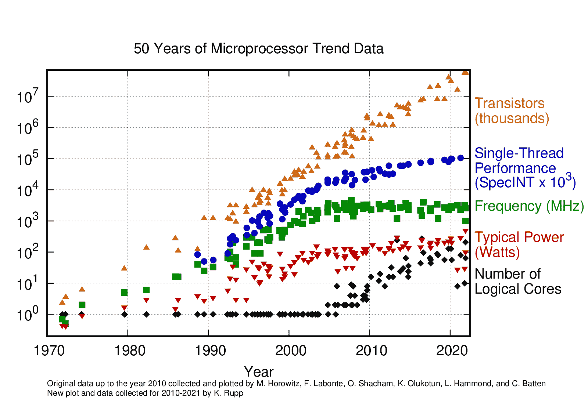
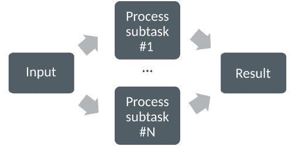
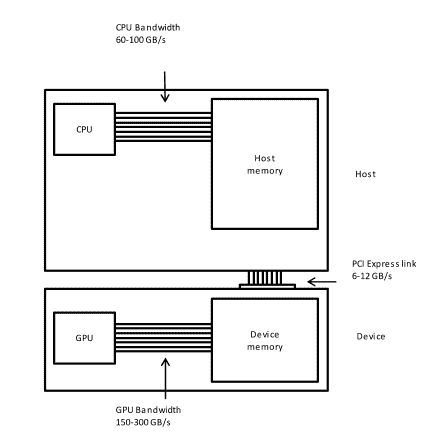
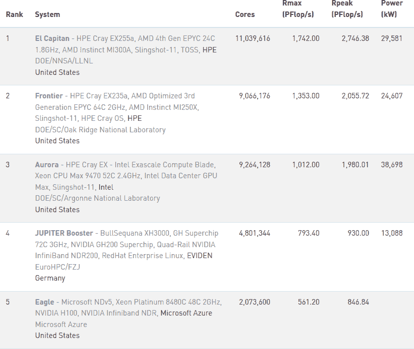

# 为什么选择 GPU？

> 原文：[`enccs.github.io/gpu-programming/1-gpu-history/`](https://enccs.github.io/gpu-programming/1-gpu-history/)

*GPU 编程：为什么、何时以及如何？* **   为什么选择 GPU？

+   [在 GitHub 上编辑](https://github.com/ENCCS/gpu-programming/blob/main/content/1-gpu-history.rst)

* * *

问题

+   什么是摩尔定律？

+   GPU 解决了哪些问题？

目标

+   解释微处理器的历史发展以及 GPU 如何使计算能力持续扩展

教师备注

+   15 分钟教学

+   0 分钟练习

## 摩尔定律

它表明，密集集成电路中的晶体管数量大约每两年翻一番。更多的晶体管意味着单个元件的尺寸更小，因此可以实现更高的核心频率。然而，功耗与频率的立方成正比，因此核心频率的增长已经显著放缓。单个节点的更高性能必须依赖于其更复杂的结构，并且仍然可以通过 SIMD（单指令多数据）、分支预测等方法实现。

微处理器的演变。每块芯片上的晶体管数量大约每两年翻一番。然而，由于功耗限制，它不能再通过核心频率来探索。在 2000 年之前，单核时钟频率的增加是性能增加的主要来源。2000 年中期标志着向多核处理器的转变。

这些年来，性能的提高一直依赖于两种主要策略：

> +   提高单个处理器的性能：
> +   
> +   最近，增加物理核心的数量。

## 并行计算

并行计算的基本思想是将计算问题分解成更小的子任务。然后，多个处理单元可以*同时*解决许多子任务。

并行计算。

如何将问题分解成更小的子任务强烈依赖于问题本身。有各种范例和编程方法来完成这项工作。

## 图形处理单元

图形处理单元（GPU）在过去几年中是最常见的加速器，术语 GPU 有时与术语*加速器*可以互换使用。GPU 最初是为图形处理的高度并行任务开发的。但多年来，它们越来越多地用于高性能计算（HPC）。

GPU（图形处理单元）是一种专门用于浮点运算的并行硬件。它们基本上是传统 CPU 的协处理器（辅助器）：CPU 仍然控制工作流程，但它将高度并行的任务委托给 GPU。GPU 基于高度并行的架构，这使得可以利用晶体管数量的增加。

使用 GPU 可以使每个节点达到极端的性能。因此，配备单个 GPU 的工作站可以在某些类型的计算任务上优于小型基于 CPU 的集群。缺点是：通常需要程序的重大重写，并伴随编程范式的变化。

主机与设备

GPU 启用系统需要一种异构编程模型，该模型涉及 CPU 和 GPU，其中 CPU 及其内存被称为主机，而 GPU 及其内存被称为设备。

图表改编自 Carpentry 的[GPU 编程课程](https://carpentries-incubator.github.io/lesson-gpu-programming/)。

## 查看 TOP500 榜单

[TOP500 项目](https://www.top500.org/)排名并详细介绍了世界上 500 个最强大的非分布式计算机系统。该项目始于 1993 年，每年发布两次超级计算机的更新列表。下面的快照显示了截至 2025 年 6 月的顶级 5 个 HPC 系统，其中列出了：

+   **核心** - 处理器数量

+   **Rmax** - 达到的最大 LINPACK 性能

+   **Rpeak** - 理论峰值性能

+   **功率** - 功耗

来自 2025 年 6 月[TOP500 榜单](https://www.top500.org/lists/top500/2024/05/)的快照。

前 5 名系统都包含来自 AMD、Intel 或 NVIDIA 的 GPU。

## 为什么使用 GPU？

+   **速度**：GPU 计算可以显著加速许多类型的科学工作负载。

+   **提高能源效率**：与 CPU 相比，GPU 可以在消耗每瓦特功率的情况下执行更多的计算，这可能导致显著的能源节约。这一点确实可以从[GREEN500 榜单](https://www.top500.org/lists/green500/2025/06/)中看出。

+   **成本效益**：对于某些工作负载，GPU 可能比传统的基于 CPU 的系统更具成本效益。

## 局限性和缺点

+   **仅适用于某些工作负载**：并非所有工作负载都可以在 GPU 上高效并行化和加速。某些类型的工作负载，如具有不规则数据访问模式或高分支行为的工作负载，可能在 GPU 上看不到显著的性能提升。

+   **学习曲线更陡峭**：根据您选择的 GPU 编程 API，GPU 计算可能需要 GPU 编程的专业技能和对 GPU 架构的了解，这导致与 CPU 编程相比学习曲线更陡峭。幸运的是，如果您仔细学习这些培训材料，您将能够快速掌握 GPU 编程！

关键点

+   GPU 是某些类型任务的加速器

+   高度可并行化的计算密集型任务适合 GPU

+   基于 GPU 的系统主导了 TOP500 榜单的顶级位置

+   需要新的编程技能来高效使用 GPU 上一页 下一页

* * *

© 版权所有 2023-2024，贡献者。

使用[Read the Docs](https://readthedocs.org)提供的[主题](https://github.com/readthedocs/sphinx_rtd_theme)和[Sphinx](https://www.sphinx-doc.org/)构建。问题

+   什么是摩尔定律？

+   GPU 解决了哪些问题？

目标

+   解释微处理器的历史发展以及 GPU 如何使计算能力持续扩展

教师备注

+   15 分钟教学

+   0 分钟练习

## 摩尔定律

它表明，密集集成电路中的晶体管数量大约每两年翻一番。更多的晶体管意味着单个元件的尺寸更小，因此可以实现更高的核心频率。然而，功耗与频率的立方成正比，因此核心频率的增长已经显著放缓。单个节点的更高性能必须依赖于其更复杂的结构，并且仍然可以通过 SIMD（单指令多数据）、分支预测等实现。

微处理器的演变。每块芯片上的晶体管数量大约每两年翻一番。然而，由于功耗限制，它不能再通过核心频率来探索。在 2000 年之前，单核时钟频率的增加是性能增加的主要来源。2000 年中期标志着向多核处理器的转变。

这些年来，提高性能一直依赖于两种主要策略：

> +   提高单处理器性能：
> +   
> +   最近，增加物理核心的数量。

## 并行计算

并行计算的基本思想是将计算问题分割成更小的子任务。然后，多个处理单元可以*同时*解决许多子任务。

并行计算。

一个问题如何被分割成更小的子任务，这强烈依赖于问题本身。有各种范例和编程方法来完成这项工作。

## 图形处理单元

图形处理单元（GPU）在过去几年中一直是最常见的加速器，有时 GPU 这个术语与*加速器*这个术语可以互换使用。GPU 最初是为了图形处理的高度并行任务而开发的。但随着时间的推移，它们越来越多地用于高性能计算（HPC）。

GPU 是专门用于浮点运算的并行硬件。它们基本上是传统 CPU 的协处理器（辅助器）：CPU 仍然控制工作流程，但它将高度并行的任务委托给 GPU。GPU 基于高度并行的架构，这允许利用晶体管数量的增加。

使用 GPU 可以使每个节点达到极端的性能。因此，配备单个 GPU 的工作站可以在某些类型的计算任务上优于小型基于 CPU 的集群。缺点是：通常需要程序的重大重写，并伴随编程范式的变化。

主机与设备

具备 GPU 功能的系统需要一种异构编程模型，该模型涉及 CPU 和 GPU，其中 CPU 及其内存被称为主机，而 GPU 及其内存称为设备。

图表改编自 Carpentry 的[GPU 编程课程](https://carpentries-incubator.github.io/lesson-gpu-programming/)。

## 查看 TOP500 榜单

[TOP500 项目](https://www.top500.org/)排名并详细介绍了世界上 500 个最强大的非分布式计算机系统。该项目始于 1993 年，每年发布两次超级计算机的更新列表。下面的快照显示了截至 2025 年 6 月的顶级 5 个 HPC 系统，其中列表示：

+   **核心** - 处理器数量

+   **Rmax** - 达到的最大 LINPACK 性能

+   **Rpeak** - 理论峰值性能

+   **功率** - 功耗

来自[2025 年 6 月的 TOP500 榜单](https://www.top500.org/lists/top500/2024/05/)的快照。

前 5 名位置的所有系统都包含来自 AMD、Intel 或 NVIDIA 的 GPU。

## 为什么选择 GPU？

+   **速度**：GPU 计算可以显著加速许多类型的科学工作负载。

+   **提高能效**：与 CPU 相比，GPU 可以在消耗每瓦特功率的情况下执行更多计算，这可能导致显著的能源节约。这一点确实可以从[GREEN500 榜单](https://www.top500.org/lists/green500/2025/06/)中看出。

+   **性价比**：对于某些工作负载，GPU 可能比基于传统 CPU 的系统更具成本效益。

## 局限性和缺点

+   **仅适用于某些工作负载**：并非所有工作负载都能在 GPU 上高效并行化和加速。某些类型的工作负载，如具有不规则数据访问模式或高分支行为的工作负载，可能在 GPU 上看不到显著的性能提升。

+   **学习曲线更陡峭**：根据您选择的 GPU 编程 API，GPU 计算可能需要 GPU 编程的专业技能和对 GPU 架构的了解，这比 CPU 编程的学习曲线更陡峭。幸运的是，如果您仔细研究这些培训材料，您将能够快速掌握 GPU 编程！

重点

+   GPU 是某些类型任务的加速器

+   高度可并行化的计算密集型任务适合 GPU

+   基于 GPU 的系统在 TOP500 榜单的顶尖位置占据主导地位

+   需要新的编程技能来高效使用 GPU

## 摩尔定律

它指出，密集集成电路中的晶体管数量大约每两年翻一番。晶体管数量越多，单个元件的尺寸就越小，因此可以实现更高的核心频率。然而，功耗与频率的立方成正比，因此核心频率的增长已经显著放缓。单个节点的更高性能必须依赖于其更复杂的结构，并且可以通过 SIMD（单指令多数据）、分支预测等方法实现。

微处理器的演变。每块芯片上的晶体管数量大约每两年翻一番。然而，由于功耗限制，它不能再通过核心频率来探索。在 2000 年之前，单核时钟频率的增加是性能增加的主要来源。2000 年中期标志着向多核处理器的过渡。

这些年来，通过两种主要策略保持了性能的提升：

> +   提高单处理器性能：
> +   
> +   最近，增加物理核心的数量。

## 并行计算

并行计算的基本思想是将计算问题分解成更小的子任务。然后，多个处理单元可以*同时*解决许多子任务。

并行计算。

如何将问题分解成更小的子任务强烈依赖于问题本身。有各种范例和编程方法来完成这项工作。

## 图形处理单元

图形处理单元（GPU）在过去几年中是最常见的加速器，GPU 这个术语有时与*加速器*这个术语可以互换使用。GPU 最初是为图形处理的高度并行任务开发的。但多年来，它们越来越多地用于高性能计算（HPC）。

GPU 是一种专门用于浮点运算的并行硬件。它们基本上是传统 CPU 的协处理器（辅助器）：CPU 仍然控制工作流程，但它将高度并行的任务委托给 GPU。GPU 基于高度并行的架构，这允许利用晶体管数量的增加。

使用 GPU 可以使每个节点达到极端的性能。因此，配备单个 GPU 的工作站可以超越某些类型的计算任务的小型基于 CPU 的集群。缺点是：通常需要程序的重大重写，并伴随编程范式的变化。

主机与设备

具有 GPU 的系统需要涉及 CPU 和 GPU 的异构编程模型，其中 CPU 及其内存被称为主机，GPU 及其内存称为设备。

图表改编自 Carpentry 的[GPU 编程课程](https://carpentries-incubator.github.io/lesson-gpu-programming/)。

## 查看 TOP500 榜单

[TOP500 项目](https://www.top500.org/)排名并详细介绍了世界上 500 个最强大的非分布式计算机系统。该项目始于 1993 年，每年发布两次超级计算机的最新榜单。下面的快照显示了截至 2025 年 6 月的顶级 5 个 HPC 系统，其中列出的列显示：

+   **核心数** - 处理器数量

+   **Rmax** - 达到的最大 LINPACK 性能

+   **Rpeak** - 理论峰值性能

+   **功耗** - 功耗

来自[2025 年 6 月的 TOP500 榜单快照](https://www.top500.org/lists/top500/2024/05/)。

前 5 位系统都包含来自 AMD、Intel 或 NVIDIA 的 GPU。

## 为什么选择 GPU？

+   **速度**：GPU 计算可以显著加速许多类型的科学工作负载。

+   **提高能源效率**：与 CPU 相比，GPU 可以在消耗每瓦特功率的情况下执行更多的计算，这可能导致显著的能源节约。这一点确实可以从[GREEN500 榜单](https://www.top500.org/lists/green500/2025/06/)中看出。

+   **成本效益**：对于某些工作负载，GPU 可能比传统的基于 CPU 的系统更具成本效益。

## 局限性和缺点

+   **仅适用于特定工作负载**：并非所有工作负载都能在 GPU 上高效并行化和加速。某些类型的工作负载，如具有不规则数据访问模式或高分支行为的工作负载，可能在 GPU 上看不到显著的性能提升。

+   **学习曲线更陡峭**：根据你选择的 GPU 编程 API，GPU 计算可能需要 GPU 编程的专业技能和对 GPU 架构的了解，这比 CPU 编程的学习曲线更陡峭。幸运的是，如果你仔细学习这份培训材料，你将能够快速掌握 GPU 编程！

重点

+   GPU 是某些类型任务的加速器

+   高度可并行化的计算密集型任务适合 GPU

+   基于 GPU 的系统在 TOP500 榜单上占据主导地位

+   需要新的编程技能来有效地使用 GPU*
