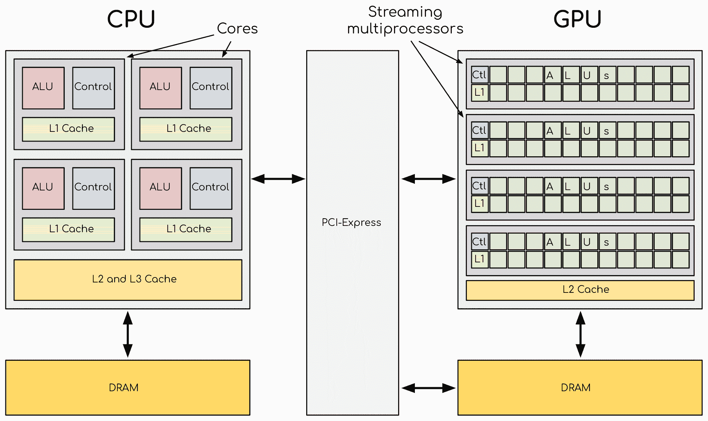

# GPU 硬件和软件生态系统

> 原文：[`enccs.github.io/gpu-programming/2-gpu-ecosystem/`](https://enccs.github.io/gpu-programming/2-gpu-ecosystem/)

*GPU 编程：为什么、何时以及如何？* **   GPU 硬件和软件生态系统

+   [在 GitHub 上编辑](https://github.com/ENCCS/gpu-programming/blob/main/content/2-gpu-ecosystem.rst)

* * *

问题

+   GPU 和 CPU 之间有什么区别？

+   可用的 GPU 软件堆栈有哪些？它们提供什么？

目标

+   理解 GPU 和 CPU 之间的基本区别

+   探索可用的主要 GPU 软件套件，如 CUDA、ROCm 和 oneAPI，并对其有一个基本的了解

教师备注

+   20 分钟教学

+   0 分钟练习

## GPU 硬件概述

CPU（左侧）具有复杂的内核结构，并在单个芯片上集成多个核心。与 GPU 核心相比，CPU 核心非常简单，它们之间也共享数据和控制。这使得可以在单个芯片上集成更多的核心，从而实现非常高的计算密度。

简而言之

+   由于其可扩展性和计算元素的密集度，加速器提供高性能。

+   它们通过 PCIe 总线连接到 CPU，拥有自己的内存。

+   CPU 将数据从自己的内存复制到 GPU 内存，执行程序，并将结果复制回来。

+   GPU 同时运行数千个线程，快速地在它们之间切换以隐藏内存操作。

+   在 GPU 上，有效的数据管理和访问模式对于避免内存耗尽至关重要。

加速器是一个独立的电路板，包含处理器、内存、电源管理等。它通过 PCIe 总线连接到带有 CPU 的主板。拥有自己的内存意味着数据必须被复制到和从它（现在可能不再是这样了）。CPU 作为主处理器，控制执行流程。它将数据从自己的内存复制到 GPU 内存，执行程序，并将结果复制回来。GPU 在数千个核心上同时运行数万个线程，并不进行太多的数据管理。当许多核心同时尝试访问内存并且缓存有限时，加速器可能会很快耗尽内存。这使得数据管理和其访问模式在 GPU 上至关重要。加速器喜欢被大量的线程所超载，因为它们可以非常快速地在线程之间切换。这允许隐藏内存操作：当一些线程等待时，其他线程可以进行计算。

加速器的一个重要特性是其可扩展性。加速器上的计算核心通常被分组为多处理器。多处理器共享数据和逻辑元素。这允许在 GPU 上实现非常高的计算元素密度。这也允许进行扩展：更多的多处理器意味着更高的原始性能，而且通过更多的晶体管实现这一点非常容易。

## GPU 与 CPU 有何不同？

CPU 和 GPU 的设计目标不同。虽然 CPU 旨在尽可能快地执行一系列操作，即线程，并且可以并行执行几十个这样的线程，但 GPU 旨在并行执行成千上万的线程。GPU 最初是为高度并行的图形处理任务开发的，因此设计时更多地致力于数据处理而不是数据缓存和流控制。更多用于数据处理的晶体管对高度并行的计算有益；GPU 可以通过计算来隐藏内存访问延迟，而不是依赖于大型数据缓存和复杂的流控制来避免长时间的内存访问延迟，这两者从晶体管的角度来看都是昂贵的。

| CPU | GPU |
| --- | --- |
| 通用 | 高度专门化于并行 |
| 适合串行处理 | 适合并行处理 |
| 适合任务并行 | 适合数据并行 |
| 每线程低延迟 | 高吞吐量 |
| 专用的大面积缓存和控制 | 数百个浮点执行单元 |

## GPU 平台

GPU 与软件堆栈或 API 一起提供，这些 API 与硬件协同工作，为软件与 GPU 硬件的交互提供了一种标准方式。它们被软件开发者用来编写可以利用 GPU 并行处理能力的代码，并为软件与 GPU 硬件的交互提供了一种标准方式。通常，它们提供对底层功能，如内存管理、CPU 和 GPU 之间的数据传输以及 GPU 上并行处理任务的调度和执行的访问。它们还可能提供针对特定 HPC 工作负载（如线性代数或快速傅里叶变换）优化的高级功能和库。最后，为了帮助开发者优化和编写正确的代码，还包含了调试和性能分析工具。

*NVIDIA*、*AMD*和*Intel*是设计并生产用于 HPC 的 GPU 的主要公司，它们各自提供自己的套件**CUDA**、**ROCm**和分别的**oneAPI**。这样，它们可以提供优化、差异化（提供针对其设备定制的独特功能）、供应商锁定、许可和版税费用，这可能导致更好的性能、盈利能力和客户忠诚度。还有跨平台 API，如**DirectCompute**（仅适用于 Windows 操作系统）、**OpenCL**和**SYCL**。

CUDA - 简而言之

+   CUDA：NVIDIA 的并行计算平台

    +   组件：CUDA 工具包与 CUDA 驱动程序

    +   支持 C、C++和 Fortran 语言

+   CUDA API 库：cuBLAS、cuFFT、cuRAND、cuSPARSE

    +   在 GPU 上加速复杂计算

+   编译器：nvcc、nvc、nvc++、nvfortran

    +   支持 GPU 和多核 CPU 编程

    +   兼容 OpenACC 和 OpenMP

+   调试工具：cuda-gdb、compute-sanitizer

    +   同时调试 GPU 和 CPU 代码

    +   识别内存访问问题

+   性能分析工具：NVIDIA Nsight Systems、NVIDIA Nsight Compute

    +   分析系统级和内核级性能

    +   优化 CPU 和 GPU 的使用，内存带宽，指令吞吐量

+   完整的 CUDA 生态系统，具有广泛的工具和功能

ROCm - 简而言之

+   ROCm：AMD 加速器的开源软件平台

    +   为跨多个供应商和架构的开放可移植性而构建

    +   提供 AMD GPU 的库、编译器和开发工具

    +   支持 C、C++和 Fortran 语言

    +   支持 GPU 和多核 CPU 编程

+   调试：`roc-gdb`命令行工具

    +   促进 GPU 程序的调试

+   性能分析：`rocprof`和`roctracer`工具

    +   分析和优化程序性能

+   支持各种异构编程模型，如**HIP**、**OpenMP**和**OpenCL**

+   异构计算接口（HIP）

    +   实现 NVIDIA 和 AMD 平台的源可移植性，Intel 计划中

    +   提供`hipcc`编译器驱动程序和运行时库

+   库：以`roc`前缀针对 AMD 平台

    +   可直接从 HIP 调用

    +   `hip`前缀的包装确保无性能成本的可移植性

oneAPI - 简而言之

+   Intel oneAPI：跨各种架构优化和部署应用的统一软件工具包

    +   支持 CPU、GPU 和 FPGA

    +   实现代码重用和性能可移植性

+   Intel oneAPI Base Toolkit：高性能、数据为中心应用的核心工具和库集合

    +   包含具有 SYCL 支持的 C++编译器

    +   特点包括集体通信库、数据分析库、深度神经网络库等

+   额外工具包：Intel oneAPI HPC 工具包

    +   包含编译器、调试工具、MPI 库和性能分析工具

+   支持多种编程模型和语言：

    +   OpenMP、经典 Fortran、C++、SYCL

    +   除非使用自定义 Intel 库，否则代码可移植到其他 OpenMP 和 SYCL 框架

+   DPC++编译器：支持 Intel、NVIDIA 和 AMD GPU

    +   针对使用 oneAPI Level Zero 接口的 Intel GPU

    +   增加了支持 CUDA 的 NVIDIA GPU 和 ROCm 的 AMD GPU

+   调试和性能分析工具：Intel Adviser、Intel Vtune Profiler、Cluster Checker、Inspector、Intel Trace Analyzer and Collector、Intel Distribution for GDB

+   异构计算的全面统一方法

    +   抽象复杂度并提供一致的编程接口

    +   促进代码重用、生产力和性能可移植性

### CUDA

**统一计算设备架构**是 NVIDIA 的并行计算平台。CUDA API 为开发在 NVIDIA GPU 上运行的高性能应用程序提供了一套全面的函数和工具。它由两个主要组件组成：CUDA 工具包和 CUDA 驱动程序。工具包提供了一套用于编程和优化 CUDA 应用程序的库、编译器和开发工具，而驱动程序负责主机 CPU 和设备 GPU 之间的通信。CUDA 设计用于与 C、C++ 和 Fortran 等编程语言一起工作。

CUDA API 提供了许多高度优化的库，例如：**cuBLAS**（用于线性代数运算，例如密集矩阵乘法）、**cuFFT**（用于执行快速傅里叶变换）、**cuRAND**（用于生成伪随机数）、**cuSPARSE**（用于稀疏矩阵运算）。使用这些库，开发者可以快速轻松地加速在 NVIDIA GPU 上进行的复杂计算，而无需自己编写底层 GPU 代码。

有几种编译器可用于在 NVIDIA GPU 上开发和执行代码：**nvcc**。最新版本基于广泛使用的 LLVM（低级虚拟机）开源编译器基础设施。nvcc 为 NVIDIA GPU 生成优化代码，并驱动支持 AMD、Intel、OpenPOWER 和 Arm CPU 的主机编译器。

此外，还提供了 **nvc**（C11 编译器）、**nvc++**（C++17 编译器）和 **nvfortran**（ISO Fortran 2003 编译器）。这些编译器不仅可以创建在 NVIDIA GPU 上执行的代码，还支持使用并行语言特性 OpenACC 和 OpenMP 进行 GPU 和多核 CPU 编程。

当编程错误不可避免时，它们必须尽快修复。CUDA 工具包包括命令行工具 **cuda-gdb**，可用于查找代码中的错误。它是 GNU 项目调试器 GDB 的扩展。现有的 GDB 调试功能本身适用于调试主机代码，并提供了额外的功能以支持调试 CUDA 设备代码，允许在同一应用程序中同时调试 GPU 和 CPU 代码。该工具为开发者提供了一种调试在真实硬件上运行的 CUDA 应用程序的方法。这使得开发者能够在没有模拟和仿真环境引入的潜在变化的情况下调试应用程序。

此外，命令行工具 **compute-sanitizer** 可以用于专门查找内存访问问题：未分配的缓冲区、越界访问、竞态条件和未初始化的变量。

最后，为了最大限度地利用 GPU，需要一些性能分析工具。NVIDIA 提供了 NVIDIA Nsight Systems 和 NVIDIA Nsight Compute 工具，以帮助开发者优化他们的应用程序。前者，NVIDIA Nsight Systems，是一个系统级性能分析工具，它提供了关于 CPU 和 GPU 使用情况、内存带宽以及其他系统级指标的详细指标。后者，NVIDIA Nsight Compute，是一个内核级性能分析工具，允许开发者分析单个 CUDA 内核的性能。它提供了关于内核执行的详细指标，包括内存使用、指令吞吐量和占用率。这些工具具有图形界面，可用于性能分析的各个步骤，然而在超级计算机上，建议使用命令行界面来收集所需信息，然后使用个人计算机上的图形界面可视化和分析结果。

除了上面提到的，NVIDIA 还提供了许多其他工具和功能。CUDA 生态系统非常发达。

### ROCm

ROCm 是一个开源软件平台，允许研究人员利用 AMD 加速器的强大功能。ROCm 平台建立在开放可移植性的基础上，支持多个加速器和架构的环境。在某种程度上，它与 CUDA API 非常相似。它包含用于为 AMD GPU 编程和优化的库、编译器和开发工具。对于调试，它提供了命令行工具`rocgdb`，而对于性能分析，则提供了`rocprof`和`roctracer`。为了为 AMD GPU 生成代码，可以使用异构计算接口可移植性（HIP）。HIP 是一个 C++运行时 API 和一系列工具，允许开发者编写适用于 NVIDIA 和 AMD 平台的可移植 GPU 加速代码。它提供了`hipcc`编译器驱动程序，该驱动程序将根据所需的平台调用适当的工具链。在 AMD ROCm 平台上，HIP 提供了一个基于 HIP-Clang（ROCm 编译器）的标头和运行时库。在 NVIDIA 平台上，HIP 提供了一个将 HIP 运行时 API 转换为 CUDA 运行时 API 的标头文件。该头文件主要包含内联函数，因此开销非常低。然后使用`nvcc`编译器，这是 CUDA 附带的标准 C++编译器，来编译代码。在 AMD 平台上，库以`roc`为前缀，可以直接从 HIP 调用。为了进行可移植调用，可以使用以`hip`为前缀的包装器。这些包装器无需任何性能开销，并确保 HIP 代码可以在其他平台上使用而无需更改。ROCm 中包含的库几乎与 CUDA 提供的库一一对应。

ROCm 还集成了流行的机器学习框架，如 TensorFlow 和 PyTorch，并提供优化的库和驱动程序，以加速在 AMD GPU 上运行的机器学习工作负载，使研究人员能够有效地利用 ROCm 和 AMD 加速器的力量来训练和部署机器学习模型。

### oneAPI

**Intel oneAPI** 是英特尔开发的一个统一的软件工具包，它允许开发者优化和部署跨多种架构的应用程序，包括 CPU、GPU 和 FPGA。它提供了一套全面的工具、库和框架，使开发者能够充分利用异构计算环境的全部潜力。使用 oneAPI，开发者可以编写一次代码，并在不同的硬件目标上部署，无需进行重大修改或重写。这种方法促进了代码的可重用性、生产力和性能的可移植性，因为它抽象了异构计算的复杂性，并基于开放标准提供了一个一致的编程接口。

套件的核心是**Intel oneAPI Base Toolkit**，这是一套用于在多种架构上开发高性能、数据为中心的应用程序的工具和库。它具有业界领先的 C++编译器，实现了 C++的演变——SYCL，用于异构计算。它包括**集体通信库**、**数据分析库**、**深度神经网络库**、**DPC++/C++编译器**、**DPC++库**、**数学内核库**、**线程构建块**、调试工具**Intel Distribution for GDB**、性能分析工具**Intel Adviser**和**Intel Vtune Profiler**、**视频处理库**、**Intel Distribution for Python**、**DPC++兼容性工具**、**oneAPI Base Toolkit 的 FPGA 附加组件**、**集成性能原语**。这可以补充额外的工具包。**Intel oneAPI HPC Toolkit**包含**DPC++/C++编译器**、**Fortran**和**C++**编译器经典、调试工具**Cluster Checker**和**Inspector**、**Intel MPI 库**以及性能分析工具**Intel Trace Analyzer and Collector**。

oneAPI 支持多种编程模型和编程语言。它使开发者能够使用经典 Fortran 和 C++ 编译器编写针对多核 CPU 和英特尔 GPU 的 **OpenMP** 代码，以及使用 **DPC++** 编译器为 GPU 和 FPGA 编写 **SYCL** 程序。最初，**DPC++** 编译器仅针对使用 **oneAPI Level Zero** 低级编程接口的英特尔 GPU，但现在已增加了对 NVIDIA GPU（使用 CUDA）和 AMD GPU（使用 ROCm）的支持。总的来说，英特尔 oneAPI 提供了一种全面且统一的方法来处理异构计算，使开发者能够轻松地在不同的架构上优化和部署应用程序。通过抽象复杂性和提供一致的编程接口，oneAPI 促进代码重用性、生产力和性能的可移植性，使其成为多元计算平台时代开发者不可或缺的工具包。

### 差异与相似之处

通常，GPU 支持不同的功能，即使在同一生产者之间也是如此。通常，新卡会带来额外的功能，有时旧功能可能不再受支持。在编译时，创建针对特定架构的二进制文件很重要。为较新卡构建的二进制文件无法在较旧设备上运行，而为较旧设备构建的二进制文件可能在较新架构上运行效率不高。在 CUDA 中，目标计算能力通过 `-arch=sm_XY` 指定，其中 `X` 指定主架构，介于 1 和 9 之间，而 `Y` 指定次架构。当在 NVIDIA 平台上使用 HIP 时，需要使用编译选项 `--gpu-architecture=sm_XY`，而在 AMD 平台上使用 `--offload-arch=gfxabc`（其中 `abc` 是架构代码，例如 MI200 系列的 `90a` 或 MI100 系列的 `908`）。请注意，在可移植（单源）程序的情况下，还需要指定 `openmp` 以及编译目标，以便能够在多核 CPU 上运行相同的代码。

### 术语

硬件

| NVIDIA | AMD | Intel |
| --- | --- | --- |
| 流处理器/流核心 | SIMD 通道 | 处理单元 |
| SIMT 单元 | SIMD 单元 | 向量引擎 (XVE) |
| 流式多处理器 (SM) | 计算单元 (CU) | Xe 核心 / 执行单元 (EU) |
| GPU 处理集群 (GPC) | 计算引擎 | Xe-slice |

请记住，这个表格只是一个粗略的近似。每个 GPU 架构都是不同的，不可能在不同供应商使用的术语之间进行一对一的映射。

## 摘要

+   GPU 被设计成可以同时执行数千个线程，使其成为高度并行的处理器。相比之下，CPU 在并行执行较少线程方面表现出色。

+   GPU 将更大的晶体管部分分配给数据处理，而不是数据缓存和流量控制。这种对数据处理的优先级使得 GPU 能够有效地处理并行计算，并通过计算隐藏内存访问延迟。

+   GPU 生产商为开发利用 GPU 并行处理能力的应用程序提供全面的工具包、库和编译器。例如，CUDA（NVIDIA）、ROCm（AMD）和 oneAPI（Intel）。

+   这些平台提供调试工具（例如，`cuda-gdb`、`rocgdb`）和性能分析工具（例如，NVIDIA Nsight Systems、NVIDIA Nsight Compute、`rocprof`、`roctracer`），以促进代码优化并确保 GPU 资源的有效利用。

## 练习

GPU 和内存

关于 GPU 和内存之间关系的哪个陈述是正确的？

+   1.  GPU 不受内存访问延迟的影响。

+   1.  当许多内核同时尝试访问内存时，GPU 可能会快速耗尽内存。

+   1.  GPU 具有无限的缓存大小。

+   1.  GPU 更喜欢以最少的线程数量运行，以有效地管理内存。

解决方案

正确答案是 B）。这是因为 GPU 在数千个内核上同时运行许多线程，并且由于缓存有限，如果许多内核同时尝试访问内存，这可能导致 GPU 快速耗尽内存。这就是为什么数据管理和访问模式在 GPU 计算中至关重要。

重点

+   GPU 与 CPU，它们之间的关键区别

+   GPU 软件套件，支持特定的 GPU 功能，编程模型，兼容性

+   GPU 的应用程序上一页 下一页

* * *

©版权所有 2023-2024，贡献者。

使用[Sphinx](https://www.sphinx-doc.org/)和由[Read the Docs](https://readthedocs.org)提供的[主题](https://github.com/readthedocs/sphinx_rtd_theme)构建。问题

+   GPU 和 CPU 之间的区别是什么？

+   可用的 GPU 软件堆栈有哪些？它们提供什么？

目标

+   理解 GPU 和 CPU 之间的基本区别

+   探索可用的主要 GPU 软件套件，例如 CUDA、ROCm 和 oneAPI，并对其有一个基本的了解

教师备注

+   20 分钟教学

+   0 分钟练习

## GPU 硬件概述

CPU（左）具有复杂的内核结构，并在单个芯片上集成多个内核。与 CPU 内核相比，GPU 内核非常简单，它们之间也共享数据和控制。这使得可以在单个芯片上集成更多内核，从而实现非常高的计算密度。

简而言之

+   加速器由于其可扩展性和计算元素的密集度而提供高性能。

+   它们通过 PCIe 总线连接到 CPU，并拥有自己的电路板。

+   CPU 将数据从自己的内存复制到 GPU 内存，执行程序，并将结果复制回来。

+   GPU 同时运行数千个线程，快速地在它们之间切换以隐藏内存操作。

+   在 GPU 上，有效的数据管理和访问模式至关重要，以避免内存不足。

加速器是一个独立的电路板，包含处理器、内存、电源管理等。它通过 PCIe 总线连接到 CPU 的主板。拥有自己的内存意味着数据必须被复制到和从它那里（现在可能不再是这种情况）。CPU 作为主处理器，控制执行工作流程。它将数据从自己的内存复制到 GPU 内存，执行程序，并将结果复制回来。GPU 在数千个核心上同时运行数万个线程，并且不做太多的数据管理。由于许多核心同时尝试访问内存，且缓存有限，加速器可能会很快耗尽内存。这使得数据管理和其访问模式在 GPU 上至关重要。加速器喜欢被线程数量超载，因为它们可以非常快速地在线程之间切换。这允许隐藏内存操作：当一些线程等待时，其他线程可以计算。

加速器的一个重要特性是其可扩展性。加速器上的计算核心通常被分组为多处理器。多处理器共享数据和逻辑元素。这允许在 GPU 上实现非常高的计算元素密度。这也允许进行扩展：更多的多处理器意味着更高的原始性能，而且通过更多的晶体管很容易实现。

## GPU 与 CPU 有何不同？

CPU 和 GPU 的设计初衷不同。虽然 CPU 旨在尽可能快地执行一系列操作，称为线程，并且可以并行执行几十个这样的线程，但 GPU 旨在并行执行成千上万的线程。GPU 最初是为高度并行的图形处理任务开发的，因此设计时更多地致力于数据处理而不是数据缓存和流量控制。更多用于数据处理的晶体管对高度并行的计算有益；GPU 可以通过计算来隐藏内存访问延迟，而不是依赖于大型数据缓存和复杂的流量控制来避免长时间的内存访问延迟，这两者从晶体管的角度来看都是昂贵的。

| CPU | GPU |
| --- | --- |
| 通用 | 高度针对并行性 |
| 适合串行处理 | 适合并行处理 |
| 适合任务并行 | 适合数据并行 |
| 每线程低延迟 | 高吞吐量 |
| 大面积专用缓存和控制 | 数百个浮点执行单元 |

## GPU 平台

GPU 与软件堆栈或 API 结合使用，与硬件协同工作，为软件与 GPU 硬件的交互提供标准方式。软件开发者使用这些工具编写可以利用 GPU 并行处理能力的代码，并为软件与 GPU 硬件的交互提供标准方式。通常，它们提供对底层功能，如内存管理、CPU 和 GPU 之间的数据传输以及 GPU 上并行处理任务的调度和执行。它们还可能提供针对特定 HPC 工作负载（如线性代数或快速傅里叶变换）优化的高级功能和库。最后，为了帮助开发者优化和编写正确的代码，还包含调试和性能分析工具。

**NVIDIA**、**AMD**和**Intel**是设计并生产用于 HPC 的 GPU 的主要公司，它们分别提供自己的套件**CUDA**、**ROCm**和**oneAPI**。这样，它们可以提供优化、差异化（提供针对其设备定制的独特功能）、供应商锁定、许可和版税费用，这可能导致更好的性能、盈利能力和客户忠诚度。还有跨平台的 API，如**DirectCompute**（仅适用于 Windows 操作系统）、**OpenCL**和**SYCL**。

CUDA - 简而言之

+   CUDA：NVIDIA 的并行计算平台

    +   组件：CUDA Toolkit & CUDA 驱动程序

    +   支持 C、C++和 Fortran 语言

+   CUDA API 库：cuBLAS、cuFFT、cuRAND、cuSPARSE

    +   加速 GPU 上的复杂计算

+   编译器：nvcc、nvc、nvc++、nvfortran

    +   支持 GPU 和多核 CPU 编程

    +   兼容 OpenACC 和 OpenMP

+   调试工具：cuda-gdb、compute-sanitizer

    +   同时调试 GPU 和 CPU 代码

    +   识别内存访问问题

+   性能分析工具：NVIDIA Nsight Systems、NVIDIA Nsight Compute

    +   分析系统级和内核级性能

    +   优化 CPU 和 GPU 使用，内存带宽，指令吞吐量

+   完整的 CUDA 生态系统，具有广泛的功能和工具

ROCm - 简而言之

+   ROCm：AMD 加速器的开源软件平台

    +   为跨多个供应商和架构的开放可移植性而构建

    +   为 AMD GPU 提供库、编译器和开发工具

    +   支持 C、C++和 Fortran 语言

    +   支持 GPU 和多核 CPU 编程

+   调试：`roc-gdb`命令行工具

    +   促进 GPU 程序的调试

+   性能分析：`rocprof`和`roctracer`工具

    +   分析和优化程序性能

+   支持各种异构编程模型，如**HIP**、**OpenMP**和**OpenCL**

+   异构计算接口（Heterogeneous-Computing Interface for Portability, HIP）

    +   使 NVIDIA 和 AMD 平台实现源便携性，Intel 计划中

    +   提供`hipcc`编译器驱动程序和运行时库

+   库：以`roc`为前缀，适用于 AMD 平台

    +   可直接从 HIP 调用

    +   `hip`前缀的包装器确保了无性能成本的便携性

oneAPI - 简而言之

+   Intel oneAPI：用于在各种架构上优化和部署应用程序的统一软件工具包

    +   支持 CPU、GPU 和 FPGA

    +   实现代码重用性和性能可移植性

+   Intel oneAPI Base Toolkit：用于高性能、数据为中心应用的核心工具和库集合

    +   包含支持 SYCL 的 C++ 编译器

    +   功能包括集体通信库、数据分析库、深度神经网络库等

+   其他工具包：Intel oneAPI HPC Toolkit

    +   包含编译器、调试工具、MPI 库和性能分析工具

+   支持多种编程模型和语言：

    +   OpenMP、经典 Fortran、C++、SYCL

    +   除非使用自定义的 Intel 库，否则代码可移植到其他 OpenMP 和 SYCL 框架

+   DPC++ 编译器：支持 Intel、NVIDIA 和 AMD GPU

    +   使用 oneAPI Level Zero 接口针对 Intel GPU

    +   增加了支持 NVIDIA GPU 的 CUDA 和 AMD GPU 的 ROCm

+   调试和性能分析工具：Intel Adviser、Intel Vtune Profiler、Cluster Checker、Inspector、Intel Trace Analyzer and Collector、Intel Distribution for GDB

+   针对异构计算的综合统一方法

    +   抽象复杂性并提供一致的编程接口

    +   促进代码重用性、生产力和性能可移植性

### CUDA

**统一计算设备架构**是 NVIDIA 的并行计算平台。CUDA API 提供了一套全面的函数和工具，用于开发在 NVIDIA GPU 上运行的高性能应用程序。它由两个主要组件组成：CUDA Toolkit 和 CUDA 驱动程序。工具包提供了一套库、编译器和开发工具，用于编程和优化 CUDA 应用程序，而驱动程序负责主机 CPU 和设备 GPU 之间的通信。CUDA 设计用于与 C、C++ 和 Fortran 等编程语言一起工作。

CUDA API 提供了许多高度优化的库，例如：**cuBLAS**（用于线性代数运算，如稠密矩阵乘法）、**cuFFT**（用于执行快速傅里叶变换）、**cuRAND**（用于生成伪随机数）、**cuSPARSE**（用于稀疏矩阵运算）。使用这些库，开发者可以快速轻松地加速 NVIDIA GPU 上的复杂计算，而无需自己编写低级 GPU 代码。

有几个编译器可用于在 NVIDIA GPU 上开发和执行代码：**nvcc**。最新版本基于广泛使用的 LLVM（低级虚拟机）开源编译器基础设施。nvcc 为 NVIDIA GPU 生成优化代码，并驱动支持 AMD、Intel、OpenPOWER 和 Arm CPU 的主机编译器。

此外还提供了 **nvc**（C11 编译器）、**nvc++**（C++17 编译器）和 **nvfortran**（ISO Fortran 2003 编译器）。这些编译器也可以为 NVIDIA GPU 创建代码，并支持使用并行语言特性 OpenACC 和 OpenMP 进行 GPU 和多核 CPU 编程。

当编程错误不可避免时，它们必须尽快修复。CUDA 工具包包括命令行工具 **cuda-gdb**，可用于查找代码中的错误。它是 GNU 项目调试器 GDB 的扩展。现有的 GDB 调试功能本身适用于调试主机代码，并且还提供了额外的功能来支持调试 CUDA 设备代码，允许在同一应用程序中同时调试 GPU 和 CPU 代码。该工具为开发者提供了一种调试在真实硬件上运行的 CUDA 应用程序的方法。这使得开发者能够在没有模拟和仿真环境引入的潜在变化的情况下调试应用程序。

除了上述内容，命令行工具 **compute-sanitizer** 可以专门用于查找内存访问问题：未分配的缓冲区、越界访问、竞态条件和未初始化的变量。

最后，为了最大限度地利用 GPU，需要一些性能分析工具。NVIDIA 提供了 NVIDIA Nsight Systems 和 NVIDIA Nsight Compute 工具，以帮助开发者优化他们的应用程序。前者，NVIDIA Nsight Systems，是一个系统级性能分析工具，它提供了关于 CPU 和 GPU 使用情况、内存带宽以及其他系统级指标的详细指标。后者，NVIDIA Nsight Compute，是一个内核级性能分析工具，允许开发者分析单个 CUDA 内核的性能。它提供了关于内核执行的详细指标，包括内存使用、指令吞吐量和占用率。这些工具具有图形界面，可用于性能分析的各个步骤，然而在超级计算机上，建议使用命令行界面来收集所需信息，然后使用个人计算机上的图形界面可视化和分析结果。

除了上面提到的，NVIDIA 还提供了许多其他工具和功能。CUDA 生态系统非常完善。

### ROCm

ROCm 是一个开放软件平台，允许研究人员利用 AMD 加速器的强大功能。ROCm 平台建立在开放可移植性的基础上，支持多个加速器供应商和架构的环境。在某种程度上，它与 CUDA API 非常相似。它包含用于为 AMD GPU 编程和优化程序的库、编译器和开发工具。为了调试，它提供了命令行工具`rocgdb`，而为了性能分析，提供了`rocprof`和`roctracer`。为了生成 AMD GPU 的代码，可以使用异构计算接口可移植性（HIP）。HIP 是一个 C++运行时 API 和一系列工具，允许开发者为 NVIDIA 和 AMD 平台编写可移植的 GPU 加速代码。它提供了`hipcc`编译器驱动程序，该驱动程序将根据所需的平台调用适当的工具链。在 AMD ROCm 平台上，HIP 提供了一套基于 HIP-Clang（ROCm 编译器）的头部和运行时库。在 NVIDIA 平台上，HIP 提供了一套将 HIP 运行时 API 转换为 CUDA 运行时 API 的头文件。该头文件主要包含内联函数，因此开销非常低。然后使用`nvcc`编译器，这是 CUDA 提供的标准 C++编译器，进行编译。在 AMD 平台上，库以`roc`为前缀，可以直接从 HIP 调用。为了进行可移植调用，可以使用以`hip`为前缀的包装器。这些包装器可以在不牺牲性能的情况下使用，并确保 HIP 代码可以在其他平台上使用而无需更改。ROCm 中包含的库几乎与 CUDA 提供的库一一对应。

ROCm 还集成了流行的机器学习框架，如 TensorFlow 和 PyTorch，并为 AMD GPU 提供了优化的库和驱动程序，以加速机器学习工作负载。这使得研究人员能够有效地利用 ROCm 和 AMD 加速器的强大功能来训练和部署机器学习模型。

### oneAPI

**英特尔 oneAPI**是由英特尔开发的一个统一的软件工具包，允许开发者优化和部署跨多种架构的应用程序，包括 CPU、GPU 和 FPGA。它提供了一套全面的工具、库和框架，使开发者能够充分利用异构计算环境的全部潜力。使用 oneAPI，开发者可以编写一次代码，并在不同的硬件目标上部署，无需进行重大修改或重写。这种方法促进了代码的可重用性、生产力和性能可移植性，因为它抽象了异构计算的复杂性，并提供了一个基于开放标准的统一编程接口。

Suite 的核心是**Intel oneAPI Base Toolkit**，这是一套用于在多种架构上开发高性能、数据为中心的应用程序的工具和库。它包含业界领先的 C++编译器，该编译器实现了 SYCL，这是针对异构计算的 C++的演变。它包括**集体通信库**、**数据分析库**、**深度神经网络库**、**DPC++/C++编译器**、**DPC++库**、**数学内核库**、**线程构建块**、调试工具**Intel Distribution for GDB**、性能分析工具**Intel Adviser**和**Intel Vtune Profiler**、**视频处理库**、**Intel Distribution for Python**、**DPC++兼容性工具**、**oneAPI Base Toolkit 的 FPGA 附加组件**、**集成性能原语**。这可以补充额外的工具包。**Intel oneAPI HPC Toolkit**包含**DPC++/C++编译器**、**Fortran**和**C++**编译器经典、调试工具**Cluster Checker**和**Inspector**、**Intel MPI 库**以及性能分析工具**Intel Trace Analyzer and Collector**。

oneAPI 支持多种编程模型和编程语言。它使开发者能够使用经典 Fortran 和 C++编译器编写针对多核 CPU 和 Intel GPU 的**OpenMP**代码，以及使用**DPC++**编译器编写针对 GPU 和 FPGA 的**SYCL**程序。最初，**DPC++**编译器仅针对使用**oneAPI Level Zero**低级编程接口的 Intel GPU，但现在已增加了对 NVIDIA GPU（使用 CUDA）和 AMD GPU（使用 ROCm）的支持。总体而言，Intel oneAPI 提供了一种全面统一的异构计算方法，使开发者能够轻松地在不同架构上优化和部署应用程序。通过抽象复杂性和提供一致的编程接口，oneAPI 促进了代码的可重用性、生产力和性能的可移植性，使其成为多样化计算平台时代开发者不可或缺的工具包。

### 差异与相似之处

通常，GPU 支持不同的功能，即使在同一制造商之间也是如此。一般来说，新卡带有额外的功能，有时旧功能可能不再受支持。在编译时，创建针对特定架构的二进制文件很重要。为较新卡构建的二进制文件无法在较旧设备上运行，而为较旧设备构建的二进制文件可能在较新架构上运行效率不高。在 CUDA 中，目标计算能力由`-arch=sm_XY`指定，其中`X`指定主架构，介于 1 到 9 之间，而`Y`指定次架构。当在 NVIDIA 平台上使用 HIP 时，需要使用编译选项`--gpu-architecture=sm_XY`，而在 AMD 平台上使用`--offload-arch=gfxabc`（其中`abc`是架构代码，例如 MI200 系列的`90a`或 MI100 系列的`908`）。请注意，在可移植（单源）程序的情况下，还需要指定`openmp`以及编译目标，以便在多核 CPU 上运行相同的代码。

### 术语

硬件

| NVIDIA | AMD | Intel |
| --- | --- | --- |
| 流处理器/流核心 | SIMD 通道 | 处理单元 |
| SIMT 单元 | SIMD 单元 | 向量引擎（XVE） |
| 流式多处理器（SM） | 计算单元（CU） | Xe-core / 执行单元（EU） |
| GPU 处理集群（GPC） | 计算引擎 | Xe-slice |

请记住，这个表格只是一个粗略的近似。每个 GPU 架构都不同，不可能在不同供应商使用的术语之间进行一对一的映射。

## 摘要

+   GPU 被设计为同时执行数千个线程，使其成为高度并行的处理器。相比之下，CPU 擅长并行执行较少的线程。

+   GPU 将更大的晶体管部分分配给数据处理，而不是数据缓存和流量控制。这种对数据处理的优先级使得 GPU 能够有效地处理并行计算，并通过计算隐藏内存访问延迟。

+   GPU 制造商为开发利用 GPU 并行处理能力的应用程序提供全面的工具包、库和编译器。例如，CUDA（NVIDIA）、ROCm（AMD）和 oneAPI（Intel）。

+   这些平台提供调试工具（例如，`cuda-gdb`、`rocgdb`）和性能分析工具（例如，NVIDIA Nsight Systems、NVIDIA Nsight Compute、`rocprof`、`roctracer`），以促进代码优化并确保高效利用 GPU 资源。

## 练习

GPU 和内存

关于 GPU 和内存之间关系的哪个说法是正确的？

+   1.  GPU 不受内存访问延迟的影响。

+   1.  当许多核心同时尝试访问内存时，GPU 可能会很快耗尽内存。

+   1.  GPU 具有无限的缓存大小。

+   1.  GPU 更喜欢以最少的线程数量运行，以有效地管理内存。

解决方案

正确答案是 B）。这是因为 GPU 在数千个核心上同时运行许多线程，并且由于可用的缓存有限，如果许多核心同时尝试访问内存，这可能导致 GPU 很快耗尽内存。这就是为什么数据管理和访问模式在 GPU 计算中至关重要。

重点

+   GPU 与 CPU 的比较，它们之间的关键区别

+   GPU 软件套件，支持特定的 GPU 功能、编程模型、兼容性

+   GPU 的应用

## GPU 硬件概述

CPU 和 GPU 架构的比较。CPU（左侧）具有复杂的内核结构，并在单个芯片上集成多个核心。相比之下，GPU 核心非常简单，它们之间也共享数据和控制。这使得可以在单个芯片上集成更多核心，从而实现非常高的计算密度。

简而言之

+   加速器由于其可扩展性和计算元素的密集度，提供了高性能。

+   它们有独立的电路板，通过 PCIe 总线连接到 CPU，并拥有自己的内存。

+   CPU 将数据从其自己的内存复制到 GPU 内存，执行程序，并将结果复制回来。

+   GPU 可以同时运行数千个线程，快速地在它们之间切换，以隐藏内存操作。

+   在 GPU 上，有效的数据管理和访问模式是避免内存不足的关键。

加速器是一个独立的主体电路板，包含处理器、内存、电源管理等。它通过 PCIe 总线连接到带有 CPU 的主板。拥有自己的内存意味着数据必须被复制到和从它那里（现在可能不再是这种情况）。CPU 作为主处理器，控制执行工作流程。它将数据从其自己的内存复制到 GPU 内存，执行程序，并将结果复制回来。GPU 在数千个核心上同时运行数万个线程，并且不进行太多的数据管理。由于许多核心同时尝试访问内存，并且可用的缓存很少，加速器可能会很快耗尽内存。这使得数据管理和其访问模式在 GPU 上变得至关重要。加速器喜欢被线程数量超载，因为它们可以非常快速地在线程之间切换。这允许隐藏内存操作：当一些线程等待时，其他线程可以进行计算。

加速器的一个非常重要的特性是其可扩展性。加速器上的计算核心通常被分组到多处理器中。多处理器共享数据和逻辑元素。这允许在 GPU 上实现非常高的计算元素密度。这也允许扩展：更多的多处理器意味着更多的原始性能，并且通过更多的晶体管很容易实现。

## GPU 与 CPU 有何不同？

CPU 和 GPU 是基于不同的目标设计的。虽然 CPU 设计用于尽可能快地执行一系列操作，称为线程，并且可以并行执行几十个这样的线程，但 GPU 设计用于并行执行成千上万的线程。GPU 最初是为高度并行的图形处理任务开发的，因此设计时更注重数据处理而不是数据缓存和流控制。更多用于数据处理的晶体管对高度并行计算有益；GPU 可以通过计算来隐藏内存访问延迟，而不是依赖于大型数据缓存和复杂的流控制来避免长时间的内存访问延迟，这两者从晶体管的角度来看都是昂贵的。

| CPU | GPU |
| --- | --- |
| 通用 | 高度专门化以支持并行处理 |
| 适用于串行处理 | 适用于并行处理 |
| 适用于任务并行处理 | 适用于数据并行处理 |
| 每线程低延迟 | 高吞吐量 |
| 大面积专用缓存和控制 | 数百个浮点执行单元 |

## GPU 平台

GPU 与软件堆栈或 API 一起提供，这些 API 与硬件协同工作，为软件与 GPU 硬件交互提供标准方式。软件开发者使用这些 API 编写能够利用 GPU 并行处理能力的代码，并为软件与 GPU 硬件交互提供标准方式。通常，它们提供对底层功能（如内存管理、CPU 和 GPU 之间的数据传输以及 GPU 上并行处理任务的调度和执行）的访问。它们还可能提供针对特定 HPC 工作负载（如线性代数或快速傅里叶变换）优化的高级功能和库。最后，为了帮助开发者优化和编写正确的代码，还包含了调试和性能分析工具。

*NVIDIA*、*AMD* 和 *Intel* 是设计并生产 HPC GPU 的主要公司，它们各自提供自己的套件 **CUDA**、**ROCm** 和 **oneAPI**。这样，它们可以提供优化、差异化（提供针对其设备定制的独特功能）、供应商锁定、许可和版税费用，这些都可以带来更好的性能、盈利能力和客户忠诚度。还有跨平台 API，如 **DirectCompute**（仅适用于 Windows 操作系统）、**OpenCL** 和 **SYCL**。

CUDA - 简而言之

+   CUDA：NVIDIA 的并行计算平台

    +   组件：CUDA 工具包 & CUDA 驱动程序

    +   支持 C、C++ 和 Fortran 语言

+   CUDA API 库：cuBLAS, cuFFT, cuRAND, cuSPARSE

    +   在 GPU 上加速复杂计算

+   编译器：nvcc, nvc, nvc++, nvfortran

    +   支持 GPU 和多核 CPU 编程

    +   兼容 OpenACC 和 OpenMP

+   调试工具：cuda-gdb, compute-sanitizer

    +   同时调试 GPU 和 CPU 代码

    +   识别内存访问问题

+   性能分析工具：NVIDIA Nsight Systems、NVIDIA Nsight Compute

    +   分析系统级和内核级性能

    +   优化 CPU 和 GPU 的使用，内存带宽，指令吞吐量

+   完整的 CUDA 生态系统，具有广泛的功能和工具

ROCm - 简而言之

+   ROCm：AMD 加速器的开源软件平台

    +   为跨多个供应商和架构的开放可移植性而构建

    +   提供 AMD GPU 的库、编译器和开发工具

    +   支持 C、C++和 Fortran 语言

    +   支持 GPU 和多核 CPU 编程

+   调试：`roc-gdb`命令行工具

    +   便于 GPU 程序的调试

+   性能分析：`rocprof`和`roctracer`工具

    +   分析和优化程序性能

+   支持各种异构编程模型，如**HIP**、**OpenMP**和**OpenCL**

+   异构计算接口（Heterogeneous-Computing Interface for Portability，简称 HIP）

    +   实现了 NVIDIA 和 AMD 平台的源代码可移植性，英特尔计划中

    +   提供了`hipcc`编译器驱动程序和运行时库

+   库：以`roc`为前缀，适用于 AMD 平台

    +   可直接从 HIP 调用

    +   `hip`前缀的包装器确保了无性能成本的可移植性

oneAPI - 简而言之

+   Intel oneAPI：跨各种架构优化和部署应用的统一软件工具包

    +   支持 CPU、GPU 和 FPGA

    +   促进了代码重用性和性能可移植性

+   Intel oneAPI 基础工具包：高性能、数据为中心应用的核心工具和库集合

    +   包含支持 SYCL 的 C++编译器

    +   特性包括集体通信库、数据分析库、深度神经网络库等

+   其他工具包：Intel oneAPI HPC 工具包

    +   包含编译器、调试工具、MPI 库和性能分析工具

+   支持多种编程模型和语言：

    +   OpenMP、经典 Fortran、C++、SYCL

    +   除非使用自定义英特尔库，否则代码可移植到其他 OpenMP 和 SYCL 框架

+   DPC++ 编译器：支持英特尔、NVIDIA 和 AMD GPU

    +   使用 oneAPI Level Zero 接口针对英特尔 GPU

    +   增加了支持 CUDA 的 NVIDIA GPU 和 ROCm 的 AMD GPU

+   调试和性能分析工具：英特尔顾问（Intel Adviser）、英特尔 Vtune 分析器（Intel Vtune Profiler）、集群检查器（Cluster Checker）、检查器（Inspector）、英特尔跟踪分析器和收集器（Intel Trace Analyzer and Collector）、英特尔 GDB 分发版（Intel Distribution for GDB）

+   综合统一的异构计算方法

    +   抽象复杂性并提供一致的编程接口

    +   促进代码重用性、生产力和性能可移植性

### CUDA

**Compute Unified Device Architecture** 是 NVIDIA 的并行计算平台。CUDA API 为开发在 NVIDIA GPU 上运行的高性能应用程序提供了一套全面的函数和工具。它由两个主要组件组成：CUDA 工具包和 CUDA 驱动程序。工具包提供了一套库、编译器和开发工具，用于编程和优化 CUDA 应用程序，而驱动程序负责主机 CPU 和设备 GPU 之间的通信。CUDA 设计用于与 C、C++ 和 Fortran 等编程语言一起工作。

CUDA API 提供了许多高度优化的库，例如：**cuBLAS**（用于线性代数运算，例如密集矩阵乘法）、**cuFFT**（用于执行快速傅里叶变换）、**cuRAND**（用于生成伪随机数）、**cuSPARSE**（用于稀疏矩阵运算）。使用这些库，开发者可以快速轻松地加速在 NVIDIA GPU 上进行的复杂计算，而无需自己编写底层 GPU 代码。

有几种编译器可用于在 NVIDIA GPU 上开发和执行代码：**nvcc**。最新版本基于广泛使用的 LLVM（低级虚拟机）开源编译器基础设施。nvcc 为 NVIDIA GPU 生成优化代码，并驱动支持 AMD、Intel、OpenPOWER 和 Arm CPU 的主机编译器。

此外，还提供了 **nvc**（C11 编译器）、**nvc++**（C++17 编译器）和 **nvfortran**（ISO Fortran 2003 编译器）。这些编译器同样可以创建在 NVIDIA GPU 上执行的代码，并支持使用并行语言功能 OpenACC 和 OpenMP 进行 GPU 和多核 CPU 编程。

当编程错误不可避免时，它们必须尽快修复。CUDA 工具包包括命令行工具 **cuda-gdb**，可用于查找代码中的错误。它是 GNU 项目调试器 GDB 的扩展。现有的 GDB 调试功能本身适用于调试主机代码，并提供了额外的功能以支持调试 CUDA 设备代码，允许在同一应用程序中同时调试 GPU 和 CPU 代码。该工具为开发者提供了一种调试在真实硬件上运行的 CUDA 应用程序的方法。这使得开发者能够在没有模拟和仿真环境引入的潜在变化的情况下调试应用程序。

此外，命令行工具 **compute-sanitizer** 可以用于专门查找内存访问问题：未分配的缓冲区、越界访问、竞态条件和未初始化的变量。

最后，为了最大限度地利用 GPU，需要一些性能分析工具。NVIDIA 提供了 NVIDIA Nsight Systems 和 NVIDIA Nsight Compute 工具，以帮助开发者优化他们的应用程序。前者，NVIDIA Nsight Systems，是一个系统级性能分析工具，提供了关于 CPU 和 GPU 使用、内存带宽以及其他系统级指标的详细指标。后者，NVIDIA Nsight Compute，是一个内核级性能分析工具，允许开发者分析单个 CUDA 内核的性能。它提供了关于内核执行的详细指标，包括内存使用、指令吞吐量和占用率。这些工具具有图形界面，可用于性能分析的各个步骤，然而在超级计算机上，建议使用命令行界面来收集所需的信息，然后使用个人计算机上的图形界面可视化和分析结果。

除了上述内容之外，NVIDIA 还提供了许多其他工具和功能。CUDA 生态系统非常完善。

### ROCm

ROCm 是一个开放软件平台，允许研究人员利用 AMD 加速器的强大功能。ROCm 平台建立在开放可移植性的基础上，支持多个加速器供应商和架构的环境。在某种程度上，它与 CUDA API 非常相似。它包含用于为 AMD GPU 编程和优化的库、编译器和开发工具。为了调试，它提供了命令行工具`rocgdb`，而为了性能分析，提供了`rocprof`和`roctracer`。为了生成 AMD GPU 的代码，可以使用异构计算接口（HIP）。HIP 是一个 C++运行时 API 和一系列工具，允许开发者为 NVIDIA 和 AMD 平台编写可移植的 GPU 加速代码。它提供了`hipcc`编译器驱动程序，该驱动程序将根据所需的平台调用适当的工具链。在 AMD ROCm 平台上，HIP 提供基于 HIP-Clang（ROCm 编译器）的标头和运行时库。在 NVIDIA 平台上，HIP 提供将 HIP 运行时 API 转换为 CUDA 运行时 API 的标头文件。该头文件主要包含内联函数，因此开销非常低。然后使用`nvcc`编译器，这是 CUDA 提供的标准 C++编译器，进行编译。在 AMD 平台上，库以`roc`为前缀，可以直接从 HIP 调用。为了进行可移植调用，可以使用以`hip`为前缀的包装器。这些包装器可以在不牺牲性能的情况下使用，并确保 HIP 代码可以在其他平台上使用而无需更改。ROCm 中包含的库几乎与 CUDA 提供的库一一对应。

ROCm 还集成了流行的机器学习框架，如 TensorFlow 和 PyTorch，并为 AMD GPU 上的机器学习工作负载提供优化的库和驱动程序，使研究人员能够有效地利用 ROCm 和 AMD 加速器的力量来训练和部署机器学习模型。

### oneAPI

**Intel oneAPI**是由 Intel 开发的一个统一的软件工具包，它允许开发者在包括 CPU、GPU 和 FPGA 在内的各种架构上优化和部署应用程序。它提供了一套全面的工具、库和框架，使开发者能够充分利用异构计算环境的全部潜力。使用 oneAPI，开发者可以编写一次代码，并在不同的硬件目标上部署，无需进行重大修改或重写。这种方法促进了代码的可重用性、生产力和性能的可移植性，因为它抽象了异构计算的复杂性，并提供了一个基于开放标准的统一编程接口。

Suite 的核心是**Intel oneAPI Base Toolkit**，这是一套用于在多种架构上开发高性能、以数据为中心的应用程序的工具和库。它包含业界领先的 C++编译器，该编译器实现了 SYCL，这是针对异构计算的 C++的演变。它包括**集体通信库**、**数据分析库**、**深度神经网络库**、**DPC++/C++编译器**、**DPC++库**、**数学内核库**、**线程构建块**、调试工具**Intel Distribution for GDB**、性能分析工具**Intel Adviser**和**Intel Vtune Profiler**、**视频处理库**、**Intel Distribution for Python**、**DPC++兼容性工具**、**oneAPI Base Toolkit 的 FPGA 附加组件**、**集成性能原语**。这可以补充额外的工具包。**Intel oneAPI HPC Toolkit**包含**DPC++/C++编译器**、**Fortran**和**C++**编译器经典、调试工具**Cluster Checker**和**Inspector**、**Intel MPI 库**以及性能分析工具**Intel Trace Analyzer and Collector**。

oneAPI 支持多种编程模型和编程语言。它使开发者能够使用经典 Fortran 和 C++编译器编写针对多核 CPU 和英特尔 GPU 的**OpenMP**代码，以及使用**DPC++**编译器为 GPU 和 FPGA 编写**SYCL**程序。最初，**DPC++**编译器仅针对使用**oneAPI Level Zero**低级编程接口的英特尔 GPU，但现在已增加了对 NVIDIA GPU（使用 CUDA）和 AMD GPU（使用 ROCm）的支持。总体而言，英特尔 oneAPI 提供了一种全面且统一的异构计算方法，使开发者能够轻松地在不同架构上优化和部署应用程序。通过抽象复杂性和提供一致的编程接口，oneAPI 促进了代码的可重用性、生产力和性能可移植性，使其成为多元计算平台时代开发者不可或缺的工具包。

### 差异和相似之处

一般而言，GPU 支持不同的功能，即使在同一制造商之间也是如此。通常，新卡会带有额外的功能，有时旧功能可能不再受支持。在编译时，创建针对特定架构的二进制文件很重要。为较新卡构建的二进制文件无法在较旧设备上运行，而为较旧设备构建的二进制文件可能在较新架构上运行效率不高。在 CUDA 中，目标计算能力由`-arch=sm_XY`指定，其中`X`指定主架构，介于 1 到 9 之间，而`Y`指定次架构。当在 NVIDIA 平台上使用 HIP 时，需要使用编译选项`--gpu-architecture=sm_XY`，而在 AMD 平台上使用`--offload-arch=gfxabc`（其中`abc`是架构代码，例如 MI200 系列的`90a`或 MI100 系列的`908`）。请注意，在可移植（单源）程序的情况下，还需要指定`openmp`以及编译目标，以便能够在多核 CPU 上运行相同的代码。

### 术语

硬件

| NVIDIA | AMD | Intel |
| --- | --- | --- |
| 流式处理器/流式核心 | SIMD 通道 | 处理器 |
| SIMT 单元 | SIMD 单元 | 向量引擎（XVE） |
| 流式多处理器（SM） | 计算单元（CU） | Xe 核心/执行单元（EU） |
| GPU 处理集群（GPC） | 计算引擎 | Xe 切片 |

请记住，这个表格只是一个粗略的近似。每个 GPU 架构都是不同的，不可能在不同供应商使用的术语之间进行一对一的映射。

### CUDA

**统一计算设备架构**是来自 NVIDIA 的并行计算平台。CUDA API 提供了一套全面的函数和工具，用于开发在 NVIDIA GPU 上运行的高性能应用程序。它由两个主要组件组成：CUDA 工具包和 CUDA 驱动程序。工具包提供了一套库、编译器和开发工具，用于编程和优化 CUDA 应用程序，而驱动程序负责主机 CPU 和设备 GPU 之间的通信。CUDA 旨在与编程语言如 C、C++和 Fortran 一起工作。

CUDA API 提供了许多高度优化的库，例如：**cuBLAS**（用于线性代数运算，如稠密矩阵乘法）、**cuFFT**（用于执行快速傅里叶变换）、**cuRAND**（用于生成伪随机数）、**cuSPARSE**（用于稀疏矩阵运算）。使用这些库，开发者可以快速轻松地加速在 NVIDIA GPU 上的复杂计算，而无需自己编写低级 GPU 代码。

有几种编译器可用于在 NVIDIA GPU 上开发和执行代码：**nvcc**。最新版本基于广泛使用的 LLVM（低级虚拟机）开源编译器基础设施。nvcc 为 NVIDIA GPU 生成优化代码，并驱动支持 AMD、Intel、OpenPOWER 和 Arm CPU 的主机编译器。

此外，还提供了**nvc**（C11 编译器）、**nvc++**（C++17 编译器）和**nvfortran**（ISO Fortran 2003 编译器）。这些编译器同样可以创建在 NVIDIA GPU 上执行的代码，并支持使用并行语言特性（如 OpenACC 和 OpenMP）进行 GPU 和多核 CPU 编程。

当编程错误不可避免时，它们必须尽快修复。CUDA 工具包包括命令行工具**cuda-gdb**，可用于查找代码中的错误。它是 GNU 项目调试器 GDB 的扩展。现有的 GDB 调试功能本身适用于调试主机代码，并提供了额外的功能以支持调试 CUDA 设备代码，允许在同一应用程序中同时调试 GPU 和 CPU 代码。该工具为开发者提供了一种调试在真实硬件上运行的 CUDA 应用程序的机制。这使得开发者能够在没有模拟和仿真环境引入的潜在变化的情况下调试应用程序。

此外，可以使用命令行工具**compute-sanitizer**专门查找内存访问问题：未分配的缓冲区、越界访问、竞态条件和未初始化的变量。

最后，为了最大限度地利用 GPU，需要一些性能分析工具。NVIDIA 提供了 NVIDIA Nsight Systems 和 NVIDIA Nsight Compute 工具，以帮助开发者优化他们的应用程序。前者，NVIDIA Nsight Systems，是一个系统级性能分析工具，提供了关于 CPU 和 GPU 使用、内存带宽和其他系统级指标的详细指标。后者，NVIDIA Nsight Compute，是一个内核级性能分析工具，允许开发者分析单个 CUDA 内核的性能。它提供了关于内核执行的详细指标，包括内存使用、指令吞吐量和占用率。这些工具具有图形界面，可用于性能分析的各个步骤，然而在超级计算机上，建议使用命令行界面来收集所需的信息，然后使用个人计算机上的图形界面可视化和分析结果。

除了上面提到的工具和功能外，NVIDIA 还提供了许多其他工具。CUDA 生态系统非常完善。

### ROCm

ROCm 是一个开源软件平台，允许研究人员利用 AMD 加速器的强大功能。ROCm 平台建立在开放可移植性的基础上，支持多个加速器和架构的环境。在某种程度上，它与 CUDA API 非常相似。它包含用于为 AMD GPU 编程和优化的库、编译器和开发工具。对于调试，它提供了命令行工具`rocgdb`，而对于性能分析，则提供了`rocprof`和`roctracer`。为了生成 AMD GPU 的代码，可以使用异构计算接口（HIP）。HIP 是一个 C++运行时 API 和一系列工具，允许开发者编写适用于 NVIDIA 和 AMD 平台的可移植 GPU 加速代码。它提供了`hipcc`编译器驱动程序，该驱动程序将根据所需的平台调用适当的工具链。在 AMD ROCm 平台上，HIP 提供基于 HIP-Clang（ROCm 编译器）的标头和运行时库。在 NVIDIA 平台上，HIP 提供将 HIP 运行时 API 转换为 CUDA 运行时 API 的标头文件。该头文件主要包含内联函数，因此开销非常低。然后使用`nvcc`编译器（CUDA 提供的标准 C++编译器）编译代码。在 AMD 平台上，库以`roc`为前缀，可以直接从 HIP 调用。为了进行可移植调用，可以使用以`hip`为前缀的包装器。这些包装器不会产生性能成本，并确保 HIP 代码可以在其他平台上使用而无需更改。ROCm 中包含的库几乎与 CUDA 提供的库一一对应。

ROCm 还集成了流行的机器学习框架，如 TensorFlow 和 PyTorch，并提供优化的库和驱动程序，以加速在 AMD GPU 上运行的机器学习工作负载，使研究人员能够有效地利用 ROCm 和 AMD 加速器的力量来训练和部署机器学习模型。

### oneAPI

**Intel oneAPI**是由英特尔开发的一个统一的软件工具包，允许开发者优化和部署跨多种架构（包括 CPU、GPU 和 FPGA）的应用程序。它提供了一套全面的工具、库和框架，使开发者能够充分利用异构计算环境的全部潜力。使用 oneAPI，开发者可以编写一次代码，并在不同的硬件目标上部署，无需进行重大修改或重写。这种方法促进了代码的可重用性、生产力和性能的可移植性，因为它抽象了异构计算的复杂性，并基于开放标准提供了一个一致的编程接口。

该套件的核心是**Intel oneAPI Base Toolkit**，一套用于在多种架构上开发高性能、数据为中心的应用程序的工具和库。它包含业界领先的 C++编译器，实现了 C++的异构计算进化版 SYCL。它包括**集体通信库**、**数据分析库**、**深度神经网络库**、**DPC++/C++编译器**、**DPC++库**、**数学内核库**、**线程构建块**、调试工具**Intel Distribution for GDB**、性能分析工具**Intel Adviser**和**Intel Vtune Profiler**、**视频处理库**、**Intel Distribution for Python**、**DPC++兼容性工具**、**oneAPI Base Toolkit 的 FPGA 附加组件**、**集成性能原语**。这可以补充额外的工具包。**Intel oneAPI HPC Toolkit**包含**DPC++/C++编译器**、**Fortran**和**C++**编译器经典版、调试工具**Cluster Checker**和**Inspector**、**Intel MPI 库**以及性能分析工具**Intel Trace Analyzer and Collector**。

oneAPI 支持多种编程模型和编程语言。它使开发者能够使用经典 Fortran 和 C++编译器编写针对多核 CPU 和 Intel GPU 的**OpenMP**代码，以及使用**DPC++**编译器为 GPU 和 FPGA 编写**SYCL**程序。最初，**DPC++**编译器仅针对使用**oneAPI Level Zero**低级编程接口的 Intel GPU，但现在已添加了对 NVIDIA GPU（使用 CUDA）和 AMD GPU（使用 ROCm）的支持。总体而言，Intel oneAPI 提供了一种全面统一的异构计算方法，使开发者能够轻松优化和部署跨不同架构的应用程序。通过抽象复杂性和提供一致的编程接口，oneAPI 促进了代码的可重用性、生产力和性能的可移植性，使其成为多元计算平台时代开发者不可或缺的工具包。

### 差异和相似之处

一般而言，GPU 支持不同的特性，即使在同一生产者之间也是如此。通常，新卡会带来额外的功能，有时旧功能可能不再被支持。在编译时，创建针对特定架构的二进制文件非常重要。为较新卡构建的二进制文件无法在旧设备上运行，而为旧设备构建的二进制文件可能在较新架构上运行效率不高。在 CUDA 中，目标计算能力通过`-arch=sm_XY`指定，其中`X`指定主架构，介于 1 到 9 之间，而`Y`指定次架构。当在 NVIDIA 平台上使用 HIP 时，需要使用编译选项`--gpu-architecture=sm_XY`，而在 AMD 平台上使用`--offload-arch=gfxabc`（其中`abc`是架构代码，例如 MI200 系列的`90a`或 MI100 系列的`908`）。请注意，在可移植（单源）程序的情况下，还需要指定`openmp`以及编译目标，以便在多核 CPU 上运行相同的代码。

### 术语

硬件

| NVIDIA | AMD | Intel |
| --- | --- | --- |
| 流处理器/流核心 | SIMD 通道 | 处理单元 |
| SIMT 单元 | SIMD 单元 | 向量引擎 (XVE) |
| 流式多处理器 (SM) | 计算单元 (CU) | Xe 核心 / 执行单元 (EU) |
| GPU 处理集群 (GPC) | 计算引擎 | Xe-slice |

请记住，此表仅是一个粗略的近似。每个 GPU 架构都不同，不可能在不同供应商使用的术语之间进行一对一的映射。

## 摘要

+   GPU 被设计为同时执行数千个线程，使其成为高度并行的处理器。相比之下，CPU 擅长并行执行较少数量的线程。

+   GPU 将更大的晶体管部分分配给数据处理，而不是数据缓存和流量控制。这种对数据处理的优先级使得 GPU 能够有效地处理并行计算，并通过计算隐藏内存访问延迟。

+   GPU 生产商为开发利用 GPU 并行处理能力的应用程序提供全面的工具包、库和编译器。例如，CUDA（NVIDIA），ROCm（AMD）和 oneAPI（Intel）。

+   这些平台提供了调试工具（例如，`cuda-gdb`，`rocgdb`）和性能分析工具（例如，NVIDIA Nsight Systems，NVIDIA Nsight Compute，`rocprof`，`roctracer`），以促进代码优化并确保高效利用 GPU 资源。

## 练习

GPU 与内存

关于 GPU 与内存之间关系的哪个陈述是正确的？

+   1.  GPU 不受内存访问延迟的影响。

+   1.  当许多核心同时尝试访问内存时，GPU 可能会迅速耗尽内存。

+   1.  GPU 具有无限的缓存大小。

+   1.  GPU 倾向于以最少的线程数量运行，以有效地管理内存。

解决方案

正确答案是 B）。这是因为 GPU 在数千个核心上同时运行许多线程，并且由于可用的缓存有限，如果许多核心同时尝试访问内存，这可能导致 GPU 很快耗尽内存。这就是为什么数据管理和访问模式在 GPU 计算中至关重要。

重点

+   GPU 与 CPU 的比较，它们之间的关键区别

+   GPU 软件套件，支持特定的 GPU 功能、编程模型、兼容性

+   GPU 的应用*
