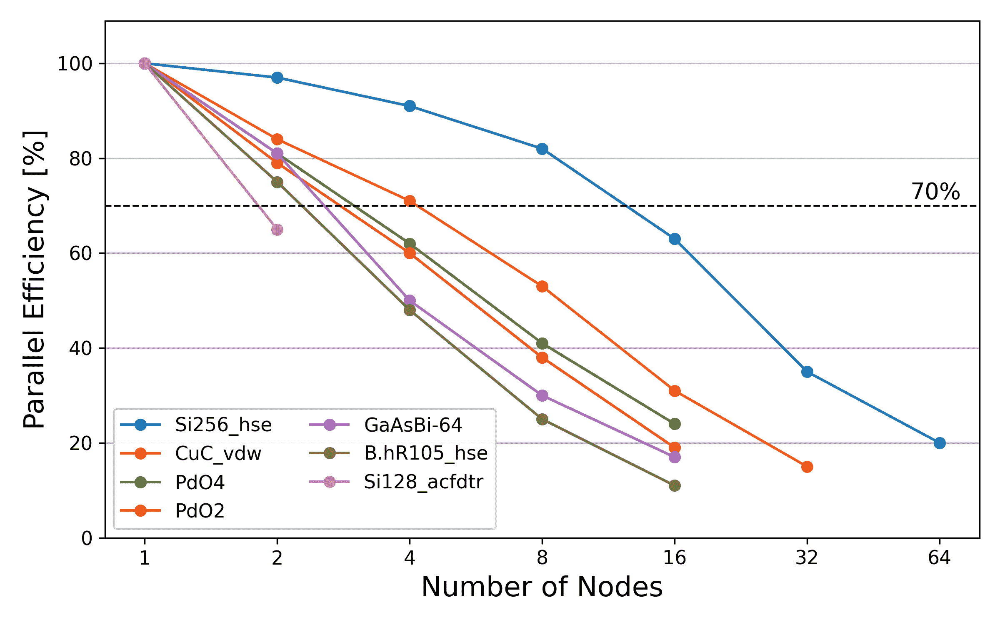
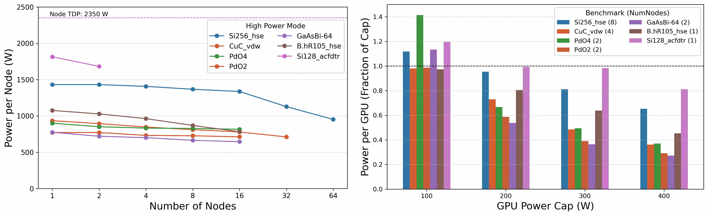

# 适合 GPU 的问题有哪些？

> 原文：[`enccs.github.io/gpu-programming/3-gpu-problems/`](https://enccs.github.io/gpu-programming/3-gpu-problems/)

*GPU 编程：为什么、何时以及如何？* **   适合 GPU 的问题有哪些？

+   [在 GitHub 上编辑](https://github.com/ENCCS/gpu-programming/blob/main/content/3-gpu-problems.rst)

****

问题

+   GPU 的优势和劣势是什么？

+   什么因素使特定问题适合 GPU 转移？

+   为什么 GPU 在机器学习应用中如此普遍？

目标

+   感受 GPU 优秀于哪些用例类型。

教师备注

+   10 分钟教学

+   10 分钟练习

## GPU 适合什么？

来自 [Stack Exchange](https://scicomp.stackexchange.com/questions/943/what-kinds-of-problems-lend-themselves-well-to-gpu-computing) 的回答：

> **从比喻的角度来看，GPU 可以被看作是一个躺在钉床上的一个人。躺在上面的是数据，每个钉子的底部都有一个处理器，所以钉子实际上是从处理器指向内存的箭头。所有钉子都呈规则图案，就像一个网格。如果身体分布得很好，感觉会很好（性能良好），如果身体只接触钉床的一些点，那么疼痛就会很糟糕（性能差）。**

GPU 计算非常适合涉及大量数据并行的问题。具体来说，你可以在 GPU 上期待良好的性能，特别是对于：

+   **大规模矩阵和向量运算**：在机器学习、科学计算和图像处理中很常见。

+   **傅里叶变换**：在机器学习、科学计算和图像处理中也很常见。

+   **蒙特卡洛模拟**：在金融、物理和其他领域用于模拟复杂系统。

+   **分子动力学模拟**：在化学、生物化学和物理学中使用。

+   **计算流体动力学**：在工程、物理和其他领域使用。

+   **卷积神经网络**和**计算机视觉算法**。

+   **大数据分析**：聚类、分类、回归等。

+   **图形渲染**：GPU 的原始用例。

## GPU 不擅长什么？

并非所有编程问题都能有效地利用 GPU 提供的并行性。一些不适合 GPU 的问题类型包括：

+   **顺序任务**：需要一系列依赖步骤的问题，其中每个步骤依赖于前一个步骤的结果，不适合并行处理。例如，递归算法、某些动态规划问题以及一些图遍历算法。

+   **细粒度分支**：当跨不同线程执行的代码遵循相似的控制流时，GPU 表现最佳。当内核或算法中有大量的分支（即许多 `if` 语句）时，由于 GPU 线程执行路径的分歧，性能可能会受到影响。

+   **低算术强度**：GPU 擅长快速执行大量数学运算。如果问题具有低算术强度（即算术运算与内存访问的比率低），GPU 可能无法有效地利用其计算能力，导致性能不佳。

+   **小数据集**：如果问题涉及的小数据集不需要显著的并行处理，使用 GPU 可能不会带来明显的性能提升。在这种情况下，CPU 和 GPU 之间传输数据以及初始化 GPU 所花费的时间可能会超过任何潜在的好处。

+   **有限的并行性**：一些算法在可实现的并行度上存在固有的限制。在这些情况下，使用 GPU 可能不会导致显著的性能提升。

+   **内存绑定问题**：与 CPU 相比，GPU 通常可用的内存较少，其内存带宽可能成为限制因素。如果问题需要大量的内存或涉及内存密集型操作，它可能不适合 GPU。

## GPU 加速的示例

为了展示将计算移植到 GPU（如果我们幸运的话）可以实现的性能提升，让我们看看几个案例示例。

数组大小的影响

考虑 Julia 语言中矩阵乘法的案例：

```
using  AMDGPU
using  BenchmarkTools

N  =  [9,  10,  11,  12]

for  n  in  N
  A  =  rand(2^n,  2^n);  A_d  =  ROCArray(A);

  @btime  $A  *  $A;

  @btime  begin
  $A_d  *  $A_d;
  AMDGPU.synchronize()
  end
end 
```

+   你认为 GPU 版本相比在单个 CPU 核心上运行要快多少？

+   Julia 会自动并行化矩阵乘法，以利用可用的 CPU 核心。GPU 版本会比在 64 个核心上运行快吗？

+   数组的尺寸会影响性能提升的多少吗？

解决方案

在 LUMI（MI250X AMD GPU，64 核 AMD Trento CPU）上运行的结果示例：

Julia 中矩阵乘法的 GPU 加速

| 矩阵大小 | 1 CPU 核心 | 64 CPU 核心 | 1 GPU | GPU 加速比 |
| --- | --- | --- | --- | --- |
| (512, 512) | 5.472 ms | 517.722 μs | 115.805 μs | ~47x / ~5x |
| (1024, 1024) | 43.364 ms | 2.929 ms | 173.316 μs | ~250x / ~17x |
| (2048, 2048) | 344.364 ms | 30.081 ms | 866.348 μs | ~400x / ~35x |
| (4096, 4096) | 3.221 s | 159.563 ms | 5.910 ms | ~550x / ~27x |

### 电子结构计算

[VASP](https://www.vasp.at/) 是一个流行的软件包，用于电子结构计算。下面的图示显示了在 NERSC 的 Perlmutter 系统上进行的最近基准测试研究 [VASP 在 NVIDIA A100 GPU 上的功率配置文件](https://ieeexplore.ieee.org/document/10820603) 中观察到的加速效果，该研究展示了 VASP 的总能耗分析，表明 VASP 的功耗随着不同工作负载的变化而显著变化，比并行并发的变化更大。此外，将 GPU 的功耗限制在其热设计功耗的 50%以下，可以应用于大多数 VASP 工作负载，而性能损失不到 10%。



VASP 在七个测试案例上的并行效率，这些测试案例代表了多样化的 VASP 生产工作负载，并确保对各种代码路径、元素和问题规模的全面覆盖。



（左）七个代表性 VASP 工作负载的功耗。水平轴表示使用的节点数，垂直轴表示每个节点的超高功率模式。 （右）在四种不同的功率限制下运行 VASP 时的 GPU 功耗：400 W（默认）、300 W、200 W 和 100 W。水平轴表示施加到 GPU 上的功率限制，垂直轴表示每个 GPU 的超高功率模式占应用功率限制的比例。虚线水平线表示应用的功率限制。每个基准测试都是在优化运行时间的同时保持超过 70%的并行效率的情况下运行的。

### 计算化学

在量子化学计算中投入了大量的计算资源，这些计算涉及哈特里-福克特征值问题的求解，这需要求解福克矩阵的对角化，其元素由以下给出：

\[F_{\alpha \beta} = H^{\textrm{core}}_{\alpha \beta} + \sum_{\gamma \delta}D_{\gamma \delta} \left [ (\alpha \beta|\gamma \delta) - \frac{1}{2} (\alpha \delta|\gamma \beta) \right ],\]

第一个项与单电子贡献相关，第二个项与电子排斥积分（ERIs）相关，括号内表示由密度矩阵 \(D_{\gamma \delta}\) 加权。在哈特里-福克方程的求解过程中，最昂贵的部分之一是处理（消化）ERIs，完成这一任务的算法如下：


处理 ERIs 的算法 [参见[JCTC, 17, 7486, (2021)](https://doi.org/10.1021/acs.jctc.1c00720) 获取详细信息]

此算法适用于 GPU，因为它涉及大量的算术运算。此外，还有积分的对称性和性质，可以用来以高效的方式重新排列循环，以适应 GPU 架构。

### 人文学科

对人文学科中可以利用 GPU 进行的一些正在进行的工作的简要介绍。

**语言模型和 NLP（自然语言处理**）

随着 ChatGPT 的近期流行，语言模型的使用已经进入主流，然而这些模型在多年前就已经被应用于人文学科。人文学者最大的目标之一是与近年来由于社交媒体的兴起而呈指数增长的文本数据合作。分析此类文本数据以深入了解社会学、语言学和其他领域的相关问题，越来越依赖于使用语言模型。随着语言模型的使用，对 GPU 访问的需求也变得至关重要。

**考古学**

考古学领域也利用 GPU 进行 3D 建模和渲染工作。考古遗址的最大问题是，一旦被挖掘，它们就会被破坏，因此任何不在现场的研究人员都会失去对遗址发现时外观的宝贵洞察。然而，随着技术和高性能计算的可访问性最近的发展，他们能够生成极其详细的挖掘遗址渲染图，这可以作为保存遗址的一种方式，以便未来的研究人员获得关键的洞察并贡献于研究。

**认知科学**

如马尔可夫链蒙特卡洛（MCMC）采样等技术的证明在深入研究人类行为或种群动态的研究中非常有价值。MCMC 采样允许研究人员通过迭代地从马尔可夫链中采样来模拟和分析复杂系统，从而探索高维参数空间。这种方法在研究人类行为时特别有用，因为它可以捕捉到表征社会系统的固有随机性和相互依赖性。通过利用 MCMC 采样，研究人员可以深入了解人类行为的各个方面，如决策、社会互动以及信息或疾病在人群中的传播。

通过将计算工作负载卸载到 GPU，研究人员可以在 MCMC 算法的执行中体验到实质性的加速。这种加速允许更广泛地探索参数空间，并促进对更大数据集的分析，从而对人类行为或种群动态有更准确和详细的洞察。使用这些方法进行的案例研究可以在[人文计算中心奥尔胡斯](https://chc.au.dk/)（CHCAA）和[互动心智中心](https://interactingminds.au.dk/)（IMC）的[奥尔胡斯大学](https://chc.au.dk/)找到。

## 练习

讨论

+   你使用 GPU 解决了哪些类型的问题？

+   性能提升有多大？

GPU 迁移的优缺点案例

以下哪个计算任务在迁移到 GPU 后可能获得的最小性能提升？

1.  训练一个大型、深度神经网络。

1.  进行大量独立试验的蒙特卡洛模拟。

1.  执行大量递归和频繁分支的算法。

1.  使用卷积滤波器处理大型图像。

解决方案

正确答案是选项 3。GPU 在处理比数据更重的算法时，不如处理递归和分支有效。

重点

+   GPU 在处理具有高数据并行性的任务方面表现出色，例如大规模矩阵运算、傅里叶变换和大数据分析。

+   GPU 在处理顺序任务、具有广泛控制流发散的问题、低算术强度任务、小数据集和内存绑定问题方面存在困难。上一页 下一页

* * *

© 版权所有 2023-2024，贡献者。

使用[Sphinx](https://www.sphinx-doc.org/)构建，并采用[Read the Docs](https://readthedocs.org)提供的[主题](https://github.com/readthedocs/sphinx_rtd_theme)。

+   GPU 的优缺点是什么？

+   什么使得特定问题适合 GPU 迁移？

+   **大数据分析**：聚类、分类、回归等。

目标

+   GPU 计算非常适合涉及大量数据并行的问题。具体来说，你可以在 GPU 上期待良好的性能，尤其是在以下方面：

问题

+   10 分钟教学

+   来自[Stack Exchange](https://scicomp.stackexchange.com/questions/943/what-kinds-of-problems-lend-themselves-well-to-gpu-computing)的回答：

## GPU 擅长什么？

感受 GPU 擅长用例的类型。

> *从比喻的角度来看，GPU 可以被视为躺在钉床上的一个人。躺在上面的是数据，每个钉子的底部都有一个处理器，因此钉子实际上是从处理器指向内存的箭头。所有钉子都呈规则图案，就像一个网格。如果身体分布均匀，感觉良好（性能良好），如果身体只接触钉床的某些部位，那么疼痛就不好（性能差）。*

并非所有编程问题都能有效地利用 GPU 提供的并行性。不适合在 GPU 上运行的问题类型包括：

+   **大规模矩阵和向量运算**：在机器学习、科学计算和图像处理中常见。

+   **傅里叶变换**：在机器学习、科学计算和图像处理中也常见。

+   **蒙特卡洛模拟**：在金融、物理和其他领域用于模拟复杂系统。

+   **分子动力学模拟**：用于化学、生物化学和物理学。

+   **顺序任务**：需要一系列依赖步骤的问题，其中每个步骤依赖于前一个步骤的结果，不适合并行处理。例如，递归算法、某些动态规划问题以及一些图遍历算法。

+   **卷积神经网络**和**计算机视觉算法**。

+   教师备注

+   为什么 GPU 在机器学习应用中如此普遍？

## GPU 不擅长什么？

**图形渲染**：GPU 的原始用例。

+   10 分钟练习

+   **细粒度分支**：当跨不同线程执行的代码遵循相似的控制流时，GPU 表现最佳。当内核或算法中有大量的分支（即许多`if`语句）时，由于 GPU 线程执行路径的分歧，性能可能会受到影响。

+   **低算术强度**：GPU 在快速执行大量数学运算方面表现出色。如果一个问题的算术强度低（即算术运算与内存访问的比率低），GPU 可能无法有效地利用其计算能力，导致性能不佳。

+   **小数据集**：如果一个问题涉及的小数据集不需要显著的并行性，使用 GPU 可能不会带来明显的性能提升。在这种情况下，CPU 和 GPU 之间传输数据的开销以及初始化 GPU 所花费的时间可能会超过任何潜在的好处。

+   **有限的并行性**：一些算法在可实现的并行度上存在固有的限制。在这些情况下，使用 GPU 可能不会导致显著的性能提升。

+   **内存绑定问题**：与 CPU 相比，GPU 通常可用的内存较少，其内存带宽可能成为限制因素。如果一个问题需要大量内存或涉及内存密集型操作，它可能不适合 GPU。

## GPU 加速的示例

为了展示将计算移植到 GPU（如果幸运的话）可以实现的性能提升，让我们看看几个案例示例。

数组大小的影响

考虑 Julia 语言中矩阵乘法的例子：

```
using  AMDGPU
using  BenchmarkTools

N  =  [9,  10,  11,  12]

for  n  in  N
  A  =  rand(2^n,  2^n);  A_d  =  ROCArray(A);

  @btime  $A  *  $A;

  @btime  begin
  $A_d  *  $A_d;
  AMDGPU.synchronize()
  end
end 
```

+   你认为 GPU 版本相比单核 CPU 运行要快多少？

+   Julia 会自动并行化矩阵乘法，在可用的 CPU 核心上。GPU 版本会比在 64 个核心上运行快吗？

+   数组的大小会影响性能提升多少吗？

解决方案

LUMI（MI250X AMD GPU，64 核 AMD Trento CPU）运行示例结果：

Julia 中矩阵乘法的 GPU 加速

| 矩阵大小 | 1 CPU 核心 | 64 CPU 核心 | 1 GPU | GPU 加速比 |
| --- | --- | --- | --- | --- |
| (512, 512) | 5.472 ms | 517.722 μs | 115.805 μs | ~47x / ~5x |
| (1024, 1024) | 43.364 ms | 2.929 ms | 173.316 μs | ~250x / ~17x |
| (2048, 2048) | 344.364 ms | 30.081 ms | 866.348 μs | ~400x / ~35x |
| (4096, 4096) | 3.221 s | 159.563 ms | 5.910 ms | ~550x / ~27x |

### 电子结构计算

[VASP](https://www.vasp.at/) 是一个用于电子结构计算的流行软件包。下面的图示显示了在 NERSC 的 Perlmutter 系统上进行的[VASP 在 NVIDIA A100 GPU 上的功率配置文件基准测试](https://ieeexplore.ieee.org/document/10820603)中观察到的加速效果。该分析展示了总能耗，表明 VASP 的功耗随着不同工作负载的变化而显著变化，比并行并发的变化更大。此外，将 GPU 的功耗限制在热设计功耗的 50%以下，可以应用于大多数 VASP 工作负载，而性能损失不到 10%。


VASP 在七个代表不同 VASP 生产工作负载的测试案例上的并行效率，确保对各种代码路径、元素和问题规模的全面覆盖。

]

（左）七个代表性 VASP 工作负载的功耗。水平轴表示使用的节点数，垂直轴表示每个节点的最大功率模式。 （右）在四种不同的功率限制下运行 VASP 时的功耗：400 W（默认）、300 W、200 W 和 100 W。水平轴表示施加到 GPU 上的功率限制，垂直轴表示每个 GPU 的最大功率模式占应用功率限制的比例。虚线水平线表示应用的功率限制。每个基准测试都是在优化运行时间的同时，保持超过 70%的并行效率的情况下运行的。

### 计算化学

在量子化学计算中，大量计算资源被用于解决哈特里-福克特征值问题，这需要求解福克矩阵的对角化，其元素由以下给出：

\[F_{\alpha \beta} = H^{\textrm{core}}_{\alpha \beta} + \sum_{\gamma \delta}D_{\gamma \delta} \left [ (\alpha \beta|\gamma \delta) - \frac{1}{2} (\alpha \delta|\gamma \beta) \right ],\]

第一项与单电子贡献相关，第二项与电子排斥积分（ERIs）相关（括号内），由密度矩阵 \(D_{\gamma \delta}\) 加权。在哈特里-福克方程的求解中，最昂贵的部分之一是 ERIs 的处理（消化），以下是一个执行此任务的算法：

](../_images/algorithms.svg)

处理 ERIs 的算法[详见[JCTC, 17, 7486, (2021)](https://doi.org/10.1021/acs.jctc.1c00720)获取详细信息]

此算法适合 GPU，因为它涉及许多算术运算。此外，还有积分的对称性和性质，可以用来以高效的方式重新排列循环，以适应 GPU 架构。

### 人文科学

简要介绍一些可以利用 GPU 受益的人文领域正在进行的工作。

**语言模型和 NLP（自然语言处理**）

随着 ChatGPT 的近期流行，语言模型的使用已经进入主流，然而这类模型在人文领域已经使用了多年。人文研究人员最大的目标之一是与近年来由于社交媒体的兴起而呈指数增长的文本数据合作。分析此类文本数据以深入了解社会学、语言学和其他领域的相关问题，越来越依赖于使用语言模型。随着语言模型的使用，对 GPU 访问的需求也变得至关重要。

**考古学**

考古学领域也利用 GPU 进行 3D 建模和渲染工作。考古遗址的最大问题是，一旦被挖掘，它们就会被破坏，因此任何不在现场的研究人员都会失去对遗址发现时外观的宝贵洞察。然而，随着技术和高性能计算的可访问性最近的发展，他们能够生成极其详细的挖掘遗址渲染图，这可以作为保存遗址的一种方式，以便未来的研究人员获得关键的洞察并贡献于研究。

**认知科学**

如马尔可夫链蒙特卡洛（MCMC）采样等技术的证明在深入研究人类行为或种群动态的研究中非常有价值。MCMC 采样允许研究人员通过迭代地从马尔可夫链中采样来模拟和分析复杂系统，从而探索高维参数空间。这种方法在研究人类行为时特别有用，因为它可以捕捉到表征社会系统的固有随机性和相互依赖性。通过利用 MCMC 采样，研究人员可以深入了解人类行为的各个方面，如决策、社会互动以及信息或疾病在人群中的传播。

通过将计算工作负载卸载到 GPU 上，研究人员可以在 MCMC 算法的执行中体验到显著的加速。这种加速允许更广泛地探索参数空间，并促进对更大数据集的分析，从而对人类行为或种群动态有更准确和详细的洞察。使用这些方法进行的研究的例子可以在[人文计算中心奥尔胡斯](https://chc.au.dk/)（CHCAA）和[互动心智中心](https://interactingminds.au.dk/)（IMC）的奥尔胡斯大学找到。

## 练习

讨论

+   你使用 GPU 解决了哪些类型的问题？

+   性能提升有多大？

GPU 迁移的优缺点案例

以下哪个计算任务在迁移到 GPU 后可能获得的最小性能提升？

1.  训练大型、深度神经网络。

1.  使用大量独立试验进行蒙特卡洛模拟。

1.  执行大量递归和频繁分支的算法。

1.  使用卷积滤波器处理大型图像。

解决方案

正确答案是选项 3。GPU 处理递归和分支不如数据密集型算法有效。

重点

+   GPU 在处理具有高数据并行性的任务方面表现出色，例如大规模矩阵运算、傅里叶变换和大数据分析。

+   GPU 在处理顺序任务、存在大量控制流分支的问题、算术强度低的任务、小数据集和内存绑定问题方面存在困难。

## GPU 擅长做什么？

来自 [Stack Exchange](https://scicomp.stackexchange.com/questions/943/what-kinds-of-problems-lend-themselves-well-to-gpu-computing) 的回答：

> *从比喻的角度来看，GPU 可以被看作是一个躺在钉床上的一个人。躺在上面的是数据，每个钉子的底部都有一个处理器，所以钉子实际上是从处理器指向内存的箭头。所有的钉子都呈规则排列，就像一个网格。如果身体分布得很好，感觉会很好（性能良好），如果身体只接触钉床的某些部位，那么疼痛就会很糟糕（性能不佳）。*

GPU 计算非常适合涉及大量数据并行的问题。具体来说，你可以在 GPU 上期待良好的性能，特别是对于：

+   **大规模矩阵和向量运算**：在机器学习、科学计算和图像处理中很常见。

+   **傅里叶变换**：在机器学习、科学计算和图像处理中也很常见。

+   **蒙特卡洛模拟**：在金融、物理和其他领域用于模拟复杂系统。

+   **分子动力学模拟**：在化学、生物化学和物理学中使用。

+   **计算流体动力学**：在工程、物理和其他领域使用。

+   **卷积神经网络**和**计算机视觉算法**。

+   **大数据分析**：聚类、分类、回归等。

+   **图形渲染**：GPU 的原始用例。

## GPU 不擅长什么？

并非所有编程问题都能有效地利用 GPU 提供的并行性。一些不适合 GPU 的问题类型包括：

+   **顺序任务**：需要一系列依赖步骤的问题，其中每个步骤依赖于前一个步骤的结果，不适合并行处理。例如，递归算法、某些动态规划问题和一些图遍历算法。

+   **细粒度分支**：当跨不同线程执行的代码遵循相似的控制流时，GPU 表现最佳。当内核或算法中有广泛的分支（即许多 `if` 语句）时，由于 GPU 线程执行路径的分歧，性能可能会受到影响。

+   **低算术强度**：GPU 擅长快速执行大量数学运算。如果问题具有低算术强度（即算术运算与内存访问的比率低），GPU 可能无法有效地利用其计算能力，导致性能不佳。

+   **小数据集**：如果问题涉及小数据集且不需要显著的并行性，使用 GPU 可能不会带来明显的性能提升。在这种情况下，CPU 和 GPU 之间传输数据的开销以及初始化 GPU 的时间可能会超过任何潜在的好处。

+   **有限的并行性**：一些算法在可实现的并行程度上有固有的限制。在这些情况下，使用 GPU 可能不会导致显著的性能提升。

+   **内存受限问题**：与 CPU 相比，GPU 通常具有更少的内存可用，其内存带宽可能成为限制因素。如果一个问题需要大量的内存或涉及内存密集型操作，它可能不适合 GPU。

## GPU 加速的例子

为了展示将计算移植到 GPU 上可能获得的性能提升（如果幸运的话），让我们看看几个案例示例。

数组大小的影响

考虑 Julia 语言中矩阵乘法的例子：

```
using  AMDGPU
using  BenchmarkTools

N  =  [9,  10,  11,  12]

for  n  in  N
  A  =  rand(2^n,  2^n);  A_d  =  ROCArray(A);

  @btime  $A  *  $A;

  @btime  begin
  $A_d  *  $A_d;
  AMDGPU.synchronize()
  end
end 
```

+   你认为 GPU 版本与单核 CPU 运行相比快多少？

+   Julia 会自动并行化矩阵乘法，以利用可用的 CPU 核心。GPU 版本会比在 64 核上运行快吗？

+   数组的大小是否会影响性能提升的程度？

解决方案

在 LUMI（MI250X AMD GPU，64 核 AMD Trento CPU）上运行的结果示例：

Julia 中矩阵乘法的 GPU 加速

| 矩阵大小 | 1 CPU 核心 | 64 CPU 核心 | 1 GPU | GPU 加速比 |
| --- | --- | --- | --- | --- |
| (512, 512) | 5.472 ms | 517.722 μs | 115.805 μs | ~47x / ~5x |
| (1024, 1024) | 43.364 ms | 2.929 ms | 173.316 μs | ~250x / ~17x |
| (2048, 2048) | 344.364 ms | 30.081 ms | 866.348 μs | ~400x / ~35x |
| (4096, 4096) | 3.221 s | 159.563 ms | 5.910 ms | ~550x / ~27x |

### 电子结构计算

[VASP](https://www.vasp.at/) 是一种流行的软件包，用于电子结构计算。下图展示了在 NERSC 的 Perlmutter 系统上进行的 [VASP 在 NVIDIA A100 GPU 上的功率配置文件基准测试](https://ieeexplore.ieee.org/document/10820603)中观察到的加速效果，该测试涵盖了各种代码路径、元素和问题规模。分析总能耗表明，VASP 的功耗随着不同工作负载的变化而显著变化，比并行并发的变化更大。此外，将 GPU 的功耗限制在其热设计功耗的 50% 可以应用于大多数 VASP 工作负载，而性能损失不到 10%。


VASP 在七个测试案例上的并行效率，这些测试案例代表了多样化的 VASP 生产工作负载，并确保了对各种代码路径、元素和问题规模的全面覆盖。


（左）七个代表性 VASP 工作负载的功耗。水平轴表示使用的节点数，垂直轴表示每个节点的最大功率模式。 （右）在四种不同的功率限制下运行 VASP 时的 GPU 功耗：400 W（默认）、300 W、200 W 和 100 W。水平轴表示施加到 GPU 上的功率限制，垂直轴表示每个 GPU 的高功率模式占应用功率限制的比例。虚线水平线表示应用的功率限制。每个基准测试都是在优化运行时间的同时，保持超过 70%的并行效率的情况下运行的节点数。

### 计算化学

在量子化学计算中，大量的计算资源被用于解决哈特里-福克特征值问题，这需要将福克矩阵对角化，其元素如下：

\[F_{\alpha \beta} = H^{\textrm{core}}_{\alpha \beta} + \sum_{\gamma \delta}D_{\gamma \delta} \left [ (\alpha \beta|\gamma \delta) - \frac{1}{2} (\alpha \delta|\gamma \beta) \right ],\]

第一个项与单电子贡献相关，第二个项与电子排斥积分（ERIs）相关，括号内由密度矩阵 \(D_{\gamma \delta}\) 加权。在哈特里-福克方程的求解过程中，最昂贵的部分之一是处理（消化）ERIs，完成这一任务的算法如下：


处理 ERIs 的算法[详见[JCTC, 17, 7486, (2021)](https://doi.org/10.1021/acs.jctc.1c00720)的详细信息]

此算法适合 GPU，因为它涉及许多算术运算。此外，积分的对称性和性质可以用来以高效的方式重新排列循环，以适应 GPU 架构。

### 人文学科

对人文学科中可以利用 GPU 进行的一些研究工作的简要介绍。

**语言模型和 NLP（自然语言处理**）

随着 ChatGPT 的近期流行，语言模型的使用已经进入主流，然而这些模型在许多年前就已经被应用于人文学科。人文学者最大的目标之一是与近年来由于社交媒体的兴起而呈指数增长的文本数据合作。分析此类文本数据以获得对社会学、语言学以及各个其他领域问题的洞察，越来越依赖于使用语言模型。随着语言模型的使用，对 GPU 访问的需求也变得至关重要。

**考古学**

考古学领域也利用 GPU 进行 3D 建模和渲染工作。考古遗址的最大问题是，一旦被挖掘，它们就会被破坏，因此任何不在现场的研究人员都会失去对遗址发现时外观的宝贵见解。然而，随着技术和高性能计算的可访问性最近的发展，他们能够生成极其详细的挖掘遗址渲染图，这可以作为保存遗址的一种方式，以便未来的研究人员获得关键见解并贡献于研究。

**认知科学**

像马尔可夫链蒙特卡洛（MCMC）采样这样的技术已被证明在深入研究人类行为或种群动态的研究中非常有价值。MCMC 采样允许研究人员通过迭代地从马尔可夫链中采样来模拟和分析复杂系统，从而探索高维参数空间。这种方法在研究人类行为时尤其有用，因为它可以捕捉到表征社会系统的固有随机性和相互依赖性。通过利用 MCMC 采样，研究人员可以深入了解人类行为的各个方面，如决策、社会互动以及信息或疾病在人群中的传播。

通过将计算工作负载卸载到 GPU 上，研究人员可以在 MCMC 算法的执行中体验到显著的加速。这种加速允许更广泛地探索参数空间，并促进对更大数据集的分析，从而更准确、更详细地了解人类行为或种群动态。使用这些方法进行的案例研究可以在 [Aarhus 大学的人文计算中心](https://chc.au.dk/)（CHCAA）和 [交互式心智中心](https://interactingminds.au.dk/)（IMC）找到。

### 电子结构计算

[VASP](https://www.vasp.at/) 是一种流行的软件包，用于电子结构计算。下方的图表展示了在最近的一项基准研究中的加速效果，该研究针对的是 [NVIDIA A100 GPU 上的 VASP 功率配置文件](https://ieeexplore.ieee.org/document/10820603)，研究是在 NERSC 的 Perlmutter 系统上进行的。对总能量使用的分析表明，VASP 的功耗随着不同工作负载的变化而显著不同，比并行并发的变化更大。此外，将 GPU 的功耗限制在其热设计功耗的 50% 可以应用于大多数 VASP 工作负载，而性能损失不到 10%。


在代表多样化的 VASP 生产工作负载的七个测试案例中，VASP 的并行效率确保了对各种代码路径、元素和问题规模的全面覆盖。


（左）七个代表性 VASP 工作负载的功耗。水平轴表示使用的节点数，垂直轴表示每个节点的峰值功率。 （右）在四种不同的功率限制下运行 VASP 时的 GPU 功耗：400 W（默认）、300 W、200 W 和 100 W。水平轴表示施加到 GPU 上的功率限制，垂直轴表示每个 GPU 的峰值功率占应用功率限制的比例。虚线水平线表示应用的功率限制。每个基准测试都在优化运行时间的同时保持超过 70%的并行效率。

### 计算化学

在量子化学计算中，大量的计算资源被用于解决哈特里-福克特征值问题，这需要将福克矩阵对角化，其元素由以下公式给出：

\[F_{\alpha \beta} = H^{\textrm{core}}_{\alpha \beta} + \sum_{\gamma \delta}D_{\gamma \delta} \left [ (\alpha \beta|\gamma \delta) - \frac{1}{2} (\alpha \delta|\gamma \beta) \right ],\]

第一项与单电子贡献相关，第二项与电子排斥积分（ERIs）相关，括号内由密度矩阵 \(D_{\gamma \delta}\) 加权。在解决哈特里-福克方程中，最昂贵的部分之一是处理（消化）ERIs，完成这一任务的算法如下：


处理 ERIs 的算法[详情见[JCTC, 17, 7486, (2021)](https://doi.org/10.1021/acs.jctc.1c00720)]

此算法适合 GPU，因为它涉及大量的算术运算。此外，积分的对称性和性质可以用来以高效的方式重新排列循环，以适应 GPU 架构。

### 人文学科

简要介绍一些可以利用 GPU 进行的人文学科研究工作。

**语言模型和 NLP（自然语言处理**）

随着 ChatGPT 的近期流行，语言模型的使用已经进入主流，然而这些模型在许多年前就已经被应用于人文学科。人文学科研究人员最大的目标之一是与近年来由于社交媒体的兴起而呈指数增长的文本数据合作。分析此类文本数据以获得对社会学、语言学以及各个其他领域的见解，越来越依赖于使用语言模型。与语言模型一样，对 GPU 访问的需求已成为必需。

**考古学**

考古学领域也利用 GPU 进行 3D 建模和渲染工作。考古遗址的最大问题是，一旦被挖掘，它们就会被破坏，因此任何不在现场的研究人员都会失去对遗址发现时外观的宝贵洞察。然而，随着技术和高性能计算的可访问性最近的发展，他们能够生成极其详细的挖掘遗址渲染图，这可以作为保存遗址的一种方式，以便未来的研究人员获得关键的洞察并贡献于研究。

**认知科学**

例如，马尔可夫链蒙特卡洛（MCMC）采样等技术已被证明在深入研究人类行为或种群动态的研究中非常有价值。MCMC 采样允许研究人员通过迭代地从马尔可夫链中采样来模拟和分析复杂系统，从而探索高维参数空间。这种方法在研究人类行为时特别有用，因为它可以捕捉到表征社会系统的内在随机性和相互依赖性。通过利用 MCMC 采样，研究人员可以深入了解人类行为的各个方面，如决策、社会互动以及信息或疾病在人群中的传播。

通过将计算工作负载卸载到 GPU 上，研究人员可以在 MCMC 算法的执行中体验到显著的加速。这种加速使得对参数空间的更广泛探索成为可能，并促进了大数据集的分析，从而对人类行为或种群动态有了更准确和详细的洞察。使用这些方法进行的案例研究可以在[人文计算中心奥尔胡斯](https://chc.au.dk/)（CHCAA）和[互动心智中心](https://interactingminds.au.dk/)（IMC）的奥尔胡斯大学找到。

## 练习

讨论

+   你使用 GPU 解决了哪些类型的问题？

+   性能提升有多大？

GPU 迁移的优缺点案例

以下哪个计算任务在迁移到 GPU 后可能获得的最小性能提升？

1.  训练一个大型、深度神经网络。

1.  进行具有大量独立试验的蒙特卡洛模拟。

1.  执行一个大量使用递归和频繁分支的算法。

1.  使用卷积滤波器处理大型图像。

解答

正确答案是选项 3。GPU 在处理递归和分支方面不如数据密集型算法有效。

重点

+   GPU 在处理具有高数据并行性的任务方面表现出色，例如大规模矩阵运算、傅里叶变换和大数据分析。

+   GPU 在处理顺序任务、具有广泛控制流发散的问题、低算术强度任务、小数据集和内存绑定问题方面存在困难*。
