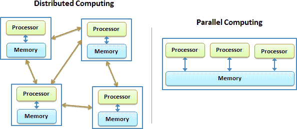
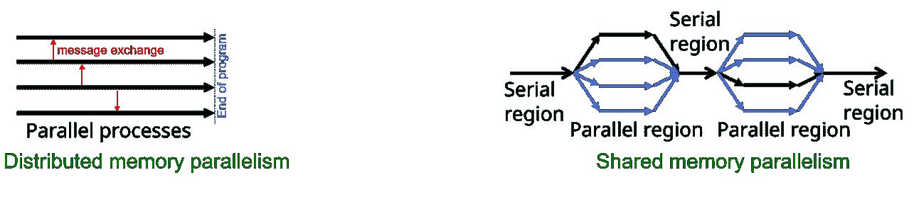
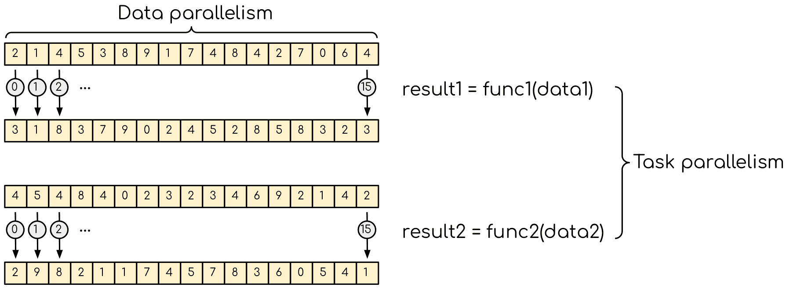
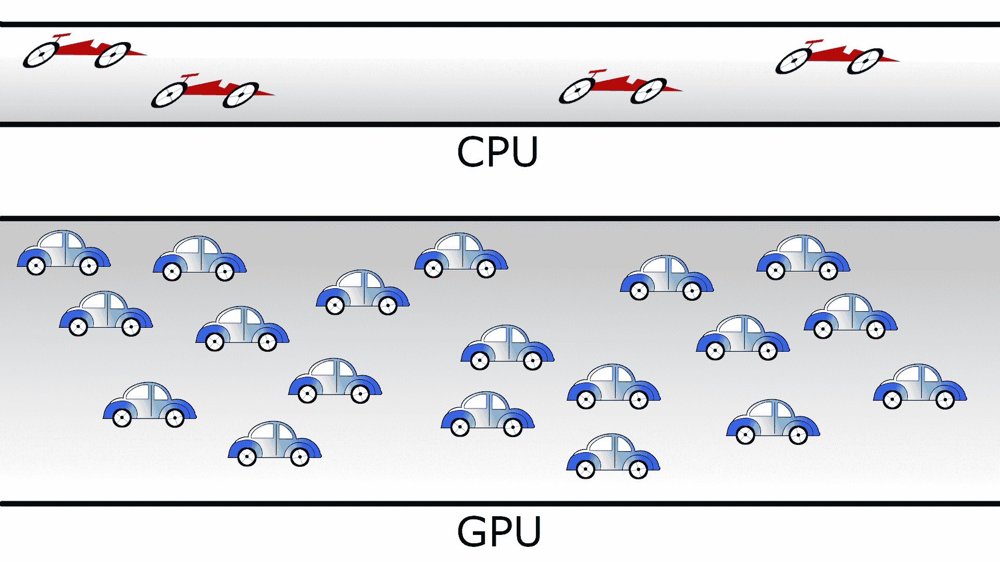
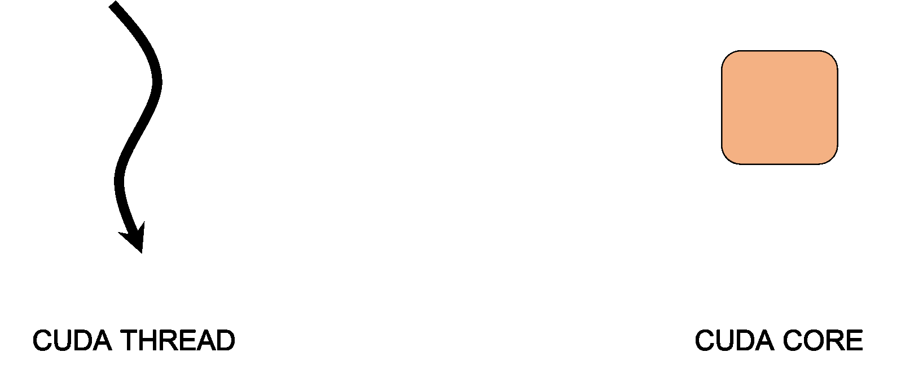
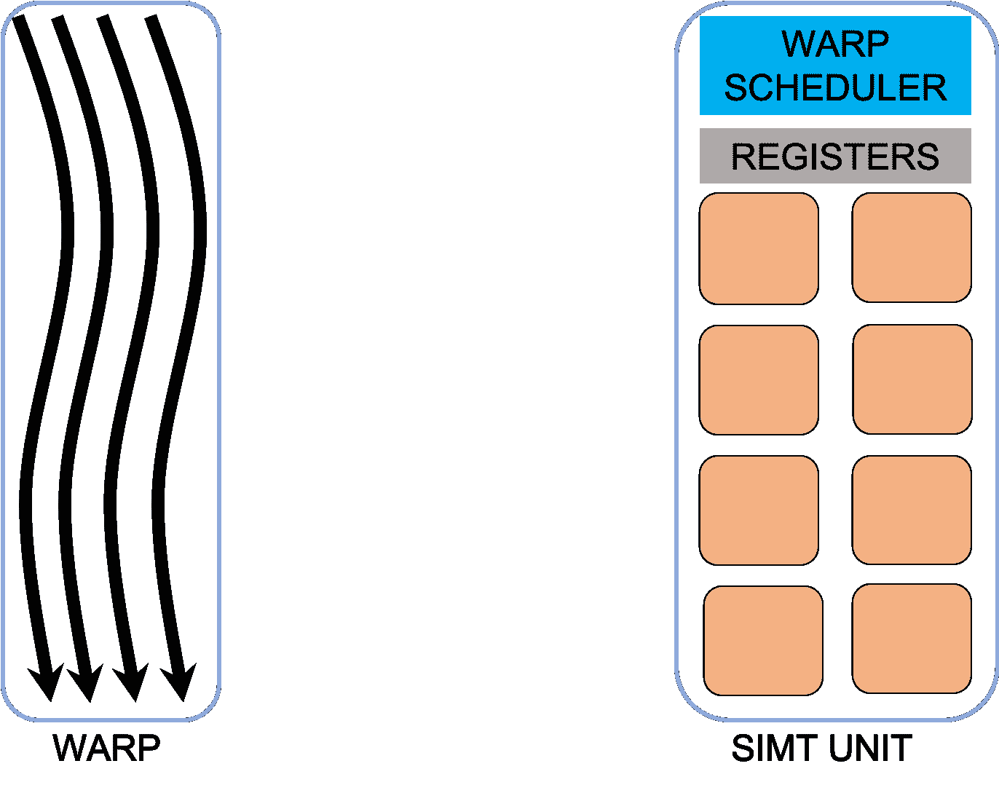
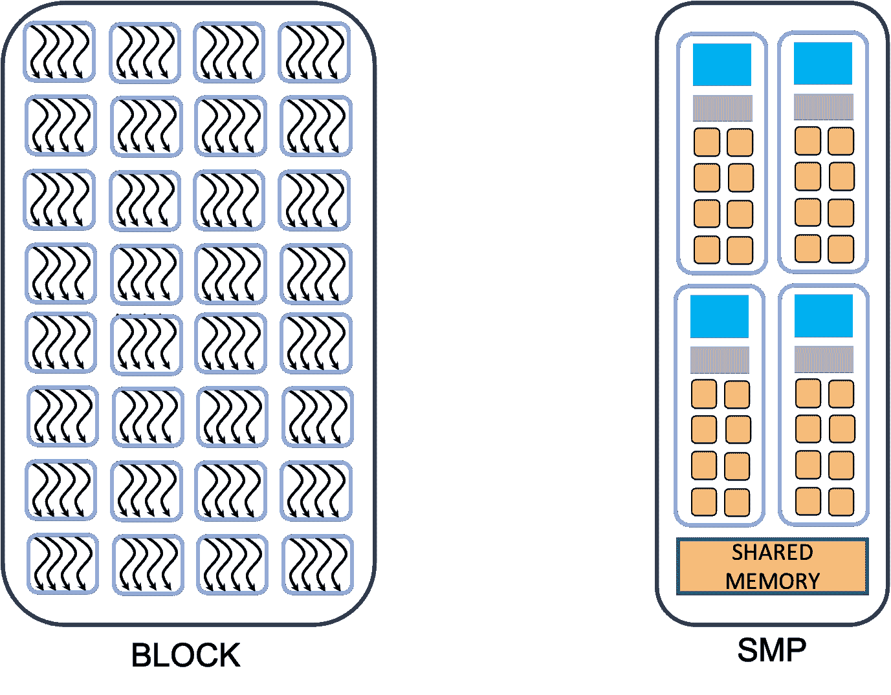

# GPU 编程概念

> 原文：[`enccs.github.io/gpu-programming/4-gpu-concepts/`](https://enccs.github.io/gpu-programming/4-gpu-concepts/)

*GPU 编程：为什么、何时以及如何？* **   GPU 编程概念

+   [在 GitHub 上编辑](https://github.com/ENCCS/gpu-programming/blob/main/content/4-gpu-concepts.rst)

* * *

问题

+   可能有哪些类型的并行计算？

+   数据并行性与任务并行性有何不同，它们在并行计算中是如何被利用的？

+   工作是如何在 GPU 上并行化和执行的？

+   在 GPU 上高效运行的代码有哪些一般性考虑？

目标

+   理解并行计算原理和架构。

+   区分数据并行性与任务并行性。

+   学习 GPU 执行模型。

+   在 GPU 上并行化和执行工作。

+   开发高效的 GPU 代码以实现高性能。

教师备注

+   25 分钟教学

+   0 分钟练习

## 不同的并行类型

### 分布式与共享内存架构

大多数计算问题都不是简单可并行的，这意味着子任务需要不时地访问其他子任务计算的一些结果。子任务交换所需信息的方式取决于可用的硬件。



分布式与共享内存并行计算。

在分布式内存环境中，每个处理单元独立于其他处理单元运行。它有自己的内存，并且**不能**访问其他节点的内存。通信通过网络进行，每个计算单元运行操作系统的单独副本。在共享内存机器中，所有处理单元都可以访问内存，并可以读取或修改变量。

### 进程和线程

环境类型（分布式或共享内存）决定了编程模型。可能的并行性有两种，基于进程的和基于线程的。



对于分布式内存机器，采用基于进程的并行编程模型。进程是独立的执行单元，它们有自己的内存地址空间。它们在并行程序启动时创建，并在结束时终止。它们之间的通信通过显式的消息传递（如 MPI）进行。

在共享内存架构上，可以使用基于线程的并行性。线程是轻量级的执行单元，可以以相对较小的成本创建和销毁。线程有自己的状态信息，但它们*共享*相同的内存地址空间。当需要时，通信通过共享内存进行。

这两种方法都有其优点和缺点。分布式机器相对便宜，并且具有“无限”的容量。原则上可以添加更多的计算单元。在实践中，使用的计算单元越多，通信就越耗时。共享内存系统可以实现良好的性能，编程模型相当简单。然而，它们受限于内存容量和访问速度。此外，在共享并行模型中，创建竞态条件要容易得多。

## 暴露并行性

可以探索两种类型的并行。数据并行是指数据可以分布在可以并行运行的计算单元上。单元通过将相同的或非常相似的操作应用于不同的数据元素来处理数据。一个常见的例子是对图像应用模糊滤镜——相同的函数应用于图像上的所有像素。这种并行对于 GPU 来说是自然的，因为在多个线程中执行相同的指令集。



数据并行和任务并行。数据并行是指相同的操作应用于多个数据（例如，数组的多个元素被转换）。任务并行意味着存在多个独立的任务，原则上可以并行执行。

数据并行通常可以通过 GPU 轻松探索。最基本的方法是找到一个覆盖许多数据元素的循环，并将其转换为 GPU 内核。如果数据集中的元素数量相当大（数十或数百万个元素），GPU 应该表现相当出色。尽管从这种天真方法中期望绝对最大性能可能有些奇怪，但它通常是采取的方法。从数据并行中获得绝对最大性能需要很好地理解 GPU 的工作原理。

另一种类型的并行是任务并行。这是指一个应用程序由多个任务组成，这些任务需要执行不同的操作（使用相同的或不同的数据）。任务并行的一个例子是烹饪：切菜和烤肉是非常不同的任务，可以同时进行。请注意，任务可以消耗完全不同的资源，这也可以被探索。

简而言之

+   计算问题可以在分布式内存或共享内存架构中并行化。

+   在分布式内存中，每个单元独立操作，节点之间没有直接的内存访问。

+   在共享内存中，单元可以访问相同的内存，并通过共享变量进行通信。

+   并行编程可以是基于进程的（分布式内存）或基于线程的（共享内存）。

+   基于进程的并行使用具有独立内存空间和显式消息传递的独立进程。

+   基于线程的并行使用共享相同内存空间的轻量级线程，并通过共享内存进行通信。

+   数据并行将数据分布到计算单元中，使用相同的或类似的操作进行处理。

+   任务并行涉及多个独立任务，这些任务在相同或不同的数据上执行不同的操作。

+   任务并行涉及并发执行不同的任务，利用不同的资源。

## GPU 执行模型

为了获得最佳性能，了解 GPU 如何执行程序非常重要。如前所述，CPU 是一种灵活的通用设备。它速度快，功能多样，旨在运行操作系统和多种非常不同的应用程序。它具有许多功能，如更好的控制逻辑、缓存和缓存一致性，这些功能与纯计算无关。CPU 通过大量缓存和分支预测来尝试降低延迟以优化执行。



用汽车和道路来类比 CPU 和 GPU 的行为。紧凑的道路相当于 CPU（低延迟，低吞吐量），而宽阔的道路相当于 GPU（高延迟，高吞吐量）。

相比之下，GPU 中有相对较少的晶体管用于控制和缓存，而有更大比例的晶体管用于数学运算。由于 GPU 内核的设计仅针对 3D 图形，因此它们可以设计得非常简单，并且可以有非常多的核心。当前的 GPU 包含数千个 CUDA 核心。GPU 的性能是通过非常高的并行度获得的。并行启动了大量的线程。为了获得良好的性能，至少应该比 CUDA 核心的数量多几倍。GPU 线程比常规 CPU 线程轻得多，并且它们在上下文切换上几乎没有惩罚。这样，当一些线程执行某些内存操作（读取或写入）时，其他线程执行指令。

## CUDA 线程、战群、块

为了理解 GPU 执行模型，让我们看看所谓的 axpy 操作。在单个 CPU 内核上，这个操作将以串行方式在一个 for/do 循环中执行，遍历数组中的每个元素 id，并计算 y[id]=y[id]+a*x[id]。

```
void  axpy_(int  n,  double  a,  double  *x,  double  *y)
{
  for(int  id=0;id<n;  id++)  {
  y[id]  +=  a  *  x[id];
  }
} 
```

为了在 GPU 上执行某些操作，程序会启动一个名为 *kernel* 的函数，该函数由成千上万的线程同时执行，这些线程可以并行地运行在 GPU 内核上。

```
GPU_K  void  ker_axpy_(int  n,  double  a,  double  *x,  double  *y,  int  id)
{
  y[id]  +=  a  *  x[id];  // id<n
} 
```

程序员控制 ker_axpy_ 实例的创建数量，并必须确保所有元素都得到处理，并且没有越界访问发生。

GPU 线程比常规 CPU 线程轻得多，它们在上下文切换方面几乎没有惩罚。通过“过度订阅”GPU，有一些线程正在执行一些内存操作（读取或写入），而其他线程则执行指令。



每个线程都与一个特定的内在索引相关联，可以用来计算和访问数组中的内存位置。每个线程都有自己的上下文和私有变量集。所有线程都可以访问全局 GPU 内存，但在执行内核时没有一般的方法来同步。如果一些线程需要从全局内存中获取其他线程修改过的数据，代码就必须分成几个内核，因为只有在内核完成时才能确保全局内存的写入已完成。

除了重量较轻之外，GPU 线程和 CPU 线程之间还有更多差异。GPU 线程被分组在一起，称为 warp。这是在硬件级别完成的。



所有对 GPU 内存的内存访问都是以特定大小的块（32B、64B、128B 等）为组进行的。为了获得良好的性能，同一 warp 中的 CUDA 线程需要访问内存中相邻的数据元素。这被称为*归约*内存访问。

在某些架构中，warp 中的所有成员必须执行相同的指令，这被称为“锁步”执行。这样做是为了实现更高的性能，但也有一些缺点。如果一个**if**语句在 warp 内部存在，会导致 warp 执行多次，每次分支执行一次。当单个 warp 内的不同线程根据条件语句（if）采取不同的执行路径时，两个分支会顺序执行，一些线程处于活动状态，而其他线程处于非活动状态。在无锁步执行架构上，例如 NVIDIA Volta / Turing（例如，GeForce 16xx 系列）或更新的版本，warp 发散的成本较低。

在 GPU 线程层次结构中还有另一个级别。线程被分组在一起，称为块。每个块被分配给一个流多处理器（SMP）单元。一个 SMP 包含一个或多个 SIMT（单指令多线程）单元、调度器和非常快速的片上内存。其中一些片上内存可以在程序中使用，这被称为共享内存。共享内存可以用来“缓存”多个线程使用的内存，从而避免从全局内存进行多次读取。它也可以用来避免低效的内存访问。例如，在矩阵转置操作中，我们每个元素有两个内存操作，并且只能合并。在第一步中，矩阵的块以合并的方式保存在共享内存中。在完成块的读取后，块可以局部转置（这非常快），然后以合并的方式写入目标矩阵。共享内存还可以用来执行块级别的归约和类似的集体操作。所有线程都可以在块级别进行同步。此外，当共享内存被写入以确保所有线程都完成了操作时，同步是强制性的，以确保程序的正确性。



最后，线程块不能在 SMP 之间分割。为了提高性能，块应该有多个 warp。在 SMP 上活跃的 warp 越多，与内存操作相关的延迟隐藏得越好。如果资源足够，由于快速的上下文切换，SMP 可以在同一时间激活多个块。然而，这些块不能通过片上内存相互共享数据。

总结本节内容。为了利用 GPU，算法必须允许将工作划分为许多小任务，这些任务可以同时执行。通过启动成千上万的线程，所有线程执行相同的函数，即内核，每个线程处理问题的不同部分，将计算卸载到 GPU 上。线程以称为块的形式执行，每个块被分配给一个 SMP。此外，块中的线程被分为*warps*，每个由 SIMT 单元执行。Warp 中的所有线程执行相同的指令，所有内存访问都是在 warp 级别集体进行的。线程只能在块级别同步和共享数据。根据架构，一些数据共享也可以在 warp 级别进行。

为了隐藏延迟，建议对 GPU 进行“过度订阅”。设备上应该有比现有的 SMPs 更多的块。此外，为了确保 CUDA 核心的良好占用率，给定 SMP 上应该有比 SIMT 单元更多的活动 warp。这样，当一些 warp 的线程空闲等待某些内存操作完成时，其他线程则使用 CUDA 核心，从而确保 GPU 的高占用率。

此外，还有一些架构特定的功能，开发者可以利用这些功能。Warp 级别的操作是 GPU 架构提供的原语，用于在 warp 内部实现高效的通信和同步。它们允许 warp 内的线程高效地交换数据，无需显式同步。这些 warp 级别的操作，结合线程组织成块和集群，使得在 GPU 上实现复杂算法和达到高性能成为可能。CUDA 最近版本中引入的协作组功能提供了对线程执行的更细粒度控制，通过赋予线程层次结构更多灵活性，从而实现更高效的处理。协作组允许块内的线程组织成更小的组，称为协作组，并在组内同步执行和共享数据。

下面是一个示例，说明网格中的线程如何与数组的特定元素关联。


被橙色标记的线程是大小为 4096 的线程网格的一部分。线程被分组成大小为 256 的块。该“橙色”线程在块 2 中的索引为 3，全局计算索引为 515。

对于向量加法示例，这将按照以下方式使用：`c[index]=a[index]+b[index]`。

简而言之

+   与 CPU 相比，GPU 具有不同的执行模型，侧重于并行性和数学运算。

+   GPU 由成千上万的轻量级线程组成，这些线程可以在 GPU 核心上同时执行。

+   线程被组织成 warp，warp 被分组成块，分配给流多处理器（SMPs）。

+   GPU 通过高程度的并行性和高效的内存访问来实现性能。

+   共享内存可以用来缓存数据并提高块内的内存访问效率。

+   同步和数据共享仅限于块级别，根据架构，在 warp 级别上可能有一些共享。

+   对 GPU 进行过度订阅和最大化 warp 和块占用率有助于隐藏延迟并提高性能。

+   Warp 级别的操作和协作组提供了在 warp 或块内部的高效通信和同步。

+   线程索引允许将线程与数组中的特定元素关联起来，以实现并行处理。

## 术语

目前有三个主要的 GPU 生产商：NVIDIA、Intel 和 AMD。虽然 GPU 背后的基本概念相当相似，但它们为不同的部分使用不同的名称。此外，还有用于 GPU 编程的软件环境，有些来自生产商，有些来自外部团体，所有这些都有不同的命名。以下是对不同平台和软件环境中使用的某些术语的简要汇编。

软件映射命名

| CUDA | HIP | OpenCL | SYCL |
| --- | --- | --- | --- |
| 线程网格 | NDRange |
| 块 | 工作组 |
| warp | 波前 | 子组 |
| 线程 | 工作项 |
| 寄存器 | 私有内存 |
| 共享内存 | 本地数据共享 | 本地内存 |
| 线程索引.{x,y,z} | 获取本地 ID({0,1,2}) | nd_item::get_local({2,1,0}) [[1]](#syclindex) |
| 块索引.{x,y,z} | 获取组 ID({0,1,2}) | nd_item::get_group({2,1,0}) [[1]](#syclindex) |
| blockDim.{x,y,z} | 获取本地大小({0,1,2}) | nd_item::get_local_range({2,1,0}) [[1]](#syclindex) |

## 练习

在共享内存架构的上下文中，什么是线程？

1.  拥有自己内存地址空间的独立执行单元

1.  拥有共享内存地址空间的轻量级执行单元

1.  介于不同内存单元之间的通信设备

1.  分布式内存机器的编程模型

解决方案

正确答案：*b) 拥有共享内存地址空间的轻量级执行单元*

什么是数据并行？

1.  在并行运行的计算单元之间分配数据，对不同的数据元素应用相同或类似的操作。

1.  在并行运行的计算单元之间分配任务，对相同的数据元素应用不同的操作。

1.  在按顺序运行的计算单元之间分配数据，对所有数据元素应用相同的操作。

1.  在按顺序运行的计算单元之间分配任务，对不同的数据元素应用不同的操作。

解决方案

正确答案：*a) 在并行运行的计算单元之间分配数据，对不同的数据元素应用相同或类似的操作。*

GPU 上自然适合哪种类型的并行？

1.  任务并行

1.  数据并行

1.  数据和任务并行

1.  既不是数据并行也不是任务并行

解决方案

正确答案：*b) 数据并行*

在 GPU 执行上下文中，什么是内核？

1.  CPU 上用于内存操作的具体部分。

1.  GPU 上用于内存操作的具体部分。

1.  一种在 GPU 上操作的类型。

1.  一个在 GPU 核心上由成千上万的线程同时执行的功能。

解决方案

正确答案：*d) 在 GPU 核心上由成千上万的线程同时执行的功能。*

什么是归一化内存访问？

1.  这是指 CUDA 线程在同一个 warp 中访问内存中相邻的数据元素。

1.  这是指不同 warp 中的 CUDA 线程访问内存中相距很远的数据元素。

1.  这是指所有线程都可以访问全局 GPU 内存。

1.  当 warp 中的线程执行不同的操作时。

解决方案

正确答案：*a) 当 CUDA 线程在同一 warp 中访问内存中相邻的数据元素时。*

在 GPU 执行上下文中，共享内存的功能是什么？

1.  它用于存储全局内存。

1.  它用于存储块中的所有线程。

1.  它可以用来“缓存”多个线程使用的由数据，避免从全局内存中进行多次读取。

1.  它用于存储所有的 CUDA 核心。

解决方案

正确答案：*c) 它可以用来“缓存”多个线程使用的数据，避免从全局内存中进行多次读取。*

过度订阅 GPU 的意义是什么？

1.  它降低了 GPU 的整体性能。

1.  它确保设备上存在的块数量多于 SMP，有助于隐藏延迟并确保 GPU 的高占用率。

1.  这会导致 GPU 中的内存溢出。

1.  它确保设备上存在的 SMP（对称多处理）数量多于块的数量。

解决方案

正确答案：*b) 它确保设备上存在的块数量多于 SMP，有助于隐藏延迟并确保 GPU 的高占用率。*

重点

+   并行计算可以分为分布式内存架构和共享内存架构

+   可以探索的两种并行性类型是数据并行性和任务并行性。

+   GPU 是一种适合数据并行的共享内存架构。

+   GPU 具有高并行性，线程组织成 warp 和块。

+   GPU 优化涉及归约内存访问、共享内存使用、高线程和 warp 占用率。此外，可以利用特定于架构的特性，如 warp 级操作和协作组，以实现更有效的处理。上一节 下一节

* * *

©版权所有 2023-2024，贡献者。

使用[Read the Docs](https://readthedocs.org)提供的[主题](https://github.com/readthedocs/sphinx_rtd_theme)和[Sphinx](https://www.sphinx-doc.org/)构建。问题

+   可能存在哪些类型的并行计算？

+   数据并行性与任务并行性有何不同，它们在并行计算中是如何被利用的？

+   工作是如何在 GPU 上并行化和执行的？

+   对于在 GPU 上运行的效率代码，有哪些一般性考虑？

目标

+   理解并行计算原理和架构。

+   区分数据并行性与任务并行性。

+   学习 GPU 执行模型。

+   在 GPU 上并行化和执行工作。

+   开发高效的 GPU 代码以实现高性能。

教师备注

+   25 分钟教学

+   0 分钟练习

## 不同类型的并行性

### 分布式内存架构与共享内存架构

大多数计算问题都不是简单可并行的，这意味着子任务需要不时地访问其他子任务计算的一些结果。子任务交换所需信息的方式取决于可用的硬件。


分布式内存与共享内存并行计算。

在分布式内存环境中，每个处理单元独立于其他处理单元运行。它有自己的内存，**不能**访问其他节点的内存。通信通过网络进行，每个计算单元运行操作系统的单独副本。在共享内存机器中，所有处理单元都可以访问内存，并可以读取或修改变量。

### 进程和线程

环境类型（分布式或共享内存）决定了编程模型。可能的并行性有两种，基于进程和基于线程。


对于分布式内存机器，采用基于进程的并行编程模型。进程是独立的执行单元，它们有自己的内存地址空间。它们在并行程序启动时创建，并且在结束时才终止。它们之间的通信通过显式的消息传递（如 MPI）进行。

在共享内存架构上，可以使用基于线程的并行性。线程是轻量级的执行单元，可以以相对较小的成本创建和销毁。线程有自己的状态信息，但它们**共享**相同的内存地址空间。需要时，通过共享内存进行通信。

这两种方法都有其优缺点。分布式机器相对便宜，并且具有“无限”的容量。原则上可以添加越来越多的计算单元。实际上，使用的计算单元越多，通信就越耗时。共享内存系统可以实现良好的性能，编程模型相当简单。然而，它们受限于内存容量和访问速度。此外，在共享并行模型中，创建竞态条件更容易。

## 揭示并行性

可以探索两种并行性。数据并行性是指数据可以分布在可以并行运行的计算单元上。这些单元通过将相同的或非常相似的操作应用于不同的数据元素来处理数据。一个常见的例子是对图像应用模糊滤镜——相同的函数应用于图像上的所有像素。这种并行性对于 GPU 来说很自然，因为在多个线程中执行相同的指令集。


数据并行和任务并行。数据并行是指相同的操作应用于多个数据（例如，数组的多个元素被转换）。任务并行意味着存在多个独立的任务，原则上可以并行执行。

数据并行通常可以很容易地由 GPU 探索。最基本的方法是找到一个覆盖许多数据元素的循环，并将其转换为 GPU 内核。如果数据集中的元素数量相当大（数万或数十万个元素），GPU 应该表现相当出色。尽管从这种天真方法中期望绝对最大性能可能有些奇怪，但它通常是首选的方法。从数据并行中获得绝对最大性能需要很好地理解 GPU 的工作原理。

另一种并行类型是任务并行。这指的是一个应用程序由多个任务组成，这些任务需要执行不同的操作，并且可能使用（相同或）不同的数据。任务并行的例子是烹饪：切菜和烤肉是非常不同的任务，可以同时进行。请注意，任务可以消耗完全不同的资源，这也值得探索。

简而言之

+   计算问题可以在分布式内存或共享内存架构中并行化。

+   在分布式内存中，每个单元独立操作，节点之间没有直接的内存访问。

+   在共享内存中，单元可以访问相同的内存，并通过共享变量进行通信。

+   并行编程可以是基于进程的（分布式内存）或基于线程的（共享内存）。

+   基于进程的并行使用具有独立内存空间和显式消息传递的独立进程。

+   基于线程的并行使用共享相同内存空间并通过共享内存进行通信的轻量级线程。

+   数据并行将数据分布到计算单元，使用相同或类似的操作进行处理。

+   任务并行涉及多个独立任务，这些任务在相同或不同的数据上执行不同的操作。

+   任务并行涉及并发执行不同的任务，利用不同的资源。

## GPU 执行模型

为了获得最大性能，了解 GPU 如何执行程序非常重要。如前所述，CPU 是一种灵活的通用设备，面向通用用途。它速度快，功能多样，旨在运行操作系统和多种非常不同的应用程序。它具有许多功能，例如更好的控制逻辑、缓存和缓存一致性，这些功能与纯计算无关。CPU 通过大量缓存和分支预测来尝试降低延迟，从而优化执行。


CPU 和 GPU 行为的汽车和道路类比。紧凑的道路类似于 CPU（低延迟，低吞吐量），而宽阔的道路类似于 GPU（高延迟，高吞吐量）。

相比之下，GPU 包含相对较少的晶体管用于控制和缓存，以及大量晶体管用于数学运算。由于 GPU 的核心仅设计用于 3D 图形，它们可以设计得非常简单，并且可以有非常多的核心。当前的 GPU 包含数千个 CUDA 核心。GPU 的性能是通过非常高的并行度获得的。并行启动了大量的线程。为了获得良好的性能，至少应该是 CUDA 核心数量的几倍。GPU 线程比常规 CPU 线程轻得多，它们在上下文切换上几乎没有惩罚。这样，当一些线程执行一些内存操作（读取或写入）时，其他线程则执行指令。

## CUDA 线程、Warp、Block

为了理解 GPU 执行模型，让我们看看所谓的 axpy 操作。在单个 CPU 核心上，这个操作将以串行方式在一个 for/do 循环中执行，遍历数组中的每个元素 id，并计算 y[id]=y[id]+a*x[id]。

```
void  axpy_(int  n,  double  a,  double  *x,  double  *y)
{
  for(int  id=0;id<n;  id++)  {
  y[id]  +=  a  *  x[id];
  }
} 
```

为了在 GPU 上执行某些操作，程序会启动一个名为*kern*的函数，这个函数由成千上万的线程同时执行，这些线程可以并行地运行在 GPU 核心上。

```
GPU_K  void  ker_axpy_(int  n,  double  a,  double  *x,  double  *y,  int  id)
{
  y[id]  +=  a  *  x[id];  // id<n
} 
```

程序员控制 ker_axpy_ 实例的创建数量，并必须确保所有元素都被处理，并且没有越界访问发生。

GPU 线程比常规 CPU 线程轻得多，它们在上下文切换上几乎没有惩罚。通过“过度订阅”GPU，有一些线程正在执行一些内存操作（读取或写入），而其他线程则执行指令。


每个线程都与一个特定的内在索引相关联，可以用来计算和访问数组中的内存位置。每个线程都有自己的上下文和私有变量集。所有线程都可以访问全局 GPU 内存，但在执行内核时没有一般的方法来同步。如果某些线程需要从全局内存中获取其他线程修改过的数据，代码就必须分成几个内核，因为只有在内核完成时才能确保全局内存的写入已完成。

除了重量轻之外，GPU 线程和 CPU 线程之间还有更多差异。GPU 线程被分组在一起，称为 warp。这是在硬件级别完成的。


所有对 GPU 内存的内存访问都是以特定大小的块（32B、64B、128B 等）为组进行的。为了获得良好的性能，同一 warp 中的 CUDA 线程需要访问内存中相邻的数据元素。这被称为*合并*内存访问。

在某些架构中，warp 中的所有成员必须执行相同的指令，即所谓的“锁步”执行。这是为了实现更高的性能，但也有一些缺点。如果一个**if**语句在 warp 内部，会导致 warp 被执行多次，每次分支执行一次。当单个 warp 内的不同线程根据条件语句（if）采取不同的执行路径时，两个分支会顺序执行，一些线程处于活动状态，而其他线程处于非活动状态。在无锁步执行架构中，如 NVIDIA Volta / Turing（例如，GeForce 16xx 系列）或更新的架构中，warp 发散的成本较低。

在 GPU 线程层次结构中还有另一个级别。线程被分组在一起，称为块。每个块被分配给一个流式多处理器（SMP）单元。一个 SMP 包含一个或多个 SIMT（单指令多线程）单元、调度器和非常快速的片上内存。其中一些片上内存可以在程序中使用，这被称为共享内存。共享内存可以用来“缓存”多个线程使用的内存，从而避免从全局内存进行多次读取。它也可以用来避免低效的内存访问。例如，在矩阵转置操作中，每个元素有两个内存操作，并且只能合并。在第一步中，矩阵的块以合并的方式保存在共享内存中。在完成块的读取后，块可以局部转置（这非常快），然后以合并的方式写入目标矩阵。共享内存还可以用来执行块级别的归约和类似的集体操作。所有线程都可以在块级别进行同步。此外，当共享内存被写入以确保所有线程都完成了操作时，同步是强制性的，以确保程序的正确性。


最后，线程块不能在 SMP 之间分割。为了提高性能，块应该包含多个 warp。在 SMP 上活跃的 warp 越多，与内存操作相关的延迟隐藏得越好。如果资源足够，由于快速的上下文切换，一个 SMP 可以在同一时间激活多个块。然而，这些块不能通过片上内存相互共享数据。

总结本节内容。为了利用 GPU，算法必须允许将工作划分为许多小的子任务，这些子任务可以同时执行。通过启动成千上万的线程，所有线程执行相同的函数，即内核，每个线程处理问题的不同部分，将计算卸载到 GPU 上。线程以称为块的形式执行，每个块被分配给一个 SMP。此外，块中的线程被分为*warps*，每个由 SIMT 单元执行。所有 warp 中的线程执行相同的指令，所有内存访问都是在 warp 级别集体完成的。线程只能在块级别同步和共享数据。根据架构，一些数据共享也可以在 warp 级别进行。

为了隐藏延迟，建议“过度订阅”GPU。设备上应该有比 SMP 更多的块。此外，为了确保 CUDA 核心的良好利用率，给定 SMP 上应该有比 SIMT 单元更多的活动 warp。这样，当一些线程 warp 空闲等待某些内存操作完成时，其他 warp 可以使用 CUDA 核心，从而确保 GPU 的高利用率。

此外，还有一些特定于架构的功能，开发者可以利用。Warp 级别的操作是 GPU 架构提供的原语，允许在 warp 内部进行高效的通信和同步。它们允许 warp 内的线程高效地交换数据，无需显式同步。这些 warp 级别的操作，结合线程的块和集群组织，使得在 GPU 上实现复杂算法并达到高性能成为可能。CUDA 最近版本中引入的协作组功能提供了对线程执行的更细粒度控制，通过赋予线程层次结构更多灵活性，从而实现更高效的处理。协作组允许块内的线程组织成更小的组，称为协作组，并在组内同步执行和共享数据。

下面是一个示例，说明网格中的线程如何与数组的特定元素相关联


被橙色标记的线程是大小为 4096 的线程网格的一部分。线程被分为大小为 256 的块。橙色线程在块 2 中的索引为 3，全局计算索引为 515。

对于向量加法示例，可以使用以下方式`c[index]=a[index]+b[index]`。

简而言之

+   与 CPU 相比，GPU 具有不同的执行模型，侧重于并行性和数学运算。

+   GPU 由成千上万的轻量级线程组成，这些线程可以在 GPU 核心上同时执行。

+   线程被组织成 warp，warp 被分组成块，分配给流多处理器（SMP）。

+   GPU 通过高程度的并行性和高效的内存访问来实现性能。

+   共享内存可以用来缓存数据并提高块内的内存访问效率。

+   同步和数据共享仅限于块级别，根据架构，在某些情况下可能在 warp 级别进行共享。

+   过度订阅 GPU 并最大化 warp 和块占用率有助于隐藏延迟并提高性能。

+   warp 级别的操作和协作组提供了在 warp 或块内部的高效通信和同步。

+   线程索引允许将线程与数组中的特定元素关联起来，以实现并行处理。

## 术语

目前有三个主要的 GPU 生产商：NVIDIA、Intel 和 AMD。虽然 GPU 背后的基本概念相当相似，但它们为各个部分使用不同的名称。此外，还有用于 GPU 编程的软件环境，有些来自生产商，有些来自外部团体，所有这些都有不同的命名。以下是对不同平台和软件环境中使用的某些术语的简要汇编。

软件映射命名

| CUDA | HIP | OpenCL | SYCL |
| --- | --- | --- | --- |
| 线程网格 | NDRange |
| 块 | 工作组 |
| warp | 波前 | 子组 |
| 线程 | 工作项 |
| 寄存器 | 私有内存 |
| 共享内存 | 本地数据共享 | 本地内存 |
| threadIdx.{x,y,z} | get_local_id({0,1,2}) | nd_item::get_local({2,1,0}) [[1]](#syclindex) |
| blockIdx.{x,y,z} | get_group_id({0,1,2}) | nd_item::get_group({2,1,0}) [[1]](#syclindex) |
| blockDim.{x,y,z} | get_local_size({0,1,2}) | nd_item::get_local_range({2,1,0}) [[1]](#syclindex) |

## 练习

在共享内存架构的上下文中，线程是什么？

1.  拥有自己内存地址空间的独立执行单元

1.  轻量级执行单元带有共享内存地址空间

1.  分离内存单元之间的通信设备

1.  分布式内存机器的编程模型

解决方案

正确答案：*b) 带有共享内存地址空间的轻量级执行单元*

什么是数据并行？

1.  在并行运行的计算单元之间分配数据，对不同的数据元素应用相同的或类似的操作。

1.  在并行运行的计算单元之间分配任务，对相同的数据元素应用不同的操作。

1.  在按顺序运行的计算单元之间分配数据，对所有数据元素应用相同的操作。

1.  在按顺序运行的计算单元之间分配任务，对不同的数据元素应用不同的操作。

解决方案

正确答案：*a) 在并行运行的计算单元之间分配数据，对不同的数据元素应用相同的或类似的操作。*

对于 GPU 来说，哪种类型的并行性是自然的？

1.  任务并行

1.  数据并行

1.  数据并行和任务并行

1.  既不是数据并行也不是任务并行

解决方案

正确答案：*b) 数据并行*

在 GPU 执行上下文中，内核是什么？

1.  用于内存操作的具体 CPU 部分。

1.  用于内存操作的具体 GPU 部分。

1.  在 GPU 上操作的一种线程类型。

1.  在 GPU 核心上由成千上万的线程同时执行的功能。

解决方案

正确答案：*d) 在 GPU 核心上由成千上万的线程同时执行的功能。*

什么是归一化内存访问？

1.  当 CUDA 线程在同一个 warp 中访问内存中相邻的数据元素时。

1.  当 CUDA 线程在不同 warp 中访问内存中相距较远的数据元素时。

1.  当所有线程都能访问全局 GPU 内存时。

1.  当 warp 中的线程执行不同的操作时。

解决方案

正确答案：*a) 当 CUDA 线程在同一个 warp 中访问内存中相邻的数据元素时。*

在 GPU 执行上下文中，共享内存的功能是什么？

1.  它用于存储全局内存。

1.  它用于存储块中的所有线程。

1.  它可以用来“缓存”多个线程使用的内存数据，避免从全局内存中进行多次读取。

1.  它用于存储所有 CUDA 核心。

解决方案

正确答案：*c) 它可以用来“缓存”多个线程使用的内存数据，避免从全局内存中进行多次读取。*

过度订阅 GPU 的意义是什么？

1.  它降低了 GPU 的整体性能。

1.  它确保设备上存在比 SMPs 更多的块，有助于隐藏延迟并确保 GPU 的高占用率。

1.  它会导致 GPU 内存溢出。

1.  它确保设备上存在比块更多的 SMPs。

解决方案

正确答案：*b) 它确保设备上存在比 SMPs 更多的块，有助于隐藏延迟并确保 GPU 的高占用率。*

重点

+   并行计算可以分为分布式内存架构和共享内存架构

+   可以探索的两种并行类型是数据并行和任务并行。

+   GPU 是一种适合数据并行的共享内存架构。

+   GPU 具有高并行性，线程被组织成 warp 和 block。

+   GPU 优化涉及归一化内存访问、共享内存使用、高线程和 warp 占用率。此外，可以利用特定于架构的特性，如 warp 级操作和协作组，以实现更有效的处理。

## 不同的并行类型

### 分布式内存架构与共享内存架构

大多数计算问题都不是简单可并行的，这意味着子任务需要不时访问其他子任务计算的一些结果。子任务交换所需信息的方式取决于可用的硬件。


分布式内存与共享内存并行计算。

在分布式内存环境中，每个处理单元独立于其他单元运行。它拥有自己的内存，并且**不能**访问其他节点的内存。通信通过网络进行，每个计算单元运行操作系统的独立副本。在共享内存机器中，所有处理单元都可以访问内存，并可以读取或修改其中的变量。

### 进程与线程

环境类型（分布式或共享内存）决定了编程模型。可能的并行性有两种，基于进程的和基于线程的。


对于分布式内存机器，采用基于进程的并行编程模型。进程是独立的执行单元，它们有自己的内存地址空间。它们在并行程序启动时创建，并在结束时终止。它们之间的通信通过显式的消息传递（如 MPI）进行。

在共享内存架构上，可以使用基于线程的并行性。线程是轻量级的执行单元，可以以相对较小的成本创建和销毁。线程有自己的状态信息，但它们**共享**相同的内存地址空间。当需要时，通过共享内存进行通信。

这两种方法都有其优缺点。分布式机器相对便宜，并且具有“无限”的容量。原则上可以添加更多的计算单元。实际上，使用的计算单元越多，通信就越耗时。共享内存系统可以实现良好的性能，编程模型相当简单。然而，它们受限于内存容量和访问速度。此外，在共享并行模型中，创建竞态条件要容易得多。

### 分布式内存与共享内存架构

大多数计算问题都不是简单可并行的，这意味着子任务需要不时地访问其他子任务计算的一些结果。子任务交换所需信息的方式取决于可用的硬件。


分布式内存与共享内存并行计算。

在分布式内存环境中，每个处理单元独立于其他单元运行。它拥有自己的内存，并且**不能**访问其他节点的内存。通信通过网络进行，每个计算单元运行操作系统的独立副本。在共享内存机器中，所有处理单元都可以访问内存，并可以读取或修改其中的变量。

### 进程与线程

环境类型（分布式或共享内存）决定了编程模型。可能的并行性类型有两种，基于进程的和基于线程的。


对于分布式内存机器，采用基于进程的并行编程模型。进程是独立的执行单元，它们有自己的内存地址空间。它们在并行程序启动时创建，并在结束时终止。它们之间的通信通过消息传递（如 MPI）显式完成。

在共享内存架构上，可以使用基于线程的并行性。线程是轻量级的执行单元，可以以相对较小的成本创建和销毁。线程有自己的状态信息，但它们*共享*相同的内存地址空间。需要时，通过共享内存进行通信。

这两种方法都有其优缺点。分布式机器相对便宜，并且具有“无限”的容量。原则上可以添加更多和更多的计算单元。在实践中，使用的计算单元越多，通信就越耗时。共享内存系统可以实现良好的性能，编程模型相当简单。然而，它们受限于内存容量和访问速度。此外，在共享并行模型中，创建竞态条件要容易得多。

## 暴露并行性

可以探索两种并行性类型。数据并行性是指数据可以分布在可以并行运行的计算单元上。这些单元通过将相同的或非常相似的操作应用于不同的数据元素来处理数据。一个常见的例子是将模糊滤镜应用于图像——相同的函数应用于图像上的所有像素。这种并行性对于 GPU 来说是自然的，因为在多个线程中执行相同的指令集。


数据并行性和任务并行性。数据并行性是指相同的操作应用于多个数据（例如，数组的多个元素被转换）。任务并行性意味着存在多个独立的任务，原则上可以并行执行。

数据并行通常可以很容易地由 GPU 探索。最基本的方法是找到一个覆盖许多数据元素的循环，并将其转换为 GPU 内核。如果数据集中的元素数量相当大（数十或数百万个元素），GPU 应该表现相当好。尽管从这种天真方法中期望绝对最大性能可能有些奇怪，但这通常是采取的方法。从数据并行中获得绝对最大性能需要很好地理解 GPU 的工作原理。

另一种类型的并行是任务并行。这是指一个应用程序由多个任务组成，这些任务需要执行不同的操作（使用相同的或不同的数据）。任务并行的例子是烹饪：切菜和烤肉是非常不同的任务，可以同时进行。请注意，任务可以消耗完全不同的资源，这也值得探索。

简而言之

+   计算问题可以在分布式内存或共享内存架构中并行化。

+   在分布式内存中，每个单元独立操作，节点之间没有直接的内存访问。

+   在共享内存中，单元可以访问相同的内存，并通过共享变量进行通信。

+   并行编程可以是基于进程的（分布式内存）或基于线程的（共享内存）。

+   基于进程的并行使用具有独立内存空间和显式消息传递的独立进程。

+   基于线程的并行使用共享相同内存空间的轻量级线程，并通过共享内存进行通信。

+   数据并行将数据分布在计算单元之间，使用相同的或类似的操作进行处理。

+   任务并行涉及多个独立任务，这些任务在相同或不同的数据上执行不同的操作。

+   任务并行涉及同时执行不同的任务，利用不同的资源。

## GPU 执行模型

为了获得最佳性能，了解 GPU 如何执行程序非常重要。如前所述，CPU 是一种灵活的通用设备。它速度快，功能多样，旨在运行操作系统和多种非常不同的应用程序。它具有许多功能，如更好的控制逻辑、缓存和缓存一致性，这些功能与纯计算无关。CPU 通过尝试通过大量缓存和分支预测来实现低延迟来优化执行。


CPU 和 GPU 行为的汽车和道路类比。紧凑的道路类似于 CPU（低延迟，低吞吐量），而宽阔的道路类似于 GPU（高延迟，高吞吐量）。

与之相反，GPU 中包含的用于控制和缓存的晶体管相对较少，而用于数学运算的晶体管比例则大得多。由于 GPU 的核心仅设计用于 3D 图形，因此它们可以设计得更加简单，并且可以拥有大量的核心。当前的 GPU 包含数千个 CUDA 核心。GPU 的性能是通过实现非常高的并行度来获得的。并行启动了大量的线程。为了获得良好的性能，线程的数量至少应该是 CUDA 核心数量的几倍。GPU 线程比常规 CPU 线程轻得多，并且它们在上下文切换方面几乎没有惩罚。这样，当一些线程执行一些内存操作（读取或写入）时，其他线程则执行指令。

## CUDA 线程、Warps、Blocks

为了理解 GPU 执行模型，让我们看看所谓的 axpy 操作。在单个 CPU 核心上，这个操作将以串行方式在一个 for/do 循环中执行，遍历数组中的每个元素 id，并计算 y[id]=y[id]+a*x[id]。

```
void  axpy_(int  n,  double  a,  double  *x,  double  *y)
{
  for(int  id=0;id<n;  id++)  {
  y[id]  +=  a  *  x[id];
  }
} 
```

为了在 GPU 上执行某些操作，程序会启动一个名为*内核*的函数，该函数由成千上万的线程同时执行，这些线程可以并行地运行在 GPU 核心上。

```
GPU_K  void  ker_axpy_(int  n,  double  a,  double  *x,  double  *y,  int  id)
{
  y[id]  +=  a  *  x[id];  // id<n
} 
```

程序员控制 ker_axpy_ 实例的创建数量，并必须确保所有元素都得到处理，并且没有越界访问发生。

GPU 线程比常规 CPU 线程轻得多，并且它们在上下文切换方面几乎没有惩罚。通过“过度订阅”GPU，有一些线程正在执行一些内存操作（读取或写入），而其他线程则执行指令。


每个线程都与一个特定的内在索引相关联，该索引可用于计算和访问数组中的内存位置。每个线程都有自己的上下文和私有变量集。所有线程都可以访问全局 GPU 内存，但在执行内核时没有一般的方法来同步。如果某些线程需要从其他线程修改的全局内存中获取数据，则代码必须分成几个内核，因为只有在内核完成时才能确保全局内存的写入已完成。

除了轻量级之外，GPU 线程和 CPU 线程之间还有更多差异。GPU 线程被分组在一起，称为 warps。这是在硬件级别完成的。


所有对 GPU 内存的内存访问都是以特定大小的块（32B、64B、128B 等）为组进行的。为了获得良好的性能，同一 warp 中的 CUDA 线程需要访问内存中相邻的数据元素。这被称为*归一化*内存访问。

在某些架构中，warp 中的所有成员必须执行相同的指令，即所谓的“锁步”执行。这是为了实现更高的性能，但也有一些缺点。如果 warp 内部存在一个**if**语句，会导致 warp 执行多次，每次分支执行一次。当单个 warp 内的不同线程根据条件语句（if）采取不同的执行路径时，两个分支会顺序执行，一些线程处于活动状态，而其他线程处于非活动状态。在没有锁步执行的架构中，例如 NVIDIA Volta / Turing（例如，GeForce 16xx 系列）或更新的架构，warp 发散的成本较低。

在 GPU 线程层次结构中还有另一个级别。线程被分组在一起，称为块。每个块都分配给一个流式多处理器（SMP）单元。一个 SMP 包含一个或多个 SIMT（单指令多线程）单元、调度器和非常快速的片上内存。部分片上内存可以在程序中使用，这被称为共享内存。共享内存可以用来“缓存”多个线程使用的内存，从而避免从全局内存进行多次读取。它也可以用来避免低效的内存访问。例如，在矩阵转置操作中，每个元素有两个内存操作，并且只能合并。在第一步中，矩阵的块以合并的方式保存到共享内存中。当块的读取全部完成后，块可以局部转置（这非常快），然后以合并的方式写入目标矩阵。共享内存还可以用来执行块级别的归约和类似的集体操作。所有线程都可以在块级别进行同步。此外，当共享内存写入时，为了确保所有线程都完成了操作，同步是强制性的，以确保程序的正确性。


最后，一个线程块不能在多个对称多处理器（SMPs）之间分割。为了提高性能，线程块应该包含多个 warp。在 SMP 上活跃的 warp 越多，与内存操作相关的延迟就越不明显。如果资源充足，由于快速的上下文切换，一个 SMP 可以在同一时间激活多个块。然而，这些块不能通过片上内存相互共享数据。

总结本节内容。为了利用 GPU，算法必须允许将工作划分为许多小任务，这些任务可以同时执行。通过启动成千上万的线程，所有线程执行相同的函数，即“内核”，每个线程处理问题的不同部分，将计算卸载到 GPU 上。线程以称为“块”的组执行。此外，块内的线程被划分为“warp”，每个 warp 由 SIMT 单元执行。所有 warp 中的线程执行相同的指令，所有内存访问都在 warp 级别集体完成。线程只能在块级别同步和共享数据。根据架构，某些数据共享也可以在 warp 级别进行。

为了隐藏延迟，建议对 GPU 进行“过度订阅”。设备上应该有比现有的 SMPs 更多的块。此外，为了确保 CUDA 核心的良好占用率，给定 SMP 上应该有比 SIMT 单元更多的活动 warp。这样，当一些 warp 的线程空闲等待某些内存操作完成时，其他线程可以使用 CUDA 核心，从而确保 GPU 的高占用率。

此外，还有一些特定于架构的特性，开发者可以利用这些特性。Warp 级操作是 GPU 架构提供的原语，允许在 warp 内部进行高效的通信和同步。它们允许 warp 内的线程高效地交换数据，无需显式同步。这些 warp 级操作，结合线程组织成块和集群，使得在 GPU 上实现复杂算法并达到高性能成为可能。CUDA 最近版本中引入的协作组功能提供了对线程执行的更细粒度控制，通过赋予线程层次结构更多灵活性，从而实现更高效的处理。协作组允许块内的线程组织成更小的组，称为协作组，并在组内同步执行和共享数据。

下面是一个示例，说明如何将网格中的线程与数组的特定元素相关联


用橙色标记的线程是大小为 4096 的线程网格的一部分。线程被分组为大小为 256 的块。该“橙色”线程在块 2 中的索引为 3，全局计算索引为 515。

对于向量加法示例，可以使用以下方式 `c[index]=a[index]+b[index]`。

简而言之

+   与 CPU 相比，GPU 具有不同的执行模型，侧重于并行性和数学运算。

+   GPU 由成千上万的轻量级线程组成，这些线程可以在 GPU 核心上同时执行。

+   线程被组织成 warp，warp 被分组到分配给流式多处理器（SMPs）的块中。

+   GPU 通过高程度的并行性和高效的内存访问来实现性能。

+   共享内存可以用来缓存数据并提高块内内存访问效率。

+   同步和数据共享限于块级别，根据架构，warp 级别可能有某些共享。

+   过度订阅 GPU 并最大化 warp 和块占用率有助于隐藏延迟并提高性能。

+   warp 级操作和协作组提供了在 warp 或块内部的高效通信和同步。

+   线程索引允许将线程与数组中的特定元素关联起来，以实现并行处理。

## 术语

目前有三个主要的 GPU 生产商：NVIDIA、Intel 和 AMD。虽然 GPU 背后的基本概念相当相似，但它们为不同的部分使用不同的名称。此外，还有用于 GPU 编程的软件环境，有些来自生产商，有些来自外部团体，所有这些都有不同的命名。以下是对不同平台和软件环境中使用的某些术语的简要汇编。

软件映射命名

| CUDA | HIP | OpenCL | SYCL |
| --- | --- | --- | --- |
| grid of threads | NDRange |
| block | work-group |
| warp | wavefront | sub-group |
| thread | work-item |
| registers | private memory |
| shared memory | local data share | local memory |
| threadIdx.{x,y,z} | get_local_id({0,1,2}) | nd_item::get_local({2,1,0}) [[1]](#syclindex) |
| blockIdx.{x,y,z} | get_group_id({0,1,2}) | nd_item::get_group({2,1,0}) [[1]](#syclindex) |
| blockDim.{x,y,z} | get_local_size({0,1,2}) | nd_item::get_local_range({2,1,0}) [[1]](#syclindex) |

## 练习

在共享内存架构的上下文中，线程是什么？

1.  拥有自己内存地址空间的独立执行单元

1.  轻量级执行单元，具有共享内存地址空间

1.  之间不同内存单元的通信设备

1.  分布式内存机器的编程模型

解决方案

正确答案：*b) 轻量级执行单元，具有共享内存地址空间*

什么是数据并行性？

1.  在并行运行的计算单元上分配数据，对不同的数据元素应用相同的或类似的操作。

1.  在并行运行的计算单元上分配任务，对相同的数据元素应用不同的操作。

1.  在计算单元上按顺序分配数据，对所有数据元素应用相同的操作。

1.  在计算单元上按顺序分配任务，对不同的数据元素应用不同的操作。

解决方案

正确答案：*a) 在并行运行的计算单元上分配数据，对不同的数据元素应用相同的或类似的操作。*

对于 GPU 来说，哪种类型的并行性是自然的？

1.  任务并行性

1.  数据并行性

1.  数据并行性和任务并行性

1.  既不是数据并行也不是任务并行

解决方案

正确答案：*b) 数据并行性*

在 GPU 执行上下文中，内核是什么？

1.  CPU 用于内存操作的一个特定部分。

1.  GPU 用于内存操作的一个特定部分。

1.  一种在 GPU 上操作的类型。

1.  一个在 GPU 核心上由成千上万的线程同时执行的功能。

解决方案

正确答案：*d) 一个在 GPU 核心上由成千上万的线程同时执行的功能。*

什么是归一化内存访问？

1.  它发生在同一 warp 中的 CUDA 线程访问内存中相邻的数据元素时。

1.  它发生在不同 warp 中的 CUDA 线程访问内存中远离的数据元素时。

1.  它发生在所有线程都能访问全局 GPU 内存时。

1.  它发生在 warp 中的线程执行不同的操作时。

解决方案

正确答案：*a) 它发生在同一 warp 中的 CUDA 线程访问内存中相邻的数据元素时。*

在 GPU 执行上下文中，共享内存的功能是什么？

1.  它用于存储全局内存。

1.  它用于存储块中的所有线程。

1.  它可以用来“缓存”多个线程使用的内存，避免从全局内存中进行多次读取。

1.  它用于存储所有 CUDA 核心。

解决方案

正确答案：*c) 它可以用来“缓存”多个线程使用的内存，避免从全局内存中进行多次读取。*

过度订阅 GPU 的意义是什么？

1.  它降低了 GPU 的整体性能。

1.  它确保设备上存在比 SMPs 更多的块，有助于隐藏延迟并确保 GPU 的高占用率。

1.  它导致 GPU 内存溢出。

1.  它确保设备上存在比块更多的 SMPs。

解决方案

正确答案：*b) 它确保设备上存在比 SMPs 更多的块，有助于隐藏延迟并确保 GPU 的高占用率。*

重点

+   并行计算可以分为分布式内存和共享内存架构

+   可以探索的两种并行类型是数据并行和任务并行。

+   GPU 是一种适合数据并行的共享内存架构。

+   GPU 具有高并行性，线程组织成 warp 和块。

+   GPU 优化涉及归一化内存访问、共享内存使用、高线程和 warp 占用率。此外，可以利用特定于架构的特性，如 warp 级操作和协作组，以实现更有效的处理。
