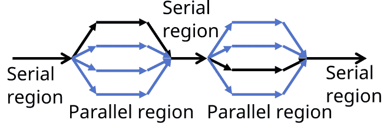

# 基于指令的模型

> 原文：[`enccs.github.io/gpu-programming/6-directive-based-models/`](https://enccs.github.io/gpu-programming/6-directive-based-models/)

*GPU 编程：为什么、何时以及如何？* **   基于指令的模型

+   [在 GitHub 上编辑](https://github.com/ENCCS/gpu-programming/blob/main/content/6-directive-based-models.rst)

* * *

问题

+   OpenACC 和 OpenMP 卸载是什么

+   如何使用指令编写 GPU 代码

目标

+   理解卸载过程

+   理解 OpenACC 和 OpenMP 卸载之间的区别

+   理解 GPU 上的各种并行级别

+   理解数据移动是什么

教师备注

+   40 分钟教学

+   40 分钟练习

GPU 并行编程中最常见的基于指令的模型是 OpenMP 卸载和 OpenACC。并行化是通过在目标并行化的地方引入指令来完成的。

+   **OpenACC** 被认为是更**描述性**的，这意味着程序员使用指令来告诉编译器如何/在哪里并行化代码以及如何移动数据。

+   另一方面，**OpenMP 卸载**被认为是更**规定性**的，其中程序员使用指令更明确地告诉编译器如何/在哪里并行化代码，而不是让编译器决定。

在 OpenMP/OpenACC 中，编译器指令是通过在 C/C++中使用**#pragma**或作为 Fortran 中由独特哨兵标识的特殊注释来指定的。如果未启用 OpenMP/OpenACC 的支持，编译器可以忽略这些指令。

编译器指令用于各种目的：用于线程创建、工作负载分配（工作共享）、数据环境管理、序列化代码部分或用于线程间的工作同步。

## 执行模型

OpenMP 和 OpenACC 使用并行执行的 fork-join 模型。程序开始时是一个执行线程，即**主**线程。所有操作都是顺序执行的，直到遇到第一个并行区域构造。



当遇到并行区域时，主线程创建一组线程，成为这组线程的主线程，并在组内被分配线程索引 0。在并行区域末尾有一个隐式屏障。

## 卸载指令

### OpenACC

在 OpenACC 中，最常用的指令之一是 `kernels`，它定义了一个要转移到一系列按顺序在 GPU 上执行的内核中的区域。为单独的内核自动定义了工作共享，但调优前景有限。

示例：`kernels`

```
#include  <stdio.h>
#include  <openacc.h>

#define NX 102400

int  main(void)
{
  double  vecA[NX],  vecB[NX],  vecC[NX];
  int  i;

  /* Initialization of the vectors */
  for  (i  =  0;  i  <  NX;  i++)  {
  vecA[i]  =  1.0;
  vecB[i]  =  2.0;
  }

 #pragma acc kernels  for  (i  =  0;  i  <  NX;  i++)  {
  vecC[i]  =  vecA[i]  +  vecB[i];
  }

  return  0;
} 
```

```
program main
  implicit none

  integer,  parameter  ::  nx  =  102400
  integer  ::  i

  double precision  ::  vecA(nx),  vecB(nx),  vecC(nx)

  do i  =  1,  nx
  vecA(i)  =  1.0
  vecB(i)  =  1.0
  end do

 !$acc kernels  do i  =  1,  nx
  vecC(i)  =  vecA(i)  +  vecB(i)
  end do
 !$acc end kernels 
end program 
```

OpenACC 定义并行区域的另一种方法是使用 `parallel` 指令。与 `kernels` 指令相反，`parallel` 指令更为明确，需要程序员进行更多分析。工作共享必须通过 `loop` 指令手动定义，并且可以进行精细调整以达到优化效果。上述示例可以重写为以下内容：

示例：`parallel loop`

```
#include  <stdio.h>
#include  <openacc.h>

#define NX 102400

int  main(void)
{
  double  vecA[NX],  vecB[NX],  vecC[NX];
  int  i;

  /* Initialization of the vectors */
  for  (i  =  0;  i  <  NX;  i++)  {
  vecA[i]  =  1.0;
  vecB[i]  =  2.0;
  }

 #pragma acc parallel loop  for  (i  =  0;  i  <  NX;  i++)  {
  vecC[i]  =  vecA[i]  +  vecB[i];
  }

  return  0;
} 
```

```
program main
  implicit none

  integer,  parameter  ::  nx  =  102400
  integer  ::  i

  double precision  ::  vecA(nx),  vecB(nx),  vecC(nx)

  do i  =  1,  nx
  vecA(i)  =  1.0
  vecB(i)  =  1.0
  end do

 !$acc parallel loop  do i  =  1,  nx
  vecC(i)  =  vecA(i)  +  vecB(i)
  end do
 !$acc end parallel loop 
end program 
```

有时我们可以通过引导编译器做出特定选择来获得更好的性能。OpenACC 为卸载执行提供了四个并行级别：

> +   **gang** 粒度粗：迭代在各个 gang 中分配
> +   
> +   **worker** 粒度细：worker 的线程在 gang 内被激活，迭代在线程之间共享
> +   
> +   **vector** 每个 worker 激活其以 SIMT 方式工作的线程，工作在线程之间共享
> +   
> +   **seq** 迭代是顺序执行的

注意

默认情况下，`gang`、`worker` 和 `vector` 并行性由编译器自动决定并应用。

程序员可以在并行区域内添加 `num_gangs`、`num_workers` 和 `vector_length` 等子句，以指定 gang、worker 和向量长度。

最佳数值高度依赖于 GPU 架构和编译器实现。

在 `gang` 级别没有线程同步，这意味着存在竞态条件的风险。

### OpenMP 卸载

使用 OpenMP 时，`target` 指令用于设备卸载。

示例：`target` 构造

```
#include  <stdio.h>

#define NX 102400

int  main(void)
{
  double  vecA[NX],  vecB[NX],  vecC[NX];
  int  i;

  /* Initialization of the vectors */
  for  (i  =  0;  i  <  NX;  i++)  {
  vecA[i]  =  1.0;
  vecB[i]  =  2.0;
  }

 #pragma omp target  for  (i  =  0;  i  <  NX;  i++)  {
  vecC[i]  =  vecA[i]  +  vecB[i];
  }

  return  0;
} 
```

```
program main
  implicit none

  integer,  parameter  ::  nx  =  102400
  integer  ::  i

  double precision  ::  vecA(nx),  vecB(nx),  vecC(nx)

  do i  =  1,  nx
  vecA(i)  =  1.0
  vecB(i)  =  1.0
  end do

 !$omp target  do i  =  1,  nx
  vecC(i)  =  vecA(i)  +  vecB(i)
  end do
 !$omp end target 
end program 
```

与 OpenACC 的 `kernels` 指令相比，`target` 指令根本不会并行化底层循环。为了实现适当的并行化，需要更加具体地指定所需的内容。OpenMP 卸载也提供了多个并行级别：

> +   **teams** 粒度粗：创建一个团队联盟，每个团队中有一个主线程，但团队之间没有工作共享
> +   
> +   **distribute** 将迭代分配到团队中的主线程，但团队内的线程之间没有工作共享
> +   
> +   **并行 do/for** 粒度细：线程在一个团队内被激活，并在它们之间进行工作共享
> +   
> +   **SIMD** 类似于 OpenACC 中的 `vector` 指令

注意

程序员可以添加 `num_teams` 和 `thread_limit` 等子句来指定团队数量和团队内的线程数。

团队内的线程可以同步，但团队之间没有同步。

自 OpenMP 5.0 以来，有一个新的 `loop` 指令可用，其功能类似于 OpenACC 中的对应指令。

关键点

OpenACC/OpenMP 指令与 GPU（**HPE 实现**）之间的映射

| Nvidia | AMD | Fortran OpenACC/OpenMP | C/C++ OpenMP |
| --- | --- | --- | --- |
| Threadblock | Work group | gang/teams | teams |
| Warp | Wavefront | worker/simd | parallel for simd |
| Thread | Work item | vector/simd | parallel for simd |

+   每个编译器支持不同级别的并行性。

+   gang/团队/工作者/向量长度的大小可以由用户任意选择，但实现中定义了限制。

+   最大线程/网格/块大小可以通过`rocminfo`/`nvaccelinfo`找到。

练习：改变并行级别

在这个练习中，我们希望通过使用子句来改变并行级别。首先编译并运行示例之一，以找出编译器在运行时设置的默认块和线程数。要做出改变，尝试添加`num_gangs`、`num_workers`、`vector_length`（对于 OpenACC）和`num_teams`、`thread_limit`（对于 OpenMP 卸载）等子句。

记得在运行时执行`export CRAY_ACC_DEBUG=2`来设置环境。

如何交互式地编译和运行代码：

```
salloc  -A  project_465002387  -N  1  -t  1:00:00  -p  standard-g  --gpus-per-node=1

module  load  LUMI/24.03
module  load  partition/G
module  load  rocm/6.0.3

# OpenMP
cc  -O2  -fopenmp  -o  ex1  ex1.c
# Only OpenACC Fortran is supported by HPE compiler.

export  CRAY_ACC_DEBUG=2
srun  ./ex1 
```

```
salloc  -A  project_465002387  -N  1  -t  1:00:00  -p  standard-g  --gpus-per-node=1

module  load  LUMI/24.03
module  load  partition/G
module  load  rocm/6.0.3

export  CRAY_ACC_DEBUG=2
# OpenMP
ftn  -O2  -homp  -o  ex1  ex1.f90
srun  ./ex1

# OpenACC
ftn  -O2  -hacc  -o  ex1  ex1.f90
srun  ./ex1 
```

以下是一个可以轻易并行化的向量加法问题的示例：

```
#include  <stdio.h>
#include  <math.h>
#define NX 102400

int  main(void){
  double  vecA[NX],vecB[NX],vecC[NX];

  /* Initialize vectors */
  for  (int  i  =  0;  i  <  NX;  i++)  {
  vecA[i]  =  1.0;
  vecB[i]  =  1.0;
  }

  #pragma omp target teams distribute parallel for simd
  {
  for  (int  i  =  0;  i  <  NX;  i++)  {
  vecC[i]  =  vecA[i]  +  vecB[i];
  }
  }
  } 
```

```
program vecsum
  implicit none

  integer,  parameter  ::  nx  =  102400
  real,  dimension(nx)  ::  vecA,vecB,vecC
  integer  ::  i

  ! Initialization of vectors
  do i  =  1,  nx
  vecA(i)  =  1.0
  vecB(i)  =  1.0
  end do

  !$omp target teams distribute parallel do simd
  do i=1,nx
  vecC(i)  =  vecA(i)  +  vecB(i)
  enddo
  !$omp end target teams distribute parallel do simd
end program vecsum 
```

```
#include  <stdio.h>
#include  <openacc.h>
#define NX 102400

int  main(void)  {
  double  vecA[NX],  vecB[NX],  vecC[NX];

  /* Initialization of the vectors */
  for  (int  i  =  0;  i  <  NX;  i++)  {
  vecA[i]  =  1.0;
  vecB[i]  =  1.0;
  }
  #pragma acc parallel loop
  {
  for  (int  i  =  0;  i  <  NX;  i++)  {
  vecC[i]  =  vecA[i]  +  vecB[i];
  }
  }
} 
```

```
program vecsum
  implicit none

  integer,  parameter  ::  nx  =  102400
  real,  dimension(:),  allocatable  ::  vecA,vecB,vecC
  integer  ::  i

  allocate  (vecA(nx),  vecB(nx),vecC(nx))
  ! Initialization of vectors
  do i  =  1,  nx
  vecA(i)  =  1.0
  vecB(i)  =  1.0
  end do

  !$acc parallel loop
  do i=1,nx
  vecC(i)  =  vecA(i)  +  vecB(i)
  enddo
  !$acc end parallel loop
end program vecsum 
```

## 数据移动

由于主机和设备上的内存空间不同，数据传输变得不可避免。需要新的指令来指定变量如何从主机传输到设备数据环境。常见传输项包括数组（数组部分）、标量、指针和结构元素。用于数据移动的各种数据子句总结在下表中：

| `OpenMP` | `OpenACC` |  |
| --- | --- | --- |
| `map(to:list)` | `copyin(list)` | 进入区域时，列表中的变量使用主机中的原始值在设备上进行初始化 |
| `map(from:list)` | `copyout(list)` | 在目标区域的末尾，列表中变量的值被复制到主机上的原始变量中。进入区域时，设备上变量的初始值未初始化 |
| `map(tofrom:list)` | `copy(list)` | map-to 和 map-from 的效果 |
| `map(alloc:list)` | `create(list)` | 进入区域时，数据在设备上分配并初始化 |
| `map(delete:list)` | `delete(list)` | 在设备上删除数据 |

注意

当映射数据数组或指针时，请注意数组部分表示法：

+   在 C/C++中：`array[下界:length]`。表示法：N 等同于 0:N。

+   在 Fortran 中：`array[下界:上界]`。表示法：N 等同于 1:N。

### 数据区域

特定的数据子句与数据指令结合构成了数据区域的开始。指令如何创建存储、传输数据和在设备上删除存储被归类为两类：结构化数据区域和非结构化数据区域。

#### 结构化数据区域

结构化数据区域便于在设备上提供持久数据，这些数据可用于后续的 GPU 指令。

结构化数据区域的语法

```
#pragma omp target data [clauses]
{structured-block} 
```

```
!$omp target data [clauses]
  structured-block
!$omp end target data 
```

```
#pragma acc data [clauses]
  {structured-block} 
```

```
!$acc data [clauses]
  structured-block
!$acc end data 
```

#### 非结构化数据区域

然而，在实际应用中使用结构化数据区域并不方便。非结构化数据区域在设备上创建和删除数据时提供了更多的自由度。

非结构化数据区域的语法

```
#pragma omp target enter data [clauses] 
```

```
#pragma omp target exit data 
```

```
!$omp target enter data [clauses] 
```

```
!$omp target exit data 
```

```
#pragma acc enter data [clauses] 
```

```
#pragma acc exit data 
```

```
!$acc enter data [clauses] 
```

```
!$acc exit data 
```

重点

结构化数据区域

+   单个子程序内的起始和结束点

+   内存存在于数据区域中

非结构化数据区域

+   在不同的子程序中存在多个起始和结束点

+   内存存在直到显式释放

#### 更新

有时，需要在主机和设备内存之间同步变量，例如，为了在主机上写入变量进行调试或可视化，这通常与无结构化数据区域一起使用。为了控制数据传输方向，必须存在 motion-clause。

更新指令的语法

```
#pragma omp target update [clauses] 
```

```
motion-clause:
  to  (list)
  from  (list) 
```

```
!$omp target update [clauses] 
```

```
motion-clause:
  to  (list)
  from  (list) 
```

```
#pragma acc update [clauses] 
```

```
motion-clause:
  self  (list)
  device  (list) 
```

```
!$acc update [clauses] 
```

```
motion-clause:
  self  (list)
  device  (list) 
```

注意

+   `update`指令只能用于主机代码，因为数据移动必须从主机启动，即它可能不会出现在计算区域内。

+   在 OpenACC 中，motion-clause “host” 已被弃用并重命名为 “self”

练习：`update`

尝试在每个检查点找出主机和设备上的变量值。

```
#include  <stdio.h>
int  main(void)
{
int  x  =  0;

#pragma omp target data map(tofrom:x)
{
  /* check point 1 */
  x  =  10;
  /* check point 2 */
#pragma omp target update to(x)
  /* check point 3 */
}

return  0;
} 
```

```
program ex_update
implicit none

integer  ::  x

x  =  0
!$acc data copy(x)
! check point 1
x  =  10
! check point 2
!$acc update device(x)
! check point 3
!$acc end data

end program ex_update 
```

解决方案

| 检查点 | 主机上的 x | 设备上的 x |
| --- | --- | --- |
| 检查点 1 | 0 | 0 |
| 检查点 2 | 10 | 0 |
| 检查点 3 | 10 | 10 |

练习：添加数据映射子句

明确地将适当的数据映射子句添加到指令中

```
#include  <stdio.h>
#include  <math.h>
#define NX 102400

int  main(void){
  double  vecA[NX],vecB[NX],vecC[NX];

  /* Initialize vectors */
  for  (int  i  =  0;  i  <  NX;  i++)  {
  vecA[i]  =  1.0;
  vecB[i]  =  1.0;
  }
  /* Adding mapping clauses here */
  #pragma omp target teams distribute parallel for simd
  {
  for  (int  i  =  0;  i  <  NX;  i++)  {
  vecC[i]  =  vecA[i]  +  vecB[i];
  }
  }

  double  sum  =  0.0;
  for  (int  i  =  0;  i  <  NX;  i++)  {
  sum  +=  vecC[i];
  }
  printf("The sum is: %8.6f \n",  sum);
} 
```

```
program vecsum
implicit none

integer,  parameter  ::  nx  =  102400
real,  dimension(nx)  ::  vecA,vecB,vecC
  real  ::  sum
integer  ::  i

! Initialization of vectors
do i  =  1,  nx
  vecA(i)  =  1.0
  vecB(i)  =  1.0
end do
! Adding mapping clauses here
!$omp target teams distribute parallel do simd
do i=1,nx
  vecC(i)  =  vecA(i)  +  vecB(i)
enddo
!$omp end target teams distribute parallel do simd

sum  =  0.0
! Calculate the sum
do i  =  1,  nx
  sum  =  vecC(i)  +  sum
end do
write(*,'(A,F18.6)')  'The sum is: ',  sum

end program vecsum 
```

```
#include  <stdio.h>
#include  <openacc.h>
#define NX 102400

int  main(void)  {
  double  vecA[NX],  vecB[NX],  vecC[NX];

  /* Initialization of the vectors */
  for  (int  i  =  0;  i  <  NX;  i++)  {
  vecA[i]  =  1.0;
  vecB[i]  =  1.0;
  }
  /* Adding mapping clauses here */
  #pragma acc parallel loop
  {
  for  (int  i  =  0;  i  <  NX;  i++)  {
  vecC[i]  =  vecA[i]  +  vecB[i];
  }
  }

  double  sum  =  0.0;
  for  (int  i  =  0;  i  <  NX;  i++)  {
  sum  +=  vecC[i];
  }
  printf("The sum is: %8.6f \n",  sum);
  } 
```

```
program vecsum
  implicit none

  integer,  parameter  ::  nx  =  102400
  real,  dimension(:),  allocatable  ::  vecA,vecB,vecC
  real  ::  sum
  integer  ::  i

  allocate  (vecA(nx),  vecB(nx),vecC(nx))
  ! Initialization of vectors
  do i  =  1,  nx
  vecA(i)  =  1.0
  vecB(i)  =  1.0
  end do
  ! Adding mapping clauses here
  !$acc parallel loop
  do i=1,nx
  vecC(i)  =  vecA(i)  +  vecB(i)
  enddo
  !$acc end parallel loop

  sum  =  0.0
  ! Calculate the sum
  do i  =  1,  nx
  sum  =  vecC(i)  +  sum
  end do
 write(*,'(A,F18.6)')  'The sum is: ',  sum

  end program vecsum 
```

解决方案

```
#include  <stdio.h>
#include  <math.h>
#define NX 102400

int  main(void){
  double  vecA[NX],vecB[NX],vecC[NX];

  /* Initialize vectors */
  for  (int  i  =  0;  i  <  NX;  i++)  {
  vecA[i]  =  1.0;
  vecB[i]  =  1.0;
  }

 #pragma omp target teams distribute parallel for simd map(to:vecA[0:NX],vecB[0:NX]) map(from:vecC[0:NX])  {
  for  (int  i  =  0;  i  <  NX;  i++)  {
  vecC[i]  =  vecA[i]  +  vecB[i];
  }
  }

  double  sum  =  0.0;
  for  (int  i  =  0;  i  <  NX;  i++)  {
  sum  +=  vecC[i];
  }
  printf("The sum is: %8.6f \n",  sum);
  } 
```

```
program vecsum
  implicit none

  integer,  parameter  ::  nx  =  102400
  real,  dimension(nx)  ::  vecA,vecB,vecC
  real  ::  sum
  integer  ::  i

  ! Initialization of vectors
  do i  =  1,  nx
  vecA(i)  =  1.0
  vecB(i)  =  1.0
  end do

 !$omp target teams distribute parallel do simd map(to:vecA,vecB) map(from:vecC)  do i=1,nx
  vecC(i)  =  vecA(i)  +  vecB(i)
  enddo
  !$omp end target teams distribute parallel do simd

  sum  =  0.0
  ! Calculate the sum
  do i  =  1,  nx
  sum  =  vecC(i)  +  sum
  end do
 write(*,'(A,F18.6)')  'The sum is: ',  sum

  end program vecsum 
```

```
#include  <stdio.h>
#include  <openacc.h>
#define NX 102400

int  main(void)  {
  double  vecA[NX],  vecB[NX],  vecC[NX];

  /* Initialization of the vectors */
  for  (int  i  =  0;  i  <  NX;  i++)  {
  vecA[i]  =  1.0;
  vecB[i]  =  1.0;
  }

 #pragma acc parallel loop copyin(vecA[0:NX],vecB[0:NX]) copyout(vecC[0:NX])  {
  for  (int  i  =  0;  i  <  NX;  i++)  {
  vecC[i]  =  vecA[i]  +  vecB[i];
  }
  }

  double  sum  =  0.0;
  for  (int  i  =  0;  i  <  NX;  i++)  {
  sum  +=  vecC[i];
  }
  printf("The sum is: %8.6f \n",  sum);
  } 
```

```
program vecsum
  implicit none

  integer,  parameter  ::  nx  =  102400
  real,  dimension(nx)  ::  vecA,vecB,vecC
  real  ::  sum
  integer  ::  i

  ! Initialization of vectors
  do i  =  1,  nx
  vecA(i)  =  1.0
  vecB(i)  =  1.0
  end do

 !$acc parallel loop copyin(vecA,vecB) copyout(vecC)  do i=1,nx
  vecC(i)  =  vecA(i)  +  vecB(i)
  enddo
  !$acc end parallel loop

  sum  =  0.0
  ! Calculate the sum
  do i  =  1,  nx
  sum  =  vecC(i)  +  sum
  end do
 write(*,'(A,F18.6)')  'The sum is: ',  sum

  end program vecsum 
```

### 优化数据传输

+   尽可能明确地传输数据。

+   减少主机和设备之间的数据映射量，消除不必要的传输。

+   尽可能长时间地将数据环境保留在设备上。

## 指令式框架的优点

+   增量编程

+   现有软件的移植需要较少的工作

+   同样的代码可以很容易地使用编译器标志编译成 CPU 和 GPU 版本

+   学习曲线低，不需要了解底层硬件细节

+   良好的可移植性

## 参见

+   [ENCCS 关于 OpenACC 的课程](https://enccs.github.io/openacc/)

+   [ENCCS 关于 GPU 卸载的 OpenMP 课程](https://enccs.github.io/openmp-gpu/)

重点

+   OpenACC 和 OpenMP-offloading 允许您使用特殊指令注释您的代码，以标识要在 GPU 上并行执行的区域。

+   两者都允许微调工作分布以匹配架构特性。

+   两者都允许控制数据流向/从 GPU 的流动。

+   与底层方法相比，基于指令的方法可以节省时间，但为了获得良好的性能，您需要特别注意数据移动。上一节 下一节

***

© 版权所有 2023-2024，贡献者。

使用由[Read the Docs](https://readthedocs.org)提供的[主题](https://github.com/readthedocs/sphinx_rtd_theme)构建的[Sphinx](https://www.sphinx-doc.org/)。问题

+   什么是 OpenACC 和 OpenMP 卸载

+   如何使用指令编写 GPU 代码

目标

+   理解卸载的过程

+   理解 OpenACC 和 OpenMP 卸载之间的区别

+   理解 GPU 上的各种并行级别

+   理解数据移动是什么

教练备注

+   40 分钟教学

+   40 分钟练习

最常见的基于指令的 GPU 并行编程模型是 OpenMP 卸载和 OpenACC。并行化是通过在针对并行化的位置引入指令来完成的。

+   **OpenACC** 被认为是更加**描述性**的，这意味着程序员使用指令告诉编译器如何/在哪里并行化代码以及如何移动数据。

+   **OpenMP 卸载**，另一方面，被认为是更加**规定性**的，这意味着程序员使用指令更明确地告诉编译器如何/在哪里并行化代码，而不是让编译器决定。

在 OpenMP/OpenACC 中，编译器指令通过在 C/C++中使用**#pragma**或在 Fortran 中使用具有独特哨兵的特殊注释来指定。如果未启用 OpenMP/OpenACC 的支持，编译器可以忽略这些指令。

编译器指令用于各种目的：用于线程创建、工作负载分配（工作共享）、数据环境管理、序列化代码部分或线程间的工作同步。

## 执行模型

OpenMP 和 OpenACC 使用并行执行的 fork-join 模型。程序开始时是一个单独的执行线程，即**主**线程。所有操作都是顺序执行的，直到遇到第一个并行区域构造。


当遇到并行区域时，主线程创建一组线程，成为这组线程的主线程，并在组内被分配线程索引 0。在并行区域结束时有一个隐式的屏障。

## 卸载指令

### OpenACC

在 OpenACC 中，最常用的指令之一是`kernels`，它定义了一个要传输到 GPU 上按顺序执行的多个内核的区域。对于单独的内核，工作共享是自动定义的，但调整前景有限。

示例：`kernels`

```
#include  <stdio.h>
#include  <openacc.h>

#define NX 102400

int  main(void)
{
  double  vecA[NX],  vecB[NX],  vecC[NX];
  int  i;

  /* Initialization of the vectors */
  for  (i  =  0;  i  <  NX;  i++)  {
  vecA[i]  =  1.0;
  vecB[i]  =  2.0;
  }

 #pragma acc kernels  for  (i  =  0;  i  <  NX;  i++)  {
  vecC[i]  =  vecA[i]  +  vecB[i];
  }

  return  0;
} 
```

```
program main
  implicit none

  integer,  parameter  ::  nx  =  102400
  integer  ::  i

  double precision  ::  vecA(nx),  vecB(nx),  vecC(nx)

  do i  =  1,  nx
  vecA(i)  =  1.0
  vecB(i)  =  1.0
  end do

 !$acc kernels  do i  =  1,  nx
  vecC(i)  =  vecA(i)  +  vecB(i)
  end do
 !$acc end kernels 
end program 
```

OpenACC 定义并行区域的另一种方法是使用`parallel`指令。与`kernels`指令相反，`parallel`指令更加明确，需要程序员进行更多的分析。工作共享必须使用`loop`指令手动定义，并且可以进行精细调整以达到更好的效果。上述示例可以重写为以下内容：

示例：`parallel loop`

```
#include  <stdio.h>
#include  <openacc.h>

#define NX 102400

int  main(void)
{
  double  vecA[NX],  vecB[NX],  vecC[NX];
  int  i;

  /* Initialization of the vectors */
  for  (i  =  0;  i  <  NX;  i++)  {
  vecA[i]  =  1.0;
  vecB[i]  =  2.0;
  }

 #pragma acc parallel loop  for  (i  =  0;  i  <  NX;  i++)  {
  vecC[i]  =  vecA[i]  +  vecB[i];
  }

  return  0;
} 
```

```
program main
  implicit none

  integer,  parameter  ::  nx  =  102400
  integer  ::  i

  double precision  ::  vecA(nx),  vecB(nx),  vecC(nx)

  do i  =  1,  nx
  vecA(i)  =  1.0
  vecB(i)  =  1.0
  end do

 !$acc parallel loop  do i  =  1,  nx
  vecC(i)  =  vecA(i)  +  vecB(i)
  end do
 !$acc end parallel loop 
end program 
```

有时我们可以通过引导编译器做出特定的选择来获得更好的性能。OpenACC 有四个级别的卸载执行并行性：

> +   **gang** 粗粒度：迭代被分配到各个 gang 中
> +   
> +   **worker** 细粒度：工作者线程在 gang 内被激活，迭代在线程之间共享
> +   
> +   **vector** 每个工作者激活其以 SIMT 方式工作的线程，并将工作在线程之间共享
> +   
> +   **seq** 迭代是顺序执行的

注意

默认情况下，`gang`、`worker`和`vector`并行性将由编译器自动决定并应用。

程序员可以在并行区域内添加如`num_gangs`、`num_workers`和`vector_length`等子句来指定团队数量、工作者数量和向量长度。

最佳数值高度依赖于 GPU 架构和编译器实现。

在`gang`级别没有线程同步，这意味着存在竞态条件风险。

### OpenMP Offloading

使用 OpenMP 时，`target`指令用于设备卸载。

示例：`target`构造

```
#include  <stdio.h>

#define NX 102400

int  main(void)
{
  double  vecA[NX],  vecB[NX],  vecC[NX];
  int  i;

  /* Initialization of the vectors */
  for  (i  =  0;  i  <  NX;  i++)  {
  vecA[i]  =  1.0;
  vecB[i]  =  2.0;
  }

 #pragma omp target  for  (i  =  0;  i  <  NX;  i++)  {
  vecC[i]  =  vecA[i]  +  vecB[i];
  }

  return  0;
} 
```

```
program main
  implicit none

  integer,  parameter  ::  nx  =  102400
  integer  ::  i

  double precision  ::  vecA(nx),  vecB(nx),  vecC(nx)

  do i  =  1,  nx
  vecA(i)  =  1.0
  vecB(i)  =  1.0
  end do

 !$omp target  do i  =  1,  nx
  vecC(i)  =  vecA(i)  +  vecB(i)
  end do
 !$omp end target 
end program 
```

与 OpenACC 的`kernels`指令相比，`target`指令根本不会并行化底层循环。为了实现适当的并行化，需要更加具体地指定所需的内容。OpenMP offloading 也提供了多个并行级别：

> +   **teams** 粗粒度：创建一个团队联盟和每个团队中的一个主线程，但团队之间没有工作共享
> +   
> +   **distribute** 将迭代分配到团队中的主线程，但团队内的线程之间没有工作共享
> +   
> +   **parallel do/for** 精粒度：线程在一个团队内被激活并在它们之间共享工作
> +   
> +   **SIMD** 类似于 OpenACC 中的`vector`指令

注意

程序员可以添加如`num_teams`和`thread_limit`等子句来指定团队数量和团队内的线程数量。

团队内的线程可以同步，但团队之间没有同步。

自 OpenMP 5.0 以来，有一个新的`loop`指令可用，其功能与 OpenACC 中的对应指令类似。

关键点

OpenACC/OpenMP 指令与 GPU（**HPE 实现**）之间的映射

| 英伟达 | AMD | Fortran OpenACC/OpenMP | C/C++ OpenMP |
| --- | --- | --- | --- |
| 线程块 | 工作组 | gang/teams | teams |
| 线程束 | 波前 | 工作者/simd | parallel for simd |
| 线程 | 工作项 | 向量/simd | parallel for simd |

+   每个编译器支持不同级别的并行性。

+   gang/team/worker/vector_length 的大小可以由用户任意选择，但实现中定义了限制。

+   最大线程/网格/块大小可以通过`rocminfo`/`nvaccelinfo`找到。

练习：改变并行级别

在这个练习中，我们希望通过子句来改变并行级别。首先编译并运行示例之一，以找出编译器在运行时设置的默认块和线程数量。要做出改变，尝试为 OpenACC 添加`num_gangs`、`num_workers`、`vector_length`，为 OpenMP 卸载添加`num_teams`、`thread_limit`。

记得在运行时执行`export CRAY_ACC_DEBUG=2`来设置环境。

如何交互式编译和运行代码：

```
salloc  -A  project_465002387  -N  1  -t  1:00:00  -p  standard-g  --gpus-per-node=1

module  load  LUMI/24.03
module  load  partition/G
module  load  rocm/6.0.3

# OpenMP
cc  -O2  -fopenmp  -o  ex1  ex1.c
# Only OpenACC Fortran is supported by HPE compiler.

export  CRAY_ACC_DEBUG=2
srun  ./ex1 
```

```
salloc  -A  project_465002387  -N  1  -t  1:00:00  -p  standard-g  --gpus-per-node=1

module  load  LUMI/24.03
module  load  partition/G
module  load  rocm/6.0.3

export  CRAY_ACC_DEBUG=2
# OpenMP
ftn  -O2  -homp  -o  ex1  ex1.f90
srun  ./ex1

# OpenACC
ftn  -O2  -hacc  -o  ex1  ex1.f90
srun  ./ex1 
```

一个可以轻易并行化的向量加法问题示例：

```
#include  <stdio.h>
#include  <math.h>
#define NX 102400

int  main(void){
  double  vecA[NX],vecB[NX],vecC[NX];

  /* Initialize vectors */
  for  (int  i  =  0;  i  <  NX;  i++)  {
  vecA[i]  =  1.0;
  vecB[i]  =  1.0;
  }

  #pragma omp target teams distribute parallel for simd
  {
  for  (int  i  =  0;  i  <  NX;  i++)  {
  vecC[i]  =  vecA[i]  +  vecB[i];
  }
  }
  } 
```

```
program vecsum
  implicit none

  integer,  parameter  ::  nx  =  102400
  real,  dimension(nx)  ::  vecA,vecB,vecC
  integer  ::  i

  ! Initialization of vectors
  do i  =  1,  nx
  vecA(i)  =  1.0
  vecB(i)  =  1.0
  end do

  !$omp target teams distribute parallel do simd
  do i=1,nx
  vecC(i)  =  vecA(i)  +  vecB(i)
  enddo
  !$omp end target teams distribute parallel do simd
end program vecsum 
```

```
#include  <stdio.h>
#include  <openacc.h>
#define NX 102400

int  main(void)  {
  double  vecA[NX],  vecB[NX],  vecC[NX];

  /* Initialization of the vectors */
  for  (int  i  =  0;  i  <  NX;  i++)  {
  vecA[i]  =  1.0;
  vecB[i]  =  1.0;
  }
  #pragma acc parallel loop
  {
  for  (int  i  =  0;  i  <  NX;  i++)  {
  vecC[i]  =  vecA[i]  +  vecB[i];
  }
  }
} 
```

```
program vecsum
  implicit none

  integer,  parameter  ::  nx  =  102400
  real,  dimension(:),  allocatable  ::  vecA,vecB,vecC
  integer  ::  i

  allocate  (vecA(nx),  vecB(nx),vecC(nx))
  ! Initialization of vectors
  do i  =  1,  nx
  vecA(i)  =  1.0
  vecB(i)  =  1.0
  end do

  !$acc parallel loop
  do i=1,nx
  vecC(i)  =  vecA(i)  +  vecB(i)
  enddo
  !$acc end parallel loop
end program vecsum 
```

## 数据移动

由于主机和设备上的内存空间不同，数据传输变得不可避免。需要新的指令来指定变量如何从主机传输到设备数据环境。常见传输项包括数组（数组部分）、标量、指针和结构体元素。用于数据移动的各种数据子句总结在下表中：

| `OpenMP` | `OpenACC` |  |
| --- | --- | --- |
| `map(to:list)` | `copyin(list)` | 进入区域时，列表中的变量使用主机中的原始值在设备上进行初始化 |
| `map(from:list)` | `copyout(list)` | 在目标区域结束时，列表中的变量的值被复制到主机上的原始变量中。进入区域时，设备上变量的初始值未初始化 |
| `map(tofrom:list)` | `copy(list)` | map-to 和 map-from 的效果 |
| `map(alloc:list)` | `create(list)` | 进入区域时，数据在设备上分配并初始化为未初始化状态 |
| `map(delete:list)` | `delete(list)` | 删除设备上的数据 |

注意

在映射数据数组或指针时，请注意数组部分表示法：

+   在 C/C++中：`array[lower-bound:length]`。表示法:N 等同于 0:N。

+   在 Fortran 中：`array[lower-bound:upper-bound]`。表示法:N 等同于 1:N。

### 数据区域

特定的数据子句与数据指令结合构成数据区域的开始。指令如何创建存储、传输数据和在设备上删除存储分为两类：结构化数据区域和非结构化数据区域。

#### 结构化数据区域

结构化数据区域便于在设备上提供持久数据，这些数据可用于后续的 GPU 指令。

结构化数据区域语法

```
#pragma omp target data [clauses]
{structured-block} 
```

```
!$omp target data [clauses]
  structured-block
!$omp end target data 
```

```
#pragma acc data [clauses]
  {structured-block} 
```

```
!$acc data [clauses]
  structured-block
!$acc end data 
```

#### 非结构化数据区域

然而，在实际应用中使用结构化数据区域并不方便。非结构化数据区域在设备上创建和删除数据时提供了更多的自由度。

非结构化数据区域语法

```
#pragma omp target enter data [clauses] 
```

```
#pragma omp target exit data 
```

```
!$omp target enter data [clauses] 
```

```
!$omp target exit data 
```

```
#pragma acc enter data [clauses] 
```

```
#pragma acc exit data 
```

```
!$acc enter data [clauses] 
```

```
!$acc exit data 
```

重点

结构化数据区域

+   单个子程序内的起始和结束点

+   数据区域内的内存存在

非结构化数据区域

+   不同子程序之间的多个起始和结束点

+   内存存在直到显式释放

#### 更新

有时，变量需要在主机和设备内存之间进行同步，例如为了在主机上写入变量进行调试或可视化，这通常与非结构化数据区域一起使用。为了控制数据传输方向，必须存在一个运动子句。

更新指令语法

```
#pragma omp target update [clauses] 
```

```
motion-clause:
  to  (list)
  from  (list) 
```

```
!$omp target update [clauses] 
```

```
motion-clause:
  to  (list)
  from  (list) 
```

```
#pragma acc update [clauses] 
```

```
motion-clause:
  self  (list)
  device  (list) 
```

```
!$acc update [clauses] 
```

```
motion-clause:
  self  (list)
  device  (list) 
```

注意

+   `update` 指令只能在主机代码中使用，因为数据移动必须从主机启动，即它可能不会出现在计算区域内。

+   在 OpenACC 中，运动子句“host”已被弃用并重命名为“self”

练习：`update`

尝试在每个检查点确定主机和设备上的变量值。

```
#include  <stdio.h>
int  main(void)
{
int  x  =  0;

#pragma omp target data map(tofrom:x)
{
  /* check point 1 */
  x  =  10;
  /* check point 2 */
#pragma omp target update to(x)
  /* check point 3 */
}

return  0;
} 
```

```
program ex_update
implicit none

integer  ::  x

x  =  0
!$acc data copy(x)
! check point 1
x  =  10
! check point 2
!$acc update device(x)
! check point 3
!$acc end data

end program ex_update 
```

解决方案

| 检查点 | 主机上的 x | 设备上的 x |
| --- | --- | --- |
| 检查点 1 | 0 | 0 |
| 检查点 2 | 10 | 0 |
| 检查点 3 | 10 | 10 |

练习：添加数据映射子句

明确地将适当的数据映射子句添加到指令中

```
#include  <stdio.h>
#include  <math.h>
#define NX 102400

int  main(void){
  double  vecA[NX],vecB[NX],vecC[NX];

  /* Initialize vectors */
  for  (int  i  =  0;  i  <  NX;  i++)  {
  vecA[i]  =  1.0;
  vecB[i]  =  1.0;
  }
  /* Adding mapping clauses here */
  #pragma omp target teams distribute parallel for simd
  {
  for  (int  i  =  0;  i  <  NX;  i++)  {
  vecC[i]  =  vecA[i]  +  vecB[i];
  }
  }

  double  sum  =  0.0;
  for  (int  i  =  0;  i  <  NX;  i++)  {
  sum  +=  vecC[i];
  }
  printf("The sum is: %8.6f \n",  sum);
} 
```

```
program vecsum
implicit none

integer,  parameter  ::  nx  =  102400
real,  dimension(nx)  ::  vecA,vecB,vecC
  real  ::  sum
integer  ::  i

! Initialization of vectors
do i  =  1,  nx
  vecA(i)  =  1.0
  vecB(i)  =  1.0
end do
! Adding mapping clauses here
!$omp target teams distribute parallel do simd
do i=1,nx
  vecC(i)  =  vecA(i)  +  vecB(i)
enddo
!$omp end target teams distribute parallel do simd

sum  =  0.0
! Calculate the sum
do i  =  1,  nx
  sum  =  vecC(i)  +  sum
end do
write(*,'(A,F18.6)')  'The sum is: ',  sum

end program vecsum 
```

```
#include  <stdio.h>
#include  <openacc.h>
#define NX 102400

int  main(void)  {
  double  vecA[NX],  vecB[NX],  vecC[NX];

  /* Initialization of the vectors */
  for  (int  i  =  0;  i  <  NX;  i++)  {
  vecA[i]  =  1.0;
  vecB[i]  =  1.0;
  }
  /* Adding mapping clauses here */
  #pragma acc parallel loop
  {
  for  (int  i  =  0;  i  <  NX;  i++)  {
  vecC[i]  =  vecA[i]  +  vecB[i];
  }
  }

  double  sum  =  0.0;
  for  (int  i  =  0;  i  <  NX;  i++)  {
  sum  +=  vecC[i];
  }
  printf("The sum is: %8.6f \n",  sum);
  } 
```

```
program vecsum
  implicit none

  integer,  parameter  ::  nx  =  102400
  real,  dimension(:),  allocatable  ::  vecA,vecB,vecC
  real  ::  sum
  integer  ::  i

  allocate  (vecA(nx),  vecB(nx),vecC(nx))
  ! Initialization of vectors
  do i  =  1,  nx
  vecA(i)  =  1.0
  vecB(i)  =  1.0
  end do
  ! Adding mapping clauses here
  !$acc parallel loop
  do i=1,nx
  vecC(i)  =  vecA(i)  +  vecB(i)
  enddo
  !$acc end parallel loop

  sum  =  0.0
  ! Calculate the sum
  do i  =  1,  nx
  sum  =  vecC(i)  +  sum
  end do
 write(*,'(A,F18.6)')  'The sum is: ',  sum

  end program vecsum 
```

解决方案

```
#include  <stdio.h>
#include  <math.h>
#define NX 102400

int  main(void){
  double  vecA[NX],vecB[NX],vecC[NX];

  /* Initialize vectors */
  for  (int  i  =  0;  i  <  NX;  i++)  {
  vecA[i]  =  1.0;
  vecB[i]  =  1.0;
  }

 #pragma omp target teams distribute parallel for simd map(to:vecA[0:NX],vecB[0:NX]) map(from:vecC[0:NX])  {
  for  (int  i  =  0;  i  <  NX;  i++)  {
  vecC[i]  =  vecA[i]  +  vecB[i];
  }
  }

  double  sum  =  0.0;
  for  (int  i  =  0;  i  <  NX;  i++)  {
  sum  +=  vecC[i];
  }
  printf("The sum is: %8.6f \n",  sum);
  } 
```

```
program vecsum
  implicit none

  integer,  parameter  ::  nx  =  102400
  real,  dimension(nx)  ::  vecA,vecB,vecC
  real  ::  sum
  integer  ::  i

  ! Initialization of vectors
  do i  =  1,  nx
  vecA(i)  =  1.0
  vecB(i)  =  1.0
  end do

 !$omp target teams distribute parallel do simd map(to:vecA,vecB) map(from:vecC)  do i=1,nx
  vecC(i)  =  vecA(i)  +  vecB(i)
  enddo
  !$omp end target teams distribute parallel do simd

  sum  =  0.0
  ! Calculate the sum
  do i  =  1,  nx
  sum  =  vecC(i)  +  sum
  end do
 write(*,'(A,F18.6)')  'The sum is: ',  sum

  end program vecsum 
```

```
#include  <stdio.h>
#include  <openacc.h>
#define NX 102400

int  main(void)  {
  double  vecA[NX],  vecB[NX],  vecC[NX];

  /* Initialization of the vectors */
  for  (int  i  =  0;  i  <  NX;  i++)  {
  vecA[i]  =  1.0;
  vecB[i]  =  1.0;
  }

 #pragma acc parallel loop copyin(vecA[0:NX],vecB[0:NX]) copyout(vecC[0:NX])  {
  for  (int  i  =  0;  i  <  NX;  i++)  {
  vecC[i]  =  vecA[i]  +  vecB[i];
  }
  }

  double  sum  =  0.0;
  for  (int  i  =  0;  i  <  NX;  i++)  {
  sum  +=  vecC[i];
  }
  printf("The sum is: %8.6f \n",  sum);
  } 
```

```
program vecsum
  implicit none

  integer,  parameter  ::  nx  =  102400
  real,  dimension(nx)  ::  vecA,vecB,vecC
  real  ::  sum
  integer  ::  i

  ! Initialization of vectors
  do i  =  1,  nx
  vecA(i)  =  1.0
  vecB(i)  =  1.0
  end do

 !$acc parallel loop copyin(vecA,vecB) copyout(vecC)  do i=1,nx
  vecC(i)  =  vecA(i)  +  vecB(i)
  enddo
  !$acc end parallel loop

  sum  =  0.0
  ! Calculate the sum
  do i  =  1,  nx
  sum  =  vecC(i)  +  sum
  end do
 write(*,'(A,F18.6)')  'The sum is: ',  sum

  end program vecsum 
```

### 优化数据传输

+   尽可能明确地传输数据。

+   减少主机和设备之间数据映射的数量，消除不必要的传输。

+   尽可能长时间地将数据环境保留在设备上。

## 基于指令框架的优点

+   增量编程

+   现有软件的移植工作量较小

+   使用编译器标志可以轻松地将相同代码编译成 CPU 和 GPU 版本。

+   学习曲线低，不需要了解底层硬件细节

+   良好的可移植性

## 参见

+   [ENCCS 关于 OpenACC 的课程](https://enccs.github.io/openacc/)

+   [ENCCS 关于 GPU 卸载的 OpenMP 课程](https://enccs.github.io/openmp-gpu/)

重点

+   OpenACC 和 OpenMP-offloading 允许您使用特殊指令注释您的代码，以标识要在 GPU 上并行执行的区域。

+   两者都允许精细调整工作负载的分布以匹配架构特性。

+   两者都允许控制数据从/到 GPU 的流动。

+   与底层方法相比，基于指令的方法可以节省时间，但您需要特别注意数据移动以获得良好的性能。

## 执行模型

OpenMP 和 OpenACC 使用并行执行的 fork-join 模型。程序以单个执行线程开始，即 **主** 线程。所有操作都按顺序执行，直到遇到第一个并行区域构造。


当遇到并行区域时，主线程创建一组线程，成为该组线程的主线程，并在组内分配线程索引 0。并行区域结束时有一个隐式的屏障。

## 卸载指令

### OpenACC

在 OpenACC 中，最常用的指令之一是 `kernels`，它定义了一个要传输到一系列按顺序在 GPU 上执行的内核的区域。为单独的内核自动定义了工作共享，但调优前景有限。

示例：`kernels`

```
#include  <stdio.h>
#include  <openacc.h>

#define NX 102400

int  main(void)
{
  double  vecA[NX],  vecB[NX],  vecC[NX];
  int  i;

  /* Initialization of the vectors */
  for  (i  =  0;  i  <  NX;  i++)  {
  vecA[i]  =  1.0;
  vecB[i]  =  2.0;
  }

 #pragma acc kernels  for  (i  =  0;  i  <  NX;  i++)  {
  vecC[i]  =  vecA[i]  +  vecB[i];
  }

  return  0;
} 
```

```
program main
  implicit none

  integer,  parameter  ::  nx  =  102400
  integer  ::  i

  double precision  ::  vecA(nx),  vecB(nx),  vecC(nx)

  do i  =  1,  nx
  vecA(i)  =  1.0
  vecB(i)  =  1.0
  end do

 !$acc kernels  do i  =  1,  nx
  vecC(i)  =  vecA(i)  +  vecB(i)
  end do
 !$acc end kernels 
end program 
```

OpenACC 定义并行区域的另一种方法是使用 `parallel` 指令。与 `kernels` 指令相反，`parallel` 指令更为明确，需要程序员进行更多分析。必须使用 `loop` 指令手动定义工作共享，并且可以进行精细调优。上述示例可以重写为以下内容：

示例：`parallel loop`

```
#include  <stdio.h>
#include  <openacc.h>

#define NX 102400

int  main(void)
{
  double  vecA[NX],  vecB[NX],  vecC[NX];
  int  i;

  /* Initialization of the vectors */
  for  (i  =  0;  i  <  NX;  i++)  {
  vecA[i]  =  1.0;
  vecB[i]  =  2.0;
  }

 #pragma acc parallel loop  for  (i  =  0;  i  <  NX;  i++)  {
  vecC[i]  =  vecA[i]  +  vecB[i];
  }

  return  0;
} 
```

```
program main
  implicit none

  integer,  parameter  ::  nx  =  102400
  integer  ::  i

  double precision  ::  vecA(nx),  vecB(nx),  vecC(nx)

  do i  =  1,  nx
  vecA(i)  =  1.0
  vecB(i)  =  1.0
  end do

 !$acc parallel loop  do i  =  1,  nx
  vecC(i)  =  vecA(i)  +  vecB(i)
  end do
 !$acc end parallel loop 
end program 
```

有时我们可以通过引导编译器做出特定选择来获得更好的性能。OpenACC 为卸载执行提供了四个级别的并行性：

> +   **gang** 粗粒度：迭代在 gang 中分配
> +   
> +   **worker** 细粒度：工作线程在组内激活，迭代在线程间共享
> +   
> +   **vector** 每个工作线程以 SIMT 方式激活其线程，工作在线程间共享
> +   
> +   **seq** 迭代按顺序执行

注意

默认情况下，`gang`、`worker` 和 `vector` 并行性由编译器自动决定并应用。

程序员可以在并行区域内添加 `num_gangs`、`num_workers` 和 `vector_length` 等子句来指定组、工作线程和向量长度。

最佳数值高度依赖于 GPU 架构和编译器实现。

在 `gang` 级别没有线程同步，这意味着存在竞态条件风险。

### OpenMP 卸载

使用 OpenMP 时，`target` 指令用于设备卸载。

示例：`target` 构造

```
#include  <stdio.h>

#define NX 102400

int  main(void)
{
  double  vecA[NX],  vecB[NX],  vecC[NX];
  int  i;

  /* Initialization of the vectors */
  for  (i  =  0;  i  <  NX;  i++)  {
  vecA[i]  =  1.0;
  vecB[i]  =  2.0;
  }

 #pragma omp target  for  (i  =  0;  i  <  NX;  i++)  {
  vecC[i]  =  vecA[i]  +  vecB[i];
  }

  return  0;
} 
```

```
program main
  implicit none

  integer,  parameter  ::  nx  =  102400
  integer  ::  i

  double precision  ::  vecA(nx),  vecB(nx),  vecC(nx)

  do i  =  1,  nx
  vecA(i)  =  1.0
  vecB(i)  =  1.0
  end do

 !$omp target  do i  =  1,  nx
  vecC(i)  =  vecA(i)  +  vecB(i)
  end do
 !$omp end target 
end program 
```

与 OpenACC 的 `kernels` 指令相比，`target` 指令根本不会并行化底层循环。为了实现适当的并行化，需要更加具体地指定想要的内容。OpenMP 卸载也提供了多个并行级别：

> +   **teams** 粗粒度：创建一个团队联盟，每个团队中有一个主线程，但团队之间没有工作共享
> +   
> +   **distribute** 在团队中的主线程间分配迭代，但团队内的线程之间没有工作共享
> +   
> +   **parallel do/for** 细粒度：线程在一个团队内激活，并在它们之间共享工作
> +   
> +   **SIMD** 类似于 OpenACC 中的 `vector` 指令

注意

程序员可以添加 `num_teams` 和 `thread_limit` 等子句来指定团队和团队内的线程数。

团队内的线程可以同步，但团队之间没有同步。

自 OpenMP 5.0 以来，有一个新的 `loop` 指令可用，其功能与 OpenACC 中相应的指令类似。

重点

OpenACC/OpenMP 指令与 GPU（**HPE 实现**）之间的映射

| Nvidia | AMD | Fortran OpenACC/OpenMP | C/C++ OpenMP |
| --- | --- | --- | --- |
| Threadblock | Work group | gang/teams | teams |
| Warp | Wavefront | worker/simd | parallel for simd |
| 线程 | 工作项 | vector/simd | parallel for simd |

+   每个编译器支持不同级别的并行性。

+   gang/team/worker/vector_length 的大小可以由用户任意选择，但实现中定义了限制。

+   最大线程/网格/块大小可以通过 `rocminfo`/`nvaccelinfo` 查找。

练习：改变并行级别

在这个练习中，我们希望通过使用子句来改变并行级别。首先编译并运行示例之一，以找出编译器在运行时设置的默认块和线程数。要做出更改，尝试添加 `num_gangs`、`num_workers`、`vector_length` 等子句用于 OpenACC，以及 `num_teams`、`thread_limit` 用于 OpenMP 卸载。

记得在运行时执行 `export CRAY_ACC_DEBUG=2` 来设置环境。

如何交互式地编译和运行代码：

```
salloc  -A  project_465002387  -N  1  -t  1:00:00  -p  standard-g  --gpus-per-node=1

module  load  LUMI/24.03
module  load  partition/G
module  load  rocm/6.0.3

# OpenMP
cc  -O2  -fopenmp  -o  ex1  ex1.c
# Only OpenACC Fortran is supported by HPE compiler.

export  CRAY_ACC_DEBUG=2
srun  ./ex1 
```

```
salloc  -A  project_465002387  -N  1  -t  1:00:00  -p  standard-g  --gpus-per-node=1

module  load  LUMI/24.03
module  load  partition/G
module  load  rocm/6.0.3

export  CRAY_ACC_DEBUG=2
# OpenMP
ftn  -O2  -homp  -o  ex1  ex1.f90
srun  ./ex1

# OpenACC
ftn  -O2  -hacc  -o  ex1  ex1.f90
srun  ./ex1 
```

以下是一个可以轻易并行化的向量加法问题的示例：

```
#include  <stdio.h>
#include  <math.h>
#define NX 102400

int  main(void){
  double  vecA[NX],vecB[NX],vecC[NX];

  /* Initialize vectors */
  for  (int  i  =  0;  i  <  NX;  i++)  {
  vecA[i]  =  1.0;
  vecB[i]  =  1.0;
  }

  #pragma omp target teams distribute parallel for simd
  {
  for  (int  i  =  0;  i  <  NX;  i++)  {
  vecC[i]  =  vecA[i]  +  vecB[i];
  }
  }
  } 
```

```
program vecsum
  implicit none

  integer,  parameter  ::  nx  =  102400
  real,  dimension(nx)  ::  vecA,vecB,vecC
  integer  ::  i

  ! Initialization of vectors
  do i  =  1,  nx
  vecA(i)  =  1.0
  vecB(i)  =  1.0
  end do

  !$omp target teams distribute parallel do simd
  do i=1,nx
  vecC(i)  =  vecA(i)  +  vecB(i)
  enddo
  !$omp end target teams distribute parallel do simd
end program vecsum 
```

```
#include  <stdio.h>
#include  <openacc.h>
#define NX 102400

int  main(void)  {
  double  vecA[NX],  vecB[NX],  vecC[NX];

  /* Initialization of the vectors */
  for  (int  i  =  0;  i  <  NX;  i++)  {
  vecA[i]  =  1.0;
  vecB[i]  =  1.0;
  }
  #pragma acc parallel loop
  {
  for  (int  i  =  0;  i  <  NX;  i++)  {
  vecC[i]  =  vecA[i]  +  vecB[i];
  }
  }
} 
```

```
program vecsum
  implicit none

  integer,  parameter  ::  nx  =  102400
  real,  dimension(:),  allocatable  ::  vecA,vecB,vecC
  integer  ::  i

  allocate  (vecA(nx),  vecB(nx),vecC(nx))
  ! Initialization of vectors
  do i  =  1,  nx
  vecA(i)  =  1.0
  vecB(i)  =  1.0
  end do

  !$acc parallel loop
  do i=1,nx
  vecC(i)  =  vecA(i)  +  vecB(i)
  enddo
  !$acc end parallel loop
end program vecsum 
```

### OpenACC

在 OpenACC 中，最常用的指令之一是`kernels`，它定义了一个要转移到一系列在 GPU 上顺序执行的核的区域。对于单独的核，工作共享是自动定义的，但调整前景有限。

示例：`kernels`

```
#include  <stdio.h>
#include  <openacc.h>

#define NX 102400

int  main(void)
{
  double  vecA[NX],  vecB[NX],  vecC[NX];
  int  i;

  /* Initialization of the vectors */
  for  (i  =  0;  i  <  NX;  i++)  {
  vecA[i]  =  1.0;
  vecB[i]  =  2.0;
  }

 #pragma acc kernels  for  (i  =  0;  i  <  NX;  i++)  {
  vecC[i]  =  vecA[i]  +  vecB[i];
  }

  return  0;
} 
```

```
program main
  implicit none

  integer,  parameter  ::  nx  =  102400
  integer  ::  i

  double precision  ::  vecA(nx),  vecB(nx),  vecC(nx)

  do i  =  1,  nx
  vecA(i)  =  1.0
  vecB(i)  =  1.0
  end do

 !$acc kernels  do i  =  1,  nx
  vecC(i)  =  vecA(i)  +  vecB(i)
  end do
 !$acc end kernels 
end program 
```

OpenACC 定义并行区域的另一种方法是使用`parallel`指令。与`kernels`指令相反，`parallel`指令更为明确，需要程序员进行更多分析。工作共享必须使用`loop`指令手动定义，并且可以进行精细调整。上述示例可以重写为以下内容：

示例：`parallel loop`

```
#include  <stdio.h>
#include  <openacc.h>

#define NX 102400

int  main(void)
{
  double  vecA[NX],  vecB[NX],  vecC[NX];
  int  i;

  /* Initialization of the vectors */
  for  (i  =  0;  i  <  NX;  i++)  {
  vecA[i]  =  1.0;
  vecB[i]  =  2.0;
  }

 #pragma acc parallel loop  for  (i  =  0;  i  <  NX;  i++)  {
  vecC[i]  =  vecA[i]  +  vecB[i];
  }

  return  0;
} 
```

```
program main
  implicit none

  integer,  parameter  ::  nx  =  102400
  integer  ::  i

  double precision  ::  vecA(nx),  vecB(nx),  vecC(nx)

  do i  =  1,  nx
  vecA(i)  =  1.0
  vecB(i)  =  1.0
  end do

 !$acc parallel loop  do i  =  1,  nx
  vecC(i)  =  vecA(i)  +  vecB(i)
  end do
 !$acc end parallel loop 
end program 
```

有时我们可以通过引导编译器做出特定的选择来获得更好的性能。OpenACC 为卸载执行提供了四个并行级别：

> +   **gang** 粗粒度：迭代在 gang 之间分配
> +   
> +   **worker** 细粒度：在 gang 内激活 worker 的线程，迭代在线程之间共享
> +   
> +   **vector** 每个 worker 激活其以 SIMT 方式工作的线程，并将工作在线程之间共享
> +   
> +   **seq** 迭代是顺序执行的

注意

默认情况下，`gang`、`worker`和`vector`并行性将由编译器自动决定并应用。

程序员可以在并行区域内添加如`num_gangs`、`num_workers`和`vector_length`之类的子句，以指定 gang 的数量、worker 的数量和向量长度。

最佳数值高度依赖于 GPU 架构和编译器实现。

在`gang`级别没有线程同步，这意味着存在竞态条件的风险。

### OpenMP 卸载

使用 OpenMP 时，使用`target`指令进行设备卸载。

示例：`target`结构

```
#include  <stdio.h>

#define NX 102400

int  main(void)
{
  double  vecA[NX],  vecB[NX],  vecC[NX];
  int  i;

  /* Initialization of the vectors */
  for  (i  =  0;  i  <  NX;  i++)  {
  vecA[i]  =  1.0;
  vecB[i]  =  2.0;
  }

 #pragma omp target  for  (i  =  0;  i  <  NX;  i++)  {
  vecC[i]  =  vecA[i]  +  vecB[i];
  }

  return  0;
} 
```

```
program main
  implicit none

  integer,  parameter  ::  nx  =  102400
  integer  ::  i

  double precision  ::  vecA(nx),  vecB(nx),  vecC(nx)

  do i  =  1,  nx
  vecA(i)  =  1.0
  vecB(i)  =  1.0
  end do

 !$omp target  do i  =  1,  nx
  vecC(i)  =  vecA(i)  +  vecB(i)
  end do
 !$omp end target 
end program 
```

与 OpenACC 的`kernels`指令相比，`target`指令根本不会并行化底层循环。为了实现适当的并行化，需要更加具体地指定所需的内容。OpenMP 卸载提供了多个并行级别：

> +   **teams** 粗粒度：创建一个团队联盟，每个团队中有一个主线程，但团队之间没有工作共享
> +   
> +   **distribute** 将迭代分配到团队中的主线程，但团队内的线程之间没有工作共享
> +   
> +   **parallel do/for** 细粒度：在一个团队内激活线程，并在它们之间进行工作共享
> +   
> +   **SIMD** 类似于 OpenACC 中的`vector`指令

注意

程序员可以添加如`num_teams`和`thread_limit`之类的子句，以指定团队的数量和团队内的线程数量。

团队内的线程可以同步，但团队之间没有同步。

自 OpenMP 5.0 以来，有一个新的`loop`指令可用，其功能与 OpenACC 中的对应指令类似。

重点

OpenACC/OpenMP 指令与 GPU（**HPE 实现**）之间的映射

| 英伟达 | AMD | Fortran OpenACC/OpenMP | C/C++ OpenMP |
| --- | --- | --- | --- |
| 线程块 | 工作组 | gang/teams | teams |
| Warp | Wavefront | worker/simd | parallel for simd |
| 线程 | 工作项 | vector/simd | parallel for simd |

+   每个编译器支持不同级别的并行性。

+   gang/team/worker/vector_length 的大小可以由用户任意选择，但实现中定义了限制。

+   最大线程/网格/块大小可以通过 `rocminfo`/`nvaccelinfo` 查找。

练习：更改并行级别

在这个练习中，我们希望通过子句更改并行级别。首先编译并运行其中一个示例，以找出编译器在运行时设置的默认块和线程数。要进行更改，尝试添加 `num_gangs`、`num_workers`、`vector_length`（对于 OpenACC）和 `num_teams`、`thread_limit`（对于 OpenMP 卸载）等子句。

记得在运行时执行 `export CRAY_ACC_DEBUG=2` 来设置环境。

如何交互式地编译和运行代码：

```
salloc  -A  project_465002387  -N  1  -t  1:00:00  -p  standard-g  --gpus-per-node=1

module  load  LUMI/24.03
module  load  partition/G
module  load  rocm/6.0.3

# OpenMP
cc  -O2  -fopenmp  -o  ex1  ex1.c
# Only OpenACC Fortran is supported by HPE compiler.

export  CRAY_ACC_DEBUG=2
srun  ./ex1 
```

```
salloc  -A  project_465002387  -N  1  -t  1:00:00  -p  standard-g  --gpus-per-node=1

module  load  LUMI/24.03
module  load  partition/G
module  load  rocm/6.0.3

export  CRAY_ACC_DEBUG=2
# OpenMP
ftn  -O2  -homp  -o  ex1  ex1.f90
srun  ./ex1

# OpenACC
ftn  -O2  -hacc  -o  ex1  ex1.f90
srun  ./ex1 
```

一个简单可并行化的向量加法问题示例：

```
#include  <stdio.h>
#include  <math.h>
#define NX 102400

int  main(void){
  double  vecA[NX],vecB[NX],vecC[NX];

  /* Initialize vectors */
  for  (int  i  =  0;  i  <  NX;  i++)  {
  vecA[i]  =  1.0;
  vecB[i]  =  1.0;
  }

  #pragma omp target teams distribute parallel for simd
  {
  for  (int  i  =  0;  i  <  NX;  i++)  {
  vecC[i]  =  vecA[i]  +  vecB[i];
  }
  }
  } 
```

```
program vecsum
  implicit none

  integer,  parameter  ::  nx  =  102400
  real,  dimension(nx)  ::  vecA,vecB,vecC
  integer  ::  i

  ! Initialization of vectors
  do i  =  1,  nx
  vecA(i)  =  1.0
  vecB(i)  =  1.0
  end do

  !$omp target teams distribute parallel do simd
  do i=1,nx
  vecC(i)  =  vecA(i)  +  vecB(i)
  enddo
  !$omp end target teams distribute parallel do simd
end program vecsum 
```

```
#include  <stdio.h>
#include  <openacc.h>
#define NX 102400

int  main(void)  {
  double  vecA[NX],  vecB[NX],  vecC[NX];

  /* Initialization of the vectors */
  for  (int  i  =  0;  i  <  NX;  i++)  {
  vecA[i]  =  1.0;
  vecB[i]  =  1.0;
  }
  #pragma acc parallel loop
  {
  for  (int  i  =  0;  i  <  NX;  i++)  {
  vecC[i]  =  vecA[i]  +  vecB[i];
  }
  }
} 
```

```
program vecsum
  implicit none

  integer,  parameter  ::  nx  =  102400
  real,  dimension(:),  allocatable  ::  vecA,vecB,vecC
  integer  ::  i

  allocate  (vecA(nx),  vecB(nx),vecC(nx))
  ! Initialization of vectors
  do i  =  1,  nx
  vecA(i)  =  1.0
  vecB(i)  =  1.0
  end do

  !$acc parallel loop
  do i=1,nx
  vecC(i)  =  vecA(i)  +  vecB(i)
  enddo
  !$acc end parallel loop
end program vecsum 
```

## 数据移动

由于主机和设备上的内存空间不同，数据传输变得不可避免。需要新的指令来指定变量如何从主机传输到设备数据环境。通常传输的项目包括数组（数组部分）、标量、指针和结构元素。用于数据移动的各种数据子句总结在下表中：

| `OpenMP` | `OpenACC` |  |
| --- | --- | --- |
| `map(to:list)` | `copyin(list)` | 进入区域时，使用主机上的原始值在设备上初始化列表中的变量 |
| `map(from:list)` | `copyout(list)` | 在目标区域结束时，列表中变量的值被复制到主机上的原始变量。进入区域时，设备上变量的初始值未初始化 |
| `map(tofrom:list)` | `copy(list)` | 两者都映射到和映射从的效果 |
| `map(alloc:list)` | `create(list)` | 进入区域时，在设备上分配数据并初始化为未初始化状态 |
| `map(delete:list)` | `delete(list)` | 删除设备上的数据 |

注意

当映射数据数组或指针时，请注意数组部分表示法：

+   在 C/C++中：array[下界:length]。表示法 :N 等价于 0:N。

+   在 Fortran 中：array[下界:上界]。表示法 :N 等价于 1:N。

### 数据区域

特定的数据子句与数据指令结合构成数据区域的开始。指令如何创建存储、传输数据和在设备上删除存储被分类为两类：结构化数据区域和非结构化数据区域。

#### 结构化数据区域

结构化数据区域方便在设备上提供持久数据，这些数据可用于后续的 GPU 指令。

结构化数据区域的语法

```
#pragma omp target data [clauses]
{structured-block} 
```

```
!$omp target data [clauses]
  structured-block
!$omp end target data 
```

```
#pragma acc data [clauses]
  {structured-block} 
```

```
!$acc data [clauses]
  structured-block
!$acc end data 
```

#### 非结构化数据区域

然而，在实际应用中使用结构化数据区域并不方便。非结构化数据区域在设备上创建和删除数据时提供了更多的自由度，可以在任何适当的点上操作。

非结构化数据区域的语法

```
#pragma omp target enter data [clauses] 
```

```
#pragma omp target exit data 
```

```
!$omp target enter data [clauses] 
```

```
!$omp target exit data 
```

```
#pragma acc enter data [clauses] 
```

```
#pragma acc exit data 
```

```
!$acc enter data [clauses] 
```

```
!$acc exit data 
```

重点

结构化数据区域

+   单个子程序内的起始和结束点

+   内存存在于数据区域内

非结构化数据区域

+   不同子程序之间的多个起始和结束点

+   内存存在直到显式释放

#### 更新

有时，需要在主机和设备内存之间同步变量，例如为了在主机上写入变量进行调试或可视化，这通常与非结构化数据区域一起使用。为了控制数据传输方向，必须存在一个运动子句。

更新指令的语法

```
#pragma omp target update [clauses] 
```

```
motion-clause:
  to  (list)
  from  (list) 
```

```
!$omp target update [clauses] 
```

```
motion-clause:
  to  (list)
  from  (list) 
```

```
#pragma acc update [clauses] 
```

```
motion-clause:
  self  (list)
  device  (list) 
```

```
!$acc update [clauses] 
```

```
motion-clause:
  self  (list)
  device  (list) 
```

注意

+   `update` 指令只能在主机代码中使用，因为数据移动必须从主机启动，即它可能不会出现在计算区域内。

+   在 OpenACC 中，运动子句“host”已被弃用并重命名为“self”

练习：`update`

尝试在每个检查点确定主机和设备上的变量值。

```
#include  <stdio.h>
int  main(void)
{
int  x  =  0;

#pragma omp target data map(tofrom:x)
{
  /* check point 1 */
  x  =  10;
  /* check point 2 */
#pragma omp target update to(x)
  /* check point 3 */
}

return  0;
} 
```

```
program ex_update
implicit none

integer  ::  x

x  =  0
!$acc data copy(x)
! check point 1
x  =  10
! check point 2
!$acc update device(x)
! check point 3
!$acc end data

end program ex_update 
```

解决方案

| 检查点 | 主机上的 x | 设备上的 x |
| --- | --- | --- |
| 检查点 1 | 0 | 0 |
| 检查点 2 | 10 | 0 |
| 检查点 3 | 10 | 10 |

练习：添加数据映射子句

明确地将适当的数据映射子句添加到指令中

```
#include  <stdio.h>
#include  <math.h>
#define NX 102400

int  main(void){
  double  vecA[NX],vecB[NX],vecC[NX];

  /* Initialize vectors */
  for  (int  i  =  0;  i  <  NX;  i++)  {
  vecA[i]  =  1.0;
  vecB[i]  =  1.0;
  }
  /* Adding mapping clauses here */
  #pragma omp target teams distribute parallel for simd
  {
  for  (int  i  =  0;  i  <  NX;  i++)  {
  vecC[i]  =  vecA[i]  +  vecB[i];
  }
  }

  double  sum  =  0.0;
  for  (int  i  =  0;  i  <  NX;  i++)  {
  sum  +=  vecC[i];
  }
  printf("The sum is: %8.6f \n",  sum);
} 
```

```
program vecsum
implicit none

integer,  parameter  ::  nx  =  102400
real,  dimension(nx)  ::  vecA,vecB,vecC
  real  ::  sum
integer  ::  i

! Initialization of vectors
do i  =  1,  nx
  vecA(i)  =  1.0
  vecB(i)  =  1.0
end do
! Adding mapping clauses here
!$omp target teams distribute parallel do simd
do i=1,nx
  vecC(i)  =  vecA(i)  +  vecB(i)
enddo
!$omp end target teams distribute parallel do simd

sum  =  0.0
! Calculate the sum
do i  =  1,  nx
  sum  =  vecC(i)  +  sum
end do
write(*,'(A,F18.6)')  'The sum is: ',  sum

end program vecsum 
```

```
#include  <stdio.h>
#include  <openacc.h>
#define NX 102400

int  main(void)  {
  double  vecA[NX],  vecB[NX],  vecC[NX];

  /* Initialization of the vectors */
  for  (int  i  =  0;  i  <  NX;  i++)  {
  vecA[i]  =  1.0;
  vecB[i]  =  1.0;
  }
  /* Adding mapping clauses here */
  #pragma acc parallel loop
  {
  for  (int  i  =  0;  i  <  NX;  i++)  {
  vecC[i]  =  vecA[i]  +  vecB[i];
  }
  }

  double  sum  =  0.0;
  for  (int  i  =  0;  i  <  NX;  i++)  {
  sum  +=  vecC[i];
  }
  printf("The sum is: %8.6f \n",  sum);
  } 
```

```
program vecsum
  implicit none

  integer,  parameter  ::  nx  =  102400
  real,  dimension(:),  allocatable  ::  vecA,vecB,vecC
  real  ::  sum
  integer  ::  i

  allocate  (vecA(nx),  vecB(nx),vecC(nx))
  ! Initialization of vectors
  do i  =  1,  nx
  vecA(i)  =  1.0
  vecB(i)  =  1.0
  end do
  ! Adding mapping clauses here
  !$acc parallel loop
  do i=1,nx
  vecC(i)  =  vecA(i)  +  vecB(i)
  enddo
  !$acc end parallel loop

  sum  =  0.0
  ! Calculate the sum
  do i  =  1,  nx
  sum  =  vecC(i)  +  sum
  end do
 write(*,'(A,F18.6)')  'The sum is: ',  sum

  end program vecsum 
```

解决方案

```
#include  <stdio.h>
#include  <math.h>
#define NX 102400

int  main(void){
  double  vecA[NX],vecB[NX],vecC[NX];

  /* Initialize vectors */
  for  (int  i  =  0;  i  <  NX;  i++)  {
  vecA[i]  =  1.0;
  vecB[i]  =  1.0;
  }

 #pragma omp target teams distribute parallel for simd map(to:vecA[0:NX],vecB[0:NX]) map(from:vecC[0:NX])  {
  for  (int  i  =  0;  i  <  NX;  i++)  {
  vecC[i]  =  vecA[i]  +  vecB[i];
  }
  }

  double  sum  =  0.0;
  for  (int  i  =  0;  i  <  NX;  i++)  {
  sum  +=  vecC[i];
  }
  printf("The sum is: %8.6f \n",  sum);
  } 
```

```
program vecsum
  implicit none

  integer,  parameter  ::  nx  =  102400
  real,  dimension(nx)  ::  vecA,vecB,vecC
  real  ::  sum
  integer  ::  i

  ! Initialization of vectors
  do i  =  1,  nx
  vecA(i)  =  1.0
  vecB(i)  =  1.0
  end do

 !$omp target teams distribute parallel do simd map(to:vecA,vecB) map(from:vecC)  do i=1,nx
  vecC(i)  =  vecA(i)  +  vecB(i)
  enddo
  !$omp end target teams distribute parallel do simd

  sum  =  0.0
  ! Calculate the sum
  do i  =  1,  nx
  sum  =  vecC(i)  +  sum
  end do
 write(*,'(A,F18.6)')  'The sum is: ',  sum

  end program vecsum 
```

```
#include  <stdio.h>
#include  <openacc.h>
#define NX 102400

int  main(void)  {
  double  vecA[NX],  vecB[NX],  vecC[NX];

  /* Initialization of the vectors */
  for  (int  i  =  0;  i  <  NX;  i++)  {
  vecA[i]  =  1.0;
  vecB[i]  =  1.0;
  }

 #pragma acc parallel loop copyin(vecA[0:NX],vecB[0:NX]) copyout(vecC[0:NX])  {
  for  (int  i  =  0;  i  <  NX;  i++)  {
  vecC[i]  =  vecA[i]  +  vecB[i];
  }
  }

  double  sum  =  0.0;
  for  (int  i  =  0;  i  <  NX;  i++)  {
  sum  +=  vecC[i];
  }
  printf("The sum is: %8.6f \n",  sum);
  } 
```

```
program vecsum
  implicit none

  integer,  parameter  ::  nx  =  102400
  real,  dimension(nx)  ::  vecA,vecB,vecC
  real  ::  sum
  integer  ::  i

  ! Initialization of vectors
  do i  =  1,  nx
  vecA(i)  =  1.0
  vecB(i)  =  1.0
  end do

 !$acc parallel loop copyin(vecA,vecB) copyout(vecC)  do i=1,nx
  vecC(i)  =  vecA(i)  +  vecB(i)
  enddo
  !$acc end parallel loop

  sum  =  0.0
  ! Calculate the sum
  do i  =  1,  nx
  sum  =  vecC(i)  +  sum
  end do
 write(*,'(A,F18.6)')  'The sum is: ',  sum

  end program vecsum 
```

### 优化数据传输

+   尽可能显式地传输数据。

+   减少主机和设备之间数据映射的数量，去除不必要的传输。

+   尝试尽可能长时间地保持设备上的数据环境。

### 数据区域

特定的数据子句与数据指令结合构成了数据区域的开始。指令如何在设备上创建存储、传输数据和删除存储被分为两类：结构化数据区域和非结构化数据区域。

#### 结构化数据区域

结构化数据区域便于在设备上提供持久数据，这些数据可用于后续的 GPU 指令。

结构化数据区域的语法

```
#pragma omp target data [clauses]
{structured-block} 
```

```
!$omp target data [clauses]
  structured-block
!$omp end target data 
```

```
#pragma acc data [clauses]
  {structured-block} 
```

```
!$acc data [clauses]
  structured-block
!$acc end data 
```

#### 非结构化数据区域

然而，在实际应用中使用结构化数据区域并不方便。非结构化数据区域在设备上创建和删除数据时提供了更多的自由度，可以在任何适当的点上操作。

非结构化数据区域的语法

```
#pragma omp target enter data [clauses] 
```

```
#pragma omp target exit data 
```

```
!$omp target enter data [clauses] 
```

```
!$omp target exit data 
```

```
#pragma acc enter data [clauses] 
```

```
#pragma acc exit data 
```

```
!$acc enter data [clauses] 
```

```
!$acc exit data 
```

重点

结构化数据区域

+   单个子程序内的起始和结束点

+   内存存在于数据区域内

非结构化数据区域

+   不同子程序之间的多个起始和结束点

+   内存存在直到显式释放

#### 更新

有时，需要在主机和设备内存之间同步变量，例如为了在主机上写入变量进行调试或可视化，这通常与非结构化数据区域一起使用。为了控制数据传输方向，必须存在一个运动子句。

更新指令的语法

```
#pragma omp target update [clauses] 
```

```
motion-clause:
  to  (list)
  from  (list) 
```

```
!$omp target update [clauses] 
```

```
motion-clause:
  to  (list)
  from  (list) 
```

```
#pragma acc update [clauses] 
```

```
motion-clause:
  self  (list)
  device  (list) 
```

```
!$acc update [clauses] 
```

```
motion-clause:
  self  (list)
  device  (list) 
```

注意

+   `update`指令只能在主机代码中使用，因为数据移动必须从主机启动，即它可能不会出现在计算区域内。

+   在 OpenACC 中，运动子句“host”已被弃用并重命名为“self”

练习：`update`

尝试在每个检查点找出主机和设备上的变量值。

```
#include  <stdio.h>
int  main(void)
{
int  x  =  0;

#pragma omp target data map(tofrom:x)
{
  /* check point 1 */
  x  =  10;
  /* check point 2 */
#pragma omp target update to(x)
  /* check point 3 */
}

return  0;
} 
```

```
program ex_update
implicit none

integer  ::  x

x  =  0
!$acc data copy(x)
! check point 1
x  =  10
! check point 2
!$acc update device(x)
! check point 3
!$acc end data

end program ex_update 
```

解决方案

| 检查点 | 主机上的 x | 设备上的 x |
| --- | --- | --- |
| 检查点 1 | 0 | 0 |
| 检查点 2 | 10 | 0 |
| 检查点 3 | 10 | 10 |

练习：添加数据映射子句

明确地将适当的数据映射子句添加到指令中

```
#include  <stdio.h>
#include  <math.h>
#define NX 102400

int  main(void){
  double  vecA[NX],vecB[NX],vecC[NX];

  /* Initialize vectors */
  for  (int  i  =  0;  i  <  NX;  i++)  {
  vecA[i]  =  1.0;
  vecB[i]  =  1.0;
  }
  /* Adding mapping clauses here */
  #pragma omp target teams distribute parallel for simd
  {
  for  (int  i  =  0;  i  <  NX;  i++)  {
  vecC[i]  =  vecA[i]  +  vecB[i];
  }
  }

  double  sum  =  0.0;
  for  (int  i  =  0;  i  <  NX;  i++)  {
  sum  +=  vecC[i];
  }
  printf("The sum is: %8.6f \n",  sum);
} 
```

```
program vecsum
implicit none

integer,  parameter  ::  nx  =  102400
real,  dimension(nx)  ::  vecA,vecB,vecC
  real  ::  sum
integer  ::  i

! Initialization of vectors
do i  =  1,  nx
  vecA(i)  =  1.0
  vecB(i)  =  1.0
end do
! Adding mapping clauses here
!$omp target teams distribute parallel do simd
do i=1,nx
  vecC(i)  =  vecA(i)  +  vecB(i)
enddo
!$omp end target teams distribute parallel do simd

sum  =  0.0
! Calculate the sum
do i  =  1,  nx
  sum  =  vecC(i)  +  sum
end do
write(*,'(A,F18.6)')  'The sum is: ',  sum

end program vecsum 
```

```
#include  <stdio.h>
#include  <openacc.h>
#define NX 102400

int  main(void)  {
  double  vecA[NX],  vecB[NX],  vecC[NX];

  /* Initialization of the vectors */
  for  (int  i  =  0;  i  <  NX;  i++)  {
  vecA[i]  =  1.0;
  vecB[i]  =  1.0;
  }
  /* Adding mapping clauses here */
  #pragma acc parallel loop
  {
  for  (int  i  =  0;  i  <  NX;  i++)  {
  vecC[i]  =  vecA[i]  +  vecB[i];
  }
  }

  double  sum  =  0.0;
  for  (int  i  =  0;  i  <  NX;  i++)  {
  sum  +=  vecC[i];
  }
  printf("The sum is: %8.6f \n",  sum);
  } 
```

```
program vecsum
  implicit none

  integer,  parameter  ::  nx  =  102400
  real,  dimension(:),  allocatable  ::  vecA,vecB,vecC
  real  ::  sum
  integer  ::  i

  allocate  (vecA(nx),  vecB(nx),vecC(nx))
  ! Initialization of vectors
  do i  =  1,  nx
  vecA(i)  =  1.0
  vecB(i)  =  1.0
  end do
  ! Adding mapping clauses here
  !$acc parallel loop
  do i=1,nx
  vecC(i)  =  vecA(i)  +  vecB(i)
  enddo
  !$acc end parallel loop

  sum  =  0.0
  ! Calculate the sum
  do i  =  1,  nx
  sum  =  vecC(i)  +  sum
  end do
 write(*,'(A,F18.6)')  'The sum is: ',  sum

  end program vecsum 
```

解决方案

```
#include  <stdio.h>
#include  <math.h>
#define NX 102400

int  main(void){
  double  vecA[NX],vecB[NX],vecC[NX];

  /* Initialize vectors */
  for  (int  i  =  0;  i  <  NX;  i++)  {
  vecA[i]  =  1.0;
  vecB[i]  =  1.0;
  }

 #pragma omp target teams distribute parallel for simd map(to:vecA[0:NX],vecB[0:NX]) map(from:vecC[0:NX])  {
  for  (int  i  =  0;  i  <  NX;  i++)  {
  vecC[i]  =  vecA[i]  +  vecB[i];
  }
  }

  double  sum  =  0.0;
  for  (int  i  =  0;  i  <  NX;  i++)  {
  sum  +=  vecC[i];
  }
  printf("The sum is: %8.6f \n",  sum);
  } 
```

```
program vecsum
  implicit none

  integer,  parameter  ::  nx  =  102400
  real,  dimension(nx)  ::  vecA,vecB,vecC
  real  ::  sum
  integer  ::  i

  ! Initialization of vectors
  do i  =  1,  nx
  vecA(i)  =  1.0
  vecB(i)  =  1.0
  end do

 !$omp target teams distribute parallel do simd map(to:vecA,vecB) map(from:vecC)  do i=1,nx
  vecC(i)  =  vecA(i)  +  vecB(i)
  enddo
  !$omp end target teams distribute parallel do simd

  sum  =  0.0
  ! Calculate the sum
  do i  =  1,  nx
  sum  =  vecC(i)  +  sum
  end do
 write(*,'(A,F18.6)')  'The sum is: ',  sum

  end program vecsum 
```

```
#include  <stdio.h>
#include  <openacc.h>
#define NX 102400

int  main(void)  {
  double  vecA[NX],  vecB[NX],  vecC[NX];

  /* Initialization of the vectors */
  for  (int  i  =  0;  i  <  NX;  i++)  {
  vecA[i]  =  1.0;
  vecB[i]  =  1.0;
  }

 #pragma acc parallel loop copyin(vecA[0:NX],vecB[0:NX]) copyout(vecC[0:NX])  {
  for  (int  i  =  0;  i  <  NX;  i++)  {
  vecC[i]  =  vecA[i]  +  vecB[i];
  }
  }

  double  sum  =  0.0;
  for  (int  i  =  0;  i  <  NX;  i++)  {
  sum  +=  vecC[i];
  }
  printf("The sum is: %8.6f \n",  sum);
  } 
```

```
program vecsum
  implicit none

  integer,  parameter  ::  nx  =  102400
  real,  dimension(nx)  ::  vecA,vecB,vecC
  real  ::  sum
  integer  ::  i

  ! Initialization of vectors
  do i  =  1,  nx
  vecA(i)  =  1.0
  vecB(i)  =  1.0
  end do

 !$acc parallel loop copyin(vecA,vecB) copyout(vecC)  do i=1,nx
  vecC(i)  =  vecA(i)  +  vecB(i)
  enddo
  !$acc end parallel loop

  sum  =  0.0
  ! Calculate the sum
  do i  =  1,  nx
  sum  =  vecC(i)  +  sum
  end do
 write(*,'(A,F18.6)')  'The sum is: ',  sum

  end program vecsum 
```

#### 结构化数据区域

结构化数据区域便于在设备上提供持久数据，这些数据可用于后续的 GPU 指令。

结构化数据区域的语法

```
#pragma omp target data [clauses]
{structured-block} 
```

```
!$omp target data [clauses]
  structured-block
!$omp end target data 
```

```
#pragma acc data [clauses]
  {structured-block} 
```

```
!$acc data [clauses]
  structured-block
!$acc end data 
```

#### 无结构化数据区域

然而，在实际应用中使用结构化数据区域并不方便。无结构化数据区域在设备上创建和删除数据方面提供了更多的自由度。

无结构化数据区域的语法

```
#pragma omp target enter data [clauses] 
```

```
#pragma omp target exit data 
```

```
!$omp target enter data [clauses] 
```

```
!$omp target exit data 
```

```
#pragma acc enter data [clauses] 
```

```
#pragma acc exit data 
```

```
!$acc enter data [clauses] 
```

```
!$acc exit data 
```

重点

结构化数据区域

+   单个子程序内的起始点和结束点

+   内存存在于数据区域内

无结构化数据区域

+   不同子程序中的多个起始点和结束点

+   内存存在直到显式释放

#### 更新

有时，需要在主机和设备内存之间同步变量，例如，为了在主机上写入变量进行调试或可视化，这通常与无结构化数据区域一起使用。为了控制数据传输方向，必须存在一个运动子句。

更新指令的语法

```
#pragma omp target update [clauses] 
```

```
motion-clause:
  to  (list)
  from  (list) 
```

```
!$omp target update [clauses] 
```

```
motion-clause:
  to  (list)
  from  (list) 
```

```
#pragma acc update [clauses] 
```

```
motion-clause:
  self  (list)
  device  (list) 
```

```
!$acc update [clauses] 
```

```
motion-clause:
  self  (list)
  device  (list) 
```

注意

+   `update`指令只能在主机代码中使用，因为数据移动必须从主机启动，即它可能不会出现在计算区域内。

+   在 OpenACC 中，运动子句“host”已被弃用并重命名为“self”

练习：`update`

尝试在每个检查点找出主机和设备上的变量值。

```
#include  <stdio.h>
int  main(void)
{
int  x  =  0;

#pragma omp target data map(tofrom:x)
{
  /* check point 1 */
  x  =  10;
  /* check point 2 */
#pragma omp target update to(x)
  /* check point 3 */
}

return  0;
} 
```

```
program ex_update
implicit none

integer  ::  x

x  =  0
!$acc data copy(x)
! check point 1
x  =  10
! check point 2
!$acc update device(x)
! check point 3
!$acc end data

end program ex_update 
```

解决方案

| 检查点 | 主机上的 x | 设备上的 x |
| --- | --- | --- |
| 检查点 1 | 0 | 0 |
| 检查点 2 | 10 | 0 |
| 检查点 3 | 10 | 10 |

练习：添加数据映射子句

明确地将适当的数据映射子句添加到指令中

```
#include  <stdio.h>
#include  <math.h>
#define NX 102400

int  main(void){
  double  vecA[NX],vecB[NX],vecC[NX];

  /* Initialize vectors */
  for  (int  i  =  0;  i  <  NX;  i++)  {
  vecA[i]  =  1.0;
  vecB[i]  =  1.0;
  }
  /* Adding mapping clauses here */
  #pragma omp target teams distribute parallel for simd
  {
  for  (int  i  =  0;  i  <  NX;  i++)  {
  vecC[i]  =  vecA[i]  +  vecB[i];
  }
  }

  double  sum  =  0.0;
  for  (int  i  =  0;  i  <  NX;  i++)  {
  sum  +=  vecC[i];
  }
  printf("The sum is: %8.6f \n",  sum);
} 
```

```
program vecsum
implicit none

integer,  parameter  ::  nx  =  102400
real,  dimension(nx)  ::  vecA,vecB,vecC
  real  ::  sum
integer  ::  i

! Initialization of vectors
do i  =  1,  nx
  vecA(i)  =  1.0
  vecB(i)  =  1.0
end do
! Adding mapping clauses here
!$omp target teams distribute parallel do simd
do i=1,nx
  vecC(i)  =  vecA(i)  +  vecB(i)
enddo
!$omp end target teams distribute parallel do simd

sum  =  0.0
! Calculate the sum
do i  =  1,  nx
  sum  =  vecC(i)  +  sum
end do
write(*,'(A,F18.6)')  'The sum is: ',  sum

end program vecsum 
```

```
#include  <stdio.h>
#include  <openacc.h>
#define NX 102400

int  main(void)  {
  double  vecA[NX],  vecB[NX],  vecC[NX];

  /* Initialization of the vectors */
  for  (int  i  =  0;  i  <  NX;  i++)  {
  vecA[i]  =  1.0;
  vecB[i]  =  1.0;
  }
  /* Adding mapping clauses here */
  #pragma acc parallel loop
  {
  for  (int  i  =  0;  i  <  NX;  i++)  {
  vecC[i]  =  vecA[i]  +  vecB[i];
  }
  }

  double  sum  =  0.0;
  for  (int  i  =  0;  i  <  NX;  i++)  {
  sum  +=  vecC[i];
  }
  printf("The sum is: %8.6f \n",  sum);
  } 
```

```
program vecsum
  implicit none

  integer,  parameter  ::  nx  =  102400
  real,  dimension(:),  allocatable  ::  vecA,vecB,vecC
  real  ::  sum
  integer  ::  i

  allocate  (vecA(nx),  vecB(nx),vecC(nx))
  ! Initialization of vectors
  do i  =  1,  nx
  vecA(i)  =  1.0
  vecB(i)  =  1.0
  end do
  ! Adding mapping clauses here
  !$acc parallel loop
  do i=1,nx
  vecC(i)  =  vecA(i)  +  vecB(i)
  enddo
  !$acc end parallel loop

  sum  =  0.0
  ! Calculate the sum
  do i  =  1,  nx
  sum  =  vecC(i)  +  sum
  end do
 write(*,'(A,F18.6)')  'The sum is: ',  sum

  end program vecsum 
```

解决方案

```
#include  <stdio.h>
#include  <math.h>
#define NX 102400

int  main(void){
  double  vecA[NX],vecB[NX],vecC[NX];

  /* Initialize vectors */
  for  (int  i  =  0;  i  <  NX;  i++)  {
  vecA[i]  =  1.0;
  vecB[i]  =  1.0;
  }

 #pragma omp target teams distribute parallel for simd map(to:vecA[0:NX],vecB[0:NX]) map(from:vecC[0:NX])  {
  for  (int  i  =  0;  i  <  NX;  i++)  {
  vecC[i]  =  vecA[i]  +  vecB[i];
  }
  }

  double  sum  =  0.0;
  for  (int  i  =  0;  i  <  NX;  i++)  {
  sum  +=  vecC[i];
  }
  printf("The sum is: %8.6f \n",  sum);
  } 
```

```
program vecsum
  implicit none

  integer,  parameter  ::  nx  =  102400
  real,  dimension(nx)  ::  vecA,vecB,vecC
  real  ::  sum
  integer  ::  i

  ! Initialization of vectors
  do i  =  1,  nx
  vecA(i)  =  1.0
  vecB(i)  =  1.0
  end do

 !$omp target teams distribute parallel do simd map(to:vecA,vecB) map(from:vecC)  do i=1,nx
  vecC(i)  =  vecA(i)  +  vecB(i)
  enddo
  !$omp end target teams distribute parallel do simd

  sum  =  0.0
  ! Calculate the sum
  do i  =  1,  nx
  sum  =  vecC(i)  +  sum
  end do
 write(*,'(A,F18.6)')  'The sum is: ',  sum

  end program vecsum 
```

```
#include  <stdio.h>
#include  <openacc.h>
#define NX 102400

int  main(void)  {
  double  vecA[NX],  vecB[NX],  vecC[NX];

  /* Initialization of the vectors */
  for  (int  i  =  0;  i  <  NX;  i++)  {
  vecA[i]  =  1.0;
  vecB[i]  =  1.0;
  }

 #pragma acc parallel loop copyin(vecA[0:NX],vecB[0:NX]) copyout(vecC[0:NX])  {
  for  (int  i  =  0;  i  <  NX;  i++)  {
  vecC[i]  =  vecA[i]  +  vecB[i];
  }
  }

  double  sum  =  0.0;
  for  (int  i  =  0;  i  <  NX;  i++)  {
  sum  +=  vecC[i];
  }
  printf("The sum is: %8.6f \n",  sum);
  } 
```

```
program vecsum
  implicit none

  integer,  parameter  ::  nx  =  102400
  real,  dimension(nx)  ::  vecA,vecB,vecC
  real  ::  sum
  integer  ::  i

  ! Initialization of vectors
  do i  =  1,  nx
  vecA(i)  =  1.0
  vecB(i)  =  1.0
  end do

 !$acc parallel loop copyin(vecA,vecB) copyout(vecC)  do i=1,nx
  vecC(i)  =  vecA(i)  +  vecB(i)
  enddo
  !$acc end parallel loop

  sum  =  0.0
  ! Calculate the sum
  do i  =  1,  nx
  sum  =  vecC(i)  +  sum
  end do
 write(*,'(A,F18.6)')  'The sum is: ',  sum

  end program vecsum 
```

### 优化数据传输

+   尽可能明确地传输数据。

+   减少主机和设备之间数据映射的数量，消除不必要的传输。

+   尽可能长时间地将数据环境保留在设备上。

## 基于指令框架的优点

+   增量编程

+   现有软件的移植工作量较小

+   同一段代码可以轻松地使用编译器标志编译成 CPU 和 GPU 版本。

+   学习曲线低，不需要了解底层硬件细节

+   良好的可移植性

## 参见

+   [ENCCS 关于 OpenACC 的课程](https://enccs.github.io/openacc/)

+   [ENCCS 关于 GPU 卸载的 OpenMP 课程](https://enccs.github.io/openmp-gpu/)

重点

+   OpenACC 和 OpenMP-offloading 允许您使用特殊指令注释您的代码，以标识在 GPU 上并行执行的区域。

+   两者都允许根据架构特性调整工作分布。

+   两者都允许控制数据流向/从 GPU 的流动。

+   与底层方法相比，基于指令的方法可以节省时间，但特别需要注意数据移动，以获得良好的性能*。
