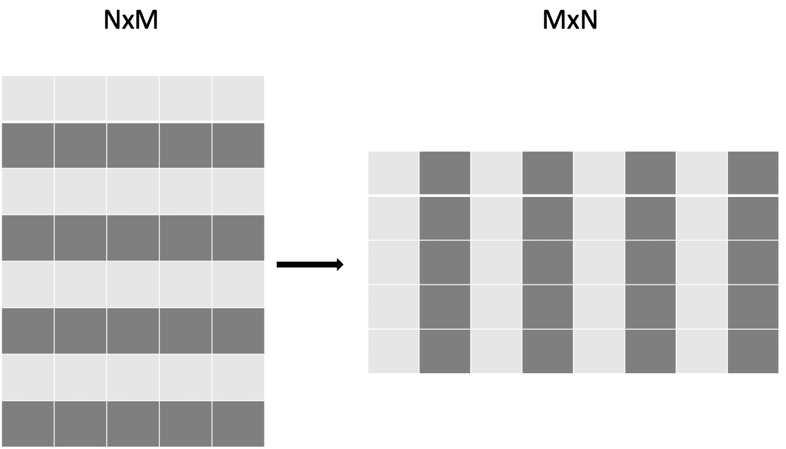
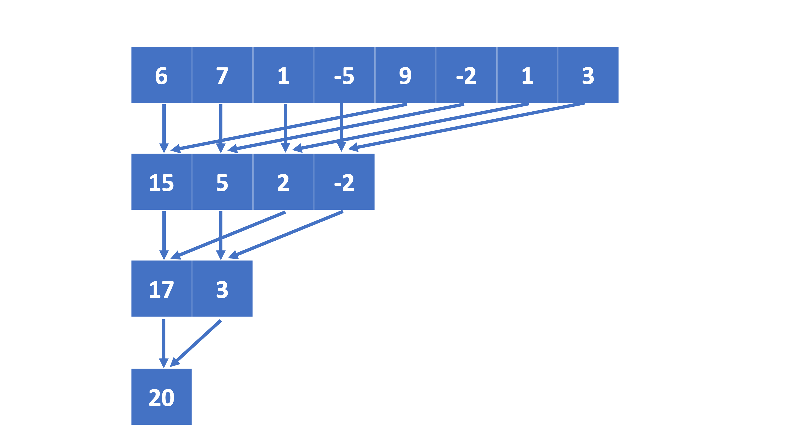
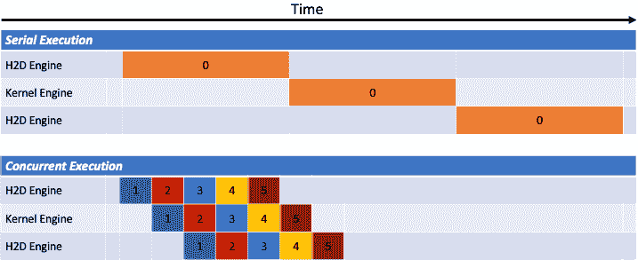

# 基于不可移植内核的模型

> 原文：[`enccs.github.io/gpu-programming/7-non-portable-kernel-models/`](https://enccs.github.io/gpu-programming/7-non-portable-kernel-models/)

*GPU 编程：为什么、何时以及如何？* **   基于不可移植内核的模型

+   [在 GitHub 上编辑](https://github.com/ENCCS/gpu-programming/blob/main/content/7-non-portable-kernel-models.rst)

* * *

问题

+   如何使用 CUDA 和 HIP 编程 GPU？

+   使用 CUDA 和 HIP 编程时，可能进行哪些优化？

目标

+   能够使用 CUDA 和 HIP 编写基本代码

+   理解执行过程以及如何进行优化

讲师备注

+   45 分钟教学

+   30 分钟练习

## 使用 CUDA 和 HIP 进行 GPU 编程的基础知识

与一些面向多个架构的跨平台可移植性生态系统（如 alpaka、Kokkos、OpenCL、RAJA 和 SYCL）不同，CUDA 和 HIP 专注于 GPU。它们提供了广泛的库、API 和编译器工具链，优化了代码在 NVIDIA GPU（在 CUDA 的情况下）和 NVIDIA 及 AMD GPU（在 HIP 的情况下）上的执行。由于它们是由设备制造商开发的，这些编程模型提供了高性能计算能力，并提供了针对 GPU 架构的共享内存、线程同步和内存管理等高级功能。

由 NVIDIA 开发的 CUDA 已经获得了显著的流行度，并被广泛用于 GPU 编程。它提供了一个全面的生态系统，不仅包括 CUDA 编程模型，还包括大量的 GPU 加速库。开发者可以使用 C++编写 CUDA 内核，并将其无缝集成到他们的应用程序中，以利用 GPU 的巨大并行性。

另一方面，HIP 是一个开源项目，旨在提供一个更“可移植”的 GPU 编程接口。它允许开发者使用类似于 CUDA 的语法编写 GPU 代码，并提供一个翻译层，使得相同的代码可以在 NVIDIA 和 AMD GPU 上运行。这种方法最小化了将 CUDA 代码移植到不同 GPU 架构所需的努力，并为开发者提供了针对多个平台的灵活性。

由于与 GPU 硬件紧密相连，CUDA 和 HIP 提供了一种可能无法通过跨平台可移植性生态系统实现的性能优化级别。这些编程模型提供的库和工具链专门设计用于利用底层 GPU 架构的能力，使开发者能够实现高性能。

利用 CUDA 或 HIP 的开发者可以访问一个广泛的 GPU 加速库生态系统，涵盖线性代数、信号处理、图像处理、机器学习等多个领域。这些库高度优化，以利用 GPU 提供的并行性和计算能力，允许开发者加速他们的应用程序，而无需从头实现复杂的算法。

如前所述，CUDA 和 HIP 非常相似，因此同时介绍两者是有意义的。

与可移植内核模型比较

在下面的代码示例中，我们还将展示在可移植的基于内核的框架 Kokkos、SYCL 和 OpenCL 中的示例，这些将在下一集中介绍。

### Hello World

下面是我们对 CUDA 和 HIP 的最基本示例，即“Hello World”程序：

```
#include  <cuda.h>
#include  <cuda_runtime.h>
#include  <stdio.h>

int  main(void)  {
  int  count,  device;

  cudaGetDeviceCount(&count);
  cudaGetDevice(&device);

  printf("Hello! I'm GPU %d out of %d GPUs in total.\n",  device,  count);
  return  0;
} 
```

```
#include  <hip/hip_runtime.h>
#include  <stdio.h>

int  main(void)  {
  int  count,  device;

  hipGetDeviceCount(&count);
  hipGetDevice(&device);

  printf("Hello! I'm GPU %d out of %d GPUs in total.\n",  device,  count);
  return  0;
} 
```

```
#include  <Kokkos_Core.hpp>
#include  <iostream>

int  main()  {
  Kokkos::initialize();

  int  count  =  Kokkos::Cuda().concurrency();
  int  device  =
  Kokkos::Cuda().impl_internal_space_instance()->impl_internal_space_id();

  std::cout  <<  "Hello! I'm GPU "  <<  device  <<  " out of "  <<  count
  <<  " GPUs in total."  <<  std::endl;

  Kokkos::finalize();

  return  0;
} 
```

```
#include  <CL/opencl.h>
#include  <stdio.h>
int  main(void)  {
  cl_uint  count;
  cl_platform_id  platform;
  clGetPlatformIDs(1,  &platform,  NULL);

  cl_device_id  device;
  clGetDeviceIDs(platform,  CL_DEVICE_TYPE_GPU,  1,  &device,  &count);

  char  deviceName[1024];
  clGetDeviceInfo(device,  CL_DEVICE_NAME,  sizeof(deviceName),  deviceName,  NULL);

  printf("Hello! I'm GPU %s out of %d GPUs in total.\n",  deviceName,  count);

  return  0;
} 
```

```
#include  <iostream>
#include  <sycl/sycl.hpp>

int  main()  {
  auto  gpu_devices  =  sycl::device::get_devices(sycl::info::device_type::gpu);
  auto  count  =  gpu_devices.size();
  std::cout  <<  "Hello! I'm using a SYCL device by "
  <<  gpu_devices[0].get_info<sycl::info::device::vendor>()
  <<  ", the first of "  <<  count  <<  " devices."  <<  std::endl;
  return  0;
} 
```

在两个版本中，我们都包含了必要的头文件：CUDA 的 **cuda_runtime.h** 和 **cuda.h**，以及 HIP 的 **hip_runtime.h**。这些头文件提供了 GPU 编程所需的函数。

要检索有关可用设备的信息，我们使用函数 **<cuda/hip>GetDeviceCount** 和 **<cuda/hip>GetDevice**。这些函数允许我们确定 GPU 的总数以及当前使用设备的索引。在代码示例中，我们默认使用设备 0。

作为练习，修改“Hello World”代码以显式使用特定的 GPU。通过使用 **<cuda/hip>SetDevice** 函数来实现，该函数允许设置所需的 GPU 设备。请注意，提供的设备号必须在可用设备范围内，否则程序可能无法运行或产生意外的结果。为了实验不同的 GPU，在检索设备信息之前修改代码以包含以下行：

> ```
> cudaSetDevice(deviceNumber);  // For CUDA
> hipSetDevice(deviceNumber);  // For HIP 
> ```

将 **deviceNumber** 替换为所需的 GPU 设备索引。使用不同的设备号运行代码以观察输出（本课程仓库的 [content/examples/cuda-hip](https://github.com/ENCCS/gpu-programming/tree/main/content/examples/cuda-hip) 子目录中提供了“Hello World”程序的更多示例）。

### 向量加法

为了展示 CUDA/HIP 编程的基本功能，让我们从一项简单的任务开始，即逐元素向量加法。下面的代码片段展示了如何利用 CUDA 和 HIP 高效地执行此操作。

```
#include  <cuda.h>
#include  <cuda_runtime.h>
#include  <math.h>
#include  <stdio.h>

__global__  void  vector_add(float  *A,  float  *B,  float  *C,  int  n)  {
  int  tid  =  threadIdx.x  +  blockIdx.x  *  blockDim.x;
  if  (tid  <  n)  {
  C[tid]  =  A[tid]  +  B[tid];
  }
}

int  main(void)  {
  const  int  N  =  10000;
  float  *Ah,  *Bh,  *Ch,  *Cref;
  float  *Ad,  *Bd,  *Cd;
  int  i;

  // Allocate the arrays on CPU
  Ah  =  (float  *)malloc(N  *  sizeof(float));
  Bh  =  (float  *)malloc(N  *  sizeof(float));
  Ch  =  (float  *)malloc(N  *  sizeof(float));
  Cref  =  (float  *)malloc(N  *  sizeof(float));

  // initialise data and calculate reference values on CPU
  for  (i  =  0;  i  <  N;  i++)  {
  Ah[i]  =  sin(i)  *  2.3;
  Bh[i]  =  cos(i)  *  1.1;
  Cref[i]  =  Ah[i]  +  Bh[i];
  }

  // Allocate the arrays on GPU
  cudaMalloc((void  **)&Ad,  N  *  sizeof(float));
  cudaMalloc((void  **)&Bd,  N  *  sizeof(float));
  cudaMalloc((void  **)&Cd,  N  *  sizeof(float));

  // Transfer the data from CPU to GPU
  cudaMemcpy(Ad,  Ah,  sizeof(float)  *  N,  cudaMemcpyHostToDevice);
  cudaMemcpy(Bd,  Bh,  sizeof(float)  *  N,  cudaMemcpyHostToDevice);

  // define grid dimensions + launch the device kernel
  dim3  blocks,  threads;
  threads  =  dim3(256,  1,  1);
  blocks  =  dim3((N  +  256  -  1)  /  256,  1,  1);

  // Launch Kernel
  vector_add<<<blocks,  threads>>>(Ad,  Bd,  Cd,  N);

  // copy results back to CPU
  cudaMemcpy(Ch,  Cd,  sizeof(float)  *  N,  cudaMemcpyDeviceToHost);

  printf("reference: %f %f %f %f ... %f %f\n",  Cref[0],  Cref[1],  Cref[2],
  Cref[3],  Cref[N  -  2],  Cref[N  -  1]);
  printf("   result: %f %f %f %f ... %f %f\n",  Ch[0],  Ch[1],  Ch[2],  Ch[3],
  Ch[N  -  2],  Ch[N  -  1]);

  // confirm that results are correct
  float  error  =  0.0;
  float  tolerance  =  1e-6;
  float  diff;
  for  (i  =  0;  i  <  N;  i++)  {
  diff  =  fabs(Cref[i]  -  Ch[i]);
  if  (diff  >  tolerance)  {
  error  +=  diff;
  }
  }
  printf("total error: %f\n",  error);
  printf("  reference: %f at (42)\n",  Cref[42]);
  printf("     result: %f at (42)\n",  Ch[42]);

  // Free the GPU arrays
  cudaFree(Ad);
  cudaFree(Bd);
  cudaFree(Cd);

  // Free the CPU arrays
  free(Ah);
  free(Bh);
  free(Ch);
  free(Cref);

  return  0;
} 
```

```
#include  <hip/hip_runtime.h>
#include  <math.h>
#include  <stdio.h>
#include  <stdlib.h>

__global__  void  vector_add(float  *A,  float  *B,  float  *C,  int  n)  {

  int  tid  =  threadIdx.x  +  blockIdx.x  *  blockDim.x;
  if  (tid  <  n)  {
  C[tid]  =  A[tid]  +  B[tid];
  }
}

int  main(void)  {
  const  int  N  =  10000;
  float  *Ah,  *Bh,  *Ch,  *Cref;
  float  *Ad,  *Bd,  *Cd;

  // Allocate the arrays on CPU
  Ah  =  (float  *)malloc(N  *  sizeof(float));
  Bh  =  (float  *)malloc(N  *  sizeof(float));
  Ch  =  (float  *)malloc(N  *  sizeof(float));
  Cref  =  (float  *)malloc(N  *  sizeof(float));

  // initialise data and calculate reference values on CPU
  for  (int  i  =  0;  i  <  N;  i++)  {
  Ah[i]  =  sin(i)  *  2.3;
  Bh[i]  =  cos(i)  *  1.1;
  Cref[i]  =  Ah[i]  +  Bh[i];
  }

  // Allocate the arrays on GPU
  hipMalloc((void  **)&Ad,  N  *  sizeof(float));
  hipMalloc((void  **)&Bd,  N  *  sizeof(float));
  hipMalloc((void  **)&Cd,  N  *  sizeof(float));

  // Transfer the data from CPU to GPU
  hipMemcpy(Ad,  Ah,  sizeof(float)  *  N,  hipMemcpyHostToDevice);
  hipMemcpy(Bd,  Bh,  sizeof(float)  *  N,  hipMemcpyHostToDevice);

  // define grid dimensions + launch the device kernel
  dim3  blocks,  threads;
  threads  =  dim3(256,  1,  1);
  blocks  =  dim3((N  +  256  -  1)  /  256,  1,  1);

  // Launch Kernel
  //  use
  // hipLaunchKernelGGL(vector_add, blocks, threads, 0, 0, Ad, Bd, Cd, N); // or
  vector_add<<<blocks,  threads,  0,  0>>>(Ad,  Bd,  Cd,  N);

  // copy results back to CPU
  hipMemcpy(Ch,  Cd,  sizeof(float)  *  N,  hipMemcpyDeviceToHost);

  printf("reference: %f %f %f %f ... %f %f\n",  Cref[0],  Cref[1],  Cref[2],
  Cref[3],  Cref[N  -  2],  Cref[N  -  1]);
  printf("   result: %f %f %f %f ... %f %f\n",  Ch[0],  Ch[1],  Ch[2],  Ch[3],
  Ch[N  -  2],  Ch[N  -  1]);

  // confirm that results are correct
  float  error  =  0.0;
  float  tolerance  =  1e-6;
  float  diff;
  for  (int  i  =  0;  i  <  N;  i++)  {
  diff  =  abs(Cref[i]  -  Ch[i]);
  if  (diff  >  tolerance)  {
  error  +=  diff;
  }
  }
  printf("total error: %f\n",  error);
  printf("  reference: %f at (42)\n",  Cref[42]);
  printf("     result: %f at (42)\n",  Ch[42]);

  // Free the GPU arrays
  hipFree(Ad);
  hipFree(Bd);
  hipFree(Cd);

  // Free the CPU arrays
  free(Ah);
  free(Bh);
  free(Ch);
  free(Cref);

  return  0;
} 
```

```
// We're using C API here; examples with C++ API can be found in the "Portable
// kernel models" chapter
#include  <CL/cl.h>
#include  <math.h>
#include  <stdio.h>
#include  <stdlib.h>

#define N 10000

static  const  char  *programSource  =
  "__kernel void vector_add(__global const float* A, __global const float* "
  "B, __global float* C, int N) {\n"
  "    int tid = get_global_id(0);\n"
  "    if (tid < N) {\n"
  "        C[tid] = A[tid] + B[tid];\n"
  "    }\n"
  "}\n";

int  main()  {
  // Initialize data and calculate reference values on CPU
  float  Ah[N],  Bh[N],  Ch[N],  Cref[N];
  for  (int  i  =  0;  i  <  N;  i++)  {
  Ah[i]  =  sin(i)  *  2.3f;
  Bh[i]  =  cos(i)  *  1.1f;
  Ch[i]  =  12.f;
  Cref[i]  =  Ah[i]  +  Bh[i];
  }

  // Use the default device
  cl_platform_id  platform;
  clGetPlatformIDs(1,  &platform,  NULL);
  cl_device_id  device;
  clGetDeviceIDs(platform,  CL_DEVICE_TYPE_GPU,  1,  &device,  NULL);
  cl_context  context  =  clCreateContext(NULL,  1,  &device,  NULL,  NULL,  NULL);
  cl_command_queue  queue  =  clCreateCommandQueue(context,  device,  0,  NULL);

  // Build the kernel from string
  cl_program  program  =
  clCreateProgramWithSource(context,  1,  &programSource,  NULL,  NULL);
  clBuildProgram(program,  1,  &device,  NULL,  NULL,  NULL);
  cl_kernel  kernel  =  clCreateKernel(program,  "vector_add",  NULL);

  // Allocate the arrays on GPU
  cl_mem  d_A  =
  clCreateBuffer(context,  CL_MEM_READ_ONLY,  N  *  sizeof(float),  NULL,  NULL);
  cl_mem  d_B  =
  clCreateBuffer(context,  CL_MEM_READ_ONLY,  N  *  sizeof(float),  NULL,  NULL);
  cl_mem  d_C  =
  clCreateBuffer(context,  CL_MEM_WRITE_ONLY,  N  *  sizeof(float),  NULL,  NULL);

  clEnqueueWriteBuffer(queue,  d_A,  CL_TRUE,  0,  N  *  sizeof(float),  Ah,  0,  NULL,
  NULL);
  clEnqueueWriteBuffer(queue,  d_B,  CL_TRUE,  0,  N  *  sizeof(float),  Bh,  0,  NULL,
  NULL);

  // Set arguments and launch the kernel
  clSetKernelArg(kernel,  0,  sizeof(cl_mem),  &d_A);
  clSetKernelArg(kernel,  1,  sizeof(cl_mem),  &d_B);
  clSetKernelArg(kernel,  2,  sizeof(cl_mem),  &d_C);
  cl_int  N_as_cl_int  =  N;
  clSetKernelArg(kernel,  3,  sizeof(cl_int),  &N_as_cl_int);
  size_t  globalSize  =  N;
  clEnqueueNDRangeKernel(queue,  kernel,  1,  NULL,  &globalSize,  NULL,  0,  NULL,
  NULL);

  // Copy the results back
  clEnqueueReadBuffer(queue,  d_C,  CL_TRUE,  0,  N  *  sizeof(float),  Ch,  0,  NULL,
  NULL);

  // Print reference and result values
  printf("Reference: %f %f %f %f ... %f %f\n",  Cref[0],  Cref[1],  Cref[2],
  Cref[3],  Cref[N  -  2],  Cref[N  -  1]);
  printf("Result   : %f %f %f %f ... %f %f\n",  Ch[0],  Ch[1],  Ch[2],  Ch[3],
  Ch[N  -  2],  Ch[N  -  1]);

  // Compare results and calculate the total error
  float  error  =  0.0f;
  float  tolerance  =  1e-6f;
  for  (int  i  =  0;  i  <  N;  i++)  {
  float  diff  =  fabs(Cref[i]  -  Ch[i]);
  if  (diff  >  tolerance)  {
  error  +=  diff;
  }
  }

  printf("Total error: %f\n",  error);
  printf("Reference:   %f at (42)\n",  Cref[42]);
  printf("Result   :   %f at (42)\n",  Ch[42]);

  clReleaseMemObject(d_A);
  clReleaseMemObject(d_B);
  clReleaseMemObject(d_C);
  clReleaseKernel(kernel);
  clReleaseProgram(program);
  clReleaseCommandQueue(queue);
  clReleaseContext(context);

  return  0;
} 
```

```
#include  <iostream>
#include  <sycl/sycl.hpp>

int  main()  {
  const  int  N  =  10000;
  // The queue will be executed on the best device in the system
  // We use in-order queue for simplicity
  sycl::queue  q{{sycl::property::queue::in_order()}};

  std::vector<float>  Ah(N);
  std::vector<float>  Bh(N);
  std::vector<float>  Ch(N);
  std::vector<float>  Cref(N);

  // Initialize data and calculate reference values on CPU
  for  (int  i  =  0;  i  <  N;  i++)  {
  Ah[i]  =  std::sin(i)  *  2.3f;
  Bh[i]  =  std::cos(i)  *  1.1f;
  Cref[i]  =  Ah[i]  +  Bh[i];
  }

  // Allocate the arrays on GPU
  float  *Ad  =  sycl::malloc_device<float>(N,  q);
  float  *Bd  =  sycl::malloc_device<float>(N,  q);
  float  *Cd  =  sycl::malloc_device<float>(N,  q);

  q.copy<float>(Ah.data(),  Ad,  N);
  q.copy<float>(Bh.data(),  Bd,  N);

  // Define grid dimensions
  // We can specify the block size explicitly, but we don't have to
  sycl::range<1>  global_size(N);
  q.submit(&  {
  h.parallel_for<class  VectorAdd>(global_size,  =  {
  int  tid  =  threadId.get(0);
  Cd[tid]  =  Ad[tid]  +  Bd[tid];
  });
  });

  // Copy results back to CPU
  sycl::event  eventCCopy  =  q.copy<float>(Cd,  Ch.data(),  N);
  // Wait for the copy to finish
  eventCCopy.wait();

  // Print reference and result values
  std::cout  <<  "Reference: "  <<  Cref[0]  <<  " "  <<  Cref[1]  <<  " "  <<  Cref[2]
  <<  " "  <<  Cref[3]  <<  " ... "  <<  Cref[N  -  2]  <<  " "  <<  Cref[N  -  1]
  <<  std::endl;
  std::cout  <<  "Result   : "  <<  Ch[0]  <<  " "  <<  Ch[1]  <<  " "  <<  Ch[2]  <<  " "
  <<  Ch[3]  <<  " ... "  <<  Ch[N  -  2]  <<  " "  <<  Ch[N  -  1]  <<  std::endl;

  // Compare results and calculate the total error
  float  error  =  0.0f;
  float  tolerance  =  1e-6f;
  for  (int  i  =  0;  i  <  N;  i++)  {
  float  diff  =  std::abs(Cref[i]  -  Ch[i]);
  if  (diff  >  tolerance)  {
  error  +=  diff;
  }
  }

  std::cout  <<  "Total error: "  <<  error  <<  std::endl;
  std::cout  <<  "Reference:   "  <<  Cref[42]  <<  " at (42)"  <<  std::endl;
  std::cout  <<  "Result   :   "  <<  Ch[42]  <<  " at (42)"  <<  std::endl;

  // Free the GPU memory
  sycl::free(Ad,  q);
  sycl::free(Bd,  q);
  sycl::free(Cd,  q);

  return  0;
} 
```

在这种情况下，CUDA 和 HIP 代码是逐个对应的，因此我们只参考 CUDA 版本。CUDA 和 HIP 编程模型是主机中心编程模型。主程序在 CPU 上执行并控制所有操作、内存分配、CPU 和 GPU 之间的数据传输，并启动在 GPU 上执行的内核。代码从定义具有 **___global__** 属性的 GPU 内核函数 **vector_add** 开始。它包含三个输入数组 A、B 和 C 以及数组大小 n。内核函数包含实际上在 GPU 上由多个线程并行执行的代码。

通常，加速器（尤其是 GPU）都有自己的专用内存，与系统内存分开（AMD MI300A 是一个例外，它使用相同的内存为 CPU 和 GPU）。当为 GPU 编程时，涉及两组指针，并且需要管理主机内存和加速器内存之间的数据移动。在加速器处理之前，数据需要显式地从主机内存复制到加速器内存。同样，结果或修改后的数据可能需要从加速器内存复制回主机内存，以便使它们对 CPU 可访问。

代码中的主函数在 CPU 上初始化输入数组 Ah、Bh，并计算参考数组 Cref。然后使用 **cudaMalloc** 在 GPU 上为输入和输出数组 Ad、Bd、Cd 分配内存。在这里，h 代表 ‘host’（CPU），d 代表 ‘device’（GPU）。数据使用 hipMemcpy 从 CPU 传输到 GPU，然后使用 <<<.>>> 语法启动 GPU 内核。所有启动的内核都是异步的。启动后，控制权返回到 main()，代码继续执行下一行指令。

在内核执行后，使用 **cudaMemcpy** 将结果数组 Cd 复制回 CPU。然后代码打印参考和结果数组，通过比较参考和结果数组来计算误差。最后，使用 **cudaFree** 和 **free** 函数分别释放 GPU 和 CPU 内存。

主机函数 **cudaSetDevice**、**cudaMalloc**、**cudaMemcpy** 和 **cudaFree** 是阻塞的，即代码不会继续执行到下一行指令，直到操作完成。然而，这并非默认行为，对于许多操作，存在异步等效操作，以及许多库调用在调用后返回控制权到 main()。这允许开发者启动独立操作并将它们重叠。

简而言之，此代码演示了如何利用 CUDA 和 HIP 在 GPU 上执行向量加法，展示了涉及分配内存、在 CPU 和 GPU 之间传输数据、启动内核函数和处理结果的步骤。它作为使用 CUDA 和 HIP 进行 GPU 加速计算的起点。有关向量（数组）加法程序的更多示例，请参阅 [content/examples](https://github.com/ENCCS/gpu-programming/tree/main/content/examples)。

为了实践上述概念，请编辑存储库中的骨架代码以及与设置设备、内存分配和传输、内核执行相对应的代码。

### 使用统一内存的向量加法

对于一段时间了，GPU 已经支持统一内存，这允许使用相同的指针来访问 CPU 和 GPU 数据。这通过消除显式的数据传输简化了代码的开发。数据驻留在 CPU 上，直到需要在 GPU 上使用，反之亦然。然而，数据传输仍然“在幕后”发生，开发者需要构建代码以避免不必要的传输。下面可以看到修改后的向量加法代码：

```
#include  <cuda.h>
#include  <cuda_runtime.h>
#include  <math.h>
#include  <stdio.h>

__global__  void  vector_add(float  *A,  float  *B,  float  *C,  int  n)  {
  int  tid  =  threadIdx.x  +  blockIdx.x  *  blockDim.x;
  if  (tid  <  n)  {
  C[tid]  =  A[tid]  +  B[tid];
  }
}

int  main(void)  {
  const  int  N  =  10000;
  float  *Ah,  *Bh,  *Ch,  *Cref;
  int  i;

  // Allocate the arrays using Unified Memory
  cudaMallocManaged(&Ah,  N  *  sizeof(float));
  cudaMallocManaged(&Bh,  N  *  sizeof(float));
  cudaMallocManaged(&Ch,  N  *  sizeof(float));
  cudaMallocManaged(&Cref,  N  *  sizeof(float));

  // initialise data and calculate reference values on CPU
  for  (i  =  0;  i  <  N;  i++)  {
  Ah[i]  =  sin(i)  *  2.3;
  Bh[i]  =  cos(i)  *  1.1;
  Cref[i]  =  Ah[i]  +  Bh[i];
  }

  // define grid dimensions
  dim3  blocks,  threads;
  threads  =  dim3(256,  1,  1);
  blocks  =  dim3((N  +  256  -  1)  /  256,  1,  1);

  // Launch Kernel
  vector_add<<<blocks,  threads>>>(Ah,  Bh,  Ch,  N);
  cudaDeviceSynchronize();  // Wait for the kernel to complete

  // At this point we want to access the data on CPU
  printf("reference: %f %f %f %f ... %f %f\n",  Cref[0],  Cref[1],  Cref[2],
  Cref[3],  Cref[N  -  2],  Cref[N  -  1]);
  printf("   result: %f %f %f %f ... %f %f\n",  Ch[0],  Ch[1],  Ch[2],  Ch[3],
  Ch[N  -  2],  Ch[N  -  1]);

  // confirm that results are correct
  float  error  =  0.0;
  float  tolerance  =  1e-6;
  float  diff;
  for  (i  =  0;  i  <  N;  i++)  {
  diff  =  fabs(Cref[i]  -  Ch[i]);
  if  (diff  >  tolerance)  {
  error  +=  diff;
  }
  }
  printf("total error: %f\n",  error);
  printf("  reference: %f at (42)\n",  Cref[42]);
  printf("     result: %f at (42)\n",  Ch[42]);

  // Free the GPU arrays
  cudaFree(Ah);
  cudaFree(Bh);
  cudaFree(Ch);
  cudaFree(Cref);

  return  0;
} 
```

```
#include  <hip/hip_runtime.h>
#include  <math.h>
#include  <stdio.h>

__global__  void  vector_add(float  *A,  float  *B,  float  *C,  int  n)  {
  int  tid  =  threadIdx.x  +  blockIdx.x  *  blockDim.x;
  if  (tid  <  n)  {
  C[tid]  =  A[tid]  +  B[tid];
  }
}

int  main(void)  {
  const  int  N  =  10000;
  float  *Ah,  *Bh,  *Ch,  *Cref;
  // Allocate the arrays using Unified Memory
  hipMallocManaged((void  **)&Ah,  N  *  sizeof(float));
  hipMallocManaged((void  **)&Bh,  N  *  sizeof(float));
  hipMallocManaged((void  **)&Ch,  N  *  sizeof(float));
  hipMallocManaged((void  **)&Cref,  N  *  sizeof(float));

  // Initialize data and calculate reference values on CPU
  for  (int  i  =  0;  i  <  N;  i++)  {
  Ah[i]  =  sin(i)  *  2.3;
  Bh[i]  =  cos(i)  *  1.1;
  Cref[i]  =  Ah[i]  +  Bh[i];
  }
  // All data at this point is on CPU

  // Define grid dimensions + launch the device kernel
  dim3  blocks,  threads;
  threads  =  dim3(256,  1,  1);
  blocks  =  dim3((N  +  256  -  1)  /  256,  1,  1);

  // Launch Kernel
  //  use
  // hipLaunchKernelGGL(vector_add, blocks, threads, 0, 0, Ah, Bh, Ch, N); // or
  vector_add<<<blocks,  threads>>>(Ah,  Bh,  Ch,  N);
  hipDeviceSynchronize();  // Wait for the kernel to complete

  // At this point we want to access the data on the CPU
  printf("reference: %f %f %f %f ... %f %f\n",  Cref[0],  Cref[1],  Cref[2],
  Cref[3],  Cref[N  -  2],  Cref[N  -  1]);
  printf("   result: %f %f %f %f ... %f %f\n",  Ch[0],  Ch[1],  Ch[2],  Ch[3],
  Ch[N  -  2],  Ch[N  -  1]);

  // Confirm that results are correct
  float  error  =  0.0;
  float  tolerance  =  1e-6;
  float  diff;
  for  (int  i  =  0;  i  <  N;  i++)  {
  diff  =  fabs(Cref[i]  -  Ch[i]);
  if  (diff  >  tolerance)  {
  error  +=  diff;
  }
  }
  printf("total error: %f\n",  error);
  printf("  reference: %f at (42)\n",  Cref[42]);
  printf("     result: %f at (42)\n",  Ch[42]);

  // Free the Unified Memory arrays
  hipFree(Ah);
  hipFree(Bh);
  hipFree(Ch);
  hipFree(Cref);

  return  0;
} 
```

```
#include  <iostream>
#include  <sycl/sycl.hpp>

int  main()  {
  const  int  N  =  10000;
  // The queue will be executed on the best device in the system
  // We use in-order queue for simplicity
  sycl::queue  q{{sycl::property::queue::in_order()}};

  std::vector<float>  Cref(N);

  // Allocate the shared arrays
  float  *A  =  sycl::malloc_shared<float>(N,  q);
  float  *B  =  sycl::malloc_shared<float>(N,  q);
  float  *C  =  sycl::malloc_shared<float>(N,  q);

  // Initialize data and calculate reference values on CPU
  for  (int  i  =  0;  i  <  N;  i++)  {
  A[i]  =  std::sin(i)  *  2.3f;
  B[i]  =  std::cos(i)  *  1.1f;
  Cref[i]  =  A[i]  +  B[i];
  }

  // Define grid dimensions
  // We can specify the block size explicitly, but we don't have to
  sycl::range<1>  global_size(N);
  q.submit(&  {
  h.parallel_for<class  VectorAdd>(global_size,  =  {
  int  tid  =  threadId.get(0);
  C[tid]  =  A[tid]  +  B[tid];
  });
  }).wait();  // Wait for the kernel to finish

  // Print reference and result values
  std::cout  <<  "Reference: "  <<  Cref[0]  <<  " "  <<  Cref[1]  <<  " "  <<  Cref[2]
  <<  " "  <<  Cref[3]  <<  " ... "  <<  Cref[N  -  2]  <<  " "  <<  Cref[N  -  1]
  <<  std::endl;
  std::cout  <<  "Result   : "  <<  C[0]  <<  " "  <<  C[1]  <<  " "  <<  C[2]  <<  " "
  <<  C[3]  <<  " ... "  <<  C[N  -  2]  <<  " "  <<  C[N  -  1]  <<  std::endl;

  // Compare results and calculate the total error
  float  error  =  0.0f;
  float  tolerance  =  1e-6f;
  for  (int  i  =  0;  i  <  N;  i++)  {
  float  diff  =  std::abs(Cref[i]  -  C[i]);
  if  (diff  >  tolerance)  {
  error  +=  diff;
  }
  }

  std::cout  <<  "Total error: "  <<  error  <<  std::endl;
  std::cout  <<  "Reference:   "  <<  Cref[42]  <<  " at (42)"  <<  std::endl;
  std::cout  <<  "Result   :   "  <<  C[42]  <<  " at (42)"  <<  std::endl;

  // Free the shared memory
  sycl::free(A,  q);
  sycl::free(B,  q);
  sycl::free(C,  q);

  return  0;
} 
```

现在，数组 Ah、Bh、Ch 和 Cref 使用 cudaMallocManaged 来分配统一内存。**向量加法内核**通过传递这些统一内存指针直接启动。内核启动后，使用**cudaDeviceSynchronize**等待内核完成执行。最后，使用**cudaFree**释放统一内存数组。统一内存允许在 CPU 和 GPU 之间透明地迁移数据，消除了显式数据传输的需要。

作为练习，修改向量加法的骨架代码以使用统一内存。

基础 - 简而言之

+   CUDA 由 NVIDIA 开发，而 HIP 是 AMD 的一个开源项目（用于多平台 GPU 编程）。

+   CUDA 和 HIP 是针对 NVIDIA 和 AMD GPU 上优化代码执行的 GPU-focused 编程模型。

+   CUDA 和 HIP 相似，允许开发者使用类似于 CUDA 的语法编写 GPU 代码，并针对多个平台进行目标定位。

+   CUDA 和 HIP 是仅针对 GPU 的编程模型。

+   CUDA 和 HIP 提供了针对 GPU 架构的高性能计算能力和高级功能，例如共享内存和内存管理。

+   它们提供了在各个领域（如线性代数、信号处理、图像处理和机器学习）中高度 GPU 加速的库。

+   为 GPU 编程涉及在主机和加速器内存之间管理数据移动。

+   统一内存通过使用相同的指针来简化 CPU 和 GPU 数据之间的数据传输，但代码优化仍然是必要的。

## 内存优化

向量加法是一个相对简单、直接的案例。每个线程从内存中读取数据，进行加法运算，然后将结果保存。两个相邻的线程访问内存中彼此靠近的位置。此外，数据只使用一次。在实践中，情况并非如此。有时，相同的数据被多次使用，导致额外的内存访问。

内存优化是用于高效使用 GPU 的最重要类型的优化之一。在探讨实际操作之前，让我们回顾一下关于 GPU 和执行模型的一些基本概念。

GPU 由许多轻量级核心组成，在 CUDA 中称为流处理器（SP），它们在物理上以单元的形式组合在一起，即 CUDA 架构中的流多处理器（SMP）（注意，在 AMD 中，等效的部分称为计算单元，而在英特尔 GPU 中，它们称为执行单元）。GPU 上的工作是通过启动许多线程来完成的，每个线程执行相同内核的一个实例。执行顺序未定义，线程只能在特定条件下交换信息。由于 SPs 的组合方式，线程也被组合成**块**。每个**块**被分配给一个 SMP，并且不能分割。一个 SMP 可以同时容纳多个块，然而不同块之间的线程没有通信。除了 SPs 之外，每个 SMP 还包含非常快速的内存，在 CUDA 中称为共享内存。块中的线程可以读写共享内存，并将其用作用户控制的缓存。例如，一个线程可以写入共享内存中的某个位置，而同一块中的另一个线程可以读取并使用这些数据。为了确保块中的所有线程都完成了写入，必须使用**__syncthreads()**函数来使块中的线程等待，直到它们都到达内核中的特定位置。在 GPU 编程模型中另一个重要方面是，块中的线程不是独立执行的。在 NVIDIA 设备中，块中的线程以大小为 32 的 warp 形式物理组合，在 AMD 设备中，以大小为 32 或 64 的 wavefront 形式组合（取决于设备架构）。英特尔设备值得注意的是，warp 的大小，称为 SIMD 宽度，可以高度配置，典型的可能值为 8、16 或 32（取决于硬件）。所有全局 GPU 内存的内存访问都是按 warp 进行的。当需要某些计算的数据时，warp 从 GPU 内存中加载特定大小的块（64 或 128 字节）。这些操作非常昂贵，具有数百个周期的延迟。这意味着 warp 中的线程应该与内存中位置接近的数据元素一起工作。在向量加法中，两个相邻的线程，索引为 tid 和 tid+1，访问 GPU 内存中相邻的元素。

共享内存可以通过两种方式来提高性能。当同一块中的多个线程需要相同的数据时，可以避免从内存中进行额外的读取（参见[stencil](https://github.com/ENCCS/gpu-programming/tree/main/content/examples/stencil)代码）或者它可以用来改进内存访问模式，如矩阵转置的情况。

内存、执行 - 简要来说

+   GPU 由流处理器（SPs）组成，这些处理器以单元的形式组合在一起，例如在 CUDA 架构中的流多处理器（SMPs）。

+   在 GPU 上进行的操作是通过启动线程来完成的，每个线程执行相同内核的一个实例，执行顺序未定义。

+   线程被组织成块，分配给 SMP，并且不能被分割，并且不同块之间的线程没有通信。

+   每个 SMP 包含共享内存，它作为块内线程的用户可控缓存，允许高效的数据共享和同步。

+   共享内存可以用来避免当同一块中的多个线程需要相同数据时进行额外的内存读取，或者改善内存访问模式，例如在矩阵转置操作中。

+   从全局 GPU 内存进行的内存访问是按 warp（线程组）进行的，从 GPU 内存加载数据具有高延迟。

+   为了优化内存访问，线程组内的线程应该与内存中的相邻元素一起工作，以减少延迟。

+   正确利用共享内存可以通过减少内存读取和增强内存访问模式来提高性能。

### 矩阵转置

矩阵转置是一个共享内存可以显著提高性能的经典例子。使用共享内存减少了全局内存访问，并利用了共享内存的高带宽和低延迟。



首先，我们使用一个简单的内核作为参考，该内核将数据从一个数组复制到另一个数组。

```
#include  <cstdlib>
#include  <cuda.h>
#include  <cuda_runtime.h>
#include  <math.h>
#include  <stdio.h>
#include  <vector>

const  static  int  width  =  4096;
const  static  int  height  =  4096;
const  static  int  tile_dim  =  16;

__global__  void  copy_kernel(float  *in,  float  *out,  int  width,  int  height)  {
  int  x_index  =  blockIdx.x  *  tile_dim  +  threadIdx.x;
  int  y_index  =  blockIdx.y  *  tile_dim  +  threadIdx.y;

  int  index  =  y_index  *  width  +  x_index;

  out[index]  =  in[index];
}

int  main()  {
  std::vector<float>  matrix_in;
  std::vector<float>  matrix_out;

  matrix_in.resize(width  *  height);
  matrix_out.resize(width  *  height);

  for  (int  i  =  0;  i  <  width  *  height;  i++)  {
  matrix_in[i]  =  (float)rand()  /  (float)RAND_MAX;
  }

  float  *d_in,  *d_out;

  cudaMalloc((void  **)&d_in,  width  *  height  *  sizeof(float));
  cudaMalloc((void  **)&d_out,  width  *  height  *  sizeof(float));

  cudaMemcpy(d_in,  matrix_in.data(),  width  *  height  *  sizeof(float),
  cudaMemcpyHostToDevice);

  printf("Setup complete. Launching kernel \n");
  int  block_x  =  width  /  tile_dim;
  int  block_y  =  height  /  tile_dim;

  // Create events
  cudaEvent_t  start_kernel_event;
  cudaEventCreate(&start_kernel_event);
  cudaEvent_t  end_kernel_event;
  cudaEventCreate(&end_kernel_event);

  printf("Warm up the gpu!\n");
  for  (int  i  =  1;  i  <=  10;  i++)  {
  copy_kernel<<<dim3(block_x,  block_y),  dim3(tile_dim,  tile_dim)>>>(
  d_in,  d_out,  width,  height);
  }

  cudaEventRecord(start_kernel_event,  0);

  for  (int  i  =  1;  i  <=  10;  i++)  {
  copy_kernel<<<dim3(block_x,  block_y),  dim3(tile_dim,  tile_dim)>>>(
  d_in,  d_out,  width,  height);
  }

  cudaEventRecord(end_kernel_event,  0);
  cudaEventSynchronize(end_kernel_event);

  cudaDeviceSynchronize();
  float  time_kernel;
  cudaEventElapsedTime(&time_kernel,  start_kernel_event,  end_kernel_event);

  printf("Kernel execution complete \n");
  printf("Event timings:\n");
  printf("  %.6f ms - copy \n Bandwidth %.6f GB/s\n",  time_kernel  /  10,
  2.0  *  10000  *  (((double)(width)  *  (double)height)  *  sizeof(float))  /
  (time_kernel  *  1024  *  1024  *  1024));

  cudaMemcpy(matrix_out.data(),  d_out,  width  *  height  *  sizeof(float),
  cudaMemcpyDeviceToHost);

  return  0;
} 
```

```
#include  <hip/hip_runtime.h>

#include  <cstdlib>
#include  <vector>

const  static  int  width  =  4096;
const  static  int  height  =  4096;
const  static  int  tile_dim  =  16;

__global__  void  copy_kernel(float  *in,  float  *out,  int  width,  int  height)  {
  int  x_index  =  blockIdx.x  *  tile_dim  +  threadIdx.x;
  int  y_index  =  blockIdx.y  *  tile_dim  +  threadIdx.y;

  int  index  =  y_index  *  width  +  x_index;

  out[index]  =  in[index];
}

int  main()  {
  std::vector<float>  matrix_in;
  std::vector<float>  matrix_out;

  matrix_in.resize(width  *  height);
  matrix_out.resize(width  *  height);

  for  (int  i  =  0;  i  <  width  *  height;  i++)  {
  matrix_in[i]  =  (float)rand()  /  (float)RAND_MAX;
  }

  float  *d_in,  *d_out;

  hipMalloc((void  **)&d_in,  width  *  height  *  sizeof(float));
  hipMalloc((void  **)&d_out,  width  *  height  *  sizeof(float));

  hipMemcpy(d_in,  matrix_in.data(),  width  *  height  *  sizeof(float),
  hipMemcpyHostToDevice);

  printf("Setup complete. Launching kernel \n");
  int  block_x  =  width  /  tile_dim;
  int  block_y  =  height  /  tile_dim;

  // Create events
  hipEvent_t  start_kernel_event;
  hipEventCreate(&start_kernel_event);
  hipEvent_t  end_kernel_event;
  hipEventCreate(&end_kernel_event);

  printf("Warm up the gpu!\n");
  for  (int  i  =  1;  i  <=  10;  i++)  {
  copy_kernel<<<dim3(block_x,  block_y),  dim3(tile_dim,  tile_dim)>>>(
  d_in,  d_out,  width,  height);
  }

  hipEventRecord(start_kernel_event,  0);

  for  (int  i  =  1;  i  <=  10;  i++)  {
  copy_kernel<<<dim3(block_x,  block_y),  dim3(tile_dim,  tile_dim)>>>(
  d_in,  d_out,  width,  height);
  }

  hipEventRecord(end_kernel_event,  0);
  hipEventSynchronize(end_kernel_event);

  hipDeviceSynchronize();
  float  time_kernel;
  hipEventElapsedTime(&time_kernel,  start_kernel_event,  end_kernel_event);

  printf("Kernel execution complete \n");
  printf("Event timings:\n");
  printf("  %.6f ms - copy \n Bandwidth %.6f GB/s\n",  time_kernel  /  10,
  2.0  *  10000  *  (((double)(width)  *  (double)height)  *  sizeof(float))  /
  (time_kernel  *  1024  *  1024  *  1024));

  hipMemcpy(matrix_out.data(),  d_out,  width  *  height  *  sizeof(float),
  hipMemcpyDeviceToHost);

  return  0;
} 
```

```
#include  <sycl/sycl.hpp>
#include  <vector>

const  static  int  width  =  4096;
const  static  int  height  =  4096;
const  static  int  tile_dim  =  16;

// Instead of defining kernel lambda at the place of submission,
// we can define it here:
auto  copyKernel(const  float  *in,  float  *out,  int  width,  int  height)  {
  return  =  {
  int  x_index  =  item.get_global_id(1);
  int  y_index  =  item.get_global_id(0);
  int  index  =  y_index  *  width  +  x_index;
  out[index]  =  in[index];
  };
}

int  main()  {
  std::vector<float>  matrix_in(width  *  height);
  std::vector<float>  matrix_out(width  *  height);

  for  (int  i  =  0;  i  <  width  *  height;  i++)  {
  matrix_in[i]  =  (float)rand()  /  (float)RAND_MAX;
  }

  // Create queue on the default device with profiling enabled
  sycl::queue  queue{{sycl::property::queue::in_order(),
  sycl::property::queue::enable_profiling()}};

  float  *d_in  =  sycl::malloc_device<float>(width  *  height,  queue);
  float  *d_out  =  sycl::malloc_device<float>(width  *  height,  queue);

  queue.copy<float>(matrix_in.data(),  d_in,  width  *  height);
  queue.wait();

  printf("Setup complete. Launching kernel\n");
  sycl::range<2>  global_size{height,  width},  local_size{tile_dim,  tile_dim};
  sycl::nd_range<2>  kernel_range{global_size,  local_size};

  // Create events
  printf("Warm up the GPU!\n");
  for  (int  i  =  0;  i  <  10;  i++)  {
  queue.submit(&  {
  cgh.parallel_for(kernel_range,  copyKernel(d_in,  d_out,  width,  height));
  });
  }

  // Unlike in CUDA or HIP, for SYCL we have to store all events
  std::vector<sycl::event>  kernel_events;
  for  (int  i  =  0;  i  <  10;  i++)  {
  sycl::event  kernel_event  =  queue.submit(&  {
  cgh.parallel_for(kernel_range,  copyKernel(d_in,  d_out,  width,  height));
  });
  kernel_events.push_back(kernel_event);
  }

  queue.wait();

  auto  first_kernel_started  =
  kernel_events.front()
  .get_profiling_info<sycl::info::event_profiling::command_start>();
  auto  last_kernel_ended  =
  kernel_events.back()
  .get_profiling_info<sycl::info::event_profiling::command_end>();
  double  total_kernel_time_ns  =
  static_cast<double>(last_kernel_ended  -  first_kernel_started);
  double  time_kernels  =  total_kernel_time_ns  /  1e6;  // convert ns to ms
  double  bandwidth  =  2.0  *  10000  *
  (((double)(width)  *  (double)height)  *  sizeof(float))  /
  (time_kernels  *  1024  *  1024  *  1024);

  printf("Kernel execution complete\n");
  printf("Event timings:\n");
  printf("  %.6lf ms - copy\n Bandwidth %.6lf GB/s\n",  time_kernels  /  10,
  bandwidth);

  sycl::free(d_in,  queue);
  sycl::free(d_out,  queue);
  return  0;
} 
```

我们注意到这段代码没有进行任何计算。每个线程读取一个元素，然后将其写入另一个位置。通过测量内核的执行时间，我们可以计算出该内核的有效带宽。我们可以使用**rocprof**或**cuda/hip events**来测量时间。在 NVIDIA V100 GPU 上，此代码实现了 717 GB/s，理论峰值 900 GB/s。

现在我们进行代码的第一轮迭代，一个简单的转置。读取具有很好的归约访问模式，但写入现在非常低效。

```
__global__  void  transpose_naive_kernel(float  *in,  float  *out,  int  width,
  int  height)  {
  int  x_index  =  blockIdx.x  *  tile_dim  +  threadIdx.x;
  int  y_index  =  blockIdx.y  *  tile_dim  +  threadIdx.y;

  int  in_index  =  y_index  *  width  +  x_index;
  int  out_index  =  x_index  *  height  +  y_index;

  out[out_index]  =  in[in_index];
} 
```

```
auto  transposeKernelNaive(const  float  *in,  float  *out,  int  width,  int  height)  {
  return  =  {
  int  x_index  =  item.get_global_id(1);
  int  y_index  =  item.get_global_id(0);
  int  in_index  =  y_index  *  width  +  x_index;
  int  out_index  =  x_index  *  height  +  y_index;
  out[out_index]  =  in[in_index];
  };
} 
```

检查索引 in_index，我们看到两个相邻的线程（threadIx.x，threadIdx.x+1）访问内存中的相邻位置。然而，写入操作不是这样的。线程以步进方式访问数据。两个相邻的线程访问的数据之间相隔 height 个元素。这实际上导致了 32 次内存操作，但由于底层的优化，实现的带宽为 311 GB/s。

我们可以通过以归约的方式读取数据，逐行将其保存到共享内存中，然后按列写入全局内存来改进代码。

> ```
> __global__  void  transpose_SM_kernel(float  *in,  float  *out,  int  width,
>   int  height)  {
>   __shared__  float  tile[tile_dim][tile_dim];
> 
>   int  x_tile_index  =  blockIdx.x  *  tile_dim;
>   int  y_tile_index  =  blockIdx.y  *  tile_dim;
> 
>   int  in_index  =
>   (y_tile_index  +  threadIdx.y)  *  width  +  (x_tile_index  +  threadIdx.x);
>   int  out_index  =
>   (x_tile_index  +  threadIdx.y)  *  height  +  (y_tile_index  +  threadIdx.x);
> 
>   tile[threadIdx.y][threadIdx.x]  =  in[in_index];
> 
>   __syncthreads();
> 
>   out[out_index]  =  tile[threadIdx.x][threadIdx.y];
> } 
> ```
> 
> ```
> auto  transposeKernelSM(sycl::handler  &cgh,  const  float  *in,  float  *out,
>   int  width,  int  height)  {
>   sycl::local_accessor<float,  1>  tile{{tile_dim  *  tile_dim},  cgh};
>   return  =  {
>   int  x_tile_index  =  item.get_group(1)  *  tile_dim;
>   int  y_tile_index  =  item.get_group(0)  *  tile_dim;
>   int  x_local_index  =  item.get_local_id(1);
>   int  y_local_index  =  item.get_local_id(0);
>   int  in_index  =
>   (y_tile_index  +  y_local_index)  *  width  +  (x_tile_index  +  x_local_index);
>   int  out_index  =
>   (x_tile_index  +  y_local_index)  *  width  +  (y_tile_index  +  x_local_index);
> 
>   tile[y_local_index  *  tile_dim  +  x_local_index]  =  in[in_index];
>   item.barrier();
>   out[out_index]  =  tile[x_local_index  *  tile_dim  +  y_local_index];
>   };
> } 
> ```

我们定义一个**tile_dim**常量来确定共享内存块的大小。矩阵转置内核使用一个二维线程块网格，其中每个线程块操作输入矩阵的 tile_dim x tile_dim 块。

内核首先将全局内存中的数据加载到共享内存块中。每个线程从输入矩阵中加载单个元素到共享内存块中。然后，一个**__syncthreads()**屏障确保所有线程在继续之前已经将数据加载到共享内存中。

接下来，内核将共享内存瓷砖中的转置数据写回全局内存中的输出矩阵。每个线程将共享内存瓷砖中的一个元素写入输出矩阵。通过使用共享内存，这种优化实现减少了全局内存访问并利用了内存归约，与简单的转置实现相比，性能得到提升。

此内核在 NVIDIA V100 上达到了 674 GB/s。

这几乎达到了简单复制内核所达到的带宽，但还有一点可以改进。

共享内存由银行组成。每个银行一次只能服务一个请求。当特定战中的一个线程尝试访问银行中的数据时，就会发生银行冲突。通过序列化访问来解决银行冲突，导致性能降低。在上面的例子中，当数据保存到共享内存时，战中的每个线程将保存数据的一个元素到不同的位置。假设共享内存有 16 个银行，在写入后，每个银行将包含一列。在最后一步，当我们从共享内存写入全局内存时，每个战将从相同的银行加载数据。避免这种情况的一个简单方法是通过填充临时数组。

```
__global__  void  transpose_SM_nobc_kernel(float  *in,  float  *out,  int  width,
  int  height)  {
  __shared__  float  tile[tile_dim][tile_dim  +  1];

  int  x_tile_index  =  blockIdx.x  *  tile_dim;
  int  y_tile_index  =  blockIdx.y  *  tile_dim;

  int  in_index  =
  (y_tile_index  +  threadIdx.y)  *  width  +  (x_tile_index  +  threadIdx.x);
  int  out_index  =
  (x_tile_index  +  threadIdx.y)  *  height  +  (y_tile_index  +  threadIdx.x);

  tile[threadIdx.y][threadIdx.x]  =  in[in_index];

  __syncthreads();

  out[out_index]  =  tile[threadIdx.x][threadIdx.y];
} 
```

```
auto  transposeKernelSMNoBC(sycl::handler  &cgh,  const  float  *in,  float  *out,
  int  width,  int  height)  {
  sycl::local_accessor<float,  1>  tile{{tile_dim  *  (tile_dim  +  1)},  cgh};
  return  =  {
  int  x_tile_index  =  item.get_group(1)  *  tile_dim;
  int  y_tile_index  =  item.get_group(0)  *  tile_dim;
  int  x_local_index  =  item.get_local_id(1);
  int  y_local_index  =  item.get_local_id(0);
  int  in_index  =
  (y_tile_index  +  y_local_index)  *  width  +  (x_tile_index  +  x_local_index);
  int  out_index  =
  (x_tile_index  +  y_local_index)  *  width  +  (y_tile_index  +  x_local_index);

  tile[y_local_index  *  (tile_dim  +  1)  +  x_local_index]  =  in[in_index];
  item.barrier();
  out[out_index]  =  tile[x_local_index  *  (tile_dim  +  1)  +  y_local_index];
  };
} 
```

通过填充数组，数据会略微偏移，从而避免了银行冲突。此内核的有效带宽为 697 GB/s。

使用共享内存作为缓存 - 简而言之

+   共享内存可以显著提高矩阵转置等操作的性能。

+   共享内存减少了全局内存访问并利用了共享内存的高带宽和低延迟。

+   优化的实现利用共享内存，以归约方式加载数据，并执行转置操作。

+   优化的实现使用了一个二维的线程块网格和一个由常量确定的共享内存瓷砖大小。

+   内核将数据从全局内存加载到共享内存瓷砖，并使用同步屏障。

+   为了避免共享内存中的银行冲突，填充临时数组是一个简单的解决方案。

### 归约

归约指的是通过求和、查找最大或最小值或执行逻辑运算等操作将数组元素聚合为单个值的操作。

在顺序方法中，减少操作是通过迭代值集合并逐步累积结果来顺序执行的。这对于小规模问题来说足够了，但对于大问题，这会导致在这个应用程序的这一部分花费大量时间。在 GPU 上，这种方法是不可行的。仅使用一个线程来完成这个操作意味着 GPU 的其余部分都被浪费了。并行执行减少操作有点棘手。为了线程能够进行工作，它需要有一些部分结果来使用。例如，如果我们启动一个执行简单向量求和的内核，`sum[0]+=a[tid]`，使用 N 个线程，我们会注意到这将导致未定义的行为。GPU 有机制来访问内存并在一个线程对给定数据进行某些操作时锁定其他线程的访问，通过**原子操作**，但这意味着内存访问再次被序列化。这并没有带来太多好处。我们注意到，在执行减少操作时，迭代顺序并不重要（除了浮点操作的典型非结合行为）。此外，我们可能需要将问题分成几个子集，并对每个子集分别执行减少操作。在 GPU 上，由于 GPU 线程被分组在块中，子集的大小基于这一点。在块内部，线程可以相互合作，可以通过共享内存共享数据，也可以进行同步。所有线程都读取要减少的数据，但现在我们处理的部分结果显著减少。一般来说，块的大小从 256 到 1024 个线程不等。在非常大的问题中，如果在这个过程之后我们留下了太多的部分结果，这一步可以重复进行。

在块级别，我们仍然需要以高效的方式执行减少操作。如果是顺序执行，意味着我们没有使用所有 GPU 核心（大约 97%的计算能力被浪费了）。如果使用**原子操作**进行简单的并行操作，但在共享内存上也不是一个好的选择。回到这样一个事实，即减少操作是交换律和结合律的，我们可以让每个线程“减少”数组局部部分的两个元素。共享内存可以用来存储如以下代码所示的部分“减少”结果：

```
#define tpb 512 // size in this case has to be known at compile time
// this kernel has to be launched with at least N/2 threads
__global__  void  reduction_one(double  x,  double  *sum,  int  N){
  int  ibl=blockIdx.y+blockIdx.x*gridDim.y;
  int  ind=threadIdx.x+blockDim.x*ibl;

  __shared__  double  shtmp[2*tpb];
  shtmp[threadIdx.x]=0;  // for sums we initiate with 0, for other operations should be different
  if(ind<N/2)
  {
  shtmp[threadIdx.x]=x[ind];
  }
  if(ind+N/2<N)
  {
  shtmp[threadIdx.x+tpb]=x[ind+N/2];
  }
  __syncthreads();
  for(int  s=tpb;s>0;s>>=1){
  if(threadIdx.x<s){
  shtmp[threadIdx.x]+=shtmp[threadIdx.x+s];}
  __syncthreads();
  }
  if(threadIdx.x==0)
  {
  sum[ibl]=shtmp[0];  // each block saves its partial result to an array
  // atomicAdd(&sum[0], shene[0]); // alternatively could aggregate everything together at index 0\. Only use when there not many partial sums left
  }
} 
```

```
// SYCL has built-in sycl::reduction primitive, the use of which is demonstrated
// in the "Portable kernel models" chapter. Here is how the reduction can be
// implemented manually:
auto  redutionKernel(sycl::handler  &cgh,  double  *x,  double  *sum,  int  N)  {
  sycl::local_accessor<double,  1>  shtmp{{2  *  tpb},  cgh};
  return  =  {
  int  ibl  =  item.get_group(0);
  int  ind  =  item.get_global_id(0);
  int  tid  =  item.get_local_id(0);
  shtmp[item.get_local_id(0)]  =  0;
  if  (ind  <  N  /  2)  {
  shtmp[tid]  =  x[ind];
  }  else  {
  shtmp[tid]  =  0.0;
  }
  if  (ind  +  N  /  2  <  N)  {
  shtmp[tid  +  tpb]  =  x[ind  +  N  /  2];
  }  else  {
  shtmp[tid  +  tpb]  =  0.0;
  }

  for  (int  s  =  tpb;  s  >  0;  s  >>=  1)  {
  if  (tid  <  s)  {
  shtmp[tid]  +=  shtmp[tid  +  s];
  }
  item.barrier();
  }
  if  (tid  ==  0)  {
  if  constexpr  (useHostReduction)  {
  sum[ibl]  =  shtmp[0];  // each block saves its partial result to an array
  }  else  {
  // Alternatively, we could agregate everything together at index 0.
  // Only useful when there not many partial sums left and when the device
  // supports atomic operations on FP64/double operands.
  sycl::atomic_ref<double,  sycl::memory_order::relaxed,
  sycl::memory_scope::device,
  sycl::access::address_space::global_space>
  ref(sum[0]);
  ref.fetch_add(shtmp[0]);
  }
  }
  };
} 
```

在内核中，每个 GPU 线程都对数组局部部分的两个元素进行减少操作。如果我们有每个块 tpb 个 GPU 线程，我们利用它们在局部共享内存中存储 2xtpb 个元素。为了确保同步，直到所有数据都可用在共享内存中，我们使用 syncthreads()函数。

接下来，我们指导每个线程将数组中位于 threadIdx.x 位置的元素与 threadIdx.x+tpb 位置的元素进行“减少”操作。由于这个操作将结果保存回共享内存，我们再次使用 syncthreads()。通过这样做，我们有效地将需要减少的元素数量减半。

这个过程可以重复，但现在我们只利用 tpb/2 个线程。每个线程负责使用 threadIdx.x 中的元素和 threadIdx.x+tpb/2 中的元素“减少”数组中位于 threadIdx.x 的元素。在此步骤之后，我们剩下 tpb/4 个数字需要减少。我们继续应用此过程，直到只剩下一个数字。

在这一点上，我们可以使用全局部分结果和原子读写操作来“减少”最终数字，或者我们可以将其保存到数组中以便进一步处理。



使用 8 个 GPU 线程的减少算法的示意图。

对于 CUDA/HIP 中如何优化减少操作的详细分析，请查看这个演示文稿 [Optimizing Parallel Reduction in CUDA](https://developer.download.nvidia.com/assets/cuda/files/reduction.pdf)

减少操作 - 简而言之

+   减少操作指的是通过求和、查找最大或最小值或执行逻辑运算等操作，将数组中的元素聚合为一个单一值。

+   对于大型问题，按顺序进行串行减少操作效率低下，而 GPU 上的并行减少操作提供了更好的性能。

+   在 GPU 上进行并行减少操作涉及将问题划分为子集，使用共享内存在每个线程块内执行减少操作，并重复减少元素的数量（每个 GPU 线程两个），直到只剩下一个元素。

### 重叠计算和内存传输。CUDA/HIP 流

现代 GPU 可以重叠独立操作。它们可以在 CPU 和 GPU 之间进行传输并在同一时间执行内核，或者它们可以并发执行内核。CUDA/HIP 流是独立的执行单元，是一系列在 GPU 上按发布顺序执行的运算。不同流中的运算可以并发执行。

考虑之前的向量加法案例，它涉及从 CPU 到 GPU 的数据复制、计算然后将结果复制回 GPU。这样就不能重叠。

我们可以通过将问题划分为更小的独立部分来提高性能。让我们考虑 5 个流，并考虑复制和计算花费相同时间的案例。



在第一个和第二个流将数据复制到 GPU 后，GPU 几乎一直处于忙碌状态。我们可以看到，通过消除 GPU 空闲等待 CPU 数据到达的时间，可以获得显著的性能提升。这对于经常需要与 CPU 通信的问题非常有用，因为 GPU 内存无法容纳整个问题或应用程序在多 GPU 设置中运行且需要频繁通信。

我们可以将此应用于上述的向量加法问题。

```
// Distribute kernel for 'n_streams' streams, and record each stream's timing
for  (int  i  =  0;  i  <  n_streams;  ++i)  {
  int  offset  =  i  *  stream_size;
  cudaEventRecord(start_event[i],  stream[i]);  // stamp the moment when the kernel is submitted on stream i

  cudaMemcpyAsync(  &Ad[offset],  &Ah[offset],  N/n_streams*sizeof(float),  cudaMemcpyHostToDevice,  stream[i]);
  cudaMemcpyAsync(  &Bd[offset],  &Bh[offset],  N/n_streams*sizeof(float),  cudaMemcpyHostToDevice,  stream[i]);
  vector_add<<<gridsize  /  n_streams,  blocksize,  0,  stream[i]>>>(&Ad[offset],  &Bd[offset],  &Cd[offset],  N/n_streams);  //each call processes N/n_streams elements
  cudaMemcpyAsync(  &Ch[offset],  &Cd[offset],  N/n_streams*sizeof(float),  cudaMemcpyDeviceToHost,  stream[i]);

  cudaEventRecord(stop_event[i],  stream[i]);  // stamp the moment when the kernel on stream i finished
} 
```

```
// Distribute kernel for 'n_streams' streams, and record each stream's timing
for  (int  i  =  0;  i  <  n_streams;  ++i)  {
  int  offset  =  i  *  (N/stream_size);
  hipEventRecord(start_event[i],  stream[i]);  // stamp the moment when the kernel is submitted on stream i

  hipMemcpyAsync(  &Ad[offset],  &Ah[offset],  N/n_streams*sizeof(float),  hipMemcpyHostToDevice,  stream[i]);
  hipMemcpyAsync(  &Bd[offset],  &Bh[offset],  N/n_streams*sizeof(float),  hipMemcpyHostToDevice,  stream[i]);
  vector_add<<<gridsize  /  n_streams,  blocksize,  0,  stream[i]>>>(&Ad[offset],  &Bd[offset],  &Cd[offset],  N/n_streams);  //each call processes N/n_streams elements
  hipMemcpyAsync(  &Ch[offset],  &Cd[offset],  N/n_streams*sizeof(float),  hipMemcpyDeviceToHost,  stream[i]);

  hipEventRecord(stop_event[i],  stream[i]);  // stamp the moment when the kernel on stream i finished
}
... 
```

而不是只有一个复制到 GPU、一次内核执行和一次复制回的操作，我们现在有多个这样的调用，彼此独立。

注意，即使没有明确使用流，也可以异步启动所有 GPU 操作，重叠 CPU 操作（如 I/O）和 GPU 操作。要了解更多关于如何使用流来提高性能的信息，请查看 NVIDIA 博客[如何在 CUDA C/C++中重叠数据传输](https://developer.nvidia.com/blog/how-overlap-data-transfers-cuda-cc/)。

流 - 简而言之

+   CUDA/HIP 流是 GPU 上的独立执行上下文，允许并发执行不同流中发出的操作。

+   使用流可以改善 GPU 性能，通过重叠操作，例如 CPU 和 GPU 之间的数据传输和内核执行。

+   通过将问题分解为更小的独立部分并利用多个流，GPU 可以避免空闲时间，从而实现显著的性能提升，特别是对于频繁进行 CPU 通信或多 GPU 设置的程序。

## 原生编程模型的优缺点

CUDA 和 HIP 都有优点和局限性：

CUDA 优点：

1.  性能提升：CUDA 是为 NVIDIA GPU 设计的，并提供了卓越的性能。

1.  广泛采用：CUDA 很受欢迎，有许多资源和工具可用。

1.  成熟的生态系统：NVIDIA 为 CUDA 编程提供了全面的库和工具。

HIP 优点：

1.  可移植性：HIP 可以在不同的 GPU 架构之间移植。

1.  开放标准：HIP 基于开放标准，使其更易于访问。

1.  社区增长：HIP 社区正在增长，提供更多资源和支持。

缺点：

1.  专为 GPU 设计

1.  供应商锁定：CUDA 仅限于 NVIDIA GPU，限制了兼容性。

1.  学习曲线：CUDA 和 HIP 都需要学习 GPU 编程概念。

1.  硬件支持有限：HIP 可能在较老或不太常见的 GPU 上面临限制。

重点

+   CUDA 和 HIP 是两种 GPU 编程模型

+   内存优化非常重要

+   异步启动可用于重叠操作并避免 GPU 空闲上一页 下一页

* * *

© 版权所有 2023-2024，贡献者。

使用[Apache Sphinx](https://www.sphinx-doc.org/)构建，并使用[主题](https://github.com/readthedocs/sphinx_rtd_theme)由[Read the Docs](https://readthedocs.org)提供。问题

+   如何使用 CUDA 和 HIP 编程 GPU？

+   使用 CUDA 和 HIP 编程时可能进行哪些优化？

目标

+   能够使用 CUDA 和 HIP 编写基本代码

+   理解执行过程以及如何进行优化

教师备注

+   45 分钟教学

+   30 分钟练习

## 使用 CUDA 和 HIP 的 GPU 编程基础

与一些面向多个架构的跨平台可移植性生态系统，如 alpaka、Kokkos、OpenCL、RAJA 和 SYCL 不同，CUDA 和 HIP 仅专注于 GPU。它们提供了广泛的库、API 和编译器工具链，这些工具链优化了代码在 NVIDIA GPU（在 CUDA 的情况下）和 NVIDIA 及 AMD GPU（在 HIP 的情况下）上的执行。由于它们是由设备制造商开发的，这些编程模型提供了高性能计算能力，并提供了针对 GPU 架构的共享内存、线程同步和内存管理等高级功能。

由 NVIDIA 开发的 CUDA 已经获得了显著的流行度，并被广泛用于 GPU 编程。它提供了一个全面的生态系统，不仅包括 CUDA 编程模型，还包括大量的 GPU 加速库。开发者可以使用 C++编写 CUDA 内核，并将其无缝集成到他们的应用程序中，以利用 GPU 的巨大并行性。

另一方面，HIP 是一个开源项目，旨在提供一个更“可移植”的 GPU 编程接口。它允许开发者使用类似于 CUDA 的语法编写 GPU 代码，并提供一个翻译层，使得相同的代码可以在 NVIDIA 和 AMD GPU 上运行。这种方法最小化了将 CUDA 代码移植到不同 GPU 架构所需的努力，并为开发者提供了针对多个平台的灵活性。

由于 CUDA 和 HIP 与 GPU 硬件紧密相连，它们提供了可能无法通过跨平台可移植性生态系统实现的性能优化级别。这些编程模型提供的库和工具链专门设计用于利用底层 GPU 架构的能力，使得开发者能够实现高性能。

利用 CUDA 或 HIP 的开发者可以访问一个广泛的 GPU 加速库生态系统，涵盖包括线性代数、信号处理、图像处理、机器学习等多个领域。这些库高度优化，以充分利用 GPU 提供的并行性和计算能力，使得开发者能够在不从头实现复杂算法的情况下加速他们的应用程序。

如前所述，CUDA 和 HIP 非常相似，因此同时介绍两者是有意义的。

与基于内核的可移植模型的比较

在下面的代码示例中，我们还将展示在可移植的基于内核的框架 Kokkos、SYCL 和 OpenCL 中的示例，这些将在下一集中介绍。

### Hello World

在下面，我们有 CUDA 和 HIP 最基础的示例，即“Hello World”程序：

```
#include  <cuda.h>
#include  <cuda_runtime.h>
#include  <stdio.h>

int  main(void)  {
  int  count,  device;

  cudaGetDeviceCount(&count);
  cudaGetDevice(&device);

  printf("Hello! I'm GPU %d out of %d GPUs in total.\n",  device,  count);
  return  0;
} 
```

```
#include  <hip/hip_runtime.h>
#include  <stdio.h>

int  main(void)  {
  int  count,  device;

  hipGetDeviceCount(&count);
  hipGetDevice(&device);

  printf("Hello! I'm GPU %d out of %d GPUs in total.\n",  device,  count);
  return  0;
} 
```

```
#include  <Kokkos_Core.hpp>
#include  <iostream>

int  main()  {
  Kokkos::initialize();

  int  count  =  Kokkos::Cuda().concurrency();
  int  device  =
  Kokkos::Cuda().impl_internal_space_instance()->impl_internal_space_id();

  std::cout  <<  "Hello! I'm GPU "  <<  device  <<  " out of "  <<  count
  <<  " GPUs in total."  <<  std::endl;

  Kokkos::finalize();

  return  0;
} 
```

```
#include  <CL/opencl.h>
#include  <stdio.h>
int  main(void)  {
  cl_uint  count;
  cl_platform_id  platform;
  clGetPlatformIDs(1,  &platform,  NULL);

  cl_device_id  device;
  clGetDeviceIDs(platform,  CL_DEVICE_TYPE_GPU,  1,  &device,  &count);

  char  deviceName[1024];
  clGetDeviceInfo(device,  CL_DEVICE_NAME,  sizeof(deviceName),  deviceName,  NULL);

  printf("Hello! I'm GPU %s out of %d GPUs in total.\n",  deviceName,  count);

  return  0;
} 
```

```
#include  <iostream>
#include  <sycl/sycl.hpp>

int  main()  {
  auto  gpu_devices  =  sycl::device::get_devices(sycl::info::device_type::gpu);
  auto  count  =  gpu_devices.size();
  std::cout  <<  "Hello! I'm using a SYCL device by "
  <<  gpu_devices[0].get_info<sycl::info::device::vendor>()
  <<  ", the first of "  <<  count  <<  " devices."  <<  std::endl;
  return  0;
} 
```

在两个版本中，我们都包含了必要的头文件：**cuda_runtime.h**和**cuda.h**用于 CUDA，以及**hip_runtime.h**用于 HIP。这些头文件提供了 GPU 编程所需的功能。

要检索有关可用设备的信息，我们使用函数**<cuda/hip>GetDeviceCount**和**<cuda/hip>GetDevice**。这些函数允许我们确定 GPU 的总数和当前使用设备的索引。在代码示例中，我们默认使用设备 0。

作为练习，修改“Hello World”代码以显式使用特定的 GPU。通过使用**<cuda/hip>SetDevice**函数来实现，该函数允许设置所需的 GPU 设备。请注意，提供的设备号必须在可用设备范围内，否则程序可能无法运行或产生意外的结果。为了实验不同的 GPU，在检索设备信息之前修改代码以包含以下行：

> ```
> cudaSetDevice(deviceNumber);  // For CUDA
> hipSetDevice(deviceNumber);  // For HIP 
> ```

将**deviceNumber**替换为所需的 GPU 设备索引。使用不同的设备号运行代码以观察输出（本课程仓库的[content/examples/cuda-hip](https://github.com/ENCCS/gpu-programming/tree/main/content/examples/cuda-hip)子目录中提供了“Hello World”程序的更多示例）。

### 向量加法

为了展示 CUDA/HIP 编程的基本特性，让我们从一项简单的任务——逐元素向量加法——开始。下面的代码片段展示了如何利用 CUDA 和 HIP 高效地执行此操作。

```
#include  <cuda.h>
#include  <cuda_runtime.h>
#include  <math.h>
#include  <stdio.h>

__global__  void  vector_add(float  *A,  float  *B,  float  *C,  int  n)  {
  int  tid  =  threadIdx.x  +  blockIdx.x  *  blockDim.x;
  if  (tid  <  n)  {
  C[tid]  =  A[tid]  +  B[tid];
  }
}

int  main(void)  {
  const  int  N  =  10000;
  float  *Ah,  *Bh,  *Ch,  *Cref;
  float  *Ad,  *Bd,  *Cd;
  int  i;

  // Allocate the arrays on CPU
  Ah  =  (float  *)malloc(N  *  sizeof(float));
  Bh  =  (float  *)malloc(N  *  sizeof(float));
  Ch  =  (float  *)malloc(N  *  sizeof(float));
  Cref  =  (float  *)malloc(N  *  sizeof(float));

  // initialise data and calculate reference values on CPU
  for  (i  =  0;  i  <  N;  i++)  {
  Ah[i]  =  sin(i)  *  2.3;
  Bh[i]  =  cos(i)  *  1.1;
  Cref[i]  =  Ah[i]  +  Bh[i];
  }

  // Allocate the arrays on GPU
  cudaMalloc((void  **)&Ad,  N  *  sizeof(float));
  cudaMalloc((void  **)&Bd,  N  *  sizeof(float));
  cudaMalloc((void  **)&Cd,  N  *  sizeof(float));

  // Transfer the data from CPU to GPU
  cudaMemcpy(Ad,  Ah,  sizeof(float)  *  N,  cudaMemcpyHostToDevice);
  cudaMemcpy(Bd,  Bh,  sizeof(float)  *  N,  cudaMemcpyHostToDevice);

  // define grid dimensions + launch the device kernel
  dim3  blocks,  threads;
  threads  =  dim3(256,  1,  1);
  blocks  =  dim3((N  +  256  -  1)  /  256,  1,  1);

  // Launch Kernel
  vector_add<<<blocks,  threads>>>(Ad,  Bd,  Cd,  N);

  // copy results back to CPU
  cudaMemcpy(Ch,  Cd,  sizeof(float)  *  N,  cudaMemcpyDeviceToHost);

  printf("reference: %f %f %f %f ... %f %f\n",  Cref[0],  Cref[1],  Cref[2],
  Cref[3],  Cref[N  -  2],  Cref[N  -  1]);
  printf("   result: %f %f %f %f ... %f %f\n",  Ch[0],  Ch[1],  Ch[2],  Ch[3],
  Ch[N  -  2],  Ch[N  -  1]);

  // confirm that results are correct
  float  error  =  0.0;
  float  tolerance  =  1e-6;
  float  diff;
  for  (i  =  0;  i  <  N;  i++)  {
  diff  =  fabs(Cref[i]  -  Ch[i]);
  if  (diff  >  tolerance)  {
  error  +=  diff;
  }
  }
  printf("total error: %f\n",  error);
  printf("  reference: %f at (42)\n",  Cref[42]);
  printf("     result: %f at (42)\n",  Ch[42]);

  // Free the GPU arrays
  cudaFree(Ad);
  cudaFree(Bd);
  cudaFree(Cd);

  // Free the CPU arrays
  free(Ah);
  free(Bh);
  free(Ch);
  free(Cref);

  return  0;
} 
```

```
#include  <hip/hip_runtime.h>
#include  <math.h>
#include  <stdio.h>
#include  <stdlib.h>

__global__  void  vector_add(float  *A,  float  *B,  float  *C,  int  n)  {

  int  tid  =  threadIdx.x  +  blockIdx.x  *  blockDim.x;
  if  (tid  <  n)  {
  C[tid]  =  A[tid]  +  B[tid];
  }
}

int  main(void)  {
  const  int  N  =  10000;
  float  *Ah,  *Bh,  *Ch,  *Cref;
  float  *Ad,  *Bd,  *Cd;

  // Allocate the arrays on CPU
  Ah  =  (float  *)malloc(N  *  sizeof(float));
  Bh  =  (float  *)malloc(N  *  sizeof(float));
  Ch  =  (float  *)malloc(N  *  sizeof(float));
  Cref  =  (float  *)malloc(N  *  sizeof(float));

  // initialise data and calculate reference values on CPU
  for  (int  i  =  0;  i  <  N;  i++)  {
  Ah[i]  =  sin(i)  *  2.3;
  Bh[i]  =  cos(i)  *  1.1;
  Cref[i]  =  Ah[i]  +  Bh[i];
  }

  // Allocate the arrays on GPU
  hipMalloc((void  **)&Ad,  N  *  sizeof(float));
  hipMalloc((void  **)&Bd,  N  *  sizeof(float));
  hipMalloc((void  **)&Cd,  N  *  sizeof(float));

  // Transfer the data from CPU to GPU
  hipMemcpy(Ad,  Ah,  sizeof(float)  *  N,  hipMemcpyHostToDevice);
  hipMemcpy(Bd,  Bh,  sizeof(float)  *  N,  hipMemcpyHostToDevice);

  // define grid dimensions + launch the device kernel
  dim3  blocks,  threads;
  threads  =  dim3(256,  1,  1);
  blocks  =  dim3((N  +  256  -  1)  /  256,  1,  1);

  // Launch Kernel
  //  use
  // hipLaunchKernelGGL(vector_add, blocks, threads, 0, 0, Ad, Bd, Cd, N); // or
  vector_add<<<blocks,  threads,  0,  0>>>(Ad,  Bd,  Cd,  N);

  // copy results back to CPU
  hipMemcpy(Ch,  Cd,  sizeof(float)  *  N,  hipMemcpyDeviceToHost);

  printf("reference: %f %f %f %f ... %f %f\n",  Cref[0],  Cref[1],  Cref[2],
  Cref[3],  Cref[N  -  2],  Cref[N  -  1]);
  printf("   result: %f %f %f %f ... %f %f\n",  Ch[0],  Ch[1],  Ch[2],  Ch[3],
  Ch[N  -  2],  Ch[N  -  1]);

  // confirm that results are correct
  float  error  =  0.0;
  float  tolerance  =  1e-6;
  float  diff;
  for  (int  i  =  0;  i  <  N;  i++)  {
  diff  =  abs(Cref[i]  -  Ch[i]);
  if  (diff  >  tolerance)  {
  error  +=  diff;
  }
  }
  printf("total error: %f\n",  error);
  printf("  reference: %f at (42)\n",  Cref[42]);
  printf("     result: %f at (42)\n",  Ch[42]);

  // Free the GPU arrays
  hipFree(Ad);
  hipFree(Bd);
  hipFree(Cd);

  // Free the CPU arrays
  free(Ah);
  free(Bh);
  free(Ch);
  free(Cref);

  return  0;
} 
```

```
// We're using C API here; examples with C++ API can be found in the "Portable
// kernel models" chapter
#include  <CL/cl.h>
#include  <math.h>
#include  <stdio.h>
#include  <stdlib.h>

#define N 10000

static  const  char  *programSource  =
  "__kernel void vector_add(__global const float* A, __global const float* "
  "B, __global float* C, int N) {\n"
  "    int tid = get_global_id(0);\n"
  "    if (tid < N) {\n"
  "        C[tid] = A[tid] + B[tid];\n"
  "    }\n"
  "}\n";

int  main()  {
  // Initialize data and calculate reference values on CPU
  float  Ah[N],  Bh[N],  Ch[N],  Cref[N];
  for  (int  i  =  0;  i  <  N;  i++)  {
  Ah[i]  =  sin(i)  *  2.3f;
  Bh[i]  =  cos(i)  *  1.1f;
  Ch[i]  =  12.f;
  Cref[i]  =  Ah[i]  +  Bh[i];
  }

  // Use the default device
  cl_platform_id  platform;
  clGetPlatformIDs(1,  &platform,  NULL);
  cl_device_id  device;
  clGetDeviceIDs(platform,  CL_DEVICE_TYPE_GPU,  1,  &device,  NULL);
  cl_context  context  =  clCreateContext(NULL,  1,  &device,  NULL,  NULL,  NULL);
  cl_command_queue  queue  =  clCreateCommandQueue(context,  device,  0,  NULL);

  // Build the kernel from string
  cl_program  program  =
  clCreateProgramWithSource(context,  1,  &programSource,  NULL,  NULL);
  clBuildProgram(program,  1,  &device,  NULL,  NULL,  NULL);
  cl_kernel  kernel  =  clCreateKernel(program,  "vector_add",  NULL);

  // Allocate the arrays on GPU
  cl_mem  d_A  =
  clCreateBuffer(context,  CL_MEM_READ_ONLY,  N  *  sizeof(float),  NULL,  NULL);
  cl_mem  d_B  =
  clCreateBuffer(context,  CL_MEM_READ_ONLY,  N  *  sizeof(float),  NULL,  NULL);
  cl_mem  d_C  =
  clCreateBuffer(context,  CL_MEM_WRITE_ONLY,  N  *  sizeof(float),  NULL,  NULL);

  clEnqueueWriteBuffer(queue,  d_A,  CL_TRUE,  0,  N  *  sizeof(float),  Ah,  0,  NULL,
  NULL);
  clEnqueueWriteBuffer(queue,  d_B,  CL_TRUE,  0,  N  *  sizeof(float),  Bh,  0,  NULL,
  NULL);

  // Set arguments and launch the kernel
  clSetKernelArg(kernel,  0,  sizeof(cl_mem),  &d_A);
  clSetKernelArg(kernel,  1,  sizeof(cl_mem),  &d_B);
  clSetKernelArg(kernel,  2,  sizeof(cl_mem),  &d_C);
  cl_int  N_as_cl_int  =  N;
  clSetKernelArg(kernel,  3,  sizeof(cl_int),  &N_as_cl_int);
  size_t  globalSize  =  N;
  clEnqueueNDRangeKernel(queue,  kernel,  1,  NULL,  &globalSize,  NULL,  0,  NULL,
  NULL);

  // Copy the results back
  clEnqueueReadBuffer(queue,  d_C,  CL_TRUE,  0,  N  *  sizeof(float),  Ch,  0,  NULL,
  NULL);

  // Print reference and result values
  printf("Reference: %f %f %f %f ... %f %f\n",  Cref[0],  Cref[1],  Cref[2],
  Cref[3],  Cref[N  -  2],  Cref[N  -  1]);
  printf("Result   : %f %f %f %f ... %f %f\n",  Ch[0],  Ch[1],  Ch[2],  Ch[3],
  Ch[N  -  2],  Ch[N  -  1]);

  // Compare results and calculate the total error
  float  error  =  0.0f;
  float  tolerance  =  1e-6f;
  for  (int  i  =  0;  i  <  N;  i++)  {
  float  diff  =  fabs(Cref[i]  -  Ch[i]);
  if  (diff  >  tolerance)  {
  error  +=  diff;
  }
  }

  printf("Total error: %f\n",  error);
  printf("Reference:   %f at (42)\n",  Cref[42]);
  printf("Result   :   %f at (42)\n",  Ch[42]);

  clReleaseMemObject(d_A);
  clReleaseMemObject(d_B);
  clReleaseMemObject(d_C);
  clReleaseKernel(kernel);
  clReleaseProgram(program);
  clReleaseCommandQueue(queue);
  clReleaseContext(context);

  return  0;
} 
```

```
#include  <iostream>
#include  <sycl/sycl.hpp>

int  main()  {
  const  int  N  =  10000;
  // The queue will be executed on the best device in the system
  // We use in-order queue for simplicity
  sycl::queue  q{{sycl::property::queue::in_order()}};

  std::vector<float>  Ah(N);
  std::vector<float>  Bh(N);
  std::vector<float>  Ch(N);
  std::vector<float>  Cref(N);

  // Initialize data and calculate reference values on CPU
  for  (int  i  =  0;  i  <  N;  i++)  {
  Ah[i]  =  std::sin(i)  *  2.3f;
  Bh[i]  =  std::cos(i)  *  1.1f;
  Cref[i]  =  Ah[i]  +  Bh[i];
  }

  // Allocate the arrays on GPU
  float  *Ad  =  sycl::malloc_device<float>(N,  q);
  float  *Bd  =  sycl::malloc_device<float>(N,  q);
  float  *Cd  =  sycl::malloc_device<float>(N,  q);

  q.copy<float>(Ah.data(),  Ad,  N);
  q.copy<float>(Bh.data(),  Bd,  N);

  // Define grid dimensions
  // We can specify the block size explicitly, but we don't have to
  sycl::range<1>  global_size(N);
  q.submit(&  {
  h.parallel_for<class  VectorAdd>(global_size,  =  {
  int  tid  =  threadId.get(0);
  Cd[tid]  =  Ad[tid]  +  Bd[tid];
  });
  });

  // Copy results back to CPU
  sycl::event  eventCCopy  =  q.copy<float>(Cd,  Ch.data(),  N);
  // Wait for the copy to finish
  eventCCopy.wait();

  // Print reference and result values
  std::cout  <<  "Reference: "  <<  Cref[0]  <<  " "  <<  Cref[1]  <<  " "  <<  Cref[2]
  <<  " "  <<  Cref[3]  <<  " ... "  <<  Cref[N  -  2]  <<  " "  <<  Cref[N  -  1]
  <<  std::endl;
  std::cout  <<  "Result   : "  <<  Ch[0]  <<  " "  <<  Ch[1]  <<  " "  <<  Ch[2]  <<  " "
  <<  Ch[3]  <<  " ... "  <<  Ch[N  -  2]  <<  " "  <<  Ch[N  -  1]  <<  std::endl;

  // Compare results and calculate the total error
  float  error  =  0.0f;
  float  tolerance  =  1e-6f;
  for  (int  i  =  0;  i  <  N;  i++)  {
  float  diff  =  std::abs(Cref[i]  -  Ch[i]);
  if  (diff  >  tolerance)  {
  error  +=  diff;
  }
  }

  std::cout  <<  "Total error: "  <<  error  <<  std::endl;
  std::cout  <<  "Reference:   "  <<  Cref[42]  <<  " at (42)"  <<  std::endl;
  std::cout  <<  "Result   :   "  <<  Ch[42]  <<  " at (42)"  <<  std::endl;

  // Free the GPU memory
  sycl::free(Ad,  q);
  sycl::free(Bd,  q);
  sycl::free(Cd,  q);

  return  0;
} 
```

在这种情况下，CUDA 和 HIP 代码是逐个对应的，因此我们只参考 CUDA 版本。CUDA 和 HIP 编程模型是主机中心编程模型。主程序在 CPU 上执行并控制所有操作、内存分配、CPU 和 GPU 之间的数据传输，并启动在 GPU 上执行的内核。代码从定义具有**___global__**属性的 GPU 内核函数**vector_add**开始。它包含三个输入数组 A、B 和 C 以及数组大小 n。内核函数包含实际上在 GPU 上由多个线程并行执行的代码。

通常，加速器（尤其是 GPU）都有自己的专用内存，与系统内存分开（AMD MI300A 是一个例外，它使用相同的内存为 CPU 和 GPU）。当为 GPU 编程时，涉及两组指针，并且需要在主机内存和加速器内存之间管理数据移动。在加速器处理之前，数据需要显式地从主机内存复制到加速器内存。同样，结果或修改后的数据可能需要从加速器内存复制回主机内存，以便使它们对 CPU 可访问。

代码中的主函数在 CPU 上初始化输入数组 Ah 和 Bh，并计算参考数组 Cref。然后使用 **cudaMalloc** 在 GPU 上为输入和输出数组 Ad、Bd 和 Cd 分配内存。在这里，h 代表 ‘host’（CPU），d 代表 ‘device’（GPU）。使用 hipMemcpy 将数据从 CPU 传输到 GPU，然后使用 <<<...>>> 语法启动 GPU 内核。所有内核启动都是异步的。启动后，控制权返回到 main()，代码继续执行下一行指令。

在内核执行之后，结果数组 Cd 通过 **cudaMemcpy** 被复制回 CPU。然后代码打印出参考数组和结果数组，通过比较参考数组和结果数组来计算误差。最后，使用 **cudaFree** 和 **free** 函数分别释放 GPU 和 CPU 内存。

主函数中的 **cudaSetDevice**、**cudaMalloc**、**cudaMemcpy** 和 **cudaFree** 是阻塞的，即代码不会继续执行下一行指令，直到操作完成。然而，这并不是默认行为，对于许多操作，都有异步等效操作，以及许多库调用在调用后返回控制权到 main()。这允许开发者启动独立操作并将它们重叠。

简而言之，此代码演示了如何利用 CUDA 和 HIP 在 GPU 上执行向量加法，展示了分配内存、在 CPU 和 GPU 之间传输数据、启动内核函数和处理结果的步骤。它作为使用 CUDA 和 HIP 进行 GPU 加速计算的起点。有关向量（数组）加法程序的更多示例，请参阅 [content/examples](https://github.com/ENCCS/gpu-programming/tree/main/content/examples)。

为了练习上述概念，请编辑存储库中的骨架代码以及与设置设备、内存分配和传输以及内核执行相对应的代码。

### 使用统一内存的向量加法

已经有一段时间了，GPU 支持统一内存，这允许使用相同的指针来访问 CPU 和 GPU 数据。这通过消除显式数据传输简化了代码开发。数据驻留在 CPU 上，直到需要在 GPU 上使用，反之亦然。然而，数据传输仍然“在幕后”发生，并且开发者需要构建代码以避免不必要的传输。以下是可以看到修改后的向量加法代码：

```
#include  <cuda.h>
#include  <cuda_runtime.h>
#include  <math.h>
#include  <stdio.h>

__global__  void  vector_add(float  *A,  float  *B,  float  *C,  int  n)  {
  int  tid  =  threadIdx.x  +  blockIdx.x  *  blockDim.x;
  if  (tid  <  n)  {
  C[tid]  =  A[tid]  +  B[tid];
  }
}

int  main(void)  {
  const  int  N  =  10000;
  float  *Ah,  *Bh,  *Ch,  *Cref;
  int  i;

  // Allocate the arrays using Unified Memory
  cudaMallocManaged(&Ah,  N  *  sizeof(float));
  cudaMallocManaged(&Bh,  N  *  sizeof(float));
  cudaMallocManaged(&Ch,  N  *  sizeof(float));
  cudaMallocManaged(&Cref,  N  *  sizeof(float));

  // initialise data and calculate reference values on CPU
  for  (i  =  0;  i  <  N;  i++)  {
  Ah[i]  =  sin(i)  *  2.3;
  Bh[i]  =  cos(i)  *  1.1;
  Cref[i]  =  Ah[i]  +  Bh[i];
  }

  // define grid dimensions
  dim3  blocks,  threads;
  threads  =  dim3(256,  1,  1);
  blocks  =  dim3((N  +  256  -  1)  /  256,  1,  1);

  // Launch Kernel
  vector_add<<<blocks,  threads>>>(Ah,  Bh,  Ch,  N);
  cudaDeviceSynchronize();  // Wait for the kernel to complete

  // At this point we want to access the data on CPU
  printf("reference: %f %f %f %f ... %f %f\n",  Cref[0],  Cref[1],  Cref[2],
  Cref[3],  Cref[N  -  2],  Cref[N  -  1]);
  printf("   result: %f %f %f %f ... %f %f\n",  Ch[0],  Ch[1],  Ch[2],  Ch[3],
  Ch[N  -  2],  Ch[N  -  1]);

  // confirm that results are correct
  float  error  =  0.0;
  float  tolerance  =  1e-6;
  float  diff;
  for  (i  =  0;  i  <  N;  i++)  {
  diff  =  fabs(Cref[i]  -  Ch[i]);
  if  (diff  >  tolerance)  {
  error  +=  diff;
  }
  }
  printf("total error: %f\n",  error);
  printf("  reference: %f at (42)\n",  Cref[42]);
  printf("     result: %f at (42)\n",  Ch[42]);

  // Free the GPU arrays
  cudaFree(Ah);
  cudaFree(Bh);
  cudaFree(Ch);
  cudaFree(Cref);

  return  0;
} 
```

```
#include  <hip/hip_runtime.h>
#include  <math.h>
#include  <stdio.h>

__global__  void  vector_add(float  *A,  float  *B,  float  *C,  int  n)  {
  int  tid  =  threadIdx.x  +  blockIdx.x  *  blockDim.x;
  if  (tid  <  n)  {
  C[tid]  =  A[tid]  +  B[tid];
  }
}

int  main(void)  {
  const  int  N  =  10000;
  float  *Ah,  *Bh,  *Ch,  *Cref;
  // Allocate the arrays using Unified Memory
  hipMallocManaged((void  **)&Ah,  N  *  sizeof(float));
  hipMallocManaged((void  **)&Bh,  N  *  sizeof(float));
  hipMallocManaged((void  **)&Ch,  N  *  sizeof(float));
  hipMallocManaged((void  **)&Cref,  N  *  sizeof(float));

  // Initialize data and calculate reference values on CPU
  for  (int  i  =  0;  i  <  N;  i++)  {
  Ah[i]  =  sin(i)  *  2.3;
  Bh[i]  =  cos(i)  *  1.1;
  Cref[i]  =  Ah[i]  +  Bh[i];
  }
  // All data at this point is on CPU

  // Define grid dimensions + launch the device kernel
  dim3  blocks,  threads;
  threads  =  dim3(256,  1,  1);
  blocks  =  dim3((N  +  256  -  1)  /  256,  1,  1);

  // Launch Kernel
  //  use
  // hipLaunchKernelGGL(vector_add, blocks, threads, 0, 0, Ah, Bh, Ch, N); // or
  vector_add<<<blocks,  threads>>>(Ah,  Bh,  Ch,  N);
  hipDeviceSynchronize();  // Wait for the kernel to complete

  // At this point we want to access the data on the CPU
  printf("reference: %f %f %f %f ... %f %f\n",  Cref[0],  Cref[1],  Cref[2],
  Cref[3],  Cref[N  -  2],  Cref[N  -  1]);
  printf("   result: %f %f %f %f ... %f %f\n",  Ch[0],  Ch[1],  Ch[2],  Ch[3],
  Ch[N  -  2],  Ch[N  -  1]);

  // Confirm that results are correct
  float  error  =  0.0;
  float  tolerance  =  1e-6;
  float  diff;
  for  (int  i  =  0;  i  <  N;  i++)  {
  diff  =  fabs(Cref[i]  -  Ch[i]);
  if  (diff  >  tolerance)  {
  error  +=  diff;
  }
  }
  printf("total error: %f\n",  error);
  printf("  reference: %f at (42)\n",  Cref[42]);
  printf("     result: %f at (42)\n",  Ch[42]);

  // Free the Unified Memory arrays
  hipFree(Ah);
  hipFree(Bh);
  hipFree(Ch);
  hipFree(Cref);

  return  0;
} 
```

```
#include  <iostream>
#include  <sycl/sycl.hpp>

int  main()  {
  const  int  N  =  10000;
  // The queue will be executed on the best device in the system
  // We use in-order queue for simplicity
  sycl::queue  q{{sycl::property::queue::in_order()}};

  std::vector<float>  Cref(N);

  // Allocate the shared arrays
  float  *A  =  sycl::malloc_shared<float>(N,  q);
  float  *B  =  sycl::malloc_shared<float>(N,  q);
  float  *C  =  sycl::malloc_shared<float>(N,  q);

  // Initialize data and calculate reference values on CPU
  for  (int  i  =  0;  i  <  N;  i++)  {
  A[i]  =  std::sin(i)  *  2.3f;
  B[i]  =  std::cos(i)  *  1.1f;
  Cref[i]  =  A[i]  +  B[i];
  }

  // Define grid dimensions
  // We can specify the block size explicitly, but we don't have to
  sycl::range<1>  global_size(N);
  q.submit(&  {
  h.parallel_for<class  VectorAdd>(global_size,  =  {
  int  tid  =  threadId.get(0);
  C[tid]  =  A[tid]  +  B[tid];
  });
  }).wait();  // Wait for the kernel to finish

  // Print reference and result values
  std::cout  <<  "Reference: "  <<  Cref[0]  <<  " "  <<  Cref[1]  <<  " "  <<  Cref[2]
  <<  " "  <<  Cref[3]  <<  " ... "  <<  Cref[N  -  2]  <<  " "  <<  Cref[N  -  1]
  <<  std::endl;
  std::cout  <<  "Result   : "  <<  C[0]  <<  " "  <<  C[1]  <<  " "  <<  C[2]  <<  " "
  <<  C[3]  <<  " ... "  <<  C[N  -  2]  <<  " "  <<  C[N  -  1]  <<  std::endl;

  // Compare results and calculate the total error
  float  error  =  0.0f;
  float  tolerance  =  1e-6f;
  for  (int  i  =  0;  i  <  N;  i++)  {
  float  diff  =  std::abs(Cref[i]  -  C[i]);
  if  (diff  >  tolerance)  {
  error  +=  diff;
  }
  }

  std::cout  <<  "Total error: "  <<  error  <<  std::endl;
  std::cout  <<  "Reference:   "  <<  Cref[42]  <<  " at (42)"  <<  std::endl;
  std::cout  <<  "Result   :   "  <<  C[42]  <<  " at (42)"  <<  std::endl;

  // Free the shared memory
  sycl::free(A,  q);
  sycl::free(B,  q);
  sycl::free(C,  q);

  return  0;
} 
```

现在，数组 Ah、Bh、Ch 和 Cref 使用 cudaMallocManaged 来分配统一内存。**vector_add 内核**通过传递这些统一内存指针直接启动。内核启动后，使用 **cudaDeviceSynchronize** 等待内核完成执行。最后，使用 **cudaFree** 释放统一内存数组。统一内存允许在 CPU 和 GPU 之间透明地迁移数据，消除了显式数据传输的需要。

作为练习，修改向量加法的骨架代码以使用统一内存。

基础 - 简而言之

+   CUDA 由 NVIDIA 开发，而 HIP 是 AMD 的一个开源项目（用于多平台 GPU 编程）。

+   CUDA 和 HIP 是针对 NVIDIA 和 AMD GPU 上优化代码执行的 GPU-focused 编程模型。

+   CUDA 和 HIP 相似，允许开发者使用类似于 CUDA 的语法编写 GPU 代码，并针对多个平台进行目标定位。

+   CUDA 和 HIP 是专注于 GPU 的编程模型

+   CUDA 和 HIP 提供了针对 GPU 架构的高性能计算能力和高级功能，例如共享内存和内存管理。

+   他们提供了高度 GPU 加速的库，涵盖各个领域，如线性代数、信号处理、图像处理和机器学习。

+   为 GPU 编程涉及在主机和加速器内存之间管理数据移动。

+   统一内存通过使用相同的指针来简化 CPU 和 GPU 数据之间的数据传输，但代码优化仍然是必要的。

## 内存优化

向量加法是一个相对简单、直接的情况。每个线程从内存中读取数据，进行加法运算，然后将结果保存。两个相邻的线程访问内存中彼此靠近的位置。此外，数据只使用一次。实际上并非如此。有时相同的数據被多次使用，导致额外的内存访问。

内存优化是用于高效使用 GPU 的最重要类型的优化之一。在查看实际操作之前，让我们回顾一下关于 GPU 和执行模型的一些基本概念。

GPU 由许多轻量级核心组成，所谓的 CUDA 中的流处理器（SP），它们在物理上以单元的形式组合在一起，即 CUDA 架构中的流多处理器（SMP）（注意在 AMD 中，等效的部分称为计算单元，而在 Intel GPU 中它们称为执行单元）。GPU 上的工作是通过启动许多线程来完成的，每个线程执行相同内核的一个实例。执行顺序未定义，线程只能在特定条件下交换信息。由于 SPs 的分组方式，线程也被分组在**块**中。每个**块**被分配给一个 SMP，并且不能分割。一个 SMP 可以同时容纳多个块，然而不同块之间的线程没有通信。除了 SPs 之外，每个 SMP 还包含非常快速的内存，在 CUDA 中被称为共享内存。块中的线程可以读写共享内存，并将其用作用户控制的缓存。例如，一个线程可以写入共享内存中的某个位置，而同一块中的另一个线程可以读取并使用这些数据。为了确保块中的所有线程都完成了写入，必须使用**__syncthreads()**函数来使块中的线程等待直到它们都到达内核中的特定位置。GPU 编程模型中的另一个重要方面是块中的线程不是独立执行的。在 NVIDIA 设备上，块中的线程以大小为 32 的 warps 进行物理分组，在 AMD 设备上以大小为 32 或 64 的 wavefronts 进行分组（取决于设备架构）。Intel 设备值得注意的是，warp 的大小，称为 SIMD 宽度，具有高度可配置性，典型的可能值为 8、16 或 32（取决于硬件）。所有全局 GPU 内存的内存访问都是按 warp 进行的。当需要某些计算的数据时，warp 从 GPU 内存中加载特定大小的块（64 或 128 字节）。这些操作非常昂贵，具有数百个周期的延迟。这意味着 warp 中的线程应该与内存中位置接近的数据元素一起工作。在向量加法中，两个相邻的线程，索引为 tid 和 tid+1，访问 GPU 内存中相邻的元素。

共享内存可以通过两种方式来提高性能。当同一块中的多个线程需要相同的数据时，可以避免从内存中读取额外的数据（参见[stencil](https://github.com/ENCCS/gpu-programming/tree/main/content/examples/stencil)代码）或者它可以用来改进内存访问模式，例如矩阵转置的情况。

内存、执行 - 简而言之

+   GPU 由分组在一起的流处理器（SPs）组成，例如在 CUDA 架构中的流多处理器（SMPs）。

+   GPU 上的工作是通过启动线程来完成的，每个线程执行相同内核的一个实例，执行顺序未定义。

+   线程被组织成块，分配给 SMP，并且不能被分割，不同块之间的线程没有通信。

+   每个 SMP 包含共享内存，它作为用户控制的缓存，用于块内的线程，从而实现高效的数据共享和同步。

+   共享内存可以用来避免在同一个块中的多个线程需要相同数据时的额外内存读取，或者改进内存访问模式，例如在矩阵转置操作中。

+   从全局 GPU 内存进行的内存访问是按 warp（线程组）进行的，从 GPU 内存加载数据具有高延迟。

+   为了优化内存访问，warp 内的线程应该与内存中的相邻元素一起工作以减少延迟。

+   正确利用共享内存可以通过减少内存读取和增强内存访问模式来提高性能。

### 矩阵转置

矩阵转置是共享内存可以显著提高性能的经典示例。使用共享内存减少了全局内存访问，并利用了共享内存的高带宽和低延迟。


首先，作为一个参考，我们使用一个简单的内核，它将数据从一个数组复制到另一个数组。

```
#include  <cstdlib>
#include  <cuda.h>
#include  <cuda_runtime.h>
#include  <math.h>
#include  <stdio.h>
#include  <vector>

const  static  int  width  =  4096;
const  static  int  height  =  4096;
const  static  int  tile_dim  =  16;

__global__  void  copy_kernel(float  *in,  float  *out,  int  width,  int  height)  {
  int  x_index  =  blockIdx.x  *  tile_dim  +  threadIdx.x;
  int  y_index  =  blockIdx.y  *  tile_dim  +  threadIdx.y;

  int  index  =  y_index  *  width  +  x_index;

  out[index]  =  in[index];
}

int  main()  {
  std::vector<float>  matrix_in;
  std::vector<float>  matrix_out;

  matrix_in.resize(width  *  height);
  matrix_out.resize(width  *  height);

  for  (int  i  =  0;  i  <  width  *  height;  i++)  {
  matrix_in[i]  =  (float)rand()  /  (float)RAND_MAX;
  }

  float  *d_in,  *d_out;

  cudaMalloc((void  **)&d_in,  width  *  height  *  sizeof(float));
  cudaMalloc((void  **)&d_out,  width  *  height  *  sizeof(float));

  cudaMemcpy(d_in,  matrix_in.data(),  width  *  height  *  sizeof(float),
  cudaMemcpyHostToDevice);

  printf("Setup complete. Launching kernel \n");
  int  block_x  =  width  /  tile_dim;
  int  block_y  =  height  /  tile_dim;

  // Create events
  cudaEvent_t  start_kernel_event;
  cudaEventCreate(&start_kernel_event);
  cudaEvent_t  end_kernel_event;
  cudaEventCreate(&end_kernel_event);

  printf("Warm up the gpu!\n");
  for  (int  i  =  1;  i  <=  10;  i++)  {
  copy_kernel<<<dim3(block_x,  block_y),  dim3(tile_dim,  tile_dim)>>>(
  d_in,  d_out,  width,  height);
  }

  cudaEventRecord(start_kernel_event,  0);

  for  (int  i  =  1;  i  <=  10;  i++)  {
  copy_kernel<<<dim3(block_x,  block_y),  dim3(tile_dim,  tile_dim)>>>(
  d_in,  d_out,  width,  height);
  }

  cudaEventRecord(end_kernel_event,  0);
  cudaEventSynchronize(end_kernel_event);

  cudaDeviceSynchronize();
  float  time_kernel;
  cudaEventElapsedTime(&time_kernel,  start_kernel_event,  end_kernel_event);

  printf("Kernel execution complete \n");
  printf("Event timings:\n");
  printf("  %.6f ms - copy \n Bandwidth %.6f GB/s\n",  time_kernel  /  10,
  2.0  *  10000  *  (((double)(width)  *  (double)height)  *  sizeof(float))  /
  (time_kernel  *  1024  *  1024  *  1024));

  cudaMemcpy(matrix_out.data(),  d_out,  width  *  height  *  sizeof(float),
  cudaMemcpyDeviceToHost);

  return  0;
} 
```

```
#include  <hip/hip_runtime.h>

#include  <cstdlib>
#include  <vector>

const  static  int  width  =  4096;
const  static  int  height  =  4096;
const  static  int  tile_dim  =  16;

__global__  void  copy_kernel(float  *in,  float  *out,  int  width,  int  height)  {
  int  x_index  =  blockIdx.x  *  tile_dim  +  threadIdx.x;
  int  y_index  =  blockIdx.y  *  tile_dim  +  threadIdx.y;

  int  index  =  y_index  *  width  +  x_index;

  out[index]  =  in[index];
}

int  main()  {
  std::vector<float>  matrix_in;
  std::vector<float>  matrix_out;

  matrix_in.resize(width  *  height);
  matrix_out.resize(width  *  height);

  for  (int  i  =  0;  i  <  width  *  height;  i++)  {
  matrix_in[i]  =  (float)rand()  /  (float)RAND_MAX;
  }

  float  *d_in,  *d_out;

  hipMalloc((void  **)&d_in,  width  *  height  *  sizeof(float));
  hipMalloc((void  **)&d_out,  width  *  height  *  sizeof(float));

  hipMemcpy(d_in,  matrix_in.data(),  width  *  height  *  sizeof(float),
  hipMemcpyHostToDevice);

  printf("Setup complete. Launching kernel \n");
  int  block_x  =  width  /  tile_dim;
  int  block_y  =  height  /  tile_dim;

  // Create events
  hipEvent_t  start_kernel_event;
  hipEventCreate(&start_kernel_event);
  hipEvent_t  end_kernel_event;
  hipEventCreate(&end_kernel_event);

  printf("Warm up the gpu!\n");
  for  (int  i  =  1;  i  <=  10;  i++)  {
  copy_kernel<<<dim3(block_x,  block_y),  dim3(tile_dim,  tile_dim)>>>(
  d_in,  d_out,  width,  height);
  }

  hipEventRecord(start_kernel_event,  0);

  for  (int  i  =  1;  i  <=  10;  i++)  {
  copy_kernel<<<dim3(block_x,  block_y),  dim3(tile_dim,  tile_dim)>>>(
  d_in,  d_out,  width,  height);
  }

  hipEventRecord(end_kernel_event,  0);
  hipEventSynchronize(end_kernel_event);

  hipDeviceSynchronize();
  float  time_kernel;
  hipEventElapsedTime(&time_kernel,  start_kernel_event,  end_kernel_event);

  printf("Kernel execution complete \n");
  printf("Event timings:\n");
  printf("  %.6f ms - copy \n Bandwidth %.6f GB/s\n",  time_kernel  /  10,
  2.0  *  10000  *  (((double)(width)  *  (double)height)  *  sizeof(float))  /
  (time_kernel  *  1024  *  1024  *  1024));

  hipMemcpy(matrix_out.data(),  d_out,  width  *  height  *  sizeof(float),
  hipMemcpyDeviceToHost);

  return  0;
} 
```

```
#include  <sycl/sycl.hpp>
#include  <vector>

const  static  int  width  =  4096;
const  static  int  height  =  4096;
const  static  int  tile_dim  =  16;

// Instead of defining kernel lambda at the place of submission,
// we can define it here:
auto  copyKernel(const  float  *in,  float  *out,  int  width,  int  height)  {
  return  =  {
  int  x_index  =  item.get_global_id(1);
  int  y_index  =  item.get_global_id(0);
  int  index  =  y_index  *  width  +  x_index;
  out[index]  =  in[index];
  };
}

int  main()  {
  std::vector<float>  matrix_in(width  *  height);
  std::vector<float>  matrix_out(width  *  height);

  for  (int  i  =  0;  i  <  width  *  height;  i++)  {
  matrix_in[i]  =  (float)rand()  /  (float)RAND_MAX;
  }

  // Create queue on the default device with profiling enabled
  sycl::queue  queue{{sycl::property::queue::in_order(),
  sycl::property::queue::enable_profiling()}};

  float  *d_in  =  sycl::malloc_device<float>(width  *  height,  queue);
  float  *d_out  =  sycl::malloc_device<float>(width  *  height,  queue);

  queue.copy<float>(matrix_in.data(),  d_in,  width  *  height);
  queue.wait();

  printf("Setup complete. Launching kernel\n");
  sycl::range<2>  global_size{height,  width},  local_size{tile_dim,  tile_dim};
  sycl::nd_range<2>  kernel_range{global_size,  local_size};

  // Create events
  printf("Warm up the GPU!\n");
  for  (int  i  =  0;  i  <  10;  i++)  {
  queue.submit(&  {
  cgh.parallel_for(kernel_range,  copyKernel(d_in,  d_out,  width,  height));
  });
  }

  // Unlike in CUDA or HIP, for SYCL we have to store all events
  std::vector<sycl::event>  kernel_events;
  for  (int  i  =  0;  i  <  10;  i++)  {
  sycl::event  kernel_event  =  queue.submit(&  {
  cgh.parallel_for(kernel_range,  copyKernel(d_in,  d_out,  width,  height));
  });
  kernel_events.push_back(kernel_event);
  }

  queue.wait();

  auto  first_kernel_started  =
  kernel_events.front()
  .get_profiling_info<sycl::info::event_profiling::command_start>();
  auto  last_kernel_ended  =
  kernel_events.back()
  .get_profiling_info<sycl::info::event_profiling::command_end>();
  double  total_kernel_time_ns  =
  static_cast<double>(last_kernel_ended  -  first_kernel_started);
  double  time_kernels  =  total_kernel_time_ns  /  1e6;  // convert ns to ms
  double  bandwidth  =  2.0  *  10000  *
  (((double)(width)  *  (double)height)  *  sizeof(float))  /
  (time_kernels  *  1024  *  1024  *  1024);

  printf("Kernel execution complete\n");
  printf("Event timings:\n");
  printf("  %.6lf ms - copy\n Bandwidth %.6lf GB/s\n",  time_kernels  /  10,
  bandwidth);

  sycl::free(d_in,  queue);
  sycl::free(d_out,  queue);
  return  0;
} 
```

我们注意到，此代码没有进行任何计算。每个线程读取一个元素，然后将其写入另一个位置。通过测量内核的执行时间，我们可以计算此内核的有效带宽。我们可以使用**rocprof**或**cuda/hip events**来测量时间。在 NVIDIA V100 GPU 上，此代码实现了 717 GB/s，理论峰值带宽为 900 GB/s。

现在我们执行代码的第一迭代，一个简单的转置。读取具有很好的合并访问模式，但写入现在非常低效。

```
__global__  void  transpose_naive_kernel(float  *in,  float  *out,  int  width,
  int  height)  {
  int  x_index  =  blockIdx.x  *  tile_dim  +  threadIdx.x;
  int  y_index  =  blockIdx.y  *  tile_dim  +  threadIdx.y;

  int  in_index  =  y_index  *  width  +  x_index;
  int  out_index  =  x_index  *  height  +  y_index;

  out[out_index]  =  in[in_index];
} 
```

```
auto  transposeKernelNaive(const  float  *in,  float  *out,  int  width,  int  height)  {
  return  =  {
  int  x_index  =  item.get_global_id(1);
  int  y_index  =  item.get_global_id(0);
  int  in_index  =  y_index  *  width  +  x_index;
  int  out_index  =  x_index  *  height  +  y_index;
  out[out_index]  =  in[in_index];
  };
} 
```

检查 _in_index_ 索引，我们看到两个相邻的线程（threadIx.x, threadIdx.x+1）访问彼此附近的内存位置。然而，写入操作不是这样的。线程以步进方式访问数据。两个相邻的线程通过高度元素访问数据。这实际上导致了 32 次内存操作，但由于底层的优化，实现的带宽为 311 GB/s。

我们可以通过以合并的方式读取数据来改进代码，逐行将其保存到共享内存中，然后按列写入全局内存。

> ```
> __global__  void  transpose_SM_kernel(float  *in,  float  *out,  int  width,
>   int  height)  {
>   __shared__  float  tile[tile_dim][tile_dim];
> 
>   int  x_tile_index  =  blockIdx.x  *  tile_dim;
>   int  y_tile_index  =  blockIdx.y  *  tile_dim;
> 
>   int  in_index  =
>   (y_tile_index  +  threadIdx.y)  *  width  +  (x_tile_index  +  threadIdx.x);
>   int  out_index  =
>   (x_tile_index  +  threadIdx.y)  *  height  +  (y_tile_index  +  threadIdx.x);
> 
>   tile[threadIdx.y][threadIdx.x]  =  in[in_index];
> 
>   __syncthreads();
> 
>   out[out_index]  =  tile[threadIdx.x][threadIdx.y];
> } 
> ```
> 
> ```
> auto  transposeKernelSM(sycl::handler  &cgh,  const  float  *in,  float  *out,
>   int  width,  int  height)  {
>   sycl::local_accessor<float,  1>  tile{{tile_dim  *  tile_dim},  cgh};
>   return  =  {
>   int  x_tile_index  =  item.get_group(1)  *  tile_dim;
>   int  y_tile_index  =  item.get_group(0)  *  tile_dim;
>   int  x_local_index  =  item.get_local_id(1);
>   int  y_local_index  =  item.get_local_id(0);
>   int  in_index  =
>   (y_tile_index  +  y_local_index)  *  width  +  (x_tile_index  +  x_local_index);
>   int  out_index  =
>   (x_tile_index  +  y_local_index)  *  width  +  (y_tile_index  +  x_local_index);
> 
>   tile[y_local_index  *  tile_dim  +  x_local_index]  =  in[in_index];
>   item.barrier();
>   out[out_index]  =  tile[x_local_index  *  tile_dim  +  y_local_index];
>   };
> } 
> ```

我们定义一个**tile_dim**常量来确定共享内存块的大小。矩阵转置内核使用二维线程块网格，其中每个线程块操作输入矩阵的 tile_dim x tile_dim 块。

内核首先将全局内存中的数据加载到共享内存块中。每个线程将输入矩阵的单个元素加载到共享内存块中。然后，一个**__syncthreads()**屏障确保所有线程在继续之前已经将数据加载到共享内存中。

接下来，内核将共享内存瓷砖中的转置数据写回到全局内存中的输出矩阵。每个线程将共享内存瓷砖中的一个元素写入输出矩阵。通过使用共享内存，这个优化的实现减少了全局内存访问并利用了内存合并，与简单的转置实现相比，性能得到了提升。

这个内核在 NVIDIA V100 上达到了 674 GB/s。

这几乎接近简单复制内核所达到的带宽，但还有一点可以改进。

共享内存由银行组成。每个银行一次只能服务一个请求。当特定战中的一组线程尝试访问银行中的数据时，会发生银行冲突。通过序列化访问来解决银行冲突，导致性能降低。在上面的例子中，当数据保存到共享内存时，战中的每个线程将数据的一个元素保存到不同的银行。假设共享内存有 16 个银行，在写入后，每个银行将包含一列。在最后一步，当我们从共享内存写入全局内存时，每个战从相同的银行加载数据。避免这种情况的一个简单方法就是通过填充临时数组。

```
__global__  void  transpose_SM_nobc_kernel(float  *in,  float  *out,  int  width,
  int  height)  {
  __shared__  float  tile[tile_dim][tile_dim  +  1];

  int  x_tile_index  =  blockIdx.x  *  tile_dim;
  int  y_tile_index  =  blockIdx.y  *  tile_dim;

  int  in_index  =
  (y_tile_index  +  threadIdx.y)  *  width  +  (x_tile_index  +  threadIdx.x);
  int  out_index  =
  (x_tile_index  +  threadIdx.y)  *  height  +  (y_tile_index  +  threadIdx.x);

  tile[threadIdx.y][threadIdx.x]  =  in[in_index];

  __syncthreads();

  out[out_index]  =  tile[threadIdx.x][threadIdx.y];
} 
```

```
auto  transposeKernelSMNoBC(sycl::handler  &cgh,  const  float  *in,  float  *out,
  int  width,  int  height)  {
  sycl::local_accessor<float,  1>  tile{{tile_dim  *  (tile_dim  +  1)},  cgh};
  return  =  {
  int  x_tile_index  =  item.get_group(1)  *  tile_dim;
  int  y_tile_index  =  item.get_group(0)  *  tile_dim;
  int  x_local_index  =  item.get_local_id(1);
  int  y_local_index  =  item.get_local_id(0);
  int  in_index  =
  (y_tile_index  +  y_local_index)  *  width  +  (x_tile_index  +  x_local_index);
  int  out_index  =
  (x_tile_index  +  y_local_index)  *  width  +  (y_tile_index  +  x_local_index);

  tile[y_local_index  *  (tile_dim  +  1)  +  x_local_index]  =  in[in_index];
  item.barrier();
  out[out_index]  =  tile[x_local_index  *  (tile_dim  +  1)  +  y_local_index];
  };
} 
```

通过填充数组，数据略有偏移，从而避免了银行冲突。这个内核的有效带宽为 697 GB/s。

将共享内存用作缓存 - 简而言之

+   共享内存可以显著提高矩阵转置等操作的性能。

+   共享内存减少了全局内存访问，并利用了共享内存的高带宽和低延迟。

+   优化的实现利用共享内存，合并加载数据，并执行转置操作。

+   优化的实现使用一个二维的线程块网格和一个由常量确定的共享内存瓷砖大小。

+   内核将从全局内存加载数据到共享内存的瓷砖中，并使用同步屏障。

+   为了避免共享内存中的银行冲突，对临时数组进行填充是一个简单的解决方案。

### 减少操作

减少操作指的是通过求和、查找最大或最小值或执行逻辑操作等方式，将数组元素聚合为单个值的操作。

在串行方法中，归约是通过迭代值集合并逐步累积结果来顺序执行的。这对于小规模问题来说足够了，但对于大问题，这会导致在这个应用程序的这一部分花费大量时间。在 GPU 上，这种方法是不可行的。仅使用一个线程来完成这个操作意味着 GPU 的其余部分都被浪费了。并行执行归约有点棘手。为了线程能够工作，它需要有一些部分结果来使用。例如，如果我们启动一个执行简单向量求和的内核，`sum[0]+=a[tid]`，使用 N 个线程，我们会注意到这将导致未定义的行为。GPU 有机制通过**原子操作**访问内存并锁定其他线程对给定数据的访问，然而这又意味着内存访问再次被序列化。这并没有带来太多好处。我们注意到，在执行归约时，迭代顺序并不重要（除了浮点运算的典型非结合行为）。此外，我们可能需要将问题分成几个子集，并对每个子集分别执行归约操作。在 GPU 上，由于 GPU 线程被分组在块中，子集的大小基于这一点。在块内部，线程可以相互合作，可以通过共享内存共享数据，也可以进行同步。所有线程读取要归约的数据，但现在我们处理的部分结果显著减少。一般来说，块的大小从 256 到 1024 个线程不等。在非常大的问题中，如果在这个过程之后我们留下了太多的部分结果，这一步可以重复进行。

在块级别，我们仍然需要以高效的方式执行归约。串行执行意味着我们没有使用所有 GPU 核心（大约 97%的计算能力被浪费了）。使用**原子操作**进行简单的并行归约，但在共享内存上也不是一个好的选择。回到归约操作是交换律和结合律的事实，我们可以让每个线程“归约”数组局部部分的两个元素。共享内存可以用来存储如以下代码所示的部分“归约”：

```
#define tpb 512 // size in this case has to be known at compile time
// this kernel has to be launched with at least N/2 threads
__global__  void  reduction_one(double  x,  double  *sum,  int  N){
  int  ibl=blockIdx.y+blockIdx.x*gridDim.y;
  int  ind=threadIdx.x+blockDim.x*ibl;

  __shared__  double  shtmp[2*tpb];
  shtmp[threadIdx.x]=0;  // for sums we initiate with 0, for other operations should be different
  if(ind<N/2)
  {
  shtmp[threadIdx.x]=x[ind];
  }
  if(ind+N/2<N)
  {
  shtmp[threadIdx.x+tpb]=x[ind+N/2];
  }
  __syncthreads();
  for(int  s=tpb;s>0;s>>=1){
  if(threadIdx.x<s){
  shtmp[threadIdx.x]+=shtmp[threadIdx.x+s];}
  __syncthreads();
  }
  if(threadIdx.x==0)
  {
  sum[ibl]=shtmp[0];  // each block saves its partial result to an array
  // atomicAdd(&sum[0], shene[0]); // alternatively could aggregate everything together at index 0\. Only use when there not many partial sums left
  }
} 
```

```
// SYCL has built-in sycl::reduction primitive, the use of which is demonstrated
// in the "Portable kernel models" chapter. Here is how the reduction can be
// implemented manually:
auto  redutionKernel(sycl::handler  &cgh,  double  *x,  double  *sum,  int  N)  {
  sycl::local_accessor<double,  1>  shtmp{{2  *  tpb},  cgh};
  return  =  {
  int  ibl  =  item.get_group(0);
  int  ind  =  item.get_global_id(0);
  int  tid  =  item.get_local_id(0);
  shtmp[item.get_local_id(0)]  =  0;
  if  (ind  <  N  /  2)  {
  shtmp[tid]  =  x[ind];
  }  else  {
  shtmp[tid]  =  0.0;
  }
  if  (ind  +  N  /  2  <  N)  {
  shtmp[tid  +  tpb]  =  x[ind  +  N  /  2];
  }  else  {
  shtmp[tid  +  tpb]  =  0.0;
  }

  for  (int  s  =  tpb;  s  >  0;  s  >>=  1)  {
  if  (tid  <  s)  {
  shtmp[tid]  +=  shtmp[tid  +  s];
  }
  item.barrier();
  }
  if  (tid  ==  0)  {
  if  constexpr  (useHostReduction)  {
  sum[ibl]  =  shtmp[0];  // each block saves its partial result to an array
  }  else  {
  // Alternatively, we could agregate everything together at index 0.
  // Only useful when there not many partial sums left and when the device
  // supports atomic operations on FP64/double operands.
  sycl::atomic_ref<double,  sycl::memory_order::relaxed,
  sycl::memory_scope::device,
  sycl::access::address_space::global_space>
  ref(sum[0]);
  ref.fetch_add(shtmp[0]);
  }
  }
  };
} 
```

在内核中，我们让每个 GPU 执行线程对数组局部部分进行两个元素的归约。如果我们有每个块的 tpb 个 GPU 线程，我们利用它们在局部共享内存中存储 2xtpb 个元素。为了确保同步直到所有数据都可用在共享内存中，我们使用 syncthreads()函数。

接下来，我们指示每个线程“归约”数组中 threadIdx.x 处的元素与 threadIdx.x+tpb 处的元素。由于这个操作将结果保存回共享内存，我们再次使用 syncthreads()。通过这样做，我们有效地将需要归约的元素数量减半。

这个过程可以重复进行，但现在我们只使用 tpb/2 个线程。每个线程负责“减少”数组中 threadIdx.x 位置的元素与 threadIdx.x+tpb/2 位置的元素。完成这一步后，我们剩下 tpb/4 个数字需要减少。我们继续应用这个方法，直到只剩下一个数字。

在这一点上，我们既可以使用全局部分结果和原子读写操作来“减少”最终数字，也可以将其保存到数组中以便进一步处理。


使用 8 个 GPU 线程的减少算法的示意图。

要详细了解如何在 CUDA/HIP 中优化减少操作，请查看这个演示文稿[优化 CUDA 中的并行减少](https://developer.download.nvidia.com/assets/cuda/files/reduction.pdf)。

减少 - 简而言之

+   减少（Reduction）是指通过求和、查找最大值或最小值或执行逻辑运算等操作将数组的元素聚合为单个值。

+   对于大型问题，按顺序在串行方式中执行减少操作效率低下，而 GPU 上的并行减少提供了更好的性能。

+   在 GPU 上执行并行减少操作涉及将问题划分为子集，在线程块中使用共享内存执行减少操作，并重复减少元素的数量（每个 GPU 线程两个），直到只剩下一个元素。

### 计算和内存传输的重叠。CUDA/HIP 流。

现代 GPU 可以重叠独立操作。它们可以在 CPU 和 GPU 之间进行传输，同时执行内核，或者它们可以并发执行内核。CUDA/HIP 流是独立的执行单元，是一系列在 GPU 上按发布顺序执行的运算。不同流中的操作可以并发执行。

考虑之前的向量加法案例，它涉及从 CPU 到 GPU 的数据拷贝，计算，然后将结果拷贝回 GPU。这种方式无法重叠。

我们可以通过将问题划分为更小的独立部分来提高性能。让我们考虑 5 个流，并考虑单向拷贝和计算花费相同时间的案例。


在第一个和第二个流将数据拷贝到 GPU 后，GPU 实际上一直处于忙碌状态。我们可以看到，通过消除 GPU 空闲等待 CPU 数据到达的时间，可以获得显著的性能提升。这对于经常需要与 CPU 通信的问题非常有用，因为 GPU 内存无法容纳整个问题或应用程序在多 GPU 设置中运行且需要频繁通信。

我们可以将此应用于上述的向量加法问题。

```
// Distribute kernel for 'n_streams' streams, and record each stream's timing
for  (int  i  =  0;  i  <  n_streams;  ++i)  {
  int  offset  =  i  *  stream_size;
  cudaEventRecord(start_event[i],  stream[i]);  // stamp the moment when the kernel is submitted on stream i

  cudaMemcpyAsync(  &Ad[offset],  &Ah[offset],  N/n_streams*sizeof(float),  cudaMemcpyHostToDevice,  stream[i]);
  cudaMemcpyAsync(  &Bd[offset],  &Bh[offset],  N/n_streams*sizeof(float),  cudaMemcpyHostToDevice,  stream[i]);
  vector_add<<<gridsize  /  n_streams,  blocksize,  0,  stream[i]>>>(&Ad[offset],  &Bd[offset],  &Cd[offset],  N/n_streams);  //each call processes N/n_streams elements
  cudaMemcpyAsync(  &Ch[offset],  &Cd[offset],  N/n_streams*sizeof(float),  cudaMemcpyDeviceToHost,  stream[i]);

  cudaEventRecord(stop_event[i],  stream[i]);  // stamp the moment when the kernel on stream i finished
} 
```

```
// Distribute kernel for 'n_streams' streams, and record each stream's timing
for  (int  i  =  0;  i  <  n_streams;  ++i)  {
  int  offset  =  i  *  (N/stream_size);
  hipEventRecord(start_event[i],  stream[i]);  // stamp the moment when the kernel is submitted on stream i

  hipMemcpyAsync(  &Ad[offset],  &Ah[offset],  N/n_streams*sizeof(float),  hipMemcpyHostToDevice,  stream[i]);
  hipMemcpyAsync(  &Bd[offset],  &Bh[offset],  N/n_streams*sizeof(float),  hipMemcpyHostToDevice,  stream[i]);
  vector_add<<<gridsize  /  n_streams,  blocksize,  0,  stream[i]>>>(&Ad[offset],  &Bd[offset],  &Cd[offset],  N/n_streams);  //each call processes N/n_streams elements
  hipMemcpyAsync(  &Ch[offset],  &Cd[offset],  N/n_streams*sizeof(float),  hipMemcpyDeviceToHost,  stream[i]);

  hipEventRecord(stop_event[i],  stream[i]);  // stamp the moment when the kernel on stream i finished
}
... 
```

我们现在有多个这样的调用，它们彼此独立，而不是只有一个拷贝到 GPU，一次内核执行和一次拷贝回。

注意，即使没有显式使用流，也可以异步启动所有 GPU 操作，并重叠 CPU 操作（如 I/O）和 GPU 操作。要了解更多关于如何使用流来提高性能的信息，请查看 NVIDIA 博客 [如何在 CUDA C/C++ 中重叠数据传输](https://developer.nvidia.com/blog/how-overlap-data-transfers-cuda-cc/)。

流 - 简而言之

+   CUDA/HIP 流是 GPU 上的独立执行上下文，允许在不同流中并发执行操作。

+   使用流可以通过重叠操作（如 CPU 和 GPU 之间的数据传输和内核执行）来提高 GPU 性能。

+   通过将问题分解成更小的独立部分并利用多个流，GPU 可以避免空闲时间，从而实现显著的性能提升，尤其是在频繁 CPU 通信或多 GPU 设置的问题上。

## 原生编程模型的优缺点

CUDA 和 HIP 有其优势和局限性：

CUDA 优点：

1.  性能提升：CUDA 为 NVIDIA GPU 设计，提供卓越的性能。

1.  广泛采用：CUDA 流行，有许多资源和工具可用。

1.  成熟的生态系统：NVIDIA 为 CUDA 编程提供全面的库和工具。

HIP 优点：

1.  可移植性：HIP 可跨不同 GPU 架构移植。

1.  开放标准：HIP 基于开放标准，使其更具可访问性。

1.  社区增长：HIP 社区正在增长，提供更多资源和支持。

缺点：

1.  专为 GPU 设计

1.  供应商锁定：CUDA 仅适用于 NVIDIA GPU，限制了兼容性。

1.  学习曲线：CUDA 和 HIP 都需要学习 GPU 编程概念。

1.  硬件支持有限：HIP 可能会在较老或不太常见的 GPU 上面临限制。

重点

+   CUDA 和 HIP 是两种 GPU 编程模型

+   内存优化非常重要

+   异步启动可用于重叠操作并避免 GPU 空闲

## 使用 CUDA 和 HIP 的 GPU 编程基础

与一些面向多个架构的跨平台可移植性生态系统（如 alpaka、Kokkos、OpenCL、RAJA 和 SYCL）不同，CUDA 和 HIP 仅专注于 GPU。它们提供了广泛的库、API 和编译器工具链，用于优化代码在 NVIDIA GPU（在 CUDA 的情况下）和 NVIDIA 及 AMD GPU（在 HIP 的情况下）上的执行。由于它们是由设备制造商开发的，这些编程模型提供了高性能计算能力，并提供了针对 GPU 架构的共享内存、线程同步和内存管理等高级功能。

CUDA 由 NVIDIA 开发，在 GPU 编程中获得了显著的人气，并且被广泛使用。它提供了一个全面的生态系统，不仅包括 CUDA 编程模型，还包括大量的 GPU 加速库。开发者可以使用 C++ 编写 CUDA 内核，并将其无缝集成到他们的应用程序中，以利用 GPU 的巨大并行性。

另一方面，HIP 是一个开源项目，旨在提供一个更“可移植”的 GPU 编程接口。它允许开发者使用类似于 CUDA 的语法编写 GPU 代码，并提供一个翻译层，使得相同的代码可以在 NVIDIA 和 AMD GPU 上运行。这种方法最小化了将 CUDA 代码移植到不同 GPU 架构所需的努力，并为开发者提供了针对多个平台的灵活性。

由于 CUDA 和 HIP 与 GPU 硬件紧密相连，因此它们提供了可能无法通过跨平台可移植生态系统实现的性能优化级别。这些编程模型提供的库和工具链专门设计用于利用底层 GPU 架构的能力，使开发者能够实现高性能。

使用 CUDA 或 HIP 的开发者可以访问一个广泛的 GPU 加速库生态系统，涵盖包括线性代数、信号处理、图像处理、机器学习等多个领域。这些库高度优化，以充分利用 GPU 提供的并行性和计算能力，使得开发者无需从头实现复杂算法即可加速他们的应用程序。

如前所述，CUDA 和 HIP 非常相似，因此同时介绍两者是有意义的。

与基于内核的可移植模型比较

在下面的代码示例中，我们还将展示在可移植内核框架 Kokkos、SYCL 和 OpenCL 中的示例，这些将在下一集中介绍。

### Hello World

下面是我们最基础的 CUDA 和 HIP 示例，即“Hello World”程序：

```
#include  <cuda.h>
#include  <cuda_runtime.h>
#include  <stdio.h>

int  main(void)  {
  int  count,  device;

  cudaGetDeviceCount(&count);
  cudaGetDevice(&device);

  printf("Hello! I'm GPU %d out of %d GPUs in total.\n",  device,  count);
  return  0;
} 
```

```
#include  <hip/hip_runtime.h>
#include  <stdio.h>

int  main(void)  {
  int  count,  device;

  hipGetDeviceCount(&count);
  hipGetDevice(&device);

  printf("Hello! I'm GPU %d out of %d GPUs in total.\n",  device,  count);
  return  0;
} 
```

```
#include  <Kokkos_Core.hpp>
#include  <iostream>

int  main()  {
  Kokkos::initialize();

  int  count  =  Kokkos::Cuda().concurrency();
  int  device  =
  Kokkos::Cuda().impl_internal_space_instance()->impl_internal_space_id();

  std::cout  <<  "Hello! I'm GPU "  <<  device  <<  " out of "  <<  count
  <<  " GPUs in total."  <<  std::endl;

  Kokkos::finalize();

  return  0;
} 
```

```
#include  <CL/opencl.h>
#include  <stdio.h>
int  main(void)  {
  cl_uint  count;
  cl_platform_id  platform;
  clGetPlatformIDs(1,  &platform,  NULL);

  cl_device_id  device;
  clGetDeviceIDs(platform,  CL_DEVICE_TYPE_GPU,  1,  &device,  &count);

  char  deviceName[1024];
  clGetDeviceInfo(device,  CL_DEVICE_NAME,  sizeof(deviceName),  deviceName,  NULL);

  printf("Hello! I'm GPU %s out of %d GPUs in total.\n",  deviceName,  count);

  return  0;
} 
```

```
#include  <iostream>
#include  <sycl/sycl.hpp>

int  main()  {
  auto  gpu_devices  =  sycl::device::get_devices(sycl::info::device_type::gpu);
  auto  count  =  gpu_devices.size();
  std::cout  <<  "Hello! I'm using a SYCL device by "
  <<  gpu_devices[0].get_info<sycl::info::device::vendor>()
  <<  ", the first of "  <<  count  <<  " devices."  <<  std::endl;
  return  0;
} 
```

在两个版本中，我们都包含了必要的头文件：CUDA 的**cuda_runtime.h**和**cuda.h**，以及 HIP 的**hip_runtime.h**。这些头文件提供了 GPU 编程所需的功能。

为了检索有关可用设备的信息，我们使用函数**<cuda/hip>GetDeviceCount**和**<cuda/hip>GetDevice**。这些函数允许我们确定 GPU 的总数和当前使用设备的索引。在代码示例中，我们默认使用设备 0。

作为练习，修改“Hello World”代码以显式使用特定的 GPU。通过使用**<cuda/hip>SetDevice**函数来实现，该函数允许设置所需的 GPU 设备。请注意，提供的设备号必须在可用设备范围内，否则程序可能无法运行或产生意外的结果。为了实验不同的 GPU，在检索设备信息之前修改代码以包含以下行：

> ```
> cudaSetDevice(deviceNumber);  // For CUDA
> hipSetDevice(deviceNumber);  // For HIP 
> ```

将**deviceNumber**替换为所需的 GPU 设备索引。使用不同的设备号运行代码以观察输出（本课程仓库的[content/examples/cuda-hip](https://github.com/ENCCS/gpu-programming/tree/main/content/examples/cuda-hip)子目录中提供了“Hello World”程序的更多示例）。

### 向量加法

为了展示 CUDA/HIP 编程的基本特性，让我们从一项简单的任务——逐元素向量加法——开始。下面的代码片段演示了如何利用 CUDA 和 HIP 高效地执行此操作。

```
#include  <cuda.h>
#include  <cuda_runtime.h>
#include  <math.h>
#include  <stdio.h>

__global__  void  vector_add(float  *A,  float  *B,  float  *C,  int  n)  {
  int  tid  =  threadIdx.x  +  blockIdx.x  *  blockDim.x;
  if  (tid  <  n)  {
  C[tid]  =  A[tid]  +  B[tid];
  }
}

int  main(void)  {
  const  int  N  =  10000;
  float  *Ah,  *Bh,  *Ch,  *Cref;
  float  *Ad,  *Bd,  *Cd;
  int  i;

  // Allocate the arrays on CPU
  Ah  =  (float  *)malloc(N  *  sizeof(float));
  Bh  =  (float  *)malloc(N  *  sizeof(float));
  Ch  =  (float  *)malloc(N  *  sizeof(float));
  Cref  =  (float  *)malloc(N  *  sizeof(float));

  // initialise data and calculate reference values on CPU
  for  (i  =  0;  i  <  N;  i++)  {
  Ah[i]  =  sin(i)  *  2.3;
  Bh[i]  =  cos(i)  *  1.1;
  Cref[i]  =  Ah[i]  +  Bh[i];
  }

  // Allocate the arrays on GPU
  cudaMalloc((void  **)&Ad,  N  *  sizeof(float));
  cudaMalloc((void  **)&Bd,  N  *  sizeof(float));
  cudaMalloc((void  **)&Cd,  N  *  sizeof(float));

  // Transfer the data from CPU to GPU
  cudaMemcpy(Ad,  Ah,  sizeof(float)  *  N,  cudaMemcpyHostToDevice);
  cudaMemcpy(Bd,  Bh,  sizeof(float)  *  N,  cudaMemcpyHostToDevice);

  // define grid dimensions + launch the device kernel
  dim3  blocks,  threads;
  threads  =  dim3(256,  1,  1);
  blocks  =  dim3((N  +  256  -  1)  /  256,  1,  1);

  // Launch Kernel
  vector_add<<<blocks,  threads>>>(Ad,  Bd,  Cd,  N);

  // copy results back to CPU
  cudaMemcpy(Ch,  Cd,  sizeof(float)  *  N,  cudaMemcpyDeviceToHost);

  printf("reference: %f %f %f %f ... %f %f\n",  Cref[0],  Cref[1],  Cref[2],
  Cref[3],  Cref[N  -  2],  Cref[N  -  1]);
  printf("   result: %f %f %f %f ... %f %f\n",  Ch[0],  Ch[1],  Ch[2],  Ch[3],
  Ch[N  -  2],  Ch[N  -  1]);

  // confirm that results are correct
  float  error  =  0.0;
  float  tolerance  =  1e-6;
  float  diff;
  for  (i  =  0;  i  <  N;  i++)  {
  diff  =  fabs(Cref[i]  -  Ch[i]);
  if  (diff  >  tolerance)  {
  error  +=  diff;
  }
  }
  printf("total error: %f\n",  error);
  printf("  reference: %f at (42)\n",  Cref[42]);
  printf("     result: %f at (42)\n",  Ch[42]);

  // Free the GPU arrays
  cudaFree(Ad);
  cudaFree(Bd);
  cudaFree(Cd);

  // Free the CPU arrays
  free(Ah);
  free(Bh);
  free(Ch);
  free(Cref);

  return  0;
} 
```

```
#include  <hip/hip_runtime.h>
#include  <math.h>
#include  <stdio.h>
#include  <stdlib.h>

__global__  void  vector_add(float  *A,  float  *B,  float  *C,  int  n)  {

  int  tid  =  threadIdx.x  +  blockIdx.x  *  blockDim.x;
  if  (tid  <  n)  {
  C[tid]  =  A[tid]  +  B[tid];
  }
}

int  main(void)  {
  const  int  N  =  10000;
  float  *Ah,  *Bh,  *Ch,  *Cref;
  float  *Ad,  *Bd,  *Cd;

  // Allocate the arrays on CPU
  Ah  =  (float  *)malloc(N  *  sizeof(float));
  Bh  =  (float  *)malloc(N  *  sizeof(float));
  Ch  =  (float  *)malloc(N  *  sizeof(float));
  Cref  =  (float  *)malloc(N  *  sizeof(float));

  // initialise data and calculate reference values on CPU
  for  (int  i  =  0;  i  <  N;  i++)  {
  Ah[i]  =  sin(i)  *  2.3;
  Bh[i]  =  cos(i)  *  1.1;
  Cref[i]  =  Ah[i]  +  Bh[i];
  }

  // Allocate the arrays on GPU
  hipMalloc((void  **)&Ad,  N  *  sizeof(float));
  hipMalloc((void  **)&Bd,  N  *  sizeof(float));
  hipMalloc((void  **)&Cd,  N  *  sizeof(float));

  // Transfer the data from CPU to GPU
  hipMemcpy(Ad,  Ah,  sizeof(float)  *  N,  hipMemcpyHostToDevice);
  hipMemcpy(Bd,  Bh,  sizeof(float)  *  N,  hipMemcpyHostToDevice);

  // define grid dimensions + launch the device kernel
  dim3  blocks,  threads;
  threads  =  dim3(256,  1,  1);
  blocks  =  dim3((N  +  256  -  1)  /  256,  1,  1);

  // Launch Kernel
  //  use
  // hipLaunchKernelGGL(vector_add, blocks, threads, 0, 0, Ad, Bd, Cd, N); // or
  vector_add<<<blocks,  threads,  0,  0>>>(Ad,  Bd,  Cd,  N);

  // copy results back to CPU
  hipMemcpy(Ch,  Cd,  sizeof(float)  *  N,  hipMemcpyDeviceToHost);

  printf("reference: %f %f %f %f ... %f %f\n",  Cref[0],  Cref[1],  Cref[2],
  Cref[3],  Cref[N  -  2],  Cref[N  -  1]);
  printf("   result: %f %f %f %f ... %f %f\n",  Ch[0],  Ch[1],  Ch[2],  Ch[3],
  Ch[N  -  2],  Ch[N  -  1]);

  // confirm that results are correct
  float  error  =  0.0;
  float  tolerance  =  1e-6;
  float  diff;
  for  (int  i  =  0;  i  <  N;  i++)  {
  diff  =  abs(Cref[i]  -  Ch[i]);
  if  (diff  >  tolerance)  {
  error  +=  diff;
  }
  }
  printf("total error: %f\n",  error);
  printf("  reference: %f at (42)\n",  Cref[42]);
  printf("     result: %f at (42)\n",  Ch[42]);

  // Free the GPU arrays
  hipFree(Ad);
  hipFree(Bd);
  hipFree(Cd);

  // Free the CPU arrays
  free(Ah);
  free(Bh);
  free(Ch);
  free(Cref);

  return  0;
} 
```

```
// We're using C API here; examples with C++ API can be found in the "Portable
// kernel models" chapter
#include  <CL/cl.h>
#include  <math.h>
#include  <stdio.h>
#include  <stdlib.h>

#define N 10000

static  const  char  *programSource  =
  "__kernel void vector_add(__global const float* A, __global const float* "
  "B, __global float* C, int N) {\n"
  "    int tid = get_global_id(0);\n"
  "    if (tid < N) {\n"
  "        C[tid] = A[tid] + B[tid];\n"
  "    }\n"
  "}\n";

int  main()  {
  // Initialize data and calculate reference values on CPU
  float  Ah[N],  Bh[N],  Ch[N],  Cref[N];
  for  (int  i  =  0;  i  <  N;  i++)  {
  Ah[i]  =  sin(i)  *  2.3f;
  Bh[i]  =  cos(i)  *  1.1f;
  Ch[i]  =  12.f;
  Cref[i]  =  Ah[i]  +  Bh[i];
  }

  // Use the default device
  cl_platform_id  platform;
  clGetPlatformIDs(1,  &platform,  NULL);
  cl_device_id  device;
  clGetDeviceIDs(platform,  CL_DEVICE_TYPE_GPU,  1,  &device,  NULL);
  cl_context  context  =  clCreateContext(NULL,  1,  &device,  NULL,  NULL,  NULL);
  cl_command_queue  queue  =  clCreateCommandQueue(context,  device,  0,  NULL);

  // Build the kernel from string
  cl_program  program  =
  clCreateProgramWithSource(context,  1,  &programSource,  NULL,  NULL);
  clBuildProgram(program,  1,  &device,  NULL,  NULL,  NULL);
  cl_kernel  kernel  =  clCreateKernel(program,  "vector_add",  NULL);

  // Allocate the arrays on GPU
  cl_mem  d_A  =
  clCreateBuffer(context,  CL_MEM_READ_ONLY,  N  *  sizeof(float),  NULL,  NULL);
  cl_mem  d_B  =
  clCreateBuffer(context,  CL_MEM_READ_ONLY,  N  *  sizeof(float),  NULL,  NULL);
  cl_mem  d_C  =
  clCreateBuffer(context,  CL_MEM_WRITE_ONLY,  N  *  sizeof(float),  NULL,  NULL);

  clEnqueueWriteBuffer(queue,  d_A,  CL_TRUE,  0,  N  *  sizeof(float),  Ah,  0,  NULL,
  NULL);
  clEnqueueWriteBuffer(queue,  d_B,  CL_TRUE,  0,  N  *  sizeof(float),  Bh,  0,  NULL,
  NULL);

  // Set arguments and launch the kernel
  clSetKernelArg(kernel,  0,  sizeof(cl_mem),  &d_A);
  clSetKernelArg(kernel,  1,  sizeof(cl_mem),  &d_B);
  clSetKernelArg(kernel,  2,  sizeof(cl_mem),  &d_C);
  cl_int  N_as_cl_int  =  N;
  clSetKernelArg(kernel,  3,  sizeof(cl_int),  &N_as_cl_int);
  size_t  globalSize  =  N;
  clEnqueueNDRangeKernel(queue,  kernel,  1,  NULL,  &globalSize,  NULL,  0,  NULL,
  NULL);

  // Copy the results back
  clEnqueueReadBuffer(queue,  d_C,  CL_TRUE,  0,  N  *  sizeof(float),  Ch,  0,  NULL,
  NULL);

  // Print reference and result values
  printf("Reference: %f %f %f %f ... %f %f\n",  Cref[0],  Cref[1],  Cref[2],
  Cref[3],  Cref[N  -  2],  Cref[N  -  1]);
  printf("Result   : %f %f %f %f ... %f %f\n",  Ch[0],  Ch[1],  Ch[2],  Ch[3],
  Ch[N  -  2],  Ch[N  -  1]);

  // Compare results and calculate the total error
  float  error  =  0.0f;
  float  tolerance  =  1e-6f;
  for  (int  i  =  0;  i  <  N;  i++)  {
  float  diff  =  fabs(Cref[i]  -  Ch[i]);
  if  (diff  >  tolerance)  {
  error  +=  diff;
  }
  }

  printf("Total error: %f\n",  error);
  printf("Reference:   %f at (42)\n",  Cref[42]);
  printf("Result   :   %f at (42)\n",  Ch[42]);

  clReleaseMemObject(d_A);
  clReleaseMemObject(d_B);
  clReleaseMemObject(d_C);
  clReleaseKernel(kernel);
  clReleaseProgram(program);
  clReleaseCommandQueue(queue);
  clReleaseContext(context);

  return  0;
} 
```

```
#include  <iostream>
#include  <sycl/sycl.hpp>

int  main()  {
  const  int  N  =  10000;
  // The queue will be executed on the best device in the system
  // We use in-order queue for simplicity
  sycl::queue  q{{sycl::property::queue::in_order()}};

  std::vector<float>  Ah(N);
  std::vector<float>  Bh(N);
  std::vector<float>  Ch(N);
  std::vector<float>  Cref(N);

  // Initialize data and calculate reference values on CPU
  for  (int  i  =  0;  i  <  N;  i++)  {
  Ah[i]  =  std::sin(i)  *  2.3f;
  Bh[i]  =  std::cos(i)  *  1.1f;
  Cref[i]  =  Ah[i]  +  Bh[i];
  }

  // Allocate the arrays on GPU
  float  *Ad  =  sycl::malloc_device<float>(N,  q);
  float  *Bd  =  sycl::malloc_device<float>(N,  q);
  float  *Cd  =  sycl::malloc_device<float>(N,  q);

  q.copy<float>(Ah.data(),  Ad,  N);
  q.copy<float>(Bh.data(),  Bd,  N);

  // Define grid dimensions
  // We can specify the block size explicitly, but we don't have to
  sycl::range<1>  global_size(N);
  q.submit(&  {
  h.parallel_for<class  VectorAdd>(global_size,  =  {
  int  tid  =  threadId.get(0);
  Cd[tid]  =  Ad[tid]  +  Bd[tid];
  });
  });

  // Copy results back to CPU
  sycl::event  eventCCopy  =  q.copy<float>(Cd,  Ch.data(),  N);
  // Wait for the copy to finish
  eventCCopy.wait();

  // Print reference and result values
  std::cout  <<  "Reference: "  <<  Cref[0]  <<  " "  <<  Cref[1]  <<  " "  <<  Cref[2]
  <<  " "  <<  Cref[3]  <<  " ... "  <<  Cref[N  -  2]  <<  " "  <<  Cref[N  -  1]
  <<  std::endl;
  std::cout  <<  "Result   : "  <<  Ch[0]  <<  " "  <<  Ch[1]  <<  " "  <<  Ch[2]  <<  " "
  <<  Ch[3]  <<  " ... "  <<  Ch[N  -  2]  <<  " "  <<  Ch[N  -  1]  <<  std::endl;

  // Compare results and calculate the total error
  float  error  =  0.0f;
  float  tolerance  =  1e-6f;
  for  (int  i  =  0;  i  <  N;  i++)  {
  float  diff  =  std::abs(Cref[i]  -  Ch[i]);
  if  (diff  >  tolerance)  {
  error  +=  diff;
  }
  }

  std::cout  <<  "Total error: "  <<  error  <<  std::endl;
  std::cout  <<  "Reference:   "  <<  Cref[42]  <<  " at (42)"  <<  std::endl;
  std::cout  <<  "Result   :   "  <<  Ch[42]  <<  " at (42)"  <<  std::endl;

  // Free the GPU memory
  sycl::free(Ad,  q);
  sycl::free(Bd,  q);
  sycl::free(Cd,  q);

  return  0;
} 
```

在这种情况下，CUDA 和 HIP 代码是一对一等效的，所以我们只参考 CUDA 版本。CUDA 和 HIP 编程模型是主机中心编程模型。主程序在 CPU 上执行并控制所有操作，包括内存分配、CPU 和 GPU 之间的数据传输，以及启动在 GPU 上执行的内核。代码从定义具有 **___global__** 属性的 GPU 内核函数 **vector_add** 开始。它接受三个输入数组 A、B 和 C 以及数组大小 n。内核函数包含实际上在 GPU 上由多个线程并行执行的代码。

通常，加速器（尤其是 GPU）都有其自己的专用内存，与系统内存分开（AMD MI300A 是一个例外，它使用相同的内存为 CPU 和 GPU）。当为 GPU 编程时，涉及两组指针，并且需要管理主机内存和加速器内存之间的数据移动。在加速器处理之前，数据需要显式地从主机内存复制到加速器内存。同样，结果或修改后的数据可能需要从加速器内存复制回主机内存，以便使它们对 CPU 可访问。

代码的主函数在 CPU 上初始化输入数组 Ah 和 Bh，并计算参考数组 Cref。然后使用 **cudaMalloc** 在 GPU 上为输入和输出数组 Ad、Bd 和 Cd 分配内存。在这里，h 代表“主机”（CPU），d 代表“设备”（GPU）。数据通过 hipMemcpy 从 CPU 转移到 GPU，然后使用 <<<.>>> 语法启动 GPU 内核。所有内核启动都是异步的。启动后，控制权返回到 main() 函数，代码继续执行下一行指令。

内核执行后，结果数组 Cd 使用 **cudaMemcpy** 返回到 CPU。然后代码打印参考和结果数组，通过比较参考和结果数组来计算误差。最后，使用 **cudaFree** 和 **free** 函数分别释放 GPU 和 CPU 内存。

主函数中的 **cudaSetDevice**, **cudaMalloc**, **cudaMemcpy**, 和 **cudaFree** 函数是阻塞的，即代码不会继续执行到下一行指令，直到这些操作完成。然而，这并不是默认行为，对于许多操作都有异步等效操作，并且许多库调用在调用后也会将控制权返回到 main() 函数。这允许开发者启动独立的操作并将它们重叠。

简而言之，此代码演示了如何利用 CUDA 和 HIP 在 GPU 上执行向量加法，展示了分配内存、在 CPU 和 GPU 之间传输数据、启动内核函数和处理结果的步骤。它作为使用 CUDA 和 HIP 进行 GPU 加速计算的起点。有关向量（数组）加法程序的更多示例，请参阅[content/examples](https://github.com/ENCCS/gpu-programming/tree/main/content/examples)。

为了练习上述概念，请编辑存储库中的骨架代码以及与设置设备、内存分配和传输以及内核执行相对应的代码。

### 使用统一内存进行向量加法

已经有一段时间 GPU 支持统一内存，这允许使用相同的指针来处理 CPU 和 GPU 数据。这通过消除显式数据传输简化了代码开发。数据驻留在 CPU 上，直到需要在 GPU 上使用，反之亦然。然而，数据传输仍然“在幕后”发生，开发者需要构建代码以避免不必要的传输。下面可以看到修改后的向量加法代码：

```
#include  <cuda.h>
#include  <cuda_runtime.h>
#include  <math.h>
#include  <stdio.h>

__global__  void  vector_add(float  *A,  float  *B,  float  *C,  int  n)  {
  int  tid  =  threadIdx.x  +  blockIdx.x  *  blockDim.x;
  if  (tid  <  n)  {
  C[tid]  =  A[tid]  +  B[tid];
  }
}

int  main(void)  {
  const  int  N  =  10000;
  float  *Ah,  *Bh,  *Ch,  *Cref;
  int  i;

  // Allocate the arrays using Unified Memory
  cudaMallocManaged(&Ah,  N  *  sizeof(float));
  cudaMallocManaged(&Bh,  N  *  sizeof(float));
  cudaMallocManaged(&Ch,  N  *  sizeof(float));
  cudaMallocManaged(&Cref,  N  *  sizeof(float));

  // initialise data and calculate reference values on CPU
  for  (i  =  0;  i  <  N;  i++)  {
  Ah[i]  =  sin(i)  *  2.3;
  Bh[i]  =  cos(i)  *  1.1;
  Cref[i]  =  Ah[i]  +  Bh[i];
  }

  // define grid dimensions
  dim3  blocks,  threads;
  threads  =  dim3(256,  1,  1);
  blocks  =  dim3((N  +  256  -  1)  /  256,  1,  1);

  // Launch Kernel
  vector_add<<<blocks,  threads>>>(Ah,  Bh,  Ch,  N);
  cudaDeviceSynchronize();  // Wait for the kernel to complete

  // At this point we want to access the data on CPU
  printf("reference: %f %f %f %f ... %f %f\n",  Cref[0],  Cref[1],  Cref[2],
  Cref[3],  Cref[N  -  2],  Cref[N  -  1]);
  printf("   result: %f %f %f %f ... %f %f\n",  Ch[0],  Ch[1],  Ch[2],  Ch[3],
  Ch[N  -  2],  Ch[N  -  1]);

  // confirm that results are correct
  float  error  =  0.0;
  float  tolerance  =  1e-6;
  float  diff;
  for  (i  =  0;  i  <  N;  i++)  {
  diff  =  fabs(Cref[i]  -  Ch[i]);
  if  (diff  >  tolerance)  {
  error  +=  diff;
  }
  }
  printf("total error: %f\n",  error);
  printf("  reference: %f at (42)\n",  Cref[42]);
  printf("     result: %f at (42)\n",  Ch[42]);

  // Free the GPU arrays
  cudaFree(Ah);
  cudaFree(Bh);
  cudaFree(Ch);
  cudaFree(Cref);

  return  0;
} 
```

```
#include  <hip/hip_runtime.h>
#include  <math.h>
#include  <stdio.h>

__global__  void  vector_add(float  *A,  float  *B,  float  *C,  int  n)  {
  int  tid  =  threadIdx.x  +  blockIdx.x  *  blockDim.x;
  if  (tid  <  n)  {
  C[tid]  =  A[tid]  +  B[tid];
  }
}

int  main(void)  {
  const  int  N  =  10000;
  float  *Ah,  *Bh,  *Ch,  *Cref;
  // Allocate the arrays using Unified Memory
  hipMallocManaged((void  **)&Ah,  N  *  sizeof(float));
  hipMallocManaged((void  **)&Bh,  N  *  sizeof(float));
  hipMallocManaged((void  **)&Ch,  N  *  sizeof(float));
  hipMallocManaged((void  **)&Cref,  N  *  sizeof(float));

  // Initialize data and calculate reference values on CPU
  for  (int  i  =  0;  i  <  N;  i++)  {
  Ah[i]  =  sin(i)  *  2.3;
  Bh[i]  =  cos(i)  *  1.1;
  Cref[i]  =  Ah[i]  +  Bh[i];
  }
  // All data at this point is on CPU

  // Define grid dimensions + launch the device kernel
  dim3  blocks,  threads;
  threads  =  dim3(256,  1,  1);
  blocks  =  dim3((N  +  256  -  1)  /  256,  1,  1);

  // Launch Kernel
  //  use
  // hipLaunchKernelGGL(vector_add, blocks, threads, 0, 0, Ah, Bh, Ch, N); // or
  vector_add<<<blocks,  threads>>>(Ah,  Bh,  Ch,  N);
  hipDeviceSynchronize();  // Wait for the kernel to complete

  // At this point we want to access the data on the CPU
  printf("reference: %f %f %f %f ... %f %f\n",  Cref[0],  Cref[1],  Cref[2],
  Cref[3],  Cref[N  -  2],  Cref[N  -  1]);
  printf("   result: %f %f %f %f ... %f %f\n",  Ch[0],  Ch[1],  Ch[2],  Ch[3],
  Ch[N  -  2],  Ch[N  -  1]);

  // Confirm that results are correct
  float  error  =  0.0;
  float  tolerance  =  1e-6;
  float  diff;
  for  (int  i  =  0;  i  <  N;  i++)  {
  diff  =  fabs(Cref[i]  -  Ch[i]);
  if  (diff  >  tolerance)  {
  error  +=  diff;
  }
  }
  printf("total error: %f\n",  error);
  printf("  reference: %f at (42)\n",  Cref[42]);
  printf("     result: %f at (42)\n",  Ch[42]);

  // Free the Unified Memory arrays
  hipFree(Ah);
  hipFree(Bh);
  hipFree(Ch);
  hipFree(Cref);

  return  0;
} 
```

```
#include  <iostream>
#include  <sycl/sycl.hpp>

int  main()  {
  const  int  N  =  10000;
  // The queue will be executed on the best device in the system
  // We use in-order queue for simplicity
  sycl::queue  q{{sycl::property::queue::in_order()}};

  std::vector<float>  Cref(N);

  // Allocate the shared arrays
  float  *A  =  sycl::malloc_shared<float>(N,  q);
  float  *B  =  sycl::malloc_shared<float>(N,  q);
  float  *C  =  sycl::malloc_shared<float>(N,  q);

  // Initialize data and calculate reference values on CPU
  for  (int  i  =  0;  i  <  N;  i++)  {
  A[i]  =  std::sin(i)  *  2.3f;
  B[i]  =  std::cos(i)  *  1.1f;
  Cref[i]  =  A[i]  +  B[i];
  }

  // Define grid dimensions
  // We can specify the block size explicitly, but we don't have to
  sycl::range<1>  global_size(N);
  q.submit(&  {
  h.parallel_for<class  VectorAdd>(global_size,  =  {
  int  tid  =  threadId.get(0);
  C[tid]  =  A[tid]  +  B[tid];
  });
  }).wait();  // Wait for the kernel to finish

  // Print reference and result values
  std::cout  <<  "Reference: "  <<  Cref[0]  <<  " "  <<  Cref[1]  <<  " "  <<  Cref[2]
  <<  " "  <<  Cref[3]  <<  " ... "  <<  Cref[N  -  2]  <<  " "  <<  Cref[N  -  1]
  <<  std::endl;
  std::cout  <<  "Result   : "  <<  C[0]  <<  " "  <<  C[1]  <<  " "  <<  C[2]  <<  " "
  <<  C[3]  <<  " ... "  <<  C[N  -  2]  <<  " "  <<  C[N  -  1]  <<  std::endl;

  // Compare results and calculate the total error
  float  error  =  0.0f;
  float  tolerance  =  1e-6f;
  for  (int  i  =  0;  i  <  N;  i++)  {
  float  diff  =  std::abs(Cref[i]  -  C[i]);
  if  (diff  >  tolerance)  {
  error  +=  diff;
  }
  }

  std::cout  <<  "Total error: "  <<  error  <<  std::endl;
  std::cout  <<  "Reference:   "  <<  Cref[42]  <<  " at (42)"  <<  std::endl;
  std::cout  <<  "Result   :   "  <<  C[42]  <<  " at (42)"  <<  std::endl;

  // Free the shared memory
  sycl::free(A,  q);
  sycl::free(B,  q);
  sycl::free(C,  q);

  return  0;
} 
```

现在数组 Ah、Bh、Ch 和 Cref 正在使用 cudaMallocManaged 来分配统一内存。**vector_add 内核**通过直接传递这些统一内存指针来启动。内核启动后，使用**cudaDeviceSynchronize**等待内核完成执行。最后，使用**cudaFree**释放统一内存数组。统一内存允许在 CPU 和 GPU 之间透明地迁移数据，消除了显式数据传输的需要。

作为练习，修改向量加法的骨架代码以使用统一内存。

基础 - 简而言之

+   CUDA 是由 NVIDIA 开发的，而 HIP 是 AMD 的一个开源项目（用于多平台 GPU 编程）。

+   CUDA 和 HIP 是针对 NVIDIA 和 AMD GPU 上优化代码执行的 GPU-focused 编程模型。

+   CUDA 和 HIP 相似，允许开发者使用与 CUDA 类似的语法编写 GPU 代码，并针对多个平台进行目标开发。

+   CUDA 和 HIP 是专注于 GPU 的编程模型。

+   CUDA 和 HIP 提供了高性能计算能力以及针对 GPU 架构的特定高级功能，如共享内存和内存管理。

+   它们提供了高度 GPU 加速的库，涵盖线性代数、信号处理、图像处理和机器学习等多个领域。

+   为 GPU 编程编写代码涉及在主机和加速器内存之间管理数据移动。

+   统一内存通过使用相同的指针来简化 CPU 和 GPU 数据的数据传输，但代码优化仍然是必要的。

### Hello World

下面是我们有 CUDA 和 HIP 最基础的示例，“Hello World”程序：

```
#include  <cuda.h>
#include  <cuda_runtime.h>
#include  <stdio.h>

int  main(void)  {
  int  count,  device;

  cudaGetDeviceCount(&count);
  cudaGetDevice(&device);

  printf("Hello! I'm GPU %d out of %d GPUs in total.\n",  device,  count);
  return  0;
} 
```

```
#include  <hip/hip_runtime.h>
#include  <stdio.h>

int  main(void)  {
  int  count,  device;

  hipGetDeviceCount(&count);
  hipGetDevice(&device);

  printf("Hello! I'm GPU %d out of %d GPUs in total.\n",  device,  count);
  return  0;
} 
```

```
#include  <Kokkos_Core.hpp>
#include  <iostream>

int  main()  {
  Kokkos::initialize();

  int  count  =  Kokkos::Cuda().concurrency();
  int  device  =
  Kokkos::Cuda().impl_internal_space_instance()->impl_internal_space_id();

  std::cout  <<  "Hello! I'm GPU "  <<  device  <<  " out of "  <<  count
  <<  " GPUs in total."  <<  std::endl;

  Kokkos::finalize();

  return  0;
} 
```

```
#include  <CL/opencl.h>
#include  <stdio.h>
int  main(void)  {
  cl_uint  count;
  cl_platform_id  platform;
  clGetPlatformIDs(1,  &platform,  NULL);

  cl_device_id  device;
  clGetDeviceIDs(platform,  CL_DEVICE_TYPE_GPU,  1,  &device,  &count);

  char  deviceName[1024];
  clGetDeviceInfo(device,  CL_DEVICE_NAME,  sizeof(deviceName),  deviceName,  NULL);

  printf("Hello! I'm GPU %s out of %d GPUs in total.\n",  deviceName,  count);

  return  0;
} 
```

```
#include  <iostream>
#include  <sycl/sycl.hpp>

int  main()  {
  auto  gpu_devices  =  sycl::device::get_devices(sycl::info::device_type::gpu);
  auto  count  =  gpu_devices.size();
  std::cout  <<  "Hello! I'm using a SYCL device by "
  <<  gpu_devices[0].get_info<sycl::info::device::vendor>()
  <<  ", the first of "  <<  count  <<  " devices."  <<  std::endl;
  return  0;
} 
```

在两个版本中，我们包含了必要的头文件：**cuda_runtime.h**和**cuda.h**用于 CUDA，以及**hip_runtime.h**用于 HIP。这些头文件提供了 GPU 编程所需的必要功能。

要检索有关可用设备的信息，我们使用函数**<cuda/hip>GetDeviceCount**和**<cuda/hip>GetDevice**。这些函数允许我们确定 GPU 的总数和当前使用设备的索引。在代码示例中，我们默认使用设备 0。

作为练习，将“Hello World”代码修改为显式使用特定的 GPU。通过使用**<cuda/hip>SetDevice**函数来实现，该函数允许设置所需的 GPU 设备。请注意，提供的设备号必须在可用设备范围内，否则程序可能无法运行或产生意外的结果。为了实验不同的 GPU，在检索设备信息之前修改代码以包含以下行：

> ```
> cudaSetDevice(deviceNumber);  // For CUDA
> hipSetDevice(deviceNumber);  // For HIP 
> ```

将**deviceNumber**替换为所需的 GPU 设备索引。使用不同的设备号运行代码以观察输出（本课程存储库中[content/examples/cuda-hip](https://github.com/ENCCS/gpu-programming/tree/main/content/examples/cuda-hip)子目录中提供了“Hello World”程序的更多示例）。

### 向量加法

为了展示 CUDA/HIP 编程的基本特性，让我们从一个简单的元素级向量加法任务开始。下面的代码片段展示了如何利用 CUDA 和 HIP 高效地执行此操作。

```
#include  <cuda.h>
#include  <cuda_runtime.h>
#include  <math.h>
#include  <stdio.h>

__global__  void  vector_add(float  *A,  float  *B,  float  *C,  int  n)  {
  int  tid  =  threadIdx.x  +  blockIdx.x  *  blockDim.x;
  if  (tid  <  n)  {
  C[tid]  =  A[tid]  +  B[tid];
  }
}

int  main(void)  {
  const  int  N  =  10000;
  float  *Ah,  *Bh,  *Ch,  *Cref;
  float  *Ad,  *Bd,  *Cd;
  int  i;

  // Allocate the arrays on CPU
  Ah  =  (float  *)malloc(N  *  sizeof(float));
  Bh  =  (float  *)malloc(N  *  sizeof(float));
  Ch  =  (float  *)malloc(N  *  sizeof(float));
  Cref  =  (float  *)malloc(N  *  sizeof(float));

  // initialise data and calculate reference values on CPU
  for  (i  =  0;  i  <  N;  i++)  {
  Ah[i]  =  sin(i)  *  2.3;
  Bh[i]  =  cos(i)  *  1.1;
  Cref[i]  =  Ah[i]  +  Bh[i];
  }

  // Allocate the arrays on GPU
  cudaMalloc((void  **)&Ad,  N  *  sizeof(float));
  cudaMalloc((void  **)&Bd,  N  *  sizeof(float));
  cudaMalloc((void  **)&Cd,  N  *  sizeof(float));

  // Transfer the data from CPU to GPU
  cudaMemcpy(Ad,  Ah,  sizeof(float)  *  N,  cudaMemcpyHostToDevice);
  cudaMemcpy(Bd,  Bh,  sizeof(float)  *  N,  cudaMemcpyHostToDevice);

  // define grid dimensions + launch the device kernel
  dim3  blocks,  threads;
  threads  =  dim3(256,  1,  1);
  blocks  =  dim3((N  +  256  -  1)  /  256,  1,  1);

  // Launch Kernel
  vector_add<<<blocks,  threads>>>(Ad,  Bd,  Cd,  N);

  // copy results back to CPU
  cudaMemcpy(Ch,  Cd,  sizeof(float)  *  N,  cudaMemcpyDeviceToHost);

  printf("reference: %f %f %f %f ... %f %f\n",  Cref[0],  Cref[1],  Cref[2],
  Cref[3],  Cref[N  -  2],  Cref[N  -  1]);
  printf("   result: %f %f %f %f ... %f %f\n",  Ch[0],  Ch[1],  Ch[2],  Ch[3],
  Ch[N  -  2],  Ch[N  -  1]);

  // confirm that results are correct
  float  error  =  0.0;
  float  tolerance  =  1e-6;
  float  diff;
  for  (i  =  0;  i  <  N;  i++)  {
  diff  =  fabs(Cref[i]  -  Ch[i]);
  if  (diff  >  tolerance)  {
  error  +=  diff;
  }
  }
  printf("total error: %f\n",  error);
  printf("  reference: %f at (42)\n",  Cref[42]);
  printf("     result: %f at (42)\n",  Ch[42]);

  // Free the GPU arrays
  cudaFree(Ad);
  cudaFree(Bd);
  cudaFree(Cd);

  // Free the CPU arrays
  free(Ah);
  free(Bh);
  free(Ch);
  free(Cref);

  return  0;
} 
```

```
#include  <hip/hip_runtime.h>
#include  <math.h>
#include  <stdio.h>
#include  <stdlib.h>

__global__  void  vector_add(float  *A,  float  *B,  float  *C,  int  n)  {

  int  tid  =  threadIdx.x  +  blockIdx.x  *  blockDim.x;
  if  (tid  <  n)  {
  C[tid]  =  A[tid]  +  B[tid];
  }
}

int  main(void)  {
  const  int  N  =  10000;
  float  *Ah,  *Bh,  *Ch,  *Cref;
  float  *Ad,  *Bd,  *Cd;

  // Allocate the arrays on CPU
  Ah  =  (float  *)malloc(N  *  sizeof(float));
  Bh  =  (float  *)malloc(N  *  sizeof(float));
  Ch  =  (float  *)malloc(N  *  sizeof(float));
  Cref  =  (float  *)malloc(N  *  sizeof(float));

  // initialise data and calculate reference values on CPU
  for  (int  i  =  0;  i  <  N;  i++)  {
  Ah[i]  =  sin(i)  *  2.3;
  Bh[i]  =  cos(i)  *  1.1;
  Cref[i]  =  Ah[i]  +  Bh[i];
  }

  // Allocate the arrays on GPU
  hipMalloc((void  **)&Ad,  N  *  sizeof(float));
  hipMalloc((void  **)&Bd,  N  *  sizeof(float));
  hipMalloc((void  **)&Cd,  N  *  sizeof(float));

  // Transfer the data from CPU to GPU
  hipMemcpy(Ad,  Ah,  sizeof(float)  *  N,  hipMemcpyHostToDevice);
  hipMemcpy(Bd,  Bh,  sizeof(float)  *  N,  hipMemcpyHostToDevice);

  // define grid dimensions + launch the device kernel
  dim3  blocks,  threads;
  threads  =  dim3(256,  1,  1);
  blocks  =  dim3((N  +  256  -  1)  /  256,  1,  1);

  // Launch Kernel
  //  use
  // hipLaunchKernelGGL(vector_add, blocks, threads, 0, 0, Ad, Bd, Cd, N); // or
  vector_add<<<blocks,  threads,  0,  0>>>(Ad,  Bd,  Cd,  N);

  // copy results back to CPU
  hipMemcpy(Ch,  Cd,  sizeof(float)  *  N,  hipMemcpyDeviceToHost);

  printf("reference: %f %f %f %f ... %f %f\n",  Cref[0],  Cref[1],  Cref[2],
  Cref[3],  Cref[N  -  2],  Cref[N  -  1]);
  printf("   result: %f %f %f %f ... %f %f\n",  Ch[0],  Ch[1],  Ch[2],  Ch[3],
  Ch[N  -  2],  Ch[N  -  1]);

  // confirm that results are correct
  float  error  =  0.0;
  float  tolerance  =  1e-6;
  float  diff;
  for  (int  i  =  0;  i  <  N;  i++)  {
  diff  =  abs(Cref[i]  -  Ch[i]);
  if  (diff  >  tolerance)  {
  error  +=  diff;
  }
  }
  printf("total error: %f\n",  error);
  printf("  reference: %f at (42)\n",  Cref[42]);
  printf("     result: %f at (42)\n",  Ch[42]);

  // Free the GPU arrays
  hipFree(Ad);
  hipFree(Bd);
  hipFree(Cd);

  // Free the CPU arrays
  free(Ah);
  free(Bh);
  free(Ch);
  free(Cref);

  return  0;
} 
```

```
// We're using C API here; examples with C++ API can be found in the "Portable
// kernel models" chapter
#include  <CL/cl.h>
#include  <math.h>
#include  <stdio.h>
#include  <stdlib.h>

#define N 10000

static  const  char  *programSource  =
  "__kernel void vector_add(__global const float* A, __global const float* "
  "B, __global float* C, int N) {\n"
  "    int tid = get_global_id(0);\n"
  "    if (tid < N) {\n"
  "        C[tid] = A[tid] + B[tid];\n"
  "    }\n"
  "}\n";

int  main()  {
  // Initialize data and calculate reference values on CPU
  float  Ah[N],  Bh[N],  Ch[N],  Cref[N];
  for  (int  i  =  0;  i  <  N;  i++)  {
  Ah[i]  =  sin(i)  *  2.3f;
  Bh[i]  =  cos(i)  *  1.1f;
  Ch[i]  =  12.f;
  Cref[i]  =  Ah[i]  +  Bh[i];
  }

  // Use the default device
  cl_platform_id  platform;
  clGetPlatformIDs(1,  &platform,  NULL);
  cl_device_id  device;
  clGetDeviceIDs(platform,  CL_DEVICE_TYPE_GPU,  1,  &device,  NULL);
  cl_context  context  =  clCreateContext(NULL,  1,  &device,  NULL,  NULL,  NULL);
  cl_command_queue  queue  =  clCreateCommandQueue(context,  device,  0,  NULL);

  // Build the kernel from string
  cl_program  program  =
  clCreateProgramWithSource(context,  1,  &programSource,  NULL,  NULL);
  clBuildProgram(program,  1,  &device,  NULL,  NULL,  NULL);
  cl_kernel  kernel  =  clCreateKernel(program,  "vector_add",  NULL);

  // Allocate the arrays on GPU
  cl_mem  d_A  =
  clCreateBuffer(context,  CL_MEM_READ_ONLY,  N  *  sizeof(float),  NULL,  NULL);
  cl_mem  d_B  =
  clCreateBuffer(context,  CL_MEM_READ_ONLY,  N  *  sizeof(float),  NULL,  NULL);
  cl_mem  d_C  =
  clCreateBuffer(context,  CL_MEM_WRITE_ONLY,  N  *  sizeof(float),  NULL,  NULL);

  clEnqueueWriteBuffer(queue,  d_A,  CL_TRUE,  0,  N  *  sizeof(float),  Ah,  0,  NULL,
  NULL);
  clEnqueueWriteBuffer(queue,  d_B,  CL_TRUE,  0,  N  *  sizeof(float),  Bh,  0,  NULL,
  NULL);

  // Set arguments and launch the kernel
  clSetKernelArg(kernel,  0,  sizeof(cl_mem),  &d_A);
  clSetKernelArg(kernel,  1,  sizeof(cl_mem),  &d_B);
  clSetKernelArg(kernel,  2,  sizeof(cl_mem),  &d_C);
  cl_int  N_as_cl_int  =  N;
  clSetKernelArg(kernel,  3,  sizeof(cl_int),  &N_as_cl_int);
  size_t  globalSize  =  N;
  clEnqueueNDRangeKernel(queue,  kernel,  1,  NULL,  &globalSize,  NULL,  0,  NULL,
  NULL);

  // Copy the results back
  clEnqueueReadBuffer(queue,  d_C,  CL_TRUE,  0,  N  *  sizeof(float),  Ch,  0,  NULL,
  NULL);

  // Print reference and result values
  printf("Reference: %f %f %f %f ... %f %f\n",  Cref[0],  Cref[1],  Cref[2],
  Cref[3],  Cref[N  -  2],  Cref[N  -  1]);
  printf("Result   : %f %f %f %f ... %f %f\n",  Ch[0],  Ch[1],  Ch[2],  Ch[3],
  Ch[N  -  2],  Ch[N  -  1]);

  // Compare results and calculate the total error
  float  error  =  0.0f;
  float  tolerance  =  1e-6f;
  for  (int  i  =  0;  i  <  N;  i++)  {
  float  diff  =  fabs(Cref[i]  -  Ch[i]);
  if  (diff  >  tolerance)  {
  error  +=  diff;
  }
  }

  printf("Total error: %f\n",  error);
  printf("Reference:   %f at (42)\n",  Cref[42]);
  printf("Result   :   %f at (42)\n",  Ch[42]);

  clReleaseMemObject(d_A);
  clReleaseMemObject(d_B);
  clReleaseMemObject(d_C);
  clReleaseKernel(kernel);
  clReleaseProgram(program);
  clReleaseCommandQueue(queue);
  clReleaseContext(context);

  return  0;
} 
```

```
#include  <iostream>
#include  <sycl/sycl.hpp>

int  main()  {
  const  int  N  =  10000;
  // The queue will be executed on the best device in the system
  // We use in-order queue for simplicity
  sycl::queue  q{{sycl::property::queue::in_order()}};

  std::vector<float>  Ah(N);
  std::vector<float>  Bh(N);
  std::vector<float>  Ch(N);
  std::vector<float>  Cref(N);

  // Initialize data and calculate reference values on CPU
  for  (int  i  =  0;  i  <  N;  i++)  {
  Ah[i]  =  std::sin(i)  *  2.3f;
  Bh[i]  =  std::cos(i)  *  1.1f;
  Cref[i]  =  Ah[i]  +  Bh[i];
  }

  // Allocate the arrays on GPU
  float  *Ad  =  sycl::malloc_device<float>(N,  q);
  float  *Bd  =  sycl::malloc_device<float>(N,  q);
  float  *Cd  =  sycl::malloc_device<float>(N,  q);

  q.copy<float>(Ah.data(),  Ad,  N);
  q.copy<float>(Bh.data(),  Bd,  N);

  // Define grid dimensions
  // We can specify the block size explicitly, but we don't have to
  sycl::range<1>  global_size(N);
  q.submit(&  {
  h.parallel_for<class  VectorAdd>(global_size,  =  {
  int  tid  =  threadId.get(0);
  Cd[tid]  =  Ad[tid]  +  Bd[tid];
  });
  });

  // Copy results back to CPU
  sycl::event  eventCCopy  =  q.copy<float>(Cd,  Ch.data(),  N);
  // Wait for the copy to finish
  eventCCopy.wait();

  // Print reference and result values
  std::cout  <<  "Reference: "  <<  Cref[0]  <<  " "  <<  Cref[1]  <<  " "  <<  Cref[2]
  <<  " "  <<  Cref[3]  <<  " ... "  <<  Cref[N  -  2]  <<  " "  <<  Cref[N  -  1]
  <<  std::endl;
  std::cout  <<  "Result   : "  <<  Ch[0]  <<  " "  <<  Ch[1]  <<  " "  <<  Ch[2]  <<  " "
  <<  Ch[3]  <<  " ... "  <<  Ch[N  -  2]  <<  " "  <<  Ch[N  -  1]  <<  std::endl;

  // Compare results and calculate the total error
  float  error  =  0.0f;
  float  tolerance  =  1e-6f;
  for  (int  i  =  0;  i  <  N;  i++)  {
  float  diff  =  std::abs(Cref[i]  -  Ch[i]);
  if  (diff  >  tolerance)  {
  error  +=  diff;
  }
  }

  std::cout  <<  "Total error: "  <<  error  <<  std::endl;
  std::cout  <<  "Reference:   "  <<  Cref[42]  <<  " at (42)"  <<  std::endl;
  std::cout  <<  "Result   :   "  <<  Ch[42]  <<  " at (42)"  <<  std::endl;

  // Free the GPU memory
  sycl::free(Ad,  q);
  sycl::free(Bd,  q);
  sycl::free(Cd,  q);

  return  0;
} 
```

在这种情况下，CUDA 和 HIP 代码是逐个对应的，因此我们只参考 CUDA 版本。CUDA 和 HIP 编程模型是主机中心编程模型。主程序在 CPU 上执行并控制所有操作、内存分配、CPU 和 GPU 之间的数据传输以及启动在 GPU 上执行的内核。代码从定义具有属性**___global__**的 GPU 内核函数**vector_add**开始。它接受三个输入数组 A、B 和 C 以及数组大小 n。内核函数包含实际执行的代码，这些代码由多个线程并行地在 GPU 上执行。

通常情况下，加速器（尤其是 GPU）都有自己的专用内存，与系统内存分开（AMD MI300A 是一个例外，它使用相同的内存为 CPU 和 GPU）。当为 GPU 编程时，涉及两组指针，并且需要在主机内存和加速器内存之间管理数据移动。在加速器处理之前，数据需要显式地从主机内存复制到加速器内存。同样，结果或修改后的数据可能需要从加速器内存复制回主机内存，以便使它们对 CPU 可访问。

代码中的主函数在 CPU 上初始化输入数组 Ah、Bh，并计算参考数组 Cref。然后使用 **cudaMalloc** 在 GPU 上为输入和输出数组 Ad、Bd 和 Cd 分配内存。在这里，h 代表‘主机’（CPU），d 代表‘设备’（GPU）。使用 hipMemcpy 将数据从 CPU 传输到 GPU，然后使用 <<<...>>> 语法启动 GPU 内核。所有内核启动都是异步的。启动后，控制返回到 main()，代码继续执行下一个指令。

内核执行后，结果数组 Cd 使用 **cudaMemcpy** 返回到 CPU。然后代码打印参考和结果数组，通过比较参考和结果数组来计算误差。最后，使用 **cudaFree** 和 **free** 函数分别释放 GPU 和 CPU 内存。

主机函数 **cudaSetDevice**、**cudaMalloc**、**cudaMemcpy** 和 **cudaFree** 是阻塞的，即代码不会继续执行到下一个指令，直到操作完成。然而，这并不是默认行为，对于许多操作，都有异步等效操作，以及许多库调用在调用后返回控制到 main()。这允许开发者启动独立操作并将它们重叠。

简而言之，此代码演示了如何利用 CUDA 和 HIP 在 GPU 上执行向量加法，展示了涉及分配内存、在 CPU 和 GPU 之间传输数据、启动内核函数和处理结果的步骤。它作为使用 CUDA 和 HIP 进行 GPU 加速计算的起点。有关向量（数组）加法程序的更多示例，请参阅[content/examples](https://github.com/ENCCS/gpu-programming/tree/main/content/examples)。

为了练习上述概念，请编辑存储库中的骨架代码以及与设置设备、内存分配和传输以及内核执行相关的代码。

### 使用统一内存的向量加法

一段时间以来，GPU 已经支持统一内存，这允许使用相同的指针来访问 CPU 和 GPU 数据。这通过消除显式的数据传输简化了代码的开发。数据驻留在 CPU 上，直到需要在 GPU 上使用，反之亦然。然而，数据传输仍然在“幕后”发生，开发者需要构建代码以避免不必要的传输。下面可以看到修改后的向量加法代码：

```
#include  <cuda.h>
#include  <cuda_runtime.h>
#include  <math.h>
#include  <stdio.h>

__global__  void  vector_add(float  *A,  float  *B,  float  *C,  int  n)  {
  int  tid  =  threadIdx.x  +  blockIdx.x  *  blockDim.x;
  if  (tid  <  n)  {
  C[tid]  =  A[tid]  +  B[tid];
  }
}

int  main(void)  {
  const  int  N  =  10000;
  float  *Ah,  *Bh,  *Ch,  *Cref;
  int  i;

  // Allocate the arrays using Unified Memory
  cudaMallocManaged(&Ah,  N  *  sizeof(float));
  cudaMallocManaged(&Bh,  N  *  sizeof(float));
  cudaMallocManaged(&Ch,  N  *  sizeof(float));
  cudaMallocManaged(&Cref,  N  *  sizeof(float));

  // initialise data and calculate reference values on CPU
  for  (i  =  0;  i  <  N;  i++)  {
  Ah[i]  =  sin(i)  *  2.3;
  Bh[i]  =  cos(i)  *  1.1;
  Cref[i]  =  Ah[i]  +  Bh[i];
  }

  // define grid dimensions
  dim3  blocks,  threads;
  threads  =  dim3(256,  1,  1);
  blocks  =  dim3((N  +  256  -  1)  /  256,  1,  1);

  // Launch Kernel
  vector_add<<<blocks,  threads>>>(Ah,  Bh,  Ch,  N);
  cudaDeviceSynchronize();  // Wait for the kernel to complete

  // At this point we want to access the data on CPU
  printf("reference: %f %f %f %f ... %f %f\n",  Cref[0],  Cref[1],  Cref[2],
  Cref[3],  Cref[N  -  2],  Cref[N  -  1]);
  printf("   result: %f %f %f %f ... %f %f\n",  Ch[0],  Ch[1],  Ch[2],  Ch[3],
  Ch[N  -  2],  Ch[N  -  1]);

  // confirm that results are correct
  float  error  =  0.0;
  float  tolerance  =  1e-6;
  float  diff;
  for  (i  =  0;  i  <  N;  i++)  {
  diff  =  fabs(Cref[i]  -  Ch[i]);
  if  (diff  >  tolerance)  {
  error  +=  diff;
  }
  }
  printf("total error: %f\n",  error);
  printf("  reference: %f at (42)\n",  Cref[42]);
  printf("     result: %f at (42)\n",  Ch[42]);

  // Free the GPU arrays
  cudaFree(Ah);
  cudaFree(Bh);
  cudaFree(Ch);
  cudaFree(Cref);

  return  0;
} 
```

```
#include  <hip/hip_runtime.h>
#include  <math.h>
#include  <stdio.h>

__global__  void  vector_add(float  *A,  float  *B,  float  *C,  int  n)  {
  int  tid  =  threadIdx.x  +  blockIdx.x  *  blockDim.x;
  if  (tid  <  n)  {
  C[tid]  =  A[tid]  +  B[tid];
  }
}

int  main(void)  {
  const  int  N  =  10000;
  float  *Ah,  *Bh,  *Ch,  *Cref;
  // Allocate the arrays using Unified Memory
  hipMallocManaged((void  **)&Ah,  N  *  sizeof(float));
  hipMallocManaged((void  **)&Bh,  N  *  sizeof(float));
  hipMallocManaged((void  **)&Ch,  N  *  sizeof(float));
  hipMallocManaged((void  **)&Cref,  N  *  sizeof(float));

  // Initialize data and calculate reference values on CPU
  for  (int  i  =  0;  i  <  N;  i++)  {
  Ah[i]  =  sin(i)  *  2.3;
  Bh[i]  =  cos(i)  *  1.1;
  Cref[i]  =  Ah[i]  +  Bh[i];
  }
  // All data at this point is on CPU

  // Define grid dimensions + launch the device kernel
  dim3  blocks,  threads;
  threads  =  dim3(256,  1,  1);
  blocks  =  dim3((N  +  256  -  1)  /  256,  1,  1);

  // Launch Kernel
  //  use
  // hipLaunchKernelGGL(vector_add, blocks, threads, 0, 0, Ah, Bh, Ch, N); // or
  vector_add<<<blocks,  threads>>>(Ah,  Bh,  Ch,  N);
  hipDeviceSynchronize();  // Wait for the kernel to complete

  // At this point we want to access the data on the CPU
  printf("reference: %f %f %f %f ... %f %f\n",  Cref[0],  Cref[1],  Cref[2],
  Cref[3],  Cref[N  -  2],  Cref[N  -  1]);
  printf("   result: %f %f %f %f ... %f %f\n",  Ch[0],  Ch[1],  Ch[2],  Ch[3],
  Ch[N  -  2],  Ch[N  -  1]);

  // Confirm that results are correct
  float  error  =  0.0;
  float  tolerance  =  1e-6;
  float  diff;
  for  (int  i  =  0;  i  <  N;  i++)  {
  diff  =  fabs(Cref[i]  -  Ch[i]);
  if  (diff  >  tolerance)  {
  error  +=  diff;
  }
  }
  printf("total error: %f\n",  error);
  printf("  reference: %f at (42)\n",  Cref[42]);
  printf("     result: %f at (42)\n",  Ch[42]);

  // Free the Unified Memory arrays
  hipFree(Ah);
  hipFree(Bh);
  hipFree(Ch);
  hipFree(Cref);

  return  0;
} 
```

```
#include  <iostream>
#include  <sycl/sycl.hpp>

int  main()  {
  const  int  N  =  10000;
  // The queue will be executed on the best device in the system
  // We use in-order queue for simplicity
  sycl::queue  q{{sycl::property::queue::in_order()}};

  std::vector<float>  Cref(N);

  // Allocate the shared arrays
  float  *A  =  sycl::malloc_shared<float>(N,  q);
  float  *B  =  sycl::malloc_shared<float>(N,  q);
  float  *C  =  sycl::malloc_shared<float>(N,  q);

  // Initialize data and calculate reference values on CPU
  for  (int  i  =  0;  i  <  N;  i++)  {
  A[i]  =  std::sin(i)  *  2.3f;
  B[i]  =  std::cos(i)  *  1.1f;
  Cref[i]  =  A[i]  +  B[i];
  }

  // Define grid dimensions
  // We can specify the block size explicitly, but we don't have to
  sycl::range<1>  global_size(N);
  q.submit(&  {
  h.parallel_for<class  VectorAdd>(global_size,  =  {
  int  tid  =  threadId.get(0);
  C[tid]  =  A[tid]  +  B[tid];
  });
  }).wait();  // Wait for the kernel to finish

  // Print reference and result values
  std::cout  <<  "Reference: "  <<  Cref[0]  <<  " "  <<  Cref[1]  <<  " "  <<  Cref[2]
  <<  " "  <<  Cref[3]  <<  " ... "  <<  Cref[N  -  2]  <<  " "  <<  Cref[N  -  1]
  <<  std::endl;
  std::cout  <<  "Result   : "  <<  C[0]  <<  " "  <<  C[1]  <<  " "  <<  C[2]  <<  " "
  <<  C[3]  <<  " ... "  <<  C[N  -  2]  <<  " "  <<  C[N  -  1]  <<  std::endl;

  // Compare results and calculate the total error
  float  error  =  0.0f;
  float  tolerance  =  1e-6f;
  for  (int  i  =  0;  i  <  N;  i++)  {
  float  diff  =  std::abs(Cref[i]  -  C[i]);
  if  (diff  >  tolerance)  {
  error  +=  diff;
  }
  }

  std::cout  <<  "Total error: "  <<  error  <<  std::endl;
  std::cout  <<  "Reference:   "  <<  Cref[42]  <<  " at (42)"  <<  std::endl;
  std::cout  <<  "Result   :   "  <<  C[42]  <<  " at (42)"  <<  std::endl;

  // Free the shared memory
  sycl::free(A,  q);
  sycl::free(B,  q);
  sycl::free(C,  q);

  return  0;
} 
```

现在，数组 Ah、Bh、Ch 和 Cref 使用 cudaMallocManaged 来分配统一内存。**向量加法内核**通过传递这些统一内存指针直接启动。内核启动后，使用 **cudaDeviceSynchronize** 等待内核完成执行。最后，使用 **cudaFree** 释放统一内存数组。统一内存允许在 CPU 和 GPU 之间透明地迁移数据，消除了显式数据传输的需要。

作为练习，修改向量加法的基本代码以使用统一内存。

基础 - 简而言之

+   CUDA 由 NVIDIA 开发，而 HIP 是 AMD 的一个开源项目（用于多平台 GPU 编程）。

+   CUDA 和 HIP 是针对 NVIDIA 和 AMD GPU 上优化代码执行的 GPU-focused 编程模型。

+   CUDA 和 HIP 相似，允许开发者使用类似于 CUDA 的语法编写 GPU 代码，并针对多个平台进行目标化。

+   CUDA 和 HIP 是仅针对 GPU 的编程模型

+   CUDA 和 HIP 提供了针对 GPU 架构的高性能计算能力和高级功能，例如共享内存和内存管理。

+   它们提供了在各个领域（如线性代数、信号处理、图像处理和机器学习）中高度 GPU 加速的库。

+   为 GPU 编程涉及在主机和加速器内存之间管理数据移动。

+   统一内存通过使用相同的指针来简化 CPU 和 GPU 数据之间的数据传输，但代码优化仍然是必要的。

## 内存优化

向量加法是一个相对简单、直接的案例。每个线程从内存中读取数据，进行加法运算，然后将结果保存。两个相邻的线程访问内存中彼此靠近的内存位置。此外，数据只使用一次。在实践中，情况并非如此。有时相同的数据被多次使用，导致额外的内存访问。

内存优化是用于高效使用 GPU 的最重要类型的优化之一。在探讨实际操作之前，让我们回顾一下关于 GPU 和执行模型的一些基本概念。

GPU 由许多轻量级核心组成，这些核心在 CUDA 中被称为流处理器（SP），它们在物理上以单元的形式组合在一起，即 CUDA 架构中的流多处理器（SMP）。GPU 上的工作是通过启动许多线程来完成的，每个线程执行相同内核的一个实例。执行顺序没有定义，线程只能在特定条件下交换信息。由于 SP 的分组方式，线程也被分组在**块**中。每个**块**被分配给一个 SMP，并且不能分割。一个 SMP 可以同时容纳多个块，然而不同块之间的线程没有通信。除了 SP 之外，每个 SMP 还包含非常快速的内存，在 CUDA 中被称为共享内存。块中的线程可以读写共享内存，并将其用作用户控制的缓存。例如，一个线程可以写入共享内存中的某个位置，而同一块中的另一个线程可以读取并使用这些数据。为了确保块中的所有线程都完成了写入，必须使用**__syncthreads()**函数来使块中的线程等待，直到它们都到达内核中的特定位置。在 GPU 编程模型中另一个重要方面是，块中的线程不是独立执行的。在 NVIDIA 设备中，块中的线程以大小为 32 的 warp（线程束）为单位物理分组，而在 AMD 设备中，以大小为 32 或 64 的 wavefront（波前）为单位（取决于设备架构）。英特尔设备值得注意的是，warp 的大小，称为 SIMD 宽度，可以高度配置，典型的可能值为 8、16 或 32（取决于硬件）。所有全局 GPU 内存的内存访问都是按 warp 进行的。当需要某些计算的数据时，warp 从 GPU 内存中加载特定大小的块（64 或 128 字节）。这些操作非常昂贵，具有数百个周期的延迟。这意味着 warp 中的线程应该与内存中位置接近的数据元素一起工作。在向量加法中，两个相邻的线程，索引为 tid 和 tid+1，访问 GPU 内存中相邻的元素。

共享内存可以通过两种方式来提高性能。当同一块中的多个线程需要相同的数据时，可以避免从内存中进行额外的读取（参见[stencil](https://github.com/ENCCS/gpu-programming/tree/main/content/examples/stencil)代码）或者它可以用来改进内存访问模式，如矩阵转置的情况。

内存、执行 - 简而言之

+   GPU 由流处理器（SPs）组成，这些处理器以单元的形式组合在一起，例如 CUDA 架构中的流多处理器（SMPs）。

+   GPU 上的工作是通过启动线程来完成的，每个线程执行相同内核的一个实例，执行顺序没有定义。

+   线程被组织成块，分配给一个 SMP，并且不能被分割，不同块之间的线程之间没有通信。

+   每个 SMP 包含共享内存，它作为块内线程的用户可控缓存，允许高效的数据共享和同步。

+   共享内存可以用来避免当同一块内的多个线程需要相同数据时进行额外的内存读取，或者改进内存访问模式，例如在矩阵转置操作中。

+   从全局 GPU 内存进行的内存访问是按 warp（线程组）进行的，从 GPU 内存加载数据具有高延迟。

+   为了优化内存访问，warp 内的线程应该与内存中的相邻元素一起工作，以减少延迟。

+   正确利用共享内存可以通过减少内存读取和增强内存访问模式来提高性能。

### 矩阵转置

矩阵转置是一个共享内存可以显著提高性能的经典例子。使用共享内存减少了全局内存访问，并利用了共享内存的高带宽和低延迟。


首先，我们使用一个简单的内核，将数据从一个数组复制到另一个数组中。

```
#include  <cstdlib>
#include  <cuda.h>
#include  <cuda_runtime.h>
#include  <math.h>
#include  <stdio.h>
#include  <vector>

const  static  int  width  =  4096;
const  static  int  height  =  4096;
const  static  int  tile_dim  =  16;

__global__  void  copy_kernel(float  *in,  float  *out,  int  width,  int  height)  {
  int  x_index  =  blockIdx.x  *  tile_dim  +  threadIdx.x;
  int  y_index  =  blockIdx.y  *  tile_dim  +  threadIdx.y;

  int  index  =  y_index  *  width  +  x_index;

  out[index]  =  in[index];
}

int  main()  {
  std::vector<float>  matrix_in;
  std::vector<float>  matrix_out;

  matrix_in.resize(width  *  height);
  matrix_out.resize(width  *  height);

  for  (int  i  =  0;  i  <  width  *  height;  i++)  {
  matrix_in[i]  =  (float)rand()  /  (float)RAND_MAX;
  }

  float  *d_in,  *d_out;

  cudaMalloc((void  **)&d_in,  width  *  height  *  sizeof(float));
  cudaMalloc((void  **)&d_out,  width  *  height  *  sizeof(float));

  cudaMemcpy(d_in,  matrix_in.data(),  width  *  height  *  sizeof(float),
  cudaMemcpyHostToDevice);

  printf("Setup complete. Launching kernel \n");
  int  block_x  =  width  /  tile_dim;
  int  block_y  =  height  /  tile_dim;

  // Create events
  cudaEvent_t  start_kernel_event;
  cudaEventCreate(&start_kernel_event);
  cudaEvent_t  end_kernel_event;
  cudaEventCreate(&end_kernel_event);

  printf("Warm up the gpu!\n");
  for  (int  i  =  1;  i  <=  10;  i++)  {
  copy_kernel<<<dim3(block_x,  block_y),  dim3(tile_dim,  tile_dim)>>>(
  d_in,  d_out,  width,  height);
  }

  cudaEventRecord(start_kernel_event,  0);

  for  (int  i  =  1;  i  <=  10;  i++)  {
  copy_kernel<<<dim3(block_x,  block_y),  dim3(tile_dim,  tile_dim)>>>(
  d_in,  d_out,  width,  height);
  }

  cudaEventRecord(end_kernel_event,  0);
  cudaEventSynchronize(end_kernel_event);

  cudaDeviceSynchronize();
  float  time_kernel;
  cudaEventElapsedTime(&time_kernel,  start_kernel_event,  end_kernel_event);

  printf("Kernel execution complete \n");
  printf("Event timings:\n");
  printf("  %.6f ms - copy \n Bandwidth %.6f GB/s\n",  time_kernel  /  10,
  2.0  *  10000  *  (((double)(width)  *  (double)height)  *  sizeof(float))  /
  (time_kernel  *  1024  *  1024  *  1024));

  cudaMemcpy(matrix_out.data(),  d_out,  width  *  height  *  sizeof(float),
  cudaMemcpyDeviceToHost);

  return  0;
} 
```

```
#include  <hip/hip_runtime.h>

#include  <cstdlib>
#include  <vector>

const  static  int  width  =  4096;
const  static  int  height  =  4096;
const  static  int  tile_dim  =  16;

__global__  void  copy_kernel(float  *in,  float  *out,  int  width,  int  height)  {
  int  x_index  =  blockIdx.x  *  tile_dim  +  threadIdx.x;
  int  y_index  =  blockIdx.y  *  tile_dim  +  threadIdx.y;

  int  index  =  y_index  *  width  +  x_index;

  out[index]  =  in[index];
}

int  main()  {
  std::vector<float>  matrix_in;
  std::vector<float>  matrix_out;

  matrix_in.resize(width  *  height);
  matrix_out.resize(width  *  height);

  for  (int  i  =  0;  i  <  width  *  height;  i++)  {
  matrix_in[i]  =  (float)rand()  /  (float)RAND_MAX;
  }

  float  *d_in,  *d_out;

  hipMalloc((void  **)&d_in,  width  *  height  *  sizeof(float));
  hipMalloc((void  **)&d_out,  width  *  height  *  sizeof(float));

  hipMemcpy(d_in,  matrix_in.data(),  width  *  height  *  sizeof(float),
  hipMemcpyHostToDevice);

  printf("Setup complete. Launching kernel \n");
  int  block_x  =  width  /  tile_dim;
  int  block_y  =  height  /  tile_dim;

  // Create events
  hipEvent_t  start_kernel_event;
  hipEventCreate(&start_kernel_event);
  hipEvent_t  end_kernel_event;
  hipEventCreate(&end_kernel_event);

  printf("Warm up the gpu!\n");
  for  (int  i  =  1;  i  <=  10;  i++)  {
  copy_kernel<<<dim3(block_x,  block_y),  dim3(tile_dim,  tile_dim)>>>(
  d_in,  d_out,  width,  height);
  }

  hipEventRecord(start_kernel_event,  0);

  for  (int  i  =  1;  i  <=  10;  i++)  {
  copy_kernel<<<dim3(block_x,  block_y),  dim3(tile_dim,  tile_dim)>>>(
  d_in,  d_out,  width,  height);
  }

  hipEventRecord(end_kernel_event,  0);
  hipEventSynchronize(end_kernel_event);

  hipDeviceSynchronize();
  float  time_kernel;
  hipEventElapsedTime(&time_kernel,  start_kernel_event,  end_kernel_event);

  printf("Kernel execution complete \n");
  printf("Event timings:\n");
  printf("  %.6f ms - copy \n Bandwidth %.6f GB/s\n",  time_kernel  /  10,
  2.0  *  10000  *  (((double)(width)  *  (double)height)  *  sizeof(float))  /
  (time_kernel  *  1024  *  1024  *  1024));

  hipMemcpy(matrix_out.data(),  d_out,  width  *  height  *  sizeof(float),
  hipMemcpyDeviceToHost);

  return  0;
} 
```

```
#include  <sycl/sycl.hpp>
#include  <vector>

const  static  int  width  =  4096;
const  static  int  height  =  4096;
const  static  int  tile_dim  =  16;

// Instead of defining kernel lambda at the place of submission,
// we can define it here:
auto  copyKernel(const  float  *in,  float  *out,  int  width,  int  height)  {
  return  =  {
  int  x_index  =  item.get_global_id(1);
  int  y_index  =  item.get_global_id(0);
  int  index  =  y_index  *  width  +  x_index;
  out[index]  =  in[index];
  };
}

int  main()  {
  std::vector<float>  matrix_in(width  *  height);
  std::vector<float>  matrix_out(width  *  height);

  for  (int  i  =  0;  i  <  width  *  height;  i++)  {
  matrix_in[i]  =  (float)rand()  /  (float)RAND_MAX;
  }

  // Create queue on the default device with profiling enabled
  sycl::queue  queue{{sycl::property::queue::in_order(),
  sycl::property::queue::enable_profiling()}};

  float  *d_in  =  sycl::malloc_device<float>(width  *  height,  queue);
  float  *d_out  =  sycl::malloc_device<float>(width  *  height,  queue);

  queue.copy<float>(matrix_in.data(),  d_in,  width  *  height);
  queue.wait();

  printf("Setup complete. Launching kernel\n");
  sycl::range<2>  global_size{height,  width},  local_size{tile_dim,  tile_dim};
  sycl::nd_range<2>  kernel_range{global_size,  local_size};

  // Create events
  printf("Warm up the GPU!\n");
  for  (int  i  =  0;  i  <  10;  i++)  {
  queue.submit(&  {
  cgh.parallel_for(kernel_range,  copyKernel(d_in,  d_out,  width,  height));
  });
  }

  // Unlike in CUDA or HIP, for SYCL we have to store all events
  std::vector<sycl::event>  kernel_events;
  for  (int  i  =  0;  i  <  10;  i++)  {
  sycl::event  kernel_event  =  queue.submit(&  {
  cgh.parallel_for(kernel_range,  copyKernel(d_in,  d_out,  width,  height));
  });
  kernel_events.push_back(kernel_event);
  }

  queue.wait();

  auto  first_kernel_started  =
  kernel_events.front()
  .get_profiling_info<sycl::info::event_profiling::command_start>();
  auto  last_kernel_ended  =
  kernel_events.back()
  .get_profiling_info<sycl::info::event_profiling::command_end>();
  double  total_kernel_time_ns  =
  static_cast<double>(last_kernel_ended  -  first_kernel_started);
  double  time_kernels  =  total_kernel_time_ns  /  1e6;  // convert ns to ms
  double  bandwidth  =  2.0  *  10000  *
  (((double)(width)  *  (double)height)  *  sizeof(float))  /
  (time_kernels  *  1024  *  1024  *  1024);

  printf("Kernel execution complete\n");
  printf("Event timings:\n");
  printf("  %.6lf ms - copy\n Bandwidth %.6lf GB/s\n",  time_kernels  /  10,
  bandwidth);

  sycl::free(d_in,  queue);
  sycl::free(d_out,  queue);
  return  0;
} 
```

我们注意到，此代码没有进行任何计算。每个线程读取一个元素，然后将其写入另一个位置。通过测量内核的执行时间，我们可以计算此内核的有效带宽。我们可以使用**rocprof**或**cuda/hip events**来测量时间。在 NVIDIA V100 GPU 上，此代码实现了 717 GB/s，理论峰值 900 GB/s。

现在我们执行代码的第一迭代，一个简单的转置。读取具有很好的归一化访问模式，但写入现在非常低效。

```
__global__  void  transpose_naive_kernel(float  *in,  float  *out,  int  width,
  int  height)  {
  int  x_index  =  blockIdx.x  *  tile_dim  +  threadIdx.x;
  int  y_index  =  blockIdx.y  *  tile_dim  +  threadIdx.y;

  int  in_index  =  y_index  *  width  +  x_index;
  int  out_index  =  x_index  *  height  +  y_index;

  out[out_index]  =  in[in_index];
} 
```

```
auto  transposeKernelNaive(const  float  *in,  float  *out,  int  width,  int  height)  {
  return  =  {
  int  x_index  =  item.get_global_id(1);
  int  y_index  =  item.get_global_id(0);
  int  in_index  =  y_index  *  width  +  x_index;
  int  out_index  =  x_index  *  height  +  y_index;
  out[out_index]  =  in[in_index];
  };
} 
```

检查索引 _in_index，我们看到两个相邻的线程（threadIx.x，threadIdx.x+1）访问内存中的相邻位置。然而，写入操作不是这样的。线程以步进方式访问数据。两个相邻的线程访问的数据之间相隔 height 个元素。这实际上导致了 32 次内存操作，但由于底层的优化，实现的带宽为 311 GB/s。

我们可以通过以归一化的方式读取数据，按行保存到共享内存中，然后按列写入全局内存来改进代码。

> ```
> __global__  void  transpose_SM_kernel(float  *in,  float  *out,  int  width,
>   int  height)  {
>   __shared__  float  tile[tile_dim][tile_dim];
> 
>   int  x_tile_index  =  blockIdx.x  *  tile_dim;
>   int  y_tile_index  =  blockIdx.y  *  tile_dim;
> 
>   int  in_index  =
>   (y_tile_index  +  threadIdx.y)  *  width  +  (x_tile_index  +  threadIdx.x);
>   int  out_index  =
>   (x_tile_index  +  threadIdx.y)  *  height  +  (y_tile_index  +  threadIdx.x);
> 
>   tile[threadIdx.y][threadIdx.x]  =  in[in_index];
> 
>   __syncthreads();
> 
>   out[out_index]  =  tile[threadIdx.x][threadIdx.y];
> } 
> ```
> 
> ```
> auto  transposeKernelSM(sycl::handler  &cgh,  const  float  *in,  float  *out,
>   int  width,  int  height)  {
>   sycl::local_accessor<float,  1>  tile{{tile_dim  *  tile_dim},  cgh};
>   return  =  {
>   int  x_tile_index  =  item.get_group(1)  *  tile_dim;
>   int  y_tile_index  =  item.get_group(0)  *  tile_dim;
>   int  x_local_index  =  item.get_local_id(1);
>   int  y_local_index  =  item.get_local_id(0);
>   int  in_index  =
>   (y_tile_index  +  y_local_index)  *  width  +  (x_tile_index  +  x_local_index);
>   int  out_index  =
>   (x_tile_index  +  y_local_index)  *  width  +  (y_tile_index  +  x_local_index);
> 
>   tile[y_local_index  *  tile_dim  +  x_local_index]  =  in[in_index];
>   item.barrier();
>   out[out_index]  =  tile[x_local_index  *  tile_dim  +  y_local_index];
>   };
> } 
> ```

我们定义一个**tile_dim**常量来确定共享内存块的大小。矩阵转置内核使用一个二维线程块网格，其中每个线程块操作输入矩阵的 tile_dim x tile_dim 块。

内核首先将全局内存中的数据加载到共享内存块中。每个线程将输入矩阵中的一个元素加载到共享内存块中。然后，一个**__syncthreads()**屏障确保所有线程在继续之前已经将数据加载到共享内存中。

接下来，内核将共享内存块中的转置数据写回到全局内存中的输出矩阵。每个线程将共享内存块中的一个元素写入输出矩阵。通过使用共享内存，这个优化实现减少了全局内存访问并利用了内存归一化，与原始转置实现相比，性能得到了提升。

这个内核在 NVIDIA V100 上实现了 674 GB/s。

这与简单复制内核实现的带宽非常接近，但还有一点可以改进。

共享内存由银行组成。每个银行一次只能服务一个请求。当特定战程中的多个线程试图访问银行中的数据时，就会发生银行冲突。通过序列化访问来解决银行冲突，这会导致性能降低。在上面的例子中，当数据保存到共享内存时，战程中的每个线程将数据的一个元素保存到不同的银行。假设共享内存有 16 个银行，在写入后，每个银行将包含一列。在最后一步，当我们从共享内存写入全局内存时，每个战程将从相同的银行加载数据。避免这种情况的一个简单方法就是只对临时数组进行填充。

```
__global__  void  transpose_SM_nobc_kernel(float  *in,  float  *out,  int  width,
  int  height)  {
  __shared__  float  tile[tile_dim][tile_dim  +  1];

  int  x_tile_index  =  blockIdx.x  *  tile_dim;
  int  y_tile_index  =  blockIdx.y  *  tile_dim;

  int  in_index  =
  (y_tile_index  +  threadIdx.y)  *  width  +  (x_tile_index  +  threadIdx.x);
  int  out_index  =
  (x_tile_index  +  threadIdx.y)  *  height  +  (y_tile_index  +  threadIdx.x);

  tile[threadIdx.y][threadIdx.x]  =  in[in_index];

  __syncthreads();

  out[out_index]  =  tile[threadIdx.x][threadIdx.y];
} 
```

```
auto  transposeKernelSMNoBC(sycl::handler  &cgh,  const  float  *in,  float  *out,
  int  width,  int  height)  {
  sycl::local_accessor<float,  1>  tile{{tile_dim  *  (tile_dim  +  1)},  cgh};
  return  =  {
  int  x_tile_index  =  item.get_group(1)  *  tile_dim;
  int  y_tile_index  =  item.get_group(0)  *  tile_dim;
  int  x_local_index  =  item.get_local_id(1);
  int  y_local_index  =  item.get_local_id(0);
  int  in_index  =
  (y_tile_index  +  y_local_index)  *  width  +  (x_tile_index  +  x_local_index);
  int  out_index  =
  (x_tile_index  +  y_local_index)  *  width  +  (y_tile_index  +  x_local_index);

  tile[y_local_index  *  (tile_dim  +  1)  +  x_local_index]  =  in[in_index];
  item.barrier();
  out[out_index]  =  tile[x_local_index  *  (tile_dim  +  1)  +  y_local_index];
  };
} 
```

通过填充数组，数据略有偏移，从而避免了银行冲突。这个内核的有效带宽为 697 GB/s。

将共享内存用作缓存 - 简而言之

+   共享内存可以显著提高矩阵转置等操作的性能。

+   共享内存减少了全局内存访问，并利用了共享内存的高带宽和低延迟。

+   一个优化的实现利用共享内存，以归一化的方式加载数据，并执行转置操作。

+   优化的实现使用一个二维线程块网格和一个由常量确定的共享内存块大小。

+   内核将从全局内存加载数据到共享内存块，并使用同步屏障。

+   为了避免在共享内存中的银行冲突，对临时数组进行填充是一个简单的解决方案。

### 减少操作

减少操作指的是通过求和、查找最大或最小值或执行逻辑运算等操作，将数组元素聚合为单个值的操作。

在串行方法中，通过迭代值集合并逐步累积结果来执行减少操作。这对于小规模数据足够，但对于大型问题，这会导致在应用程序的这一部分花费大量时间。在 GPU 上，这种方法不可行。仅使用一个线程来完成此操作意味着 GPU 的其余部分都被浪费了。并行执行减少操作有点棘手。为了使线程能够工作，它需要使用一些部分结果。如果我们启动，例如，一个执行简单向量求和的内核，`sum[0]+=a[tid]`，使用 N 个线程，我们会发现这会导致未定义的行为。GPU 有机制通过**原子操作**访问内存并锁定其他线程的访问，然而这又意味着内存访问再次被序列化。这样并没有带来太多收益。我们注意到，在进行减少操作时，迭代顺序并不重要（除了浮点运算的典型非结合行为）。此外，我们可能需要将问题分成几个子集，并对每个子集分别执行减少操作。在 GPU 上，由于 GPU 线程被分组在块中，因此子集的大小基于这一点。在块内部，线程可以相互协作，可以通过共享内存共享数据，也可以进行同步。所有线程都读取要减少的数据，但现在我们处理的部分结果显著减少。一般来说，块的大小从 256 到 1024 个线程不等。在非常大型问题的案例中，如果在此步骤后留下太多部分结果，则可以重复此步骤。

在块级别，我们仍然需要以有效的方式执行减少操作。串行执行意味着我们没有使用所有 GPU 核心（大约 97%的计算能力被浪费了）。在共享内存上使用**原子操作**进行天真地并行操作也不是一个好的选择。回到减少操作是交换律和结合律的事实，我们可以设置每个线程“减少”数组局部部分的两个元素。共享内存可以用来存储如以下代码所示的部分“减少”：

```
#define tpb 512 // size in this case has to be known at compile time
// this kernel has to be launched with at least N/2 threads
__global__  void  reduction_one(double  x,  double  *sum,  int  N){
  int  ibl=blockIdx.y+blockIdx.x*gridDim.y;
  int  ind=threadIdx.x+blockDim.x*ibl;

  __shared__  double  shtmp[2*tpb];
  shtmp[threadIdx.x]=0;  // for sums we initiate with 0, for other operations should be different
  if(ind<N/2)
  {
  shtmp[threadIdx.x]=x[ind];
  }
  if(ind+N/2<N)
  {
  shtmp[threadIdx.x+tpb]=x[ind+N/2];
  }
  __syncthreads();
  for(int  s=tpb;s>0;s>>=1){
  if(threadIdx.x<s){
  shtmp[threadIdx.x]+=shtmp[threadIdx.x+s];}
  __syncthreads();
  }
  if(threadIdx.x==0)
  {
  sum[ibl]=shtmp[0];  // each block saves its partial result to an array
  // atomicAdd(&sum[0], shene[0]); // alternatively could aggregate everything together at index 0\. Only use when there not many partial sums left
  }
} 
```

```
// SYCL has built-in sycl::reduction primitive, the use of which is demonstrated
// in the "Portable kernel models" chapter. Here is how the reduction can be
// implemented manually:
auto  redutionKernel(sycl::handler  &cgh,  double  *x,  double  *sum,  int  N)  {
  sycl::local_accessor<double,  1>  shtmp{{2  *  tpb},  cgh};
  return  =  {
  int  ibl  =  item.get_group(0);
  int  ind  =  item.get_global_id(0);
  int  tid  =  item.get_local_id(0);
  shtmp[item.get_local_id(0)]  =  0;
  if  (ind  <  N  /  2)  {
  shtmp[tid]  =  x[ind];
  }  else  {
  shtmp[tid]  =  0.0;
  }
  if  (ind  +  N  /  2  <  N)  {
  shtmp[tid  +  tpb]  =  x[ind  +  N  /  2];
  }  else  {
  shtmp[tid  +  tpb]  =  0.0;
  }

  for  (int  s  =  tpb;  s  >  0;  s  >>=  1)  {
  if  (tid  <  s)  {
  shtmp[tid]  +=  shtmp[tid  +  s];
  }
  item.barrier();
  }
  if  (tid  ==  0)  {
  if  constexpr  (useHostReduction)  {
  sum[ibl]  =  shtmp[0];  // each block saves its partial result to an array
  }  else  {
  // Alternatively, we could agregate everything together at index 0.
  // Only useful when there not many partial sums left and when the device
  // supports atomic operations on FP64/double operands.
  sycl::atomic_ref<double,  sycl::memory_order::relaxed,
  sycl::memory_scope::device,
  sycl::access::address_space::global_space>
  ref(sum[0]);
  ref.fetch_add(shtmp[0]);
  }
  }
  };
} 
```

在内核中，每个 GPU 执行线程从数组的局部部分减少两个元素。如果我们有每个块 tpb 个 GPU 线程，我们利用它们在局部共享内存中存储 2xtpb 个元素。为了确保同步直到所有数据都可用在共享内存中，我们使用 syncthreads()函数。

接下来，我们指示每个线程将数组中 threadIdx.x 处的元素与 threadIdx.x+tpb 处的元素“减少”。由于这个操作将结果保存回共享内存，我们再次使用 syncthreads()。通过这样做，我们有效地将需要减少的元素数量减半。

这个过程可以重复，但现在我们只利用 tpb/2 线程。每个线程负责“缩减”数组中位于 threadIdx.x 的元素与位于 threadIdx.x+tpb/2 的元素。在此步骤之后，我们剩下 tpb/4 个数字需要缩减。我们继续应用此过程，直到只剩下一个数字。

在这一点上，我们可以使用全局部分结果和原子读写操作来“缩减”最终数字，或者将其保存到数组中以供进一步处理。


使用 8 个 GPU 线程的缩减算法的示意图。

要详细了解如何在 CUDA/HIP 中优化缩减操作，请查看这个演示文稿 [Optimizing Parallel Reduction in CUDA](https://developer.download.nvidia.com/assets/cuda/files/reduction.pdf)

缩减 - 简而言之

+   缩减是指通过求和、查找最大或最小值或执行逻辑运算等操作将数组的元素聚合为单个值。

+   在串行方法中对缩减进行顺序执行对于大问题来说效率低下，而 GPU 上的并行缩减提供了更好的性能。

+   GPU 上的并行缩减涉及将问题划分为子集，在线程块中使用共享内存执行缩减，并重复减少元素数量（每个 GPU 线程两个），直到只剩下一个。

### 计算和内存传输的重叠。CUDA/HIP 流

现代 GPU 可以重叠独立操作。它们可以在 CPU 和 GPU 之间进行传输，同时执行内核，或者它们可以并发执行内核。CUDA/HIP 流是独立的执行单元，是一系列在 GPU 上按发布顺序执行的运算。不同流中的操作可以并发执行。

考虑之前的向量加法案例，它涉及从 CPU 到 GPU 的数据复制，计算，然后将结果复制回 GPU。这种方式下，无法重叠。

我们可以通过将问题划分为更小的独立部分来提高性能。让我们考虑 5 个流，并考虑复制和计算花费相同时间的案例。


在第一次和第二次流将数据复制到 GPU 后，GPU 实际上一直处于忙碌状态。我们可以看到，通过消除 GPU 空闲等待 CPU 数据到达的时间，可以获得显著的性能提升。这对于经常需要与 CPU 通信的问题非常有用，因为 GPU 内存无法容纳整个问题或应用程序在多 GPU 设置下运行且需要频繁通信。

我们可以将此应用于上述的向量加法问题。

```
// Distribute kernel for 'n_streams' streams, and record each stream's timing
for  (int  i  =  0;  i  <  n_streams;  ++i)  {
  int  offset  =  i  *  stream_size;
  cudaEventRecord(start_event[i],  stream[i]);  // stamp the moment when the kernel is submitted on stream i

  cudaMemcpyAsync(  &Ad[offset],  &Ah[offset],  N/n_streams*sizeof(float),  cudaMemcpyHostToDevice,  stream[i]);
  cudaMemcpyAsync(  &Bd[offset],  &Bh[offset],  N/n_streams*sizeof(float),  cudaMemcpyHostToDevice,  stream[i]);
  vector_add<<<gridsize  /  n_streams,  blocksize,  0,  stream[i]>>>(&Ad[offset],  &Bd[offset],  &Cd[offset],  N/n_streams);  //each call processes N/n_streams elements
  cudaMemcpyAsync(  &Ch[offset],  &Cd[offset],  N/n_streams*sizeof(float),  cudaMemcpyDeviceToHost,  stream[i]);

  cudaEventRecord(stop_event[i],  stream[i]);  // stamp the moment when the kernel on stream i finished
} 
```

```
// Distribute kernel for 'n_streams' streams, and record each stream's timing
for  (int  i  =  0;  i  <  n_streams;  ++i)  {
  int  offset  =  i  *  (N/stream_size);
  hipEventRecord(start_event[i],  stream[i]);  // stamp the moment when the kernel is submitted on stream i

  hipMemcpyAsync(  &Ad[offset],  &Ah[offset],  N/n_streams*sizeof(float),  hipMemcpyHostToDevice,  stream[i]);
  hipMemcpyAsync(  &Bd[offset],  &Bh[offset],  N/n_streams*sizeof(float),  hipMemcpyHostToDevice,  stream[i]);
  vector_add<<<gridsize  /  n_streams,  blocksize,  0,  stream[i]>>>(&Ad[offset],  &Bd[offset],  &Cd[offset],  N/n_streams);  //each call processes N/n_streams elements
  hipMemcpyAsync(  &Ch[offset],  &Cd[offset],  N/n_streams*sizeof(float),  hipMemcpyDeviceToHost,  stream[i]);

  hipEventRecord(stop_event[i],  stream[i]);  // stamp the moment when the kernel on stream i finished
}
... 
```

我们现在有多个这样的调用，它们彼此独立，而不是只有一个复制到 GPU、一次内核执行和一个复制回的操作。

注意，即使没有显式使用流，也可以异步启动所有 GPU 操作，并重叠 CPU 操作（如 I/O）和 GPU 操作。要了解更多关于如何使用流来提高性能的信息，请查看 NVIDIA 博客[如何在 CUDA C/C++中重叠数据传输](https://developer.nvidia.com/blog/how-overlap-data-transfers-cuda-cc/)。

流 - 简而言之

+   CUDA/HIP 流是 GPU 上的独立执行上下文，允许在不同流中并发执行操作。

+   使用流可以提高 GPU 性能，通过重叠操作，如 CPU 和 GPU 之间的数据传输和内核执行。

+   通过将问题分解成更小的独立部分并利用多个流，GPU 可以避免空闲时间，从而显著提高性能，尤其是在需要频繁 CPU 通信或多 GPU 设置的程序中。

### 矩阵转置

矩阵转置是一个经典的例子，其中共享内存可以显著提高性能。使用共享内存减少了全局内存访问，并利用了共享内存的高带宽和低延迟。


首先，作为一个参考，我们使用一个简单的内核，将数据从一个数组复制到另一个数组。

```
#include  <cstdlib>
#include  <cuda.h>
#include  <cuda_runtime.h>
#include  <math.h>
#include  <stdio.h>
#include  <vector>

const  static  int  width  =  4096;
const  static  int  height  =  4096;
const  static  int  tile_dim  =  16;

__global__  void  copy_kernel(float  *in,  float  *out,  int  width,  int  height)  {
  int  x_index  =  blockIdx.x  *  tile_dim  +  threadIdx.x;
  int  y_index  =  blockIdx.y  *  tile_dim  +  threadIdx.y;

  int  index  =  y_index  *  width  +  x_index;

  out[index]  =  in[index];
}

int  main()  {
  std::vector<float>  matrix_in;
  std::vector<float>  matrix_out;

  matrix_in.resize(width  *  height);
  matrix_out.resize(width  *  height);

  for  (int  i  =  0;  i  <  width  *  height;  i++)  {
  matrix_in[i]  =  (float)rand()  /  (float)RAND_MAX;
  }

  float  *d_in,  *d_out;

  cudaMalloc((void  **)&d_in,  width  *  height  *  sizeof(float));
  cudaMalloc((void  **)&d_out,  width  *  height  *  sizeof(float));

  cudaMemcpy(d_in,  matrix_in.data(),  width  *  height  *  sizeof(float),
  cudaMemcpyHostToDevice);

  printf("Setup complete. Launching kernel \n");
  int  block_x  =  width  /  tile_dim;
  int  block_y  =  height  /  tile_dim;

  // Create events
  cudaEvent_t  start_kernel_event;
  cudaEventCreate(&start_kernel_event);
  cudaEvent_t  end_kernel_event;
  cudaEventCreate(&end_kernel_event);

  printf("Warm up the gpu!\n");
  for  (int  i  =  1;  i  <=  10;  i++)  {
  copy_kernel<<<dim3(block_x,  block_y),  dim3(tile_dim,  tile_dim)>>>(
  d_in,  d_out,  width,  height);
  }

  cudaEventRecord(start_kernel_event,  0);

  for  (int  i  =  1;  i  <=  10;  i++)  {
  copy_kernel<<<dim3(block_x,  block_y),  dim3(tile_dim,  tile_dim)>>>(
  d_in,  d_out,  width,  height);
  }

  cudaEventRecord(end_kernel_event,  0);
  cudaEventSynchronize(end_kernel_event);

  cudaDeviceSynchronize();
  float  time_kernel;
  cudaEventElapsedTime(&time_kernel,  start_kernel_event,  end_kernel_event);

  printf("Kernel execution complete \n");
  printf("Event timings:\n");
  printf("  %.6f ms - copy \n Bandwidth %.6f GB/s\n",  time_kernel  /  10,
  2.0  *  10000  *  (((double)(width)  *  (double)height)  *  sizeof(float))  /
  (time_kernel  *  1024  *  1024  *  1024));

  cudaMemcpy(matrix_out.data(),  d_out,  width  *  height  *  sizeof(float),
  cudaMemcpyDeviceToHost);

  return  0;
} 
```

```
#include  <hip/hip_runtime.h>

#include  <cstdlib>
#include  <vector>

const  static  int  width  =  4096;
const  static  int  height  =  4096;
const  static  int  tile_dim  =  16;

__global__  void  copy_kernel(float  *in,  float  *out,  int  width,  int  height)  {
  int  x_index  =  blockIdx.x  *  tile_dim  +  threadIdx.x;
  int  y_index  =  blockIdx.y  *  tile_dim  +  threadIdx.y;

  int  index  =  y_index  *  width  +  x_index;

  out[index]  =  in[index];
}

int  main()  {
  std::vector<float>  matrix_in;
  std::vector<float>  matrix_out;

  matrix_in.resize(width  *  height);
  matrix_out.resize(width  *  height);

  for  (int  i  =  0;  i  <  width  *  height;  i++)  {
  matrix_in[i]  =  (float)rand()  /  (float)RAND_MAX;
  }

  float  *d_in,  *d_out;

  hipMalloc((void  **)&d_in,  width  *  height  *  sizeof(float));
  hipMalloc((void  **)&d_out,  width  *  height  *  sizeof(float));

  hipMemcpy(d_in,  matrix_in.data(),  width  *  height  *  sizeof(float),
  hipMemcpyHostToDevice);

  printf("Setup complete. Launching kernel \n");
  int  block_x  =  width  /  tile_dim;
  int  block_y  =  height  /  tile_dim;

  // Create events
  hipEvent_t  start_kernel_event;
  hipEventCreate(&start_kernel_event);
  hipEvent_t  end_kernel_event;
  hipEventCreate(&end_kernel_event);

  printf("Warm up the gpu!\n");
  for  (int  i  =  1;  i  <=  10;  i++)  {
  copy_kernel<<<dim3(block_x,  block_y),  dim3(tile_dim,  tile_dim)>>>(
  d_in,  d_out,  width,  height);
  }

  hipEventRecord(start_kernel_event,  0);

  for  (int  i  =  1;  i  <=  10;  i++)  {
  copy_kernel<<<dim3(block_x,  block_y),  dim3(tile_dim,  tile_dim)>>>(
  d_in,  d_out,  width,  height);
  }

  hipEventRecord(end_kernel_event,  0);
  hipEventSynchronize(end_kernel_event);

  hipDeviceSynchronize();
  float  time_kernel;
  hipEventElapsedTime(&time_kernel,  start_kernel_event,  end_kernel_event);

  printf("Kernel execution complete \n");
  printf("Event timings:\n");
  printf("  %.6f ms - copy \n Bandwidth %.6f GB/s\n",  time_kernel  /  10,
  2.0  *  10000  *  (((double)(width)  *  (double)height)  *  sizeof(float))  /
  (time_kernel  *  1024  *  1024  *  1024));

  hipMemcpy(matrix_out.data(),  d_out,  width  *  height  *  sizeof(float),
  hipMemcpyDeviceToHost);

  return  0;
} 
```

```
#include  <sycl/sycl.hpp>
#include  <vector>

const  static  int  width  =  4096;
const  static  int  height  =  4096;
const  static  int  tile_dim  =  16;

// Instead of defining kernel lambda at the place of submission,
// we can define it here:
auto  copyKernel(const  float  *in,  float  *out,  int  width,  int  height)  {
  return  =  {
  int  x_index  =  item.get_global_id(1);
  int  y_index  =  item.get_global_id(0);
  int  index  =  y_index  *  width  +  x_index;
  out[index]  =  in[index];
  };
}

int  main()  {
  std::vector<float>  matrix_in(width  *  height);
  std::vector<float>  matrix_out(width  *  height);

  for  (int  i  =  0;  i  <  width  *  height;  i++)  {
  matrix_in[i]  =  (float)rand()  /  (float)RAND_MAX;
  }

  // Create queue on the default device with profiling enabled
  sycl::queue  queue{{sycl::property::queue::in_order(),
  sycl::property::queue::enable_profiling()}};

  float  *d_in  =  sycl::malloc_device<float>(width  *  height,  queue);
  float  *d_out  =  sycl::malloc_device<float>(width  *  height,  queue);

  queue.copy<float>(matrix_in.data(),  d_in,  width  *  height);
  queue.wait();

  printf("Setup complete. Launching kernel\n");
  sycl::range<2>  global_size{height,  width},  local_size{tile_dim,  tile_dim};
  sycl::nd_range<2>  kernel_range{global_size,  local_size};

  // Create events
  printf("Warm up the GPU!\n");
  for  (int  i  =  0;  i  <  10;  i++)  {
  queue.submit(&  {
  cgh.parallel_for(kernel_range,  copyKernel(d_in,  d_out,  width,  height));
  });
  }

  // Unlike in CUDA or HIP, for SYCL we have to store all events
  std::vector<sycl::event>  kernel_events;
  for  (int  i  =  0;  i  <  10;  i++)  {
  sycl::event  kernel_event  =  queue.submit(&  {
  cgh.parallel_for(kernel_range,  copyKernel(d_in,  d_out,  width,  height));
  });
  kernel_events.push_back(kernel_event);
  }

  queue.wait();

  auto  first_kernel_started  =
  kernel_events.front()
  .get_profiling_info<sycl::info::event_profiling::command_start>();
  auto  last_kernel_ended  =
  kernel_events.back()
  .get_profiling_info<sycl::info::event_profiling::command_end>();
  double  total_kernel_time_ns  =
  static_cast<double>(last_kernel_ended  -  first_kernel_started);
  double  time_kernels  =  total_kernel_time_ns  /  1e6;  // convert ns to ms
  double  bandwidth  =  2.0  *  10000  *
  (((double)(width)  *  (double)height)  *  sizeof(float))  /
  (time_kernels  *  1024  *  1024  *  1024);

  printf("Kernel execution complete\n");
  printf("Event timings:\n");
  printf("  %.6lf ms - copy\n Bandwidth %.6lf GB/s\n",  time_kernels  /  10,
  bandwidth);

  sycl::free(d_in,  queue);
  sycl::free(d_out,  queue);
  return  0;
} 
```

我们注意到这段代码没有进行任何计算。每个线程读取一个元素，然后将其写入另一个位置。通过测量内核的执行时间，我们可以计算出该内核的有效带宽。我们可以使用**rocprof**或**cuda/hip events**来测量时间。在 NVIDIA V100 GPU 上，此代码实现了 717 GB/s，理论峰值 900 GB/s。

现在我们进行代码的第一迭代，一个简单的转置。读取具有很好的归一化访问模式，但写入现在非常低效。

```
__global__  void  transpose_naive_kernel(float  *in,  float  *out,  int  width,
  int  height)  {
  int  x_index  =  blockIdx.x  *  tile_dim  +  threadIdx.x;
  int  y_index  =  blockIdx.y  *  tile_dim  +  threadIdx.y;

  int  in_index  =  y_index  *  width  +  x_index;
  int  out_index  =  x_index  *  height  +  y_index;

  out[out_index]  =  in[in_index];
} 
```

```
auto  transposeKernelNaive(const  float  *in,  float  *out,  int  width,  int  height)  {
  return  =  {
  int  x_index  =  item.get_global_id(1);
  int  y_index  =  item.get_global_id(0);
  int  in_index  =  y_index  *  width  +  x_index;
  int  out_index  =  x_index  *  height  +  y_index;
  out[out_index]  =  in[in_index];
  };
} 
```

检查索引 in_index，我们看到两个相邻的线程（threadIx.x, threadIdx.x+1）访问内存中的相邻位置。然而，写入不是。线程以步进方式访问数据。两个相邻的线程访问的数据相隔 height 个元素。这实际上导致了 32 次内存操作，但由于底层的优化，实现的带宽为 311 GB/s。

我们可以通过以归一化的方式读取数据，逐行保存到共享内存中，然后按列写入全局内存来改进代码。

> ```
> __global__  void  transpose_SM_kernel(float  *in,  float  *out,  int  width,
>   int  height)  {
>   __shared__  float  tile[tile_dim][tile_dim];
> 
>   int  x_tile_index  =  blockIdx.x  *  tile_dim;
>   int  y_tile_index  =  blockIdx.y  *  tile_dim;
> 
>   int  in_index  =
>   (y_tile_index  +  threadIdx.y)  *  width  +  (x_tile_index  +  threadIdx.x);
>   int  out_index  =
>   (x_tile_index  +  threadIdx.y)  *  height  +  (y_tile_index  +  threadIdx.x);
> 
>   tile[threadIdx.y][threadIdx.x]  =  in[in_index];
> 
>   __syncthreads();
> 
>   out[out_index]  =  tile[threadIdx.x][threadIdx.y];
> } 
> ```
> 
> ```
> auto  transposeKernelSM(sycl::handler  &cgh,  const  float  *in,  float  *out,
>   int  width,  int  height)  {
>   sycl::local_accessor<float,  1>  tile{{tile_dim  *  tile_dim},  cgh};
>   return  =  {
>   int  x_tile_index  =  item.get_group(1)  *  tile_dim;
>   int  y_tile_index  =  item.get_group(0)  *  tile_dim;
>   int  x_local_index  =  item.get_local_id(1);
>   int  y_local_index  =  item.get_local_id(0);
>   int  in_index  =
>   (y_tile_index  +  y_local_index)  *  width  +  (x_tile_index  +  x_local_index);
>   int  out_index  =
>   (x_tile_index  +  y_local_index)  *  width  +  (y_tile_index  +  x_local_index);
> 
>   tile[y_local_index  *  tile_dim  +  x_local_index]  =  in[in_index];
>   item.barrier();
>   out[out_index]  =  tile[x_local_index  *  tile_dim  +  y_local_index];
>   };
> } 
> ```

我们定义一个**tile_dim**常量来确定共享内存块的大小。矩阵转置内核使用一个二维线程块网格，其中每个线程块处理输入矩阵的 tile_dim x tile_dim 块。

内核首先将全局内存中的数据加载到共享内存块中。每个线程从输入矩阵中加载单个元素到共享内存块中。然后，一个**__syncthreads()**屏障确保所有线程在继续之前已经将数据加载到共享内存中。

接下来，内核将共享内存瓷砖中的转置数据写回到全局内存中的输出矩阵。每个线程将共享内存瓷砖中的一个元素写入输出矩阵。通过使用共享内存，这种优化的实现减少了全局内存访问并利用了内存合并，与简单的转置实现相比，性能得到提升。

此内核在 NVIDIA V100 上实现了 674 GB/s。

这与简单复制内核实现的带宽非常接近，但还有一点可以改进。

共享内存由银行组成。每个银行一次只能服务一个请求。当特定战中的一个线程尝试访问银行中的数据时，就会发生银行冲突。通过序列化访问来解决银行冲突，导致性能降低。在上面的例子中，当数据保存到共享内存时，战中的每个线程将数据的一个元素保存到不同的银行。假设共享内存有 16 个银行，在写入后，每个银行将包含一列。在最后一步，当我们从共享内存写入全局内存时，每个战从相同的银行加载数据。避免这种情况的一个简单方法就是填充临时数组。

```
__global__  void  transpose_SM_nobc_kernel(float  *in,  float  *out,  int  width,
  int  height)  {
  __shared__  float  tile[tile_dim][tile_dim  +  1];

  int  x_tile_index  =  blockIdx.x  *  tile_dim;
  int  y_tile_index  =  blockIdx.y  *  tile_dim;

  int  in_index  =
  (y_tile_index  +  threadIdx.y)  *  width  +  (x_tile_index  +  threadIdx.x);
  int  out_index  =
  (x_tile_index  +  threadIdx.y)  *  height  +  (y_tile_index  +  threadIdx.x);

  tile[threadIdx.y][threadIdx.x]  =  in[in_index];

  __syncthreads();

  out[out_index]  =  tile[threadIdx.x][threadIdx.y];
} 
```

```
auto  transposeKernelSMNoBC(sycl::handler  &cgh,  const  float  *in,  float  *out,
  int  width,  int  height)  {
  sycl::local_accessor<float,  1>  tile{{tile_dim  *  (tile_dim  +  1)},  cgh};
  return  =  {
  int  x_tile_index  =  item.get_group(1)  *  tile_dim;
  int  y_tile_index  =  item.get_group(0)  *  tile_dim;
  int  x_local_index  =  item.get_local_id(1);
  int  y_local_index  =  item.get_local_id(0);
  int  in_index  =
  (y_tile_index  +  y_local_index)  *  width  +  (x_tile_index  +  x_local_index);
  int  out_index  =
  (x_tile_index  +  y_local_index)  *  width  +  (y_tile_index  +  x_local_index);

  tile[y_local_index  *  (tile_dim  +  1)  +  x_local_index]  =  in[in_index];
  item.barrier();
  out[out_index]  =  tile[x_local_index  *  (tile_dim  +  1)  +  y_local_index];
  };
} 
```

通过填充数组，数据会略微偏移，从而避免了银行冲突。此内核的有效带宽为 697 GB/s。

将共享内存用作缓存 - 简而言之

+   共享内存可以显著提高矩阵转置等操作的性能。

+   共享内存减少了全局内存访问，并利用了共享内存的高带宽和低延迟。

+   优化的实现利用共享内存，合并加载数据，并执行转置操作。

+   优化的实现使用由常量确定的二维线程块网格和共享内存瓷砖大小。

+   内核将数据从全局内存加载到共享内存瓷砖中，并使用同步屏障。

+   为了避免共享内存中的银行冲突，填充临时数组是一个简单的解决方案。

### 减少操作

减少操作指的是通过求和、查找最大或最小值或执行逻辑运算等操作将数组元素聚合为单个值的操作。

在串行方法中，通过迭代值集合并逐步累积结果来执行减少操作。这对于小规模数据足够，但对于大型问题，这会导致在应用程序的这一部分花费大量时间。在 GPU 上，这种方法不可行。仅使用一个线程来完成此操作意味着 GPU 的其余部分都被浪费了。并行执行减少操作有点棘手。为了使线程能够工作，它需要使用一些部分结果。如果我们启动，例如，一个执行简单向量求和的内核，`sum[0]+=a[tid]`，使用 N 个线程，我们会发现这会导致未定义的行为。GPU 有机制通过**原子操作**访问内存并锁定其他线程的访问，然而这又意味着内存访问再次被序列化。这样并没有带来太多收益。我们注意到，在进行减少操作时，迭代顺序并不重要（除了浮点运算的典型非结合行为）。此外，我们可能需要将问题分成几个子集，并对每个子集分别执行减少操作。在 GPU 上，由于 GPU 线程被分组在块中，因此子集的大小基于这一点。在块内部，线程可以相互协作，可以通过共享内存共享数据，也可以进行同步。所有线程都读取要减少的数据，但现在我们处理的部分结果显著减少。一般来说，块的大小从 256 到 1024 个线程不等。在非常大型问题的案例中，如果在此步骤后留下太多部分结果，则可以重复此步骤。

在块级别，我们仍然需要以有效的方式执行减少操作。串行执行意味着我们没有使用所有 GPU 核心（大约 97%的计算能力被浪费了）。在共享内存上使用**原子操作**进行天真地并行操作也不是一个好的选择。回到减少操作是交换律和结合律的事实，我们可以设置每个线程“减少”数组局部部分的两个元素。共享内存可以用来存储如以下代码所示的部分“减少”：

```
#define tpb 512 // size in this case has to be known at compile time
// this kernel has to be launched with at least N/2 threads
__global__  void  reduction_one(double  x,  double  *sum,  int  N){
  int  ibl=blockIdx.y+blockIdx.x*gridDim.y;
  int  ind=threadIdx.x+blockDim.x*ibl;

  __shared__  double  shtmp[2*tpb];
  shtmp[threadIdx.x]=0;  // for sums we initiate with 0, for other operations should be different
  if(ind<N/2)
  {
  shtmp[threadIdx.x]=x[ind];
  }
  if(ind+N/2<N)
  {
  shtmp[threadIdx.x+tpb]=x[ind+N/2];
  }
  __syncthreads();
  for(int  s=tpb;s>0;s>>=1){
  if(threadIdx.x<s){
  shtmp[threadIdx.x]+=shtmp[threadIdx.x+s];}
  __syncthreads();
  }
  if(threadIdx.x==0)
  {
  sum[ibl]=shtmp[0];  // each block saves its partial result to an array
  // atomicAdd(&sum[0], shene[0]); // alternatively could aggregate everything together at index 0\. Only use when there not many partial sums left
  }
} 
```

```
// SYCL has built-in sycl::reduction primitive, the use of which is demonstrated
// in the "Portable kernel models" chapter. Here is how the reduction can be
// implemented manually:
auto  redutionKernel(sycl::handler  &cgh,  double  *x,  double  *sum,  int  N)  {
  sycl::local_accessor<double,  1>  shtmp{{2  *  tpb},  cgh};
  return  =  {
  int  ibl  =  item.get_group(0);
  int  ind  =  item.get_global_id(0);
  int  tid  =  item.get_local_id(0);
  shtmp[item.get_local_id(0)]  =  0;
  if  (ind  <  N  /  2)  {
  shtmp[tid]  =  x[ind];
  }  else  {
  shtmp[tid]  =  0.0;
  }
  if  (ind  +  N  /  2  <  N)  {
  shtmp[tid  +  tpb]  =  x[ind  +  N  /  2];
  }  else  {
  shtmp[tid  +  tpb]  =  0.0;
  }

  for  (int  s  =  tpb;  s  >  0;  s  >>=  1)  {
  if  (tid  <  s)  {
  shtmp[tid]  +=  shtmp[tid  +  s];
  }
  item.barrier();
  }
  if  (tid  ==  0)  {
  if  constexpr  (useHostReduction)  {
  sum[ibl]  =  shtmp[0];  // each block saves its partial result to an array
  }  else  {
  // Alternatively, we could agregate everything together at index 0.
  // Only useful when there not many partial sums left and when the device
  // supports atomic operations on FP64/double operands.
  sycl::atomic_ref<double,  sycl::memory_order::relaxed,
  sycl::memory_scope::device,
  sycl::access::address_space::global_space>
  ref(sum[0]);
  ref.fetch_add(shtmp[0]);
  }
  }
  };
} 
```

在内核中，每个 GPU 执行线程从数组的局部部分减少两个元素。如果我们有每个块 tpb 个 GPU 线程，我们利用它们在局部共享内存中存储 2xtpb 个元素。为了确保同步直到所有数据都可用在共享内存中，我们使用 syncthreads()函数。

接下来，我们指示每个线程将数组中 threadIdx.x 处的元素与 threadIdx.x+tpb 处的元素“减少”。由于这个操作将结果保存回共享内存，我们再次使用 syncthreads()。通过这样做，我们有效地将需要减少的元素数量减半。

这个过程可以重复，但现在我们只利用 tpb/2 个线程。每个线程负责“化简”数组中 threadIdx.x 位置的元素与 threadIdx.x+tpb/2 位置的元素。在此步骤之后，我们剩下 tpb/4 个需要化简的数字。我们继续应用此过程，直到只剩下一个数字。

在这一点上，我们可以使用全局部分结果通过原子读写操作“化简”最终数字，或者将其保存到数组中以便进一步处理。


使用 8 个 GPU 线程的化简算法的示意图。

要详细了解如何在 CUDA/HIP 中优化化简操作，请查看此演示文稿[优化 CUDA 中的并行化简](https://developer.download.nvidia.com/assets/cuda/files/reduction.pdf)

化简 - 简而言之

+   化简是指通过求和、查找最大值或最小值或执行逻辑运算等操作将数组元素聚合为单个值。

+   在串行方法中对大问题进行顺序化简是不高效的，而在 GPU 上并行化简则能提供更好的性能。

+   在 GPU 上并行化简包括将问题划分为子集，在线程块中使用共享内存执行化简操作，并反复减少元素数量（每个 GPU 线程两个）直到只剩下一个。

### 并行计算和内存传输。CUDA/HIP 流

现代 GPU 可以重叠独立操作。它们可以在 CPU 和 GPU 之间进行传输并执行内核，或者它们可以并发执行内核。CUDA/HIP 流是独立的执行单元，是一系列在 GPU 上按发布顺序执行的运算。不同流中的操作可以并发执行。

考虑之前的向量加法案例，这涉及到从 CPU 复制数据到 GPU，进行计算然后将结果复制回 GPU。这样就不能重叠。

我们可以通过将问题划分为更小的独立部分来提高性能。让我们考虑 5 个流，并考虑复制和计算花费相同时间的案例。


在第一次和第二次流将数据复制到 GPU 后，GPU 几乎一直处于忙碌状态。我们可以看到，通过消除 GPU 空闲等待 CPU 数据到达的时间，可以获得显著的性能提升。这对于经常需要与 CPU 通信的问题非常有用，因为 GPU 内存无法容纳整个问题或应用程序在多 GPU 设置中运行且需要频繁通信。

我们可以将此应用于上述的向量加法问题。

```
// Distribute kernel for 'n_streams' streams, and record each stream's timing
for  (int  i  =  0;  i  <  n_streams;  ++i)  {
  int  offset  =  i  *  stream_size;
  cudaEventRecord(start_event[i],  stream[i]);  // stamp the moment when the kernel is submitted on stream i

  cudaMemcpyAsync(  &Ad[offset],  &Ah[offset],  N/n_streams*sizeof(float),  cudaMemcpyHostToDevice,  stream[i]);
  cudaMemcpyAsync(  &Bd[offset],  &Bh[offset],  N/n_streams*sizeof(float),  cudaMemcpyHostToDevice,  stream[i]);
  vector_add<<<gridsize  /  n_streams,  blocksize,  0,  stream[i]>>>(&Ad[offset],  &Bd[offset],  &Cd[offset],  N/n_streams);  //each call processes N/n_streams elements
  cudaMemcpyAsync(  &Ch[offset],  &Cd[offset],  N/n_streams*sizeof(float),  cudaMemcpyDeviceToHost,  stream[i]);

  cudaEventRecord(stop_event[i],  stream[i]);  // stamp the moment when the kernel on stream i finished
} 
```

```
// Distribute kernel for 'n_streams' streams, and record each stream's timing
for  (int  i  =  0;  i  <  n_streams;  ++i)  {
  int  offset  =  i  *  (N/stream_size);
  hipEventRecord(start_event[i],  stream[i]);  // stamp the moment when the kernel is submitted on stream i

  hipMemcpyAsync(  &Ad[offset],  &Ah[offset],  N/n_streams*sizeof(float),  hipMemcpyHostToDevice,  stream[i]);
  hipMemcpyAsync(  &Bd[offset],  &Bh[offset],  N/n_streams*sizeof(float),  hipMemcpyHostToDevice,  stream[i]);
  vector_add<<<gridsize  /  n_streams,  blocksize,  0,  stream[i]>>>(&Ad[offset],  &Bd[offset],  &Cd[offset],  N/n_streams);  //each call processes N/n_streams elements
  hipMemcpyAsync(  &Ch[offset],  &Cd[offset],  N/n_streams*sizeof(float),  hipMemcpyDeviceToHost,  stream[i]);

  hipEventRecord(stop_event[i],  stream[i]);  // stamp the moment when the kernel on stream i finished
}
... 
```

我们现在有多个这些调用，它们彼此独立，而不是只有一个复制到 GPU，一个内核执行和一个复制回的操作。

注意，即使没有明确使用流，也可以异步启动所有 GPU 操作，并重叠 CPU 操作（如 I/O）和 GPU 操作。要了解更多关于如何使用流来提高性能的信息，请查看 NVIDIA 博客[如何在 CUDA C/C++中重叠数据传输](https://developer.nvidia.com/blog/how-overlap-data-transfers-cuda-cc/)。

流 - 简而言之

+   CUDA/HIP 流是 GPU 上的独立执行上下文，允许并发执行不同流中发出的操作。

+   使用流可以通过重叠操作（如 CPU 和 GPU 之间的数据传输和内核执行）来提高 GPU 性能。

+   通过将问题分解成更小的独立部分并利用多个流，GPU 可以避免空闲时间，从而实现显著的性能提升，特别是对于频繁与 CPU 通信或多 GPU 配置的问题。

## 原生编程模型的优缺点

CUDA 和 HIP 都有优点和局限性：

CUDA 优点：

1.  性能提升：CUDA 是为 NVIDIA GPU 设计的，并提供了卓越的性能。

1.  广泛采用：CUDA 很受欢迎，有许多资源和工具可用。

1.  成熟的生态系统：NVIDIA 为 CUDA 编程提供了全面的库和工具。

HIP 优点：

1.  可移植性：HIP 可以在不同的 GPU 架构之间移植。

1.  开放标准：HIP 基于开放标准，使其更具可访问性。

1.  持续增长的社区：HIP 社区正在增长，提供更多资源和支持。

缺点：

1.  专为 GPU 设计

1.  供应商锁定：CUDA 仅限于 NVIDIA GPU，限制了兼容性。

1.  学习曲线：CUDA 和 HIP 都需要学习 GPU 编程概念。

1.  硬件支持有限：HIP 可能在较旧或不太常见的 GPU 上面临限制。

重点

+   CUDA 和 HIP 是两种 GPU 编程模型

+   内存优化非常重要

+   异步启动可用于重叠操作并避免 GPU 空闲*
