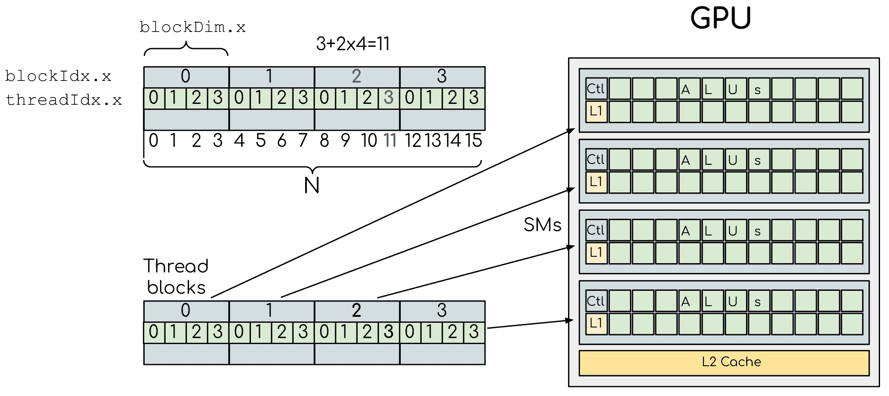

# 高级语言支持

> 原文：[`enccs.github.io/gpu-programming/9-language-support/`](https://enccs.github.io/gpu-programming/9-language-support/)

*GPU 编程：为什么、何时以及如何？* **   高级语言支持

+   [在 GitHub 上编辑](https://github.com/ENCCS/gpu-programming/blob/main/content/9-language-support.rst)

* * *

问题

+   我能否将高级语言中的代码移植到 GPU 上运行？

目标

+   获取 Python 和 Julia 中 GPU 编程库的概述

教师备注

+   40 分钟教学

+   20 分钟练习

## Julia

Julia 通过以下针对所有三个主要供应商的 GPU 的包，为 GPU 编程提供了一级支持：

+   [CUDA.jl](https://cuda.juliagpu.org/stable/) 用于 NVIDIA GPU

+   [AMDGPU.jl](https://amdgpu.juliagpu.org/stable/) 用于 AMD GPU

+   [oneAPI.jl](https://github.com/JuliaGPU/oneAPI.jl) 用于 Intel GPU

+   [Metal.jl](https://github.com/JuliaGPU/Metal.jl) 用于 Apple M 系列 GPU

`CUDA.jl` 是最成熟的，`AMDGPU.jl` 稍微落后但仍然可以通用，而 `oneAPI.jl` 和 `Metal.jl` 功能齐全但可能包含错误，缺少一些功能，并提供次优性能。

这些库的 API 完全类似，它们之间的转换通常很简单。这些库提供了用户友好的**高级抽象**（数组接口和更高级的抽象），这需要很少的编程工作，以及**低级**方法来编写内核，以实现精细的控制。

使用 Julia 包管理器安装这些包：

安装 `CUDA.jl`：

```
using  Pkg
Pkg.add("CUDA") 
```

安装 `AMDGPU.jl`：

```
using  Pkg
Pkg.add("AMDGPU") 
```

安装 `oneAPI.jl`：

```
using  Pkg
Pkg.add("oneAPI") 
```

安装 `Metal.jl`：

```
using  Pkg
Pkg.add("Metal") 
```

要使用 Julia GPU 堆栈，需要安装相关的 GPU 驱动程序和编程工具包。GPU 驱动程序已在 HPC 系统上安装，而在您的个人机器上，您需要自行安装（例如，请参阅 NVIDIA 的这些[说明](https://www.nvidia.com/Download/index.aspx)）。CUDA 的编程工具包可以在首次使用时通过 Julia 的 artifact 系统自动安装：

```
using  CUDA
CUDA.versioninfo() 
```

### 数组接口

使用 Julia 进行 GPU 编程可以像使用不同的数组类型而不是常规的 `Base.Array` 数组一样简单：

+   `CuArray` 来自 CUDA.jl，用于 NVIDIA GPU

+   `ROCArray` 来自 AMDGPU.jl，用于 AMD GPU

+   `oneArray` 来自 oneAPI.jl，用于 Intel GPU

+   `MtlArray` 来自 Metal.jl，用于 Apple GPU

这些数组类型与 `Base.Array` 非常相似，这使得我们可以编写通用的代码，这些代码可以在两种类型上运行。

以下代码将数组复制到 GPU 并在 GPU 上执行简单操作：

```
using  CUDA

A_d  =  CuArray([1,2,3,4])
A_d  .+=  1 
```

```
using  AMDGPU

A_d  =  ROCArray([1,2,3,4])
A_d  .+=  1 
```

```
using  oneAPI

A_d  =  oneArray([1,2,3,4])
A_d  .+=  1 
```

```
using  Metal

A_d  =  MtlArray([1,2,3,4])
A_d  .+=  1 
```

将数组从 GPU 移动回 CPU 很简单：

```
A  =  Array(A_d) 
```

让我们看看一个更实际的例子：矩阵乘法。我们创建两个随机数组，一个在 CPU 上，一个在 GPU 上，并使用[BenchmarkTools 包](https://github.com/JuliaCI/BenchmarkTools.jl)比较性能：

```
using  BenchmarkTools
using  CUDA

A  =  rand(2⁹,  2⁹);
A_d  =  CuArray(A);

@btime  $A  *  $A;
@btime  CUDA.@sync  $A_d  *  $A_d; 
```

```
using  BenchmarkTools
using  AMDGPU

A  =  rand(2⁹,  2⁹);
A_d  =  ROCArray(A);

@btime  $A  *  $A;
@btime  begin
  $A_d  *  $A_d;
  AMDGPU.synchronize()
end 
```

```
using  BenchmarkTools
using  oneAPI

A  =  rand(2⁹,  2⁹);
A_d  =  oneArray(A);

@btime  $A  *  $A;
@btime  $A_d  *  $A_d; 
```

```
using  BenchmarkTools
using  Metal

A  =  rand(2⁹,  2⁹);
A_d  =  MtlArray(A);

@btime  $A  *  $A;
@btime  $A_d  *  $A_d; 
```

### 供应商库

目前，从 Julia 使用 GPU 供应商库的支持在 NVIDIA GPU 上最为成熟。NVIDIA 库包含预编译的内核，用于常见操作，如矩阵乘法（cuBLAS）、快速傅里叶变换（cuFFT）、线性求解器（cuSOLVER）等。这些内核被封装在 `CUDA.jl` 中，可以直接与 `CuArrays` 一起使用：

```
# create a 100x100 Float32 random array and an uninitialized array
A  =  CUDA.rand(2⁹,  2⁹);
B  =  CuArray{Float32,  2}(undef,  2⁹,  2⁹);

# regular matrix multiplication uses cuBLAS under the hood
A  *  A

# use LinearAlgebra for matrix multiplication
using  LinearAlgebra
mul!(B,  A,  A)

# use cuSOLVER for QR factorization
qr(A)

# solve equation A*X == B
A  \  B

# use cuFFT for FFT
using  CUDA.CUFFT
fft(A) 
```

`AMDGPU.jl` 目前支持一些 ROCm 库：

+   rocBLAS 用于 BLAS 支持

+   rocFFT 用于 FFT 支持

+   rocRAND 用于 RNG 支持

+   MIOpen 用于 DNN 支持

### 高阶抽象

使用 Julia 的高阶数组抽象来编程 GPU 是一种强大的方式。上面看到的简单元素级加法 `a .+= 1` 是一个例子，但可以使用 `broadcast`、`map`、`reduce`、`accumulate` 等创建更通用的结构：

```
broadcast(A)  do  x
  x  +=  1
end 
```

```
map(A)  do  x
  x  +  1
end 
```

```
reduce(+,  A) 
```

```
accumulate(+,  A) 
```

### 编写自己的内核

并非所有算法都能与 `CUDA.jl` 中的高级抽象一起工作。在这种情况下，需要显式编写我们自己的 GPU 内核。

类似于在 CUDA 或 HIP 中编写内核，我们使用一个特殊函数来返回执行它的 GPU 线程的索引（例如，NVIDIA 的 `threadIdx().x` 和 AMD 的 `workitemIdx().x`），以及两个额外的函数来并行处理多个块（例如，NVIDIA 的 `blockDim().x()` 和 `blockIdx().x()`，AMD 的 `workgroupDim().x()` 和 `workgroupIdx().x()`）。



下面是一个为 NVIDIA、AMD、Intel 和 Apple GPU 编写的向量加法内核示例：

```
using  CUDA

function  vadd!(C,  A,  B)
  i  =  threadIdx().x  +  (blockIdx().x  -  1)  *  blockDim().x
  if  i  <=  length(A)
  @inbounds  C[i]  =  A[i]  +  B[i]
  end
  return
end

A,  B  =  CUDA.ones(2⁹)*2,  CUDA.ones(2⁹)*3;
C  =  similar(A);

nthreads  =  256
# smallest integer larger than or equal to length(A)/threads
numblocks  =  cld(length(A),  nthreads)

# run using 256 threads
@cuda  threads=nthreads  blocks=numblocks  vadd!(C,  A,  B)

@assert  all(Array(C)  .==  5.0) 
```

```
using  AMDGPU

function  vadd!(C,  A,  B)
  i  =  workitemIdx().x  +  (workgroupIdx().x  -  1)  *  workgroupDim().x
  if  i  <=  length(A)
  @inbounds  C[i]  =  A[i]  +  B[i]
  end
  return
end

A,  B  =  ROCArray(ones(2⁹)*2),  ROCArray(ones(2⁹)*3);
C  =  similar(A);

nthreads  =  256
# smallest integer larger than or equal to length(A)/threads
numblocks  =  cld(length(A),  nthreads)

# run using 256 threads
@roc  groupsize=nthreads  gridsize=numblocks  vadd!(C,  A,  B)

@assert  all(Array(C)  .==  5.0) 
```

```
using  oneAPI
# WARNING: this is still untested on Intel GPUs
function  vadd!(C,  A,  B)
  i  =  get_global_id()
  if  i  <=  length(a)
  c[i]  =  a[i]  +  b[i]
  end
  return
end

A,  B  =  oneArray(ones(2⁹)*2),  oneArray(ones(2⁹)*3);
C  =  similar(A);

nthreads  =  256
# smallest integer larger than or equal to length(A)/threads
numgroups  =  cld(length(a),256)

@oneapi  items=nthreads  groups=numgroups  vadd!(c,  a,  b)

@assert  all(Array(C)  .==  5.0) 
```

```
using  Metal

function  vadd!(C,  A,  B)
  i  =  thread_position_in_grid_1d()
  if  i  <=  length(A)
  @inbounds  C[i]  =  A[i]  +  B[i]
  end
  return
end

A,  B  =  MtlArray(ones(Float32,  2⁹)*2),  MtlArray(Float32,  ones(2⁹)*3);
C  =  similar(A);

nthreads  =  256
# smallest integer larger than or equal to length(A)/threads
numblocks  =  cld(length(A),  nthreads)

# run using 256 threads
@metal  threads=nthreads  grid=numblocks  vadd!(C,  A,  B)

@assert  all(Array(C)  .==  5.0) 
```

内核编程的限制

在内核中，除了需要 Julia 运行时库的功能之外，大多数 Julia 语言都受到支持。这意味着不能分配内存或执行动态函数调用，这两者都很容易意外发生！

1D、2D 和 3D

CUDA.jl 和 AMDGPU.jl 支持最多 3 维的索引（x, y 和 z，例如 `threadIdx().x` 和 `workitemIdx().x`）。这对于可以将线程块组织成 1D、2D 或 3D 线程数组的多维数据来说很方便。

### 编写可移植的内核

[KernelAbstractions.jl](https://github.com/JuliaGPU/KernelAbstractions.jl) 允许您编写通用的 GPU 代码，并在 Nvidia、AMD、Intel 或 Apple 的 GPU 上运行，类似于 C++ 的 alpaka 和 Kokkos。后端是决定代码将在何处执行的对象。当加载相应的包时，特定的后端（如 `ROCBackend()`）变得可用。

```
using  KernelAbstractions

using  CUDA
backend  =  CUDABackend()

@kernel  function  vadd!(C,  @Const(A),  @Const(B))
  i  =  @index(Global)
  if  i  <=  length(A)
  @inbounds  C[i]  =  A[i]  +  B[i]
  end
end

A  =  KernelAbstractions.ones(backend,  Float64,  2⁹)*2;
B  =  KernelAbstractions.ones(backend,  Float64,  2⁹)*3;
C  =  similar(A)

kernel!  =  vadd!(backend)
kernel!(C,  A,  B,  ndrange=size(C))
KernelAbstractions.synchronize(backend)

@assert  all(Array(C)  .==  5.0) 
```

```
using  KernelAbstractions

using  AMDGPU
backend  =  ROCBackend()

@kernel  function  vadd!(C,  @Const(A),  @Const(B))
  i  =  @index(Global)
  if  i  <=  length(A)
  @inbounds  C[i]  =  A[i]  +  B[i]
  end
end

A  =  KernelAbstractions.ones(backend,  Float64,  2⁹)*2;
B  =  KernelAbstractions.ones(backend,  Float64,  2⁹)*3;
C  =  similar(A)

kernel!  =  vadd!(backend)
kernel!(C,  A,  B,  ndrange=size(C))
KernelAbstractions.synchronize(backend)

@assert  all(Array(C)  .==  5.0) 
```

```
using  KernelAbstractions

using  oneAPI
backend  =  oneAPIBackend()

@kernel  function  vadd!(C,  @Const(A),  @Const(B))
  i  =  @index(Global)
  if  i  <=  length(A)
  @inbounds  C[i]  =  A[i]  +  B[i]
  end
end

A  =  KernelAbstractions.ones(backend,  Float64,  2⁹)*2;
B  =  KernelAbstractions.ones(backend,  Float64,  2⁹)*3;
C  =  similar(A)

kernel!  =  vadd!(backend)
kernel!(C,  A,  B,  ndrange=size(C))
KernelAbstractions.synchronize(backend)

@assert  all(Array(C)  .==  5.0) 
```

```
using  KernelAbstractions

using  Metal
backend  =  MetalBackend()

@kernel  function  vadd!(C,  @Const(A),  @Const(B))
  i  =  @index(Global)
  if  i  <=  length(A)
  @inbounds  C[i]  =  A[i]  +  B[i]
  end
end

A  =  KernelAbstractions.ones(backend,  Float64,  2⁹)*2;
B  =  KernelAbstractions.ones(backend,  Float64,  2⁹)*3;
C  =  similar(A)

kernel!  =  vadd!(backend)
kernel!(C,  A,  B,  ndrange=size(C))
KernelAbstractions.synchronize(backend)

@assert  all(Array(C)  .==  5.0) 
```

## Python

使用 Python 进行 GPU 编程已经取得了很大的进展，生态系统仍在不断发展。有几个选项可用于与 GPU 一起工作。

### CuPy

CuPy 是一个与 NumPy/SciPy 兼容的数据数组库，用于 GPU。它为 NVIDIA GPU 开发，但提供了对 AMD GPU 的实验性支持。CuPy 与 NumPy 和 SciPy 具有高度兼容的接口。正如其官方网站所述，“你只需要在 Python 代码中将 `numpy` 和 `scipy` 替换为 `cupy` 和 `cupyx.scipy`。”如果你熟悉 NumPy，CuPy 是一个在 GPU 上开始的好方法。

### cuDF

RAPIDS 是一个高级包集合，它使用 Python 绑定实现了 CUDA 功能和 API。它仅支持 NVIDIA GPU。cuDF 属于 RAPIDS，是用于在 GPU 上操作数据帧的库。cuDF 提供了类似 Pandas 的 API，因此如果你熟悉 Pandas，你可以在不了解太多 CUDA 编程的情况下加速你的工作。

### PyCUDA

PyCUDA 是一个用于 CUDA 的 Python 编程环境。它允许用户从 Python 访问 NVIDIA 的 CUDA API。PyCUDA 是一个强大的库，但只能在 NVIDIA GPU 上运行。需要了解 CUDA 编程知识。

### Numba

Numba 允许用户即时（JIT）编译 Python 代码以在 CPU 上快速运行，但也可以用于 GPU 的 JIT 编译。在以下内容中，我们将重点介绍使用 Numba，它支持 NVIDIA 和 AMD 的 GPU。

在 AMD GPU 上使用 Numba

要使用 Numba 与 AMD GPU，可以使用 `numba-hip` 扩展。通过在代码开头添加以下几行，可以使单源代码在 Nvidia 和 AMD GPU 上运行：

```
try:
    from  numba  import hip
except ImportError:
    pass
else:
    hip.pose_as_cuda() 
```

有关如何安装和使用的更多信息，请参阅[此处](https://github.com/ROCm/numba-hip)。

Numba 通过直接将 Python 代码的子集编译成内核和设备函数来支持 GPU 编程，遵循执行模型。用 Numba 编写的内核似乎可以直接访问 NumPy 数组。NumPy 数组在 CPU 和 GPU 之间自动传输。

#### ufunc（通用函数）装饰器

使用 ufunc（和广义 ufunc）是使用 Numba 在 GPU 上运行的最简单方法，并且它需要最小程度的 GPU 编程理解。Numba 的 `@vectorize` 将生成一个类似 ufunc 的对象。此对象是一个接近的类似物，但与常规 NumPy ufunc 不完全兼容。为 GPU 生成 ufunc 需要显式的类型签名和目标属性。

#### 示例

示例：Numba ufunc

让我们看看一个简单的数学问题：

```
import  math

def  f(x,y):
    return math.pow(x,3.0) + 4*math.sin(y) 
```

```
import  math
import  numba

@numba.vectorize([numba.float64(numba.float64, numba.float64)], target='cpu')
def  f_numba_cpu(x,y):
    return math.pow(x,3.0) + 4*math.sin(y) 
```

```
import  math
import  numba

@numba.vectorize([numba.float64(numba.float64, numba.float64)], target='cuda')
def  f_numba_gpu(x,y):
    return math.pow(x,3.0) + 4*math.sin(y) 
```

要进行基准测试，首先初始化：

```
import  numpy  as  np
x = np.random.rand(10_000_000)
res = np.random.rand(10_000_000) 
```

```
%%timeit -r 1
for i in range(10000000):
    res[i]=f(x[i], x[i])
    # 6.75 s ± 0 ns per loop (mean ± std. dev. of 1 run, 1 loop each) 
```

```
%timeit res=f_numba_cpu(x, x)
# 734 ms ± 435 µs per loop (mean ± std. dev. of 7 runs, 1 loop each) 
```

```
%timeit res=f_numba_gpu(x, x)
# 78.4 ms ± 6.71 ms per loop (mean ± std. dev. of 7 runs, 1 loop each) 
```

Numba 的 `@vectorize` 仅限于核心函数中的标量参数，对于多维数组参数，使用 `@guvectorize`。考虑以下示例，它执行矩阵乘法。

警告

永远不要自己实现像矩阵乘法这样的功能，因为已经有大量高度优化的库可供使用！

Numba gufunc

```
import  numpy  as  np

def  matmul_cpu(A,B,C):
    for i in range(A.shape[0]):
        for j in range(B.shape[1]):
            tmp=0.0
            for k in range(B.shape[0]):
                tmp += A[i, k] * B[k, j]
            C[i,j] += tmp 
```

```
import  numpy  as  np
import  numba

#@numba.guvectorize(['(float64[:,:], float64[:,:], float64[:,:])'], '(m,l),(l,n)->(m,n)', target='cpu')
@numba.guvectorize([numba.void(numba.float64[:,:], numba.float64[:,:], numba.float64[:,:])], '(m,l),(l,n)->(m,n)', target='cpu')
def  matmul_numba_cpu(A,B,C):
    for i in range(A.shape[0]):
        for j in range(B.shape[1]):
            tmp=0.0
            for k in range(B.shape[0]):
                tmp += A[i, k] * B[k, j]
            C[i,j] += tmp 
```

```
import  numpy  as  np
import  numba

#@numba.guvectorize(['(float64[:,:], float64[:,:], float64[:,:])'], '(m,l),(l,n)->(m,n)', target='cuda')
@numba.guvectorize([numba.void(numba.float64[:,:], numba.float64[:,:], numba.float64[:,:])], '(m,l),(l,n)->(m,n)', target='cuda')
def  matmul_numba_gpu(A,B,C):
    for i in range(A.shape[0]):
        for j in range(B.shape[1]):
            tmp=0.0
            for k in range(B.shape[0]):
                tmp += A[i, k] * B[k, j]
            C[i,j] += tmp 
```

要进行基准测试，首先初始化一些数组：

```
import  numpy  as  np
N = 50
A = np.random.rand(N,N)
B = np.random.rand(N,N)
C = np.random.rand(N,N) 
```

```
%timeit matmul_cpu(A,B,C) 
```

```
%timeit matmul_numba_cpu(A,B,C) 
```

```
%timeit matmul_numba_gpu(A,B,C) 
```

注意

Numba 自动为我们做了很多事情：

+   内存已在 GPU 上分配

+   数据已从 CPU 和 GPU 复制

+   内核已配置并启动

+   数据已从 GPU 复制回 CPU

使用 ufunc（或 gfunc）进行 GPU 处理可能很简单，但由于自动处理数据在 GPU 之间传输以及内核启动，这种方法可能并不总是产生最佳性能。此外，在实践中，并非每个函数都可以构建为 ufunc。

为了获得更大的控制和灵活性，可能需要自己编写内核并手动管理数据传输。有关使用 Numba 实现此类技术的指导，请参考下面的 *Python for HPDA* 资源。

## 练习

亲自尝试

你是 Julian 还是 Pythonista？也许都不是，但请从 Python 和 Julia 中选择一个，并尝试上面的代码示例。

你可以在 设置 部分找到在 LUMI 上运行 Julia 和 Python 以及在 Google Colab 上运行的说明。

## 参见

+   [Julia 编程入门 (ENCCS)](https://enccs.github.io/julia-intro/)

+   [Julia 高性能科学计算 (ENCCS)](https://enccs.github.io/julia-for-hpc/)

+   [Julia 高性能数据分析 (ENCCS)](https://enccs.github.io/julia-for-hpda/)

+   [在 HPC 中运行 R、Python、Julia 和 Matlab 的入门 (NAISS-LUNARC-HPC2N-UPPMAX)](https://uppmax.github.io/R-python-julia-matlab-HPC/)

+   [Python 中的高性能数据分析 (ENCCS)](https://enccs.github.io/hpda-python/)

+   [使用 Python 进行 GPU 编程的实用入门 (ENCCS)](https://github.com/ENCCS/webinar_documents/tree/main/2024-oct-24-python)

+   [在 HPC 环境中使用 Python (UPPMAX-HPC2N)](https://uppmax.github.io/HPC-python/)

+   [Python 科学计算 (Aalto 科学计算)](https://aaltoscicomp.github.io/python-for-scicomp/)

上一节 下一节

* * *

© 版权 2023-2024，贡献者。

使用 [Sphinx](https://www.sphinx-doc.org/) 和由 [Read the Docs](https://readthedocs.org) 提供的 [主题](https://github.com/readthedocs/sphinx_rtd_theme) 构建

问题

+   我能否将高级语言编写的代码移植到 GPU 上运行？

目标

+   了解 Python 和 Julia 中用于 GPU 编程的库概述

教师备注

+   40 分钟教学

+   20 分钟练习

## Julia

Julia 通过以下针对所有三个主要供应商的 GPU 的包提供一流的 GPU 编程支持：

+   [CUDA.jl](https://cuda.juliagpu.org/stable/) 用于 NVIDIA GPU

+   [AMDGPU.jl](https://amdgpu.juliagpu.org/stable/) 用于 AMD GPU

+   [oneAPI.jl](https://github.com/JuliaGPU/oneAPI.jl) 用于英特尔 GPU

+   [Metal.jl](https://github.com/JuliaGPU/Metal.jl) 用于 Apple M 系列 GPU

`CUDA.jl` 是最成熟的，`AMDGPU.jl` 稍微落后但仍然适用于通用用途，而 `oneAPI.jl` 和 `Metal.jl` 功能齐全但可能存在错误，缺少一些功能，并且性能可能不是最优的。

这些库的 API 完全类似，它们之间的转换通常是直接的。这些库提供了用户友好的**高级抽象**（数组接口和高级抽象），这需要很少的编程工作，以及用于编写内核的**低级**方法，以实现细粒度控制。

使用 Julia 包管理器安装这些包：

安装`CUDA.jl`：

```
using  Pkg
Pkg.add("CUDA") 
```

安装`AMDGPU.jl`：

```
using  Pkg
Pkg.add("AMDGPU") 
```

安装`oneAPI.jl`：

```
using  Pkg
Pkg.add("oneAPI") 
```

安装`Metal.jl`：

```
using  Pkg
Pkg.add("Metal") 
```

要使用 Julia GPU 堆栈，需要安装相关的 GPU 驱动程序和编程工具包。GPU 驱动程序已经在 HPC 系统上安装，而在您的个人机器上，您需要自行安装它们（例如，请参阅 NVIDIA 的这些[说明](https://www.nvidia.com/Download/index.aspx))。CUDA 的编程工具包可以在第一次使用时通过 Julia 的 artifact 系统自动安装：

```
using  CUDA
CUDA.versioninfo() 
```

### 数组接口

使用 Julia 进行 GPU 编程可以像使用不同的数组类型而不是常规的`Base.Array`数组一样简单：

+   `CuArray`来自 CUDA.jl，适用于 NVIDIA GPU

+   `ROCArray`来自 AMDGPU.jl，适用于 AMD GPU

+   `oneArray`来自 oneAPI.jl，适用于 Intel GPU

+   `MtlArray`来自 Metal.jl，适用于 Apple GPU

这些数组类型与`Base.Array`非常相似，这使得我们可以编写通用的代码，这些代码可以在两种类型上运行。

以下代码将数组复制到 GPU 上并在 GPU 上执行简单操作：

```
using  CUDA

A_d  =  CuArray([1,2,3,4])
A_d  .+=  1 
```

```
using  AMDGPU

A_d  =  ROCArray([1,2,3,4])
A_d  .+=  1 
```

```
using  oneAPI

A_d  =  oneArray([1,2,3,4])
A_d  .+=  1 
```

```
using  Metal

A_d  =  MtlArray([1,2,3,4])
A_d  .+=  1 
```

将数组从 GPU 移回 CPU 的操作很简单：

```
A  =  Array(A_d) 
```

让我们看看一个更实际的例子：矩阵乘法。我们创建两个随机数组，一个在 CPU 上，一个在 GPU 上，并使用[BenchmarkTools 包](https://github.com/JuliaCI/BenchmarkTools.jl)比较性能：

```
using  BenchmarkTools
using  CUDA

A  =  rand(2⁹,  2⁹);
A_d  =  CuArray(A);

@btime  $A  *  $A;
@btime  CUDA.@sync  $A_d  *  $A_d; 
```

```
using  BenchmarkTools
using  AMDGPU

A  =  rand(2⁹,  2⁹);
A_d  =  ROCArray(A);

@btime  $A  *  $A;
@btime  begin
  $A_d  *  $A_d;
  AMDGPU.synchronize()
end 
```

```
using  BenchmarkTools
using  oneAPI

A  =  rand(2⁹,  2⁹);
A_d  =  oneArray(A);

@btime  $A  *  $A;
@btime  $A_d  *  $A_d; 
```

```
using  BenchmarkTools
using  Metal

A  =  rand(2⁹,  2⁹);
A_d  =  MtlArray(A);

@btime  $A  *  $A;
@btime  $A_d  *  $A_d; 
```

### 供应商库

目前，从 Julia 使用 GPU 供应商库在 NVIDIA GPU 上最为成熟。NVIDIA 库包含预编译的内核，用于常见操作，如矩阵乘法（cuBLAS）、快速傅里叶变换（cuFFT）、线性求解器（cuSOLVER）等。这些内核被封装在`CUDA.jl`中，可以直接与`CuArrays`一起使用：

```
# create a 100x100 Float32 random array and an uninitialized array
A  =  CUDA.rand(2⁹,  2⁹);
B  =  CuArray{Float32,  2}(undef,  2⁹,  2⁹);

# regular matrix multiplication uses cuBLAS under the hood
A  *  A

# use LinearAlgebra for matrix multiplication
using  LinearAlgebra
mul!(B,  A,  A)

# use cuSOLVER for QR factorization
qr(A)

# solve equation A*X == B
A  \  B

# use cuFFT for FFT
using  CUDA.CUFFT
fft(A) 
```

`AMDGPU.jl`目前支持一些 ROCm 库：

+   rocBLAS 用于 BLAS 支持

+   rocFFT 用于快速傅里叶变换支持

+   rocRAND 用于随机数生成器支持

+   MIOpen 用于深度神经网络支持

### 高级抽象

使用数组编程 GPU 的一种强大方式是通过 Julia 的高级数组抽象。我们上面看到的简单元素级加法`a .+= 1`就是这种抽象的一个例子，但可以使用`broadcast`、`map`、`reduce`、`accumulate`等创建更通用的结构：

```
broadcast(A)  do  x
  x  +=  1
end 
```

```
map(A)  do  x
  x  +  1
end 
```

```
reduce(+,  A) 
```

```
accumulate(+,  A) 
```

### 编写自己的内核

并非所有算法都可以通过`CUDA.jl`中的高级抽象来实现。在这种情况下，需要明确编写我们自己的 GPU 内核。

类似于在 CUDA 或 HIP 中编写内核，我们使用一个特殊函数来返回执行它的 GPU 线程的索引（例如，NVIDIA 的`threadIdx().x`和 AMD 的`workitemIdx().x`），以及两个额外的函数来并行处理多个块（例如，NVIDIA 的`blockDim().x()`和`blockIdx().x`，AMD 的`workgroupDim().x()`和`workgroupIdx().x`）。


下面是一个为 NVIDIA、AMD、Intel 和 Apple GPU 的向量加法内核示例：

```
using  CUDA

function  vadd!(C,  A,  B)
  i  =  threadIdx().x  +  (blockIdx().x  -  1)  *  blockDim().x
  if  i  <=  length(A)
  @inbounds  C[i]  =  A[i]  +  B[i]
  end
  return
end

A,  B  =  CUDA.ones(2⁹)*2,  CUDA.ones(2⁹)*3;
C  =  similar(A);

nthreads  =  256
# smallest integer larger than or equal to length(A)/threads
numblocks  =  cld(length(A),  nthreads)

# run using 256 threads
@cuda  threads=nthreads  blocks=numblocks  vadd!(C,  A,  B)

@assert  all(Array(C)  .==  5.0) 
```

```
using  AMDGPU

function  vadd!(C,  A,  B)
  i  =  workitemIdx().x  +  (workgroupIdx().x  -  1)  *  workgroupDim().x
  if  i  <=  length(A)
  @inbounds  C[i]  =  A[i]  +  B[i]
  end
  return
end

A,  B  =  ROCArray(ones(2⁹)*2),  ROCArray(ones(2⁹)*3);
C  =  similar(A);

nthreads  =  256
# smallest integer larger than or equal to length(A)/threads
numblocks  =  cld(length(A),  nthreads)

# run using 256 threads
@roc  groupsize=nthreads  gridsize=numblocks  vadd!(C,  A,  B)

@assert  all(Array(C)  .==  5.0) 
```

```
using  oneAPI
# WARNING: this is still untested on Intel GPUs
function  vadd!(C,  A,  B)
  i  =  get_global_id()
  if  i  <=  length(a)
  c[i]  =  a[i]  +  b[i]
  end
  return
end

A,  B  =  oneArray(ones(2⁹)*2),  oneArray(ones(2⁹)*3);
C  =  similar(A);

nthreads  =  256
# smallest integer larger than or equal to length(A)/threads
numgroups  =  cld(length(a),256)

@oneapi  items=nthreads  groups=numgroups  vadd!(c,  a,  b)

@assert  all(Array(C)  .==  5.0) 
```

```
using  Metal

function  vadd!(C,  A,  B)
  i  =  thread_position_in_grid_1d()
  if  i  <=  length(A)
  @inbounds  C[i]  =  A[i]  +  B[i]
  end
  return
end

A,  B  =  MtlArray(ones(Float32,  2⁹)*2),  MtlArray(Float32,  ones(2⁹)*3);
C  =  similar(A);

nthreads  =  256
# smallest integer larger than or equal to length(A)/threads
numblocks  =  cld(length(A),  nthreads)

# run using 256 threads
@metal  threads=nthreads  grid=numblocks  vadd!(C,  A,  B)

@assert  all(Array(C)  .==  5.0) 
```

内核编程的限制

在内核中，除了需要 Julia 运行时库的功能外，大多数 Julia 语言的功能都得到了支持。这意味着不能分配内存或执行动态函数调用，这两者都很容易意外发生！

1D、2D 和 3D

CUDA.jl 和 AMDGPU.jl 支持最多 3 维度的索引（x、y 和 z，例如`threadIdx().x`和`workitemIdx().x`）。这对于多维数据很有用，其中线程块可以组织成 1D、2D 或 3D 的线程数组。

### 编写可移植内核

[KernelAbstractions.jl](https://github.com/JuliaGPU/KernelAbstractions.jl)允许你编写通用的 GPU 代码，并在 Nvidia、AMD、Intel 或 Apple 的 GPU 上运行，类似于 C++的 alpaka 和 Kokkos。后端是决定代码将在何处执行的对象。当加载相应的包时，特定的后端（如`ROCBackend()`）将变得可用。

```
using  KernelAbstractions

using  CUDA
backend  =  CUDABackend()

@kernel  function  vadd!(C,  @Const(A),  @Const(B))
  i  =  @index(Global)
  if  i  <=  length(A)
  @inbounds  C[i]  =  A[i]  +  B[i]
  end
end

A  =  KernelAbstractions.ones(backend,  Float64,  2⁹)*2;
B  =  KernelAbstractions.ones(backend,  Float64,  2⁹)*3;
C  =  similar(A)

kernel!  =  vadd!(backend)
kernel!(C,  A,  B,  ndrange=size(C))
KernelAbstractions.synchronize(backend)

@assert  all(Array(C)  .==  5.0) 
```

```
using  KernelAbstractions

using  AMDGPU
backend  =  ROCBackend()

@kernel  function  vadd!(C,  @Const(A),  @Const(B))
  i  =  @index(Global)
  if  i  <=  length(A)
  @inbounds  C[i]  =  A[i]  +  B[i]
  end
end

A  =  KernelAbstractions.ones(backend,  Float64,  2⁹)*2;
B  =  KernelAbstractions.ones(backend,  Float64,  2⁹)*3;
C  =  similar(A)

kernel!  =  vadd!(backend)
kernel!(C,  A,  B,  ndrange=size(C))
KernelAbstractions.synchronize(backend)

@assert  all(Array(C)  .==  5.0) 
```

```
using  KernelAbstractions

using  oneAPI
backend  =  oneAPIBackend()

@kernel  function  vadd!(C,  @Const(A),  @Const(B))
  i  =  @index(Global)
  if  i  <=  length(A)
  @inbounds  C[i]  =  A[i]  +  B[i]
  end
end

A  =  KernelAbstractions.ones(backend,  Float64,  2⁹)*2;
B  =  KernelAbstractions.ones(backend,  Float64,  2⁹)*3;
C  =  similar(A)

kernel!  =  vadd!(backend)
kernel!(C,  A,  B,  ndrange=size(C))
KernelAbstractions.synchronize(backend)

@assert  all(Array(C)  .==  5.0) 
```

```
using  KernelAbstractions

using  Metal
backend  =  MetalBackend()

@kernel  function  vadd!(C,  @Const(A),  @Const(B))
  i  =  @index(Global)
  if  i  <=  length(A)
  @inbounds  C[i]  =  A[i]  +  B[i]
  end
end

A  =  KernelAbstractions.ones(backend,  Float64,  2⁹)*2;
B  =  KernelAbstractions.ones(backend,  Float64,  2⁹)*3;
C  =  similar(A)

kernel!  =  vadd!(backend)
kernel!(C,  A,  B,  ndrange=size(C))
KernelAbstractions.synchronize(backend)

@assert  all(Array(C)  .==  5.0) 
```

## Python

使用 Python 和其生态系统进行 GPU 编程已经取得了很大的进展，该生态系统仍在不断发展。目前有几个选项可用于与 GPU 一起工作。

### CuPy

CuPy 是一个与 NumPy/SciPy 兼容的 GPU 数据数组库。它为 NVIDIA GPU 开发，但作为对 AMD GPU 的实验性支持。CuPy 与 NumPy 和 SciPy 具有高度兼容的接口。正如其官方网站所述，“你只需要在你的 Python 代码中将`numpy`和`scipy`替换为`cupy`和`cupyx.scipy`。”如果你熟悉 NumPy，CuPy 是开始 GPU 编程的一个非常简单的方法。

### cuDF

RAPIDS 是一个高级包集合，它实现了 CUDA 功能性和 API，并带有 Python 绑定。它仅支持 NVIDIA GPU。cuDF 属于 RAPIDS，是用于在 GPU 上操作数据帧的库。cuDF 提供了一个类似于 Pandas 的 API，因此如果你熟悉 Pandas，你可以在不深入了解 CUDA 编程的情况下加速你的工作。

### PyCUDA

PyCUDA 是一个用于 CUDA 的 Python 编程环境。它允许用户从 Python 访问 NVIDIA 的 CUDA API。PyCUDA 是一个功能强大的库，但只能在 NVIDIA GPU 上运行。需要了解 CUDA 编程知识。

### Numba

Numba 允许用户即时（JIT）编译 Python 代码以在 CPU 上快速运行，但也可以用于 GPU 的 JIT 编译。在以下内容中，我们将重点介绍使用 Numba，它支持 NVIDIA 和 AMD 的 GPU。

在 AMD GPU 上使用 Numba

要使用 Numba 与 AMD GPU，可以使用`numba-hip`扩展。通过在代码开头添加以下几行，可以将单源代码配置为在 Nvidia 和 AMD GPU 上运行：

```
try:
    from  numba  import hip
except ImportError:
    pass
else:
    hip.pose_as_cuda() 
```

在[这里](https://github.com/ROCm/numba-hip)了解更多如何安装和使用它。

Numba 通过直接将 Python 代码的子集编译成内核和设备函数来支持 GPU 编程，遵循执行模型。用 Numba 编写的内核似乎可以直接访问 NumPy 数组。NumPy 数组在 CPU 和 GPU 之间自动传输。

#### ufunc (gufunc) 装饰器

使用 ufunc（和广义 ufunc）是使用 Numba 在 GPU 上运行的最简单方法，并且它需要最小程度的 GPU 编程理解。Numba `@vectorize` 将生成一个类似于 ufunc 的对象。此对象是一个近似物，但与常规 NumPy ufunc 不完全兼容。为 GPU 生成 ufunc 需要显式的类型签名和目标属性。

#### 示例

演示：Numba ufunc

让我们看看一个简单的数学问题：

```
import  math

def  f(x,y):
    return math.pow(x,3.0) + 4*math.sin(y) 
```

```
import  math
import  numba

@numba.vectorize([numba.float64(numba.float64, numba.float64)], target='cpu')
def  f_numba_cpu(x,y):
    return math.pow(x,3.0) + 4*math.sin(y) 
```

```
import  math
import  numba

@numba.vectorize([numba.float64(numba.float64, numba.float64)], target='cuda')
def  f_numba_gpu(x,y):
    return math.pow(x,3.0) + 4*math.sin(y) 
```

要进行基准测试，首先初始化：

```
import  numpy  as  np
x = np.random.rand(10_000_000)
res = np.random.rand(10_000_000) 
```

```
%%timeit -r 1
for i in range(10000000):
    res[i]=f(x[i], x[i])
    # 6.75 s ± 0 ns per loop (mean ± std. dev. of 1 run, 1 loop each) 
```

```
%timeit res=f_numba_cpu(x, x)
# 734 ms ± 435 µs per loop (mean ± std. dev. of 7 runs, 1 loop each) 
```

```
%timeit res=f_numba_gpu(x, x)
# 78.4 ms ± 6.71 ms per loop (mean ± std. dev. of 7 runs, 1 loop each) 
```

Numba `@vectorize` 在核心函数中仅限于标量参数，对于多维数组参数，使用`@guvectorize`。考虑以下示例，它执行矩阵乘法。

警告

永远不要自己实现诸如矩阵乘法之类的事情，因为已经有大量高度优化的库可用！

Numba gufunc

```
import  numpy  as  np

def  matmul_cpu(A,B,C):
    for i in range(A.shape[0]):
        for j in range(B.shape[1]):
            tmp=0.0
            for k in range(B.shape[0]):
                tmp += A[i, k] * B[k, j]
            C[i,j] += tmp 
```

```
import  numpy  as  np
import  numba

#@numba.guvectorize(['(float64[:,:], float64[:,:], float64[:,:])'], '(m,l),(l,n)->(m,n)', target='cpu')
@numba.guvectorize([numba.void(numba.float64[:,:], numba.float64[:,:], numba.float64[:,:])], '(m,l),(l,n)->(m,n)', target='cpu')
def  matmul_numba_cpu(A,B,C):
    for i in range(A.shape[0]):
        for j in range(B.shape[1]):
            tmp=0.0
            for k in range(B.shape[0]):
                tmp += A[i, k] * B[k, j]
            C[i,j] += tmp 
```

```
import  numpy  as  np
import  numba

#@numba.guvectorize(['(float64[:,:], float64[:,:], float64[:,:])'], '(m,l),(l,n)->(m,n)', target='cuda')
@numba.guvectorize([numba.void(numba.float64[:,:], numba.float64[:,:], numba.float64[:,:])], '(m,l),(l,n)->(m,n)', target='cuda')
def  matmul_numba_gpu(A,B,C):
    for i in range(A.shape[0]):
        for j in range(B.shape[1]):
            tmp=0.0
            for k in range(B.shape[0]):
                tmp += A[i, k] * B[k, j]
            C[i,j] += tmp 
```

要进行基准测试，首先初始化一些数组：

```
import  numpy  as  np
N = 50
A = np.random.rand(N,N)
B = np.random.rand(N,N)
C = np.random.rand(N,N) 
```

```
%timeit matmul_cpu(A,B,C) 
```

```
%timeit matmul_numba_cpu(A,B,C) 
```

```
%timeit matmul_numba_gpu(A,B,C) 
```

注意

Numba 为我们自动做了很多事情：

+   在 GPU 上分配了内存

+   数据从 CPU 和 GPU 复制

+   内核已配置并启动

+   数据从 GPU 复制回 CPU

使用 ufunc（或 gfunc）进行 GPU 处理可能很简单，但由于自动处理数据在 GPU 之间传输以及内核启动，这种方法可能并不总是产生最佳性能。此外，在实践中，并非每个函数都可以构造为 ufunc。

为了获得更大的控制和灵活性，可能需要自己编写内核并手动管理数据传输。有关使用 Numba 实现此类技术的指导，请参考下面的*Python for HPDA*资源。

## 练习

亲自尝试

你是 Julian 还是 Pythonista？也许都不是，但请从 Python 和 Julia 中选择，并尝试上面的代码示例。

您可以在设置部分找到有关在 LUMI 上运行 Julia 和在 LUMI / Google Colab 上运行 Python 的说明。

## 参见

+   [Julia 编程入门 (ENCCS)](https://enccs.github.io/julia-intro/)

+   [Julia 用于高性能科学计算 (ENCCS)](https://enccs.github.io/julia-for-hpc/)

+   [Julia 用于高性能数据分析 (ENCCS)](https://enccs.github.io/julia-for-hpda/)

+   [在 HPC 中运行 R、Python、Julia 和 Matlab 的入门 (NAISS-LUNARC-HPC2N-UPPMAX)](https://uppmax.github.io/R-python-julia-matlab-HPC/)

+   [Python 中的高性能数据分析 (ENCCS)](https://enccs.github.io/hpda-python/)

+   [使用 Python 进行 GPU 编程的实际入门（ENCCS）](https://github.com/ENCCS/webinar_documents/tree/main/2024-oct-24-python)

+   [在 HPC 环境中使用 Python（UPPMAX-HPC2N）](https://uppmax.github.io/HPC-python/)

+   [科学计算中的 Python（Aalto 科学计算）](https://aaltoscicomp.github.io/python-for-scicomp/)

## Julia

Julia 通过以下针对所有三个主要供应商的 GPU 的包提供了一级 GPU 编程支持：

+   [CUDA.jl](https://cuda.juliagpu.org/stable/) 用于 NVIDIA GPU

+   [AMDGPU.jl](https://amdgpu.juliagpu.org/stable/) 用于 AMD GPU

+   [oneAPI.jl](https://github.com/JuliaGPU/oneAPI.jl) 用于 Intel GPU

+   [Metal.jl](https://github.com/JuliaGPU/Metal.jl) 用于 Apple M 系列 GPU

`CUDA.jl`是最成熟的，`AMDGPU.jl`稍微落后但仍然适用于通用用途，而`oneAPI.jl`和`Metal.jl`功能齐全但可能包含错误，缺少一些功能，并提供次优性能。

这些库的 API 完全类似，它们之间的转换通常是直接的。这些库提供用户友好的**高级抽象**（数组接口和高级抽象），需要很少的编程工作，以及**低级**方法来编写内核以进行精细控制。

安装这些包使用 Julia 包管理器：

安装`CUDA.jl`：

```
using  Pkg
Pkg.add("CUDA") 
```

安装`AMDGPU.jl`：

```
using  Pkg
Pkg.add("AMDGPU") 
```

安装`oneAPI.jl`：

```
using  Pkg
Pkg.add("oneAPI") 
```

安装`Metal.jl`：

```
using  Pkg
Pkg.add("Metal") 
```

要使用 Julia GPU 堆栈，需要安装相关的 GPU 驱动程序和编程工具包。GPU 驱动程序已经安装在 HPC 系统上，而在您的个人机器上，您需要自行安装它们（例如，请参阅 NVIDIA 的这些[说明](https://www.nvidia.com/Download/index.aspx)）。CUDA 的编程工具包可以在第一次使用时通过 Julia 的 artifact 系统自动安装：

```
using  CUDA
CUDA.versioninfo() 
```

### 数组接口

使用 Julia 进行 GPU 编程可以像使用不同的数组类型而不是常规的`Base.Array`数组一样简单：

+   `CuArray`来自 CUDA.jl，用于 NVIDIA GPU

+   `ROCArray`来自 AMDGPU.jl，用于 AMD GPU

+   `oneArray`来自 oneAPI.jl，用于 Intel GPU

+   `MtlArray`来自`Metal.jl`，用于 Apple GPU

这些数组类型与`Base.Array`非常相似，这使得我们能够编写通用的代码，这些代码可以在两种类型上运行。

以下代码将数组复制到 GPU 上并在 GPU 上执行简单操作：

```
using  CUDA

A_d  =  CuArray([1,2,3,4])
A_d  .+=  1 
```

```
using  AMDGPU

A_d  =  ROCArray([1,2,3,4])
A_d  .+=  1 
```

```
using  oneAPI

A_d  =  oneArray([1,2,3,4])
A_d  .+=  1 
```

```
using  Metal

A_d  =  MtlArray([1,2,3,4])
A_d  .+=  1 
```

将数组从 GPU 移回到 CPU 上很简单：

```
A  =  Array(A_d) 
```

让我们看看一个更实际的例子：矩阵乘法。我们创建两个随机数组，一个在 CPU 上，一个在 GPU 上，并使用[BenchmarkTools 包](https://github.com/JuliaCI/BenchmarkTools.jl)比较性能：

```
using  BenchmarkTools
using  CUDA

A  =  rand(2⁹,  2⁹);
A_d  =  CuArray(A);

@btime  $A  *  $A;
@btime  CUDA.@sync  $A_d  *  $A_d; 
```

```
using  BenchmarkTools
using  AMDGPU

A  =  rand(2⁹,  2⁹);
A_d  =  ROCArray(A);

@btime  $A  *  $A;
@btime  begin
  $A_d  *  $A_d;
  AMDGPU.synchronize()
end 
```

```
using  BenchmarkTools
using  oneAPI

A  =  rand(2⁹,  2⁹);
A_d  =  oneArray(A);

@btime  $A  *  $A;
@btime  $A_d  *  $A_d; 
```

```
using  BenchmarkTools
using  Metal

A  =  rand(2⁹,  2⁹);
A_d  =  MtlArray(A);

@btime  $A  *  $A;
@btime  $A_d  *  $A_d; 
```

### 供应商库

目前在 Julia 中使用 GPU 供应商库的支持最成熟的是 NVIDIA GPU。NVIDIA 库包含预编译的内核，用于常见操作，如矩阵乘法（cuBLAS）、快速傅里叶变换（cuFFT）、线性求解器（cuSOLVER）等。这些内核在 `CUDA.jl` 中被封装，可以直接与 `CuArrays` 一起使用：

```
# create a 100x100 Float32 random array and an uninitialized array
A  =  CUDA.rand(2⁹,  2⁹);
B  =  CuArray{Float32,  2}(undef,  2⁹,  2⁹);

# regular matrix multiplication uses cuBLAS under the hood
A  *  A

# use LinearAlgebra for matrix multiplication
using  LinearAlgebra
mul!(B,  A,  A)

# use cuSOLVER for QR factorization
qr(A)

# solve equation A*X == B
A  \  B

# use cuFFT for FFT
using  CUDA.CUFFT
fft(A) 
```

`AMDGPU.jl` 目前支持一些 ROCm 库：

+   rocBLAS 用于 BLAS 支持

+   rocFFT 用于 FFT 支持

+   rocRAND 用于 RNG 支持

+   MIOpen 用于 DNN 支持

### 高阶抽象

使用数组编程 GPU 的强大方式是通过 Julia 的高阶数组抽象。上面看到的简单元素级加法 `a .+= 1` 是一个例子，但可以使用 `broadcast`、`map`、`reduce`、`accumulate` 等创建更通用的结构：

```
broadcast(A)  do  x
  x  +=  1
end 
```

```
map(A)  do  x
  x  +  1
end 
```

```
reduce(+,  A) 
```

```
accumulate(+,  A) 
```

### 编写你自己的内核

并非所有算法都可以在 `CUDA.jl` 的高级抽象中工作。在这种情况下，有必要明确编写我们自己的 GPU 内核。

类似于在 CUDA 或 HIP 中编写内核，我们使用一个特殊函数来返回执行它的 GPU 线程的索引（例如，NVIDIA 的 `threadIdx().x` 和 AMD 的 `workitemIdx().x`），以及两个额外的函数来并行处理多个块（例如，NVIDIA 的 `blockDim().x()` 和 `blockIdx().x()`，AMD 的 `workgroupDim().x()` 和 `workgroupIdx().x()`）。


下面是一个为 NVIDIA、AMD、Intel 和 Apple GPU 编写的向量加法内核的示例：

```
using  CUDA

function  vadd!(C,  A,  B)
  i  =  threadIdx().x  +  (blockIdx().x  -  1)  *  blockDim().x
  if  i  <=  length(A)
  @inbounds  C[i]  =  A[i]  +  B[i]
  end
  return
end

A,  B  =  CUDA.ones(2⁹)*2,  CUDA.ones(2⁹)*3;
C  =  similar(A);

nthreads  =  256
# smallest integer larger than or equal to length(A)/threads
numblocks  =  cld(length(A),  nthreads)

# run using 256 threads
@cuda  threads=nthreads  blocks=numblocks  vadd!(C,  A,  B)

@assert  all(Array(C)  .==  5.0) 
```

```
using  AMDGPU

function  vadd!(C,  A,  B)
  i  =  workitemIdx().x  +  (workgroupIdx().x  -  1)  *  workgroupDim().x
  if  i  <=  length(A)
  @inbounds  C[i]  =  A[i]  +  B[i]
  end
  return
end

A,  B  =  ROCArray(ones(2⁹)*2),  ROCArray(ones(2⁹)*3);
C  =  similar(A);

nthreads  =  256
# smallest integer larger than or equal to length(A)/threads
numblocks  =  cld(length(A),  nthreads)

# run using 256 threads
@roc  groupsize=nthreads  gridsize=numblocks  vadd!(C,  A,  B)

@assert  all(Array(C)  .==  5.0) 
```

```
using  oneAPI
# WARNING: this is still untested on Intel GPUs
function  vadd!(C,  A,  B)
  i  =  get_global_id()
  if  i  <=  length(a)
  c[i]  =  a[i]  +  b[i]
  end
  return
end

A,  B  =  oneArray(ones(2⁹)*2),  oneArray(ones(2⁹)*3);
C  =  similar(A);

nthreads  =  256
# smallest integer larger than or equal to length(A)/threads
numgroups  =  cld(length(a),256)

@oneapi  items=nthreads  groups=numgroups  vadd!(c,  a,  b)

@assert  all(Array(C)  .==  5.0) 
```

```
using  Metal

function  vadd!(C,  A,  B)
  i  =  thread_position_in_grid_1d()
  if  i  <=  length(A)
  @inbounds  C[i]  =  A[i]  +  B[i]
  end
  return
end

A,  B  =  MtlArray(ones(Float32,  2⁹)*2),  MtlArray(Float32,  ones(2⁹)*3);
C  =  similar(A);

nthreads  =  256
# smallest integer larger than or equal to length(A)/threads
numblocks  =  cld(length(A),  nthreads)

# run using 256 threads
@metal  threads=nthreads  grid=numblocks  vadd!(C,  A,  B)

@assert  all(Array(C)  .==  5.0) 
```

内核编程中的限制

在内核中，除了需要 Julia 运行时库的功能外，大多数 Julia 语言都受到支持。这意味着不能分配内存或执行动态函数调用，这两者都很容易意外发生！

1D、2D 和 3D

CUDA.jl 和 AMDGPU.jl 支持最多 3 维的索引（x、y 和 z，例如 `threadIdx().x` 和 `workitemIdx().x`）。这对于多维数据很有用，其中线程块可以组织成 1D、2D 或 3D 的线程数组。

### 编写可移植内核

[KernelAbstractions.jl](https://github.com/JuliaGPU/KernelAbstractions.jl) 允许你编写通用的 GPU 代码并在 Nvidia、AMD、Intel 或 Apple 的 GPU 上运行，类似于 C++ 的 alpaka 和 Kokkos。后端是决定代码将在何处执行的对象。当加载相应的包时，特定的后端，如 `ROCBackend()`，将变得可用。

```
using  KernelAbstractions

using  CUDA
backend  =  CUDABackend()

@kernel  function  vadd!(C,  @Const(A),  @Const(B))
  i  =  @index(Global)
  if  i  <=  length(A)
  @inbounds  C[i]  =  A[i]  +  B[i]
  end
end

A  =  KernelAbstractions.ones(backend,  Float64,  2⁹)*2;
B  =  KernelAbstractions.ones(backend,  Float64,  2⁹)*3;
C  =  similar(A)

kernel!  =  vadd!(backend)
kernel!(C,  A,  B,  ndrange=size(C))
KernelAbstractions.synchronize(backend)

@assert  all(Array(C)  .==  5.0) 
```

```
using  KernelAbstractions

using  AMDGPU
backend  =  ROCBackend()

@kernel  function  vadd!(C,  @Const(A),  @Const(B))
  i  =  @index(Global)
  if  i  <=  length(A)
  @inbounds  C[i]  =  A[i]  +  B[i]
  end
end

A  =  KernelAbstractions.ones(backend,  Float64,  2⁹)*2;
B  =  KernelAbstractions.ones(backend,  Float64,  2⁹)*3;
C  =  similar(A)

kernel!  =  vadd!(backend)
kernel!(C,  A,  B,  ndrange=size(C))
KernelAbstractions.synchronize(backend)

@assert  all(Array(C)  .==  5.0) 
```

```
using  KernelAbstractions

using  oneAPI
backend  =  oneAPIBackend()

@kernel  function  vadd!(C,  @Const(A),  @Const(B))
  i  =  @index(Global)
  if  i  <=  length(A)
  @inbounds  C[i]  =  A[i]  +  B[i]
  end
end

A  =  KernelAbstractions.ones(backend,  Float64,  2⁹)*2;
B  =  KernelAbstractions.ones(backend,  Float64,  2⁹)*3;
C  =  similar(A)

kernel!  =  vadd!(backend)
kernel!(C,  A,  B,  ndrange=size(C))
KernelAbstractions.synchronize(backend)

@assert  all(Array(C)  .==  5.0) 
```

```
using  KernelAbstractions

using  Metal
backend  =  MetalBackend()

@kernel  function  vadd!(C,  @Const(A),  @Const(B))
  i  =  @index(Global)
  if  i  <=  length(A)
  @inbounds  C[i]  =  A[i]  +  B[i]
  end
end

A  =  KernelAbstractions.ones(backend,  Float64,  2⁹)*2;
B  =  KernelAbstractions.ones(backend,  Float64,  2⁹)*3;
C  =  similar(A)

kernel!  =  vadd!(backend)
kernel!(C,  A,  B,  ndrange=size(C))
KernelAbstractions.synchronize(backend)

@assert  all(Array(C)  .==  5.0) 
```

### 数组接口

使用 Julia 进行 GPU 编程可以像使用不同的数组类型而不是常规的 `Base.Array` 数组一样简单：

+   来自 CUDA.jl 的 `CuArray` 用于 NVIDIA GPU

+   来自 AMDGPU.jl 的 `ROCArray` 用于 AMD GPU

+   来自 oneAPI.jl 的 `oneArray` 用于 Intel GPU

+   来自 Metal.jl 的 `MtlArray` 用于 Apple GPU

这些数组类型与 `Base.Array` 非常相似，这使我们能够编写通用的代码，这些代码可以在两种类型上运行。

以下代码将数组复制到 GPU 并在 GPU 上执行一个简单操作：

```
using  CUDA

A_d  =  CuArray([1,2,3,4])
A_d  .+=  1 
```

```
using  AMDGPU

A_d  =  ROCArray([1,2,3,4])
A_d  .+=  1 
```

```
using  oneAPI

A_d  =  oneArray([1,2,3,4])
A_d  .+=  1 
```

```
using  Metal

A_d  =  MtlArray([1,2,3,4])
A_d  .+=  1 
```

将数组从 GPU 移回到 CPU 很简单：

```
A  =  Array(A_d) 
```

让我们看看一个更实际的例子：矩阵乘法。我们创建两个随机数组，一个在 CPU 上，一个在 GPU 上，并使用[BenchmarkTools 包](https://github.com/JuliaCI/BenchmarkTools.jl)比较性能：

```
using  BenchmarkTools
using  CUDA

A  =  rand(2⁹,  2⁹);
A_d  =  CuArray(A);

@btime  $A  *  $A;
@btime  CUDA.@sync  $A_d  *  $A_d; 
```

```
using  BenchmarkTools
using  AMDGPU

A  =  rand(2⁹,  2⁹);
A_d  =  ROCArray(A);

@btime  $A  *  $A;
@btime  begin
  $A_d  *  $A_d;
  AMDGPU.synchronize()
end 
```

```
using  BenchmarkTools
using  oneAPI

A  =  rand(2⁹,  2⁹);
A_d  =  oneArray(A);

@btime  $A  *  $A;
@btime  $A_d  *  $A_d; 
```

```
using  BenchmarkTools
using  Metal

A  =  rand(2⁹,  2⁹);
A_d  =  MtlArray(A);

@btime  $A  *  $A;
@btime  $A_d  *  $A_d; 
```

### 供应商库

目前，在 Julia 中使用 GPU 供应商库的支持在 NVIDIA GPU 上最为成熟。NVIDIA 库包含预编译的内核，用于常见操作，如矩阵乘法（cuBLAS）、快速傅里叶变换（cuFFT）、线性求解器（cuSOLVER）等。这些内核被封装在`CUDA.jl`中，可以直接与`CuArrays`一起使用：

```
# create a 100x100 Float32 random array and an uninitialized array
A  =  CUDA.rand(2⁹,  2⁹);
B  =  CuArray{Float32,  2}(undef,  2⁹,  2⁹);

# regular matrix multiplication uses cuBLAS under the hood
A  *  A

# use LinearAlgebra for matrix multiplication
using  LinearAlgebra
mul!(B,  A,  A)

# use cuSOLVER for QR factorization
qr(A)

# solve equation A*X == B
A  \  B

# use cuFFT for FFT
using  CUDA.CUFFT
fft(A) 
```

`AMDGPU.jl`目前支持一些 ROCm 库：

+   rocBLAS 用于 BLAS 支持

+   rocFFT 用于 FFT 支持

+   rocRAND 用于 RNG 支持

+   MIOpen 用于 DNN 支持

### 高阶抽象

使用数组编程 GPU 的一种强大方式是通过 Julia 的高阶数组抽象。我们上面看到的简单元素级加法`a .+= 1`是这种抽象的一个例子，但可以使用`broadcast`、`map`、`reduce`、`accumulate`等创建更通用的结构：

```
broadcast(A)  do  x
  x  +=  1
end 
```

```
map(A)  do  x
  x  +  1
end 
```

```
reduce(+,  A) 
```

```
accumulate(+,  A) 
```

### 编写自己的内核

并非所有算法都可以在`CUDA.jl`的高级抽象中工作。在这种情况下，需要显式编写我们自己的 GPU 内核。

类似于在 CUDA 或 HIP 中编写内核，我们使用一个特殊函数来返回执行它的 GPU 线程的索引（例如，NVIDIA 的`threadIdx().x`和 AMD 的`workitemIdx().x`），以及两个额外的函数来并行处理多个块（例如，NVIDIA 的`blockDim().x()`和`blockIdx().x()`，AMD 的`workgroupDim().x()`和`workgroupIdx().x()`）。


这里是一个为 NVIDIA、AMD、Intel 和 Apple GPU 编写的向量加法内核的示例：

```
using  CUDA

function  vadd!(C,  A,  B)
  i  =  threadIdx().x  +  (blockIdx().x  -  1)  *  blockDim().x
  if  i  <=  length(A)
  @inbounds  C[i]  =  A[i]  +  B[i]
  end
  return
end

A,  B  =  CUDA.ones(2⁹)*2,  CUDA.ones(2⁹)*3;
C  =  similar(A);

nthreads  =  256
# smallest integer larger than or equal to length(A)/threads
numblocks  =  cld(length(A),  nthreads)

# run using 256 threads
@cuda  threads=nthreads  blocks=numblocks  vadd!(C,  A,  B)

@assert  all(Array(C)  .==  5.0) 
```

```
using  AMDGPU

function  vadd!(C,  A,  B)
  i  =  workitemIdx().x  +  (workgroupIdx().x  -  1)  *  workgroupDim().x
  if  i  <=  length(A)
  @inbounds  C[i]  =  A[i]  +  B[i]
  end
  return
end

A,  B  =  ROCArray(ones(2⁹)*2),  ROCArray(ones(2⁹)*3);
C  =  similar(A);

nthreads  =  256
# smallest integer larger than or equal to length(A)/threads
numblocks  =  cld(length(A),  nthreads)

# run using 256 threads
@roc  groupsize=nthreads  gridsize=numblocks  vadd!(C,  A,  B)

@assert  all(Array(C)  .==  5.0) 
```

```
using  oneAPI
# WARNING: this is still untested on Intel GPUs
function  vadd!(C,  A,  B)
  i  =  get_global_id()
  if  i  <=  length(a)
  c[i]  =  a[i]  +  b[i]
  end
  return
end

A,  B  =  oneArray(ones(2⁹)*2),  oneArray(ones(2⁹)*3);
C  =  similar(A);

nthreads  =  256
# smallest integer larger than or equal to length(A)/threads
numgroups  =  cld(length(a),256)

@oneapi  items=nthreads  groups=numgroups  vadd!(c,  a,  b)

@assert  all(Array(C)  .==  5.0) 
```

```
using  Metal

function  vadd!(C,  A,  B)
  i  =  thread_position_in_grid_1d()
  if  i  <=  length(A)
  @inbounds  C[i]  =  A[i]  +  B[i]
  end
  return
end

A,  B  =  MtlArray(ones(Float32,  2⁹)*2),  MtlArray(Float32,  ones(2⁹)*3);
C  =  similar(A);

nthreads  =  256
# smallest integer larger than or equal to length(A)/threads
numblocks  =  cld(length(A),  nthreads)

# run using 256 threads
@metal  threads=nthreads  grid=numblocks  vadd!(C,  A,  B)

@assert  all(Array(C)  .==  5.0) 
```

内核编程的限制

在内核中，除了需要 Julia 运行时库的功能外，大多数 Julia 语言都是支持的。这意味着不能分配内存或执行动态函数调用，这两者都很容易意外发生！

1D、2D 和 3D

CUDA.jl 和 AMDGPU.jl 支持最多 3 维的索引（x、y 和 z，例如`threadIdx().x`和`workitemIdx().x`）。这对于多维数据很有用，其中线程块可以组织成 1D、2D 或 3D 的线程数组。

### 编写可移植的内核

[KernelAbstractions.jl](https://github.com/JuliaGPU/KernelAbstractions.jl) 允许您编写通用的 GPU 代码，并在 Nvidia、AMD、Intel 或 Apple 的 GPU 上运行，类似于 C++的 alpaka 和 Kokkos。后端是决定代码将在何处执行的对象。当加载相应的包时，特定的后端（如`ROCBackend()`）变得可用。

```
using  KernelAbstractions

using  CUDA
backend  =  CUDABackend()

@kernel  function  vadd!(C,  @Const(A),  @Const(B))
  i  =  @index(Global)
  if  i  <=  length(A)
  @inbounds  C[i]  =  A[i]  +  B[i]
  end
end

A  =  KernelAbstractions.ones(backend,  Float64,  2⁹)*2;
B  =  KernelAbstractions.ones(backend,  Float64,  2⁹)*3;
C  =  similar(A)

kernel!  =  vadd!(backend)
kernel!(C,  A,  B,  ndrange=size(C))
KernelAbstractions.synchronize(backend)

@assert  all(Array(C)  .==  5.0) 
```

```
using  KernelAbstractions

using  AMDGPU
backend  =  ROCBackend()

@kernel  function  vadd!(C,  @Const(A),  @Const(B))
  i  =  @index(Global)
  if  i  <=  length(A)
  @inbounds  C[i]  =  A[i]  +  B[i]
  end
end

A  =  KernelAbstractions.ones(backend,  Float64,  2⁹)*2;
B  =  KernelAbstractions.ones(backend,  Float64,  2⁹)*3;
C  =  similar(A)

kernel!  =  vadd!(backend)
kernel!(C,  A,  B,  ndrange=size(C))
KernelAbstractions.synchronize(backend)

@assert  all(Array(C)  .==  5.0) 
```

```
using  KernelAbstractions

using  oneAPI
backend  =  oneAPIBackend()

@kernel  function  vadd!(C,  @Const(A),  @Const(B))
  i  =  @index(Global)
  if  i  <=  length(A)
  @inbounds  C[i]  =  A[i]  +  B[i]
  end
end

A  =  KernelAbstractions.ones(backend,  Float64,  2⁹)*2;
B  =  KernelAbstractions.ones(backend,  Float64,  2⁹)*3;
C  =  similar(A)

kernel!  =  vadd!(backend)
kernel!(C,  A,  B,  ndrange=size(C))
KernelAbstractions.synchronize(backend)

@assert  all(Array(C)  .==  5.0) 
```

```
using  KernelAbstractions

using  Metal
backend  =  MetalBackend()

@kernel  function  vadd!(C,  @Const(A),  @Const(B))
  i  =  @index(Global)
  if  i  <=  length(A)
  @inbounds  C[i]  =  A[i]  +  B[i]
  end
end

A  =  KernelAbstractions.ones(backend,  Float64,  2⁹)*2;
B  =  KernelAbstractions.ones(backend,  Float64,  2⁹)*3;
C  =  similar(A)

kernel!  =  vadd!(backend)
kernel!(C,  A,  B,  ndrange=size(C))
KernelAbstractions.synchronize(backend)

@assert  all(Array(C)  .==  5.0) 
```

## Python

使用 Python 进行 GPU 编程已经取得了很大的进展，生态系统仍在不断发展。有几个选项可用于与 GPU 一起工作。

### CuPy

CuPy 是一个用于 GPU 的 NumPy/SciPy 兼容的数据数组库。它为 NVIDIA GPU 开发，但作为对 AMD GPU 的实验性支持。CuPy 与 NumPy 和 SciPy 具有高度兼容的接口。正如其官方网站上所述，“你只需要在你的 Python 代码中将 `numpy` 和 `scipy` 替换为 `cupy` 和 `cupyx.scipy`。”如果你熟悉 NumPy，CuPy 是一个在 GPU 上开始的好方法。

### cuDF

RAPIDS 是一个高级包集合，它使用 Python 绑定实现了 CUDA 功能和 API。它仅支持 NVIDIA GPU。cuDF 属于 RAPIDS，是用于在 GPU 上操作数据帧的库。cuDF 提供了类似于 Pandas 的 API，因此如果你熟悉 Pandas，你可以加速你的工作而无需深入了解 CUDA 编程。

### PyCUDA

PyCUDA 是一个用于 CUDA 的 Python 编程环境。它允许用户从 Python 访问 NVIDIA 的 CUDA API。PyCUDA 是一个强大的库，但只能在 NVIDIA GPU 上运行。需要了解 CUDA 编程知识。

### Numba

Numba 允许用户即时（JIT）编译 Python 代码以在 CPU 上快速运行，但也可以用于 GPU 的 JIT 编译。在以下内容中，我们将重点关注使用 Numba，它支持 NVIDIA 和 AMD 的 GPU。

在 AMD GPU 上使用 Numba

要使用 Numba 与 AMD GPU，可以使用 `numba-hip` 扩展。通过在代码开头添加以下行，可以使单源代码在 Nvidia 和 AMD GPU 上运行：

```
try:
    from  numba  import hip
except ImportError:
    pass
else:
    hip.pose_as_cuda() 
```

有关如何安装和使用它的更多信息，请参阅[这里](https://github.com/ROCm/numba-hip)。

Numba 通过直接将 Python 代码的子集编译成内核和设备函数来支持 GPU 编程，遵循执行模型。用 Numba 编写的内核似乎可以直接访问 NumPy 数组。NumPy 数组在 CPU 和 GPU 之间自动传输。

#### ufunc (gufunc) 装饰器

使用 ufunc（和广义 ufunc）是使用 Numba 在 GPU 上运行的最简单方法，并且它需要最小程度的 GPU 编程理解。Numba `@vectorize` 将生成一个类似于 ufunc 的对象。此对象是一个接近的类似物，但与常规 NumPy ufunc 不完全兼容。为 GPU 生成 ufunc 需要显式的类型签名和目标属性。

#### 示例

演示：Numba ufunc

让我们来看一个简单的数学问题：

```
import  math

def  f(x,y):
    return math.pow(x,3.0) + 4*math.sin(y) 
```

```
import  math
import  numba

@numba.vectorize([numba.float64(numba.float64, numba.float64)], target='cpu')
def  f_numba_cpu(x,y):
    return math.pow(x,3.0) + 4*math.sin(y) 
```

```
import  math
import  numba

@numba.vectorize([numba.float64(numba.float64, numba.float64)], target='cuda')
def  f_numba_gpu(x,y):
    return math.pow(x,3.0) + 4*math.sin(y) 
```

要进行基准测试，首先初始化：

```
import  numpy  as  np
x = np.random.rand(10_000_000)
res = np.random.rand(10_000_000) 
```

```
%%timeit -r 1
for i in range(10000000):
    res[i]=f(x[i], x[i])
    # 6.75 s ± 0 ns per loop (mean ± std. dev. of 1 run, 1 loop each) 
```

```
%timeit res=f_numba_cpu(x, x)
# 734 ms ± 435 µs per loop (mean ± std. dev. of 7 runs, 1 loop each) 
```

```
%timeit res=f_numba_gpu(x, x)
# 78.4 ms ± 6.71 ms per loop (mean ± std. dev. of 7 runs, 1 loop each) 
```

Numba `@vectorize` 在核心函数中仅限于标量参数，对于多维数组参数，使用 `@guvectorize`。考虑以下示例，它执行矩阵乘法。

警告

永远不要自己实现像矩阵乘法这样的东西，因为已经有大量高度优化的库可用！

Numba gufunc

```
import  numpy  as  np

def  matmul_cpu(A,B,C):
    for i in range(A.shape[0]):
        for j in range(B.shape[1]):
            tmp=0.0
            for k in range(B.shape[0]):
                tmp += A[i, k] * B[k, j]
            C[i,j] += tmp 
```

```
import  numpy  as  np
import  numba

#@numba.guvectorize(['(float64[:,:], float64[:,:], float64[:,:])'], '(m,l),(l,n)->(m,n)', target='cpu')
@numba.guvectorize([numba.void(numba.float64[:,:], numba.float64[:,:], numba.float64[:,:])], '(m,l),(l,n)->(m,n)', target='cpu')
def  matmul_numba_cpu(A,B,C):
    for i in range(A.shape[0]):
        for j in range(B.shape[1]):
            tmp=0.0
            for k in range(B.shape[0]):
                tmp += A[i, k] * B[k, j]
            C[i,j] += tmp 
```

```
import  numpy  as  np
import  numba

#@numba.guvectorize(['(float64[:,:], float64[:,:], float64[:,:])'], '(m,l),(l,n)->(m,n)', target='cuda')
@numba.guvectorize([numba.void(numba.float64[:,:], numba.float64[:,:], numba.float64[:,:])], '(m,l),(l,n)->(m,n)', target='cuda')
def  matmul_numba_gpu(A,B,C):
    for i in range(A.shape[0]):
        for j in range(B.shape[1]):
            tmp=0.0
            for k in range(B.shape[0]):
                tmp += A[i, k] * B[k, j]
            C[i,j] += tmp 
```

要进行基准测试，首先初始化一些数组：

```
import  numpy  as  np
N = 50
A = np.random.rand(N,N)
B = np.random.rand(N,N)
C = np.random.rand(N,N) 
```

```
%timeit matmul_cpu(A,B,C) 
```

```
%timeit matmul_numba_cpu(A,B,C) 
```

```
%timeit matmul_numba_gpu(A,B,C) 
```

注意

Numba 自动为我们做了很多事情：

+   在 GPU 上分配了内存

+   从 CPU 和 GPU 复制了数据

+   内核已配置并启动

+   数据已从 GPU 复制回 CPU

使用 ufunc（或 gfunc）进行 GPU 处理可能很简单，但由于自动处理数据在 GPU 之间传输以及内核启动，这种方法可能并不总是能带来最佳性能。此外，在实践中，并非每个函数都可以构建为 ufunc。

为了获得更大的控制和灵活性，可能需要自己编写内核并手动管理数据传输。请参考下述链接中的*Python for HPDA*资源，以获取使用 Numba 实现此类技术的指导。

### CuPy

CuPy 是一个与 NumPy/SciPy 兼容的 GPU 数据数组库。它为 NVIDIA GPU 开发，但同时也提供了对 AMD GPU 的实验性支持。CuPy 与 NumPy 和 SciPy 具有高度兼容的接口。正如其官方网站上所述，“你只需要在你的 Python 代码中将`numpy`和`scipy`替换为`cupy`和`cupyx.scipy`。”如果你熟悉 NumPy，CuPy 是开始 GPU 编程的一个非常简单的方式。

### cuDF

RAPIDS 是一个高级包集合，它使用 Python 绑定实现了 CUDA 功能性和 API。它仅支持 NVIDIA GPU。cuDF 属于 RAPIDS，是用于在 GPU 上操作数据帧的库。cuDF 提供了一个类似于 Pandas 的 API，因此如果你熟悉 Pandas，你可以在不了解太多 CUDA 编程的情况下加速你的工作。

### PyCUDA

PyCUDA 是一个用于 CUDA 的 Python 编程环境。它允许用户从 Python 访问 NVIDIA 的 CUDA API。PyCUDA 是一个强大的库，但只能在 NVIDIA GPU 上运行。需要了解 CUDA 编程知识。

### Numba

Numba 允许用户即时（JIT）编译 Python 代码以在 CPU 上快速运行，但也可以用于 GPU 的 JIT 编译。在以下内容中，我们将重点关注使用 Numba，它支持 NVIDIA 和 AMD 的 GPU。

在 AMD GPU 上使用 Numba

要使用 Numba 与 AMD GPU，可以使用`numba-hip`扩展。通过在代码开头添加以下行，可以使单源代码在 Nvidia 和 AMD GPU 上运行：

```
try:
    from  numba  import hip
except ImportError:
    pass
else:
    hip.pose_as_cuda() 
```

在[这里](https://github.com/ROCm/numba-hip)了解更多如何安装和使用它。

Numba 支持通过直接编译 Python 代码的子集为内核和设备函数来执行 GPU 编程。用 Numba 编写的内核似乎可以直接访问 NumPy 数组。NumPy 数组会在 CPU 和 GPU 之间自动传输。

#### ufunc（gufunc）装饰器

使用 ufunc（和泛化 ufunc）是使用 Numba 在 GPU 上运行的最简单方式，并且它需要最小程度的 GPU 编程理解。Numba 的`@vectorize`将生成一个类似 ufunc 的对象。此对象是一个接近的类似物，但与常规 NumPy ufunc 不完全兼容。为 GPU 生成 ufunc 需要显式的类型签名和目标属性。

#### 示例

演示：Numba ufunc

让我们看看一个简单的数学问题：

```
import  math

def  f(x,y):
    return math.pow(x,3.0) + 4*math.sin(y) 
```

```
import  math
import  numba

@numba.vectorize([numba.float64(numba.float64, numba.float64)], target='cpu')
def  f_numba_cpu(x,y):
    return math.pow(x,3.0) + 4*math.sin(y) 
```

```
import  math
import  numba

@numba.vectorize([numba.float64(numba.float64, numba.float64)], target='cuda')
def  f_numba_gpu(x,y):
    return math.pow(x,3.0) + 4*math.sin(y) 
```

要进行基准测试，首先初始化：

```
import  numpy  as  np
x = np.random.rand(10_000_000)
res = np.random.rand(10_000_000) 
```

```
%%timeit -r 1
for i in range(10000000):
    res[i]=f(x[i], x[i])
    # 6.75 s ± 0 ns per loop (mean ± std. dev. of 1 run, 1 loop each) 
```

```
%timeit res=f_numba_cpu(x, x)
# 734 ms ± 435 µs per loop (mean ± std. dev. of 7 runs, 1 loop each) 
```

```
%timeit res=f_numba_gpu(x, x)
# 78.4 ms ± 6.71 ms per loop (mean ± std. dev. of 7 runs, 1 loop each) 
```

Numba `@vectorize` 仅限于核心函数中的标量参数，对于多维数组参数，使用`@guvectorize`。考虑以下示例，它执行矩阵乘法。

警告

永远不要自己实现诸如矩阵乘法之类的事情，因为已经有大量高度优化的库可用！

Numba gufunc

```
import  numpy  as  np

def  matmul_cpu(A,B,C):
    for i in range(A.shape[0]):
        for j in range(B.shape[1]):
            tmp=0.0
            for k in range(B.shape[0]):
                tmp += A[i, k] * B[k, j]
            C[i,j] += tmp 
```

```
import  numpy  as  np
import  numba

#@numba.guvectorize(['(float64[:,:], float64[:,:], float64[:,:])'], '(m,l),(l,n)->(m,n)', target='cpu')
@numba.guvectorize([numba.void(numba.float64[:,:], numba.float64[:,:], numba.float64[:,:])], '(m,l),(l,n)->(m,n)', target='cpu')
def  matmul_numba_cpu(A,B,C):
    for i in range(A.shape[0]):
        for j in range(B.shape[1]):
            tmp=0.0
            for k in range(B.shape[0]):
                tmp += A[i, k] * B[k, j]
            C[i,j] += tmp 
```

```
import  numpy  as  np
import  numba

#@numba.guvectorize(['(float64[:,:], float64[:,:], float64[:,:])'], '(m,l),(l,n)->(m,n)', target='cuda')
@numba.guvectorize([numba.void(numba.float64[:,:], numba.float64[:,:], numba.float64[:,:])], '(m,l),(l,n)->(m,n)', target='cuda')
def  matmul_numba_gpu(A,B,C):
    for i in range(A.shape[0]):
        for j in range(B.shape[1]):
            tmp=0.0
            for k in range(B.shape[0]):
                tmp += A[i, k] * B[k, j]
            C[i,j] += tmp 
```

要进行基准测试，首先初始化一些数组：

```
import  numpy  as  np
N = 50
A = np.random.rand(N,N)
B = np.random.rand(N,N)
C = np.random.rand(N,N) 
```

```
%timeit matmul_cpu(A,B,C) 
```

```
%timeit matmul_numba_cpu(A,B,C) 
```

```
%timeit matmul_numba_gpu(A,B,C) 
```

注意

Numba 自动为我们做了很多事情：

+   在 GPU 上分配了内存

+   数据从 CPU 和 GPU 复制

+   内核已配置并启动

+   数据从 GPU 复制回 CPU

使用 ufunc（或 gfunc）进行 GPU 处理可能很简单，但由于自动处理数据在 GPU 之间传输以及内核启动，这种方法可能不会总是产生最佳性能。此外，在实践中，并非每个函数都可以构造为 ufunc。

为了获得更大的控制和灵活性，可能需要自己编写内核并手动管理数据传输。请参考以下链接的 *Python for HPDA* 资源，以获取使用 Numba 实现此类技术的指导。

#### ufunc（gufunc）装饰器

使用 ufunc（以及广义 ufunc）是使用 Numba 在 GPU 上运行的最简单方法，并且它需要最小程度的 GPU 编程理解。Numba `@vectorize` 将生成一个类似于 ufunc 的对象。此对象是一个接近的类似物，但与常规 NumPy ufunc 不完全兼容。为 GPU 生成 ufunc 需要显式的类型签名和目标属性。

#### 示例

演示：Numba ufunc

让我们看看一个简单的数学问题：

```
import  math

def  f(x,y):
    return math.pow(x,3.0) + 4*math.sin(y) 
```

```
import  math
import  numba

@numba.vectorize([numba.float64(numba.float64, numba.float64)], target='cpu')
def  f_numba_cpu(x,y):
    return math.pow(x,3.0) + 4*math.sin(y) 
```

```
import  math
import  numba

@numba.vectorize([numba.float64(numba.float64, numba.float64)], target='cuda')
def  f_numba_gpu(x,y):
    return math.pow(x,3.0) + 4*math.sin(y) 
```

要进行基准测试，首先初始化：

```
import  numpy  as  np
x = np.random.rand(10_000_000)
res = np.random.rand(10_000_000) 
```

```
%%timeit -r 1
for i in range(10000000):
    res[i]=f(x[i], x[i])
    # 6.75 s ± 0 ns per loop (mean ± std. dev. of 1 run, 1 loop each) 
```

```
%timeit res=f_numba_cpu(x, x)
# 734 ms ± 435 µs per loop (mean ± std. dev. of 7 runs, 1 loop each) 
```

```
%timeit res=f_numba_gpu(x, x)
# 78.4 ms ± 6.71 ms per loop (mean ± std. dev. of 7 runs, 1 loop each) 
```

Numba `@vectorize` 仅限于核心函数中的标量参数，对于多维数组参数，使用`@guvectorize`。考虑以下示例，它执行矩阵乘法。

警告

永远不要自己实现诸如矩阵乘法之类的事情，因为已经有大量高度优化的库可用！

Numba gufunc

```
import  numpy  as  np

def  matmul_cpu(A,B,C):
    for i in range(A.shape[0]):
        for j in range(B.shape[1]):
            tmp=0.0
            for k in range(B.shape[0]):
                tmp += A[i, k] * B[k, j]
            C[i,j] += tmp 
```

```
import  numpy  as  np
import  numba

#@numba.guvectorize(['(float64[:,:], float64[:,:], float64[:,:])'], '(m,l),(l,n)->(m,n)', target='cpu')
@numba.guvectorize([numba.void(numba.float64[:,:], numba.float64[:,:], numba.float64[:,:])], '(m,l),(l,n)->(m,n)', target='cpu')
def  matmul_numba_cpu(A,B,C):
    for i in range(A.shape[0]):
        for j in range(B.shape[1]):
            tmp=0.0
            for k in range(B.shape[0]):
                tmp += A[i, k] * B[k, j]
            C[i,j] += tmp 
```

```
import  numpy  as  np
import  numba

#@numba.guvectorize(['(float64[:,:], float64[:,:], float64[:,:])'], '(m,l),(l,n)->(m,n)', target='cuda')
@numba.guvectorize([numba.void(numba.float64[:,:], numba.float64[:,:], numba.float64[:,:])], '(m,l),(l,n)->(m,n)', target='cuda')
def  matmul_numba_gpu(A,B,C):
    for i in range(A.shape[0]):
        for j in range(B.shape[1]):
            tmp=0.0
            for k in range(B.shape[0]):
                tmp += A[i, k] * B[k, j]
            C[i,j] += tmp 
```

要进行基准测试，首先初始化一些数组：

```
import  numpy  as  np
N = 50
A = np.random.rand(N,N)
B = np.random.rand(N,N)
C = np.random.rand(N,N) 
```

```
%timeit matmul_cpu(A,B,C) 
```

```
%timeit matmul_numba_cpu(A,B,C) 
```

```
%timeit matmul_numba_gpu(A,B,C) 
```

注意

Numba 自动为我们做了很多事情：

+   在 GPU 上分配了内存

+   数据从 CPU 和 GPU 复制

+   内核已配置并启动

+   数据从 GPU 复制回 CPU

使用 ufunc（或 gfunc）进行 GPU 处理可能很简单，但由于自动处理数据在 GPU 之间传输以及内核启动，这种方法可能不会总是产生最佳性能。此外，在实践中，并非每个函数都可以构造为 ufunc。

为了获得更大的控制和灵活性，可能需要自己编写内核并手动管理数据传输。请参考以下链接的 *Python for HPDA* 资源，以获取使用 Numba 实现此类技术的指导。

## 练习

亲自尝试

你是 Julian 还是 Pythonista？也许两者都不是，但请从 Python 和 Julia 中选择一个，并尝试上面的代码示例。

您可以在设置章节中找到在 LUMI 上运行 Julia 和在 LUMI / Google Colab 上运行 Python 的说明。

## 参见

+   [Julia 编程入门 (ENCCS)](https://enccs.github.io/julia-intro/)

+   [高性能科学计算中的 Julia (ENCCS)](https://enccs.github.io/julia-for-hpc/)

+   [高性能数据分析中的 Julia (ENCCS)](https://enccs.github.io/julia-for-hpda/)

+   [在 HPC 中运行 R、Python、Julia 和 Matlab 的入门 (NAISS-LUNARC-HPC2N-UPPMAX)](https://uppmax.github.io/R-python-julia-matlab-HPC/)

+   [Python 中的高性能数据分析 (ENCCS)](https://enccs.github.io/hpda-python/)

+   [使用 Python 进行 GPU 编程的实际入门 (ENCCS)](https://github.com/ENCCS/webinar_documents/tree/main/2024-oct-24-python)

+   [在 HPC 环境中使用 Python (UPPMAX-HPC2N)](https://uppmax.github.io/HPC-python/)

+   [科学计算中的 Python (Aalto 科学计算)](https://aaltoscicomp.github.io/python-for-scicomp/)*
