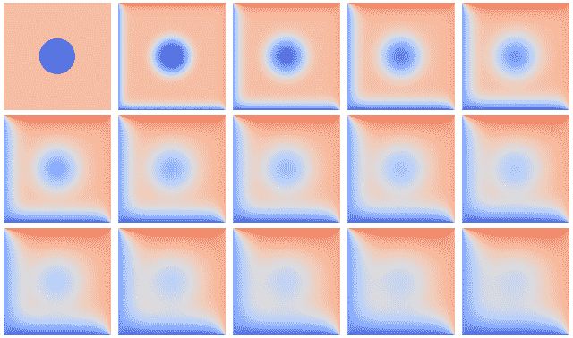
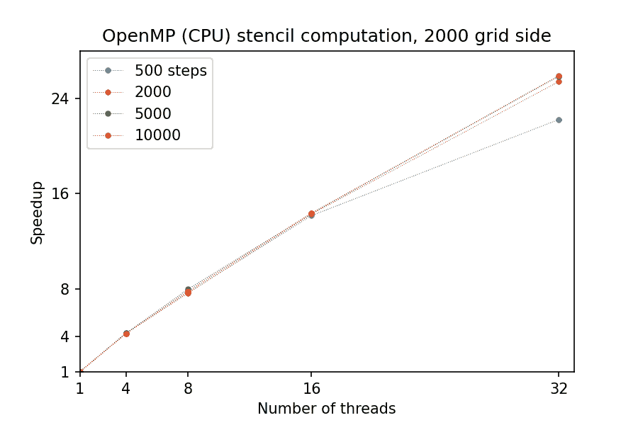
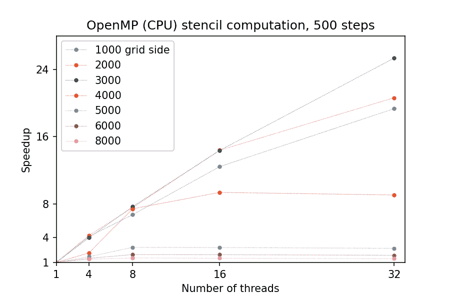
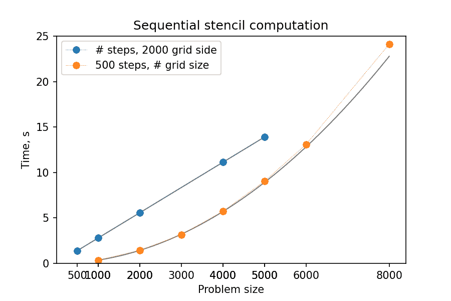
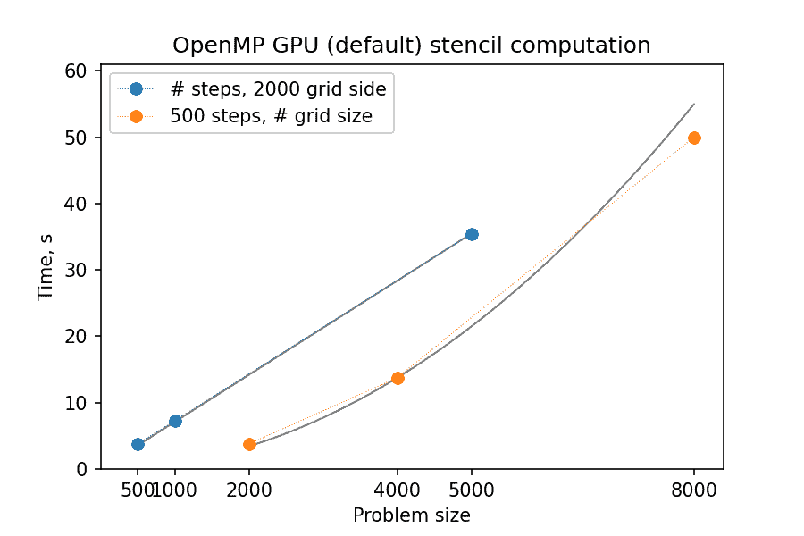
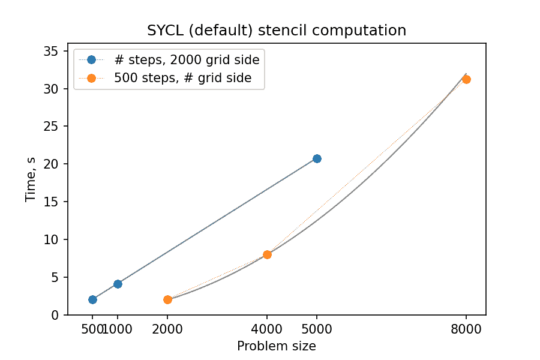
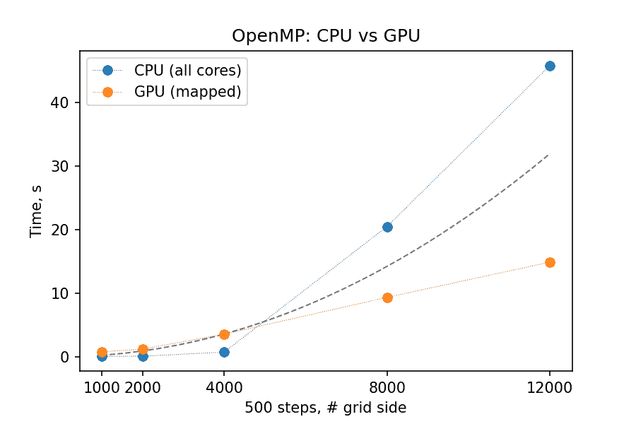
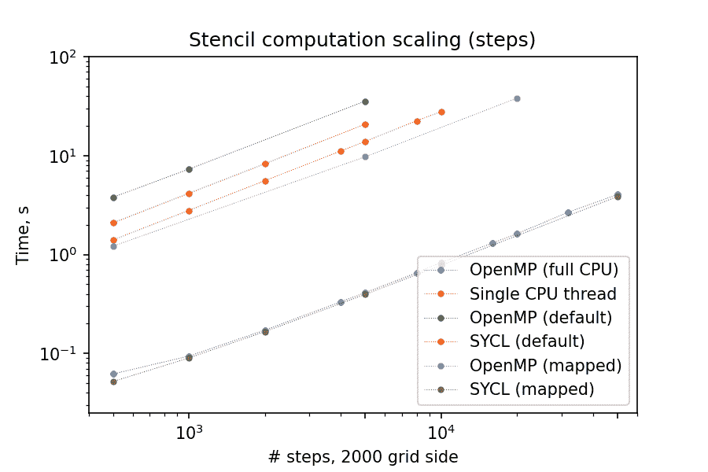
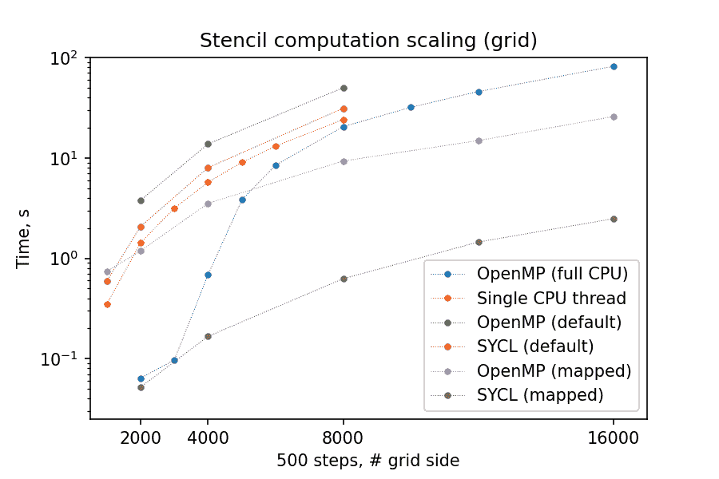

# 示例：整合所有内容

> 原文：[`enccs.github.io/gpu-programming/13-examples/`](https://enccs.github.io/gpu-programming/13-examples/)

*GPU 编程：为什么、何时以及如何？* **   示例：整合所有内容

+   [在 GitHub 上编辑](https://github.com/ENCCS/gpu-programming/blob/main/content/13-examples.rst)

* * *

问题

+   我该如何编译和运行使用不同编程模型和框架开发的代码？

+   我可以从 GPU 移植的程序中期望什么样的性能提升/趋势，以及我该如何估计这一点？

目标

+   展示一个在 CPU 和 GPU 上使用不同编程模型执行的并行计算的自包含示例

+   展示在自然“风格”的不同模型/框架中实现相同算法的差异和后果

+   讨论如何评估 GPU 代码的理论和实际性能缩放

教师备注

+   35 分钟教学

+   30 分钟练习

## 问题：二维区域中的热流

物体中的热流根据局部温度差异进行，就像寻求局部平衡一样。以下示例定义了一个矩形区域，其中有两个始终温暖的侧面（温度为 70 和 85），两个冷的侧面（温度为 20 和 5）以及中心的一个冷盘。由于热扩散，区域相邻区域的温度必然趋于相等，从而改变整体分布：



随着时间的推移，温度分布从初始状态向最终状态发展，其中上三角区域温暖，下三角区域寒冷。平均温度趋于 (70 + 85 + 20 + 5) / 4 = 45。

## 技术：模板计算

上面的系统中热传递由描述时间和空间中温度场局部变化的偏微分方程（组）控制。也就是说，温度场 \(u(x, y, t)\) 在两个空间维度 \(x\) 和 \(y\) 以及时间 \(t\)（速率系数为 \(\alpha\)）上的变化率可以通过以下方程进行建模

\[\frac{\partial u}{\partial t} = \alpha \left( \frac{\partial² u}{\partial x²} + \frac{\partial² u}{\partial y²}\right)\]

数值求解微分方程的标准方法是对其进行**离散化**，即只考虑在特定时间点上的特定区域点集/网格。这样，偏导数 \({\partial u}\) 就被转换成相邻网格点 \(u^{m}(i,j)\) 之间的差值，其中 \(m, i, j\) 分别表示时间和空间网格点。现在可以从较早时间点的邻近点的值计算某一点的温度随时间的变化；相同的表达式，称为**模板**，应用于网格上的每个点。


这个简化的模型使用状态 \(m\) 中浅蓝色的 8x8 数据网格，每个位置都必须根据指示的黄色 5 点模板进行更新，以移动到下一个时间点 \(m+1\)。

问题：模板应用

模板计算在解决数值问题时很常见。你遇到过吗？你能想到在你的领域/专业领域中可以用这种方式表述的问题吗？

解决方案

一个明显的选择是**卷积**操作，在图像处理中用于应用各种滤波核；在某些情况下，“卷积”和“模板”几乎可以互换使用。其他相关用途是用于相邻值的平均/池化。

### 技术考虑

**1. 解的求解速度和/或精度如何？**

温度场的空间分辨率由网格点的数量/密度控制。由于需要完整的网格更新才能从一个时间点推进到下一个时间点，因此模板计算是并行化的主要目标（在 CPU 或 GPU 上）。

此外，在许多情况下，选择的时间步长不能任意大，否则数值微分将失败，密集/精确的网格意味着小的时间步长（见下插图中），这使得有效的空间更新变得更加重要。

可选：模板表达式和时间步长限制

上面的微分方程可以使用不同的方案进行离散化。对于这个例子，每个网格点 \(u^{m}(i,j)\) 的温度值从一点时间 (\(m\)) 更新到下一个时间点 (\(m+1\))，使用以下表达式：

\[u^{m+1}(i,j) = u^m(i,j) + \Delta t \alpha \nabla² u^m(i,j) ,\]

其中

\[\begin{split}\nabla² u &= \frac{u(i-1,j)-2u(i,j)+u(i+1,j)}{(\Delta x)²} \\ &+ \frac{u(i,j-1)-2u(i,j)+u(i,j+1)}{(\Delta y)²} ,\end{split}\]

以及 \(\Delta x\)，\(\Delta y\)，\(\Delta t\) 分别是空间和时间中的步长。

时间更新方案通常对最大允许的时间步长 \(\Delta t\) 有限制。对于当前方案，它等于

\[\Delta t_{max} = \frac{(\Delta x)² (\Delta y)²}{2 \alpha ((\Delta x)² + (\Delta y)²)}\]

**2. 如何处理区域边界？**

自然地，模板表达式不能直接应用于最外层的网格点，这些点没有外部邻居。这可以通过改变这些点的表达式或添加一个额外的网格层来解决，该网格层用于计算更新，但自身不更新 - 在这个例子中，用于边界的固定温度点正在被使用。

**3. 如何进一步优化算法？**

在[早期的一集](https://enccs.github.io/gpu-programming/7-non-portable-kernel-models/#memory-optimizations)中，已经强调了高效内存访问的重要性。在以下示例中，每个网格点（及其邻居）主要被独立处理；然而，这也意味着对于 5 点 stencil，每个网格点的值可能最多从内存中读取 5 次（即使它是快速的 GPU 内存）。通过重新排列数学运算的顺序，可能以更有效的方式重用这些值。

另一点需要注意的是，即使解决方案以小时间步传播，也不一定每个步骤都需要输出。一旦某个*局部*区域被更新，从数学上讲，它不会被更新第二次——即使其余区域仍在重新计算——只要在需要时该区域的边界有\(t = m-1\)值。（当然，这更难实现，并且只有在某些情况下才会带来好处。）

下表将帮助您导航本节的其余部分：

本集指南

+   C++中的[顺序和 OpenMP 线程代码](https://enccs.github.io/gpu-programming/13-examples/#sequential-and-thread-parallel-program-in-c)，包括编译/运行说明

+   [简单的 GPU 并行化](https://enccs.github.io/gpu-programming/13-examples/#gpu-parallelization-first-steps)，包括 SYCL 编译说明

+   [带有设备数据管理的 GPU 代码](https://enccs.github.io/gpu-programming/13-examples/#gpu-parallelization-data-movement)（OpenMP，SYCL）

+   [Python 实现](https://enccs.github.io/gpu-programming/13-examples/#python-jit-and-gpu-acceleration)，包括在[Google Colab](https://colab.research.google.com/)上的运行说明

+   [Julia 实现](https://enccs.github.io/gpu-programming/13-examples/#julia-gpu-acceleration)，包括运行说明

## C++中的顺序和线程并行程序

尝试代码示例

本节其余部分展示的示例源文件可在[content/examples/stencil/](https://github.com/ENCCS/gpu-programming/tree/main/content/examples/stencil/)目录中找到。要将它们下载到集群上您偏好的目录（例如 `/scratch/project_<#>/<your_folder>/`），您可以使用 Git：

```
$ git  clone  https://github.com/ENCCS/gpu-programming.git
$ cd  gpu-programming/content/examples/stencil/
$ ls 
```

警告

如果您已经从工作坊的第一天开始就有内容，别忘了使用`git pull`获取最新更新！

如果我们假设网格点值在单个时间步长内真正独立，那么可以将 stencil 应用过程直接编写为对网格点的循环，如下表“Stencil 更新”所示。（程序的一般结构和问题模型的默认参数值也提供供参考。）然后可以通过单个 OpenMP `#pragma`启用 CPU 线程并行：

[stencil/base/](https://github.com/ENCCS/gpu-programming/tree/main/content/examples/stencil/base/)

> **core.cpp**

```
// (c) 2023 ENCCS, CSC and the contributors
#include  "heat.h"

// Update the temperature values using five-point stencil
// Arguments:
//   curr: current temperature values
//   prev: temperature values from previous time step
//   a: diffusivity
//   dt: time step
void  evolve(field  *curr,  field  *prev,  double  a,  double  dt)
{
  // Help the compiler avoid being confused by the structs
  double  *currdata  =  curr->data.data();
  double  *prevdata  =  prev->data.data();
  int  nx  =  prev->nx;
  int  ny  =  prev->ny;

  // Determine the temperature field at next time step
  // As we have fixed boundary conditions, the outermost gridpoints
  // are not updated.
  double  dx2  =  prev->dx  *  prev->dx;
  double  dy2  =  prev->dy  *  prev->dy;

  // Use OpenMP threads for parallel update of grid values
 #pragma omp parallel for  for  (int  i  =  1;  i  <  nx  +  1;  i++)  {
  for  (int  j  =  1;  j  <  ny  +  1;  j++)  {
  int  ind  =  i  *  (ny  +  2)  +  j;
  int  ip  =  (i  +  1)  *  (ny  +  2)  +  j;
  int  im  =  (i  -  1)  *  (ny  +  2)  +  j;
  int  jp  =  i  *  (ny  +  2)  +  j  +  1;
  int  jm  =  i  *  (ny  +  2)  +  j  -  1;
  currdata[ind]  =  prevdata[ind]  +  a*dt*
  ((prevdata[ip]  -  2.0*prevdata[ind]  +  prevdata[im])  /  dx2  +
  (prevdata[jp]  -  2.0*prevdata[ind]  +  prevdata[jm])  /  dy2);
  }
  }
} 
```

> **main.cpp**

```
// Main routine for heat equation solver in 2D.
// (c) 2023 ENCCS, CSC and the contributors
#include  <cstdio>
#include  <omp.h>

#include  "heat.h"

double  start_time  ()  {  return  omp_get_wtime();  }
double  stop_time  ()  {  return  omp_get_wtime();  }

int  main(int  argc,  char  **argv)
{
  // Set up the solver
  int  nsteps;
  field  current,  previous;
  initialize(argc,  argv,  &current,  &previous,  &nsteps);

  // Output the initial field and its temperature
  field_write(&current,  0);
  double  average_temp  =  field_average(&current);
  printf("Average temperature, start: %f\n",  average_temp);

  // Set diffusivity constant
  double  a  =  0.5;
  // Compute the largest stable time step
  double  dx2  =  current.dx  *  current.dx;
  double  dy2  =  current.dy  *  current.dy;
  double  dt  =  dx2  *  dy2  /  (2.0  *  a  *  (dx2  +  dy2));
  // Set output interval
  int  output_interval  =  1500;

  // Start timer
  double  start_clock  =  start_time();
  // Time evolution
  for  (int  iter  =  1;  iter  <=  nsteps;  iter++)  {
 evolve(&current,  &previous,  a,  dt);  if  (iter  %  output_interval  ==  0)  {
  field_write(&current,  iter);
  }
  // Swap current and previous fields for next iteration step
  field_swap(&current,  &previous);
  }
  // Stop timer
  double  stop_clock  =  stop_time();

  // Output the final field and its temperature
  average_temp  =  field_average(&previous);
  printf("Average temperature at end: %f\n",  average_temp);
  // Compare temperature for reference
  if  (argc  ==  1)  {
  printf("Control temperature at end: 59.281239\n");
  }
  field_write(&previous,  nsteps);

  // Determine the computation time used for all the iterations
  printf("Iterations took %.3f seconds.\n",  (stop_clock  -  start_clock));

  return  0;
} 
```

> **heat.h**

```
// Datatype for temperature field
struct  field  {
  // nx and ny are the dimensions of the field. The array data
  // contains also ghost layers, so it will have dimensions nx+2 x ny+2
  int  nx;
  int  ny;
  // Size of the grid cells
  double  dx;
  double  dy;
  // The temperature values in the 2D grid
  std::vector<double>  data;
};

// CONSTANTS
// Fixed grid spacing
const  double  DX  =  0.01;
const  double  DY  =  0.01;
// Default temperatures
const  double  T_DISC  =  5.0;
const  double  T_AREA  =  65.0;
const  double  T_UPPER  =  85.0;
const  double  T_LOWER  =  5.0;
const  double  T_LEFT  =  20.0;
const  double  T_RIGHT  =  70.0;
// Default problem size
const  int  ROWS  =  2000;
const  int  COLS  =  2000;
const  int  NSTEPS  =  500; 
```

可选：编译可执行文件

> 要编译基于 OpenMP 的可执行文件，请按照以下说明操作：

```
salloc -A project_465002387 -p small-g -N 1 -c 8 -n 1 --gpus-per-node=1 -t 1:00:00

module load LUMI/24.03
module load partition/G
module load rocm/6.0.3
module load PrgEnv-cray/8.5.0

cd base/
make all 
```

之后登录到计算节点并测试可执行文件（或直接使用`srun <executable>`）：

```
$ srun  --pty  bash

$ ./stencil
$ ./stencil_off
$ ./stencil_data

$ exit 
```

如果一切顺利，输出应该看起来像这样：

```
$ ./stencil
Average temperature, start: 59.763305
Average temperature at end: 59.281239
Control temperature at end: 59.281239
Iterations took 0.566 seconds.
$ ./stencil_off
Average temperature, start: 59.763305
Average temperature at end: 59.281239
Control temperature at end: 59.281239
Iterations took 3.792 seconds.
$ ./stencil_data
Average temperature, start: 59.763305
Average temperature at end: 59.281239
Control temperature at end: 59.281239
Iterations took 1.211 seconds.
$ 
```

### CPU 并行化：计时

（**注意**：对于线程并行运行，需要请求多个 CPU 核心。在 LUMI-G 分区中，可以通过请求多个 GPU 来实现；另一种选择是使用-C 分区。）

以下提供了 OpenMP 线程并行实现的基准测试：

运行 OpenMP 启用可执行文件的时间，s

| 任务大小 | 1 CPU 核心 | 32 CPU 核心 |
| --- | --- | --- |
| S:2000 T:500 | 1.402 | 0.064 |
| S:2000 T:5000 | 13.895 | 0.538 |
| S:2000 T:10000 | 27.753 | 1.071 |
| S:4000 T:500 | 5.727 | 0.633 |
| S:8000 T:500 | 24.130 | 16.616 |

仔细观察可以发现，计算时间随着**时间步**的增加而非常理想地扩展：



然而，对于更大的**网格大小**，并行化变得效率低下——因为网格的各个块太大，无法适应 CPU 缓存，线程的速度受到 RAM 读取/写入速度的限制：



讨论：热流计算扩展

1.  热流计算**预计**如何随时间步数的增加而扩展？

    1.  线性级

    1.  二次方级

    1.  指数级

1.  stencils 应用（网格更新）**预计**如何随网格边长的大小而扩展？

    1.  线性级

    1.  二次方级

    1.  指数级

1.  （可选）你期望 GPU 加速计算会遵循上述趋势吗？为什么/为什么不？

解决方案

1.  答案是 a：因为每个时间步都遵循前一个时间步，并且涉及相似数量的操作，因此每步的更新时间将大致保持不变。

1.  答案是 b：因为 stencil 应用对每个网格点都是独立的，更新时间将与点的数量成正比，即边长 * 边长。

## GPU 并行化：第一步

让我们应用之前几集中介绍的一些技术，使 stencil 更新在 GPU 上运行。

OpenMP（或 OpenACC）卸载需要定义一个要并行执行的区域以及要复制到/在 GPU 内存中使用的数据。同样，SYCL 编程模型提供了方便的方式来定义执行内核，以及运行它们的环境（称为队列）。

下面标签中显示了 stencil 更新代码对 OpenMP 和 SYCL 的更改：

[stencil/](https://github.com/ENCCS/gpu-programming/tree/main/content/examples/stencil/base/)

> **base/core-off.cpp**

```
// (c) 2023 ENCCS, CSC and the contributors
#include  "heat.h"

// Update the temperature values using five-point stencil
// Arguments:
//   curr: current temperature values
//   prev: temperature values from previous time step
//   a: diffusivity
//   dt: time step
void  evolve(field  *curr,  field  *prev,  double  a,  double  dt)
{
  // Help the compiler avoid being confused by the structs
  double  *currdata  =  curr->data.data();
  double  *prevdata  =  prev->data.data();
  int  nx  =  prev->nx;
  int  ny  =  prev->ny;

  // Determine the temperature field at next time step
  // As we have fixed boundary conditions, the outermost gridpoints
  // are not updated.
  double  dx2  =  prev->dx  *  prev->dx;
  double  dy2  =  prev->dy  *  prev->dy;

  // Offload value update to GPU target (fallback to CPU is possible)
 #pragma omp target teams distribute parallel for \ map(currdata[0:(nx+2)*(ny+2)],prevdata[0:(nx+2)*(ny+2)])  for  (int  i  =  1;  i  <  nx  +  1;  i++)  {
  for  (int  j  =  1;  j  <  ny  +  1;  j++)  {
  int  ind  =  i  *  (ny  +  2)  +  j;
  int  ip  =  (i  +  1)  *  (ny  +  2)  +  j;
  int  im  =  (i  -  1)  *  (ny  +  2)  +  j;
  int  jp  =  i  *  (ny  +  2)  +  j  +  1;
  int  jm  =  i  *  (ny  +  2)  +  j  -  1;
  currdata[ind]  =  prevdata[ind]  +  a*dt*
  ((prevdata[ip]  -  2.0*prevdata[ind]  +  prevdata[im])  /  dx2  +
  (prevdata[jp]  -  2.0*prevdata[ind]  +  prevdata[jm])  /  dy2);
  }
  }
} 
```

> **sycl/core-naive.cpp**

```
// (c) 2023 ENCCS, CSC and the contributors
#include  "heat.h"
#include  <sycl/sycl.hpp>

// Update the temperature values using five-point stencil
// Arguments:
//   queue: SYCL queue
//   curr: current temperature values
//   prev: temperature values from previous time step
//   a: diffusivity
//   dt: time step
void  evolve(sycl::queue  &Q,  field  *curr,  field  *prev,  double  a,  double  dt)  {
  // Help the compiler avoid being confused by the structs
  int  nx  =  prev->nx;
  int  ny  =  prev->ny;
  int  size  =  (nx  +  2)  *  (ny  +  2);

  // Determine the temperature field at next time step
  // As we have fixed boundary conditions, the outermost gridpoints
  // are not updated.
  double  dx2  =  prev->dx  *  prev->dx;
  double  dy2  =  prev->dy  *  prev->dy;

 double  *currdata  =  sycl::malloc_device<double>(size,  Q); double  *prevdata  =  sycl::malloc_device<double>(size,  Q); Q.copy<double>(curr->data.data(),  currdata,  size); Q.copy<double>(prev->data.data(),  prevdata,  size); 
 Q.parallel_for(sycl::range<2>(nx,  ny),  =  {  auto  i  =  id[0]  +  1;
  auto  j  =  id[1]  +  1;

  int  ind  =  i  *  (ny  +  2)  +  j;
  int  ip  =  (i  +  1)  *  (ny  +  2)  +  j;
  int  im  =  (i  -  1)  *  (ny  +  2)  +  j;
  int  jp  =  i  *  (ny  +  2)  +  j  +  1;
  int  jm  =  i  *  (ny  +  2)  +  j  -  1;
  currdata[ind]  =  prevdata[ind]  +  a*dt*
  ((prevdata[ip]  -  2.0*prevdata[ind]  +  prevdata[im])  /  dx2  +
  (prevdata[jp]  -  2.0*prevdata[ind]  +  prevdata[jm])  /  dy2);
  });

 Q.copy<double>(currdata,  curr->data.data(),  size).wait(); sycl::free(currdata,  Q); sycl::free(prevdata,  Q); } 
```

在 LUMI 上加载 SYCL 模块

由于 SYCL 位于 ROCm/HIP（或 CUDA）软件堆栈之上，运行 SYCL 可执行文件可能需要加载相应的模块。在当前节点上，可以按以下方式完成：

```
# salloc  -A  project_465002387  -p  small-g  -N  1  -c  8  -n  1  --gpus-per-node=1  -t  1:00:00

module load LUMI/24.03
module load partition/G
module load rocm/6.0.3
module use  /appl/local/csc/modulefiles
module load acpp/24.06.0 
```

可选：编译 SYCL 可执行文件

如前所述，您欢迎生成自己的可执行文件：

```
$ cd  ../sycl/
(give the following lines some time, probably a couple of min)
$ acpp  -O2  -o  stencil_naive  core-naive.cpp  io.cpp  main-naive.cpp  pngwriter.c  setup.cpp  utilities.cpp
$ acpp  -O2  -o  stencil_data  core.cpp  io.cpp  main.cpp  pngwriter.c  setup.cpp  utilities.cpp

$ srun  stencil_naive
$ srun  stencil_data 
```

如果一切顺利，输出应该类似于以下内容：

```
$ srun  stencil_naive
Average temperature, start: 59.763305
Average temperature at end: 59.281239
Control temperature at end: 59.281239
Iterations took 2.086 seconds.
$ srun  stencil_data
Average temperature, start: 59.763305
Average temperature at end: 59.281239
Control temperature at end: 59.281239
Iterations took 0.052 seconds. 
```

练习：原始 GPU 端口

测试您编译的可执行文件`base/stencil`、`base/stencil_off`和`sycl/stencil_naive`。尝试更改问题大小参数：

+   `srun stencil_naive 2000 2000 5000`

需要注意的事项：

+   计算时间如何变化？

+   结果是否符合您的预期？

解答

您可能会注意到，GPU-“移植”版本实际上比单 CPU 核心版本运行得更慢！实际上，所有三个版本的扩展行为都是相似且预期的，这是一个好兆头；只是“计算单元成本”不同。您可以在下面的选项卡中比较基准摘要：



## GPU 并行化：数据移动

为什么上述移植方法似乎效率很低？

在每一步，我们：

+   重新分配 GPU 内存，

+   将数据从 CPU 复制到 GPU，

+   执行计算，

+   然后将数据复制回来。

但是，通过注意最小化主机和设备内存之间的数据传输，可以减少开销：

+   在程序开始时一次性分配 GPU 内存，

+   只在我们需要时从 GPU 复制数据到 CPU，

+   在时间步之间交换 GPU 缓冲区，就像我们处理 CPU 缓冲区一样。（OpenMP 会自动完成此操作。）

下面显示了 stencil 更新代码的变化（也可以查看相应的 main()函数以检查持久 GPU 缓冲区创建、访问和删除的调用）：

[stencil/](https://github.com/ENCCS/gpu-programming/tree/main/content/examples/stencil/base/)

> **base/core-data.cpp**

```
// (c) 2023 ENCCS, CSC and the contributors
#include  "heat.h"

// Update the temperature values using five-point stencil
// Arguments:
//   curr: current temperature values
//   prev: temperature values from previous time step
//   a: diffusivity
//   dt: time step
void  evolve(field  *curr,  field  *prev,  double  a,  double  dt)
{
  // Help the compiler avoid being confused by the structs
  double  *currdata  =  curr->data.data();
  double  *prevdata  =  prev->data.data();
  int  nx  =  prev->nx;
  int  ny  =  prev->ny;

  // Determine the temperature field at next time step
  // As we have fixed boundary conditions, the outermost gridpoints
  // are not updated.
  double  dx2  =  prev->dx  *  prev->dx;
  double  dy2  =  prev->dy  *  prev->dy;

  // Offload value update to GPU target (fallback to CPU is possible)
 #pragma omp target teams distribute parallel for  for  (int  i  =  1;  i  <  nx  +  1;  i++)  {
  for  (int  j  =  1;  j  <  ny  +  1;  j++)  {
  int  ind  =  i  *  (ny  +  2)  +  j;
  int  ip  =  (i  +  1)  *  (ny  +  2)  +  j;
  int  im  =  (i  -  1)  *  (ny  +  2)  +  j;
  int  jp  =  i  *  (ny  +  2)  +  j  +  1;
  int  jm  =  i  *  (ny  +  2)  +  j  -  1;
  currdata[ind]  =  prevdata[ind]  +  a*dt*
  ((prevdata[ip]  -  2.0*prevdata[ind]  +  prevdata[im])  /  dx2  +
  (prevdata[jp]  -  2.0*prevdata[ind]  +  prevdata[jm])  /  dy2);
  }
  }
}

// Start a data region and copy temperature fields to the device void  enter_data(field  *curr,  field  *prev) {
 double  *currdata  =  curr->data.data(); double  *prevdata  =  prev->data.data(); int  nx  =  prev->nx; int  ny  =  prev->ny;   // adding data mapping here #pragma omp target enter data \ map(to: currdata[0:(nx+2)*(ny+2)], prevdata[0:(nx+2)*(ny+2)]) }   // End a data region and copy temperature fields back to the host void  exit_data(field  *curr,  field  *prev) {
 double  *currdata  =  curr->data.data(); double  *prevdata  =  prev->data.data(); int  nx  =  prev->nx; int  ny  =  prev->ny;   // adding data mapping here #pragma omp target exit data \ map(from: currdata[0:(nx+2)*(ny+2)], prevdata[0:(nx+2)*(ny+2)]) }   // Copy a temperature field from the device to the host void  update_host(field  *heat) {
 double  *data  =  heat->data.data(); int  nx  =  heat->nx; int  ny  =  heat->ny;   // adding data mapping here #pragma omp target update from(data[0:(nx+2)*(ny+2)]) } 
```

> **sycl/core.cpp**

```
// (c) 2023 ENCCS, CSC and the contributors
#include  "heat.h"
#include  <sycl/sycl.hpp>

// Update the temperature values using five-point stencil
// Arguments:
//   queue: SYCL queue
//   currdata: current temperature values (device pointer)
//   prevdata: temperature values from previous time step (device pointer)
//   prev: description of the grid parameters
//   a: diffusivity
//   dt: time step
void  evolve(sycl::queue  &Q,  double*  currdata,  const  double*  prevdata,
 const  field  *prev,  double  a,  double  dt) {
  int  nx  =  prev->nx;
  int  ny  =  prev->ny;

  // Determine the temperature field at next time step
  // As we have fixed boundary conditions, the outermost gridpoints
  // are not updated.
  double  dx2  =  prev->dx  *  prev->dx;
  double  dy2  =  prev->dy  *  prev->dy;

 Q.parallel_for(sycl::range<2>(nx,  ny),  =  {  auto  i  =  id[0]  +  1;
  auto  j  =  id[1]  +  1;

  int  ind  =  i  *  (ny  +  2)  +  j;
  int  ip  =  (i  +  1)  *  (ny  +  2)  +  j;
  int  im  =  (i  -  1)  *  (ny  +  2)  +  j;
  int  jp  =  i  *  (ny  +  2)  +  j  +  1;
  int  jm  =  i  *  (ny  +  2)  +  j  -  1;
  currdata[ind]  =  prevdata[ind]  +  a*dt*
  ((prevdata[ip]  -  2.0*prevdata[ind]  +  prevdata[im])  /  dx2  +
  (prevdata[jp]  -  2.0*prevdata[ind]  +  prevdata[jm])  /  dy2);
  });
}

void  copy_to_buffer(sycl::queue  Q,  double*  buffer,  const  field*  f) {
 int  size  =  (f->nx  +  2)  *  (f->ny  +  2); Q.copy<double>(f->data.data(),  buffer,  size); }   void  copy_from_buffer(sycl::queue  Q,  const  double*  buffer,  field  *f) {
 int  size  =  (f->nx  +  2)  *  (f->ny  +  2); Q.copy<double>(buffer,  f->data.data(),  size).wait(); } 
```

练习：更新后的 GPU 端口

测试您编译的可执行文件`base/stencil_data`和`sycl/stencil_data`。尝试更改问题大小参数：

+   `srun stencil 2000 2000 5000`

需要注意的事项：

+   这次计算时间如何变化？

+   在您的机器上，10 秒内您能得到最大的网格和/或最长的传播时间是多少？

解答

使用具有映射设备数据的 GPU 卸载，对于较大的网格大小，与线程并行版本相比，可以实现性能提升，因为后者版本本质上成为 RAM 限制的，但前者不是。



下面您可以找到 stencil 更新任务的步骤和网格扩展的摘要图。由于更明确的编程方法，SYCL GPU 端口比 OpenMP 卸载版本快得多，与运行在单个节点所有核心上的线程并行 CPU 版本相当。



## Python：JIT 和 GPU 加速

如前所述 [之前](https://enccs.github.io/gpu-programming/9-language-support/#numba)，Numba 包允许开发者即时（JIT）编译 Python 代码以在 CPU 上快速运行，但也可以用于为（NVIDIA）GPU 进行 JIT 编译。JIT 在基于循环、计算密集型函数上似乎运行良好，因此尝试它是一个不错的选择，用于初始源版本：

[stencil/python-numba](https://github.com/ENCCS/gpu-programming/tree/main/content/examples/stencil/python-numba/)

> **core.py**

```
from  numba  import jit

# Update the temperature values using five-point stencil
# Arguments:
#   curr: current temperature field object
#   prev: temperature field from previous time step
#   a: diffusivity
#   dt: time step
def  evolve(current, previous, a, dt):
    dx2, dy2 = previous.dx**2, previous.dy**2
    curr, prev = current.data, previous.data
    # Run (possibly accelerated) update
    _evolve(curr, prev, a, dt, dx2, dy2)

@jit(nopython=True) def  _evolve(curr, prev, a, dt, dx2, dy2):
    nx, ny = prev.shape # These are the FULL dims, rows+2 / cols+2
    for i in range(1, nx-1):
        for j in range(1, ny-1):
            curr[i, j] = prev[i, j] + a * dt * ( \
              (prev[i+1, j] - 2*prev[i, j] + prev[i-1, j]) / dx2 + \
              (prev[i, j+1] - 2*prev[i, j] + prev[i, j-1]) / dy2 ) 
```

> **heat.py**

```
@jit(nopython=True) def  _generate(data, nx, ny):
    # Radius of the source disc
    radius = nx / 6.0
    for i in range(nx+2):
        for j in range(ny+2):
            # Distance of point i, j from the origin
            dx = i - nx / 2 + 1
            dy = j - ny / 2 + 1
            if (dx * dx + dy * dy < radius * radius):
                data[i,j] = T_DISC
            else:
                data[i,j] = T_AREA

    # Boundary conditions
    for i in range(nx+2):
        data[i,0] = T_LEFT
        data[i, ny+1] = T_RIGHT

    for j in range(ny+2):
        data[0,j] = T_UPPER
        data[nx+1, j] = T_LOWER 
```

> **core_cuda.py**

```
import  math
from  numba  import cuda

# Update the temperature values using five-point stencil
# Arguments:
#   curr: current temperature field object
#   prev: temperature field from previous time step
#   a: diffusivity
#   dt: time step
def  evolve(current, previous, a, dt):
    dx2, dy2 = previous.dx**2, previous.dy**2
    curr, prev = current.dev, previous.dev
    # Set thread and block sizes
 nx, ny = prev.shape # These are the FULL dims, rows+2 / cols+2 tx, ty = (16, 16)   # Arbitrary choice bx, by = math.ceil(nx / tx), math.ceil(ny / ty)    # Run numba (CUDA) kernel
 _evolve_kernel(bx, by), (tx, ty) 

@cuda.jit()
def  _evolve_kernel(curr, prev, a, dt, dx2, dy2):
    nx, ny = prev.shape # These are the FULL dims, rows+2 / cols+2
    i, j = cuda.grid(2)
    if ((i >= 1) and (i < nx-1) 
        and (j >= 1) and (j < ny-1)):
        curr[i, j] = prev[i, j] + a * dt * ( \
            (prev[i+1, j] - 2*prev[i, j] + prev[i-1, j]) / dx2 + \
            (prev[i, j+1] - 2*prev[i, j] + prev[i, j-1]) / dy2 ) 
```

另一种方法是将模板更新代码重写为 NumPy 风格，利用循环向量化。

尝试 Python 示例

您可以通过以下链接获取 设置 部分的说明。您可以选择在以下任一位置运行提供的代码示例：

+   在 LUMI GPU 节点上，或者

+   您的本地机器，或者 LUMI CPU 节点，或者

+   Google Colab.

要通过容器在 GPU 节点上运行示例，

```
$ # skip the git clone step, if you have done that already
$ git  clone  https://github.com/ENCCS/gpu-programming.git
$ # allocate a GPU node using `salloc`
$ # execute the `srun --pty singularity exec ...` command
Singularity> cd /work/gpu-programming/content/examples/stencil/python-numba
Singularity> . /.venv/bin/activate
Singularity> python3 main.py 
```

要在 CPU 节点上运行示例，

```
$ git  clone  https://github.com/ENCCS/gpu-programming.git
$ cd  gpu-programming/content/examples/stencil/python-numba
$ # make sure you have active allocation
$ srun  python3  main.py 
```

下面提供了典型 Colab 运行的简要总结：

运行时间，Numba JIT 启用的 Python 程序，s

| 任务大小 | JIT (LUMI) | JIT (Colab) | 任务大小 | 无 JIT (Colab) |
| --- | --- | --- | --- | --- |
| S:2000 T:500 | 1.648 | 8.495 | S:200 T:50 | 5.318 |
| S:2000 T:200 | 0.787 | 3.524 | S:200 T:20 | 1.859 |
| S:1000 T:500 | 0.547 | 2.230 | S:100 T:50 | 1.156 |

Numba 的 `@vectorize` 和 `@guvectorize` 装饰器提供了一个接口，用于创建无需显式实现细节的 CPU-（或 GPU-）加速 *Python* 函数。然而，随着计算复杂性的增加，此类函数的编写（以及由编译器优化）变得越来越复杂。

Numba 还提供基于 CUDA 的直接内核编程，对于那些已经熟悉 CUDA 的人来说可能是最佳选择。上面章节中，在“GPU 上的模板更新”标签中展示了使用 Numba CUDA 编写的模板更新示例。在这种情况下，数据传输函数 `devdata = cuda.to_device(data)` 和 `devdata.copy_to_host(data)`（见 `main_cuda.py`）已由 Numba 包提供。

练习：Python 中的 CUDA 加速

使用 Google Colab（或您自己的机器），运行提供的 Numba-CUDA Python 程序。尝试更改问题大小参数：

+   `args.rows, args.cols, args.nsteps = 2000, 2000, 5000` 用于笔记本，

+   使用命令行运行 `srun python3 main.py 2000 2000 5000`。

需要注意的事项：

+   计算时间如何变化？

+   您是否获得了比 JIT 编译的 CPU 版本更好的性能？您可以将问题大小推到多远？

+   您能否监控 GPU 使用情况？

解决方案

一些来自 Colab 的数字：

运行时间，Numba CUDA Python 程序，s

| 作业大小 | JIT (LUMI) | JIT (Colab) | CUDA (Colab) |
| --- | --- | --- | --- |
| S:2000 T:500 | 1.648 | 8.495 | 1.079 |
| S:2000 T:2000 | 6.133 | 36.61 | 3.931 |
| S:5000 T:500 | 9.478 | 57.19 | 6.448 |

## Julia GPU 加速

上面的示例中可以找到一个 Julia 版本的 stencil 示例（[`github.com/ENCCS/HeatEquation.jl`](https://github.com/ENCCS/HeatEquation.jl) 中 HeatEquation 模块的简化版本）。源文件也位于此存储库的 [content/examples/stencil/julia](https://github.com/ENCCS/gpu-programming/tree/main/content/examples/stencil/julia) 目录中。

要在 LUMI CPU 分区上运行示例，请输入：

```
$ # interactive CPU node
$ srun  --account=project_465002387  --partition=standard  --nodes=1  --cpus-per-task=32  --ntasks-per-node=1  --time=01:00:00  --pty  bash
$ # load Julia env
$ module  purge
$ module  use  /appl/local/csc/modulefiles
$ module  load  julia
$ module  load  julia-amdgpu
$ # in directory with Project.toml and source files, instantiate an environment to install packages
$ julia  --project  -e  "using Pkg ; Pkg.instantiate()"
$ # finally run
$ julia  --project  main.jl 
```

要在 GPU 分区上运行，请使用 `srun` 命令

```
$ srun  --account=project_465002387  --partition=standard-g  --nodes=1  --cpus-per-task=1  --ntasks-per-node=1  --gpus-per-node=1  --time=1:00:00  --pty  bash 
```

可选依赖

注意，`main.jl` 和 `Project.toml` 中的 `Plots.jl` 依赖项已被注释掉。这在你首次实例化 Julia 环境时可以节省大约 2 分钟的预编译时间。要生成绘图，只需在 `Project.toml` 中取消注释注释掉的 `Plots.jl` 依赖项，重新实例化，并在 `main.jl` 中导入和使用 `Plots`。

```
#using Plots
using  BenchmarkTools

include("heat.jl")
include("core.jl")

"""
 visualize(curr::Field, filename=:none)

Create a heatmap of a temperature field. Optionally write png file. 
"""  
function  visualize(curr::Field,  filename=:none)
  background_color  =  :white
  plot  =  heatmap(
  curr.data,
  colorbar_title  =  "Temperature (C)",
  background_color  =  background_color
  )

  if  filename  !=  :none
  savefig(filename)
  else
  display(plot)
  end
end

ncols,  nrows  =  2048,  2048
nsteps  =  500

# initialize current and previous states to the same state
curr,  prev  =  initialize(ncols,  nrows)

# visualize initial field, requires Plots.jl
#visualize(curr, "initial.png")

# simulate temperature evolution for nsteps
simulate!(curr,  prev,  nsteps)

# visualize final field, requires Plots.jl
#visualize(curr, "final.png") 
```

```
using  ProgressMeter

"""
 evolve!(curr::Field, prev::Field, a, dt)

Calculate a new temperature field curr based on the previous 
field prev. a is the diffusion constant and dt is the largest 
stable time step. 
"""
function  evolve!(curr::Field,  prev::Field,  a,  dt)
  Threads.@threads  for  j  =  2:curr.ny+1
  for  i  =  2:curr.nx+1
  @inbounds  xderiv  =  (prev.data[i-1,  j]  -  2.0  *  prev.data[i,  j]  +  prev.data[i+1,  j])  /  curr.dx²
  @inbounds  yderiv  =  (prev.data[i,  j-1]  -  2.0  *  prev.data[i,  j]  +  prev.data[i,  j+1])  /  curr.dy²
  @inbounds  curr.data[i,  j]  =  prev.data[i,  j]  +  a  *  dt  *  (xderiv  +  yderiv)
  end  
  end
end

"""
 swap_fields!(curr::Field, prev::Field)

Swap the data of two fields curr and prev. 
"""  
function  swap_fields!(curr::Field,  prev::Field)
  tmp  =  curr.data
  curr.data  =  prev.data
  prev.data  =  tmp
end

""" 
 average_temperature(f::Field)

Calculate average temperature of a temperature field. 
"""
average_temperature(f::Field)  =  sum(f.data[2:f.nx+1,  2:f.ny+1])  /  (f.nx  *  f.ny)

"""
 simulate!(current, previous, nsteps)

Run the heat equation solver on fields curr and prev for nsteps.
"""
function  simulate!(curr::Field,  prev::Field,  nsteps)

  println("Initial average temperature: $(average_temperature(curr))")

  # Diffusion constant
  a  =  0.5
  # Largest stable time step
  dt  =  curr.dx²  *  curr.dy²  /  (2.0  *  a  *  (curr.dx²  +  curr.dy²))

  # display a nice progress bar
  p  =  Progress(nsteps)

  for  i  =  1:nsteps
  # calculate new state based on previous state
  evolve!(curr,  prev,  a,  dt)

  # swap current and previous fields
  swap_fields!(curr,  prev)

  # increment the progress bar
  next!(p)
  end  

  # print final average temperature
  println("Final average temperature: $(average_temperature(curr))")
end 
```

```
# Fixed grid spacing
const  DX  =  0.01
const  DY  =  0.01
# Default temperatures
const  T_DISC  =  5.0
const  T_AREA  =  65.0
const  T_UPPER  =  85.0
const  T_LOWER  =  5.0
const  T_LEFT  =  20.0
const  T_RIGHT  =  70.0
# Default problem size
const  ROWS  =  2000
const  COLS  =  2000
const  NSTEPS  =  500

"""
 Field(nx::Int64, ny::Int64, dx::Float64, dy::Float64, data::Matrix{Float64})

Temperature field type. nx and ny are the dimensions of the field. 
The array data contains also ghost layers, so it will have dimensions 
[nx+2, ny+2]
"""
mutable  struct Field{T<:AbstractArray}
  nx::Int64
  ny::Int64
  # Size of the grid cells
  dx::Float64
  dy::Float64
  # The temperature values in the 2D grid
  data::T
end

# outer constructor with default cell sizes and initialized data
Field(nx::Int64,  ny::Int64,  data)  =  Field{typeof(data)}(nx,  ny,  0.01,  0.01,  data)

# extend deepcopy to new type
Base.deepcopy(f::Field)  =  Field(f.nx,  f.ny,  f.dx,  f.dy,  deepcopy(f.data))

"""
 initialize(rows::Int, cols::Int, arraytype = Matrix)

Initialize two temperature field with (nrows, ncols) number of 
rows and columns. If the arraytype is something else than Matrix,
create data on the CPU first to avoid scalar indexing errors.
"""
function  initialize(nrows  =  1000,  ncols  =  1000,  arraytype  =  Matrix)
  data  =  zeros(nrows+2,  ncols+2)

  # generate a field with boundary conditions
  if  arraytype  !=  Matrix
  tmp  =  Field(nrows,  ncols,  data)
  generate_field!(tmp)
  gpudata  =  arraytype(tmp.data)
  previous  =  Field(nrows,  ncols,  gpudata)
  else
  previous  =  Field(nrows,  ncols,  data)
  generate_field!(previous)
  end

  current  =  Base.deepcopy(previous)

  return  previous,  current
end

"""
 generate_field!(field0::Field)

Generate a temperature field.  Pattern is disc with a radius
of nx / 6 in the center of the grid. Boundary conditions are 
(different) constant temperatures outside the grid.
"""
function  generate_field!(field::Field)
  # Square of the disk radius
  radius2  =  (field.nx  /  6.0)²

  for  j  =  1:field.ny+2
  for  i  =  1:field.nx+2
  ds2  =  (i  -  field.nx  /  2)²  +  (j  -  field.ny  /  2)²
  if  ds2  <  radius2  
  field.data[i,j]  =  T_DISC
  else
  field.data[i,j]  =  T_AREA
  end
  end  
  end  

  # Boundary conditions
  field.data[:,1]  .=  T_LEFT
  field.data[:,field.ny+2]  .=  T_RIGHT
  field.data[1,:]  .=  T_UPPER
  field.data[field.nx+2,:]  .=  T_LOWER
end 
```

```
[deps]
BenchmarkTools  =  "6e4b80f9-dd63-53aa-95a3-0cdb28fa8baf"
#Plots = "91a5bcdd-55d7-5caf-9e0b-520d859cae80"
ProgressMeter  =  "92933f4c-e287-5a05-a399-4b506db050ca" 
```

练习：Julia 移植到 GPU

仔细检查所有 Julia 源文件，并考虑以下问题：

1.  哪些函数应该移植到 GPU 上运行？

1.  查看 `initialize!()` 函数及其如何使用 `arraytype` 参数。这可以做得更紧凑和优雅，但这个解决方案解决了标量索引错误。什么是标量索引错误？

1.  尝试开始绘制关键函数的 GPU 移植版本。

1.  当你在 GPU 上运行版本（你的或下面提供的解决方案）时，尝试通过在 `main.jl` 中的 `simulate!()` 前添加 `@btime` 来对其进行基准测试。也要基准测试 CPU 版本，并进行比较。

提示

+   创建一个新的函数 `evolve_gpu!()`，它包含 `evolve!()` 的 GPU 核化版本

+   在 `simulate!()` 中的时间步长循环中，你需要一个条件语句，例如 `if typeof(curr.data) <: ROCArray` 来调用你的 GPU 移植函数

+   你不能将 `Field` 结构体传递给内核。你将需要直接传递数组 `Field.data`。这也需要传递其他变量，如 `curr.dx²` 等。

更多提示

+   由于数据是二维的，你需要 `i = (blockIdx().x - 1) * blockDim().x + threadIdx().x` 和 `j = (blockIdx().y - 1) * blockDim().y + threadIdx().y`

+   为了不过度索引二维数组，你可以使用一个条件语句，例如 `if i > 1 && j > 1 && i < nx+2 && j < ny+2`

+   在调用内核时，你可以设置线程数和块数，例如 `xthreads = ythreads = 16` 和 `xblocks, yblocks = cld(curr.nx, xthreads), cld(curr.ny, ythreads)`，然后使用，例如 `@roc threads=(xthreads, ythreads) blocks = (xblocks, yblocks) evolve_rocm!(curr.data, prev.data, curr.dx², curr.dy², nx, ny, a, dt)` 来调用它。

解决方案

1.  `evolve!()` 和 `simulate!()` 函数需要移植。`main.jl` 文件也需要更新以支持 GPU 数组。

1.  “标量索引”是指遍历 GPU 数组，这会非常慢，实际上仅在交互式 REPL 会话中允许这样做。如果没有`initialize!()`函数中的 if 语句，那么如果你在 GPU 上运行，`generate_field!()`方法将执行不允许的标量索引。

1.  GPU 移植的版本如下。在 CPU 和 GPU 上尝试它，并观察加速效果。尝试调整数组大小，看看加速效果是否受到影响。你还可以尝试调整`xthreads`和`ythreads`变量，看看是否会有所改变。

```
#using Plots
using  BenchmarkTools
using  AMDGPU

include("heat.jl")
include("core_gpu.jl")

"""
 visualize(curr::Field, filename=:none)

Create a heatmap of a temperature field. Optionally write png file. 
"""  
function  visualize(curr::Field,  filename=:none)
  background_color  =  :white
  plot  =  heatmap(
  curr.data,
  colorbar_title  =  "Temperature (C)",
  background_color  =  background_color
  )

  if  filename  !=  :none
  savefig(filename)
  else
  display(plot)
  end
end

ncols,  nrows  =  2048,  2048
nsteps  =  500

# initialize data on CPU
curr,  prev  =  initialize(ncols,  nrows,  ROCArray)
# initialize data on CPU
#curr, prev = initialize(ncols, nrows)

# visualize initial field, requires Plots.jl
#visualize(curr, "initial.png")

# simulate temperature evolution for nsteps
@btime  simulate!(curr,  prev,  nsteps)

# visualize final field, requires Plots.jl
#visualize(curr, "final.png") 
```

```
using  ProgressMeter

"""
 evolve!(curr::Field, prev::Field, a, dt)

Calculate a new temperature field curr based on the previous 
field prev. a is the diffusion constant and dt is the largest 
stable time step. 
"""
function  evolve!(curr::Field,  prev::Field,  a,  dt)
  Threads.@threads  for  j  =  2:curr.ny+1
  for  i  =  2:curr.nx+1
  @inbounds  xderiv  =  (prev.data[i-1,  j]  -  2.0  *  prev.data[i,  j]  +  prev.data[i+1,  j])  /  curr.dx²
  @inbounds  yderiv  =  (prev.data[i,  j-1]  -  2.0  *  prev.data[i,  j]  +  prev.data[i,  j+1])  /  curr.dy²
  @inbounds  curr.data[i,  j]  =  prev.data[i,  j]  +  a  *  dt  *  (xderiv  +  yderiv)
  end  
  end
end

function  evolve_cuda!(currdata,  prevdata,  dx2,  dy2,  nx,  ny,  a,  dt)
  i  =  (blockIdx().x  -  1)  *  blockDim().x  +  threadIdx().x
  j  =  (blockIdx().y  -  1)  *  blockDim().y  +  threadIdx().y
  if  i  >  1  &&  j  >  1  &&  i  <  nx+2  &&  j  <  ny+2
  @inbounds  xderiv  =  (prevdata[i-1,  j]  -  2.0  *  prevdata[i,  j]  +  prevdata[i+1,  j])  /  dx2
  @inbounds  yderiv  =  (prevdata[i,  j-1]  -  2.0  *  prevdata[i,  j]  +  prevdata[i,  j+1])  /  dy2
  @inbounds  currdata[i,  j]  =  prevdata[i,  j]  +  a  *  dt  *  (xderiv  +  yderiv)
  end
  return
end

function  evolve_rocm!(currdata,  prevdata,  dx2,  dy2,  nx,  ny,  a,  dt)
  i  =  (workgroupIdx().x  -  1)  *  workgroupDim().x  +  workitemIdx().x
  j  =  (workgroupIdx().y  -  1)  *  workgroupDim().y  +  workitemIdx().y
  if  i  >  1  &&  j  >  1  &&  i  <  nx+2  &&  j  <  ny+2
  @inbounds  xderiv  =  (prevdata[i-1,  j]  -  2.0  *  prevdata[i,  j]  +  prevdata[i+1,  j])  /  dx2
  @inbounds  yderiv  =  (prevdata[i,  j-1]  -  2.0  *  prevdata[i,  j]  +  prevdata[i,  j+1])  /  dy2
  @inbounds  currdata[i,  j]  =  prevdata[i,  j]  +  a  *  dt  *  (xderiv  +  yderiv)
  end
  return
end

"""
 swap_fields!(curr::Field, prev::Field)

Swap the data of two fields curr and prev. 
"""  
function  swap_fields!(curr::Field,  prev::Field)
  tmp  =  curr.data
  curr.data  =  prev.data
  prev.data  =  tmp
end

""" 
 average_temperature(f::Field)

Calculate average temperature of a temperature field. 
"""
average_temperature(f::Field)  =  sum(f.data[2:f.nx+1,  2:f.ny+1])  /  (f.nx  *  f.ny)

"""
 simulate!(current, previous, nsteps)

Run the heat equation solver on fields curr and prev for nsteps.
"""
function  simulate!(curr::Field,  prev::Field,  nsteps)

  println("Initial average temperature: $(average_temperature(curr))")

  # Diffusion constant
  a  =  0.5
  # Largest stable time step
  dt  =  curr.dx²  *  curr.dy²  /  (2.0  *  a  *  (curr.dx²  +  curr.dy²))

  # display a nice progress bar
  p  =  Progress(nsteps)

  for  i  =  1:nsteps
  # calculate new state based on previous state
  if  typeof(curr.data)  <:  ROCArray
  nx,  ny  =  size(curr.data)  .-  2  
  xthreads  =  ythreads  =  16
  xblocks,  yblocks  =  cld(curr.nx,  xthreads),  cld(curr.ny,  ythreads)
  @roc  groupsize=(xthreads,  ythreads)  gridsize  =  (xblocks,  yblocks)  evolve_rocm!(curr.data,  prev.data,  curr.dx²,  curr.dy²,  nx,  ny,  a,  dt)
  else
  evolve!(curr,  prev,  a,  dt)
  end

  # swap current and previous fields
  swap_fields!(curr,  prev)

  # increment the progress bar
  next!(p)
  end  

  # print final average temperature
  println("Final average temperature: $(average_temperature(curr))")
end 
```

## 参考以下内容

本节大量借鉴了[ENCCS](https://enccs.se/)和[CSC](https://csc.fi/)为几个其他计算研讨会创建的源代码和材料，并为此课程的目的进行了改编。如果你想了解更多关于特定编程模型/框架的信息，请务必查看这些内容！

+   [OpenMP 用于 GPU 卸载](https://enccs.github.io/openmp-gpu/)

+   [使用 SYCL 进行异构编程](https://enccs.github.io/sycl-workshop/)

+   [热流示例的教育实现（包括 MPI 感知 CUDA）](https://github.com/cschpc/heat-equation/) 上一页 下一页

* * *

© 版权所有 2023-2024，贡献者。

使用[Sphinx](https://www.sphinx-doc.org/)和由[Read the Docs](https://readthedocs.org)提供的[主题](https://github.com/readthedocs/sphinx_rtd_theme)构建。有问题？

+   我该如何编译和运行使用不同编程模型和框架开发的代码？

+   我可以从 GPU 移植的程序中获得哪些性能提升/趋势，我该如何估计这一点？

目标

+   为了展示使用不同编程模型在 CPU 和 GPU 上执行的并行计算的独立示例

+   为了展示在自然“风格”的不同模型/框架中实现相同算法的差异和后果

+   讨论如何评估 GPU 代码的理论和实际性能扩展

教师备注

+   35 分钟教学

+   30 分钟练习

## 问题：二维区域的热流

物体中的热量根据局部温度差异流动，就像在寻求局部平衡。以下示例定义了一个矩形区域，其中两侧始终温暖（温度 70 和 85），两侧寒冷（温度 20 和 5）以及中心的一个冷盘。由于热量扩散，该区域相邻区域的温度必然趋于平衡，从而改变整体分布：


随着时间的推移，温度分布从初始状态向最终状态发展，其中上三角区域温暖，下三角区域寒冷。平均温度趋于（70 + 85 + 20 + 5）/ 4 = 45。

## 技术：模板计算

上面的系统中，传热由描述时间和空间中温度场局部变化的偏微分方程（组）控制。也就是说，温度场 \(u(x, y, t)\) 在两个空间维度 \(x\) 和 \(y\) 以及时间 \(t\)（速率系数为 \(\alpha\)）上的变化率可以通过以下方程进行建模

\[\frac{\partial u}{\partial t} = \alpha \left( \frac{\partial² u}{\partial x²} + \frac{\partial² u}{\partial y²}\right)\]

数值求解微分方程的标准方法是对其进行 *离散化*，即仅在特定时间点的特定区域点集上考虑。这样，偏导数 \({\partial u}\) 转换为相邻网格点 \(u^{m}(i,j)\) 之间的差值，其中 \(m, i, j\) 分别表示时间和空间网格点。现在可以从较早时间点的邻近点的值计算某一点的温度随时间的变化；相同的表达式，称为 *模板*，应用于网格上的每个点。


这个简化的模型使用状态 \(m\) 中浅蓝色的 8x8 数据网格，每个位置都必须根据指示的黄色 5 点模板进行更新，以移动到下一个时间点 \(m+1\)。

问题：模板应用

模板计算在解决数值问题时很常见。你遇到过它吗？你能想到在你的领域/专业领域可以用这种方式表述的问题吗？

解法

一个明显的选择是 *卷积* 操作，用于图像处理中应用各种滤波内核；在某些情况下，“卷积”和“模板”几乎可以互换使用。其他相关用途是用于相邻值的平均/池化。

### 技术考虑

**1. 解法有多快和/或有多准确？**

温度场的空间分辨率由网格点的数量/密度控制。由于需要完整的网格更新才能从一个时间点推进到下一个时间点，因此模板计算是并行化的主要目标（在 CPU 或 GPU 上）。

此外，在许多情况下，选择的时间步长不能任意大，否则数值微分将失败，密集/精确的网格意味着时间步长很小（见下插图中），这使得有效的空间更新变得更加重要。

可选：模板表达式和时间步长限制

上面的微分方程可以使用不同的方案进行离散化。对于这个例子，每个网格点 \(u^{m}(i,j)\) 的温度值使用以下表达式从时间点 (\(m\)) 更新到下一个 (\(m+1\))：

\[u^{m+1}(i,j) = u^m(i,j) + \Delta t \alpha \nabla² u^m(i,j) ,\]

其中

\[\begin{split}\nabla² u &= \frac{u(i-1,j)-2u(i,j)+u(i+1,j)}{(\Delta x)²} \\ &+ \frac{u(i,j-1)-2u(i,j)+u(i,j+1)}{(\Delta y)²} ,\end{split}\]

以及 \(\Delta x\)、\(\Delta y\)、\(\Delta t\) 分别是空间和时间步长。

时间更新方案通常对允许的最大时间步长 \(\Delta t\) 有限制。对于当前方案，它等于

\[\Delta t_{max} = \frac{(\Delta x)² (\Delta y)²}{2 \alpha ((\Delta x)² + (\Delta y)²)}\]

**2. 如何处理区域边界？**

自然地，卷积表达式不能直接应用于没有外部邻居的最外层网格点。这可以通过改变这些点的表达式或添加一个额外的网格层来解决，该层用于计算更新但不进行更新——在这个例子中使用了固定温度的边点。

**3. 算法如何进一步优化？**

在 [早期的一集](https://enccs.github.io/gpu-programming/7-non-portable-kernel-models/#memory-optimizations) 中，已经强调了高效内存访问的重要性。在以下示例中，每个网格点（及其邻居）主要被独立处理；然而，这也意味着对于 5 点卷积，每个网格点的值可能最多从内存中读取 5 次（即使它是快速的 GPU 内存）。通过重新排列数学运算的顺序，可能以更有效的方式重用这些值。

另一点需要注意的是，即使解以小时间步长传播，也不一定每个步骤都需要输出。一旦某个 *局部* 区域的场被更新，数学上没有任何东西阻止它在第二次时间步中再次更新——即使其余的场仍在重新计算——只要在该区域边界需要时存在 \(t = m-1\) 的值。（当然，这更难实现，并且只有在某些情况下才会带来好处。）

下表将帮助您导航本节的其余部分：

播放指南

+   [顺序和 OpenMP 线程代码](https://enccs.github.io/gpu-programming/13-examples/#sequential-and-thread-parallel-program-in-c) 在 C++中，包括编译/运行说明

+   [简单的 GPU 并行化](https://enccs.github.io/gpu-programming/13-examples/#gpu-parallelization-first-steps)，包括 SYCL 编译说明

+   [具有设备数据管理的 GPU 代码](https://enccs.github.io/gpu-programming/13-examples/#gpu-parallelization-data-movement) (OpenMP, SYCL)

+   [Python 实现](https://enccs.github.io/gpu-programming/13-examples/#python-jit-and-gpu-acceleration)，包括在 [Google Colab](https://colab.research.google.com/) 上的运行说明

+   [Julia 实现](https://enccs.github.io/gpu-programming/13-examples/#julia-gpu-acceleration)，包括运行说明

## C++中的顺序和线程并行程序

尝试代码示例

本节余下部分提供的示例源文件位于[content/examples/stencil/](https://github.com/ENCCS/gpu-programming/tree/main/content/examples/stencil/)目录中。要将它们下载到集群上您首选的目录（例如 `/scratch/project_<#>/<your_folder>/`），您可以使用 Git：

```
$ git  clone  https://github.com/ENCCS/gpu-programming.git
$ cd  gpu-programming/content/examples/stencil/
$ ls 
```

警告

如果您已经从工作坊的第一天开始就有内容，别忘了使用 `git pull` 获取最新更新！

如果我们假设网格点值在单个时间步长内真正独立，那么模板应用过程可以简单地写成对网格点的循环，如下表“模板更新”所示。（程序的一般结构和问题模型的默认参数值也提供供参考。）然后可以通过单个 OpenMP `#pragma` 启用 CPU 线程并行：

[stencil/base/](https://github.com/ENCCS/gpu-programming/tree/main/content/examples/stencil/base/)

> **core.cpp**

```
// (c) 2023 ENCCS, CSC and the contributors
#include  "heat.h"

// Update the temperature values using five-point stencil
// Arguments:
//   curr: current temperature values
//   prev: temperature values from previous time step
//   a: diffusivity
//   dt: time step
void  evolve(field  *curr,  field  *prev,  double  a,  double  dt)
{
  // Help the compiler avoid being confused by the structs
  double  *currdata  =  curr->data.data();
  double  *prevdata  =  prev->data.data();
  int  nx  =  prev->nx;
  int  ny  =  prev->ny;

  // Determine the temperature field at next time step
  // As we have fixed boundary conditions, the outermost gridpoints
  // are not updated.
  double  dx2  =  prev->dx  *  prev->dx;
  double  dy2  =  prev->dy  *  prev->dy;

  // Use OpenMP threads for parallel update of grid values
 #pragma omp parallel for  for  (int  i  =  1;  i  <  nx  +  1;  i++)  {
  for  (int  j  =  1;  j  <  ny  +  1;  j++)  {
  int  ind  =  i  *  (ny  +  2)  +  j;
  int  ip  =  (i  +  1)  *  (ny  +  2)  +  j;
  int  im  =  (i  -  1)  *  (ny  +  2)  +  j;
  int  jp  =  i  *  (ny  +  2)  +  j  +  1;
  int  jm  =  i  *  (ny  +  2)  +  j  -  1;
  currdata[ind]  =  prevdata[ind]  +  a*dt*
  ((prevdata[ip]  -  2.0*prevdata[ind]  +  prevdata[im])  /  dx2  +
  (prevdata[jp]  -  2.0*prevdata[ind]  +  prevdata[jm])  /  dy2);
  }
  }
} 
```

> **main.cpp**

```
// Main routine for heat equation solver in 2D.
// (c) 2023 ENCCS, CSC and the contributors
#include  <cstdio>
#include  <omp.h>

#include  "heat.h"

double  start_time  ()  {  return  omp_get_wtime();  }
double  stop_time  ()  {  return  omp_get_wtime();  }

int  main(int  argc,  char  **argv)
{
  // Set up the solver
  int  nsteps;
  field  current,  previous;
  initialize(argc,  argv,  &current,  &previous,  &nsteps);

  // Output the initial field and its temperature
  field_write(&current,  0);
  double  average_temp  =  field_average(&current);
  printf("Average temperature, start: %f\n",  average_temp);

  // Set diffusivity constant
  double  a  =  0.5;
  // Compute the largest stable time step
  double  dx2  =  current.dx  *  current.dx;
  double  dy2  =  current.dy  *  current.dy;
  double  dt  =  dx2  *  dy2  /  (2.0  *  a  *  (dx2  +  dy2));
  // Set output interval
  int  output_interval  =  1500;

  // Start timer
  double  start_clock  =  start_time();
  // Time evolution
  for  (int  iter  =  1;  iter  <=  nsteps;  iter++)  {
 evolve(&current,  &previous,  a,  dt);  if  (iter  %  output_interval  ==  0)  {
  field_write(&current,  iter);
  }
  // Swap current and previous fields for next iteration step
  field_swap(&current,  &previous);
  }
  // Stop timer
  double  stop_clock  =  stop_time();

  // Output the final field and its temperature
  average_temp  =  field_average(&previous);
  printf("Average temperature at end: %f\n",  average_temp);
  // Compare temperature for reference
  if  (argc  ==  1)  {
  printf("Control temperature at end: 59.281239\n");
  }
  field_write(&previous,  nsteps);

  // Determine the computation time used for all the iterations
  printf("Iterations took %.3f seconds.\n",  (stop_clock  -  start_clock));

  return  0;
} 
```

> **heat.h**

```
// Datatype for temperature field
struct  field  {
  // nx and ny are the dimensions of the field. The array data
  // contains also ghost layers, so it will have dimensions nx+2 x ny+2
  int  nx;
  int  ny;
  // Size of the grid cells
  double  dx;
  double  dy;
  // The temperature values in the 2D grid
  std::vector<double>  data;
};

// CONSTANTS
// Fixed grid spacing
const  double  DX  =  0.01;
const  double  DY  =  0.01;
// Default temperatures
const  double  T_DISC  =  5.0;
const  double  T_AREA  =  65.0;
const  double  T_UPPER  =  85.0;
const  double  T_LOWER  =  5.0;
const  double  T_LEFT  =  20.0;
const  double  T_RIGHT  =  70.0;
// Default problem size
const  int  ROWS  =  2000;
const  int  COLS  =  2000;
const  int  NSTEPS  =  500; 
```

（可选）编译可执行文件

> 要编译基于 OpenMP 的可执行文件，请按照以下说明操作：

```
salloc -A project_465002387 -p small-g -N 1 -c 8 -n 1 --gpus-per-node=1 -t 1:00:00

module load LUMI/24.03
module load partition/G
module load rocm/6.0.3
module load PrgEnv-cray/8.5.0

cd base/
make all 
```

之后登录到计算节点并测试可执行文件（或直接使用 `srun <executable>`）：

```
$ srun  --pty  bash

$ ./stencil
$ ./stencil_off
$ ./stencil_data

$ exit 
```

如果一切顺利，输出应该类似于以下内容：

```
$ ./stencil
Average temperature, start: 59.763305
Average temperature at end: 59.281239
Control temperature at end: 59.281239
Iterations took 0.566 seconds.
$ ./stencil_off
Average temperature, start: 59.763305
Average temperature at end: 59.281239
Control temperature at end: 59.281239
Iterations took 3.792 seconds.
$ ./stencil_data
Average temperature, start: 59.763305
Average temperature at end: 59.281239
Control temperature at end: 59.281239
Iterations took 1.211 seconds.
$ 
```

### CPU 并行化：计时

（**注意**：对于线程并行运行，需要请求多个 CPU 核心。在 LUMI-G 分区中，可以通过请求多个 GPU 来实现；另一种选择是使用 -C 分区。）

下面提供了 OpenMP 线程并行实现的某些基准测试，以供后续比较：

运行 OpenMP 启用可执行文件的时间，s

| 任务大小 | 1 CPU 核心 | 32 CPU 核心 |
| --- | --- | --- |
| S:2000 T:500 | 1.402 | 0.064 |
| S:2000 T:5000 | 13.895 | 0.538 |
| S:2000 T:10000 | 27.753 | 1.071 |
| S:4000 T:500 | 5.727 | 0.633 |
| S:8000 T:500 | 24.130 | 16.616 |

仔细观察可以发现，计算时间随着时间步的增加而非常理想地缩放：


然而，对于较大的**网格大小**，并行化变得效率低下——因为网格的各个块太大，无法适应 CPU 缓存，线程的速度受到 RAM 读写速度的限制：


讨论：热流计算缩放

1.  热流计算**预期**如何根据时间步的数量进行缩放？

    1.  线性

    1.  二次方级

    1.  指数级

1.  模板应用（网格更新）**预期**如何根据网格边的大小进行缩放？

    1.  线性

    1.  二次方

    1.  指数级

1.  （可选）您预计 GPU 加速的计算会遵循上述趋势吗？为什么/为什么不？

解答

1.  答案是 a：因为每个时间步都遵循前一个时间步，并且涉及相似数量的操作，因此每步的更新时间将大致保持不变。

1.  答案是 b：由于 stencil 应用对每个网格点都是独立的，更新时间将与点的数量成比例，即边长 * 边长。

## GPU 并行化：第一步

让我们应用之前几集中介绍的一些技术，使 stencil 更新在 GPU 上运行。

OpenMP（或 OpenACC）卸载需要定义一个要并行执行的区域以及要复制到/在 GPU 内存中使用的内存。同样，SYCL 编程模型提供了方便的方式来定义执行内核，以及运行它们的环境（称为队列）。

OpenMP 和 SYCL 的 stencil 更新代码更改显示在下面的选项卡中：

[stencil/](https://github.com/ENCCS/gpu-programming/tree/main/content/examples/stencil/base/)

> **base/core-off.cpp**

```
// (c) 2023 ENCCS, CSC and the contributors
#include  "heat.h"

// Update the temperature values using five-point stencil
// Arguments:
//   curr: current temperature values
//   prev: temperature values from previous time step
//   a: diffusivity
//   dt: time step
void  evolve(field  *curr,  field  *prev,  double  a,  double  dt)
{
  // Help the compiler avoid being confused by the structs
  double  *currdata  =  curr->data.data();
  double  *prevdata  =  prev->data.data();
  int  nx  =  prev->nx;
  int  ny  =  prev->ny;

  // Determine the temperature field at next time step
  // As we have fixed boundary conditions, the outermost gridpoints
  // are not updated.
  double  dx2  =  prev->dx  *  prev->dx;
  double  dy2  =  prev->dy  *  prev->dy;

  // Offload value update to GPU target (fallback to CPU is possible)
 #pragma omp target teams distribute parallel for \ map(currdata[0:(nx+2)*(ny+2)],prevdata[0:(nx+2)*(ny+2)])  for  (int  i  =  1;  i  <  nx  +  1;  i++)  {
  for  (int  j  =  1;  j  <  ny  +  1;  j++)  {
  int  ind  =  i  *  (ny  +  2)  +  j;
  int  ip  =  (i  +  1)  *  (ny  +  2)  +  j;
  int  im  =  (i  -  1)  *  (ny  +  2)  +  j;
  int  jp  =  i  *  (ny  +  2)  +  j  +  1;
  int  jm  =  i  *  (ny  +  2)  +  j  -  1;
  currdata[ind]  =  prevdata[ind]  +  a*dt*
  ((prevdata[ip]  -  2.0*prevdata[ind]  +  prevdata[im])  /  dx2  +
  (prevdata[jp]  -  2.0*prevdata[ind]  +  prevdata[jm])  /  dy2);
  }
  }
} 
```

> **sycl/core-naive.cpp**

```
// (c) 2023 ENCCS, CSC and the contributors
#include  "heat.h"
#include  <sycl/sycl.hpp>

// Update the temperature values using five-point stencil
// Arguments:
//   queue: SYCL queue
//   curr: current temperature values
//   prev: temperature values from previous time step
//   a: diffusivity
//   dt: time step
void  evolve(sycl::queue  &Q,  field  *curr,  field  *prev,  double  a,  double  dt)  {
  // Help the compiler avoid being confused by the structs
  int  nx  =  prev->nx;
  int  ny  =  prev->ny;
  int  size  =  (nx  +  2)  *  (ny  +  2);

  // Determine the temperature field at next time step
  // As we have fixed boundary conditions, the outermost gridpoints
  // are not updated.
  double  dx2  =  prev->dx  *  prev->dx;
  double  dy2  =  prev->dy  *  prev->dy;

 double  *currdata  =  sycl::malloc_device<double>(size,  Q); double  *prevdata  =  sycl::malloc_device<double>(size,  Q); Q.copy<double>(curr->data.data(),  currdata,  size); Q.copy<double>(prev->data.data(),  prevdata,  size); 
 Q.parallel_for(sycl::range<2>(nx,  ny),  =  {  auto  i  =  id[0]  +  1;
  auto  j  =  id[1]  +  1;

  int  ind  =  i  *  (ny  +  2)  +  j;
  int  ip  =  (i  +  1)  *  (ny  +  2)  +  j;
  int  im  =  (i  -  1)  *  (ny  +  2)  +  j;
  int  jp  =  i  *  (ny  +  2)  +  j  +  1;
  int  jm  =  i  *  (ny  +  2)  +  j  -  1;
  currdata[ind]  =  prevdata[ind]  +  a*dt*
  ((prevdata[ip]  -  2.0*prevdata[ind]  +  prevdata[im])  /  dx2  +
  (prevdata[jp]  -  2.0*prevdata[ind]  +  prevdata[jm])  /  dy2);
  });

 Q.copy<double>(currdata,  curr->data.data(),  size).wait(); sycl::free(currdata,  Q); sycl::free(prevdata,  Q); } 
```

在 LUMI 上加载 SYCL 模块

由于 SYCL 位于 ROCm/HIP（或 CUDA）软件堆栈之上，运行 SYCL 可执行文件可能需要加载相应的模块。在当前节点上，可以这样做：

```
# salloc  -A  project_465002387  -p  small-g  -N  1  -c  8  -n  1  --gpus-per-node=1  -t  1:00:00

module load LUMI/24.03
module load partition/G
module load rocm/6.0.3
module use  /appl/local/csc/modulefiles
module load acpp/24.06.0 
```

可选：编译 SYCL 可执行文件

如前所述，欢迎你生成自己的可执行文件：

```
$ cd  ../sycl/
(give the following lines some time, probably a couple of min)
$ acpp  -O2  -o  stencil_naive  core-naive.cpp  io.cpp  main-naive.cpp  pngwriter.c  setup.cpp  utilities.cpp
$ acpp  -O2  -o  stencil_data  core.cpp  io.cpp  main.cpp  pngwriter.c  setup.cpp  utilities.cpp

$ srun  stencil_naive
$ srun  stencil_data 
```

如果一切顺利，输出应该类似于以下内容：

```
$ srun  stencil_naive
Average temperature, start: 59.763305
Average temperature at end: 59.281239
Control temperature at end: 59.281239
Iterations took 2.086 seconds.
$ srun  stencil_data
Average temperature, start: 59.763305
Average temperature at end: 59.281239
Control temperature at end: 59.281239
Iterations took 0.052 seconds. 
```

练习：原始 GPU 移植

测试你编译的可执行文件 `base/stencil`、`base/stencil_off` 和 `sycl/stencil_naive`。尝试更改问题大小参数：

+   `srun stencil_naive 2000 2000 5000`

需要注意的事项：

+   计算时间如何变化？

+   结果是否符合你的预期？

解答

你可能会注意到，GPU-“移植”版本实际上比单核 CPU 版本运行得更慢！实际上，所有三个版本的比例行为都是相似且预期的，这是一个好兆头；只是“计算单元成本”不同。你可以在下面的选项卡中比较基准摘要：


## GPU 并行化：数据移动

为什么上述的移植方法看起来效率很低？

在每一步，我们：

+   重新分配 GPU 内存，

+   将数据从 CPU 复制到 GPU，

+   执行计算，

+   然后将数据复制回来。

但可以通过最小化 *主机* 和 *设备* 之间的数据传输来减少开销：

+   在程序开始时一次性分配 GPU 内存，

+   只在我们需要时从 GPU 复制数据到 CPU，

+   在时间步之间交换 GPU 缓冲区，就像我们处理 CPU 缓冲区一样。（OpenMP 会自动完成这项工作。）

stencil 更新代码的更改显示在下面的选项卡中（还可以查看相应的 main() 函数，以检查持久 GPU 缓冲区创建、访问和删除的调用）：

[stencil/](https://github.com/ENCCS/gpu-programming/tree/main/content/examples/stencil/base/)

> **base/core-data.cpp**

```
// (c) 2023 ENCCS, CSC and the contributors
#include  "heat.h"

// Update the temperature values using five-point stencil
// Arguments:
//   curr: current temperature values
//   prev: temperature values from previous time step
//   a: diffusivity
//   dt: time step
void  evolve(field  *curr,  field  *prev,  double  a,  double  dt)
{
  // Help the compiler avoid being confused by the structs
  double  *currdata  =  curr->data.data();
  double  *prevdata  =  prev->data.data();
  int  nx  =  prev->nx;
  int  ny  =  prev->ny;

  // Determine the temperature field at next time step
  // As we have fixed boundary conditions, the outermost gridpoints
  // are not updated.
  double  dx2  =  prev->dx  *  prev->dx;
  double  dy2  =  prev->dy  *  prev->dy;

  // Offload value update to GPU target (fallback to CPU is possible)
 #pragma omp target teams distribute parallel for  for  (int  i  =  1;  i  <  nx  +  1;  i++)  {
  for  (int  j  =  1;  j  <  ny  +  1;  j++)  {
  int  ind  =  i  *  (ny  +  2)  +  j;
  int  ip  =  (i  +  1)  *  (ny  +  2)  +  j;
  int  im  =  (i  -  1)  *  (ny  +  2)  +  j;
  int  jp  =  i  *  (ny  +  2)  +  j  +  1;
  int  jm  =  i  *  (ny  +  2)  +  j  -  1;
  currdata[ind]  =  prevdata[ind]  +  a*dt*
  ((prevdata[ip]  -  2.0*prevdata[ind]  +  prevdata[im])  /  dx2  +
  (prevdata[jp]  -  2.0*prevdata[ind]  +  prevdata[jm])  /  dy2);
  }
  }
}

// Start a data region and copy temperature fields to the device void  enter_data(field  *curr,  field  *prev) {
 double  *currdata  =  curr->data.data(); double  *prevdata  =  prev->data.data(); int  nx  =  prev->nx; int  ny  =  prev->ny;   // adding data mapping here #pragma omp target enter data \ map(to: currdata[0:(nx+2)*(ny+2)], prevdata[0:(nx+2)*(ny+2)]) }   // End a data region and copy temperature fields back to the host void  exit_data(field  *curr,  field  *prev) {
 double  *currdata  =  curr->data.data(); double  *prevdata  =  prev->data.data(); int  nx  =  prev->nx; int  ny  =  prev->ny;   // adding data mapping here #pragma omp target exit data \ map(from: currdata[0:(nx+2)*(ny+2)], prevdata[0:(nx+2)*(ny+2)]) }   // Copy a temperature field from the device to the host void  update_host(field  *heat) {
 double  *data  =  heat->data.data(); int  nx  =  heat->nx; int  ny  =  heat->ny;   // adding data mapping here #pragma omp target update from(data[0:(nx+2)*(ny+2)]) } 
```

> **sycl/core.cpp**

```
// (c) 2023 ENCCS, CSC and the contributors
#include  "heat.h"
#include  <sycl/sycl.hpp>

// Update the temperature values using five-point stencil
// Arguments:
//   queue: SYCL queue
//   currdata: current temperature values (device pointer)
//   prevdata: temperature values from previous time step (device pointer)
//   prev: description of the grid parameters
//   a: diffusivity
//   dt: time step
void  evolve(sycl::queue  &Q,  double*  currdata,  const  double*  prevdata,
 const  field  *prev,  double  a,  double  dt) {
  int  nx  =  prev->nx;
  int  ny  =  prev->ny;

  // Determine the temperature field at next time step
  // As we have fixed boundary conditions, the outermost gridpoints
  // are not updated.
  double  dx2  =  prev->dx  *  prev->dx;
  double  dy2  =  prev->dy  *  prev->dy;

 Q.parallel_for(sycl::range<2>(nx,  ny),  =  {  auto  i  =  id[0]  +  1;
  auto  j  =  id[1]  +  1;

  int  ind  =  i  *  (ny  +  2)  +  j;
  int  ip  =  (i  +  1)  *  (ny  +  2)  +  j;
  int  im  =  (i  -  1)  *  (ny  +  2)  +  j;
  int  jp  =  i  *  (ny  +  2)  +  j  +  1;
  int  jm  =  i  *  (ny  +  2)  +  j  -  1;
  currdata[ind]  =  prevdata[ind]  +  a*dt*
  ((prevdata[ip]  -  2.0*prevdata[ind]  +  prevdata[im])  /  dx2  +
  (prevdata[jp]  -  2.0*prevdata[ind]  +  prevdata[jm])  /  dy2);
  });
}

void  copy_to_buffer(sycl::queue  Q,  double*  buffer,  const  field*  f) {
 int  size  =  (f->nx  +  2)  *  (f->ny  +  2); Q.copy<double>(f->data.data(),  buffer,  size); }   void  copy_from_buffer(sycl::queue  Q,  const  double*  buffer,  field  *f) {
 int  size  =  (f->nx  +  2)  *  (f->ny  +  2); Q.copy<double>(buffer,  f->data.data(),  size).wait(); } 
```

练习：更新后的 GPU 移植

测试你的编译可执行文件`base/stencil_data`和`sycl/stencil_data`。尝试更改问题大小参数：

+   `srun stencil 2000 2000 5000`

要查找的内容：

+   这次的计算时间如何变化？

+   在你的机器上，10 秒内你能得到多大的网格和/或最长的传播时间？

解决方案

使用映射设备数据的 GPU 卸载，对于较大的网格大小，与线程并行版本相比，可以实现性能提升，因为后者版本本质上受限于 RAM，而前者则不是。


下面你可以找到 stencil 更新任务的步长和网格缩放步骤的总结图表。由于编程方法更加明确，SYCL GPU 端口比 OpenMP 卸载版本快得多，与在单个节点所有核心上运行的线程并行 CPU 版本相当。


## Python: JIT 和 GPU 加速

如前所述[之前](https://enccs.github.io/gpu-programming/9-language-support/#numba)，Numba 包允许开发者即时（JIT）编译 Python 代码以在 CPU 上快速运行，但也可以用于（NVIDIA）GPU 的 JIT 编译。JIT 似乎在基于循环、计算密集型函数上运行良好，因此尝试它是一个不错的选择，对于初始源版本：

[stencil/python-numba](https://github.com/ENCCS/gpu-programming/tree/main/content/examples/stencil/python-numba/)

> **core.py**

```
from  numba  import jit

# Update the temperature values using five-point stencil
# Arguments:
#   curr: current temperature field object
#   prev: temperature field from previous time step
#   a: diffusivity
#   dt: time step
def  evolve(current, previous, a, dt):
    dx2, dy2 = previous.dx**2, previous.dy**2
    curr, prev = current.data, previous.data
    # Run (possibly accelerated) update
    _evolve(curr, prev, a, dt, dx2, dy2)

@jit(nopython=True) def  _evolve(curr, prev, a, dt, dx2, dy2):
    nx, ny = prev.shape # These are the FULL dims, rows+2 / cols+2
    for i in range(1, nx-1):
        for j in range(1, ny-1):
            curr[i, j] = prev[i, j] + a * dt * ( \
              (prev[i+1, j] - 2*prev[i, j] + prev[i-1, j]) / dx2 + \
              (prev[i, j+1] - 2*prev[i, j] + prev[i, j-1]) / dy2 ) 
```

> **heat.py**

```
@jit(nopython=True) def  _generate(data, nx, ny):
    # Radius of the source disc
    radius = nx / 6.0
    for i in range(nx+2):
        for j in range(ny+2):
            # Distance of point i, j from the origin
            dx = i - nx / 2 + 1
            dy = j - ny / 2 + 1
            if (dx * dx + dy * dy < radius * radius):
                data[i,j] = T_DISC
            else:
                data[i,j] = T_AREA

    # Boundary conditions
    for i in range(nx+2):
        data[i,0] = T_LEFT
        data[i, ny+1] = T_RIGHT

    for j in range(ny+2):
        data[0,j] = T_UPPER
        data[nx+1, j] = T_LOWER 
```

> **core_cuda.py**

```
import  math
from  numba  import cuda

# Update the temperature values using five-point stencil
# Arguments:
#   curr: current temperature field object
#   prev: temperature field from previous time step
#   a: diffusivity
#   dt: time step
def  evolve(current, previous, a, dt):
    dx2, dy2 = previous.dx**2, previous.dy**2
    curr, prev = current.dev, previous.dev
    # Set thread and block sizes
 nx, ny = prev.shape # These are the FULL dims, rows+2 / cols+2 tx, ty = (16, 16)   # Arbitrary choice bx, by = math.ceil(nx / tx), math.ceil(ny / ty)    # Run numba (CUDA) kernel
 _evolve_kernel(bx, by), (tx, ty) 

@cuda.jit()
def  _evolve_kernel(curr, prev, a, dt, dx2, dy2):
    nx, ny = prev.shape # These are the FULL dims, rows+2 / cols+2
    i, j = cuda.grid(2)
    if ((i >= 1) and (i < nx-1) 
        and (j >= 1) and (j < ny-1)):
        curr[i, j] = prev[i, j] + a * dt * ( \
            (prev[i+1, j] - 2*prev[i, j] + prev[i-1, j]) / dx2 + \
            (prev[i, j+1] - 2*prev[i, j] + prev[i, j-1]) / dy2 ) 
```

另一种方法是使用 NumPy 风格重写 stencil 更新代码，利用循环向量化。

尝试运行 Python 示例

您可以运行以下链接以获取设置部分的说明。您可以选择在提供的代码示例上运行

+   在 LUMI GPU 节点上，或

+   您的本地机器，或 LUMI CPU 节点，或

+   Google Colab.

通过容器在 GPU 节点上运行示例，

```
$ # skip the git clone step, if you have done that already
$ git  clone  https://github.com/ENCCS/gpu-programming.git
$ # allocate a GPU node using `salloc`
$ # execute the `srun --pty singularity exec ...` command
Singularity> cd /work/gpu-programming/content/examples/stencil/python-numba
Singularity> . /.venv/bin/activate
Singularity> python3 main.py 
```

在 CPU 节点上运行示例，

```
$ git  clone  https://github.com/ENCCS/gpu-programming.git
$ cd  gpu-programming/content/examples/stencil/python-numba
$ # make sure you have active allocation
$ srun  python3  main.py 
```

以下是一个典型的 Colab 运行的简要总结：

运行 Numba JIT 启用 Python 程序的时间，s

| 任务大小 | JIT (LUMI) | JIT (Colab) | 任务大小 | 无 JIT (Colab) |
| --- | --- | --- | --- | --- |
| S:2000 T:500 | 1.648 | 8.495 | S:200 T:50 | 5.318 |
| S:2000 T:200 | 0.787 | 3.524 | S:200 T:20 | 1.859 |
| S:1000 T:500 | 0.547 | 2.230 | S:100 T:50 | 1.156 |

Numba 的`@vectorize`和`@guvectorize`装饰器提供了一个接口，用于创建无需显式实现细节的 CPU-（或 GPU-）加速*Python*函数。然而，随着计算复杂性的增加，此类函数的编写（以及编译器优化）变得越来越复杂。

Numba 还提供基于 CUDA 的直接内核编程，这对于已经熟悉 CUDA 的人来说可能是最佳选择。上面章节中展示了用 Numba CUDA 编写的 stencils 更新示例，在“GPU 中的 stencils 更新”标签页中。在这种情况下，数据传输函数 `devdata = cuda.to_device(data)` 和 `devdata.copy_to_host(data)`（见 `main_cuda.py`）已由 Numba 包提供。

练习：Python 中的 CUDA 加速

使用 Google Colab（或您自己的机器），运行提供的 Numba-CUDA Python 程序。尝试更改问题大小参数：

+   笔记本中：`args.rows, args.cols, args.nsteps = 2000, 2000, 5000`。

+   `srun` 命令行：`python3 main.py 2000 2000 5000`。

要查找的内容：

+   计算时间如何变化？

+   您是否获得了比 JIT 编译的 CPU 版本更好的性能？您可以将问题大小推到多远？

+   您能否监控 GPU 使用情况？

解决方案

一些来自 Colab 的数字：

Numba CUDA Python 程序的运行时间，s

| 任务大小 | JIT (LUMI) | JIT (Colab) | CUDA (Colab) |
| --- | --- | --- | --- |
| S:2000 T:500 | 1.648 | 8.495 | 1.079 |
| S:2000 T:2000 | 6.133 | 36.61 | 3.931 |
| S:5000 T:500 | 9.478 | 57.19 | 6.448 |

## Julia GPU 加速

上面的示例中提到的 Julia 版本的 stencils 示例可以在下面找到（[`github.com/ENCCS/HeatEquation.jl`](https://github.com/ENCCS/HeatEquation.jl) 中 HeatEquation 模块的简化版本）。源文件也位于本仓库的 [content/examples/stencil/julia](https://github.com/ENCCS/gpu-programming/tree/main/content/examples/stencil/julia) 目录中。

要在 LUMI CPU 分区上运行示例，请输入：

```
$ # interactive CPU node
$ srun  --account=project_465002387  --partition=standard  --nodes=1  --cpus-per-task=32  --ntasks-per-node=1  --time=01:00:00  --pty  bash
$ # load Julia env
$ module  purge
$ module  use  /appl/local/csc/modulefiles
$ module  load  julia
$ module  load  julia-amdgpu
$ # in directory with Project.toml and source files, instantiate an environment to install packages
$ julia  --project  -e  "using Pkg ; Pkg.instantiate()"
$ # finally run
$ julia  --project  main.jl 
```

要在 GPU 分区上运行，请使用 `srun` 命令。

```
$ srun  --account=project_465002387  --partition=standard-g  --nodes=1  --cpus-per-task=1  --ntasks-per-node=1  --gpus-per-node=1  --time=1:00:00  --pty  bash 
```

可选依赖项

注意，`main.jl` 和 `Project.toml` 中的 `Plots.jl` 依赖项已被注释掉。这可以在您首次实例化 Julia 环境时节省约 2 分钟的预编译时间。要生成绘图，只需在 `Project.toml` 中取消注释注释的 `Plots.jl` 依赖项，重新实例化，并在 `main.jl` 中导入和使用 `Plots` 即可。

```
#using Plots
using  BenchmarkTools

include("heat.jl")
include("core.jl")

"""
 visualize(curr::Field, filename=:none)

Create a heatmap of a temperature field. Optionally write png file. 
"""  
function  visualize(curr::Field,  filename=:none)
  background_color  =  :white
  plot  =  heatmap(
  curr.data,
  colorbar_title  =  "Temperature (C)",
  background_color  =  background_color
  )

  if  filename  !=  :none
  savefig(filename)
  else
  display(plot)
  end
end

ncols,  nrows  =  2048,  2048
nsteps  =  500

# initialize current and previous states to the same state
curr,  prev  =  initialize(ncols,  nrows)

# visualize initial field, requires Plots.jl
#visualize(curr, "initial.png")

# simulate temperature evolution for nsteps
simulate!(curr,  prev,  nsteps)

# visualize final field, requires Plots.jl
#visualize(curr, "final.png") 
```

```
using  ProgressMeter

"""
 evolve!(curr::Field, prev::Field, a, dt)

Calculate a new temperature field curr based on the previous 
field prev. a is the diffusion constant and dt is the largest 
stable time step. 
"""
function  evolve!(curr::Field,  prev::Field,  a,  dt)
  Threads.@threads  for  j  =  2:curr.ny+1
  for  i  =  2:curr.nx+1
  @inbounds  xderiv  =  (prev.data[i-1,  j]  -  2.0  *  prev.data[i,  j]  +  prev.data[i+1,  j])  /  curr.dx²
  @inbounds  yderiv  =  (prev.data[i,  j-1]  -  2.0  *  prev.data[i,  j]  +  prev.data[i,  j+1])  /  curr.dy²
  @inbounds  curr.data[i,  j]  =  prev.data[i,  j]  +  a  *  dt  *  (xderiv  +  yderiv)
  end  
  end
end

"""
 swap_fields!(curr::Field, prev::Field)

Swap the data of two fields curr and prev. 
"""  
function  swap_fields!(curr::Field,  prev::Field)
  tmp  =  curr.data
  curr.data  =  prev.data
  prev.data  =  tmp
end

""" 
 average_temperature(f::Field)

Calculate average temperature of a temperature field. 
"""
average_temperature(f::Field)  =  sum(f.data[2:f.nx+1,  2:f.ny+1])  /  (f.nx  *  f.ny)

"""
 simulate!(current, previous, nsteps)

Run the heat equation solver on fields curr and prev for nsteps.
"""
function  simulate!(curr::Field,  prev::Field,  nsteps)

  println("Initial average temperature: $(average_temperature(curr))")

  # Diffusion constant
  a  =  0.5
  # Largest stable time step
  dt  =  curr.dx²  *  curr.dy²  /  (2.0  *  a  *  (curr.dx²  +  curr.dy²))

  # display a nice progress bar
  p  =  Progress(nsteps)

  for  i  =  1:nsteps
  # calculate new state based on previous state
  evolve!(curr,  prev,  a,  dt)

  # swap current and previous fields
  swap_fields!(curr,  prev)

  # increment the progress bar
  next!(p)
  end  

  # print final average temperature
  println("Final average temperature: $(average_temperature(curr))")
end 
```

```
# Fixed grid spacing
const  DX  =  0.01
const  DY  =  0.01
# Default temperatures
const  T_DISC  =  5.0
const  T_AREA  =  65.0
const  T_UPPER  =  85.0
const  T_LOWER  =  5.0
const  T_LEFT  =  20.0
const  T_RIGHT  =  70.0
# Default problem size
const  ROWS  =  2000
const  COLS  =  2000
const  NSTEPS  =  500

"""
 Field(nx::Int64, ny::Int64, dx::Float64, dy::Float64, data::Matrix{Float64})

Temperature field type. nx and ny are the dimensions of the field. 
The array data contains also ghost layers, so it will have dimensions 
[nx+2, ny+2]
"""
mutable  struct Field{T<:AbstractArray}
  nx::Int64
  ny::Int64
  # Size of the grid cells
  dx::Float64
  dy::Float64
  # The temperature values in the 2D grid
  data::T
end

# outer constructor with default cell sizes and initialized data
Field(nx::Int64,  ny::Int64,  data)  =  Field{typeof(data)}(nx,  ny,  0.01,  0.01,  data)

# extend deepcopy to new type
Base.deepcopy(f::Field)  =  Field(f.nx,  f.ny,  f.dx,  f.dy,  deepcopy(f.data))

"""
 initialize(rows::Int, cols::Int, arraytype = Matrix)

Initialize two temperature field with (nrows, ncols) number of 
rows and columns. If the arraytype is something else than Matrix,
create data on the CPU first to avoid scalar indexing errors.
"""
function  initialize(nrows  =  1000,  ncols  =  1000,  arraytype  =  Matrix)
  data  =  zeros(nrows+2,  ncols+2)

  # generate a field with boundary conditions
  if  arraytype  !=  Matrix
  tmp  =  Field(nrows,  ncols,  data)
  generate_field!(tmp)
  gpudata  =  arraytype(tmp.data)
  previous  =  Field(nrows,  ncols,  gpudata)
  else
  previous  =  Field(nrows,  ncols,  data)
  generate_field!(previous)
  end

  current  =  Base.deepcopy(previous)

  return  previous,  current
end

"""
 generate_field!(field0::Field)

Generate a temperature field.  Pattern is disc with a radius
of nx / 6 in the center of the grid. Boundary conditions are 
(different) constant temperatures outside the grid.
"""
function  generate_field!(field::Field)
  # Square of the disk radius
  radius2  =  (field.nx  /  6.0)²

  for  j  =  1:field.ny+2
  for  i  =  1:field.nx+2
  ds2  =  (i  -  field.nx  /  2)²  +  (j  -  field.ny  /  2)²
  if  ds2  <  radius2  
  field.data[i,j]  =  T_DISC
  else
  field.data[i,j]  =  T_AREA
  end
  end  
  end  

  # Boundary conditions
  field.data[:,1]  .=  T_LEFT
  field.data[:,field.ny+2]  .=  T_RIGHT
  field.data[1,:]  .=  T_UPPER
  field.data[field.nx+2,:]  .=  T_LOWER
end 
```

```
[deps]
BenchmarkTools  =  "6e4b80f9-dd63-53aa-95a3-0cdb28fa8baf"
#Plots = "91a5bcdd-55d7-5caf-9e0b-520d859cae80"
ProgressMeter  =  "92933f4c-e287-5a05-a399-4b506db050ca" 
```

练习：将 Julia 移植到 GPU 上

仔细检查所有 Julia 源文件，并考虑以下问题：

1.  哪些函数应该移植到 GPU 上运行？

1.  查看 `initialize!()` 函数及其如何使用 `arraytype` 参数。这可以做得更紧凑和优雅，但这个解决方案解决了标量索引错误。什么是标量索引错误？

1.  尝试开始绘制关键函数的 GPU 移植版本。

1.  当您有一个在 GPU 上运行的版本（您自己的或下面提供的解决方案）时，尝试通过在 `main.jl` 中的 `simulate!()` 前添加 `@btime` 来对其进行基准测试。也要基准测试 CPU 版本，并进行比较。

提示

+   创建一个新函数 `evolve_gpu!()`，其中包含 `evolve!()` 的 GPU 核函数版本。

+   在 `simulate!()` 函数中对时间步长进行循环时，您将需要一个条件语句，例如 `if typeof(curr.data) <: ROCArray` 来调用您的 GPU 移植函数。

+   你不能将结构 `Field` 传递给内核。相反，你需要直接传递数组 `Field.data`。这也需要传递其他变量，如 `curr.dx²` 等。

更多提示

+   由于数据是二维的，你需要 `i = (blockIdx().x - 1) * blockDim().x + threadIdx().x` 和 `j = (blockIdx().y - 1) * blockDim().y + threadIdx().y`

+   为了不过度索引二维数组，你可以使用条件语句 `if i > 1 && j > 1 && i < nx+2 && j < ny+2`

+   在调用内核时，你可以设置线程和块的数量，例如 `xthreads = ythreads = 16` 和 `xblocks, yblocks = cld(curr.nx, xthreads), cld(curr.ny, ythreads)`，然后使用，例如，`@roc threads=(xthreads, ythreads) blocks = (xblocks, yblocks) evolve_rocm!(curr.data, prev.data, curr.dx², curr.dy², nx, ny, a, dt)` 调用它。

解决方案

1.  `evolve!()` 和 `simulate!()` 函数需要移植。`main.jl` 文件也需要更新，以便与 GPU 数组一起工作。

1.  “标量索引”是在 GPU 数组上迭代的地方，这会非常慢，实际上只允许在交互式 REPL 会话中使用。如果没有在 `initialize!()` 函数中包含 if-语句，那么如果你在 GPU 上运行，`generate_field!()` 方法将会执行不允许的标量索引。

1.  GPU 端口的版本见下文。在 CPU 和 GPU 上都试一试，观察速度提升。通过调整数组大小来查看速度提升是否受到影响。你还可以尝试调整 `xthreads` 和 `ythreads` 变量，看看是否会有所改变。

```
#using Plots
using  BenchmarkTools
using  AMDGPU

include("heat.jl")
include("core_gpu.jl")

"""
 visualize(curr::Field, filename=:none)

Create a heatmap of a temperature field. Optionally write png file. 
"""  
function  visualize(curr::Field,  filename=:none)
  background_color  =  :white
  plot  =  heatmap(
  curr.data,
  colorbar_title  =  "Temperature (C)",
  background_color  =  background_color
  )

  if  filename  !=  :none
  savefig(filename)
  else
  display(plot)
  end
end

ncols,  nrows  =  2048,  2048
nsteps  =  500

# initialize data on CPU
curr,  prev  =  initialize(ncols,  nrows,  ROCArray)
# initialize data on CPU
#curr, prev = initialize(ncols, nrows)

# visualize initial field, requires Plots.jl
#visualize(curr, "initial.png")

# simulate temperature evolution for nsteps
@btime  simulate!(curr,  prev,  nsteps)

# visualize final field, requires Plots.jl
#visualize(curr, "final.png") 
```

```
using  ProgressMeter

"""
 evolve!(curr::Field, prev::Field, a, dt)

Calculate a new temperature field curr based on the previous 
field prev. a is the diffusion constant and dt is the largest 
stable time step. 
"""
function  evolve!(curr::Field,  prev::Field,  a,  dt)
  Threads.@threads  for  j  =  2:curr.ny+1
  for  i  =  2:curr.nx+1
  @inbounds  xderiv  =  (prev.data[i-1,  j]  -  2.0  *  prev.data[i,  j]  +  prev.data[i+1,  j])  /  curr.dx²
  @inbounds  yderiv  =  (prev.data[i,  j-1]  -  2.0  *  prev.data[i,  j]  +  prev.data[i,  j+1])  /  curr.dy²
  @inbounds  curr.data[i,  j]  =  prev.data[i,  j]  +  a  *  dt  *  (xderiv  +  yderiv)
  end  
  end
end

function  evolve_cuda!(currdata,  prevdata,  dx2,  dy2,  nx,  ny,  a,  dt)
  i  =  (blockIdx().x  -  1)  *  blockDim().x  +  threadIdx().x
  j  =  (blockIdx().y  -  1)  *  blockDim().y  +  threadIdx().y
  if  i  >  1  &&  j  >  1  &&  i  <  nx+2  &&  j  <  ny+2
  @inbounds  xderiv  =  (prevdata[i-1,  j]  -  2.0  *  prevdata[i,  j]  +  prevdata[i+1,  j])  /  dx2
  @inbounds  yderiv  =  (prevdata[i,  j-1]  -  2.0  *  prevdata[i,  j]  +  prevdata[i,  j+1])  /  dy2
  @inbounds  currdata[i,  j]  =  prevdata[i,  j]  +  a  *  dt  *  (xderiv  +  yderiv)
  end
  return
end

function  evolve_rocm!(currdata,  prevdata,  dx2,  dy2,  nx,  ny,  a,  dt)
  i  =  (workgroupIdx().x  -  1)  *  workgroupDim().x  +  workitemIdx().x
  j  =  (workgroupIdx().y  -  1)  *  workgroupDim().y  +  workitemIdx().y
  if  i  >  1  &&  j  >  1  &&  i  <  nx+2  &&  j  <  ny+2
  @inbounds  xderiv  =  (prevdata[i-1,  j]  -  2.0  *  prevdata[i,  j]  +  prevdata[i+1,  j])  /  dx2
  @inbounds  yderiv  =  (prevdata[i,  j-1]  -  2.0  *  prevdata[i,  j]  +  prevdata[i,  j+1])  /  dy2
  @inbounds  currdata[i,  j]  =  prevdata[i,  j]  +  a  *  dt  *  (xderiv  +  yderiv)
  end
  return
end

"""
 swap_fields!(curr::Field, prev::Field)

Swap the data of two fields curr and prev. 
"""  
function  swap_fields!(curr::Field,  prev::Field)
  tmp  =  curr.data
  curr.data  =  prev.data
  prev.data  =  tmp
end

""" 
 average_temperature(f::Field)

Calculate average temperature of a temperature field. 
"""
average_temperature(f::Field)  =  sum(f.data[2:f.nx+1,  2:f.ny+1])  /  (f.nx  *  f.ny)

"""
 simulate!(current, previous, nsteps)

Run the heat equation solver on fields curr and prev for nsteps.
"""
function  simulate!(curr::Field,  prev::Field,  nsteps)

  println("Initial average temperature: $(average_temperature(curr))")

  # Diffusion constant
  a  =  0.5
  # Largest stable time step
  dt  =  curr.dx²  *  curr.dy²  /  (2.0  *  a  *  (curr.dx²  +  curr.dy²))

  # display a nice progress bar
  p  =  Progress(nsteps)

  for  i  =  1:nsteps
  # calculate new state based on previous state
  if  typeof(curr.data)  <:  ROCArray
  nx,  ny  =  size(curr.data)  .-  2  
  xthreads  =  ythreads  =  16
  xblocks,  yblocks  =  cld(curr.nx,  xthreads),  cld(curr.ny,  ythreads)
  @roc  groupsize=(xthreads,  ythreads)  gridsize  =  (xblocks,  yblocks)  evolve_rocm!(curr.data,  prev.data,  curr.dx²,  curr.dy²,  nx,  ny,  a,  dt)
  else
  evolve!(curr,  prev,  a,  dt)
  end

  # swap current and previous fields
  swap_fields!(curr,  prev)

  # increment the progress bar
  next!(p)
  end  

  # print final average temperature
  println("Final average temperature: $(average_temperature(curr))")
end 
```

## 参见

本节大量借鉴了 [ENCCS](https://enccs.se/) 和 [CSC](https://csc.fi/) 为几个其他计算研讨会创建的源代码和材料，并为此课程的目的进行了改编。如果你想了解更多关于特定编程模型/框架的信息，请务必查看这些内容！

+   [OpenMP 用于 GPU 转移](https://enccs.github.io/openmp-gpu/)

+   [使用 SYCL 进行异构编程](https://enccs.github.io/sycl-workshop/)

+   [热流示例的教育实现（包括 MPI-aware CUDA）](https://github.com/cschpc/heat-equation/)

## 问题：二维区域的热流

热量在物体中根据局部温度差异流动，就像在寻求局部平衡。以下示例定义了一个矩形区域，其中有两个始终温暖的侧面（温度为 70 和 85），两个寒冷的侧面（温度为 20 和 5）以及中心的一个寒冷圆盘。由于热量扩散，区域相邻区域的温度必然趋于平衡，从而改变整体分布：


随着时间的推移，温度分布从初始状态向最终状态发展，其中上三角区域温暖，下三角区域寒冷。平均温度趋于 (70 + 85 + 20 + 5) / 4 = 45。

## 技术：模板计算

上面的系统中的传热由描述时间和空间中温度场局部变化的偏微分方程（组）控制。也就是说，温度场 \(u(x, y, t)\) 在两个空间维度 \(x\) 和 \(y\) 以及时间 \(t\)（速率系数为 \(\alpha\)）上的变化率可以通过以下方程进行建模

\[\frac{\partial u}{\partial t} = \alpha \left( \frac{\partial² u}{\partial x²} + \frac{\partial² u}{\partial y²}\right)\]

数值求解微分方程的标准方法是**离散化**它们，即只考虑在特定时间点特定区域内的特定点集/网格。这样，偏导数 \({\partial u}\) 转换为相邻网格点 \(u^{m}(i,j)\) 之间的差值，其中 \(m, i, j\) 分别表示时间和空间网格点。现在可以从较早时间点的邻近点的值计算某一点的温度随时间的变化；相同的表达式，称为**模板**，应用于网格上的每个点。


这个简化的模型使用状态 \(m\) 中浅蓝色的 8x8 数据网格，每个位置都必须根据指示的黄色 5 点模板进行更新，以移动到下一个时间点 \(m+1\)。

问题：模板应用

模板计算在解决数值问题时很常见。你遇到过吗？你能想到在你的领域/专业领域内可以用这种方式表述的问题吗？

解答

一个明显的选择是**卷积**操作，在图像处理中用于应用各种滤波核；在某些情况下，“卷积”和“模板”几乎可以互换使用。其他相关用途是对相邻值的平均/池化。

### 技术考虑

**1. 解的速率和/或精度如何？**

温度场的空间分辨率由网格点的数量/密度控制。由于需要完整的网格更新才能从一个时间点推进到下一个，因此模板计算是并行化的主要目标（在 CPU 或 GPU 上）。

此外，在许多情况下，选择的时间步长不能任意大，否则数值微分将失败，密集/精确的网格意味着时间步长较小（见下插图），这使得有效的空间更新变得更加重要。

可选：模板表达式和时间步长限制

上面的微分方程可以使用不同的方案进行离散化。对于这个例子，每个网格点 \(u^{m}(i,j)\) 的温度值从一个时间点 (\(m\)) 更新到下一个 (\(m+1\))，使用以下表达式：

\[u^{m+1}(i,j) = u^m(i,j) + \Delta t \alpha \nabla² u^m(i,j) ,\]

其中

\[\begin{split}\nabla² u &= \frac{u(i-1,j)-2u(i,j)+u(i+1,j)}{(\Delta x)²} \\ &+ \frac{u(i,j-1)-2u(i,j)+u(i,j+1)}{(\Delta y)²} ,\end{split}\]

以及 \(\Delta x\)、\(\Delta y\)、\(\Delta t\) 分别是空间和时间中的步长。

时间更新方案通常对最大允许的时间步长 \(\Delta t\) 有限制。对于当前方案，它等于

\[\Delta t_{max} = \frac{(\Delta x)² (\Delta y)²}{2 \alpha ((\Delta x)² + (\Delta y)²)}\]

**2. 如何处理区域边界？**

自然地，模板表达式不能直接应用于没有外部邻居的最外层网格点。这可以通过改变这些点的表达式或添加一个额外的网格层来解决，该网格层用于计算更新，但自身不更新——在这个例子中，用于边界的固定温度点正在被使用。

**3. 如何进一步优化算法？**

在 [早期的一集](https://enccs.github.io/gpu-programming/7-non-portable-kernel-models/#memory-optimizations) 中，已经强调了高效内存访问的重要性。在以下示例中，每个网格点（及其邻居）主要被独立处理；然而，这也意味着对于 5 点模板，每个网格点的值可能最多从内存中读取 5 次（即使它是快速的 GPU 内存）。通过重新排列数学运算的顺序，可能以更有效的方式重用这些值。

另一点需要注意的是，即使解是在小时间步长中传播的，也不一定每个步骤都需要输出。一旦某个 *局部* 区域的场被更新，数学上没有任何东西阻止它在第二次时间步中再次被更新——即使其余的场仍在重新计算——只要在需要时该区域的边界 \(t = m-1\) 值存在。（当然，这更难实现，并且只有在某些情况下才会带来好处。）

以下表格将帮助您导航本节的其余部分：

播放指南

+   [顺序和 OpenMP 线程代码](https://enccs.github.io/gpu-programming/13-examples/#sequential-and-thread-parallel-program-in-c) 在 C++中，包括编译/运行说明

+   [简单的 GPU 并行化](https://enccs.github.io/gpu-programming/13-examples/#gpu-parallelization-first-steps)，包括 SYCL 编译说明

+   [具有设备数据管理的 GPU 代码](https://enccs.github.io/gpu-programming/13-examples/#gpu-parallelization-data-movement)（OpenMP，SYCL）

+   [Python 实现](https://enccs.github.io/gpu-programming/13-examples/#python-jit-and-gpu-acceleration)，包括在 [Google Colab](https://colab.research.google.com/) 上的运行说明

+   [Julia 实现](https://enccs.github.io/gpu-programming/13-examples/#julia-gpu-acceleration)，包括运行说明

### 技术考虑因素

**1. 解的速度和/或精度如何？**

温度场的空间分辨率由网格点的数量/密度控制。由于需要完整的网格更新才能从一个时间点推进到下一个，因此模板计算是并行化的主要目标（在 CPU 或 GPU 上）。

此外，在许多情况下，选择的时间步长不能任意大，否则数值微分将失败，密集/精确的网格意味着时间步长较小（见下插图），这使得有效的空间更新变得更加重要。

可选：模板表达式和时间步长限制

上面的微分方程可以使用不同的方案进行离散化。对于这个例子，每个网格点 \(u^{m}(i,j)\) 的温度值从一个时间点 (\(m\)) 更新到下一个 (\(m+1\))，使用以下表达式：

\[u^{m+1}(i,j) = u^m(i,j) + \Delta t \alpha \nabla² u^m(i,j) ,\]

其中

\[\begin{split}\nabla² u &= \frac{u(i-1,j)-2u(i,j)+u(i+1,j)}{(\Delta x)²} \\ &+ \frac{u(i,j-1)-2u(i,j)+u(i,j+1)}{(\Delta y)²} ,\end{split}\]

以及 \(\Delta x\), \(\Delta y\), \(\Delta t\) 分别是空间和时间步长。

时间更新方案通常对最大允许的时间步长 \(\Delta t\) 有限制。对于当前方案，它等于

\[\Delta t_{max} = \frac{(\Delta x)² (\Delta y)²}{2 \alpha ((\Delta x)² + (\Delta y)²)}\]

**2. 如何处理区域边界？**

自然地，模板表达式不能直接应用于最外层的网格点，这些点没有外部邻居。这可以通过改变这些点的表达式或添加一个额外的网格层来解决，该网格层用于计算更新，但自身不更新——在这个例子中，用于边界的固定温度点被使用。

**3. 如何进一步优化算法？**

在 [一个早期的情节](https://enccs.github.io/gpu-programming/7-non-portable-kernel-models/#memory-optimizations) 中，已经强调了高效内存访问的重要性。在以下示例中，每个网格点（及其邻居）主要独立处理；然而，这也意味着对于 5 点模板，每个网格点的值可能从内存中读取多达 5 次（即使它是快速的 GPU 内存）。通过重新排列数学运算的顺序，可能以更有效的方式重用这些值。

另一点需要注意的是，即使解以小时间步传播，也不一定每个步骤都需要输出。一旦某个 *局部* 区域的场被更新，数学上没有任何阻止它第二次更新的东西——即使其余的场仍在重新计算——只要在需要时该区域的边界 \(t = m-1\) 值存在。（当然，这更难实现，并且只有在某些情况下才会带来好处。）

下表将帮助您导航本节的其余部分：

情节指南

+   [C++中的顺序和 OpenMP 线程代码](https://enccs.github.io/gpu-programming/13-examples/#sequential-and-thread-parallel-program-in-c)，包括编译/运行说明

+   [简单的 GPU 并行化](https://enccs.github.io/gpu-programming/13-examples/#gpu-parallelization-first-steps)，包括 SYCL 编译说明

+   [带有设备数据管理的 GPU 代码](https://enccs.github.io/gpu-programming/13-examples/#gpu-parallelization-data-movement)（OpenMP，SYCL）

+   [Python 实现](https://enccs.github.io/gpu-programming/13-examples/#python-jit-and-gpu-acceleration)，包括在[Google Colab](https://colab.research.google.com/)上的运行说明

+   [Julia 实现](https://enccs.github.io/gpu-programming/13-examples/#julia-gpu-acceleration)，包括运行说明

## C++中的顺序和线程并行程序

尝试代码示例

本集中展示的示例的源文件可在[content/examples/stencil/](https://github.com/ENCCS/gpu-programming/tree/main/content/examples/stencil/)目录中找到。要将它们下载到集群上您偏好的目录（例如`/scratch/project_<#>/<your_folder>/`），您可以使用 Git：

```
$ git  clone  https://github.com/ENCCS/gpu-programming.git
$ cd  gpu-programming/content/examples/stencil/
$ ls 
```

警告

如果您已经从研讨会第一天获得了内容，请不要忘记使用`git pull`获取最新更新！

如果我们假设网格点值在**单个时间步长**内真正独立，那么可以简单地将 stencil 应用过程编写为遍历网格点的循环，如下表“Stencil 更新”所示。（程序的一般结构和问题模型默认参数值也提供供参考。）然后可以通过单个 OpenMP `#pragma`启用 CPU 线程并行：

[stencil/base/](https://github.com/ENCCS/gpu-programming/tree/main/content/examples/stencil/base/)

> **core.cpp**

```
// (c) 2023 ENCCS, CSC and the contributors
#include  "heat.h"

// Update the temperature values using five-point stencil
// Arguments:
//   curr: current temperature values
//   prev: temperature values from previous time step
//   a: diffusivity
//   dt: time step
void  evolve(field  *curr,  field  *prev,  double  a,  double  dt)
{
  // Help the compiler avoid being confused by the structs
  double  *currdata  =  curr->data.data();
  double  *prevdata  =  prev->data.data();
  int  nx  =  prev->nx;
  int  ny  =  prev->ny;

  // Determine the temperature field at next time step
  // As we have fixed boundary conditions, the outermost gridpoints
  // are not updated.
  double  dx2  =  prev->dx  *  prev->dx;
  double  dy2  =  prev->dy  *  prev->dy;

  // Use OpenMP threads for parallel update of grid values
 #pragma omp parallel for  for  (int  i  =  1;  i  <  nx  +  1;  i++)  {
  for  (int  j  =  1;  j  <  ny  +  1;  j++)  {
  int  ind  =  i  *  (ny  +  2)  +  j;
  int  ip  =  (i  +  1)  *  (ny  +  2)  +  j;
  int  im  =  (i  -  1)  *  (ny  +  2)  +  j;
  int  jp  =  i  *  (ny  +  2)  +  j  +  1;
  int  jm  =  i  *  (ny  +  2)  +  j  -  1;
  currdata[ind]  =  prevdata[ind]  +  a*dt*
  ((prevdata[ip]  -  2.0*prevdata[ind]  +  prevdata[im])  /  dx2  +
  (prevdata[jp]  -  2.0*prevdata[ind]  +  prevdata[jm])  /  dy2);
  }
  }
} 
```

> **main.cpp**

```
// Main routine for heat equation solver in 2D.
// (c) 2023 ENCCS, CSC and the contributors
#include  <cstdio>
#include  <omp.h>

#include  "heat.h"

double  start_time  ()  {  return  omp_get_wtime();  }
double  stop_time  ()  {  return  omp_get_wtime();  }

int  main(int  argc,  char  **argv)
{
  // Set up the solver
  int  nsteps;
  field  current,  previous;
  initialize(argc,  argv,  &current,  &previous,  &nsteps);

  // Output the initial field and its temperature
  field_write(&current,  0);
  double  average_temp  =  field_average(&current);
  printf("Average temperature, start: %f\n",  average_temp);

  // Set diffusivity constant
  double  a  =  0.5;
  // Compute the largest stable time step
  double  dx2  =  current.dx  *  current.dx;
  double  dy2  =  current.dy  *  current.dy;
  double  dt  =  dx2  *  dy2  /  (2.0  *  a  *  (dx2  +  dy2));
  // Set output interval
  int  output_interval  =  1500;

  // Start timer
  double  start_clock  =  start_time();
  // Time evolution
  for  (int  iter  =  1;  iter  <=  nsteps;  iter++)  {
 evolve(&current,  &previous,  a,  dt);  if  (iter  %  output_interval  ==  0)  {
  field_write(&current,  iter);
  }
  // Swap current and previous fields for next iteration step
  field_swap(&current,  &previous);
  }
  // Stop timer
  double  stop_clock  =  stop_time();

  // Output the final field and its temperature
  average_temp  =  field_average(&previous);
  printf("Average temperature at end: %f\n",  average_temp);
  // Compare temperature for reference
  if  (argc  ==  1)  {
  printf("Control temperature at end: 59.281239\n");
  }
  field_write(&previous,  nsteps);

  // Determine the computation time used for all the iterations
  printf("Iterations took %.3f seconds.\n",  (stop_clock  -  start_clock));

  return  0;
} 
```

> **heat.h**

```
// Datatype for temperature field
struct  field  {
  // nx and ny are the dimensions of the field. The array data
  // contains also ghost layers, so it will have dimensions nx+2 x ny+2
  int  nx;
  int  ny;
  // Size of the grid cells
  double  dx;
  double  dy;
  // The temperature values in the 2D grid
  std::vector<double>  data;
};

// CONSTANTS
// Fixed grid spacing
const  double  DX  =  0.01;
const  double  DY  =  0.01;
// Default temperatures
const  double  T_DISC  =  5.0;
const  double  T_AREA  =  65.0;
const  double  T_UPPER  =  85.0;
const  double  T_LOWER  =  5.0;
const  double  T_LEFT  =  20.0;
const  double  T_RIGHT  =  70.0;
// Default problem size
const  int  ROWS  =  2000;
const  int  COLS  =  2000;
const  int  NSTEPS  =  500; 
```

可选：编译可执行文件

> 要编译基于 OpenMP 的可执行文件，请按照以下说明操作：

```
salloc -A project_465002387 -p small-g -N 1 -c 8 -n 1 --gpus-per-node=1 -t 1:00:00

module load LUMI/24.03
module load partition/G
module load rocm/6.0.3
module load PrgEnv-cray/8.5.0

cd base/
make all 
```

之后登录到计算节点并测试可执行文件（或直接使用`srun <executable>`）：

```
$ srun  --pty  bash

$ ./stencil
$ ./stencil_off
$ ./stencil_data

$ exit 
```

如果一切顺利，输出应该类似于以下内容：

```
$ ./stencil
Average temperature, start: 59.763305
Average temperature at end: 59.281239
Control temperature at end: 59.281239
Iterations took 0.566 seconds.
$ ./stencil_off
Average temperature, start: 59.763305
Average temperature at end: 59.281239
Control temperature at end: 59.281239
Iterations took 3.792 seconds.
$ ./stencil_data
Average temperature, start: 59.763305
Average temperature at end: 59.281239
Control temperature at end: 59.281239
Iterations took 1.211 seconds.
$ 
```

### CPU 并行化：计时

（**注意**：对于线程并行运行，需要请求多个 CPU 核心。在 LUMI-G 分区中，可以通过请求多个 GPU 来实现；另一种选择是使用-C 分区。）

下面提供了一些 OpenMP 线程并行实现的基准测试，供后续比较：

开启 OpenMP 功能的可执行程序的运行时间，s

| 工作大小 | 1 CPU 核心 | 32 CPU 核心 |
| --- | --- | --- |
| S:2000 T:500 | 1.402 | 0.064 |
| S:2000 T:5000 | 13.895 | 0.538 |
| S:2000 T:10000 | 27.753 | 1.071 |
| S:4000 T:500 | 5.727 | 0.633 |
| S:8000 T:500 | 24.130 | 16.616 |

仔细观察可以发现，计算时间随着**时间步长**的增加而非常理想地扩展：


然而，对于更大的**网格大小**，并行化变得效率低下——因为网格的各个块变得太大，无法适应 CPU 缓存，线程的速度受到 RAM 读取/写入速度的限制：


讨论：热流计算扩展

1.  如何预期热流计算相对于时间步的数量进行扩展？

    1.  线性

    1.  二次方

    1.  指数

1.  如何预期 stencil 应用（网格更新）相对于网格边长的大小进行扩展？

    1.  线性

    1.  二次方

    1.  指数

1.  （可选）您预计 GPU 加速的计算会遵循上述趋势吗？为什么/为什么不？

解决方案

1.  答案是 a：由于每次时间步都遵循前一次，并且涉及相似数量的操作，因此每步的更新时间将大致保持不变。

1.  答案是 b：由于每个网格点上的 stencil 应用都是独立的，更新时间将与点的数量成比例，即边长 * 边长。

### CPU 并行化：计时

（**注意**：对于线程并行运行，需要请求多个 CPU 核心。在 LUMI-G 分区中，可以通过请求多个 GPU 来实现；另一种选择是使用-C 分区。）

为了后续比较，以下提供了 OpenMP 线程并行实现的某些基准：

启用 OpenMP 的可执行程序的运行时间，s

| 工作大小 | 1 CPU 核心 | 32 CPU 核心 |
| --- | --- | --- |
| S:2000 T:500 | 1.402 | 0.064 |
| S:2000 T:5000 | 13.895 | 0.538 |
| S:2000 T:10000 | 27.753 | 1.071 |
| S:4000 T:500 | 5.727 | 0.633 |
| S:8000 T:500 | 24.130 | 16.616 |

仔细观察发现，计算时间随着时间步的增加而非常理想地扩展：


然而，对于更大的**网格大小**，并行化变得效率低下——因为网格的各个块变得太大，无法适应 CPU 缓存，线程的速度受到 RAM 读取/写入速度的限制：


讨论：热流计算扩展

1.  如何预期热流计算相对于时间步的数量进行扩展？

    1.  线性

    1.  二次方

    1.  指数

1.  如何预期 stencil 应用（网格更新）相对于网格边长的大小进行扩展？

    1.  线性

    1.  二次方

    1.  指数

1.  （可选）您预计 GPU 加速的计算会遵循上述趋势吗？为什么/为什么不？

解决方案

1.  答案是 a：由于每次时间步都遵循前一次，并且涉及相似数量的操作，因此每步的更新时间将大致保持不变。

1.  答案是 b：由于每个网格点上的 stencil 应用都是独立的，更新时间将与点的数量成比例，即边长 * 边长。

## GPU 并行化：第一步

让我们应用之前几集中介绍的一些技术，使 stencil 更新在 GPU 上运行。

OpenMP（或 OpenACC）卸载需要定义一个要并行执行的区域以及要复制到/在 GPU 内存中使用的数据。同样，SYCL 编程模型提供了方便的方式来定义执行内核，以及运行它们的环境（称为队列）。

下面选项卡中显示了 OpenMP 和 SYCL 的 stencil 更新代码的变化：

[stencil/](https://github.com/ENCCS/gpu-programming/tree/main/content/examples/stencil/base/)

> **base/core-off.cpp**

```
// (c) 2023 ENCCS, CSC and the contributors
#include  "heat.h"

// Update the temperature values using five-point stencil
// Arguments:
//   curr: current temperature values
//   prev: temperature values from previous time step
//   a: diffusivity
//   dt: time step
void  evolve(field  *curr,  field  *prev,  double  a,  double  dt)
{
  // Help the compiler avoid being confused by the structs
  double  *currdata  =  curr->data.data();
  double  *prevdata  =  prev->data.data();
  int  nx  =  prev->nx;
  int  ny  =  prev->ny;

  // Determine the temperature field at next time step
  // As we have fixed boundary conditions, the outermost gridpoints
  // are not updated.
  double  dx2  =  prev->dx  *  prev->dx;
  double  dy2  =  prev->dy  *  prev->dy;

  // Offload value update to GPU target (fallback to CPU is possible)
 #pragma omp target teams distribute parallel for \ map(currdata[0:(nx+2)*(ny+2)],prevdata[0:(nx+2)*(ny+2)])  for  (int  i  =  1;  i  <  nx  +  1;  i++)  {
  for  (int  j  =  1;  j  <  ny  +  1;  j++)  {
  int  ind  =  i  *  (ny  +  2)  +  j;
  int  ip  =  (i  +  1)  *  (ny  +  2)  +  j;
  int  im  =  (i  -  1)  *  (ny  +  2)  +  j;
  int  jp  =  i  *  (ny  +  2)  +  j  +  1;
  int  jm  =  i  *  (ny  +  2)  +  j  -  1;
  currdata[ind]  =  prevdata[ind]  +  a*dt*
  ((prevdata[ip]  -  2.0*prevdata[ind]  +  prevdata[im])  /  dx2  +
  (prevdata[jp]  -  2.0*prevdata[ind]  +  prevdata[jm])  /  dy2);
  }
  }
} 
```

> **sycl/core-naive.cpp**

```
// (c) 2023 ENCCS, CSC and the contributors
#include  "heat.h"
#include  <sycl/sycl.hpp>

// Update the temperature values using five-point stencil
// Arguments:
//   queue: SYCL queue
//   curr: current temperature values
//   prev: temperature values from previous time step
//   a: diffusivity
//   dt: time step
void  evolve(sycl::queue  &Q,  field  *curr,  field  *prev,  double  a,  double  dt)  {
  // Help the compiler avoid being confused by the structs
  int  nx  =  prev->nx;
  int  ny  =  prev->ny;
  int  size  =  (nx  +  2)  *  (ny  +  2);

  // Determine the temperature field at next time step
  // As we have fixed boundary conditions, the outermost gridpoints
  // are not updated.
  double  dx2  =  prev->dx  *  prev->dx;
  double  dy2  =  prev->dy  *  prev->dy;

 double  *currdata  =  sycl::malloc_device<double>(size,  Q); double  *prevdata  =  sycl::malloc_device<double>(size,  Q); Q.copy<double>(curr->data.data(),  currdata,  size); Q.copy<double>(prev->data.data(),  prevdata,  size); 
 Q.parallel_for(sycl::range<2>(nx,  ny),  =  {  auto  i  =  id[0]  +  1;
  auto  j  =  id[1]  +  1;

  int  ind  =  i  *  (ny  +  2)  +  j;
  int  ip  =  (i  +  1)  *  (ny  +  2)  +  j;
  int  im  =  (i  -  1)  *  (ny  +  2)  +  j;
  int  jp  =  i  *  (ny  +  2)  +  j  +  1;
  int  jm  =  i  *  (ny  +  2)  +  j  -  1;
  currdata[ind]  =  prevdata[ind]  +  a*dt*
  ((prevdata[ip]  -  2.0*prevdata[ind]  +  prevdata[im])  /  dx2  +
  (prevdata[jp]  -  2.0*prevdata[ind]  +  prevdata[jm])  /  dy2);
  });

 Q.copy<double>(currdata,  curr->data.data(),  size).wait(); sycl::free(currdata,  Q); sycl::free(prevdata,  Q); } 
```

在 LUMI 上加载 SYCL 模块

由于 SYCL 位于 ROCm/HIP（或 CUDA）软件堆栈之上，运行 SYCL 可执行文件可能需要加载相应的模块。在当前节点上，可以按以下方式完成：

```
# salloc  -A  project_465002387  -p  small-g  -N  1  -c  8  -n  1  --gpus-per-node=1  -t  1:00:00

module load LUMI/24.03
module load partition/G
module load rocm/6.0.3
module use  /appl/local/csc/modulefiles
module load acpp/24.06.0 
```

可选：编译 SYCL 可执行文件

如前所述，欢迎你生成自己的可执行文件：

```
$ cd  ../sycl/
(give the following lines some time, probably a couple of min)
$ acpp  -O2  -o  stencil_naive  core-naive.cpp  io.cpp  main-naive.cpp  pngwriter.c  setup.cpp  utilities.cpp
$ acpp  -O2  -o  stencil_data  core.cpp  io.cpp  main.cpp  pngwriter.c  setup.cpp  utilities.cpp

$ srun  stencil_naive
$ srun  stencil_data 
```

如果一切顺利，输出应该类似于以下内容：

```
$ srun  stencil_naive
Average temperature, start: 59.763305
Average temperature at end: 59.281239
Control temperature at end: 59.281239
Iterations took 2.086 seconds.
$ srun  stencil_data
Average temperature, start: 59.763305
Average temperature at end: 59.281239
Control temperature at end: 59.281239
Iterations took 0.052 seconds. 
```

练习：简单的 GPU 端口

测试你编译的可执行文件 `base/stencil`、`base/stencil_off` 和 `sycl/stencil_naive`。尝试更改问题大小参数：

+   `srun stencil_naive 2000 2000 5000`

要注意的事项：

+   计算时间如何变化？

+   结果是否符合你的预期？

解决方案

你可能会注意到，GPU-“移植”版本实际上比单核 CPU 版本运行得更慢！实际上，所有三个变体的扩展行为都是相似且预期的，这是一个好兆头；只是“计算单元成本”不同。你可以在下面的选项卡中比较基准摘要：


## GPU 并行化：数据移动

为什么上述移植方法似乎效率很低？

在每一步，我们：

+   重新分配 GPU 内存，

+   将数据从 CPU 复制到 GPU，

+   执行计算，

+   然后将数据复制回。

但可以通过尽量减少主机和设备内存之间的数据传输来减少开销：

+   在程序开始时一次性分配 GPU 内存，

+   只在我们需要时从 GPU 复制数据到 CPU，

+   在时间步之间交换 GPU 缓冲区，就像我们处理 CPU 缓冲区一样。（OpenMP 会自动执行此操作。）

下面选项卡中显示了 stencil 更新代码的变化（还可以查看相应的 main() 函数以检查持久 GPU 缓冲区创建、访问和删除的调用）：

[stencil/](https://github.com/ENCCS/gpu-programming/tree/main/content/examples/stencil/base/)

> **base/core-data.cpp**

```
// (c) 2023 ENCCS, CSC and the contributors
#include  "heat.h"

// Update the temperature values using five-point stencil
// Arguments:
//   curr: current temperature values
//   prev: temperature values from previous time step
//   a: diffusivity
//   dt: time step
void  evolve(field  *curr,  field  *prev,  double  a,  double  dt)
{
  // Help the compiler avoid being confused by the structs
  double  *currdata  =  curr->data.data();
  double  *prevdata  =  prev->data.data();
  int  nx  =  prev->nx;
  int  ny  =  prev->ny;

  // Determine the temperature field at next time step
  // As we have fixed boundary conditions, the outermost gridpoints
  // are not updated.
  double  dx2  =  prev->dx  *  prev->dx;
  double  dy2  =  prev->dy  *  prev->dy;

  // Offload value update to GPU target (fallback to CPU is possible)
 #pragma omp target teams distribute parallel for  for  (int  i  =  1;  i  <  nx  +  1;  i++)  {
  for  (int  j  =  1;  j  <  ny  +  1;  j++)  {
  int  ind  =  i  *  (ny  +  2)  +  j;
  int  ip  =  (i  +  1)  *  (ny  +  2)  +  j;
  int  im  =  (i  -  1)  *  (ny  +  2)  +  j;
  int  jp  =  i  *  (ny  +  2)  +  j  +  1;
  int  jm  =  i  *  (ny  +  2)  +  j  -  1;
  currdata[ind]  =  prevdata[ind]  +  a*dt*
  ((prevdata[ip]  -  2.0*prevdata[ind]  +  prevdata[im])  /  dx2  +
  (prevdata[jp]  -  2.0*prevdata[ind]  +  prevdata[jm])  /  dy2);
  }
  }
}

// Start a data region and copy temperature fields to the device void  enter_data(field  *curr,  field  *prev) {
 double  *currdata  =  curr->data.data(); double  *prevdata  =  prev->data.data(); int  nx  =  prev->nx; int  ny  =  prev->ny;   // adding data mapping here #pragma omp target enter data \ map(to: currdata[0:(nx+2)*(ny+2)], prevdata[0:(nx+2)*(ny+2)]) }   // End a data region and copy temperature fields back to the host void  exit_data(field  *curr,  field  *prev) {
 double  *currdata  =  curr->data.data(); double  *prevdata  =  prev->data.data(); int  nx  =  prev->nx; int  ny  =  prev->ny;   // adding data mapping here #pragma omp target exit data \ map(from: currdata[0:(nx+2)*(ny+2)], prevdata[0:(nx+2)*(ny+2)]) }   // Copy a temperature field from the device to the host void  update_host(field  *heat) {
 double  *data  =  heat->data.data(); int  nx  =  heat->nx; int  ny  =  heat->ny;   // adding data mapping here #pragma omp target update from(data[0:(nx+2)*(ny+2)]) } 
```

> **sycl/core.cpp**

```
// (c) 2023 ENCCS, CSC and the contributors
#include  "heat.h"
#include  <sycl/sycl.hpp>

// Update the temperature values using five-point stencil
// Arguments:
//   queue: SYCL queue
//   currdata: current temperature values (device pointer)
//   prevdata: temperature values from previous time step (device pointer)
//   prev: description of the grid parameters
//   a: diffusivity
//   dt: time step
void  evolve(sycl::queue  &Q,  double*  currdata,  const  double*  prevdata,
 const  field  *prev,  double  a,  double  dt) {
  int  nx  =  prev->nx;
  int  ny  =  prev->ny;

  // Determine the temperature field at next time step
  // As we have fixed boundary conditions, the outermost gridpoints
  // are not updated.
  double  dx2  =  prev->dx  *  prev->dx;
  double  dy2  =  prev->dy  *  prev->dy;

 Q.parallel_for(sycl::range<2>(nx,  ny),  =  {  auto  i  =  id[0]  +  1;
  auto  j  =  id[1]  +  1;

  int  ind  =  i  *  (ny  +  2)  +  j;
  int  ip  =  (i  +  1)  *  (ny  +  2)  +  j;
  int  im  =  (i  -  1)  *  (ny  +  2)  +  j;
  int  jp  =  i  *  (ny  +  2)  +  j  +  1;
  int  jm  =  i  *  (ny  +  2)  +  j  -  1;
  currdata[ind]  =  prevdata[ind]  +  a*dt*
  ((prevdata[ip]  -  2.0*prevdata[ind]  +  prevdata[im])  /  dx2  +
  (prevdata[jp]  -  2.0*prevdata[ind]  +  prevdata[jm])  /  dy2);
  });
}

void  copy_to_buffer(sycl::queue  Q,  double*  buffer,  const  field*  f) {
 int  size  =  (f->nx  +  2)  *  (f->ny  +  2); Q.copy<double>(f->data.data(),  buffer,  size); }   void  copy_from_buffer(sycl::queue  Q,  const  double*  buffer,  field  *f) {
 int  size  =  (f->nx  +  2)  *  (f->ny  +  2); Q.copy<double>(buffer,  f->data.data(),  size).wait(); } 
```

练习：更新 GPU 端口

测试你编译的可执行文件 `base/stencil_data` 和 `sycl/stencil_data`。尝试更改问题大小参数：

+   `srun stencil 2000 2000 5000`

要注意的事项：

+   这次计算时间如何变化？

+   在您的机器上，10 秒内可以获得最大的网格大小和/或最长的传播时间是多少？

解决方案

使用带有映射设备数据的 GPU 卸载，对于较大的网格大小，与线程并行版本相比可以实现性能提升，因为后者版本本质上受到 RAM 的限制，而前者则没有。


下面您可以找到 stencil 更新任务步骤和网格缩放的总结图表。由于更明确的编程方法，SYCL GPU 端口比 OpenMP 卸载版本快得多，与在单个节点所有核心上运行的线程并行 CPU 版本相当。


## Python：JIT 和 GPU 加速

如前所述 [之前](https://enccs.github.io/gpu-programming/9-language-support/#numba)，Numba 包允许开发者即时（JIT）编译 Python 代码以在 CPU 上快速运行，但也可以用于为（NVIDIA）GPU 进行 JIT 编译。JIT 在基于循环、计算密集型函数上似乎表现良好，因此尝试它是一个不错的选择，对于初始源版本：

[stencil/python-numba](https://github.com/ENCCS/gpu-programming/tree/main/content/examples/stencil/python-numba/)

> **core.py**

```
from  numba  import jit

# Update the temperature values using five-point stencil
# Arguments:
#   curr: current temperature field object
#   prev: temperature field from previous time step
#   a: diffusivity
#   dt: time step
def  evolve(current, previous, a, dt):
    dx2, dy2 = previous.dx**2, previous.dy**2
    curr, prev = current.data, previous.data
    # Run (possibly accelerated) update
    _evolve(curr, prev, a, dt, dx2, dy2)

@jit(nopython=True) def  _evolve(curr, prev, a, dt, dx2, dy2):
    nx, ny = prev.shape # These are the FULL dims, rows+2 / cols+2
    for i in range(1, nx-1):
        for j in range(1, ny-1):
            curr[i, j] = prev[i, j] + a * dt * ( \
              (prev[i+1, j] - 2*prev[i, j] + prev[i-1, j]) / dx2 + \
              (prev[i, j+1] - 2*prev[i, j] + prev[i, j-1]) / dy2 ) 
```

> **heat.py**

```
@jit(nopython=True) def  _generate(data, nx, ny):
    # Radius of the source disc
    radius = nx / 6.0
    for i in range(nx+2):
        for j in range(ny+2):
            # Distance of point i, j from the origin
            dx = i - nx / 2 + 1
            dy = j - ny / 2 + 1
            if (dx * dx + dy * dy < radius * radius):
                data[i,j] = T_DISC
            else:
                data[i,j] = T_AREA

    # Boundary conditions
    for i in range(nx+2):
        data[i,0] = T_LEFT
        data[i, ny+1] = T_RIGHT

    for j in range(ny+2):
        data[0,j] = T_UPPER
        data[nx+1, j] = T_LOWER 
```

> **core_cuda.py**

```
import  math
from  numba  import cuda

# Update the temperature values using five-point stencil
# Arguments:
#   curr: current temperature field object
#   prev: temperature field from previous time step
#   a: diffusivity
#   dt: time step
def  evolve(current, previous, a, dt):
    dx2, dy2 = previous.dx**2, previous.dy**2
    curr, prev = current.dev, previous.dev
    # Set thread and block sizes
 nx, ny = prev.shape # These are the FULL dims, rows+2 / cols+2 tx, ty = (16, 16)   # Arbitrary choice bx, by = math.ceil(nx / tx), math.ceil(ny / ty)    # Run numba (CUDA) kernel
 _evolve_kernel(bx, by), (tx, ty) 

@cuda.jit()
def  _evolve_kernel(curr, prev, a, dt, dx2, dy2):
    nx, ny = prev.shape # These are the FULL dims, rows+2 / cols+2
    i, j = cuda.grid(2)
    if ((i >= 1) and (i < nx-1) 
        and (j >= 1) and (j < ny-1)):
        curr[i, j] = prev[i, j] + a * dt * ( \
            (prev[i+1, j] - 2*prev[i, j] + prev[i-1, j]) / dx2 + \
            (prev[i, j+1] - 2*prev[i, j] + prev[i, j-1]) / dy2 ) 
```

另一种方法是使用 NumPy 风格重写 stencil 更新代码，利用循环向量化。

尝试 Python 示例

您可以通过以下链接获取从 设置 集的说明。您可以选择在提供的代码示例上运行

+   在一个 LUMI GPU 节点上，或者

+   您的本地机器，或者 LUMI CPU 节点，或者

+   Google Colab.

要通过容器在 GPU 节点上运行示例，

```
$ # skip the git clone step, if you have done that already
$ git  clone  https://github.com/ENCCS/gpu-programming.git
$ # allocate a GPU node using `salloc`
$ # execute the `srun --pty singularity exec ...` command
Singularity> cd /work/gpu-programming/content/examples/stencil/python-numba
Singularity> . /.venv/bin/activate
Singularity> python3 main.py 
```

要在 CPU 节点上运行示例，

```
$ git  clone  https://github.com/ENCCS/gpu-programming.git
$ cd  gpu-programming/content/examples/stencil/python-numba
$ # make sure you have active allocation
$ srun  python3  main.py 
```

下面提供了一个典型的 Colab 运行的简要总结：

Numba JIT 启用的 Python 程序的运行时间，s

| Job size | JIT (LUMI) | JIT (Colab) | Job size | no JIT (Colab) |
| --- | --- | --- | --- | --- |
| S:2000 T:500 | 1.648 | 8.495 | S:200 T:50 | 5.318 |
| S:2000 T:200 | 0.787 | 3.524 | S:200 T:20 | 1.859 |
| S:1000 T:500 | 0.547 | 2.230 | S:100 T:50 | 1.156 |

Numba 的 `@vectorize` 和 `@guvectorize` 装饰器提供了一个接口来创建无需显式实现细节的 CPU-（或 GPU-）加速 *Python* 函数。然而，随着计算复杂性的增加，此类函数的编写（以及由编译器优化）变得越来越复杂。

Numba 还提供了基于 CUDA 的直接内核编程，对于那些已经熟悉 CUDA 的人来说，这可能是一个最佳选择。上面章节中展示了用 Numba CUDA 编写的 stenciling 更新示例，在“GPU 中的 stenciling 更新”标签页中。在这种情况下，数据传输函数 `devdata = cuda.to_device(data)` 和 `devdata.copy_to_host(data)`（见 `main_cuda.py`）已由 Numba 包提供。

练习：Python 中的 CUDA 加速

使用 Google Colab（或你自己的机器），运行提供的 Numba-CUDA Python 程序。尝试更改问题大小参数：

+   笔记本中 `args.rows, args.cols, args.nsteps = 2000, 2000, 5000`

+   `srun` 命令用于命令行：`python3 main.py 2000 2000 5000`

需要关注的事项：

+   计算时间是如何变化的？

+   你是否比 JIT 编译的 CPU 版本获得了更好的性能？你可以将问题大小推到多远？

+   你能否监控 GPU 使用情况？

解答

一些来自 Colab 的数字：

Numba CUDA Python 程序的运行时间，s

| Job size | JIT (LUMI) | JIT (Colab) | CUDA (Colab) |
| --- | --- | --- | --- |
| S:2000 T:500 | 1.648 | 8.495 | 1.079 |
| S:2000 T:2000 | 6.133 | 36.61 | 3.931 |
| S:5000 T:500 | 9.478 | 57.19 | 6.448 |

## Julia GPU 加速

上面的示例中，可以找到 Julia 版本的 stenciling 示例（[`github.com/ENCCS/HeatEquation.jl`](https://github.com/ENCCS/HeatEquation.jl) 中 HeatEquation 模块的简化版本）。源文件也位于本仓库的 [content/examples/stencil/julia](https://github.com/ENCCS/gpu-programming/tree/main/content/examples/stencil/julia) 目录中。

要在 LUMI CPU 分区上运行示例，请输入：

```
$ # interactive CPU node
$ srun  --account=project_465002387  --partition=standard  --nodes=1  --cpus-per-task=32  --ntasks-per-node=1  --time=01:00:00  --pty  bash
$ # load Julia env
$ module  purge
$ module  use  /appl/local/csc/modulefiles
$ module  load  julia
$ module  load  julia-amdgpu
$ # in directory with Project.toml and source files, instantiate an environment to install packages
$ julia  --project  -e  "using Pkg ; Pkg.instantiate()"
$ # finally run
$ julia  --project  main.jl 
```

要在 GPU 分区上运行，请使用 `srun` 命令

```
$ srun  --account=project_465002387  --partition=standard-g  --nodes=1  --cpus-per-task=1  --ntasks-per-node=1  --gpus-per-node=1  --time=1:00:00  --pty  bash 
```

可选依赖项

注意，`main.jl` 和 `Project.toml` 中的 `Plots.jl` 依赖项已被注释掉。这在你首次实例化 Julia 环境时可以节省大约 2 分钟的预编译时间。要生成绘图，只需在 `Project.toml` 中取消注释注释掉的 `Plots.jl` 依赖项，再次实例化，并在 `main.jl` 中导入和使用 `Plots`。

```
#using Plots
using  BenchmarkTools

include("heat.jl")
include("core.jl")

"""
 visualize(curr::Field, filename=:none)

Create a heatmap of a temperature field. Optionally write png file. 
"""  
function  visualize(curr::Field,  filename=:none)
  background_color  =  :white
  plot  =  heatmap(
  curr.data,
  colorbar_title  =  "Temperature (C)",
  background_color  =  background_color
  )

  if  filename  !=  :none
  savefig(filename)
  else
  display(plot)
  end
end

ncols,  nrows  =  2048,  2048
nsteps  =  500

# initialize current and previous states to the same state
curr,  prev  =  initialize(ncols,  nrows)

# visualize initial field, requires Plots.jl
#visualize(curr, "initial.png")

# simulate temperature evolution for nsteps
simulate!(curr,  prev,  nsteps)

# visualize final field, requires Plots.jl
#visualize(curr, "final.png") 
```

```
using  ProgressMeter

"""
 evolve!(curr::Field, prev::Field, a, dt)

Calculate a new temperature field curr based on the previous 
field prev. a is the diffusion constant and dt is the largest 
stable time step. 
"""
function  evolve!(curr::Field,  prev::Field,  a,  dt)
  Threads.@threads  for  j  =  2:curr.ny+1
  for  i  =  2:curr.nx+1
  @inbounds  xderiv  =  (prev.data[i-1,  j]  -  2.0  *  prev.data[i,  j]  +  prev.data[i+1,  j])  /  curr.dx²
  @inbounds  yderiv  =  (prev.data[i,  j-1]  -  2.0  *  prev.data[i,  j]  +  prev.data[i,  j+1])  /  curr.dy²
  @inbounds  curr.data[i,  j]  =  prev.data[i,  j]  +  a  *  dt  *  (xderiv  +  yderiv)
  end  
  end
end

"""
 swap_fields!(curr::Field, prev::Field)

Swap the data of two fields curr and prev. 
"""  
function  swap_fields!(curr::Field,  prev::Field)
  tmp  =  curr.data
  curr.data  =  prev.data
  prev.data  =  tmp
end

""" 
 average_temperature(f::Field)

Calculate average temperature of a temperature field. 
"""
average_temperature(f::Field)  =  sum(f.data[2:f.nx+1,  2:f.ny+1])  /  (f.nx  *  f.ny)

"""
 simulate!(current, previous, nsteps)

Run the heat equation solver on fields curr and prev for nsteps.
"""
function  simulate!(curr::Field,  prev::Field,  nsteps)

  println("Initial average temperature: $(average_temperature(curr))")

  # Diffusion constant
  a  =  0.5
  # Largest stable time step
  dt  =  curr.dx²  *  curr.dy²  /  (2.0  *  a  *  (curr.dx²  +  curr.dy²))

  # display a nice progress bar
  p  =  Progress(nsteps)

  for  i  =  1:nsteps
  # calculate new state based on previous state
  evolve!(curr,  prev,  a,  dt)

  # swap current and previous fields
  swap_fields!(curr,  prev)

  # increment the progress bar
  next!(p)
  end  

  # print final average temperature
  println("Final average temperature: $(average_temperature(curr))")
end 
```

```
# Fixed grid spacing
const  DX  =  0.01
const  DY  =  0.01
# Default temperatures
const  T_DISC  =  5.0
const  T_AREA  =  65.0
const  T_UPPER  =  85.0
const  T_LOWER  =  5.0
const  T_LEFT  =  20.0
const  T_RIGHT  =  70.0
# Default problem size
const  ROWS  =  2000
const  COLS  =  2000
const  NSTEPS  =  500

"""
 Field(nx::Int64, ny::Int64, dx::Float64, dy::Float64, data::Matrix{Float64})

Temperature field type. nx and ny are the dimensions of the field. 
The array data contains also ghost layers, so it will have dimensions 
[nx+2, ny+2]
"""
mutable  struct Field{T<:AbstractArray}
  nx::Int64
  ny::Int64
  # Size of the grid cells
  dx::Float64
  dy::Float64
  # The temperature values in the 2D grid
  data::T
end

# outer constructor with default cell sizes and initialized data
Field(nx::Int64,  ny::Int64,  data)  =  Field{typeof(data)}(nx,  ny,  0.01,  0.01,  data)

# extend deepcopy to new type
Base.deepcopy(f::Field)  =  Field(f.nx,  f.ny,  f.dx,  f.dy,  deepcopy(f.data))

"""
 initialize(rows::Int, cols::Int, arraytype = Matrix)

Initialize two temperature field with (nrows, ncols) number of 
rows and columns. If the arraytype is something else than Matrix,
create data on the CPU first to avoid scalar indexing errors.
"""
function  initialize(nrows  =  1000,  ncols  =  1000,  arraytype  =  Matrix)
  data  =  zeros(nrows+2,  ncols+2)

  # generate a field with boundary conditions
  if  arraytype  !=  Matrix
  tmp  =  Field(nrows,  ncols,  data)
  generate_field!(tmp)
  gpudata  =  arraytype(tmp.data)
  previous  =  Field(nrows,  ncols,  gpudata)
  else
  previous  =  Field(nrows,  ncols,  data)
  generate_field!(previous)
  end

  current  =  Base.deepcopy(previous)

  return  previous,  current
end

"""
 generate_field!(field0::Field)

Generate a temperature field.  Pattern is disc with a radius
of nx / 6 in the center of the grid. Boundary conditions are 
(different) constant temperatures outside the grid.
"""
function  generate_field!(field::Field)
  # Square of the disk radius
  radius2  =  (field.nx  /  6.0)²

  for  j  =  1:field.ny+2
  for  i  =  1:field.nx+2
  ds2  =  (i  -  field.nx  /  2)²  +  (j  -  field.ny  /  2)²
  if  ds2  <  radius2  
  field.data[i,j]  =  T_DISC
  else
  field.data[i,j]  =  T_AREA
  end
  end  
  end  

  # Boundary conditions
  field.data[:,1]  .=  T_LEFT
  field.data[:,field.ny+2]  .=  T_RIGHT
  field.data[1,:]  .=  T_UPPER
  field.data[field.nx+2,:]  .=  T_LOWER
end 
```

```
[deps]
BenchmarkTools  =  "6e4b80f9-dd63-53aa-95a3-0cdb28fa8baf"
#Plots = "91a5bcdd-55d7-5caf-9e0b-520d859cae80"
ProgressMeter  =  "92933f4c-e287-5a05-a399-4b506db050ca" 
```

练习：将 Julia 端移植到 GPU

仔细检查所有 Julia 源文件，并考虑以下问题：

1.  哪些函数应该移植到 GPU 上运行？

1.  查看 `initialize!()` 函数以及它是如何使用 `arraytype` 参数的。这可以做得更紧凑和优雅，但这个解决方案解决了标量索引错误。什么是标量索引错误？

1.  尝试开始绘制关键函数的 GPU 端版本。

1.  当你在 GPU 上（无论是自己的还是下面提供的解决方案）运行版本时，尝试通过在 `main.jl` 中的 `simulate!()` 前添加 `@btime` 来对其进行基准测试。也要基准测试 CPU 版本，并进行比较。

提示

+   创建一个新函数 `evolve_gpu!()`，它包含 `evolve!()` 的 GPU 核函数版本

+   在 `simulate!()` 函数中对时间步长进行循环时，你需要一个条件语句，例如 `if typeof(curr.data) <: ROCArray` 来调用你的 GPU 端函数

+   你不能将`Field`结构体传递给内核。相反，你需要直接传递数组`Field.data`。这也需要传递其他变量，如`curr.dx²`等。

更多提示

+   由于数据是二维的，你需要`i = (blockIdx().x - 1) * blockDim().x + threadIdx().x`和`j = (blockIdx().y - 1) * blockDim().y + threadIdx().y`

+   为了不过度索引二维数组，你可以使用条件语句，如`if i > 1 && j > 1 && i < nx+2 && j < ny+2`

+   调用内核时，你可以设置线程数和块数，例如`xthreads = ythreads = 16`和`xblocks, yblocks = cld(curr.nx, xthreads), cld(curr.ny, ythreads)`，然后使用，例如`@roc threads=(xthreads, ythreads) blocks = (xblocks, yblocks) evolve_rocm!(curr.data, prev.data, curr.dx², curr.dy², nx, ny, a, dt)`来调用它。

解决方案

1.  `evolve!()`和`simulate!()`函数需要移植。`main.jl`文件也需要更新，以便与 GPU 数组一起工作。

1.  “标量索引”是指遍历 GPU 数组，这会非常慢，实际上仅在交互式 REPL 会话中允许这样做。如果没有在`initialize!()`函数中包含 if 语句，那么如果你在 GPU 上运行，`generate_field!()`方法将会进行不允许的标量索引。

1.  GPU 移植版本见下文。在 CPU 和 GPU 上尝试它，观察速度提升。尝试调整数组大小，看看速度提升是否受到影响。你还可以尝试调整`xthreads`和`ythreads`变量，看看是否会有所改变。

```
#using Plots
using  BenchmarkTools
using  AMDGPU

include("heat.jl")
include("core_gpu.jl")

"""
 visualize(curr::Field, filename=:none)

Create a heatmap of a temperature field. Optionally write png file. 
"""  
function  visualize(curr::Field,  filename=:none)
  background_color  =  :white
  plot  =  heatmap(
  curr.data,
  colorbar_title  =  "Temperature (C)",
  background_color  =  background_color
  )

  if  filename  !=  :none
  savefig(filename)
  else
  display(plot)
  end
end

ncols,  nrows  =  2048,  2048
nsteps  =  500

# initialize data on CPU
curr,  prev  =  initialize(ncols,  nrows,  ROCArray)
# initialize data on CPU
#curr, prev = initialize(ncols, nrows)

# visualize initial field, requires Plots.jl
#visualize(curr, "initial.png")

# simulate temperature evolution for nsteps
@btime  simulate!(curr,  prev,  nsteps)

# visualize final field, requires Plots.jl
#visualize(curr, "final.png") 
```

```
using  ProgressMeter

"""
 evolve!(curr::Field, prev::Field, a, dt)

Calculate a new temperature field curr based on the previous 
field prev. a is the diffusion constant and dt is the largest 
stable time step. 
"""
function  evolve!(curr::Field,  prev::Field,  a,  dt)
  Threads.@threads  for  j  =  2:curr.ny+1
  for  i  =  2:curr.nx+1
  @inbounds  xderiv  =  (prev.data[i-1,  j]  -  2.0  *  prev.data[i,  j]  +  prev.data[i+1,  j])  /  curr.dx²
  @inbounds  yderiv  =  (prev.data[i,  j-1]  -  2.0  *  prev.data[i,  j]  +  prev.data[i,  j+1])  /  curr.dy²
  @inbounds  curr.data[i,  j]  =  prev.data[i,  j]  +  a  *  dt  *  (xderiv  +  yderiv)
  end  
  end
end

function  evolve_cuda!(currdata,  prevdata,  dx2,  dy2,  nx,  ny,  a,  dt)
  i  =  (blockIdx().x  -  1)  *  blockDim().x  +  threadIdx().x
  j  =  (blockIdx().y  -  1)  *  blockDim().y  +  threadIdx().y
  if  i  >  1  &&  j  >  1  &&  i  <  nx+2  &&  j  <  ny+2
  @inbounds  xderiv  =  (prevdata[i-1,  j]  -  2.0  *  prevdata[i,  j]  +  prevdata[i+1,  j])  /  dx2
  @inbounds  yderiv  =  (prevdata[i,  j-1]  -  2.0  *  prevdata[i,  j]  +  prevdata[i,  j+1])  /  dy2
  @inbounds  currdata[i,  j]  =  prevdata[i,  j]  +  a  *  dt  *  (xderiv  +  yderiv)
  end
  return
end

function  evolve_rocm!(currdata,  prevdata,  dx2,  dy2,  nx,  ny,  a,  dt)
  i  =  (workgroupIdx().x  -  1)  *  workgroupDim().x  +  workitemIdx().x
  j  =  (workgroupIdx().y  -  1)  *  workgroupDim().y  +  workitemIdx().y
  if  i  >  1  &&  j  >  1  &&  i  <  nx+2  &&  j  <  ny+2
  @inbounds  xderiv  =  (prevdata[i-1,  j]  -  2.0  *  prevdata[i,  j]  +  prevdata[i+1,  j])  /  dx2
  @inbounds  yderiv  =  (prevdata[i,  j-1]  -  2.0  *  prevdata[i,  j]  +  prevdata[i,  j+1])  /  dy2
  @inbounds  currdata[i,  j]  =  prevdata[i,  j]  +  a  *  dt  *  (xderiv  +  yderiv)
  end
  return
end

"""
 swap_fields!(curr::Field, prev::Field)

Swap the data of two fields curr and prev. 
"""  
function  swap_fields!(curr::Field,  prev::Field)
  tmp  =  curr.data
  curr.data  =  prev.data
  prev.data  =  tmp
end

""" 
 average_temperature(f::Field)

Calculate average temperature of a temperature field. 
"""
average_temperature(f::Field)  =  sum(f.data[2:f.nx+1,  2:f.ny+1])  /  (f.nx  *  f.ny)

"""
 simulate!(current, previous, nsteps)

Run the heat equation solver on fields curr and prev for nsteps.
"""
function  simulate!(curr::Field,  prev::Field,  nsteps)

  println("Initial average temperature: $(average_temperature(curr))")

  # Diffusion constant
  a  =  0.5
  # Largest stable time step
  dt  =  curr.dx²  *  curr.dy²  /  (2.0  *  a  *  (curr.dx²  +  curr.dy²))

  # display a nice progress bar
  p  =  Progress(nsteps)

  for  i  =  1:nsteps
  # calculate new state based on previous state
  if  typeof(curr.data)  <:  ROCArray
  nx,  ny  =  size(curr.data)  .-  2  
  xthreads  =  ythreads  =  16
  xblocks,  yblocks  =  cld(curr.nx,  xthreads),  cld(curr.ny,  ythreads)
  @roc  groupsize=(xthreads,  ythreads)  gridsize  =  (xblocks,  yblocks)  evolve_rocm!(curr.data,  prev.data,  curr.dx²,  curr.dy²,  nx,  ny,  a,  dt)
  else
  evolve!(curr,  prev,  a,  dt)
  end

  # swap current and previous fields
  swap_fields!(curr,  prev)

  # increment the progress bar
  next!(p)
  end  

  # print final average temperature
  println("Final average temperature: $(average_temperature(curr))")
end 
```

## 参见

本节大量借鉴了[ENCCS](https://enccs.se/)和[CSC](https://csc.fi/)为其他几个计算工作坊创建的源代码和材料，并针对本课程进行了改编。如果你想了解更多关于特定编程模型/框架的信息，绝对应该查看这些内容！

+   [OpenMP for GPU offloading](https://enccs.github.io/openmp-gpu/)

+   [使用 SYCL 进行异构编程](https://enccs.github.io/sycl-workshop/)

+   [教育性的热流示例实现（包括 MPI 感知 CUDA）](https://github.com/cschpc/heat-equation/)*
