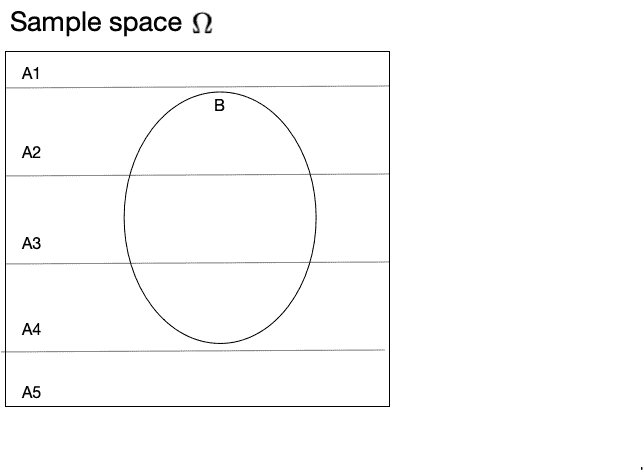

# 第一章 简介

> 原文：[`bruno.nicenboim.me/bayescogsci/ch-intro.html`](https://bruno.nicenboim.me/bayescogsci/ch-intro.html)

本书将探讨的核心思想是如何使用贝叶斯定理来量化我们对感兴趣的科学问题的信念的不确定性，给定一些数据。在我们深入探讨基础理论和其应用细节之前，了解以下主题是很重要的：概率的基本概念、随机变量的概念、概率分布和似然的概念。因此，我们将从这些主题开始。

其中一些概念一开始可能看起来很抽象，但它们对于进行贝叶斯分析非常相关。在第一次阅读这本书时，快速浏览本章并在阅读其他部分时根据需要返回本章可能会有所帮助。

## 1.1 概率

非正式地说，我们都理解“概率”这个术语的含义。我们经常谈论诸如今天下雨的概率之类的事情。然而，思考概率有两种不同的方式。一个人可以参考某事可能发生的频率来考虑其发生的概率。这种概率的概念在某种事物至少在原则上可以重复发生的情况下很容易想象。

一个例子就是反复掷骰子得到 6 点。然而，当谈论独一无二的物体，如地震时，这种频率主义的概率观很难得到证明；在这里，概率是表达我们对地震发生的不确定性的理解。

频率基础和不确定信念视角在统计推断中都有其位置，并且根据具体情况，我们将依赖这两种思维方式。

下面的陈述并不是概率论公理的正式定义；更多细节（和更精确的表述）请参阅 Blitzstein 和 Hwang (2014)、Ross (2002)、Kerns (2014)、Resnick (2019) 或 Kolmogorov (1933) 等众多书籍）。请记住，不同的教科书在呈现概率空间（以下定义）的潜在结构方面略有不同。

发生某事的概率被定义为受以下描述的方式约束。一个“发生某事”的具体例子是结果——称之为 $\omega$——例如在向受试者提出 $10$ 个是非问题时（例如，关于句子含义的问题），得到九个正确（$c$）答案和一个错误（$i$）答案。一个例子是正确（$c$）和错误（$i$）答案的序列，例如 $iiiiciiiii$。另一个可能的结果是 $cciicicici$。因此，结果就是所有可能的正确和错误答案的序列，样本空间 $\Omega$ 是所有可能结果的集合。

另一个重要的概念是事件 $E$，接下来；当提出 $10$ 个问题时，获得一个正确答案的事件是对应于结果子集 $\{ciiiiiiiii,iciiiiiiii,iiciiiiiii,\ldots\}$；换句话说，获得一个正确答案的事件是一个包含 $10$ 个元素的集合。同样，当提出 $10$ 个问题时，获得九个正确答案的事件是对应于结果子集 $\{ccccccccci,ccccccccic,\ldots \}$。

当我们进行实验时，如果我们得到一个特定的结果，例如 $ciiiiiiiii$，那么我们就说事件 $\{ciiiiiiiii,iciiiiiiii,iiciiiiiii,\ldots\}$ 发生了。一个概率空间涉及两个更关键的组成部分：由 $F$ 表示的 $\Omega$ 的子集集合，称为 *事件空间*；¹；以及一个名为 $P$ 的实值函数，它将一个数字（一个概率）分配给 $F$ 中的每个集合。

表 1.1 总结了符号。

TABLE 1.1: TABLE 1.2: 10 题例的基本概率术语。

| 符号 | 名称 | 简要说明 | 示例 |
| --- | --- | --- | --- |
| $\Omega$ | 样本空间 | 所有可能结果的集合 | 所有可能的长度为 10 的正确（c）或错误（i）答案的序列；即 $2^{10}=1024$ 个序列。 |
| $F$ | 事件空间 | $\Omega$ 的子集集合 | 所有恰好有 1 个正确答案，或恰好有 9 个正确答案等的序列 |
| $P$ | 概率函数 | 将概率分配给 $F$ 中的事件 | 如果每个问题以概率 $\theta$ 正确回答，$P(\{ciiiiiiiii\}) = (1-\theta)⁹\theta$。 |
| $\omega$ | 结果 | $\Omega$ 的一个元素 | 特定的序列 $ciiiiiiiii$。 |
| $E$ | 事件 | $\Omega$ 的子集 | 一系列序列 $\{ciiiiiiiii, iciiiiiiii, iiciiiiiii, \ldots\}$。 |

概率公理涉及样本空间 $\Omega$、事件空间 $F$ 和概率 $P$，如下所述：

+   对于事件空间 $F$ 中的每个事件 $E$，概率 $P(E)$ 是介于 $0$ 和 $1$ 之间的实数。

+   事件 $E=\Omega$ 属于 $F$，且 $P(\Omega)=1$。

+   如果事件 $A_1, A_2, A_3,...$ 是互斥的（换句话说，如果这些 $\Omega$ 的子集没有两个重叠），那么“$A_1$ 或 $A_2$ 或 $A_3$ 或 …”之一发生的事件的概率就是 $A_1$ 发生的概率、$A_2$ 发生的概率、$A_3$ 发生的概率，……（这个和可能是有限的或无限的）。

一起，三元组 $(\Omega, F, P)$ 被称为**概率空间**。

在数据分析的背景下，我们将以下方式讨论概率。考虑我们可能收集的一些数据。这可能是在问题-响应准确度任务中的离散 $0,1$ 响应，或从眼动研究中读取时间的毫秒级连续测量，或“是”、“否”或“不知道”等多类别响应，或微伏级上的电势。

在任何这样的情况下，我们都会说数据是从一个**随机变量**生成的，我们将用大写字母如 $Y$ 来表示它。²

实际观察到的结果（一个 $0,1$ 响应；阅读时间，如“是”、“否”、“不知道”等）将通过使用小写 $y$ 来区分生成它的随机变量。我们可以称 $y$ 为 $Y$ 的一个实例；由于随机变异性，每个新的观察结果都可能不同。

如果我们将与随机变量相关的上述非正式概念重新表述为数学形式，我们可以非常紧凑地总结它们。数学陈述的优点不仅在于简洁，而且在于减少（并希望消除）歧义。

因此，正式陈述随机变量的定义（遵循 Blitzstein 和 Hwang 2014），我们定义随机变量 $Y$ 为从可能结果样本空间 $\Omega$ 到实数系统的函数：³

$$\begin{equation} Y : \Omega \rightarrow \mathbb{R} \end{equation}$$

随机变量与 $\Omega$ 中的每个结果 $\omega$ 关联一个唯一的数字 $Y(\omega) = y$。数字 $y$ 是一个变量，代表随机变量生成的所有可能值；这些值被认为是随机变量 $Y$ 的支撑集：$y \in S_Y$。

在我们询问 $10$ 个问题并从每个 $10$ 次试验中获得正确或错误响应的运行示例中，$Y(ciiiiiiiii) = 1$，$Y(cciiiiiiii) = 2$ 等。我们将说，从受试者那里得到的正确响应的数量是由随机变量 $Y$ 生成的。因为在我们运行的示例中，只有离散响应是可能的（正确响应的数量可以是 $0, 1, 2, \ldots, 10$），这是一个**离散随机变量**的例子。

这个特定的随机变量 $Y$ 将被假定为具有一个参数 $\theta$，该参数代表产生特定数量正确反应的概率（如下文所述，你会看到所涉及的随机变量是二项式随机变量）。给定一些假设来自特定分布的观察数据，我们的目标通常是获得与该分布相关的（未知）参数值的估计。更普遍地，如果分布中涉及多个参数，那么我们的目标是获得这些参数的估计。

现在，假设在我们上面的例子中，随机变量 $Y$ 给出了恰好一个正确答案；这可以（有些草率地）写成 $Y=1$。产生 $1$ 的结果可以是这组十个可能结果中的任何一个：$ciiiiiiiii$、$iciiiiiiii$、$iiciiiiiii$、$iiiciiiiii$、……。集合 $\{ciiiiiiiii,iciiiiiiii,iiciiiiiii,iiiciiiiii,...\}$ 是 $F$ 的一个元素，因此它是一个事件。因此，$y=1$ 代表这个事件，并且将有一个与之相关的发生概率；这将在下一定义。

一个离散随机变量 $Y$ 与一个称为**概率质量函数**或 PMF 的函数相关联。这个函数，写成 $p(y)$，给出了获得这 $11$ 个可能值（从 0 个正确反应到 10 个）的概率。在这里我们使用小写 $p(y)$ 来表示 $y$ 的函数。当我们想要谈论观察 $y$ 的概率时，我们将使用 $P(y)$。在离散随机变量中，$p(y)$ 的值将与 $P(y)$ 相同；但当我们转向连续随机变量时，这个等式将不再成立。

我们将说明这个 PMF $p(y)$ 依赖于，或者是在一个特定的但未知的 $\theta$ 值的条件下；PMF 将写成 $p(y|\theta)$。⁴

在频率主义的数据分析方法中，仅使用观察到的数据 $y$ 来推断 $\theta$。在频率主义范式下，我们通常会问这样一个问题：$\theta$ 是否具有特定的值 $\theta_0$？可以从观察数据 $y$ 中获得 $\theta$ 的未知值的估计，然后推断这个估计与假设的 $\theta_0$ 有多大不同——或者更精确地说，这个估计与 $\theta_0$ 有多远。这就是零假设显著性检验的本质。这样的程序得出的结论是以拒绝 $\theta$ 具有值 $\theta_0$ 的假设，或者未能拒绝这个假设的形式。在这里，拒绝零假设是统计假设检验的主要目标。

贝叶斯数据分析从不同的问题开始。与频率派范式共同的是假设数据是从一个随机变量 $Y$ 生成的，并且存在一个函数 $p(y|\theta)$，它依赖于参数 $\theta$。贝叶斯方法与频率派方法的不同之处在于，一个重要的目标是表达我们对 $\theta$ 的不确定性。换句话说，我们将参数 $\theta$ 本身视为一个随机变量，这意味着我们为这个随机变量分配一个概率分布 $p(\theta)$。这个分布 $p(\theta)$ 被称为 $\theta$ 的 *先验分布*；这样的分布可以表达我们在观察数据 $y$ 之前对正确响应概率的信念。

在后面的章节中，我们将花一些时间试图理解如何为不同研究问题定义这样的先验分布。

给定这样的先验分布和一些数据 $y$，贝叶斯数据分析的最终结果是参数（或参数集）在给定数据 $y$ 下的 *后验分布*：$p(\theta | y)$。这个后验分布是在对 $y$ 进行条件化后的 $\theta$ 的概率分布，即数据被观察并因此已知之后。我们所有的统计推断都是基于这个 $\theta$ 的后验分布；我们甚至可以进行类似于基于似然比频率派假设检验的假设检验。

我们在讨论给定某些参数 $\theta$ 的数据概率时已经提到了条件概率，我们将其写成 PMF $p(y|\theta)$。条件概率是贝叶斯数据分析中的一个重要概念，尤其是因为它允许我们推导出贝叶斯定理。接下来，让我们看看条件概率的定义。

## 1.2 条件概率

假设 $A$ 代表某个离散事件；一个例子是“街道湿了”。同样，假设 $B$ 代表另一个离散事件；一个例子是“一直在下雨”。我们可以讨论在下雨的情况下街道湿的概率；或者更一般地，讨论在 $B$ 发生的情况下 $A$ 的概率。

这种陈述可以写成 $Prob(A|B)$ 或更简单地 $P(A|B)$。这是在 $B$ 的条件下 $A$ 的条件概率。条件概率的定义如下。

$$\begin{equation} P(A|B)= \frac{P(A,B)}{P(B)} \hbox{ 其中 } P(B)>0 \end{equation}$$

因此，给定 B 的 A 的条件概率被定义为 A 和 B 的联合概率除以 B 的概率。我们可以重新排列上述方程，以便我们可以讨论事件 A 和 B 同时发生的联合概率。这个联合概率可以通过首先取$P(B)$，即事件 B（下雨）发生的概率，然后乘以在 B 发生的条件下 A 发生的概率，即下雨时街道湿的概率。这个乘积将给出$P(A,B)$，即 A 和 B 的联合概率，即下雨且街道湿。我们将上述描述写为：$P(A,B)=P(A|B)P(B)$。

现在，由于 A 和 B 同时发生的概率与 B 和 A 同时发生的概率相同，即由于$P(B,A)=P(A,B)$，我们可以将这两个项的展开式相等。

$$\begin{equation} P(A,B) = P(A|B) P(B) \hbox{ and } P(B,A) = P(B|A)P(A) \end{equation}$$

将两个展开式相等，我们得到：

$$\begin{equation} P(A|B) P(B) = P(B|A)P(A) \end{equation}$$

两边除以$P(B)$：

$$\begin{equation} P(A|B)=\frac{P(B|A)P(A)}{P(B)} \end{equation}$$

上述陈述是贝叶斯定理，是本书中我们将要做的所有统计推断的基础。

## 1.3 全概率公式

与上述关于条件概率的讨论相关的是全概率公式。假设我们有一些互斥事件$A_1,\dots,A_n$，它们共同构成了整个样本空间$\Omega$；参见图 1.1。那么，$P(B)$，即 B 发生的概率，将是$P(B\cap A_i)$的概率之和，即 B 和每个 A 发生的联合概率（符号$\cap$是集合论中使用的“和”运算符）。使用$\cap$来表示联合概率只是我们之前使用的符号（$P(B,A_i)$）的另一种表示方法；你可能在教科书中看到这两种符号变体。

形式上：

$$\begin{equation} P(B) = \sum_{i=1}^n P(B \cap A_i) \end{equation}$$

由于条件概率规则，我们可以将其重写为：

$$\begin{equation} P(B) = \sum_{i=1}^n P(B | A_i) P(A_i) \end{equation}$$

因此，B 的概率是条件概率$P(B|A_i)$按概率$P(A_i)$加权的和。当我们讨论*marginal likelihood*时，你将在下面看到全概率公式的应用。



图 1.1：全概率公式的插图。

现在，这就是我们需要的所有概率论知识了！

下一节将扩展随机变量的概念，与随机变量相关的概率分布，指定参数先验分布的含义，以及如何使用先验和数据进行 $\theta$ 的后验分布推导。

为了使讨论具体化，我们将使用一个离散随机变量的例子，即二项分布。在讨论这个离散随机变量之后，我们将提供另一个例子，这次涉及一个连续随机变量，即正态随机变量。

二项分布和正态分布是我们在本书初期阶段需要的典型例子。根据需要，我们将介绍其他随机变量：特别是，我们需要均匀分布和贝塔分布。在其他教科书中，你将遇到泊松分布、伽马分布和对数正态分布。最常见的分布及其性质在大多数统计学教科书中都有讨论（参见本章末尾的进一步阅读）。

## 1.4 离散随机变量：使用二项分布的例子

考虑以下句子：

*“下雨了，我要带……”*

假设我们的研究目标是估计单词“雨伞”出现在这个句子中的概率，称为 $\theta$，与任何其他单词相比。如果句子以单词“雨伞”结束，我们将称之为成功；任何其他完成方式将被视为失败。这是一个二项随机变量的例子：在 $n$ 次试验中，每次试验只有两种可能的结果，成功或失败，并且存在某个真实的未知成功概率 $\theta$，我们想要估计。当试验次数 $n$ 为一时，随机变量被称为伯努利分布。因此，伯努利分布是试验次数 $n=1$ 的二项分布。

估计成功概率的一种经验方法是进行 *完形填空任务*。在完形填空任务中，受试者被要求完成原始句子的一个片段，例如“下雨了，我要带……”。然后计算“雨伞”的可预测性或完形填空概率，作为受试者产生目标单词“雨伞”作为答案的比例。

为了简化，假设有 $10$ 个受试者被要求完成上述句子；每个受试者只完成一次任务。这给我们 $10$ 个独立的试验，这些试验要么被编码为成功（产生了“雨伞”），要么被编码为失败（产生了其他单词）。我们可以总结成功次数来计算有多少次 $10$ 次试验以“雨伞”作为回应。例如，如果在 $10$ 次试验中产生了 $8$ 个“雨伞”实例，我们将估计产生“雨伞”的完形填空概率为 $8/10$。

我们可以在 R 中反复生成成功次数的模拟序列（稍后我们将演示如何生成此类模拟数据的随机序列）。这里是一个我们进行 $20$ 次实验的例子，每次实验将进行 $10$ 次试验。

在我们查看生成此类模拟数据的 R 代码之前，需要一些符号约定以避免混淆。在我们下面使用的函数（`rbinom()`）中生成模拟数据时，`n` 指的是实验次数，在 R 函数术语中是观察次数。相比之下，`size` 是试验次数。这意味着在下面的例子中，`n` 指的是进行的实验次数；因为在 R 术语中这些被称为观察，我们也将采用这种术语。因此，如果进行了 $20$ 次实验，每次实验 $10$ 次试验，我们将说我们有 $20$ 次观察，每次观察 $10$ 次试验。

```r
## n=the number of observations (no. of experiments)
## size=the number of trials in each observation
rbinom(n = 20, size = 10, prob = 0.5)
```

```r
##  [1]  3  8  5  5  5  2 10  6  6  6  6  5  3  6  2  5  6  5  5  6
```

上面的 $20$ 次模拟观察中每次成功次数是由一个离散随机变量 $Y$ 生成的，其概率分布为 $p(y|\theta)$，称为**二项分布**。

对于二项分布等离散随机变量，概率分布 $p(y|\theta)$ 被称为概率质量函数（PMF）。PMF 定义了每个可能事件的概率。在上面的例子中，试验次数 $\hbox{size}=10$，原则上存在 $11$ 种可能的事件，这些事件可能导致 $y=0,1,2,...,10$ 次成功。其中哪种事件最可能发生取决于二项分布中的参数 $\theta$，该参数代表成功的概率。

图 1.2 中左侧的图显示了 $10$ 次试验的二项 PMF 的一个例子，其中参数 $\theta$ 固定为 $0.5$。将 $\theta$ 设置为 $0.5$ 导致最可能的输出是 $10$ 次试验中的 $5$ 次成功。如果我们把 $\theta$ 设置为，比如说 $0.1$，那么最可能的输出将是 $10$ 次试验中的 $1$ 次成功；如果我们把 $\theta$ 设置为 $0.9$，那么最可能的输出将是 $10$ 次试验中的 $9$ 次成功。


图 1.2：假设有 $10$ 次试验的二项分布的概率质量函数，成功概率分别为 50%，10% 和 90%。

二项分布的概率质量函数写作如下。在这里，再次需要注意符号，因为考虑到我们之前看到的 `rbinom` 函数中的约定，这里存在混淆的可能性。

$$\begin{equation} \mathit{Binomial}(k|n,\theta) = \binom{n}{k} \theta^{k} (1-\theta)^{n-k} \end{equation}$$

在这里，$n$ 代表试验的总次数，对应于 `rbinom` 函数中的 `size`；这里可能出现的混淆是，在 `rbinom` 函数中，`n` 用于表示观察次数（或实验次数）。重要的是要记住，在上面的概率质量函数的定义中，`n` 代表单个观察（或实验）中的试验总次数。

变量 $k$ 表示成功次数（在我们的例子中，这可能从 $0$ 到 $10$ 不等），而 $\theta$ 表示成功的概率。术语 $\binom{n}{k}$，读作 n-choose-k，表示在 $n$ 次试验中取得 $k$ 次成功的方式数量。例如，从 $10$ 次试验中取得 $1$ 次成功可以以 $10$ 种可能的方式发生：第一次观察可能是 $1$，或者第二次观察可能是 $1$，等等。术语 $\binom{n}{k}$ 展开为 $\frac{n!}{k!(n-k)!}$。在 R 中，它使用函数 `choose(n,k)` 计算，其中 $n$ 和 $k$ 代表任何实数（尽管当然，`choose()` 函数只对正整数有意义）。

当我们想要表达数据是从二项随机变量生成的这一事实时，我们将写作 $Y \sim \mathit{Binomial}(n,\theta)$。如果数据是从具有某种其他概率分布 $f(\theta)$ 的随机变量生成的，我们将写作 $Y\sim f(\theta)$。在这本书中，我们用 $f(\cdot)$ 和 $p(\cdot)$ 同义地表示概率密度/质量函数。

### 1.4.1 二项分布的均值和方差

可以解析地计算与二项随机变量 $Y$ 相关的概率质量函数的均值（期望）和方差。

具有概率质量函数 f(y) 的离散随机变量 $Y$ 的期望值定义为

$$\begin{equation} E[Y] = y_1 \cdot f(y_1) + \dots + y_n \cdot f(y_n) = \sum_{i=1}^n y_i \cdot f(y_i) \end{equation}$$

作为简单的例子，假设我们掷一枚公平的硬币一次。可能的事件是反面（表示为 $y_1 = 0$）和正面（表示为 $y_2 = 1$），每个事件发生的概率相等，为 0.5。期望值是：

$$\begin{equation} E[Y] = \sum_{i=1}^{2} y_i \cdot f(y_i) = 0\cdot 0.5 + 1\cdot 0.5 = 0.5 \end{equation}$$

期望的解释是，如果我们多次进行实验并计算观察值的样本均值，从长远来看，我们会接近 $0.5$ 这个值。另一种看待上述定义的方式是，期望给出了可能结果的加权平均值，加权系数为每个结果的相应概率。

在这里我们不深入探讨这些是如何从数学上推导出来的（参见 Kerns 2014），我们只是在这里声明，二项分布（参数为 $\theta$ 和 $n$ 次试验）的期望 $Y$（期望 $E[Y]$）和方差 $Y$（记作 $Var(Y)$）分别是 $E[Y] = n\theta$ 和 $Var(Y) = n\theta (1-\theta)$。

在上述二项分布的例子中，$n$ 是一个固定的数字，因为我们决定在运行实验之前进行总试验次数。在概率质量函数 $\binom{n}{k} \theta^{k} (1-\theta)^{n-k}$ 中，$\theta$ 也是一个固定的值；在概率质量函数中，唯一可变的变量是 $k$。在现实实验中，我们永远不知道 $\theta$ 的真实点值。但 $\theta$ 可以从数据中估计出来。从观察数据中，我们可以计算 $\theta$ 的估计值，$\hat \theta=k/n$。量 $\hat \theta$ 是观察到的成功比例，被称为对真实（但未知）参数 $\theta$ 的 *最大似然估计*。⁵

“最大似然估计”这个术语是什么意思？为了理解这个术语，首先需要了解什么是似然函数。回想一下，在上面的讨论中，概率质量函数 $p(k|n,\theta)$ 假设 $\theta$ 和 $n$ 是固定的，当实验重复多次时，$k$ 将在 $0$ 到 $10$ 之间取某个值。

“似然函数”指的是概率质量函数 $p(k|n,\theta)$，将其视为 $\theta$ 的函数。一旦观察到 $k$ 的特定值，这个值现在就固定了，同时试验次数 $n$ 也固定了。一旦 $k$ 和 $n$ 固定，函数 $p(k|n,\theta)$ 只依赖于 $\theta$。因此，似然函数与概率质量函数是同一个函数，但假设完成实验的数据是固定的，只有参数 $\theta$ 变化（从 0 到 1）。似然函数写作 $\mathcal{L}(\theta| k,n)$，或者简单地写作 $\mathcal{L}(\theta)$。

例如，假设我们有 $n=10$ 次试验，观察到 $k=7$ 次成功。似然函数是：

$$\begin{equation} \mathcal{L}(\theta|k=7,n=10)= \binom{10}{7} \theta^{7} (1-\theta)^{10-7} \end{equation}$$

如果我们现在绘制从 $0$ 到 $1$ 的所有可能 $\theta$ 值的似然函数，我们得到图 1.3(a) 所示的图表。


图 1.3：（a）10 次试验中 7 次成功的似然函数。（b）该图显示了从具有成功概率为 0.7 的二项分布中抽取的成功比例的均值估计，随着样本量的增加。随着样本量的增加，估计值收敛到 0.7 的真实值。

这个图的重要之处在于，它表明，给定数据，最大值点在 $0.7$ 处，这对应于使用上面显示的公式估计的均值：$k/n = 7/10$。因此，最大似然估计（MLE）给出了给定数据下参数 $\theta$ 最可能具有的值。在二项分布中，成功比例 $k/n$ 可以被证明是参数 $\theta$ 的最大似然估计（例如，参见 Miller 和 Miller 2004 第 339-340 页）。

一个关键点：参数的“最可能”值是相对于现有数据的。目标是根据数据估计一个未知参数值。这个估计的参数值被选择，使得得到样本值（即数据）的概率（离散情况）或概率密度（连续情况）是最大的。这个参数值就是最大似然估计（MLE）。

从特定数据样本得到的 MLE 不一定总是给我们一个准确的$\theta$估计。例如，如果我们进行 10 次试验，10 次中有 1 次成功，MLE 是 0.10。我们可能只是偶然观察到 10 次中只有 1 次成功，即使真实的$\theta$是 0.7。如果我们反复进行实验，并随着样本量的增加，MLE 会收敛到参数的真实值。图 1.3(b)说明了这一点。这里的关键点是，对于较小的样本量，特定数据集的 MLE 可能指向也可能不指向真实值。

### 1.4.2 概率分布提供了哪些信息？

在贝叶斯数据分析中，我们将不断提出问题：概率分布给我们提供了哪些信息？特别是，我们将把每个参数 $\theta$ 视为一个随机变量；这将引发像“参数 $\theta$ 落在两个值 $a$ 和 $b$ 之间的概率是多少”以及“我们可以在多大程度上有 95% 的把握说参数落在哪个范围内”等问题。为了能够回答这些问题，我们需要知道一旦我们决定了一个假设生成数据的概率分布，我们可以从中获得哪些信息，以及如何使用 R 提取这些信息。因此，我们讨论了可以从概率分布中获得的不同类型的信息。现在我们只关注上面介绍的二项随机变量。

#### 1.4.2.1 计算特定结果的概率（仅适用于离散情况）

图 1.2 中显示的二项分布已经显示了在 $\theta$ 不同值下每个可能事件的概率。在 R 中，有一个内置函数允许我们计算在给定的 $k$（这个数字构成了我们的数据）、试验次数 $n$ 和特定的 $\theta$ 值下，$k$ 次成功的概率；这就是 `dbinom()` 函数。例如，当 $\theta$ 为 $0.5$ 时，10 次试验中 5 次成功的概率是（注意：我们用 $k$ 来表示成功的次数，但下面的 `dbinom()` 函数使用 `x` 代替）：

```r
dbinom(x = 5, size = 10, prob = 0.5)
```

```r
## [1] 0.246
```

当 $\theta$ 为 $0.1$ 或 $0.9$ 时，成功的概率可以通过将上面的 $0.5$ 替换为这些概率之一来计算。只需通过给 `dbinom()` 函数提供一个概率向量即可完成此操作：

```r
dbinom(x = 5, size = 10, prob = c(0.1, 0.9))
```

```r
## [1] 0.00149 0.00149
```

特定结果（如 $k=5$ 次成功）的概率仅在离散情况下可计算。在连续情况下，获得特定点值的概率始终为零（我们将在下面讨论连续概率分布时讨论这一点）。

#### 1.4.2.2 计算成功次数为 k 或更少（或更多）的累积概率

使用 `dbinom()` 函数，我们可以计算获得 1 次或更少、2 次或更少成功等的累积概率。这是通过一个简单的求和过程完成的：

```r
## the cumulative probability of obtaining
## 0, 1, or 2 successes out of 10 trials,
## with theta=0.5:
dbinom(x = 0, size = 10, prob = 0.5) +
 dbinom(x = 1, size = 10, prob = 0.5) +
 dbinom(x = 2, size = 10, prob = 0.5)
```

```r
## [1] 0.0547
```

从数学上讲，我们可以将上面的求和写成：

$$\begin{equation} \sum_{k=0}² \binom{n}{k} \theta^{k} (1-\theta)^{n-k} \end{equation}$$

上面的 R 代码中的繁琐加法可以用这个更紧凑的语句来替代，它与上面的数学表达式相同：

```r
sum(dbinom(0:2, size = 10, prob = 0.5))
```

```r
## [1] 0.0547
```

R 有一个内置函数 `pbinom()`，它可以为我们完成这个求和。如果我们想知道像上面例子中那样 $2$ 次或更少的成功概率，我们可以这样写：

```r
pbinom(2, size = 10, prob = 0.5, lower.tail = TRUE)
```

```r
## [1] 0.0547
```

指定 `lower.tail = TRUE`（默认值）确保求和从 $2$ 到小于 $2$ 的数字（这些数字位于图 1.2 中分布的下半部分）。如果我们想知道从 $10$ 次实验中获得 $3$ 次或更多成功的概率，可以将 `lower.tail` 设置为 `FALSE`：

```r
pbinom(2, size = 10, prob = 0.5, lower.tail = FALSE)
```

```r
## [1] 0.945
```

```r
## equivalently:
## sum(dbinom(3:10,size = 10, prob = 0.5))
```

因此，随机变量 $Y$ 的累积分布函数（CDF）与相应的概率质量/密度函数相关，并如下所示：

$$\begin{equation} F_Y(a) = P(Y\leq a) \end{equation}$$

累计分布函数（CDF）可以通过计算任何值 $k$ 或小于 $k$ 的累积概率来绘制，在我们的运行示例中，$k$ 的范围从 $0$ 到 $10$。CDF 在图 1.4(a) 中显示。


图 1.4: (a) 具有十次试验和 50%成功概率的二项分布的累积分布函数（CDF）。(b) 相同二项分布的逆 CDF。

#### 1.4.2.3 计算累积分布函数的逆（分位数函数）

我们还可以找出变量 $k$（分位数）的值，使得获得 $k$ 或小于 $k$ 次成功的概率是某个特定的概率值 $p$。如果我们交换图 1.4(a) 的 x 轴和 y 轴，我们得到另一个非常有用的函数，即 CDF 的逆。

CDF 的逆（在 R 中称为分位数函数，因为它返回分位数，即值 $k$）在 R 中作为函数 `qbinom()` 提供。用法如下：要找出结果值 $k$ 的值，使得获得 $k$ 或更少成功的概率为 $0.37$，请输入：

```r
qbinom(p = 0.37, size = 10, prob = 0.5)
```

```r
## [1] 4
```

可以像图 1.4(b) 所示的那样可视化二项分布的逆 CDF。

#### 1.4.2.4 从 $\mathit{Binomial}(n,\theta)$ 分布生成模拟数据

我们可以通过指定观察次数或实验次数（`n`）、试验次数（`size`）和成功概率 $\theta$ 来从二项分布生成模拟数据。在 R 中，我们这样做如下：

```r
rbinom(n = 1, size = 10, prob = 0.5)
```

```r
## [1] 6
```

上述代码生成了 $10$ 次试验的实验中的成功次数。重复运行上述代码；我们每次都会得到不同的成功次数。

如前所述，如果只有一次试验，那么我们就有伯努利分布，而不是二项分布。例如，如果我们有来自伯努利分布的 10 个实验，成功概率为 0.5，我们可以使用`extraDistr`包中的`rbern()`函数模拟数据如下。

```r
rbern(n = 10, prob = 0.5)
```

```r
##  [1] 1 0 1 1 1 0 1 0 0 0
```

上面的输出也可以通过使用`rbinom()`函数生成：`rbinom(n = 10, size = 1, prob = 0.5)`。当使用`rbinom()`函数以这种方式生成数据时，只需将向量求和即可计算成功次数，或者计算其均值并乘以试验次数，这里为$10$：

```r
(y <-  rbinom(n = 10, size = 1, prob = 0.5))
```

```r
##  [1] 0 1 1 1 0 0 0 0 0 1
```

```r
mean(y) *  10
```

```r
## [1] 4
```

```r
sum(y)
```

```r
## [1] 4
```

## 1.5 连续随机变量：使用正态分布的示例

我们现在将重新审视使用连续分布的随机变量的概念。想象一下，我们有一个以毫秒为单位的阅读时间数据向量$y$，它来自正态分布。正态分布由两个参数定义：*位置*，其均值值$\mu$，它决定了其中心，以及*尺度*，其标准差$\sigma$，它决定了围绕这个中心点的分布程度。

正态分布的概率密度函数（PDF）定义为以下：

$$\begin{equation} \mathit{Normal}(y|\mu,\sigma)=f(y)= \frac{1}{\sqrt{2\pi \sigma²}} \exp \left(-\frac{(y-\mu)²}{2\sigma²} \right) \end{equation}$$

在这里，$\mu$是某个真实、未知的均值，$\sigma²$是正态分布的真实、未知方差，该分布是从阅读时间中抽取的。在 R 中有一个内置函数，一旦我们指定了均值$\mu$和标准差$\sigma$（在 R 中，此参数以标准差而不是方差的形式指定），就会计算上述函数。

图 1.5 可视化了特定$\mu$和$\sigma$值的正态分布，作为 PDF（使用`dnorm()`）、CDF（使用`pnorm()`）和逆 CDF（使用`qnorm()`）。从图中应该很明显，这些都是查看相同信息的三种不同方式。


图 1.5：$\mathit{Normal}(\mu=500,\sigma=100)$的概率密度函数（PDF）、累积分布函数（CDF）和逆累积分布函数（inverse CDF）。

与离散示例类似，PDF、CDF 和逆 CDF 允许我们提出如下问题：

+   观察到正态分布中$a$和$b$之间值的概率是多少？使用上述示例，我们可以询问观察到$200$到$700$毫秒之间值的概率是多少：

```r
pnorm(700, mean = 500, sd = 100) -  pnorm(200, mean = 500, sd = 100)
```

```r
## [1] 0.976
```

随机变量取任何特定点值的概率是零。这是因为连续概率分布中的概率是曲线下的面积，而 x 轴上任何点的面积总是零。这里的含义是，只有询问两个不同点值之间的概率才有意义；例如，$Y$位于$a$和$b$之间的概率，或$P(a<Y<b)$。请注意，$P(a<Y<b)$与$P(a\leq Y\leq b)$是相同的陈述。当然，对于任何特定的点值，PDF 本身不会返回零值；但 PDF 返回的值不是该特定值发生的概率；它是该特定值的密度；如果将 PDF 视为参数的函数，它就是该特定值的似然。

+   什么是最小分位数$q$，使得观察到该值$q$或比$q$更极端的值的概率是$p$？例如，我们可以计算出在$\mathit{Normal}(500,100)$分布中，观察到$q$或小于$q$的值的概率为$0.975$的最小分位数$q$。形式上，我们可以写成$P(Y<a)$。

```r
qnorm(0.975, mean = 500, sd = 100)
```

```r
## [1] 696
```

上述输出表明，使得$Prob(X<q)=0.975$的分位数值$q$是$q=696$。

+   生成模拟数据。给定一个由$n$个独立同分布数据$y$组成的向量，即每个数据点都是独立地从$Y \sim \mathit{Normal}(\mu,\sigma)$生成，对于某些参数值，样本均值和标准差⁶是：

$$\begin{equation} \bar{y} = \frac{\sum_{i=1}^n y_i}{n} \end{equation}$$

$$\begin{equation} sd(y) = \sqrt{\frac{\sum_{i=1}^n (y_i- \bar{y})²}{n}} \end{equation}$$

例如，我们可以使用`rnorm()`函数生成 10 个数据点，然后使用模拟数据来计算均值和标准差：

```r
y <-  rnorm(10, mean = 500, sd = 100)
mean(y)
```

```r
## [1] 513
```

```r
sd(y)
```

```r
## [1] 92
```

再次强调，从特定的（模拟或真实）数据集中计算出的样本均值和样本标准差不一定接近相应参数的真实值。特别是当样本量较小时，可能会得到均值和标准差的误估计。

偶然的是，模拟数据可以用来生成各种统计数据。例如，我们可以计算下限和上限分位数，使得 95%的模拟数据包含在这些分位数内：

```r
quantile(y, probs = c(0.025, 0.975))
```

```r
##  2.5% 97.5% 
##   356   640
```

在我们使用 Stan/brms 拟合模型并获得了参数样本之后，这个函数将用于生成汇总统计量。

### 1.5.1 重要区分：连续随机变量中的概率与密度

在上述讨论的连续分布，如正态分布中，理解概率密度函数或 PDF，$p(y| \mu, \sigma)$ 定义了从 $y$ 值（数据可能具有的可能值）到称为每个可能值密度的数量的映射是很重要的。当我们使用 `dnorm()` 来计算，比如说，标准正态分布中 $y=1$ 和 $y=2$ 对应的密度值时，我们可以看到这个函数的作用，即，一个均值为零，标准差为 1 的正态分布。

```r
## density:
dnorm(1, mean = 0, sd = 1)
```

```r
## [1] 0.242
```

```r
dnorm(2, mean = 0, sd = 1)
```

```r
## [1] 0.054
```

如果在特定点值（如 $1$）的密度相对于其他值（如上述例子中的 $2$）较高，那么这个点值 $1$ 在标准正态分布中的可能性比 $2$ 更高。

对于值 $1$ 和 $2$ 计算出的数量 **不是** 在此分布中观察到 $1$ 或 $2$ 的概率。如前所述，在连续分布中，概率被定义为曲线下的面积，而这个面积在任何点值处（因为存在无限多个不同的可能值）总是为零。如果我们想了解在上下界 $b$ 和 $a$ 之间的值的概率，即 $P(a<Y<b)$ 其中这些是两个不同的值，我们必须使用累积分布函数或 CDF：在 R 中，对于正态分布，这是 `pnorm()` 函数。例如，在均值为 $0$ 和标准差为 $1$ 的正态分布中观察到值在 $+2$ 和 $-2$ 之间的概率是：

```r
pnorm(2, mean = 0, sd = 1) -  pnorm(-2, mean = 0, sd = 1)
```

```r
## [1] 0.954
```

在离散随机变量中，情况不同。它们与一个概率质量函数（PMF）相关联——一个例子是我们之前看到的二项分布。在那里，PMF 将可能的 $y$ 值映射到这些值发生的概率。这就是为什么在二项分布中，从 $\mathit{Binomial}(n=10,\theta=0.5)$ 中采样时观察到恰好 $2$ 个成功的概率可以使用 `dbinom()` 或 `pbinom()` 来计算：

```r
dbinom(2, size = 10, prob = 0.5)
```

```r
## [1] 0.0439
```

```r
pbinom(2, size = 10, prob = 0.5) -  pbinom(1, size = 10, prob = 0.5)
```

```r
## [1] 0.0439
```

在上述代码的第二行中，我们正在计算观察到两个或更少成功的累积概率，减去观察到一个或更少成功的概率。这给出了观察到恰好两个成功的概率。`dbinom()` 给出了相同的信息。

### 1.5.2 截断正态分布

在上述讨论中，正态分布的支持范围从负无穷大到正无穷大。可以定义支持范围更小的 PDF；一个例子是 PDF $f(x)$ 为正态分布，其下限截断在 $0$ 处，只允许正值。在这种情况下，从负无穷大到零的范围下的面积（$\int_{-\infty}⁰ f(x) \, \mathrm{d}x$) 将是 $0$，因为该范围位于截断正态分布的支持范围之外。此外，如果我们截断标准正态分布（$\mathit{Normal}(0,1)$）在 $0$ 处，为了使零到正无穷大的面积之和为 $1$，我们需要将其乘以 $2$，因为我们只将曲线下的面积减半。更正式和更普遍地说，我们需要将截断分布 $f(x)$ 乘以某个因子 $k$，使得以下积分之和为 $1$：

$$\begin{equation} k \int_{0}^{\infty} f(x)\, \mathrm{d}x = 1 \tag{1.1} \end{equation}$$

显然，这个因子是 $k = \frac{1}{\int_{0}^{\infty} f(x)\, \mathrm{d}x}$。对于标准正态分布，使用 R 计算这个积分很容易；我们只需计算累积分布函数（CCDF）的补数：

```r
pnorm(0, mean = 0, sd = 1, lower.tail = FALSE)
```

```r
## [1] 0.5
```

```r
## alternatively:
1 -  pnorm(0, mean = 0, sd = 1, lower.tail = TRUE)
```

```r
## [1] 0.5
```

上述计算表明 $k$ 确实是 $2$，正如我们非正式地论证的那样（$k = \frac{1}{0.5}=2$）。

此外，如果我们截断分布的右侧而不是左侧在 $0$ 处（只允许负值），我们也将以相同的方式找到因子 $k$，只是我们需要找到 $k$ 使得：

$$\begin{equation} k \int_{-\infty}^{0} f(x)\, \mathrm{d}x = 1 \end{equation}$$

对于标准正态情况，在 R 中，这个因子将要求我们使用累积分布函数（CDF）：

```r
pnorm(0, mean = 0, sd = 1, lower.tail = TRUE)
```

```r
## [1] 0.5
```

在本书的后面部分，我们将使用这样的截断分布来进行贝叶斯建模，当我们使用它们时，我们将想要将截断分布乘以因子 $k$，以确保它仍然是一个面积之和为 $1$ 的正确 PDF。截断正态分布的详细讨论可以在在线部分 A.2 中找到。

## 1.6 双变量和多变量分布

到目前为止，我们只讨论了单变量分布；这些是只涉及一个变量的分布。例如，当我们谈论来自二项分布或正态分布的数据时，这些都是单变量分布。

也可以指定具有两个或更多维度的分布。一些例子将清楚地说明什么是双变量分布（或更一般地说，多变量分布）。

### 1.6.1 示例 1：离散双变量分布

从离散情况开始，考虑下面所示的离散双变量分布。这些数据来自一个实验，其中记录了每个试验的 Likert 可接受性评分和问题-回答准确性（数据来自 Laurinavichyute 2020 的研究，在此处获得许可）。通过加载 R 包`bcogsci`来加载数据。

```r
data("df_discreteagrmt")
```

图 1.6 显示了两个随机变量 X 和 Y 的**联合概率质量函数**。随机变量$X$包含$7$个可能的值（这是$1-7$的 Likert 响应量表），随机变量$Y$是问题-回答准确性，其中$0$代表错误响应，$1$代表正确响应。也可以将图 1.6 以表格的形式显示；参见表 1.3。


图 1.6：离散双变量分布的示例。在这些数据中，在每次试验中，收集了两条信息：Likert 响应和是/否问题响应。随机变量 X 代表 1-7 的 Likert 量表响应，随机变量 Y 代表对理解问题的 0，1（错误，正确）响应。

表 1.3：两个随机变量 X 和 Y 的联合概率质量函数。

|  | $x=1$ | $x=2$ | $x=3$ | $x=4$ | $x=5$ | $x=6$ | $x=7$ |
| :-- | :-- | :-- | :-- | :-- | :-- | :-- | :-- |
| $y=0$ | $0.018$ | $0.023$ | $0.04$ | $0.043$ | $0.063$ | $0.049$ | $0.055$ |
| $y=1$ | $0.031$ | $0.053$ | $0.086$ | $0.096$ | $0.147$ | $0.153$ | $0.142$ |

对于$X$和$Y$的每一对可能值，我们都有一个联合概率$p_{X,Y}(x,y)$。给定这样的双变量分布，我们可以计算两个有用的量：**边缘**分布（$p_X$和$p_Y$），以及**条件**分布（$p_{X|Y}$和$p_{Y|X}$）。表 1.3 显示了联合概率质量函数$p_{X,Y}(x,y)$。

#### 1.6.1.1 边缘分布

边缘分布$p_Y$的定义如下。$S_X$是$X$的支持集，即$X$的所有可能值。

$$\begin{equation} p_{Y}(y)=\sum_{x\in S_{X}}p_{X,Y}(x,y).\label{eq-marginal-pmf} \end{equation}$$

同样，边缘分布$p_X$的定义如下：

$$\begin{equation} p_{X}(x)=\sum_{y\in S_{Y}}p_{X,Y}(x,y).\label{eq-marginal-pmf2} \end{equation}$$

$p_Y$ 通过对行求和计算得出；$p_X$ 通过对列求和计算得出。我们可以看到为什么这被称为边缘分布；结果出现在表格的边缘。在下面的代码中，对象 `probs` 包含了表 1.3 中所示的二元概率质量函数。

```r
# P(Y)
(PY <-  rowSums(probs))
```

```r
##   y=0   y=1 
## 0.291 0.709
```

```r
sum(PY) ## sums to 1
```

```r
## [1] 1
```

```r
# P(X)
(PX <-  colSums(probs))
```

```r
##    x=1    x=2    x=3    x=4    x=5    x=6    x=7 
## 0.0491 0.0766 0.1257 0.1394 0.2102 0.2020 0.1969
```

```r
sum(PX) ## sums to 1
```

```r
## [1] 1
```

边缘概率之和为 $1$，正如它们应该的那样。表 1.4 展示了边缘概率。

表 1.4：两个随机变量 X 和 Y 的联合概率质量函数，以及 X 和 Y 的边缘分布。

|  | $x=1$ | $x=2$ | $x=3$ | $x=4$ | $x=5$ | $x=6$ | $x=7$ | $P(Y)$ |
| :-- | :-- | :-- | :-- | :-- | :-- | :-- | :-- | :-- |
| $y=0$ | $0.018$ | $0.023$ | $0.04$ | $0.043$ | $0.063$ | $0.049$ | $0.055$ | $0.291$ |
| $y=1$ | $0.031$ | $0.053$ | $0.086$ | $0.096$ | $0.147$ | $0.153$ | $0.142$ | $0.709$ |
| $P(X)$ | $0.049$ | $0.077$ | $0.126$ | $0.139$ | $0.21$ | $0.202$ | $0.197$ |  |

要计算 $X$ 的边缘分布，需要对所有 $Y$ 的值进行求和；要计算 $Y$ 的边缘分布，需要对所有 $X$ 的值进行求和。我们说我们在*边缘化*我们正在求和的随机变量。也可以使用条形图（图 1.7）来可视化这两个边缘分布。


图 1.7：随机变量 X 和 Y 的边缘分布，以条形图形式展示。

#### 1.6.1.2 条件分布

对于条件分布的计算，回忆一下，条件概率（见第 1.2 节）定义为：

$$\begin{equation} p_{X\mid Y}(x\mid y) = \frac{p_{X,Y}(x,y)}{p_Y(y)} \end{equation}$$

和

$$\begin{equation} p_{Y\mid X}(y\mid x) = \frac{p_{X,Y}(x,y)}{p_X(x)} \end{equation}$$

当 $Y=y$ 时，随机变量 $X$ 的条件分布是：

$$\begin{equation} p_{X\mid Y} (x\mid y) = \frac{p_{X,Y}(x,y)}{p_Y(y)} \quad \hbox{provided } p_Y(y)=P(Y=y)>0 \end{equation}$$

例如，让我们考虑如何计算 $p_{X\mid Y}$。$y$ 的可能值为 $0,1$，因此我们需要为这些值中的每一个找到上述定义的条件分布。也就是说，我们需要找到 $p_{X\mid Y}(x\mid y=0)$ 和 $p_{X\mid Y}(x\mid y=1)$。

让我们来计算 $p_{X\mid Y}(x\mid y=0)$。

$$\begin{equation} \begin{split} p_{X\mid Y} (1\mid 0) =& \frac{p_{X,Y}(1,0)}{p_Y(0)}\\ =& \frac{0.018}{0.291}\\ =& 0.062 \end{split} \end{equation}$$

这个条件概率值将占据表 1.5 中 $X=1$，$Y=0$ 的单元格，该表总结了条件概率分布 $p_{X|Y}$。通过这种方式，可以填写整个表格，该表格将代表条件分布 $p_{X|Y=0}$ 和 $p_{X|Y=1}$。读者可能需要花几分钟时间完成表 1.5。在计算了条件概率之后，行应该加起来等于 $1$。

表 1.5：列出给定 $Y$ 的 $X$ 条件分布的表格。

|  | $x=1$ | $x=2$ | $x=3$ | $x=4$ | $x=5$ | $x=6$ | $x=7$ |
| --- | --- | --- | --- | --- | --- | --- | --- |
| $p_{X\vert Y(x\vert y=0)}$ | $0.062$ |  |  |  |  |  |  |
| $p_{X\vert Y(x\vert y=1)}$ |  |  |  |  |  |  |  |

同样，可以构建一个表格来显示 $p_{Y|X}$。

#### 1.6.1.3 协方差和相关性

在这里，我们简要定义两个离散随机变量的协方差和相关性。对于详细示例和讨论，请参阅章节末尾的参考文献。非正式地说，如果随机变量 $X$ 的较大值与另一个随机变量 $Y$ 的较大值相关联的概率很高，我们将说两个随机变量 $X$ 和 $Y$ 之间的协方差 $Cov(X,Y)$ 是正的。

两个（离散）随机变量 $X$ 和 $Y$ 的协方差定义为以下。$E[\cdot]$ 指的是随机变量的期望。

$$\begin{equation} Cov(X,Y) = E[(X - E[X])(Y-E[Y])] \end{equation}$$

可以证明这是等价的：

$$\begin{equation} Cov(X,Y) = E[XY] - E[X]E[Y] \end{equation}$$

期望 $E[XY]$ 被定义为：

$$\begin{equation} E[XY]=\sum_x \sum_y xy f_{X,Y}(x,y) \end{equation}$$

如果两个随机变量的标准差分别为 $\sigma_X$ 和 $\sigma_Y$，两个随机变量之间的相关系数 $\rho_{XY}$ 定义为：

$$\begin{equation} \rho_{XY} = \frac{Cov(X,Y)}{\sigma_X\sigma_Y} \end{equation}$$

### 1.6.2 示例 2：连续双变量分布

现在考虑连续的双变量情况；这次，我们将使用模拟数据。考虑两个正态随机变量 $X$ 和 $Y$，每个变量例如来自 $\mathit{Normal}(0,1)$ 分布，两个随机变量之间存在某种相关系数 $\rho_{X,Y}$。

对于两个随机变量 $X$ 和 $Y$ 的二元分布，每个变量都来自正态分布，可以用两个分布的均值和标准差以及它们之间的相关系数 $\rho_{XY}$ 来表示。二元分布中的标准差和相关系数以一个特殊的 $2\times 2$ 矩阵形式表示，称为方差-协方差矩阵 $\Sigma$。如果 $\rho_{XY}$ 是两个随机变量之间的相关系数，而 $\sigma _{X}$ 和 $\sigma _{Y}$ 分别是各自的标准差，则方差-协方差矩阵表示为：

$$\begin{equation}\label{eq:covmatfoundations} \Sigma = \begin{pmatrix} \sigma _{X}² & \rho_{XY}\sigma _{X}\sigma _{Y}\\ \rho_{XY}\sigma _{X}\sigma _{Y} & \sigma _{Y}²\\ \end{pmatrix} \end{equation}$$

这个矩阵的对角线包含 $X$ 和 $Y$ 之间的协方差。

$X$ 和 $Y$ 的联合分布定义如下：

$$\begin{equation}\label{eq:jointpriordistfoundations} \begin{pmatrix} X \\ Y \\ \end{pmatrix} \sim \mathcal{N}_2 \left( \begin{pmatrix} 0 \\ 0 \\ \end{pmatrix}, \Sigma \right) \end{equation}$$

联合概率密度函数是以两个变量 $f_{X,Y}(x,y)$ 为参考写成的。它具有这样一个性质：由密度函数所界定的表面下的体积总和为 1——这个总和为 1 的性质与我们在一元情况中遇到的概念相同（正态分布和二项分布），只是在这里我们讨论的是二元分布，所以我们谈论的是表面下的体积而不是曲线下的面积。

形式上，我们会将体积写成双重积分：我们在对代表 $X$ 和 $Y$ 联合密度的表面下的体积进行求和（因此有两个积分）。

$$\begin{equation} \iint_{S_{X,Y}} f_{X,Y}(x,y)\, \mathrm{d}x \mathrm{d}y = 1 \end{equation}$$

在这里，术语 $\mathrm{d}x$ 和 $\mathrm{d}y$ 表示我们在对表面下的体积进行求和。

联合累积分布函数可以写成以下形式。下面的方程给出了观察到一个像 $(u,v)$ 或更小的值（即某个 $(u',v')$，使得 $u'<u$ 和 $v'<v$）的概率。

$$\begin{equation} \begin{split} F_{X,Y}(u,v) =& P(X<u,Y<v)\\ =& \int_{-\infty}^u \int_{-\infty}^v f_{X,Y}(x,y)\, \mathrm{d}y \mathrm{d}x\\ \end{split} \end{equation}$$

正如在离散情况下一样，可以通过对其他随机变量进行边缘化来推导边缘分布：

$$\begin{equation} f_X(x) = \int_{S_Y} f_{X,Y}(x,y)\, \mathrm{d}y, \quad f_Y(y) = \int_{S_X} f_{X,Y}(x,y)\, \mathrm{d}x \end{equation}$$

在这里，$S_X$ 和 $S_Y$ 分别表示各自的支撑集。

在这里，积分符号 $\int$ 是离散情况中求和符号 $\sum$ 的连续等价物。幸运的是，我们永远不需要自己计算这样的积分；但是，理解从双变量分布中如何通过积分或边缘化来得到边缘分布是很重要的。

可视化将有所帮助。下方的图示展示了具有零相关性的双变量分布（图 1.8）、负相关（图 1.9）和正相关（图 1.10）。


图 1.8：具有零相关性的双变量正态分布。展示了四个图：右上角的图展示了三维双变量密度，左上角的图展示了分布的轮廓图（从上方看）。下方的图展示了累积分布函数的两个视图，作为一个三维图和一个轮廓图。

图 1.9：具有-0.6 负相关系数的双变量正态分布。展示了四个图：右上角的图展示了三维双变量密度，左上角的图展示了分布的轮廓图（从上方看）。下方的图展示了累积分布函数的两个视图，作为一个三维图和一个轮廓图。

图 1.10：具有 0.6 正相关系数的双变量正态分布。展示了四个图：右上角的图展示了三维双变量密度，左上角的图展示了分布的轮廓图（从上方看）。下方的图展示了累积分布函数的两个视图，作为一个三维图和一个轮廓图。

在本书中，我们将大量使用此类多元分布，并且很快就会知道如何生成相关的模拟双变量或多元数据变得很重要。所以让我们看看下一个。

### 1.6.3 生成模拟的双变量（或多元）数据

假设我们想要生成 100 对相关连续数据，相关系数为\rho=0.6。这两个随机变量都具有正态概率密度函数，并且均值均为 0，标准差分别为 5 和 10。

这里是我们生成此类数据的方法。首先，定义一个方差-协方差矩阵；然后，使用`MASS`包中的`rnorm()`函数的多变量类似物`mvrnorm()`生成 100 个数据点。

```r
## define a variance-covariance matrix:
Sigma <-  matrix(c(5 ^  2, 5 *  10 *  0.6, 5 *  10 *  0.6, 10 ^  2),
 byrow = FALSE, ncol = 2)
## generate data:
u <-  mvrnorm(n = 100, mu = c(0, 0), Sigma = Sigma)
head(u, n = 3)
```

```r
##       [,1]  [,2]
## [1,] -2.50 -14.5
## [2,]  6.71  13.1
## [3,] 10.66  24.7
```

图 1.11 证实了模拟数据是正相关的。


图 1.11：使用 MASS 库中的 R 函数 mvrnorm 模拟数据生成的两个正相关性随机变量之间的关系

### 1.6.4 分解方差-协方差矩阵

关于方差-协方差矩阵的一个最终有用的事实——我们稍后会用到的是，它可以分解为组成部分的标准差和潜在的相关矩阵。例如，考虑上面的矩阵：

```r
Sigma
```

```r
##      [,1] [,2]
## [1,]   25   30
## [2,]   30  100
```

矩阵可以分解如下。该矩阵可以看作是标准差对角矩阵和相关性矩阵的乘积：

$$\begin{equation} \begin{pmatrix} 5 & 0\\ 0 & 10\\ \end{pmatrix} \begin{pmatrix} 1.0 & 0.6\\ 0.6 & 1.0\\ \end{pmatrix} \begin{pmatrix} 5 & 0\\ 0 & 10\\ \end{pmatrix} \end{equation}$$

可以通过将标准差对角矩阵与相关性矩阵进行前乘和后乘来重新组装方差-协方差矩阵：⁷

$$\begin{equation} \begin{pmatrix} 5 & 0\\ 0 & 10\\ \end{pmatrix} \begin{pmatrix} 1.0 & 0.6\\ 0.6 & 1.0\\ \end{pmatrix} \begin{pmatrix} 5 & 0\\ 0 & 10\\ \end{pmatrix} = \begin{pmatrix} 25 & 30\\ 30 & 100\\ \end{pmatrix} \end{equation}$$

使用 R（符号`%*%`是 R 中的矩阵乘法运算符）：

```r
## sds:
(sds <-  c(5, 10))
```

```r
## [1]  5 10
```

```r
## diagonal matrix:
(sd_diag <-  diag(sds))
```

```r
##      [,1] [,2]
## [1,]    5    0
## [2,]    0   10
```

```r
## correlation matrix:
(corrmatrix <-  matrix(c(1, 0.6, 0.6, 1), ncol = 2))
```

```r
##      [,1] [,2]
## [1,]  1.0  0.6
## [2,]  0.6  1.0
```

```r
sd_diag %*%  corrmatrix %*%  sd_diag
```

```r
##      [,1] [,2]
## [1,]   25   30
## [2,]   30  100
```

这种方差-协方差矩阵的分解和重新组装在我们开始使用 Stan 构建层次模型时将变得重要。

## 1.7 一个重要概念：边缘似然（消去参数）

在这里，我们介绍一个将在本书中多次出现的概念。我们在这里展开的概念被称为“消去参数”。当我们遇到下一章中的贝叶斯规则，以及本书后面使用贝叶斯因子时（第十三章），我们将需要这个概念。

消去参数指的是以下情况。这里使用的例子讨论的是二项分布，但这种方法通常适用于任何分布。

假设我们有一个二项随机变量 $Y$，其概率质量函数为 $p(Y)$。假设这个概率质量函数是用参数 $\theta$ 定义的，$\theta$ 只能取三个可能的值，$0.1, 0.5, 0.9$，每个值都有相等的概率。换句话说，$\theta$ 是 $0.1, 0.5$ 或 $0.9$ 的概率都是 $1/3$。

我们继续使用之前的例子，即 $n=10$ 次试验和 $k=7$ 次成功。那么似然函数就是

$$\begin{equation} p(k=7,n=10|\theta) = \binom{10}{7} \theta⁷ (1-\theta)^{3} \end{equation}$$

存在一个相关的边缘似然概念，我们可以将其写为 $p(k=7,n=10)$。边缘似然是通过“边缘化”参数 $\theta$ 来计算的似然：对于参数 $\theta$ 可能的每个值，我们计算该值下的似然，并将该似然与 $\theta$ 值发生的概率/密度相乘。然后我们将这种方式计算出的每个乘积相加。从数学上来说，这意味着我们执行以下操作。

在我们的例子中，$\theta$ 有三个可能的值，我们可以称它们为 $\theta_1=0.1$，$\theta_2=0.5$，和 $\theta_3=0.9$。每个值都有 $1/3$ 的概率；所以 $p(\theta_1)=p(\theta_2)=p(\theta_3)=1/3$。有了这些信息，我们可以计算边缘似然如下：

$$\begin{equation} \begin{split} p(k=7,n=10) =& \binom{10}{7} \theta_1⁷ (1-\theta_1)^{3} \times p(\theta_1) \\ +& \binom{10}{7} \theta_2⁷ (1-\theta_2)^{3}\times p(\theta_2) \\ +& \binom{10}{7} \theta_3⁷ (1-\theta_3)^{3}\times p(\theta_3) \end{split} \end{equation}$$

将 $\theta$ 值及其概率写出，我们得到：

$$\begin{equation} \begin{split} p(k=7,n=10) =& \binom{10}{7} 0.1⁷ (1-0.1)^{3} \times \frac{1}{3} \\ +& \binom{10}{7} 0.5⁷ (1-0.5)^{3}\times \frac{1}{3} \\ +& \binom{10}{7} 0.9⁷ (1-0.9)^{3}\times \frac{1}{3} \end{split} \end{equation}$$

提取公共因子 ($\frac{1}{3}$ 和 $\binom{10}{7}$)：

$$\begin{equation} \begin{split} p(k=7,n=10) =& \frac{1}{3} \binom{10}{7} \big[ 0.1⁷ (1-0.1)^{3} \\ +& 0.5⁷ (1-0.5)^{3} \\ +& 0.9⁷ (1-0.9)^{3} \big] \\ =& 0.058 \end{split} \end{equation}$$

因此，边缘似然是似然的一种加权求和，其权重由参数的可能值决定。⁸

上述例子是人为构造的，因为我们指出参数 $\theta$ 只有三个可能的离散值。现在考虑参数 $\theta$ 可以在 $0$ 和 $1$ 之间取所有可能值的情形；每个可能值出现的概率是相等的。形式上，这意味着 $\theta$ 的可能值可以用下限为 $0$、上限为 $1$ 的均匀分布来描述（关于此分布的更多细节，请参阅 Blitzstein 和 Hwang 2014 中的第 5.2 节）。这是一个连续分布，由于分布下的面积必须总和为 $1$，因此 $\theta$ 每个可能值的密度都是 $1$。

在这个例子中，现在需要对连续空间 $[0,1]$ 进行求和。数学中表达这种求和的方式是通过积分符号：

$$\begin{equation} p(k=7,n=10) = \int_0¹ \binom{10}{7} \theta⁷ (1-\theta)^{3}\, p(\theta) d\theta \end{equation}$$

因为对于所有 $\theta$（在这个特定情况下），$p(\theta)=1$，所以我们只需写出：

$$\begin{equation} p(k=7,n=10) = \int_0¹ \binom{10}{7} \theta⁷ (1-\theta)^{3}\, d\theta \end{equation}$$

这个陈述计算的是与我们上面用三个离散参数值计算类似的东西，只是求和是在从 0 到 1 的连续空间上进行的。我们说参数 $\theta$ 已经被积分掉，或者说是边缘化。在本书中，积分参数将是一个非常常见的操作，但我们永远不需要自己进行计算。对于上述情况，我们可以在 R 中计算这个积分：

```r
BinLik <-  function(theta) {
 choose(10, 7) *  theta⁷ *  (1 -  theta)³
}
integrate(BinLik, lower = 0, upper = 1)$value
```

```r
## [1] 0.0909
```

上面的 `integrate()` 函数输出的值是边缘似然。

这完成了我们对随机变量和概率分布的讨论。接下来，我们将总结到目前为止关于单变量分布所学到的东西。

## 1.8 一些有用的 R 函数摘要

表 1.6 总结了与 PMFs 和 PDFs 相关的不同函数，以二项分布和正态分布为例。

TABLE 1.6: 与随机变量相关的重要 R 函数。

|  | 离散 | 连续 |
| --- | :-: | :-: |
| 示例 | $\mathit{Binomial}(y | n,\theta)$ | $\mathit{Normal}(y | \mu,\sigma)$ |
| 似然函数 | `dbinom()` | `dnorm()` |
| 概率 Y=y | `dbinom()` | 总是 0 |
| 概率 $Y\geq y, Y\leq y, y_1<Y<y_2$ | `pbinom()` | `pnorm()` |
| 反 CDF | `qbinom()` | `qnorm()` |
| 生成模拟数据 | `rbinom()` | `rnorm()` |

之后，我们将使用其他分布，例如均匀分布、贝塔分布等，每个分布都有其自己的 `d-p-q-r` 函数集。例如，可以在 Blitzstein 和 Hwang (2014) 中查找这些不同的分布。

## 1.9 摘要

本章简要回顾了概率论中的一些非常基本的概念，包括一元离散和连续随机变量以及双变量分布。我们遇到的一个重要函数集是针对不同分布的 d-p-q-r 函数族；这些函数对于理解常用分布的性质、可视化分布以及模拟数据非常有用。分布将在本书中扮演核心角色；例如，了解如何可视化分布对于确定参数的先验分布将非常重要。我们学到的其他重要概念包括边缘和条件概率、边缘似然以及如何定义多元分布；这些概念将在贝叶斯统计中发挥重要作用。

## 1.10 进一步阅读

在 Spiegelhalter (2024)的著作中有一篇关于概率的非正式但有用的讨论。关于统计学所需的数学基础，可以在 Fox (2009)和 Gill (2006)的简短书籍中找到，以及 Jordan 和 Smith (2008)对高级贝叶斯建模所需的数学背景的更全面介绍。Morin (2016)和 Blitzstein 与 Hwang (2014)提供了概率理论的易于理解的入门介绍。Ross (2002)提供了更高级的处理方法，讨论了随机变量理论并展示了概率理论的应用。一些关于随机变量的基本结果也在上述教材中讨论（例如，随机变量和的期望和方差）；本书后面的章节中需要用到这些结果中的一些。Miller 和 Miller (2004)提供了对数学统计学的良好正式介绍（涵盖经典频率派理论）。Kerns (2014)的免费书籍从基础开始，以非常全面和系统的方式介绍了频率派和贝叶斯统计学；本书的源代码可在[`github.com/gjkerns/IPSUR`](https://github.com/gjkerns/IPSUR)找到。Bob Carpenter 的开放获取书籍《概率与统计：基于模拟的介绍》也值得研究：[`github.com/bob-carpenter/prob-stats`](https://github.com/bob-carpenter/prob-stats)。Fieller (2016)提供了对用于统计学的矩阵代数的彻底介绍，其中包含使用 R 的示例。Miller 和 Miller (2004)、Blitzstein 和 Hwang (2014)和 Ross (2002)详细介绍了常用的概率分布。Johnson、Kotz 和 Balakrishnan (1995)提供了关于连续单变量分布的有用参考。

### 参考文献

Blitzstein, Joseph K., and Jessica Hwang. 2014\. *《概率论入门》*. Chapman; Hall/CRC.

Fieller, Nick. 2016\. *《使用 R 的矩阵代数基础》*. Boca Raton, FL: CRC Press.

Fox, John. 2009\. *《社会统计的数学入门》*. Vol. 159\. Sage.

Gill, Jeff. 2006\. *《政治和社会研究的必要数学》*. Cambridge University Press Cambridge.

Johnson, Norman L., Samuel Kotz, and Narayanaswamy Balakrishnan. 1995\. *《连续单变量分布，第二卷》*. Vol. 289\. John Wiley; Sons.

Jordan, Dominic, and Peter Smith. 2008\. *《工程、物理和数学科学的技术方法：导论》*. Oxford University Press, Oxford.

Kerns, G. J. 2014\. *《使用 R 的概率论与数理统计导论》*. 第二版.

Kolmogorov, Andreı̆ Nikolaevich. 1933\. *《概率论基础理论：第二英文版》*. Courier Dover Publications.

Laurinavichyute, Anna. 2020\. “基于相似性的干扰和句子处理的错误编码解释。” 博士学位论文，波茨坦大学. [`publishup.uni-potsdam.de/frontdoor/index/index/docId/50966`](https://publishup.uni-potsdam.de/frontdoor/index/index/docId/50966).

Miller, I., and M. Miller. 2004\. *《约翰·E·弗雷德数学统计学应用》*. Upper Saddle River, NJ: Prentice Hall.

Morin, David J. 2016\. *《概率论：为热情的初学者》*. Createspace Independent Publishing Platform.

Resnick, Sidney. 2019\. *《概率论路径》*. Springer.

Ross, Sheldon. 2002\. *《概率论入门》*. Pearson Education.

Spiegelhalter, David J. 2024\. “为什么概率可能不存在（但它有用地表现得像它存在）。” *《自然》* 636 (8043): 560–63.

Steyer, Rolf, and Werner Nagel. 2017\. *《概率与条件期望：实证科学的基础》*. Vol. 5\. John Wiley & Sons.

* * *

1.  当样本空间 $\Omega$ 是有限的，$\Omega$ 的任何子集都可以是一个事件；在这种情况下，事件空间 $F$ 是 $\Omega$ 所有可能子集的集合。在集合论中，一个集合的所有子集的集合被称为幂集，任何具有 $n$ 个元素的集合的子集数量是 $2^n$。例如，对于一个标准的六面骰子，样本空间是集合 $\Omega=\{1,2,3,4,5,6\}$，事件空间 $F$ 将包含 $2⁶ = 64$ 个集合：空集，六个单元素集合，$15$ 个双元素集合，$20$ 个三元素集合，……，以及一个六元素集合。以下是关于任何事件空间我们将始终做出的三个假设：(a) 空集和全集 ($\Omega$) 都属于事件空间 $F$；(b) 如果 $E$ 是一个事件，那么 $E$ 的补集也是事件；(c) 对于任何事件列表 $A_1, A_2,...$（有限或无限），短语“$A_1$ 或 $A_2$ 或……”描述了另一个事件。↩︎

1.  在这里，我们使用$Y$，但我们也可以使用任何其他字母，例如$X, Z,...$。稍后，在某些情况下，我们将使用希腊字母如$\theta, \mu, \sigma$来表示随机变量。↩︎

1.  随机变量的实际形式定义更为复杂，它基于测度理论。更严谨的定义可以在例如 Steyer 和 Nagel (2017) 和 Resnick (2019) 的著作中找到。↩︎

1.  顺便提一下，在频率论处理中，概率质量函数（PMF）通常写作$p(y;\theta)$，即使用分号而不是由竖线标记的条件分布。分号旨在表明，在频率论范式下，参数是固定的点值；相比之下，在贝叶斯范式下，参数是随机变量。这导致对于贝叶斯来说，$y$的分布$p(y)$实际上是一个条件分布，条件于一个随机变量，在这里是$\theta$。对于频率论者，$p(y)$需要为$\theta$提供一个点值，但由于$\theta$不是随机变量，因此它不能是一个条件分布。我们将在本节后面定义条件分布。↩︎

1.  预览本书的其余部分，在贝叶斯方法中，感兴趣的参数，在本例中为$\theta$，并不只是与一个真实的未知点值相关联；相反，我们使用概率分布来表达我们对参数可能值的信念。然而，在本书的整个过程中，当我们生成模拟数据时，我们通常会使用参数的点值。这些点值仅用于评估正在研究模型的特性。↩︎

1.  R 将计算标准差时除以$n-1$，而不是$n$；这是因为除以$n$会得到一个有偏的估计（参见 Miller 和 Miller 2004 的第十章）。对我们来说，这不是一个重要的细节，而且在任何情况下，对于大的$n$，除以$n$或$n-1$实际上并没有太大区别。↩︎

1.  在`SIN`包中有一个内置的便利函数，`sdcor2cov`，用于执行此计算，它接受标准差向量（而非对角矩阵）和协方差矩阵来得到方差-协方差矩阵：`sdcor2cov(stddev = sds, corr = corrmatrix)`。↩︎

1.  上述公式从何而来？它源自上面讨论的全概率定律。↩︎
