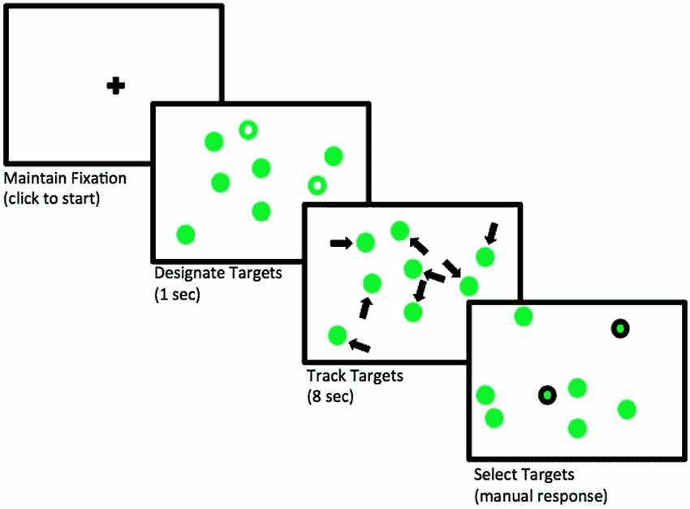
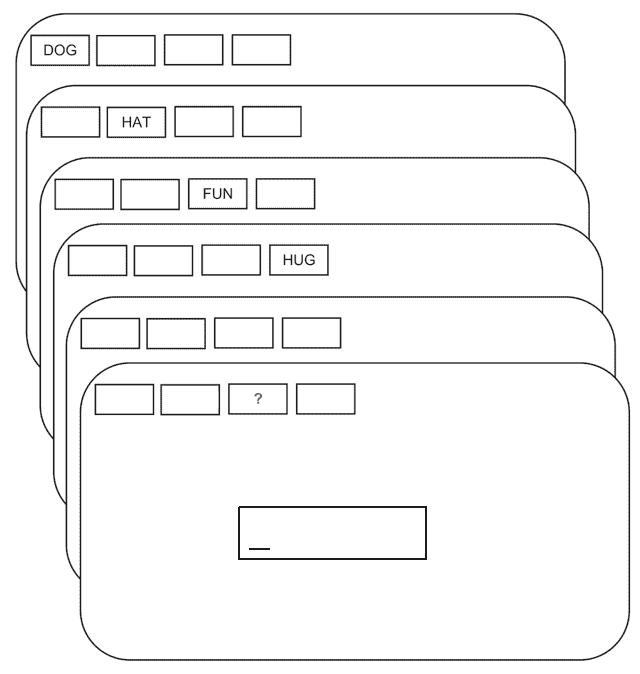

# 第四章 贝叶斯回归模型

> 原文：[`bruno.nicenboim.me/bayescogsci/ch-reg.html`](https://bruno.nicenboim.me/bayescogsci/ch-reg.html)

我们通常进行实验，因为我们对两个或多个变量之间的关系感兴趣。回归将告诉我们我们的*因变量*，也称为*响应*或*结果变量*（例如，瞳孔大小、反应时间、准确性等）是如何受到一个或多个*自变量*、*预测变量*或*解释变量*的影响的。预测变量可以是分类的（例如，男性或女性）、有序的（第一、第二、第三等）或连续的（例如，年龄）。在本章中，我们专注于具有不同概率密度函数的简单回归模型。

## 4.1 第一次线性回归：注意负荷会影响瞳孔大小吗？

让我们看看认知处理对人类瞳孔大小的影响，以说明贝叶斯线性回归模型的应用。尽管瞳孔大小主要与到达视网膜的光量或感知对象的距离有关，但瞳孔大小也受到认知处理的系统性影响：认知负荷的增加会导致瞳孔大小的增加（参见 Mathot 2018 的综述）。

在这个例子中，我们将使用 Wahn 等人(2016)的控制实验中一个受试者的瞳孔大小数据，按试验平均。数据可在`bcogsci`包中的`df_pupil`中找到。在这个实验中，受试者在计算机屏幕上随机移动的几个物体之间秘密跟踪零到五个物体。观看零个目标被称为被动观看条件。

这个任务被称为多目标跟踪（或 MOT；参见 Pylyshyn 和 Storm 1988)。首先，几个物体在屏幕上出现两秒钟，其中一部分物体在开始时被标记为“目标”。然后，物体开始在屏幕上随机移动并变得无法区分。几秒钟后，物体停止移动，受试者需要指出哪些物体是目标。见图 4.1。¹⁷我们的研究目标是检验被跟踪移动物体的数量——即注意负荷——如何影响瞳孔大小。



图 4.1：需要跟踪两个对象的试验中事件流程。改编自 Blumberg, Peterson 和 Parasuraman (2015)；根据 CC BY 4.0 许可使用([`creativecommons.org/licenses/by/4.0/`](https://creativecommons.org/licenses/by/4.0/))。

### 4.1.1 概率密度函数和先验

我们将瞳孔大小建模为正态分布，因为我们不期望有偏斜，并且我们没有关于瞳孔大小分布的更多信息。 (考虑到这里使用的单位，瞳孔大小不能为零或负数，所以我们肯定选择正态似然不是完全正确的。) 为了简单起见，假设负荷和瞳孔大小之间存在线性关系。

让我们总结一下我们的假设：

1.  存在一个平均瞳孔大小，表示为$\alpha$。

1.  注意力负荷的增加与瞳孔大小呈线性关系，由$\beta$确定。

1.  在这个过程中存在一些噪声，即围绕真实瞳孔大小的变异性。这种变异性由尺度$\sigma$表示。

1.  噪声是正态分布的。

生成概率密度函数如下：

$$\begin{equation} p\_size_n \sim \mathit{Normal}(\alpha + c\_load_n \cdot \beta,\sigma) \end{equation}$$

其中 $n$ 表示观测编号，$n = 1, \ldots, N$。

这意味着`brms`中的公式将是`p_size ~ 1 + c_load`，其中`1`代表截距，$\alpha$，它不依赖于预测变量，而`c_load`是乘以$\beta$的预测变量。前缀`c_`通常表示预测变量（在这种情况下是负荷）是中心化的（即，从每个值中减去所有值的平均值）。如果负荷是中心化的，则截距表示实验中平均负荷时的瞳孔大小（因为在平均负荷时，中心化的负荷为零，产生$\alpha + 0 \cdot \beta$）。如果负荷没有中心化（即，从没有负荷开始，然后是一个，两个等），那么截距将表示没有负荷时的瞳孔大小。我们可以使用`lm(p_size ~ 1 + c_load, data_set)`拟合频率派模型；当我们使用`brms`拟合贝叶斯模型时，语法与`lm()`函数相同，但现在我们必须为每个参数指定先验概率。

为了设置合理的先验概率，需要进行一些研究以找到关于瞳孔大小的信息。尽管我们可能知道在明亮的光线下瞳孔直径在 2 到 4 毫米之间，在黑暗中在 4 到 8 毫米之间（Spector 1990），但这个实验是在 Eyelink-II 眼动追踪器上进行的，该追踪器以任意单位测量瞳孔大小（Hayes 和 Petrov 2016）。如果我们这是第一次分析瞳孔大小，在设置先验概率之前，我们需要查看一些瞳孔大小的测量指标。（如果我们之前已经从先前进行的实验中分析过这类数据，我们也可以查看那些研究的估计）。幸运的是，我们在数据框`df_pupil_pilot`中从`bcogsci`包中找到了一些关于同一受试者在没有注意力负荷的前 100 毫秒内的测量数据，每 10 毫秒测量一次：这将给我们一些关于因变量量级的想法。

```r
data("df_pupil_pilot")
df_pupil_pilot$p_size %>%  summary()
```

```r
##    Min. 1st Qu.  Median    Mean 3rd Qu.    Max. 
##     852     856     862     861     866     868
```

使用这些信息，我们可以为 $\alpha$ 设置一个正则化先验。将先验中心定在 1000，以确保正确的数量级。¹⁸ 由于我们尚不清楚瞳孔大小将如何随负载变化，我们通过将其定义为正态分布并设置其标准差为 $500$ 来包含一个相当宽泛的先验。

$$\begin{equation} \alpha \sim \mathit{Normal}(1000, 500) \end{equation}$$

考虑到我们的预测负载是中心化的，并且有 $\alpha$ 的先验，我们推测实验中平均负载的平均瞳孔大小将位于一个 95% 的可信区间内，该区间大约为 $1000 \pm 2 \cdot 500 = [0, 2000]$ 单位。我们可以使用 R 中的 `qnorm()` 函数来更精确地计算：

```r
qnorm(c(.025, .975), mean = 1000, sd = 500)
```

```r
## [1]   20 1980
```

我们知道飞行员数据的测量值高度相关，因为它们相隔 10 毫秒。因此，它们不会给我们一个瞳孔大小变化的真实估计。因此，为 $\sigma$ 设置一个相当无信息的先验，以编码这种缺乏精确信息的情况：$\sigma$ 一定大于零，并且必须与无负载时的瞳孔大小数量级相当。

$$\begin{equation} \sigma \sim \mathit{Normal}_+(0, 1000) \end{equation}$$

使用这个 $\sigma$ 的先验，我们表示我们预计瞳孔大小的标准差应该在以下 95% 的可信区间内。

```r
qtnorm(c(0.025, 0.975), mean = 0, sd = 1000, a = 0)
```

```r
## [1]   31.3 2241.4
```

为了计算 95% 的可信区间，我们使用了 `extraDistr` 包中的 `qtnorm()` 而不是 `qnorm()`。如前所述，相关的命令指定是 `qtnorm(n, mean, sd, a = 0)`；记住，`a = 0` 表示截断正态分布，截断在左侧为零。

$\mathit{Normal}_+$，一个截断在零的正态分布，以便只允许正值，其均值与参数 $\mu$ 指示的位置（以及标准差与尺度 $\sigma$）不一致；参见在线部分 A.2。

```r
samples <-  rtnorm(20000, mean = 0, sd = 1000, a = 0)
c(mean = mean(samples), sd = sd(samples))
```

```r
## mean   sd 
##  801  601
```

我们仍然需要为 $\beta$ 设置一个先验，即由注意力负载产生的瞳孔大小变化。鉴于瞳孔大小的变化不易察觉（我们通常不会在日常生活中观察到瞳孔大小的变化），我们预计它们会比瞳孔大小（我们假设均值为 1000 单位）小得多，因此我们使用以下先验：

$$\begin{equation} \beta \sim \mathit{Normal}(0, 100) \end{equation}$$

通过 $\beta$ 的先验，我们表示我们并不真正知道增加注意力负载是否会增加甚至减少瞳孔大小（$\beta$ 的先验分布以零为中心），但我们确实知道增加一个单位的负载（即跟踪一个额外的对象）可能会以与以下 95% 的可信区间一致的方式改变瞳孔大小。

```r
qnorm(c(0.025, 0.975), mean = 0, sd = 100)
```

```r
## [1] -196  196
```

也就是说，我们预计负荷增加或减少瞳孔大小不会超过 200 个单位。

我们在这里指定的先验相对不提供信息；如前所述，这是因为我们在瞳孔大小研究中没有太多的先验经验。在其他设置中，我们可能会有更多的先验知识和经验；在这种情况下，可以使用更原则性的先验。我们在在线章节中讨论了这一点（在线章节 E）和贝叶斯工作流程（在线章节 F）。

### 4.1.2 `brms` 模型

在拟合负荷对瞳孔大小影响的 `brms` 模型之前，加载数据并使预测因子 `load` 中心化：

```r
data("df_pupil")
(df_pupil <-  df_pupil %>%
 mutate(c_load = load -  mean(load)))
```

```r
## # A tibble: 41 × 5
##    subj trial  load p_size c_load
##   <int> <int> <int>  <dbl>  <dbl>
## 1   701     1     2  1021\. -0.439
## 2   701     2     1   951\. -1.44 
## 3   701     3     5  1064\.  2.56 
## # ℹ 38 more rows
```

现在拟合 `brms` 模型：

```r
fit_pupil <-
 brm(p_size ~  1 +  c_load,
 data = df_pupil,
 family = gaussian(),
 prior = c(prior(normal(1000, 500), class = Intercept),
 prior(normal(0, 1000), class = sigma),
 prior(normal(0, 100), class = b, coef = c_load)))
```

与我们之前的模型相比，唯一的区别是我们现在在公式和先验中有一个预测因子。预测因子的先验用 `class = b` 表示，具体的预测因子用 `coef = c_load` 表示。如果我们想将相同的先验设置给不同的预测因子，我们可以省略 `coef` 参数。即使我们从公式中省略了 `1`，`brm()` 也会拟合与显式指定 `1` 时相同的模型。如果我们真的想移除截距，这必须用 `0 +...` 或 `-1 +...` 来表示。有关 `brms` 处理截距的更多详细信息，请参阅在线部分 A.3。先验是截距 ($\alpha$) 和斜率 ($\beta$) 的正态分布，以及尺度参数 $\sigma$ 的截断正态分布，这与标准差相一致（因为似然是正态分布）。`brms` 将自动截断 $\sigma$ 的先验指定，并只允许正值。

接下来，检查模型的输出。后验分布和迹图显示在图 4.2 中；此图是通过输入以下内容生成的：

```r
plot(fit_pupil)
```


图 4.2：`fit_pupil` 模型中参数的后验分布，以及相应的迹图。

```r
fit_pupil
```

```r
## ...
## Population-Level Effects: 
##           Estimate Est.Error l-95% CI u-95% CI Rhat Bulk_ESS Tail_ESS
## Intercept   702.30     19.92   664.39   741.46 1.00     3737     2987
## c_load       33.74     11.40    11.74    56.71 1.00     3672     2808
## 
## Family Specific Parameters: 
##       Estimate Est.Error l-95% CI u-95% CI Rhat Bulk_ESS Tail_ESS
## sigma   128.34     14.75   103.13   160.52 1.00     3881     2903
## 
## ...
```

在下一节中，我们将讨论如何传达模型中的相关信息。

### 4.1.3 如何传达结果？

我们想回答研究问题“注意力负荷对受试者瞳孔大小的影响是什么？”为了回答这个问题，我们需要检查 $\beta$ 的后验分布会发生什么，这在 `brms` 的总结中打印为 `c_load`。后验总结告诉我们，$\beta$ 的最可能值将围绕后验的均值，即 33.74，并且我们可以有 95% 的把握，给定模型和数据，$\beta$ 的值将在 11.74 和 56.71 之间。

模型告诉我们，随着注意负载的增加，受试者的瞳孔大小会变大。如果我们想确定瞳孔大小增加而不是减少的概率，我们可以计算位于零以上的样本比例。（在 `brms` 中，截距和斜率总是由 `b_` 预先表示。可以通过 `variables()` 查看所有正在估计的参数名称。）

```r
mean(as_draws_df(fit_pupil)$b_c_load >  0)
```

```r
## [1] 0.998
```

**这种高概率并不意味着负载效应为零。** 相反，这意味着效应为正的可能性远大于为负。为了声称效应可能不为零，我们必须将模型与一个替代模型进行比较，在这个替代模型中，模型假设负载效应为 $0$。当我们讨论第十二章中的模型比较时，我们将回到这个问题。

### 4.1.4 描述性充分性

我们的模式收敛了，我们得到了参数的后验分布。然而，并不能保证我们的模型足够好，能够代表我们的数据。我们可以使用后验预测检查来调查模型的描述性充分性。

有时定制后验预测检查以可视化我们模型的拟合是有用的。我们遍历不同的负载（例如，从 0 到 4），并展示基于每个负载的 100 次模拟的后验预测分布，以及图 4.3 中的观察到的瞳孔大小。我们没有足够的数据得出强有力的结论：预测分布和我们的数据看起来都分布得很广，很难判断观察值的分布是否可能是由我们的模型生成的。目前我们可以说的是，它看起来并不太糟糕。

```r
for (l in 0:4) {
 df_sub_pupil <-  filter(df_pupil, load ==  l)
 p <-  pp_check(fit_pupil,
 type = "dens_overlay",
 ndraws = 100,
 newdata = df_sub_pupil) +
 geom_point(data = df_sub_pupil, aes(x = p_size, y = 0.0001)) +
 ggtitle(paste("load: ", l)) +
 coord_cartesian(xlim = c(400, 1000))
 print(p)
}
```


图 4.3：该图显示了 100 个后验预测分布，标签为 $y_{rep}$，以黑色显示的瞳孔大小数据的分布，以及五个注意负荷水平下观察到的瞳孔大小以黑色点表示。

在图 4.4 中，我们转而查看一个汇总统计量的分布，例如按负荷的平均瞳孔大小。图 4.4 显示，无负荷和负荷为一时的观察均值正落在分布的尾部。尽管我们的模型预测瞳孔大小单调增加，但数据可能表明相关的差异仅仅是无负荷和某些负荷之间的差异。然而，考虑到后验预测分布的不确定性以及观察到的均值包含在预测分布中的某个地方，我们可能会用这个模型过度解释噪声。

```r
for (l in 0:4) {
 df_sub_pupil <-  filter(df_pupil, load ==  l)
 p <-  pp_check(fit_pupil,
 type = "stat",
 ndraws = 1000,
 newdata = df_sub_pupil,
 stat = "mean") +
 geom_point(data = df_sub_pupil, aes(x = p_size, y = 0.9)) +
 ggtitle(paste("load: ", l)) +
 coord_cartesian(xlim = c(400, 1000))
 print(p)
}
```


图 4.4：通过负载显示后验预测均值分布（灰色）和观察到的瞳孔大小均值分布（黑色线条）

## 4.2 对数正态模型：试验是否影响反应时间？

让我们回顾一下第 3.2.1 节中的小实验，其中一位受试者尽可能快地重复按空格键。假设我们想知道受试者在按空格键时是倾向于加速（练习效应）还是减速（疲劳效应）。我们将使用之前相同的 `df_spacebar` 数据集，并将 `trial` 列居中：

```r
df_spacebar <-  df_spacebar %>%
 mutate(c_trial = trial -  mean(trial))
```

### 4.2.1 对数正态模型的似然和先验

如果我们假设指尖敲击时间是对数正态分布的，似然函数变为：

$$\begin{equation} t_n \sim \mathit{LogNormal}(\alpha + c\_trial_n \cdot \beta,\sigma) \tag{4.1} \end{equation}$$

其中 $n =1, \ldots, N$，$t$ 是因变量（以毫秒为单位的指尖敲击时间）。变量 $N$ 代表数据点的总数。

对于 $\alpha$（在先前的模型中相当于 $\mu$）和 $\sigma$，使用与第 3.7.2 节相同的先验。

$$\begin{equation} \begin{aligned} \alpha &\sim \mathit{Normal}(6, 1.5) \\ \sigma &\sim \mathit{Normal}_+(0, 1)\\ \end{aligned} \end{equation}$$

我们仍然需要一个关于 $\beta$ 的先验。当我们假设对数正态似然时，效应是乘法而非加法，这意味着我们需要考虑 $\alpha$ 来解释 $\beta$；有关详细信息，请参阅在线部分 A.4。我们将通过生成一些先验预测分布来尝试理解所有先验之间的相互作用。我们从一个以零为中心的先验开始，这个先验对效应的方向是中立的，允许减速 ($\beta>0$) 和加速 ($\beta<0$)：

$$\begin{equation} \beta \sim \mathit{Normal}(0, 1) \end{equation}$$

这里是我们对先验预测分布的第一次尝试：

```r
# Ignore the dependent variable,
# use a vector of ones a placeholder.
df_spacebar_ref <-  df_spacebar %>%
 mutate(t = rep(1, n()))
fit_prior_press_trial <-
 brm(t ~  1 +  c_trial,
 data = df_spacebar_ref,
 family = lognormal(),
 prior = c(prior(normal(6, 1.5), class = Intercept),
 prior(normal(0, 1), class = sigma),
 prior(normal(0, 1), class = b, coef = c_trial)),
 sample_prior = "only",
 control = list(adapt_delta = .9))
```

为了理解我们事先假设的参数$\beta$的先验类型的数据，绘制相邻试验中手指敲击时间的中值差异。随着$\beta$的先验变宽，相邻试验之间的差异会更大。先验预测检查的目标是将$\beta$的先验校准到合理的差异范围内。我们将绘制中值分布，因为它们比均值差异分布受先验预测分布中的方差影响较小；均值分布将具有更大的分散性。为了使均值分布更真实，我们还需要找到一个更准确的尺度$\sigma$的先验。 (回想一下，对数正态分布值的均值取决于分布的位置$\mu$和尺度$\sigma$)。为了绘制中值效应，首先定义一个函数来计算相邻试验之间的差异，然后将中值应用于结果。我们在`pp_check`中使用该函数，并在图 4.5 中展示结果。正如预期的那样，中值效应集中在零（正如我们的先验一样），但我们看到可能的中值效应分布过于分散，包括了一些过于极端的值。

```r
median_diff <-  function(x) {
 median(x -  lag(x), na.rm = TRUE)
}
pp_check(fit_prior_press_trial,
 type = "stat",
 stat = "median_diff",
 # show only prior predictive distributions 
 prefix = "ppd",
 # each bin has a width of 500 ms 
 binwidth = 500) +
 # cut the top of the plot to improve its scale
 coord_cartesian(ylim = c(0, 50))
```


图 4.5：基于 4.2 节 4.2 中定义的模型，其中$\beta \sim \mathit{Normal}(0, 1)$的中值效应的先验预测分布。

使用$\beta \sim \mathit{Normal}(0,0.01)$重复相同的程序；得到的先验预测分布如图 4.6 所示。先验预测分布显示，先验仍然相当模糊；然而，至少在数量级上是正确的。


图 4.6：基于 4.2 节 4.2 中定义的模型，相邻试验之间手指敲击时间的中值差异的先验预测分布，其中$\beta \sim \mathit{Normal}(0, 0.01)$。

先验选择可能看起来令人畏惧，并且可能是一项大量工作。然而，这项工作通常只在第一次开始使用实验范式时进行；此外，先验可以由先前实验的估计（即使是频率派模型的极大似然估计也可能有用）来指导。我们通常会对处理相同类型任务的分析使用非常相似（或相同的）先验。如果有疑问，敏感性分析（见第 3.4 节）可以告诉我们后验分布是否无意中强烈依赖于我们的先验选择。我们还在在线章节 E 中讨论了先验选择。

### 4.2.2 `brms`模型

我们现在对我们模型的先验相对满意，我们可以使用`brms`拟合实验对按钮按压时间的影响模型。我们需要指定家族为`lognormal()`。

```r
fit_press_trial <-
 brm(t ~  1 +  c_trial,
 data = df_spacebar,
 family = lognormal(),
 prior = c(prior(normal(6, 1.5), class = Intercept),
 prior(normal(0, 1), class = sigma),
 prior(normal(0, 0.01), class = b, coef = c_trial)))
```

而不是打印出模型的完整输出，请查看参数 $\alpha$、$\beta$ 和 $\sigma$ 的后验估计。这些参数位于对数尺度上：

```r
posterior_summary(fit_press_trial,
 variable = c("b_Intercept",
 "b_c_trial",
 "sigma"))
```

```r
##             Estimate Est.Error     Q2.5    Q97.5
## b_Intercept 5.118340 0.0064256 5.105460 5.130953
## b_c_trial   0.000524 0.0000616 0.000399 0.000646
## sigma       0.123360 0.0046777 0.114539 0.132888
```

后验分布可以被绘制出来，以获得模型中所有参数的图形总结（见图 4.7）：

```r
plot(fit_press_trial)
```


图 4.7：实验对按钮按压效果模型的后验分布。

接下来，我们转向我们能够报告为结果的问题，以及我们能从数据中得出什么结论。

### 4.2.3 如何传达结果？

如上所示，第一步是将后验总结在表格中或图形化（或两者兼而有之）。如果研究涉及模型估计的效果，$\beta$的后验可以总结如下：$\hat\beta = 0.00052$，95% CrI = $[ 0.0004 , 0.00065 ]$。

这种影响在毫秒上更容易解释。我们可以将估计值从对数尺度转换回毫秒尺度，但我们需要考虑到尺度不是线性的，并且两次按钮按压之间的效果将取决于我们在实验中的位置。

如果我们考虑实验中间的一次试验（当中心试验编号为零时）和前一次试验（当中心试验编号为负一）之间的反应时间差异，我们将有一个一定的估计。

```r
alpha_samples <-  as_draws_df(fit_press_trial)$b_Intercept
beta_samples <-  as_draws_df(fit_press_trial)$b_c_trial
effect_middle_ms <-  exp(alpha_samples) -
 exp(alpha_samples -  1 *  beta_samples)
## ms effect in the middle of the expt
## (mean trial vs. mean trial - 1)
c(mean = mean(effect_middle_ms),
 quantile(effect_middle_ms, c(0.025, 0.975)))
```

```r
##   mean   2.5%  97.5% 
## 0.0875 0.0668 0.1075
```

如果我们考虑第二次和第一次试验之间的差异，我们将获得不同的估计：

```r
first_trial <-  min(df_spacebar$c_trial)
second_trial <-  min(df_spacebar$c_trial) +  1
effect_beginning_ms <-
 exp(alpha_samples +  second_trial *  beta_samples) -
 exp(alpha_samples +  first_trial *  beta_samples)
## ms effect from first to second trial:
c(mean = mean(effect_beginning_ms),
 quantile(effect_beginning_ms, c(0.025, 0.975)))
```

```r
##   mean   2.5%  97.5% 
## 0.0796 0.0622 0.0958
```

到目前为止，我们已经将估计值转换为获得中位效应，这就是为什么我们使用了 $exp(\cdot)$。如果我们想获得平均效应，我们需要考虑 $\sigma$，因为我们需要计算 $exp(\cdot + \sigma²/2)$。然而，我们也可以使用内置函数 `fitted()` 来计算平均效应。再次考虑第二次和第一次试验之间的差异，这次使用 `fitted()`。

首先，定义我们想要在毫秒尺度上获得拟合值的观测。如果我们对第二次和第一次试验之间的差异感兴趣，创建一个包含它们中心版本的 DataFrame。

```r
newdata_1 <-  data.frame(c_trial = c(first_trial, second_trial))
```

第二步，对 `brms` 对象使用 `fitted()`，包括新数据，并将 `summary` 参数设置为 `FALSE`。第一列包含转换为第一次试验毫秒的后验样本，第二列是第二次试验。

```r
beginning <-  fitted(fit_press_trial,
 newdata = newdata_1,
 summary = FALSE)
head(beginning, 3)
```

```r
##      [,1] [,2]
## [1,]  157  157
## [2,]  153  153
## [3,]  153  153
```

最后一步是计算试验之间的差异，并报告均值和 95% 可信区间。

```r
effect_beginning_ms <-  beginning[, 2] -  beginning[,1]
c(mean = mean(effect_beginning_ms),
 quantile(effect_beginning_ms, c(0.025, 0.975)))
```

```r
##   mean   2.5%  97.5% 
## 0.0802 0.0626 0.0966
```

由于 $\sigma$ 比较小，$\sigma$ 对平均效应的影响不大，平均效应和中位效应的平均值和 95% CrI 非常相似。

我们可以看到，无论我们如何计算试验效应，都会出现减速。在报告这些分析的结果时，应该呈现后验均值和可信区间，然后推断观察到的估计值是否与正在调查的理论预测一致。这里使用的 95% 可信区间只是从心理学和相关领域的标准实践中采用的惯例，其中 95% 置信区间是默认值。例如，可以使用 80% 的 CrI。

对于研究问题，效应的实际相关性也很重要。例如，只有在按下 $100$ 次按钮之后，我们才看到几乎察觉不到的减速：

```r
effect_100 <-
 exp(alpha_samples +  100 *  beta_samples) -
 exp(alpha_samples)
c(mean = mean(effect_100),
 quantile(effect_100, c(0.025, 0.975)))
```

```r
##  mean  2.5% 97.5% 
##  8.99  6.81 11.11
```

我们需要考虑这个估计的不确定性和估计的平均效应是否有任何科学相关性。这种相关性可以通过考虑以前的文献、定量模型的预测或其他专家领域知识来建立。有时，定量荟萃分析是有帮助的；例如，参见 Bürki, Alario, and Vasishth (2023)，Cox et al. (2022)，Bürki et al. (2020)，Jäger, Engelmann, and Vasishth (2017)，Mahowald et al. (2016)，Nicenboim, Roettger, and Vasishth (2018)，以及 Vasishth et al. (2013)。我们将在本书的第十一章中讨论荟萃分析。

有时，研究人员只对确定一个效应是否存在感兴趣；估计的幅度和不确定性是次要的。在这里，目标是论证存在**证据**表明有减速。在统计学中，证据一词有特殊含义（Royall 1997)，在零假设显著性检验中，似然比检验是论证存在效应的标准方式。在贝叶斯数据分析的背景下，为了回答这样的问题，必须进行贝叶斯因子分析。我们将在模型比较章节 12-14 中回到这个问题。

### 4.2.4 描述充分性

现在我们来看模型的预测。由于我们现在知道试验效应非常小，让我们检查模型对 100 次按键之间响应时间差异的预测。与先验预测检查类似，我们定义了一个函数 `median_diff100()`，它计算试验 $n$ 和试验 $n+100$ 之间的中位数差异。这次我们将比较观测到的中位数差异与基于模型和数据的预测差异范围，而不仅仅是像先验预测那样只基于模型。下面我们使用与绘制先验预测检查几乎相同的代码，但由于我们现在使用拟合的模型，我们将获得后验预测检查；这显示在图 4.8 中。

```r
median_diff100 <-  function(x) median(x -  lag(x, 100), na.rm = TRUE)
pp_check(fit_press_trial,
 type = "stat",
 stat = "median_diff100")
```


图 4.8：基于模型 `fit_press_trial` 和观测数据，试验 $n$ 和试验 $n+100$ 之间响应时间中位数差异的后验预测分布。

从图 4.8 中，我们可以得出结论，模型对试验间响应差异的预测是合理的。

## 4.3 逻辑回归：集合大小是否影响自由回忆？

在本节中，我们将学习我们迄今为止学到的原则如何自然地扩展到**广义**线性模型（GLMs）。我们专注于 GLMs 的一个特殊情况，它在语言学和心理学中应用广泛，即逻辑回归。

作为示例数据集，我们研究了一项关于工作记忆容量水平的研究。数据是 Oberauer (2019) 创建的数据集的一个子集。每个受试者被呈现不同长度的单词列表（2、4、6 和 8 个元素），然后被要求回忆列表中给定位置的单词；参见图 4.9。我们将关注一个受试者的数据。



图 4.9：在记忆集合大小为 4 的试验中事件流程。改编自 Oberauer (2019)；署名许可 CC BY 4.0 ([`creativecommons.org/licenses/by/4.0/`](https://creativecommons.org/licenses/by/4.0/))。

已有研究表明，随着需要保持在工作记忆中的项目数量增加，性能，即准确性，会下降（参见 Oberauer 和 Kliegl 2001，等人）。我们将仅使用一个被试的数据来调查这一主张。

数据可以在 `bcogsci` 包中的 `df_recall` 中找到。下面的代码加载了数据，对预测变量 `set_size` 进行了中心化，并对数据集进行了简要探索。

```r
data("df_recall")
df_recall <-  df_recall %>%
 mutate(c_set_size = set_size -  mean(set_size))
# Set sizes in the data set:
df_recall$set_size %>%
 unique() %>%  sort()
```

```r
## [1] 2 4 6 8
```

```r
# Trials by set size
df_recall %>%
 group_by(set_size) %>%
 count()
```

```r
## # A tibble: 4 × 2
## # Groups:   set_size [4]
##   set_size     n
##      <int> <int>
## 1        2    23
## 2        4    23
## 3        6    23
## # ℹ 1 more row
```

在这里，列 `correct` 分别用 `0` 和 `1` 记录错误和正确的响应，列 `c_set_size` 记录中心化的记忆集合大小；这些后者的分数具有连续值 -3、-1、1 和 3。这些连续值是 2、4、6 和 8 的中心化版本。

```r
df_recall
```

```r
## # A tibble: 92 × 8
##   subj  set_size correct trial session block tested c_set_size
##   <chr>    <int>   <int> <int>   <int> <int>  <int>      <dbl>
## 1 10           4       1     1       1     1      2         -1
## 2 10           8       0     4       1     1      8          3
## 3 10           2       1     9       1     1      2         -3
## # ℹ 89 more rows
```

我们想要模拟每次试验的准确性，并检查回忆一个单词的概率是否与被试需要记住的单词集合中的单词数量有关。

### 4.3.1 逻辑回归模型的似然函数

回想一下，伯努利似然函数以特定的概率 $\theta$ 生成 $0$ 或 $1$ 的响应。例如，可以使用 `extraDistr` 包中的 `rbern()` 生成 $10$ 个观察值的模拟数据，其中 $50$% 的概率得到 $1$。

```r
rbern(10, prob = 0.5)
```

```r
##  [1] 0 1 1 1 0 0 1 0 0 1
```

因此，我们可以将数据中的每个因变量 `correct_n` 定义为来自成功概率为 $\theta_n$ 的伯努利随机变量。在这里，$n = 1, \ldots, N$ 指的是观察值，$correct_n$ 是因变量（$0$ 表示错误的回忆，$1$ 表示正确的回忆），而 $\theta_n$ 是在给定观察 $n$ 中正确回忆探测的概率。

$$\begin{equation} correct_n \sim \mathit{Bernoulli}(\theta_n) \tag{4.2} \end{equation}$$

由于观察到的数据要么是 $0$ 要么是 $1$，我们不应该像前例中那样使用正态（或对数正态）似然函数来拟合回归模型。这样的模型是不合适的，因为它假设观察到的数据是介于 $-\infty$ 到 $+\infty$（或 $0$ 到 $+\infty$）之间的实数。

广义线性建模框架通过定义一个 *连接函数* $g(\cdot)$ 来解决这个问题，该函数将线性模型与要估计的量（此处为概率 $\theta_n$）连接起来。用于 $0$、$1$ 响应的连接函数称为 *logit 连接函数*，其定义如下。

$$\begin{equation} \eta_n = g(\theta_n) = \log\left(\frac{\theta_n}{1-\theta_n}\right) \end{equation}$$

项 $\frac{\theta_n}{1-\theta_n}$ 被称为 *odds*。¹⁹ 因此，logit 连接函数是一个 log-odds；它将概率值从 $(0,1)$ 映射到介于 $-\infty$ 和 $+\infty$ 之间的实数。图 4.10 展示了 logit 连接函数，$\eta = g(\theta)$，以及逆 logit，$\theta = g^{-1}(\eta)$，这被称为 *logistic function*；这个逻辑函数的相关性将在下一刻变得清晰。


图 4.10：logit 和逆 logit（逻辑）函数。

线性模型现在拟合的不是 $0$、$1$ 的响应作为因变量，而是 $\eta_n$，即 log-odds，作为因变量：

$$\begin{equation} \eta_n = \log\left(\frac{\theta_n}{1-\theta_n}\right) = \alpha + \beta \cdot c\_set\_size \end{equation}$$

与线性模型不同，该模型定义得没有残差误差项 ($\varepsilon$)。一旦 $\eta_n$ 被估计，就可以解上述方程得到 $\theta_n$（换句话说，我们计算 logit 函数的逆并得到概率尺度上的估计）。这给出了上述提到的逻辑回归函数：

$$\begin{equation} \theta_n = g^{-1}(\eta_n) = \frac{\exp(\eta_n)}{1+\exp(\eta_n)} = \frac{1}{1+exp(-\eta_n)} \end{equation}$$

上式中最后一个等式是通过将分子和分母都除以 $\exp(\eta_n)$ 得到的。

总结来说，具有 logit 连接的广义线性模型拟合以下伯努利似然：

$$\begin{equation} correct_n \sim \mathit{Bernoulli}(\theta_n) \tag{4.3} \end{equation}$$

模型是在 log-odds 比例尺上拟合的，$\eta_n = \alpha + c\_set\_size_n \cdot \beta$。一旦 $\eta_n$ 被估计，就使用逆 logit 或逻辑函数来计算概率估计 $\theta_n = \frac{\exp(\eta_n)}{1+\exp(\eta_n)}$。下一个部分将展示这个计算的例子。

### 4.3.2 逻辑回归的先验

为了确定 $\alpha$ 和 $\beta$ 的先验值，我们需要考虑这些参数并不代表概率或比例，而是 *log-odds*，即图 4.10（右侧图）中的 x 轴。如图所示，log-odds 和概率之间的关系不是线性的。

在 R 中有两个函数实现了 logit 和逆 logit 函数：`qlogis(p)` 用于 logit 函数，`plogis(x)` 用于逆 logit 或逻辑函数。

现在我们需要为 $\alpha$ 和 $\beta$ 设置先验。鉴于我们中心化了预测器，截距 $\alpha$ 代表在平均集合大小为五的情况下正确回忆一个单词的对数几率（因为 $5 = \frac{2+4+6+8}{4}$），这偶然地并未在实验中呈现。这是截距在没有中心化预测的情况下没有明确解释的一个例子：使用非中心化的集合大小，截距将是回忆一个单词在包含 *零* 个单词的集合中的对数几率，这显然是没有意义的。

$\alpha$ 的先验分布将取决于回忆任务有多难。我们可以假设对于一个平均集合大小，$\alpha$ 回忆一个单词的概率是中心在 $0.5$（$50/50$ 的机会）并且有很大的不确定性。R 命令 `qlogis(0.5)` 告诉我们 $0.5$ 对应于对数几率空间中的零。我们如何包含很大的不确定性？我们可以查看图 4.10，并决定在以零为中心的正态分布中的标准差为 $4$：

$$\begin{equation} \alpha \sim \mathit{Normal}(0, 4) \end{equation}$$

让我们通过绘制随机样本来绘制这个先验在对数几率和概率尺度上的图。

```r
samples_log_odds <-  tibble(log_odds = rnorm(100000, 0, 4))
samples_p <-  tibble(p = plogis(rnorm(100000, 0, 4)))
ggplot(samples_log_odds, aes(log_odds)) +
 geom_density()
ggplot(samples_p, aes(p)) +
 geom_density()
```


图 4.11：$\alpha \sim \mathit{Normal}(0, 4)$ 在对数几率和概率空间中的先验分布。

图 4.11 显示，我们的先验分配给回忆极端概率的质量比中间值多。显然，这并不是我们想要的。

我们可以尝试不同的先验标准差值，直到找到一个对我们有意义的先验。将标准差降低到 1.5 看起来是有意义的，如图 4.12 所示。

$$\begin{equation} \alpha \sim \mathit{Normal}(0, 1.5) \end{equation}$$


图 4.12：$\alpha \sim \mathit{Normal}(0, 1.5)$ 在对数几率和概率空间中的先验分布。

我们现在需要决定 $\beta$ 的先验，即增加集合大小对对数几率的效应。我们可以选择以零为中心的正态分布，反映我们对效应方向的任何承诺。让我们通过以下分布作为先验来测试这个先验的不同可能标准差：

1.  $\beta \sim \mathit{Normal}(0, 1)$

1.  $\beta \sim \mathit{Normal}(0, .5)$

1.  $\beta \sim \mathit{Normal}(0, .1)$

1.  $\beta \sim \mathit{Normal}(0, .01)$

1.  $\beta \sim \mathit{Normal}(0, .001)$

在原则上，我们可以使用 `brms` 的 `sample_prior = "only"` 选项来生成先验预测分布，然后使用 `predict()`。然而，如前所述，`brms` 也使用 Stan 的哈密顿采样器从先验中进行采样，当先验信息不足（如本例所示）时，这可能导致收敛问题。我们通过在 R 中直接使用 `r*` 函数族（例如，`rnorm()`、`rbinom()` 等）以及循环来执行先验预测检查来解决这个问题。这种方法不如使用 `brms` 提供的便捷函数简单，但它非常灵活，并且可以非常强大。我们在图 4.13 中展示了先验预测分布；有关 R 中实现的详细信息，请参阅在线部分 A.5。

图 4.13 显示，正如预期的那样，先验分布以零为中心。我们看到，对于标准差为 $1$ 的先验分布，可能准确率的分布存在问题：对于集合大小为 $2$ 和 $8$ 的情况，太多的概率集中在 $0$ 和 $1$ 附近。很难区分其他先验之间的差异，并且查看图 4.14 中集合大小之间预测的准确率差异可能更有用。


图 4.13：定义在第 4.3 节中的模型在不同集合大小和不同 $\beta$ 先验下的平均准确率先验预测分布 

图 4.14：定义在第 4.3 节中的模型在不同 $\beta$ 先验下，不同集合大小之间平均准确率差异的先验预测分布。

如果我们不确定集合大小的增加是否会在无效应和相对较大的效应之间产生某种结果，我们可以选择标准差为 $0.1$ 的先验。根据这种推理，我们确定了以下先验：

$$\begin{equation} \begin{aligned} \alpha &\sim \mathit{Normal}(0, 1.5) \\ \beta &\sim \mathit{Normal}(0, 0.1) \end{aligned} \end{equation}$$

### 4.3.3 `brms` 模型

在确定了似然函数、连接函数和先验之后，现在可以使用 `brms` 来拟合模型。我们需要指定家族为 `bernoulli()`，连接为 `logit`。

```r
fit_recall <-
 brm(correct ~  1 +  c_set_size,
 data = df_recall,
 family = bernoulli(link = logit),
 prior = c(prior(normal(0, 1.5), class = Intercept),
 prior(normal(0, 0.1), class = b, coef = c_set_size)))
```

接下来，查看每个参数后验的摘要。请记住，参数是在对数优势空间中的：

```r
posterior_summary(fit_recall,
 variable = c("b_Intercept", "b_c_set_size"))
```

```r
##              Estimate Est.Error   Q2.5   Q97.5
## b_Intercept     1.934    0.3145  1.345  2.5808
## b_c_set_size   -0.188    0.0852 -0.353 -0.0205
```

检查`b_c_set_size`，我们看到增加集合大小对召回有不利影响，正如我们所怀疑的。

同时绘制后验分布图（图 4.15）：

```r
plot(fit_recall)
```


图 4.15：`brms`模型`fit_recall`中参数的后验分布，以及相应的轨迹图。

接下来，我们转向我们能够报告的结果以及我们能从数据中得出的结论。

### 4.3.4 如何传达结果？

在这里，我们处于与之前我们看到的对数正态模型类似的情况。如果我们想谈论模型在对数优势空间中估计的效果，我们可以以下述方式总结β的后验：$\hat\beta = -0.188$，95% CrI = [ -0.353 , -0.021 ]。

然而，用比例表示效果比用对数优势更容易理解。首先，让我们看看这个任务的平均准确性：

```r
alpha_samples <-  as_draws_df(fit_recall)$b_Intercept
av_accuracy <-  plogis(alpha_samples)
c(mean = mean(av_accuracy), quantile(av_accuracy, c(0.025, 0.975)))
```

```r
##  mean  2.5% 97.5% 
## 0.870 0.793 0.930
```

如前所述，为了将我们的操作效果转换为更容易理解的尺度（即比例），我们需要考虑尺度不是线性的，以及增加集合大小的影响取决于平均准确性和我们开始的集合大小。

我们可以进行以下计算，类似于我们在试验效果实验中所做的，以找出准确性的降低比例或概率尺度：

```r
beta_samples <-  as_draws_df(fit_recall)$b_c_set_size
effect_middle <-  plogis(alpha_samples) -
 plogis(alpha_samples -  beta_samples)
c(mean = mean(effect_middle),
 quantile(effect_middle, c(0.025, 0.975)))
```

```r
##     mean     2.5%    97.5% 
## -0.01910 -0.03746 -0.00236
```

注意这里的解释，如果我们从平均集合大小减一增加到平均集合大小，召回的准确性将降低 0.019，95% CrI = [ -0.037 , -0.002 ]。记住，平均集合大小，5，并没有向受试者展示！我们可以从集合大小为 2 减少到 4 来观察准确性的降低：

```r
four <-  4 -  mean(df_recall$set_size)
two <-  2 -  mean(df_recall$set_size)
effect_4m2 <-
 plogis(alpha_samples +  four *  beta_samples) -
 plogis(alpha_samples +  two *  beta_samples)
c(mean = mean(effect_4m2), 
 quantile(effect_4m2, c(0.025, 0.975)))
```

```r
##     mean     2.5%    97.5% 
## -0.02963 -0.05429 -0.00461
```

我们还可以使用`fitted()`函数而不是`plogis()`函数将结果反变换到概率尺度。一个优点是，这将在任何类型的链接函数下都有效；在本节中，我们只讨论了对数链接，但在广义线性模型中可以使用其他链接函数（例如，probit 链接；参见 Dobson 和 Barnett 2011）。

由于集合大小是唯一的预测变量，并且它是中心化的，为了估计平均准确性，我们可以考虑一个假设的观察，其中`c_set_size`为零，这对应于平均集合大小。（如果有更多的中心化预测变量，我们需要将它们都设置为零）。现在我们可以使用`fitted()`函数提供的`summary`参数。

```r
fitted(fit_recall,
 newdata = data.frame(c_set_size = 0),
 summary = TRUE)[,c("Estimate", "Q2.5","Q97.5")]
```

```r
## Estimate     Q2.5    Q97.5 
##    0.870    0.793    0.930
```

为了估计从平均集合大小减一到平均集合大小，以及从集合大小为 2 到 4 的准确性差异，首先，用这些集合大小定义`newdata`。

```r
new_sets <-  data.frame(c_set_size = c(0, -1, four, two))
set_sizes <-  fitted(fit_recall,
 newdata = new_sets,
 summary = FALSE)
```

然后根据`set_sizes`的第一列对应平均集大小，第二列对应平均集大小减一，依此类推，计算适当的差异。

```r
effect_middle <-  set_sizes[, 1] -  set_sizes[, 2] 
effect_4m2 <-  set_sizes[, 3] -  set_sizes[, 4] 
```

最后，计算总结。

```r
c(mean = mean(effect_middle), quantile(effect_middle, 
 c(0.025, 0.975)))
```

```r
##     mean     2.5%    97.5% 
## -0.01910 -0.03746 -0.00236
```

```r
c(mean = mean(effect_4m2), quantile(effect_4m2, 
 c(0.025, 0.975)))
```

```r
##     mean     2.5%    97.5% 
## -0.02963 -0.05429 -0.00461
```

如预期的那样，我们使用`fitted()`得到的确切值与我们手动计算得到的值完全相同。

### 4.3.5 描述性充分性

后验分布的一个可能有用的方面是，我们也可以对实际实验中没有呈现的其他条件进行预测，例如未测试的集大小。然后我们可以进行另一个实验，使用另一个实验来调查我们的模型是否正确。为了对其他集大小进行预测，我们扩展我们的数据集，添加具有集大小为 $3$、$5$ 和 $7$ 的行。为了与实验中其他集大小的数据保持一致，我们为每个新集大小添加 $23$ 个观测值（这是数据集中按集大小计算的观测值数量）。需要注意的一个重要事项是**我们需要根据原始的平均集大小来中心化我们的预测变量**。这是因为我们希望保持对截距的解释。我们按以下方式扩展数据，并总结数据，如图 4.16 所示。

```r
df_recall_ext <-  df_recall %>%
 bind_rows(tibble(set_size = rep(c(3, 5, 7), 23),
 c_set_size = set_size -
 mean(df_recall$set_size),
 correct = 0))
# nicer label for the facets:
set_size <-  paste("set size", 2:8) %>%
 setNames(-3:3)
pp_check(fit_recall,
 type = "stat_grouped",
 stat = "mean",
 group = "c_set_size",
 newdata = df_recall_ext,
 facet_args = list(ncol = 1, scales = "fixed",
 labeller = as_labeller(set_size)),
 binwidth = 0.02)
```


图 4.16：测试集大小（2、4、6 和 8）和未测试集大小（3、5 和 7）的后验预测均值准确率的分布用 $y_{rep}$ 标记。观察到的均值准确率 $y$ 仅与测试集大小 2、4、6 和 8 相关；未测试集大小的“观察”准确率表示为 0。

我们现在可以在一个也显示集大小为 $3$、$5$ 和 $7$ 的实验中收集新的数据。这些数据将不会用于`fit_recall`模型的拟合，因为模型是在这些数据不可用的情况下拟合的。验证新观测值是否适合我们已生成的后验预测分布将是测试我们模型真正预测的一种方法。

在了解了如何拟合简单的回归模型后，我们将在下一章转向层次模型。

## 4.4 总结

在本章中，我们学习了如何拟合简单的线性回归模型，以及如何拟合和解释具有对数正态似然和逻辑回归模型的模型。我们使用先验预测检查来调查模型的先验指定，并使用后验预测检查来调查模型的描述性充分性。

## 4.5 进一步阅读

线性回归在多本经典教科书中有所讨论；这些书籍大多具有频率主义导向，但其中所提出的线性建模基本理论可以很容易地扩展到贝叶斯框架。一本易于理解的教科书是由 Dobson 和 Barnett 所著（2011）。其他关于线性建模的有用教科书包括 Harrell Jr. (2015)、Faraway (2016)、Fox (2015)以及 Montgomery, Peck 和 Vining (2012)）。

### 参考文献

Blumberg, Eric J., Matthew S. Peterson, and Raja Parasuraman. 2015\. “使用非侵入性脑刺激提高多目标跟踪性能：前顶叶沟的因果作用。” *系统神经科学前沿* 9: 3\. [`doi.org/10.3389/fnsys.2015.00003`](https://doi.org/10.3389/fnsys.2015.00003).

Bürki, Audrey, Francois-Xavier Alario, and Shravan Vasishth. 2023\. “当词语碰撞：图片-词干扰范式中的干扰物和目标属性贝叶斯元分析。” *实验心理学季刊* 76 (6): 1410–30\. [`doi.org/10.1177/17470218221114644`](https://doi.org/10.1177/17470218221114644).

Bürki, Audrey, Shereen Elbuy, Sylvain Madec, and Shravan Vasishth. 2020\. “从四十年的语义干扰研究中学到了什么？贝叶斯元分析。” *记忆与语言杂志* 114\. [`doi.org/10.1016/j.jml.2020.104125`](https://doi.org/10.1016/j.jml.2020.104125).

Cox, Christopher Martin Mikkelsen, Tamar Keren-Portnoy, Andreas Roepstorff, and Riccardo Fusaroli. 2022\. “婴儿感知语音视听一致性的贝叶斯元分析。” *婴儿* 27 (1): 67–96.

Dobson, Annette J., and Adrian Barnett. 2011\. *广义线性模型导论*. CRC Press.

Faraway, Julian James. 2016\. *使用 R 扩展线性模型：广义线性、混合效应和非参数回归模型*. Chapman; Hall/CRC.

Fox, John. 2015\. *应用回归分析和广义线性模型*. Sage Publications.

Harrell Jr., Frank E. 2015\. *回归建模策略：应用于线性模型、逻辑回归和有序回归以及生存分析*. 纽约，纽约：Springer.

Hayes, Taylor R., and Alexander A. Petrov. 2016\. “映射和校正注视位置对瞳孔大小测量影响的贝叶斯方法。” *行为研究方法* 48 (2): 510–27\. [`doi.org/10.3758/s13428-015-0588-x`](https://doi.org/10.3758/s13428-015-0588-x).

Jäger, Lena A., Felix Engelmann, and Shravan Vasishth. 2017\. “句子理解中的基于相似性的干扰：文献综述和贝叶斯元分析。” *记忆与语言杂志* 94: 316–39\. [`doi.org/10.1016/j.jml.2017.01.004`](https://doi.org/10.1016/j.jml.2017.01.004).

Mahowald, Kyle, Ariel James, Richard Futrell, and Edward Gibson. 2016\. “A Meta-Analysis of Syntactic Priming in Language Production.” *Journal of Memory and Language* 91: 5–27\. [`doi.org/10.1016/j.jml.2016.03.009`](https://doi.org/10.1016/j.jml.2016.03.009).

Mathot, Sebastiaan. 2018\. “Pupillometry: Psychology, Physiology, and Function.” *Journal of Cognition* 1 (1): 16\. [`doi.org/10.5334/joc.18`](https://doi.org/10.5334/joc.18).

Montgomery, D. C., E. A. Peck, and G. G. Vining. 2012\. *An Introduction to Linear Regression Analysis*. 5th ed. Hoboken, NJ: Wiley.

Nicenboim, Bruno, Timo B. Roettger, and Shravan Vasishth. 2018\. “Using Meta-Analysis for Evidence Synthesis: The case of incomplete neutralization in German.” *Journal of Phonetics* 70: 39–55\. [`doi.org/https://doi.org/10.1016/j.wocn.2018.06.001`](https://doi.org/10.1016/j.wocn.2018.06.001).

Oberauer, Klaus. 2019\. “Working Memory Capacity Limits Memory for Bindings.” *Journal of Cognition* 2 (1): 40\. [`doi.org/10.5334/joc.86`](https://doi.org/10.5334/joc.86).

Oberauer, Klaus, and Reinhold Kliegl. 2001\. “Beyond Resources: Formal Models of Complexity Effects and Age Differences in Working Memory.” *European Journal of Cognitive Psychology* 13 (1-2): 187–215\. [`doi.org/10.1080/09541440042000278`](https://doi.org/10.1080/09541440042000278).

Pylyshyn, Zenon W., and Ron W. Storm. 1988\. “Tracking Multiple Independent Targets: Evidence for a Parallel Tracking Mechanism.” *Spatial Vision* 3 (3): 179–97\. [`doi.org/10.1163/156856888X00122`](https://doi.org/10.1163/156856888X00122).

Royall, Richard. 1997\. *Statistical Evidence: A Likelihood Paradigm*. New York: Chapman; Hall, CRC Press.

Spector, Robert H. 1990\. “The Pupils.” In *Clinical Methods: The History, Physical, and Laboratory Examinations*, edited by H. Kenneth Walker, W. Dallas Hall, and J. Willis Hurst, 3rd ed. Boston: Butterworths.

Vasishth, Shravan, Zhong Chen, Qiang Li, and Gueilan Guo. 2013\. “Processing Chinese Relative Clauses: Evidence for the Subject-Relative Advantage.” *PLoS ONE* 8 (10): 1–14\. [`doi.org/https://doi.org/10.1371/journal.pone.0077006`](https://doi.org/10.1371/journal.pone.0077006).

Wahn, Basil, Daniel P. Ferris, W. David Hairston, and Peter König. 2016\. “Pupil Sizes Scale with Attentional Load and Task Experience in a Multiple Object Tracking Task.” *PLOS ONE* 11 (12): e0168087\. [`doi.org/10.1371/journal.pone.0168087`](https://doi.org/10.1371/journal.pone.0168087).

**（此处为分隔线，表示文档结束）**

1.  Wahn 等人 (2016) 论文中对程序的描述如下：“在试验开始时，所有物体都显示了两秒钟。然后，一部分物体变为灰色两秒钟，表示目标，然后又恢复成其他物体的样子。额外 500 毫秒后，物体开始移动，参与者被告知跟踪目标。当物体移动时，它们相互排斥并从屏幕边缘弹回。”↩︎

1.  由于这次测量没有负载，平均瞳孔大小可能超过 800，但无论如何，确切数字并不重要，如果标准差较大，500-1500 之间的任何平均值都将是可接受的。↩︎

1.  概率比定义为成功概率与失败概率之比。例如，在公平的六面骰子上得到一个数的概率比为 $\frac{1/6}{1-1/6}=1/5$。在公平的硬币中得到正面的概率比为 $1/1$。不要将这个术语与日常生活中将“概率”理解为“odds”的用法混淆。↩︎
