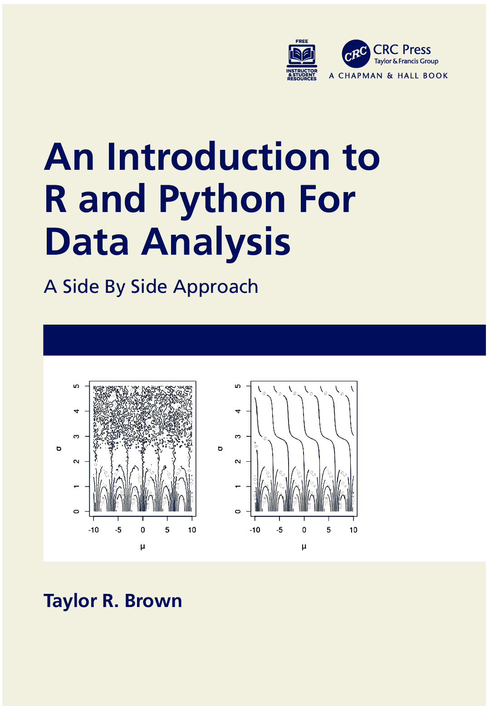

# 数据分析入门：R 和 Python：对比学习法

> 原文：[`randpythonbook.netlify.app/`](https://randpythonbook.netlify.app/)

*泰勒·R·布朗*

# 欢迎光临

[(https://www.routledge.com/An-Intro-duction-to-R-and-Python-for-Data-Analysis-A-Side-By-Side/Brown/p/book/9781032203256)]

## 使用本教材授课

你会注意到，一些练习问题非常具体。例如，它们会要求学生将答案以特定形式赋值给具有非常特定名称的变量。这是因为它们是考虑到自动评分而编写的。

本文本中的所有练习都得到了弗吉尼亚大学 2021 年秋季 STAT 5430 课程学员非常慷慨的“实战检验”。

## 许可协议

[(http://creativecommons.org/licenses/by-nc-sa/4.0/)]

本教材采用[Creative Commons Attribution-NonCommercial-ShareAlike 4.0 International License](http://creativecommons.org/licenses/by-nc-sa/4.0/)许可协议。用于生成文本的代码采用 Creative Commons Zero v1.0 Universal 许可协议。
