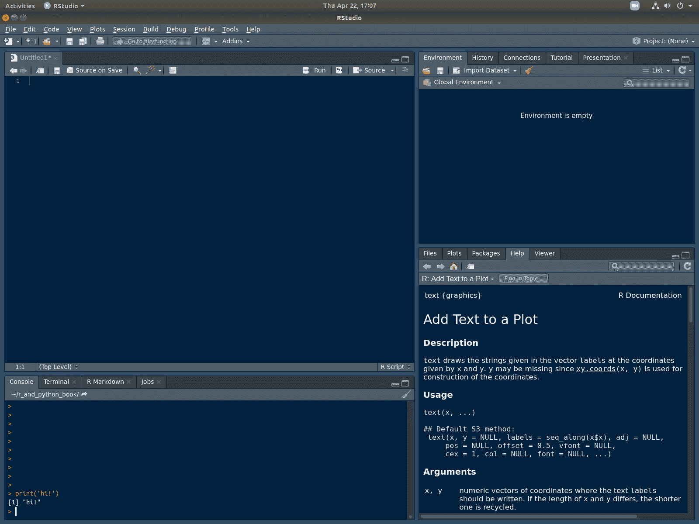

# 第一章 简介

> [`randpythonbook.netlify.app/intro`](https://randpythonbook.netlify.app/intro)

现在您已经安装了 R 和 Python，我们可以通过游览我们的两个不同的**集成开发环境**（IDE）RStudio 和 Spyder 来开始。

此外，我还会简要讨论几个主题，这样我们就可以开始涉水：

+   打印，

+   创建变量，以及

+   调用函数。

## 1.1 R 中的“Hello World”

好的，请打开 RStudio。它看起来应该像这样



图 1.1：RStudio

我将我的“编辑器主题”从默认的改为“Cobalt”，因为它对眼睛更友好。如果您是第一次打开 RStudio，您可能看到很多白色。您可以在转到 `工具 -> 全局选项 -> 外观` 后尝试更改主题。

**控制台**，默认位于左下角的面板，是所有代码运行的地方。对于简短的单行代码，您可以直接在控制台中输入代码。尝试输入以下代码。这里我们使用了 `print()` 函数。

在 R 中，函数是“一等对象”，这意味着可以引用函数的名称而不需要要求它执行任何操作。然而，当我们确实想要使用它时，我们在名称后放置括号。这被称为**调用**函数或**调用**函数。如果一个函数调用需要任何**参数**（即输入），则程序员在两个括号之间提供它们。一个函数可以**返回**值以供后续使用，或者它可能只是产生一些“副作用”，例如打印一些文本、显示图表或读取/写入外部数据源。

```py
print('hello R world')
## [1] "hello R world"
```

在学期期间，我们将编写更复杂的代码。复杂的代码通常是逐步编写的，并存储在名为**脚本**的文本文件中。点击 `文件 -> 新建文件 -> R 脚本` 来创建一个新的脚本。它应该出现在 RStudio 窗口的左上角（见图 1.1）。之后，将以下代码复制并粘贴到您的脚本窗口中。

```py
print('hello world')
print("this program")
print('is not incredibly interesting')
print('but it would be a pain')
print('to type it all directly into the console')
myName <- "Taylor"
print(myName)
```

此脚本将运行五个打印语句，然后创建一个名为 `myName` 的变量。打印语句对计算机没有用，不会影响程序的运行方式。它们只是向运行代码的人类显示消息。

在最后一行创建的变量更重要，因为它被计算机使用，因此它可以影响程序的运行方式。运算符 `<-` 是[**赋值运算符**](https://stat.ethz.ch/R-manual/R-devel/library/base/html/assignOps.html)。它将右侧的字符常量 `"Taylor"` 存储在 `myName` 名称下。如果我们向这个程序添加更多行，我们可以在后续的计算中引用变量 `myName`。

将此文件保存在您硬盘上的任何位置。命名为 `awesomeScript.R`。我个人将其保存在了我的桌面上。

在我们保存了脚本之后，我们可以通过将所有代码行发送到控制台来运行它。这样做的一种方法是在脚本窗口右上角点击`Source`按钮（见图 1.1）。另一种方法是使用 R 的`source()`函数¹。我们可以在控制台中运行以下代码。

```py
# Anything coming after the pound/hash-tag symbol
# is a comment to the human programmer.
# These lines are ignored by R
setwd("/home/taylor/Desktop/")
source("awesomeScript.R")
```

第一行将[工作目录](https://stat.ethz.ch/R-manual/R-devel/library/base/html/getwd.html)更改为`Desktop/`。**工作目录**是程序首先查找文件的地方。亲爱的读者，你应该通过将`Desktop/`替换为你选择保存`awesomeScript.R`的文件夹来更改这一行。如果你想找出当前的工作目录设置为什么，你可以使用`getwd()`。

每台计算机的文件夹/目录结构都不同——这就是为什么强烈建议你在脚本中尽可能少地引用文件位置。这使得你的代码更加*便携*。当你将文件发送给其他人（例如，你的导师或你的老板）时，她将不得不删除或更改任何目录的提及。这是因为那些目录（可能）在她的机器上不存在。

第二行调用`source()`。这个函数找到脚本文件并顺序执行该文件中找到的所有命令。

删除所有已保存的变量，然后`source()`你的脚本可以是一个非常有效的调试策略。你可以通过运行`rm(list=ls())`来删除所有已保存的变量。别担心——当你再次`source()`整个脚本时，变量会立即恢复！

## 1.2 Python 中的 Hello World

首先，打开*Anaconda Navigator*。它应该看起来像这样：


图 1.2：Anaconda Navigator

回想一下，在这本教科书中我们将专门假设使用*Spyder*。现在打开它。它应该看起来像这样：


图 1.3：Spyder

它看起来很像 RStudio，对吧？脚本窗口仍然在左侧，但这次它占据了整个窗口的高度。然而，你会注意到控制台窗口已经移动了。现在它在右下角。

再次，当你第一次打开它时，你可能会注意到更多的空白。就像上次一样，我改变了我的配色方案。你可以通过转到`工具 -> 首选项`然后探索`外观`选项卡下的选项来更改你的配色方案。

尝试在控制台中输入以下代码行。

```py
# this looks like R code but it's Python code!
print("hello Python world")
## hello Python world
```

已经在我们的两种语言之间发现了许多相似之处。R 和 Python 都有`print()`函数，它们都使用相同的符号来开始注释：`#`。最后，它们都使用引号来定义字符/字符串常量。在这两种语言中，你可以使用单引号或双引号。

我们还会在下面展示这两种语言共享的运行脚本的三种相同方式。太棒了！

让我们尝试编写我们的第一个 Python 脚本。R 脚本以`.r`或`.R`结尾，而 Python 脚本以`.py`结尾。将此文件命名为`awesomeScript.py`。

```py
# save this as awesomeScript.py
print('hello world')
print("this program")
print('is pretty similar to the last program')
print('it is not incredibly interesting, either')
my_name = "Taylor"
print(my_name)
```

注意 Python 中的赋值运算符与 R 不同。它是`=`²。

就像 RStudio 一样，Spyder 有一个按钮可以从头到尾运行整个脚本。它是绿色的三角形按钮（见图 1.3）。

你也可以编写代码来运行`awesomeScript.py`。有几种方法可以做到这一点，但这里是最简单的方法。

```py
import os
os.chdir('/home/taylor/Desktop')
runfile("awesomeScript.py")
```

这也与之前 R 语言的代码非常相似。`os.chdir()`将我们的工作目录设置为`桌面`。然后`runfile()`按顺序从开始到结束运行我们程序中的所有行³。

第一行是新的。我们之前没有提到过类似的内容。我们将在第 10.4 节中更多地讨论`import`模块。简单地说，我们导入了`os`模块，以便`chdir()`函数对我们可用。

## 1.3 获取帮助

### 1.3.1 阅读文档

编程不是关于记忆。没有人能够记住，例如，每个函数及其所有参数。那么当程序员遇到难题时，他们该怎么办？主要的方法是查找和阅读文档。

在 R 中获取帮助很容易。如果你想了解更多关于一个函数的信息，可以在控制台中输入带有前导问号的函数名。例如，`?print`或`?setwd`。你还可以使用`help()`和`help.search()`来了解更多关于函数的信息（例如`help(print)`）。有时你可能需要在函数名周围加上引号（例如`?":"`）。

这不会打开一个单独的网页浏览器窗口，这非常方便。如果你使用 RStudio，你有一些额外的优势。一切看起来都非常漂亮，你可以在“帮助”窗口中的搜索栏中输入短语来搜索文本。

在 Python 中，问号出现在函数名之后⁴（例如`print?`），你可以像在 R 中一样使用`help(print)`。

在 Spyder 中，如果你想将文档显示在帮助窗口中（它看起来更漂亮），那么你可以输入函数名，然后按`Ctrl-i`（在 mac 键盘上按`Cmd-i`）。

### 1.3.2 理解文件路径

不同操作系统的文件路径看起来不同。Mac 和 Linux 机器通常使用正斜杠（即`/`），而 Windows 机器通常使用反斜杠（即`\`）。

根据你的代码运行的是哪种操作系统，你可能需要更改文件路径。对于所有编写 R 和 Python 代码的人来说，理解这两种机器上的工作方式非常重要——仅仅因为你在 Windows 机器上编写代码，并不意味着它不会在 Mac 上运行，反之亦然。

上述代码中反复提到的目录是 `/home/taylor/Desktop`。这是一个运行 Ubuntu Linux 的机器上的目录。前面的正斜杠是 *根目录*。在其内部是 `home/` 目录，然后是 `taylor/` 目录，再然后是 `Desktop/` 目录。如果你正在运行 MacOS，这些文件路径看起来非常相似。`home/` 文件夹很可能会被 `Users/` 替换。

在 Windows 上，事情有些不同。首先，完整路径以驱动器开始（例如 `C:`）。其次，使用反斜杠（而不是正斜杠）来分隔目录名（例如 `C:\Users\taylor\Desktop`）。

不幸的是，反斜杠在 R 和 Python 中都是一个特殊字符（阅读第 3.9 节以了解更多信息）。每次你输入一个 `\`，它都会改变其后内容的含义。换句话说，`\` 被称为 **转义字符**。

在 R 和 Python 中，反斜杠字符用于开始一个“转义”序列。你可以在 R 中通过点击 [这里](https://stat.ethz.ch/R-manual/R-devel/library/base/html/Quotes.html) 看到一些示例，在 Python 中通过点击 [这里](https://docs.python.org/3/reference/lexical_analysis.html) 看到一些示例。在 Python 中，它还可以用来 [允许长行代码在文本文件中占据多行。](https://docs.python.org/3/reference/lexical_analysis.html#explicit-line-joining)

处理这个问题推荐的方式是只使用正斜杠。例如，如果你正在运行 Windows，`C:/Users/taylor/Desktop/myScript.R` 在 R 中将有效，而 `C:/Users/taylor/Desktop/myScript.py` 在 Python 中将有效。

你还可以使用“原始字符串常量”（例如 `r'C:\Users\taylor\my_file.txt'`）。这里的“原始”意味着 `\` 将被视为一个字面字符，而不是转义字符。或者，你可以通过将每个单反斜杠替换为双反斜杠来“转义”反斜杠。请阅读第 3.9 节以获取更多关于这些选择的详细信息。

* * *

1.  第三种方法是告诉 R 从命令行运行 `awesomeScript.R`，但不幸的是，这将在本文中不讨论。↩

1.  你也可以在 R 中使用这个符号，但它不太常见。↩

1.  Python，像 R 一样，允许你从命令行运行脚本，但本文将不讨论这一点。↩

1.  如果你没有安装 `Anaconda`，那么这可能对你不起作用，因为这是一个 IPython ([`ipython.org`](https://ipython.org)) 功能。↩
