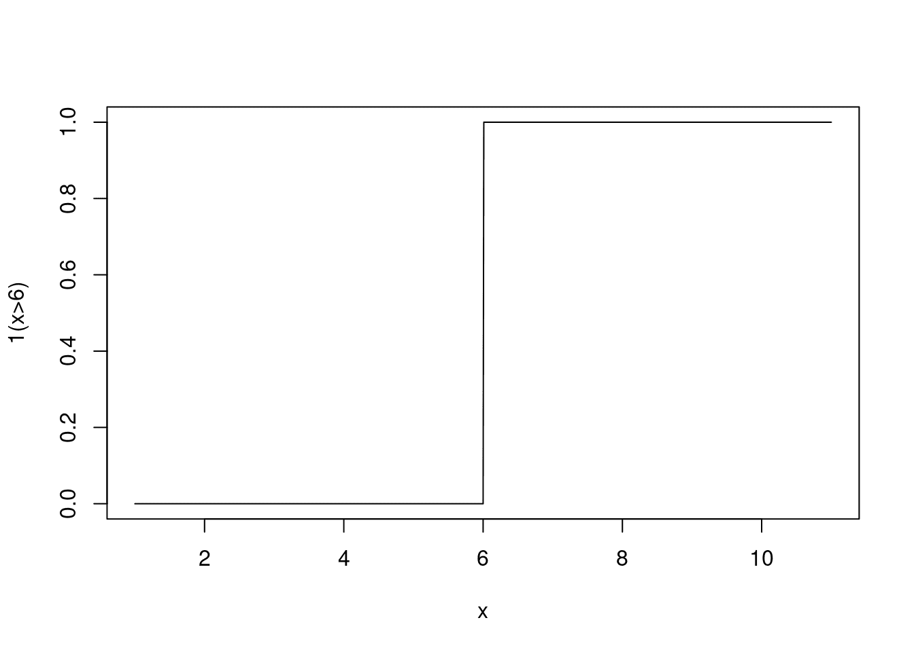
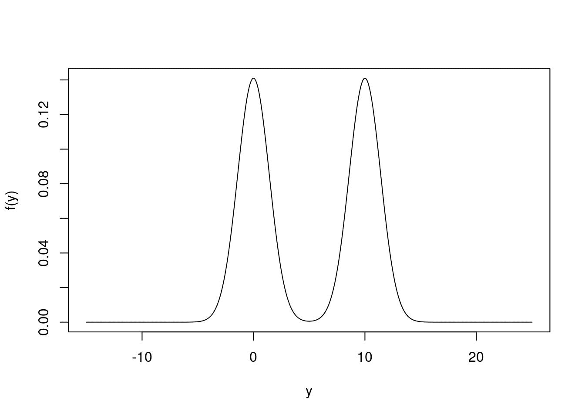

# 第三章 R 向量与 Numpy 数组和 Pandas 系列的比较

> 原文：[`randpythonbook.netlify.app/r-vectors-versus-numpy-arrays-and-pandas-series`](https://randpythonbook.netlify.app/r-vectors-versus-numpy-arrays-and-pandas-series)

本节用于描述允许我们存储具有相同类型的元素集合的数据类型。数据通常以这种方式存储，因此本节非常重要。一旦在程序中有一个这样的集合对象，我们就会对如何提取和修改集合中的不同元素以及如何高效地使用整个集合进行计算感兴趣。

## 3.1 R 概述

在上一节中，我提到 R 没有标量类型——它只有 [**向量**](https://cran.r-project.org/doc/manuals/r-release/R-lang.html#Vector-objects)。所以，无论你想存储一个数字（或 `logical`，或 `character`，或……），还是许多数字，你都需要一个 `vector`。

对于许多人来说，“向量”这个词会让人联想到这些对象是为了执行矩阵运算（例如内积、转置等）而设计的。你可以在 `vector` 上执行这些操作，但在我看来，这种先入为主的观念可能会误导人，我建议避免它。你可以在 R 中用 `vector` 做的事情与线性代数几乎无关！

我们如何创建这样的一个呢？有很多方法。一种常见的方法是从外部数据集中读取元素。另一种方法是从代码中生成 `vector`。

```py
1:10         # consecutive integers
##  [1]  1  2  3  4  5  6  7  8  9 10
seq(1,10,2)  # arbitrary sequences
## [1] 1 3 5 7 9
rep(2,5)     # repeating numbers
## [1] 2 2 2 2 2
# combine elements without relying on a pattern
c("5/2/2021", "5/3/2021", "5/4/2021") 
## [1] "5/2/2021" "5/3/2021" "5/4/2021"
# generate Gaussian random variables
rnorm(5) 
## [1] -0.98392997  1.70994197  0.77709483 -0.09817682 -0.43579996
```

`c()` 是 “组合” 的缩写。`seq()` 和 `rep()` 分别是 “序列” 和 “复制” 的缩写。`rnorm()` 用于抽取正态（或高斯）随机变量。关于这些函数还有很多东西要学习，所以我鼓励你查看它们的文档。

我应该提到，像 `rnorm()` 这样的函数并不创建真正的随机数，只是 *伪随机* 数。伪随机数几乎与真正的随机数无法区分，但计算机生成它们的方式实际上是确定性的。

首先，选择一个 *种子*，或起始数字。然后，*伪随机数生成器（PRNG）* 将该数字映射到另一个数字。所有数字的序列看起来是随机的，但实际上是确定性的。

有时候你可能会想自己设置种子，因为这是一种便宜的数据共享和通信方式。如果两个人使用相同的起始种子和相同的 PRNG，那么他们应该模拟相同的数据。如果你想要帮助其他人重现你分享的代码的结果，这可能很重要。不过，大多数时候，我不会设置种子，也不会考虑随机数和伪随机数之间的区别。

## 3.2 Python 概述

如果你想在 Python 中存储许多相同类型（和大小）的元素，你可能需要一个 Numpy `数组`。Numpy 是一个备受推崇的 Python 第三方库（Harris 等人 2020）。它的`数组`对象存储相同类型的元素，就像 R 的`向量`一样。

创建 numpy 数组有五种方法（[来源](https://numpy.org/doc/stable/user/basics.creation.html)）。以下是一些补充上述示例的示例。

```py
import numpy as np 
np.array([1,2,3])
## array([1, 2, 3])
np.arange(1,12,2)
## array([ 1,  3,  5,  7,  9, 11])
np.random.normal(size=3)
## array([-1.49837736,  0.14307108,  0.34530069])
```

在 Python 中存储同质元素集合的另一种选择是来自 Pandas 库的`Series`对象。这些的优点是它们与 Pandas 的数据框配合得很好（有关 Pandas 数据框的更多信息，请参阅 8.2），并且它们在通过名称访问元素方面具有更大的灵活性（更多信息请参阅[这里](https://jakevdp.github.io/PythonDataScienceHandbook/03.01-introducing-pandas-objects.html#Series-as-generalized-NumPy-array)）。

```py
import pandas as pd
first = pd.Series([2, 4, 6])
second = pd.Series([2, 4, 6], index = ['a','b','c'])
print(first[0])
## 2
print(second['c'])
## 6
```

## 3.3 R 中的向量化

R 中的操作如果是**向量化**的，那么它将一次性应用于`向量`的所有元素。未向量的操作符只能应用于单个元素。在这种情况下，程序员需要编写更多的代码来指示函数应用于向量的所有元素。你应该优先编写向量化代码，因为它通常更容易阅读。此外，许多这些向量化函数是用编译代码编写的，因此它们通常要快得多。

算术运算符（例如`+`、`-`、`*`、`/`、`^`、`%%`、`%/%`等）和逻辑运算符（例如`!`、`|`、`&`、`>`、`>=`、`<`、`<=`、`==`等）通常应用于一个或两个向量。算术运算通常是*逐元素*执行的。如果需要，数值向量会被转换为逻辑向量。如果你试图最小化括号的使用，请注意运算符的优先级。

注意，还有大量以名称命名的函数（例如`sum()`、`length()`、`cumsum()`等）也作用于整个`向量`。以下是一些示例。

```py
(1:3) *  (1:3) 
## [1] 1 4 9
(1:3) ==  rev(1:3) 
## [1] FALSE  TRUE FALSE
sin( (2*pi/3)*(1:4)) 
## [1]  8.660254e-01 -8.660254e-01 -2.449294e-16  8.660254e-01
```

在最后一个例子中，发生了**循环使用**。`(2*pi/3)`正在处理三个长度为 1 的向量，并产生另一个长度为 1 的向量。结果长度为 1 的向量被乘以长度为四的向量`1:4`。长度为 1 的向量中的单个元素被*循环使用*，使其值乘以`1:4`中的每个元素。这在大多数情况下是有意义的，但有时循环使用可能会很棘手。请注意，以下代码不会产生错误——只是一个警告：“较长的对象长度不是较短对象长度的倍数”。尝试在您的机器上运行它以确认这一点。

```py
(1:3) *  (1:4)
```

## 3.4 Python 中的向量化

Python 的 Numpy 库也广泛使用了向量化。Numpy 中的向量化是通过 [**通用函数**](https://numpy.org/doc/stable/reference/ufuncs.html) 或简称为 “ufuncs” 来实现的。一些 ufunc 可以使用与 R 相同的语法调用（例如 `+`）。你也可以通过其名称来引用函数（例如 `np.sum()` 而不是 `+`）。混合和匹配也是允许的。

当 Ufuncs 只接受一个数组时，它们被称为 *一元*，如果它们接受两个数组，则称为 *二元*。目前，有 [不到 100 个可用](https://numpy.org/doc/stable/reference/ufuncs.html#available-ufuncs)，所有这些都执行数学运算、布尔输出比较或位操作。有关 Numpy 的通用函数的完整列表，[请点击此处](https://numpy.org/doc/stable/reference/ufuncs.html#available-ufuncs)。以下是一些代码示例。

```py
np.arange(1,4)*np.arange(1,4)
## array([1, 4, 9])
np.zeros(5) > np.arange(-3,2)
## array([ True,  True,  True, False, False])
np.exp( -.5 * np.linspace(-3, 3, 10)**2) / np.sqrt( 2 * np.pi)
## array([0.00443185, 0.02622189, 0.09947714, 0.24197072, 0.37738323,
##        0.37738323, 0.24197072, 0.09947714, 0.02622189, 0.00443185])
```

与其称为“回收”，Numpy 将在二元操作中重用较短数组的元素称为 [**广播**](https://numpy.org/devdocs/user/theory.broadcasting.html)。这与 R 中的想法相同，但通常 Python 更严格，不允许更多场景。例如，尝试在你的机器上运行以下代码。你应该会收到一个错误：`ValueError: operands could not be broadcast together with shapes (2,) (3,)`。

```py
np.arange(1,3)*np.arange(1,4)
```

如果你正在处理字符串数组，Numpy 有一个包含许多有用函数的 `np.char` 模块](https://numpy.org/doc/stable/reference/routines.char.html#module-numpy.char)。

```py
a = np.array(['a','b','c'])
np.char.upper(a)
## array(['A', 'B', 'C'], dtype='<U1')
```

然后是来自 Pandas 的 `Series` 对象。Ufuncs 在 `Series` 对象上继续以相同的方式工作，并且它们 [尊重共同的索引值](https://jakevdp.github.io/PythonDataScienceHandbook/03.03-operations-in-pandas.html)。

```py
s1 = pd.Series(np.repeat(100,3))
s2 = pd.Series(np.repeat(10,3))
s1 + s2
## 0    110
## 1    110
## 2    110
## dtype: int64
```

如果你感觉更舒适，并且你希望在处理这些 `Series` 对象之前将它们强制转换为 Numpy 数组，你可以这样做。例如，以下操作是可行的。

```py
s = pd.Series(np.linspace(-1,1,5))
np.exp(s.to_numpy())
## array([0.36787944, 0.60653066, 1\.        , 1.64872127, 2.71828183])
```

此外，`Series` 对象还具有许多额外的 [属性和方法](https://pandas.pydata.org/pandas-docs/stable/reference/api/pandas.Series.html#pandas-series)。

```py
ints = pd.Series(np.arange(10))
ints.abs()
## 0    0
## 1    1
## 2    2
## 3    3
## 4    4
## 5    5
## 6    6
## 7    7
## 8    8
## 9    9
## dtype: int64
ints.mean()
## 4.5
ints.floordiv(2)
## 0    0
## 1    0
## 2    1
## 3    1
## 4    2
## 5    2
## 6    3
## 7    3
## 8    4
## 9    4
## dtype: int64
```

具有文本数据的 `Series` 对象略有不同。首先，在调用任何 [向量化方法](https://jakevdp.github.io/PythonDataScienceHandbook/03.10-working-with-strings.html) 之前，你必须访问 `Series` 的 `.str` 属性。以下是一些示例。

```py
s = pd.Series(['a','b','c','33'])
s.dtype
```

```py
## dtype('O')
```

```py
s.str.isdigit()
```

```py
## 0    False
## 1    False
## 2    False
## 3     True
## dtype: bool
```

```py
s.str.replace('a', 'z')
```

```py
## 0     z
## 1     b
## 2     c
## 3    33
## dtype: object
```

字符串操作可以是一个很大的变革，我们在第 3.9 节中更详细地讨论了文本处理策略。

## 3.5 在 R 中索引向量

很常见的是想要从向量中提取或修改一个子集的元素。我讨论的所有方法都将涉及方括号运算符（即 `[]`）。你可以通过输入 `?'['` 来检索文档。

```py
allElements <-  1:6
allElements[seq(2,6,2)] # extract evens
## [1] 2 4 6
allElements[-seq(2,6,2)] <-  99 # replace all odds with 99
allElements[allElements >  2] # get nums bigger than 2
## [1] 99 99  4 99  6
```

要访问第一个元素，我们使用索引 `1`。要访问第二个，我们使用 `2`，依此类推。此外，`-` 符号告诉 R 删除元素。这两个功能与 Python 非常不同，我们很快就会看到。

我们也可以使用名称来访问元素，但前提是这些元素必须有名称。

```py
sillyVec <-  c("favorite"=1, "least favorite" =  2)
sillyVec['favorite']
## favorite 
##        1
```

## 3.6 索引 Numpy 数组

[索引 Numpy 数组](https://numpy.org/doc/stable/user/basics.indexing.html)与 R 中的向量索引非常相似。你使用方括号，可以使用逻辑数组或索引数组来完成。尽管如此，还有一些重要的区别。

此外，Python 中的索引是从 0 开始的。`0` 索引是数组的第一个元素。另一个关键的区别是，Python 中不使用 `-` 来删除元素，就像 R 中那样，而是用来倒计数。第三，在方括号内使用一个或两个 `:` 在 Python 中更加灵活。这是使用 `slice()` 函数的语法糖，它类似于 R 中的 `seq()` 函数。

```py
one_through_ten = np.arange(1, 11)
one_through_ten[np.array([2,3])]
## array([3, 4])
one_through_ten[1:10:2] # evens
## array([ 2,  4,  6,  8, 10])
one_through_ten[::-1] # reversed
## array([10,  9,  8,  7,  6,  5,  4,  3,  2,  1])
one_through_ten[-2] = 99 # second to last
one_through_ten
## array([ 1,  2,  3,  4,  5,  6,  7,  8, 99, 10])
one_through_ten[one_through_ten > 3] # bigger than three
## array([ 4,  5,  6,  7,  8, 99, 10])
```

## 3.7 索引 Pandas 的 Series

至少，从 Numpy 数组到 Pandas 的 Series 对象，你需要学习的新内容很少。它们仍然有 `[]` 操作符，并且 [这两个类型之间共享许多方法](https://pandas.pydata.org/docs/reference/api/pandas.Series.html)。以下代码几乎等同于上面的代码，唯一的明显区别是结果打印的方式略有不同。

```py
import pandas as pd
one_through_ten = pd.Series(np.arange(1, 11))
one_through_ten[np.array([2,3])]
## 2    3
## 3    4
## dtype: int64
one_through_ten[1:10:2] # evens
## 1     2
## 3     4
## 5     6
## 7     8
## 9    10
## dtype: int64
one_through_ten[::-1] # reversed
## 9    10
## 8     9
## 7     8
## 6     7
## 5     6
## 4     5
## 3     4
## 2     3
## 1     2
## 0     1
## dtype: int64
one_through_ten[-2] = 99 # second to last
one_through_ten
##  0     1
##  1     2
##  2     3
##  3     4
##  4     5
##  5     6
##  6     7
##  7     8
##  8     9
##  9    10
## -2    99
## dtype: int64
one_through_ten[one_through_ten > 3] # bigger than three
##  3     4
##  4     5
##  5     6
##  6     7
##  7     8
##  8     9
##  9    10
## -2    99
## dtype: int64
one_through_ten.sum()
## 154
```

然而，[Pandas 的 Series 有 `.loc` 和 `.iloc` 方法](https://pandas.pydata.org/pandas-docs/stable/user_guide/indexing.html#different-choices-for-indexing)。我们现在不会过多地讨论这两个方法，但当我们开始讨论第 8.2 节中的 Pandas 数据框时，它们将变得非常重要。

```py
one_through_ten.iloc[2]
## 3
one_through_ten.loc[2]
## 3
```

## 3.8 一些注意事项

### 3.8.1 浅拷贝与深拷贝

在 R 中，赋值通常会产生一个**深拷贝**。在下面的代码中，我们从 `a` 创建了 `b`。如果我们修改 `b`，这些更改不会影响 `a`。这会占用更多的内存，但我们的程序更容易理解，因为我们不需要跟踪对象之间的连接。

```py
# in R
a <-  c(1,2,3)
b <-  a
b[1] <-  999
a # still the same!
## [1] 1 2 3
```

在 Python 的 Numpy 数组中，可以通过简单的赋值或显式构造一个**视图**来创建“浅拷贝”（[更多信息](https://numpy.org/devdocs/user/quickstart.html#copies-and-views)）。在下面的代码中，`a`、`b`、`c` 和 `d` 都共享相同的数据。如果你修改其中一个，其他所有数据也会改变。这可能会使程序更复杂，但另一方面，它也可以提高计算效率。

```py
# in python
a = np.array([1,2,3])
b = a # b is an alias
c = a.view() # c is a view
d = a[:]
b[0] = 999
a # two names for the same object in memory
## array([999,   2,   3])
b
## array([999,   2,   3])
c
## array([999,   2,   3])
d
## array([999,   2,   3])
```

Pandas 的 Series 对象也是同样的情况。你通常是在创建一个“浅拷贝”。

```py
# in python
import pandas as pd
s1 = pd.Series(np.array([100.0,200.0,300.0]))
s2 = s1
s3 = s1.view()
s4 = s1[:]
s1[0] = 999
s1
## 0    999.0
## 1    200.0
## 2    300.0
## dtype: float64
s2
## 0    999.0
## 1    200.0
## 2    300.0
## dtype: float64
s3
## 0    999.0
## 1    200.0
## 2    300.0
## dtype: float64
s4
## 0    999.0
## 1    200.0
## 2    300.0
## dtype: float64
```

如果你想在 Python 中创建“深拷贝”，通常需要一个名为 `copy()` 的函数或方法。当你有一个 Numpy 数组时，使用 `np.copy` 或 `np.ndarray.copy`（[更多详情](https://numpy.org/doc/stable/reference/generated/numpy.ndarray.copy.html#numpy-ndarray-copy)）。

```py
# in python
a = np.array([1,2,3])
b = np.copy(a)
c = a.copy()
b[0] = 999
a 
## array([1, 2, 3])
b
## array([999,   2,   3])
c
## array([1, 2, 3])
```

使用 Pandas 的 Series 对象的 `pandas.Series.copy`。确保不要将 `deep` 参数设置为 `False`。否则，你会得到一个浅拷贝。

```py
# in python
s1 = pd.Series(np.array([1,2,3]))
s2 = s1.copy()
s3 = s1.copy(deep=False)
s1[0] = 999
s1
## 0    999
## 1      2
## 2      3
## dtype: int64
s2
## 0    1
## 1    2
## 2    3
## dtype: int64
s3
## 0    999
## 1      2
## 2      3
## dtype: int64
```

### 3.8.2 R 和 Python 处理缺失值的方式

R 有 `NULL`、`NaN` 和 `NA`。Python 有 `None` 和 `np.nan`。如果你的眼睛已经开始发花，并且你正在想“它们看起来都一样”——它们并不一样。

R 的 `NULL` 和 Python 的 `None` 类似。两者都代表“无”。这不同于 `0`，空字符串，或 `FALSE`/`False`。这通常用于检测用户是否未能向函数传递参数，或者函数是否未能“返回”任何有意义的内容（更多关于函数的信息可以在第六部分中找到）。

例如，在 R 中，如果一个函数未能返回任何内容，那么它实际上返回一个 `NULL`。[一个 `NULL` 对象有其自己的类型。](https://cran.r-project.org/doc/manuals/r-release/R-lang.html#NULL-object)

```py
NULL ==  FALSE
## logical(0)
NULL ==  NULL
## logical(0)
# create a function that doesn't return anything
# more information on this later
doNothingFunc <-  function(a){} 
thing <-  doNothingFunc() # call our new function
is.null(thing)
## [1] TRUE
typeof(NULL)
## [1] "NULL"
```

在 Python 中，我们有以下内容。

```py
None == False
## False
None == None
# create a function that doesn't return anything
# more information on this later
## True
def do_nothing_func():
 pass
thing = do_nothing_func()
if thing is None:
 print("thing is None!")
## thing is None!
type(None)
## <class 'NoneType'>
```

`NaN`代表“不是一个数字”。`NaN`在 R 中是类型为`double`的对象，而在 Python 中`np.nan`是类型为`float`。当你在（故意或意外地）执行未定义的计算，例如 $0/0$ 或 $\infty / -\infty$ 时，它可能会很有用。

```py
# in R
0/0
## [1] NaN
Inf/Inf
## [1] NaN
is.na(0/0)
## [1] TRUE
```

```py
# in Python
# 0/0 
# the above yields a ZeroDivisionError
import numpy as np
np.inf/np.inf
## nan
np.isnan(np.nan)
## True
```

`NA`代表“不可用”。“在数据科学中，缺失数据是生活中的一件事。观察值经常在数据集中缺失，这可能是由于在将数据集合并/合并后引入的（更多关于这一点可以在第 12.3 节中找到），或者是由涉及下溢和上溢的计算引起的。有许多技术旨在估计缺失数据的存在。当你编写代码时，你需要确保你正确地处理了 `NA`s。

```py
# in R
babyData <-  c(0,-1,9,NA,21)
NA ==  TRUE 
## [1] NA
is.na(babyData)
## [1] FALSE FALSE FALSE  TRUE FALSE
typeof(NA)
## [1] "logical"
```

不幸的是，Python 对类似 `NA` 的对象的支持更为有限。在基础 Python 中没有 `NA` 对象。并且通常 `NaN`s 会出现在 `NA` 的位置。尽管如此，也有一些有用的工具。例如，Numpy 库提供了[“掩码数组”](https://numpy.org/devdocs/reference/maskedarray.html)。

此外，截至版本 `1.0.0`，[pandas 库](https://pandas.pydata.org/docs/user_guide/index.html#user-guide) 有一个实验性的 `pd.NA` 对象。然而，他们 [警告](https://pandas.pydata.org/pandas-docs/dev/user_guide/missing_data.html#missing-data-na) “`pd.NA` 的行为可能会在没有警告的情况下改变。”

```py
import numpy as np
import numpy.ma as ma
baby_data = ma.array([0,-1,9,-9999, 21]) # -9999 "stands for" missing
baby_data[3] = ma.masked
np.average(baby_data)
## 7.25
```

注意使用极端值来代替应该是一个 `NA` 的值。请注意，一些数据提供者会遵循这种策略。我建议你自己避免这样做。未能正确表示缺失值会导致极其错误的计算！

## 3.9 正则表达式简介

我们在这本书中已经简要地讨论了如何处理文本数据。关于 Python，第 3.4 节提到，Pandas `Series`对象有一个[`.str`访问器属性](https://pandas.pydata.org/pandas-docs/version/1.3/user_guide/text.html#string-methods)，它包含许多专门用于字符串数据的方法。无论这些`Series`对象是否包含在 Pandas `DataFrame`中，都可以使用相同的工具。

关于 R，`character` `vector`s 首次在第 3.1 节中提到。对这些操作也有很多函数，无论它们是否存储在`data.frame`中。这些函数可能更难找到，因为它们不是方法，所以按 `<Tab>` 键并使用 GUI 的自动完成功能并不容易揭示它们。

假设你感兴趣的是将小写字母替换为大写字母，从文本中删除某些字符，或者计算某个表达式出现的次数。到目前为止，只要你能找到一个执行该任务的函数或方法，你就做得很好。如果你需要对文本数据进行操作，可能有一个函数可以做到这一点。

注意所有这些任务有什么共同点——它们都需要找到模式的能力。当你的模式容易描述时（例如，找到所有小写的“a”），一切都很顺利。然而，当模式更难描述时（例如，找到所有有效的电子邮件地址），事情可能会变得更复杂。这就是为什么本节主要关注讨论**正则表达式**，这是一种帮助你描述文本中模式的工具（Wickham 和 Grolemund 2017) (López 2014)。

### 3.9.1 文字字符与元字符

正则表达式中的每个字符都以两种方式之一进行解释。要么它被解释为一个

1.  文字字符，或者作为一个

1.  元字符。

如果它是一个文字字符，那么该字符就是*文字*模式。例如，在正则表达式“e”中，字符“e”有一个文字解释。如果你想要在以下短语中找到所有“e”的大写形式，你可以很容易地做到。只要你知道哪个函数执行查找和替换，你就没问题。模式很容易指定。

另一方面，如果你让我从价格或薪资数据中删除`$`符号，你可能会有点困难。这是因为`$`是正则表达式中的一个*元字符*，因此它有特殊的意义。⁶ 在下面的例子中，如果`$`被解释为正则表达式，那么模式将根本找不到，尽管文字美元符号很常见。

R 中有一些函数执行查找和替换，但在这个情况下，我使用 `gsub()`。在 Pandas 中，我可以使用 [`.str.replace()`](https://pandas.pydata.org/docs/reference/api/pandas.Series.str.replace.html) 来做这个。以下是一些通过文字字符描述模式的示例。

```py
# in R
gsub(pattern = "e", replacement = "E", 
 x = "I don't need a regex for this!")
## [1] "I don't nEEd a rEgEx for this!"
```

```py
# in Python
import pandas as pd
s = pd.Series(["I don't need a regex for this!"])
s.str.replace(pat="e",repl="E")
## 0    I don't nEEd a rEgEx for this!
## dtype: object
```

另一方面，这里有一些移除美元符号的示例。我们通常有两种方法来识别恰好是元字符的符号。

1.  我们可以**转义**美元符号。这意味着你需要在美元符号前加上一个反斜杠（即 `\`）。反斜杠是一个元字符，它会查看其后的字符，要么从元字符中移除特殊含义，要么给文字字符添加特殊含义。

1.  或者，我们可以告诉函数忽略正则表达式。`gsub()` 可以接受 `fixed=TRUE`，而 `.str.replace()` 可以接受 `regex=False`。

```py
# in Python
pd.Series(["$100, $200"]).str.replace(pat="$",repl="",regex=False)
## 0    100, 200
## dtype: object
pd.Series(["$100, $200"]).str.replace(pat="\$",repl="")
## 0    100, 200
## dtype: object
```

```py
# in R
gsub(pattern = "$", replacement = "", x = c("$100, $200"), fixed=TRUE)
## [1] "100, 200"
stringr::str_remove_all(c("$100, $200"), pattern = "\\$")
## [1] "100, 200"
```

### 3.9.2 反斜杠的麻烦：转义序列

你可能已经注意到了并感到困惑——有时在 Python 和 R 中，我们需要**两个**反斜杠而不是**一个**。这是因为反斜杠还有一个可以让我们使用它们来转义元字符的用途。它们还帮助我们编写不可打印的字符，也称为**转义序列**。即使我们不使用正则表达式，我们也需要能够这样做。

例如，考虑我们输入“换行符”的方式。尽管计算机将其理解为一个字符，但我们需要用键盘敲击两个键才能写出它。`\` 是一个字符，而 `n` 是另一个，但它们合在一起才是一个字符！

```py
nchar('\n') #in R
## [1] 1
```

```py
len('\n') #in Python
## 1
```

Python 中的 `str` 和 R 中的 `character` 向量会默认查找这些组合。当我们用字符串指定正则表达式时，反斜杠将首先用于此目的。它们的正则表达式用途是第二优先级。

我们在上面的例子中使用 `\\$` 的原因是为了转义第二个反斜杠。`$` 不是一个特殊字符，但 Python 和 R 会以不同的方式处理它。Python 不会识别它，也不会抱怨它没有识别。另一方面，R 会抛出一个错误，表明它无法识别它。

```py
len('\$') # in Python, not special
## 2
```

```py
nchar('\$') # R gets confused
## Error: '\$' is an unrecognized escape in character string starting "'\$"
```

处理这个问题的另一种方法是使用**原始字符串**！原始字符串让生活变得更简单，因为它们不会将反斜杠解释为转义序列的开始。你可以在 R 和 Python 中通过在引号前加上“r”来创建它们。然而，在 R 中这稍微复杂一些，因为你需要在引号内使用分隔符对——更多信息可以在你的 R 控制台中输入 `?Quotes`。

```py
len(r'\n') # in Python 
## 2
```

```py
nchar(r'{\$}') # in R
## [1] 2
```

### 3.9.3 使用正则表达式的更多示例

匹配许多不同类型字符的正则表达式通常非常有用——这些被称为**字符类**。例如，`.` 表示除换行符之外的任何字符，`\d` 表示任何数字，而 `\s` 表示任何空白字符。你有时可以通过将正则表达式中的字母大写来得到相反的模式。

```py
# anonymize phone numbers in R
gsub(pattern = r"{\d}", replacement = "X", x = "(202)555-0191")
## [1] "(XXX)XXX-XXXX"
```

```py
# remove everything that isn't a number in Python
pd.Series(["$100"]).str.replace(pat="\D",repl="")
## 0    100
## dtype: object
```

许多字符类都有一个开方括号和闭方括号。例如，`[1-5]` 匹配 $1$ 到 $5$ 之间的任何数字（包括），`[aeiouy]` 匹配任何小写元音，而 `[\^\-]` 匹配 `^` 或 `-`（我们不得不转义这两个元字符，因为我们只对字面模式感兴趣）。

```py
# remove vowels in R
gsub(pattern = "[aeiouy]", replacement = "", 
 x = "Can you still read this?")
## [1] "Cn  stll rd ths?"
```

将两个模式一个接一个地连接起来，形成一个更具体的匹配模式。

```py
# convert date formats in Python
s = pd.Series(["2021-10-23","2021:10:23"])
s.str.replace(pat="[:\-]",repl="/")
## 0    2021/10/23
## 1    2021/10/23
## dtype: object
```

如果你希望出现某个模式或另一个模式，可以使用**交替运算符** `|`。

```py
# one or the other in Python
pd.Series(["this","that"]).str.contains(pat="this|that")
## 0    True
## 1    True
## dtype: bool
```

除了连接、交替和分组之外，还有更多通用的方法来*量化*所需模式出现的次数。`?` 表示零次或一次，`*` 表示零次或多次，`+` 表示一次或多次，还有多种方法可以通过花括号（例如 `{3,17}`）来更加具体地指定（表示从三次到十七次）。

```py
# detect double o's in R
grepl(pattern = "o{2}", x = c("look","book","box", "hellooo"))
## [1]  TRUE  TRUE FALSE  TRUE
```

```py
# detects phone number formats in Python
s = pd.Series(["(202)555-0191","202-555-0191"])
s.str.contains(pat=r"$\d{3}$\d{3}-\d{4}")
## 0     True
## 1    False
## dtype: bool
```

注意在双“o”的例子中，有三个匹配的单词。要描述这不是所希望的，需要能够**向前查看**匹配，到下一个字符，并评估它。你可以向前查看或向后查看，并对所需的或禁止的模式做出断言。

| 向前查看正则表达式 | 含义 |
| --- | --- |
| `(?=pattern)` | 向前查找 `pattern` 的正向前瞻 |
| `(?!pattern)` | 向前查找 `pattern` 的负向前瞻 |
| `(?<=pattern)` | 向后查找 `pattern` 的正向前瞻 |
| `(?<!pattern)` | 向后查找 `pattern` 的负向后瞻 |

在 `oo` 后面我们指定 `(?!o)` 以禁止第三个尾随的 `o`。

```py
# exactly two "o"s in Python?
s = pd.Series(["look","book","box", "hellooo"])
s.str.contains(pat="oo(?!o)")
## 0     True
## 1     True
## 2    False
## 3     True
## dtype: bool
```

然而，这并不能成功移除 `"hellooo"`，因为它会在单词的最后两个“o”上匹配。为了防止这种情况，我们可以在前面添加一个 `(?<!o)`，这样也就不允许以“o”开头了。在 R 中，我们还需要指定 `perl=TRUE` 来使用与 Perl 兼容的正则表达式。

```py
# exactly two "o"s in R
grep(pattern = "(?<!o)oo(?!o)", 
 x = c("look","book","box", "hellooo"), perl = TRUE)
## [1] 1 2
```

我们还提到了**锚定**。如果你只想在文本的开头找到模式，请使用 `^`。如果你只想在文本的末尾找到模式，请使用 `$`。下面我们使用了 [`.str.extract()`](https://pandas.pydata.org/docs/reference/api/pandas.Series.str.extract.html)，其文档提到了*捕获组*。捕获组只是括号内的正则表达式（例如 `(this)`）。

```py
# extract emails with Pandas
s = pd.Series(["my email is fake@aol.com", "fake2@aol.com is hidden"])
s.str.extract(r".( [a-z]+@[a-z]+\.com$)")
##                0
## 0   fake@aol.com
## 1            NaN
```

## 3.10 练习

### 3.10.1 R 问题

让我们抛一些硬币！生成一千次公平硬币的翻转。使用 `rbinom`，将正面编码为 `1`，反面编码为 `0`。

1.  将一千次原始的硬币翻转赋值给变量 `flips`。确保元素是整数，并且确保你翻转的是“公平”的硬币（$p=.5$）。

1.  创建一个长度为 `1000` 的 `logical` 向量 `isHeads`。每次得到正面时，确保相应的元素是 `TRUE`，否则是 `FALSE`。

1.  通过计数正面来创建一个变量 `numHeads`。

1.  计算在 `flips` 中数字变化的百分比。将你的数字赋值给 `acceptanceRate`。尽量用一行代码来完成这个操作。

计算第十阶泰勒展开到$\exp(3)$的元素，并将它们存储在`taylorElems`中。不要求和。使用一个表达式，不要使用任何循环。近似为，

$$ 1 + 3 + 3²/2! + 3³/3! + \cdots 3^{10}/10! $$ 你希望将这十一个数分别存储在一个`numeric`向量中。

执行以下操作。

1.  创建一个名为`nums`的向量，包含从$-100$到$100$的所有连续整数。

1.  创建一个与上面相同长度的`logical`向量，当上面的元素为偶数时包含`TRUE`，否则为`FALSE`。命名为`myLogicals`。

1.  将`TRUE`的总数分配给`totalEven`。

1.  创建一个名为`evens`的向量，包含上面向量中的所有偶数。

1.  创建一个名为`reverse`的向量，包含`nums`的逆序元素。

假设我们想要计算以下和 $\sum_{i=1}^N x_i$。如果$N$很大，或者大多数的$x_i$很大，那么我们可能会遇到允许的最大数字。这是**溢出**的问题。最大的整数和最大的浮点数可以通过输入`.Machine$integer.max`和`.Machine$double.xmax`分别恢复。

1.  将`sumThese`分配给`exp(rep(1000,10))`。它们是有限的吗？你能将它们相加吗？如果一切顺利，将`TRUE`分配给`allGood`。

1.  从理论上讲，和的对数小于`.Machine$double.xmax`吗？将`TRUE`或`FALSE`分配给`noOverflowIssue`。

1.  将这些的**朴素**对数和分配给`naiveLogSum`。朴素的对数和是有限的吗？

1.  使用对数和指数技巧计算`betterSum`，一个不会溢出的和：

$$ \log\left( \sum_{i=1}^{10} x_i \right) = \log\left( \sum_{i=1}^{10} \exp[ \log(x_i) - m] \right) + m $$ $m$通常选择为$\max_i \log x_i$。这与上面的公式相同，这很好。你可以使用相同的代码来对抗溢出和下溢。e) 如果你在编写代码，并且有一堆非常大的数字，是存储这些数字更好，还是存储这些数字的对数更好？将你的答案分配给`whichBetter`。使用短语`"logs"`或`"nologs"`。

假设你有一个金融资产的`vector`价格：

```py
prices <-  c(100.10, 95.98, 100.01, 99.87)
```

1.  使用自然对数并将此向量转换为对数回报向量。命名为`logReturns`。如果$p_t$是时间$t$的价格，则时间$t$结束的对数回报为 $$\begin{equation} r_t = \log \left( \frac{p_t}{p_{t-1}} \right) = \log p_t - \log p_{t-1} \end{equation}$$

1.  对于**算术回报**也做同样的事情。如果你按$100$的比例缩放，这些是常规的百分比变化。命名为`arithReturns`。所需的数学公式是 $$\begin{equation} a_t = \left( \frac{p_t - p_{t-1} }{p_{t-1}} \right) \times 100 \end{equation}$$

考虑**混合密度** $f(y) = \int f(y \mid x) f(x) dx$ 其中

$$\begin{equation} Y \mid X = x \sim \text{Normal}(0, x²) \end{equation}$$ 并且

$$\begin{equation} X \sim \text{half-Cauchy}(0, 1). \end{equation}$$ 这个分布是贝叶斯统计中使用的先验分布的特殊情况（Carvalho, Polson, and Scott 2009）。注意，正态分布的第二个参数是其方差，而不是其标准差。

假设你进一步感兴趣于计算这些随机变量中有一个最终距离中位数太远的概率：

$$\begin{equation} \mathbb{P}[|Y| > 1] = \int_{y : |y| > 1} f(y)dy = \int_{y : |y| > 1} \int_{-\infty}^\infty f(y \mid x) f(x) dx dy. \end{equation}$$

以下步骤将演示如何使用 **Monte-Carlo**（Robert 和 Casella 2005）方法来近似这个概率。

1.  从 $\text{half-Cauchy}(0, 1)$ 模拟 $X_1, \ldots, X_{5000}$，并将这些样本命名为 `xSamps`。提示：你可以通过模拟一个自由度为 1 的 $t$ 分布来从 Cauchy 分布中采样。一旦你有了常规的 Cauchy 样本，取每个样本的绝对值。

1.  模拟 $Y_1 \mid X_1, \ldots, Y_{5000} \mid X_{5000}$，并将样本命名为 `ySamps`。

1.  使用 `ySamps` 计算近似概率，并将其命名为 `approxProbDev1`。

1.  为什么简单地“忽略”`xSamps`（即在计算的求平均部分不使用它），即你条件化的样本，“等同于”对 $x$ 进行积分？将字符串响应存储在一个长度为 $1$ 的字符向量 `integratingOutResp` 中。

1.  从 `xSamps` 计算另一个 **Rao-Blackwellized** Monte Carlo 估计值 $\mathbb{P}[|Y| > 1]$。将其命名为 `approxProbDev2`。提示：$\mathbb{P}[|Y| > 1] = \mathbb{E}[\mathbb{P}(|Y| > 1 \mid X) ]$。用纸笔计算 $\mathbb{P}(|Y| > 1 \mid X=x)$，注意它是一个关于 $x$ 的函数，将此函数应用于 `xSamps` 的每个元素，并将所有结果平均。

1.  你能否计算出 $\mathbb{P}[|Y| > 1]$ 的精确解？

将字母表的有序大写字母存储在一个长度为 $26$ 的 `character` 向量 `myUpcaseLetters` 中。不要硬编码这个操作。使用一个函数，以及变量 `letters`。

1.  创建一个名为 `withReplacements` 的新向量，它与之前的 `vector` 相同，但将所有元音替换为 `"---"`。同样，不要硬编码这个操作。找到一个函数，用于搜索模式并在找到该模式时进行替换。

1.  创建一个长度为 $26$ 的逻辑向量，当 `letters` 的元素是辅音时为 `TRUE`，否则为 `FALSE`。将其命名为 `consonant`。

### 3.10.2 Python 问题

让我们再次抛一些硬币！生成一千次公平硬币的翻转。使用 `np.random.binomial`，将正面编码为 `1`，反面编码为 `0`。

1.  将一千次原始硬币翻转分配给变量 `flips`。确保元素是整数，并确保你抛的是一个“公平”的硬币（$p=.5$）。

1.  创建一个长度为 `1000` 的 `bool` `list`，名为 `is_heads`。每次得到正面时，确保相应的元素为 `True`，否则为 `False`。

1.  通过统计正面的数量来创建一个名为 `num_heads` 的变量。

1.  计算数字在 `flips` 中变化的百分比时间，并将你的数字赋值给 `acceptance_rate`。尽量用一行代码完成这个操作。

创建一个包含数字 $1/2, 1/4, 1/8, \ldots, 1/1024$ 的 Numpy `array`，确保将其命名为 `my_array`。

执行以下操作：

1.  创建一个包含从 $-100$ 到 $100$（包含）的 100 个等间距数字的 `np.array`，名为 `nums`。

1.  创建一个与上述相同的长度，并且当上述元素小于十个单位远离 $0$ 时包含 `TRUE`，否则包含 `FALSE` 的 `bool` `np.array`。命名为 `my_logicals`。

1.  将 `True` 的总数赋值给 `total_close`。

1.  创建一个包含上述 `np.array` 中所有偶数的 `evens` `np.array`（偶数必然是整数）。

1.  创建一个名为 `reverse` 的 `np.array`，它包含 `nums` 的反转元素。

假设我们想要计算以下求和 $\sum_{i=1}^N x_i$。当这个和接近 $0$ 时，我们会遇到问题。这是 *下溢* 的问题。最小的正浮点数可以通过输入 `np.nextafter(np.float64(0),np.float64(1))` 来恢复。

1.  将 `sum_these` 赋值给长度为十的数组 $(e^{-1000}, \ldots, e^{-1000})$。使用 `np.exp(np.repeat(-1000,10))`。这些元素是非零的吗？你能将它们相加吗？总和是正确的吗？如果一切顺利，将 `True` 赋值给 `all_good`。

1.  从理论上讲，对于哪个正数范围，数字的对数比数字本身更远离 $0$？将下限赋值给 `lower_bound`，将上限赋值给 `upper_bound`。提示：`lower_bound` 是 $0$，因为我们只看正数，因为对数是 $-\infty$。

1.  将 `sum_these` 的 *naive* log-sum 赋值给 `naive_log_sum`。在您的计算机上，naive log sum 是有限的吗？应该是这样的吗？

1.  使用 *log-sum-exp* 技巧计算 `better_sum`，一个不会下溢的求和。这个求和应该远离 $-\infty$。

$$ \log\left( \sum_{i=1}^{10} x_i \right) = \log\left( \sum_{i=1}^{10} \exp[ \log(x_i) - m] \right) + m = $$ $m$ 通常选择为 $\max_i \log x_i$。如果你正在编写代码，并且有一系列非常小的正数（例如概率、密度等），是存储这些小数更好，还是存储这些数的对数更好？将你的答案赋值给 `which_better`。使用短语 `"logs"` 或 `"nologs"`。

使用 `pd.read_csv` 正确读取 `"2013-10_Citi_Bike_trip_data_20K.csv"`，并将其作为名为 `my_df` 的数据框。确保读取 `autograding_tips.html`。

1.  将 `"starttime"` 列提取到一个名为 `s_times` 的单独的 `Series` 中。

1.  将这些元素的日期字符串提取到一个名为 `date_strings` 的 `Series` 中。

1.  将这些元素的日期字符串提取到一个名为 `time_strings` 的 `Series` 中。

我们将在下面使用 **蒙特卡洛** 方法。这是一种近似期望和概率的技术。如果 $n$ 是一个很大的数，且 $X_1, \ldots, X_n$ 是从感兴趣分布中抽取的随机样本，那么 $$\begin{equation} \mathbb{P}(X > 6) \approx \frac{1}{n}\sum_{i=1}^n \mathbf{1}(X_i > 6). \end{equation}$$ 如果你之前没有见过 **指示函数**，它被定义为

$$\begin{equation} \mathbf{1}(X_i > 6) = \begin{cases} 1 & X_i > 6 \\ 0 & X_i \le 6 \end{cases}. \end{equation}$$

如果你想可视化它，$\mathbf{1}(x > 6)$ 看起来是这样的。



图 3.1：指示函数

因此，这个表达式中的和只是大于 $6$ 的元素数量的计数。

1.  准确评估均值为 $5$ 和标准差 $6$ 的正态随机变量大于 $6$ 的概率。在 Python 中将其分配给变量 `exact_exceedance_prob`.

1.  从标准正态分布（均值 0 和方差 1）中模拟 $1e3$ 次。将样本命名为 `stand_norm_samps`.

1.  从这些样本中计算 $\mathbb{P}(X > 6)$ 的蒙特卡洛估计。命名为 `approx_exceedance_prob1`.

1.  从均值为 $5$ 和标准差 $6$ 的正态分布中模拟 $1e3$ 次。将样本命名为 `norm_samps`。不要以任何方式使用旧样本。

1.  从这些新的 `norm_samps` 中计算 $\mathbb{P}(X > 6)$ 的蒙特卡洛估计。命名为 `approx_exceedance_prob2`.

或者，我们可以使用与上面相同的技术来近似期望。如果 $\mathbb{E}[g(X)]$ 存在，$n$ 是一个很大的数，且 $W_1, \ldots, W_n$ 是从感兴趣分布中抽取的随机样本，那么

$$\begin{equation} \mathbb{E}[g(W)] \approx \frac{1}{n}\sum_{i=1}^n g(W_i). \end{equation}$$

这里有一个新的分布。它是一个 **混合分布**，具体是一个 **有限混合的正态分布**：$f(y) = f(y \mid X=1)P(X=1) + f(y \mid X=0)P(X=0)$ 其中

$$\begin{equation} Y \mid X=0 \sim \text{Normal}(0, 2) \\ Y \mid X=1 \sim \text{Normal}(10, 2) \end{equation}$$ 和

$$\begin{equation} X \sim \text{Bernoulli}(.5). \end{equation}$$

无论是 $f(y \mid X=0)$ 还是 $f(y \mid X=1)$，都是钟形曲线，而 $f(y)$ 看起来是这样的



图 3.2：Y 的边缘密度

1.  准确评估 $\mathbb{E}[Y] = \mathbb{E}[ \mathbb{E}(Y \mid X) ]$. 在 Python 中将其分配给变量 `exact_mean`.

1.  从伯努利分布中模拟 $1e3$ 次。将样本命名为 `bernoulli_flips`

1.  模拟 $Y_1 \mid X_1, \ldots, Y_{1000} \mid X_{1000}$，并将样本命名为 `cond_norm_samps`.

1.  从`cond_norm_samps`计算$\mathbb{E}[Y]$的蒙特卡洛估计值，命名为`approx_ave_1`。为什么“忽略”`bernoulli_flips`，即你条件化的样本，等同于“积分它们”？

1.  从`bernoulli_flips`计算**Rao-Blackwellized**的蒙特卡洛估计值$\mathbb{E}[Y]$，命名为`approx_ave_2`。提示：$\mathbb{E}[Y] = \mathbb{E}[\mathbb{E}(Y \mid X) ]$。精确计算$\mathbb{E}(Y \mid X_i)$，并在每个$X_i$样本上评估该函数，然后将它们平均。Rao-Blackwellization 是一种方差减少技术，它允许你在固定的计算预算下得到低方差估计。

### 参考文献

Carvalho, Carlos M., Nicholas G. Polson, and James G. Scott. 2009\. “通过 Horseshoe 处理稀疏性。”载于*第十二届国际人工智能与统计会议论文集*，由 David van Dyk 和 Max Welling 编辑，第 5 卷，第 73-80 页。机器学习研究论文集。美国佛罗里达州 Clearwater Beach 的 Hilton Clearwater Beach Resort：PMLR。[`proceedings.mlr.press/v5/carvalho09a.html`](https://proceedings.mlr.press/v5/carvalho09a.html).

Harris, Charles R., K. Jarrod Millman, Stéfan J. van der Walt, Ralf Gommers, Pauli Virtanen, David Cournapeau, Eric Wieser, et al. 2020\. “使用 NumPy 进行数组编程。”*自然* 585 (7825): 357–62\. [`doi.org/10.1038/s41586-020-2649-2`](https://doi.org/10.1038/s41586-020-2649-2).

López, Félix. 2014\. *精通 Python 正则表达式：利用 Python 的正则表达式，即使是对于最复杂的功能也能游刃有余*. 英国伯明翰：Packt Pub.

Robert, Christian P., and George Casella. 2005\. *蒙特卡洛统计方法（Springer 统计文本系列）*. 柏林，海德堡：Springer-Verlag.

Wickham, Hadley, and Garrett Grolemund. 2017\. *R 语言数据科学：导入、整理、转换、可视化和建模数据*. 第 1 版。O’Reilly Media, Inc.

* * *

1.  如果你只想找到以某行结束的特定模式，美元符号很有用。它取其前面的字符，并说，只有当该模式位于字符串末尾时才寻找该模式。↩
