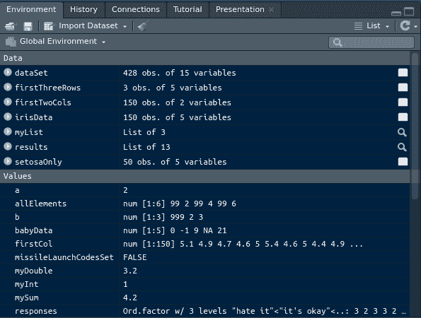

# 第十章 使用第三方代码

> [`randpythonbook.netlify.app/using-third-party-code`](https://randpythonbook.netlify.app/using-third-party-code)

在使用第三方代码之前，必须首先安装它。安装后，必须将其“加载”到您的会话中。我将在这两部分中分别介绍 R 和 Python。

## 10.1 在 R 中安装软件包

在 R 中，有成千上万的免费、用户创建的**软件包**（Lander 2017）。您可以从[*综合 R 存档网络*](https://cran.r-project.org/)下载其中大部分。您还可以从其他发布平台下载软件包，如[Bioconductor](https://www.bioconductor.org/)或[Github](https://github.com/)。从 CRAN 安装更为常见，并且非常容易操作。只需使用`install.packages()`函数即可。这可以在您的 R 控制台中运行，因此无需在命令行中输入内容。

```py
install.packages("thePackage")
```

## 10.2 在 Python 中安装软件包

在 Python 中，安装软件包更为复杂。必须在命令行中编写命令，并且存在多个软件包管理器。这并不奇怪，因为除了数据科学之外，Python 在其他领域的使用比 R 更广泛。

如果您遵循了文本中提供的建议，那么您已经安装了 Anaconda。这意味着您通常会使用[`conda`命令](https://docs.anaconda.com/anaconda/user-guide/tasks/install-packages/)。还提供了点对点界面。

```py
conda install the_package
```

使用这种方法可能无法访问某些软件包。有关该情况的更多信息，请参阅[此处](https://conda.io/projects/conda/en/latest/user-guide/tasks/manage-pkgs.html#install-non-conda-packages)。

## 10.3 在 R 中加载软件包

在您的机器上安装后，第三方代码需要被“加载”到您的 R 或 Python 会话中。

在 R 中加载软件包相对简单，然而当不同的变量共享相同的名称时可能会出现复杂情况。这种情况相对常见，因为

+   在全局环境中创建一个与您不知道的其他对象同名变量很容易，

+   您加载的不同软件包有时会意外地共享名称。

从基础知识开始，以下是如何在 R 控制台中加载第三方代码包。只需将以下内容输入到您的 R 控制台中。

```py
library(thePackage)
```

您还可以使用`require()`函数，当请求的软件包未找到时，该函数的行为略有不同。

要更深入地理解这一点，我们需要再次讨论**环境**。我们之前在 6.3 中讨论过这些，但仅限于用户定义函数的上下文。当我们使用`library()`加载软件包时，我们通过将其全部放入该软件包的环境中来使其内容可用。

一个[环境](https://cran.r-project.org/doc/manuals/R-lang.html#Environment-objects)包含对象的名称。通常有几个环境，每个环境包含不同的函数和变量集合。你定义的所有变量都在一个环境中，你加载的每个包都有自己的环境，R 预加载的所有函数也有它们自己的环境。

形式上，每个环境由两个东西组成：一个**框架**和一个**封装器**。框架是符号值对的集合，封装器是指向父环境的指针。如果你在计算机科学课程中听说过**链表**，那么它就是同一回事。

此外，所有这些环境都连接成一个链状结构。要查看你的机器上加载了哪些环境以及它们的加载顺序，请使用 `search()` 函数。这显示了[**搜索路径**](https://cran.r-project.org/doc/manuals/R-lang.html#Search-path)，即所有环境的有序序列。

或者，如果你使用的是 RStudio，搜索路径以及每个环境的内含物都会在“环境”窗口中显示。你可以通过从下拉菜单中选择来查看你想要查看的环境。这允许你看到该特定环境中的所有变量。默认情况下显示的是**全局环境**（即 `".GlobalEnv"`），因为这是你存储在控制台创建的所有对象的地方。



图 10.1：RStudio 中的环境窗口

当你调用 `library(thePackage)` 时，为该包创建了一个环境，并且它被**插入到全局环境和最近加载的包之间**。当你想通过名称访问一个对象时，R 首先会搜索全局环境，然后按照搜索路径的顺序遍历环境。这有几个重要的含义。

+   首先，**不要在全局环境中定义在其他环境中已经命名的变量**。`base` 包中预加载了许多变量（要查看它们，请输入 `ls("package:base")`），如果你喜欢使用很多包，那么你应该避免使用的名称数量就会增加。

+   第二，**除非你需要，否则不要在包中使用 `library()`，并且如果你确实需要，要意识到它将掩盖你之前加载的包中的所有名称**。好消息是 `library` 通常会打印警告，告诉你哪些名称已被掩盖。坏消息是这有点超出你的控制——如果你需要两个包，它们可能有一个共享的名称，而你能做的唯一一件事就是注意它们的加载顺序。

+   第三，不要在其他文件中`source()`的代码中使用`library()`。例如，如果你在一个你定义的函数内部将包附加到搜索路径，那么使用你的函数的人将失去控制附加包的顺序。

如果存在名称冲突，并非一切都已丢失。变量并没有消失。只是引用它们稍微困难一些。例如，如果我加载了`Hmisc`（Harrell Jr, Charles Dupont 等人。2021），我得到警告，警告说`format.pval`和`units`现在被屏蔽，因为它们是`"package:base"`中的名称。我仍然可以用双冒号运算符（`::`）引用这些屏蔽变量。

```py
library(Hmisc)
# this now refers to Hmisc's format.pval 
# because it was loaded more recently
format.pval 
Hmisc::format.pval # in this case is the same as above
# the below code is the only way 
# you can get base's format.pval now
base::format.pval 
```

## 10.4 在 Python 中加载包

在 Python 中，你使用`import`语句来访问另一个文件中定义的对象。它比 R 的`library()`函数稍微复杂一些，但也更加灵活。为了使名为`the_package`的包的内容可用，在 Python 会话中输入以下之一。

```py
import the_package
import the_package as tp 
from the_package import *
```

为了描述这三种方法的区别，以及突出重要的要点并与上一节的重要要点进行比较，我们需要讨论什么是 Python 模块，什么是包，以及什么是 Python 命名空间。¹⁷

+   一个 Python[**模块**](https://docs.python.org/3/tutorial/modules.html)是一个包含函数和/或对象定义的`.py`文件，与当前编辑的文件分开。¹⁸

+   一个[包](https://docs.python.org/3/tutorial/modules.html#packages)是一组模块。¹⁹

+   一个[**命名空间**](https://docs.python.org/3/tutorial/classes.html#python-scopes-and-namespaces)是“从名称到对象的映射。”

根据 Python 文档[Python 文档](https://docs.python.org/3/reference/import.html#the-import-system)，“`import`语句结合了两个操作；它搜索命名的模块，然后将搜索结果绑定到局部作用域中的一个名称。”

Python 查找模块的顺序称为搜索路径。这不同于 R 的搜索路径。在 Python 中，搜索路径是查找模块的地点列表，而不是查找变量的地点列表。要查看它，请输入`import sys`，然后输入`sys.path`。

找到模块后，其中的变量名称对导入模块可用。这些变量在全局作用域中可用，但你用来访问它们的名称将取决于你使用的`import`语句的类型。从那里，你使用的是我们在 6.6 中描述的作用域规则，这意味着 LEGB 缩写词仍然适用。

在这两种语言中，一个（未限定的）变量名在任何时候只能引用一个对象。这不一定与使用第三方代码有关——您可以重新定义对象，但不要期望在这样做之后能够访问旧对象。

当您使用第三方代码时，也可能发生同样的事情。

+   在 R 中，您必须担心 `library()` 和 `require()` 调用的顺序，因为可能存在潜在的遮蔽问题。

+   如果您不想担心遮蔽（masking）问题，请不要使用 `library()` 或 `require()`，只需使用 `::` 操作符来引用变量（例如 `coolPackage::specialFunc()`）。

+   在 Python 中，使用 `import package` 格式或 `import package as p` 格式加载包意味着您不需要担心导入的顺序，因为您将被迫限定变量名（例如 `package.func()` 或 `p.func()`）。

+   在 Python 中，如果您使用 `from package import foo` 或 `from package import *` 加载第三方代码，您就不需要限定变量名，但导入的对象将覆盖任何与您导入的内容具有相同名称的变量。

R 和 Python 之间变量名存储的方式只有细微的差别。

+   Python 命名空间与 R 环境类似，因为它们都包含名称-值对；然而

+   Python 命名空间与 R 环境不同，因为它们不是按顺序排列的列表。

+   此外，Python 模块可能组织成嵌套或树状结构，而 R 包总是具有平面结构。

### 10.4.1 `import` 示例

在下面的示例中，我们以允许我们将其称为 `np` 的方式导入整个 `numpy` 包。这减少了我们需要输入的字符数量，但也保护了变量名冲突。然后我们使用 `normal()` 函数来模拟正态随机变量。此函数位于 `random` 子模块中（[`numpy.org/doc/stable/reference/random/index.html?highlight=random#module-numpy.random`](https://numpy.org/doc/stable/reference/random/index.html?highlight=random#module-numpy.random)），它是 `numpy` 中的一个子模块，收集了所有伪随机数生成功能。

```py
import numpy as np # import all of numpy
np.random.normal(size=4)
## array([-0.6986366 , -0.17539033,  0.46794932,  0.47517799])
```

这是点操作符（`.`）的一个用途。它还用于访问对象的属性和方法（关于这一点，将在第十四章节中稍后详细介绍）。`normal` 是 `random` 的内部属性，而 `random` 本身又是 `np` 的内部属性。

作为第二个示例，假设我们对 `scipy` 包内找到的 `stats` 子模块感兴趣。[`docs.scipy.org/doc/scipy/reference/tutorial/stats.html`](https://docs.scipy.org/doc/scipy/reference/tutorial/stats.html)。我们可以导入整个 `scipy`，但就像上面的例子一样，这意味着我们需要一致地引用变量的模块、子模块和变量名。对于长程序，如果我们不得不反复输入 `scipy.stats.norm`，这可能会变得繁琐。相反，让我们导入子模块（或子包）并忽略 `scipy` 的其余部分。

```py
from scipy import stats
stats.norm().rvs(size=4)
## array([ 2.49062124,  0.09135411,  1.13549852, -1.49587011])
```

因此，我们不必每次在 `scipy.stats` 中使用 `scipy`。

最后，我们可以直接导入函数，只用一个字母来引用它。尽管如此，这被高度不建议。我们更有可能意外地两次使用名称 `n`。此外，`n` 不是一个非常描述性的名称，这意味着以后可能难以理解你的程序在做什么。

```py
from numpy.random import normal as n
n(size=4)
## array([-0.83022531, -0.12589462, -2.29715655, -1.47360775])
```

请记住，即使你没有导入任何内容，你也总是有意外重复使用名称的风险。例如，考虑以下代码。

```py
n = 3 # now you can't use n as a function 
n() 
```

这非常糟糕，因为你现在不能使用之前从 `numpy.random` 子模块导入的 `n()` 函数。换句话说，它不再可调用。上述代码的错误信息可能类似于 `TypeError: 'int' object is not callable`。

使用 `dir()` 函数查看模块内部有什么可用。这里有一些示例。将它们输入到你的机器上，看看它们会输出什么。

```py
dir(np) # numpy stuff
dir(__builtins__) #built-in stuff
```

## 10.5 练习

R 和 Python 的包安装过程有哪些重要的不同之处？选择所有适用的选项。

1.  R 包的安装可以在 R 内完成，而 Python 包的安装可以在命令行中完成。

1.  安装 R 包通常可以使用相同的函数 `install.packages()`，而安装 Python 中的包可以使用各种包安装器，如 `pip install` 和 `conda install`。

1.  R 只有一个包仓库，但 Python 有很多。

1.  Python 的包仓库只有一个，但 R 的包仓库有很多。

R 和 Python 的包加载过程有哪些重要的相似之处和不同之处？选择所有适用的选项。

1.  R 和 Python 都有一个搜索路径。

1.  R 的 `::` 运算符与 Python 的 `.` 运算符非常相似，因为它们都可以帮助访问包内部的变量名称。

1.  Python 的命名空间与 R 的环境不同，因为它们不是按顺序排列的。

1.  R 中的 `library(package)` 与 Python 中的 `from package import *` 类似，因为它将允许你无需限定条件地引用 `package` 中的所有变量。

1.  Python 的包可能有 `子模块`，而 R 的包没有。

在 Python 中，以下哪个通常是最佳导入方式？

+   `import the_package`

+   `from the_package import *`

+   `import the_package as tp`

在 Python 中，以下哪个通常是最差的导入方式？

+   `import the_package`

+   `from the_package import *`

+   `import the_package as tp`

在 R 中，如果你想使用 `package` 中的函数 `func()`，你是否总是需要先使用 `library(package)` 或 `require(package)`？

+   是的，否则 `func()` 将不可用。

+   不，你可以直接使用 `package::func()` 而不必调用任何执行预加载的函数。

### 参考文献

哈雷尔，弗兰克·E，由查尔斯·杜邦等人贡献。2021. *Hmisc: 哈雷尔杂项*。[`CRAN.R-project.org/package=Hmisc`](https://CRAN.R-project.org/package=Hmisc)。

Lander, Jared P. 2017\. *《R 语言：面向所有人的高级分析与图形（第 2 版）》*. 2nd ed. Addison-Wesley Professional.

* * *

1.  我避免提及 *R* 的命名空间和模块。这些是存在的事物，但它们与 Python 的命名空间和模块不同，并且不在此文本的范围内。↩

1.  你所编写的脚本都是模块。它们通常带有从头到尾运行的意图。其他非脚本模块只是一些定义的集合，用于其他地方。↩

1.  有时一个包被称为 *库*，但我会避免使用这个术语。↩
