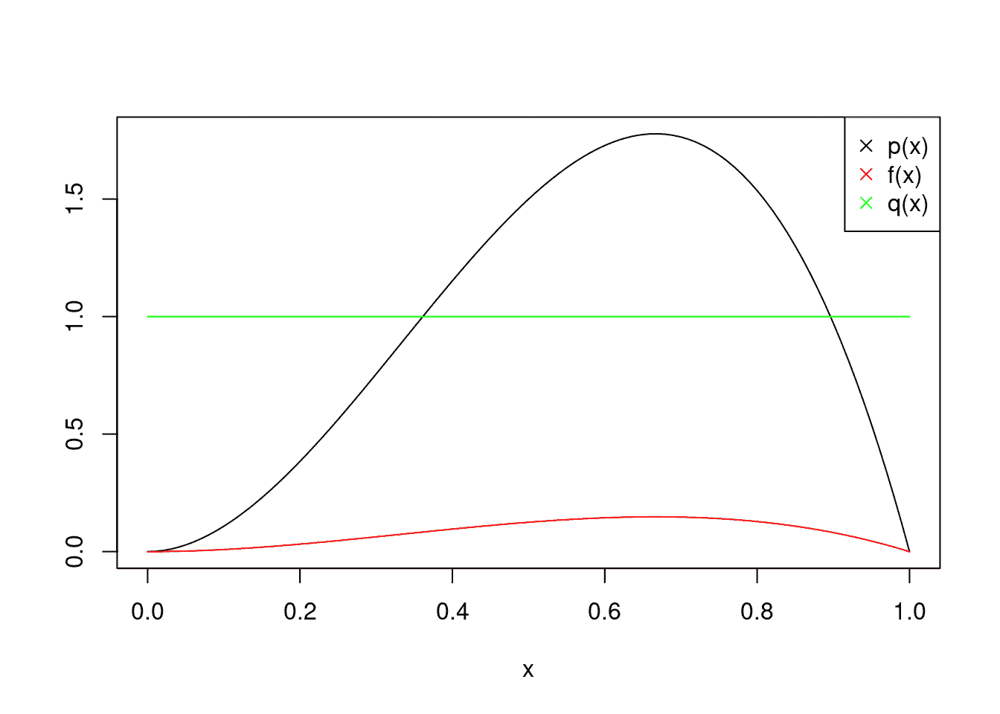

# 第十一章 控制流

> 原文：[`randpythonbook.netlify.app/control-flow`](https://randpythonbook.netlify.app/control-flow)

## 11.1 条件逻辑

我们在 2 中讨论了布尔/逻辑对象。我们使用这些来

+   计算条件出现的次数，以及

+   向量子集和数据框。

另一种使用它们的方法是条件性地执行代码。你可以选择根据布尔/逻辑值是否为真来执行代码。

这就是 R 中[if 语句](https://cran.r-project.org/doc/manuals/r-release/R-lang.html#if)的样子：

```py
myName <- "Taylor"
if(myName != "Clare"){
 print("you are not Clare")
}
## [1] "you are not Clare"
```

[在 Python 中](https://docs.python.org/3/tutorial/controlflow.html#if-statements)，你不需要花括号，但缩进必须恰到好处，并且需要冒号（Lutz 2013）。

```py
my_name = "Taylor"
if my_name == "Taylor":
 print("hi Taylor")
## hi Taylor
```

可以有多个真值测试。为了测试替代条件，你可以添加一个或多个`else if`（在 R 中）或`elif`（在 Python 中）块。第一个找到为真的布尔值所在的块将被执行，并且不会检查任何产生的条件。

如果没有`if`块或`else if`/`elif`块执行，`else`块将始终执行。这就是为什么`else`块不需要查看布尔值。它们是否执行只取决于前面的布尔值。如果没有`else`块，并且前面的条件都不为真，则不会执行任何操作。

```py
# in R
food <- "muffin"
if(food == "apple"){
 print("an apple a day keeps the doctor away")
}else if(food == "muffin"){
 print("muffins have a lot of sugar in them")
}else{
 print("neither an apple nor a muffin")
}
## [1] "muffins have a lot of sugar in them"
```

```py
# in Python
my_num = 42.999
if my_num % 2 == 0:
 print("my_num is even")
elif my_num % 2 == 1:
 my_num += 1
 print("my_num was made even")
else:
 print("you're cheating by not using integers!")
## you're cheating by not using integers!
```

## 11.2 循环

一行代码通常做一件“事情”，除非你使用循环。循环内的代码将执行多次。

对于我们来说，最常见的循环将是`for`循环。一个简单的 R 中的`for`循环可能看起来像这样

```py
#in R
myLength <-  9
r <-  vector(mode = "numeric", length = myLength)
for(i in seq_len(myLength)){
 r[i] <-  i
}
r
## [1] 1 2 3 4 5 6 7 8 9
```

1.  `seq_len(myLength)`给我们一个`向量`。

1.  `i`是一个变量，它取`seq_len(myLength)`中找到的值。

1.  循环（花括号内）中的代码将被反复执行，并且可能或可能不引用动态变量`i`。

[以下是一个 Python 中 for 循环的示例](https://docs.python.org/3/tutorial/controlflow.html#for-statements)（Lutz 2013）：

```py
#in Python
my_length = 9
r = []
for i in range(my_length):
 r.append(i)
r
## [0, 1, 2, 3, 4, 5, 6, 7, 8]
```

1.  毫不奇怪，Python 的语法选择缩进和冒号而不是花括号和括号。

1.  循环（位于`for`行下缩进）中的代码将被反复执行，并且可能或可能不引用动态变量`i`。

1.  Python 中的`for`循环更灵活，因为它们遍历许多不同类型的数据结构——在这个例子中，`range()`返回一个类型为`range`的对象（[`docs.python.org/3/library/stdtypes.html#range`](https://docs.python.org/3/library/stdtypes.html#range)）。

1.  `range`函数不会一次性生成序列中的所有数字，因此它节省了内存。如果你正在遍历一个大型集合，并且不需要一次性存储所有内容，这可以非常有用。然而，在这个例子中，`r`是一个列表，它确实存储了所有连续的整数。

循环用于重复执行代码。当你事先知道所需的迭代次数时，`for`循环非常出色。如果迭代次数未知，那么你需要一个`while`循环。当找到条件为真时，`while`循环才会终止。以下是一些[在 R](https://cran.r-project.org/doc/manuals/r-release/R-lang.html#while)和[在 Python](https://docs.python.org/3/reference/compound_stmts.html#while)的例子。

```py
# in R
keepGoing <-  TRUE
while(keepGoing){
 oneOrZero <-  rbinom(1, 1, .5)
 print(paste("oneOrZero:", oneOrZero))
 if(oneOrZero ==  1)
 keepGoing <-  FALSE
}
## [1] "oneOrZero: 0"
## [1] "oneOrZero: 0"
## [1] "oneOrZero: 1"
```

```py
# in Python
keep_going = True
while keep_going:
 one_or_zero = np.random.binomial(1, .5) 
 print("one_or_zero: ", one_or_zero)
 if one_or_zero == 1:
 keep_going = False
## one_or_zero:  0
## one_or_zero:  1
```

这里有一些关于编写循环的技巧：

1.  如果你发现自己正在复制和粘贴代码，每次只更改代码每一行中的一小部分文本，你应该考虑使用循环。

1.  如果`for`循环适用于你想要做的事情，首先尝试找到一个可以完成你想要的功能的替换函数。上面的例子只是创建了一个连续整数的`vector`/`list`。有许多内置函数可以完成这个任务。在这种情况下避免循环会使你的程序更短，更容易阅读，并且（可能）运行得更快。

1.  在循环和内置函数之间还有一个选择，那就是尝试函数式方法。这将在最后一章中进一步解释。

1.  注意[**off-by-one**错误](https://en.wikipedia.org/wiki/Off-by-one_error)。迭代错误的序列是一个常见的错误，考虑到

    +   Python 从$0$开始计数，而 R 从$1$开始计数

    +   有时迭代`i`引用的是容器中的`i-1`个元素

    +   如果循环使用了`break`或`continue`/`next`语句，那么循环的行为有时可能更难以理解。[`break`](https://cran.r-project.org/doc/manuals/r-release/R-lang.html#Looping)或[`continue`/`next`语句](https://docs.python.org/3/tutorial/controlflow.html#break-and-continue-statements-and-else-clauses-on-loops)。

1.  *不要硬编码变量。*换句话说，不要编写针对脚本当前草稿特定细节的代码。编写即使程序被喂入不同的数据，或者需要计算其他与之密切相关的内容（例如，在不同的数据集上运行相同的计算，或者改变模拟的数量，或者在不同情况下多次制作相同的图形等）时仍然可以运行的代码。我可以保证你写的代码大多数情况下都需要在许多不同的环境中运行。如果你每次决定做出改变时都需要查找多个地方并做出多个更改，那么你至少会错过一个的概率是非平凡的。结果，你会在程序中引入一个错误，并浪费（有时是大量的）时间试图找到它。

1.  注意避免无限`while`循环。确保你的停止条件最终一定会变为真。

Python 还提供了一种类似于我们在上面例子中构造的列表的替代构建方式。它们被称为[**列表推导**](https://docs.python.org/3/tutorial/datastructures.html#list-comprehensions)。这是因为你可以将迭代和条件逻辑合并到一行代码中。

```py
[3*i for i in range(10) if i%2 == 0]
## [0, 6, 12, 18, 24]
```

你也可以看看[*生成表达式*](https://www.python.org/dev/peps/pep-0289/)和[*字典推导式*](https://www.python.org/dev/peps/pep-0274/)。

R 可以通过向量化接近复制上述行为，但条件部分没有子集化很难实现。

```py
3*seq(0,9)[seq(0,9)%%2 ==  0]
## [1]  0  6 12 18 24
```

## 11.3 练习

### 11.3.1 R 问题

假设你有一个`vector`类型的`numeric`数据：$x_1, \ldots, x_n$. 编写一个名为`cappedMoveAve(dataVector)`的函数，该函数接收一个`vector`并返回一个 3 周期的“上限”移动平均。请确保使用`for`循环。你应该使用的公式是 $$\begin{equation} y_t = \min\left(10, \frac{1}{3}\sum_{i=0}²x_{t-i} \right). \end{equation}$$ 函数应该返回`y_1, \ldots, y_n`作为一个`vector`。设$y_1 = y_2 = 0$。

假设我们有一个目标²⁰分布，我们想要从中采样：$$\begin{equation} p(x) = \begin{cases} \frac{x²(1-x)}{\int_0¹ y²(1-y) dy} & 0 < x < 1 \\ 0 & \text{otherwise} \end{cases}. \end{equation}$$ 分母$\int_0¹ y²(1-y) dy$是目标分布的归一化常数。你可能知道如何解这个积分（它等于$1/12$），但为了我们的例子，让我们假装它对我们来说太难了。我们想要从$p(x)$中采样，而只能评估（不能采样）其未归一化的版本$f(x) := x²(1-x)$。这种情况经常出现——想要从一些复杂的分布中采样，而你只能评估其密度直到一个比例常数。

接下来，让我们为我们的**建议分布**选择一个均匀分布：$q(x) = 1$如果$0 < x < 1$。这意味着我们将从这个分布中采样，因为这更容易。我们只需要“调整”我们的样本，因为它与我们的目标不同。

我们可以绘制所有三个函数。$p(x)$和$q(x)$曲线下的面积是$1$，因为它们是真正的概率密度函数。然而，$f(x)$不是。



图 11.1：可视化我们的三个函数

注意，这个算法允许使用其他建议分布。建议分布的唯一要求是其可能值的范围必须包含目标可能值的范围。

1.  编写一个名为`arSamp(n)`的函数，使用接受-拒绝采样从$p(x)$中采样。它应该接受一个参数，该参数等于所需样本的数量。以下是接受-拒绝算法的一步。你需要进行多次迭代，因为一些建议可能不会被接受。

**算法 1**：接受-拒绝采样（一步）

1.  找到$M$，使得对于所有可能的$x$，$M > \frac{f(x)}{q(x)}$（越小越好）。

1.  从$q(x)$中采样$X$。

1.  从$\text{Bernoulli}\left(\frac{f(X)}{q(X)M}\right)$中采样$Y \mid X$。

1.  如果$Y = 1$，则返回$X$。

1.  否则，返回空值。

编写一个名为 `multiplyTwoMats(A,B)` 的函数，该函数执行矩阵乘法。它应该接受两个 `matrix` 参数：`A` 和 `B`。然后它应该返回矩阵乘积 `AB`。使用两个嵌套的 `for` 循环来编写此函数。确保使用你通常用来乘矩阵的常用工具：`%*%` 进行测试。

假设你正在尝试根据关于相应自变量 $x$ 的信息预测 $Y$ 的值。进一步假设你有一个历史观测数据集 $(x_1, y_1), \ldots, (x_n,y_n)$。提出预测的一种方法是使用 **Nadaraya–Watson 核回归** (Nadaraya 1964) (Watson 1964)。这种方法提供的预测只是一个历史观测数据点 $y_1, \ldots, y_n$ 的加权平均值。如果 $x_i$ 与你正在获取预测值的 $x$ 值“接近”，则给定 $y_i$ 的权重会更大。另一方面，如果 $x_j$ 与 $x$ 相距较远，则 $y_j$ 的权重相对较小，因此这个数据点不会对预测产生很大影响。

编写一个名为 `kernReg(xPred,xData,yData,kernFunc)` 的函数，该函数计算给定 $X=x$ 时 $Y$ 的 Nadaraya–Watson 估计值。在函数定义中不要使用 `for` 循环。公式为 $$\begin{equation} \sum_{i=1}^n \frac{K(x-x_i)}{\sum_{j=1}^n K(x-x_j) } y_i, \end{equation}$$ 其中 $x$ 是你试图获取预测值的点。

+   你的函数应该返回一个浮点数。

+   输入 `xPred` 将是一个浮点数。

+   输入 `xData` 是一个包含自变量数值数据的单维 `vector`。

+   输入 `yData` 是一个包含依赖变量数值数据的单维 `vector`。

+   `kernFunc` 是一个接受 `numeric` `vector` 并返回浮点数的函数。它是向量化的。

下面是一些可以帮助你测试预测的代码。核函数 `gaussKernel()` 实现高斯核函数 $K(z) = \exp[-z²/2]/\sqrt{2\pi}$。注意 `preds` 的创建已被注释掉。使用 `for` 循环为 `xTest` 的所有元素生成预测，并将它们存储在向量 `preds` 中。

```py
gaussKernel <-  dnorm
xTest <-  seq(0,10,length.out= 100)
yTest <-  xTest*2 
# preds <- ?
plot(xTest, yTest, type = "b")
lines(xTest, preds, col = "red")
```

### 11.3.2 Python 问题

假设你带着 $10$ 美元去赌场。你决定你的策略是玩到破产，或者直到你的钱翻三倍。你唯一玩的游戏每次需要支付 $ \$1 $。如果你输了，你会失去那美元。如果你赢了，你将得到另外 $ \$1 $，并且会收回你的钱。

1.  编写一个名为 `sim_night(p)` 的函数，该函数模拟你的夜晚赌博。让它返回一个 Pandas `Series`，表示你在一夜之间拥有的运行余额。例如，如果你连续输了 $10$ 场游戏，并且提前回家，返回的 `Series` 包含 $9, \ldots, 1,0$。此函数只接受一个输入 `p`，它是你赢得任何/每场比赛的概率。

1.  使用一个`for`循环以概率`p=.5`调用你的函数$5000$次。每次调用，存储游戏的数量。将它们全部存储在一个名为`simulated_durations`的 Numpy `array`或 Pandas `Series`中。

1.  计算`simulated_durations`的平均值。这是你蒙特卡洛估计的预期持续时间。它与你的理论预期相比如何？

1.  当$p=.7$时，执行相同的分析以估计预期的持续时间。将你的答案存储为名为`expec_duration`的`float`。

假设你有一个以下数据集。请在你的提交中包含以下片段。

```py
import numpy as np
import pandas as pd
my_data = pd.read_csv("sim_data.csv", header=None).values.flatten()
```

此问题将演示如何实现**自举法**（Efron 1979），这是一种流行的非参数方法，用于理解感兴趣统计量的分布。主要思想是在从原始数据集`my_data`随机选择、有放回地选择的数据集上反复计算你的统计量，这些数据集与原始数据集大小相同，每个自举数据集将产生一个统计量。收集所有这些随机统计量，这将是统计量理论分布的良好近似。

1.  计算此数据集的均值并将其存储为名为`sample_mean`的浮点数。

1.  计算样本均值$5,000$个自举样本。将它们存储在一个名为`bootstrapped_means`的 Numpy `array`中。使用一个`for`循环，并在循环内部，从长度为$1000$的数据集中有放回地采样$1000$次。你可以使用`np.random.choice()`函数来完成此操作。

1.  计算这些自举均值的样本均值。这是样本均值理论均值/期望的良好估计。将其称为`mean_of_means`。

1.  计算这些自举均值的样本方差。这是样本均值理论方差的良好估计。将其称为`var_of_means`。

编写一个名为`ar_samp(n)`的函数，使用接受-拒绝采样从$p(x)$中采样。可以使用你喜欢的任何提议分布。它应该接受一个参数，该参数等于所需的样本数量。从以下目标分布中采样：$$\begin{equation} p(x) \propto f(x) := \exp[\cos(2\pi x)] x²(1-x), \hspace{5mm} 0 < x < 1. \end{equation}$$

### 参考文献

Efron, B. 1979\. “Bootstrap 方法：对 Jackknife 的另一种看法。” *《统计年鉴》* 7 (1): 1–26\. [`doi.org/10.1214/aos/1176344552`](https://doi.org/10.1214/aos/1176344552).

Lutz, Mark. 2013\. *《Python 学习》*. 第 5 版. 北京: O’Reilly. [`www.safaribooksonline.com/library/view/learning-python-5th/9781449355722/`](https://www.safaribooksonline.com/library/view/learning-python-5th/9781449355722/).

Nadaraya, E. A. 1964\. “关于回归估计。” *《概率论及其应用理论》* 9 (1): 141–42\. [`doi.org/10.1137/1109020`](https://doi.org/10.1137/1109020).

Watson, Geoffrey S. 1964\. “Smooth Regression Analysis.” *Sankhyā: The Indian Journal of Statistics, Series A (1961-2002)* 26 (4): 359–72\. [`www.jstor.org/stable/25049340`](http://www.jstor.org/stable/25049340).

* * *

1.  这是 $\text{Beta}(3,2)$ 随机变量的密度，如果你对此感兴趣。↩
