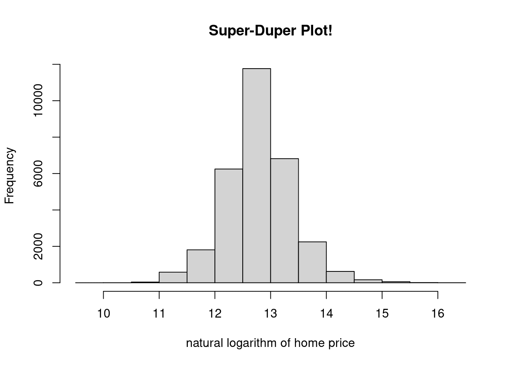
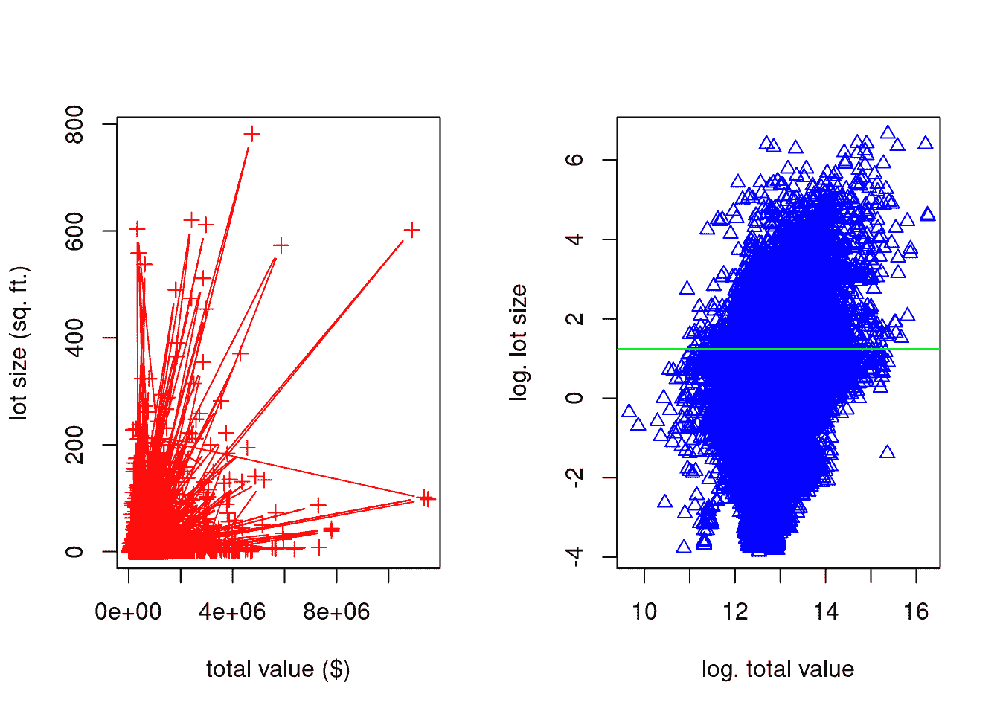
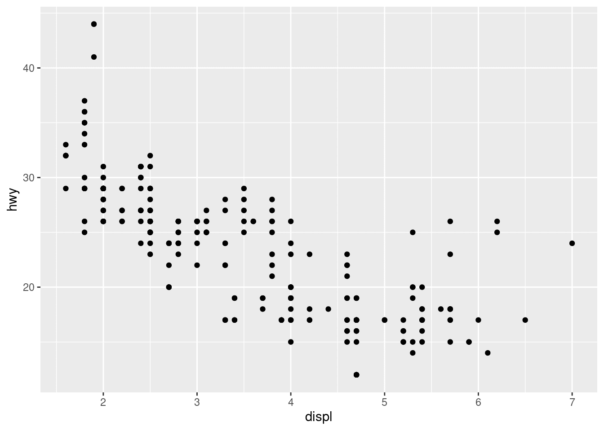
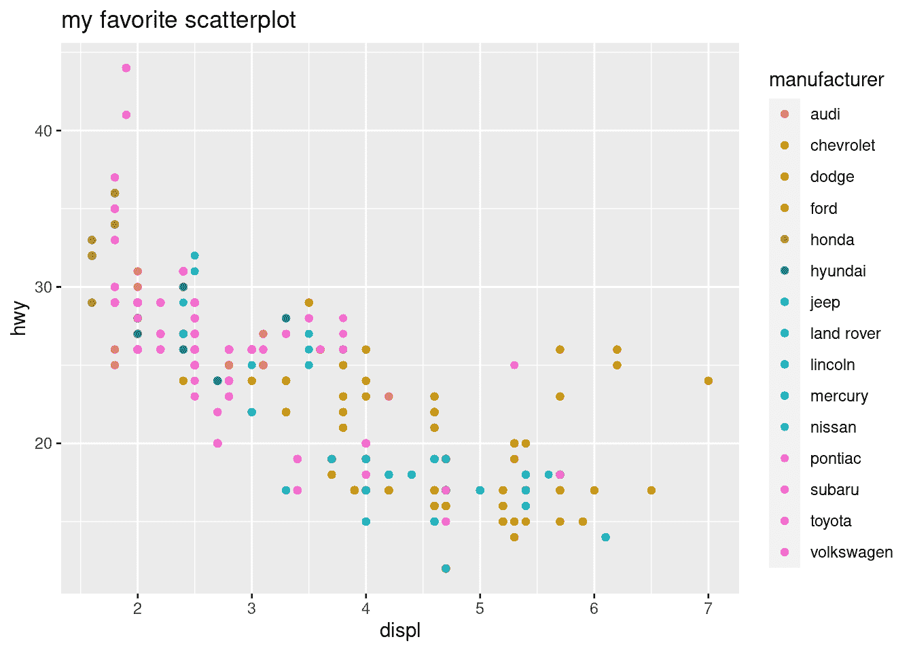
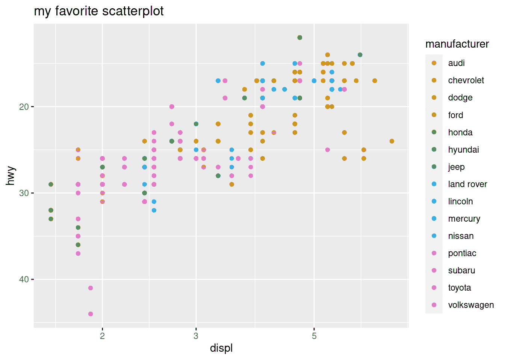
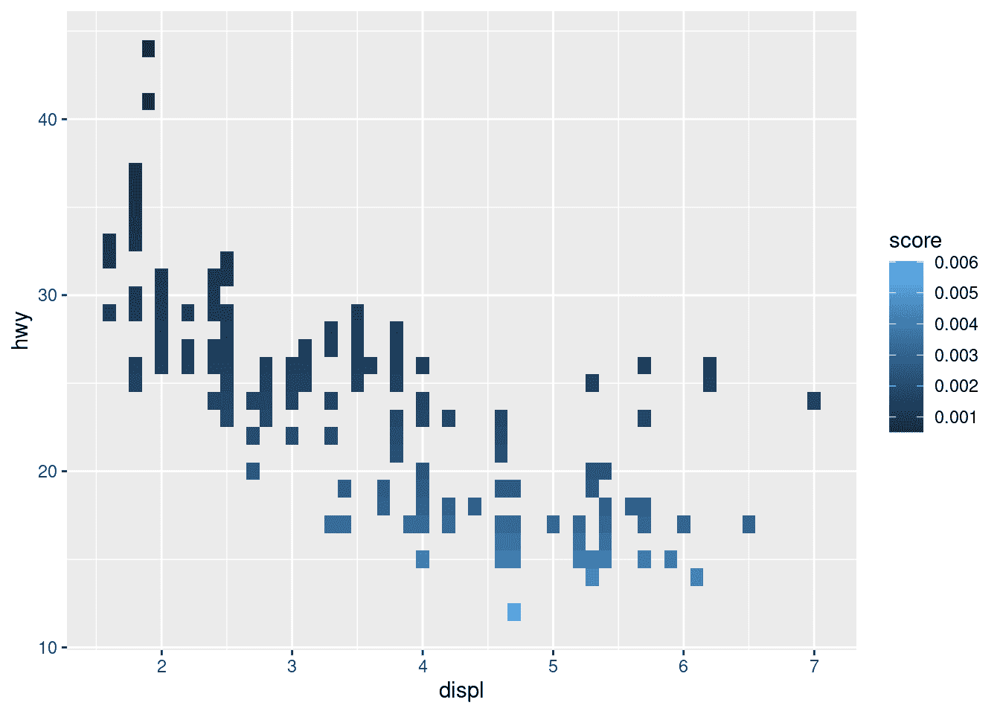
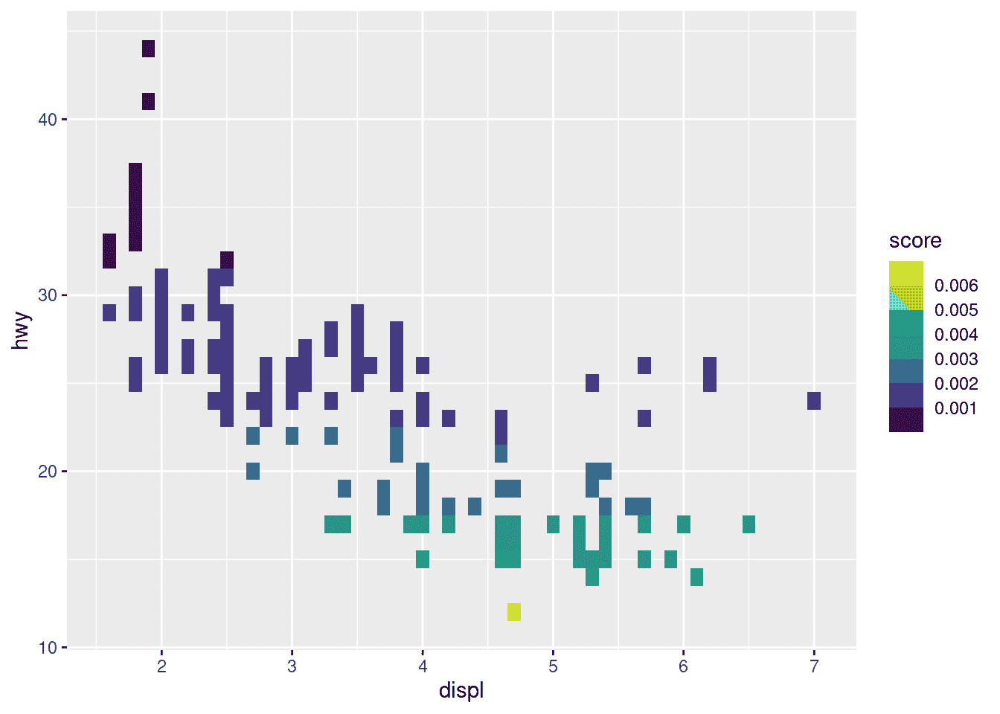
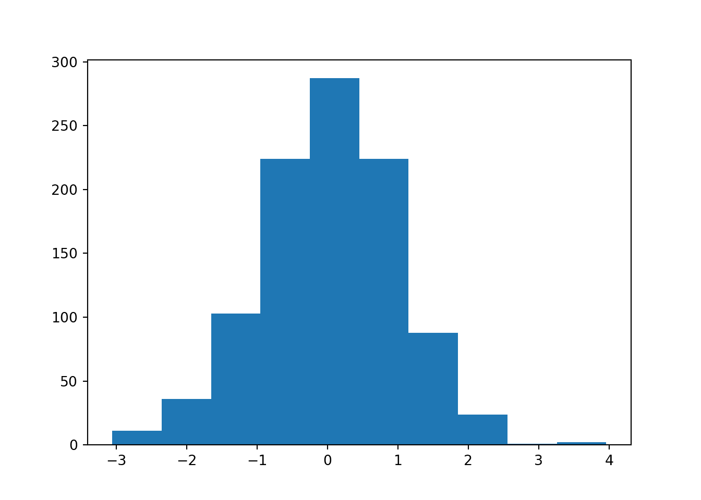
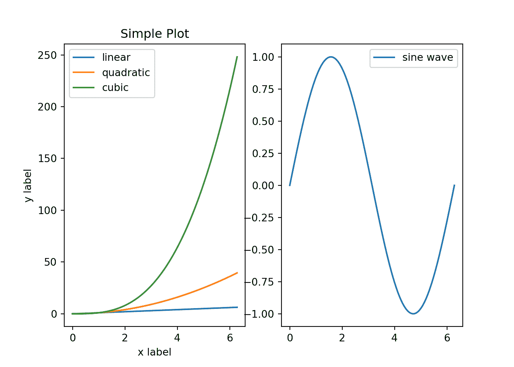

# 第十三章 可视化

> 原文：[`randpythonbook.netlify.app/visualization`](https://randpythonbook.netlify.app/visualization)

我在下面描述了 R 和 Python 中的几个绘图范例。请注意，这些描述是简短的。更多的细节可以很容易地将任何这些小节变成一本完整的教科书。

## 13.1 基础 R 绘图

R 随带一些内置的绘图函数，如 `plot()`、`hist()` 和 `boxplot()`。其中许多位于 `package:graphics` 中，该包预先加载到搜索路径中。另一方面，`plot()` 在 `package:base` 的搜索路径中更高——它是一个通用方法，其方法可以位于许多地方（例如在 `package:graphics` 或其他地方）。

基础绘图通常可以满足大部分需求，因此这是我们花费最多时间学习的。然而，有许多第三方绘图库可以考虑，如果你想要使用某种美学，或者如果你想要针对特定情况（例如地理空间绘图）的特定绘图功能。

回想一下我们的阿勒姆房地产数据集（阿勒姆县地理信息服务办公室 2021（福特 2016）。

```py
df <-  read.csv("data/albemarle_real_estate.csv")
str(df, strict.width = "cut")
## 'data.frame':    30381 obs. of  12 variables:
##  $ YearBuilt    : int  1769 1818 2004 2006 2004 1995 1900 1960 ..
##  $ YearRemodeled: int  1988 1991 NA NA NA NA NA NA NA NA ...
##  $ Condition    : chr  "Average" "Average" "Average" "Average" ..
##  $ NumStories   : num  1.7 2 1 1 1.5 2.3 2 1 1 1 ...
##  $ FinSqFt      : int  5216 5160 1512 2019 1950 2579 1530 800 9..
##  $ Bedroom      : int  4 6 3 3 3 3 4 2 2 2 ...
##  $ FullBath     : int  3 4 2 3 3 2 1 1 1 1 ...
##  $ HalfBath     : int  0 1 1 0 0 1 0 0 0 0 ...
##  $ TotalRooms   : int  8 11 9 10 8 8 6 4 4 4 ...
##  $ LotSize      : num  5.1 453.9 42.6 5 5.5 ...
##  $ TotalValue   : num  1096600 2978600 677800 453200 389200 ...
##  $ City         : chr  "CROZET" "CROZET" "CROZET" "CROZET" ...
```

如果我们想要了解阿勒姆县豪宅的大致价格，我们可以使用直方图。这有助于我们可视化单变量数值变量/列。以下我绘制了房价的自然对数。

```py
hist(log(df$TotalValue), 
 xlab = "natural logarithm of home price", 
 main = "Super-Duper Plot!")
```



图 13.1：一个简单的直方图

我指定了 `xlab=` 和 `main=` 参数，但还有许多其他可以调整的参数。确保查阅文档中的选项（`?hist`）。

`plot()` 对于绘制两个单变量数值变量很有用。这可以通过时间序列图（变量与时间）和散点图（一个变量与另一个变量）来完成。

```py
par(mfrow=c(1,2))
plot(df$TotalValue, df$LotSize, 
 xlab = "total value ($)", ylab = "lot size (sq. ft.)",
 pch = 3, col = "red", type = "b")
plot(log(df$TotalValue), log(df$LotSize), 
 xlab = "log. total value", ylab = "log. lot size", 
 pch = 2, col = "blue", type = "p")
abline(h = log(mean(df$LotSize)), col = "green")
```



图 13.2：一些散点图

```py
par(mfrow=c(1,1))
```

我使用了一些可用的许多论证之一（输入 `?plot`）。`xlab=` 和 `ylab=` 分别指定 x 轴和 y 轴的标签。`col=` 是“颜色”的缩写。`pch=` 是“点字符”的缩写。更改此值将改变每个点使用的符号形状。`type=` 比这更通用，但它与之相关。我通常用它来指定是否想要用线连接点。

我在上面的代码中使用了其他几个函数。`abline()` 用于在图表上方叠加线条。它们可以是水平的、垂直的，或者你可以用斜率-截距形式指定它们，或者通过提供线性模型对象来指定。我还使用了 `par()` 来设置图形参数。图形参数 `par()$mfrow` 设置了多图可视化的布局。然后我将它设置回标准的 $1 \times 1$ 布局。

## 13.2 使用 `ggplot2` 绘图

[`ggplot2`](https://ggplot2.tidyverse.org/)是 R 的一个流行的第三方可视化包。Python（例如，[`plotnine`](https://plotnine.readthedocs.io/en/stable/#)）中也有类似的库。本节提供了一个关于如何在 R 中使用`ggplot2`的简要教程，它主要基于（Wickham 2016）中提供的材料。关于`ggplot2`的其他优秀描述包括（Kabacoff 2015）和（Chang 2013）。

`ggplot2`的代码看起来与上面章节²¹中的代码大不相同。在那里，我们会编写一系列函数调用，每个调用都会改变当前图形的状态。在这里，我们调用不同的`ggplot2`函数来创建具有特殊行为的 S3 对象（关于 S3 对象的更多信息，请参阅子节 14.2.2），然后我们将它们“添加”在一起（即使用`+`运算符）。

这个新设计的目的不是鼓励你思考 S3 面向对象系统，而是让你思考如何使用“图形语法”（Wilkinson 2005）进行可视化。`ggplot2`利用了从这本书中提取的专用词汇。在我们开始之前，我会尝试慢慢介绍一些这些词汇。

该库的核心函数是`[`ggplot()`函数](https://www.rdocumentation.org/packages/ggplot2/versions/3.3.5/topics/ggplot)。此函数初始化图形；它是将关于*哪个*数据集你想绘制以及*如何*绘制它的信息接收进来的函数。原始数据由第一个参数提供。第二个参数`mapping=`更复杂。该参数应该使用`aes()`函数构建。在`ggplot2`的术语中，`aes()`构建一个**审美映射**。将“审美映射”想象为可以稍后使用的存储信息——它“映射”数据到图形的视觉属性。

请考虑以下第一个示例，将以下内容输入到自己的控制台中。

```py
library(ggplot2)
ggplot(mpg, aes(x = displ, y = hwy))
```

你会注意到代码和结果中的一些事情：

1.  没有几何形状出现！

1.  显示了一个笛卡尔坐标系，x 轴和 y 轴是基于提供的审美映射创建的（通过输入`summary(mpg$displ)`和`summary(mpg$hwy)`来确认这一点）。

1.  轴标签是从提供给`aes()`的列名中提取的。

要显示几何形状（在`ggplot2`的术语中称为*geoms*），我们需要向图中添加[**层**](https://ggplot2-book.org/toolbox.html#toolbox)。层是一个相当宽泛的术语——它不仅适用于几何对象。实际上，在`ggplot2`中，一个层几乎可以是任何东西：原始数据、汇总数据、转换数据、注释等。然而，添加几何对象层的函数通常以`geom_`前缀开头。在 RStudio 中，在加载`ggplot2`后，输入`geom_`，然后按`<Tab>`（自动完成）以查看一些选项。

考虑函数`[`geom_point()`](https://www.rdocumentation.org/packages/ggplot2/versions/3.3.5/topics/geom_point)。它同样返回一个具有特殊行为的 S3 实例。在`ggplot2`的术语中，它向图中添加了一个[散点图](https://ggplot2-book.org/getting-started.html#basic-use)层。

```py
library(ggplot2)
ggplot(mpg, aes(x = displ, y = hwy))  +
 geom_point()
```



图 13.3：第二个散点图

注意，我们不需要为`geom_point()`提供任何参数——美学映射是由新层使用的。

你可以添加许多类型的层，并且在一个给定的图表中，你不受层数数量的限制。例如，如果我们想添加一个标题，我们可以使用`ggtitle()`函数来添加一个标题层。与`geom_point()`不同，这个函数需要接受一个参数，因为期望的标题并不是存储为美学映射。尝试在你的机器上运行以下代码。

```py
ggplot(mpg, aes(x = displ, y = hwy))  +
 geom_point() + 
 ggtitle("my favorite scatterplot")
```

此外，请注意，如果我们更改美学映射，相同的层将会有很大的不同表现。

```py
ggplot(mpg, aes(x = displ, y = hwy, color = manufacturer))  +
 geom_point() + 
 ggtitle("my favorite scatterplot")
```



图 13.4：添加一些颜色

如果我们想要对美学映射有更紧密的控制，我们可以使用[**刻度**](https://ggplot2-book.org/scales.html#scales)。在语法上，这些是我们“添加”到图中的东西（`+`），就像层一样。然而，这些刻度是由一组不同的函数构建的，其中许多以`scale_`前缀开头。我们可以这样更改轴的属性。

```py
base_plot <-  ggplot(mpg, 
 aes(x = displ, y = hwy, color = manufacturer)) +
 geom_point() + 
 ggtitle("my favorite scatterplot")
base_plot +  scale_x_log10() +  scale_y_reverse()
```



图 13.5：更改刻度

我们还可以使用刻度层来更改图表颜色。让我们添加一个名为`fill=`的美学，这样我们就可以使用颜色来表示数值（非分类）列的值。这个数据集没有更多未使用的数值列，所以让我们创建一个新的列名为`score`。我们还使用了一个名为`geom_tile()`的新几何层函数。

```py
mpg$score <-  1/(mpg$displ² +  mpg$hwy²) 
ggplot(mpg, aes(x = displ, y = hwy, fill = score ))  +
 geom_tile() 
```



图 13.6：更改填充

如果我们不喜欢这些颜色，我们可以使用刻度层来更改它们。我个人喜欢这个。

```py
mpg$score <-  1/(mpg$displ² +  mpg$hwy²) 
ggplot(mpg, aes(x = displ, y = hwy, fill = score ))  +
 geom_tile() + 
 scale_fill_viridis_b()
```



图 13.7：再次更改填充

虽然有很多选择，但尝试在自己的机器上运行以下代码，看看它会产生什么结果。

```py
mpg$score <-  1/(mpg$displ² +  mpg$hwy²) 
ggplot(mpg, aes(x = displ, y = hwy, fill = score ))  +
 geom_tile() + 
 scale_fill_gradient2()
```

## 13.3 使用 Matplotlib 绘图

Matplotlib（Hunter 2007）是 Python 中的一个第三方可视化库。它是最古老且使用最广泛的，因此在我看来，它是开始使用 Python 制作图形的最佳方式。它也随 Anaconda 一起安装。

这篇简短介绍大量借鉴了 Matplotlib 网站上的众多[tutorials](https://matplotlib.org/stable/tutorials/index.html)。我将从一个简单的图表开始，并对每一行代码进行注释。如果你对学习更多感兴趣，(VanderPlas 2016)和(McKinney 2017)也是极好的资源。

你可以使用“pyplot-style”（例如`plt.plot()`）或“面向对象-style”在 Matplotlib 中制作图表。尽管使用第一种类型制作简单图表更快，但我只会描述第二种。这是推荐的方法，因为它更易于扩展。然而，第一种类型与 MATLAB 的语法相似。如果你熟悉 MATLAB，你可能也会考虑学习一点关于第一种风格的知识。

```py
import matplotlib.pyplot as plt       # 1
import numpy as np                    # 2
fig, ax = plt.subplots()              # 3
_ = ax.hist(np.random.normal(size=1000))  # 4
plt.show()                            # 5
```



图 13.8：另一个简单的直方图

在第一行，我们导入`matplotlib`的`pyplot`子模块。我们将其重命名为`plt`，这很简洁，并且可以节省我们一些输入。将其命名为`plt`遵循最流行的命名约定。

第二，我们以我们通常的方式导入 Numpy。Matplotlib 是为与 Numpy 数组一起使用而编写的。如果你想绘制一些数据，而这些数据不在 Numpy 数组中，你应该先将其转换。

第三，我们调用`subplots()`函数，并使用*序列解包*将返回的容器解包成单独的对象，而不存储整体容器。“Subplots”听起来像它将在一个图表上制作许多不同的图表，但如果你查看[文档](https://matplotlib.org/stable/api/_as_gen/matplotlib.pyplot.subplots.html#matplotlib-pyplot-subplots)，行数和列数默认分别为一和一。

`plt.subplots()`返回一个包含两个东西的[`tuple`](https://docs.python.org/3.3/library/stdtypes.html?highlight=tuple#tuple)²²：一个`Figure`对象和一个或多个`Axes`对象。这两个类将需要一些解释。

1.  一个[`Figure`对象](https://matplotlib.org/stable/api/figure_api.html#matplotlib.figure.Figure)是你正在创建的整体可视化对象。它保留了所有的绘图元素。如果你想保存所有的进度（例如，使用`fig.savefig('my_picture.png')`），你正在保存整体的`Figure`对象。

1.  一个或多个 `Axes` 对象包含在一个 `Figure` 对象中。每个都是 “[你想象中的‘一个图表’](https://matplotlib.org/stable/tutorials/introductory/usage.html#axes)”。它们包含两个 `Axis` 对象（对于二维图表）或三个（对于三维参数）。我们通常调用这些对象的方法来对图表进行更改。

在第四行，我们调用名为 `ax` 的 `Axes` 对象的 `hist()` 方法。我们将 `.hist()` 的输出赋值给变量 `_`。这样做是为了抑制方法输出的打印，并且因为这个变量名是 Python 的一个约定，表示该对象是临时的，在程序中不会再次使用。除了普通的直方图之外，还有很多其他类型的图表。每一种都有自己的方法，你可以在 [文档](https://matplotlib.org/stable/api/axes_api.html#plotting) 中查看选项。

如果你想要制作更复杂的图表，只需不断调用 `ax` 的不同方法。如果你想将更多的子图放入同一个图表中，添加更多的 `Axes` 对象。以下是一个使用来自 [官方 Matplotlib 教程](https://matplotlib.org/stable/tutorials/introductory/usage.html#the-object-oriented-interface-and-the-pyplot-interface) 的一些代码的示例。

```py
# x values grid shared by both subplots
x = np.linspace(0, 2*np.pi, 100) 

# create two subplots...one row two columns
fig, myAxes = plt.subplots(1, 2) # kind of like par(mfrow=c(1,2)) in R

# first subplot
myAxes[0].plot(x, x, label='linear')  # Plot some data on the axes.
## [<matplotlib.lines.Line2D object at 0x7f1fc9edd5c0>]
myAxes[0].plot(x, x**2, label='quadratic')  # Plot more data 
## [<matplotlib.lines.Line2D object at 0x7f1fc9edd6d8>]
myAxes[0].plot(x, x**3, label='cubic')  # ... and some more.
## [<matplotlib.lines.Line2D object at 0x7f1fc9edda20>]
myAxes[0].set_xlabel('x label')  # Add an x-label to the axes.
## Text(0.5, 0, 'x label')
myAxes[0].set_ylabel('y label')  # Add a y-label to the axes.
## Text(0, 0.5, 'y label')
myAxes[0].set_title("Simple Plot")  # Add a title to the axes.
## Text(0.5, 1.0, 'Simple Plot')
myAxes[0].legend()  # Add a legend.

# second subplot
## <matplotlib.legend.Legend object at 0x7f1fc9f11e48>
myAxes[1].plot(x,np.sin(x), label='sine wave')
## [<matplotlib.lines.Line2D object at 0x7f1fc9eea7b8>]
myAxes[1].legend()
## <matplotlib.legend.Legend object at 0x7f1fc9e78128>
plt.show()
```



图 13.9：Matplotlib 中的并排线图

## 13.4 使用 Pandas 绘图

Pandas 提供了几个 `DataFrame` 和 `Series` 方法来执行绘图。这些方法主要是围绕 Matplotlib 代码的包装函数。它们是为了方便而编写的，所以一般来说，与 Matplotlib 相比，使用 Pandas 绘图可以更快。这里我描述了一些可用的选项，并且 [文档](https://pandas.pydata.org/docs/user_guide/visualization.html#chart-visualization) 为好奇的读者提供了更多细节。

`.plot()` 方法非常全面，因为它允许你选择许多不同的绘图类型：折线图、水平条形图和垂直条形图、直方图、箱线图、密度图、面积图、饼图、散点图和六边形图。如果你只想记住 Pandas 中用于绘图的一个函数名，那就是它。

如果你已经导入了 Pandas `import`，你只需一行代码就能制作出漂亮的图表。`.plot()` 的默认绘图类型是折线图，所以如果你处理的是时间序列数据，通常输入会更少。

```py
import pandas as pd
df = pd.read_csv("data/gspc.csv")
df.head()
##         Index    GSPC.Open  ...   GSPC.Volume  GSPC.Adjusted
## 0  2007-01-03  1418.030029  ...  3.429160e+09    1416.599976
## 1  2007-01-04  1416.599976  ...  3.004460e+09    1418.339966
## 2  2007-01-05  1418.339966  ...  2.919400e+09    1409.709961
## 3  2007-01-08  1409.260010  ...  2.763340e+09    1412.839966
## 4  2007-01-09  1412.839966  ...  3.038380e+09    1412.109985
## 
## [5 rows x 7 columns]
df['GSPC.Adjusted'].plot()
## <matplotlib.axes._subplots.AxesSubplot object at 0x7f1fc9e4a828>
```

在非默认的绘图类型中进行选择可以有多种方式。你可以使用 `DataFrame` 的 `.plot` 访问器数据成员，或者你可以向 `.plot()` 的 `kind=` 参数传递不同的字符串。第三，一些绘图类型（例如箱线图和直方图）有自己的专用方法。

```py
df['returns'] = df['GSPC.Adjusted'].pct_change()
df['returns'].plot(kind='hist')
# same as df['returns'].plot.hist()
# same as df['returns'].hist()
## <matplotlib.axes._subplots.AxesSubplot object at 0x7f1fc9e4a828>
```

还有几个独立的绘图函数（不是方法），它们接受 `DataFrame` 和 `Series` 对象。这些函数通常是从 `pandas.plotting` 子模块单独导入的。

以下代码是创建“滞后图”的示例，这只是一个时间序列滞后值和非滞后值之间的散点图。这个函数相较于 `.plot()` 的主要优点是，这个函数不需要你构建一个额外的滞后值列，并且它提供了好的默认轴标签。

```py
from pandas.plotting import lag_plot
lag_plot(df['returns'])
## <matplotlib.axes._subplots.AxesSubplot object at 0x7f1fc9e4a828>
```

## 13.5 练习

### 13.5.1 R 问题

特定的双变量高斯分布的密度是

$$ f(x,y) = \frac{1}{2 \pi} \exp\left[ -\frac{x ² + y²}{2} \right] \tag{1}. $$ 在这个特定的情况下，随机元素 $X$ 和 $Y$ 是独立的，每个都有单位方差和零均值。在这种情况下，$X$ 的边缘分布是一个均值为 $0$，单位方差的正态分布：

$$ g(x) = \frac{1}{\sqrt{2\pi}} \exp\left[ -\frac{x ² }{2} \right] \tag{2}. $$

1.  生成两个双变量密度的图。对于其中一个，使用 `persp()`。对于另一个，使用 `contour()`。

1.  生成第三个单变量密度的图。

再次考虑来自 [The Correlates of War Project](https://correlatesofwar.org/) 的 Militarized Interstate Disputes (v5.0) (Palmer et al.) 数据集。上一章中给出了该数据集的描述。请随意重新使用你在相关练习中使用的代码。

1.  使用散点图来显示最大持续时间和结束年份之间的关系。每个国家用不同的颜色来绘制。

### 13.5.2 Python 问题

在 15.2.1.1 节中重现 15.1) 图，该图显示了简单的“样条”函数。请随意使用文本中可见的任何代码。

“钻石的 4C”——或者解释钻石价格的四个最重要的因素——是切割、颜色、清晰度和克拉。随着这三个因素的变化，钻石的价格是如何变化的？

+   考虑来自 (Wickham 2016) 的数据集 `diamonds.csv` 并绘制 `price` 与 `carat` 的关系图。

+   同时可视化其他分类因素。确定同时可视化所有四个因素的最优雅方式，并创建一个实现这一点的图。确定同时可视化所有因素的最差方式，并创建该图。

### 参考文献

Albemarle County Geographic Data Services Office. 2021\. “Albemarle County GIS Web.” [`www.albemarle.org/government/community-development/gis-mapping/gis-data`](https://www.albemarle.org/government/community-development/gis-mapping/gis-data).

Chang, Winston. 2013\. *R Graphics Cookbook*. O’Reilly Media, Inc.

Ford, Clay. 2016\. “ggplot: Files for UVA StatLab workshop, Fall 2016.” *GitHub Repository*. [`github.com/clayford/ggplot2`](https://github.com/clayford/ggplot2); GitHub.

Hunter, J. D. 2007\. “Matplotlib: A 2D Graphics Environment.” *Computing in Science & Engineering* 9 (3): 90–95\. [`doi.org/10.1109/MCSE.2007.55`](https://doi.org/10.1109/MCSE.2007.55).

Kabacoff, Robert I. 2015\. *R in Action*. Second. Manning. [`www.worldcat.org/isbn/9781617291388`](http://www.worldcat.org/isbn/9781617291388).

McKinney, Wes. 2017\. *Python for Data Analysis: Data Wrangling with Pandas, Numpy, and Ipython*. 2nd ed. O’Reilly Media, Inc.

Palmer, Glenn, Roseanne W McManus, Vito D’Orazio, Michael R Kenwick, Mikaela Karstens, Chase Bloch, Nick Dietrich, Kayla Kahn, Kellan Ritter, and Michael J Soules“The Mid5 Dataset, 2011–2014: Procedures, Coding Rules, and Description.” *Conflict Management and Peace Science* 0 (0): 0738894221995743\. [`doi.org/10.1177/0738894221995743`](https://doi.org/10.1177/0738894221995743).

VanderPlas, Jake. 2016\. *Python Data Science Handbook: Essential Tools for Working with Data*. 1st ed. O’Reilly Media, Inc.

Wickham, Hadley. 2016\. *Ggplot2: Elegant Graphics for Data Analysis*. Springer-Verlag New York. [`ggplot2.tidyverse.org`](https://ggplot2.tidyverse.org).

Wilkinson, Leland. 2005\. *The Grammar of Graphics (Statistics and Computing)*. Berlin, Heidelberg: Springer-Verlag.

* * *

1.  个人而言，我发现它的语法更令人困惑，因此我倾向于更喜欢基础图形。然而，它非常受欢迎，因此我相信在这里提到它是很重要的。↩

1.  我们在第二章中没有讨论`元组`，但你可以把它们想象成与`列表`类似。它们是能够容纳不同类型元素的容器。尽管如此，它们之间有几个关键的区别：它们是用圆括号（例如`('a')`）而不是方括号创建的，并且它们是不可变的而不是可变的。↩
