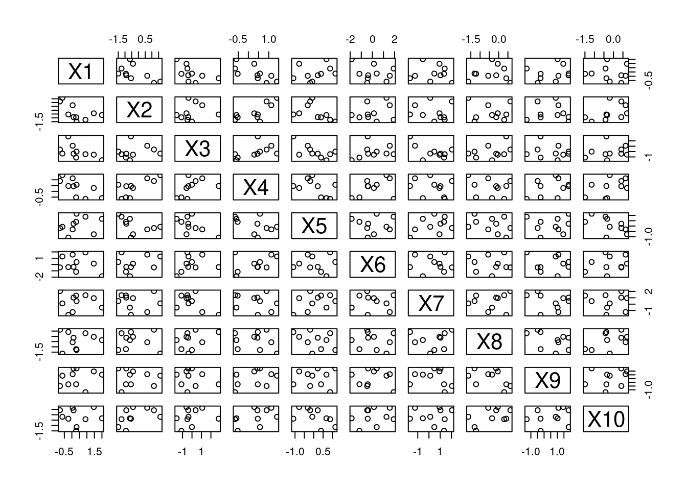
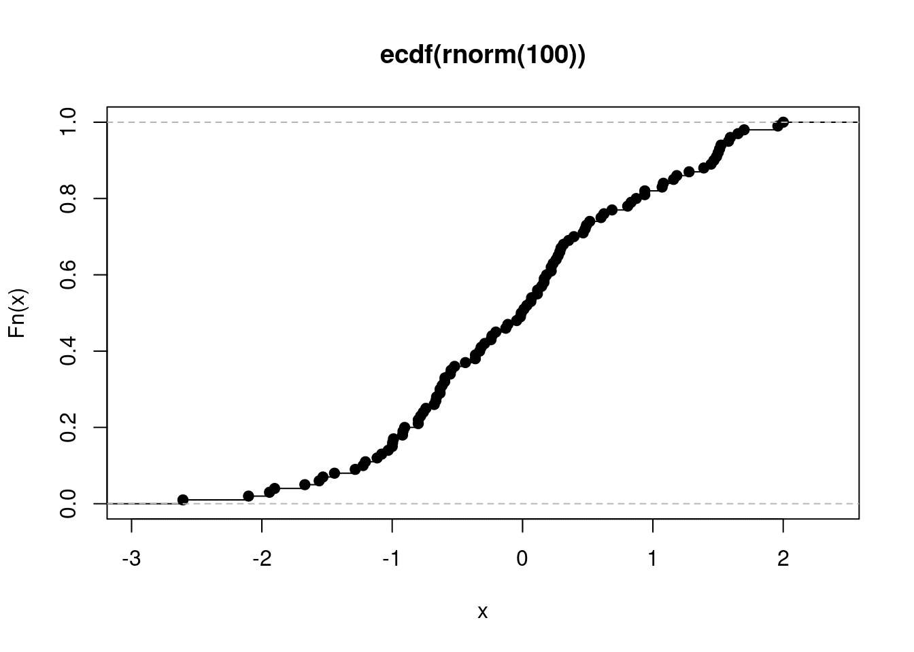

# 第十四章 对面向对象编程的介绍

> 原文：[`randpythonbook.netlify.app/an-introduction-to-object-oriented-programming`](https://randpythonbook.netlify.app/an-introduction-to-object-oriented-programming)

**面向对象编程（OOP）**是一种组织程序的方式。这种方式关注对象。在下一章中，我们将关注通过函数组织程序，但现在我们坚持使用对象。我们已经从上一章了解了对象，那么这里有什么新的内容呢？

差别在于我们现在正在创建自己的**类型**。在上一章中，我们学习了内置类型：浮点数、列表、数组、函数等。现在我们将广泛讨论如何在 R 和 Python 中创建自己的类型。这些用户定义的类型可以用作模具。一旦我们有了模具，我们就可以制作尽可能多的饼干！

我们不会深入探讨这一点，但了解代码的工作原理非常重要，这样我们才能更有效地使用它。例如，在 Python 中，我们经常编写像`my_data_frame.doSomething()`这样的代码。本章的内容将详细描述我们如何创建具有自定义行为的自己的类型。

* * *

这里有一些抽象概念，将有助于思考面向对象编程。它们不是相互排斥的，也不是面向对象编程独有的，但理解这些词汇将有助于你理解面向对象编程的目的。稍后，当我们开始查看代码示例时，我会提醒你这些概念何时开始发挥作用。

+   **组合**指的是一种类型的对象**包含**了另一种类型对象的观念。例如，一个线性模型对象可以保留估计的回归系数、残差等。

+   **继承**发生在对象可以被认为是另一种类型（或多种类型）的情况。例如，方差分析线性回归模型可能是一般线性模型的一个特例。

+   **多态性**是指程序员可以在不同类型的对象上使用相同的代码。例如，R 和 Python 中的内置函数都可以作用于各种不同类型的参数。

+   **封装**是复杂性隐藏的另一种说法。你真的需要理解你使用的包中的每一行代码吗？不，因为很多细节是有意被隐藏起来的。

+   **模块化**是与封装相关的一个概念——它意味着将某物分成独立的片段。你如何将代码分成不同的文件、不同的函数、不同的类——所有这些都涉及到模块化。它促进了封装，并允许你一次只思考几行代码。

+   你和所使用的代码之间的**接口**描述了**可以发生什么**，但并不描述**如何发生**。换句话说，它描述了一些功能，以便你可以决定是否想要使用它，但不足以让你自己实现它。例如，你只需要查阅一些文档就能估计一个复杂的统计模型。²³换句话说，你只需要熟悉接口，而不需要了解实现细节。

+   你所使用的某些代码的**实现**详细描述了它是如何工作的。如果你是包的作者，你可以更改代码的实现“幕后”，理想情况下，最终用户永远不会注意到。

## 14.1 Python 中的面向对象编程

### 14.1.1 概述

在 Python 中，[类](https://docs.python.org/3/tutorial/classes.html)是用户定义的类型。当你定义自己的类时，你描述了它所持有的信息类型以及它的行为方式。

要定义自己的类型，请使用 `class` 关键字([class 定义语法](https://docs.python.org/3/tutorial/classes.html#class-definition-syntax))。使用用户定义的类创建的对象有时被称为**实例**。它们根据类定义中编写的规则行事——它们总是以相同的方式捆绑数据和相关函数，但这些实例并不都具有相同的数据。

为了更清楚，类在其定义中可能有以下两点。

+   **属性（也称为数据成员）**是类创建的实例所“拥有”的数据片段。

+   **(实例)方法**是类创建的实例所“拥有”的函数。它们可以使用和/或修改属于类的数据。

### 14.1.2 第一个例子

这里有一个简单的例子。比如说，我们感兴趣的是从数值数据 $x_1, \ldots, x_n$ 中计算样本均值：$$\begin{equation} \bar{x}_n = \frac{\sum_{i=1}^n x_i}{n}. \end{equation}$$

在 Python 中，我们通常可以使用 `np.average` 非常容易地计算这个数字。然而，这个函数要求我们一次性传递所有数据。如果我们不是在任何给定时间都有所有数据怎么办？换句话说，假设数据是间歇性到达的。我们可能考虑利用样本均值的递归公式。

$$\begin{equation} \bar{x}_n = \frac{(n-1) \bar{x}_{n-1} + x_n}{n} \end{equation}$$

我们如何在 Python 中编写这个程序？一个选择是：我们可能创建一个变量 `my_running_ave`，每次数据点到达后，我们就可以

```py
my_running_ave = 1.0
my_running_ave
## 1.0
my_running_ave = ((2-1)*my_running_ave + 3.0)/2
my_running_ave
## 2.0
my_running_ave = ((3-1)*my_running_ave + 2.0)/3
my_running_ave
## 2.0
```

这有几个问题。每次我们添加一个数据点，公式都会略有变化。每次我们更新平均值，我们必须编写不同的代码行。这增加了出现更多错误的可能性，并使得你的代码不太可能被其他人使用，也更难以理解。如果我们试图编写比移动平均更复杂的代码呢？那会使问题变得更糟。

第二个选择：编写一个包含运行平均值的类，并且它有

1.  一个`update`方法，每次接收到新的数据点时都会更新运行平均值，并且

1.  一个`get_current_xbar`方法，为我们获取最新的信息。

使用我们的代码看起来是这样的：

```py
my_ave = RunningMean() # create running average object
my_ave.get_current_xbar() # no data yet!
my_ave.update(1.) # first data point
my_ave.get_current_xbar() # xbar_1
## 1.0
my_ave.update(3.)  # second data point
my_ave.get_current_xbar()  #xbar_2
## 2.0
my_ave.n   # my_ave.n instead of self.n
## 2
```

Python 有一个约定，即类名应该使用`UpperCamelCase`（例如`RunningMean`）来编写。

这好多了！注意*封装*——当我们查看这段代码时，我们不需要考虑用于处理数据的数学公式。我们只需要输入正确的数据即可。换句话说，*实现*与*接口*是分离的。在这个例子中，接口只是类方法的名称以及它们期望的参数。这就是我们使用此代码所需了解的全部。

在看到这些不熟悉且长的单词后，人们可能会倾向于将这些新想法视为多余的。毕竟，如果你自信能够让你的程序运行起来，为什么还要担心所有这些新概念呢？如果它没有坏，为什么要修复它，对吧？

我敦促你们保持开放的心态，尤其是如果你已经自信地认为自己理解了 R 和 Python 编程的基础。本章的主题更侧重于设计选择。这些材料不会帮助你更快地写出脚本的初稿，但会使你的代码更加出色。即使你开始输入之前需要稍微慢一点，但更深入地思考你的程序将防止错误，并允许更多的人使用你的代码。

类（显然）在使用之前需要定义，所以这里是我们的类定义。

```py
class RunningMean:
 """Updates a running average"""
 def __init__(self):
 self.current_xbar = 0.0
 self.n = 0
 def update(self, new_x):
 self.n += 1
 self.current_xbar *= (self.n-1)
 self.current_xbar += new_x
 self.current_xbar /= self.n
 def get_current_xbar(self):
 if self.n == 0:
 return None
 else:
 return self.current_xbar
```

看起来像`__init__`或以两个下划线开头和结尾的名称的方法被称为**双下划线（double underscore）方法**、**特殊方法**或**魔法方法**。有很多可以利用！更多信息请参阅[这里](https://docs.python.org/3/reference/datamodel.html#special-method-names)。

这里是类定义的详细信息：

1.  定义类方法看起来就像定义函数！主要区别在于第一个参数必须是`self`。如果方法的定义引用了`self`，那么这允许类实例引用其自己的（之前未定义的）数据属性。此外，这些方法定义缩进在类的定义内部。

1.  这个类拥有两个数据属性。一个用于表示到目前为止看到的数据点数量（`n`），另一个用于表示当前的运行平均值（`current_xbar`）。

1.  引用数据成员需要点符号。`self.n`指的是属于任何实例的`n`。这个数据属性可以自由地在由这个类实例化的所有对象之间变化。

1.  `__init__`方法执行在每次实例化任何对象时进行的设置操作。

1.  `update`方法使用上面显示的递归公式提供了核心功能。

1.  `get_current_xbar` 简单地返回当前平均值。在没有任何数据被看到之前调用此函数的情况下，它返回 `None`。

一些你可能感兴趣的事情：

1.  从计算的角度来看，我们永远没有必须保留 *所有* 数据点的内存的要求。我们的数据集可能无限大，而我们的类将只保留一个浮点数和一个整数。

1.  这个例子可以推广到其他统计方法。在数学统计学课程中，你会了解到一大类具有 *充分统计量* 的模型。大多数充分统计量都有类似于上面的递归公式。其次，许多 *时间序列分析* 中的算法都有递归公式，并且通常需要分析大量数据流。它们都可以以类似于上述示例的方式封装到类中。

### 14.1.3 添加继承

我们如何在统计编程中使用继承？继承的一个主要好处是代码重用，因此继承的一个例子是将通用算法作为基类编写，将特定算法作为从基类继承的类。例如，我们可以在 `RunningMean` 类中重用代码，并在各种其他类中。

让我们对生成我们数据的 *参数模型* 做一些假设。假设我假设数据点 $x_1, \ldots, x_n$ 是从具有均值 $\mu$ 和方差 $\sigma²=1$ 的正态分布中抽取的“随机样本”。$\mu$ 被假设为未知（毕竟，这是一个关于 $\mu$ 的区间），为了简单起见，$\sigma²$ 被假设为已知。

对于真实未知总体均值 $\mu$ 的 $95\%$ 置信区间是

$$\begin{equation} \left( \bar{x} - 1.96 \sqrt{\frac{\sigma²}{n}}, \bar{x} + 1.96 \sqrt{\frac{\sigma²}{n}} \right). \end{equation}$$

随着我们获得更多数据（当 $n \to \infty$），区间的宽度会缩小。我们可以编写另一个类，它不仅计算这个区间的中心 $\bar{x}$，还返回区间的端点。

如果我们从头开始编写另一个类，那么我们就需要在 `RunningMean` 的定义中重写我们已有的大量代码。相反，我们将使用 *继承* 的概念。

```py
import numpy as np

class RunningCI(RunningMean):# <-notice what's inside the parentheses
 """Updates a running average and 
 gives you a known-variance confidence interval"""

 def __init__(self, known_var):
 super().__init__()
 self.known_var = known_var

 def get_current_interval(self):
 if self.n == 0:
 return None
 else:
 half_width = 1.96 * np.sqrt(self.known_var / self.n) 
 left_num = self.current_xbar - half_width
 right_num = self.current_xbar + half_width
 return np.array([left_num, right_num])
```

类定义的第一行中的括号表示这个新的类定义是从 `RunningMean` 继承的。在这个新类的定义中，当我提到 `self.current_xbar` 时，Python 知道我在指什么，因为它在基类中定义了。最后，我使用 `super()` 来访问基类的方法，例如 `__init__`。

```py
my_ci = RunningCI(1) # create running average object
my_ci.get_current_xbar() # no data yet!
my_ci.update(1.) 
my_ci.get_current_interval() 
## array([-0.96,  2.96])
my_ci.update(3.) 
my_ci.get_current_interval() 
## array([0.61407071, 3.38592929])
```

这个例子也展示了**多态性**。多态性来自希腊语中的“许多形式”。“形式”在这里意味着“类型”或“类”。如果相同的代码（通常是一个函数或方法）可以作用于不同类型的对象，那么这就是多态的。在这里，`update`方法作用于`RunningCI`类的对象，以及`RunningMean`类的对象。

这有什么用？考虑这个例子。

```py
for datum in time_series:
 for thing in obj_list:
 thing.update(xt)
```

在内部`for`循环中，没有必要包含检查每个`thing`类型的条件逻辑。我们可以更简洁地遍历时间。

```py
for datum in time_series:
 for thing in obj_list:
 if isinstance(thing, class1):
 thing.updatec1(xt)
 if isinstance(thing, class2):
 thing.updatec2(xt)
 if isinstance(thing, class3):
 thing.updatec3(xt)
 if isinstance(thing, class4):
 thing.updatec4(xt)
 if isinstance(thing, class5):
 thing.updatec5(xt)
 if isinstance(thing, class6):
 thing.updatec6(xt)
```

如果将来你添加一个名为`class7`的新类，那么你需要更改这个内部`for`循环，并为该类提供新的代码。

### 14.1.4 在组合中添加

*组合*也使代码重用成为可能。继承确保了基类和派生类之间的“是”关系，而组合促进了“有”关系。有时决定使用哪种技术可能很棘手，尤其是在统计编程方面。

关于上面的例子，你可能会争辩说置信区间不是样本均值的特定类型。相反，它只是*拥有*样本均值。如果你相信这一点，那么你可能会选择基于组合的模型。在组合中，派生类（置信区间类）将与基类（样本均值类）解耦。这种解耦将带来一些影响。一般来说，组合更灵活，但可能会导致更长、更丑陋的代码。

1.  你将失去多态性。

1.  你的代码可能变得不太可重用。

    +   你必须编写任何你想要的派生类方法，因为你没有从基类继承任何方法。例如，你不会自动获得`.update()`或`.get_current_xbar()`方法。如果有大量你希望两个类都有且行为完全相同的方法，这可能会很繁琐。如果有，你就必须重写一大堆方法定义。

    +   另一方面，如果你有行为完全不同的方法，这可能是个好事。你写的每个方法在派生类中都可以有完全不同的行为，即使两个类中的方法名相同。例如，`.update()`在这两个类中可能意味着完全不同的事情。此外，在派生类中，你仍然可以调用基类的`.update()`方法。

1.  多对一的关系更容易处理。通常来说，同时“拥有”多个基类实例比一次性从多个基类继承要容易得多。这一点尤其适用于你计划阅读的这本书是关于编程的唯一一本书时——我完全避开了多重继承的话题！

有时候在采用组合或继承之间做出选择是非常困难的。然而，这个选择应该非常谨慎地做出。如果你做出了错误的选择，并且意识到得太晚，*重构*你的代码可能会非常耗时！

这里是一个使用组合实现的置信区间的示例。请注意，这个类“拥有”一个名为`self.mean`的`RunningMean`实例。这与从`RunningMean`类中*继承*形成对比。

```py
class RunningCI2:
 """Updates a running average and 
 gives you a known-variance confidence interval"""

 def __init__(self, known_var):
 self.mean = RunningMean()
 self.known_var = known_var

 def update(self, new_x): 
 self.mean.update(new_x)

 def get_current_interval(self):
 if self.n == 0:
 return None
 else:
 half_width = 1.96 * np.sqrt(self.known_var / self.n) 
 left = self.mean.get_current_xbar() - half_width
 right = self.mean.get_current_xbar() + half_width
 return np.array([left, right])
```

## 14.2 R 中的面向对象编程

与 Python 不同，R 有许多不同种类的类。在 R 中，创建类的方式不止一种。有很多！我将讨论

+   S3 类，

+   S4 类，

+   引用类，以及

+   R6 类。

如果你喜欢 Python 的面向对象编程，你将喜欢引用类和 R6 类，而 S3 和 S4 类对你来说可能很陌生。

我认为最好按时间顺序了解它们。S3 类是最先出现的，S4 类试图改进这些。引用类依赖于 S4 类，而 R6 类是引用类的改进版本（Wickham 2014）。

### 14.2.1 S3 对象：整体概述

使用 S3（和 S4）对象时，调用方法`print()`看起来不会是这样的。

```py
my_obj.print()
```

相反，它将看起来像这样：

```py
print(my_obj)
```

S3 的主要目标是*多态性*（Grolemund 2014）。我们希望像`print()`、`summary()`和`plot()`这样的函数在传入不同类型的对象时表现不同。打印线性模型应该看起来与打印数据框有很大不同，对吧？因此，我们可以编写如下代码，作为最终用户，我们只需要记住更少的函数，而且“正确”的事情总是会发生。如果你正在编写一个包，这也很好，因为你的用户能够使用他们熟悉的常规函数。例如，我允许我的包`cPseudoMaRg`（Brown 2021）的用户在`cpmResults`类型的对象上调用`print()`。在 13.2 节中，`ggplot2`实例，它们比普通的`numeric` `vector`s 复杂得多，是通过`+`连接在一起的。

```py
# print works on pretty much everything
print(myObj)
print(myObjOfADifferentClass)
print(aThirdClassObject)
```

这之所以可行，是因为这些“高级”函数（如`print()`）会查看其输入，并根据输入的类型选择最合适的函数来调用。`print()`是高级函数。当你运行上述代码的一些部分时，可能不明显`print()`为每个输入选择了哪个具体函数。你还看不到这个过程发生。

最后，请记住，这次讨论仅适用于 S3 对象。尽管如此，并非所有对象都是 S3 对象。要确定对象`x`是否是 S3 对象，请使用`is.object(x)`。

### 14.2.2 使用 S3 对象

使用 S3 对象非常简单，你可能甚至不知道你实际上正在使用它们。你只需尝试在对象上调用函数，查看输出，如果你对此满意，那就行了。然而，如果你曾经问过自己：“为什么`print()`（或另一个函数）总是做不同的事情？”那么这一节对你将很有用。

`print()` 是一个 [**泛型函数**](https://cran.r-project.org/doc/manuals/r-release/R-lang.html#Method-dispatching)，它查看其第一个参数的类型，然后根据该参数的类型调用另一个更专业的函数。R 中的并非所有函数都是泛型，但有些是。除了 `print()` 之外，`summary()` 和 `plot()` 是最普遍的泛型函数。泛型函数是一个**接口**，因为用户不需要关心幕后发生的细节。

在 R 中，**方法**是一个专门为特定类型的输入由泛型函数选择的函数。方法是实现。当泛型函数选择特定方法时，这被称为**方法调度**。

如果查看泛型函数的定义，以 `plot()` 为例，它包含一个调用 `UseMethod()` 的单行。

```py
plot
```

```py
## function (x, y, ...) 
## UseMethod("plot")
## <bytecode: 0x5654afa2fd00>
## <environment: namespace:base>
```

`UseMethod()` 执行方法调度。可以调度哪些方法？要查看，请使用 `methods()` 函数。

```py
length(methods(plot))
```

```py
## [1] 39
```

所有这些 S3 类方法都遵循相同的命名约定。它们的名称以泛型函数的名称为前缀，然后是一个点（`.`），然后是它们特别编写的用于的类的名称。

R 的点符号与 Python 的点符号完全不同！在 R 中，函数不像 Python 那样属于类型/类！

方法调度是通过查看 S3 对象参数的 `class` 属性来工作的。R 中的对象可能具有一组 [**属性**](https://cran.r-project.org/doc/manuals/r-release/R-lang.html#Attributes)，这些属性是一系列名称/值对，为特定对象提供额外的功能。R 中的常规 `vector` 没有属性（例如，尝试运行 `attributes(1:3)`），但“装饰”过的 `vector` 版本可能会有（例如，运行 `attributes(factor(1:3))`）。R 中的属性与 Python 中的属性类似，但它们通常仅用作“标签”，在对象传递给函数时引发某种行为。

如果 `class()` 在非 S3 对象上调用，它将返回误导性的结果。请确保首先使用 `is.object()` 进行检查。

此外，这些方法也不像 Python 那样封装在类定义中。它们看起来就像松散的函数一样——特定类的方法定义不在类内部。这些类方法可以像普通函数一样定义，独立于任何你认为适合定义函数的文件。

例如，让我们尝试 `plot()` 一些特定的对象。

```py
aDF <-  data.frame(matrix(rnorm(100), nrow = 10))
is.object(aDF) # is this s3?
## [1] TRUE
class(aDF)
## [1] "data.frame"
plot(aDF)
```



图 14.1：散点矩阵

因为 `aDF` 的 `class` 被设置为 `data.frame`，这导致 `plot()` 尝试查找 `plot.data.frame()` 方法。如果找不到此方法，R 将尝试查找/使用 `plot.default()` 方法。如果没有默认方法存在，将抛出错误。

作为另一个例子，我们可以用`ecdf()`函数创建的对象来玩耍。这个函数计算一个*经验累积分布函数*，它接受一个实数作为输入，并输出小于或等于该输入的观测比例²⁵。

```py
myECDF <-  ecdf(rnorm(100))
is.object(myECDF)
## [1] TRUE
class(myECDF)
## [1] "ecdf"     "stepfun"  "function"
plot(myECDF)
```



图 14.2：绘制经验累积分布函数

这就是 S3 中*继承*的工作方式。`ecdf`类继承自`stepfun`类，而`stepfun`类又继承自`function`类。当你调用`plot(myECDF)`时，最终会使用`plot.ecdf()`来处理这个对象。然而，如果`plot.ecdf()`不存在，则会尝试使用`plot.stepfun()`。R 中的 S3 继承比 Python 的继承要简单得多！

### 14.2.3 创建 S3 对象

创建 S3 对象非常简单，并且是一种很好的方式来美化你从函数返回的捆绑对象，比如说。你只需要通过改变其类属性来标记对象！只需将一个字符`vector`分配给它！

这里是创建`CoolClass`对象的一个例子。

```py
myThing <-  1:3
attributes(myThing)
## NULL
class(myThing) <- "CoolClass"
attributes(myThing) # also try class(myThing)
## $class
## [1] "CoolClass"
```

`myThing`现在是一个`CoolClass`的实例，尽管我事先从未定义过`CoolClass`是什么！如果你习惯了 Python，这应该看起来非常奇怪。与 Python 相比，这种方法非常灵活，但同时也有些危险，因为你可以改变现有对象的`class`。你不应该这样做，但如果你愿意，你可以。

在你开始创建自己的 S3 对象之后，你可以为这些对象编写自己的方法。这样，当你的代码的用户在 S3 对象上使用典型的通用函数，如`summary()`时，你可以控制你的包用户会发生什么有趣的事情。这里有一个例子。

```py
summary(myThing)
## [1] "No summary available!"
## [1] "Cool Classes are too cool for summaries!"
## [1] ":)"
```

我为这个类编写的`summary()`方法如下。

```py
summary.CoolClass <-  function(object,...){
 print("No summary available!")
 print("Cool Classes are too cool for summaries!")
 print(":)")
}
```

在编写这个时，我保持了与`summary()`相同的签名。

### 14.2.4 S4 对象：整体图景

S4 是在 S3 之后开发的。如果你查看你的搜索路径（输入`search()`），你会看到`package:methods`。那里有你做 S4 所需的所有代码。以下是 S3 和 S4 之间的相似之处和不同之处。

+   他们都使用通用的函数和方法，工作方式相同。

+   与 S3 不同，S4 类允许你使用多态，这意味着通用函数可以在多个参数上分发，而不仅仅是第一个参数。

+   S4 类的定义是严格的——它们不像 S3 那样只是名字标签。

+   S4 继承感觉更像是 Python 的。你可以想象一个基类对象存在于子类对象内部。

+   S4 类可以通过`prototype`s 拥有默认数据成员。

通过阅读[Hadley Wickham 的书中第十五章](https://adv-r.hadley.nz/s4.html)可以获得更多关于 S4 类的信息。

### 14.2.5 使用 S4 对象

一个使用 S4 的 CRAN 包是[Matrix 包](https://cran.r-project.org/web/packages/Matrix/vignettes/Intro2Matrix.pdf)。下面是一个简短且简单的代码示例。

S4 对象在[Bioconductor](https://www.bioconductor.org/)上托管的包中也非常受欢迎。Bioconductor 类似于 CRAN，但其软件在生物信息学方面有更具体的关注。要从 Bioconductor 下载包，您可以查看提供的安装说明[这里](https://bioconductor.org/help/course-materials/2017/Zurich/S4-classes-and-methods.html)。

```py
library(Matrix)
M <-  Matrix(10 +  1:28, 4, 7)
isS4(M)
## [1] TRUE
M
## 4 x 7 Matrix of class "dgeMatrix"
##      [,1] [,2] [,3] [,4] [,5] [,6] [,7]
## [1,]   11   15   19   23   27   31   35
## [2,]   12   16   20   24   28   32   36
## [3,]   13   17   21   25   29   33   37
## [4,]   14   18   22   26   30   34   38
M@Dim
## [1] 4 7
```

在 S4 对象内部，数据成员被称为**插槽**，并且使用`@`运算符（而不是`$`运算符）进行访问。可以使用`isS4()`函数测试对象是否为 S4。否则，它们看起来和感觉就像 S3 对象一样。

### 14.2.6 创建 S4 对象

这里是一些关键要点：

+   使用`setClass()`创建一个新的 S4 类，

+   使用`new()`创建一个新的 S4 对象，

+   S4 类具有固定数量的插槽、一个名称和一个固定的继承结构。

让我们做一个类似于我们在 Python 中做的示例，其中我们定义了一个`RunningMean`类和一个`RunningCI`类。

```py
setClass("RunningMean",
 slots = list(n = "integer", 
 currentXbar = "numeric"))
setClass("RunningCI",
 slots = list(knownVar = "numeric"),
 contains = "RunningMean")
```

在这里，与 S3 类不同，我们实际上需要使用`setClass()`来定义一个类。在 S4 的术语中，`slots=`是一个类的数据成员，而`contains=`表示一个类继承自另一个类（尽管“contains”听起来像是在暗示*组合*）。

在完成这些操作后，可以使用`new()`函数创建新对象。

```py
new("RunningMean", n = 0L, currentXbar = 0)
new("RunningCI", n = 0L, currentXbar = 0, knownVar = 1.0)
```

接下来，我们想要定义一个适用于两种类型对象的`update()`泛型函数。这就是给我们带来*多态性*的原因。泛型`update()`将调用`RunningMean`和`RunningCI`类对象的专用方法。

回想一下，在 Python 示例中，每个类都有自己的更新方法。在这里，我们仍然为每个类有一个专用方法，但 S4 方法不需要在类定义内部定义，如下所示。

```py
## Creating a new generic function for 'update' in the global environment
## [1] "update"
```

```py
setGeneric("update", function(oldMean, newNum) {
 standardGeneric("update")
})
setMethod("update",
 c(oldMean = "RunningMean", newNum = "numeric"),
 function(oldMean, newNum) {
 oldN <-  oldMean@n
 oldAve <-  oldMean@currentXbar
 newAve <-  (oldAve*oldN +  newNum)/(oldN +  1)
 newN <-  oldN +  1L
 return(new("RunningMean", n = newN, currentXbar = newAve))
 }
)
setMethod("update",
 c(oldMean = "RunningCI", newNum = "numeric"),
 function(oldMean, newNum) {
 oldN <-  oldMean@n
 oldAve <-  oldMean@currentXbar
 newAve <-  (oldAve*oldN +  newNum)/(oldN +  1)
 newN <-  oldN +  1L
 return(new("RunningCI", n = newN, currentXbar = newAve, 
 knownVar = oldMean@knownVar))
 }
)
```

这里是使用这两个类的演示，与子节 14.1.3 中的示例类似。

```py
myAve <-  new("RunningMean", n = 0L, currentXbar = 0)
myAve <-  update(myAve, 3)
myAve
## An object of class "RunningMean"
## Slot "n":
## [1] 1
## 
## Slot "currentXbar":
## [1] 3
myAve <-  update(myAve, 1)
myAve
## An object of class "RunningMean"
## Slot "n":
## [1] 2
## 
## Slot "currentXbar":
## [1] 2

myCI <-  new("RunningCI", n = 0L, currentXbar = 0, knownVar = 1.0)
myCI <-  update(myCI, 3)
myCI
## An object of class "RunningCI"
## Slot "knownVar":
## [1] 1
## 
## Slot "n":
## [1] 1
## 
## Slot "currentXbar":
## [1] 3
myCI <-  update(myCI, 1)
myCI
## An object of class "RunningCI"
## Slot "knownVar":
## [1] 1
## 
## Slot "n":
## [1] 2
## 
## Slot "currentXbar":
## [1] 2
```

与 Python 示例相比，这看起来更*函数式*（有关函数式编程的更多信息，请参阅第十五章 15）。因为`update()`函数不会通过副作用改变一个对象。相反，它接受旧对象，对其进行更改，返回新对象，并使用赋值来覆盖对象。这种方法的优点是赋值运算符（`<-`）会向我们发出变化的信号。然而，涉及更多的数据复制，因此程序可能比所需的要慢。

这里最大的收获是 S3 和 S4 不像 Python 的封装面向对象。如果我们想编写有状态的程序，我们可能需要考虑使用引用类，或者 R6 类。

### 14.2.7 引用类：全景

[**引用类**](https://www.rdocumentation.org/packages/methods/versions/3.6.2/topics/ReferenceClasses)建立在 S4 类之上，并于 2010 年底发布。它们与 S3 和 S4 类感觉非常不同，并且它们更接近 Python 类，因为

1.  他们的方法定义被封装在类定义中，就像在 Python 中一样，并且

1.  它们构建的对象是可变的。

因此，它将感觉更像是 Python 的类系统。有些人可能会说使用引用类会导致代码不太像 R 语言风格的代码，但它在某些类型的程序中可能很有用（例如，长时间运行的代码、执行许多/高维/复杂模拟的代码，或者绕过一次性将大量数据集存储在计算机内存中的代码）。

### 14.2.8 创建引用类

创建引用类使用`setRefClass`函数。我创建了一个名为`RunningMean`的类，它产生与上一个示例相同的行为。

```py
RunningMeanRC <-  setRefClass("RunningMeanRC", 
 fields = list(current_xbar = "numeric",
 n = "integer"),
 methods = list(
 update = function(new_x){
 n <<-  n +  1L
 new_sum <-  current_xbar*(n-1) +  new_x
 current_xbar <<-  new_sum/n
 }))
```

这告诉我们一些事情。首先，数据成员现在被称为*字段*。其次，更改类变量使用`<<-`完成。我们可以像以前一样使用它。

```py
my_ave <-  RunningMeanRC$new(current_xbar=0, n=0L)
my_ave
## Reference class object of class "RunningMeanRC"
## Field "current_xbar":
## [1] 0
## Field "n":
## [1] 0
my_ave$update(1.) 
my_ave$current_xbar
## [1] 1
my_ave$n 
## [1] 1
my_ave$update(3.) 
my_ave$current_xbar
## [1] 2
my_ave$n 
## [1] 2
```

比较一下这段代码与 14.1.2 中的代码的相似性！注意赋值运算符的稀少，以及副作用的多。

### 14.2.9 创建 R6 类

我迅速将上述示例实现为一个 R6 类。R6 类的更详细介绍可以在[包作者的 vignette 中找到。](https://r6.r-lib.org/articles/Introduction.html)

你会注意到`self`关键字的再次出现。R6 类有`self`关键字，就像在 Python 中一样。它们类似于引用类，但有一些区别：

1.  它们比引用类有更好的性能，并且

1.  它们没有使用`<<-`运算符。

```py
library(R6)

RunningMeanR6 <-  R6Class("RunningMeanR6",
 public = list(
 current_xbar = NULL,
 n = NULL,
 initialize = function(current_xbar = NA, n = NA) {
 self$current_xbar <-  current_xbar
 self$n <-  n
 },
 update = function(new_x) {
 newSum <-  self$current_xbar*self$n +  new_x
 self$n <-  self$n +  1L
 self$current_xbar <-  newSum /  self$n
 }
 )
)
my_r6_ave <-  RunningMeanR6$new(current_xbar=0, n=0L)
my_r6_ave
## <RunningMeanR6>
##   Public:
##     clone: function (deep = FALSE) 
##     current_xbar: 0
##     initialize: function (current_xbar = NA, n = NA) 
##     n: 0
##     update: function (new_x)
my_r6_ave$update(1.) 
my_r6_ave$current_xbar
## [1] 1
my_r6_ave$n 
## [1] 1
my_r6_ave$update(3.) 
my_r6_ave$current_xbar
## [1] 2
my_r6_ave$n 
## [1] 2
```

## 14.3 练习

### 14.3.1 Python 问题

如果你感兴趣于估计线性回归模型，你可以考虑在`sklearn.linear_model`子模块中使用一个名为`LinearRegression`的类。在这个实验中，我们将创建类似的东西，但稍微简化一些。

一个简单的线性回归模型将接受$n$个独立变量$x_1, \ldots, x_n$和$n$个因变量$y_1, \ldots, y_n$，并尝试用函数描述它们之间的关系：$$\begin{equation} y_i = \beta_0 + \beta_1 x_i + \epsilon_i. \end{equation}$$ 系数$\beta_0$和$\beta_1$是未知的，因此必须用数据估计。估计噪声项$\epsilon_i$的方差也可能很有兴趣，但在这里我们不关心这一点。

估计斜率（即 $\hat{\beta}_1$）和估计截距（即 $\hat{\beta}_0$）的公式如下： $$\begin{equation} \hat{\beta}_1 = \frac{\sum_{i=1}^n (x_i - \bar{x})(y_i-\bar{y)}}{\sum_{j=1}^n (x_j - \bar{x})²} \end{equation}$$

$$\begin{equation} \hat{\beta}_0 = \bar{y} - \hat{\beta}_1\bar{x}. \end{equation}$$

创建一个执行简单线性回归的类。

+   命名为 `SimpleLinReg`。

+   它的 `.__init__()` 方法不应该接受任何额外的参数。它应该设置两个数据属性/成员 `est_intercept` 和 `est_slope`，为 `np.nan`。

+   给它一个 `.fit()` 方法，它接受两个一维 Numpy 数组。第一个应该是独立值的数组，第二个应该是依赖值的集合。

+   `.fit(x,y)` 不应该 `return` 任何内容，但它应该存储两个数据属性/成员：`est_intercept` 和 `est_slope`。每次调用 `.fit()` 时，它将重新计算系数/参数估计。

+   给它一个 `.get_coeffs()` 方法。它不应该对类的数据属性/成员做出任何更改。它应该简单地 `return` 一个包含参数估计的 Numpy 数组。第一个元素是估计的截距，第二个元素是估计的斜率。如果在调用时尚未估计出这样的系数，它应该返回相同大小的数组，但内部包含初始的 `np.nan`。

在你完成第一个类编写之后，你可以沉浸在这份荣耀之中，并运行以下测试代码：

```py
mod = SimpleLinReg()
mod.get_coeffs()
x = np.arange(10)
y = 1 + .2 * x + np.random.normal(size=10)
mod.fit(x,y)
mod.get_coeffs()
```

重新考虑上述问题，要求你编写一个名为 `SimpleLinReg` 的类。

+   编写一个新的类 `LinearRegression2`，保留 `SimpleLinReg` 的所有现有功能。以不大量复制粘贴 `SimpleLinReg` 中的代码的方式完成此操作。

+   给你的新类添加一个名为 `.visualize()` 的方法，该方法不接受任何参数，并绘制最近的数据，即最近提供给 `.fit()` 的数据，在散点图上叠加估计的回归线。

+   不幸的是，`SimpleLinReg().fit(x,y).get_coeffs()` 不会返回估计的回归系数。给你的新类这个功能。换句话说，使 `LinearRegression2().fit(x,y).get_coeffs()` 输出回归系数。提示：解决方案只需要一行额外的代码，并且应该涉及 `self` 关键字。

考虑以下时间序列模型（West 和 Harrison 1989） $$\begin{equation} y_t = \beta_t + \epsilon_t \\ \beta_t = \beta_{t-1} + w_t \\ \beta_1 = w_1 \end{equation}$$ 这里 $y_t$ 是观察到的时序数据，每个 $\epsilon_t$ 是测量噪声，方差为 $V$，每个 $w_t$ 也是噪声，但方差为 $W$。将 $\beta_t$ 视为时间变化的回归系数。

假设我们的数据是按顺序到达的。**卡尔曼滤波器**（Kalman 1960）提供了一种“最优”估计，给定我们到时间 $t$ 所有的信息，对每个 $\beta_t$ 进行估计。更好的是，该算法是递归的。给定我们对 $\beta_{t-1}$ 的估计，未来对 $\beta_t$ 的估计将很容易计算。

让我们称 $\beta_{t-1}$ 的均值（给定到时间 $t-1$ 的所有信息）为 $m_{t-1}$，以及 $\beta_{t-1}$ 的方差（给定到时间 $t-1$ 的所有信息）为 $P_{t-1}$。那么，这个特定模型的卡尔曼递归为

$$\begin{equation} M_t = M_{t-1} + \left(\frac{P_{t-1} + W}{P_{t-1} + W+V} \right)(y_t - M_{t-1}) \end{equation}$$

$$\begin{equation} P_t = \left(1 - \frac{P_{t-1} + W}{P_{t-1} + W+V} \right)(P_{t-1} + W) \end{equation}$$ 对于 $t \ge 1$。

+   编写一个名为 `TVIKalman` 的类（TVI 代表时变截距）。

+   `TVIKalman` 的 `.__init__()` 方法中按此顺序接受两个浮点数：`V` 和 `W`。这两个数都是正数，是模型的方差参数。存储这两个数。此外，将 `0` 和 `W+V` 分别存储为名为 `filter_mean` 和 `filter_variance` 的成员/属性。

+   给 `TVIKalman` 添加另一个方法：`.update(yt)`。这个函数不应该返回任何内容，但它应该根据新的数据点更新滤波分布的均值和方差数值，即 `filter_mean` 和 `filter_variance`。

+   给 `TVIKalman` 添加另一个方法：`.get_confidence_interval()`。它不接受任何参数，并应返回一个长度为两的 Numpy 数组。该数组的有序元素应该是 $M_t$ 加上和减去两个标准差——时间 $t$ 的标准差是 $\sqrt{P_t}$。

+   创建一个名为 `results` 的 `DataFrame`，包含三个列，分别命名为 `yt`、`lower` 和 `upper`。最后两列应该是你编写的方法给出的置信区间序列。第一列应包含以下数据：`[-1.7037539, -0.5966818, -0.7061919, -0.1226606, -0.5431923]`。将所有三列绘制在单行图中。使用 `V` 和 `W` 都设置为 $.5$ 的值初始化你的卡尔曼滤波器对象。

### 14.3.2 R 问题

以下哪个 R 类可以产生可变对象？选择所有适用的：S3、S4、引用类和 R6。

以下哪个 R 类可以产生具有方法的对象？选择所有适用的：S3、S4、引用类和 R6。

以下哪个 R 类可以产生可以存储数据的对象？选择所有适用的：S3、S4、引用类和 R6。

以下哪个 R 类具有封装定义？选择所有适用的：S3、S4、引用类和 R6。

以下哪个 R 类具有“槽”？选择所有适用的：S3、S4、引用类和 R6。

以下哪个 R 类系统是最新的？S3、S4、引用类还是 R6？

在 R 中，以下哪个类系统是最古老的？S3、S4、引用类还是 R6？

在 R 中，以下哪个类需要你在某处使用 `library()`？选择所有适用的：S3、S4、引用类和 R6。

假设你有一个以下数据集：$X_1, \ldots, X_n$。你假设它是一个来自具有未知均值和方差参数的正态分布的随机样本，分别用 $\mu$ 和 $\sigma²$ 表示。考虑在显著性水平 $\alpha$ 下检验 $\mu = 0$ 的零假设。为了进行这项测试，你计算 $$\begin{equation} t = \frac{\bar{X}}{S/\sqrt{n}} \end{equation}$$ 并且如果 $|t| > t_{n-1,\alpha/2}$，则拒绝零假设。这是 **Student 的 t 检验** (Student 1908)。这里 $S² = \sum_i(X_i - \bar{X})² / (n-1)$ 是样本方差，而 $t_{n-1,\alpha/2}$ 是具有 $n-1$ 个自由度的 t 分布的 $1-\alpha/2$ 分位数。

+   编写一个名为 `doTTest()` 的函数，该函数执行上述假设测试。它应接受两个参数：`dataVec`（数据向量）和 `significanceLevel`（这是 $\alpha$）。第二个参数默认为 `.05`。

+   让它返回一个由 `list` 创建的 S3 对象。这个 `list` 的 `class` 应该是 `"TwoSidedTTest"`。`list` 中的元素应该命名为 `decision` 和 `testStat`。`decision` 对象应该是 `"reject"` 或 `"fail to reject"`。测试统计量应该等于你上面计算的 $t$ 值。

+   为你创建的新类 `TwoSidedTTest` 创建一个 `summary` 方法。

假设你有一个目标密度 $p(x)$，你只能评估到归一化常数。换句话说，假设对于某个 $c > 0$，$p(x) = f(x) / c$，而你只能评估 $f(\cdot)$。你的目标是能够使用某个建议分布 $q(x)$ 近似 $p(x)$ 的期望值（即 $\int x p(x) dx$）。$q(x)$ 是灵活的，因为你可以从中采样，并且可以评估它。我们将使用 **重要性抽样** (H. Kahn 1950) (H Kahn 1950) 来实现这一点。²⁶

**算法 1**: 重要性抽样 i) 从 $q(x)$ 中采样 $X¹, \ldots, X^n$，ii. 对于每个样本 $x^i$，计算未归一化权重 $\tilde{w}^i:= \frac{f(x^i)}{q(x^i)}$，iii. 计算归一化权重 $w^i = \tilde{w}^i \bigg/ \sum_j \tilde{w}^j$。iv. 计算加权平均值 $\sum_{i=1}^n w^i x^i$。

在实践中，使用对数密度是有益的，因为它将避免下溢问题。在你评估每个 $\log \tilde{w}^i$ 之后，在你对它们进行指数化之前，从所有值中减去一个数字 $m$。$m$ 的一个好选择是 $\max_i (\log \tilde{w}^i)$。这些新值将产生相同的归一化权重，因为

$$\begin{equation} w^i = \exp[ \log \tilde{w}^i - m] \bigg/ \sum_j \exp[\log \tilde{w}^j - m]. \end{equation}$$

+   创建一个名为 `ImpSamp` 的 R6 类，用于执行重要性采样。

+   它应该存储函数数据值 `qSamp`、`logQEval` 和 `logFEval`。

+   给它一个 `initialize()` 方法，该方法接受三个参数：`logFEvalFunc`、`qSampFunc` 和 `logQEvalFunc`。

+   `initialize()` 方法将存储的函数值设置为传入的函数对象。

+   执行随机采样的函数应仅接受一个参数，表示所需的样本数。

+   评估函数应该接受一个 `vector` 作为输入，并返回一个 `vector` 作为输出。

+   编写一个名为 `computeApproxExpec` 的方法，该方法计算并返回 $\int x p(x) dx$ 的重要性采样估计。此方法应接受一个整数参数，表示用于计算的所需样本数。

+   是将此代码设计为面向对象更好，还是你更倾向于一个简单的输出答案的函数？为什么？

### 参考文献

Brown, Taylor. 2021. *CPseudoMaRg: Constructs a Correlated Pseudo-Marginal Sampler*. [`CRAN.R-project.org/package=cPseudoMaRg`](https://CRAN.R-project.org/package=cPseudoMaRg).

Grolemund, G. 2014. *动手编程 R：编写自己的函数和模拟*. O’Reilly Media. [`books.google.com/books?id=S04BBAAAQBAJ`](https://books.google.com/books?id=S04BBAAAQBAJ).

Kahn, H. 1950. “中子衰减问题中的随机采样（蒙特卡洛）技术–I.” *Nucleonics* 6 5.

Kahn, H. 1950. “中子衰减问题中的随机采样（蒙特卡洛）技术–II.” *Nucleonics (U.S.) Ceased Publication* Vol: 6, No. 6 (June). [`www.osti.gov/biblio/4399718`](https://www.osti.gov/biblio/4399718).

Kalman, R. E. 1960. “一种新的线性滤波和预测问题方法.” *Journal of Basic Engineering* 82 (1): 35–45\. [`doi.org/10.1115/1.3662552`](https://doi.org/10.1115/1.3662552).

学生. 1908. “平均数的可能误差.” *Biometrika*, 1–25.

West, Michael A. 和 Jeff Harrison. 1989. “贝叶斯预测和动态模型.” In.

Wickham, H. 2014. *高级 R*. Chapman & Hall/Crc the R Series. Taylor & Francis. [`books.google.com/books?id=PFHFNAEACAAJ`](https://books.google.com/books?id=PFHFNAEACAAJ).

* * *

1.  虽然你可以这样做，但这并不意味着你应该这样做

1.  也称为独立同分布样本↩

1.  它被定义为 $\hat{F}(x) = \frac{1}{n}\sum_{i=1}^n \mathbf{1}(X_i \le x)$。↩

1.  注意，这与我们之前遇到的接受-拒绝采样问题类似，并且这个算法与我们在第三章练习中使用的蒙特卡洛算法密切相关。↩
