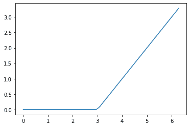
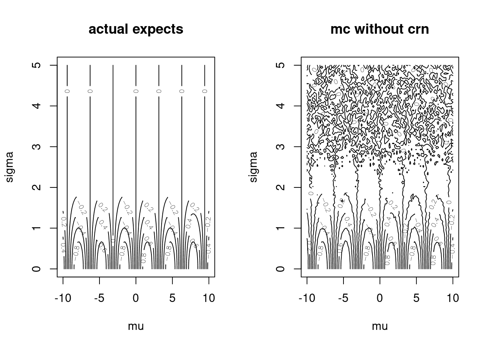
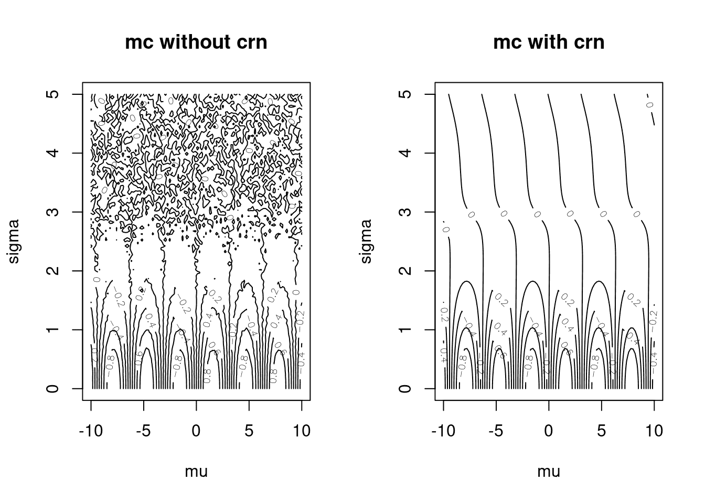

# 第十五章 函数式编程简介

> 原文：[`randpythonbook.netlify.app/an-introduction-to-functional-programming`](https://randpythonbook.netlify.app/an-introduction-to-functional-programming)

**函数式编程 (FP)** 是另一种思考如何组织程序的方法。我们在上一章（第十四章节中）讨论了 OOP——另一种组织程序的方法。那么 OOP 和 FP 有何不同？简单来说，FP 专注于函数而不是对象。因为我们本章会大量讨论函数，所以我们将假设你已经阅读并理解了第六章的内容。

R 和 Python 都不是纯函数式语言。对我们来说，FP 是一种我们可以选择让其引导我们的风格，或者我们可以忽略的风格。你可以选择采用更函数式的风格，或者选择使用更面向对象的风格，或者两者都不选。有些人倾向于偏好一种风格而不是其他风格，而其他人则倾向于根据手头的任务来决定使用哪种风格。

更具体地说，函数式编程风格利用 **一等函数** 并倾向于使用 **纯** 函数。

1.  **一等函数**是（Abelson 和 Sussman 1996）函数，它们

    +   可以作为参数传递给其他函数，

    +   可以从其他函数返回，并且

    +   可以分配给变量或存储在数据结构中。

1.  **纯函数**

    +   如果给定相同的输入，则返回相同的输出，并且

    +   不会产生 **副作用**。

副作用是对非临时变量或程序“状态”所做的更改。

我们在第六章的开头讨论了（1）。如果你之前没有使用过任何其他编程语言，你甚至可能认为（1）是理所当然的。然而，在其他未在本文本中提到的语言中使用一等函数可能会有困难。

关于定义（2）还有更多要说的。这意味着你应该尽可能使你的函数保持 *模块化*，除非你希望你的整体程序更难以理解。FP 规定，

+   **理想情况下，函数将不会引用非局部变量；**

+   **理想情况下，函数将不会（引用和）修改非局部变量；并且**

+   **理想情况下，函数将不会修改它们的参数。**

不幸的是，违反这三个标准中的第一个在我们的两种语言中都很容易做到。回想一下我们在子节 6.8 中关于 *动态查找* 的讨论。R 和 Python 都使用动态查找，这意味着你无法可靠地控制函数查找变量的时间。变量名中的错误很容易被忽视，而修改过的全局变量可能会对你的整体程序造成潜在的破坏。

幸运的是，在 R 和 Python 中修改函数内的全局变量都很困难。这一点在子节 6.8 中也有讨论。在 Python 中，你需要使用 `global` 关键字（在 6.7.2 节中提到），而在 R 中，你需要使用罕见的超级赋值运算符（看起来像 `<<-`，在 6.7.1 节中提到过）。由于这两个符号非常罕见，它们可以作为信号，让代码的阅读者了解何时以及在哪里（在哪个函数中）修改了全局变量。

最后，违反第三个标准在 Python 中很容易，而在 R 中很难。这一点在 6.7 节中已有讨论。Python 可以修改/改变具有可变类型的参数，因为它具有*按赋值传递*的语义（在 6.7.2 节中提到），而 R 通常无法修改其参数，因为它具有*按值传递*的语义 6.7.1。

本章避免了关于 FP 的哲学讨论。相反，它采用应用方法，并提供如何在你的程序中使用 FP 的说明。我试图给出如何使用 FP 的例子，以及何时这些工具特别合适。

如果你需要多次评估单个函数，或者以许多不同的方式评估，那么这就是使用函数式编程的一个明显迹象。这在统计计算中相当常见。与其复制粘贴类似外观的代码行，你可能会考虑使用*高阶*函数，这些函数将你的函数作为输入，并以你想要的所有多种方式智能地调用它。你也可以考虑的第三种选择是使用循环（参看 11.2）。然而，这种方法并不非常函数式，因此在本节中不会过多讨论。

如果你需要许多不同的函数，而这些函数都“相关”于彼此，那么这也是你需要 FP 的一个迹象。你应该分别定义每个函数，使用过度的复制粘贴吗？或者你应该编写一个可以优雅地生成你需要的任何函数的函数？

不重复自己和重用代码是主要动机，但并非唯一。关于**函数式编程**的另一个动机在 [高级 R](https://adv-r.hadley.nz/fp.html)²⁷ 中有明确的解释：

> 函数式风格倾向于创建可以很容易独立分析的函数（即仅使用局部信息），因此通常更容易自动优化或并行化。

所有这些听起来都是我们代码中应该拥有的好东西，所以让我们从一些示例开始吧！

## 15.1 R 中的函数作为函数输入

R 中最常用的功能中，许多以“apply”结尾。我讨论的是`sapply()`、`vapply()`、`lapply()`、`apply()`、`tapply()`和`mapply()`。这些中的每一个都接受一个函数作为其参数之一。回想一下，这是由于 R 具有一等函数的事实而成为可能的。

### 15.1.1 `sapply()`和`vapply()`

假设我们有一个有 10 行和 100 列的`data.frame`。如果我们想计算每一列的平均值呢？

做这件事的一个业余方式可能如下所示。

```py
myFirstMean <-  mean(myDF[,1])
mySecondMean <-  mean(myDF[,2])
# ... so on and so forth ..
myHundredthMean <-  mean(myDF[,100])
```

你需要为数据框中的每一列编写一行代码！对于有很多列的数据框，这会变得相当繁琐。你也应该问问自己，当数据框即使有轻微的变化，或者你想对其列应用不同的函数时，会发生什么。第三，结果不会存储在单个容器中。如果你想在后续的代码中使用这些变量，这会让你自己变得很麻烦。

“不要重复自己”（DRY）是一个存在已久的想法，并且被广泛接受（Hunt 和 Thomas 2000）。DRY 是[WET](https://en.wikipedia.org/wiki/Don%27t_repeat_yourself#WET)的对立面。

相反，在这种情况下，最好使用`sapply()`。`sapply()`中的“s”代表“simplified”。在这段代码中，`mean()`被调用在每个数据框的列上。`sapply()`在列上应用函数，而不是在行上，因为数据框在内部是一个列的`list`。

```py
myMeans <-  sapply(myDF, mean)
myMeans[1:5]
##          X1          X2          X3          X4          X5 
##  0.18577292  0.58759539 -0.05194271 -0.07027537 -0.35365358
```

每次调用`mean()`都会返回一个长度为$1$的`double` `vector`。如果你想将所有结果收集到一个`vector`中，请记住，`vector`的所有元素必须具有相同的类型。为了获得相同的行为，你也可以考虑使用`vapply(myDF, mean, numeric(1))`。

在上述情况下，“simplify”指的是如何将一百个长度为$1$的向量简化为一个长度为$100$的`vector`。然而，“simplified”并不一定意味着所有元素都会存储在`vector`中。考虑`summary`函数，它返回一个长度为$6$的`double` `vector`。在这种情况下，一百个长度为$6$的向量被简化为一个$6 \times 100$的矩阵。

```py
mySummaries <-  sapply(myDF, summary)
is.matrix(mySummaries)
## [1] TRUE
dim(mySummaries)
## [1]   6 100
```

另一个值得提到的函数是`replicate()`，它是`sapply()`的包装器。考虑这样一个情况，你想要多次以相同的输入调用一个函数。你可能尝试以下操作：`sapply(1:100, function(elem) { return(myFunc(someInput)) } )`。另一种更易读的方法是`replicate(100, myFunc(someInput))`。

### 15.1.2 `lapply()`

对于不返回适合放入`vector`、`matrix`或`array`的类型的函数，它们可能需要存储在`list`中。在这种情况下，你需要使用`lapply()`。`lapply()`中的“l”代表`list`。`lapply()`总是返回一个与`input`长度相同的`list`。

```py
regress <-  function(y){ lm(y ~  1) }
myRegs <-  lapply(myDF, regress)
length(myRegs)
## [1] 100
class(myRegs[[1]])
## [1] "lm"
summary(myRegs[[12]])
## 
## Call:
## lm(formula = y ~ 1)
## 
## Residuals:
##     Min      1Q  Median      3Q     Max 
## -1.6149 -0.8692 -0.2541  0.7596  2.5718 
## 
## Coefficients:
##             Estimate Std. Error t value Pr(>|t|)
## (Intercept)   0.2104     0.4139   0.508    0.623
## 
## Residual standard error: 1.309 on 9 degrees of freedom
```

### 15.1.3 `apply()`

我个人最常用的是`sapply()`和`lapply()`。接下来最常用的函数是`apply()`。你可以用它来将函数应用于矩形数组的*行*而不是列。然而，它也可以像我们讨论的其他函数一样，对列应用函数。²⁸

```py
dim(myDF)
## [1]  10 100
results <-  apply(myDF, 1, mean)
results[1:4]
## [1]  0.18971263 -0.07595286  0.18400138  0.08895979
```

另一个例子是，当需要将函数应用于行时，这可能会很有用。谓词函数只是对返回布尔值的函数的一个花哨名称。我使用它们来过滤`data.frame`的行。没有谓词函数，过滤行可能看起来像这样在我们的房地产数据中（阿勒格尼县地理信息服务办公室 2021)（福特 2016)。

```py
albRealEstate <-  read.csv("data/albemarle_real_estate.csv")
firstB <-  albRealEstate$YearBuilt ==  2006 
secondB <-  albRealEstate$Condition == "Average"
thirdB <-  albRealEstate$City == "CROZET"
subDF <-  albRealEstate[(firstB &  secondB) |  thirdB,]
str(subDF, strict.width = "cut")
## 'data.frame':    3865 obs. of  12 variables:
##  $ YearBuilt    : int  1769 1818 2004 2006 2004 1995 1900 1960 ..
##  $ YearRemodeled: int  1988 1991 NA NA NA NA NA NA NA NA ...
##  $ Condition    : chr  "Average" "Average" "Average" "Average" ..
##  $ NumStories   : num  1.7 2 1 1 1.5 2.3 2 1 1 1 ...
##  $ FinSqFt      : int  5216 5160 1512 2019 1950 2579 1530 800 9..
##  $ Bedroom      : int  4 6 3 3 3 3 4 2 2 2 ...
##  $ FullBath     : int  3 4 2 3 3 2 1 1 1 1 ...
##  $ HalfBath     : int  0 1 1 0 0 1 0 0 0 0 ...
##  $ TotalRooms   : int  8 11 9 10 8 8 6 4 4 4 ...
##  $ LotSize      : num  5.1 453.9 42.6 5 5.5 ...
##  $ TotalValue   : num  1096600 2978600 677800 453200 389200 ...
##  $ City         : chr  "CROZET" "CROZET" "CROZET" "CROZET" ...
```

复杂的过滤条件可能会变得相当宽泛，所以我更倾向于将上述代码分成三个步骤。

+   第 1 步：编写一个返回 TRUE 或 FALSE 的谓词函数；

+   第 2 步：通过`apply()`函数对行应用谓词来构建一个`逻辑`向量；

+   第 3 步：将`逻辑`向量插入到`[`运算符中以删除行。

```py
pred <-  function(row){
 yrBuiltCorrect <-  row['YearBuilt'] ==  2006
 aveCond <-  row['Condition'] == "Average"
 inCrozet <-  row['City'] == "CROZET"
 ( yrBuiltCorrect &&  aveCond) ||  inCrozet 
}
whichRows <-  apply(albRealEstate, 1, pred)
subDF <-  albRealEstate[whichRows,]
str(subDF, strict.width = "cut")
## 'data.frame':    3865 obs. of  12 variables:
##  $ YearBuilt    : int  1769 1818 2004 2006 2004 1995 1900 1960 ..
##  $ YearRemodeled: int  1988 1991 NA NA NA NA NA NA NA NA ...
##  $ Condition    : chr  "Average" "Average" "Average" "Average" ..
##  $ NumStories   : num  1.7 2 1 1 1.5 2.3 2 1 1 1 ...
##  $ FinSqFt      : int  5216 5160 1512 2019 1950 2579 1530 800 9..
##  $ Bedroom      : int  4 6 3 3 3 3 4 2 2 2 ...
##  $ FullBath     : int  3 4 2 3 3 2 1 1 1 1 ...
##  $ HalfBath     : int  0 1 1 0 0 1 0 0 0 0 ...
##  $ TotalRooms   : int  8 11 9 10 8 8 6 4 4 4 ...
##  $ LotSize      : num  5.1 453.9 42.6 5 5.5 ...
##  $ TotalValue   : num  1096600 2978600 677800 453200 389200 ...
##  $ City         : chr  "CROZET" "CROZET" "CROZET" "CROZET" ...
```

### 15.1.4 `tapply()`

`tapply()`在需要时非常有用。首先，我们之前在子节 8.1 中提到了定义，但一个**锯齿状数组**是一系列可能具有不同长度的数组。我通常不会构建这样的对象并将其传递给`tapply()`。相反，我让`tapply()`为我构建锯齿状数组。它期望的第一个参数通常是“类似向量的”，而第二个参数告诉我们如何将那个`向量`分成块。第三个参数是一个函数，它被应用于每个`向量`块。

如果我想得到每个城市的平均房价，我可以使用类似这样的方法。

```py
str(albRealEstate, strict.width = "cut")
## 'data.frame':    30381 obs. of  12 variables:
##  $ YearBuilt    : int  1769 1818 2004 2006 2004 1995 1900 1960 ..
##  $ YearRemodeled: int  1988 1991 NA NA NA NA NA NA NA NA ...
##  $ Condition    : chr  "Average" "Average" "Average" "Average" ..
##  $ NumStories   : num  1.7 2 1 1 1.5 2.3 2 1 1 1 ...
##  $ FinSqFt      : int  5216 5160 1512 2019 1950 2579 1530 800 9..
##  $ Bedroom      : int  4 6 3 3 3 3 4 2 2 2 ...
##  $ FullBath     : int  3 4 2 3 3 2 1 1 1 1 ...
##  $ HalfBath     : int  0 1 1 0 0 1 0 0 0 0 ...
##  $ TotalRooms   : int  8 11 9 10 8 8 6 4 4 4 ...
##  $ LotSize      : num  5.1 453.9 42.6 5 5.5 ...
##  $ TotalValue   : num  1096600 2978600 677800 453200 389200 ...
##  $ City         : chr  "CROZET" "CROZET" "CROZET" "CROZET" ...
length(unique(albRealEstate$City))
## [1] 6
tapply(albRealEstate$TotalValue, list(albRealEstate$City), mean)[1:4]
## CHARLOTTESVILLE          CROZET     EARLYSVILLE         KESWICK 
##        429926.5        436090.5        482711.4        565985.1
```

你可能会想知道为什么我们将`albRealEstate$City`放入一个`list`中。这似乎有点不必要。这是因为`tapply()`可以与多个`factor`s 一起使用——这将把`向量`输入分解成更细的分区。然而，第二个参数必须是一个对象，所以所有这些`factor`s 都必须收集到一个`list`中。以下代码生成一个“交叉表”。

```py
pivTable <-  tapply(albRealEstate$TotalValue, 
 list(albRealEstate$City, albRealEstate$Condition), 
 mean)
pivTable[,1:5]
##                  Average Excellent     Fair     Good     Poor
## CHARLOTTESVILLE 416769.9  625887.9 306380.7 529573.4 304922.4
## CROZET          447585.8  401553.5 241568.8 466798.5 224516.2
## EARLYSVILLE     491269.6  492848.4 286980.0 522938.5 250773.3
## KESWICK         565994.3  664443.5 274270.4 676312.6 172425.0
## NORTH GARDEN    413788.8  529108.3 164646.2 591502.8 161460.0
## SCOTTSVILLE     286787.4  534500.0 196003.4 415207.5 183942.3
```

对于返回高维输出的函数，你必须使用类似`by()`或`aggregate()`的东西来代替`tapply()`。

### 15.1.5 `mapply()`

`[mapply()]`的[文档](https://stat.ethz.ch/R-manual/R-devel/library/base/html/mapply.html)说明`mapply()`是`sapply()`的多变量版本。`sapply()`与单变量函数一起工作；函数被多次调用，但每次只带一个参数。如果你有一个需要多个参数的函数，并且你希望这些参数在每次函数调用时都改变，那么你可能能够使用`mapply()`。

这里有一个简短的例子。关于`rnorm()`函数的`n=`参数，文档解释说，“如果`length(n) > 1`，长度被认为是所需的数量。”如果我们想从均值为$0$的正态分布中抽取三次，然后从均值为$100$的正态分布中抽取两次，然后第三次，从均值为$42$的正态分布中抽取一次，我们会得到三个样本，而我们想要的是六个样本！

```py
rnorm(n = c(3,2,1), mean = c(0,100,42), sd = c(.01, .01, .01))
```

```py
## [1]  0.01435773 99.99238144 42.01743548
```

```py
mapply(rnorm, n = c(3,2,1), mean = c(0,100,42), sd = c(.01, .01, .01))
```

```py
## [[1]]
## [1] -0.0122999207 -0.0064744814 -0.0002297629
## 
## [[2]]
## [1] 100.02077  99.99853
## 
## [[3]]
## [1] 41.99704
```

### 15.1.6 `Reduce()`和`do.call()`

与其他接受其他函数作为输入的函数示例不同，`Reduce()`和`do.call()`没有很多输出。它们不是将许多输出收集到一个容器中，而是只输出一个东西。

让我们从例子开始：“合并”数据集。在第十二部分中，我们讨论了几种不同的合并数据集的方法。我们讨论了使用`rbind()`（参看子节 12.2）将数据集堆叠在一起，使用`cbind()`（也在 12.2）将它们并排堆叠，以及使用`merge()`（参看 12.3）智能地合并它们。

现在考虑合并*多个*数据集的任务。我们如何将三个或更多数据集合并成一个？另外，我们如何编写 DRY 代码并遵守 DRY 原则？正如子节名称所暗示的，我们可以使用`Reduce()`或`do.call()`作为高阶函数。就像前面提到的`*apply()`函数一样，它们接受`cbind()`、`rbind()`或`merge()`作为函数输入。那么我们选择哪一个呢？这个问题的答案涉及到*我们的低阶函数接受多少个参数*。

看看`rbind()`函数的文档。它的第一个参数是`...`，这是[省略号](https://cran.r-project.org/doc/manuals/r-release/R-lang.html#Dot_002ddot_002ddot)符号。这意味着`rbind()`可以接受不同数量的`data.frame`来堆叠在一起。换句话说，`rbind()`是**可变参数**的。

另一方面，看看`merge()`函数的文档。它一次只接受两个`data.frame`²⁹。如果我们想合并多个数据集，`merge()`需要一个辅助函数。

这就是`Reduce()`和`do.call()`之间的区别。`do.call()`一次在多个参数上调用一个函数，因此它的函数必须能够处理多个参数。另一方面，`Reduce()`在多个参数对的组合上多次调用二元函数。`Reduce()`的函数参数首先在第一个两个元素上调用，然后是第一个输出和第三个元素，接着是第二个输出和第四个元素，以此类推。

这里有一个初始示例，它使用了四个数据集 `d1.csv`、`d2.csv`、`d3.csv` 和 `d4.csv`。首先，问问自己我们如何读取所有这些数据。有一种诱惑是复制粘贴 `read.csv` 调用，但这会违反 DRY 原则。相反，让我们使用 `lapply()` 和一个匿名函数来构造文件路径字符串，然后使用它来读取该字符串所引用的数据集。

```py
numDataSets <-  4
dataSets <-  paste0("d",1:numDataSets)
dfs <-  lapply(dataSets, 
 function(name) read.csv(paste0("data/", name, ".csv")))
head(dfs[[3]])
##   id obs3
## 1  a    7
## 2  b    8
## 3  c    9
```

注意，如果我们想要增加读取的数据集数量，上述代码只需要更改一个字符

接下来，将它们全部 `cbind()` 在一起可以这样做。`do.call()` 将只调用一次函数。`cbind()` 一次可以接受多个参数，所以这可行。这段代码甚至比上面的代码更好，因为如果 `dfs` 变长或发生任何变化，*则不需要进行任何更改*。

```py
do.call(cbind, dfs) # DRY! :)
##   id obs1 id obs2 id obs3 id obs4
## 1  a    1  b    5  a    7  a   10
## 2  b    2  a    4  b    8  b   11
## 3  c    3  c    6  c    9  c   12
# cbind(df1,df2,df3,df4) # WET! :(
```

如果我们想要将这些数据集 `merge()` 在一起呢？毕竟，`id` 列似乎在重复，而且 `d2` 中的某些数据没有对齐。

```py
Reduce(merge, dfs)
##   id obs1 obs2 obs3 obs4
## 1  a    1    4    7   10
## 2  b    2    5    8   11
## 3  c    3    6    9   12
```

再次强调，这是一段非常遵循 DRY（Don't Repeat Yourself）原则的代码。如果 `dfs` 增长，则不需要进行任何更改。此外，尝试使用 `do.call()` 调用 `merge()` 函数不会起作用，因为它一次只能处理两个数据集。

## 15.2 Python 中的函数作为函数输入

### 15.2.1 基础 Python 中的函数作为函数输入

我讨论了两个来自基础 Python 的函数，它们接受函数作为输入。它们既不返回 `list` 或 `np.array`，但它们确实返回不同类型的 **可迭代对象**，这些对象是“能够一次返回其成员的对象”，[根据 Python 文档所述。](https://docs.python.org/3/glossary.html) `map()` 函数将返回类型为 `map` 的对象。`filter()` 函数将返回类型为 `filter` 的对象。很多时候，我们只是将它们转换为更熟悉的容器。

#### 15.2.1.1 `map()`

[`map()`](https://docs.python.org/3/library/functions.html#map) 可以通过使用容器中的元素作为输入来重复调用一个函数。以下是一个计算样条函数输出的示例，这对于在回归模型中提出预测因子非常有用。这个特定的样条函数是 $f(x) = (x-k)1(x \ge k)$，其中 $k$ 是某个选择的“节点点”。

```py
import numpy as np
my_inputs = np.linspace(start = 0, stop = 2*np.pi)
def spline(x):
 knot = 3.0
 if x >= knot:
 return x-knot
 else:
 return 0.0
output = list(map(spline, my_inputs))
```

我们可以通过将函数的输出与其输入进行绘图来可视化数学函数。有关可视化的更多信息，请参阅子节 13。



图 15.1：我们的样条函数

`map()` 也可以像 `mapply()` 一样使用。换句话说，你可以将它应用于两个容器，

```py
import numpy as np
x = np.linspace(start = -1., stop = 1.0)
y = np.linspace(start = -1., stop = 1.0)
def f(x,y):
 return np.log(x**2 + y**2)
list(map(f, x, y))[:3]
## [0.6931471805599453, 0.6098017877588092, 0.5228315638793316]
```

#### 15.2.1.2 `filter()`

[`filter()`](https://docs.python.org/3/library/functions.html#filter) 帮助从容器中删除不需要的元素。它返回一个类型为 `filter` 的可迭代对象，我们可以遍历它或将其转换为更熟悉的容器类型。在这个例子中，我遍历它而没有转换它。

这段代码还提供了我们第一个 [**lambda 函数**](https://docs.python.org/3/tutorial/controlflow.html#lambda-expressions) 的例子（Lutz 2013）。Lambda 函数是定义函数的另一种方式。注意，在这个例子中，我们不需要命名我们的函数。换句话说，它是 **匿名** 的。我们还可以节省一些代码行。

```py
raw_data = np.arange(0,1.45,.01)
for elem in filter(lambda x : x**2 > 2, raw_data):
 print(elem)
## 1.42
## 1.43
## 1.44
```

### 15.2.2 Numpy 中的函数作为函数输入

Numpy 提供了 [许多函数](https://numpy.org/doc/stable/reference/routines.functional.html)，这些函数有助于以函数式风格处理 `np.ndarray`。例如，[`np.apply_along_axis()`](https://numpy.org/doc/stable/reference/generated/numpy.apply_along_axis.html) 与 R 的 `apply()` 类似。`apply()` 有一个 `MARGIN=` 输入（`1` 求和行，`2` 求和列），而此函数有一个 `axis=` 输入（`0` 求和列，`1` 求和行）。

```py
import numpy as np
my_array = np.arange(6).reshape((2,3))
my_array
## array([[0, 1, 2],
##        [3, 4, 5]])
np.apply_along_axis(sum, 0, my_array) # summing columns
## array([3, 5, 7])
np.apply_along_axis(sum, 1, my_array) # summing rows
## array([ 3, 12])
```

### 15.2.3 Pandas 中的函数式方法

Pandas 的 `DataFrame` 有一个 [`.apply()` 方法](https://pandas.pydata.org/pandas-docs/stable/reference/api/pandas.DataFrame.apply.html)，它与 R 中的 `apply()` 非常相似，³¹，但同样，就像上面的函数一样，你必须考虑一个 `axis=` 参数而不是 `MARGIN=` 参数。

```py
import pandas as pd
alb_real_est = pd.read_csv("data/albemarle_real_estate.csv")
alb_real_est.shape
## (30381, 12)
alb_real_est.apply(len, axis=0) # length of columns
## YearBuilt        30381
## YearRemodeled    30381
## Condition        30381
## NumStories       30381
## FinSqFt          30381
## Bedroom          30381
## FullBath         30381
## HalfBath         30381
## TotalRooms       30381
## LotSize          30381
## TotalValue       30381
## City             30381
## dtype: int64
type(alb_real_est.apply(len, axis=1)) # length of rows
## <class 'pandas.core.series.Series'>
```

另一点需要记住的是，`DataFrame` 与 `ndarray` 不同，不需要所有元素具有相同的类型。如果你有混合类型的列，那么例如求和行可能就没有意义。这只需要在 `.apply()` 函数应用于行之前对列进行子集化。以下是一个计算每个属性“得分”的例子。

```py
import pandas as pd
# alb_real_est.apply(sum, axis=1) # can't add letters to numbers!
def get_prop_score(row):
 return 2*row[0] + 3*row[1]
two_col_df = alb_real_est[['FinSqFt','LotSize']]
alb_real_est['Score'] = two_col_df.apply(get_prop_score, 1)
alb_real_est[['FinSqFt','LotSize','Score']].head(2)
##    FinSqFt  LotSize      Score
## 0     5216    5.102  10447.306
## 1     5160  453.893  11681.679
```

`.apply()` 也可以同时处理多个函数。

```py
alb_real_est[['FinSqFt','LotSize']].apply([sum, len])
##       FinSqFt      LotSize
## sum  61730306  105063.1892
## len     30381   30381.0000
```

如果你不想浪费两行代码来定义一个带有 `def` 的函数，你可以使用匿名 lambda 函数。不过要小心，如果你的函数足够复杂，那么你的代码行将会变得相当宽。例如，这个例子就有点过分了。

```py
two_col_df.apply(lambda row : sum(row*[2,3]), 1)[:3]
## 0    10447.306
## 1    11681.679
## 2     3151.770
## dtype: float64
```

之前的例子中，`.apply()` 方法将一个 *二进制* 函数应用于每一行。该函数是二进制的，因为它一次处理两个元素。如果你想要将一个 *一元* 函数（即一次处理一个参数）应用于每一行，并且对于每一列，那么你可以使用 [`.applymap()`](https://pandas.pydata.org/pandas-docs/stable/reference/api/pandas.DataFrame.applymap.html#pandas.DataFrame.applymap)。

```py
alb_real_est[['FinSqFt','LotSize']].applymap(lambda e : e + 1).head(3)
##    FinSqFt  LotSize
## 0     5217    6.102
## 1     5161  454.893
## 2     1513   43.590
```

最后，我们有一个 [`.groupby()`](https://pandas.pydata.org/pandas-docs/stable/reference/api/pandas.DataFrame.groupby.html) 方法，它可以用来模拟 R 的 `tapply()`、`aggregate()` 或 `by()` 的行为。它可以接受它所属的 `DataFrame`，并将它的行分组到多个子 `DataFrame` 中。这些子 `DataFrame` 集合拥有许多与单个 `DataFrame` 相同的方法（例如子集化运算符和 `.apply()` 方法），这些方法都可以在第二步计算每个子 `DataFrame` 上的事物时使用。

```py
type(alb_real_est.groupby(['City']))
## pandas.core.groupby.generic.DataFrameGroupBy
type(alb_real_est.groupby(['City'])['TotalValue'])
## pandas.core.groupby.generic.SeriesGroupBy
```

这里有一个示例，它模拟了一些相当典型的功能。它展示了两种通过城市获取平均房价的方法。第一行通过`City`将行分组，从每个子`DataFrame`中提取`TotalValue`列，然后对每个子`DataFrame`中找到的单一列应用`np.average()`函数。第二个`.apply()`直接对每个子`DataFrame`应用一个 lambda 函数。关于这种“拆分-应用-组合”策略的更多细节可以在[Pandas 文档](https://pandas.pydata.org/pandas-docs/stable/user_guide/groupby.html)中找到。

```py
grouped = alb_real_est.groupby(['City'])
grouped['TotalValue'].apply(np.average)
## City
## CHARLOTTESVILLE    429926.502708
## CROZET             436090.502541
## EARLYSVILLE        482711.437566
## KESWICK            565985.092025
## NORTH GARDEN       399430.221519
## SCOTTSVILLE        293666.758242
## Name: TotalValue, dtype: float64
grouped.apply(lambda df : np.average(df['TotalValue']))
## City
## CHARLOTTESVILLE    429926.502708
## CROZET             436090.502541
## EARLYSVILLE        482711.437566
## KESWICK            565985.092025
## NORTH GARDEN       399430.221519
## SCOTTSVILLE        293666.758242
## dtype: float64
```

## 15.3 R 中作为函数输出的函数

创建并返回其他函数的函数有时被称为**函数工厂**。在 R 中，函数是一等对象，因此很容易返回它们。更有趣的是，外函数内部的临时对象可以在返回后通过内函数的调用访问。

这里是一个初步的快速示例。

```py
funcFactory <-  function(greetingMessage){
 function(name){
 paste(greetingMessage, name)
 }
}
greetWithHello <-  funcFactory("Hello")
greetWithHello("Taylor")
## [1] "Hello Taylor"
greetWithHello("Charlie")
## [1] "Hello Charlie"
```

注意，传递的`greetingMessage=`参数，即`"Hello"`，不再是临时的了。它持续存在，因此可以被`funcFactory()`创建的所有函数使用。这是编写函数工厂最令人惊讶的方面。

现在让我们考虑一个更复杂、更现实的例子。让我们实现一种称为**共同随机数**的方差减少技术。

假设$X \sim \text{Normal}(\mu, \sigma²)$，我们感兴趣的是近似这个随机变量的函数的期望。假设我们不知道对于任何特定的$\mu$和$\sigma²$的选择，$$\begin{equation} \mathbb{E}[\sin(X)] = \sin(\mu) \exp\left(-\frac{\sigma²}{2}\right) \end{equation}$$，而是选择使用蒙特卡洛方法：$$\begin{equation} \hat{\mathbb{E}}[\sin(X)] = \frac{1}{n}\sum_{i=1}^n\sin(X^i) \end{equation}$$，其中$X¹, \ldots, X^n \overset{\text{iid}}{\sim} \text{Normal}(\mu, \sigma²)$是从适当的正态分布中抽取的大量样本，可能来自对`rnorm()`的调用。在更现实的情况下，理论期望可能不可处理，要么是因为随机变量具有复杂的分布，要么是因为函数非常复杂。在这些情况下，像蒙特卡洛这样的工具可能是唯一可用的方法。

这里有两个函数，用于计算上述量对于$n=1000$的情况。`actualExpectSin()`是一个函数，用于计算任何特定参数对的理论期望。`monteCarloSin()`是一个函数，实现了蒙特卡洛近似期望。

```py
n <-  1000 # don't hardcode variables that aren't passed as arguments!
actualExpectSin <-  function(params){
 stopifnot(params[2] >  0) # second parameter is sigma
 sin(params[1])*exp(-.5*(params[2]²))
}
monteCarloSin <-  function(params){
 stopifnot(params[2] >  0) 
 mean(sin(rnorm(n = n, mean = params[1], sd = params[2])))
}
# monteCarloSin(c(10,1))
```

单次近似不如可视化许多参数输入的期望有趣。下面我们绘制了许多不同参数向量/配置/设置的期望。

```py
muGrid <-  seq(-10,10, length.out = 100)
sigmaGrid <-  seq(.001, 5, length.out = 100)
muSigmaGrid <-  expand.grid(muGrid, sigmaGrid)
actuals <-  matrix(apply(muSigmaGrid, 1, actualExpectSin), 
 ncol = length(muGrid))
mcApprox <-  matrix(apply(muSigmaGrid, 1, monteCarloSin), 
 ncol = length(muGrid))

par(mfrow=c(1,2))
contour(muGrid, sigmaGrid, actuals, 
 xlab = "mu", ylab = "sigma", main = "actual expects")
contour(muGrid, sigmaGrid, mcApprox, 
 xlab = "mu", ylab = "sigma", main = "mc without crn")
```



图 15.2：蒙特卡洛近似与精确评估

这个实现有三个问题：

+   `monteCarloSin()` 不是纯函数，因为它捕获了 `n` 变量，

+   增加右侧面板图表精度的唯一方法是增加 `n`，并且

+   每次我们重新运行这段代码时，右侧的图表看起来都不同。

如果我们想使用常见的随机数，我们可以生成 $Z¹, \ldots, Z^n \overset{\text{iid}}{\sim} \text{Normal}(0, 1)$，并使用以下事实：

$$\begin{equation} X^i = \mu + \sigma Z^i \end{equation}$$

这导致了蒙特卡洛估计

$$\begin{equation} \tilde{\mathbb{E}}[\sin(X)] = \frac{1}{n}\sum_{i=1}^n\sin(\mu + \sigma Z^i) \end{equation}$$

这是一个天真地实现带有共同随机数的蒙特卡洛函数的例子。我们一次全局地生成标准正态随机变量的集合。每次你调用 `monteCarloSinCRNv1(c(10,1))` 时，你都会得到相同的答案。

```py
commonZs <-  rnorm(n=n)
monteCarloSinCRNv1 <-  function(params){
 stopifnot(params[2] >  0) 
 mean(sin(params[1] +  params[2]*commonZs))
} 
# monteCarloSinCRNv1(c(10,1))
```

让我们比较使用共同随机数和不使用的情况。如您所见，共同随机数使图表看起来“更平滑”。换句话说，我们提高了采样精度，而没有花费更多的计算时间。

```py
mcApproxCRNv1 <-  matrix(apply(muSigmaGrid, 1, monteCarloSinCRNv1), 
 ncol = length(muGrid))
par(mfrow=c(1,2))
contour(muGrid, sigmaGrid, mcApprox, 
 xlab = "mu", ylab = "sigma", main = "mc without crn")
contour(muGrid, sigmaGrid, mcApproxCRNv1, 
 xlab = "mu", ylab = "sigma", main = "mc with crn")
```



图 15.3：蒙特卡洛：有和无共同随机数

```py
par(mfrow=c(1,1))
```

这种实现有一些新的缺点需要考虑：

+   我们还有一个全局变量——一些称为 `commonZs` 的样本在周围漂浮，并且

+   对样本大小全局变量的依赖性甚至被进一步掩盖了。

我们可以通过使用函数工厂非常优雅地解决这两个问题。

```py
makeMCFunc <-  function(n = 1000){
 commonZs <-  rnorm(n)
 function(params){
 stopifnot(params[2] >  0) 
 mean(sin(params[1] +  params[2]*commonZs)) 
 } 
}
monteCarloSinCRNv2 <-  makeMCFunc()
# now call monteCarloSinCRNv2 to approx. expectations
# e.g. monteCarloSinCRNv2(c(10,1))
```

这要更好，因为

+   所需的样本大小必须作为函数参数传递，而不是捕获，

+   重新使用的标准正态变量不再在全局环境中了，并且

+   当程序员忘记指定一个时，提供了一个合理的默认样本数量。

内部函数确实捕获了 `commonZs`，但它是从封装作用域而不是全局作用域捕获的。捕获并不总是糟糕的想法。修改这些变量会有困难，所以我们不需要担心函数行为以不可预测的方式改变。实际上捕获一个变量而不是传递它是一个明智的设计选择——现在，由这个工厂创建的函数的最终用户不需要担心插入额外的参数。

让我们再次使用 $1000$ 个样本，并确保这个函数通过将其输出与已知的真函数进行比较来工作。在你的机器上运行以下代码。注意轴标签中的新希腊字母。

```py
mcApproxCRNv2 <-  matrix(apply(muSigmaGrid, 1, monteCarloSinCRNv2), 
 ncol = length(muGrid))
par(mfrow=c(1,2))
contour(muGrid, sigmaGrid, mcApprox, 
 xlab = expression(mu), ylab = expression(sigma))
contour(muGrid, sigmaGrid, mcApproxCRNv2, 
 xlab = expression(mu), ylab = expression(sigma))
par(mfrow=c(1,1))
```

## 15.4 Python 中作为函数输出的函数

我们也可以在 Python 中编写函数工厂。这是上一节第一个示例的另一种实现。同样，就像在 R 中一样，`str` 作为 `greeting_message` 传递进去，在 `func_factory()` 完成工作后仍然保持良好。

```py
def func_factory(greeting_message):
 def func(name):
 print(greeting_message + ' ' + name)
 return func
greet_with_hello = func_factory("Hello")
greet_with_hello("Taylor")
## Hello Taylor
greet_with_hello("Charlie")
## Hello Charlie
```

让我们考虑另一个不那么平凡的例子。回想一下本章前面提到的样条函数：

```py
import numpy as np
def spline(x):
 knot = 3.0
 if x >= knot:
 return x-knot
 else:
 return 0.0
```

这个函数的限制在于它一次只能接受一个元素。不幸的是，我们无法将整个 Numpy 数组作为参数提供（例如 `spline(np.arange(3))`）。许多函数确实具有这种行为，并且通常利用它是有利的。如果你还记得我们在第 3.4 节中关于通用函数的讨论，你可能已经习惯了利用编写向量化代码的优势。

幸运的是，有一种方法可以自动向量化像上面那样的函数：[`np.vectorize()`](https://numpy.org/doc/stable/reference/generated/numpy.vectorize.html#numpy.vectorize)。`np.vectorize()` 接受一个一元函数，并输出其向量化版本，该版本能够接受整个数组作为输入。这里有一个例子。与之前我们使用 `map()` 相比。

```py
my_inputs = np.linspace(start = 0, stop = 2*np.pi)
# make a vectorized function
vec_spline = np.vectorize(spline) 
vec_spline(my_inputs)[:4]
# alternatively output = list(map(spline, my_inputs)) from last time
## array([0., 0., 0., 0.])
```

上述代码不仅展示了如何从函数中返回函数，而且也是使用函数作为函数输入的一个示例。当一个函数接受并输出函数时，有一种独特于 Python 的使用方式。你可以使用 **[函数装饰器](https://www.python.org/dev/peps/pep-0318/)**。你可以通过使用 `@` 操作符来 **装饰** 一个函数（Lutz 2013）。

如果你装饰了一个函数，那么它相当于将该函数传递给一个函数工厂（也称为外部函数）。该函数将修改你定义的函数，然后以你在最初选择的名字将其返回给你。

```py
# instead of spline = np.vectorize(spline) 
@np.vectorize
def spline(x):
 knot = 3.0
 if x >= knot:
 return x-knot
 else:
 return 0.0
spline(my_inputs)[:4]
## array([0., 0., 0., 0.])
```

### 15.4.1 编写我们自己的装饰器

我们可以编写自己的函数工厂，它可以用作装饰。主要的限制是，这个函数工厂必须也接受一个函数作为参数。这有时可能很受限制。你可能已经注意到，本节前面 `func_factory()` 的定义并没有这样做。如果你不相信我，作为练习，在你阅读本节之后，你可以尝试重写 15.3 节中的示例，该示例使用常见随机数实现蒙特卡洛抽样。

在我们过于领先之前，让我们描述一下基础知识。这是我们的第一个装饰器函数 `add_greeting()`。

```py
def add_greeting(func):
 def wrapper(name):
 print('Salutations, ')
 func(name)
 return wrapper
```

装饰器 `add_greeting()` 返回一个函数，它是给定函数的装饰版本。当我们用这个装饰器装饰一个函数时，它看起来是这样的。

```py
@add_greeting
def print_name(first_name):
 print(first_name)
```

你可以通过输入以下内容获得相同的行为。它们是等价的！

```py
def print_name(first_name):
 print(first_name)
print_name = add_greeting(print_name)
```

当你的装饰器接受额外的参数时，事情可能会变得稍微复杂一些。

```py
@add_greeting("How you doin'")
def print_name(first_name):
 print(first_name)
print_name('Taylor')
## How you doin'
## Taylor
```

那么，我们如何编写实现这一点的装饰器呢？重要的是要记住，在之前的代码块中的 `@add_greeting("How you doin'")` 等同于在函数定义之后编写以下内容：`print_name = add_greeting("How you doin'")(print_name)`。这是一个返回函数的函数，返回函数！`add_greeting()` 的定义可能看起来像这样。

```py
def add_greeting(greet):
 def decorator(func):
 def wrapper(name):
 print(greet)
 func(name)
 return wrapper
 return decorator
```

现在你已经知道了装饰器是如何工作的，你可以放心地使用第三方装饰器。例如，你可能会遇到来自 [Numba](https://numba.pydata.org/) 的 `@jit` 装饰器，它可以将你的 Python 函数转换为更快的机器代码，来自 `functools` 模块的 `@lru_cache` 装饰器——这可以通过保存一些输出来使你的代码更快，或者执行特定应用任务的装饰器，例如来自 Tensorflow 的 `@tf.function`。

## 15.5 练习

### 15.5.1 Python 问题

编写一个名为 `@log_dens_eval(left_bound, right_bound)` 的函数装饰器。当它装饰一个函数时，比如 `func(x)`，它不会改变该函数的输入或输出，但它将验证函数的输入（在这种情况下为 `x`）是否在 `left_bound` 和 `right_bound` 之间。如果不是，它将返回负无穷大。

Split-Apply-Combine 策略可能对编写基于树的模型的代码很有用（Breiman 等人 1984）。我们不会讨论这些模型是如何估计的，但我们将编写一个函数，该函数可以生成另一个函数，该函数能够通过分层输入/预测器/特征空间来生成预测。

1.  导入数据 `"winequality-red.csv"`，命名为 `wine`，并删除除 `fixed acidity`、`volatile acidity` 和 `quality` 之外的所有列。

1.  编写一个名为 `generate_pred_func(fixed_cutoff, vol_cutoff, dataset)` 的函数。

    +   `dataset` 参数应该是一个 Pandas `DataFrame`，它有三个名为 `fixed acidity`、`volatile acidity` 和 `quality` 的列。

    +   `fixed_cutoff` 参数应该是一个浮点数，用于将 `fixed acidity` 分为两个区域。

    +   `vol_cutoff` 参数应该是一个浮点数，用于将 `volatile acidity` 分为两个区域。

    +   该函数应该返回一个函数，比如 `func(fixed_acidity, volatile_acidity)`。这两个参数是浮点数。这个函数应该返回所有输入位于特征空间中相应区域的所有点的最频繁的 `quality` 观察结果。

完成问题后，你应该有一个 `generate_pred_func()` 的定义，它可以如下使用：

```py
predict = generate_pred_func(fixed_cutoff=8, vol_cutoff=.5, dataset=wine)
predict(10,10)
```

让我们根据从他们的手机中获取的测量数据来预测某人正在做什么活动。我们将开始实现一个 **K-Nearest Neighbors (KNN) 分类器**（Fix 和 Hodges 1989）（Cover 和 Hart 1967）。

考虑来自 (Anguita 等人 2013) 的数据文件 `"X_train.txt"` 和 `"y_train.txt"`，这些文件可以从 UCI 机器学习仓库 (Dua 和 Graff 2017) 获取。第一个数据集包含来自手机的记录动作，第二个数据集包含人们的活动标签。标签 $1$ 到 $6$ 分别对应步行、上楼、下楼、坐着、站着和躺着。

1.  将 `"X_train.txt"` 读取为名为 `x_train` 的 `DataFrame`。

1.  将 `"y_train.txt"` 读取为名为 `y_train` 的 `DataFrame`。

1.  定义一个名为 `standardize(arr)` 的函数，它接受一个类似数组的对象，并返回该类似数组的标准化版本。通过从每个元素中减去整体均值并除以标准差（使用长度作为分母，而不是长度减 $1$）来实现这一点。

1.  将 `standardize()` 应用到每一列，并通过用它们的标准化版本替换所有列来转换 `x_train`。确保覆盖 `x_train`。用一行代码完成此操作。

1.  编写一个名为 `euclid_dist(arr1, arr2)` 的函数，它计算两个点/数组-类似对象的欧几里得距离。

1.  在距离第一行最近的 5 行中，最常见的标签是什么？将你的答案赋值给 `my_predict`。假设你导入的两个数据集具有相同的顺序。在这些 $5$ 个 *最近邻* 中不要包括第一行。注意不要修改 `x_train` 或 `y_train`。

### 15.5.2 R 问题

特定的双变量高斯分布的密度是

$$ f(x,y) = \frac{1}{2 \pi} \exp\left[ -\frac{x ² + y²}{2} \right] \tag{1}. $$ 在这个特定情况下，随机元素 $X$ 和 $Y$ 是独立的，每个都有单位方差和零均值。在这种情况下，$X$ 的边缘分布是一个均值为 $0$，单位方差的正态分布：

$$ g(x) = \frac{1}{\sqrt{2\pi}} \exp\left[ -\frac{x ² }{2} \right] \tag{2}. $$

1.  编写一个名为 `fTwoArgs(x,y)` 的函数，它接受两个参数，并返回上述方程（1）在这两个点上的密度值。

1.  编写一个名为 `fOneArg(vec)` 的函数，它接受一个参数：一个长度为二的 `vector`。它应该在这一点上返回方程（1）中的密度。

1.  编写一个名为 `gOneArg(x)` 的函数，它评估方程（2）中的密度。

1.  生成两个序列 `xPoints` 和 `yPoints`。让它们包含从 $-3$ 到 $3$ 的二十个等间距的数，包括 $3$。

1.  使用 `expand.grid()` 创建一个名为 `myGrid` 的 `data.frame`。它应该有两个列，并且在其行中包含上述序列中每对两个点的所有可能组合。"x" 坐标应在第一列。

1.  使用 `mapply()` 在每个网格点上评估双变量密度。将结果存储在 `vector` `mEvals` 中。

1.  使用 `apply()` 在每个网格点上评估双变量密度。将结果存储在 `vector` `aEvals` 中。

1.  使用`sapply()`评估`xPoints`中每个元素的单一变量密度。将你的结果存储在`vector` `sEvals`中。

1.  使用`vapply`评估`xPoints`中每个元素的单一变量密度。将你的结果存储在`vector` `vEvals`中。

1.  使用`lapply`评估`xPoints`中每个元素的单一变量密度。将你的结果存储在`list` `lEvals`中。

1.  生成两个双变量密度的图。对于其中一个，使用`persp()`。对于另一个，使用`contour()`。你可以自由地恢复你在第十三章练习 1 中使用的代码。

1.  生成第三个单一变量密度的图。你可以自由地恢复你在第十三章练习中使用的代码。

编写一个函数，用于读取任何给定文件夹中包含的所有数据集。

+   函数应该被调用为`readAllData(path, extensions)`。

+   第一个参数，`path`，应该是一个字符串，表示你想要搜索文件的文件夹。

+   第二个参数，`extensions`，应该是一个包含你想要读取的所有文件扩展名的`character` `vector`（例如，`c('.txt','.csv')`）。在使用正则表达式时要小心！

+   函数应该返回一个`data.frame`s 的`list`。

再次考虑军事化国家间争端（v5.0）数据集：`"MIDA 5.0.csv"`，`"MIDB 5.0.csv"`，`"MIDI 5.0.csv"`，和`"MIDIP 5.0.csv"`。

1.  将这些数据集作为`data.frame`s 的`list`读取。命名为`dfList`。

1.  使用`lapply()`和`do.call()`计算所有这些数据集的最大列平均值。将这个平均值存储为`biggestAve`。存储具有这个最大平均值的列的名称作为`whichBiggestAve`。不用担心存储这个列均值所在的数据集。

1.  使用`Reduce()`和`lapply()`再次计算最大的列平均值。将这个数字存储为`biggestAve2`

Abelson, Harold，和 Gerald J. Sussman. 1996\. *计算机程序的结构与解释*. 第 2 版. 美国，马萨诸塞州剑桥：MIT Press。

“成人。” 1996\. UCI 机器学习数据库。

Albemarle 县地理数据服务办公室。2021\. “Albemarle 县 GIS 网络。” [`www.albemarle.org/government/community-development/gis-mapping/gis-data`](https://www.albemarle.org/government/community-development/gis-mapping/gis-data)。

Albon, Chris. 2018\. *使用 Python 进行机器学习食谱：从预处理到深度学习的实用解决方案*. 第 1 版. O’Reilly Media, Inc.

Anguita, D., Alessandro Ghio, L. Oneto, Xavier Parra, and Jorge Luis Reyes-Ortiz. 2013\. “使用智能手机进行人类活动识别的公共领域数据集。” In *ESANN*.

Beazley, David M.，和 Brian K. (Brian Kenneth) Jones. 2014\. *Python 食谱：精通 Python 3 的秘籍*. 第三版. pub-ora-media:adr: pub-ora-media。

Breiman, L., J. H. Friedman, R. A. Olshen, and C. J. Stone. 1984\. *分类与回归树*. 加利福尼亚州蒙特雷：Wadsworth; Brooks.

Brown, Taylor. 2021\. *CPseudoMaRg: Constructs a Correlated Pseudo-Marginal Sampler*. [`CRAN.R-project.org/package=cPseudoMaRg`](https://CRAN.R-project.org/package=cPseudoMaRg).

“Car Evaluation.” 1997\. UCI Machine Learning Repository.

Carvalho, Carlos M., Nicholas G. Polson, and James G. Scott. 2009\. “Handling Sparsity via the Horseshoe.” In *Proceedings of the Twelth International Conference on Artificial Intelligence and Statistics*, edited by David van Dyk and Max Welling, 5:73–80\. Proceedings of Machine Learning Research. Hilton Clearwater Beach Resort, Clearwater Beach, Florida USA: PMLR. [`proceedings.mlr.press/v5/carvalho09a.html`](https://proceedings.mlr.press/v5/carvalho09a.html).

Chang, Winston. 2013\. *R Graphics Cookbook*. O’Reilly Media, Inc.

“Chess (King-Rook vs. King-Pawn).” 1989\. UCI Machine Learning Repository.

Cortez, Paulo, António Cerdeira, Fernando Almeida, Telmo Matos, and José Reis. 2009\. “Modeling Wine Preferences by Data Mining from Physicochemical Properties.” *Decis. Support Syst.* 47 (4): 547–53\. [`dblp.uni-trier.de/db/journals/dss/dss47.html#CortezCAMR09`](http://dblp.uni-trier.de/db/journals/dss/dss47.html#CortezCAMR09).

Cover, T., and P. Hart. 1967\. “Nearest Neighbor Pattern Classification.” *IEEE Transactions on Information Theory* 13 (1): 21–27\. [`doi.org/10.1109/TIT.1967.1053964`](https://doi.org/10.1109/TIT.1967.1053964).

Dua, Dheeru, and Casey Graff. 2017\. “UCI Machine Learning Repository.” University of California, Irvine, School of Information; Computer Sciences. [`archive.ics.uci.edu/ml`](http://archive.ics.uci.edu/ml).

Efron, B. 1979\. “Bootstrap Methods: Another Look at the Jackknife.” *The Annals of Statistics* 7 (1): 1–26\. [`doi.org/10.1214/aos/1176344552`](https://doi.org/10.1214/aos/1176344552).

Fisher, Test, R.A. & Creator. 1988\. “Iris.” UCI Machine Learning Repository.

Fix, Evelyn, and J. L. Hodges. 1989\. “Discriminatory Analysis. Nonparametric Discrimination: Consistency Properties.” *International Statistical Review / Revue Internationale de Statistique* 57 (3): 238–47\. [`www.jstor.org/stable/1403797`](http://www.jstor.org/stable/1403797).

Ford, Clay. 2016\. “ggplot: Files for UVA StatLab workshop, Fall 2016.” *GitHub Repository*. [`github.com/clayford/ggplot2`](https://github.com/clayford/ggplot2); GitHub.

Gelman, Andrew, and Jennifer Hill. 2007\. *Data Analysis Using Regression and Multilevel/Hierarchical Models*. Analytical Methods for Social Research. Cambridge University Press.

Grolemund, G. 2014\. *Hands-on Programming with R: Write Your Own Functions and Simulations*. O’Reilly Media. [`books.google.com/books?id=S04BBAAAQBAJ`](https://books.google.com/books?id=S04BBAAAQBAJ).

“GSPC Data.” 2021\. [`finance.yahoo.com/quote/%5EGSPC/history?p=%5EGSPC`](https://finance.yahoo.com/quote/%5EGSPC/history?p=%5EGSPC).

Guttman, Louis. 1946\. “计算逆矩阵的扩展方法。” *《数学统计年鉴》* 第 17 卷（第 3 期）：336–43。[`doi.org/10.1214/aoms/1177730946`](https://doi.org/10.1214/aoms/1177730946).

Harrell Jr, Frank E，Charles Dupont 等人的贡献。2021\. *《Hmisc：Harrell 杂项》*。[`CRAN.R-project.org/package=Hmisc`](https://CRAN.R-project.org/package=Hmisc).

Harris, Charles R.，K. Jarrod Millman，Stéfan J. van der Walt，Ralf Gommers，Pauli Virtanen，David Cournapeau，Eric Wieser 等。2020\. “使用 NumPy 进行数组编程。” *《自然》* 第 585 卷（第 7825 期）：357–62。[`doi.org/10.1038/s41586-020-2649-2`](https://doi.org/10.1038/s41586-020-2649-2).

Hunt, Andrew，David Thomas。2000\. *《实用程序员：从学徒到大师》* 波士顿等地：Addison-Wesley。[`www.amazon.com/The-Pragmatic-Programmer-Journeyman-Master/dp/020161622X`](http://www.amazon.com/The-Pragmatic-Programmer-Journeyman-Master/dp/020161622X).

Hunter, J. D. 2007\. “Matplotlib：一个二维图形环境。” *《科学工程计算》* 第 9 卷（第 3 期）：90–95。[`doi.org/10.1109/MCSE.2007.55`](https://doi.org/10.1109/MCSE.2007.55).

Janosi, Andras，William Steinbrunn，Matthias Pfisterer，Robert Detrano。1988\. “心脏病。” UCI 机器学习库。

Jones, Karen Spärck。1972\. “术语特定性的统计解释及其在检索中的应用。” *《文献学杂志》* 第 28 卷：11–21。

Kabacoff, Robert I. 2015\. *《R 语言实战》* 第二版. Manning。[`www.worldcat.org/isbn/9781617291388`](http://www.worldcat.org/isbn/9781617291388).

Kahn, H. 1950\. “随机抽样（蒙特卡洛）技术在中子衰减问题中的应用（一）。” *《核子学》* 第 6 卷，第 5 期。

Kahn, H. 1950\. “随机抽样（蒙特卡洛）技术在中子衰减问题中的应用（二）。” *《核子学》（美国）已停刊* 第 6 卷，第 6 期（六月）。[`www.osti.gov/biblio/4399718`](https://www.osti.gov/biblio/4399718).

Kalman, R. E. 1960\. “线性滤波和预测问题的新方法。” *《基础工程杂志》* 第 82 卷（第 1 期）：35–45。[`doi.org/10.1115/1.3662552`](https://doi.org/10.1115/1.3662552).

Lander, Jared P. 2017\. *《R 语言入门：高级分析和图形（第 2 版）》* 第 2 版. Addison-Wesley Professional.

López, Félix. 2014\. *《精通 Python 正则表达式：利用 Python 的正则表达式，即使是复杂特性也能轻松应对》* 伯明翰，英国：Packt Pub.

Lutz, Mark. 2013\. *《学习 Python》* 第 5 版. 北京：O’Reilly。[`www.safaribooksonline.com/library/view/learning-python-5th/9781449355722/`](https://www.safaribooksonline.com/library/view/learning-python-5th/9781449355722/).

Matloff, Norman. 2011\. *《R 编程艺术：统计软件设计之旅》* 第 1 版. 美国：No Starch Press.

McKinney, Wes. 2017\. *《Python 数据分析：使用 Pandas、Numpy 和 Ipython 进行数据处理》* 第 2 版. O’Reilly Media, Inc.

纳达拉亚，E. A. 1964\. “关于回归估计。” *概率论及其应用理论* 9 (1): 141–42\. [`doi.org/10.1137/1109020`](https://doi.org/10.1137/1109020).

帕尔默，格伦，罗莎妮·W·麦克曼斯，维托·多拉齐奥，迈克尔·R·肯威克，米凯拉·卡尔滕斯，查斯·布洛克，尼克·迪特里奇，凯拉·卡恩，凯兰·里特，迈克尔·J·索尔斯“Mid5 数据集，2011–2014：程序、编码规则和描述。” *冲突管理与和平科学* 0 (0): 0738894221995743\. [`doi.org/10.1177/0738894221995743`](https://doi.org/10.1177/0738894221995743).

罗伯特，克里斯蒂安·P.，和乔治·卡塞拉. 2005\. *蒙特卡洛统计方法（Springer 统计学系列）*. 柏林，海德堡：斯普林格-维尔格.

“SAS^(Viya^(示例数据集)” 2021\. [`support.sas.com/documentation/onlinedoc/viya/examples.htm`](https://support.sas.com/documentation/onlinedoc/viya/examples.htm).))

萨赫，理查德，亚历克斯·佩雷利金，简·吴，贾森·庄，克里斯托弗·曼宁，安德鲁·吴，和克里斯托弗·波茨. 2013\. “使用组合向量语法的解析。” 在 *EMNLP*.

学生. 1908\. “均值的可能误差。” *生物计量学*，1–25.

“TensorFlow 数据集，一组现成的数据集。” 2021\. [`www.tensorflow.org/datasets`](https://www.tensorflow.org/datasets).

范德普拉斯，杰克. 2016\. *Python 数据科学手册：处理数据的基本工具*. 第 1 版. O’Reilly 媒体公司.

沃森，杰弗里·S. 1964\. “平滑回归分析。” *印度统计杂志，系列 A (1961-2002)* 26 (4): 359–72\. [`www.jstor.org/stable/25049340`](http://www.jstor.org/stable/25049340).

威斯特，迈克尔·A.，和杰夫·哈里森. 1989\. “贝叶斯预测和动态模型。” 在.

惠克姆，H. 2014\. *高级 R*. 查普曼 & 哈尔/CRC R 系列图书. 泰勒 & 弗朗西斯. [`books.google.com/books?id=PFHFNAEACAAJ`](https://books.google.com/books?id=PFHFNAEACAAJ).

惠克姆，哈德利. 2016\. *Ggplot2：数据分析的优雅图形*. 斯普林格-维尔格纽约. [`ggplot2.tidyverse.org`](https://ggplot2.tidyverse.org).

惠克姆，哈德利，和加勒特·格罗勒蒙德. 2017\. *R 数据科学：导入、整理、转换、可视化和建模数据*. 第 1 版. O’Reilly 媒体公司.

威尔金森，利兰. 2005\. *图形语法（统计学与计算）*. 柏林，海德堡：斯普林格-维尔格.

### 参考文献

阿贝尔森，哈罗德，和杰拉尔德·J·苏斯曼. 1996\. *计算机程序的结构与解释*. 第 2 版. 美国，麻省，剑桥：麻省理工学院出版社.

阿尔伯马尔县地理数据服务办公室. 2021\. “阿尔伯马尔县 GIS 网站.” [`www.albemarle.org/government/community-development/gis-mapping/gis-data`](https://www.albemarle.org/government/community-development/gis-mapping/gis-data).

安古伊塔，D.，亚历山德罗·吉奥，L.奥内托， Xavier Parra，和豪尔赫·路易斯·雷耶斯-奥尔特斯. 2013\. “用于智能手机人体活动识别的公共领域数据集。” 在 *ESANN*.

Breiman, L., J. H. Friedman, R. A. Olshen, and C. J. Stone. 1984\. *分类与回归树*. 加利福尼亚州莫尼特雷：Wadsworth；布鲁克斯。

Cover, T., and P. Hart. 1967\. “最近邻模式分类。” *IEEE 信息理论汇刊* 13 (1): 21–27\. [`doi.org/10.1109/TIT.1967.1053964`](https://doi.org/10.1109/TIT.1967.1053964).

Dua, Dheeru, and Casey Graff. 2017\. “UCI 机器学习仓库。” 加州大学欧文分校，信息学院；计算机科学系。 [`archive.ics.uci.edu/ml`](http://archive.ics.uci.edu/ml).

Fix, Evelyn, and J. L. Hodges. 1989\. “判别分析。非参数判别：一致性属性。” *国际统计评论/国际统计评论* 57 (3): 238–47\. [`www.jstor.org/stable/1403797`](http://www.jstor.org/stable/1403797).

Ford, Clay. 2016\. “ggplot: UVA StatLab 研讨会文件，2016 年秋季。” *GitHub 仓库*. [`github.com/clayford/ggplot2`](https://github.com/clayford/ggplot2); GitHub.

Hunt, Andrew, and David Thomas. 2000\. *《实用程序员：从学徒到大师》*. 波士顿等地：Addison-Wesley. [`www.amazon.com/The-Pragmatic-Programmer-Journeyman-Master/dp/020161622X`](http://www.amazon.com/The-Pragmatic-Programmer-Journeyman-Master/dp/020161622X).

Lutz, Mark. 2013\. *学习 Python*. 第 5 版. 北京：O’Reilly. [`www.safaribooksonline.com/library/view/learning-python-5th/9781449355722/`](https://www.safaribooksonline.com/library/view/learning-python-5th/9781449355722/).

Palmer, Glenn, Roseanne W McManus, Vito D’Orazio, Michael R Kenwick, Mikaela Karstens, Chase Bloch, Nick Dietrich, Kayla Kahn, Kellan Ritter, and Michael J Soules《2011–2014 年 Mid5 数据集：程序、编码规则和描述》。*冲突管理与和平科学* 0 (0): 0738894221995743\. [`doi.org/10.1177/0738894221995743`](https://doi.org/10.1177/0738894221995743).

* * *

1.  尽管这本书只讨论了我们感兴趣的语言之一，但这句话适用于这两种语言。↩

1.  `apply()`是每个人在比较`apply()`与其他`*apply()`函数时最喜欢的“替罪羊”。这是因为它通常要慢一点——它是用 R 编写的，并且没有调用编译的 C 代码。然而，在我看来，这并不那么重要，因为节省的几秒钟在实际情况中并不总是累积起来。↩

1.  虽然，它仍然是可变参数的。区别在于，三个点符号并不指代可变数量的`data.frame`，而是指代在这个例子中我们不关心的其他可变数量的东西。↩

1.  为了使其更加灵活，我们可以编写不假设所有函数都使用相同名称或位于同一目录中的代码。↩

1.  您应该知道，许多通常应用于行或列的特殊情况函数作为`DataFrame`方法内置。例如，`.mean()`允许您执行类似`my_df.mean()`的操作。↩
