# 5 回归分析 - 正义态度案例研究

> 原文：[`bookdown.org/conradziller/introstatistics/regression-analysis---case-study-attitudes-toward-justice.html`](https://bookdown.org/conradziller/introstatistics/regression-analysis---case-study-attitudes-toward-justice.html)

在本案例研究中，我们使用了 2021 年社会科学德国总人口调查（德语：ALLBUS）的问卷调查数据。具体来说，我们考察了**收入**与**对正义的态度**之间的关系。

1.  首先，我们准备数据并分析收入与对正义的态度之间的双变量关系。

1.  第二，我们在多元回归模型中控制可能的替代解释。在这里，我们关注受访者的性别以及受访者在过去 10 年内是否失业的“混杂变量”。

1.  第三，我们来看看回归诊断，如何建模变量之间的非线性关系以及变量之间的交互作用。

## 5.1 数据准备和双变量回归

首先，我们读取数据集并了解数据集中变量的概述。

```r
data_allbus <- read_dta("data/allbus2021_reduziert.dta") 
 # Here all cases are deleted, which have missing values on any of the variables. This is only recommended for reduced data sets with few variables, otherwise you would "throw out" observations based on non-relevant variables
data_allbus <- na.omit(data_allbus)
 # We also delete three observations that indicated "diverse" for the gender variable, as this simplifies hypothesis generation
data_allbus<-subset(data_allbus, sex!=3)
 # We now recode variables
data_allbus$income <- data_allbus$incc
 data_allbus <- data_allbus %>% 
 mutate(female =
 case_when(sex == 1 ~ 0,
 sex == 2 ~ 1))
 data_allbus <- data_allbus %>% 
 mutate(east =
 case_when(eastwest == 1 ~ 0,
 eastwest == 2 ~ 1))
 data_allbus <- data_allbus %>% 
 mutate(unemployed =
 case_when(dw18 == 1 ~ 1,
 dw18 == 2 ~ 0))
 # Summarize and overview data
summary(data_allbus)
```

```r
##     eastwest          sex             im19            im20           im21      
##  Min.   :1.000   Min.   :1.000   Min.   :1.000   Min.   :1.00   Min.   :1.000  
##  1st Qu.:1.000   1st Qu.:1.000   1st Qu.:2.000   1st Qu.:2.00   1st Qu.:2.000  
##  Median :1.000   Median :1.000   Median :3.000   Median :3.00   Median :3.000  
##  Mean   :1.308   Mean   :1.486   Mean   :2.771   Mean   :2.82   Mean   :2.984  
##  3rd Qu.:2.000   3rd Qu.:2.000   3rd Qu.:3.000   3rd Qu.:3.00   3rd Qu.:4.000  
##  Max.   :2.000   Max.   :2.000   Max.   :4.000   Max.   :4.00   Max.   :4.000  
##       dw18            incc          income         female      
##  Min.   :1.000   Min.   : 1.0   Min.   : 1.0   Min.   :0.0000  
##  1st Qu.:2.000   1st Qu.:13.0   1st Qu.:13.0   1st Qu.:0.0000  
##  Median :2.000   Median :15.0   Median :15.0   Median :0.0000  
##  Mean   :1.812   Mean   :15.3   Mean   :15.3   Mean   :0.4859  
##  3rd Qu.:2.000   3rd Qu.:19.0   3rd Qu.:19.0   3rd Qu.:1.0000  
##  Max.   :2.000   Max.   :26.0   Max.   :26.0   Max.   :1.0000  
##       east          unemployed    
##  Min.   :0.0000   Min.   :0.0000  
##  1st Qu.:0.0000   1st Qu.:0.0000  
##  Median :0.0000   Median :0.0000  
##  Mean   :0.3079   Mean   :0.1884  
##  3rd Qu.:1.0000   3rd Qu.:0.0000  
##  Max.   :1.0000   Max.   :1.0000
```

```r
kable(head(data_allbus, 10), format = "html", booktabs = TRUE, caption = "ALLBUS survey data") %>%
 kable_paper() %>% #Font scheme of the table
 scroll_box(width = "100%", height = "100%") #Scrollable box
```

表 3.1：ALLBUS 调查数据

| eastwest | sex | im19 | im20 | im21 | dw18 | incc | income | female | east | unemployed |
| --- | --- | --- | --- | --- | --- | --- | --- | --- | --- | --- | --- |
| 1 | 2 | 4 | 3 | 4 | 2 | 9 | 9 | 1 | 0 | 0 |
| 1 | 1 | 4 | 4 | 4 | 2 | 17 | 17 | 0 | 0 | 0 |
| 1 | 2 | 2 | 3 | 4 | 2 | 7 | 7 | 1 | 0 | 0 |
| 1 | 2 | 4 | 4 | 3 | 2 | 21 | 21 | 1 | 0 | 0 |
| 1 | 1 | 2 | 3 | 3 | 2 | 21 | 21 | 0 | 0 | 0 |
| 1 | 2 | 2 | 3 | 3 | 2 | 4 | 4 | 1 | 0 | 0 |
| 1 | 2 | 2 | 2 | 3 | 2 | 13 | 13 | 1 | 0 | 0 |
| 1 | 1 | 4 | 4 | 3 | 2 | 20 | 20 | 0 | 0 | 0 |
| 1 | 1 | 1 | 2 | 3 | 2 | 17 | 17 | 0 | 0 | 0 |
| 1 | 2 | 2 | 3 | 3 | 2 | 7 | 7 | 1 | 0 | 0 |

接下来，我们从一个变量`im19`（同意：收入差异增加动机）、`im20`（同意：人们之间的排名差异是可以接受的）和`im21`（同意：社会差异是公平的）构建一个指数。由于这些变量上的高值表示不同意，我们可以将这个指数标记为**`morejustice`**，其中高值表示不同意社会不平等（即，倡导更多正义）。

* * *

**问题：** 我们能否对变量进行不同的编码？这会改变什么？例如，如果我们只对三个变量中的两个进行编码，然后使用所有三个变量构建一个指数会发生什么？

你的回答：

解答：

是的，如果我们对所有项目进行编码，那也是可能的。然后，我们必须将一个指数标记为“less justice”或“inequality”，因为高值表示接受社会不平等。只对少数变量进行编码是不可接受的，指数将不再有效。

* * *

在构建量表或项目指数时，始终检查项目之间是否存在实质性相关性是一个好主意。还有其他方法可以查看指数的可靠性，例如，通过计算 Cronbach 的α系数。我们采用相关性，并查看指数变量的分布。

```r
# Do the items correlate sufficiently high for the index? (>.4 would be desirable)
# Calculate correlation and output 
vars <- c("im19", "im20", "im21")
cor.vars <- data_allbus[vars]
rcorr(as.matrix(cor.vars))
```

```r
##      im19 im20 im21
## im19 1.00 0.46 0.33
## im20 0.46 1.00 0.51
## im21 0.33 0.51 1.00
## 
## n= 2595 
## 
## 
## P
##      im19 im20 im21
## im19       0    0  
## im20  0         0  
## im21  0    0
```

```r
# Index creation
data_allbus$morejustice <- (data_allbus$im19 + data_allbus$im20 + data_allbus$im21)/3
hist(data_allbus$morejustice)
```

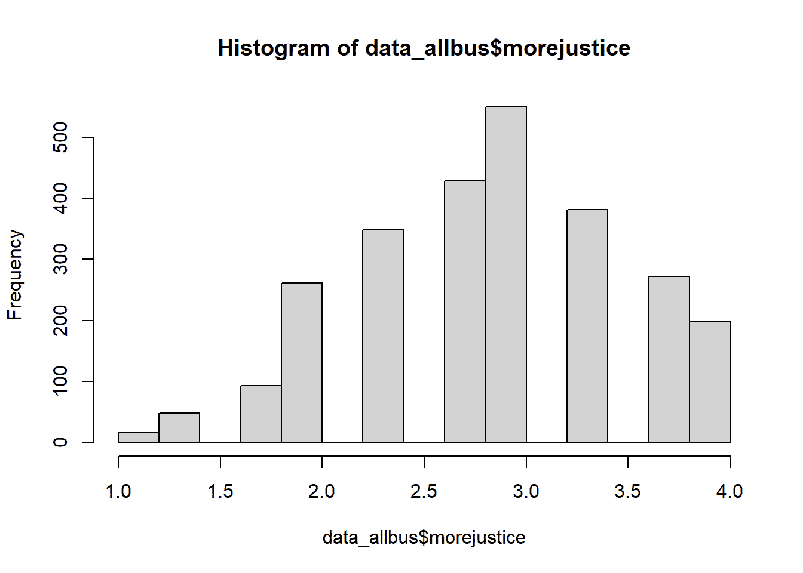

相关性表明，至少大多数指标通过 r > .4 相互关联。直方图表明变量值大约呈正态分布。

### 5.1.1 双变量回归的基础

在下一步中，我们将逐步进行双变量回归分析。为了计算两个变量之间的关系，使用最小二乘法计算所谓的斜率线。以下图示展示了基本思想。这些是虚构的数据点。

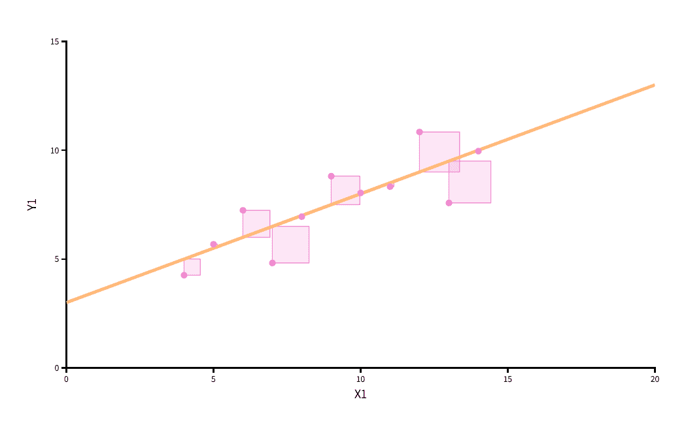 来源：[`seeing-theory.brown.edu/regression-analysis/index.html`](https://seeing-theory.brown.edu/regression-analysis/index.html)

基本上，这种方法允许我们找到一条最优地穿过观测点直线。平方越小，直线与数据的拟合度越好。如果直线的任何不同斜率会导致平方偏差之和增加，那么我们就找到了最优解。因此，这个估计量被称为**普通最小二乘法 - OLS 估计量**。如果我们回归模型中有多个变量，则将添加另一个空间维度（z 轴），直线将变成一个表面。当有超过两个自变量时，我们处理的是一个不再可描绘的多维表面。在这种情况下，最小二乘法保持不变，只是计算变得更加复杂（通过软件算法完成）。

该软件程序为每个自变量（例如，对应变量 $X_1$ 的 $\beta_1$）计算所谓的回归系数。在双变量情况下（一个自变量），回归系数表示以下斜率的“陡峭程度”：

**如果 $X_1$ 增加 1 个单位，那么 $Y$ 将增加或减少 $\beta_1$ 个单位（取决于符号）。**

让我们简要回顾一下单变量统计案例研究中的例子，在那里我们关注德国各县的失业率和犯罪率之间的经验关系。我们发现这两个变量之间存在正相关关系。下表显示了系数估计值和描述正相关的图。如果失业率增加 1 个单位（此处：1 个百分点），那么犯罪率平均增加 517.46 个单位（此处：每 100T 居民的案例数）。

```r
data_nrw <- read_excel("data/inkar_nrw.xls") 
model1 <- lm(crimerate ~ 1 + unemp, data = data_nrw)
stargazer(model1, type = "text")
```

```r
## 
## ===============================================
##                         Dependent variable:    
##                     ---------------------------
##                              crimerate         
## -----------------------------------------------
## unemp                       517.460***         
##                              (69.412)          
##                                                
## Constant                   2,398.594***        
##                              (543.248)         
##                                                
## -----------------------------------------------
## Observations                    53             
## R2                             0.521           
## Adjusted R2                    0.512           
## Residual Std. Error     1,240.129 (df = 51)    
## F Statistic           55.575*** (df = 1; 51)   
## ===============================================
## Note:               *p<0.1; **p<0.05; ***p<0.01
```

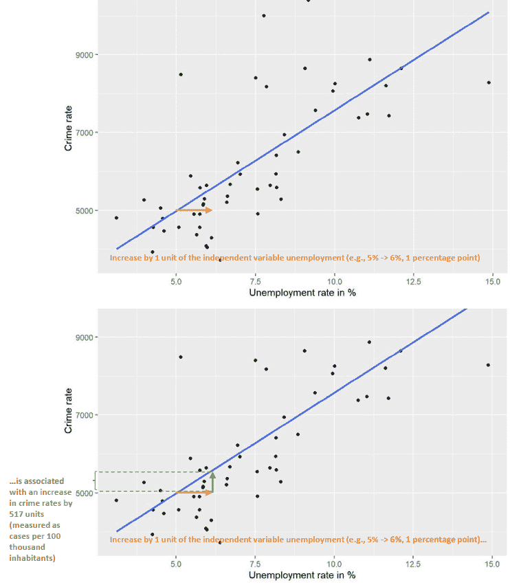

我们还可以考虑如果点（即两个变量的观察值）不同会发生什么。如果点和相应的斜率线更陡（因此系数更大），那么失业率增加一个单位将导致犯罪率更高。如果点和线表明一个平坦的模式，那么这意味着失业率增加一个单位时，犯罪率没有变化。如果线（和系数）是负的，那么失业率增加一个单位将伴随着犯罪率 *下降*（下降 $\beta_1$ 个单位）。

除了独立变量的系数外，回归输出还显示了所谓的常数（或截距），简称为 $a$、$\alpha$ 或 $\beta_0$。它提供了当模型中的所有独立变量都取值为 0 时，对结果变量 $Y$ 的预测值。通常，这个信息并不很有趣，因此被忽略。

* * *

**问题：** 在失业-犯罪例子（模型 1）中常数的值是多少？它携带什么信息内容？

你的答案：

解答：

模型 1 中常数的值是 2399。这表示失业率为 0% 的市的平均犯罪率（Y）。在我们的案例中，常数是无信息的，因为我们样本中没有 0% 失业率的观察值。

* * *

### 5.1.2 收入与对正义态度的双变量回归

我们现在估计收入与对正义态度之间关系的一个双变量回归。我们的工作假设 $H_A$ 是我们假设一个 *负* 关系——也就是说，收入较高的人相对于收入较低的人更少地倡导社会正义（例如，因为他们担心由于再分配政策而收入损失）。

*“形式上”，$H_A$ 可以用参考相关系数 $r<0$ 或回归系数 $\beta_1<0$ 来表示。相应地，零假设将是 $\beta_1\geq0$。

* * *

**问题：** 也能提出一个不同的假设 $H_A$ 吗？

你的答案：

解答：

是的：例如，收入越高，对社会正义的偏好也越高（因为富人负担得起）。哪个假设有意义取决于理论和先前的研究。

* * *

在下一步中，估计双变量回归模型。为此，我们使用指数 `morejustice` 作为结果变量，将变量 `income` 作为独立变量（或预测变量），该变量测量收入类别，分为 26 个等级（例如，1 = 每月净收入低于 200 欧元；14 = 1750 - 1999 欧元；26 = 10000 欧元及以上）。

```r
model_biv <- lm(morejustice ~ 1 + income, data = data_allbus) # 1 refers to the constant or intercept 
summary(model_biv)
```

```r
## 
## Call:
## lm(formula = morejustice ~ 1 + income, data = data_allbus)
## 
## Residuals:
##      Min       1Q   Median       3Q      Max 
## -2.12251 -0.49371  0.06216  0.46936  1.33916 
## 
## Coefficients:
##              Estimate Std. Error t value Pr(>|t|)    
## (Intercept)  3.140981   0.045227  69.449  < 2e-16 ***
## income      -0.018467   0.002833  -6.518 8.53e-11 ***
## ---
## Signif. codes:  0 '***' 0.001 '**' 0.01 '*' 0.05 '.' 0.1 ' ' 1
## 
## Residual standard error: 0.6574 on 2593 degrees of freedom
## Multiple R-squared:  0.01612,    Adjusted R-squared:  0.01574 
## F-statistic: 42.48 on 1 and 2593 DF,  p-value: 8.532e-11
```

```r
stargazer(model_biv, type = "text")
```

```r
## 
## ===============================================
##                         Dependent variable:    
##                     ---------------------------
##                             morejustice        
## -----------------------------------------------
## income                       -0.018***         
##                               (0.003)          
##                                                
## Constant                     3.141***          
##                               (0.045)          
##                                                
## -----------------------------------------------
## Observations                   2,595           
## R2                             0.016           
## Adjusted R2                    0.016           
## Residual Std. Error      0.657 (df = 2593)     
## F Statistic          42.484*** (df = 1; 2593)  
## ===============================================
## Note:               *p<0.1; **p<0.05; ***p<0.01
```

**任务：** 使用以下启发式方法解释回归模型的输出。

“收入与对正义态度的经验关系是正的/负的。”

“关系是/不是统计显著的。”

使用 p 值的正确技术解释：“在总体中找到这种关系的概率是……”

“因此，可以拒绝/不拒绝零假设。”

对收入回归系数的详细解释是：“……”

此外，从模型输出中解释常数和 R2。失业-犯罪示例（模型 1）中的常数值是多少？它携带的信息内容是什么？

你的答案：

解答：

收入与对正义的态度之间的经验关系是负面的。

找到的关系在统计上具有显著性（考虑到由于***而产生的错误概率为 0.01 或 1%）。

即使零假设为真，在总体中找到这种关系的概率也小于 1%。因此，可以拒绝零假设。

对收入回归系数的详细解释（b=-0.018）如下：如果收入增加一个单位（收入类别），那么（变体 1：）：对正义的态度（平均而言）将减少 0.018 个单位（尺度点）/（变体 2：）：变化为-0.018 个单位。

常数：由于我们使用的收入变量没有零点，因此解释是繁琐的。（如果我们把收入变量集中在平均值上，那么 0 表示平均收入，而常数则是具有平均收入的个人的预测正义态度水平。）

R2 是模型拟合度的衡量指标，表明包含的独立变量解释结果的程度。它可以解释为模型解释的方差与总方差的比率：R2=0.016 -> 模型中的预测变量可以解释结果变量的总方差的 1.6%。如果 R2 = 0.3，则模型解释的方差将是 30%。

注意：所谓的*调整后的 R2*用于比较具有不同预测变量数量的模型。虽然它不能再被解释为解释的方差百分比，但它可以在模型之间进行比较（Adj-R2 更高的模型更好）。

* * *

### 5.1.3 在双变量情况下相关系数和标准化回归系数的一致性

皮尔逊相关系数是两个变量之间的标准化协方差，对应于所谓的*标准化*回归系数，来自双变量回归。为了获得标准化回归系数，我们可以在变量进入回归模型之前对其进行 z 变换（$z=\frac{(x-\bar{x})}{S_x}$），或者在对系数进行估计后通过将未标准化的回归系数乘以$X$的标准差，然后除以$Y$的标准差来变换系数：$\beta_s=\frac{(\beta*S_y)}{S_x}$。在本例中，我们首先获得标准差，然后手动计算标准化系数，以及使用 R 中的`scale`函数，该函数自动对变量进行 z 变换，然后估计回归模型。我们将检查这两种程序和相关性是否相互对应。

```r
# Standardized regression coefficient by hand
sdx <- sd(data_allbus$income)
sdy <- sd(data_allbus$morejustice)
 beta_s <- (-0.018281*sdx)/sdy
beta_s
```

```r
## [1] -0.1256859
```

```r
# Standardized regression coefficient with model
model_biv_s <- lm(scale(morejustice) ~ 1 + scale(income), data = data_allbus)
summary(model_biv_s)
```

```r
## 
## Call:
## lm(formula = scale(morejustice) ~ 1 + scale(income), data = data_allbus)
## 
## Residuals:
##     Min      1Q  Median      3Q     Max 
## -3.2030 -0.7450  0.0938  0.7083  2.0209 
## 
## Coefficients:
##                 Estimate Std. Error t value Pr(>|t|)    
## (Intercept)    2.553e-17  1.948e-02   0.000        1    
## scale(income) -1.270e-01  1.948e-02  -6.518 8.53e-11 ***
## ---
## Signif. codes:  0 '***' 0.001 '**' 0.01 '*' 0.05 '.' 0.1 ' ' 1
## 
## Residual standard error: 0.9921 on 2593 degrees of freedom
## Multiple R-squared:  0.01612,    Adjusted R-squared:  0.01574 
## F-statistic: 42.48 on 1 and 2593 DF,  p-value: 8.532e-11
```

```r
# Calculate correlation
vars <- c("income", "morejustice")
cor.vars <- data_allbus[vars]
rcorr(as.matrix(cor.vars))
```

```r
##             income morejustice
## income        1.00       -0.13
## morejustice  -0.13        1.00
## 
## n= 2595 
## 
## 
## P
##             income morejustice
## income              0         
## morejustice  0
```

> ***以下是对标准化回归系数的解释：如果$X$（收入）增加一个*标准差*，那么$Y$将增加/减少$\beta_s$-*标准差*。在这里，这是一个减少 0.13 *标准差*。***

标准化回归系数在多元回归（即具有一个以上自变量的回归）中也得到了广泛的应用。其优点是我们“解放”了变量从它们原始的测量尺度，并使用“标准差”作为可比较的测量尺度。因此，我们可以直接比较回归系数。如果一个系数较大，那么它对结果变量的“影响”也较大。例如，在收入尺度上增加一个单位，该尺度介于 0 到 10,000 之间，会导致结果变量较小的变化，如果它是在只有 12 个类别的尺度上测量的，那么变化会更大。使用每个变量的标准化版本，并在两个单独的回归模型中使用这些版本，应该会导致可比较的结果。作为一个例子，竞争性解释由同一模型中的两个自变量表示：如果收入具有标准化系数-0.13，而年龄具有标准化系数-0.05，那么收入对结果变量的“影响”比年龄更大。

注意，我们通常只报告 z 标准化系数用于度量（但不是二元）预测变量，并且还有其他比较系数的程序，例如最小-最大归一化，其中所有变量都有最小值 0 和最大值 1（以及序数或度量变量在 0 和 1 之间的额外值）。

## 5.2 多元回归

### 5.2.1 基本概念

多元回归的目标是用多个自变量解释结果变量。当我们想要测试一个现象的不同解释时（例如，对正义的态度），这很有用。多元回归模型产生*调整*估计，因为自变量控制了它们之间的相互影响。回想一下第一个案例研究中失业和犯罪的例子，我们当时还加入了人口密度作为另一个变量。在这个案例中，失业（对犯罪）的影响解释是调整了人口密度的影响。对于失业，我们得到了系数估计值 $\beta_1=215.4$。作为一个思想实验：如果我们考虑人口密度相同的城市，并将它们相互比较，那么失业率每增加一个百分点的城市，平均每 100T 居民的犯罪率会高 215。人口密度对犯罪的影响可以以类似的方式进行解释——在这里，其他因素（失业）的影响被“保持不变”或被控制。

多元回归模型中的这种相互“保持不变”或“控制”意味着我们可以通过额外的变量来解释替代解释。在对待正义的态度的例子中，我们使用性别（`female`，其中男性=0，女性=1）、在过去 10 年内受访者是否失业（`unemployed`，其中未失业=0，曾失业=1）以及受访者是否居住在西德或东德（`east`，其中西德=0，东德=1）作为额外的变量。关于性别的影响，我们假设由于社会化和社会规范以及/或由于性别工资差距，女性比男性更支持社会正义，因为她们的平均收入通常低于男性。因此，控制性别很重要，这样收入就不会部分“传递”性别效应。在多元回归模型中控制性别使我们能够获得一个“净”收入效应，这个效应与性别效应分开，否则可能会混淆收入和对待正义的态度之间的关系。

* * *

**问题：** 如何将过去或当前的失业和居住在东德与收入和正义态度这两个感兴趣变量联系起来？

你的回答：

```r
Unemployment: East Germany:
```

解答：

失业：如果某人曾经/现在是失业的，他/她可能会比没有这种经历的人更强烈地倡导社会正义（例如，由于自身利益）。如果某人失业，与有工作的人相比，他的/她的平均收入通常较低。

东德：由于更大的劣势感或他们在社会主义的东德的社会化，预计东德人比西德人更强烈地倡导社会正义。同时，由于经济状况不太发达，东德居民在类似工作中挣得更少的可能性更高。

* * *

### 5.2.2 假设制定

具有四个自变量的多元回归模型可以用以下公式表示：

$y = \beta_0 + \beta_1 * x_1 + \beta_2 * x_2 + \beta_3 * x_3 + \beta_4 * x_4 + e$

Y 代表因变量，$\beta_0$ 是常数，其他 $\beta_i$ 是相应预测变量 $x_i$ 的回归系数。$e$ 代表残差或因变量方差中未被模型中的预测变量解释的部分。

如果我们使用变量名，特定模型的公式将是以下：

$morejustice = \beta_0 + \beta_1 * income + \beta_2 * female + \beta_3 * unemployed + \beta_4 * east + e$

* * *

**问题：** 为每个自变量制定零假设和备择假设。

您的回答：

```r
Income H_0: H_A: Female H_0: H_A: Unemployed H_0: H_A: East Germany H_0: H_A:
```

解答：

收入 $H_A$: $\beta_1<0$（收入与对正义的态度呈负相关）

$H_0$: $\beta_1\geq0$（收入与对正义的态度无关或呈正相关）

女性 $H_A$: $\beta_2>0$（女性与对正义的态度呈正相关，即女性比男性更强烈地倡导社会正义）

$H_0$: $\beta_2\leq0$（女性与对正义的态度无关或呈负相关）

失业 $H_A$: $\beta_3>0$（失业与对正义的态度呈正相关，即经历过失业的人比没有这种经历的人更强烈地倡导社会正义）

$H_0$: $\beta_3\leq0$（失业与对正义的态度无关或呈负相关）

东德 $H_A$: $\beta_4>0$（居住在东德与对正义的态度呈正相关，即东德人比西德人更强烈地倡导社会正义）

$H_0$: $\beta_4\leq0$（居住在东德与对正义的态度无关或呈负相关）

* * *

### 5.2.3 估计和结果解释

我们现在估计相应的回归模型。双变量模型已经在上面估计过，并包括在内以供比较。

```r
model_mult <- lm(morejustice ~ 1 + income + female + unemployed + east, data = data_allbus)
 stargazer(model_biv, model_mult, type = "text")
```

```r
## 
## =====================================================================
##                                    Dependent variable:               
##                     -------------------------------------------------
##                                        morejustice                   
##                               (1)                      (2)           
## ---------------------------------------------------------------------
## income                     -0.018***                -0.011***        
##                             (0.003)                  (0.003)         
##                                                                      
## female                                               0.128***        
##                                                      (0.028)         
##                                                                      
## unemployed                                           0.066**         
##                                                      (0.033)         
##                                                                      
## east                                                 0.075***        
##                                                      (0.028)         
##                                                                      
## Constant                    3.141***                 2.936***        
##                             (0.045)                  (0.059)         
##                                                                      
## ---------------------------------------------------------------------
## Observations                 2,595                    2,595          
## R2                           0.016                    0.027          
## Adjusted R2                  0.016                    0.026          
## Residual Std. Error    0.657 (df = 2593)        0.654 (df = 2590)    
## F Statistic         42.484*** (df = 1; 2593) 18.263*** (df = 4; 2590)
## =====================================================================
## Note:                                     *p<0.1; **p<0.05; ***p<0.01
```

我们现在可以将回归系数插入上面的两个公式中：

一般形式：$y = 2.936-0.011 * x_1 + 0.128 * x_2 + 0.066 * x_3 + 0.075 * x_4 + e$

特定形式：$morejustice = 2.936-0.011 * income + 0.128 * female + 0.066 * unemployed + 0.075 * east + e$

* * *

**问题：** 从（a）关联方向，（b）显著性，（c）效应大小三个方面解释多元回归模型的系数。

您的回答：

```r
Income Female Unemployed East Germany
```

解答：

收入

> *收入与对正义的态度之间存在负相关关系，这在统计上具有显著性（p < 0.01）。收入增加一个单位与对正义的态度减少 0.011 个尺度单位相关（同时保持模型中其他变量的影响不变）。在效应大小方面，从最低收入类别移动到最高收入类别将导致对正义的态度减少 0.286 个尺度单位（26 个类别 * 0.011 系数 = 0.286，这对应于最小-最大归一化收入变量的效应）*。

女性

> *女性与对正义的态度之间存在正相关关系，这在统计上具有显著性（p < 0.05）。变量 female 增加一个单位（=女性与男性的差异）与对正义的态度增加 0.128 个尺度单位相关（同时保持模型中其他变量的影响不变）*。

失业

> *在过去 10 年中失业与对正义的态度之间存在正相关关系，这在统计上具有显著性（p < 0.05）。变量失业增加一个单位（=失业者与非失业者之间的差异）与对正义的态度增加 0.066 个尺度单位相关（同时保持模型中其他变量的影响不变）*。

东德

> *居住在东德与对正义的态度之间存在正相关关系，这在统计上具有显著性（p < 0.05）。变量 east 增加一个单位（=东德人与西德人的差异）与对正义的态度增加 0.075 个尺度单位相关（同时保持模型中其他变量的影响不变）*。

在效应比较方面，变量女性、失业和 east 的测量尺度是可比的（0/1）。收入的 min-max 效应也是可比的，因为这对应于将变量重新编码为介于 0 和 1 之间。因此，在多重回归模型中，收入是比较强的预测因子。

* * *

* * *

**问题：双变量模型与多重模型之间有什么变化？**

你的答案：

解决方案：

在多重模型（与双变量模型相比），收入的系数（或收入与对正义的态度之间的关系）较小。其根本原因在于，在双变量模型中，系数部分代表了未观察到的因素，这在多重回归模型中得到纠正（至少就模型中包含的变量而言）。

在模型拟合方面，多重模型与数据的拟合度更好（因为调整后的 R2 更高）。

* * *

## 5.3 OLS 假设和模型诊断，变量之间的非线性关系和交互作用

### 5.3.1 OLS 假设

为了从 OLS 回归模型中获得无偏且高效的系数估计，必须满足几个假设。这些假设涉及三个领域。

1.  第一个领域确保**估计方法**在所有情况下都能工作。第一个假设是**系数**是可加的，因为如果不是这样，系数就无法通过最小二乘法估计。这个假设是显而易见的，通常也是成立的。请注意，一些统计学书籍错误地引用了这个假设，即自变量和因变量之间的经验关系必须是线性的。这并不正确，多元线性回归可以通过将**变量**相互乘积来轻松处理非线性关系（参见下文）。第二个假设与自变量的共线性有关。这意味着两个自变量不能完全相关。否则，一个变量的影响会被另一个变量的影响完全抵消，这会阻碍系数的可靠估计。变量之间高度相关的情况相当罕见，如果数据集中有测量类似结构（因此高度相关）的变量，无论如何都会从这些变量中构建一个指数。

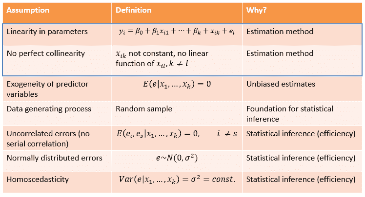

1.  第二个领域涉及系数估计的无偏性。其背后的假设是**自变量的外生性**。如果一个变量是外生的，这确保了该变量的系数反映了实际关系，而不是其他东西。这被定义为误差项（即未解释的因变量的方差，它代表了可能未观察到的因素对结果的影响）与预测变量无关。在随机实验中，处理变量是一个外生的预测变量（由于随机化而设计），它与未观察到的第三变量无关。在观察数据模型（例如，来自调查的数据）中，外生性假设要求通过包括相关控制变量来排除替代解释。如果我们模型中有所有相关的控制变量，这个假设就会得到满足。然而，如果存在与预测变量和结果变量相关的未观察变量（这通常是规则而不是例外），我们就遇到了问题：外生性假设没有得到满足，回归系数是有偏的。我们无法从经验上确定这种偏差的程度：**没有针对这个假设的诊断测试**。这意味着我们需要做好理论工作，以明确变量之间的因果关系，并在回归模型中包括相关的控制变量。另一种方法是——如前所述——使用实验设计来排除替代解释。

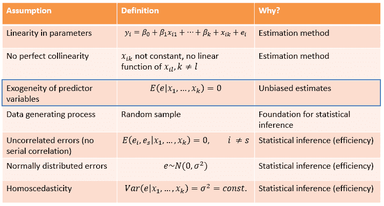

1.  第三个领域指的是**统计推断**的过程。如果假设被违反，标准误差以及因此的检验统计量（例如 t/z 统计量）和显著性检验是有偏的。系数的无偏性（如第 2 点所述）独立于这一点。这个领域的第一个假设与我们是随机抽样有关。如果没有随机样本，就没有进行推断统计的基础，尽管在实践中，即使没有随机样本也会进行推断统计。（在这里，例如使用显著性检验作为关于经验关系估计“可靠”或精确程度的信息。）

    **无相关误差**的假设意味着每个观测值必须携带独特的信息，独立于样本中其他观测值的信息内容。如果我们使用例如来自不同国家的跨国调查数据，国家内部的观测值在结果变量上可能是相似的。对于面板数据，在时间上对相同单位进行多次观测，来自相同单位的观测值之间的相似性被称为序列相关。如果这种观测值之间的相似性没有被特定的建模选择（例如，使用多层次模型）或回归模型中包含的变量所解决，则标准误差是有偏的。存在无相关误差的正式检验，例如 Durbin-Watson 检验。

    **误差必须正态分布**的假设通常作为使用直方图评估变量值分布的理由，如果需要，还可以将变量转换，使其分布更加“正常”（例如，对右偏变量进行对数化）。这可能是一种有用的策略。同时，重要的是要注意，本质上这个假设是指误差的分布（即，在考虑模型中的变量之后的输出），并且随着观测值的数量足够大，违反假设在标准误差有偏方面的问题变得不那么严重。

    最后，**同方差标准误差**的假设指出，误差的分布必须对不同的自变量值相同（或恒定）。如果假设被违反并且存在异方差性，则标准误差是有偏的。通常（但并非总是如此），标准误差被低估，这反过来又与过于乐观的显著性检验（以及 I 型错误）相关。也就是说，我们发现一个统计上显著的结果（并拒绝原假设），尽管实际上它不是一个显著的结果。作为补救措施，可以应用所谓的稳健标准误差。


### 5.3.2 模型诊断

#### 5.3.2.1 变量间的共线性 -> VIF

为了说明如何应用几个现有的 OLS 假设检验，我们使用上述估计的模型*model_mult*。

方差膨胀因子（VIF）提供了关于模型中的变量是否与其他变量过度相关的信息（这也会在变量的相关矩阵中体现出来，如果变量之间的相关性超过 0.85，则应谨慎）。关于 VIF，超过 5 的 VIF 已经有点可疑，而超过 10 的值则表明存在强烈的共线性。

```r
##Regression diagnostics
vif(model_mult)
```

```r
##     income     female unemployed       east 
##   1.215933   1.175482   1.037561   1.014182
```

模型中所有变量的 VIF 都相对较小（< 5）。我们可以得出结论，没有共线性存在。

#### 5.3.2.2 无相关误差

由于我们使用的是单阶段随机样本，这个假设最有可能得到满足。

#### 5.3.2.3 残差的正态性

作为正态性的检验，我们可以（a）通过直方图查看残差的分布，（b）绘制所谓的 Q-Q 图并对其进行解释，或者（c）通过直方图查看模型中变量的分布（请注意，这只能间接地提供关于误差分布的线索）。

```r
predict.model <- fitted(model_mult)
error.model <- residuals(model_mult)
 hist(error.model)
```

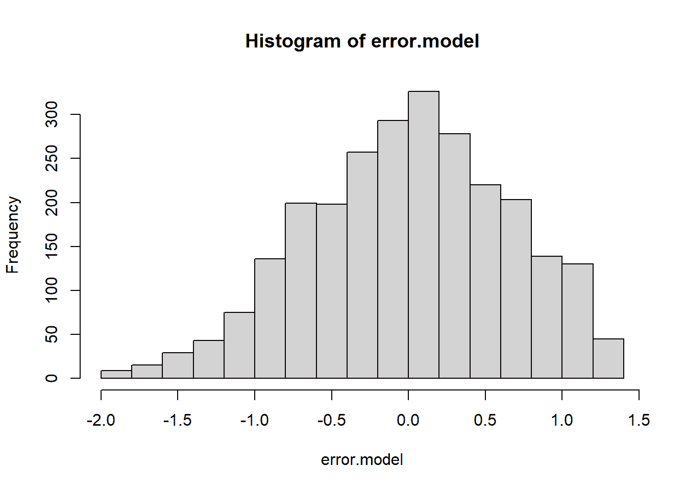

```r
qqPlot(error.model)
```

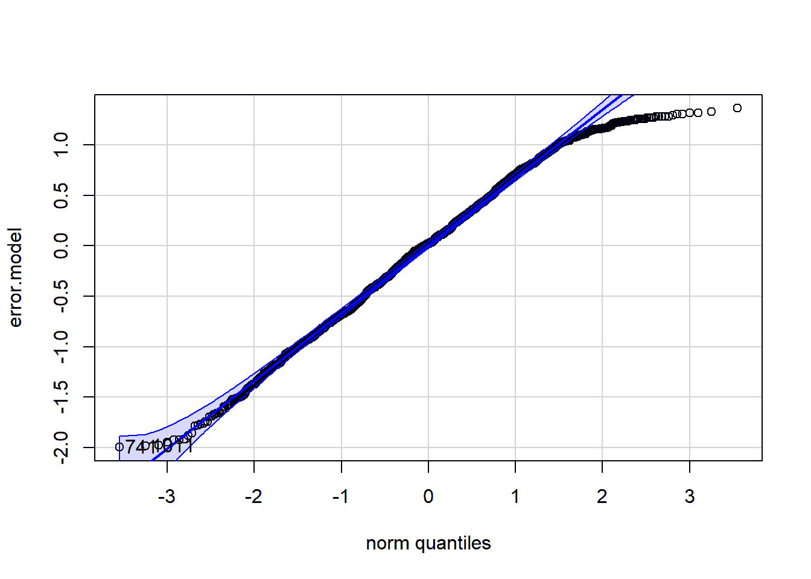

```r
## [1]  741 1011
```

从视觉检查来看，误差的分布看起来类似于正态分布。分布的中心大约为零，分布仅略微左偏斜。

关于 Q-Q 图，显示的残差值应尽可能接近或位于线上。对于高值或低值的一点点“磨损”是可以接受的。我们注意到右侧有轻微的偏差，所以正极端值范围内的值有点太少。否则，看起来一切正常。

#### 5.3.2.4 同方差性

接下来，我们检查同方差性的假设。我们比较模型中的预测值与残差值。如果点在蓝色线周围分布得越均匀，我们越有可能假设该假设得到了满足。

```r
scatterplot(error.model~predict.model, regLine=TRUE, smooth=FALSE, boxplots=FALSE)
```

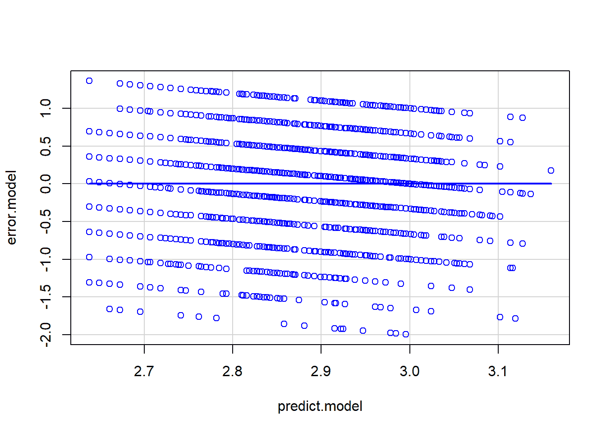

在我们的案例中，误差分布相当均匀。这意味着模型在低、中、高预测值下拟合得相似。为了确保，我们可以绘制模型中所有自变量的（标准化）残差及其值域。此外，还有用于同方差性的统计检验：*Breusch-Pagan 检验*。这里的零假设是同方差性存在（即，残差与预测因子无关）。因此，非显著的结果是检验的理想结果。

```r
bptest(model_mult)
```

```r
## 
##  studentized Breusch-Pagan test
## 
## data:  model_mult
## BP = 5.4228, df = 4, p-value = 0.2466
```

非显著的结果表明，同方差性的假设似乎得到了满足。如果不是这样，我们就必须使用稳健标准误差。

### 5.3.3 非线性效应

在回归模型中包含非线性变量关系可以基于几个动机。一个原因可能是因为我们可能从散点图中注意到两个变量之间的关系是 U 形或倒 U 形。另一个原因可能是因为我们可以从理论上推理出这种关系是非线性的。第三个动机是将非线性关系包括在内以减少异方差性。

下面，我们测试收入是否对正义态度有非线性影响。具体来说，我们假设特别是中产阶级的人更喜欢正义，而穷人和富人则较少这样做。对于富人来说，原因可能是自私，而低收入人群可能因为担心福利国家被新来者，如移民过度使用而反对再分配政策。这种现象在文献中被讨论为“福利沙文主义”。

让我们先从图形上看看这种关系。

```r
#Create and print scatter plot
sc1 <- ggplot(data=data_allbus, aes(income, morejustice)) +
 geom_point() 
sc1
```

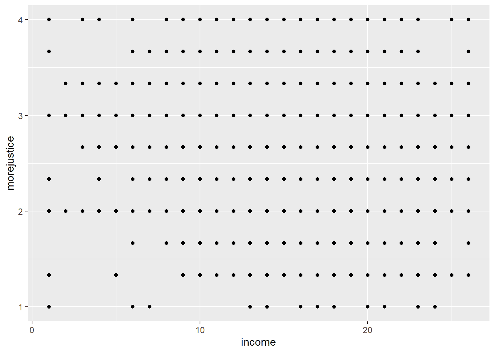

```r
sc2 <- ggplot(data=data_allbus, aes(income, morejustice)) +
 geom_jitter(aes(income = morejustice), size = 0.5) + geom_smooth()
sc2
```

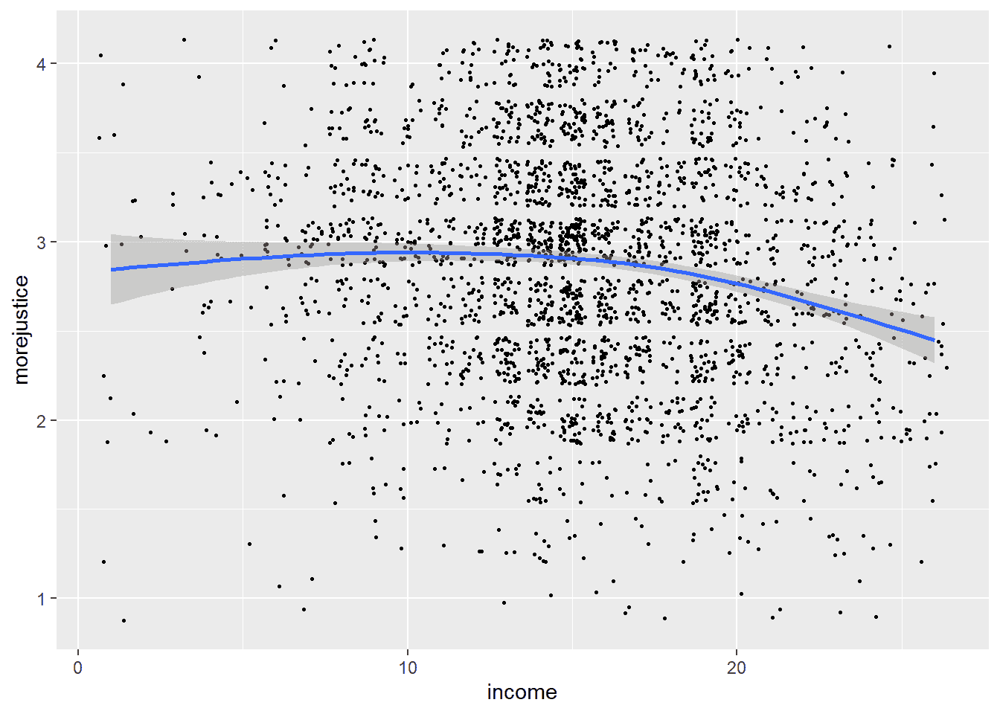

在第一幅图中，由于许多点简单地堆叠在一起，因此无法看到任何模式。为了使点的密度更明显，我们可以添加微小的随机波动。这使得图略失真，但我们现在可以看到模式，这也由表示为蓝色线的平滑相关函数（以及置信区间）所说明。有一些视觉证据表明存在非线性关系。

我们现在在回归模型中测试非线性关系。为此，我们在多模型中添加了收入变量的平方作为额外的预测变量。这里的想法是，收入的影响现在取决于“另一个”变量的值，即收入本身。换句话说，收入对正义态度的影响现在允许根据你在收入尺度上的位置而变化。

```r
data_allbus$income_squared <-  data_allbus$income*data_allbus$income
 model_nlin <- lm(morejustice ~ 1 + income + income_squared + female + unemployed + east, data = data_allbus)
 stargazer(model_biv, model_mult, model_nlin, type = "text")
```

```r
## 
## ==============================================================================================
##                                                Dependent variable:                            
##                     --------------------------------------------------------------------------
##                                                    morejustice                                
##                               (1)                      (2)                      (3)           
## ----------------------------------------------------------------------------------------------
## income                     -0.018***                -0.011***                 0.048***        
##                             (0.003)                  (0.003)                  (0.013)         
##                                                                                               
## income_squared                                                               -0.002***        
##                                                                               (0.0004)        
##                                                                                               
## female                                               0.128***                 0.125***        
##                                                      (0.028)                  (0.028)         
##                                                                                               
## unemployed                                           0.066**                   0.055*         
##                                                      (0.033)                  (0.033)         
##                                                                                               
## east                                                 0.075***                 0.058**         
##                                                      (0.028)                  (0.028)         
##                                                                                               
## Constant                    3.141***                 2.936***                 2.546***        
##                             (0.045)                  (0.059)                  (0.101)         
##                                                                                               
## ----------------------------------------------------------------------------------------------
## Observations                 2,595                    2,595                    2,595          
## R2                           0.016                    0.027                    0.036          
## Adjusted R2                  0.016                    0.026                    0.034          
## Residual Std. Error    0.657 (df = 2593)        0.654 (df = 2590)        0.651 (df = 2589)    
## F Statistic         42.484*** (df = 1; 2593) 18.263*** (df = 4; 2590) 19.189*** (df = 5; 2589)
## ==============================================================================================
## Note:                                                              *p<0.1; **p<0.05; ***p<0.01
```

> ***解释：***
> 
> +   首先，我们看看平方变量`income_squared`的系数是否具有统计学意义 -> **是的，因此我们可以推断出非线性关系**
> +   
> +   接下来，我们看看`income`系数的符号 -> **正面**
> +   
> +   而`income_squared`系数的符号 -> **负面**
> +   
> +   总结：收入对正义态度的影响是**正面**的，并且随着收入水平的提高而**减少**。

* * *

**问题：** 如果两个符号都是负数，这种效果应该如何解释？

你的答案：

解答：

收入对不平等态度的影响将是负面的，并且随着收入水平的提高而减少。

* * *

### 5.3.4 两个不同变量之间的交互作用

回归分析中的另一个重要工具是建模变量之间的交互作用。其思想是，一个变量对结果变量的影响取决于模型中另一个变量的 *值*。具体来说，我们在这里的问题是性别对正义态度的影响是否在东西德之间有所不同。假设在东德，男性和女性在正义态度上的差异不如西德明显。一方面，这可能是因为东德的男性对正义的支持度更高（因此与女性的支持水平相似）。另一方面，这可能（但不太可能）是东德的女性与男性有类似的“低”价值观。

让我们将这视为回归模型中的交互作用。为此，模型中必须包含两个变量 `female` 和 `east`，以及一个表示这两个变量乘积（交互作用）的变量。这个变量可以事先构建，或者我们可以在 R 中通过在两个现有变量之间添加一个“:”（“*”也行）来“即时”构建它。

```r
# Letting R know that the two nominal variables "female" and "east" are indeed nominal or "factor variables" is important for the graphical representation of the interaction below
 data_allbus$female <- factor(data_allbus$female)
data_allbus$east <- factor(data_allbus$east)
 # The interactions can be specified with ":" or "*".
model_interaktion <- lm(morejustice ~ 1 + income + unemployed + female + east + female : east , data = data_allbus)
 stargazer(model_interaktion, type = "text")
```

```r
## 
## ===============================================
##                         Dependent variable:    
##                     ---------------------------
##                             morejustice        
## -----------------------------------------------
## income                       -0.011***         
##                               (0.003)          
##                                                
## unemployed                    0.065*           
##                               (0.033)          
##                                                
## female1                      0.163***          
##                               (0.033)          
##                                                
## east1                        0.128***          
##                               (0.040)          
##                                                
## female1:east1                 -0.106*          
##                               (0.056)          
##                                                
## Constant                     2.912***          
##                               (0.060)          
##                                                
## -----------------------------------------------
## Observations                   2,595           
## R2                             0.029           
## Adjusted R2                    0.027           
## Residual Std. Error      0.654 (df = 2589)     
## F Statistic          15.351*** (df = 5; 2589)  
## ===============================================
## Note:               *p<0.1; **p<0.05; ***p<0.01
```

> ***解释：***
> 
> +   首先，我们查看交互变量 `female1:east1` 的系数是否具有统计学意义 -> **是的，因此我们可以假设 `female` 对 `morejustice` 的影响取决于 `east` 的值。换句话说，德国两部分的正义态度差异在性别上有所不同。（注意：也可以对称地解释交互效应：`east` 对 `morejustice` 的影响取决于 `female` 的值。为了简化，我们在此不追求这种解释。）**
> +   
> +   然后，我们查看 `female` 系数的符号和显著性 -> **正值**（即当 `east` = 0 时，`female` 的正向效应，即在西德）。
> +   
> +   然后，我们查看交互项 `woman:east` 系数的符号 -> **负值**。
> +   
> +   总结：女性对正义态度的 **正向** 影响（即性别差异）在 `east` 的较高值（即在东德）上较弱（“越来越 **负向**”）。

下面，我们看到 `interactions` 包的图形表示（更多示例请见 [`interactions.jacob-long.com/index.html`](https://interactions.jacob-long.com/index.html)）。

```r
cat_plot(model_interaktion, pred = female, modx = east, geom = "line", point.shape = TRUE,
 vary.lty = TRUE)
```

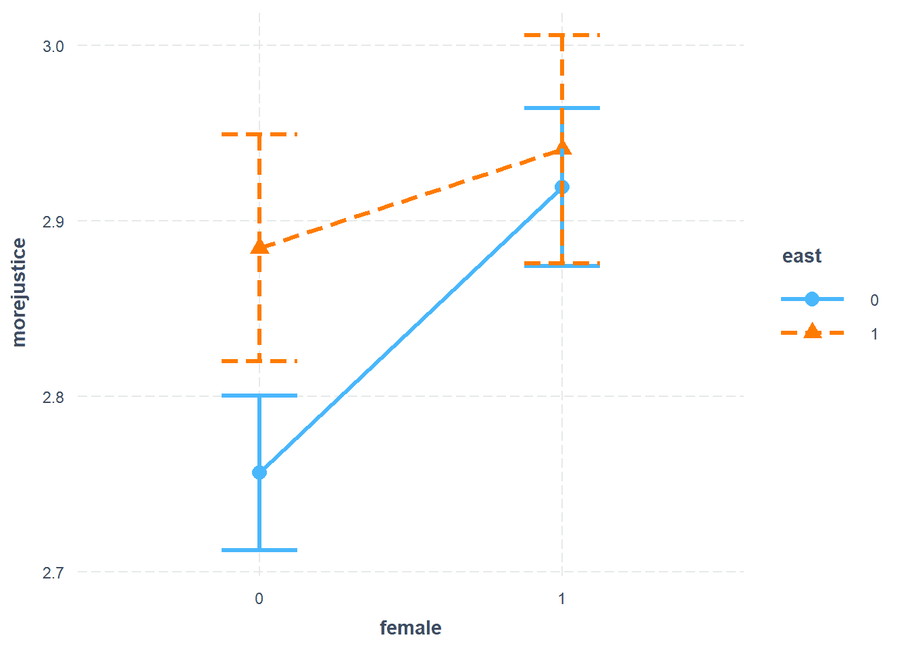

蓝线代表西德，橙线代表东德。带有末端条形的线是 95% 的置信区间，从而间接显示了各自效应估计的“显著性”。

三点值得关注：

+   东德男性和女性对公平正义的支持程度高于西德男性和女性（橙色三角形与蓝色点相比）。对于西德的男性来说，这种差异在统计上显著（左侧的置信区间没有重叠）。要了解整体支持水平（男性和女性合并）在东德是否在统计上显著更高，我们必须回到 **model_mult** 并查看 *平均* 关系（$\beta_4 = 0.075, p < 0.01$)。

+   通过观察线条，我们可以分别观察国家两部分的性别效应，在德国西部，男性和女性之间的差异在统计上显著（参见 `female` 的系数，0.163）。在东德，这种差异不显著。（这也可以通过比较橙色和蓝色估计值来直观地推断。）

+   在西德，女性的影响大于东德（蓝色线比橙色线更陡峭）。这由交互项的系数表示。

**我们现在可以将回归系数插入回归公式中：**

$y = \beta_0 + \beta_1 * x_1 + \beta_2 * x_2 + \beta_3 * x_3 + \beta_4 * x_4 + \beta_5 * x_3*x_4 + e$

$morejustice = 2.912 - 0.011 * income + 0.065 * unemployed + 0.163*female + 0.128*east - 0.106*female*east + e$

**我们还可以通过取一阶导数并将变量值输入一个组合中，从而推导出所谓的边际效应公式。**

1.  变量 `east` 的边际效应（一阶导数）$dy/d(east) = 0.128 – 0.106*female$

+   我们可以将变量 `female` 替换为 0，即男性对 `east` 的影响：$b(east=1, female=0) = 0.128 – 0.106 * 0 = 0.128$.

+   这指的是东德和西德男性之间的差异（图示：左侧蓝色点和橙色三角形的距离）。

+   如果我们将变量 `female` 替换为 1：即女性对 `east` 的影响：$b(east=1, female=1) = 0.128 – 0.106 * 1 = 0.022$.

+   这指的是东德和西德女性之间的小差异（右侧蓝色点和橙色三角形的距离）。

1.  变量 `female` 的边际效应（一阶导数）$dy/d(female) = 0.163 – 0.106*east$

+   我们可以将变量 `east` 替换为 0，即西德女性 `female` 的影响：$b(female=1, east=0) = 0.163 – 0.106 * 0 = 0.163$.

+   这指的是德国西部男性和女性之间的差异（图示：两个蓝色点之间的距离）。

+   如果我们将变量 `east` 替换为 1，即东德女性 `female` 的影响：$b(female=1, east=1) = 0.163 – 0.106 * 1 = 0.057$.

+   这指的是东德男性和女性之间的差异（两个橙色三角形的距离）。

1.  女性的影响差异（两个斜率不同）由交互项的系数表示，即 –0.106.

* * *

**感谢您参与《统计学与数据分析入门——案例分析法》！**

**对 conrad.ziller@uni-due.de 的反馈非常欢迎。**

* * *

4 统计推断 - 政府满意度案例研究
