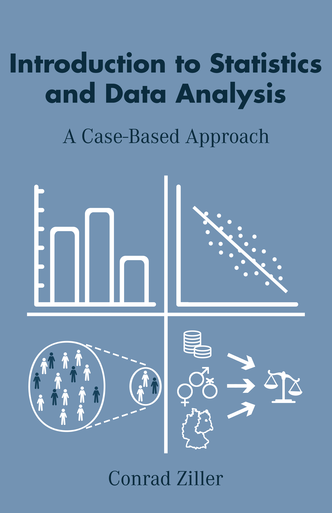

# 1 前言

> 原文：[`bookdown.org/conradziller/introstatistics/`](https://bookdown.org/conradziller/introstatistics/)

**建议引用：**

Ziller, Conrad (2024). *统计学和数据分析入门 – 基于案例的方法.* 可在[`bookdown.org/conradziller/introstatistics`](https://bookdown.org/conradziller/introstatistics)在线获取。

要下载本书中使用的 R 脚本和数据，请[在此](https://conradziller.com/wp-content/uploads/2024/09/introstatsfiles_v3.zip)下载。

书的 PDF 版本可以在此[下载](https://conradziller.com/wp-content/uploads/2024/09/ziller_introstats_book.pdf)。

## 本书编写动机

这本简短的书是使用 R 和 RStudio 进行统计学和数据分析的完整入门指南。它包含基于真实数据的动手练习——主要来自社会科学领域。此外，本书以简短的案例研究形式介绍了统计数据分析的四个关键要素（单变量统计、双变量统计、统计推断和回归分析）。这样做的原因是为了为学生提供实际案例，帮助他们理解新概念，并在考试或进行自己的数据分析时回忆所学知识。

案例研究逻辑预计将提高参与材料的积极性。众所周知，疫情之前的教学方式与现在不同。学生（合理地）越来越不愿意接受粉笔和口头教学技巧，我们都对社交媒体内容产生了多巴胺相关的依赖，这大大缩短了我们集中注意力的能力。这对一般学术教学，尤其是像统计学和数据科学这样的复杂内容教学提出了挑战。

## 如何使用本书

本书包含四个案例研究，为统计学和数据分析提供了简短而全面的介绍。书中使用的例子基于官方统计数据和公开可用的调查的真实数据。虽然每个案例研究都遵循其自身的逻辑，但我建议按顺序阅读。目标是给读者提供独立学习的机会，并积累统计学和数据分析的扎实实践知识。每个案例研究都包含可以在下面的框中回答的问题。问题的解答可以在框下方查看（点击“解答”旁边的箭头）。建议将答案保存到单独的文档中，因为此内容不会被保存，在重新加载书籍页面后无法访问。

可以与 R 脚本[在此](https://conradziller.com/wp-content/uploads/2024/09/introstatsfiles_v3.zip)一起下载包含问题、答案框和解答的工作表。您可以在网上免费阅读本书。可从作者处订购可打印格式的副本。

本书可供大学教授使用进行教学，他们可以使用本书提供的数据示例和分析作为讲座中的插图（并注明来源）。本书也可供希望获得基础统计学知识和数据分析实用技能的每个人自学。这些材料还可以用作统计基础的复习。

建议 R 和 RStudio 的初学者通过以下链接[`posit.co/download/rstudio-desktop/`](https://posit.co/download/rstudio-desktop/)安装程序，并从[这里](https://conradziller.com/wp-content/uploads/2024/09/introstatsfiles_v3.zip)下载材料。然后可以在阅读本书时执行这些材料中的脚本。这有助于熟悉统计分析，而且看到自己的脚本运行起来感觉真是太棒了！（不利的一面，统计分析的代码无法运行是完全正常且是过程的一部分。这就是为什么网络上的帮助论坛和最近出现的 ChatGPT 存在的原因。只需谷歌搜索你的问题并继续尝试，就像以往一样，20%的灵感加 80%的坚持。）

## 本书结构

本书包含四个案例研究，每个案例都展示了独特的统计和数据分析方法。

+   第二部分：单变量统计 - 社会人口统计报告案例研究

第二部分包含关于一个变量分析的材料。它介绍了典型值（例如，平均值）和数据分布的度量。

+   第三部分：双变量统计 - 2020 年美国总统选举案例研究

第三部分包含关于分析两个变量之间关系的材料，包括交叉表和相关性。

+   第四部分：统计推断 - 政府满意度案例研究

第四部分介绍了统计推断的概念，这指的是从随机样本推断总体特征。它还涵盖了假设检验、置信区间和统计显著性的概念。

+   第五部分：回归分析 - 对正义态度案例研究

第五部分涵盖了如何进行多元回归分析以及如何解释相应的结果。多元回归研究结果变量（例如，对正义的信念）与代表不同竞争性解释的多个变量之间的关系。

## 致谢

感谢 Paul Gies、Phillip Kemper、Jonas Verlande、Teresa Hummler、Paul Vierus 和 Felix Diehl 对本书先前版本的宝贵反馈。我想感谢 Achim Goerres 在早期给予的反馈，以及他在修订和更新其关于方法和统计学的入门讲座材料方面给予我的最大自由度，这促使了本书的撰写。本书的早期版本已在杜伊斯堡-埃森大学的政治学本科课程中用于统计学教学。

## 关于作者

Conrad Ziller 是杜伊斯堡-埃森大学政治学系的资深研究员。他的研究兴趣集中在移民在政治和社会中的作用、移民融合、政策对公民的影响以及定量方法。他是德国研究基金会和 Fritz Thyssen 基金会资助的研究项目的首席研究员。有关他的研究更多信息，请参阅[`conradziller.com/`](https://conradziller.com/)。

## 概览

本书最后一部分是关于线性回归分析，这是入门统计学课程的天然终点。然而，“普通”回归是许多进一步有用的技术发挥作用的地方——其中大部分可以归纳为“高级回归模型”的标签。在分析例如面板数据（相同的受访者被多次采访）或来自跨国调查的空间聚类数据时，您将需要这些技术。

我将很快通过案例研究扩展本介绍，关于高级回归技术。如果您想获得此材料在线的通知，请在此处使用您的电子邮件地址注册：[`forms.gle/T8Hvhq3EmcywkTdFA`](https://forms.gle/T8Hvhq3EmcywkTdFA)。

同时，我有一章关于*“非独立观察的多重回归：随机效应和固定效应”*，可以通过[`ssrn.com/abstract=4747607`](https://ssrn.com/abstract=4747607)下载。

**如果您对引言的有用性或关于错误和拼写错误的报告提供反馈，我将不胜感激，如果您能通过 conrad.ziller@uni-due.de 发送给我简短的通知，我将不胜感激**。

非常感谢您参与本介绍的互动！

本书在线版本获得[Creative Commons Attribution-NonCommercial-ShareAlike 4.0 国际许可](https://creativecommons.org/licenses/by-nc-sa/4.0/)。

2 单变量统计——案例研究：社会人口报告
