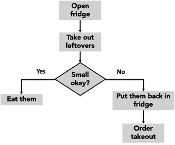

# 第二章：开始

计算机只做两件事，而且仅仅这两件事：执行计算并记住计算结果。但它在这两方面做得极其出色。典型的桌面或背包里的计算机每秒可以执行大约 1000 亿次计算。很难想象这是多么快。想象一下把一个球放在离地面一米高的地方，然后放手。在它落地的那一刻，你的计算机可能已经执行了超过十亿条指令。至于内存，小型计算机可能有数百 GB 的存储。那有多大？如果一个字节（表示一个字符所需的位数，通常是八个）重一克（实际上并不是），100GB 将重达 10 万吨。相比之下，这大约是 16000 头非洲大象的总重量。²

在人类历史的大部分时间里，计算受到人脑计算速度和人手记录计算结果的能力的限制。这意味着只有最小的问题可以通过计算方法解决。即使在现代计算机的速度下，一些问题仍然超出了现代计算模型（例如，全面理解气候变化），但越来越多的问题证明可以通过计算解决。我们希望，当你完成本书时，能够自如地将计算思维应用于解决你在学习、工作乃至日常生活中遇到的许多问题。

我们所说的计算思维是什么？

所有知识都可以被视为**陈述性知识**或**命令性知识**。**陈述性知识**由事实陈述组成。例如，“`x`的平方根是一个数字`y`，使得`y*y = x`，”以及“可以通过火车从巴黎到罗马旅行。”这些都是事实陈述。不幸的是，它们并没有告诉我们如何找到平方根或如何从巴黎乘火车到罗马。

**命令性知识**是“如何”知识，或推导信息的食谱。亚历山大的希罗尼斯是第一个³记录计算平方根的方法的人。他找到平方根的步骤，可以总结为：

1.  1\. 从一个猜测`g`开始。

1.  2\. 如果`g*g`足够接近`x`，则停止并说`g`是答案。

1.  3\. 否则，通过平均`g`和`x/g`来创建一个新的猜测，即`(g + x/g)/2`。

1.  4\. 使用这个新的猜测，我们再次称之为 g，重复这个过程，直到`g*g`足够接近`x`。

考虑找到`25`的平方根。

1.  1\. 将`g`设为某个任意值，例如`3`。

1.  2\. 我们决定`3*3 = 9`不够接近`25`。

1.  3\. 将`g`设为`(3 + 25/3)/2 = 5.67`。⁴

1.  4\. 我们决定`5.67*5.67 = 32.15`仍然没有足够接近`25`。

1.  5\. 将`g`设为`(5.67 + 25/5.67)/2 = 5.04`

1.  6\. 我们决定`5.04*5.04 = 25.4`足够接近，所以我们停止并宣布`5.04`是`25`的平方根的足够近似值。

注意，该方法的描述是一系列简单步骤，以及指定何时执行每个步骤的控制流。这种描述称为**算法**。⁵ 我们用来近似平方根的算法是猜测和检查算法的一个例子。

更正式地说，算法是一系列有限的指令，描述了一组**计算**，当应用于一组输入时，将按照一系列明确定义的状态序列进行，并最终产生一个输出。

算法就像食谱书中的配方：

1.  1\. 将奶油混合物加热。

1.  2\. 搅拌。

1.  3\. 将勺子浸入奶油中。

1.  4\. 取出勺子并在勺背上划过手指。

1.  5\. 如果留下清晰的路径，将奶油从热源上取下并让其冷却。

1.  6\. 否则重复。

配方包括一些测试，用于确定过程何时完成，以及关于执行顺序的指示，有时基于测试跳转到特定指令。

那么如何将食谱的概念转化为机械过程？一种方法是设计一台专门用于计算平方根的机器。尽管听起来很奇怪，但最早的计算机确实是**固定程序计算机**，意味着它们设计用来解决特定的数学问题，比如计算炮弹的轨迹。首台计算机之一（由阿塔纳索夫和贝里于 1941 年建造）解决了线性方程组，但其他问题则无法处理。艾伦·图灵在二战期间开发的波美机被设计用来破解德国恩尼格玛密码。一些简单的计算机仍然沿用这种方法。例如，四则运算计算器⁶就是一种固定程序计算机。它可以进行基本算术运算，但不能用作文字处理器或运行视频游戏。要更改这类机器的程序，必须更换电路。

第一台真正现代化的计算机是曼彻斯特 Mark 1.⁷ 与其前身的显著区别在于它是**存储程序计算机**。这种计算机存储（和操作）一系列指令，并具有能够执行该序列中任何指令的组件。这种计算机的核心是一个**解释器**，可以执行任何合法的指令集，因此可用于计算任何可以用这些指令描述的东西。计算的结果甚至可以是一系列新的指令，随后可以由生成它们的计算机执行。换句话说，计算机可以对自己进行编程。⁸

程序及其操作的数据都驻留在内存中。通常，一个**程序计数器**指向内存中的特定位置，计算从执行该点的指令开始。大多数情况下，解释器会简单地转向序列中的下一条指令，但并不总是如此。在某些情况下，它会执行一个测试，并根据该测试，执行可能跳转到指令序列中的另一个点。这被称为**控制流**，对于让我们编写执行复杂任务的程序至关重要。

人们有时使用**流程图**来描述控制流。根据惯例，我们用矩形框表示处理步骤，用菱形表示测试，用箭头指示执行的顺序。图 1-1 包含了一个展示如何准备晚餐的流程图。

图 1-1 获取晚餐的流程图

回到食谱的比喻，给定一组固定的原料，一个好的厨师可以通过不同的组合制作出无数美味的菜肴。同样，给定一小组固定的基本特征，一个优秀的程序员可以生成无数有用的程序。这就是编程如此惊人之处。

要创建食谱或指令序列，我们需要一种**编程语言**来描述它们，给计算机下达指令的方式。

在 1936 年，英国数学家阿兰·图灵描述了一种假设的计算设备，后来被称为**通用图灵机**。该机器具有无限的内存，表现为可以写入零和一的“磁带”，以及一小部分简单的原始指令用于移动、读取和写入磁带。**教会-图灵理论**指出，如果一个函数是可计算的，那么可以编写一个图灵机来计算它。

教会-图灵理论中的“如果”是重要的。并非所有问题都有计算解决方案。例如，图灵证明了，写一个程序，使其能够接受任意程序作为输入，并且仅当输入程序会永远运行时输出`true`，这是不可能的。这被称为**停机问题**。

教会-图灵理论直接引出了**图灵完备性**的概念。如果一种编程语言可以用于模拟通用图灵机，则称其为图灵完备。所有现代编程语言都是图灵完备的。因此，任何可以用一种编程语言（例如 Python）编程的东西，都可以用任何其他编程语言（例如 Java）编程。当然，在特定语言中，有些东西可能更容易编程，但所有语言在计算能力上基本上是平等的。

幸运的是，没有程序员需要使用图灵的原始指令来构建程序。相反，现代编程语言提供了更大、更方便的原语集。然而，编程作为组装一系列操作的过程这一基本思想仍然是核心。

不论你拥有哪一组原语，以及你有何种组装它们的方法，编程的最好和最糟的地方是一样的：计算机将完全按照你所指示的方式执行——没有更多，也没有更少。这是好事，因为这意味着你可以让计算机做各种有趣和有用的事情。这也是坏事，因为当它没有按照你的意图运行时，你通常只能责怪自己。

世界上有数百种编程语言。没有最好的语言。不同的语言适用于不同类型的应用。MATLAB 例如，是一种适合操作向量和矩阵的良好语言。C 是一种适合编写控制数据网络程序的良好语言。PHP 是一种适合构建网站的良好语言。而 Python 是一种出色的通用语言。

每种编程语言都有一组原始构造、语法、静态语义和语义。类比于自然语言，例如英语，原始构造是单词，语法描述哪些单词序列构成良好格式的句子，静态语义定义哪些句子有意义，而语义定义这些句子的意义。Python 中的原始构造包括**文字**（例如数字`3.2`和字符串`‘abc’）以及**中缀运算符**（例如`+`和`/`）。

一种语言的**语法**定义了哪些字符和符号的字符串是良好格式的。例如，在英语中，字符串“Cat dog boy.”不是语法上有效的句子，因为英语语法不接受<名词> <名词> <名词>形式的句子。在 Python 中，原语序列`3.2 + 3.2`是语法上良好格式的，但序列`3.2 3.2`则不是。

**静态语义**定义了哪些语法上有效的字符串具有意义。例如，考虑字符串“He run quickly”和“I runs quickly。”每个字符串的形式为<pronoun> <regular verb> <adverb>，这是一个语法上可接受的序列。然而，这两者都不是有效的英语，因为有一个相当特殊的规则：对于规则动词，当句子的主语是第一或第二人称时，动词不以“s”结尾，而当主语是第三人称单数时，则以“s”结尾。这些都是静态语义错误的例子。

一种语言的**语义**将含义与每个没有静态语义错误的语法正确的符号串关联。在自然语言中，一个句子的语义可能是模糊的。例如，“我无法过于赞扬这个学生”这句话可以是恭维或谴责。编程语言的设计是确保每个合法程序只有一个确切的含义。

虽然语法错误是最常见的错误类型（尤其是对于学习新编程语言的人来说），但它们是最不危险的错误。每种严肃的编程语言都会检测所有语法错误，并不允许用户执行即使只有一个语法错误的程序。此外，在大多数情况下，语言系统会清楚地指示错误的位置，使程序员能够在不费太多脑筋的情况下修复它。

识别和解决静态语义错误更为复杂。一些编程语言，例如 Java，在允许程序执行之前会进行大量的静态语义检查。其他语言，例如 C 和 Python（可悲的是），在执行程序之前相对较少进行静态语义检查。Python 在运行程序时确实会进行相当多的语义检查。

如果程序没有语法错误和静态语义错误，它就有意义，即具有语义。当然，它可能没有其创建者所意图的语义。当一个程序意味着与其创建者所认为的不同的东西时，坏事可能会发生。

如果程序有错误，并且以意想不到的方式运行，会发生什么？

+   它可能会崩溃，即停止运行并明显指示其已崩溃。在一个设计良好的计算系统中，当程序崩溃时，它不会损坏整体系统。可悲的是，一些非常流行的计算机系统没有这种良好特性。几乎每个使用个人计算机的人都运行过需要重新启动整个系统的程序。

+   它可能会不断运行，运行，再运行，永远不会停止。如果你对程序完成工作的时间没有大致的概念，这种情况可能很难被识别。

+   它可能会运行到完成并产生一个可能正确或可能不正确的答案。

每一个结果都不好，但最后一个无疑是最糟糕的。当一个程序看似在做正确的事情但实际上并非如此时，坏事可能随之而来：财富可能会丧失，患者可能会收到致命剂量的放射治疗，飞机可能会坠毁。

在可能的情况下，程序应编写得如此，当它们运行不正常时，显而易见。我们将在本书中讨论如何做到这一点。

**指法练习**：计算机往往会字面理解你的指令。如果你没有准确告诉它们你想要做什么，它们可能会做错事情。试着为从一个目的地开车到另一个目的地写一个算法。按照你给人的方式来写，然后想象如果那个人像计算机一样愚蠢，并严格执行算法会发生什么。（想看有趣的例子，请查看视频 [`www.youtube.com/watch?v=FN2RM-CHkuI&t=24s`](https://www.youtube.com/watch?v=FN2RM-CHkuI%26t=24s)。）

## 1.1 章节中引入的术语

+   声明式知识

+   命令式知识

+   算法

+   计算

+   固定程序计算机

+   存储程序计算机

+   解释器

+   程序计数器

+   控制流

+   流程图

+   编程语言

+   通用图灵机

+   丘奇-图灵论题

+   停止问题

+   图灵完备性

+   字面量

+   中缀运算符

+   语法

+   静态语义

+   语义
