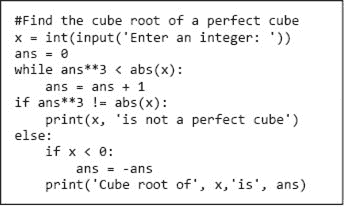
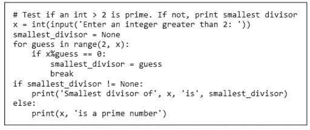
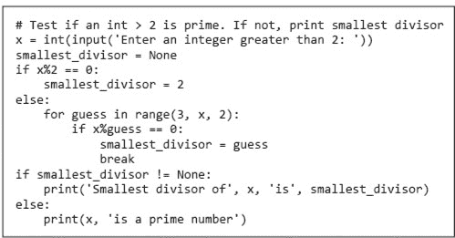
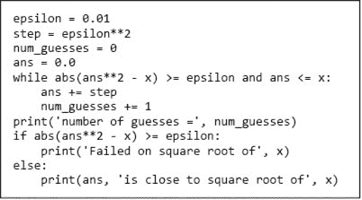
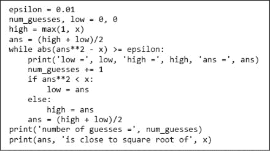
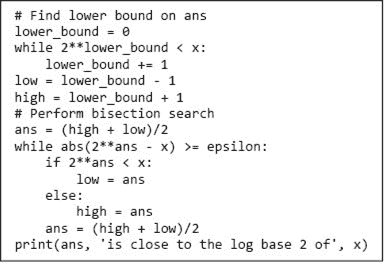
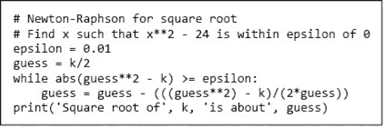

# 第五章：3

一些简单的数值程序

既然我们已经涵盖了一些基本的 Python 结构，现在是时候开始思考如何将这些结构结合起来编写简单的程序。在这个过程中，我们会悄悄引入更多的语言结构和一些算法技术。

## 3.1 穷举枚举

图 3-1 中的代码会打印出一个整数的立方根（如果存在的话）。如果输入不是一个完美的立方，则会打印出相应的消息。操作符 `!=` 意思是“不等于”。



图 3-1 使用穷举枚举来寻找立方根

代码首先尝试将变量 `ans` 设置为 `x` 的绝对值的立方根。如果成功了，接着如果 `x` 为负，则将 `ans` 设置为 `-ans`。在这段代码中，重任（虽说也不算重）是在 `while` 循环中完成的。每当程序包含一个循环时，理解是什么导致程序最终退出这个循环是很重要的。对于什么值的 `x`，这个 `while` 循环会终止？答案是“所有整数”。这一点可以很简单地说明。

+   表达式 `ans**3` 的值从 `0` 开始，每次循环时增大。

+   当其值达到或超过 `abs(x)` 时，循环终止。

+   由于 `abs(x)` 始终是正数，因此在循环必须终止之前，只有有限的迭代次数。

这个论点基于**递减函数**的概念。这个函数具有以下属性：

+   它将一组程序变量映射到一个整数。

+   当循环被进入时，它的值是非负的。

+   当其值 ≤ 0 时，循环终止。

+   它的值在每次循环时减少。

在 图 3-1 中，`while` 循环的递减函数是什么？它是 `abs(x) ‑ ans**3`。

现在，让我们插入一些错误，看看会发生什么。首先，尝试注释掉语句 `ans = 0`。Python 解释器将不断打印错误信息。

```py
`NameError: name 'ans' is not defined`
```

因为解释器尝试在 `ans` 被绑定到任何值之前找到它的绑定值。现在，恢复 `ans` 的初始化，将语句 `ans = ans + 1` 替换为 `ans` `=` `ans`，并尝试寻找 8 的立方根。当你等得不耐烦时，输入“control c”（同时按住 `Ctrl` 键和 `c` 键）。这将把你带回到 shell 的用户提示符。

现在，添加语句

```py
print('Value of the decrementing function abs(x) - ans**3 is',
       abs(x) - ans**3)
```

在循环开始时，再次尝试运行。这次它将打印

```py
Value of the decrementing function abs(x) - ans**3 is 8
```

一遍又一遍地。

程序会永远运行下去，因为循环体不再缩小 `ans**3` 和 `abs(x)` 之间的距离。当遇到一个似乎没有终止的程序时，经验丰富的程序员常常会插入打印语句，比如这里的语句，以测试递减函数是否确实在递减。

本程序使用的算法技术是**猜测与检查**的一种变体，称为**耗尽枚举**。我们枚举所有可能性，直到找到正确答案或穷尽所有可能性。乍一看，这似乎是解决问题的一个极其愚蠢的方法。然而，令人惊讶的是，耗尽枚举算法往往是解决问题的最实际方法。它们通常易于实现和理解，并且在许多情况下，它们的运行速度足够快以满足所有实际需求。去掉或注释掉你为调试插入的打印语句，并重新插入语句`ans = ans + 1`。现在尝试寻找`1957816251`的立方根。程序几乎会瞬间完成。现在试试`7406961012236344616`。

正如你所看到的，即使需要数百万次猜测，运行时间通常也不是问题。现代计算机速度惊人。执行一条指令所需的时间不到一纳秒——十亿分之一秒。很难想象这有多快。为了更好地理解，光在一英尺（0.3 米）中传播的时间稍微超过一纳秒。另一种理解方式是，在你声音传播 100 英尺的时间内，现代计算机可以执行数百万条指令。

仅为好玩，尝试执行该代码。

```py
 max_val = int(input('Enter a postive integer: '))
i = 0
while i < max_val:
    i = i + 1
print(i)
```

看看你需要输入多大的整数，才能在结果打印之前感知到延迟。

让我们看一个耗尽枚举的另一个例子：测试一个整数是否为质数，并在不是时返回最小的因子。质数是大于 1 的整数，仅能被自身和 1 整除。例如，2、3、5 和 111,119 是质数，而 4、6、8 和 62,710,561 不是质数。

确定一个大于 3 的整数`x`是否为质数的最简单方法是将`x`除以 2 到`x-1`之间的每个整数。如果其中任何一个除法的余数为 0，则`x`不是质数，否则`x`是质数。图 3-2 中的代码实现了这种方法。它首先要求用户输入一个整数，将返回的字符串转换为`int`，并将该整数赋值给变量`x`。接着，它通过将`guess`初始化为`2`和将变量`smallest_divisor`初始化为`None`来设置耗尽枚举的初始条件——这表明在未证明的情况下，代码假定`x`为质数。

耗尽枚举是在`for`循环中完成的。当所有可能的`x`的整数因子都已尝试过，或者发现一个`x`的因子时，循环终止。

退出循环后，代码检查`smallest_divisor`的值并打印相应的文本。在进入循环之前初始化变量，然后检查该值在退出时是否已更改是一种常见的技巧。



图 3-2 使用耗尽枚举测试质性。

**练习：** 修改图 3-2 中的代码，使其返回最大而不是最小的除数。提示：如果`y*z = x`且`y`是`x`的最小除数，`z`就是`x`的最大除数。

图 3-2 中的代码能够运行，但效率不必要地低。例如，检查大于 2 的偶数是没有必要的，因为如果一个整数能被任何偶数整除，那么它必定能被 2 整除。图 3-3 中的代码利用了这一点，先测试`x`是否是偶数。如果不是，它会使用循环测试`x`是否能被任何奇数整除。

尽管图 3-3 中的代码比图 3-2 中的代码稍复杂，但它明显更快，因为在循环中检查的数字减少了一半。将代码复杂性与运行效率进行权衡是一个常见现象。但更快并不总意味着更好。简单的代码明显正确，并且仍然足够快以便有用，值得赞美。



图 3-3 更高效的质数测试

**练习：** 编写一个程序，要求用户输入一个整数，并打印两个整数`root`和`pwr`，使得`1 < pwr < 6`并且`root**pwr`等于用户输入的整数。如果不存在这样的整数对，应该打印相应的消息。

**练习：** 编写一个程序，打印大于 2 且小于 1000 的所有质数的和。提示：你可能想要一个循环，其中包含一个嵌套在循环内的质数测试，迭代 3 到 999 之间的奇数。

## 3.2 近似解和二分查找

想象一下，有人要求你编写一个程序，打印任何非负数的平方根。你应该怎么做？

你可能应该先说你需要一个更好的问题陈述。例如，如果被要求找到`2`的平方根，程序应该怎么做？`2`的平方根不是一个有理数。这意味着没有办法精确表示它的值为有限的数字字符串（或作为`float`），所以最初陈述的问题无法解决。

程序可以做的事情是找到平方根的**近似值**——即，接近实际平方根的答案，以便有用。我们稍后将在书中详细讨论这个问题。但现在，让我们把“足够接近”理解为在实际答案的某个常量范围内，称之为`epsilon`。

图 3-4 中的代码实现了一个打印`x`的平方根近似值的算法。



图 3-4 使用穷举枚举来近似平方根

我们再次使用穷举枚举。请注意，这种寻找平方根的方法与您在中学时学到的用铅笔找平方根的方法没有任何共同之处。计算机解决问题的最佳方法通常与手工解决问题的方法大相径庭。

如果`x`是 25，代码将打印

```py
number of guesses = 49990
4.999000000001688 is close to square root of 25
```

我们应该失望于程序没有识别出`25`是一个完全平方并打印`5`吗？不。程序做了它应该做的事。虽然打印`5`也可以，但这样做与打印任何接近`5`的值并没有什么不同。

如果我们设定`x = 0.25`，你认为会发生什么？它会找到接近`0.5`的根吗？不。可惜，它会报告

```py
number of guesses = 2501
Failed on square root of 0.25
```

穷举枚举是一种搜索技术，只有在被搜索的值集合中包含答案时才有效。在这种情况下，我们在枚举`0`到`x`的值。当`x`在`0`和`1`之间时，`x`的平方根不在这个区间内。解决这个问题的一种方法是改变`while`循环第一行中`and`的第二个操作数，以得到

```py
`while abs(ans**2 - x) >= epsilon and ans*ans <= x:`
```

当我们在这个变化后运行代码时，它报告

```py
0.48989999999996237 is close to square root of 0.25
```

现在，让我们想想程序运行需要多长时间。迭代次数取决于答案与我们起始点 0 的接近程度，以及步长的大小。粗略来说，程序最多会执行`while`循环`x/step`次。

让我们尝试在更大的数上运行代码，例如`x = 123456`。它将运行一段时间，然后打印

```py
number of guesses = 3513631
Failed on square root of 123456
```

你认为发生了什么？肯定有一个浮点数可以将`123456`的平方根近似到`0.01`之内。为什么我们的程序没有找到它？问题在于我们的步长太大，程序跳过了所有合适的答案。我们又一次在一个不包含解的空间中进行穷举搜索。试着将`step`设为`epsilon**3`并运行程序。它最终会找到一个合适的答案，但你可能没有耐心等待它。

大概需要多少次猜测？步长将是`0.000001`，`123456`的平方根大约是`351.36`。这意味着程序必须进行大约`351,000,000`次猜测才能找到满意的答案。我们可以通过更接近答案的起始点来加速，但这假设我们知道答案的邻域。

现在是寻找不同方法解决问题的时候了。我们需要选择一个更好的算法，而不是微调当前的算法。但在这样做之前，让我们看一个乍一看与根寻找完全不同的问题。

考虑发现一个以给定字母序列开头的单词是否出现在英语的纸质字典²²中的问题。理论上，穷举枚举是可行的。你可以从第一个单词开始，检查每个单词，直到找到一个以该字母序列开头的单词，或者检查完所有单词。如果字典包含 `n` 个单词，平均需要 `n/2` 次查询才能找到该单词。如果该单词不在字典中，则需要 `n` 次查询。当然，那些曾经在纸质（而非在线）字典中查找单词的人永远不会以这种方式进行。

幸运的是，出版纸质字典的人会费心将单词按字典顺序排列。这使我们能够打开书本到我们认为该单词可能存在的一页（例如，对于以字母 m 开头的单词，通常是在中间附近）。如果字母序列在页面上第一个单词之前，我们就知道要向后查找。如果字母序列在页面上最后一个单词之后，我们就知道要向前查找。否则，我们检查字母序列是否与页面上的单词匹配。

现在我们来把同样的思路应用于寻找 x 的平方根的问题。假设我们知道 `x` 的平方根的一个好近似值位于 `0` 和 `max` 之间。我们可以利用数字是**完全有序**的这一事实。也就是说，对于任何一对不同的数字，`n1` 和 `n2`，要么 `n1 < n2`，要么 `n1 > n2`。因此，我们可以认为 x 的平方根位于以下线段上

`0`_________________________________________________________`max`

然后开始搜索该区间。由于我们不一定知道从哪里开始搜索，让我们从中间开始。

`0`__________________________guess__________________________`max`

如果这不是正确的答案（大多数时候都不是），请询问它是太大还是太小。如果太大，我们知道答案必须在左侧。如果太小，我们知道答案必须在右侧。然后我们在更小的区间上重复这个过程。图 3-5 包含了该算法的实现和测试。



图 3-5 使用二分查找来近似平方根

当运行 `x` = 25 时，它打印

```py
low = 0.0 high = 25 ans = 12.5
low = 0.0 high = 12.5 ans = 6.25
low = 0.0 high = 6.25 ans = 3.125
low = 3.125 high = 6.25 ans = 4.6875
low = 4.6875 high = 6.25 ans = 5.46875
low = 4.6875 high = 5.46875 ans = 5.078125
low = 4.6875 high = 5.078125 ans = 4.8828125
low = 4.8828125 high = 5.078125 ans = 4.98046875
low = 4.98046875 high = 5.078125 ans = 5.029296875
low = 4.98046875 high = 5.029296875 ans = 5.0048828125
low = 4.98046875 high = 5.0048828125 ans = 4.99267578125
low = 4.99267578125 high = 5.0048828125 ans = 4.998779296875
low = 4.998779296875 high = 5.0048828125 ans = 5.0018310546875
numGuesses = 13
5.00030517578125 is close to square root of 25
```

请注意，它找到的答案与我们早期的算法不同。这完全没问题，因为它仍然符合问题的规范。

更重要的是，请注意在循环的每次迭代中，要搜索的空间大小减半。因此，该算法被称为**二分查找**。二分查找相比于我们早期的算法有了巨大的改进，后者在每次迭代中仅减少了少量搜索空间。

让我们再次尝试`x = 123456`。这次程序仅需 30 次猜测就能找到一个可接受的答案。`x = 123456789`呢？仅需 45 次猜测。

使用该算法来寻找平方根并没有什么特别之处。例如，通过将几个`2`改为`3`，我们可以用它来近似一个非负数的立方根。在第四章中，我们将介绍一种语言机制，使我们能够将这段代码推广到寻找任何根。

二分搜索是一种广泛适用的技术，除了寻找根以外还可以用于许多其他事情。例如，图 3-6 中的代码使用二分搜索来寻找`x`的以 2 为底的对数的近似值（即，一个数字`ans`，使得`2**ans`接近于`x`）。它的结构与用于寻找平方根近似值的代码完全相同。它首先找到一个包含合适答案的区间，然后使用二分搜索高效地探索该区间。



图 3-6 使用二分搜索来估计以 2 为底的对数

二分搜索是**逐次逼近**方法的一个示例。这种方法通过一系列猜测来工作，每个猜测都比前一个猜测更接近正确答案。我们将在本章稍后讨论一个重要的逐次逼近算法，牛顿法。

**动手练习：** 如果`x = -25`，那么图 3-5 中的代码会做什么？

**动手练习：** 为了让图 3-5 中的代码能够找到负数和正数的立方根近似值，需要做出什么更改？提示：考虑改变`low`以确保答案位于被搜索的区域内。

**动手练习：** 帝国大厦有 102 层。一名男子想知道他可以从哪个最高楼层扔鸡蛋而不会破。于是他提出从顶楼扔一个鸡蛋。如果鸡蛋破了，他就下降一层，再试一次。他会一直这样做，直到鸡蛋不破。最坏情况下，这种方法需要 102 个鸡蛋。实现一种方法，最多只使用七个鸡蛋。

## 3.3 关于使用浮点数的几点说明

大多数情况下，`float`类型的数字能够 reasonably 地近似真实数字。但“在大多数情况下”并不意味着在所有情况下，当它们不准确时，可能会导致意想不到的后果。例如，尝试运行以下代码：

```py
x = 0.0
for i in range(10):
    x = x + 0.1
if x == 1.0:
    print(x, '= 1.0')
else:
    print(x, 'is not 1.0')
```

或许你和大多数人一样，发现它打印的结果令人惊讶。

```py
0.9999999999999999 is not 1.0
```

为什么它首先会进入`else`语句呢？

要理解为什么会发生这种情况，我们需要了解在计算过程中浮点数是如何在计算机中表示的。要理解这一点，我们需要了解**二进制数**。

当你第一次学习十进制数字——即以 `10` 为底的数字——时，你了解到任何十进制数字可以通过数字 `0123456789` 的序列表示。最右边的数字是 `10`⁰ 位，向左下一个数字是 `10`¹ 位，等等。例如，十进制数字序列 `302` 表示 `3` * `100` + `0` * `10 + 2` * `1`。一个长度为 `n` 的序列可以表示多少不同的数字？长度为 `1` 的序列可以表示 10 个数字（`0-9`）；长度为 2 的序列可以表示 100 个不同的数字（`0-99`）。更一般地，长度为 n 的序列可以表示 `10`^n 个不同的数字。

二进制数字——以 `2` 为底的数字——工作原理类似。一个二进制数字由一系列数字表示，每个数字要么是 `0` 要么是 `1`。这些数字通常称为**位**。最右边的数字是 `2`⁰ 位，向左下一个数字是 `2`¹ 位，等等。例如，二进制数字序列 `101` 表示 `1` * `4 + 0` * `2 + 1` * `1 = 5`。一个长度为 n 的序列可以表示多少不同的数字？ `2`^n。

**手指练习：** 二进制数 `10011` 的十进制等值是多少？

也许因为大多数人有十根手指，我们喜欢用十进制表示数字。另一方面，所有现代计算机系统都是用二进制表示数字。这并不是因为计算机天生只有两根手指，而是因为构建只能处于开或关两种状态的硬件**开关**很简单。计算机使用二进制表示法而人类使用十进制表示法可能会导致偶尔的认知失调。

在现代编程语言中，非整数数字使用一种称为**浮点**的表示法实现。暂时假设内部表示是十进制。我们可以将数字表示为一对整数——数字的**有效数字**和一个**指数**。例如，数字 `1.949` 可以表示为一对 `(1949, -3)`，这表示 `1949` * `10`^(-3) 的乘积。

有效数字的数量决定了数字的**精度**。例如，如果只有两个有效数字，数字 `1.949` 将无法精确表示。它必须被转换为某种近似值，在这种情况下是 `1.9`。这种近似值称为**舍入值**。

现代计算机使用二进制而不是十进制表示法。它们以二进制而不是十进制表示有效数字和指数，并将 `2` 而不是 `10` 提升到指数。例如，十进制数字 `0.625`（`5/8`）表示为一对 `(101, -11)`；因为 `101` 是数字 5 的二进制表示，`-11` 是 -3 的二进制表示，所以一对 `(101, -11)` 表示 `5` * `2`^(-3) = 5/8 = 0.625。

那么十进制分数`1/10`，我们在 Python 中写作`0.1`，最佳的四个有效二进制数字是`(0011, -101)`。这相当于`3/32`，即`0.09375`。如果我们有五个有效二进制数字，我们将`0.1`表示为`(11001, -1000)`，这相当于`25/256`，即`0.09765625`。我们需要多少个有效数字才能准确表示`0.1`的浮点数？无限多个数字！不存在整数`sig`和`exp`使得`sig` * `2^(-exp)`等于`0.1`。因此，无论 Python（或任何其他语言）使用多少位来表示浮点数，它只能表示对`0.1`的近似。在大多数 Python 实现中，浮点数可用`53`位精度，因此存储的十进制数`0.1`的有效数字将是。

```py
11001100110011001100110011001100110011001100110011001
```

这相当于十进制数。

```py
0.1000000000000000055511151231257827021181583404541015625
```

非常接近`1/10`，但并不完全是`1/10`。

回到最初的谜题，为什么。

```py
`x = 0.0 for i in range(10):     x = x + 0.1 if x == 1.0:     print(x, '= 1.0') else:     print(x, 'is not 1.0')`
```

打印。

```py
0.9999999999999999 is not 1.0
```

``我们现在看到测试`x == 1.0`的结果为`False`，因为`x`绑定的值并不完全等于`1.0`。这解释了为什么执行了`else`分支。但为什么在`0.1`的浮点表示稍大于`0.1`时，系统却认为`x`小于`1.0`？因为在循环的某次迭代中，Python 的有效数字用完了，进行了向下的四舍五入。如果我们在`else`分支末尾添加代码`print x == 10.0*0.1`，会打印出`False`。这与我们小学老师教的不同，但十次加`0.1`的结果并不等于将`0.1`乘以`10`。顺便说一下，如果你想明确地对浮点数进行四舍五入，使用`round`函数。表达式`round(x, num_digits)`返回将`x`的值四舍五入到小数点后`num_digits`位的浮点数。例如，打印`round(2**0.5, 3)`会打印`1.414`，作为`2`的平方根的近似值。    实际数与浮点数之间的差异真的重要吗？大多数情况下，谢天谢地，它并不重要。`0.9999999999999999`、`1.0`和`1.00000000000000001`之间的差异几乎没有影响。然而，有一件事几乎总是值得担心，那就是等式测试。正如我们所见，使用`==`比较两个浮点值可能会产生令人惊讶的结果。询问两个浮点值是否足够接近，几乎总是比询问它们是否相同更合适。因此，例如，写`abs(x‑y) < 0.0001`要比`x == y`更好。    另一个需要担心的问题是舍入误差的积累。大多数时候事情运转良好，因为有时存储在计算机中的数字比预期稍大，有时则稍小。然而，在某些程序中，误差会朝同一方向累积。``  ``## 3.4 牛顿–拉弗森方法²³    最常用的近似算法通常归因于艾萨克·牛顿。通常称为牛顿法，有时也称为**牛顿–拉弗森**方法。²⁴ 它可以用于找到许多函数的实根，但我们只在寻找单变量多项式的实根的背景下讨论它。推广到多个变量的多项式在数学和算法上都是直接的。    一个**多项式**（按照约定，我们将变量写为`*x*`）要么是 0，要么是有限个非零项的和，例如`3*x*² + 2*x* + 3`。每一项，例如`3*x*²`，由一个常数（这一项的**系数**，在本例中为`3`）乘以变量（在本例中为`*x*`），后者的指数为非负整数（在本例中为`2`）。项的指数称为该项的**次数**。多项式的次数是任何单一项的最大次数。一些例子是`3`（次数为`0`）、`2.5*x* + 12`（次数为`1`）和`3*x*²`（次数为`2`）。    如果`*p*`是一个多项式，`*r*`是一个实数，我们将写`*p*(*r*)`表示多项式在`*x* = *r*`时的值。多项式`*p*`的一个**根**是方程`*p* = 0`的解，即使得`*p*(*r*) = 0`的`*r*`。例如，寻找`24`的平方根的近似值的问题可以表述为寻找一个`*x*`，使得`*x*² − 24`接近于`0`。    牛顿证明了一个定理，意味着如果一个值，称为`*guess*`，是多项式的根的近似值，那么`*guess* − 𝑝(*guess*)/𝑝’(*guess*)`（其中`*p*’`是`*p*`的一阶导数）是比`*guess*`更好的近似值。    一个函数`*f*(*x*)`的一阶导数可以理解为表达`*f*(*x*)`的值相对于`*x*`的变化。例如，一个常数的一阶导数是`0`，因为常数的值不变。对于任何项`*c***x^p*`，该项的一阶导数是`*c***p***x^p*^(−1)`。因此，形式为  的多项式的一阶导数是  为了找到一个数字的平方根，例如*k*，我们需要找到一个值*x*，使得`*x*² − *k* = 0`。这个多项式的一阶导数就是`2*x*`。因此，我们知道可以通过选择下一个猜测为`*guess* − (*guess*² − 𝑘)/2 * *guess*`来改进当前猜测。图 3-7 包含代码，展示如何使用该方法快速找到平方根的近似值。      图 3-7 牛顿–拉弗森方法的实现      **指尖练习：**在牛顿–拉弗森的实现中添加一些代码，以跟踪找到根所用的迭代次数。将该代码作为一个程序的一部分，比较牛顿–拉弗森法与二分搜索的效率。（你会发现牛顿–拉弗森法更高效。）    ## 3.5 本章引入的术语    *   递减函数 *   猜测与检查 *   穷举枚举 *   近似 *   全序 *   二分搜索 *   逐次近似 *   二进制数 *   位 *   开关 *   浮点数 *   有效数字 *   指数 *   精度 *   舍入 *   牛顿–拉弗森 *   多项式 *   系数 *   次数 *   根```
