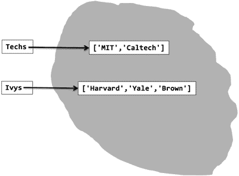
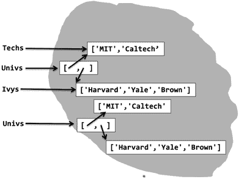
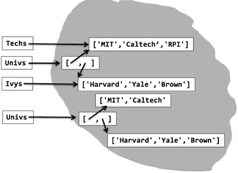
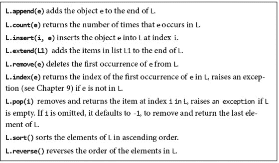
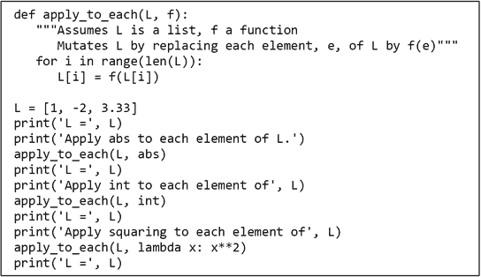
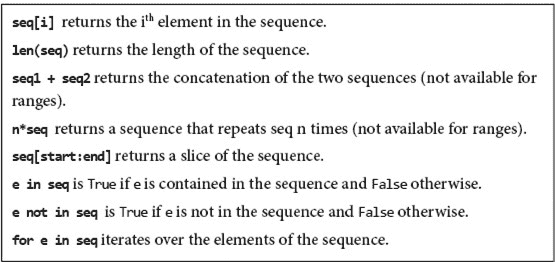
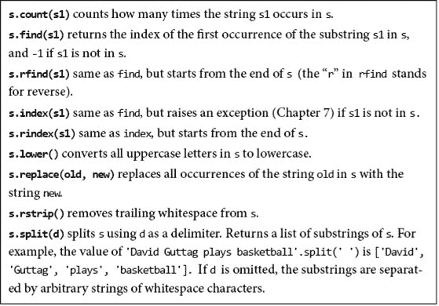
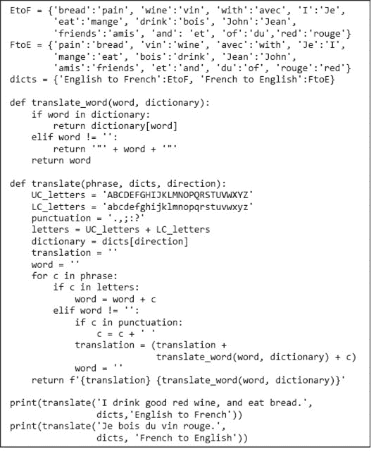
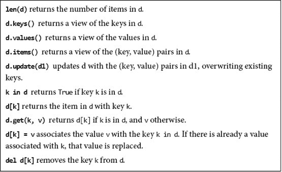

# 第七章：5

结构化类型与可变性

到目前为止，我们所查看的程序处理了三种类型的对象：`int`、`float`和`str`。数值类型`int`和`float`是标量类型。也就是说，这些类型的对象没有可访问的内部结构。相比之下，`str`可以被认为是结构化或非标量类型。我们可以使用索引提取字符串中的单个字符，并使用切片提取子字符串。

在本章中，我们介绍四种额外的结构化类型。其中，`tuple`是对`str`的简单概括。其他三种——`list`、`range`和`dict`——则更有趣。我们还将回到高阶编程的话题，通过一些示例说明能够以与其他类型的对象相同的方式对待函数的实用性。

## 5.1 元组

像字符串一样，**元组**是不可变的有序元素序列。不同之处在于，元组的元素不一定是字符。单个元素可以是任何类型，且不必彼此具有相同类型。

类型为`tuple`的字面量是通过将用逗号分隔的元素列表括在圆括号中来书写的。例如，我们可以写

```py
t1 = ()
t2 = (1, ‘two', 3)
print(t1)
print(t2)
```

不出所料，`print`语句产生的输出是

```py
()
(1, ‘two', 3)
```

看这个例子，你可能会认为包含单一值`1`的元组应该写作`(1)`。但是，引用 H.R. Haldeman 引用理查德·尼克松的话，“这样做是错误的。” ³³ 由于圆括号用于分组表达式，`(1)`仅仅是写整数`1`的一种冗长方式。为了表示包含此值的单例元组，我们写作`(1,)`。几乎所有使用 Python 的人都有过一次或多次不小心省略那个恼人的逗号的经历。

可以对元组使用重复操作。例如，表达式`3*('a', 2)`的值为`('a', 2, 'a', 2, 'a', 2)`。

像字符串一样，元组可以连接、索引和切片。考虑一下

```py
t1 = (1, ‘two', 3)
t2 = (t1, 3.25)
print(t2)
print((t1 + t2))
print((t1 + t2)[3])
print((t1 + t2)[2:5]) 
```

第二个赋值语句将名称`t2`绑定到一个包含`t1`所绑定的元组和浮点数`3.25`的元组。这是可能的，因为元组和 Python 中的其他一切一样，都是一个对象，所以元组可以包含元组。因此，第一个`print`语句产生的输出是，

```py
((1, ‘two', 3), 3.25)
```

第二个`print`语句打印由绑定到`t1`和`t2`的值连接生成的值，这是一个包含五个元素的元组。它产生的输出是

```py
(1, ‘two', 3, (1, ‘two', 3), 3.25)
```

下一个语句选择并打印连接后的元组的第四个元素（与往常一样，在 Python 中，索引从`0`开始），紧接着的语句创建并打印该元组的切片，产生的输出是

```py
(1, ‘two', 3)
(3, (1, ‘two', 3), 3.25)
```

可以使用`for`语句遍历元组的元素。并且可以使用`in`运算符测试一个元组是否包含特定值。例如，以下代码

```py
def intersect(t1, t2):
    """Assumes t1 and t2 are tuples
       Returns a tuple containing elements that are in
          both t1 and t2"""
    result = ()
    for e in t1:
        if e in t2:
            result += (e,)
    return result
print(intersect((1, 'a', 2), ('b', 2, 'a')))
```

打印`('a', 2)`。

### 5.1.1 多重赋值

如果你知道序列的长度（例如，元组或字符串），使用 Python 的**多重赋值**语句提取单独元素会很方便。例如，语句`x, y = (3, 4)`会将`x`绑定为`3`，将`y`绑定为`4`。类似地，语句`a, b, c = 'xyz'`会将`a`绑定为`'x'`，`b`绑定为`'y'`，`c`绑定为`'z'`。

当与返回多个值的函数一起使用时，这种机制特别方便。考虑函数定义

```py
 def find_extreme_divisors(n1, n2):
    """Assumes that n1 and n2 are positive ints
        Returns a tuple containing the smallest common divisor > 1 and 
          the largest common divisor of n1 & n2\. If no common divisor,
          other than 1, returns (None, None)"""
    min_val, max_val = None, None
    for i in range(2, min(n1, n2) + 1):
        if n1%i == 0 and n2%i == 0:
            if min_val == None:
                min_val = i
            max_val = i
    return min_val, max_val
```

多重赋值语句

```py
min_divisor, max_divisor = find_extreme_divisors(100, 200)
```

将`min_divisor`绑定为`2`，将`max_divisor`绑定为`200`。

## 5.2 范围与可迭代对象

如第 2.6 节所述，函数`range`生成`range`类型的对象。与字符串和元组一样，`range`类型的对象是不可变的。所有元组上的操作也适用于范围，除了连接和重复。例如，`range(10)[2:6][2]`的结果是`4`。当使用`==`运算符比较`range`类型的对象时，如果两个范围表示相同的整数序列，则返回`True`。例如，`range(0, 7, 2) == range(0, 8, 2)`的结果为`True`。然而，`range(0, 7, 2) == range(6, -1, -2)`的结果为`False`，因为虽然两个范围包含相同的整数，但它们的顺序不同。

与`tuple`类型的对象不同，`range`类型的对象所占用的空间与其长度无关。因为一个范围完全由其起始、结束和步长值定义，所以它可以存储在较小的空间中。

`range`最常见的用法是在`for`循环中，但`range`类型的对象可以在任何可以使用整数序列的地方使用。

在 Python 3 中，`range`是**可迭代** **对象**的特例。所有可迭代类型都有一个方法，³⁴`__iter__`，返回**类型迭代器**的对象。然后，可以在`for`循环中使用该迭代器逐个返回对象序列。例如，元组是可迭代的，`for`语句

```py
for elem in (1, 'a', 2, (3, 4)):
```

创建一个迭代器，逐个返回元组的元素。Python 有许多内置的可迭代类型，包括字符串、列表和字典。

许多有用的内置函数可以作用于可迭代对象。其中一些更有用的包括`sum`、`min`和`max`。函数`sum`可以应用于数字的可迭代对象，返回元素的总和。函数`max`和`min`可以应用于有明确定义的元素顺序的可迭代对象。

**指尖练习：** 写一个表达式，计算一个数字元组的均值。使用函数`sum`。

## 5.3 列表与可变性

像元组一样，**列表**是值的有序序列，每个值由索引标识。`list`类型的文字表达语法类似于元组；不同之处在于我们使用方括号而不是圆括号。空列表写作`[]`，单例列表则写作不带（很容易忘记的）逗号的形式。

由于列表是可迭代的，我们可以使用`for`语句来迭代列表中的元素。因此，例如，代码

```py
L = ['I did it all', 4, 'love']
for e in L:
    print(e)
```

产生的输出，

```py
I did it all
4
Love
```

我们也可以像对元组一样对列表进行索引和切片。例如，代码

```py
`L1 = [1, 2, 3] L2 = L1[-1::-1] for i in range(len(L1)):     print(L1[i]*L2[i])`
```

打印

```py
3
4
3
```

用方括号执行三种不同的用途（`list`类型的文字、对可迭代对象的索引和对可迭代对象的切片）可能导致视觉上的混淆。例如，表达式`[1,2,3,4][1:3][1]`，它的值为`3`，在三种方式中使用了方括号。这在实践中很少成为问题，因为大多数时候，列表是逐步构建的，而不是作为文字书写的。

列表与元组在一个重要方面不同：列表是**可变**的。相反，元组和字符串是**不可变**的。许多运算符可用于创建不可变类型的对象，并且变量可以绑定到这些类型的对象。但不可变类型的对象在创建后无法被修改。另一方面，可变类型的对象在创建后可以被修改。

修改对象和将对象赋值给变量之间的区别在开始时可能看起来微妙。然而，如果你不断重复这个咒语：“在 Python 中，变量仅仅是一个名称，即可以附加到对象上的标签，”这会带来清晰的理解。或许下面的一组示例也会有所帮助。

当这些语句

```py
Techs = ['MIT', 'Caltech'] 
Ivys = ['Harvard', 'Yale', 'Brown']
```

当这些语句执行时，解释器创建两个新列表并将适当的变量绑定到它们，如图 5-1 所示。



图 5-1 两个列表

赋值语句

```py
Univs = [Techs, Ivys]
Univs1 = [['MIT', 'Caltech'], ['Harvard', 'Yale', 'Brown']]
```

还可以创建新列表并将变量绑定到它们。这些列表的元素本身也是列表。三个打印语句

```py
print('Univs =', Univs)
print('Univs1 =', Univs1)
print(Univs == Univs1)
```

产生的输出

```py
Univs = [['MIT', 'Caltech'], ['Harvard', 'Yale', 'Brown']]
Univs1 = [['MIT', 'Caltech'], ['Harvard', 'Yale', 'Brown']]
True
```

看起来好像`Univs`和`Univs1`绑定到相同的值。但表象可能会欺骗。如图 5-2 所示，`Univs`和`Univs1`绑定到完全不同的值。



图 5-2 两个看似具有相同值但实际上不相同的列表

`Univs`和`Univs1`绑定到不同对象可以通过内置 Python 函数`**id**`验证，该函数返回对象的唯一整数标识符。这个函数使我们能够通过比较它们的 id 来测试**对象相等性**。测试对象相等性的更简单方法是使用`**is**`运算符。当我们运行代码时

```py
print(Univs == Univs1) #test value equality
print(id(Univs) == id(Univs1)) #test object equality
print(Univs is Univs1) #test object equality
print('Id of Univs =', id(Univs))
print('Id of Univs1 =', id(Univs1))
```

打印

```py
True
False
False
Id of Univs = 4946827936
Id of Univs1 = 4946612464
```

（如果你运行这段代码，不要指望看到相同的唯一标识符。Python 的语义并未说明每个对象关联的标识符是什么；它仅要求没有两个对象具有相同的标识符。）

请注意，在图 5-2 中，`Univs`的元素不是与`Techs`和`Ivys`绑定的列表的副本，而是这些列表本身。`Univs1`的元素是包含与`Univs`中列表相同元素的列表，但它们不是相同的列表。我们可以通过运行代码来看到这一点

```py
print('Ids of Univs[0] and Univs[1]', id(Univs[0]), id(Univs[1]))
print('Ids of Univs1[0] and Univs1[1]', id(Univs1[0]), id(Univs1[1]))
```

其打印结果为

```py
Ids of Univs[0] and Univs[1] 4447807688 4456134664
Ids of Univs1[0] and Univs1[1] 4447805768 4447806728
```

为什么值与对象相等之间的差异会引起如此大的关注？这很重要，因为列表是可变的。考虑以下代码

```py
Techs.append('RPI')
```

列表的`append`方法有一个**副作用**。它不是创建一个新列表，而是通过在现有列表`Techs`的末尾添加一个新元素（本例中是字符串`'RPI'`）来修改现有列表。图 5-3 描绘了执行`append`后计算的状态。



图 5-3 可变性的演示

与`Univs`绑定的对象仍然包含相同的两个列表，但其中一个列表的内容已被更改。因此，`print`语句

```py
print('Univs =', Univs)
print('Univs1 =', Univs1)
```

现在生成的输出是

```py
Univs = [['MIT', 'Caltech', 'RPI'], ['Harvard', 'Yale', 'Brown']]
Univs1 = [['MIT', 'Caltech'], ['Harvard', 'Yale', 'Brown']]
```

我们在这里看到的叫做**别名**。有两条不同的路径指向同一个列表对象。一条路径通过变量`Techs`，另一条通过与`Univs`绑定的`list`对象的第一个元素。我们可以通过任一条路径修改对象，并且修改的效果将通过两条路径可见。这可能很方便，但也可能是危险的。无意中的别名会导致编程错误，这些错误往往非常难以追踪。例如，你认为以下代码打印什么

```py
L1 = [[]]*2
L2 = [[], []]
for i in range(len(L1)):
    L1[i].append(i)
    L2[i].append(i)
print('L1 =', L1, 'but', 'L2 =', L2)
```

它打印出`L1 = [[0, 1], [0, 1]]`但`L2 = [[0], [1]]`。为什么？因为第一个赋值语句创建了一个包含两个元素的列表，而这两个元素是同一个对象，而第二个赋值语句创建了一个包含两个不同对象的列表，这两个对象最初都是空列表。

**手指练习：** 以下代码打印什么？

```py
`L = [1, 2, 3] L.append(L) print(L is L[-1])`
```

别名和可变性与默认参数值的相互作用是需要注意的事项。考虑以下代码

```py
def append_val(val, list_1 = []):
    List_1.append(val)
    print(list_1)

append_val(3)
append_val(4)
```

你可能认为第二次调用`append_val`会打印出列表`[4]`，因为它会将`4`添加到空列表中。实际上，它将打印`[3, 4]`。这是因为在函数定义时，创建了一个新类型为`list`的对象，初始值为空列表。每次调用`append_val`而不提供正式参数`list_1`的值时，函数定义时创建的对象会绑定到`list_1`，被修改，然后被打印。因此，第二次调用`append_val`会修改并打印已经被第一次调用该函数修改过的列表。

当我们将一个列表附加到另一个列表时，例如`Techs.append(Ivys)`，原始结构保持不变。结果是一个包含列表的列表。假设我们不想保持这种结构，而是想将一个列表的元素添加到另一个列表中。我们可以使用列表连接（使用`+`运算符）或`extend`方法来做到这一点，例如，

```py
L1 = [1,2,3]
L2 = [4,5,6]
L3 = L1 + L2
print('L3 =', L3)
L1.extend(L2)
print('L1 =', L1)
L1.append(L2)
print('L1 =', L1)
```

将打印

```py
L3 = [1, 2, 3, 4, 5, 6]
L1 = [1, 2, 3, 4, 5, 6]
L1 = [1, 2, 3, 4, 5, 6, [4, 5, 6]]
```

请注意，运算符`+`没有副作用。它创建一个新列表并返回它。相反，`extend`和`append`都会改变`L1`。

图 5-4 简要描述了一些与列表相关的方法。请注意，除了`count`和`index`，所有这些方法都会改变列表。



图 5-4 与列表相关的常见方法

### 5.3.1 克隆

通常，避免在迭代时改变一个列表是明智的。考虑以下代码

```py
def remove_dups(L1, L2):
    """Assumes that L1 and L2 are lists.
       Removes any element from L1 that also occurs in L2"""
    for e1 in L1:
        if e1 in L2:
            L1.remove(e1)
L1 = [1,2,3,4]
L2 = [1,2,5,6]
Remove_dups(L1, L2)
print('L1 =', L1)
```

你可能会惊讶地发现这会打印

```py
L1 = [2, 3, 4]
```

在`for`循环期间，Python 使用一个内部计数器跟踪当前在列表中的位置，该计数器在每次迭代结束时递增。当计数器的值达到列表的当前长度时，循环终止。如果在循环中列表没有被改变，这样的行为是可以预期的，但如果列表被改变，可能会有意想不到的后果。在这种情况下，隐藏的计数器初始值为`0`，发现`L1[0]`在`L2`中，并将其移除——将`L1`的长度减少到`3`。计数器接着递增到`1`，代码继续检查`L1[1]`的值是否在`L2`中。请注意，这不是`L1[1]`的原始值（即`2`），而是`L1[1]`的当前值（即`3`）。正如你所看到的，弄清楚在循环中修改列表时发生了什么是可能的，但并不容易。而且，发生的事情可能是无意的，就像这个例子一样。

避免这种问题的一种方法是使用切片来**克隆**³⁵（即，创建一个副本）列表，并写作`for e1 in L1[:]`。请注意，写作

```py
new_L1 = L1
for e1 in new_L1:
```

并不会解决问题。它不会创建`L1`的副本，而仅仅为现有列表引入一个新名称。

切片并不是在 Python 中克隆列表的唯一方法。表达式`L.copy()`与`L[:]`的值相同。切片和`copy`都执行所谓的**浅拷贝**。浅拷贝创建一个新列表，然后将要复制列表的对象（而不是对象的副本）插入到新列表中。代码

```py
L = [2]
L1 = [L]
L2 = L1[:]
L2 = copy.deepcopy(L1)
L.append(3)
print(f'L1 = {L1}, L2 = {L2}')
```

打印`L1 = [[2, 3]] L2 = [[2, 3]]`，因为`L1`和`L2`都包含在第一条赋值语句中绑定到`L`的对象。

如果要复制的列表包含可变对象且你也希望复制它们，请导入标准库模块`copy`并使用`copy.deepcopy`函数进行**深复制**。方法`deepcopy`创建一个新列表，然后将待复制列表中的对象复制到新列表中。如果我们将上述代码的第三行替换为`L2 = copy.deepcopy(L1)`，它将打印`L1 = [[2, 3]], L2 = [[2]]`，因为`L1`不会包含`L`所绑定的对象。

如果列表的元素是包含列表（或任何可变类型）的列表，理解`copy.deepcopy`会比较棘手。考虑

```py
L1 = [2]
L2 = [[L1]]
L3 = copy.deepcopy(L2)
L1.append(3)
```

`L3`的值将为`[[[2]]]`，因为`copy.deepcopy`不仅为列表`[L1]`创建新对象，也为列表`L1`创建新对象。也就是说，它会复制到最底层——大多数情况下。为什么是“大多数情况下”？代码

```py
L1 = [2]
L1.append(L1)
```

创建一个包含自身的列表。尝试复制到最底层将永远不会终止。为了解决这个问题，`copy.deepcopy`对每个对象仅制作一次副本，然后在每个对象实例中使用该副本。即使在列表不包含自身的情况下，这也很重要。例如，

```py
L1 = [2]
L2 = [L1, L1]
L3 = copy.deepcopy(L2)
L3[0].append(3)
print(L3)
```

打印`[[2, 3], [2, 3]]`，因为`copy.deepcopy`对`L1`进行了一次复制，并在`L2`中两次使用。

### 5.3.2 列表推导式

**列表推导式**提供了一种简洁的方式，通过迭代可迭代对象的值来应用操作。它创建一个新列表，其中每个元素是对可迭代对象中的某个值（例如，另一个列表的元素）应用给定操作的结果。其表达形式为

```py
 [*expr* for *elem* in *iterable* if *test*]
```

评估该表达式等同于调用函数

```py
def f(expr, old_list, test = lambda x: True):
    new_list = []
    for e in iterable:
        if test(e):
            new_list.append(expr(e))
    return new_list
```

例如，`[e**2 for e in range(6)]`评估为`[0, 1, 4, 9, 16, 25]`，`[e**2 for e in range(8) if e%2 == 0]`评估为`[0, 4, 16, 36]`，`[x**2 for x in [2, 'a', 3, 4.0] if type(x) == int]`评估为`[4, 9]`。

列表推导式提供了一种方便的方式来初始化列表。例如，`[[] for _ in range(10)]`生成一个包含 10 个不同（即非别名）空列表的列表。变量名`_`表示该变量的值未在生成列表的元素中使用，即它仅是一个占位符。这种约定在 Python 程序中很常见。

Python 允许在列表推导式中使用多个`for`语句。考虑以下代码

```py
L = [(x, y)
     for x in range(6) if x%2 == 0
     for y in range(6) if y%3 == 0]
```

Python 解释器首先评估第一个`for`，将值序列`0,2,4`赋给`x`。对于这三个`x`的值，它会评估第二个`for`（每次生成值序列`0,3`）。然后它将元组`(x, y)`添加到正在生成的列表中，从而生成列表

```py
[(0, 0), (0, 3), (2, 0), (2, 3), (4, 0), (4, 3)]
```

当然，我们可以不使用列表推导式生成相同的列表，但代码会显得相对不够简洁：

```py
L = []
for x in range(6):
    if x%2 == 0:
        for y in range(6):
            if y%3 == 0:
                L.append((x, y))
```

以下代码是将列表推导式嵌套在另一个列表推导式中的示例。

```py
print([[(x,y) for x in range(6) if x%2 == 0]
     for y in range(6) if y%3 == 0])
```

它打印`[[ (0, 0), (2, 0), (4, 0)], [(0, 3), (2, 3), (4, 3)]]`。

熟悉嵌套列表推导需要实践，但它们可以非常有用。让我们使用嵌套列表推导生成一个小于 100 的所有质数的列表。基本思想是使用一个推导生成所有候选数字的列表（即 2 到 99），第二个推导生成将候选质数除以每个潜在除数的余数的列表，以及使用内置函数`all`来测试这些余数中是否有任何为 0。

```py
[x for x in range(2, 100) if all(x % y != 0  for y in range(3, x))]
```

评估表达式等同于调用该函数

```py
def gen_primes():
    primes = []
    for x in range(2, 100):
        is_prime = True
        for y in range(3, x):
            if x%y == 0:
                is_prime = False
        if is_prime:
            primes.append(x)
    return primes
```

**手指练习**：编写一个列表推导，生成 2 到 100 之间的所有非质数。

一些 Python 程序员以奇妙而微妙的方式使用列表推导。这并不总是一个好主意。请记住，其他人可能需要阅读你的代码，而“微妙”通常不是程序的理想属性。

## 5.4 列表的高阶操作

在第 4.4 节中，我们介绍了高阶编程的概念。对于列表来说，它特别方便，如图 5-5 所示。



图 5-5 对列表元素应用函数

函数`apply_to_each`被称为**高阶**，因为它的参数本身就是一个函数。第一次调用时，它通过对每个元素应用一元内置函数`abs`来修改`L`。第二次调用时，它对每个元素进行类型转换。第三次调用时，它通过应用使用`lambda`定义的函数来替换每个元素。它打印

```py
L = [1, -2, 3.33]
Apply abs to each element of L.
L = [1, 2, 3.33]
Apply int to each element of [1, 2, 3.33].
L = [1, 2, 3]
Apply squaring to each element of [1, 2, 3].
L = [1, 4, 9]
```

Python 有一个内置的高阶函数`map`，它类似于但比图 5-5 中定义的`apply_to_each`函数更通用。在它最简单的形式中，`map`的第一个参数是一个一元函数（即只有一个参数的函数），第二个参数是适合作为第一个参数的值的任何有序集合。它通常用作列表推导的替代。例如，`list(map(str, range(10)))`等价于`[str(e) for e in range(10)]`。

`map`函数通常与`for`循环一起使用。在`for`循环中使用时，`map`的行为类似于`range`函数，它为循环的每次迭代返回一个值。这些值是通过将第一个参数应用于第二个参数的每个元素生成的。例如，代码

```py
`for i in map(lambda x: x**2, [2, 6, 4]):     print(i)` 
```

打印

```py
4
36
16
```

更一般地说，`map`的第一个参数可以是一个有`n`个参数的函数，此时它必须后跟`n`个后续有序集合（每个集合长度相同）。例如，代码

```py
L1 = [1, 28, 36]
L2 = [2, 57, 9]
for i in map(min, L1, L2):
    print(i)
```

打印

```py
1
28
9
```

**手指练习**：实现一个满足以下规范的函数。提示：在实现的主体中使用`lambda`会很方便。

```py
def f(L1, L2):
    """L1, L2 lists of same length of numbers
    returns the sum of raising each element in L1
    to the power of the element at the same index in L2
    For example, f([1,2], [2,3]) returns 9"""
```

## 5.5 字符串、元组、范围和列表

我们已经看过四种可迭代的序列类型：`str`、`tuple`、`range` 和 `list`。它们相似之处在于这些类型的对象可以按照图 5-6 中描述的方式进行操作。它们的其他一些相似性和差异在图 5-7 中总结。



图 5-6 序列类型的常见操作


图 5-7 序列类型的比较

Python 程序员往往比使用元组更频繁地使用列表。由于列表是可变的，因此可以在计算过程中逐步构建。例如，以下代码逐步构建一个包含另一个列表中所有偶数的列表。

```py
even_elems = []
for e in L:
    if e%2 == 0:
        even_elems.append(e)
```

由于字符串只能包含字符，因此它们的通用性远不如元组或列表。另一方面，当你处理字符字符串时，有许多有用的内置方法。图 5-8 包含了其中一些方法的简短描述。请记住，由于字符串是不可变的，这些方法都返回值，并且没有副作用。



图 5-8 字符串上的一些方法

一个更有用的内置方法是 `split`，它接受两个字符串作为参数。第二个参数指定一个分隔符，用于将第一个参数拆分为一系列子字符串。例如，

```py
print('My favorite professor–John G.–rocks'.split(' '))
print('My favorite professor–John G.–rocks'.split('-'))
print('My favorite professor–John G.–rocks'.split('–'))
```

打印

```py
['My', 'favorite', 'professor–John', 'G.–rocks']
['My favorite professor', '', 'John G.', '', 'rocks']
['My favorite professor', 'John G.', 'rocks']
```

第二个参数是可选的。如果省略该参数，第一个字符串将使用任意的**空白字符**（空格、制表符、换行符、回车和换页）进行分割。³⁶

## 5.6 集合

**集合**是另一种集合类型。它们类似于数学中的集合概念，因为它们是无序的独特元素集合。它们用程序员称之为大括号、数学家称之为集合括号的符号表示，例如，

```py
`baseball_teams = {'Dodgers', 'Giants', 'Padres', 'Rockies'} football_teams = {'Giants', 'Eagles', 'Cardinals', 'Cowboys'}`
```

由于集合的元素是无序的，尝试索引集合，例如，评估 `baseball_teams[0]` 会产生运行时错误。我们可以使用 `for` 语句来迭代集合的元素，但与我们看到的其他集合类型不同，元素产生的顺序是未定义的。

像列表一样，集合是可变的。我们使用 `add` 方法向集合中添加单个元素。通过将元素集合（例如列表）传递给 `update` 方法来向集合中添加多个元素。例如，代码

```py
baseball_teams.add('Yankees')
football_teams.update(['Patriots', 'Jets'])
print(baseball_teams)
print(football_teams)
```

打印

```py
{'Dodgers', 'Yankees', 'Padres', 'Rockies', 'Giants'}
{'Jets', 'Eagles', 'Patriots', 'Cowboys', 'Cardinals', 'Giants'}
```

（元素出现的顺序并不由语言定义，因此如果运行此示例，可能会得到不同的输出。）

可以使用 `remove` 方法从集合中移除元素，如果元素不在集合中则会引发错误，或者使用 `discard` 方法，如果元素不在集合中则不会引发错误。

可以使用 `in` 运算符测试一个对象是否属于集合。例如，`'Rockies' in baseball_teams` 返回 `True`。二元方法 `union`、`intersection`、`difference` 和 `issubset` 具有通常的数学含义。例如，

```py
`print(baseball_teams.union({1, 2})) print(baseball_teams.intersection(football_teams)) print(baseball_teams.difference(football_teams)) print({'Padres', 'Yankees'}.issubset(baseball_teams))`
```

打印

```py
{'Padres', 'Rockies', 1, 2, 'Giants', ‘Dodgers', 'Yankees'}
{'Giants'}
{'Padres', 'Rockies', ‘Dodgers', 'Yankees'}
True
```

集合的一个好处是许多方法都有方便的中缀运算符，包括 `|` 表示 `union`，`&` 表示 `intersect`，`-` 表示 `difference`，`<=` 表示 `subset`，以及 `>=` 表示 `superset`。使用这些运算符可以使代码更易读。例如比较，

```py
print(baseball_teams | {1, 2})
print(baseball_teams & football_teams)
print(baseball_teams - football_teams)
print({'Padres', 'Yankees'} <= baseball_teams)
```

与之前呈现的代码相同，它使用点表示法打印相同的值。

并非所有类型的对象都可以成为集合的元素。集合中的所有对象必须是**可哈希的**。一个对象是可哈希的，如果它有

+   一个将对象映射到 `int` 的 `__hash__` 方法，并且 `__hash__` 返回的值在对象生命周期内不会改变，并且

+   一个用于比较它与其他对象相等的 `__eq__` 方法。

Python 的标量不可变类型的所有对象都是可哈希的，而 Python 内置的可变类型的对象则不可哈希。一个非标量不可变类型的对象（例如，元组）是可哈希的，当且仅当它的所有元素都是可哈希的。

## 5.7 字典

`**dict**` 类型的对象（即**字典**的缩写）与列表类似，只不过我们使用**键**而不是整数来索引它们。任何可哈希对象都可以用作键。可以将字典视为键/值对的集合。类型 `dict` 的字面量用大括号括起来，每个元素写为键后跟冒号再跟**值**。例如，代码

```py
month_numbers = {'Jan':1, 'Feb':2, 'Mar':3, 'Apr':4, 'May':5,
                1:'Jan', 2:'Feb', 3:'Mar', 4:'Apr', 5:'May'}
print(month_numbers)
print('The third month is ' + month_numbers[3])
dist = month_numbers['Apr'] - month_numbers['Jan']
print('Apr and Jan are', dist, 'months apart')
```

将打印

```py
{'Jan': 1, 'Feb': 2, 'Mar': 3, 'Apr': 4, 'May': 5, 1: 'Jan', 2: 'Feb', 3: 'Mar', 4: 'Apr', 5: 'May'}
The third month is Mar
Apr and Jan are 3 months apart
```

`dict` 中的条目不能使用索引访问。这就是为什么 `month_numbers[1]` 明确指向键为 `1` 的条目，而不是第二个条目。可以使用 `in` 运算符测试一个键是否在字典中定义。

像列表一样，字典是可变的。我们可以通过编写，例如，`month_numbers['June'] = 6` 来添加条目，或通过编写，例如，`month_numbers['May'] = 'V'.` 来更改条目。

字典是 Python 的一大亮点。它们大大减少了编写各种程序的难度。例如，在 图 5-9 中，我们使用字典编写了一个（相当糟糕的）程序来进行语言之间的翻译。

图中的代码打印

```py
Je bois "good" rouge vin, et mange pain. 
I drink of wine red.
```

请记住，字典是可变的。因此，要注意副作用。例如，

```py
FtoE['bois'] = 'wood'
print(translate('Je bois du vin rouge.', dicts, 'French to English'))
```

将打印

```py
I wood of wine red.
```



图 5-9 翻译文本（糟糕地）

许多编程语言没有内置类型来提供从键到值的映射。相反，程序员使用其他类型来提供类似的功能。例如，使用列表实现字典相对简单，其中每个元素是表示键/值对的元组。然后我们可以编写一个简单的函数来进行关联检索，例如，

```py
def key_search(L, k):
    for elem in L:
        if elem[0] == k:
            return elem[1]
    return None
```

这种实现的问题在于其计算效率低下。在最坏的情况下，程序可能必须检查列表中的每个元素才能执行一次检索。相比之下，内置实现速度很快。它使用了一种称为哈希的技术，如第十二章所述，能够在几乎不依赖字典大小的时间内进行查找。

有多种方法可以使用`for`语句遍历字典中的条目。如果`d`是一个字典，形式为`for k in d`的循环会遍历`d`的键。选择键的顺序是根据它们在字典中插入的顺序。³⁷ 例如，

```py
capitals = {'France': 'Paris', 'Italy': 'Rome', 'Japan': 'Kyoto'}
for key in capitals:
    print('The capital of', key, 'is', capitals[key])
```

打印

```py
The capital of France is Paris
The capital of Italy is Rome
The capital of Japan is Kyoto
```

要遍历字典中的值，我们可以使用`values`方法。例如，

```py
cities = []
for val in capitals.values():
    cities.append(val)
print(cities, 'is a list of capital cities')
```

打印`['巴黎', '罗马', '京都'] 是一个首都城市的列表`。

`values`方法返回类型为`dict_values`的对象。这是一个**视图对象**的示例。视图对象是动态的，如果与之关联的对象发生更改，变化将通过视图对象可见。例如，代码

```py
cap_vals = capitals.values()
print(cap_vals)
capitals['Japan'] = ‘Tokyo'
print(cap_vals)
```

打印

```py
dict_values(['Paris', 'Rome', 'Kyoto'])
dict_values(['Paris', 'Rome', ‘Toyko'])
```

同样，`keys`方法返回类型为`dict_keys`的视图对象。视图对象可以转换为列表，例如，`list(capitals.values())`返回一个包含首都值的列表。

要遍历键/值对，我们使用`items`方法。此方法返回类型为`dict_items`的视图对象。类型为`dict_items`的对象的每个元素都是一个包含键及其关联值的`tuple`。例如，代码

```py
 for key, val in capitals.items():
    print(val, 'is the capital of', key)
```

打印

```py
Paris is the capital of France
Rome is the capital of Italy
Tokyo is the capital of Japan
```

**指尖练习：** 实现一个满足规范的函数

```py
 def get_min(d):
    """d a dict mapping letters to ints
       returns the value in d with the key that occurs first in the
       alphabet. E.g., if d = {x = 11, b = 12}, get_min returns 12."""
```

使用元组作为键通常很方便。想象一下，使用形式为`(flight_number, day)`的元组来表示航空公司航班。然后很容易将这些元组作为键用于实现航班与到达时间映射的字典。列表不能用作键，因为列表类型的对象是不可哈希的。

正如我们所看到的，字典有许多有用的方法，包括一些用于删除元素的方法。我们不会在这里列举所有这些方法，但在书中的示例中会方便地使用它们。图 5-10 包含一些更有用的字典操作。



图 5-10 字典上的一些常见操作

## 5.8 字典推导式

**字典推导式**类似于列表推导式。一般形式是

```py
{*key*: *value* for *id1*, *id2* in *iterable* if *test*}
```

关键区别（除了使用大括号而不是方括号）是它使用两个值来创建字典的每个元素，并允许（但不要求）可迭代对象同时返回两个值。考虑一个将某些十进制数字映射到英语单词的字典：

```py
number_to_word = {1: 'one', 2: ‘two', 3: ‘three', 4: 'four', 10: ‘ten'}
```

我们可以轻松地使用字典推导式来生成一个将单词映射到数字的字典。

```py
word_to_number = {w: d for d, w in number_to_word.items()}
```

如果我们决定只想在`word_to_number`中使用单个数字，我们可以使用推导式。

```py
word_to_number = {w: d for d, w in number_to_word.items() if d < 10}
```

现在，让我们尝试一些更有挑战性的内容。**密码**是一种算法，它将**明文**（人类可以轻松阅读的文本）映射到**密文**。最简单的密码是替换密码，它用一个独特的字符串替换明文中的每个字符。从原始字符到替换它们的字符串的映射称为**密钥**（与打开锁所用的钥匙类似，而不是用于 Python 字典的那种钥匙）。在 Python 中，字典提供了一种方便的方式来实现可以用于编码和解码文本的映射。

**书本密码**是一种密钥来源于书籍的密码。例如，它可能将明文中的每个字符映射到该字符在书中首次出现的数字索引（或书页上的索引）。假设发送者和接收者之前已达成一致使用的书，但拦截编码信息的对手并不知道使用了哪本书。

以下函数定义使用字典推导创建一个字典，该字典可用于使用书本密码编码明文。

```py
 gen_code_keys = (lambda book, plain_text:(
    {c: str(book.find(c)) for c in plain_text}))
```

如果 `plain_text` 是 “no is no” 并且 `book` 以 “从前，在一个遥远的地方有一所房子” 开头，则调用 `gen_code_keys(book, plain_text)` 会返回。

```py
{'n': '1', 'o': '7', ' ': '4', 'i': '13', ‘s': '26'}
```

顺便提一下，o 映射为七而不是零，因为 o 和 O 是不同的字符。如果 `book` 是 *堂吉诃德* 的文本，³⁸ 调用 `gen_code_keys(book, plain_text)` 将返回。

```py
{'n': '1', 'o': '13', ' ': '2', 'i': '6', ‘s': '57'}
```

现在我们有了编码字典，可以使用列表推导定义一个函数，利用它来加密明文。

```py
 encoder = (lambda code_keys, plain_text:
    ''.join(['*' + code_keys[c] for c in plain_text])[1:])
```

由于明文中的字符可能被多个字符替换为密文中的字符，我们使用 `*` 来分隔密文中的字符。`.join` 操作符用于将字符串列表转换为单个字符串。

函数 `encrypt` 使用 `gen_code_keys` 和 `encoder` 来加密明文。

```py
encrypt = (lambda book, plain_text:
    encoder(gen_code_keys(book, plain_text), plain_text))
```

调用 `encrypt(Don_Quixote, 'no is no')` 返回。

```py
1*13*2*6*57*2*1*13 
```

在我们能够解码密文之前，需要构建一个解码字典。简单的做法是反转编码字典，但那样会不诚实。书本密码的核心在于发送者发送加密信息，但没有关于密钥的任何信息。接收者解码信息所需的唯一条件是获得编码者使用的书。以下函数定义使用字典推导从书和编码信息构建解码密钥。

```py
 gen_decode_keys = (lambda book, cipher_text:
    {s: book[int(s)] for s in cipher_text.split('*')})
```

调用 `gen_decode_keys(Don_Quixote, '1*13*2*6*57*2*1*13')` 会产生解密密钥。

```py
{'1': 'n', '13': 'o', '2': ' ', '6': 'i', '57': ‘s'}
```

如果明文中出现的字符在书中不存在，就会发生一些不好的事情。`code_keys` 字典会将每个这样的字符映射到 `-1`，而 `decode_keys` 会将 `-1` 映射到书中最后一个字符。

**指尖练习**：解决上一段描述的问题。提示：简单的方法是通过向原始书籍附加内容来创建一本新书。

**指尖练习**：以`encoder`和`encrypt`为模型，实现`decoder`和`decrypt`函数。使用它们解密消息

```py
22*13*33*137*59*11*23*11*1*57*6*13*1*2*6*57*2*6*1*22*13*33*137*59*11*23*11*1*57*6*173*7*11
```

使用*唐吉诃德*的开头进行加密。

## 5.9 章节引入的术语

+   元组

+   多重赋值

+   可迭代对象

+   类型迭代器

+   列表

+   可变类型

+   不可变类型

+   id 函数

+   对象相等

+   副作用

+   别名

+   克隆

+   浅拷贝

+   深拷贝

+   列表推导式

+   高阶函数

+   空白字符

+   集合

+   可哈希类型

+   字典

+   键

+   值

+   视图对象

+   字典推导式

+   书本密码
