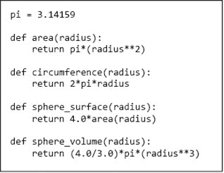
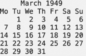
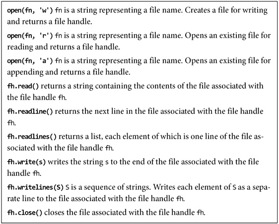

# 第九章：7

模块和文件

到目前为止，我们假设 1）我们的整个程序存储在一个文件中，2）我们的程序不依赖于之前编写的代码（除了实现 Python 的代码），以及 3）我们的程序不访问之前收集的数据，也不以允许在程序运行结束后访问的方式存储结果。

第一个假设在程序较小时是完全合理的。然而，随着程序的增大，将不同部分存储在不同文件中通常更方便。比如说，想象一下多个开发者在同一个程序上工作。如果他们都试图更新同一个文件，那将是一场噩梦。在第 7.1 节中，我们讨论了一种机制，即 Python 模块，它允许我们轻松地从多个文件中的代码构建程序。

第二和第三个假设对于旨在帮助人们学习编程的练习是合理的，但在编写旨在完成某些有用功能的程序时，这种假设很少是合理的。在第 7.2 节中，我们展示了如何利用标准 Python 发行版中的库模块。在本章中，我们使用了其中几个模块，而在书的后面部分还会使用许多其他模块。第 7.3 节简要介绍了如何从文件中读取和写入数据。

## 7.1  模块

**模块**是一个包含 Python 定义和语句的`.py`文件。例如，我们可以创建一个包含图 7-1 中的代码的文件`circle.py`。



图 7-1 与圆和球体相关的一些代码

程序通过**导入语句**访问模块。例如，代码

```py
import circle
pi = 3
print(pi)
print(circle.pi)
print(circle.area(3))
print(circle.circumference(3))
print(circle.sphere_surface(3))
```

将打印

```py
3
3.14159
28.27431
18.849539999999998
113.09724
```

模块通常存储在单独的文件中。每个模块都有自己的私有符号表。因此，在`circle.py`中，我们以通常的方式访问对象（例如，`pi`和`area`）。执行`import M`将在`import`出现的作用域中为模块`M`创建一个绑定。因此，在导入上下文中，我们使用点表示法来表明我们引用的是在导入模块中定义的名称。⁴⁶ 例如，在`circle.py`之外，引用`pi`和`circle.pi`可以（并且在这种情况下确实）指代不同的对象。

初看，使用点表示法似乎有些繁琐。另一方面，当导入一个模块时，通常不知道该模块的实现中可能使用了哪些局部名称。使用点表示法**完全** **限定** 名称避免了因意外名称冲突而导致的错误。例如，在`circle`模块之外执行赋值`pi = 3`不会改变在`circle`模块中使用的`pi`的值。

正如我们所见，一个模块可以包含可执行语句以及函数定义。通常，这些语句用于初始化模块。因此，模块中的语句仅在模块首次被导入到程序时执行。此外，每个解释器会话中，一个模块只会被导入一次。如果你启动一个控制台，导入一个模块，然后更改该模块的内容，解释器仍将使用原始版本的模块。这在调试时可能导致令人困惑的行为。当有疑问时，请启动一个新的 shell。

一种允许导入程序在访问导入模块内定义的名称时省略模块名称的`import`语句变体。执行语句`from M import *`会在当前作用域中创建对`M`中定义的所有对象的绑定，但不包括`M`本身。例如，代码

```py
from circle import *
print(pi)
print(circle.pi)
```

首先会打印`3.14159`，然后生成错误信息

```py
`NameError: name 'circle' is not defined`
```

许多 Python 程序员对使用这种“通配符”`import`表示不满。他们认为这会使代码更难以阅读，因为不再明显一个名称（例如上述代码中的`pi`）是在哪里定义的。

一种常用的导入语句变体是

```py
import *module_name* as *new_name*
```

这指示解释器导入名为*module_name*的模块，但将其重命名为*new_name*。如果*module_name*在导入程序中已被用于其他用途，这将非常有用。程序员使用这种形式的最常见原因是为长名称提供一个缩写。

## 7.2 使用预定义包

许多有用的模块包作为**标准 Python 库**的一部分而提供；我们将在本书后面使用其中的一些。此外，大多数 Python 发行版还附带标准库以外的包。Python 3.8 的 Anaconda 发行版包含超过 600 个包！我们将在本书后面使用其中的一些。

在这一节中，我们介绍两个标准包，`math`和`calendar`，并给出一些简单的使用示例。顺便提一下，这些包与所有标准模块一样，使用我们尚未涉及的 Python 机制（例如，异常，在第九章中讨论）。

在之前的章节中，我们介绍了近似对数的各种方法。但我们没有告诉你最简单的方法。最简单的方法是简单地导入模块`math`。例如，要打印以 2 为底的 x 的对数，你只需写

```py
import math
print(math.log(x, 2))
```

除了包含大约 50 个有用的数学函数外，`math`模块还包含几个有用的浮点常量，例如`math.pi`和`math.inf`（正无穷大）。

设计用于支持数学编程的标准库模块仅占标准库模块的一小部分。

想象一下，比如你想打印 1949 年 3 月星期几的文本表示，就像右侧的图片。你可以在线查找那个月和那年的日历。然后，凭借足够的耐心和多次尝试，你可能会写出一个可以完成这项工作的打印语句。或者，你也可以简单地写



```py
import calendar as cal
cal_english = cal.TextCalendar()
print(cal_english.formatmonth(1949, 3))
```

或者，如果你更喜欢用法语、波兰语和丹麦语查看日历，你可以写

```py
print(cal.LocaleTextCalendar(locale='fr_FR').formatmonth(2049, 3))
print(cal.LocaleTextCalendar(locale='pl_PL').formatmonth(2049, 3))
print(cal.LocaleTextCalendar(locale='da_dk').formatmonth(2049, 3))
```

将产生


假设你想知道 2033 年圣诞节是星期几。该行

```py
 print(cal.day_name[cal.weekday(2033, 12, 25)])
```

将回答这个问题。调用`cal.weekday`将返回一个表示星期几的整数，⁴⁷，然后用它来索引`cal.day_name`——一个包含英语星期几的列表。

现在，假设你想知道 2011 年美国感恩节是星期几。星期几很简单，因为美国感恩节总是在 11 月的第四个星期四。⁴⁸ 找到实际日期稍微复杂一些。首先，我们使用`cal.monthcalendar`获取一个表示月份周数的列表。列表的每个元素包含七个整数，表示月份的日期。如果该日期在该月不存在，则该周的列表第一个元素将为`0`。例如，如果一个有 31 天的月份从星期二开始，则列表的第一个元素将是`[0, 1, 2, 3, 4, 5, 6]`，而列表的最后一个元素将是`[30, 31, 0, 0, 0, 0, 0]`。

我们使用`calendar.monthcalendar`返回的列表来检查第一周是否有一个星期四。如果有，第四个星期四就在这个月的第四周（即索引 3）；否则，它在第五周。

```py
def find_thanksgiving(year):
    month = cal.monthcalendar(year, 11)
    if month[0][cal.THURSDAY] != 0:
        thanksgiving = month[3][cal.THURSDAY]
    else:
        thanksgiving = month[4][cal.THURSDAY]
    return thanksgiving
print('In 2011', 'U.S. Thanksgiving was on November',
      find_thanksgiving(2011))
```

**指尖练习：** 编写一个满足规范的函数。

```py
 def shopping_days(year):
    """year a number >= 1941
       returns the number of days between U.S. Thanksgiving and
               Christmas in year"""
```

**指尖练习：** 自 1958 年以来，加拿大感恩节在十月的第二个星期一举行。编写一个接受年份（>1957）作为参数的函数，返回加拿大感恩节与圣诞节之间的天数。

按惯例，Python 程序员通常

1.  1\. 每行导入一个模块。

1.  2\. 将所有导入放在程序的开头。

1.  3\. 首先导入标准模块，其次是第三方模块（例如，通过 Anaconda 提供的模块），最后是特定应用程序的模块。

有时将所有导入放在程序的开头会导致问题。导入语句是可执行的代码行，Python 解释器在遇到时会执行它。一些模块包含在导入模块时会执行的代码。通常，这些代码初始化模块所使用的一些对象。由于这些代码可能会访问共享资源（例如计算机上的文件系统），因此导入在程序中的执行位置可能很重要。好消息是，这不太可能成为你可能使用的模块的问题。

## 7.3 文件

每个计算机系统使用 **文件** 来保存从一次计算到下一次计算的内容。Python 提供了许多创建和访问文件的功能。这里我们展示一些基本的功能。

每个操作系统（例如 Windows 和 macOS）都有自己用于创建和访问文件的文件系统。Python 通过一种称为 **文件句柄** 的方式实现操作系统的独立性。代码

```py
name_handle = open('kids', 'w')
```

指示操作系统创建一个名为 `kids` 的文件，并返回该文件的文件句柄。`open` 的参数 `'w'` 表示文件将以 **写入** 模式打开。以下代码 **打开** 一个文件，使用 `**write**` 方法写入两行。（在 Python 字符串中，转义字符“`\`”用于表示下一个字符应以特殊方式处理。在这个例子中，字符串 `'\n'` 表示 **换行符**。）最后，代码 **关闭** 该文件。记得在程序使用完文件后关闭它。否则，有可能某些或所有写入的数据不会被保存。

```py
name_handle = open('kids', 'w')
for i in range(2):
    name = input('Enter name: ')
    name_handle.write(name + '\n')
name_handle.close()
```

你可以通过使用 `**with**` 语句来确保不会忘记关闭文件。此形式的代码

```py
with open(*file_name*) as *name_handle*:
   *code_block*
```

打开一个文件，将一个本地名称绑定到它，可以在 *code_block* 中使用，并在 *code_block* 退出时关闭该文件。

以下代码以 **读取** 模式打开一个文件（使用参数 `'r'`），并打印其内容。由于 Python 将文件视为一系列行，我们可以使用 `for` 语句遍历文件的内容。

```py
with open('kids', 'r') as name_handle:
    for line in name_handle:
        print(line)
```

如果我们输入大卫和安德烈亚的名字，这将打印。

```py
David
Andrea
```

大卫和安德烈亚之间的额外行是因为打印在文件中每行末尾遇到 `'\n'` 时会开始新的一行。我们可以通过写 `print(line[:-1])` 来避免打印额外的行。

代码

```py
name_handle = open('kids', 'w')
name_handle.write('Michael')
name_handle.write('Mark')
name_handle.close()
name_handle = open('kids', 'r')
for line in name_handle:
    print(line)
```

将打印单行 `MichaelMark`。

注意，我们已经覆盖了文件 `kids` 的先前内容。如果我们不想这样做，可以使用参数 `'a'` 打开文件以 **追加** 模式（而不是写入模式）。例如，如果我们现在运行代码

```py
name_handle = open('kids', 'a')
name_handle = open('kids', 'a')
name_handle.write('David')
name_handle.write('Andrea')
name_handle.close()
name_handle = open('kids', 'r')
for line in name_handle:
    print(line)
```

它将打印行 `MichaelMarkDavidAndrea`。

**指尖练习**：编写一个程序，首先将斐波那契数列的前十个数字存储到名为`fib_file`的文件中。每个数字应单独占一行。程序然后从文件中读取这些数字并打印出来。

对文件的一些常见操作总结在图 7-2 中。



图 7-2 访问文件的常见函数

## 7.4 本章介绍的术语

+   模块

+   导入语句

+   完全限定名称

+   标准 Python 库

+   文件

+   文件句柄

+   写入和读取

+   从文件中

+   换行符

+   打开和关闭文件

+   with 语句

+   追加到文件
