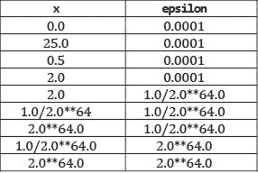
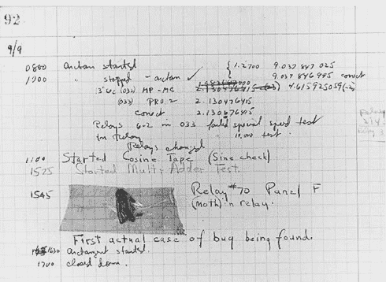
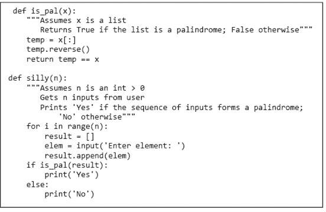

# 第十章：8

测试和调试

我们不想提起这一点，但庞格洛斯博士⁴⁹错了。我们并不生活在“所有可能世界中最好的世界”里。有些地方降雨太少，有些地方降雨太多。有些地方太冷，有些地方太热，有些地方夏天太热而冬天太冷。有时股市大幅下跌。有时作弊者会赢（参见休斯顿太空人队）。而且令人恼火的是，我们的程序并不总是在第一次运行时就正常工作。

关于如何处理最后一个问题已经有书籍问世，从这些书中有很多可以学习的东西。然而，为了给你提供一些可能帮助你按时完成下一个问题集的提示，本章提供了这一主题的高度浓缩讨论。虽然所有的编程示例都是用 Python 写的，但一般原则适用于让任何复杂系统正常工作。

**测试**是运行程序以试图确定其是否按预期工作的过程。**调试**是尝试修复一个你已经知道不按预期工作的程序的过程。

测试和调试并不是你在程序构建后才应该考虑的过程。优秀的程序员以更容易进行测试和调试的方式设计他们的程序。做到这一点的关键是将程序拆分成可以独立实现、测试和调试的组件。在本书的这一点上，我们只讨论了一种模块化程序的机制，即函数。因此，目前为止，我们的所有示例将围绕函数进行。当我们涉及其他机制，特别是类时，我们会回到本章讨论的一些主题。

使程序正常工作的第一步是让语言系统同意运行它——也就是说，消除那些在不运行程序的情况下就能检测到的语法错误和静态语义错误。如果你在编程中还没有过这一关，那你还不准备好进入本章。多花点时间做一些小程序，然后再回来。

## 8.1 测试

测试的目的是显示存在错误，而不是证明程序没有错误。引用艾兹格·迪杰斯特拉的话：“程序测试可以用来显示错误的存在，但永远不能证明它们的缺失！” ⁵⁰ 或者，正如阿尔伯特·爱因斯坦所说：“任何实验都无法证明我正确；一个实验可以证明我错误。”

为什么会这样？即使是最简单的程序也有数十亿种可能的输入。比如，考虑一个声称满足规格的程序。

```py
def is_smaller(x, y):
     """Assumes x and y are ints
        Returns True if x is less than y and False otherwise."""
```

在所有整数对上运行它，至少可以说是乏味的。我们能做的最好是对那些在程序中存在错误的情况下，有合理概率产生错误答案的整数对进行测试。

测试的关键在于找到一个输入集合，称为**测试套件（test suite）**，它有较高的可能性揭示缺陷，但运行时间不应过长。做到这一点的关键是将所有可能输入的空间划分为提供关于程序正确性的等效信息的子集，然后构建一个包含每个划分至少一个输入的测试套件。（通常，构建这样的测试套件实际上是不可能的。可以将其视为一个不可实现的理想。）

一个集合的**划分**将该集合分为一组子集，使得原集合的每个元素正好属于一个子集。例如，考虑`is_smaller(x, y)`。可能输入的集合是所有整数的成对组合。划分这个集合的一种方式是将其分为九个子集：

```py
`x positive, y positive, x < y x positive, y positive, y < x x negative, y negative, x < y x negative, y negative, y < x x negative, y positive x positive, y negative x = 0, y = 0 x = 0, y` `≠ 0 x ≠ 0, y = 0`
```

如果我们在这些子集的每个值上测试实现，如果存在缺陷，我们有很好的机会（但没有保证）暴露出该缺陷。

对于大多数程序，找到良好的输入划分远比说起来容易。通常，人们依赖于基于探索代码和规范某种组合的不同路径的启发式方法。基于通过代码探索路径的启发式方法属于**透明盒（glass-box）**（或**白盒（white-box）**）**测试**类。基于通过规范探索路径的启发式方法属于**黑盒测试（black-box testing）**类。

### 8.1.1 黑盒测试

原则上，黑盒测试是在不查看要测试代码的情况下构建的。黑盒测试允许测试人员和实现人员来自不同的群体。当我们这些教授编程课程的人为分配给学生的问题集生成测试用例时，我们正在开发黑盒测试套件。商业软件的开发者通常拥有与开发组基本独立的质量保证组。他们也会开发黑盒测试套件。

这种独立性降低了生成测试套件时错误与代码中错误相关联的可能性。例如，假设程序的作者做出了隐含但无效的假设，即一个函数永远不会被负数调用。如果同一个人构建了程序的测试套件，他很可能会重复这个错误，而不测试负参数的函数。

黑盒测试的另一个积极特征是它对实现变化的鲁棒性。由于测试数据是在不知实现的情况下生成的，因此实现变更时测试无需更改。

正如我们之前所说，生成黑盒测试数据的一个好方法是通过规范探索路径。考虑这个规范。

```py
def sqrt(x, epsilon):
    """Assumes x, epsilon floats
               x >= 0
               epsilon > 0
       Returns result such that
               x-epsilon <= result*result <= x+epsilon"""
```

在这个规范中似乎只有两条不同的路径：一条对应于`x = 0`，另一条对应于`x > 0`。然而，常识告诉我们，虽然必须测试这两种情况，但这远远不够。

边界条件也应进行测试。查看类型为列表的参数通常意味着查看空列表、只有一个元素的列表、不可变元素的列表、可变元素的列表，以及包含列表的列表。处理数字时，通常意味着查看非常小和非常大的值以及“典型”值。例如，对于`sqrt`，尝试值`x`和`epsilon`与图 8-1 中的值相似可能是有意义的。



图 8-1 测试边界条件

前四行旨在表示典型案例。注意，`x`的值包括一个完全平方数、一个小于一的数和一个具有无理平方根的数。如果这些测试中的任何一个失败，则程序中存在需要修复的错误。

剩余的行测试`x`和`epsilon`的极大和极小值。如果这些测试中的任何一个失败，就需要修复某些内容。可能代码中存在一个需要修复的错误，或者可能需要更改规范，以便更容易满足。例如，期望在`epsilon`极小的情况下找到平方根的近似值可能是不合理的。

另一个重要的边界条件是别名。考虑代码

```py
def copy(L1, L2):
    """Assumes L1, L2 are lists
       Mutates L2 to be a copy of L1"""
    while len(L2) > 0: #remove all elements from L2
        L2.pop() #remove last element of L2
    for e in L1: #append L1's elements to initially empty L2
        L2.append(e)
```

这通常可以正常工作，但在`L1`和`L2`指向同一列表时则不然。任何未包含形式为`copy(L, L)`的调用的测试套件，都无法揭示这个错误。

### 8.1.2 玻璃盒测试

黑箱测试绝不能被跳过，但它通常是不够的。没有查看代码的内部结构，无法知道哪些测试用例可能提供新信息。考虑这个简单的例子：

```py
def is_prime(x):
    """Assumes x is a nonnegative int
       Returns True if x is prime; False otherwise"""
    if x <= 2:
        return False
    for i in range(2, x):
        if x%i == 0:
            return False
    return True
```

查看代码后，我们可以看到由于测试`if x <= 2`，值`0`、`1`和`2`被视为特例，因此需要进行测试。如果不查看代码，可能不会测试`is_prime(2)`，因此不会发现函数调用`is_prime(2)`返回`False`，错误地表示`2`不是素数。

玻璃盒测试套件通常比黑盒测试套件更容易构建。规范（包括本书中的许多规范）通常是不完整的，且相当粗糙，这使得估计黑盒测试套件对有趣输入空间的探索程度变得具有挑战性。相比之下，代码路径的概念是明确的，评估探索的彻底程度相对容易。实际上，有商业工具可用于客观地测量玻璃盒测试的完整性。

一个玻璃盒测试套件是**路径完整**的，如果它测试程序中的每一个潜在路径。这通常是无法实现的，因为它取决于每个循环执行的次数和每次递归的深度。例如，递归实现的阶乘对每个可能的输入遵循不同的路径（因为递归的层数不同）。

此外，即使是路径完整的测试套件也不能保证所有的 bug 都会被暴露。考虑：

```py
def abs(x):
    """Assumes x is an int
       Returns x if x>=0 and –x otherwise"""
    if x < -1:
        return -x
    else:
        return x
```

规范建议有两种可能情况：`x`要么为负，要么不是。这表明输入集合`{2, -2}`足以探索规范中的所有路径。这个测试套件还有一个额外的优点，就是强迫程序遍历所有路径，因此它看起来像是一个完整的玻璃盒测试套件。唯一的问题是，这个测试套件不会暴露`abs(-1)`会返回`-1`的事实。

尽管玻璃盒测试存在局限性，但通常值得遵循一些经验法则：

+   针对所有`if`语句的两个分支都要进行测试。

+   确保每个`except`子句（见第九章）都被执行。

+   对于每个`for`循环，设置测试用例，其中

    +   ○ 循环未被进入（例如，如果循环是迭代列表中的元素，请确保在空列表上进行测试）。

    +   ○ 循环体被执行恰好一次。

    +   ○ 循环体被执行多于一次。

+   对于每个`while`循环

    +   ○ 查看与处理`for`循环时相同类型的情况。

    +   ○ 包含对应于所有可能退出循环的测试用例。例如，对于一个以

    +   `while len(L) > 0 and not L[i] == e`

    +   找到由于`len(L)`大于零而退出循环的情况，以及由于`L[i] == e`而退出循环的情况。

+   对于递归函数，包含导致函数在没有递归调用、恰好一次递归调用和多于一次递归调用时返回的测试用例。

### 8.1.3 进行测试

测试通常被认为分为两个阶段。应始终从**单元测试**开始。在这个阶段，测试人员构建并运行旨在确定单个代码单元（例如函数）是否正常工作的测试。接下来是**集成测试**，旨在确定单元组合在一起时是否正常工作。最后，**功能测试**用于检查程序整体是否按预期行为。实际上，测试人员在这些阶段之间循环，因为集成或功能测试中的失败会导致对单个单元进行更改。

功能测试几乎总是最具挑战性的阶段。整个程序的预期行为比每个部分的预期行为更难以表征。例如，表征文字处理器的预期行为要比表征计算文档中字符数的子系统的行为困难得多。规模问题也可能使功能测试变得困难。功能测试耗时数小时甚至数天并不罕见。

许多工业软件开发组织设有独立于实施软件的团队的**软件质量保证（SQA）**小组。SQA 小组的使命是确保软件在发布之前适合其预期目的。在某些组织中，开发小组负责单元测试，而质量保证小组负责集成和功能测试。

在工业界，测试过程通常高度自动化。测试人员⁵¹不会坐在终端上输入数据和检查输出。相反，他们使用**测试驱动程序**，这些驱动程序能够自主执行。

+   设置需要调用程序（或单元）进行测试的环境。

+   使用预定义或自动生成的输入序列调用程序（或单元）进行测试。

+   保存这些调用的结果。

+   检查测试结果的可接受性。

+   准备一份适当的报告。

在单元测试过程中，我们通常需要构建**桩**和驱动程序。驱动程序模拟使用被测单元的程序部分，而桩则模拟被测单元使用的程序部分。桩很有用，因为它们允许人们测试依赖于尚未存在的软件或有时甚至是硬件的单元。这使得程序员团队能够同时开发和测试系统的多个部分。

理想情况下，桩应该

+   检查调用者提供的环境和参数的合理性（用不当参数调用函数是一种常见错误）。

+   以与规范一致的方式修改参数和全局变量。

+   返回与规范一致的值。

构建足够的桩常常是一项挑战。如果桩所替代的单元旨在执行某些复杂任务，构建一个与规范一致的桩可能相当于编写桩所设计替代的程序。克服这个问题的一种方法是限制桩接受的参数集，并创建一个包含每种参数组合的返回值的表。

自动化测试过程的一个吸引力是它促进了**回归测试**。当程序员试图调试一个程序时，安装一个“修复”通常会破坏曾经正常工作的一些或多个功能。无论做出多小的改变，都应检查程序是否仍通过所有之前通过的测试。

## 8.2 调试

关于修复软件缺陷的过程为何被称为调试，有一个迷人的都市传说。图 8-2 中的照片是一份来自 1947 年 9 月的实验室记录，记录了哈佛大学 Mark II 艾肯继电器计算机组的工作。注意页面上贴着的蛾子和下面的短语“第一次发现的 bug”。



图 8-2 不是第一个 bug

有人声称，困在 Mark II 中的那只不幸的蛾子的发现导致了“调试”这一短语的使用。然而，措辞“第一次发现的真实案例”暗示这个短语的更不字面化的解释已经相当普遍。Mark II 项目的领导者**格雷斯·穆雷·霍普**明确表示，“bug”一词在二战期间已经被广泛用来描述电子系统的问题。而在此之前，*霍金斯电力新教义*这本 1896 年的电力手册中已包含条目：“‘bug’一词在有限的范围内用来指代电器连接或工作中的任何故障或问题。”在英语中，“bugbear”一词意为“导致似乎无谓或过度恐惧或焦虑的任何事物”。莎士比亚似乎把这个缩短为“bug”，当他让哈姆雷特抱怨“我生活中的 bug 和小鬼”时。

“**bug**”一词的使用有时会让人忽视一个基本事实：如果你编写了一个程序并且它有一个“bug”，那么是你犯了错。错误不会自然而然地出现在完美的程序中。如果你的程序有 bug，那是因为你把它放进去了。错误不会在程序中繁殖。如果你的程序有多个 bug，那是因为你犯了多个错误。

运行时错误可以沿两个维度进行分类：

+   **明显→隐蔽**：一个**明显的 bug**有明显的表现，例如程序崩溃或运行时间远长于应有的时间（可能永远）。一个**隐蔽的 bug**没有明显的表现。程序可能顺利运行到结束——只是提供了错误的答案。许多 bug 介于这两种极端之间，bug 是否明显可能取决于你多仔细地检查程序的行为。

+   **持久性 → 间歇性**：**持久性错误**是在相同输入下，每次运行程序时都会发生的错误。**间歇性错误**则只在某些情况下发生，即使程序在相同输入和看似相同条件下运行。当我们进入第十六章时，将探讨在随机性起作用的情况下建模的程序。这类程序中，间歇性错误是很常见的。

最好的错误是明显且持久的。开发人员不应抱有部署该程序的幻想。如果其他人傻到尝试使用它，他们会迅速意识到自己的愚蠢。也许程序会在崩溃之前做一些可怕的事情，例如删除文件，但至少用户会有理由感到担忧（甚至恐慌）。优秀的程序员会尽量以一种方式编写程序，使编程错误导致的缺陷既明显又持久。这通常被称为**防御性编程**。

进入不理想状态的下一步是明显但间歇性的错误。一个几乎总能计算出飞机正确位置的空中交通管制系统，远比一个总是犯明显错误的系统危险。人们可能会在虚幻的乐园中生活一段时间，甚至将有缺陷的程序部署，但迟早这个错误会显现出来。如果促使错误显现的条件容易重现，通常相对容易追踪和修复问题。如果导致错误的条件不明确，生活就会变得困难得多。

以隐蔽方式失败的程序往往非常危险。由于它们表面上并没有明显问题，人们使用并信任它们能正确执行任务。社会日益依赖软件进行超出人类能力范围的关键计算，甚至无法验证其正确性。因此，一个程序可能会在长时间内提供未被发现的错误答案。这类程序造成的损害是巨大的。⁵⁴ 评估抵押债券投资组合风险的程序若输出错误答案，可能会让银行（甚至整个社会）陷入麻烦。飞行管理计算机中的软件可能决定飞机是否能继续飞行。⁵⁵ 对于癌症患者来说，放射治疗机器若提供多或少的辐射，都可能是生与死的区别。偶尔发生隐蔽错误的程序，可能不会比总是出错的程序造成更少的破坏。隐蔽且间歇性出现的错误几乎总是最难发现和修复的。

### 8.2.1 学习调试

调试是一项学习技能。没有人能够凭直觉做到这一点。好消息是，它并不难学，而且是一项可转移的技能。用于调试软件的相同技能可以用于发现其他复杂系统中的问题，例如实验室实验或生病的人。

在过去的四十多年里，人们一直在构建称为**调试器**的工具，调试工具已经内置于所有流行的 Python IDE 中。（如果你还没试过，建议尝试 Spyder 中的调试工具。）这些工具可以提供帮助。但更重要的是你如何看待这个问题。许多经验丰富的程序员甚至不使用调试工具，而是依赖于`print`语句。

当测试表明程序表现出不理想的行为时，调试便开始了。调试是寻找该行为解释的过程。持续优秀调试的关键是在进行搜索时保持系统性。

首先，研究可用的数据。这包括测试结果和程序文本。研究所有测试结果。不仅要检查揭示问题存在的测试，还要检查那些似乎完美工作的测试。试图理解为什么一个测试有效而另一个无效常常会很有启发性。在查看程序文本时，要记住你并不完全理解它。如果你理解了，可能就不会有错误。

接下来，形成一个你认为与所有数据一致的假设。这个假设可以像“如果我将第 403 行从`x < y`改为`x <= y`，问题就会消失”那样狭窄，也可以像“我的程序不工作是因为我忘记了多个地方可能存在别名问题”那样广泛。

接下来，设计并运行一个可重复的实验，以可能驳斥这个假设。例如，你可以在每个循环前后放置打印语句。如果这些打印语句总是成对出现，那么循环导致非终止的假设就被驳斥了。在运行实验之前决定如何解释各种可能的结果。所有人都受到心理学家称之为**确认偏误**的影响——我们以一种强化我们想要相信的方式来解释信息。如果你在运行实验后才考虑结果应该是什么，你更可能落入一厢情愿的思维陷阱。

最后，记录你尝试过的实验。当你花了很多小时更改代码以试图追踪一个难以捉摸的错误时，很容易忘记你已经尝试过什么。如果你不小心，你可能会浪费太多时间反复尝试相同的实验（或者更可能是看似不同但会给你相同信息的实验）。记住，正如许多人所说，“疯狂就是不断重复相同的事情，却期待不同的结果。” ⁵⁶

### 8.2.2 设计实验

将调试视为一个搜索过程，每个实验都是试图缩小搜索空间的尝试。缩小搜索空间的一种方法是设计一个实验，用于判断代码的特定区域是否对在测试中发现的问题负责。另一种缩小搜索空间的方法是减少需要引发 bug 表现的测试数据量。

让我们看一个虚构的例子，看看你可能如何进行调试。想象一下，你在图 8-3 中编写了回文检查代码。



图 8-3 有 bug 的程序

现在，想象一下你对自己的编程技能充满信心，以至于将这段代码上传到网络上——没有经过测试。进一步假设你收到了一个电子邮件，上面写着：“我通过输入*圣经*中的 3,116,480 个字母测试了你的!!**!程序，你的程序打印了`是`。然而任何傻瓜都能看出*圣经*不是回文。修复它！（是你的程序，不是*圣经*。）”

你可以尝试在*圣经*上测试它。但开始时尝试在更小的东西上可能更明智。实际上，测试一个最小的非回文字符串是有意义的，例如，

```py
>>> silly(2)
Enter element: a
Enter element: b
```

好消息是，它甚至未能通过这个简单测试，因此你不必输入数百万个字符。坏消息是，你不知道为什么它失败了。

在这种情况下，代码足够小，你可能可以盯着它找到 bug（或多个 bug）。不过，让我们假装它太大而无法做到这一点，开始系统地缩小搜索空间。

最好的方法通常是进行**二分搜索**。找到代码中大约一半的某个点，并设计一个实验，以便在该点之前判断是否存在可能与症状相关的问题。（当然，该点之后可能也有问题，但通常最好一次解决一个问题。）在选择这样一个点时，寻找一些容易检查的中间值，这些值能提供有用的信息。如果某个中间值不是你所期望的，那么很可能在代码的那个点之前就发生了问题。如果所有中间值看起来都正常，bug 可能出现在代码的后面。这个过程可以重复进行，直到你将问题所在的区域缩小到几行代码，或者如果你在测试一个大型系统，则缩小到几个单元。

查看 `silly`，中途点大约在 `if is_pal(result)` 行。显而易见的检查是 `result` 是否具有预期值 `['a', 'b']`。我们通过在 `silly` 的 `if` 语句之前插入 `print(result)` 语句来检查这一点。当实验运行时，程序打印 `['b']`，这表明事情已经出错。下一步是在循环中大约中途打印值 `result`。这很快揭示 `result` 从未超过一个元素，表明 `result` 的初始化需要移到 `for` 循环之外。

“修正后的” `silly` 代码是

```py
def silly(n):
    """Assumes n is an int > 0
        Gets n inputs from user
        Prints 'Yes' if the sequence of inputs forms a palindrome;
            'No' otherwise"""
    result = []
    for i in range(n):
        elem = input('Enter element: ')
        result.append(elem)
    print(result)
    if is_pal(result):
        print('Yes')
    else:
        print('No')
```

让我们试试这个，看看 `for` 循环后 `result` 是否有正确的值。确实如此，但不幸的是程序仍然打印 `Yes`。现在，我们有理由相信第二个错误出现在 `print` 语句下方。因此，让我们查看 `is_pal`。插入这一行

```py
`print(temp, x)` 
```

`return` 语句之前。当我们运行代码时，我们发现 `temp` 的值是预期的，但 `x` 不是。向上移动代码，我们在代码行 `temp = x` 后插入了一个 `print` 语句，发现 `temp` 和 `x` 的值都是 `['a', 'b']`。快速检查代码后发现，在 `is_pal` 中我们写成了 `temp.reverse` 而不是 `temp.reverse()`——`temp.reverse` 的评估返回了列表的内置 `reverse` 方法，但并没有调用它。

我们再次运行测试，现在似乎 `temp` 和 `x` 的值都是 `['b', 'a']`。我们已经将错误缩小到一行。看起来 `temp.reverse()` 意外地改变了 `x` 的值。一个别名错误出现了：`temp` 和 `x` 是同一个列表的名称，在列表被反转之前和之后都是如此。修复这个错误的一种方法是将 `is_pal` 中的第一个赋值语句替换为 `temp = x[:]`，这会创建 `x` 的一个副本。

修正后的 `is_pal` 版本是

```py
def is_pal(x):
    """Assumes x is a list
        Returns True if the list is a palindrome; False otherwise"""
    temp = x[:]
    temp.reverse()
    return temp == x
```

### 8.2.3 当事情变得棘手时

约瑟夫·P·肯尼迪，美国总统约翰·F·肯尼迪的父亲，曾声称告诫他的孩子们：“当事情变得棘手时，强者开始行动。” ⁵⁷但他从未调试过一段软件。这个小节包含一些关于调试变得棘手时该怎么办的务实提示。

+   *寻找常见问题*。你是否在

    +   ○ 以错误的顺序向函数传递参数？

    +   ○ 拼写错误的名字，例如，在应该大写字母时打成小写字母？

    +   ○ 未能重新初始化变量？

    +   ○ 测试两个浮点值是否相等 (`==`)，而不是近似相等（记住，浮点运算与你在学校学的算术是不同的）？

    +   ○ 在需要测试对象相等性时（例如，使用表达式 `L1 == L2` 比较两个列表）测试值相等性（例如，`id(L1) == id(L2)`）？

    +   ○ 忘记某个内置函数有副作用？

    +   ○ 忘记了将一个对 `function` 类型对象的引用转换为函数调用的 `()`？

    +   ○ 创建了一个无意的别名？

    +   ○ 是否犯了你典型的其他错误？

+   *停止问自己为什么程序没有按照你的想法运行。相反，问问自己为什么它会这样运行。* 这个问题应该更容易回答，也可能是找出如何修复程序的第一步。

+   *记住，错误可能不在你认为的地方。* 如果在，你早就找到了。决定查看哪里的一个实用方法是问问错误不可能出现在哪里。正如福尔摩斯所说：“排除所有其他因素，剩下的那个必须是真相。” ⁵⁸

+   *尝试向其他人解释这个问题。* 我们都会产生盲点。仅仅尝试向某人解释问题，通常会让你看到自己遗漏的地方。你还可以尝试解释为什么这个错误不可能出现在某些地方。

+   *不要相信你看到的一切。**⁵⁹* 特别是，不要相信文档。代码可能并没有按照注释所建议的那样运行。

+   *停止调试，开始编写文档。* 这将帮助你从不同的角度看待问题。

+   *走开，明天再试。* 这可能意味着修复这个错误的时间比坚持下去要晚，但你可能会花更少的时间去寻找它。也就是说，可以用延迟来换取效率。（学生们，这也是你们早点开始编程问题集工作的一个绝佳理由！）

### 8.2.4 当你找到“那个”错误时

当你认为在代码中发现了一个错误时，开始编码和测试修复的诱惑几乎不可抵挡。然而，通常更好的是暂停。记住，目标不是修复一个错误，而是快速有效地朝着无错误的程序迈进。

问问自己这个错误是否解释了所有观察到的症状，还是仅仅冰山一角。如果是后者，可能最好与其他更改一起处理这个错误。假设，例如，你发现这个错误是因为意外改变了一个列表。你可以局部规避这个问题，可能通过复制列表来实现。或者，你可以考虑用元组代替列表（因为元组是不可变的），也许可以消除代码中其他类似的错误。

在做任何更改之前，尝试理解提议的“修复”的影响。它会破坏其他内容吗？是否引入了过度复杂性？是否提供了整理代码其他部分的机会？

始终确保你可以回到当前位置。没有什么比意识到一系列更改让你离目标更远却没有办法回到起点更让人沮丧。磁盘空间通常是充足的。利用它来存储程序的旧版本。

最后，如果有许多未解释的错误，你可能需要考虑一下，逐个查找和修复错误是否是正确的方法。也许你更应该考虑更好的程序组织方式，或者可能是一个更简单的算法，这样更容易正确实现。

## 8.3 本章介绍的术语

+   测试

+   调试

+   测试套件

+   输入分区

+   玻璃盒测试

+   黑盒测试

+   路径完全测试

+   单元测试

+   集成测试

+   功能测试

+   软件质量保证（SQA）

+   测试驱动程序

+   测试存根

+   回归测试

+   错误

+   显性错误

+   隐蔽错误

+   持久性错误

+   间歇性错误

+   防御性编程

+   调试工具

+   确认偏误

+   二分搜索
