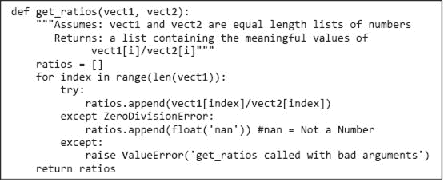
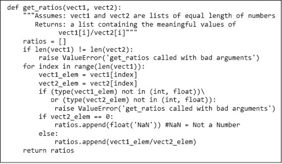
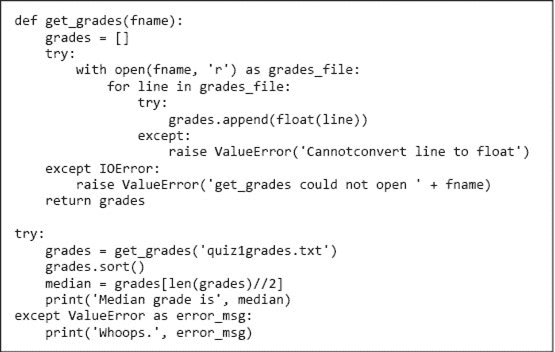

# 第十章：异常和断言

“异常”通常定义为“不符合规范的事物”，因此有些稀有。在 Python 中，**异常**并不稀有。它们无处不在。标准 Python 库中的几乎每个模块都在使用它们，而 Python 本身在许多情况下也会引发它们。你已经见过一些异常。

打开一个 Python 终端并输入

```py
test = [1,2,3]
test[3]
```

解释器会响应类似于以下内容的内容。

```py
IndexError: list index out of range 
```

`IndexError`是 Python 在程序尝试访问超出可索引类型范围的元素时**引发**的异常类型。紧随`IndexError`的字符串提供了有关导致异常发生的额外信息。

Python 的大多数内置异常处理那些程序试图执行没有适当语义的语句的情况。（我们将在本章后面处理那些不涉及错误的特殊异常。）

那些尝试编写和运行 Python 程序的读者（我们希望你们都是）已经遇到过许多这样的异常。最常见的异常类型包括`TypeError`、`IndexError`、`NameError`和`ValueError`。

## 9.1 处理异常

到目前为止，我们将异常视为终止事件。当抛出异常时，程序终止（在这种情况下，崩溃可能是更合适的词），然后我们返回代码，试图找出出错的原因。当抛出导致程序终止的异常时，我们说发生了**未处理的异常**。

异常不一定会导致程序终止。引发的异常可以并且应该由程序**处理**。有时异常是因为程序中存在错误（例如访问不存在的变量），但许多情况下，异常是程序员可以并且应该预见的。程序可能尝试打开一个不存在的文件。如果一个交互式程序要求用户输入，用户可能会输入不适当的内容。

Python 提供了一个方便的机制，**try-except**，用于**捕获**和处理异常。一般形式是

```py
try
   *code block*
except (*list of exception names*):
   *code block*
else:
   *code block*
```

如果你知道某行代码在执行时可能会引发异常，你应该处理该异常。在一段写得好的程序中，未处理的异常应该是个例外。

考虑一下这段代码。

```py
success_failure_ratio = num_successes/num_failures
print('The success/failure ratio is', success_failure_ratio)
```

大多数情况下，这段代码将正常工作，但如果`num_failures`恰好为零，则会失败。尝试除以零将导致 Python 运行时系统引发`ZeroDivisionError`异常，而`print`语句将永远无法被执行。

最好写成如下内容

```py
try:
    success_failure_ratio = num_successes/num_failures
    print('The success/failure ratio is', success_failure_ratio)
except ZeroDivisionError:
    print('No failures, so the success/failure ratio is undefined.')
```

进入`try`块后，解释器尝试评估表达式`num_successes/num_failures`。如果表达式评估成功，程序将表达式的值赋给变量`success_failure_ratio`，执行`try`块末尾的`print`语句，然后继续执行`try-except`块后面的代码。然而，如果在表达式评估过程中抛出`ZeroDivisionError`异常，控制将立即跳转到`except`块（跳过`try`块中的赋值和`print`语句），执行`except`块中的`print`语句，然后继续执行`try-except`块之后的代码。

**手指练习：** 实现一个满足以下规范的函数。使用`try-except`块。提示：在开始编码之前，你可能想在 shell 中输入类似`1 + 'a'`的内容，以查看抛出什么类型的异常。

```py
def sum_digits(s):
    """Assumes s is a string
       Returns the sum of the decimal digits in s
          For example, if s is 'a2b3c' it returns 5"""
```

如果程序代码块可能引发多种异常，保留字`except`后面可以跟一个异常元组，例如，

```py
except (ValueError, TypeError):
```

在这种情况下，如果在`try`块内抛出列出的任何异常，将进入`except`块。

另外，我们可以为每种异常编写一个单独的`except`块，这样程序可以根据抛出的异常选择相应的操作。如果程序员编写

```py
except:
```

如果在`try`块内抛出任何类型的异常，将会进入`except`块。请参阅图 9-1 中的函数定义。



图 9-1 使用异常进行控制流

与`try`块相关联的有两个`except`块。如果在`try`块中抛出异常，Python 首先检查它是否为`ZeroDivisionError`。如果是，它将类型为`float`的特殊值`nan`附加到`ratios`中。（值`nan`表示“不是一个数字”。它没有字面意义，但可以通过将字符串`'nan'`或字符串`'NaN'`转换为类型`float`来表示。当`nan`作为类型为`float`的表达式的操作数时，该表达式的值也是`nan`。）如果异常是其他类型而不是`ZeroDivisionError`，则代码执行第二个`except`块，抛出带有关联字符串的`ValueError`异常。

原则上，第二个`except`块不应该被进入，因为调用`get_ratios`的代码应该遵循`get_ratios`规范中的假设。然而，由于检查这些假设所带来的计算负担微乎其微，因此进行防御性编程并检查它们可能是值得的。

以下代码演示了程序如何使用`get_ratios`。在行`except ValueError as msg:`中，`msg`绑定到与抛出的`ValueError`相关联的参数（在这种情况下是一个字符串）。当代码

```py
try:
    print(get_ratios([1, 2, 7, 6], [1, 2, 0, 3]))
    print(get_ratios([], []))
    print(get_ratios([1, 2], [3]))
except ValueError as msg:
    print(msg)
```

执行后打印

```py
[1.0, 1.0, nan, 2.0]
[]
get_ratios called with bad arguments
```

为了比较，图 9-2 包含了相同规范的实现，但没有使用`try-except`。 图 9-2 中的代码比图 9-1 中的代码更长且更难阅读，效率也更低。（图 9-2 中的代码可以通过消除局部变量`vect1_elem`和`vect2_elem`来缩短，但这样做将通过重复索引列表而引入更多的低效。）



图 9-2 没有 try-except 的控制流

让我们看另一个例子。考虑以下代码：

```py
val = int(input('Enter an integer: '))
print('The square of the number you entered is', val**2)
```

如果用户乐意输入一个可以转换为整数的字符串，一切都会很好。但假设用户输入`abc`呢？执行这行代码将导致 Python 运行时系统抛出`ValueError`异常，而`print`语句将永远不会被执行。

程序员应该写的代码大致如下：

```py
while True:
    val = input('Enter an integer: ')
    try:
        val = int(val)
        print('The square of the number you entered is', val**2)
        break #to exit the while loop
    except ValueError:
        print(val, 'is not an integer')
```

进入循环后，程序会要求用户输入一个整数。一旦用户输入了某个值，程序将执行`try—except`块。如果`try`块中的前两个语句都没有引发`ValueError`异常，将执行`break`语句并退出`while`循环。然而，如果执行`try`块中的代码引发了`ValueError`异常，控制权将立即转移到`except`块中的代码。因此，如果用户输入了一个不表示整数的字符串，程序将要求用户重试。无论用户输入什么文本，都不会导致未处理的异常。

这种改变的缺点是程序文本从两行增加到了八行。如果有很多地方要求用户输入整数，这可能会成为一个问题。当然，这个问题可以通过引入一个函数来解决：

```py
def read_int():
    while True:
        val = input('Enter an integer: ')
        try:
            return(int(val)) #convert str to int before returning
        except ValueError:
            print(val, 'is not an integer')
```

更好的是，这个函数可以推广到请求任何类型的输入：

```py
def read_val(val_type, request_msg, error_msg):
  while True:
      val = input(request_msg + ' ')
      try:
          return(val_type(val)) #convert str to val_type
      except ValueError:
          print(val, error_msg)
```

函数`read_val`是**多态的**，即它适用于多种不同类型的参数。这类函数在 Python 中很容易编写，因为类型是**一等对象**。我们现在可以使用以下代码请求一个整数：

```py
`val = read_val(int, 'Enter an integer:', 'is not an integer')`
```

异常可能看起来不友好（毕竟，如果不处理，异常会导致程序崩溃），但考虑一下替代方案。当要求将字符串`'abc'`转换为`int`类型的对象时，类型转换`int`应该怎么做？它可以返回与编码字符串所用位对应的整数，但这与程序员的意图不太可能相关。或者，它可以返回特殊值`None`。如果这样做，程序员就需要插入代码来检查类型转换是否返回了`None`。如果程序员忘记了这个检查，程序执行时就有可能出现一些奇怪的错误。

使用异常时，程序员仍需包含处理异常的代码。然而，如果程序员忘记包含这样的代码且异常被引发，程序将立即停止。这是件好事。它提醒程序用户发生了一些麻烦的事情。（正如我们在第八章讨论的，显性错误远比隐性错误好。）此外，它为调试程序的人提供了明确的指示，说明哪里出了问题。

## 9.2 异常作为控制流机制

不要认为异常仅仅是错误的表现。它们是一个便捷的控制流机制，可以用来简化程序。

在许多编程语言中，处理错误的标准方法是让函数返回一个值（通常类似于 Python 的`None`），以指示出现了问题。每次函数调用都必须检查是否返回了该值。在 Python 中，通常在函数无法生成与其规格一致的结果时引发异常。

Python 中的`**raise**` **语句**强制引发指定的异常。raise 语句的形式是：

```py
`raise` *exceptionName*`(`*arguments*`)`
```

*exceptionName* 通常是内置异常之一，例如`ValueError`。但是，程序员可以通过创建内置类`Exception`的子类（见第十章）来定义新的异常。不同类型的异常可以有不同类型的参数，但大多数情况下，参数是一个字符串，用于描述引发异常的原因。

**手指练习：** 实现一个满足规格的函数。

```py
def find_an_even(L):
    """Assumes L is a list of integers
       Returns the first even number in L
       Raises ValueError if L does not contain an even number"""
```

让我们看一个例子，图 9-3。函数`get_grades`要么返回一个值，要么引发一个与之关联的值的异常。如果调用`open`引发`IOError`，它将引发`ValueError`异常。它本可以忽略`IOError`，让调用`get_grades`的程序部分处理，但那会给调用代码提供更少的信息，关于出错的原因。调用`get_grades`的代码要么使用返回的值计算另一个值，要么处理异常并打印有用的错误信息。



图 9-3 获取成绩

## 9.3 断言

Python 的`assert`语句为程序员提供了一种简单的方法，以确认计算状态是否如预期。**assert 语句**可以有两种形式：

```py
`assert` *Boolean expression*
```

```py`or    ``` `assert` *布尔表达式*`,` *参数* ```py    When an `assert` statement is encountered, the Boolean expression is evaluated. If it evaluates to `True`, execution proceeds on its merry way. If it evaluates to `False`, an `AssertionError` exception is raised.    Assertions are a useful defensive programming tool. They can be used to confirm that the arguments to a function are of appropriate types. They are also a useful debugging tool. They can be used, for example, to confirm that intermediate values have the expected values or that a function returns an acceptable value.````  `## 9.4 在第章中引入的术语   *   异常 *   引发异常 *   未处理异常 *   已处理异常 *   try-except 构造 *   捕获（异常） *   多态函数 *   一流对象 *   raise 语句 *   断言`
