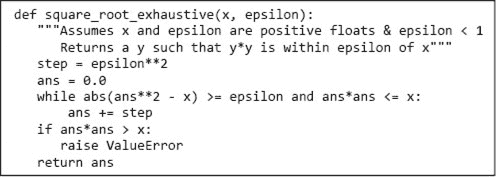
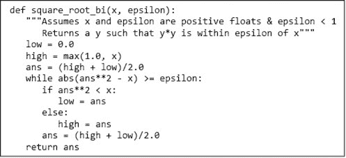
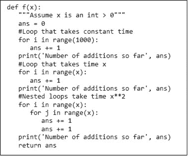
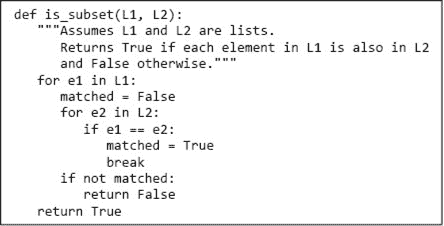
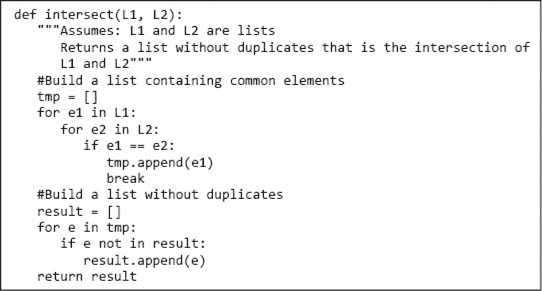
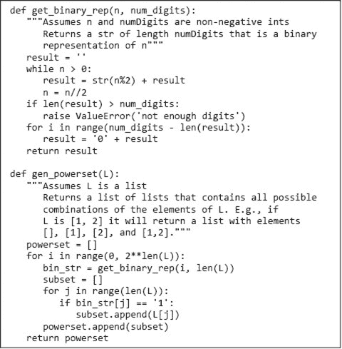
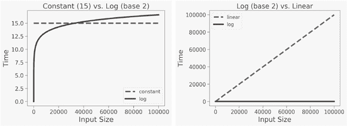
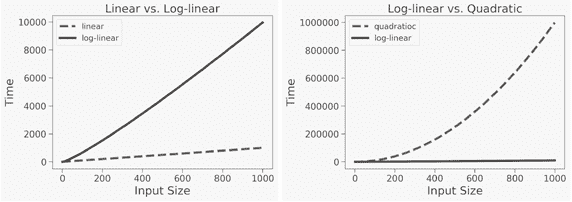
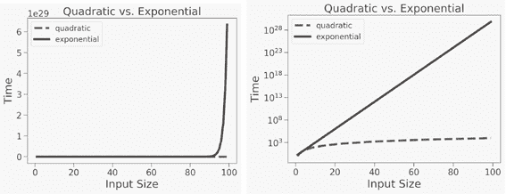

# 第十二章：对算法复杂性的简单介绍

设计和实现程序时最重要的是，它应该产生可依赖的结果。我们希望我们的银行余额能够正确计算。我们希望汽车中的燃油喷射器能够注入适量的燃料。我们更希望飞机和操作系统都不会崩溃。

有时性能是正确性的一个重要方面。这对于需要实时运行的程序最为明显。一个警告飞机潜在障碍物的程序需要在遇到障碍物之前发出警告。性能也会影响许多非实时程序的实用性。在评估数据库系统的实用性时，每分钟完成的事务数量是一个重要指标。用户关心在手机上启动应用程序所需的时间。生物学家关心它们的系统发育推断计算需要多长时间。

编写高效程序并不容易。最简单的解决方案往往不是最有效的。计算上高效的算法通常采用微妙的技巧，这可能使它们难以理解。因此，程序员往往增加程序的**概念复杂性**以降低其**计算复杂性**。为了以合理的方式做到这一点，我们需要了解如何估算程序的计算复杂性。这是本章的主题。

## 11.1 思考计算复杂性

如何回答“以下函数运行需要多长时间？”这个问题？

```py
def f(i):
   """Assumes i is an int and i >= 0"""
   answer = 1
   while i >= 1:
      answer *= i
      i -= 1
   return answer
```

我们可以在某些输入上运行程序并计时。但这并不会提供特别有用的信息，因为结果会依赖于

+   运行程序的计算机的速度

+   在那台机器上 Python 实现的效率

+   输入的值

我们通过使用更抽象的时间度量来解决前两个问题。我们不是以微秒来衡量时间，而是通过程序执行的基本步骤数量来衡量时间。

为了简单起见，我们将使用**随机访问机器**作为我们的计算模型。在随机访问机器中，步骤是依次执行的，一次一个。⁶⁶ 一个**步骤**是一个固定时间内执行的操作，比如将变量绑定到对象、进行比较、执行算术操作或访问内存中的对象。

现在我们有了一种更抽象的方式来思考时间的意义，我们转向输入值的依赖性问题。我们通过不再将时间复杂性表达为单一数字，而是与输入的大小相关联来解决这个问题。这使我们能够通过讨论每个算法的运行时间如何随输入大小的变化而变化，从而比较两种算法的效率。

当然，算法的实际运行时间不仅取决于输入的大小，还取决于它们的值。考虑线性搜索算法的实现。

```py
def linear_search(L, x):
   for e in L:
      if e == x:
         return True
   return False
```

假设`L`是一个包含一百万个元素的列表，考虑调用`linear_search(L, 3)`。如果`L`中的第一个元素是`3`，`linear_search`几乎会立即返回`True`。另一方面，如果`3`不在`L`中，`linear_search`必须检查所有一百万个元素才能返回`False`。

一般来说，有三种广泛的情况需要考虑：

+   最佳情况运行时间是算法在输入尽可能有利时的运行时间。也就是说，**最佳情况**运行时间是给定大小的所有可能输入中的最小运行时间。对于`linear_search`，最佳情况运行时间与`L`的大小无关。

+   同样，**最坏情况**运行时间是给定大小的所有可能输入中的最大运行时间。对于`linear_search`，最坏情况运行时间与`L`的大小成线性关系。

+   与最佳情况和最坏情况运行时间的定义类比，**平均情况**（也称为**期望情况**）运行时间是给定大小的所有可能输入的平均运行时间。或者，如果人们对输入值的分布有一些*先验*信息（例如，`90%`的时间`x`在`L`中），可以考虑这些信息。

人们通常关注最坏情况。所有工程师都有一个共同信条，墨菲定律：如果某件事可能出错，它就一定会出错。最坏情况提供了运行时间的**上限**。在对计算所需时间有限制时，这一点至关重要。仅仅知道“在大多数情况下”航空交通控制系统会在碰撞发生前发出警告是不够的。

让我们看看阶乘函数的迭代实现的最坏情况运行时间：

```py
def fact(n):
   """Assumes n is a positive int
      Returns n!"""
   answer = 1
   while n > 1:
      answer *=  n
      n -= 1
   return answer
```

运行此程序所需的步骤数大约是`2`（`1`步用于初始赋值语句，`1`步用于`return）` `+ 5n`（计算`while`中的测试需要`1`步，在`while`循环中的第一个赋值语句需要`2`步，循环中的第二个赋值语句需要`2`步）。所以，例如，如果`n`是`1000`，函数大约会执行`5002`步。

很明显，随着`n`增大，担心`5n`与`5n+2`之间的差异有些无谓。因此，当我们推理运行时间时，通常会忽略加性常数。乘法常数则更为复杂。我们是否需要关心计算需要`1000`步还是`5000`步？乘法因素可能很重要。搜索引擎响应查询所需的时间是`0.5`秒还是`2.5`秒，可能会影响用户是使用该搜索引擎还是转向竞争对手。

另一方面，在比较两个不同算法时，即使乘法常数也往往是无关紧要的。回想一下，在第三章中，我们查看了两种算法：穷举枚举和二分搜索，用于寻找浮点数平方根的近似值。基于这些算法的函数在图 11-1 和图 11-2 中显示。



图 11-1 使用穷举枚举来近似平方根



图 11-2 使用二分搜索来近似平方根

我们看到，穷举枚举在处理许多`x`和`epsilon`值组合时是如此缓慢，以至于不切实际。例如，评估`square_root_exhaustive(100, 0.0001)`大约需要十亿次`while`循环迭代。相比之下，评估`square_root_bi(100, 0.0001)`大约只需 20 次稍微复杂的`while`循环迭代。当迭代次数差异如此之大时，循环中的指令数量其实并不重要。也就是说，乘法常数是无关紧要的。

## 11.2 渐进符号

我们使用一种称为**渐进符号**的东西，提供了一种正式的方式来讨论算法运行时间与其输入大小之间的关系。其根本动机是，几乎任何算法在小输入上运行时都是足够高效的。我们通常需要担心的是算法在非常大输入上运行时的效率。作为“非常大”的代理，渐进符号描述了当输入大小趋向于无穷大时算法的复杂度。

例如，考虑图 11-3 中的代码。



图 11-3 渐进复杂度

如果我们假设每行代码执行一次需要一个单位的时间，则该函数的运行时间可以描述为`1000 + x + 2x`²。常数`1000`对应于第一个循环执行的次数。项`x`对应于第二个循环执行的次数。最后，项`2x`²对应于在嵌套`for`循环中执行两个语句所花费的时间。因此，调用`f(10)`将打印

```py
Number of additions so far 1000
Number of additions so far 1010
Number of additions so far 1210
```

而调用`f(1000)`将打印

```py
Number of additions so far 1000
Number of additions so far 2000
Number of additions so far 2002000
```

对于小的`x`值，常数项占主导地位。如果`x`是`10`，则超过`80%`的步骤由第一个循环完成。另一方面，如果`x`是`1000`，前两个循环仅占约`0.05%`的步骤。当`x`为`1,000,000`时，第一个循环大约占总时间的`0.00000005%`，第二个循环约占`0.00005%`。总共`2,000,000,000,000`的`2,000,001,001,000`步骤在内部`for`循环的主体中。

显然，通过只考虑内层循环，即二次项，我们可以获得对这段代码在非常大输入下运行时间的有意义的概念。我们是否在乎这个循环需要`2x²`步而不是`x²`步？如果你的计算机每秒执行大约 1 亿步，评估`f`将需要大约`5.5`小时。如果我们能将复杂度降低到`x²`步，将只需大约`2.25`小时。在这两种情况下，结论是一样的：我们可能应该寻找更高效的算法。

这种分析引导我们在描述算法的渐近复杂度时使用以下经验法则：

+   如果运行时间是多个项的总和，保留增长率最大的项，去掉其他项。

+   如果剩余项是一个乘积，则去掉任何常数。

最常用的渐近符号被称为“**大 O**”符号。大 O 符号用于给出函数的渐近增长的**上界**（通常称为**增长阶**）。例如，公式`f(x) ∈ O(x²)`意味着函数`f`的增长速度不快于二次多项式`x²`，从渐近意义上看。

许多计算机科学家会滥用大 O 符号，像这样表述：“`f(x)`的复杂度`是 O(x²)`。”他们的意思是在最坏情况下，`f`的运行步骤不超过`O(x²)`。一个函数“在`O(x²)`”与“是`O(x²)`”之间的区别是微妙但重要的。说`f(x) ∈ O(x²)`并不排除`f`的最坏情况下运行时间明显小于`O(x²)`。为避免这种混淆，我们在描述某个上界和**下界**的渐近最坏情况下运行时间时，会使用**大Θ**（*θ*）。这称为**紧界**。

**指尖练习**：以下每个函数的渐近复杂度是什么？

```py
 def g(L, e):
    """L a list of ints, e is an int"""
    for i in range(100):
        for e1 in L:
            if e1 == e:
                return True
    return False
def h(L, e):
    """L a list of ints, e is an int"""
    for i in range(e):
        for e1 in L:
            if e1 == e:
                return True
    return False
```

## 11.3 一些重要的复杂度类

大 O（和*θ*）的最常见实例如下所示。在每种情况下，n 是输入大小的度量。

+   `O(1)`表示**常数**运行时间。

+   `O(log n)`表示**对数**运行时间。

+   `O(n)`表示**线性**运行时间。

+   `O(n log n)`表示**对数线性**运行时间。

+   `O(n^k)`表示**多项式**运行时间。注意 k 是一个常数。

+   `O(c^n)`表示**指数**运行时间。这里常数是基于输入大小的幂。

### 11.3.1 常数复杂度

这表明渐进复杂度与输入的大小无关。这个类别中有很少有趣的程序，但所有程序都有一些片段（例如，计算 Python 列表的长度或乘两个浮点数），适合这个类别。常数运行时间并不意味着代码中没有循环或递归调用，但它确实意味着迭代或递归调用的次数与输入的大小无关。

### 11.3.2 对数复杂度

这样的函数具有复杂度，随着至少一个输入的对数而增长。二分查找，例如，在被搜索列表的长度上是对数级的。（我们将在第十二章中讨论二分查找并分析其复杂度。）顺便提一下，我们不关心对数的底数，因为使用一个底数和另一个底数之间的差异仅仅是一个常数乘法因子。例如，`O(log`[2]`(x)) = O(log`[2]`(10)`*`log`[10]`(x))`。有许多有趣的函数具有对数复杂度。考虑一下

```py
def int_to_str(i):
   """Assumes i is a nonnegative int
      Returns a decimal string representation of i"""
   digits = '0123456789'
   if i == 0:
      return '0'
   result = ''
   while i > 0:
      result = digits[i%10] + result
      i = i//10
   return result
```

由于这段代码中没有函数或方法调用，我们知道我们只需查看循环以确定复杂度类别。只有一个循环，因此我们需要做的就是描述迭代次数。这归结为在得到`0`的结果之前，我们可以使用`//`（向下取整除法）将`i`除以`10`的次数。因此，`int_to_str`的复杂度是`O(log(i))`。更确切地说，它是 *θ*(log(i))，因为 log(i) 是一个紧密的界限。

那么复杂度如何呢

```py
def add_digits(n):
   """Assumes n is a nonnegative int
      Returns the sum of the digits in n"""
   string_rep = int_to_str(n)
   val = 0
   for c in string_rep:
       val += int(c)
   return val
```

使用`int_to_str`将`n`转换为字符串的复杂度是 *θ*`(log(n))`，并且`int_to_str`返回长度为`log(n)`的字符串。`for`循环将执行 *θ*`(len(string_rep))` 次，即 *θ*`(log(n))` 次。综合来看，假设表示数字的字符可以在常数时间内转换为整数，程序的运行时间将与 *θ*`(log(n)) +` *θ*`(log(n))` 成正比，这使得它的复杂度是 *θ*`(log(n))`。

### 11.3.3 线性复杂度

许多处理列表或其他类型序列的算法是线性的，因为它们以一个常数（大于`0`）的次数访问序列的每个元素。

举个例子，

```py
def add_digits(s):
   """Assumes s is a string of digits
      Returns the sum of the digits in s"""
   val = 0
   for c in string_rep:
       val += int(c)
   return val
```

这个函数在`s`的长度上是线性的，即 *θ*`(len(s))`。

当然，一个程序不需要有循环也可以具有线性复杂度。考虑一下

```py
def factorial(x):
   """Assumes that x is a positive int
      Returns x!"""
   if x == 1:
      return 1
   else:
      return x*factorial(x-1)
```

这段代码中没有循环，因此为了分析复杂度，我们需要弄清楚进行多少次递归调用。调用序列就是

```py
`factorial(x)`, `factorial(x-1)`, `factorial(x-2), … , factorial(1)`
```

这个序列的长度，因此函数的复杂度，是 *θ*`(x)`*。

到目前为止，我们只关注了代码的时间复杂度。这对于使用恒定空间的算法是可以的，但这个阶乘实现并不具备这一特性。如我们在第四章讨论的，每次递归调用`factorial`都会分配一个新的堆栈帧，并且该帧在调用返回之前会占用内存。在递归的最大深度，代码将分配`x`个堆栈帧，因此空间复杂度为`O(x)`。

空间复杂度的影响比时间复杂度更难以察觉。程序完成所需的一分钟或两分钟对用户来说非常明显，但它使用一兆字节还是两兆字节的内存则大多对用户是不可见的。这就是为什么人们通常更关注时间复杂度而不是空间复杂度的原因。例外情况发生在程序需要的空间超过运行它的机器的快速内存时。

### 11.3.4 对数线性复杂度

这比我们迄今为止看到的复杂度类稍微复杂一些。它涉及两个项的乘积，每个项都依赖于输入的大小。这是一个重要的类别，因为许多实际算法是对数线性的。最常用的对数线性算法可能是归并排序，其复杂度为*θ*`(n log(n))`，其中`n`是待排序列表的长度。我们将在第十二章中查看该算法并分析其复杂度。

### 11.3.5 多项式复杂度

最常用的多项式算法是**二次**算法，即它们的复杂度随着输入大小的平方而增长。例如，考虑在图 11-4 中实现的子集测试函数。



图 11-4 子集测试的实现

每次到达内层循环时，它将执行*θ*`(len(L2))`次。函数`is_subset`将执行外层循环*θ*`(len(L1))`次，因此内层循环将达到*θ*`(len(L1)`*`len(L2))`。

现在考虑图 11-5 中的函数`intersect`。构建可能包含重复项的列表的代码部分的运行时间显然是*θ*(`len(L1)`*`len(L2)`)。乍一看，构建无重复列表的代码部分似乎是线性的，但实际上并非如此。



图 11-5 列表交集的实现

评估表达式`e not in result`可能涉及查看`result`中的每个元素，因此是*θ*`(len(result))`；因此，实现的第二部分的复杂度为*θ*`(len(tmp)`*`len(result))`。然而，由于`result`和`tmp`的长度受限于`L1`和`L2`中较小者的长度，并且我们忽略了加法项，`intersect`的复杂度为*θ*`(len(L1)`*`len(L2))`。

### 11.3.6 指数复杂性

正如我们将在本书后面看到的，许多重要问题本质上是指数级的，即完全解决它们可能需要与输入大小成指数关系的时间。这是令人遗憾的，因为编写一个在合理概率上需要指数时间运行的程序往往得不偿失。考虑一下图 11-6 中的代码。



图 11-6 生成幂集

函数`gen_powerset(L)`返回一个列表的列表，包含`L`的所有可能组合。例如，如果`L`是`['x', 'y']`，那么`L`的幂集将是一个包含列表`[]`、`['x']`、`['y']`和`['x', 'y']`的列表。

这个算法有些微妙。考虑一个包含`n`个元素的列表。我们可以用一个包含`n`个`0`和`1`的字符串来表示元素的任何组合，其中`1`表示元素的存在，`0`表示其不存在。包含没有项目的组合用全是`0`的字符串表示，包含所有项目的组合用全是`1`的字符串表示，仅包含第一个和最后一个元素的组合用`100…001`表示，等等。

生成长度为`n`的列表`L`的所有子列表可以如下进行：

+   生成所有`n`位的二进制数。这些数字从`0`到`2`^n - 1。

+   对于每个`2`^n 的二进制数`b`，通过选择`L`中索引与`b`中的`1`对应的元素来生成一个列表。例如，如果`L`是`['x', 'y', 'z']`，而`b`是`101`，则生成列表`['x', 'z']`。

尝试在包含字母表前 10 个字母的列表上运行`gen_powerset`。它会很快完成，并生成一个包含 1024 个元素的列表。接下来，尝试在前 20 个字母的列表上运行`gen_powerset`。这将需要一些时间，并返回一个大约有一百万个元素的列表。如果你在所有 26 个字母的列表上运行`gen_powerset`，你可能会厌倦等待它完成，除非你的计算机因尝试构建一个包含数千万个元素的列表而耗尽内存。甚至不要考虑在包含所有大写和小写字母的列表上运行`gen_powerset`。算法的第 1 步生成的二进制数是*θ*`(2`^(len(L))`)`，因此算法在 len(L`)`中是指数级的。

这是否意味着我们不能使用计算来解决指数级困难的问题？绝对不是。这意味着我们必须找到提供这些问题的近似解或在某些实例上找到精确解的算法。但这是后面章节的主题。

### 11.3.7 复杂性类的比较

本节中的图表旨在传达算法处于这些复杂性类之一或另一类的含义。

图 11-7 左侧的图表比较了常数时间算法与对数算法的增长。注意，输入的大小必须达到约 30,000，两者才会相交，即使常数非常小（15）。当输入大小为 100,000 时，对数算法所需的时间仍然相当小。其道理是，对数算法几乎与常数时间算法一样优秀。

图 11-7 右侧的图表展示了对数算法与线性算法之间的显著差异。虽然我们需要观察较大输入才能理解常数时间算法与对数时间算法之间的差异，但对数时间算法与线性时间算法之间的差异即使在小输入上也很明显。对数算法和线性算法相对性能的显著差异并不意味着线性算法不好。实际上，线性算法在很多情况下效率足够可接受。



图 11-7 常数、对数和线性增长

图 11-8 左侧的图表显示 `O(n)` 和 `O(n log(n))` 之间存在显著差异。考虑到 `log(n)` 的增长非常缓慢，这可能看起来令人惊讶，但请记住，这是一个乘法因子。还要记住，在许多实际情况中，`O(n log(n))` 是足够快速且有用的。另一方面，正如图 11-8 右侧的图所示，存在许多情况下，二次增长的速度是不可接受的。



图 11-8 线性、对数线性和二次增长

图 11-9 中的图表讨论了指数复杂度。在图 11-9 左侧的图中，y 轴左侧的数字从 `0` 到 `6`。然而，左上角的标记 `1e29` 意味着 y 轴上的每个刻度都应乘以 `10`²⁹。因此，绘制的 y 值范围从 `0` 到大约 `6.6*10`²⁹。在图 11-9 左侧的图中，二次增长的曲线几乎不可见。这是因为指数函数增长得如此迅速，以至于与最高点的 y 值（决定 y 轴的刻度）相比，指数曲线上早期点的 y 值（以及二次曲线上所有点）几乎与 `0` 无法区分。

图 11-9 右侧的图表通过在 y 轴上使用对数尺度解决了这个问题。人们很容易看到，指数算法对于除了最小输入之外的所有情况都是不切实际的。

注意，在对数尺度上绘制时，指数曲线呈现为直线。我们将在后面的章节中对此进行更深入的探讨。



图 11-9 二次和指数增长

## 11.4 本章引入的术语

+   概念复杂度

+   计算复杂度

+   随机访问机

+   计算步骤

+   最佳情况复杂度

+   最坏情况复杂度

+   平均情况复杂度

+   期望情况复杂度

+   上界

+   渐进记号

+   大 O 记号

+   增长阶

+   大θ记号

+   下界

+   紧界

+   常数时间

+   对数时间

+   线性时间

+   对数线性时间

+   多项式时间

+   二次时间

+   指数时间
