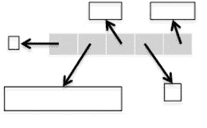
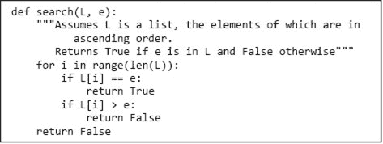
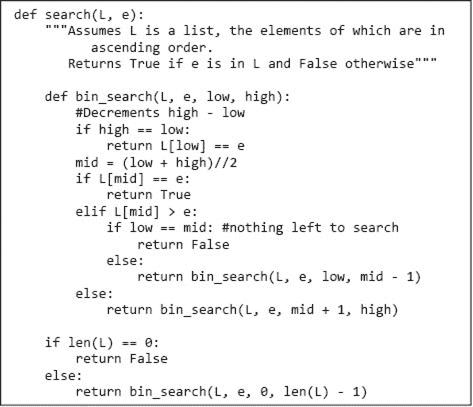
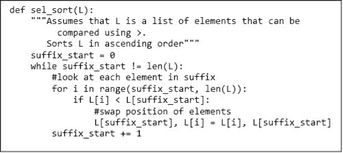
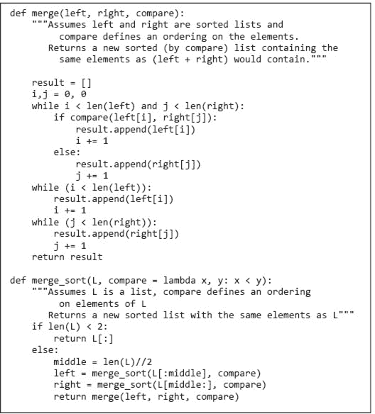

# 第十四章：12

一些简单的算法和数据结构

尽管我们在本书中花了相当多的页面讨论效率，但目标并不是让你成为设计高效程序的专家。还有许多专门讨论这一主题的长书（甚至一些不错的长书）。在第十一章中，我们介绍了一些复杂性分析的基本概念。在这一章中，我们利用这些概念来考察几个经典算法的复杂性。本章的目标是帮助你培养一些关于如何处理效率问题的一般直觉。当你完成本章时，你应该理解为什么有些程序瞬间完成，为什么有些需要整夜运行，以及为什么有些在你的一生中都无法完成。

本书中我们首次探讨的算法是基于穷举法的。我们认为现代计算机如此快速，以至于采用巧妙的算法往往是浪费时间。编写简单且显然正确的代码通常是正确的做法。

我们接着研究了一些问题（例如，寻找多项式根的近似值），在这些问题中，搜索空间太大，无法通过穷举法进行实际处理。这使我们考虑了更高效的算法，如二分法和牛顿-拉夫森法。关键在于，效率的关键是一个好的算法，而不是巧妙的编码技巧。

在科学（物理、生物和社会科学）中，程序员通常首先快速编码一个简单的算法，以测试关于数据集的假设的合理性，然后在少量数据上运行。如果这产生了令人鼓舞的结果，那么就开始了在大数据集上运行（或许是反复运行）可实施方案的艰苦工作。这种实施需要基于高效的算法。

高效的算法很难发明。成功的职业计算机科学家可能在整个职业生涯中只发明一个算法——如果他们幸运的话。我们大多数人从未发明过新算法。相反，我们学习将面临的复杂问题简化为之前解决过的问题。

更具体地说，我们

+   理解问题的内在复杂性。

+   考虑如何将这个问题分解为子问题。

+   将这些子问题与其他已经存在高效算法的问题关联起来。

本章包含一些示例，旨在让你对算法设计有一些直观的理解。书中还有许多其他算法。

请记住，最有效的算法并不总是首选算法。以最有效的方式完成所有事情的程序往往会让人难以理解。通常，从最直接的方式解决手头的问题是一个好策略，记录以找到任何计算瓶颈，然后寻找改善程序中导致瓶颈的部分的计算复杂性的方法。

## 12.1 搜索算法

**搜索算法**是一种在项目集合中查找具有特定属性的单个项目或一组项目的方法。我们将项目集合称为**搜索空间**。搜索空间可以是一些具体的东西，如一组电子病历，也可以是一些抽象的东西，如所有整数的集合。许多实际发生的问题都可以表述为搜索问题。

本书中早期提出的许多算法可以视为搜索算法。在第三章中，我们将寻找多项式根的近似值表述为一个搜索问题，并考察了三种算法——穷举枚举、二分搜索和牛顿-拉夫森法——用于搜索可能答案的空间。

在本节中，我们将研究两种搜索列表的算法。每种算法都符合规范。

```py
def search(L, e):
    """Assumes L is a list.
       Returns True if e is in L and False otherwise"""
```

机智的读者可能会想，这是否与 Python 表达式`e in L`在语义上等价。答案是肯定的，是的。如果你不关心发现`e`是否在`L`中的效率，你应该简单地写出该表达式。

### 12.1.1 线性搜索和使用间接访问元素

Python 使用以下算法来确定元素是否在列表中：

```py
for i in range(len(L)):
    if L[i] == e:
        return True
return False
```

如果元素`e`不在列表中，算法将执行*θ*`(len(L))`次测试，即复杂度在`L`的长度上至多为线性。为什么说“至多”线性？只有在循环内部的每个操作都可以在常数时间内完成时，它才是线性的。这引出了一个问题：Python 是否能在常数时间内检索列表的第`i`^(th)个元素。由于我们的计算模型假设获取地址内容是常数时间操作，问题就变成了我们是否能在常数时间内计算列表第`i`^(th)个元素的地址。

让我们首先考虑每个列表元素都是整数的简单情况。这意味着列表中的每个元素大小相同，例如，占用四个内存单元（四个 8 位字节⁶⁹）。假设列表元素连续存储，列表第`i`^(th)个元素在内存中的地址为`start + 4`*`i`，其中`start`是列表起始地址。因此，我们可以假设 Python 能够在常数时间内计算出整数列表第`i`^(th)个元素的地址。

当然，我们知道 Python 列表可以包含除`int`之外的其他类型的对象，而且同一个列表可以包含多种类型和大小的对象。你可能会认为这会带来问题，但事实并非如此。

在 Python 中，列表由一个长度（列表中对象的数量）和一系列固定大小的**指针**⁷⁰表示对象。图 12-1 说明了这些指针的使用。



图 12-1 实现列表

被阴影区域表示的列表包含四个元素。最左边的阴影框包含一个指向整数的指针，指示列表的长度。其他阴影框中的每一个都包含一个指向列表中对象的指针。

如果长度字段占用四个内存单元，而每个指针（地址）占用四个内存单元，则列表的`i`^(th)元素的地址存储在地址`start + 4 + 4`*`i`中。同样，这个地址可以在常数时间内找到，然后可以使用该地址存储的值来访问`i`^(th)元素。这个访问也是一个常数时间的操作。

这个例子说明了计算中使用的最重要的实现技术之一：**间接寻址**。⁷¹一般来说，间接寻址涉及先访问包含所寻物体引用的其他内容，然后再访问所需物体。每次我们使用变量引用与该变量绑定的对象时，都会发生这种情况。当我们使用变量访问列表，然后通过列表中存储的引用访问另一个对象时，我们通过两个级别的间接寻址。⁷²

### 12.1.2 二分搜索和利用假设

回到实现`search(L, e)`的问题，*θ*`(len(L))`是我们能做的最好的吗？是的，如果我们对列表中元素的值和它们的存储顺序没有任何了解。在最坏的情况下，我们必须查看`L`中的每个元素，以确定`L`是否包含`e`。

但假设我们对元素存储的顺序有所了解，例如，假设我们知道我们有一个按升序存储的整数列表。我们可以改变实现，使得搜索在遇到一个大于要搜索的数字时停止，如图 12-2 所示。



图 12-2 有序列表的线性搜索

这将改善平均运行时间。然而，这不会改变算法的最坏情况复杂度，因为在最坏情况下，每个`L`中的元素都要被检查。

然而，我们可以通过使用一种类似于第三章中用于找到浮点数平方根近似值的二分搜索算法的**二分查找**算法，显著改善最坏情况下的复杂性。在那里，我们依赖于浮点数之间固有的全序关系。在这里，我们依赖于列表已排序的假设。

这个想法很简单：

1.  1\. 选择一个索引`i`，大致将列表`L`分为两半。

1.  2\. 询问`L[i] == e`。

1.  3\. 如果没有，询问`L[i]`是否大于或小于`e`。

1.  4\. 根据答案，搜索`L`的左半部分或右半部分以查找`e`。

鉴于该算法的结构，二分查找最直接的实现使用递归，这并不令人惊讶，如图 12-3 所示。

图 12-3 中的外部函数`search(L, e)`具有与图 12-2 中定义的函数相同的参数和规范。规范表明实现可以假定`L`是按升序排序的。确保这一假设成立的责任在于`search`的调用者。如果假设不成立，实现没有义务表现良好。它可能会工作，但也可能崩溃或返回错误的答案。是否应该修改`search`以检查假设是否成立？这可能消除错误来源，但会违背使用二分查找的目的，因为检查假设本身将耗时`O(len(L))`。



图 12-3 递归二分查找

像`search`这样的函数通常被称为**包装函数**。这个函数为客户端代码提供了一个良好的接口，但本质上是一个不进行复杂计算的通过函数。相反，它使用适当的参数调用辅助函数`bSearch`。这引出了一个问题：为什么不消除`search`，让客户端直接调用`bin_search`呢？原因是参数`low`和`high`与搜索列表中元素的抽象无关。它们是实现细节，应当对调用`search`的程序员隐藏。

现在让我们分析`bin_search`的复杂性。我们在上一节中展示了列表访问是常量时间。因此，可以看出，除了递归调用之外，`bSearch`的每个实例都是*θ*`(1)`。因此，`bin_search`的复杂性仅依赖于递归调用的次数。

如果这是一本关于算法的书，我们将深入分析一个称为递归关系的内容。但因为这不是，我们将采取一个不那么正式的方法，从“我们如何知道程序终止？”这个问题开始。回想一下在第三章中，我们对`while`循环问了同样的问题。我们通过提供循环的递减函数来回答了这个问题。这里我们也做同样的事情。在这个上下文中，递减函数具有以下性质：

+   它将正式参数绑定的值映射到一个非负整数。

+   当其值为`0`时，递归终止。

+   对于每个递归调用，递减函数的值小于调用该函数实例时的递减函数的值。

`bin_search`的递减函数是`high`–`low`。`search`中的`if`语句确保第一次调用`bSearch`时，该递减函数的值至少为`0`（递减函数性质 1）。

当进入`bin_search`时，如果`high`–`low`恰好为`0`，则该函数不进行递归调用—直接返回值`L[low] == e`（满足递减函数性质 2）。

`bin_search`函数包含两个递归调用。一个调用使用的参数覆盖`mid`左侧的所有元素，另一个调用使用的参数覆盖`mid`右侧的所有元素。在这两种情况下，`high`–`low`的值都减半（满足递减函数性质 3）。

我们现在明白了为什么递归会终止。下一个问题是，在`high–low == 0`之前，`high–low`的值可以被减半多少次？回想一下，`log`[y]`(x)`是将`y`自身相乘多少次才能达到`x`。相反，如果将`x`除以`y log`[y]`(x)`次，结果是`1`。这意味着`high–low`最多可以通过向下取整的除法被减半`log`[2]`(``high–low``)`次，直到达到`0`。

最后，我们可以回答这个问题，二分查找的算法复杂度是什么？由于当`search`调用`bSearch`时，`high`–`low`的值等于`len(L)-1`，因此`search`的复杂度是*θ*`(log(len(``L``)))`。⁷³

**练习题：** 为什么代码在第二个递归调用中使用`mid+1`而不是`mid`？

## 12.2 排序算法

我们刚刚看到，如果我们知道一个列表是排序好的，我们可以利用这一信息大大减少搜索该列表所需的时间。这是否意味着当被要求搜索一个列表时，我们应该先对其进行排序，然后再进行搜索？

让*θ*`(sortComplexity(L))`成为对排序列表复杂度的紧密界限。因为我们知道可以在*θ*`(len(L))`时间内搜索一个无序列表，因此，是否应该先排序再搜索的问题归结为，`sortComplexity(L) + log(len(L))`是否小于`len(L)`？可悲的是，答案是否定的。要排序一个列表，至少必须查看列表中的每个元素一次，因此不可能在次线性时间内对列表进行排序。

这是否意味着二分搜索是一个没有实际意义的智力好奇？幸运的是，答案是否定的。假设我们期望多次搜索同一列表。一次性对列表进行排序的开销可能是值得的，然后在多次搜索中**摊销**排序的成本。如果我们期望搜索列表`k`次，相关的问题变为，`sortComplexity(L) + k`*`log(len(L))`是否小于`k`*`len(L)`？

随着`k`变得较大，排序列表所需的时间变得越来越不相关。`k`需要多大取决于排序列表所需的时间。例如，如果排序在列表大小上是指数级的，`k`必须相当大。

幸运的是，排序可以相当高效地完成。例如，大多数 Python 实现中标准的排序实现大约在`O(n`*`log(n))`时间内运行，其中`n`是列表的长度。实际上，您很少需要实现自己的排序函数。在大多数情况下，正确的做法是使用 Python 的内置`sort`方法（`L.sort()`对列表`L`进行排序）或其内置函数`sorted`（`sorted(L)`返回一个与`L`具有相同元素的列表，但不会修改`L`）。我们在此呈现排序算法，主要是为了提供一些思考算法设计和复杂性分析的练习。

我们从一个简单但低效的算法开始，即**选择排序**。选择排序，图 12-4，通过保持**循环不变量**来工作，给定将列表划分为前缀（`L[0:i]`）和后缀（`L[i+1:len(L)]`），前缀是排序的，并且前缀中的没有任何元素大于后缀中的最小元素。

我们使用归纳法推理循环不变量。

+   基础情况：在第一次迭代开始时，前缀为空，即后缀是整个列表。因此，不变量（显然）成立。

+   归纳步骤：在算法的每一步中，我们将一个元素从后缀移动到前缀。我们通过将后缀中的最小元素附加到前缀的末尾来实现这一点。由于在移动元素之前不变量成立，我们知道在附加元素后，前缀仍然是排序的。我们还知道，由于我们移除了后缀中的最小元素，前缀中的没有任何元素大于后缀中的最小元素。

+   终止：当退出循环时，前缀包括整个列表，而后缀为空。因此，整个列表现在按升序排序。



图 12-4 选择排序

很难想象有比这更简单或更明显正确的排序算法。不幸的是，它的效率相当低下。⁷⁴ 内部循环的复杂度是*θ*`(len(L))`。外部循环的复杂度也是*θ*`(len(L))`。因此，整个函数的复杂度是*θ*`(len(L)`²`)`。即，它在`L`的长度上是二次的。⁷⁵

### 12.2.1 归并排序

幸运的是，我们可以使用**分治** **算法**来比二次时间表现得更好。基本思想是组合原问题的简单实例的解决方案。一般来说，分治算法的特点是

+   一个阈值输入大小，低于此大小的问题不进行细分。

+   将一个实例分割成的子实例的大小和数量。

+   用于组合子解决方案的算法。

阈值有时称为**递归基**。对于项目 2，通常考虑初始问题大小与子实例大小的比率。在我们到目前为止看到的大多数例子中，比率为`2`。

**归并排序**是一个典型的分治算法。它于 1945 年由约翰·冯·诺依曼发明，至今仍广泛使用。像许多分治算法一样，它最容易以递归方式描述：

1.  1\. 如果列表长度为`0`或`1`，则已排序。

1.  2\. 如果列表有多个元素，则将列表拆分为两个列表，并使用归并排序对每个列表进行排序。

1.  3\. 合并结果。

冯·诺依曼的关键观察是，可以高效地将两个已排序的列表合并为一个已排序的列表。这个想法是查看每个列表的第一个元素，并将较小的一个移动到结果列表的末尾。当其中一个列表为空时，只需将另一个列表中剩余的项目复制过来。例如，考虑合并两个列表`L_1 =` `[1,5,12,18,19,20]`和`L_2 =` `[2,3,4,17]`：

| L_1 中剩余 | L_2 中剩余 | 结果 |
| --- | --- | --- |
| `[1,5,12,18,19,20]` | `[2,3,4,17]` | `[]` |
| `[5,12,18,19,20]` | `[2,3,4,17]` | `[1]` |
| `[5,12,18,19,20]` | `[3,4,17]` | `[1,2]` |
| `[5,12,18,19,20]` | `[4,17]` | `[1,2,3]` |
| `[5,12,18,19,20]` | `[17]` | `[1,2,3,4]` |
| `[12,18,19,20]` | `[17]` | `[1,2,3,4,5]` |
| `[18,19,20]` | `[17]` | `[1,2,3,4,5,12]` |
| `[18,19,20]` | `[]` | `[1,2,3,4,5,12,17]` |
| `[]` | `[]` | `[1,2,3,4,5,12,17,18,19,20]` |

合并过程的复杂度是什么？它涉及两个常数时间操作，比较元素的值和从一个列表复制元素到另一个列表。比较的数量是*θ*`(len(L))`，其中`L`是两个列表中较长的一个。复制操作的数量是*θ*`(len(L1) + len(L2))`，因为每个元素正好复制一次。（复制一个元素的时间取决于元素的大小。然而，这不会影响排序的增长顺序，作为列表中元素数量的函数。）因此，合并两个已排序的列表在列表长度上是线性的。

图 12-5 包含了合并排序算法的实现。



图 12-5 合并排序

注意我们将比较操作符作为`merge_sort`函数的参数，并编写了一个 lambda 表达式来提供默认值。因此，例如，代码

```py
L = [2,1,4,5,3]
print(merge_sort(L), merge_sort(L, lambda x, y: x > y))
```

打印

```py
[1, 2, 3, 4, 5] [5, 4, 3, 2, 1]
```

让我们分析一下`merge_sort`的复杂度。我们已经知道`merge`的时间复杂度是*θ*`(len(L))`。在每一层递归中，要合并的元素总数是`len(L)`。因此，`merge_sort`的时间复杂度是*θ*`(len(``L``))`乘以递归层数。由于`merge_sort`每次将列表分成两半，我们知道递归层数是*θ*`(log(len(``L``)))`。因此，`merge_sort`的时间复杂度是*θ*`(n`*`log(n))`，其中`n`是`len(L)`。⁷⁶

这比选择排序的*θ*`(len(``L``)`²`)好得多。例如，如果`L`有`10,000`个元素，`len(``L``)`²是`100`百万，但`len(``L``)`*`log`[2]`(len(``L``))`大约是`130,000`。

这种时间复杂度的改进是有代价的。选择排序是**就地**排序算法的一个例子。因为它通过交换列表中的元素位置来工作，所以只使用了常量数量的额外存储（在我们的实现中是一个元素）。相比之下，合并排序算法涉及对列表的复制。这意味着它的空间复杂度是*θ*`(len(``L``))`。这对于大型列表来说可能是一个问题。⁷⁷

假设我们想对以名字和姓氏书写的名字列表进行排序，例如，列表`['Chris Terman', ‘Tom Brady', 'Eric Grimson', 'Gisele Bundchen']`。图 12-6 定义了两个排序函数，然后用这两个函数以两种不同方式对列表进行排序。每个函数使用了`str`类型的`split`方法。


图 12-6 对名字列表进行排序

当运行图 12-6 中的代码时，它打印

```py
Sorted by last name = ['Tom Brady', 'Gisele Bundchen', 'Eric Grimson']
Sorted by first name = ['Eric Grimson', 'Gisele Bundchen', ‘Tom Brady']
```

**手指练习**：使用`merge_sort`对整数元组列表进行排序。排序顺序应由元组中整数的总和决定。例如，`(5, 2)`应在`(1, 8)`之前，并在`(1, 2, 3)`之后。

### 12.2.2 Python 中的排序

大多数 Python 实现中使用的排序算法称为**timsort**。⁷⁸ 关键思想是利用许多数据集中数据已经部分排序的事实。Timsort 的最坏情况性能与归并排序相同，但平均性能明显更好。

如前所述，Python 方法`list.sort`将列表作为第一个参数并修改该列表。相比之下，Python 函数`sorted`将可迭代对象（例如列表或视图）作为第一个参数并返回一个新的排序列表。例如，代码

```py
L = [3,5,2]
D = {'a':12, 'c':5, 'b':'dog'}
print(sorted(L))
print(L)
L.sort()
print(L)
print(sorted(D))
D.sort()
```

将打印

```py
[2, 3, 5]
[3, 5, 2]
[2, 3, 5]
['a', 'b', 'c']
AttributeError: ‘dict' object has no attribute ‘sort'
```

注意，当`sorted`函数应用于字典时，它返回字典键的排序列表。相比之下，当对字典应用`sort`方法时，会引发异常，因为没有`dict.sort`方法。

`list.sort`方法和`sorted`函数可以有两个额外参数。`key`参数在我们实现的归并排序中与`compare`的作用相同：它提供要使用的比较函数。`reverse`参数指定列表是相对于比较函数按升序还是降序排序。例如，代码

```py
L = [[1,2,3], (3,2,1,0), 'abc']
print(sorted(L, key = len, reverse = True))
```

按长度反向顺序对`L`的元素进行排序并打印

```py
`[(3, 2, 1, 0), [1, 2, 3], 'abc']`
```

`list.sort`方法和`sorted`函数都提供**稳定排序**。这意味着如果两个元素在排序中根据比较（在这个例子中是`len`）是相等的，它们在原始列表（或其他可迭代对象）中的相对顺序会在最终列表中保留。（由于在`dict`中没有键可以出现多次，应用于`dict`时`sorted`是否稳定的问题无关紧要。）

**指尖练习**：`merge_sort`是稳定排序吗？

## 12.3 哈希表

如果我们将归并排序与二分搜索结合起来，就有了一种很好的方式来搜索列表。我们使用归并排序在*θ*`(n`*`log(n))` 时间内预处理列表，然后用二分搜索测试元素是否在列表中，这样的时间复杂度是*θ*`log(n))`。如果我们搜索列表`k`次，总体时间复杂度是*θ*`(n`*`log(n) + k`*`log(n))`。

这很好，但我们仍然可以问，当我们愿意进行一些预处理时，是否对搜索来说对数是我们能做到的最佳？

当我们在第五章介绍类型`dict`时，我们提到字典使用一种称为哈希的技术，以几乎与字典大小无关的时间进行查找。**哈希表**的基本思想很简单。我们将键转换为整数，然后使用该整数在列表中进行索引，这可以在常数时间内完成。原则上，任何类型的值都可以轻松转换为整数。毕竟，我们知道每个对象的内部表示是一系列位，任何位序列都可以视为表示一个整数。例如，字符串`'abc'`的内部表示是位序列`011000010110001001100011`，可以视为十进制整数`6,382,179`的表示。当然，如果我们想将字符串的内部表示用作列表的索引，列表将不得不相当长。

那么，当键已经是整数时呢？暂时想象一下，我们正在实现一个字典，所有键都是美国社会安全号码，九位整数。如果我们用包含`10`⁹个元素的列表来表示字典，并使用社会安全号码作为索引，我们可以以常数时间进行查找。当然，如果字典只包含一万（`10`⁴）人的条目，这将浪费很多空间。

这使我们进入哈希函数的话题。**哈希函数**将大量输入空间（例如，所有自然数）映射到较小的输出空间（例如，介于`0`和`5000`之间的自然数）。哈希函数可以用来将大量键转换为较小的整数索引空间。

由于可能输出的空间小于可能输入的空间，哈希函数是一种**多对一映射**，即多个不同的输入可能映射到相同的输出。当两个输入映射到相同的输出时，这被称为**碰撞**——我们将很快回到这个话题。一个好的哈希函数产生**均匀分布**；即范围内的每个输出都是同样可能的，从而最小化碰撞的概率。

图 12-7 使用了一个简单的哈希函数（回忆一下`i%j`返回整数`i`除以整数`j`的余数）来实现一个以整数为键的字典。

基本思想是通过一组**哈希****桶**表示`Int_dict`类的实例，其中每个桶是实现为元组的键/值对的列表。通过将每个桶作为列表，我们通过将所有哈希到同一桶的值存储在列表中来处理碰撞。

哈希表的工作原理如下：实例变量`buckets`被初始化为一个包含`num_buckets`个空列表的列表。要存储或查找具有键`key`的条目，我们使用哈希函数`%`将`key`转换为整数，并使用该整数索引到`buckets`中以找到与`key`关联的哈希桶。然后我们在线性搜索该桶（记住，它是一个列表），以查看是否有与键`key`的条目。如果我们正在查找并且有该键的条目，我们就简单地返回存储的值。如果没有该键的条目，我们返回`None`。如果要存储一个值，我们首先检查哈希桶中是否已经存在该键的条目。如果是，我们用一个新的元组替换该条目；否则我们将新的条目追加到桶中。

处理碰撞还有许多其他方法，有些比使用列表高效得多。但这可能是最简单的机制，如果哈希表相对于存储的元素数量足够大，并且哈希函数提供了足够好的均匀分布近似，这种方法效果很好。


图 12-7 使用哈希实现字典

请注意，`__str__`方法产生的字典表示与添加元素的顺序无关，而是按键的哈希值的顺序排列。

以下代码首先构造一个包含 17 个桶和 20 个条目的`Int_dict`。条目的值是整数`0`到`19`。键是随机选择的，使用`random.choice`从范围`0`到`10`⁵ `- 1`的整数中选择。（我们在第十六章和第十七章讨论`random`模块。）然后代码使用类中定义的`__str__`方法打印`Int_dict`。

```py
import random
D = Int_dict(17)
for i in range(20):
    #choose a random int in the range 0 to 10**5 - 1
    key = random.choice(range(10**5))
    D.add_entry(key, i)
print('The value of the Int_dict is:')
print(D)
```

当我们运行这段代码时，它打印了⁷⁹

```py
The value of the Int_dict is:
{99740:6,61898:8,15455:4,99913:18,276:19,63944:13,79618:17,51093:15,8271:2,3715:14,74606:1,33432:3,58915:7,12302:12,56723:16,27519:11,64937:5,85405:9,49756:10,17611:0}
```

以下代码通过迭代`D.buckets`打印各个哈希桶。（这严重违反了信息隐藏，但在教学上是有用的。）

```py
print('The buckets are:')
for hash_bucket in D.buckets: #violates abstraction barrier
    print('  ', hash_bucket)
```

当我们运行这段代码时，它打印了

```py
The buckets are:
   []
   [(99740, 6), (61898, 8)]
   [(15455, 4)]
   []
   [(99913, 18), (276, 19)]
   []
   []
   [(63944, 13), (79618, 17)]
   [(51093, 15)]
   [(8271, 2), (3715, 14)]
   [(74606, 1), (33432, 3), (58915, 7)]
   [(12302, 12), (56723, 16)]
   []
   [(27519, 11)]
   [(64937, 5), (85405, 9), (49756, 10)]
   []
   [(17611, 0)]
```

当我们违反抽象边界并查看`Int_dict`的表示时，我们看到一些哈希桶是空的。其他桶则包含一个或多个条目——这取决于发生的碰撞数量。

`get_value`的复杂度是什么？如果没有碰撞，它将是`常数时间`，因为每个哈希桶的长度将是 0 或 1。但当然，可能会发生碰撞。如果所有内容都哈希到同一个桶，它将在字典中的条目数量上是`线性的`，因为代码将在该哈希桶上执行线性搜索。通过使哈希表足够大，我们可以减少碰撞的数量，从而将复杂度视为`常数时间`。也就是说，我们可以用空间换取时间。但是，这种权衡是什么？要回答这个问题，我们需要使用一点概率，所以我们将答案推迟到第十七章。

## 12.4 在章节中介绍的术语

+   搜索算法

+   搜索空间

+   指针

+   间接寻址

+   二分查找

+   包装函数

+   平摊复杂度

+   选择排序

+   循环不变式

+   分治算法

+   递归基

+   归并排序

+   原地排序

+   快速排序

+   TimSort

+   稳定排序

+   哈希表

+   哈希函数

+   多对一映射

+   冲突

+   均匀分布

+   哈希桶
