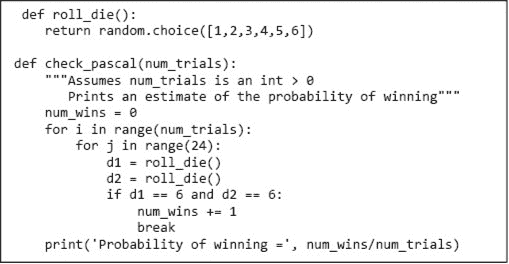
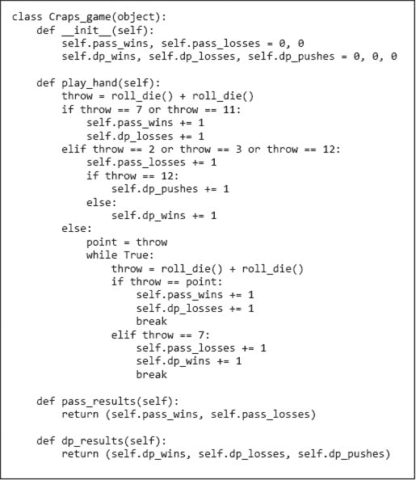
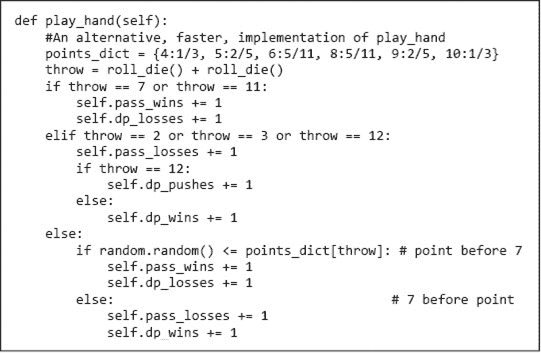
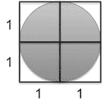
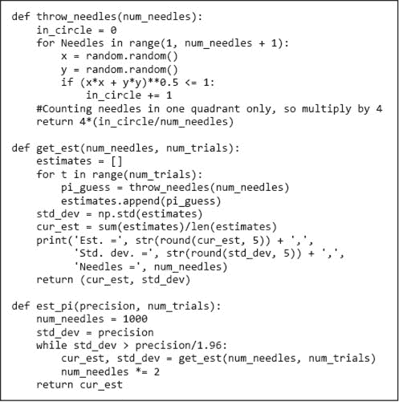

# 第十九章：蒙特卡罗模拟

在第十六章和第十七章中，我们探讨了在计算中使用随机性的不同方式。我们呈现的许多示例属于被称为**蒙特卡罗模拟**的计算类别。蒙特卡罗模拟是一种通过多次运行相同模拟并平均结果来近似事件概率的技术。

斯坦尼斯瓦夫·乌拉姆和尼古拉斯·梅特罗波利斯于 1949 年创造了“蒙特卡罗模拟”这一术语，以向摩纳哥公国赌场中的机会游戏致敬。乌拉姆以与爱德华·泰勒共同设计氢弹而闻名，他这样描述该方法的发明：

> *我对[蒙特卡罗方法]的首次思考和尝试，是在 1946 年我在康复期间玩接龙时想到的一个问题。这个问题是，一个用 52 张牌摆成的坎菲尔德接龙成功的机会是多少？在花了大量时间试图通过纯组合计算来估算它们之后，我想知道是否有比“抽象思维”更实际的方法，比如说摆一百次并简单观察和计算成功的次数。随着新一代快速计算机的出现，这已经是可以想象的了，**¹²⁴* *我立即想到了中子扩散问题和其他数学物理问题，以及更一般地如何将由某些微分方程描述的过程转变为可解释为随机操作序列的等效形式。后来…… [在 1946 年，我] 向约翰·冯·诺依曼描述了这个想法，我们开始规划实际计算。**¹²⁵*

该技术在曼哈顿计划期间被用来预测核裂变反应会发生什么，但直到 1950 年代计算机变得更加普及和强大时，它才真正起飞。

乌拉姆并不是第一个想到使用概率工具来理解机会游戏的数学家。概率的历史与赌博的历史密切相关。正是这种不确定性使得赌博成为可能。而赌博的存在促使了许多必要的数学的发展，以便更好地推理不确定性。卡尔达诺、帕斯卡尔、费马、伯努利、德摩根和拉普拉斯对概率理论基础的贡献，都是出于希望更好地理解（并可能从中获利）机会游戏的愿望。

## 18.1 帕斯卡尔问题

早期概率理论的大部分研究围绕着使用骰子的游戏进行。传闻，帕斯卡对后来被称为概率理论的领域的兴趣开始于一个朋友问他，在 24 次掷骰中掷出双`6`是否会有利可图。这在十七世纪中期被视为一个棘手的问题。帕斯卡和费尔马这两位聪明人就如何解决这个问题交换了多封信件，但现在看来这是一个容易回答的问题：

+   在第一次掷骰中，每个骰子掷出`6`的概率为`1/6`，因此两个骰子同时掷出`6`的概率为`1/36`。

+   因此，第一次掷骰不掷出双`6`的概率为`1 ‑ 1/36 =` `35/36`。

+   因此，连续 24 次掷骰不掷出`6`的概率为`(35/36)`²⁴，约为`0.51`，因此掷出双`6`的概率为`1 - (35/36)`²⁴，大约为`0.49`。从长远来看，押注在 24 次掷骰中掷出双`6`并不划算。

为了安全起见，我们写一个小程序，图 18-1，来模拟帕斯卡朋友的游戏，并确认我们得到的答案与帕斯卡相同。（本章中的所有代码都假设

```py
import random
import numpy as np
```

在代码出现的文件开始时出现。当第一次运行时，调用`check_pascal(1000000)`打印了结果。

```py
`Probability of winning = 0.490761`
```

这确实非常接近`1 - (35/36)`²⁴；在 Python shell 中输入`1-(35.0/36.0)**24`产生`0.49140387613090342`。



图 18-1 检查帕斯卡的分析

## 18.2 过线或不过线？

关于机会游戏的问题并非都那么容易回答。在掷骰子游戏中，掷骰者（投掷骰子的人）在“过线”或“不过线”投注之间选择。

+   过线：如果第一次掷骰结果是“自然数”（`7`或`11`），则掷骰者获胜；如果结果是“掷骰”（`2`、`3`或`12`），则掷骰者失败。如果掷出其他数字，该数字成为“点数”，掷骰者继续掷骰。如果掷骰者在掷出`7`之前掷出点数，掷骰者获胜；否则掷骰者失败。

+   不过线：如果第一次掷骰结果是`7`或`11`，则掷骰者失败；如果结果是`2`或`3`，则掷骰者获胜；如果结果是`12`，则平局（在赌博术语中称为“平推”）。如果掷出其他数字，该数字成为点数，掷骰者继续掷骰。如果掷骰者在掷出点数之前掷出`7`，掷骰者获胜；否则掷骰者失败。

这两者中哪个更划算？哪一个算是一个好赌注吗？可以通过分析得出这些问题的答案，但对我们来说，编写一个模拟掷骰游戏的程序并看看发生了什么似乎更简单。图 18-2 包含了这种模拟的核心。



图 18-2 `Craps_game`类

`Craps_game`类的实例变量记录自游戏开始以来通过线和不通过线的表现。观察方法`pass_results`和`dp_results`返回这些值。方法`play_hand`模拟一局游戏。一局的开始是当投掷者“出场”，这是在确定点数之前的投掷术语。一局在投掷者赢得或失去初始赌注时结束。`play_hand`中的大部分代码仅是上述规则的算法描述。请注意，`else`子句中有一个循环，对应于确定点数后发生的情况。当掷出七点或点数时，通过`break`语句退出循环。

图 18-3 包含一个使用`Craps_game`类模拟一系列掷骰子游戏的函数。


图 18-3 模拟掷骰子游戏

`craps_sim`的结构是许多模拟程序的典型：

1.  1\. 它运行多个游戏（可以把每个游戏看作是我们之前模拟中的一次试验）并累积结果。每个游戏包括多局，因此有一个嵌套循环。

1.  2\. 然后它生成并存储每个游戏的统计数据。

1.  3\. 最后，它生成并输出汇总统计数据。在这种情况下，它打印每种投注线的预计投资回报率（ROI）和该 ROI 的标准差。

**投资回报率**由以下方程定义¹²⁷


由于通过线和不通过线支付的是等额奖金（如果你投注`$1`并赢得，你获得`$1`），因此投资回报率为


例如，如果你进行了`100`次通过线的投注并赢得了一半，那么你的 ROI 将是


如果你在不通过线上投注 100 次，并赢得 25 次和 5 次平局，那么 ROI 将是


让我们运行掷骰子游戏模拟，看看尝试`craps_sim(20, 10)`时会发生什么：¹²⁸

```py
Pass: Mean ROI = -7.0% Std. Dev. = 23.6854%
Don't pass: Mean ROI = 4.0% Std Dev = 23.5372%
```

看起来避免通过线是个好主意——预计投资回报为`7%`的损失。但不通过线似乎是一个不错的赌注。或者说并非如此？

从标准差来看，不通过线似乎并不是如此安全的赌注。回想一下，在假设分布是正态的情况下，`95%`的置信区间由均值两侧的`1.96`个标准差包围。对于不通过线，`95%`的置信区间是`[4.0–1.96`*`23.5372, 4.0+1.96`*`23.5372]`——大约为`[-43%, +51%]`。这当然并不表明投注不通过线是万无一失的。

是时候将大数法则付诸实践；`craps_sim(1000000, 10)` 输出

```py
Pass: Mean ROI = -1.4204% Std. Dev. = 0.0614%
Don't pass: Mean ROI = -1.3571% Std Dev = 0.0593%
```

我们现在可以相对安全地假设这两个选项都不是好的投注。¹²⁹ 看起来不通过线可能稍微好一些，但我们可能不应该依赖于此。如果通过线和不通过线的`95%`置信区间没有重叠，假设两个均值之间的差异是统计显著的将是安全的。¹³⁰ 然而，它们确实重叠，所以不能安全得出结论。

假设我们不是增加每局的手数，而是增加游戏的局数，例如，通过调用`craps_sim(20, 1000000)`：

```py
Pass: Mean ROI = -1.4133% Std. Dev. = 22.3571%
Don't pass: Mean ROI = -1.3649% Std Dev = 22.0446%
```

标准差很高——这表明一局`20`手的结果高度不确定。

模拟的一个好处是它们使得进行“如果”实验变得简单。例如，如果一名玩家能够悄悄地引入一对有利于`5`而非`2`的作弊骰子（`5`和`2`在骰子的对面）呢？要测试这个，只需将`roll_die`的实现替换为类似的内容。

```py
def roll_die():
    return random.choice([1,1,2,3,3,4,4,5,5,5,6,6])
```

骰子上的这个相对较小的变化在赔率上产生了显著差异。运行`craps_sim(1000000, 10)`得出的结果是

```py
Pass: Mean ROI = 6.6867% Std. Dev. = 0.0993%
Don't pass: Mean ROI = -9.469% Std Dev = 0.1024%
```

难怪赌场费尽心思确保玩家不在游戏中引入自己的骰子！

**手指练习**：如果在掷出 6 之前掷出了 7，"大 6"的投注支付是平赔。假设每小时有 30 个$5 的投注，编写一个蒙特卡罗模拟来估算玩“大 6”投注的每小时成本和该成本的标准差。

## 18.3 使用表查找来提高性能

你可能不想在家尝试运行`craps_sim(100000000, 10)`。在大多数计算机上完成这个任务需要很长时间。这引出了一个问题：是否有简单的方法来加快模拟速度。

函数`craps_sim`的实现复杂度大约是*θ*`(``play_hand``)`*`hands_per_game`*`num_games`。`play_hand`的运行时间取决于循环执行的次数。从理论上讲，循环可以被执行无限次，因为掷出`7`或点数所需的时间没有上限。但实际上，我们有充分理由相信它总会终止。

不过请注意，`play_hand`的调用结果并不依赖于循环执行的次数，而只取决于达到的退出条件。对于每个可能的点，我们可以轻松计算在掷出`7`之前掷出该点的概率。例如，使用一对骰子我们可以用三种方式掷出`4`：`<1, 3>, <3, 1>,` 和 `<2, 2>`。我们可以用六种方式掷出`7`：`<1, 6>, <6, 1>, <2, 5>, <5, 2>, <3, 4>` 和 `<4, 3>`。因此，通过掷出`7`退出循环的可能性是通过掷出`4`的两倍。

图 18-4 包含了一个利用这种思维的`play_hand`实现。我们首先计算在掷出`7`之前，针对每个可能的点值形成该点的概率，并将这些值存储在字典中。例如，假设点值为`8`。投掷者会继续掷骰，直到掷出该点或掷出“掷坏”。掷出`8`有五种方式`(<6,2>, <2,6>, <5,3>, <3,5>, <4,4>)`，而掷出`7`有六种方式。因此，字典键`8`的值为表达式`5/11`的值。拥有这个表允许我们将包含不受限制掷骰次数的内部循环替换为对一次`random.random`调用的测试。这个版本的`play_hand`的渐进复杂度为`O(1)`。

用**查表**替代计算的思想具有广泛的适用性，通常在速度成为问题时使用。查表是**以时间换空间**这一一般思想的一个例子。正如我们在第十五章中看到的，这也是动态规划背后的关键思想。在我们对哈希分析中看到过这一技术的另一个例子：表越大，碰撞越少，平均查找速度越快。在这种情况下，表很小，所以空间成本微不足道。



图 18-4 使用查表来提高性能

## 18.4 寻找π

很容易看出，蒙特卡罗模拟在解决非确定性问题时是有用的。有趣的是，蒙特卡罗模拟（以及随机算法一般）也可以用来解决那些本质上并不是随机的问题，即没有结果不确定性的问题。

考虑*π*。数千年来，人们一直知道有一个常数（自 18 世纪以来称为*π*），使得圆的周长等于`π` * `直径`，而圆的面积等于*π* * `半径`²。他们不知道的是这个常数的值。

最早的估算之一，`4`*`(8/9)`² `= 3.16`，可以在公元前 1650 年的埃及*林德纸草书*中找到。千年之后，*旧约*（列王纪上 7.23）在给出所罗门王某个建筑项目的规格时暗示了一个不同的*π*值，

> *他造了一个铸造的海，从一边到另一边十肘：它周围是圆的，高五肘：周围有三十肘的线环绕着它。*

解决*π*，`10π = 30`，因此*π* `= 3`。也许*圣经*只是错了，或者铸造的海并不完美圆形，或者周长是从墙外测量的而直径是从内部测量的，或者这只是诗意的许可。我们留给读者自己决定。

阿基米德（公元前 287-212 年）通过使用高阶多边形来近似圆形，从而得出了*π*的上下界。使用 96 边的多边形，他得出结论`223/71 <` *π* `< 22/7`。给出上下界在当时是一种相当复杂的方法。如果将他的两个界的平均值作为最佳估计，我们得到了`3.1418`，误差约为`0.0002`。不错！但大约 700 年后，中国数学家祖冲之使用一个有 24,576 个边的多边形得出结论`3.1415962 <` *π* `< 3.1415927\`。大约 800 年后，荷兰制图师阿德里安·安东尼兹（1527-1607）估算为`355/113`，大约为 3.1415929203539825。这一估算对大多数实际用途来说已经足够好，但并未阻止数学家继续研究这个问题。

在计算机发明之前，法国数学家布丰（1707-1788）和拉普拉斯（1749-1827）提出使用随机模拟来估算*π*的值。¹³¹ 想象一下在一条边长为`2`的正方形内画一个圆，使得圆的半径`r`为`1`。



图 18-5 单位圆被画在正方形内

根据*π*的定义，*面积* = *πr*²。由于`r`为`1`，*π* `= 面积`。但圆的面积是多少呢？布丰建议通过在正方形附近抛投大量针来估算圆的面积（他认为针在下落时会随机移动）。落在正方形内的针尖数量与落在圆内的针尖数量的比率可以用来估算圆的面积。

如果针的位置是完全随机的，我们知道


并求解圆的面积，


记住，`2`乘以`2`的正方形面积是`4`，所以，


一般来说，要估算某个区域`R`的面积：

1.  1\. 选择一个封闭区域`E`，使得`E`的面积容易计算，且`R`完全位于`E`内。

1.  2\. 选择一组随机点，这些点位于`E`内。

1.  3\. 设`F`为落在`R`内的点的比例。

1.  4\. 将区域`E`的面积乘以`F`。

如果你尝试布丰的实验，你会很快意识到针落下的位置并不是完全随机的。此外，即使你能随机投放它们，也需要大量的针才能得到与*Bible*相当的`π`近似值。幸运的是，计算机可以以惊人的速度随机投放模拟针。¹³²

图 18-6 包含一个使用布丰-拉普拉斯方法估算`π`的程序。为了简化，程序仅考虑落在正方形右上象限的针。



图 18-6 估计 π

函数 `throw_needles` 通过首先使用 `random.random` 获取一对正的笛卡尔坐标（`x` 和 `y` 值），模拟扔掉一根针，这代表了针相对于正方形中心的位置。然后，它使用毕达哥拉斯定理计算以 `x` 为底、`y` 为高的直角三角形的斜边。这是针尖离原点（正方形的中心）的距离。由于圆的半径为 `1`，我们知道，只有当从原点的距离不大于 `1` 时，针才会落在圆内。我们利用这一事实来计算落在圆内的针的数量。

函数 `get_est` 使用 `throw_needles` 通过首先扔掉 `num_needles` 根针，然后对 `num_trials` 次试验的结果取平均，来找出 *π* 的估计值。它返回试验的均值和标准差。

函数 `est_pi` 以不断增加的针的数量调用 `get_est`，直到 `get_est` 返回的标准差不大于 `precision/1.96`。在假设误差服从正态分布的前提下，这意味着 `95%` 的值位于均值的 `precision` 范围内。

当我们运行 `est_pi(0.01, 100)` 时，它打印了

```py
Est. = 3.14844, Std. dev. = 0.04789, Needles = 1000
Est. = 3.13918, Std. dev. = 0.0355, Needles = 2000
Est. = 3.14108, Std. dev. = 0.02713, Needles = 4000
Est. = 3.14143, Std. dev. = 0.0168, Needles = 8000
Est. = 3.14135, Std. dev. = 0.0137, Needles = 16000
Est. = 3.14131, Std. dev. = 0.00848, Needles = 32000
Est. = 3.14117, Std. dev. = 0.00703, Needles = 64000
Est. = 3.14159, Std. dev. = 0.00403, Needles = 128000
```

正如我们所预期的，随着样本数量的增加，标准差单调减少。最开始时，`π` 的估计值也稳步提高。有些高于真实值，有些低于真实值，但每次增加 `num_needles` 都会导致估计值的改善。在每次试验中使用 `1000` 个样本时，模拟的估计值已经优于*圣经*和*林德纸草书*。

有趣的是，当针的数量从 `8,000` 增加到 `16,000` 时，估计值反而变差，因为 `3.14135` 离真实的 *π* 值比 `3.14143` 更远。然而，如果我们查看每个均值周围一个标准差所定义的范围，这两个范围都包含真实的 *π* 值，且与较大样本量相关的范围更小。尽管使用 `16,000` 个样本生成的估计恰好离真实的 *π* 值更远，但我们应该对其准确性更有信心。这是一个极其重要的概念。仅仅给出一个好答案是不够的。我们必须有合理的理由相信它实际上是一个好答案。当我们扔掉足够多的针时，小标准差给我们提供了信心，表明我们得到了正确的答案，对吧？

不完全是。拥有小的标准差是对结果有效性有信心的必要条件，但不是充分条件。统计有效结论的概念永远不应与正确结论的概念混淆。

每个统计分析都始于一组假设。这里的关键假设是我们的模拟是现实的准确模型。回想一下，我们的布丰-拉普拉斯模拟的设计是从一些代数开始的，这些代数展示了我们如何利用两个区域的比率来找到*π*的值。然后我们将这个想法转化为依赖于一些几何知识和`random.random`随机性的代码。

让我们看看如果我们在这些方面出错会发生什么。例如，假设我们将函数`throw_needles`最后一行中的`4`替换为`2`，然后再次运行`est_pi(0.01, 100)`。这次它打印

```py
Est. = 1.57422, Std. dev. = 0.02394, Needles = 1000
Est. = 1.56959, Std. dev. = 0.01775, Needles = 2000
Est. = 1.57054, Std. dev. = 0.01356, Needles = 4000
Est. = 1.57072, Std. dev. = 0.0084, Needles = 8000
Est. = 1.57068, Std. dev. = 0.00685, Needles = 16000
Est. = 1.57066, Std. dev. = 0.00424, Needles = 32000
```

仅仅`32,000`根针的标准差表明我们对这个估计应该有相当的信心。但这到底意味着什么呢？这意味着我们可以合理地相信，如果我们从同一分布中抽取更多样本，我们会得到一个类似的值。它并未说明这个值是否接近实际的*π*值。如果你要记住关于统计学的一件事，请记住这一点：统计上有效的结论不应与正确的结论混淆！

在相信模拟结果之前，我们需要对我们的概念模型的正确性以及我们是否正确实现了该模型有信心。尽可能地，你应该尝试将结果与现实进行验证。在这种情况下，你可以使用其他方法计算圆的面积的近似值（例如，物理测量），并检查计算得到的*π*值至少是否在正确的范围内。

## 18.5 关于模拟模型的一些结束语

在科学历史的大部分时间里，理论家们使用数学技术构建纯粹的解析模型，这些模型可以根据一组参数和初始条件预测系统的行为。这导致了重要数学工具的发展，从微积分到概率论。这些工具帮助科学家们对宏观物理世界形成了相对准确的理解。

随着二十世纪的进展，这种方法的局限性变得越来越明显。这些原因包括：

+   对社会科学（例如经济学）的兴趣增加，促使人们希望构建那些在数学上无法处理的系统的良好模型。

+   随着被建模的系统变得越来越复杂，似乎逐步完善一系列模拟模型比构建准确的解析模型要容易得多。

+   从模拟中提取有用的中间结果往往比从解析模型中提取更容易，例如进行“如果……会怎样”的游戏。

+   计算机的可用性使得运行大规模模拟成为可能。在二十世纪中叶现代计算机出现之前，模拟的实用性受限于手动计算所需的时间。

仿真模型是**描述性的**，而不是**处方性的**。它们描述系统在给定条件下如何工作，而不是如何安排条件以使系统表现最佳。仿真并不优化，它只是描述。这并不是说仿真不能作为优化过程的一部分。例如，仿真通常作为寻找最佳参数设置的一部分搜索过程。

仿真模型可以沿三个维度分类：

+   确定性与随机性

+   静态与动态

+   离散与连续

**确定性仿真**的行为完全由模型定义。重新运行仿真不会改变结果。确定性仿真通常用于被建模系统本身也是确定性的情况，但分析过于复杂，例如，处理器芯片的性能。**随机仿真**在模型中引入了随机性。对同一模型的多次运行可能会生成不同的值。这种随机因素迫使我们生成多个结果，以查看可能性的范围。生成`10`、`1000`或`100,000`个结果的问题是一个统计问题，如前所述。

在**静态模型**中，时间没有本质作用。本章中用于估计`π`的针落仿真就是一个静态仿真的例子。在**动态模型**中，时间或某种类似物起着重要作用。在第十六章中模拟的一系列随机行走中，所采取的步数被用作时间的替代。

在**离散模型**中，相关变量的值是可枚举的，例如，它们是整数。在**连续模型**中，相关变量的值范围在不可枚举的集合上，例如，实数。想象分析高速公路上的交通流。我们可能选择对每辆汽车进行建模，在这种情况下，我们有一个离散模型。或者，我们可能选择将交通视为一种流，其中流的变化可以用微分方程描述。这就导致了一个连续模型。在这个例子中，离散模型更接近物理情况（没有人开半辆车，尽管有些车的尺寸是其他车的一半），但计算复杂性大于连续模型。在实践中，模型往往同时具有离散和连续组件。例如，我们可能选择使用离散模型对血液流动进行建模（即，对单个血球建模），并使用连续模型对血压进行建模。

## 18.6 本章引入的术语

+   蒙特卡洛仿真

+   投资回报率（ROI）

+   表查找

+   时间/空间权衡

+   描述模型

+   处方模型

+   确定性仿真

+   随机仿真

+   静态模型

+   动态模型

+   离散模型

+   连续模型
