# 第二十三章：21

随机试验与假设检验

X 博士发明了一种药物 PED-X，旨在帮助职业自行车手骑得更快。当他试图推销时，自行车手们坚持要求 X 博士证明他的药物优于 PED-Y，这种他们使用多年的禁药。X 博士从一些投资者那里筹集资金并启动了**随机试验**。

他说服`200`名职业自行车手参与试验。然后他将他们随机分为两个组：治疗组和对照组。**治疗组**的每位成员都接受了 PED-X 的剂量。**对照组**的成员被告知他们接受了 PED-X 的剂量，但实际上他们接受的是 PED-Y 的剂量。

每位自行车手被要求尽可能快地骑行`50`英里。每组的完成时间呈正态分布。治疗组的平均完成时间为`118.61`分钟，而对照组为`120.62`分钟。图 21-1 显示了每位自行车手的时间。

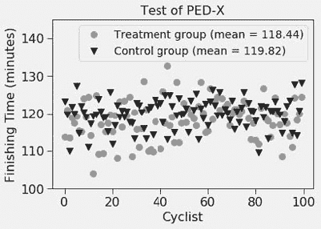

图 21-1 自行车手的完成时间

X 博士非常兴奋，直到遇到一位统计学家，她指出两个组中几乎总会有一个组的均值低于另一个组，或许均值之间的差异仅仅是随机现象。当她看到科学家失落的表情时，统计学家提出要教他如何检查研究的统计显著性。

## 21.1 检查显著性

在任何涉及从人群中随机抽样的实验中，观察到的效应总有可能纯粹是偶然的。图 21-2 可视化了 2020 年 1 月的温度与 1981 年至 2010 年 1 月的平均温度的变化。现在，想象你通过选择地球上的 20 个随机地点来构建一个样本，然后发现样本的平均温度变化为`+1`摄氏度。观察到的平均温度变化是因为你恰好抽取的地点的伪影，而不是表明整个星球正在变暖的概率是多少？回答这种问题就是**统计显著性**的核心所在。


图 21-2 2020 年 1 月与 1981-2010 年平均气温差异¹⁴⁵

在 20 世纪初，罗纳德·费舍尔开发了一种统计**假设检验**的方法，已成为评估观察到的效果纯粹是偶然发生的概率的最常见方法。费舍尔说他发明了这种方法，是回应布里斯托-罗奇博士的一个声明，她声称当她喝加奶茶时，可以判断是茶先倒入茶杯还是牛奶。费舍尔向她挑战进行“茶测试”，她被提供了八杯茶（每种加茶和牛奶的顺序各四杯），要求识别那些茶先倒入的杯子。她完美地完成了。费舍尔随后计算了她纯粹偶然做到这一点的概率。正如我们在第 17.4.4 节中看到的，，即有`70`种方法从`8`杯中选择`4`杯。由于只有这`70`种组合中有一种包含所有“茶先倒入”的`4`杯，费舍尔计算出布里斯托-罗奇博士纯靠运气选择正确的概率是。由此，他得出结论，她的成功极不可能归因于运气。

费舍尔的显著性检验方法可以总结为

1.  1\. 陈述**原假设**和**备择假设**。原假设是“处理”没有有趣的效果。对于“茶测试”，原假设是布里斯托-罗奇博士无法品尝出差异。备择假设只有在原假设为假时才能成立，例如，布里斯托-罗奇博士能够品尝出差异。¹⁴⁶

1.  2\. 理解被评估样本的统计假设。对于“茶测试”，费舍尔假设布里斯托-罗奇博士为每杯茶做出了独立的决定。

1.  3\. 计算相关的**检验统计量**。在这种情况下，检验统计量是布里斯托-罗奇博士给出的正确答案的比例。

1.  4\. 在原假设下推导该检验统计量的概率。在这种情况下，这是偶然得到所有杯子的概率，即`0.014`。

1.  5\. 决定该概率是否足够小，以至于你愿意假设原假设为假，即**拒绝**原假设。拒绝水平的常见值，应该提前选择，是`0.05`和`0.01`。

回到我们的骑行者，假设治疗组和对照组的时间是从 PED-X 用户和 PED-Y 用户的无限完成时间总体中抽取的样本。这个实验的原假设是这两个更大总体的均值相同，即治疗组的总体均值与对照组的总体均值之间的差为 0。备择假设是它们不相同，即均值之差不等于 0。

接下来，我们开始尝试拒绝原假设。我们为统计显著性选择一个阈值α，并尝试证明数据来自与原假设一致的分布的概率小于α。然后我们说可以以置信度α拒绝原假设，并以概率`1 –` α接受原假设的否定。

α的选择影响我们犯错的类型。α越大，我们越可能拒绝实际上真实的原假设。这被称为**第一类错误**。当α较小的时候，我们更可能接受实际上是错误的原假设。这被称为**第二类错误**。

通常，人们选择α = `0.05`。然而，根据错误的后果，选择一个较小或较大的α可能更为合适。例如，假设原假设是，服用 PED-X 和服用 PED-Y 之间的早逝率没有差异。我们可能希望选择一个较小的α，比如`0.001`，作为拒绝该假设的基础，然后再决定哪种药物更安全。另一方面，如果原假设是 PED-X 和 PED-Y 在增强表现的效果上没有差异，我们可能会舒适地选择一个相对较大的α。¹⁴⁷

下一步是计算检验统计量。最常见的检验统计量是**t 统计量**。t 统计量告诉我们，从数据中得出的估计值与原假设之间的差异有多大，以标准误的单位来衡量。t 统计量越大，越有可能拒绝原假设。在我们的例子中，t 统计量告诉我们两个均值的差异（`118.44 – 119.82 = -1.38`）距离`0`有多少个标准误。我们的 PED-X 示例的 t 统计量是`-2.11`（稍后你会看到如何计算这个值）。这意味着什么？我们如何使用它？

我们使用 t 统计量的方式与使用均值的标准差数量来计算置信区间的方法非常相似（参见第 17.4.2 节）。请记住，对于所有正态分布，样本落在均值的固定标准差数量内的概率是固定的。在这里，我们做了一些稍微复杂的事情，考虑了用于计算标准误的样本数量。我们假设的是**t 分布**，而不是正态分布。

t 分布最早由威廉·戈塞特（William Gosset）于 1908 年描述，他是一位为亚瑟·吉尼斯与儿子酿酒厂工作的统计学家。¹⁴⁸ t 分布实际上是一系列分布，因为分布的形状取决于样本的自由度。

**自由度**描述了用于推导 t 统计量的独立信息量。一般来说，我们可以将自由度视为样本中可用于估计某个关于样本所抽取的总体的统计量的独立观察数量。

t 分布类似于正态分布，自由度越大，越接近正态分布。对于小自由度，t 分布的尾部比正态分布明显更胖。对于自由度在 30 或以上的情况，t 分布非常接近正态分布。

现在，让我们用样本方差来估计总体方差。考虑一个包含三个例子 100、200 和 300 的样本。回想一下


所以我们的样本方差是


看起来我们似乎在使用三个独立的信息片段，但实际上并不是。分子中的三个项并不是彼此独立的，因为这三个观察值都用于计算`200`名骑行者样本的均值。自由度为`2`，因为如果我们知道均值和三个观察值中的任何两个，则第三个观察值的值是固定的。

自由度越大，样本统计量代表总体的概率越高。从单个样本计算的 t 统计量的自由度比样本大小少一，因为在计算 t 统计量时使用了样本的均值。如果使用两个样本，则自由度比样本大小之和少二，因为在计算 t 统计量时使用了每个样本的均值。例如，对于 PED-X/PED-Y 实验，自由度为`198`。

在给定自由度的情况下，我们可以绘制一个显示适当 t 分布的图，并查看我们为 PED-X 示例计算的 t 统计量在分布中的位置。图 21-3 中的代码执行了这一点，并生成了图 21-4 中的图。该代码首先使用函数`scipy.random.standard_t`生成许多从自由度为`198`的 t 分布中抽取的样本。然后，它在 PED-X 样本的 t 统计量及其负值处绘制白线。

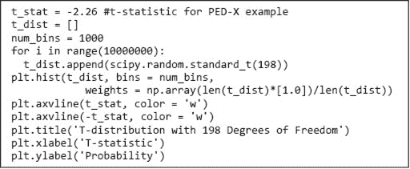

图 21-3 绘制 t 分布

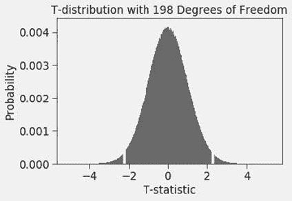

图 21-4 可视化 t 统计量

白线左右的直方图区域的分数之和等于在原假设为真时，观察值至少极端的概率。

+   样本代表总体，并且

+   原假设为真。

我们需要查看两个尾部，因为我们的原假设是总体均值相等。因此，如果治疗组的均值在统计上显著大于或小于对照组的均值，检验应该失败。

在原假设成立的假设下，得到至少与观察值一样极端的值的概率被称为**p 值**。对于我们的 PED-X 示例，p 值是指在假设治疗组和对照组的实际总体均值相同的情况下，观察到的均值差异至少与实际差异一样大的概率。

如果原假设成立，p 值似乎告诉我们事件发生的概率，这看起来有些奇怪，因为我们通常希望原假设不成立。然而，这与经典的**科学方法**并没有太大区别，科学方法是基于设计能够反驳假设的实验。图 21-5 中的代码计算并打印我们的两个样本的 t 统计量和 p 值，一个样本包含对照组的时间，另一个样本包含治疗组的时间。库函数 `scipy.stats.ttest_ind` 执行双尾两样本**t 检验**并返回 t 统计量和 p 值。将参数 `equal_var` 设置为 `False` 表示我们不知道这两个总体是否具有相同的方差。

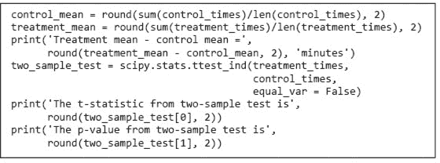

图 21-5 计算并打印 t 统计量和 p 值

当我们运行代码时，它报告

```py
Treatment mean - control mean = -1.38 minutes
The t-statistic from two-sample test is -2.11
The p-value from two-sample test is 0.04
```

“是的，”X 博士兴奋地说，“看来 PED-X 不比 PED-Y 更好的概率只有 `4%`，因此 PED-X 有效的概率是 `96%`。让现金注册机开始响起来。”可惜，他的兴奋仅持续到他阅读本章的下一部分。

## 21.2 警惕 P 值

过于简单地将某种含义读入 p 值是非常容易的。将 p 值视为原假设为真的概率是很有诱惑力的，但这并不是它的实际含义。

零假设类似于英美刑事司法系统中的被告。该系统基于一种称为“无罪推定”的原则，即在未被证明有罪之前被认为是无罪。类似地，我们假设零假设是真实的，除非我们看到足够的证据反对它。在审判中，陪审团可以裁定被告是“有罪”或“无罪”。“无罪”裁决意味着证据不足以使陪审团相信被告“超出合理怀疑”是有罪的。¹⁴⁹可以将其视为“没有证明有罪”。“无罪”裁决并不意味着证据足以使陪审团相信被告是无罪的。它也没有说明如果陪审团看到不同的证据会得出什么结论。可以将 p 值视为陪审团裁决，其中标准“超出合理怀疑”由 α 定义，而证据则是构建 t 统计量的数据。

小 p 值表明，如果零假设为真，则特定样本不太可能出现。它类似于陪审团得出结论，认为如果被告是无罪的，就不太可能会呈现出这一组证据，因此做出了有罪的裁决。当然，这并不意味着被告实际上有罪。也许陪审团看到了误导性的证据。类似地，低 p 值可能是因为零假设实际上是错误的，或者只是因为样本并不能代表其来源的人群，即证据是误导性的。

正如你所预料的，Dr. X 坚决声称他的实验表明零假设可能是错误的。Dr. Y 坚持认为低 p 值可能是由于不具代表性的样本，并资助了与 Dr. X 的实验规模相同的另一项实验。当用她的实验样本计算统计数据时，代码打印了

```py
Treatment mean - control mean = 0.18 minutes
The t-statistic from two-sample test is -0.27
The p-value from two-sample test is 0.78
```

这个 p 值比 Dr. X 的实验得到的值大了 17 倍以上，确实没有理由怀疑零假设。混乱盛行。但我们可以澄清它！

你可能不会惊讶地发现这并不是一个真实的故事——毕竟，骑自行车的人服用增强表现的药物的想法确实令人怀疑。实际上，实验的样本是通过图 21-6 中的代码生成的。

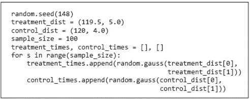

图 21-6 生成竞赛示例的代码

由于实验纯粹是计算性的，我们可以多次运行它以获得许多不同的样本。当我们生成了 `10,000` 对样本（每个分布各一个）并绘制 p 值的概率时，得到了图 21-7。

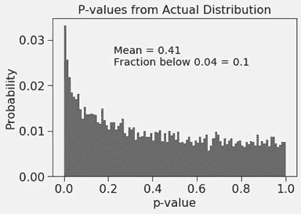

图 21-7 p 值的概率

由于约`10%`的 p 值低于`0.04`，因此一个实验恰好在`4%`水平上显示显著性并不令人感到惊讶。另一方面，第二个实验得出完全不同的结果也并不令人意外。看起来令人惊讶的是，考虑到我们知道两个分布的均值实际上是不同的，我们得到的结果在`5%`水平上只有约`12%`的时间是显著的。大约`88%`的时间，我们未能在`5%`水平上拒绝错误的原假设。

p 值可能是不可靠的指标，这也是许多出现在科学文献中的结果无法被其他科学家重复的原因之一。一个问题是，**研究能力**（样本的大小）与统计发现的可信度之间存在强关系。¹⁵⁰ 如果我们将样本大小增加到`3000`，我们仅约`1%`的时间未能拒绝错误的原假设。

为什么这么多研究的统计能力不足？如果我们真的在进行一项对人进行实验（而不是模拟），那么提取大小为`2000`的样本将比提取大小为`100`的样本贵 20 倍。

样本大小的问题是所谓频率主义统计方法的一个内在特征。在 21.7 节中，我们讨论一种试图缓解这一问题的替代方法。

## 21.3 单尾和单样本检验

到目前为止，我们在本章中只讨论了双尾双样本检验。有时，使用**单尾**和/或**单样本**t 检验更为合适。

首先，让我们考虑一个单尾双样本检验。在我们对 PED-X 和 PED-Y 相对有效性的双尾检验中，我们考虑了三种情况：1）它们同样有效，2）PED-X 比 PED-Y 更有效，以及 3）PED-Y 比 PED-X 更有效。目标是通过论证如果原假设（情况 1）为真，那么看到 PED-X 和 PED-Y 样本均值之间如此大的差异是不太可能的，从而拒绝原假设。

然而，假设 PED-X 的成本显著低于 PED-Y。为了为他的化合物找到市场，X 博士只需证明 PED-X 至少与 PED-Y 一样有效。可以这样理解，我们希望拒绝均值相等或 PED-X 均值更大的假设。请注意，这比均值相等的假设要严格弱。(假设`A`严格弱于假设`B`，如果`B`为真时`A`也为真，但反之不然。)

为此，我们从一个双样本检验开始，原始原假设由图 21-5 中的代码计算得出。它打印了

```py
Treatment mean - control mean = -1.38 minutes
The t-statistic from two-sample test is -2.11
The p-value from two-sample test is 0.04
```

允许我们在约`4%`的水平上拒绝原假设。

我们的较弱假设怎么样？回想一下图 21-4。我们观察到在零假设成立的假设下，白线左侧和右侧直方图区域的分数之和等于获得至少与观察值一样极端的值的概率。然而，为了拒绝我们的较弱假设，我们不需要考虑左尾下的区域，因为这对应于 PED-X 比 PED-Y 更有效（一个负时间差），而我们只对拒绝 PED-X 不如 PED-Y 的假设感兴趣。也就是说，我们可以进行单尾检验。

由于 t 分布是对称的，因此为了获得单尾检验的值，我们将双尾检验的 p 值减半。因此，单尾检验的 p 值为`0.02`。这使我们能够在`2%`的水平上拒绝我们较弱的假设，而这在使用双尾检验时无法做到。

因为单尾检验提供了更强的效能来检测效应，所以每当有关于效应方向的假设时，使用单尾检验是很诱人的。但这通常不是一个好主意。仅当未检验方向上漏掉效应的后果微不足道时，单尾检验才合适。

现在让我们看看单样本检验。假设经过多年使用 PED-Y 的经验，赛车手在 PED-Y 下完成 50 英里赛道的平均时间是`120`分钟。为了发现 PED-X 是否与 PED-Y 有不同的效应，我们将检验零假设，即单个 PED-X 样本的平均时间等于`120`。我们可以使用函数`scipy.stats.ttest_1samp`来实现，该函数接受一个样本和与之比较的总体均值作为参数。它返回一个包含 t 统计量和 p 值的元组。例如，如果我们在图 21-5 的代码末尾附加代码。

```py
one_sample_test = scipy.stats.ttest_1samp(treatment_times, 120)
print('The t-statistic from one-sample test is', one_sample_test[0])
print('The p-value from one-sample test is', one_sample_test[1])
```

它打印。

```py
The t-statistic from one-sample test is -2.9646117910591645
The p-value from one-sample test is 0.0037972083811954023 
```

p 值小于我们使用双样本双尾检验得到的值并不令人惊讶。通过假设我们知道两个均值之一，我们消除了一个不确定性来源。

那么，经过这一切，我们从 PED-X 和 PED-Y 的统计分析中学到了什么？尽管 PED-X 和 PED-Y 用户的预期表现存在差异，但没有任何有限的 PED-X 和 PED-Y 用户样本能保证揭示这一差异。此外，由于预期均值的差异很小（不到千分之五），因此不太可能像 Dr. X 进行的实验（每组`100`名骑手）会产生足够的证据，使我们能在`95%`的置信水平下得出均值存在差异的结论。我们可以通过使用单尾检验来提高在`95%`水平上获得统计显著结果的可能性，但那将是误导性的，因为我们没有理由假设 PED-X 的效果不低于 PED-Y。

## 21.4 显著性与否？

林德赛和约翰在过去几年中浪费了大量时间玩一个叫做“与朋友单词”的游戏。他们之间共进行了 1273 场比赛，林德赛赢了 666 场，因此她得意洋洋地说：“我在这个游戏中比你强多了。”约翰坚称林德赛的说法毫无意义，并认为胜利的差异完全应该归因于运气。

最近读过一本关于统计学的书的约翰，提出了一种方法来判断是否合理将林德赛的相对成功归因于技能：

+   将每场`1,273`场比赛视为一次实验，如果林德赛获胜则返回`1`，否则返回`0`。

+   选择零假设，即这些实验的平均值为`0.5`。

+   对该零假设执行双尾单样本检验。

当他运行代码时

```py
num_games = 1273
lyndsay_wins = 666
outcomes = [1.0]*lyndsay_wins + [0.0]*(num_games - lyndsay_wins)
print('The p-value from a one-sample test is',
      scipy.stats.ttest_1samp(outcomes, 0.5)[1])
```

它打印了

```py
The p-value from a one-sample test is 0.0982205871243577 
```

促使约翰声称差异甚至没有接近`5%`水平的显著性。

林德赛没有学习过统计学，但读过本书第十八章，对此并不满意。“让我们进行一次蒙特卡罗模拟，”她建议，并提供了图 21-8 中的代码。

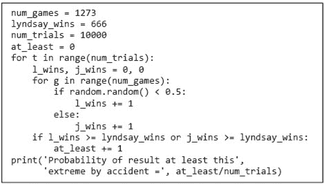

图 21-8 林德赛的游戏模拟

当林德赛的代码运行时，它打印了，

```py
Probability of result at least this extreme by accident = 0.0491 
```

促使她声称约翰的统计检验完全无效，并且胜利的差异在`5%`水平上是统计显著的。

“不，”约翰耐心解释，“是你的模拟有问题。它假设你是更好的玩家，并进行了相当于单尾检验的操作。你模拟的内部循环是错误的。你应该进行相当于双尾检验，测试在模拟中是否有任一玩家赢得了你在实际比赛中赢得的`666`场比赛。”约翰随后运行了图 21-9 中的模拟。

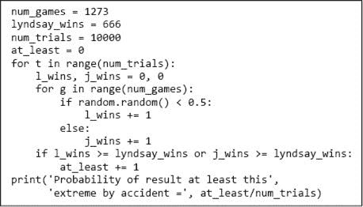

图 21-9 游戏的正确模拟

约翰的模拟打印了

```py
Probability of result at least this extreme by accident = 0.0986
```

“这与我的双尾检验预测的非常接近，”约翰得意地说。林德赛不雅的反应不适合出现在家庭导向的书中。

**手指练习**：一位调查记者发现，林德赛不仅使用了可疑的统计方法，还将其应用于她仅仅虚构的数据上。¹⁵¹ 实际上，约翰击败了林德赛 479 次，输掉了 443 次。这个差异在统计上有多显著？

## 21.5 哪个 N？

一位教授想知道上课是否与他所在系的成绩相关。他招募了`40`名新生，并给他们所有人都佩戴了脚踝手环，以便追踪他们的去向。一半的学生不被允许参加他们所有课程的任何讲座，¹⁵²而另一半则被要求参加所有讲座。¹⁵³ 在接下来的四年中，每位学生参加了`40`门不同的课程，为每组学生提供了`800`个成绩。

当教授对这两个样本（每个样本大小为`800`）的均值进行双尾 t 检验时，p 值约为`0.01`。这让教授感到失望，他原本希望没有统计显著性效应——这样他就能少一些因取消讲座而感到的愧疚，可以去海滩。出于绝望，他查看了两组的平均 GPA，发现差异非常小。他想知道，均值如此微小的差异为何会在那个水平上显著？

当样本大小足够大时，即使是微小的效应也可能具有高度统计显著性。`N`很重要，影响很大。 图 21-10 绘制了`1000`次试验的平均 p 值与试验中使用的样本大小的关系。对于每个样本大小和每次试验，我们生成了两个样本。每个样本均来自标准差为`5`的高斯分布。其中一个样本的均值为`100`，另一个的均值为`100.5`。平均 p 值随着样本大小线性下降。当样本大小达到约`2000`时，均值之间`0.5%`的差异在`5%`水平上变得显著，而当样本大小接近`3000`时，在`1%`水平上显著。

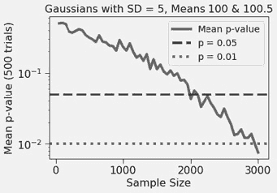

图 21-10 样本大小对 p 值的影响

回到我们的例子，教授在他的研究中使用`N`为`800`的每个**组别**是否合理？换句话说，是否真的有`800`个独立的样本对应每组`20`名学生？可能不是。每个样本有`800`个成绩，但只有`20`名学生，而与每名学生相关的`40`个成绩可能不应视为独立样本。毕竟，有些学生始终能获得好成绩，而有些学生的成绩则令人失望。

教授决定以不同的方式查看数据。他计算了每位学生的 GPA。当他对这两个样本（每个样本大小为`20`）进行双尾 t 检验时，p 值约为`0.3`。于是他去了海滩。

## 21.6 多重假设

在第十九章中，我们使用波士顿马拉松的数据进行了抽样。 图 21-11 中的代码读取了 2012 年比赛的数据，并查找来自少数国家的女性完赛时间的统计显著性差异。它使用了图 19-2 中定义的`get_BM_data`函数。

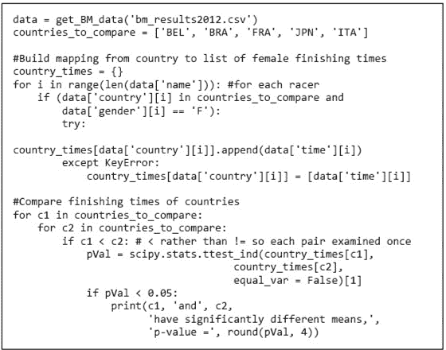

图 21-11 比较所选国家的平均完赛时间

当代码运行时，它打印

```py
ITA and JPN have significantly different means, p-value = 0.025
```

看起来意大利或日本都可以声称其女性跑者比对方更快。¹⁵⁴然而，这样的结论将是相当脆弱的。虽然一组跑者的平均时间确实比另一组快，但样本大小（`20`和`32`）较小，可能并不能代表各国女性马拉松选手的能力。

更重要的是，我们的实验构建方式存在缺陷。我们检查了`10`个零假设（每对国家各一个），并发现其中一个在`5%`水平上可以被拒绝。可以认为我们实际上在检查零假设：“所有国家对之间的女性马拉松选手的平均完赛时间相同。”拒绝这个零假设可能没问题，但这并不等同于拒绝意大利和日本的女性马拉松选手速度相同的零假设。

这一点在图 21-12 的例子中表现得非常明显。在那个例子中，我们从同一总体中抽取 50 对样本，每个样本大小为`200`，并测试每对样本的均值是否存在统计差异。

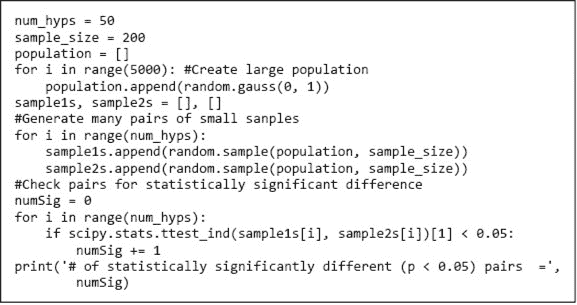

图 21-12 检查多个假设

由于所有样本都来自同一总体，我们知道零假设是正确的。然而，当我们运行代码时，它打印

```py
# of statistically significantly different (p < 0.05) pairs  = 2 
```

表示可以拒绝两个配对的零假设。

这并不特别令人惊讶。回想一下，p 值为`0.05`表示如果零假设成立，观察到两个样本之间的均值差异至少与此差异一样大的概率为`0.05`。因此，如果我们检查 50 对样本，其中两对样本的均值在统计上显著不同，这并不奇怪。运行大量相关实验，然后**挑选**你喜欢的结果，可以被温和地描述为马虎。不友好的人可能会称之为其他东西。

回到我们的波士顿马拉松实验，我们检查是否可以拒绝零假设（均值无差异）对于`10`对样本。当进行涉及多个假设的实验时，最简单且最保守的方法是使用**邦费罗尼校正**。其直觉很简单：在检查`m`个假设的家庭时，维持适当的**家庭错误率**的一种方法是以的水平测试每个单独的假设。使用邦费罗尼校正检查意大利和日本之间的差异在*α* = `0.05`水平上是否显著，我们应该检查 p 值是否小于`0.05/10`，即`0.005`——而它并不是。

如果有许多测试或者测试统计量之间正相关，博恩费罗尼校正是保守的（即，它比必要时更频繁地未能拒绝原假设）。另一个问题是缺乏一个普遍接受的“假设家族”的定义。显然，图 21-12 中代码生成的假设是相关的，因此需要进行校正。但情况并不总是如此明确。

## 21.7 条件概率与贝叶斯统计

到目前为止，我们采取了所谓的**频率主义**统计方法。我们完全基于数据的频率或比例从样本中得出结论。这是最常用的推理框架，并导致本书前面讨论的统计假设检验和置信区间等成熟方法。从原则上讲，它的优点在于无偏。结论完全基于观察到的数据。

然而在某些情况下，另一种统计方法**贝叶斯统计**更为合适。考虑图 21-13 中的漫画。¹⁵⁵

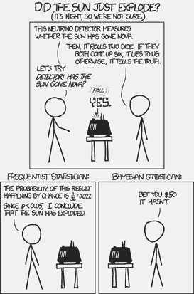

图 21-13 太阳爆炸了吗？

这里发生了什么？频率主义者知道只有两种可能性：机器掷出一对六且在说谎，或者没有掷出一对六且在讲真话。由于不掷出一对六的概率为`35/36`（`97.22%`），频率主义者得出结论，机器可能在讲真话，因此太阳可能爆炸了。¹⁵⁶

贝叶斯使用额外信息来建立她的概率模型。她同意机器不太可能掷出一对六；然而，她认为这种情况发生的概率需要与太阳未爆炸的*先验*概率进行比较。她得出结论，太阳未爆炸的可能性甚至高于`97.22%`，并决定押注“太阳明天会出来”。

### 21.7.1 条件概率

贝叶斯推理的关键思想是**条件概率**。

在我们之前讨论概率时，依赖于事件独立的假设。例如，我们假设抛硬币结果为正面或反面与之前的结果无关。这在数学上是方便的，但生活并不总是这样。在许多实际情况下，独立性是一个糟糕的假设。

考虑随机选择的美国成年人是男性且体重超过`197`磅的概率。男性的概率约为`0.5`，而体重超过`197`磅（美国的平均体重¹⁵⁷）的概率也约为`0.5`。¹⁵⁸ 如果这些事件是独立的，则选定的人同时是男性且体重超过`197`磅的概率将是`0.25`。然而，这些事件并不是独立的，因为平均美国男性的体重比平均女性重约`30`磅。因此，更好的问题是 1）选定的人是男性的概率是多少，以及 2）在选定的人是男性的情况下，该人体重超过`197`磅的概率是多少？条件概率的符号使得这一点变得容易表达。

符号`P(A|B)`表示在假设`B`为真的情况下`A`为真的概率。通常读作“在`B`的条件下`A`的概率”。因此，公式


正好表达了我们要寻找的概率。如果`P(A)`和`P(B)`是独立的，则`P(A|B) = P(A)`。在上述例子中，`B`是男性，而`*A*`是体重`> 197`。

一般而言，如果*P*(*B*) ≠ 0，


像常规概率一样，条件概率总是在`0`和`1`之间。此外，如果*Ā*表示*不 A*，则*P*(*A*|*B*) + *P*(*Ā*|*B*) = 1。人们常常错误地假设*P*(*A*|*B*)等于*P*(*B*|*A*)。没有理由期望这种情况成立。例如，*P*(*Male*|*Maltese*)的值大约为`0.5`，但*P*(*Maltese*|*Male*)约为`0.000064`。¹⁵⁹

**指尖练习：** 估计随机选择的美国人同时是男性且体重超过`197`磅的概率。假设`50%`的人口是男性，男性的体重呈正态分布，平均为`210`磅，标准差为`30`磅。（提示：考虑使用经验法则。）

公式*P*(*A*|*B*, *C*)表示在*B*和*C*均为真的条件下* A*为真的概率。假设*B*和*C*相互独立，条件概率的定义和独立概率的乘法法则表明


公式*P*(*A*, *B*, *C*)代表* A*、*B*和*C*都为真的概率。

同样，*P*(*A*, *B*|*C*)表示在*C*条件下* A 和 B*的概率。假设* A*和*B*相互独立


### 21.7.2 贝叶斯定理

假设一位四十多岁的无症状女性去做乳腺 X 光检查，并收到了坏消息：乳腺 X 光检查结果“阳性”。¹⁶⁰

患有乳腺癌的女性在乳腺 X 光检查中得到**真实阳性**结果的概率是`0.9`。没有乳腺癌的女性在乳腺 X 光检查中得到**误报**的概率是`0.07`。

我们可以使用条件概率来表达这些事实。设

```py
canc = has breast cancer
TP = true positive
FP = false positive
```

使用这些变量，我们写出条件概率

```py
P(TP | canc) = 0.9
P(FP | not Canc) = 0.07
```

考虑到这些条件概率，四十多岁女性在阳性乳腺 X 光检查后该多担心？她实际患乳腺癌的概率是多少？是`0.93`吗，因为误报率是`7%`？更多？更少？

这是一个技巧性问题：我们没有提供足够的信息让你以合理的方式回答问题。要做到这一点，你需要知道四十多岁女性患乳腺癌的**先验概率**。四十多岁女性患乳腺癌的比例是`0.008 (1000 中有 8)`。因此，她们没有乳腺癌的比例为`1 – 0.008 = 0.992`：

```py
P(canc | woman in her 40s) = 0.008
P(not canc | woman in her 40s) = 0.992
```

现在我们拥有了解决四十多岁女性该多担心的所有信息。要计算她患乳腺癌的概率，我们使用称为**贝叶斯定理**的东西¹⁶¹（通常称为贝叶斯法则或贝叶斯规则）：


在贝叶斯世界中，概率测量的是**信念的程度**。贝叶斯定理将考虑证据前后的信念程度联系起来。等号左侧的公式`P(A|B)`是**后验**概率，即在考虑`B`后对`A`的信念程度。后验概率以**先验**`P(A)`和证据`B`对`A`提供的**支持**来定义。支持是`B`在`A`成立时的概率与`B`独立于`A`的概率之比，即。

如果我们使用贝叶斯定理来估计这位女性实际患乳腺癌的概率，我们会得到（其中`canc`在我们的贝叶斯定理中扮演`A`的角色，`pos`则扮演`B`的角色）


阳性检测的概率是


所以


也就是说，约`90%`的阳性乳腺 X 光检查结果是误报。贝叶斯定理在这里帮助了我们，因为我们准确估计了四十多岁女性患乳腺癌的先验概率。

请记住，如果我们开始时使用了错误的先验，将该先验纳入我们的概率估计中，会使估计结果更糟而非更好。例如，如果我们开始时的先验是

```py
P(canc | women in her 40's) = 0.6
```

我们会得出误报率大约为`5%`，即，四十多岁女性在阳性乳腺 X 光检查中患乳腺癌的概率大约为`0.95`。

**指尖练习：** 你正在森林中漫步，看到一片看起来美味的蘑菇田。你用篮子装满了它们，准备回家烹饪并给丈夫端上。不过，在你烹饪之前，他要求你查阅一本关于当地蘑菇种类的书，检查它们是否有毒。书中说当地森林中 80%的蘑菇是有毒的。然而，你将你的蘑菇与书中的图片进行比较，决定你有 95%的把握认为这些蘑菇是安全的。你在给丈夫端上这些蘑菇时应该有多安心（假设你宁愿不成为寡妇）？

## 21.8 章节中引入的术语

+   随机试验

+   治疗组

+   对照组

+   统计显著性

+   假设检验

+   零假设

+   备择假设

+   检验统计量

+   假设拒绝

+   第一类错误

+   第二类错误

+   t 统计量

+   t 分布

+   自由度

+   p 值

+   科学方法

+   t 检验

+   研究的效能

+   双尾 p 检验

+   单尾 p 检验

+   研究的组别

+   樱桃采摘

+   邦费罗尼校正

+   家族型错误率

+   频率统计

+   贝叶斯统计

+   条件概率

+   真阳性

+   假阳性

+   先验概率

+   贝叶斯定理

+   信度

+   后验概率

+   先验

+   支持
