# 第二十四章：22

谎言、可怕的谎言和统计数据

> *“如果你无法证明你想证明的东西，就展示其他东西并假装它们是同一回事。在统计与人类思维碰撞后的迷茫中，几乎没有人会注意到差异。”**¹⁶³*

任何人都可以通过简单地编造虚假的统计数据来撒谎。用准确的统计数据讲谎话更具挑战性，但仍然不难。


统计思维是相对较新的发明。在大多数记录历史中，事物是以定性而非定量的方式评估的。人们必然对一些统计事实有直观的认识（例如，女性通常比男性矮），但他们没有数学工具可以从轶事证据得出统计结论。这种情况在十七世纪中叶开始改变，尤其是约翰·格朗特的*《自然与政治观察——关于死亡率的记录》*的出版。这部开创性的著作利用统计分析从死亡记录中估算伦敦人口，并试图提供一个可用于预测瘟疫传播的模型。

可惜，自那时以来，人们在使用统计数据时，既用于误导也用于告知。有些人故意使用统计数据进行误导；其他人则仅仅是无能。在本章中，我们讨论了一些人可能被引导到从统计数据中得出不恰当推论的方式。我们相信你会仅将这些信息用于善良的目的——成为更好的消费者和更诚实的统计信息传播者。

## 22.1 垃圾进垃圾出（GIGO）

> *“我曾两次被[国会议员]问到，‘请问，巴贝奇先生，如果你把错误的数据输入机器，能否得到正确的答案？’我无法正确理解引发这样问题的思维混乱。”——查尔斯·巴贝奇**¹⁶⁴*

这里传达的信息很简单。如果输入数据严重缺陷，任何数量的统计调整都无法产生有意义的结果。

1840 年的美国人口普查显示，自由黑人和混血者的精神病发生率大约是被奴役的黑人和混血者的十倍。结论显而易见。正如美国参议员（前副总统和未来国务卿）约翰·C·卡尔霍恩所说：“这个普查所揭示的精神病数据是无可争议的。我们的国家必须得出结论，废除奴隶制对非洲人而言将是一个诅咒。”更别提很快就清楚普查数据充满了错误。正如卡尔霍恩据说向约翰·昆西·亚当斯解释的那样：“错误太多，以至于互相抵消，导致的结论就像所有数据都正确一样。”

卡尔霍恩对亚当斯的（或许是故意的）错误反应基于一个经典错误，即**独立性假设**。如果他的数学素养更高，他可能会说：“我相信测量误差是无偏的，且相互独立，因此在均值两侧均匀分布。”事实上，后来的分析显示，误差严重偏向，以至于无法得出统计有效的结论。¹⁶⁵

垃圾进垃圾出（GIGO）在科学文献中是一个特别有害的问题——因为它难以被检测到。2020 年 5 月，世界上最负盛名的医学期刊之一（*柳叶刀*）发表了一篇关于当时肆虐的 Covid-19 大流行的论文。该论文依赖于来自六大洲近 700 家医院的 96,000 名患者的数据。在审核过程中，审稿人检查了论文中报告的分析的合理性，但没有检查分析所依据的数据的合理性。发表不到一个月后，因发现数据存在缺陷，该论文被撤回。

## 22.2 测试是不完美的

每个实验都应被视为一个潜在存在缺陷的测试。我们可以对化学物质、现象、疾病等进行测试。然而，我们测试的事件不一定与测试结果相同。教授们设计考试的目的是为了了解学生对某些学科内容的掌握情况，但考试结果不应与学生实际理解的程度混淆。每个测试都有固有的错误率。想象一下，一个学习第二语言的学生被要求学习`100`个单词的含义，但他只学习了 80 个单词的含义。他的理解率是`80%`，但他在一个包含`20`个单词的测试中得分 80%的概率当然不是`1`。

测试可能同时存在假阴性和假阳性。如我们在第 21.7 节中看到的，阴性的乳腺 X 光检查并不能保证没有乳腺癌，而阳性的乳腺 X 光检查也不能保证其存在。此外，测试概率和事件概率并不是同一回事。当测试稀有事件（例如，稀有疾病的存在）时，这一点尤其相关。如果假阴性的代价很高（例如，错过了一个严重但可治愈的疾病），则测试应设计得具有高敏感性，即使因此导致许多假阳性。

## 22.3 图片可能具有误导性

毫无疑问，图形在快速传达信息方面是非常有用的。然而，当使用不当（或恶意使用）时，图表可能会产生极具误导性的效果。例如，考虑图 22-1 中描绘的美国中西部州的房价图表。

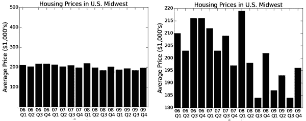

图 22-1 美国中西部的房价

从图 22-1 左侧的图表来看，似乎在 2006-2009 年间房价相对稳定。但等一下！在 2008 年底，美国住宅房地产崩溃并引发全球金融危机不是吗？确实如此，正如右侧图表所示。

这两个图表展示了完全相同的数据，但传达了截然不同的印象。左侧的图表旨在给人房价稳定的印象。在 y 轴上，设计者使用了一个范围极低的房屋平均价格为`$1,000`到一个极高的平均价格`$500,000`。这最小化了房价变动区域所占空间，给人变化相对较小的印象。右侧的图表则旨在展示房价的剧烈波动，随后崩溃。设计者使用了一个狭窄的价格范围，从而夸大了变化的幅度。

图 22-2 中的代码生成了我们之前查看的两个图表，以及一个旨在准确反映房价变动的图表。它使用了我们尚未见过的两种绘图工具。

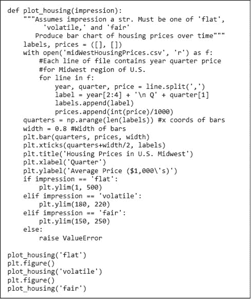

图 22-2 绘制房价

调用`plt.bar(quarters, prices, width)`会生成一个**条形图**，条形宽度为给定值。条形的左边缘对应列表`quarters`的元素值，而条形的高度对应列表`prices`的相应元素值。函数调用`plt.xticks(quarters+width/2, labels)`描述了与条形相关的标签。第一个参数指定每个标签的放置位置，第二个参数则是标签的文本。函数`yticks`的行为类似。调用`plot_housing('fair')`会生成图 22-3 中的图表。

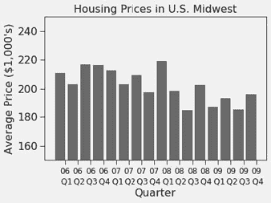

图 22-3 房价的不同视角

**手指练习**：相对基线绘制图形有时会启发思考，如图 22-4 所示。修改`plot_housing`以生成这样的图表。基线以下的条形应为红色。提示：使用`plt.bar`的`bottom`关键字参数。

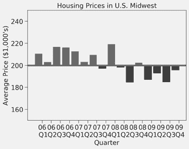

图 22-4 相对于$200,000 的房价

对数 y 轴为制作具有误导性的图表提供了一个绝佳的工具。考虑图 22-5 中的条形图。左侧的图表更准确地展示了跟随 khemric 和 katyperry 的人数差异。右侧图表中跟随人数稀少的 jguttag 使 y 轴不得不将更大比例的长度分配给较小的值，从而留下更少的距离来区分 khemric 和 katyperry 的粉丝数量。¹⁶⁶

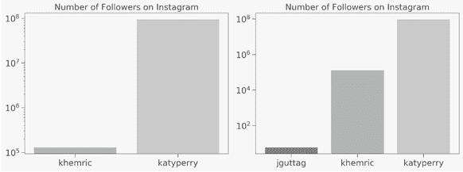

图 22-5 比较 Instagram 粉丝数量

## 22.4 因果关系与相关关系¹⁶⁷

研究表明，定期上课的大学生平均成绩高于偶尔上课的学生。我们这些教授这些课程的人希望相信，这是因为学生从我们教授的课程中学到了东西。当然，学生们能取得更好成绩也可能同样因为那些更有可能上课的学生也更有可能努力学习。

**相关性**是衡量两个变量朝同一方向移动程度的指标。如果`x`与`y`朝同一方向移动，变量是正相关的；如果朝相反方向移动，则是负相关的。如果没有关系，则相关性为`0`。人们的身高与父母的身高正相关。吸烟与寿命之间的相关性是负的。

当两件事相关时，人们容易假设其中一件事导致了另一件事。考虑北美的流感发生率。病例数呈可预测的模式上下波动。夏季几乎没有病例；病例数在初秋开始上升，接着在夏季来临时开始下降。现在考虑上学的儿童人数。夏季上学的儿童非常少；入学人数在初秋开始上升，然后在夏季来临时下降。

学校开学与流感发生率之间的关联是无可争辩的。这使得一些人得出结论，上学是流感传播的重要因果因素。这可能是对的，但我们不能仅基于相关性得出这一结论。相关性并不意味着因果关系！毕竟，相关性同样可以用来证明流感爆发导致学校开学的信念。或者，也许在任何一个方向上都没有因果关系，而是我们尚未考虑的某个**潜在变量**导致了两者的发生。实际上，流感病毒在凉爽干燥的空气中存活的时间明显长于温暖潮湿的空气，在北美，流感季节与学校开学时间都与较凉爽和干燥的天气相关。

只要有足够的回溯数据，总是可以找到两个相关的变量，正如图 22-6 中的图表所示。¹⁶⁸


图 22-6 墨西哥柠檬能救命吗？

当发现这样的相关性时，首先要问的是是否有一个合理的理论来解释这种相关性。

陷入*cum hoc ergo propter hoc*谬论可能是相当危险的。2002 年初，大约有六百万美国女性在被开处方激素替代疗法（HRT），她们相信这将大大降低她们的心血管疾病风险。这一信念得到了几项高度可信的已发表研究的支持，这些研究表明，使用 HRT 的女性心血管死亡的发生率降低。

当《美国医学协会杂志》发表一篇文章声称激素替代疗法（HRT）实际上增加了心血管疾病的风险时，许多女性及其医生感到十分惊讶。¹⁶⁹ 这怎么可能发生？

对一些早期研究的重新分析表明，进行 HRT 的女性往往来自饮食和锻炼习惯优于平均水平的群体。或许进行 HRT 的女性在健康意识上普遍高于研究中的其他女性，因此 HRT 和心脏健康改善是共同原因的巧合效应。

**指尖练习**：在过去的 100 年里，加拿大每年的死亡人数与每年肉类消费量呈正相关。有什么潜在变量可以解释这一点？

## 22.5 统计指标并不能全面反映事实

从数据集中可以提取出大量不同的统计数据。通过仔细选择这些数据，可以传达关于同一数据的不同印象。一个好的解毒剂是查看数据集本身。

1973 年，统计学家 F.J.安斯科姆发表了一篇论文，表格见图 22-7，通常称为安斯科姆四重奏。它包含了来自四个数据集的点的`<x, y>`坐标。这四个数据集的`x`（`9.0`）和`y`（`7.5`）的均值相同，`x`（`10.0`）和`y`（`3.75`）的方差相同，以及`x`与`y`之间的相关性（`0.816`）相同。如果我们使用线性回归为每个数据集拟合一条线，结果都是`y = 0.5x + 3`。

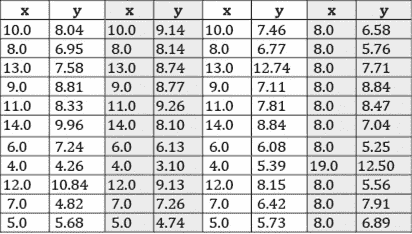

图 22-7 安斯科姆四重奏的统计数据

这是否意味着没有明显的方法可以区分这些数据集？不。我们只需绘制数据，就会发现这些数据集并不相同（图 22-8）。

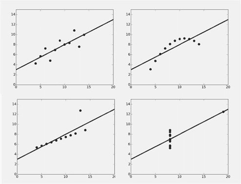

图 22-8 安斯科姆四重奏的数据

道理很简单：如果可能的话，始终查看一些原始数据的代表。

## 22.6 抽样偏差

在第二次世界大战期间，每当一架盟军飞机从欧洲的任务中返回时，都会检查飞机，看高射炮弹是在哪些地方击中的。根据这些数据，机械师会加强那些看起来最有可能被击中的飞机部位。

这有什么问题呢？他们没有检查那些未能从任务中返回的飞机，因为它们是被高射炮击落的。也许这些未检查的飞机正是因为在高射炮造成最大伤害的地方受到了攻击而未能返回。这种特定的错误被称为**非响应偏差**。在调查中相当常见。例如，在许多大学，学生会在学期末的一次讲座中被要求填写一份表格，评价教授讲座的质量。尽管这些调查的结果常常不尽如人意，但情况可能更糟。那些认为讲座糟糕到不值得参加的学生并没有被纳入调查中。¹⁷⁰

如第十九章所讨论，所有统计技术都是基于这样一个假设：通过抽样某一人群的子集，我们可以推断出整个群体的情况。如果使用随机抽样，我们可以对样本与整个群体之间的期望关系做出精确的数学陈述。不幸的是，许多研究，特别是在社会科学领域，是基于所谓的**便利**（或**偶然**）**抽样**。这涉及到根据样本获取的便利性选择样本。为什么那么多心理学研究使用本科生作为研究对象？因为他们在大学校园中容易找到。便利样本*可能*是具有代表性的，但我们无法确定它实际上*是否*具有代表性。

**手指练习**：一种疾病的**感染致死率**是感染该疾病的人数与因该疾病死亡的人数之比。疾病的**病例致死率**是被诊断为该疾病的人数与因该疾病死亡的人数之比。哪一种更容易准确估计，为什么？

## 22.7 上下文很重要

在阅读数据时，尤其是将数据放在上下文之外时，很容易对数据的含义解读得过于深刻。2009 年 4 月 29 日，CNN 报道说：“墨西哥卫生官员怀疑，猪流感疫情已导致超过`159`人死亡和大约`2,500`人感染。”听起来相当可怕——直到我们将其与每年在美国季节性流感中约`36,000`的死亡人数进行比较。

一个常被引用且准确的统计数据是大多数汽车事故发生在离家`10`英里以内。那么这又意味着什么呢？大多数驾驶都是在离家`10`英里以内完成的！此外，在这个上下文中，“家”意味着什么？该统计数据是以注册汽车的地址作为“家”来计算的。你是否可以通过将汽车注册在某个遥远的地方来降低发生事故的概率？

反对美国政府减少枪支普及率的倡议者喜欢引用这样的统计数据：大约`99.8%`的美国枪支在任何给定年份都不会用于暴力犯罪。但没有一些背景，很难知道这意味着什么。这是否意味着美国的枪支暴力并不严重？全国步枪协会报告称，美国大约有`3`亿支私人拥有的枪支——`0.2%`的`3`亿是`600,000`！

## 22.8 比较苹果与橙子

快速查看图 22-9 中的图像。

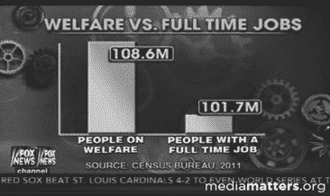

图 22-9 福利与全职工作

这给你留下了什么印象？领取福利的美国人是否比工作的人要多得多？

左边的柱子比右边的柱子高约 500%。然而，柱子上的数字告诉我们 y 轴已经被截断。如果没有被截断，左边的柱子只会高出 6.8%。不过，想到领取福利的人比工作的人多 6.8%还是让人震惊的，震惊且误导。

“领取福利的人数”来源于美国人口普查局对参与条件性援助项目人数的统计。这项统计包括任何居住在至少一人领取福利的家庭中。例如，考虑一个由两个父母和三个孩子组成的家庭，其中一个父母有全职工作，另一个有兼职工作。如果该家庭领取了食品券，则该家庭将为“领取福利的人数”统计增加五人，为全职工作统计增加一人。

这两个数字都是“正确”的，但它们不可比较。这就像是得出结论，奥尔加比马克更会种田，因为她每英亩种植 20 吨土豆，而马克每英亩只种 3 吨蓝莓。

## 22.9 摘樱桃

既然我们谈到了水果，摘樱桃和比较苹果与橙子一样糟糕。**选择性取材**涉及选择特定的数据，而忽略其他数据，以支持某种立场。

请考虑图 22-10 中的图表。趋势很明显，但如果我们希望用这些数据来争辩地球没有变暖，我们可以引用 2013 年 4 月冰量比 1988 年 4 月更多这一事实，而忽略其他数据。

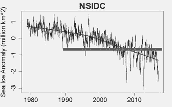

图 22-10 北极海冰

## 22.10 小心推断

从数据中推断是非常容易的。我们在第 20.1.1 节中就这样做了，当时我们将从线性回归中得出的拟合延伸到了回归中使用的数据之外。只有在有合理的理论依据时，才应进行外推。尤其要警惕直线外推。

考虑一下图 22-11 左侧的图表。它显示了 1994 年至 2000 年间美国互联网使用的增长。正如你所看到的，直线提供了相当不错的拟合。

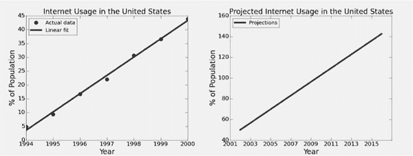

图 22-11 美国互联网使用的增长。

图 22-11 右侧的图表利用这一拟合预测了未来几年使用互联网的美国人口百分比。这个预测让人难以相信。似乎到 2009 年，美国的每个人都在使用互联网是非常不太可能的，而到 2015 年，美国使用互联网的人口超过`140%`更是不可能。

## 22.11 德克萨斯神枪手谬论。

想象一下，你在德克萨斯的乡村公路上行驶。你看到一座有六个靶子画在上面的谷仓，每个靶子的正中心都有一个子弹孔。“是的，先生，”谷仓的主人说，“我从不失手。” “没错，”他的配偶说，“没有一个德克萨斯州的人比他用刷子更准确。”明白了吗？他开了六枪，然后在他们周围画了靶子。

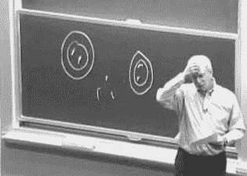

图 22-12 教授困惑于学生们扔粉笔的准确性。

这一类型的经典案例出现在 2001 年。¹⁷¹它报告了一项研究团队在阿伯丁的皇家康希尔医院发现，“厌食症女性最有可能是在春季或初夏出生……在三月到六月之间，出生的厌食症患者比平均多了`13%`，而六月份出生的则多了`30%`。”

让我们看看那些在六月份出生的女性的令人担忧的统计数据。该团队研究了`446`名被诊断为厌食症的女性，因此每月的平均出生人数略多于`37`。这表明六月出生的人数为`48 (37`*`1.3)`。让我们写一个短程序(图 22-13)来估计这纯属偶然发生的概率。

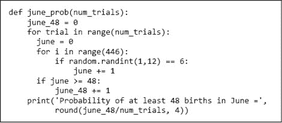

图 22-13 在六月出生 48 名厌食症患者的概率。

当我们运行`june_prob(10000)`时，它打印了。

```py
`Probability of at least 48 births in June = 0.0427`
```

看起来在六月份出生至少有`48`个婴儿的概率大约是`4.25%`。所以也许阿伯丁的那些研究者发现了一些东西。嗯，如果他们从假设更多将成为厌食症患者的婴儿在六月份出生开始，然后进行一项旨在检验该假设的研究，那他们可能确实发现了一些东西。

但他们并没有这样做。相反，他们查看了数据，然后模仿德克萨斯神枪手，在六月周围画了一个圈。正确的统计问题是，在`12`个月中，至少有`48`名婴儿出生的概率是什么。图 22-14 中的程序回答了这个问题。

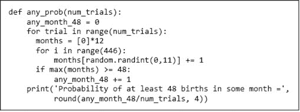

图 22-14 48 名厌食症患者出生于某个月的概率

调用`any_prob(10000)`打印

```py
`Probability of at least 48 births in some month = 0.4357` 
```

看起来，研究中报告的结果并非如此不太可能，这些结果反映了一个偶然事件，而不是出生月份与厌食症之间的真实关联。人们不必来自德克萨斯州就能成为德克萨斯神枪手谬论的受害者。

结果的统计显著性取决于实验的进行方式。如果阿伯丁团队最初假设在六月出生的厌食症患者更多，那么他们的结果是值得考虑的。但如果他们假设存在一个异常比例的厌食症患者出生的月份，那么他们的结果就不是很有说服力。实际上，他们是在测试多个假设并选择性地挑选结果。他们可能应该应用 Bonferroni 校正（见第 21.6 节）。

阿伯丁团队可能采取了什么后续步骤来验证他们新发现的假设？一种可能性是进行**前瞻性研究**。在前瞻性研究中，研究者从一组假设开始，在研究对象发展出感兴趣的结果（在本例中为厌食症）之前招募对象，然后在一段时间内跟踪这些对象。如果该小组进行了具有特定假设的前瞻性研究，并得到了类似的结果，我们可能会信服。

前瞻性研究可能既昂贵又耗时。在**回顾性研究**中，必须以减少获取误导性结果的方式分析现有数据。一种常见的技术，如第 20.4 节所述，是将数据分成训练集和保留测试集。例如，他们可以随机选择`446/2`名女性作为训练集，并统计每个月的出生人数。然后，他们可以将这与剩余女性（保留集）每个月的出生人数进行比较。

## 22.12 百分比可能会引起混淆

一位投资顾问打电话给客户，报告他的股票投资组合在上个月上涨了`16%`。顾问承认，过去一年中有一些起伏，但很高兴地报告平均每月变动为`+0.5%`。想象一下，当客户收到一年的报表并注意到他的投资组合价值在一年内下降时的惊讶。

他打电话给他的顾问，并指责他是个骗子。“在我看来，”他说，“我的投资组合下降了大约`8%`，而你告诉我它上涨了`0.5%`每月。” “我没有，”财务顾问回答。“我告诉你平均每月变化是`+0.5%`。”当他检查每月的账单时，投资者意识到他并没有被欺骗，只是被误导了。他的投资组合在上半年每个月下降了`15%`，然后在下半年每个月上涨了`16%`。

在考虑百分比时，我们始终需要关注计算百分比的基数。在这种情况下，`15%`的下降是基于一个比`16%`的上升更高的平均基础。

当应用于小基数时，百分比可能特别具有误导性。你可能会看到关于某种药物的报道，称其副作用使某种疾病的发生率增加了`200%`。但如果该疾病的基线发生率非常低，比如`1,000,000`中有一个，你可能会认为服用该药物的风险被其积极效果所抵消。

**手指练习**：2020 年 5 月 19 日，*纽约时报*报道称美国航空旅行在一个月内增加了 123%（从 95,161 名乘客增至 212,508 名乘客）。它还报道了这一增长是在最近一次航空旅行下降 96%之后发生的。那么总的净百分比变化是多少？

## 22.13 回归谬误

**回归谬误**发生在当人们未能考虑事件的自然波动时。

所有运动员都有好日子和坏日子。当他们有好日子时，他们会尽量不做任何改变。然而，当他们经历一系列异常糟糕的日子时，他们通常会尝试进行改变。即使这些改变实际上并没有帮助，均值回归（第 17.3 节）使得在接下来的几天里，运动员的表现可能会比之前异常糟糕的表现更好。这可能会误导运动员，以为有**治疗效果**，即将改善的表现归因于他或她所做的改变。

诺贝尔奖得主心理学家丹尼尔·卡尼曼讲述了一个故事，关于一位以色列空军飞行教官拒绝了卡尼曼的主张，即“对改善表现的奖励比对错误的惩罚更有效。”教官的论点是：“我曾多次表扬飞行学员清晰执行某些特技动作。下次他们尝试相同动作时，通常会表现得更糟。另一方面，我常常对学员的错误执行大声训斥，通常他下次会表现得更好。” ¹⁷² 人类自然会想象治疗效果，因为我们喜欢因果推理。但有时这仅仅是运气问题。

想象一个不存在的治疗效果可能是危险的。这可能导致人们相信疫苗有害，蛇油能治愈所有疼痛，或仅投资于“去年超过市场”的基金是一个好策略。

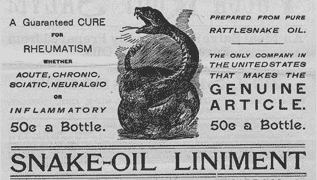

## 22.14 统计显著差异可能是微不足道的

在毛伊岛科技学院（MIT），一位招生官希望向世界证明 MIT 的招生过程是“性别盲”的，宣称：“在 MIT，男性和女性的平均成绩没有显著差异。”同一天，一位热情的女性沙文主义者宣称“在 MIT，女性的平均成绩显著高于男性。”一位困惑的学生报社记者决定调查数据以揭露这个说谎者。但当她最终设法从大学获得数据时，她得出结论：两者都在说真话。

句子“在麻省理工学院，女性的平均成绩显著高于男性”实际上意味着什么？没有学习过统计学的人（大多数人群）可能会得出女性和男性的 GPA 之间存在“有意义”的差异。相比之下，最近学习过统计的人可能只会得出 1）女性的平均 GPA 高于男性的平均 GPA，2）可以在`5%`水平上拒绝因随机性导致的 GPA 差异的零假设。

假设，例如，有`2,500`名女性和`2,500`名男性在麻省理工学院学习。进一步假设男性的平均 GPA 为`3.5`，女性的平均 GPA 为`3.51`，男性和女性的 GPA 标准差均为`0.25`。大多数理智的人会认为 GPA 的差异“微不足道”。然而，从统计学的角度看，这一差异在接近`2%`水平上是“显著的”。这种奇怪二分法的根源是什么？正如我们在第 21.5 节中所示，当研究具有足够的效能——即足够的样本时，即使微不足道的差异也可以统计显著。

当研究规模非常小的时候，相关问题就会出现。假设你投了两次硬币，结果都是正面。现在，让我们使用在第 21.3 节中看到的双尾单样本 t 检验来检验硬币是公正的零假设。如果我们假设正面的值为`1`，反面的值为`0`，我们可以使用代码得到 p 值。

```py
`scipy.stats.ttest_1samp([1, 1], 0.5)[1]`
```

它返回一个 p 值为`0`，这表明如果硬币是公正的，那么得到两个连续正面的概率为零。如果我们采用贝叶斯方法，从硬币是公正的先验出发，我们会得到不同的答案。

## 22.15 只需小心

填充几百页统计滥用的历史会很简单，也很有趣。但现在你可能已经明白：用数字撒谎和用文字撒谎一样简单。在你得出结论之前，确保你了解实际测量的内容以及那些“统计显著”结果是如何计算的。正如诺贝尔经济学奖获得者罗纳德·科斯所说：“如果你足够折磨数据，它会承认任何事情。”

## 22.16 本章引入的术语

+   垃圾进垃圾出（GIGO）

+   独立性假设

+   条形图

+   相关性

+   因果关系

+   潜在变量

+   非应答偏差

+   便利性（偶然）抽样

+   感染致死率

+   病例致死率

+   精挑细选

+   前瞻性研究

+   回顾性研究

+   回归谬误

+   治疗效果
