# 第二十七章：25

聚类

无监督学习涉及在无标签数据中寻找隐藏结构。最常用的无监督机器学习技术是聚类。

聚类可以定义为将对象组织成某种方式相似的组的过程。一个关键问题是定义“相似”的含义。考虑图 25-1 中的图示，显示了 13 个人的身高、体重和衬衫颜色。

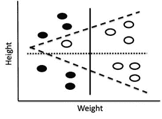

图 25-1 身高、体重和衬衫颜色

如果我们按身高对人进行聚类，会出现两个明显的簇——由虚线水平线划分。如果我们按体重对人进行聚类，会出现两个不同的明显簇——由实线垂直线划分。如果我们根据他们的衬衫进行聚类，还有第三种聚类——由倾斜的虚线划分。顺便提一下，最后这种划分不是线性的，因为我们无法用一条直线根据衬衫颜色将人们分开。

聚类是一个优化问题。目标是找到一组簇，以优化目标函数，同时遵循一组约束条件。给定一个可以用来决定两个示例之间接近程度的距离度量，我们需要定义一个目标函数，以最小化簇内示例之间的不相似度。

我们称之为变异性（在文献中通常称为惯性）的一个度量，表示单个簇内的示例*c*之间的差异性是


其中*mean*(*c*)是簇内所有示例特征向量的均值。一个向量集的均值是逐组件计算的。对应元素相加，然后结果除以向量的数量。如果`v1`和`v2`是数字的`arrays`，表达式`(v1+v2)/2`的值是它们的**欧几里得均值**。

我们所称的变异性类似于第十七章中提出的方差的概念。不同之处在于，变异性没有通过簇的大小进行归一化，因此根据该度量，具有更多点的簇看起来可能不那么凝聚。如果我们想比较两个不同大小簇的凝聚性，就需要将每个簇的变异性除以簇的大小。

单个簇*c*内的变异性的定义可以扩展为一组簇*C*的不相似度度量：


请注意，由于我们不将变异性除以簇的大小，因此一个大的不凝聚簇会比一个小的不凝聚簇更大地增加*dissimilarity(C)*的值。这是有意设计的。

那么，优化问题是否是找到一组簇 *C*，使得 *dissimilarity(C)* 被最小化？不完全是。通过将每个示例放在其自己的簇中，可以很容易地将其最小化。我们需要添加一些约束。例如，我们可以对簇之间的最小距离施加约束，或者要求最大簇数为某个常数 *k*。

一般来说，解决这个优化问题在大多数有趣的问题上都是计算上不可行的。因此，人们依赖于提供近似解的贪心算法。在第 25.2 节中，我们介绍一种这样的算法，即 k 均值聚类。但首先我们将介绍一些实现该算法（以及其他聚类算法）时有用的抽象。

## 25.1 类 Cluster

类 `Example` (图 25-2) 将用于构建要聚类的样本。与每个示例相关联的是一个名称、一个特征向量和一个可选标签。`distance` 方法返回两个示例之间的欧几里得距离。

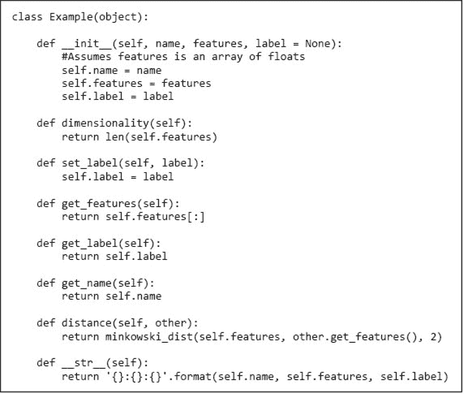

图 25-2 类 `Example`

类 `Cluster` (图 25-3) 稍微复杂一些。一个簇是一组示例。`Cluster` 中两个有趣的方法是 `compute_centroid` 和 `variability`。将簇的 **质心** 视为其质心。方法 `compute_centroid` 返回一个示例，其特征向量等于簇中示例特征向量的欧几里得均值。方法 `variability` 提供了簇的连贯性度量。

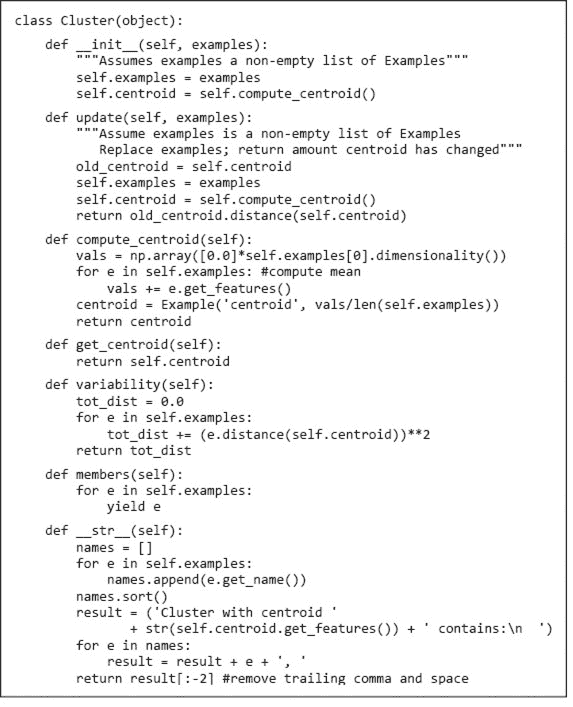

图 25-3 类 `Cluster`

**动手练习**：一个簇的质心是否总是该簇中的一个示例？

## 25.2 K 均值聚类

**K 均值聚类**可能是最广泛使用的聚类方法。¹⁹¹ 它的目标是将一组示例划分为 `k` 个簇，使得

+   每个示例位于其质心最近的簇中。

+   簇集的相异性被最小化。

不幸的是，在大数据集上找到该问题的最优解在计算上是不可行的。幸运的是，有一种高效的贪心算法¹⁹² 可用于找到有用的近似解。它由伪代码描述。

```py
randomly choose k examples as initial centroids of clusters
while true:
1\. Create k clusters by assigning each example to closest centroid
2\. Compute k new centroids by averaging the examples in each cluster
3\. If none of the centroids differ from the previous iteration:
           return the current set of clusters
```

步骤 1 的复杂度为 *θ*`(k*n*d)`，其中 `k` 是聚类的数量，`n` 是样本的数量，`d` 是计算一对样本之间距离所需的时间。步骤 2 的复杂度为 *θ*`(n)`，步骤 3 的复杂度为 *θ*`(k)`。因此，单次迭代的复杂度为 *θ*`(k*n*d)`。如果使用闵可夫斯基距离比较样本，`d` 与特征向量的长度呈线性关系。¹⁹³ 当然，整个算法的复杂度取决于迭代的次数。这一点不容易表征，但可以说通常是较小的。

图 25-4 包含描述 k-means 的伪代码的 Python 翻译。唯一的特殊之处在于，如果任何迭代创建了一个没有成员的聚类，则会抛出异常。生成空聚类是很少见的。它不会出现在第一次迭代中，但可能在后续迭代中出现。这通常是由于选择的 `k` 过大或初始质心选择不幸。将空聚类视为错误是 MATLAB 使用的选项之一。另一个选项是创建一个只包含一个点的新聚类——该点是其他聚类中距离质心最远的点。我们选择将其视为错误，以简化实现。

k-means 算法的一个问题是返回的值依赖于初始随机选择的质心。如果选择了一组特别不幸的初始质心，算法可能会陷入一个远离全局最优解的局部最优解。在实践中，通常通过多次运行 k-means 来解决这个问题，初始质心随机选择。然后，我们选择具有最小聚类相异度的解决方案。

图 25-5 包含一个函数 `try_k_means`，它多次调用 `k_means` `(`图 25-4`)` 并选择相异度最低的结果。如果试验失败，因为 `k_means` 生成了一个空聚类并因此抛出了异常，`try_k_means` 仅仅是重新尝试——假设最终 `k_means` 会选择一个成功收敛的初始质心集合。

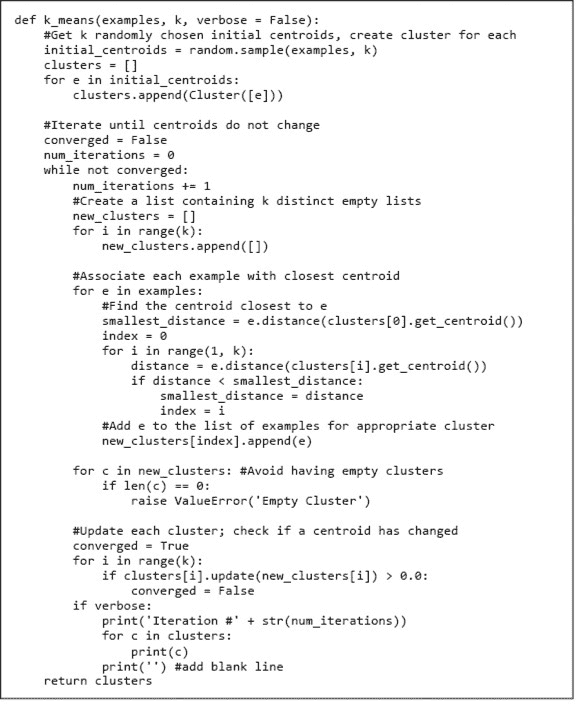

图 25-4 K-means 聚类

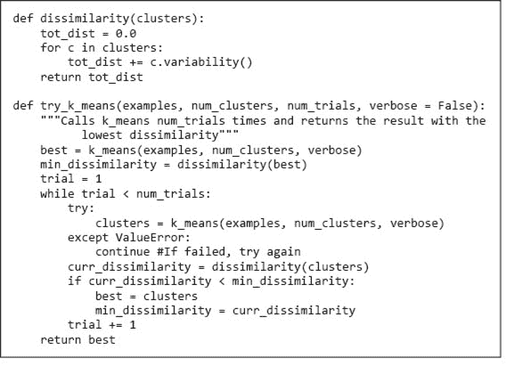

图 25-5 寻找最佳的 k-means 聚类

## 25.3 一个人为的例子

图 25-6 包含生成、绘制和聚类来自两个分布的样本的代码。

函数 `gen_distributions` 生成一个包含 `n` 个样本的列表，这些样本具有二维特征向量。这些特征向量元素的值来自正态分布。

函数`plot_samples`绘制一组示例的特征向量。它使用`plt.annotate`在绘图中的点旁边放置文本。第一个参数是文本，第二个参数是与文本相关联的点，第三个参数是文本相对于与其相关联的点的位置。

函数`contrived_test`使用`gen_distributions`创建两个包含 10 个示例的分布（每个分布具有相同的标准差但不同的均值），使用`plot_samples`绘制示例，然后使用`try_k_means`对其进行聚类。

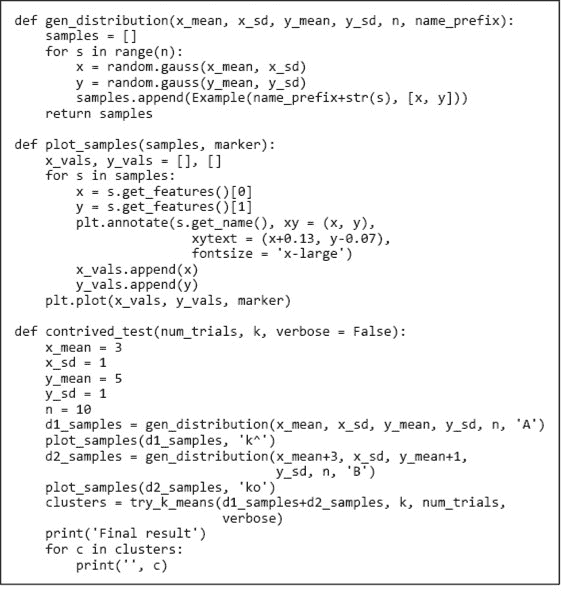

图 25-6 k 均值的测试

调用`contrived_test(1, 2, True)`生成了图 25-7 中的绘图，并打印了图 25-8 中的线条。注意，初始（随机选择的）质心导致了高度偏斜的聚类，其中一个聚类包含了除一个点以外的所有点。然而，到第四次迭代时，质心移动到使得两个分布的点合理分开为两个聚类的位置。唯一的“错误”发生在`A0`和`A8`上。

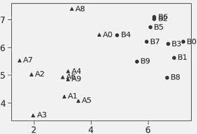

图 25-7 来自两个分布的示例

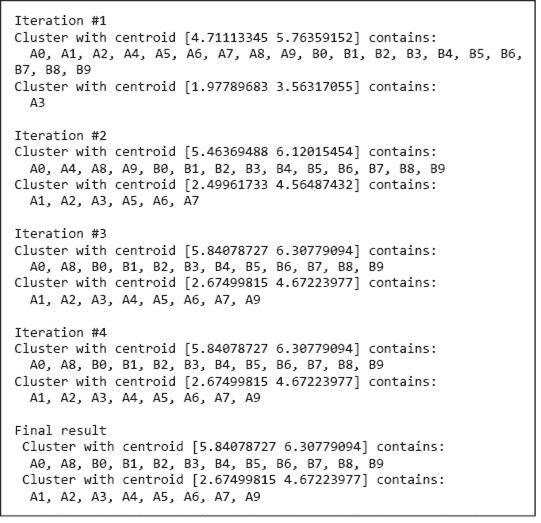

图 25-8 调用`contrived_test(1, 2, True)`打印的线条

当我们尝试`50`次实验而不是`1`次时，通过调用`contrived_test(50, 2, False)`，它打印了

```py
Final result
 Cluster with centroid [2.74674403 4.97411447] contains:
  A1, A2, A3, A4, A5, A6, A7, A8, A9
 Cluster with centroid [6.0698851  6.20948902] contains:
  A0, B0, B1, B2, B3, B4, B5, B6, B7, B8, B9
```

`A0`仍然与`B`混在一起，但`A8`则没有。如果我们尝试`1000`次实验，结果也一样。这可能会让你感到惊讶，因为图 25-7 显示，如果`A0`和`B0`被选为初始质心（这在`1000`次实验中可能发生），第一次迭代将产生完美分离`A`和`B`的聚类。然而，在第二次迭代中将计算新的质心，`A0`将被分配到与`B`的一个聚类中。这不好吗？请记住，聚类是一种无监督学习形式，它在未标记数据中寻找结构。将`A0`与`B`分组并不不合理。

使用 k 均值聚类的一个关键问题是选择`k`。图 25-9 中的函数`contrived_test_2`生成、绘制并聚类来自三个重叠高斯分布的点。我们将使用它来查看在不同`k`值下对该数据的聚类结果。数据点在图 25-10 中显示。

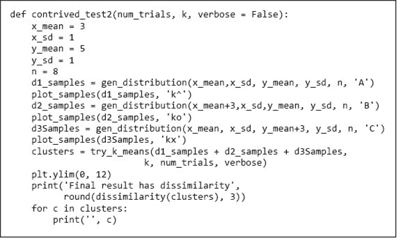

图 25-9 从三个分布生成点

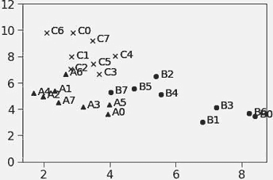

图 25-10 来自三个重叠高斯的点

调用`contrived_test2(40, 2)`打印

```py
Final result has dissimilarity 90.128
 Cluster with centroid [5.5884966  4.43260236] contains:
  A0, A3, A5, B0, B1, B2, B3, B4, B5, B6, B7
 Cluster with centroid [2.80949911 7.11735738] contains:
  A1, A2, A4, A6, A7, C0, C1, C2, C3, C4, C5, C6, C7
```

调用`contrived_test2(40, 3)`打印

```py
Final result has dissimilarity 42.757
 Cluster with centroid [7.66239972 3.55222681] contains:
  B0, B1, B3, B6
 Cluster with centroid [3.56907939 4.95707576] contains:
  A0, A1, A2, A3, A4, A5, A7, B2, B4, B5, B7
 Cluster with centroid [3.12083099 8.06083681] contains:
  A6, C0, C1, C2, C3, C4, C5, C6, C7
```

调用`contrived_test2(40, 6)`打印

```py
Final result has dissimilarity 11.441
 Cluster with centroid [2.10900238 4.99452866] contains:
  A1, A2, A4, A7
 Cluster with centroid [4.92742554 5.60609442] contains:
  B2, B4, B5, B7
 Cluster with centroid [2.80974427 9.60386549] contains:
  C0, C6, C7
 Cluster with centroid [3.27637435 7.28932247] contains:
  A6, C1, C2, C3, C4, C5
 Cluster with centroid [3.70472053 4.04178035] contains:
  A0, A3, A5
 Cluster with centroid [7.66239972 3.55222681] contains:
  B0, B1, B3, B6
```

最后的聚类是最紧密的拟合，即聚类的不相似度最低（`11.441`）。这是否意味着这是“最佳”聚类？不一定。回想一下我们在 20.1.1 节中观察到的线性回归，通过增加多项式的次数，我们得到了一个更复杂的模型，从而更紧密地拟合了数据。我们还观察到，当我们增加多项式的次数时，我们有可能找到一个预测值较差的模型——因为它过拟合了数据。

选择合适的`k`值与为线性回归选择合适的多项式次数完全类似。通过增加`k`，我们可以减少不相似度，但有过拟合的风险。（当`k`等于待聚类样本数量时，不相似度为 0！）如果我们知道待聚类样本的生成方式，例如从`m`个分布中选择，我们可以利用这些信息来选择`k`。在缺乏此类信息的情况下，有多种启发式方法可以选择`k`。深入讨论这些超出了本书的范围。

## 25.4 一个不那么复杂的例子

不同物种的哺乳动物有不同的饮食习惯。一些物种（例如，大象和海狸）只吃植物，其他物种（例如，狮子和老虎）只吃肉，还有一些物种（例如，猪和人类）则吃任何能放进嘴里的东西。素食物种称为草食动物，肉食动物称为肉食动物，而那些既吃植物又吃动物的物种称为杂食动物。

在千百年的演化过程中（或者，如果你愿意，可以认为是某种神秘的过程），物种的牙齿被赋予了适合其偏好食物的形态。¹⁹⁴ 这引出了一个问题，即基于哺乳动物的牙齿结构进行聚类是否会产生与其饮食相关的聚类。

图 25-11 显示了一个文件的内容，列出了某些哺乳动物的物种、其牙齿公式（前`8`个数字）以及其平均成年体重（磅）。¹⁹⁵ 文件顶部的注释描述了与每种哺乳动物相关的项目，例如，名称后第一个项目是顶端门牙的数量。

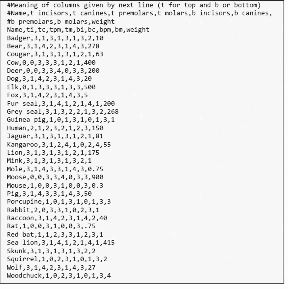

图 25-11 哺乳动物的牙齿结构在`dentalFormulas.csv`中

图 25-12 包含三个函数。`read_mammal_data`函数首先读取一个 CSV 文件，格式如图 25-11 所示，以创建一个数据框。关键字参数`comment`用于指示`read_csv`忽略以`#`开头的行。如果参数`scale_method`不等于`None`，则使用`scale_method`缩放数据框中的每一列。最后，它创建并返回一个将物种名称映射到特征向量的字典。`build_mammal_examples`函数使用`read_mammal_data`返回的字典生成并返回一组示例。`test_teeth`函数生成并打印聚类。

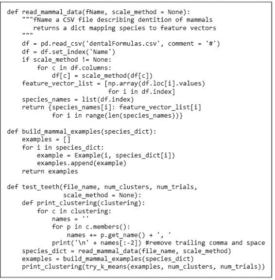

图 25-12 读取和处理 CSV 文件

调用`test_teeth('dentalFormulas.csv', 3, 40)`打印

```py
Bear, Cow, Deer, Elk, Fur seal, Grey seal, Lion, Sea lion

Badger, Cougar, Dog, Fox, Guinea pig, Human, Jaguar, Kangaroo, Mink, Mole, Mouse, Pig, Porcupine, Rabbit, Raccoon, Rat, Red bat, Skunk, Squirrel, Wolf, Woodchuck

Moose
```

粗略检查表明，我们的聚类完全被动物的体重主导。问题在于，体重的范围远大于其他任何特征的范围。因此，当计算样本之间的欧几里得距离时，唯一真正重要的特征是体重。

我们在第 24.2 节遇到过类似的问题，当时发现动物之间的距离主要由腿的数量主导。我们通过将腿的数量转换为二元特征（有腿或无腿）来解决了那个问题。那对于该数据集是可行的，因为所有动物的腿数恰好是零或四条。然而，在这里，毫无疑问地将体重转换为单一二元特征而不损失大量信息是不现实的。

这是一个常见的问题，通常通过对特征进行缩放来解决，使每个特征的均值为`0`，标准差为`1`，¹⁹⁶，就像在图 25-13 中`z_scale`函数所做的那样。很容易看出，语句`result = result - mean`确保返回数组的均值总是接近`0`。¹⁹⁷ 标准差总是为`1`并不明显，可以通过一系列繁琐的代数变换证明，但我们不想让你感到乏味。这种缩放通常被称为**z-缩放**，因为标准正态分布有时被称为 Z 分布。

另一种常见的缩放方法是将最小特征值映射到`0`，将最大特征值映射到`1`，并在其间使用**线性缩放**，就像在图 25-13 中`linear_scale`函数所做的那样。这通常被称为**最小-最大缩放**。

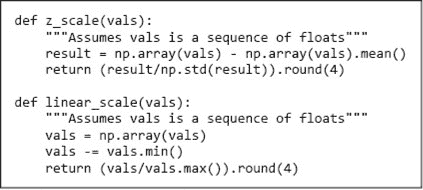

图 25-13 缩放属性

调用`test_teeth('dentalFormulas.csv', 3, 40, z_scale)`打印

```py
Badger, Bear, Cougar, Dog, Fox, Fur seal, Grey seal, Human, Jaguar, Lion, Mink, Mole, Pig, Raccoon, Red bat, Sea lion, Skunk, Wolf

Guinea pig, Kangaroo, Mouse, Porcupine, Rabbit, Rat, Squirrel, Woodchuck

Cow, Deer, Elk, Moose
```

这种聚类如何与这些哺乳动物相关的特征并不明显，但至少它并不是仅仅通过体重对哺乳动物进行分组。

回想一下，我们在本节开始时假设哺乳动物的牙齿特征与其饮食之间存在关系。 图 25-14 包含了一个 CSV 文件`diet.csv`的摘录，关联了哺乳动物及其饮食偏好。

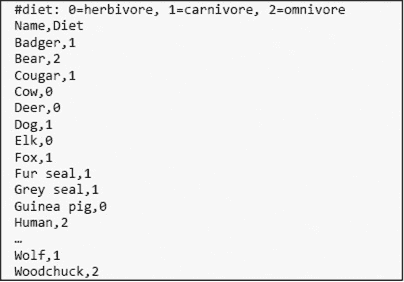

图 25-14 CSV 文件的开始，用于按饮食分类哺乳动物

我们可以使用`diet.csv`中的信息来看我们生成的聚类与饮食之间的关系。 图 25-15 中的代码正是这样做的。

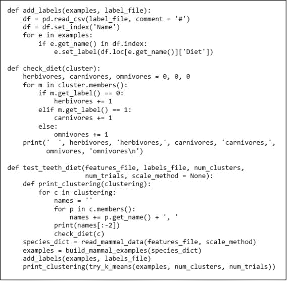

图 25-15 将聚类与标签相关联

当运行`test_teeth_diet('dentalFormulas.csv', ‘diet.csv', 3, 40, z_scale)`时，它打印了

```py
Badger, Bear, Cougar, Dog, Fox, Fur seal, Grey seal, Human, Jaguar, Lion, Mink, Mole, Pig, Raccoon, Red bat, Sea lion, Skunk, Wolf
   0 herbivores, 13 carnivores, 5 omnivores

Guinea pig, Kangaroo, Mouse, Porcupine, Rabbit, Rat, Squirrel, Woodchuck
   3 herbivores, 0 carnivores, 5 omnivores

Cow, Deer, Elk, Moose
   4 herbivores, 0 carnivores, 0 omnivores
```

使用 z 缩放的聚类（线性缩放产生相同的聚类）并没有完美地根据动物的饮食习惯进行划分，但它与它们的饮食确实相关。它很好地将食肉动物与草食动物分开，但杂食动物出现的地方没有明显的模式。这表明，除了牙齿和体重外，可能还需要其他特征来区分杂食动物与草食动物和食肉动物。

## 25.5 本章引入的术语

+   欧几里得均值

+   不相似性

+   重心

+   k 均值聚类

+   标准正态分布

+   z 缩放

+   线性缩放

+   最小-最大缩放

+   线性插值
