# 第二十七章：分类方法

监督机器学习最常见的应用是构建分类模型。**分类模型**或分类器用于将示例标记为属于有限类别集中的一个。例如，判断一封电子邮件是否为垃圾邮件就是一个分类问题。在文献中，这些类别通常称为**类**（因此得名分类）。我们也可以将一个示例描述为属于某个类或具有**标签**。

在**单类学习**中，训练集仅包含来自一个类的示例。目标是学习一个模型，预测示例是否属于该类。当很难找到不在该类之外的训练示例时，单类学习非常有用。单类学习常用于构建异常检测器，例如，检测计算机网络上以前未见过的攻击类型。

在**二分类学习**（通常称为**二元分类**）中，训练集包含来自正负两个类的示例，目标是找到一个边界将这两个类分开。**多类学习**涉及找到将多个类别彼此分开的边界。

在本章中，我们研究两种广泛使用的监督学习方法来解决分类问题：k-近邻和回归。在此之前，我们先讨论如何评估这些方法产生的分类器的问题。

本章中的代码假设了导入语句

```py
import pandas as pd
import numpy as np
import matplotlib.pyplot as plt
import random
import sklearn.linear_model as sklm
import sklearn.metrics as skm
```

## 26.1 评估分类器

阅读过第二十章的朋友可能会记得，该章的一部分讨论了选择线性回归的次数的问题，1) 提供对可用数据的合理拟合，2) 有合理的机会对尚未见过的数据做出良好的预测。使用监督机器学习训练分类器时同样会出现这些问题。

我们首先将数据分为两个集合，一个训练集和一个**测试集**。训练集用于学习模型，测试集用于评估该模型。当我们训练分类器时，我们试图最小化**训练误差**，即在训练集中对示例分类时的错误，前提是满足某些约束。这些约束旨在提高模型在尚未见过的数据上表现良好的概率。让我们用图示来看一下。

图 26-1 左侧的图表显示了 60 位（模拟）美国公民的投票模式。x 轴表示选民家距离马萨诸塞州波士顿的距离，y 轴表示选民的年龄。星形标记表示通常投票给民主党的选民，三角形标记表示通常投票给共和党的选民。右侧的图表在图 26-1 中展示了包含随机选择的 30 位选民的训练集。实线和虚线表示两个群体之间的两个可能边界。基于实线的模型中，线下的点被分类为民主党选民；基于虚线的模型中，线左侧的点被分类为民主党选民。

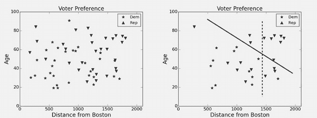

图 26-1 选民偏好的图

这两个边界都不能完美分隔训练数据。两个模型的训练错误显示在图 26-2 中的**混淆矩阵**里。每个矩阵的左上角显示被分类为民主党的例子的数量，这些例子实际上也是民主党，即真正的正例。左下角显示被分类为民主党的例子的数量，但这些例子实际上是共和党，即假阳性。右侧列显示了顶部的假阴性数量和底部的真正负例数量。

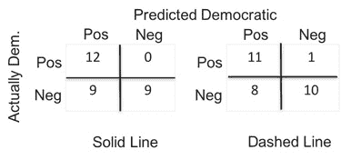

图 26-2 混淆矩阵

每个分类器在训练数据上的**准确性**可以计算为


在这种情况下，每个分类器的准确率为`0.7`。哪个更好地拟合了训练数据？这取决于我们是否更关注将共和党选民错误分类为民主党选民，或反之亦然。

如果我们愿意画出更复杂的边界，就可以得到一个更准确分类训练数据的分类器。例如，图 26-3 中所示的分类器在训练数据上的准确率约为 0.83，如图的左侧图所示。然而，正如我们在第二十章的线性回归讨论中看到的，模型越复杂，就越有可能出现对训练数据的过拟合。图 26-3 右侧的图展示了如果将复杂模型应用于保留集，会发生什么——准确率下降至`0.6`。

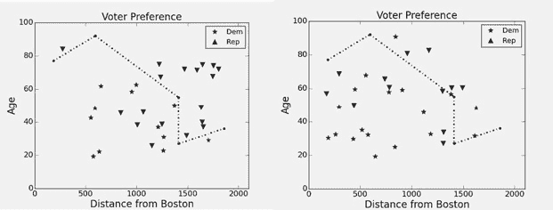

图 26-3 更复杂的模型

当两个类别的大小大致相等时，准确度是一种合理的评估分类器的方法。但在类别严重**不平衡**的情况下，准确度是一种糟糕的评估方式。想象一下，你被指派评估一个分类器，该分类器预测某种潜在致命疾病，该疾病在大约 `0.1%` 的待测人群中出现。准确度并不是一个特别有用的统计数据，因为仅仅通过宣称所有患者无病，就可以达到 `99.9%` 的准确率。对那些负责支付治疗费用的人来说，该分类器可能看起来很好（没人会接受治疗！），但对于那些担心自己可能患有该疾病的人来说，这个分类器可能看起来就没那么好了。

幸运的是，有关分类器的统计数据能够在类别不平衡时提供洞见：


**灵敏度**（在某些领域称为 **召回率**）是真阳性率，即正确识别为阳性的比例。**特异性**是真阴性率，即正确识别为阴性的比例。**正预测值**是被分类为阳性的示例真正为阳性的概率。**负预测值**是被分类为阴性的示例真正为阴性的概率。

这些统计测量的实现以及一个使用它们生成一些统计数据的函数在 图 26-4 中。我们将在本章稍后使用这些函数。

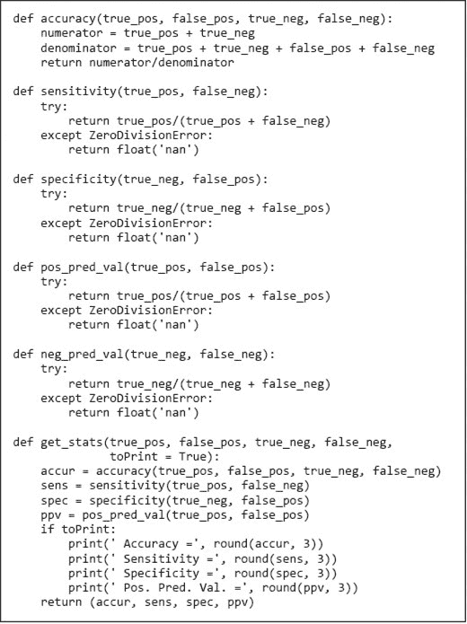

图 26-4 评估分类器的函数

## 26.2 预测跑者的性别

在本书早些时候，我们使用波士顿马拉松的数据来说明许多统计概念。现在我们将使用相同的数据来说明各种分类方法的应用。任务是根据跑者的年龄和完成时间预测其性别。

函数 `build_marathon_examples` 在 图 26-6 中从如 图 26-5 所示格式的 CSV 文件中读取数据，然后构建一组示例。每个示例是类 `Runner` 的一个实例。每个跑者都有一个标签（性别）和一个特征向量（年龄和完成时间）。在 `Runner` 中唯一有趣的方法是 `feature_dist`。它返回两个跑者特征向量之间的欧几里得距离。


图 26-5 `bm_results2012.csv` 的前几行

下一步是将示例分成训练集和保留的测试集。像往常一样，我们使用`80%`的数据进行训练，使用剩下的`20%`进行测试。这是通过图 26-6 底部的函数`divide_80_20`完成的。请注意，我们随机选择训练数据。简单地选择数据的前`80%`会减少代码量，但这样做有可能无法代表整个集合。例如，如果文件按完成时间排序，我们将得到一个偏向于更优秀跑者的训练集。

我们现在准备看看使用训练集构建一个可以预测跑者性别的分类器的不同方法。检查发现，训练集中`58%`的跑者是男性。因此，如果我们总是猜测男性，我们应该期待`58%`的准确率。在查看更复杂分类算法的性能时，请牢记这一基线。

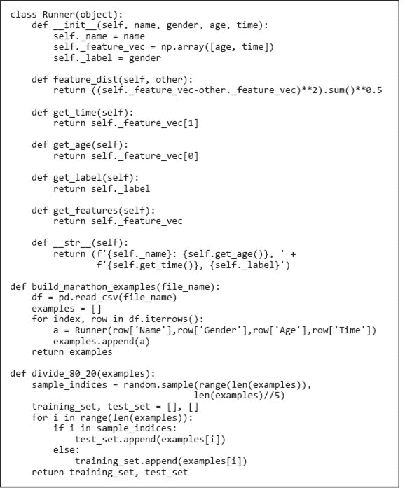

图 26-6 构建示例并将数据分为训练集和测试集

## 26.3 K-最近邻

**K-最近邻**（KNN）可能是所有分类算法中最简单的一种。“学习”模型只是训练示例本身。新的示例会根据它们与训练数据中示例的相似度被分配标签。

想象一下，你和朋友在公园散步，发现了一只鸟。你认为它是一只黄喉啄木鸟，但你的朋友则很确定它是一只金绿色啄木鸟。你急忙回家，翻找出你的鸟类书籍（或者，如果你在`35 岁`以下，去你喜欢的搜索引擎），开始查看标记好的鸟类图片。把这些标记好的图片看作训练集。没有一张图片完全匹配你看到的那只鸟，因此你选择了看起来最像你看到的鸟的五张（五个“最近邻”）。其中大多数是黄喉啄木鸟的照片——你宣布胜利。

KNN（和其他）分类器的一个弱点是，当训练数据中的示例分布与测试数据中的分布不同时，它们往往会给出较差的结果。如果书中鸟类照片的频率与您所在社区中该物种的频率相同，KNN 可能会表现良好。然而，假设尽管这种物种在你所在的社区同样常见，但你的书中有 30 张黄喉啄木鸟的照片，仅有一张金绿色啄木鸟的照片。如果使用简单的多数投票来确定分类，即使这些照片看起来与您看到的鸟不太相似，黄喉啄木鸟仍然会被选中。通过使用更复杂的投票方案，可以部分缓解这个问题，在这种方案中，k 个最近邻会根据它们与待分类示例的相似度加权。

图 26-7 中的函数实现了一个 k 最近邻分类器，根据跑步者的年龄和完成时间来预测跑步者的性别。该实现是暴力破解。函数 `find_k_nearest` 在 `example_set` 的示例数量上是线性的，因为它计算了 `example` 和 `example_set` 中每个元素之间的特征距离。函数 `k_nearest_classify` 使用简单的多数投票机制进行分类。`k_nearest_classify` 的复杂度为 `O(len(training)*len(test_set))`，因为它总共调用 `find_k_nearest` 函数 `len(test_set)` 次。

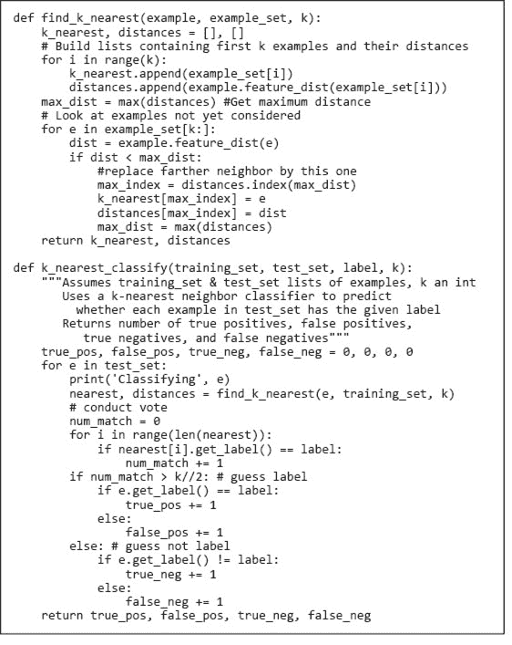

图 26-7 查找 k 最近邻

当代码

```py
examples = build_marathon_examples('bm_results2012.csv')
training, test_set = divide_80_20(examples)   
true_pos, false_pos, true_neg, false_neg =\
        k_nearest_classify(training, test_set, 'M', 9)
get_stats(true_pos, false_pos, true_neg, false_neg)
```

运行后，它打印了

```py
Accuracy = 0.65
Sensitivity = 0.715
Specificity = 0.563
Pos. Pred. Val. = 0.684
```

我们是否应该感到高兴，因为在给定年龄和完成时间的情况下，我们可以以 `65%` 的准确率预测性别？评估分类器的一种方法是将其与一个甚至不考虑年龄和完成时间的分类器进行比较。图 26-8 中的分类器首先使用 `training` 中的示例来估计在 `test_set` 中随机选择的示例属于 `label` 类的概率。利用这个先验概率，它然后随机分配一个标签给 `test_set` 中的每个示例。

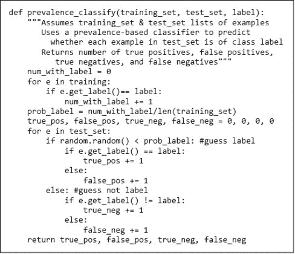

图 26-8 基于普遍性的分类器

当我们在同样的波士顿马拉松数据上测试 `prevalence_classify` 时，它打印了

```py
 Accuracy = 0.514
 Sensitivity = 0.593
 Specificity = 0.41
 Pos. Pred. Val. = 0.57
```

表明我们在考虑年龄和完成时间时获得了相当大的优势。

这种优势是有代价的。如果你运行 图 26-7 中的代码，你会注意到它需要相当长的时间才能完成。训练示例有 `17,233` 个，测试示例有 `4,308` 个，因此计算了近 `75` 百万的距离。这引发了一个问题：我们是否真的需要使用所有的训练示例。让我们看看如果我们简单地将训练数据按 `10` 的比例 **下采样** 会发生什么。

如果我们运行

```py
reduced_training = random.sample(training, len(training)//10)
true_pos, false_pos, true_neg, false_neg =\
        k_nearest_classify(reduced_training, test_set, 'M', 9)
get_stats(true_pos, false_pos, true_neg, false_neg)
```

它完成所需时间的一半，分类性能几乎没有变化：

```py
Accuracy = 0.638
Sensitivity = 0.667
Specificity = 0.599
Pos. Pred. Val. = 0.687
```

在实际操作中，当人们将 KNN 应用于大型数据集时，他们常常会对训练数据进行下采样。一个更常见的替代方法是使用某种快速近似 KNN 算法。

在上述实验中，我们将 `k` 设置为 `9`。我们并不是因为科学上的角色（我们太阳系中的行星数量），¹⁹⁸它的宗教意义（印度女神杜尔迦的形式数量），或它的社会学重要性（棒球阵容中的击球手数量）而选择这个数字。相反，我们通过使用 图 26-9 中的代码从训练数据中学习了 `k`，以搜索一个合适的 `k`。

外层循环测试一系列 `k` 的值。我们只测试奇数值，以确保在 `k_nearest_classify` 中投票时，总会有一个性别占多数。

内部循环使用**n 折交叉验证**测试每个 k 值。在循环的每次`num_folds`迭代中，原始训练集被分成新的训练集/测试集对。然后，我们计算使用 k 近邻和新训练集对新测试集分类的准确度。当我们退出内部循环时，计算`num_folds`折的平均准确度。

当我们运行代码时，生成了图 26-10 中的图。正如我们所见，`17`是导致 5 折交叉验证中最佳准确度的`k`值。当然，没有保证某个大于`21`的值会更好。然而，一旦`k`达到`9`，准确度就在合理的狭窄范围内波动，因此我们选择使用`9`。

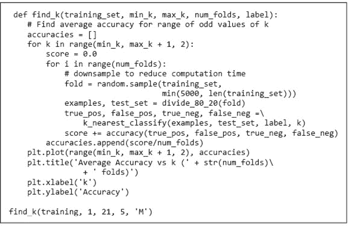

图 26-9 寻找合适的 k 值

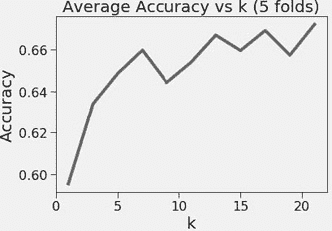

图 26-10 选择 k 值

## 26.4 基于回归的分类器

在第二十章中，我们使用线性回归构建了数据模型。我们可以在这里尝试同样的做法，使用训练数据为男性和女性分别构建模型。图 25-11 中的图是通过图 26-12 中的代码生成的。

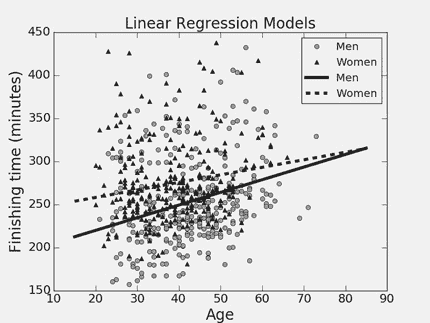

图 26-11 男性和女性的线性回归模型

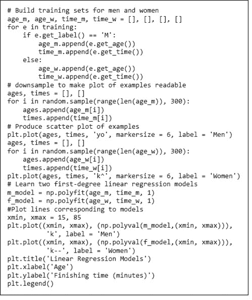

图 26-12 生成并绘制线性回归模型

看一眼图 26-11 就足以看到，线性回归模型仅解释了数据中很小一部分的方差。¹⁹⁹ 尽管如此，可以利用这些模型构建分类器。每个模型试图捕捉年龄与完成时间之间的关系。这种关系对男性和女性是不同的，我们可以利用这一点来构建分类器。给定一个示例，我们会问年龄与完成时间之间的关系更接近男性跑者的模型（实线）还是女性跑者的模型（虚线）所预测的关系。这个想法在图 26-13 中得到了实现。

当代码运行时，它打印

```py
Accuracy = 0.614
Sensitivity = 0.684
Specificity = 0.523
Pos. Pred. Val. = 0.654 
```

结果比随机更好，但不如 KNN。

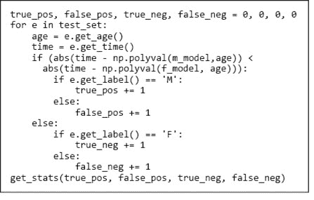

图 26-13 使用线性回归构建分类器

你可能会想知道为什么我们采用这种间接的方法来使用线性回归，而不是明确使用年龄和时间的某种函数作为因变量，使用实际数字（比如`0`代表女性，`1`代表男性）作为自变量。

我们可以轻松地使用`polyfit`构建这样的模型，将年龄和时间的函数映射到一个实数。然而，预测某个跑步者处于男性和女性之间的中间位置意味着什么呢？比赛中有双性人吗？也许我们可以将 y 轴解释为一个跑步者是男性的概率。其实并不是。甚至没有保证将`polyval`应用于模型会返回一个介于`0`和`1`之间的值。

幸运的是，有一种回归形式，**逻辑回归**，²⁰⁰专门设计用于预测事件的概率。Python 库`sklearn`²⁰¹提供了良好的逻辑回归实现，以及与机器学习相关的许多其他有用函数和类。

模块`sklearn.linear_model`包含类`LogisticRegression`。该类的`__init__`方法有大量参数，用于控制解决回归方程所用的优化算法等。它们都有默认值，在大多数情况下，使用这些默认值是可以的。

`LogisticRegression`类的核心方法是`fit`。该方法接受两个相同长度的序列（元组、列表或数组）作为参数。第一个是特征向量的序列，第二个是相应标签的序列。在文献中，这些标签通常称为**结果**。

`fit`方法返回一个类型为`LogisticRegression`的对象，该对象已为特征向量中的每个特征学习了系数。这些系数通常称为**特征权重**，捕捉了特征与结果之间的关系。正特征权重表明特征与结果之间存在正相关，而负特征权重表明负相关。权重的绝对值与相关性的强度有关。²⁰² 这些权重的值可以通过`LogisticRegression`的`coef_`属性访问。由于可以在多个结果（在包的文档中称为类）上训练`LogisticRegression`对象，因此`coef_`的值是一个序列，其中每个元素包含与单个结果相关的权重序列。例如，表达式`model.coef_[1][0]`表示第二个结果的第一个特征的系数值。

一旦学习了系数，就可以使用`LogisticRegression`类的`predict_proba`方法来预测与特征向量相关的结果。`predict_proba`方法接受一个参数（除了`self`），即特征向量的序列。它返回一个数组，其中每个特征向量对应一个数组。返回数组中的每个元素包含对应特征向量的预测。预测为数组的原因是它包含构建`model`时所用每个标签的概率。

图 26-14 中的代码简单地展示了这一切是如何运作的。它首先创建了一个包含`100,000`个示例的列表，每个示例都有一个长度为`3`的特征向量，并标记为`'A'`、`'B'`、`'C'`或`‘D'`。每个示例的前两个特征值来自标准差为`0.5`的高斯分布，但均值根据标签不同而变化。第三个特征的值是随机选择的，因此不应在预测标签时有用。在创建示例后，代码生成一个逻辑回归模型，打印特征权重，最后打印与四个示例相关的概率。

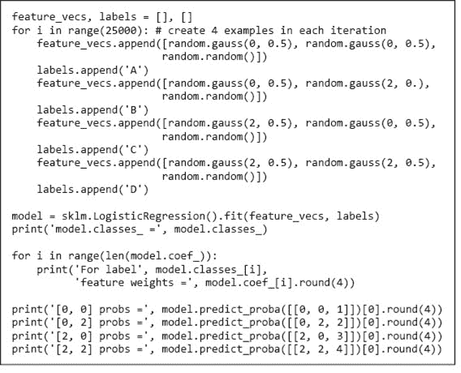

图 26-14 使用`sklearn`进行多类逻辑回归

当我们运行图 26-14 中的代码时，它打印了

```py
model.classes_ = ['A' 'B' 'C' ‘D']
For label A feature weights = [-4.7229 -4.3618  0.0595]
For label B feature weights = [-3.3346  4.7875  0.0149]
For label C feature weights = [ 3.7026 -4.4966 -0.0176]
For label D feature weights = [ 4.3548  4.0709 -0.0568]
[0, 0] probs = [9.998e-01 0.000e+00 2.000e-04 0.000e+00]
[0, 2] probs = [2.60e-03 9.97e-01 0.00e+00 4.00e-04]
[2, 0] probs = [3.000e-04 0.000e+00 9.996e-01 2.000e-04]
[2, 2] probs = [0.000e+00 5.000e-04 2.000e-04 9.992e-01]
```

首先让我们看看特征权重。第一行告诉我们前两个特征的权重大致相同，并且与示例标签为`'A'`的概率呈负相关。²⁰³也就是说，前两个特征值越大，示例为`'A'`的可能性就越小。我们预计在预测标签时价值较小的第三个特征，其相对于其他两个值的值较小，表明它相对不重要。第二行告诉我们，示例标签为`'B'`的概率与第一个特征的值呈负相关，而与第二个特征呈正相关。同样，第三个特征的值相对较小。第三行和第四行是前两行的镜像。

现在，让我们来看与四个示例相关的概率。概率的顺序对应于属性`model.classes_`中结果的顺序。正如你所希望的，当我们预测与特征向量`[0, 0]`相关的标签时，`'A'`的概率非常高，而`'D'`的概率非常低。类似地，`[2, 2]`对`'D'`的概率非常高，而对`'A'`的概率非常低。与中间两个示例相关的概率也符合预期。

图 26-15 中的示例与图 26-14 中的示例相似，只是我们只创建了两个类`'A'`和`'D'`的示例，并且不包括不相关的第三个特征。

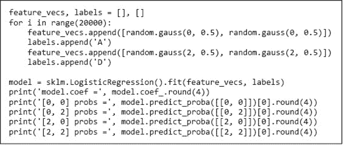

图 26-15 二分类逻辑回归示例

当我们运行图 26-15 中的代码时，它打印了

```py
model.coef = [[6.7081 6.5737]]
[0, 0] probs = [1\. 0.]
[0, 2] probs = [0.5354 0.4646]
[2, 0] probs = [0.4683 0.5317]
[2, 2] probs = [0\. 1.]
```

注意，`coef_`中只有一组权重。当使用`fit`为二元分类器生成模型时，它只为一个标签生成权重。这是足够的，因为一旦`proba`计算出某个示例属于任一类的概率，就可以确定它属于另一类的概率——因为这两者的概率之和必须为`1`。`coef_`中的权重对应于哪一个标签？由于权重是正的，它们必须对应于`'D'`，因为我们知道特征向量中的值越大，示例越可能属于`'D'`类。传统上，二元分类使用标签`0`和`1`，分类器使用`1`的权重。在这种情况下，`coef_`包含与最大标签相关联的权重，正如`str`类型的`>`运算符所定义的。

让我们回到波士顿马拉松的例子。图 26-16 中的代码使用`LogisticRegression`类为我们的波士顿马拉松数据构建和测试模型。函数`apply_model`接受四个参数：

+   `model`：一个`LogisticRegression`类型的对象，它已经构建了一个拟合模型。

+   `test_set`：一系列示例。这些示例具有与构建`model`拟合模型所使用的特征和标签相同的类型。

+   `label`：正类的标签。`apply_model`返回的混淆矩阵信息是相对于这个标签的。

+   `prob`：用于决定在`test_set`中将哪个标签分配给示例的概率阈值。默认值为`0.5`。由于它不是常量，`apply_model`可以用来研究假阳性和假阴性之间的权衡。

`apply_model`的实现首先使用列表推导（第 5.3.2 节）构建一个列表，其元素是`test_set`中示例的特征向量。然后它调用`model.predict_proba`获取与每个特征向量预测相对应的对的数组。最后，它将预测与与该特征向量相关的示例的标签进行比较，并跟踪并返回真正例、假正例、真负例和假负例的数量。

当我们运行代码时，它打印出：

```py
Feature weights for label M: age = 0.055, time = -0.011
Accuracy = 0.636
Sensitivity = 0.831
Specificity = 0.377
Pos. Pred. Val. = 0.638
```

让我们将这些结果与我们使用 KNN 时获得的结果进行比较：

```py
Accuracy = 0.65
Sensitivity = 0.715
Specificity = 0.563
Pos. Pred. Val. = 0.684
```

准确率和正预测值相似，但逻辑回归具有更高的敏感性和更低的特异性。这使得这两种方法难以比较。我们可以通过调整`apply_model`使用的概率阈值，使其具有与 KNN 大致相同的敏感性，从而解决这个问题。我们可以通过迭代`prob`的值，直到获得接近 KNN 的敏感性的概率。

如果我们用`prob = 0.578`来调用`apply_model`而不是`0.5`，我们会得到以下结果。

```py
Accuracy = 0.659
Sensitivity = 0.715
Specificity = 0.586
Pos. Pred. Val. = 0.695
```

换句话说，这些模型的性能相似。

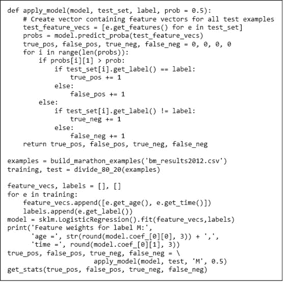

图 26-16 使用逻辑回归预测性别

由于探索改变逻辑回归模型的决策阈值的影响可能会很复杂，人们常常使用称为**接收器操作特征曲线**，²⁰⁴或**ROC 曲线**，来可视化敏感性和特异性之间的权衡。该曲线绘制了多个决策阈值下的真实正例率（敏感性）与假正例率（`1` – 特异性）的关系。

ROC 曲线通常通过计算曲线下的面积（**AUROC**，常缩写为**AUC**）来彼此比较。该面积等于模型将随机选择的正例分配更高的正概率的概率，相对于随机选择的负例。这被称为模型的**区分能力**。请记住，区分能力并不反映概率的准确性，通常称为**校准**。例如，我们可以将所有估计的概率除以`2`，而不会改变区分能力，但肯定会改变估计的准确性。

图 26-17 中的代码将逻辑回归分类器的 ROC 曲线绘制为实线，图 26-18。虚线是随机分类器的 ROC——一个随机选择标签的分类器。我们本可以先插值（因为我们只有离散的点）然后积分 ROC 曲线来计算 AUROC，但我们懒惰地直接调用了函数`sklearn.metrics.auc`。

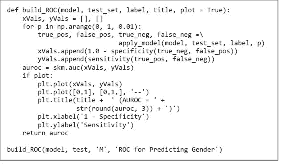

图 26-17 构建 ROC 曲线并找到 AUROC


图 26-18 ROC 曲线和 AUROC

**指尖练习**：编写代码以绘制 ROC 曲线并计算在 200 名随机选择的竞争者上测试时所构建模型的 AUROC。使用该代码调查训练样本数量对 AUROC 的影响（尝试从`10`变化到`1010`，增量为`50`）。

## 26.5 生存于*泰坦尼克号*

在 1912 年 4 月 15 日的早晨，RMS *泰坦尼克号*撞上冰山并在北大西洋沉没。大约有`1,300`名乘客在船上，`832`人在这场灾难中遇难。许多因素导致了这场灾难，包括导航错误、救生艇不足以及附近船只反应缓慢。个别乘客的生存与否有随机因素，但远非完全随机。有一个有趣的问题是，是否可以仅通过船上乘客名单的信息建立一个合理的生存预测模型。

在本节中，我们从一个包含`1046`名乘客信息的 CSV 文件构建分类模型。²⁰⁵ 文件的每一行包含关于单个乘客的信息：舱位等级（1 等、2 等或 3 等）、年龄、性别、乘客是否在灾难中幸存以及乘客的姓名。CSV 文件的前几行是

```py
Class,Age,Gender,Survived,Last Name,Other Names
1,29.0,F,1,Allen, Miss. Elisabeth Walton
1,0.92,M,1,Allison, Master. Hudson Trevor
1,2.0,F,0,Allison, Miss. Helen Loraine
```

在构建模型之前，快速查看一下数据，可能是个好主意。这样做通常能提供有关各种特征在模型中可能发挥的作用的有用见解。执行代码

```py
manifest = pd.read_csv('TitanicPassengers.csv')
print(manifest.corr().round(2))
```

生成相关性表

```py
          Class   Age  Survived
Class      1.00 -0.41     -0.32
Age       -0.41  1.00     -0.06
Survived  -0.32 -0.06      1.00
```

为什么`Gender`没有出现在这个表中？因为它在 CSV 文件中没有编码为数字。我们来处理一下，看看相关性是什么样的。

```py
manifest['Gender'] = (manifest['Gender'].
                      apply(lambda g: 1 if g == 'M' else 0))
print(manifest.corr().round(2))
```

生成

```py
          Class   Age  Gender  Survived
Class      1.00 -0.41    0.14     -0.32
Age       -0.41  1.00    0.06     -0.06
Gender     0.14  0.06    1.00     -0.54
Survived  -0.32 -0.06   -0.54      1.00
```

`class`和`Gender`与`Survived`之间的负相关性表明，确实有可能利用清单中的信息建立预测模型。（因为我们将男性编码为 1，女性编码为 0，`Survived`和`Gender`的负相关性告诉我们，女性比男性更可能生存。同样，`Class`的负相关性表明，头等舱的乘客更安全。）

现在，让我们使用逻辑回归构建一个模型。我们选择使用逻辑回归是因为

+   这是最常用的分类方法。

+   通过检查逻辑回归生成的权重，我们可以获得一些关于为什么某些乘客比其他乘客更可能生存的见解。

图 26-19 定义了`Passenger`类。该代码中唯一感兴趣的地方是舱位等级的编码。虽然 CSV 文件将舱位等级编码为整数，但它实际上是类别的简写。舱位等级不像数字那样运作，例如，一个头等舱加一个二等舱并不等于一个三等舱。我们使用三个二进制特征（每种可能的舱位等级一个）对舱位等级进行编码。对于每位乘客，这三个变量中的一个被设置为`1`，其他两个被设置为`0`。

这是机器学习中经常出现的问题的一个例子。**类别**特征（有时称为名义特征）是描述许多事物的自然方式，例如，跑步者的国家。用整数替换这些特征是很简单的，例如，我们可以根据国家的 ISO 3166-1 数字代码来选择表示，例如，巴西为 076，英国为 826，委内瑞拉为 862。这样做的问题在于，回归会将这些视为数值变量，从而对国家施加无意义的排序，导致委内瑞拉距离英国比距离巴西更近。

通过将分类变量转换为二元变量可以避免这个问题，就像我们处理舱位类时所做的那样。这样做的一个潜在问题是，它可能导致非常长且稀疏的特征向量。例如，如果一家医院配发 `2000` 种不同的药物，我们将把一个分类变量转换为 `2000` 个二元变量，每种药物一个。

图 26-20 包含使用 Pandas 从文件中读取数据并根据 *泰坦尼克号* 数据构建示例集的代码。

现在我们有了数据，可以使用构建波士顿马拉松数据模型时使用的相同代码构建逻辑回归模型。然而，由于数据集样本相对较少，我们需要关注使用之前采用的评估方法。完全有可能得到一个不具代表性的 `80-20` 数据划分，然后生成误导性结果。

为了降低风险，我们创建了许多 `80-20` 划分（每个划分使用在 图 26-6 中定义的 `divide_80_20` 函数创建），为每个划分构建和评估一个分类器，然后报告均值和 `95%` 置信区间，使用 图 26-21 和 图 26-22 中的代码。

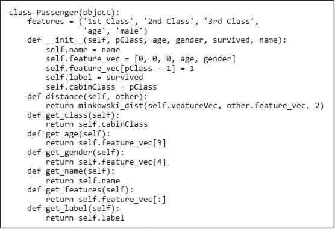

图 26-19 类 `Passenger`


图 26-20 读取 *泰坦尼克号* 数据并构建示例列表²⁰⁷

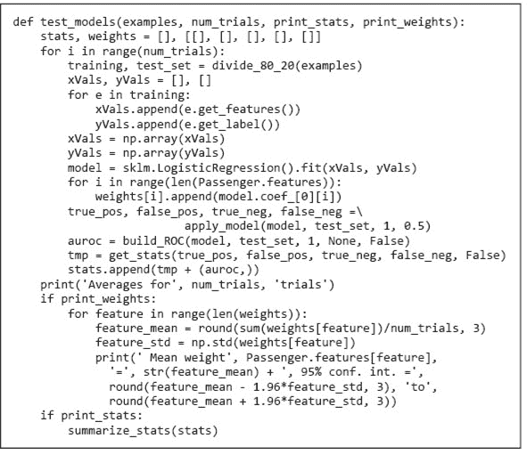

图 26-21 *泰坦尼克号* 生存测试模型

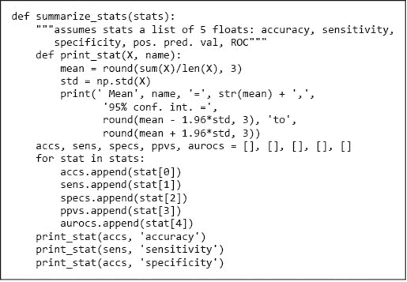

图 26-22 打印有关分类器的统计信息

调用 `test_models(build_Titanic_examples(), 100, True, False)` 打印了

```py
Averages for 100 trials
 Mean accuracy = 0.783, 95% conf. int. = 0.736 to 0.83
 Mean sensitivity = 0.702, 95% conf. int. = 0.603 to 0.801
 Mean specificity = 0.783, 95% conf. int. = 0.736 to 0.83
 Mean pos. pred. val. = 0.702, 95% conf. int. = 0.603 to 0.801
 Mean AUROC = 0.839, 95% conf. int. = 0.789 to 0.889
```

看起来这小组特征足以很好地预测生存情况。为了了解原因，让我们看看各种特征的权重。我们可以通过调用 `test_models(build_Titanic_examples(), 100, False, True)` 来做到这一点，它打印了

```py
Averages for 100 trials
 Mean weight 1st Class = 1.145, 95% conf. int. = 1.02 to 1.27
 Mean weight 2nd Class = -0.083, 95% conf. int. = -0.185 to 0.019
 Mean weight 3rd Class = -1.062, 95% conf. int. = -1.179 to -0.945
 Mean weight age = -0.034, 95% conf. int. = -0.04 to -0.028
 Mean weight male = -2.404, 95% conf. int. = -2.542 to -2.266
```

当谈到船难生存时，似乎拥有财富是有用的（*泰坦尼克号*的一等舱舱位在今天的美国美元中相当于超过$70,000），年轻和女性也是优势。

## 26.6 总结

在最后三章中，我们几乎只是触及了机器学习的表面。

这同样适用于本书第二部分中介绍的许多其他主题。我试图让你感受到利用计算更好理解世界所涉及的思维方式——希望你能找到独立研究该主题的方法。

## 26.7 章节中引入的术语

+   分类模型

+   类别

+   标签

+   单类学习

+   两类学习

+   二元分类

+   多类学习

+   测试集

+   训练误差

+   混淆矩阵

+   准确率

+   类别不平衡

+   敏感性（召回率）

+   特异性（精准度）

+   正预测值（PPV）

+   k 最近邻（KNN）

+   下采样

+   阴性预测值

+   n 倍交叉验证

+   逻辑回归

+   结果

+   特征权重

+   ROC 曲线

+   AUROC

+   模型区分度

+   校准

+   类别特征
