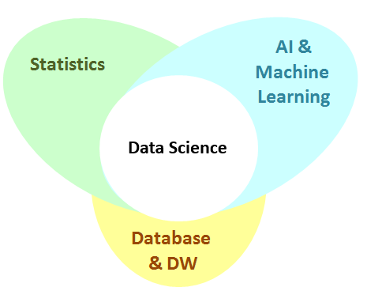

地图 > 数据科学

# 数据科学

数据科学（又称**数据挖掘**）是通过数据分析来解释过去和预测未来的科学。数据科学是一个多学科领域，结合了统计学、机器学习、人工智能和数据库技术。数据科学应用的价值通常被估计为非常高。许多企业在多年的运营中积累了大量的数据，数据科学能够从这些数据中提取非常有价值的知识。企业随后可以将提取的知识转化为更多的客户、更多的销售和更大的利润。在工程和医学领域也是如此。

**统计学**是收集、分类、总结、组织、分析和解释数据的科学。**人工智能**是研究计算机算法，涉及模拟智能行为，以执行通常认为需要智能的活动。**机器学习**是研究计算机算法，通过经验自动改进的学习。**数据库**是收集、存储和管理数据的科学技术，使用户可以检索、添加、更新或删除这些数据。**数据仓库**是收集、存储和管理数据的科学技术，具有先进的多维报告服务，支持决策过程。
