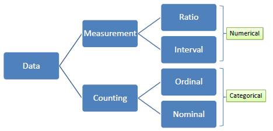
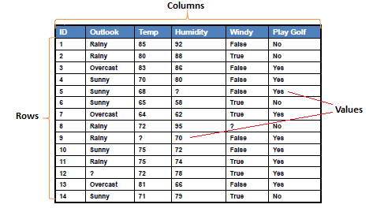
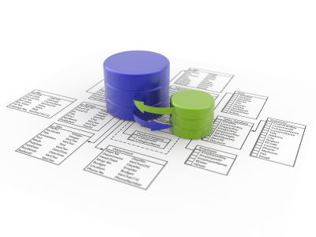
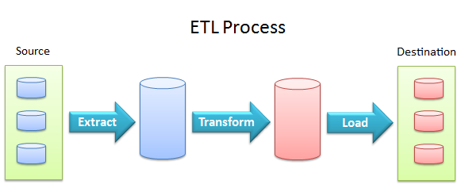

地图 > 问题定义 > 数据准备 > 数据探索 > 建模 > 评估 > 部署

# 数据准备

数据准备是从一个或多个数据源构建数据集，用于探索和建模的过程。从一个初始数据集开始熟悉数据，发现数据的第一手信息，并对可能的数据质量问题有一个良好的理解是一个稳健的做法。数据准备通常是一个耗时且容易出错的过程。古老的谚语“垃圾进垃圾出”特别适用于那些数据科学项目，其中数据收集了许多无效、超出范围和缺失值。分析未经仔细筛选这些问题的数据可能会产生极具误导性的结果。因此，数据科学项目的成功在很大程度上取决于准备好的数据的质量。

# 数据

**数据**通常是测量（数值）或计数（分类）的结果。**变量**充当数据的占位符。有两种类型的变量，*数值*和*分类*。

**数值**或**连续** **变量**是可以接受有限或无限区间内的任何值的变量（例如，身高、体重、温度、血糖等）。数值数据有两种类型，*区间*和*比率*。区间尺度上的数据可以相加和相减，但不能有意义地相乘或相除，因为没有真正的零点。例如，我们不能说一天比另一天热两倍。另一方面，比率尺度上的数据有真正的零点，可以相加、相减、相乘或相除（例如，体重）。

**分类**或**离散** **变量**是可以接受两个或更多值（类别）的变量。分类数据有两种类型，*名义*和*序数*。名义数据在类别中没有固有的排序。例如，"性别"有两个类别，男性和女性。相反，序数数据在类别中有固有的排序。例如，"能量水平"有三个有序类别（低、中、高）。

# 数据集

数据集是通常以表格形式呈现的数据集合。每列代表一个特定的变量，每行对应数据的一个成员。

列，行和值有一些替代方案。

+   列，字段，属性，变量

+   行，记录，对象，案例，实例，示例，向量

+   值，数据

在预测建模中，**预测变量**或**属性**是输入变量，**目标**或**类属性**是输出变量，其值由预测变量的值和预测模型的函数确定。

# 数据库

数据库收集、存储和管理信息，以便用户可以检索、添加、更新或删除这些信息。它将信息以行和列的形式呈现在表中。表被称为关系，因为它是相同类型对象（行）的集合。表中的数据可以根据公共键或概念相关联，从相关表中检索相关数据的能力是关系数据库术语的基础。数据库管理系统（**DBMS**）处理数据存储、维护和检索的方式。大多数数据科学工具包通过 **ODBC**（开放数据库连接）或 **JDBC**（Java 数据库连接）接口连接到数据库。

**SQL**（结构化查询语言）是一种管理和操纵关系数据库管理系统（RDBMS）中的数据的数据库计算机语言。

SQL 数据定义语言（**DDL**）允许创建、修改或删除数据库表。我们还可以定义索引（键），指定表之间的链接，并强制执行数据库表之间的约束。

+   CREATE TABLE：创建新表

+   ALTER TABLE：修改表

+   DROP TABLE：删除表

+   CREATE INDEX：创建索引

+   DROP INDEX：删除索引

SQL 数据操纵语言（**DML**）是一种使用户能够访问和操作数据的语言。

+   SELECT：从数据库检索数据

+   INSERT INTO：将新数据插入数据库

+   UPDATE：修改数据库中的数据

+   DELETE：删除数据库中的数据

# ETL（抽取、转换和加载）

ETL 从数据源中提取数据，并使用一组转换函数将其加载到数据目的地。

+   **数据提取**提供了从各种数据源（如平面文件、关系数据库、流数据、XML 文件和 ODBC/JDBC 数据源）中提取数据的能力。

+   **数据转换**提供了清理、转换、聚合、合并和拆分数据的能力。

+   **数据加载**提供了通过更新、插入或删除语句或批量加载数据到目标数据库的能力。

|  | 信用违约数据集 |  |
| --- | --- | --- |
