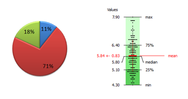

地图 > 数据科学 > 解释过去 > 数据探索 > 单变量分析

# -   单变量分析

-   单变量分析逐个探索变量（属性）。变量可以是 *分类* 或 *数值* 的。针对每种类型的变量，都有不同的统计和可视化技术进行研究。数值变量可以通过一种称为 分箱 或离散化的过程转换为分类对应物。也可以通过一种称为 编码 的过程将分类变量转换为其数值对应物。最后，在挖掘数据中适当处理 缺失值 是一个重要问题。

1.  分类变量

1.  数值变量

<map name="FPMap0"></map>
